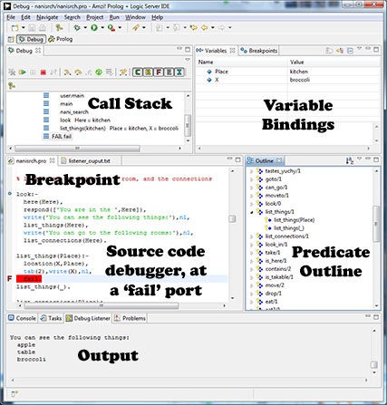
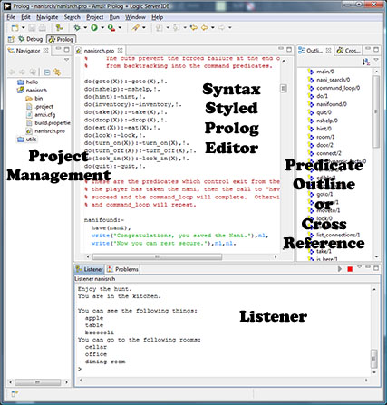

\
Amzi! Prolog Source Code Debugger

# Prolog Tools

------------------------------------------------------------------------

For either learning or deploying Prolog we recommend:

### [Amzi! Prolog + Logic Server](../AmziPrologLogicServer/index.php)\
FREE (IDE only)

The Amzi! Prolog IDE, with it's source code debugger, is an excellent tool for getting a solid understanding of Prolog's dynamic variable binding and built-in search.

The Amzi! Logic Server provides the tools for deploying Prolog with other development tools.

The full Amzi! Prolog + Logic Server package is available on either:

- an individual basis or
- an institutional site license.

### [Download](/AmziPrologLogicServer/store.php)

Amzi! Prolog IDE\

\
\
\

### Other resources for learning Prolog

Checkout the numerous articles on Prolog:

### [Prolog Articles](/articles/index.htm)

and the archives from the years when Amzi! was editor of the AI Expert magazine. Many of the AI techniques are illustrated with Prolog code.

### [AI Newsletter](http://www.ainewsletter.com)
