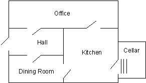

------------------------------------------------------------------------

# 2. Facts

This chapter describes the basic Prolog facts. They are the simplest form of Prolog predicates, and are similar to records in a relational database. As we will see in the next chapter they can be queried like database records.

The syntax for a fact is

```prolog
pred(arg1, arg2, ...  argN).
```

where

pred
The name of the predicate

arg1, ...
The arguments

N
The arity

.
The syntactic end of all Prolog clauses

A predicate of arity 0 is simply

```prolog
pred.
```

The arguments can be any legal Prolog **term**. The basic Prolog terms are

integer
A positive or negative number whose absolute value is less than some implementation-specific power of 2

atom
A text constant beginning with a lowercase letter

variable
Begins with an uppercase letter or underscore (\_)

structure
Complex terms, which will be covered in chapter 9

Various Prolog implementations enhance this basic list with other data types, such as floating point numbers, or strings.

The Prolog character set is made up of

- Uppercase letters, A-Z
- Lowercase letters, a-z
- Digits, 0-9
- Symbols, + - \* / \\ ^ , . ~ : . ? @ \# \$ &

Integers are made from digits. Other numerical types are allowed in some Prolog implementations.

Atoms are usually made from letters and digits with the first character being a lowercase letter, such as

```prolog
hello
twoWordsTogether
x14
```

For readability, the underscore (\_), but not the hyphen (-), can be used as a separator in longer names. So the following are legal.

```prolog
a_long_atom_name
z_23
```

The following are not legal atoms.

```prolog
no-embedded-hyphens
123nodigitsatbeginning
_nounderscorefirst
Nocapsfirst
```

Use single quotes to make any character combination a legal atom as follows.

```prolog
'this-hyphen-is-ok'
'UpperCase'
'embedded blanks'
```

Do not use double quotes ("") to build atoms. This is a special syntax that causes the character string to be treated as a list of ASCII character codes.

Atoms can also be legally made from symbols, as follows.

```prolog
-->
++
```

Variables are similar to atoms, but are distinguished by beginning with either an uppercase letter or the underscore (\_).

```prolog
X
Input_List
_4th_argument
Z56
```

Using these building blocks, we can start to code facts. The predicate name follows the rules for atoms. The arguments can be any Prolog terms.

Facts are often used to store the data a program is using. For example, a business application might have customer/3.

```prolog
customer('John Jones', boston, good_credit).
customer('Sally Smith', chicago, good_credit).
```

The single quotes are needed around the names because they begin with uppercase letters and because they have embedded blanks.

Another example is a windowing system that uses facts to store data about the various windows. In this example the arguments give the window name and coordinates of the upper left and lower right corners.

```prolog
window(main, 2, 2, 20, 72).
window(errors, 15, 40, 20, 78).
```

A medical diagnostic expert system might have disease/2.

```prolog
disease(plague, infectious).
```

A Prolog listener provides the means for dynamically recording facts and rules in the logicbase, as well as the means to **query** (call) them. The logicbase is updated by 'consult'ing or 'reconsult'ing program source. Predicates can also be typed directly into the listener, but they are not saved between sessions.

### Nani Search

We will now begin to develop Nani Search by defining the basic facts that are meaningful for the game. These include

- The rooms and their connections
- The things and their locations
- The properties of various things
- Where the player is at the beginning of the game



Figure 2.1. The rooms of Nani Search

Open a new source file and save it as 'myadven.pro', or whatever name you feel is appropriate. You will make your changes to the program in that source file. (A completed version of nanisrch.pro is in the Prolog samples directory, samples/prolog/misc_one_file.)

First we define the rooms with the predicate room/1, which has five clauses, all of which are facts. They are based on the game map in figure 2.1.

```prolog
room(kitchen).
room(office).
room(hall).
room('dining room').
room(cellar).
```

We define the locations of things with a two-argument predicate location/2. The first argument will mean the thing and the second will mean its location. To begin with, we will add the following things.

```prolog
location(desk, office).
location(apple, kitchen).
location(flashlight, desk).
location('washing machine', cellar).
location(nani, 'washing machine').
location(broccoli, kitchen).
location(crackers, kitchen).
location(computer, office).
```

The symbols we have chosen, such as kitchen and desk have meaning to us, but none to Prolog. The relationship between the arguments should also accurately reflect our meaning.

For example, the meaning we attach to location/2 is "The first argument is located in the second argument." Fortunately Prolog considers location(sink, kitchen) and location(kitchen, sink) to be different. Therefore, as long as we are consistent in our use of arguments, we can accurately represent our meaning and avoid the potentially ambiguous interpretation of the kitchen being in the sink.

We are not as lucky when we try to represent the connections between rooms. Let's start, however, with door/2, which will contain facts such as

```prolog
door(office, hall).
```

We would like this to mean "There is a connection from the office to the hall, or from the hall to the office."

Unfortunately, Prolog considers door(office, hall) to be different from door(hall, office). If we want to accurately represent a two-way connection, we would have to define door/2 twice for each connection.

```prolog
door(office, hall).
door(hall, office).
```

The strictness about order serves our purpose well for location, but it creates this problem for connections between rooms. If the office is connected to the hall, then we would like the reverse to be true as well.

For now, we will just add one-way doors to the program; we will address the symmetry problem again in the next chapter and resolve it in chapter 5.

```prolog
door(office, hall).
door(kitchen, office).
door(hall, 'dining room').
door(kitchen, cellar).
door('dining room', kitchen).
```

Here are some other facts about properties of things the game player might try to eat.

```prolog
edible(apple).
edible(crackers).

tastes_yucky(broccoli).
```

Finally we define the initial status of the flashlight, and the player's location at the beginning of the game.

```prolog
turned_off(flashlight).
here(kitchen).
```

We have now seen how to use basic facts to represent data in a Prolog program.

### Exercises

During the course of completing the exercises you will develop three Prolog applications in addition to Nani Search. The exercises from each chapter will build on the work of previous chapters. Suggested solutions to the exercises are contained in the Prolog source files listed in the appendix, and are also included in samples/prolog/misc_one_file. The files are

gene
A genealogical intelligent logicbase

custord
A customer order entry application

birds
An expert system that identifies birds

Not all applications will be covered in each chapter. For example, the expert system requires an understanding of rules and will not be started until the end of chapter 5.

#### Genealogical Logicbase

1- First create a source file for the genealogical logicbase application. Start by adding a few members of your family tree. It is important to be accurate, since we will be exploring family relationships. Your own knowledge of who your relatives are will verify the correctness of your Prolog programs.

Start by recording the gender of the individuals. Use two separate predicates, male/1 and female/1. For example

```prolog
male(dennis).
male(michael).

female(diana).
```

Remember, if you want to include uppercase characters or embedded blanks you must enclose the name in single (not double) quotes. For example

```prolog
male('Ghenghis Khan').
```

2- Enter a two-argument predicate that records the parent-child relationship. One argument represents the parent, and the other the child. It doesn't matter in which order you enter the arguments, as long as you are consistent. Often Prolog programmers adopt the convention that parent(A,B) is interpreted "A is the parent of B". For example

```prolog
parent(dennis, michael).
parent(dennis, diana).
```

#### Customer Order Entry

3- Create a source file for the customer order entry program. We will begin it with three record types (predicates). The first is customer/3 where the three arguments are

arg1
Customer name

arg2
City

arg3
Credit rating (aaa, bbb, etc)

Add as many customers as you see fit.

4- Next add clauses that define the items that are for sale. It should also have three arguments

arg1
Item identification number

arg2
Item name

arg3
The reorder point for inventory (when at or below this level, reorder)

5- Next add an inventory record for each item. It has two arguments.

arg1
Item identification number (same as in the item record)

arg2
Amount in stock
