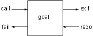

------------------------------------------------------------------------

# 3. Simple Queries

Now that we have some facts in our Prolog program, we can consult the program in the listener and query, or call, the facts. This chapter, and the next, will assume the Prolog program contains only facts. Queries against programs with rules will be covered in a later chapter.

Prolog queries work by pattern matching. The query pattern is called a **goal**. If there is a fact that matches the goal, then the query succeeds and the listener responds with 'yes.' If there is no matching fact, then the query fails and the listener responds with 'no.'

Prolog's pattern matching is called **unification**. In the case where the logicbase contains only facts, unification succeeds if the following three conditions hold.

- The predicate named in the goal and logicbase are the same.
- Both predicates have the same arity.
- All of the arguments are the same.

Before proceeding, review figure 3.1, which has a listing of the program so far.

The first query we will look at asks if the office is a room in the game. To pose this, we would enter that goal followed by a period at the listener prompt.

```prolog
?- room(office).
yes
```

Prolog will respond with a 'yes' if a match was found. If we wanted to know if the attic was a room, we would enter that goal.

```prolog
?- room(attic).
no
```

[TABLE]

Figure 3.1. The listing of Nani Search entered at this point

Prolog will respond with a 'no' if no match was found. Likewise, we can ask about the locations of things.

```prolog
?- location(apple, kitchen).
yes

?- location(kitchen, apple).
no
```

Prolog responds to our location query patterns in a manner that makes sense to us. That is, the kitchen is not located in the apple.

However, here is the problem with the one-way doors, which we still haven't fixed. It is mentioned again to stress the importance of the order of the arguments.

```prolog
?- door(office, hall).
yes

?- door(hall, office).
no
```

Goals can be generalized by the use of Prolog variables. They do not behave like the variables in other languages, and are better called logical variables (although Prolog does not precisely correspond to logic). The logical variables replace one or more of the arguments in the goal.

Logical variables add a new dimension to unification. As before, the predicate names and arity must be the same for unification to succeed. However, when the corresponding arguments are compared, a variable will successfully match any term.

After successful unification, the logical variable takes on the value of the term it was matched with. This is called **binding** the variable. When a goal with a variable successfully unifies with a fact in the logicbase, Prolog returns the value of the newly bound variable.

Since there may be more than one value a variable can be bound to and still satisfy the goal, Prolog provides the means for you to ask for alternate values. After an answer you can enter a semicolon (;). It causes Prolog to look for alternative bindings for the variables. Entering anything else at the prompt ends the query.

For example, we can use a logical variable to find all of the rooms.

```prolog
?- room(X).
X = kitchen ;
X = office ;
X = hall ;
X = 'dining room' ;
X = cellar ;
no
```

The last 'no' means there are no more answers.

Here's how to find all the things in the kitchen. (Remember, variables begin with uppercase letters.)

```prolog
?- location(Thing, kitchen).
Thing = apple ;
Thing = broccoli ;
Thing = crackers ;
no
```

We can use two variables to see everything in every place.

```prolog
?- location(Thing, Place).
Thing = desk
Place = office ;

Thing = apple
Place = kitchen ;

Thing = flashlight
Place = desk ;

...
no
```

Other applications might have the following queries.

What customers live in Boston, and what is their credit rating?

```prolog
?- customer(X, boston, Y).
```

What is the title of chapter 2?

```prolog
?- chapter(2,Title).
```

What are the coordinates of window main?

```prolog
?- window(main,Row1,Col1,Row2,Col2).
```

### How Queries Work

When Prolog tries to satisfy a goal about a predicate, such as location/2, it searches through the clauses defining location/2. When it finds a match for its variables, it marks the particular clause that was used to satisfy the goal. Then, if the user asks for more answers, it resumes its search of the clauses at that place marker.

Referring to the list of clauses in figure 3.1, let's look closer at this process with the query location(X, kitchen). First, unification is attempted between the query pattern and the first clause of location/2.

```prolog
Pattern                           Clause #1 
```

```prolog
location(X, kitchen)              location(desk, office) 
```

This unification fails. The predicate names are the same, the number of arguments is the same, but the second argument in the pattern, kitchen, is different from the second argument in the clause, office.

Next, unification is attempted between the pattern and the second clause of location/2.

```prolog
Pattern                           Clause #2 
```

```prolog
location(X, kitchen)              location(apple, kitchen) 
```

This unification succeeds. The predicate names, arity (number of arguments), and second arguments are the same. The first arguments can be made the same if the variable X in the pattern takes the value 'apple.'

Now that unification succeeds, the Prolog listener reports its success, and the binding of the variable X.

```prolog
?- location(X, kitchen).
X = apple
```

If the user presses a key other than the semicolon (;) at this point, the listener responds with 'yes' indicating the query ended successfully.

If the user presses the semicolon (;) key, the listener looks for other solutions. First it unbinds the variable X. Next it resumes the search using the clause following the one that had just satisfied the query. This is called **backtracking**. In the example that would be the third clause.

```prolog
Pattern                           Clause #3 
```

```prolog
location(X, kitchen)              location(flashlight, desk) 
```

This fails, and the search continues. Eventually the sixth clause succeeds.

```prolog
Pattern                           Clause #6 
```

```prolog
location(X, kitchen)              location(broccoli, kitchen) 
```

As a result, the variable X is now rebound to broccoli, and the listener responds

```prolog
X = broccoli ;
```

Again, entering a semicolon (;) causes X to be unbound and the search to continue with the seventh clause, which also succeeds.

```prolog
X = crackers ;
```

As before, entering anything except a semicolon (;) causes the listener to respond 'yes,' indicating success. A semicolon (;) causes the unbinding of X and the search to continue. But now, there are no more clauses that successfully unify with the pattern, so the listener responds with 'no' indicating the final attempt has failed.

```prolog
no 
```

The best way to understand Prolog execution is to trace its execution in the debugger. But first it is necessary to have a deeper understanding of goals.

A Prolog goal has four **ports** representing the flow of control through the goal: call, exit, redo, and fail. First the goal is called. If successful it is exited. If not it fails. If the goal is retried, by entering a semicolon (;) the redo port is entered. Figure 3.2 shows the goal and its ports.



Figure 3.2. The ports of a Prolog goal

The behaviors at each port are

call  
Begins searching for clauses that unify with the goal

exit  
Indicates the goal is satisfied, sets a place marker at the clause and binds the variables appropriately

redo  
Retries the goal, unbinds the variables and resumes search at the place marker

fail  
Indicates no more clauses match the goal

Prolog debuggers use these ports to describe the state of a query. Figure 3.3 shows a trace of the location(X, kitchen) query. Study it carefully because it is the key to your understanding of Prolog. The number in parentheses indicates the current clause.

If you haven't already, we recommend you download and use the Amzi! Prolog IDE. It's full source code debugger let's you easily see the execution behavior of Prolog.\
It's free! See\
[Amzi! Prolog](02-aprolog.md)

[TABLE]

Figure 3.3. Prolog trace of location(X, kitchen)

Because the trace information presented in this book is designed to teach Prolog rather than debug it, the format is a little different from that used in the actual debugger. Run the Amzi! Source Code Debugger on these queries to see how they work for real.

To start the Amzi! Debugger, highlight your project name or edit a source file in your project, then select Run \| Debug As \| Interpreted Project from the main menu.

You will see a separate perspective with multiple views that contain trace information. Enter the query 'location(X, kitchen)' in the Debug Listener view. You will see the trace start in the debugger view.

Use the 'Step Over' button in the debugger to creep from port to port. When output appears in the listener view, enter semicolons (;) to continue the search. See the help files for more details on the debugger.

Unification between goals and facts is actually more general than has been presented. Variables can also occur in the facts of the Prolog logicbase as well.

For example, the following fact could be added to the Prolog program. It might mean everyone sleeps.

```prolog
sleeps(X).
```

You can add it directly in the listener, to experiment with, like this.

```prolog
?- assert(sleeps(X)).
yes
```

Queries against a logicbase with this fact give the following results.

```prolog
?- sleeps(jane).
yes

?- sleeps(tom).
yes
```

Notice that the listener does not return the variable bindings of 'X=jane' and 'X=tom.' While they are surely bound that way, the listener only lists variables mentioned in the query, not those used in the program.

Prolog can also bind variables to variables.

```prolog
?- sleeps(Z).
Z = H116

?- sleeps(X).
X = H247
```

When two unbound variables match, they are both bound, but not to a value! They are bound together, so that if either one takes a value, the other takes the same value. This is usually implemented by binding both variables to a common internal variable. In the first query above, both Z in the query and X in the fact are bound to internal variable 'H116.' In this way Prolog remembers they have the same value. If either one is bound to a value later on, both automatically bind to that value. This feature of Prolog distinguishes it from other languages and, as we will discover later, gives Prolog much of its power.

The two queries above are the same, even though one uses the same character X that is used in the fact sleeps(X). The variable in the fact is considered different from the one in the query.

### Exercises

The exercise sections will often contain nonsense Prolog questions. These are queries against a meaningless logicbase to strengthen your understanding of Prolog without the benefit of meaningful semantics. You are to predict the answers to the query and then try them in Prolog to see if you are correct. If you are not, trace the queries to better understand them.

#### Nonsense Prolog

1- Consider the following Prolog logicbase

```prolog
easy(1).
easy(2).
easy(3).

gizmo(a,1).
gizmo(b,3).
gizmo(a,2).
gizmo(d,5).
gizmo(c,3).
gizmo(a,3).
gizmo(c,4).
```

and predict the answers to the queries below, including all alternatives when the semicolon (;) is entered after an answer.

```prolog
?- easy(2).
?- easy(X).

?- gizmo(a,X).
?- gizmo(X,3).
?- gizmo(d,Y).
?- gizmo(X,X).
```

2- Consider this logicbase,

```prolog
harder(a,1).
harder(c,X).
harder(b,4).
harder(d,2).
```

and predict the answers to these queries.

```prolog
?- harder(a,X).
?- harder(c,X).
?- harder(X,1).
?- harder(X,4).
```

#### Adventure Game

3- Enter the listener and reproduce some of the example queries you have seen against location/2. List or print location/2 for reference if you need it. Remember to respond with a semicolon (;) for multiple answers. Trace the query.

#### Genealogical Logicbase

4- Pose queries against the genealogical logicbase that:

- Confirm a parent relationship such as parent(dennis, diana)
- Find someone's parent such as parent(X, diana)
- Find someone's children such as parent(dennis, X)
- List all parent-children such as parent(X,Y)

5- If parent/2 seems to be working, you can add additional family members to get a larger logicbase. Remember to include the corresponding male/1 or female/1 predicate for each individual added.

#### Customer Order Entry

6- Pose queries against the customer order entry logicbase that

- find customers in a given city
- find customers with a given credit rating
- confirm a given customer's credit rating
- find the customers in a given city with a given credit rating
- find the reorder quantity for a given item
- find the item number for a given item name
- find the inventory level for a given item number
