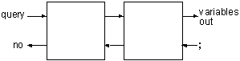
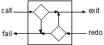
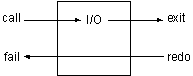
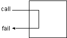
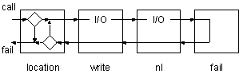

------------------------------------------------------------------------

# 4. Compound Queries

Simple goals can be combined to form compound queries. For example, we might want to know if there is anything good to eat in the kitchen. In Prolog we might ask

```prolog
?- location(X, kitchen), edible(X).
```

Whereas a simple query had a single goal, the compound query has a conjunction of goals. The comma separating the goals is read as "and."

Logically (declaratively) the example means "Is there an X such that X is located in the kitchen and X is edible?" If the same variable name appears more than once in a query, it must have the same value in all places it appears. The query in the above example will only succeed if there is a single value of X that can satisfy both goals.

However, the variable name has no significance to any other query, or clause in the logicbase. If X appears in other queries or clauses, that query or clause gets its own copy of the variable. We say the **scope** of a logical variable is a query.

Trying the sample query we get

```prolog
?- location(X, kitchen), edible(X).
X = apple ;
X = crackers ;
no
```

The 'broccoli' does not show up as an answer because we did not include it in the edible/1 predicate.

This logical query can also be interpreted procedurally, using an understanding of Prolog's execution strategy. The procedural interpretation is: "First find an X located in the kitchen, and then test to see if it is edible. If it is not, go back and find another X in the kitchen and test it. Repeat until successful, or until there are no more Xs in the kitchen."

To understand the execution of a compound query, think of the goals as being arranged from left to right. Also think of a separate table which is kept for the current variable bindings. The flow of control moves back and forth through the goals as Prolog attempts to find variable bindings that satisfy the query.

Each goal can be entered from either the left or the right, and can be left from either the left or the right. These are the ports of the goal as seen in the last chapter.

A compound query begins by calling the first goal on the left. If it succeeds, the next goal is called with the variable bindings as set from the previous goal. If the query finishes via the exit port of the rightmost goal, it succeeds, and the listener prints the values in the variable table.

If the user types semicolon (;) after an answer, the query is re-entered at the redo port of the rightmost goal. Only the variable bindings that were set in that goal are undone.

If the query finishes via the fail port of the leftmost goal, the query fails. Figure 4.1 shows a compound query with the listener interaction on the ending ports.



Figure 4.1. Compound queries

Figure 4.2 contains the annotated trace of the sample query. Make sure you understand it before proceeding.

[TABLE]

Figure 4.2. Annotated trace of compound query

In this example we had a single variable, which was bound (given a value) by the first goal and tested in the second goal. We will now look at a more general example with two variables. It is attempting to ask for all the things located in rooms adjacent to the kitchen.

In logical terms, the query says "Find a T and R such that there is a door from the kitchen to R and T is located in R." In procedural terms it says "First find an R with a door from the kitchen to R. Use that value of R to look for a T located in R."

```prolog
?- door(kitchen, R), location(T,R).
R = office
T = desk ;

R = office
T = computer ;

R = cellar
T = 'washing machine' ;
no
```

In this query, the backtracking is more complex. Figure 4.3 shows its trace.

Notice that the variable R is bound by the first goal and T is bound by the second. Likewise, the two variables are unbound by entering the redo port of the goal that bound them. After R is first bound to office, that binding sticks during backtracking through the second goal. Only when the listener backtracks into the first goal does R get unbound.

[TABLE]

Figure 4.3. Trace of a compound query

### Built-in Predicates

Up to this point we have been satisfied with the format Prolog uses to give us answers. We will now see how to generate output that is customized to our needs. The example will be a query that lists all of the items in the kitchen. This will require performing I/O and forcing the listener to automatically backtrack to find all solutions.

To do this, we need to understand the concept of the **built-in** (evaluable) predicate. A built-in predicate is predefined by Prolog. There are no clauses in the logicbase for built-in predicates. When the listener encounters a goal that matches a built-in predicate, it calls a predefined procedure.

Built-in predicates are usually written in the language used to implement the listener. They can perform functions that have nothing to do with logical theorem proving, such as writing to the console. For this reason they are sometimes called extra-logical predicates.

However, since they appear as Prolog goals they must be able to respond to either a call from the left or a redo from the right. Its response in the redo case is referred to as its behavior on backtracking.

We will introduce specific built-in predicates as we need them. Here are the I/O predicates that will let us control the output of our query.

write/1  
This predicate always succeeds when called, and has the side effect of writing its argument to the console.It always fails on backtracking. Backtracking does not undo the side effect.

nl/0  
Succeeds, and starts a new line. Like write, it always succeeds when called, and fails on backtracking.

tab/1  
It expects the argument to be an integer and tabs that number of spaces. It succeeds when called and fails on backtracking.

Figure 4.4 is a stylized picture of a goal showing its internal control structure. We will compare this with the internal flow of control of various built-in predicates.



Figure 4.4. Internal flow of control through a normal goal

In figure 4.4, the upper left diamond represents the decision point after a call. Starting with the first clause of a predicate, unification is attempted between the query pattern and each clause, until either unification succeeds or there are no more clauses to try. If unification succeeded, branch to exit, marking the clause that successfully unified, if it failed, branch to fail.

The lower right diamond represents the decision point after a redo. Starting with the most recent clause found in the predicate, unification is again attempted between the query pattern and remaining clauses. If it succeeds, branch to exit, if not, branch to fail.

The I/O built-in predicates differ from normal goals in that they never change the direction of the flow of control. If they get control from the left, they pass control to the right. If they get control from the right, they pass control to the left as shown in figure 4.5.



Figure 4.5. Internal flow of control through an I/O predicate

The output I/O predicates do not affect the variable table; however, they may output values from it. They simply leave their mark at the console each time control passes through them from left to right.

There are built-in predicates that do affect backtracking, and we have need of one of them for the first example. It is fail/0, and, as its name implies, it always fails.

If fail/0 gets control from the left, it immediately passes control back to the redo port of the goal on the left. It will never get control from the right, since it never allows control to pass to its right. Figure 4.6 shows its internal control structure.



Figure 4.6. Internal flow of control through the fail/0 predicate

Previously we relied on the listener to display variable bindings for us, and used the semicolon (;) response to generate all of the possible solutions. We can now use the I/O built-in predicates to display the variable bindings, and the fail/0 predicate to force backtracking so all solutions are displayed.

Here then is the query that lists everything in the kitchen.

```prolog
?- location(X, kitchen), write(X) ,nl, fail.
apple
broccoli
crackers
no
```

The final 'no' means the query failed, as it was destined to, due to the fail/0.

Figure 4.7 shows the control flow through this query.



Figure 4.7. Flow of control through query with built-in predicates

Figure 4.8 shows a trace of the query.

[TABLE]

Figure 4.8. Trace of query with built-in predicates

### Exercises

#### Nonsense Prolog

1- Consider the following Prolog logicbase.

```prolog
easy(1).
easy(2).
easy(3).

gizmo(a,1).
gizmo(b,3).
gizmo(a,2).
gizmo(d,5).
gizmo(c,3).
gizmo(a,3).
gizmo(c,4).

harder(a,1).
harder(c,X).
harder(b,4).
harder(d,2).
```

Predict the results of the following queries. Then try them and trace them to see if you were correct.

```prolog
?- gizmo(a,X),easy(X).
?- gizmo(c,X),easy(X).
?- gizmo(d,Z),easy(Z).

?- easy(Y),gizmo(X,Y).

?- write('report'), nl, easy(T), write(T), gizmo(M,T), tab(2), write(M), fail.

?- write('buggy'), nl, easy(Z), write(X), gizmo(Z,X), tab(2), write(Z), fail.

?- easy(X),harder(Y,X).
?- harder(Y,X),easy(X).
```

#### Adventure Game

2- Experiment with the queries you have seen in this chapter.

3- Predict the results of this query before you execute it. Then try it. Trace it if you were wrong.

```prolog
?- door(kitchen, R), write(R), nl, location(T,R), tab(3), write(T), nl, fail.
```

#### Genealogical Logicbase

4- Compound queries can be used to find family relationships in the genealogical logicbase. For example, find someone's mother with

```prolog
?- parent(X, someone), female(X).
```

Write similar queries for fathers, sons, and daughters. Trace these queries to understand their behavior (or misbehavior if they are not working right for you).

5- Experiment with the ordering of the goals. In particular, contrast the queries.

```prolog
?- parent(X, someone), female(X).
?- female(X), parent(X, someone).
```

Do they both give the same answer? Trace both queries and see which takes more steps.

6- The same predicate can be used multiple times in the same query. For example, we can find grandparents

```prolog
?- parent(X, someone), parent(GP, X).
```

7- Write queries which find grandmothers, grandfathers, and great-great grandparents.

#### Customer Order Entry

8- Write a query against the item and inventory records that returns the inventory level for an item when you only know the item name.
