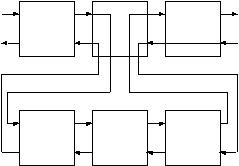

------------------------------------------------------------------------

# 5. Rules

We said earlier a predicate is defined by clauses, which may be facts or rules. A rule is no more than a stored query. Its syntax is

```prolog
head :- body.
```

where

head
a predicate definition (just like a fact)

:-
the **neck** symbol, sometimes read as "if"

body
one or more goals (a query)

For example, the compound query that finds out where the good things to eat are can be stored as a rule with the predicate name where_food/2.

```prolog
where_food(X,Y) :-
  location(X,Y),
  edible(X).
```

It states "There is something X to eat in room Y if X is located in Y, and X is edible."

We can now use the new rule directly in a query to find things to eat in a room. As before, the semicolon (;) after an answer is used to find all the answers.

```prolog
?- where_food(X, kitchen).
X = apple ;
X = crackers ;
no

?- where_food(Thing, 'dining room').
no
```

Or it can check on specific things.

```prolog
?- where_food(apple, kitchen).
yes
```

Or it can tell us everything.

```prolog
?- where_food(Thing, Room).
Thing = apple
Room = kitchen ;

Thing = crackers
Room = kitchen ;
no
```

Just as we had multiple facts defining a predicate, we can have multiple rules for a predicate. For example, we might want to have the broccoli included in where_food/2. (Prolog doesn't have an opinion on whether or not broccoli is legitimate food. It just matches patterns.) To do this we add another where_food/2 clause for things that 'taste_yucky.'

```prolog
where_food(X,Y) :-
  location(X,Y),
  edible(X).
where_food(X,Y) :-
  location(X,Y),
  tastes_yucky(X).
```

Now the broccoli shows up when we use the semicolon (;) to ask for everything.

```prolog
?- where_food(X, kitchen).
X = apple ;
X = crackers ;
X = broccoli ;
no
```

Until this point, when we have seen Prolog try to satisfy goals by searching the clauses of a predicate, all of the clauses have been facts.

### How Rules Work

With rules, Prolog unifies the goal pattern with the head of the clause. If unification succeeds, then Prolog initiates a new query using the goals in the body of the clause.

Rules, in effect, give us multiple levels of queries. The first level is composed of the original goals. The next level is a new query composed of goals found in the body of a clause from the first level.

Each level can create even deeper levels. Theoretically, this could continue forever. In practice it can continue until the listener runs out of space.

Figure 5.1 shows the control flow after the head of a rule has been matched. Notice how backtracking from the third goal of the first level now goes into the second level.



Figure 5.1. Control flow with rules

In this example, the middle goal on the first level succeeds or fails if its body succeeds or fails. When entered from the right (redo) the goal reenters its body query from the right (redo). When the query fails, the next clause of the first-level goal is tried, and if the next clause is also a rule, the process is repeated with the second clause's body.

As always with Prolog, these relationships become clearer by studying a trace. Figure 5.2 contains the annotated trace of the where_food/2 query. Notice the appearance of a two-part number. The first part of the number indicates the query level. The second part indicates the number of the goal within the query, as before. The parenthetical number is the clause number. For example

```prolog
2-1 EXIT (7) location(crackers, kitchen)
```

means the exit occurred at the second level, first goal using clause number seven.

[TABLE]

Figure 5.2. Trace of a query with rules

It is important to understand the relationship between the first-level and second-level variables in this query. These are independent variables, that is, the X in the query is not the same as the X that shows up in the body of the where_food/2 clauses, values for both happen to be equal due to unification.

To better understand the relationship, we will slowly step through the process of transferring control. Subscripts identify the variable levels.

The goal in the query is

```prolog
?- where_food(X1, kitchen)
```

The head of the first clause is

```prolog
where_food(X2, Y2)
```

Remember the 'sleeps' example in chapter 3 where a query with a variable was unified with a fact with a variable? Both variables were set to be equal to each other. This is exactly what happens here. This might be implemented by setting both variables to a common internal variable. If either one takes on a new value, both take on a new value.

So, after unification between the goal and the head, the variable bindings are

```prolog
X1 = _01
X2 = _01
Y2 = kitchen
```

The second-level query is built from the body of the clause, using these bindings.

```prolog
location(_01, kitchen), edible(_01).
```

When internal variable \_01 takes on a value, such as 'apple,' both X's then take on the same value. This is fundamentally different from the assignment statements that set variable values in most computer languages.

### Using Rules

Using rules, we can solve the problem of the one-way doors. We can define a new two-way predicate with two clauses, called connect/2.

```prolog
connect(X,Y) :- door(X,Y).
connect(X,Y) :- door(Y,X).
```

It says "Room X is connected to a room Y if there is a door from X to Y, or if there is a door from Y to X." Note the implied 'or' between clauses. Now connect/2 behaves the way we would like.

```prolog
?- connect(kitchen, office).
yes

?- connect(office, kitchen).
yes
```

We can list all the connections (which is twice the number of doors) with a general query.

```prolog
?- connect(X,Y).
X = office
Y = hall ;

X = kitchen
Y = office ;
...
X = hall
Y = office ;

X = office
Y = kitchen ;
...
```

With our current understanding of rules and built-in predicates we can now add more rules to Nani Search. We will start with look/0, which will tell the game player where he or she is, what things are in the room, and which rooms are adjacent.

To begin with, we will write list_things/1, which lists the things in a room. It uses the technique developed at the end of chapter 4 to loop through all the pertinent facts.

```prolog
list_things(Place) :-
  location(X, Place),
  tab(2),
  write(X),
  nl,
  fail.
```

We use it like this.

```prolog
?- list_things(kitchen).
  apple
  broccoli
  crackers
no
```

There is one small problem with list_things/1. It gives us the list, but it always fails. This is all right if we call it by itself, but we won't be able to use it in conjunction with other rules that follow it (to the right as illustrated in our diagrams). We can fix this problem by adding a second list_things/1 clause which always succeeds.

```prolog
list_things(Place) :-
  location(X, Place),
  tab(2),
  write(X),
  nl,
  fail.
list_things(AnyPlace).
```

Now when the first clause fails (because there are no more location/2s to try) the second list_things/1 clause will be tried. Since its argument is a variable it will successfully match with anything, causing list_things/1 to always succeed and leave through the 'exit' port.

As with the second clause of list_things/1, it is often the case that we do not care what the value of a variable is, it is simply a place marker. For these situations there is a special variable called the **anonymous variable**, represented as an underscore (\_). For example

```prolog
list_things(_).
```

Next we will write list_connections/1, which lists connecting rooms. Since rules can refer to other rules, as well as to facts, we can write list_connections/1 just like list_things/1 by using the connection/2 rule.

```prolog
list_connections(Place) :-
  connect(Place, X),
  tab(2),
  write(X),
  nl,
  fail.
list_connections(_).
```

Trying it gives us

```prolog
?- list_connections(hall).
  dining room
  office
yes
```

Now we are ready to write look/0. The single fact here(kitchen) tells us where we are in the game. (In chapter 7 we will see how to move about the game by dynamically changing here/1.) We can use it with the two list predicates to write the full look/0.

```prolog
look :-
  here(Place),
  write('You are in the '), write(Place), nl,
  write('You can see:'), nl,
  list_things(Place),
  write('You can go to:'), nl,
  list_connections(Place).
```

Given we are in the kitchen, this is how it works.

```prolog
?- look.
You are in the kitchen
You can see:
  apple
  broccoli
  crackers
You can go to:
  office
  cellar
  dining room
yes
```

We now have an understanding of the fundamentals of Prolog, and it is worth summarizing what we have learned so far. We have seen the following about rules in Prolog.

- A Prolog program is a logicbase of interrelated facts and rules.
- The rules communicate with each other through unification, Prolog's built-in pattern matcher.
- The rules communicate with the user through built-in predicates such as write/1.
- The rules can be queried (called) individually from the listener.

We have seen the following about Prolog's control flow.

- The execution behavior of the rules is controlled by Prolog's built-in backtracking search mechanism.
- We can force backtracking with the built-in predicate fail.
- We can force success of a predicate by adding a final clause with dummy variables as arguments and no body.

We now understand the following aspects of Prolog programming.

- Facts in the logicbase (locations, doors, etc.) replace conventional data definition.
- The backtracking search (list_things/1) replaces the coding of many looping constructs.
- Passing of control through pattern matching (connect/2) replaces conditional test and branch structures.
- The rules can be tested individually, encouraging modular program development.
- Rules that call rules encourage the programming practices of procedure abstraction and data abstraction. (For example, look/0 doesn't know how list_things/1 works, or how the location data is stored.)

With this level of understanding, we can make a lot of progress on the exercise applications. Take some time to work with the programs to consolidate your understanding before moving on to the following chapters.

### Exercises

#### Nonsense Prolog

1- Consider the following Prolog logicbase.

```prolog
a(a1,1).
a(A,2).
a(a3,N).

b(1,b1).
b(2,B).
b(N,b3).

c(X,Y) :- a(X,N), b(N,Y).

d(X,Y) :- a(X,N), b(Y,N).
d(X,Y) :- a(N,X), b(N,Y).
```

Predict the answers to the following queries, then check them with Prolog, tracing.

```prolog
?- a(X,2).

?- b(X,kalamazoo).

?- c(X,b3).
?- c(X,Y).

?- d(X,Y).
```

#### Adventure Game

2- Experiment with the various rules that were developed during this chapter, tracing them all.

3- Write look_in/1 for Nani Search. It should list the things located in its argument. For example, look_in(desk) should list the contents of the desk.

#### Genealogical Logicbase

4- Build rules for the various family relationships that were developed as queries in the last chapter. For example

```prolog
mother(M,C):-
  parent(M,C),
  female(M).
```

5- Build a rule for siblings. You will probably find your rule lists an individual as his/her own sibling. Use trace to figure out why.

6- We can fix the problem of individuals being their own siblings by using the built-in predicate that succeeds if two values are unequal, and fails if they are the same. The predicate is \\(X,Y). Jumping ahead a bit (to operator definitions in chapter 12), we can also write it in the form X \\ Y.

7- Use the sibling predicate to define additional rules for brothers, sisters, uncles, aunts, and cousins.

8- If we want to represent marriages in the family logicbase, we run into the two-way door problem we encountered in Nani Search. Unlike parent/2, which has two arguments with distinct meanings, married/2 can have the arguments reversed without changing the meaning.

Using the Nani Search door/2 predicate as an example, add some basic family data with a spouse/2 predicate. Then write the predicate married/2 using connect/2 as a model.

9- Use the new married predicate to add rules for uncles and aunts that get uncles and aunts by marriage as well as by blood. You should have two rules for each of these relationships, one for the blood case and one for the marriage case. Use trace to follow their behavior.

10- Explore other relationships, such as those between in-laws.

11- Write a predicate for grandparent/2. Use it to find both a grandparent and a grandchild.

```prolog
grandparent(someone, X).
grandparent(X, someone).
```

Trace its behavior for both uses. Depending on how you wrote it, one use will require many more steps than the other. Write two predicates, one called grandparent/2 and one called grandchild/2. Order the goals in each so that they are efficient for their intended uses.

#### Customer Order Entry

12- Write a rule item_quantity/2 that is used to find the inventory level of a named item. This shields the user of this predicate from having to deal with the item numbers.

13- Write a rule that produces an inventory report using the item_quantity/2 predicate. It should display the name of the item and the quantity on hand. It should also always succeed. It will be similar to list_things/2.

14- Write a rule which defines a good customer. You might want to identify different cases of a good customer.

#### Expert Systems

Expert systems are often called rule-based systems. The rules are "rules of thumb" used by experts to solve certain problems. The expert system includes an **inference engine**, which knows how to use the rules.

There are many kinds of inference engines and knowledge representation techniques that are used in expert systems. Prolog is an excellent language for building any kind of expert system. However, certain types of expert systems can be built directly using Prolog's native rules. These systems are called **structured selection** systems.

The code listing for 'birds' in the appendix contains a sample system that can be used to identify birds. You will be asked to build a similar system in the exercises. It can identify anything, from animals to cars to diseases.

15- Decide what kind of expert system you would like to build, and add a few initial identification rules. For example, a system to identify house pets might have these rules.

```prolog
pet(dog):- size(medium), noise(woof).
pet(cat):- size(medium), noise(meow).
pet(mouse):- size(small), noise(squeak).
```

16- For now, we can use these rules by putting the known facts in the logicbase. For example, if we add size(medium) and noise(meow) and then pose the query pet(X) we will find X=cat.

Many Prologs allow clauses to be entered directly at the listener prompt, which makes using this expert system a little easier. The presence of the neck symbol (:-) signals to the listener that the input is a clause to be added. So to add facts directly to the listener workspace, they must be made into rules, as follows.

```prolog
?- size(medium) :- true.
recorded

?- noise(meow) :- true.
recorded
```

Jumping ahead, you can also use assert/1 like this

```prolog
?- assert(size(medium)).
yes
?- assert(noise(meow)).
yes
```

These examples use the predicates in the general form attribute(value). In this simple example, the pet attribute is deduced. The size and noise attributes must be given.

17- Improve the expert system by having it ask for the attribute/values it can't deduce. We do this by first adding the rules

```prolog
size(X):- ask(size, X).
noise(X):- ask(noise, X).
```

For now, ask/2 will simply check with the user to see if an attribute/value pair is true or false. It will use the built-in predicate read/1 which reads a Prolog term (ending in a period of course).

```prolog
ask(Attr, Val):-
  write(Attr),tab(1),write(Val),
  tab(1),write('(yes/no)'),write(?),
  read(X),
  X = yes.
```

The last goal, X = yes, attempts to unify X and yes. If yes was read, then it succeeds, otherwise, it fails.
