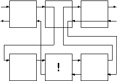

------------------------------------------------------------------------

# 13. Cut

Up to this point, we have worked with Prolog's backtracking execution behavior. We have seen how to use that behavior to write compact predicates.

Sometimes it is desirable to selectively turn off backtracking. Prolog provides a predicate that performs this function. It is called the **cut**, represented by an exclamation point (!).

The cut effectively tells Prolog to freeze all the decisions made so far in this predicate. That is, if required to backtrack, it will automatically fail without trying other alternatives.

We will first examine the effects of the cut and then look at some practical reasons to use it.



Figure 13.1. The effect of the cut on flow of control

When the cut is encountered, it re-routes backtracking, as shown in figure 13.1. It short-circuits backtracking in the goals to its left on its level, and in the level above, which contained the cut. That is, both the parent goal (middle goal of top level) and the goals of the particular rule being executed (second level) are affected by the cut. The effect is undone if a new route is taken into the parent goal. Contrast figure 13.1 with figure 5.1.

We will write some simple predicates that illustrate the behavior of the cut, first adding some data to backtrack over.

```prolog
data(one).
data(two).
data(three).
```

Here is the first test case. It has no cut and will be used for comparison purposes.

```prolog
cut_test_a(X) :-
  data(X).
cut_test_a('last clause').
```

This is the control case, which exhibits the normal behavior.

```prolog
?- cut_test_a(X), write(X), nl, fail.
one
two
three
last clause
no
```

Next, we put a cut at the end of the first clause.

```prolog
cut_test_b(X) :-
  data(X),
  !.
cut_test_b('last clause').
```

Note that it stops backtracking through both the data/1 subgoal (left), and the cut_test_b parent (above).

```prolog
?- cut_test_b(X), write(X), nl, fail.
one
no
```

Next we put a cut in the middle of two subgoals.

```prolog
cut_test_c(X,Y) :-
  data(X),
  !,
  data(Y).
cut_test_c('last clause').
```

Note that the cut inhibits backtracking in the parent cut_test_c and in the goals to the left of (before) the cut (first data/1). The second data/1 to the right of (after) the cut is still free to backtrack.

```prolog
?- cut_test_c(X,Y), write(X-Y), nl, fail.
one - one
one - two
one - three
no
```

Performance is the main reason to use the cut. This separates the logical purists from the pragmatists. Various arguments can also be made as to its effect on code readability and maintainability. It is often called the 'goto' of logic programming.

You will most often use the cut when you know that at a certain point in a given predicate, Prolog has either found the only answer, or if it hasn't, there is no answer. In this case you insert a cut in the predicate at that point.

Similarly, you will use it when you want to force a predicate to fail in a certain situation, and you don't want it to look any further.

### Using the Cut

We will now introduce to the game the little puzzles that make adventure games fun to play. We will put them in a predicate called puzzle/1. The argument to puzzle/1 will be one of the game commands, and puzzle/1 will determine whether or not there are special constraints on that command, reacting accordingly.

We will see examples of both uses of the cut in the puzzle/1 predicate. The behavior we want is

- If there is a puzzle, and the constraints are met, quietly succeed.
- If there is a puzzle, and the constraints are not met, noisily fail.
- If there is no puzzle, quietly succeed.

The puzzle in Nani Search is that in order to get to the cellar, the game player needs to both have the flashlight and turn it on. If these criteria are met we know there is no need to ever backtrack through puzzle/1 looking for other clauses to try. For this reason we include the cut.

```prolog
puzzle(goto(cellar)):-
  have(flashlight),
  turned_on(flashlight),
  !.
```

If the puzzle constraints are not met, then let the player know there is a special problem. In this case we also want to force the calling predicate to fail, and we don't want it to succeed by moving to other clauses of puzzle/1. Therefore we use the cut to stop backtracking, and we follow it with fail.

```prolog
puzzle(goto(cellar)):-
  write('It''s dark and you are afraid of the dark.'),
  !, fail.
```

The final clause is a catchall for those commands that have no special puzzles associated with them. They will always succeed in a call to puzzle/1.

```prolog
puzzle(_).
```

For logical purity, it is always possible to rewrite the predicates without the cut. This is done with the built-in predicate not/1. Some claim this provides for clearer code, but often the explicit and liberal use of 'not' clutters up the code, rather than clarifying it.

When using the cut, the order of the rules becomes important. Our second clause for puzzle/1 safely prints an error message, because we know the only way to get there is by the first clause failing before it reached the cut.

The third clause is completely general, because we know the earlier clauses have caught the special cases.

If the cuts were removed from the clauses, the second two clauses would have to be rewritten.

```prolog
puzzle(goto(cellar)):-
  not(have(flashlight)),
  not(turned_on(flashlight)),
  write('Scared of dark message'),
  fail.
puzzle(X):-
  not(X = goto(cellar)).
```

In this case the order of the clauses would not matter.

It is interesting to note that not/1 is defined using the cut. It also uses call/1, another built-in predicate that calls a predicate.

```prolog
not(X) :- call(X), !, fail.
not(X).
```

In the next chapter we will see how to add a command loop to the game. Until then we can test the puzzle predicate by including a call to it in each individual command. For example

```prolog
goto(Place) :-
  puzzle(goto(Place)),
  can_go(Place),
  move(Place),
  look.
```

Assuming the player is in the kitchen, an attempt to go to the cellar will fail.

```prolog
?- goto(cellar).
It's dark and you are afraid of the dark.
no

?- goto(office).
You are in the office...
```

Then if the player takes the flashlight, turns it on, and return to the kitchen, all goes well.

```prolog
?- goto(cellar).
You are in the cellar...
```

### Exercises

#### Adventure Game

1- Test the puzzle/1 predicate by setting up various game situations and seeing how it responds. When testing predicates with cuts you should always use the semicolon (;) after each answer to make sure it behaves correctly on backtracking. In our case puzzle/1 should always give one response and fail on backtracking.

2- Add your own puzzles for different situations and commands.

#### Expert System

3- Modify the ask and menuask predicates to use cut to replace the use of not.

#### Customer Order Entry

4- Modify the good_customer rules to use cut to prevent the search of other cases once we know one has been found.
