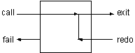

------------------------------------------------------------------------

# 14. Control Structures

We have examined the manner in which Prolog interprets goals and have also seen examples of how to manipulate Prolog's execution behavior.

In this chapter we will further explore the control structures you can implement in Prolog and draw parallels between them and the control structures found in more conventional programming languages.

You have already used the combination of fail and write/1 to generate lists of things for the game. This control structure is similar to 'do while' found in most languages.

We will now introduce another built-in predicate that allows us to capitalize on failure. It is repeat/0. It always succeeds the first time it is called, and it always succeeds on backtracking. In other words, you can not backtrack through a repeat/0. It always restarts forward execution.



Figure 14.1. Flow of control in the repeat/0 built-in predicate

A clause body with a repeat/0 followed by fail/0 will go back and forth forever. This is one way to write an endless loop in Prolog.

A repeat/0 followed by some intermediate goals followed by a test condition will loop until the test condition is satisfied. It is equivalent to a 'do until' in other languages. This is exactly the behavior we want for the highest command loop in Nani Search.

Our first version of command_loop/0 will simply read commands and echo them until end is entered. The built-in predicate read/1 reads a Prolog term from the console. The term must be followed by a period.

```prolog
command_loop:-  
  repeat,
  write('Enter command (end to exit): '),
  read(X),
  write(X), nl,
  X = end.
```

The last goal will fail unless end is entered. The repeat/0 always succeeds on backtracking and causes the intermediate goals to be re-executed.

We can execute it by entering this query.

```prolog
?- command_loop.
```

Now that the control structure is in place, we can have it execute the command, rather than just repeat it.

We will write a new predicate called do/1, which executes only the commands we allow. Many other languages have 'do case' control structures that perform this kind of function. Multiple clauses in a Prolog predicate behave similarly to a 'do case.'

Here is do/1. Notice that it allows us to define synonyms for commands, that is, the player can enter either goto(X) or go(X) to cause the goto/1 predicate to be executed.

```prolog
do(goto(X)):-goto(X),!.
do(go(X)):-goto(X),!.
do(inventory):-inventory,!.
do(look):-look,!.
```

NOTE: The cut serves two purposes. First, it says once we have found a 'do' clause to execute, don't bother looking for anymore. Second, it prevents the backtracking initiated at the end of command_loop from entering the other command predicates.

Here are some more do/1's. If do(end) did not always succeed, we would never get to the' X = end' test and would fail forever. The last do/1 allows us to tell the user there was something wrong with the command.

```prolog
do(take(X)) :- take(X), !.
do(end).
do(_) :-
  write('Invalid command').
```

We can now rewrite command_loop/0 to use the new do/1 and incorporate puzzle/1 in the command loop. We will also replace the old simple test for end with a new predicate, end_condition/1, that will determine if the game is over.

```prolog
command_loop:- 
  write('Welcome to Nani Search'), nl,
  repeat,
  write('>nani> '),
  read(X),
  puzzle(X),
  do(X), nl,
  end_condition(X).
```

Two conditions might end the game. The first is if the player types 'end.' The second is if the player has successfully taken the Nani.

```prolog
end_condition(end).
end_condition(_) :-
  have(nani),
  write('Congratulations').
```

The game can now be played from the top.

```prolog
?- command_loop.

Welcome to ...
```

### Recursive Control Loop

As hinted at in chapter 7, the purity of logic programming is undermined by the asserts and retracts of the logicbase. Just like global data in any language, predicates that are dynamically asserted and retracted can make for unpredictable code. That is, code in one part of the system that uses a dynamic predicate is affected by code in an entirely different part that changes that dynamic predicate.

For example, puzzle(goto(cellar)) succeeds or fails based on the existence of turned_on(flashlight) which is asserted by the turn_on/1 predicate. A bug in turn_on/1 will cause puzzle/1 to behave incorrectly.

The entire game can be reconstructed using arguments and no global data. To do this, it helps to think of the game as a sequence of state transformations.

In the current implementation, the state of the game is defined by the dynamic predicates location/2, here/1, have/1, and turned_on/1 or turned_off/1 for the flashlight. These predicates define an initial state which is dynamically changed, using assert and retract, as the player moves through the game toward the winning state, which is defined by the existence of have(nani).

We can get the same effect by defining a complex structure to hold the state, implementing game commands that access that state as an argument, rather than from dynamic facts in the logicbase.

Because logical variables cannot have their values changed by assignment, the commands must take two arguments representing the old state and the new state. The repeat-fail control structure will not let us repeatedly change the state in this manner, so we need to write a recursive control structure that recursively sends the new state to itself. The boundary condition is reaching the ending state of the game. This control structure is shown in figure 14.1, which contains an abbreviated version of Nani Search.

The state is represented by a list of structures holding different types of state information, as seen in initial_state/1. The various commands in this type of game need to access and manipulate that state structure. Rather than require each predicate that accesses the state to understand its complex structure, the utility predicates get_state/3, add_state/4, and del_state/4 are written to access it. This way any program changes to the state structure only require changes to the utility predicates.

This style of Prolog programming is logically purer, and lends itself to certain types of applications. It also avoids the difficulties often associated with global data. On the other hand, it requires more complexity in dealing with state information in arguments, and the multiple lists and recursive routines can be confusing to debug. You will have to decide which approach to use for each application you write.

[TABLE]

Figure 14.1. Nani Search without dynamic facts

There could be serious performance problems with this approach to the game. Prolog uses a stack to keep track of the levels of predicate calls. In the case of a recursive predicate, the stack grows at each recursive call. In this example, with its complex arguments, the stack could easily be consumed in a shortperiod of time by the recursive control structure.

Fortunately, there is a performance feature built into Prolog that makes this example program, and ones similar to it, behave efficiently.

### Tail Recursion

There are actually two kinds of recursive routines. In a true recursive routine, each level must wait for the information from the lower levels in order to return an answer. This means that Prolog must build a stack with a new entry for each level.

This is in contrast to iteration, which is more common in conventional languages. Each pass through the iteration updates the variables and there is no need for building a stack.

There is a type of recursion called **tail recursion** that, while written recursively, behaves iteratively. In general, if the recursive call is the last call, and there are no computations based on the information from the lower levels, then a good Prolog can implement the predicate iteratively, without growing the stack.

One classic example of tail recursion is the factorial predicate. First we'll write it using normal recursion. Note that the variable FF, which is returned from the lower level, is used in the top level.

```prolog
factorial_1(1,1).
factorial_1(N,F):-
  N > 1,
  NN is N - 1,
  factorial_1(NN,FF),
  F is N * FF.
```

It works as expected.

```prolog
?- factorial_1(5,X).
X = 120
```

By introducing a new second argument to keep track of the result so far, we can rewrite factorial/3 tail-recursively. The new argument is initially set to 1. Each recursive call builds on the second argument. When the boundary condition is reached, the third argument is bound to the second argument.

```prolog
factorial_2(1,F,F).
factorial_2(N,T,F):-
  N > 1,
  TT is N * T,
  NN is N - 1,
  factorial_2(NN,TT,F).
```

It gives the same results as the previous version, but because the recursive call is the last call in the second clause, its arguments are not needed at each level.

```prolog
?- factorial_2(5,1,X).
X = 120
```

Another classic example of tail recursion is the predicate to reverse a list. The straightforward definition of 'reverse' would be

```prolog
naive_reverse([],[]).
naive_reverse([H|T],Rev):-
  naive_reverse(T,TR),
  append(TR,[H],Rev).
```

The inefficiency of this definition is a feature taken advantage of in Prolog benchmarks. It is called the **naive reverse**, and published performance statistics often list the time required to reverse a list of a certain size.

The result of the recursive call to naive_reverse/2 is used in the last goal, so it is not tail recursive, but it gives the right answers.

```prolog
?- naive_reverse([ants, mice, zebras], X).
X = [zebras, mice, ants]
```

By again introducing a new second argument which will accumulate the partial answer through levels of recursion, we can rewrite 'reverse.' It turns out that the partial answer is already reversed when it reaches the boundary condition.

```prolog
reverse([], Rev, Rev).
reverse([H|T], Temp, Rev) :-
  reverse(T, [H|Temp], Rev).
```

We can now try the second reverse.

```prolog
?- reverse([ants, mice, zebras], [], X).
X = [zebras, mice, ants]
```

### Exercises

1- Trace both versions of reverse to understand the performance differences.

2- Write a tail recursive predicate that will compute the sum of the numbers between two given numbers. Trace its behavior to see if it is tail recursive.

#### Adventure Game

3- Add the remaining command predicates to do/1 so the game can be fully played.

4- Add the concept of time to the game by putting a counter in the command loop. Use an out-of-time condition as one way to end the game. Also add a 'wait' command, which just waits for one time increment.

5- Add other individuals or creatures that move automatically through the game rooms. Each cycle of the command loop will update their locations based on whatever algorithm you choose.

#### Customer Order Entry

6- Write a command loop for the order entry inventory system. Write a variation on menuask/3 that will present the user with a menu of choices, one of which is to exit the system. Use this in the command loop instead of just prompting for a command. Have each command prompt for the required input, if any.

#### Expert System

7- Make a new version of the expert system that maintains the 'known' information in arguments rather than in the logicbase.
