# Capítulo 1 — La primera hora

::: notes
Este capítulo es un recorrido general por el lenguaje. En aproximadamente una hora se pasa de no conocer Prolog a disponer de un programa que responde consultas. Cada tema se presenta y se usa una vez; los capítulos siguientes lo retoman en detalle. No hace falta instalar nada: todos los ejemplos se abren en SWISH, en el navegador.
:::

## Prolog nació en Marsella

:::: columns
::: column

:::
::: column
**Alain Colmerauer**
(1941–2017)

Prolog: Marsella, 1972

Foto: Alaindavid2, CC BY-SA 4.0,
Wikimedia Commons
:::
::::

::: notes
Prolog fue creado en 1972 en la Universidad de Marsella por Alain Colmerauer y Philippe Roussel. Su nombre abrevia «programación en lógica». Un programa Prolog no describe una secuencia de pasos: describe lo que se sabe de un problema, y el sistema deduce las respuestas a partir de esa descripción.
:::

## El recorrido

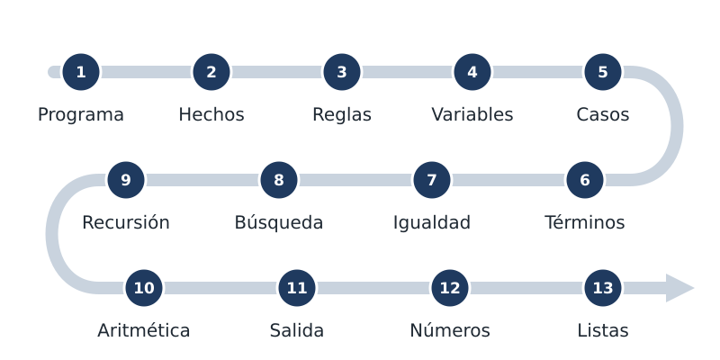

::: notes
El capítulo recorre trece temas, en este orden: qué es un programa, los hechos, las reglas, las variables, la definición por casos, los términos compuestos, la igualdad, cómo busca Prolog las respuestas, la recursión, la aritmética, la salida de texto, la enumeración de números y las listas. Ninguno se trata en profundidad. Las dudas que queden abiertas se pueden anotar: al final del capítulo, una tabla indica en qué capítulo se retoma cada tema.
:::

## Un programa

<!-- ejemplo: capitulo-01/familia.pl -->
```prolog
% padre(P, H): P es el padre de H.
padre(juan, ana).
padre(juan, pedro).
padre(pedro, luis).
padre(pedro, eva).

%!  abuelo(?A, ?N) is nondet.
%
%   A es abuelo de N cuando es el padre de su padre.
abuelo(A, N) :-
    padre(A, P),
    padre(P, N).
```

::: notes
Un programa Prolog es una base de conocimiento: un conjunto de afirmaciones que se consideran ciertas, escritas de modo que el sistema pueda usarlas para responder consultas. Este es un programa completo. Las líneas que comienzan con el signo de porcentaje son comentarios: Prolog las ignora, y están destinadas a quien lee el programa. Las que preceden a la regla del abuelo forman su encabezado, que se explica en el capítulo dos.
:::

## SWISH

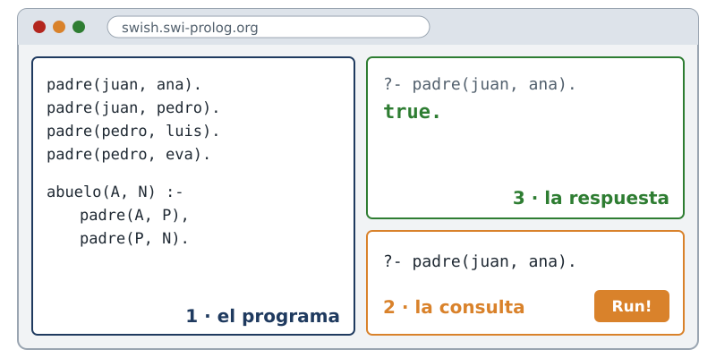

::: notes
Al abrir un ejemplo en SWISH se ven dos paneles. A la izquierda está el programa. Abajo a la derecha está la casilla donde se escribe la consulta, que ya viene cargada; solo resta ejecutarla. La respuesta aparece arriba a la derecha.
:::

## true. y false.

:::: columns
::: column
```prolog
?- padre(juan, ana).
true.

?- padre(juan, luis).
false.
```
:::
::: column
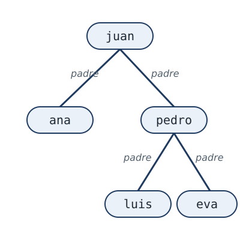
:::
::::

::: notes
La respuesta true indica que la consulta se deduce del contenido del programa. La segunda consulta pregunta si juan es padre de luis, algo que el programa no permite deducir, y la respuesta es false. Esa respuesta no indica que la afirmación sea falsa en el mundo real. Indica algo más acotado y más preciso: la consulta no se puede probar con el contenido del programa.
:::

## Un hecho

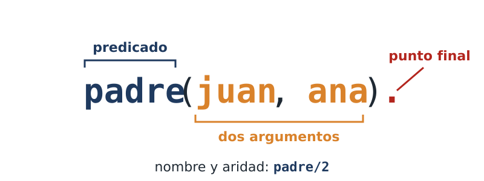

::: notes
Un hecho se escribe con un nombre, una lista de argumentos entre paréntesis y un punto final. El punto es obligatorio: marca dónde termina el hecho, y omitirlo es el error de sintaxis más frecuente al comenzar. El nombre se denomina predicado. El orden de los argumentos lo define quien escribe el programa: aquí, el primero es el padre y el segundo el hijo. Un predicado se identifica junto con su aridad, la cantidad de argumentos: este se nombra padre barra dos.
:::

## Los hechos de padre/2

<!-- ejemplo: capitulo-01/familia.pl predicado: padre/2 -->
```prolog
% padre(P, H): P es el padre de H.
padre(juan, ana).
padre(juan, pedro).
padre(pedro, luis).
padre(pedro, eva).
```

```prolog
?- padre(juan, Quien).
Quien = ana ;
Quien = pedro.
```

::: notes
En este programa, padre significa padre en sentido estricto, y no padre o madre. Con solo estos cuatro hechos ya se puede preguntar quién. Un nombre que comienza con mayúscula es una variable. Escrita en la posición que se desconoce, la consulta pregunta por los valores que la hacen cierta. Prolog muestra la primera respuesta, ana, y queda en espera. El punto y coma lo escribe el usuario para pedir la respuesta siguiente.
:::

## Una regla

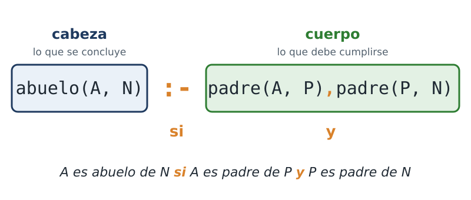

::: notes
Los hechos enuncian lo que se sabe que se cumple. Las reglas indican cómo deducir afirmaciones nuevas. El símbolo formado por dos puntos y un guion se lee «si», y la coma se lee «y». La regla completa se lee: A es abuelo de N si A es padre de P y P es padre de N. La parte izquierda es la cabeza, lo que la regla permite concluir; la derecha es el cuerpo, lo que debe cumplirse para concluirlo. Una regla afirma su cabeza cada vez que su cuerpo se puede probar.
:::

## Una deducción

:::: columns
::: column
<!-- ejemplo: capitulo-01/familia.pl fragmento: abuelo(A, N) :- .. padre(P, N). -->
```prolog
abuelo(A, N) :-
    padre(A, P),
    padre(P, N).
```

```prolog
?- abuelo(juan, eva).
true.
```
:::
::: column
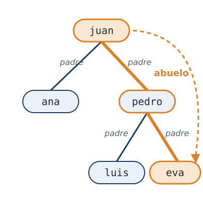
:::
::::

::: notes
El programa no contiene ningún hecho que diga que juan es abuelo de eva. Prolog lo deduce: encuentra que juan es padre de pedro y que pedro es padre de eva, y aplica la regla. A, N y P son variables: nombres para objetos todavía sin determinar, a los que Prolog asigna valores buscando en el programa.
:::

## Otras dos consultas

:::: columns
::: column
Sentido inverso

```prolog
?- padre(Quien, ana).
Quien = juan.
```
:::
::: column
Variable anónima

```prolog
?- padre(juan, _).
true ;
true.
```
:::
::::

::: notes
La misma relación se consulta en sentido inverso con el mismo predicado. No existen dos predicados, uno para buscar hijos y otro para buscar padres: la consulta determina qué posición queda sin especificar. Cuando un valor no interesa se usa el guion bajo, la variable anónima. La segunda consulta pregunta si juan es padre de alguien, sin pedir de quién. La respuesta aparece dos veces porque hay dos hechos que la satisfacen; cada uno es una demostración distinta.
:::

## ¿Punto o punto y coma?

:::: columns
::: column
```prolog
?- abuelo(juan, eva).
true.
```
:::
::: column
```prolog
?- abuelo(juan, luis).
true ;
false.
```
:::
::::

::: notes
Las dos consultas son ciertas, pero terminan de distinta manera. La primera termina en punto: no quedan alternativas por explorar. La segunda responde true y queda en espera, porque todavía quedan alternativas pendientes. Al pedir otra respuesta, Prolog las explora, no encuentra ninguna solución más y responde false. La diferencia depende del orden de los hechos de padre, y adquiere importancia en el capítulo nueve.
:::

## Definición por casos

<!-- ejemplo: capitulo-01/edades.pl predicado: etapa/2 -->
```prolog
%!  etapa(?P, ?E) is nondet.
%
%   E es la etapa de la vida en la que está P, según su edad.
etapa(P, bebe) :-
    edad(P, A),
    A < 4.
etapa(P, chico) :-
    edad(P, A),
    A >= 4,
    A < 18.
etapa(P, adulto) :-
    edad(P, A),
    A >= 18.
```

::: notes
Para distinguir casos se escribe una cláusula por caso. Una cláusula es cada unidad del programa terminada en punto: un hecho es una cláusula, y una regla también lo es. El predicado etapa tiene tres, una para cada etapa de la vida, y cada una establece en qué condiciones vale.
:::

## Tres casos

:::: columns
::: column
```prolog
?- etapa(sofia, Etapa).
Etapa = bebe ;
false.

?- etapa(juan, Etapa).
Etapa = adulto.
```
:::
::: column
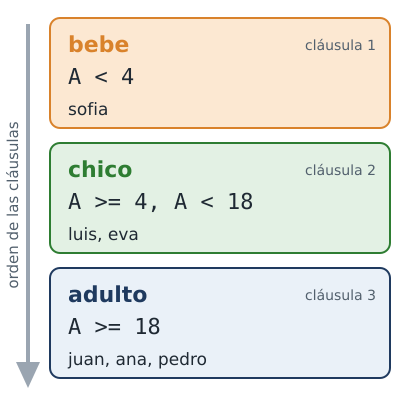
:::
::::

::: notes
Prolog examina las cláusulas de arriba hacia abajo. Con sofia, la respuesta proviene de la primera cláusula y quedan dos sin examinar: al pedir otra respuesta, ninguna se cumple y la respuesta es false. Con juan, la respuesta proviene de la tercera, que es la última, y por eso termina en punto. Las tres condiciones son mutuamente excluyentes a propósito: si se superpusieran, una misma persona pertenecería a dos etapas.
:::

## Términos compuestos

<!-- ejemplo: capitulo-01/mascotas.pl predicado: tiene/2 -->
```prolog
% tiene(P, M): P tiene la mascota M.
tiene(ana, mascota(gato, felix)).
tiene(luis, mascota(perro, rocco)).
tiene(eva, mascota(gato, gaturro)).
tiene(pedro, mascota(tortuga, manuelita)).
```

```prolog
?- tiene(ana, mascota(Especie, Nombre)).
Especie = gato,
Nombre = felix.
```

::: notes
Un argumento puede tener componentes. Mascota de gato y felix es un término compuesto: un símbolo funcional, mascota, seguido de sus argumentos. Se puede consultar completo o por componentes. Una respuesta con dos variables se muestra con una variable por línea, separadas por comas.
:::

## Un término es un árbol

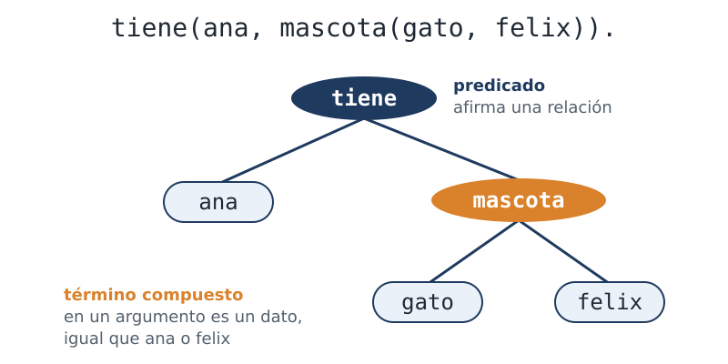

::: notes
Un término compuesto tiene la misma forma que un hecho; lo que cambia es su posición en el programa. Escrito como predicado, afirma una relación o una propiedad de un objeto. Escrito como argumento de otro término, es un dato, igual que el nombre felix. Dibujado como árbol, el símbolo funcional ocupa la raíz y los argumentos cuelgan de ella.
:::

## Un componente

<!-- ejemplo: capitulo-01/mascotas.pl predicado: propietario_de_gato/1 -->
```prolog
%!  propietario_de_gato(?P) is nondet.
%
%   P tiene por lo menos un gato.
propietario_de_gato(P) :-
    tiene(P, mascota(gato, _)).
```

```prolog
?- propietario_de_gato(Quien).
Quien = ana ;
Quien = eva.
```

::: notes
La regla propietario de gato pregunta solo por la especie. El guion bajo ocupa la posición del nombre de la mascota, cuyo valor no interesa. Las respuestas son las dos personas que tienen un gato: ana y eva.
:::

## Unificación

```prolog
?- ana = ana.
true.

?- ana = pedro.
false.

?- Quien = ana.
Quien = ana.
```

::: notes
El signo igual pregunta si dos términos pueden hacerse idénticos. En la última consulta, Prolog responde que sí e informa con qué valor de la variable. El signo igual no es una asignación: es una pregunta sobre si dos términos pueden coincidir. Esa operación, determinar si dos términos pueden coincidir y con qué valores de sus variables, se llama unificación, y el capítulo cuatro está dedicado a ella.
:::

## El igual no evalúa

:::: columns
::: column
```prolog
?- X = 2 + 1.
X = 2+1.

?- 2 + 1 = 3.
false.
```
:::
::: column
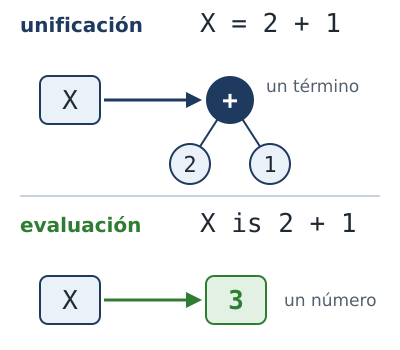
:::
::::

::: notes
Este comportamiento no produce un error sino una respuesta distinta de la esperada. X no queda ligada al número tres, sino al término dos más uno: un término compuesto de nombre más y dos argumentos, cuyo nombre se escribe entre los argumentos: un operador infijo. Por la misma razón, dos más uno y tres no unifican, aunque su valor aritmético sea el mismo. La evaluación se pide de manera explícita, con is, como se ve más adelante.
:::

## Comparar y negar

:::: columns
::: column
<!-- ejemplo: capitulo-01/comparar.pl predicado: mayor_que/2 -->
```prolog
%!  mayor_que(?A, ?B) is nondet.
%
%   A tiene más años que B.
mayor_que(A, B) :-
    edad(A, EdadA),
    edad(B, EdadB),
    EdadA > EdadB.
```
:::
::: column
<!-- ejemplo: capitulo-01/comparar.pl predicado: distintos/2 -->
```prolog
%!  distintos(+A, +B) is semidet.
%
%   A y B no son la misma persona.
distintos(A, B) :-
    \+ A = B.
```

```prolog
?- distintos(ana, pedro).
true.

?- distintos(ana, ana).
false.
```
:::
::::

::: notes
Los números se comparan con los operadores menor, menor o igual, mayor y mayor o igual. El operador formado por una barra invertida y un signo más, antepuesto a un objetivo, significa que ese objetivo no se puede probar. No significa exactamente que sea falso, sino que no se pudo probar: la misma distinción que la respuesta false. El capítulo diez está dedicado a este tema.
:::

## La búsqueda · 1

:::: columns
::: column
<!-- ejemplo: capitulo-01/familia.pl fragmento: padre(juan, ana). .. padre(pedro, eva). -->
```prolog
padre(juan, ana).
padre(juan, pedro).
padre(pedro, luis).
padre(pedro, eva).
```

<!-- ejemplo: capitulo-01/familia.pl fragmento: abuelo(A, N) :- .. padre(P, N). -->
```prolog
abuelo(A, N) :-
    padre(A, P),
    padre(P, N).
```
:::
::: column
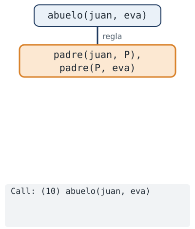
:::
::::

::: notes
Hasta aquí se observaron las respuestas sin examinar cómo se obtienen. La consulta es si juan es abuelo de eva. Prolog encuentra la regla del abuelo, y la consulta se reemplaza por el cuerpo de la regla: hay que probar que juan es padre de alguien, P, y que P es padre de eva. Debajo del árbol se ve lo que escribe la traza, que se activa con trace.
:::

## La búsqueda · 2

:::: columns
::: column
<!-- ejemplo: capitulo-01/familia.pl fragmento: padre(juan, ana). .. padre(pedro, eva). -->
```prolog
padre(juan, ana).
padre(juan, pedro).
padre(pedro, luis).
padre(pedro, eva).
```

<!-- ejemplo: capitulo-01/familia.pl fragmento: abuelo(A, N) :- .. padre(P, N). -->
```prolog
abuelo(A, N) :-
    padre(A, P),
    padre(P, N).
```
:::
::: column
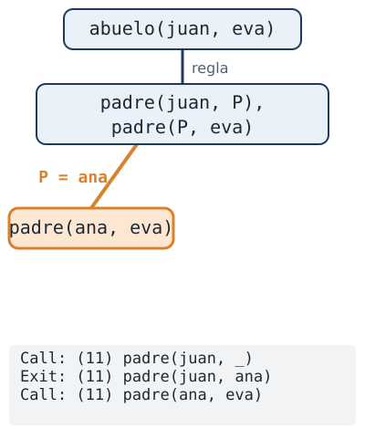
:::
::::

::: notes
Para el primer objetivo, Prolog recorre los hechos de padre de arriba hacia abajo. El primero que sirve es padre de juan y ana, de modo que P queda ligada a ana. Queda por probar el segundo objetivo con ese valor: que ana sea padre de eva.
:::

## La búsqueda · 3

:::: columns
::: column
<!-- ejemplo: capitulo-01/familia.pl fragmento: padre(juan, ana). .. padre(pedro, eva). -->
```prolog
padre(juan, ana).
padre(juan, pedro).
padre(pedro, luis).
padre(pedro, eva).
```

<!-- ejemplo: capitulo-01/familia.pl fragmento: abuelo(A, N) :- .. padre(P, N). -->
```prolog
abuelo(A, N) :-
    padre(A, P),
    padre(P, N).
```
:::
::: column
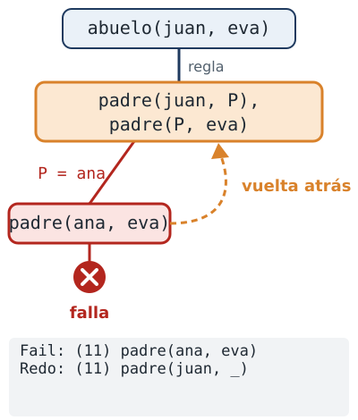
:::
::::

::: notes
Ningún hecho dice que ana sea padre de eva, de modo que ese objetivo falla. Prolog retrocede entonces a la última decisión que tomó, la elección de P, y busca otra alternativa. Este mecanismo de retroceder y explorar la alternativa siguiente se denomina backtracking, en castellano vuelta atrás o retroceso, y es la base del modelo de ejecución de Prolog.
:::

## La búsqueda · 4

:::: columns
::: column
<!-- ejemplo: capitulo-01/familia.pl fragmento: padre(juan, ana). .. padre(pedro, eva). -->
```prolog
padre(juan, ana).
padre(juan, pedro).
padre(pedro, luis).
padre(pedro, eva).
```

<!-- ejemplo: capitulo-01/familia.pl fragmento: abuelo(A, N) :- .. padre(P, N). -->
```prolog
abuelo(A, N) :-
    padre(A, P),
    padre(P, N).
```
:::
::: column
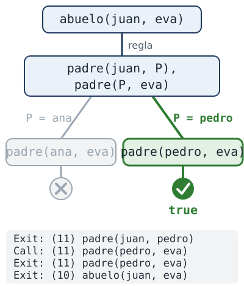
:::
::::

::: notes
El hecho siguiente es padre de juan y pedro, de modo que P queda ligada a pedro. Ahora el segundo objetivo es padre de pedro y eva, y ese hecho está en el programa. Los dos objetivos del cuerpo se probaron, y con ellos la consulta: la respuesta es true. El capítulo cinco representa esta búsqueda como un árbol completo.
:::

## Cuatro puertas

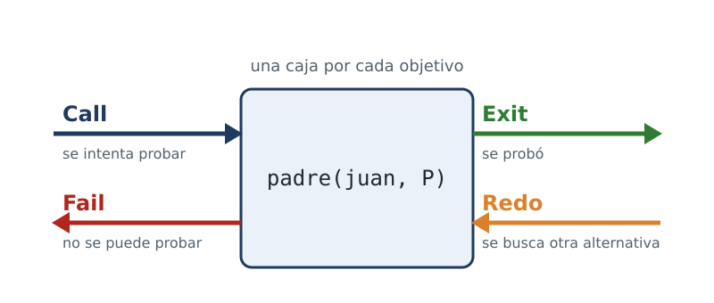

::: notes
Cada línea de la traza nombra un evento. Call: se intenta probar el objetivo. Exit: el objetivo se probó, y se muestran los valores resultantes. Fail: el objetivo no se puede probar. Redo: se regresa a la última decisión tomada y se intenta otra alternativa. Los cuatro eventos son las cuatro puertas de una misma caja, una por cada objetivo. Este diagrama, el modelo de cajas de Byrd, se presenta en el capítulo cinco. El número entre paréntesis de cada línea de la traza indica la profundidad del objetivo.
:::

## El árbol de Taré

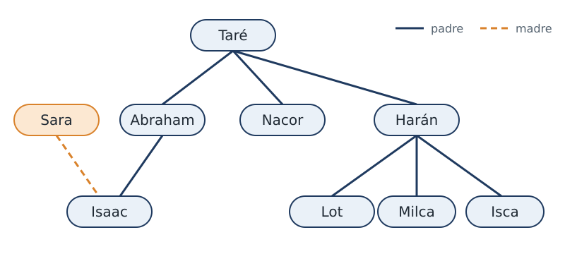

::: notes
Una regla puede invocarse a sí misma. Para verlo se usa otra familia: el árbol de Taré, del Génesis, con el que Sterling y Shapiro comienzan el libro The Art of Prolog. Tiene más generaciones que la familia anterior. Entre Taré e Isaac hay dos generaciones; una regla como la del abuelo recorre exactamente dos, y cada generación adicional requeriría una regla nueva.
:::

## Recursión

:::: columns
::: column
<!-- ejemplo: capitulo-01/antepasados.pl fragmento: antepasado(A, D) :- .. antepasado(Hijo, D). -->
```prolog
antepasado(A, D) :-
    progenitor(A, D).
antepasado(A, D) :-
    progenitor(A, Hijo),
    antepasado(Hijo, D).
```
:::
::: column
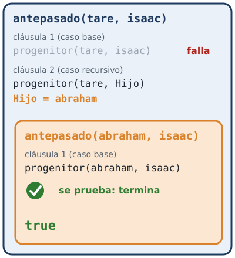
:::
::::

::: notes
La solución es una regla que recorre una generación y vuelve a plantear la misma pregunta desde ese punto. La primera cláusula es el caso base: un progenitor es un antepasado, y no hace falta seguir buscando. La segunda es el caso recursivo: se desciende una generación y se construye la respuesta desde allí. Para Taré e Isaac, el caso base falla; el recursivo elige a Abraham y plantea la misma pregunta para Abraham e Isaac, que el caso base resuelve.
:::

## Primero los hijos

:::: columns
::: column
```prolog
?- antepasado(tare, Quien).
Quien = abraham ;
Quien = nacor ;
Quien = haran ;
Quien = isaac ;
Quien = lot ;
Quien = milca ;
Quien = isca ;
false.
```
:::
::: column
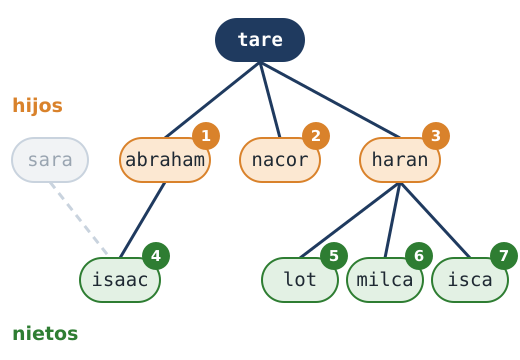
:::
::::

::: notes
Primero aparecen los hijos y después los nietos, porque la cláusula del caso base está escrita antes que la del caso recursivo. La enumeración termina en false: después de isca todavía quedaban alternativas, el caso recursivo aplicado a los hijos de Harán, y ninguna aporta una respuesta nueva. Ese false final no indica que algo haya fallado, sino que se agotaron las alternativas. La recursión termina porque cada llamada desciende una generación y el árbol es finito.
:::

## Aritmética

<!-- ejemplo: capitulo-01/aritmetica.pl predicado: doble/2 -->
```prolog
%!  doble(+N, -D) is det.
%
%   D es el doble de N.
doble(N, D) :-
    D is N * 2.
```

```prolog
?- doble(21, X).
X = 42.

?- doble(X, 42).
ERROR: Arguments are not sufficiently instantiated
```

::: notes
Las expresiones aritméticas no se evalúan de manera automática: la evaluación se pide con is. A la izquierda se escribe la variable que recibe el resultado, que debe estar libre o ya ligada a ese resultado; a la derecha, la expresión. La expresión debe poder evaluarse en el momento de la llamada, con todas sus variables ligadas a un número. Por eso doble calcula el doble a partir del número, pero no el número a partir del doble: la segunda consulta termina en un error que indica que faltó un valor. El capítulo ocho explica la causa.
:::

## Salida de texto

<!-- ejemplo: capitulo-01/escribir.pl predicado: saludar/1 -->
```prolog
%!  saludar(+A) is det.
%
%   Escribe un saludo para A y pasa a la línea siguiente.
saludar(A) :-
    write('Hola, '),
    write(A),
    nl.
```

```prolog
?- saludar(ana).
Hola, ana
true.
```

::: notes
Un programa también puede escribir texto durante su ejecución. Write escribe un término y nl produce un salto de línea. La salida tiene dos partes: el texto que escribió el programa y, a continuación, la respuesta de la consulta. Son elementos distintos, aunque aparezcan juntos. El saludo va entre comillas simples porque es un átomo que contiene una coma y un espacio.
:::

## format/2

<!-- ejemplo: capitulo-01/escribir.pl fragmento: presentar(A, N) :- .. format( -->
```prolog
presentar(A, N) :-
    format("~w tiene ~w hermanos~n", [A, N]).
```

```prolog
?- presentar(ana, 2).
ana tiene 2 hermanos
true.
```

::: notes
Para texto que incluye valores es preferible format. Su primer argumento es un texto de formato, entre comillas dobles; el segundo es la lista de los valores que se insertan en él.
:::

## Texto con valores

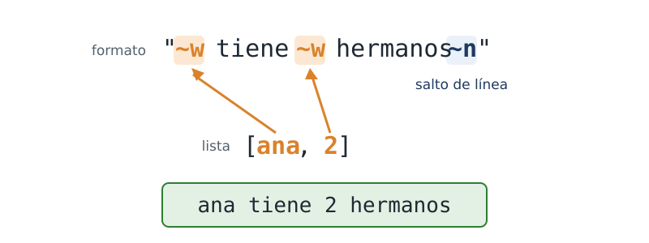

::: notes
En el texto de formato, cada marca formada por una virgulilla y la letra w recibe el valor siguiente de la lista, y la virgulilla con la letra n produce un salto de línea. Las comillas simples encierran un nombre, un átomo; las comillas dobles encierran texto. El capítulo once trata esa diferencia.
:::

## Contar de 1 a 5

:::: columns
::: column
<!-- contexto: capitulo-01/contar.pl -->
```prolog
?- between(1, 5, N).
N = 1 ;
N = 2 ;
N = 3 ;
N = 4 ;
N = 5.
```
:::
::: column
```prolog
?- cuenta(1, 5).
1
2
3
4
5
true ;
false.
```
:::
::::

::: notes
El predicado predefinido between genera, de a uno por vez, todos los enteros de un intervalo. Una regla recursiva, cuenta, también puede recorrer un intervalo, del mismo modo que antepasado recorría el árbol. Su respuesta termina en true y queda en espera, porque la segunda cláusula todavía no se descartó. Al pedirla, esa alternativa falla y la respuesta final es false.
:::

## cuenta/2

<!-- ejemplo: capitulo-01/contar.pl predicado: cuenta/2 -->
```prolog
%!  cuenta(+Desde, +Hasta) is det.
%
%   Escribe los números de Desde a Hasta, uno por línea.
cuenta(Desde, Hasta) :-
    Desde =< Hasta,
    format("~w~n", [Desde]),
    Siguiente is Desde + 1,
    cuenta(Siguiente, Hasta).
cuenta(Desde, Hasta) :-
    Desde > Hasta.
```

::: notes
Las dos cláusulas corresponden al caso recursivo y al caso base. Mientras Desde no supera a Hasta, se escribe el número y se continúa con el siguiente. Cuando lo supera, no queda nada por escribir y la ejecución termina. Las dos cláusulas son mutuamente excluyentes: cuando una es aplicable, la otra no.
:::

## Una llamada por número

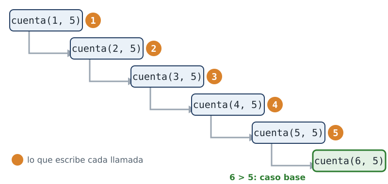

::: notes
Cada llamada escribe su número y llama a cuenta con el número siguiente. La sexta llamada, cuenta de seis y cinco, ya no cumple la condición del caso recursivo: seis es mayor que cinco, se aplica el caso base y la cadena termina.
:::

## Listas

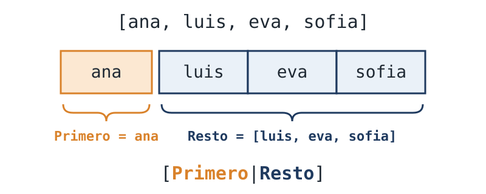

::: notes
Una lista se escribe entre corchetes, con los elementos separados por comas. Sus elementos pueden ser términos de cualquier tipo, incluso otras listas. Una lista también se puede descomponer en su primer elemento y la lista de los restantes, con la notación de corchetes y barra vertical. Esta notación es la base de casi todo el procesamiento de listas, y el capítulo siete la usa de manera sistemática.
:::

## Pertenencia

<!-- ejemplo: capitulo-01/listas.pl fragmento: invitados([ana .. member(P, Lista). -->
```prolog
invitados([ana, luis, eva, sofia]).

%!  esta_invitado(?P) is nondet.
%
%   P está en la lista de invitados.
esta_invitado(P) :-
    invitados(Lista),
    member(P, Lista).
```

```prolog
?- esta_invitado(Quien).
Quien = ana ;
Quien = luis ;
Quien = eva ;
Quien = sofia.
```

::: notes
Member es un predicado predefinido que determina si un elemento pertenece a una lista, y length relaciona una lista con su cantidad de elementos. Se repite lo observado con padre: con un argumento concreto, la consulta verifica la pertenencia; con una variable, enumera todos los elementos.
:::

## [Primero|Resto]

<!-- ejemplo: capitulo-01/listas.pl predicado: primero_en_llegar/1 los_demas/1 -->
```prolog
%!  primero_en_llegar(-P) is det.
%
%   P es el primer elemento de la lista.
primero_en_llegar(P) :-
    invitados([P|_]).

%!  los_demas(-Resto) is det.
%
%   Resto es la lista sin su primer elemento.
los_demas(Resto) :-
    invitados([_|Resto]).
```

```prolog
?- los_demas(Resto).
Resto = [luis, eva, sofia].
```

::: notes
La cabeza de la regla descompone la lista de invitados. En primero en llegar, la variable toma el primer elemento y el resto no interesa. En los demás ocurre lo contrario: el primer elemento no interesa y la variable toma la lista de los restantes.
:::

## Resumen

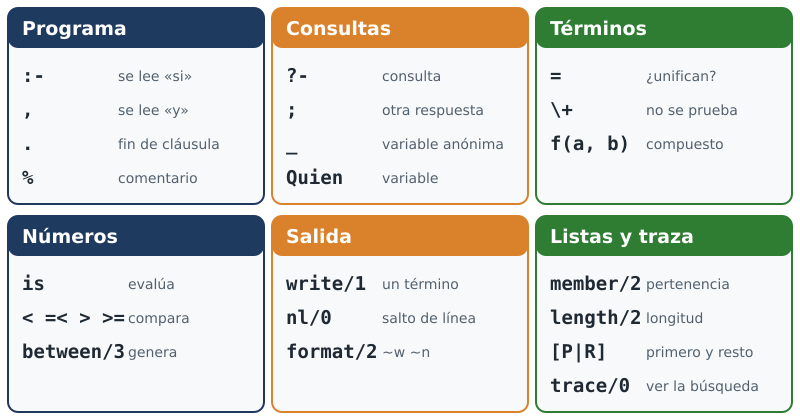

::: notes
El capítulo presentó los hechos, las reglas, las cláusulas y las consultas; los predicados y su aridad; las variables, incluida la anónima; los términos compuestos y la unificación; la cabeza y el cuerpo de una regla; el caso base y el caso recursivo; y el backtracking. Ninguno de estos temas se trató de manera completa: los capítulos dos a once los retoman, uno por vez.
:::

## Créditos

Retrato de Alain Colmerauer (1988): Alaindavid2, CC BY-SA 4.0, Wikimedia Commons, commons.wikimedia.org/wiki/File:A-Colmerauer_web-800x423.jpg

Ilustraciones: dibujadas para el curso, licencia MIT.

Ejemplos: ejemplos/capitulo-01 del curso.

::: notes
La fotografía de Alain Colmerauer se publica en Wikimedia Commons bajo la licencia Creative Commons Atribución Compartir Igual 4.0. Las ilustraciones se dibujaron para el curso y se distribuyen con él, bajo la licencia MIT.
:::
