# Capítulo 2 — Hechos, consultas y variables

::: notes
El capítulo trata los elementos más simples de Prolog: hechos y consultas, sin
ninguna regla. Con ellos se construye una base de conocimiento, se le formulan
consultas y se establece con precisión qué significa cada respuesta, incluida
false. Al final se presenta la notación con que se documenta el uso de un
predicado.
:::

## Objetos y relaciones

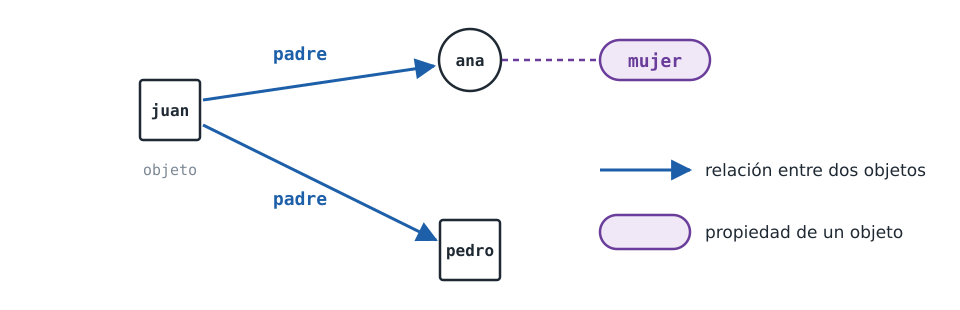

::: notes
Un programa Prolog describe objetos y relaciones entre ellos. Los objetos son
las entidades sobre las que trata el programa; en este capítulo son personas:
juan, ana, pedro.

La flecha representa una relación entre dos objetos: «juan es el padre de
ana». La etiqueta violeta enuncia algo sobre un único objeto: «ana es mujer».
En Prolog las dos se escriben de la misma manera y ambas se denominan
relaciones, aunque a la segunda le corresponde más propiamente el nombre de
propiedad.
:::

## Dos decisiones por relación

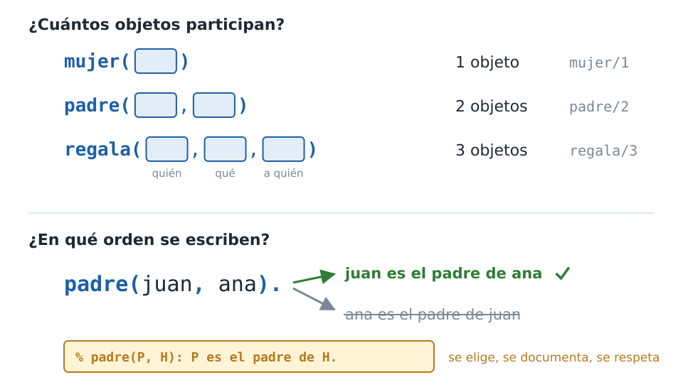

::: notes
Antes de escribir los hechos de una relación se toman dos decisiones.

La primera es cuántos objetos participan: uno para «ser mujer», dos para «ser
padre», tres para «dar un regalo» (quién regala, qué regala y a quién). Esa
cantidad forma parte del nombre del predicado: mujer/1, padre/2, regala/3.

La segunda es el orden de los argumentos. padre(juan, ana) admite dos lecturas,
y Prolog no dispone de información para elegir entre ellas. Se elige una, se la
documenta en un comentario como el del recuadro y se la usa de manera
consistente en todo el programa.
:::

## La familia del capítulo

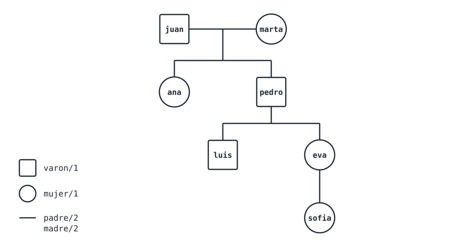

::: notes
Esta es la familia que describe el programa hechos.pl. El cuadrado indica un
hecho de varon/1 y el círculo, uno de mujer/1; cada línea de descendencia
corresponde a un hecho de padre/2 o de madre/2.

juan y marta son los padres de ana y de pedro; pedro es el padre de luis y de
eva; eva es la madre de sofia. Conviene retener un detalle: el programa no
indica quién es el padre de sofia. Esa ausencia reaparece más adelante.
:::

## Los hechos del programa

<!-- ejemplo: capitulo-02/hechos.pl predicado: padre/2 madre/2 -->
```prolog
% padre(P, H): P es el padre de H.
padre(juan, ana).
padre(juan, pedro).
padre(pedro, luis).
padre(pedro, eva).

% madre(M, H): M es la madre de H.
madre(marta, ana).
madre(marta, pedro).
madre(eva, sofia).
```

::: notes
Un hecho afirma que una relación se cumple entre objetos determinados. La
base de conocimiento del capítulo está formada exclusivamente por hechos; aquí
se muestran los de padre/2 y madre/2. El archivo completo agrega varon/1 y
mujer/1 con la misma forma.

Cada predicado lleva, encima de sus hechos, un comentario de una línea que
fija el significado de cada posición. Los comentarios comienzan con el signo de porcentaje y se
extienden hasta el fin de la línea; Prolog los ignora.
:::

## Anatomía de un hecho

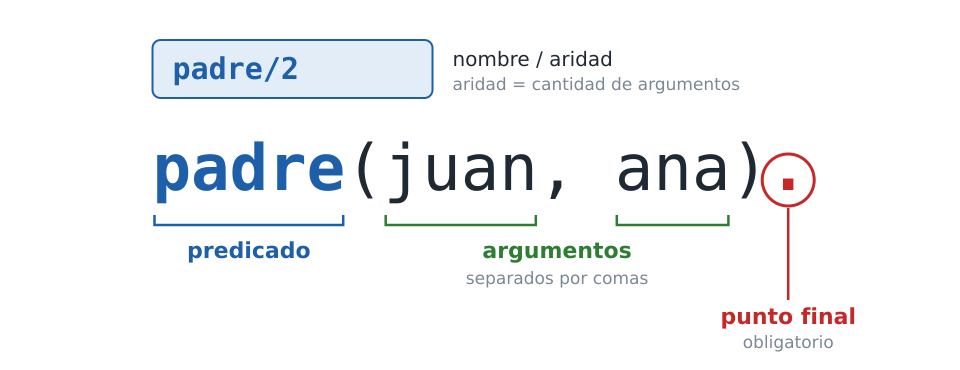

::: notes
Cada línea tiene la misma estructura: el nombre de la relación, en minúscula,
que se denomina predicado; los objetos entre paréntesis y separados por comas,
que se denominan argumentos; y un punto final.

Un predicado se identifica por su nombre y su aridad, la cantidad de
argumentos, separados por una barra: padre/2. Esa notación aparece en todo el
curso y en los mensajes de error de Prolog.

El punto es obligatorio, y su omisión es el error más frecuente al comenzar.
:::

## Tres errores de sintaxis

```text
2 | padre(juan, ana)       <- sin punto
ERROR: familia.pl:2:17: Syntax error: Operator expected
```
```text
2 | padre(juan, ana),      <- coma en lugar de punto
ERROR: familia.pl:2:
ERROR:    Full stop in clause-body?  Cannot redefine ,/2
```
```text
2 | padre (juan, ana).     <- espacio antes del paréntesis
ERROR: familia.pl:2:6: Syntax error: Operator expected
```

::: notes
Los tres mensajes corresponden a un archivo familia.pl de tres líneas:
varon(juan). en la primera, la línea defectuosa en la segunda y mujer(ana). en
la tercera. Son los mensajes que emite SWI-Prolog 9 al cargarlo.

Sin el punto, Prolog continúa leyendo la línea siguiente como parte de la
misma cláusula, y la posición informada es donde se detuvo la lectura: el
final de la línea sin punto, línea dos, columna diecisiete, o la línea
siguiente si entre ambas hay una línea en blanco. Con una coma en lugar del punto, el mensaje sugiere la causa:
pregunta si faltó terminar la cláusula. Un espacio entre el nombre y el
paréntesis produce una construcción sintáctica diferente.

En los tres casos el programa no se cargó: se corrige el error y se carga de
nuevo.
:::

## Átomos, números y variables

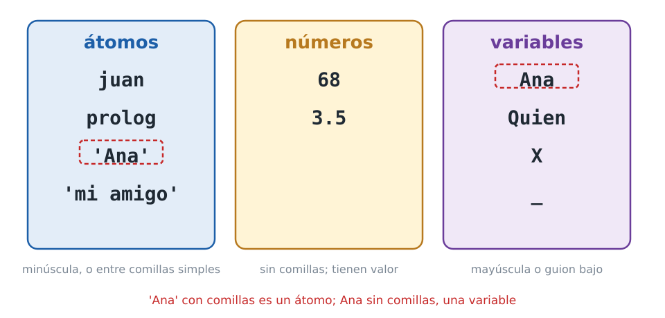

::: notes
Los nombres en minúscula, como juan o prolog, se denominan átomos. Un átomo es
un objeto identificado únicamente por su nombre: no tiene componentes ni valor
asociado.

Los números son objetos de otra clase: se escriben tal como son, sin comillas,
y tienen un valor con el que se puede operar (capítulo 8).

Un nombre que no comienza con minúscula, o que contiene espacios, se escribe
entre comillas simples y sigue siendo un átomo. Sin comillas, Ana es una
variable: su nombre comienza con mayúscula. Las variables son el tema de la
sección 2.6.
:::

## El nombre y la aridad

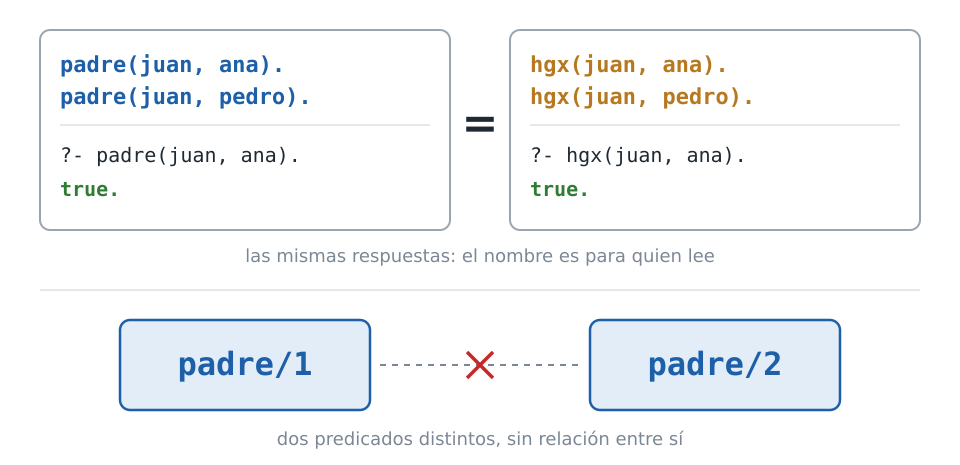

::: notes
El nombre padre no tiene ningún significado para el sistema. Si se reemplazara
padre por hgx en todo el programa, las respuestas serían exactamente las
mismas. El nombre está destinado a quienes escriben y leen el programa. Lo
mismo se aplica al orden de los argumentos: su significado es el que fija el
comentario.

Dos predicados con el mismo nombre y distinta aridad son predicados distintos,
sin ninguna relación entre sí: padre/1 y padre/2 son tan independientes como
dos predicados con nombres diferentes.
:::

## Dónde se escribe cada cosa: SWISH

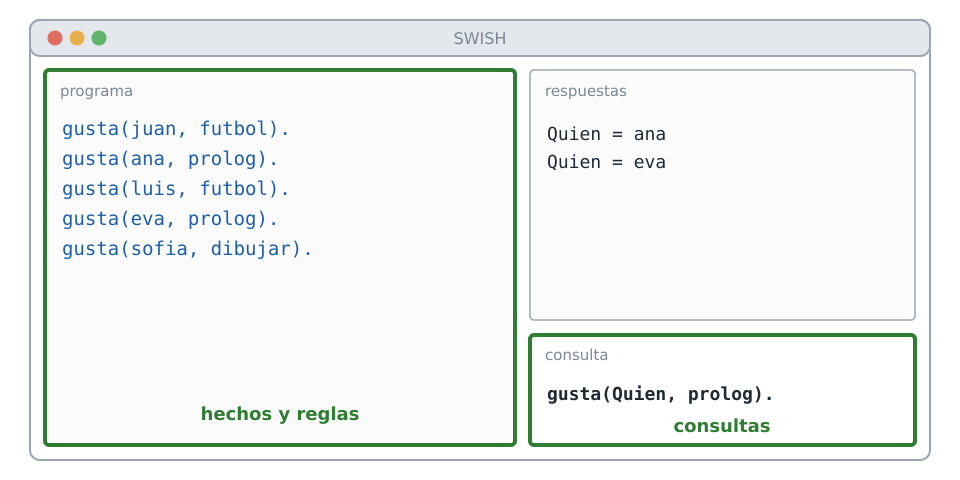

::: notes
Los hechos se escriben en un archivo, no en la casilla de consultas. Aunque
parece un detalle operativo, es la causa de la primera dificultad de la
mayoría de quienes comienzan.

En SWISH, el entorno al que apuntan los enlaces del curso, el programa ocupa
el panel de la izquierda: allí van los hechos y las reglas. Las consultas se
escriben en la casilla inferior derecha, y las respuestas aparecen encima de
ella.
:::

## En una instalación local

```text
swipl familia.pl
```
```prolog
?- consult('familia.pl').
true.
```
```prolog
:- encoding(utf8).
```

::: notes
En una instalación local, los hechos se escriben en un archivo de texto con
extensión .pl. El archivo se carga al iniciar el intérprete, pasándolo en la
línea de comandos, o desde el intérprete con consult/1.

Si el archivo contiene acentos o eñes, por ejemplo en los comentarios, su
primera línea debe ser la directiva que declara la codificación UTF-8, la
que muestra la diapositiva. Sin ella, SWI-Prolog en
Windows lee el archivo con la codificación del sistema, y un carácter
acentuado produce un error de sintaxis que impide cargar el archivo completo.
Todos los ejemplos del curso la incluyen.

La respuesta de consult/1 depende de la sesión y no del programa; por eso la
herramienta que verifica las transcripciones del curso no la ejecuta.
:::

## Un hecho en la casilla de consultas

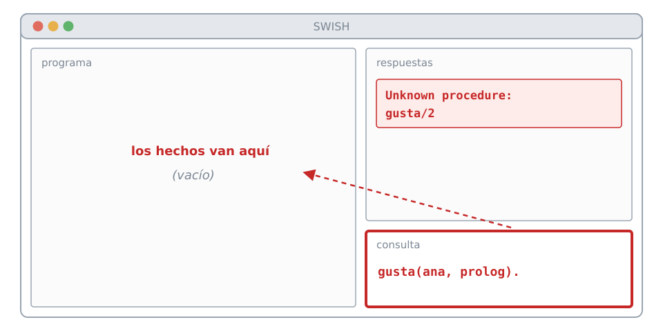

::: notes
Un hecho escrito en la casilla de consultas no se agrega al programa: Prolog
lo interpreta como una consulta. Como el predicado todavía no está definido,
informa un error: el procedimiento gusta/2 no existe, como muestra la
diapositiva.

La intención es cargar datos, pero lo que se ejecuta es una consulta sobre
datos que no se cargaron. La solución es escribir el hecho en el panel del
programa y ejecutar la consulta nuevamente.

Actividad del capítulo: abrir un ejemplo en SWISH, escribir un hecho nuevo en
la casilla de consultas, moverlo después al panel del programa y comparar los
resultados.
:::

## Una consulta sin punto final

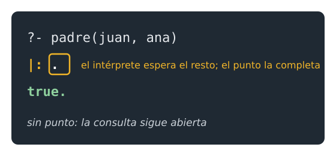

::: notes
Una consulta sin punto final no produce ningún error. Prolog no la rechaza:
queda en espera, porque considera que la consulta no terminó. En una
instalación local aparece una barra vertical seguida de dos puntos al
comienzo de la línea nueva, que indica que el
intérprete espera el resto de la entrada. Al ingresar el punto y presionar
Enter, la consulta se ejecuta.
:::

## Consultas

```prolog
?- padre(juan, ana).
true.

?- padre(juan, luis).
false.

?- mujer(eva).
true.

?- padre(ana, juan).
false.
```

::: notes
Una consulta pregunta si una relación se cumple. Se escribe igual que un
hecho; la única diferencia es el lugar donde se la escribe. El signo de pregunta
seguido de un guion es el indicador que Prolog muestra cuando espera una consulta y no forma parte de lo
que se ingresa.

true. indica que la consulta se deduce del contenido del programa; aquí la
deducción es directa, porque el hecho está escrito de manera literal.

El orden de los argumentos es significativo: padre(juan, ana) está en el
programa y padre(ana, juan) no. Son dos consultas distintas, y por eso se
documenta el significado de cada posición.
:::

## Lo que no está en el programa

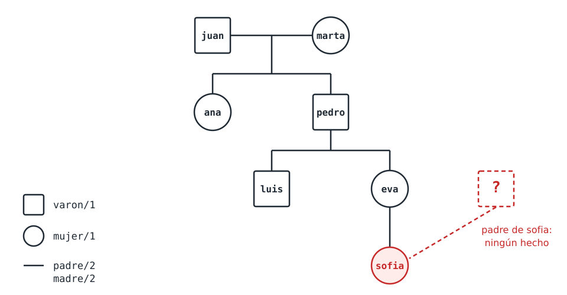

::: notes
La base de conocimiento no indica quién es el padre de sofia: contiene
madre(eva, sofia) y ningún otro hecho sobre ella.

Por eso la consulta padre(juan, sofia) responde false. Sofía tiene un padre;
lo que ocurre es que esa información no está en el programa. La respuesta
false. no significa «la afirmación es falsa»: significa
que la consulta no se puede probar con el contenido del programa. La
diferencia es fundamental.
:::

## El supuesto de mundo cerrado

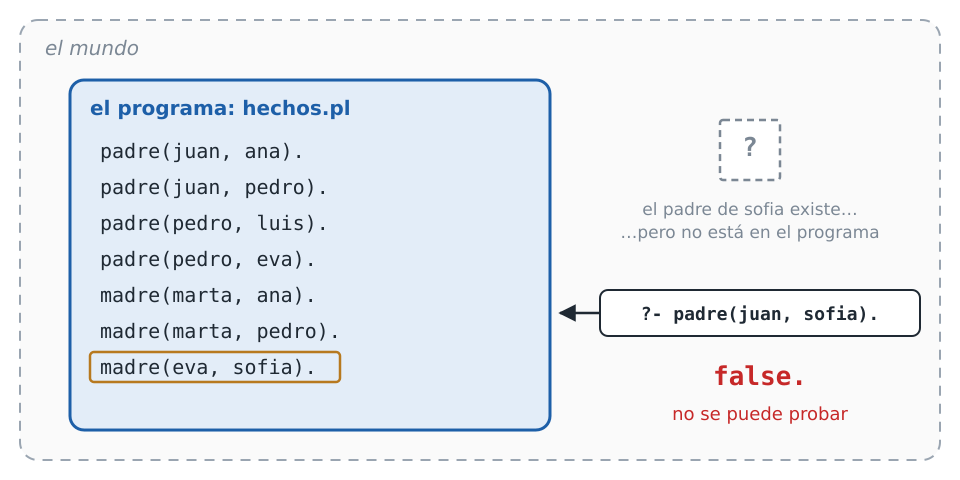

::: notes
Este criterio se denomina supuesto de mundo cerrado: Prolog opera como si el
programa contuviera toda la información relevante, y considera no cierto todo
lo que no se puede deducir de él.

El programa describe una parte del mundo. El padre de sofia existe fuera de
esa parte, pero la consulta solo puede recurrir a los hechos del recuadro, y
ninguno de ellos la prueba. El supuesto tiene consecuencias más profundas, que
se tratan en el capítulo 10.
:::

## Dos resultados negativos

```prolog
?- padre(juan, sofia).
false.

?- hermano(ana, pedro).
ERROR: Unknown procedure: hermano/2 (DWIM could not correct goal)
```

::: notes
Existe otra forma en que una consulta puede no tener éxito, de naturaleza
distinta. La segunda respuesta no es false.: Prolog informa que el programa no
define ninguna relación llamada hermano/2. No se trata de que no pueda probar
que ana y pedro son hermanos; se trata de que el predicado consultado no
existe.

false. significa que la relación está definida y la consulta no se puede
probar. ERROR: Unknown procedure significa que la relación no está definida.

La segunda transcripción muestra el estado de un programa que no define el
predicado; la herramienta que verifica las transcripciones del curso la
reconoce como tal y no la ejecuta.
:::

## false. o ERROR

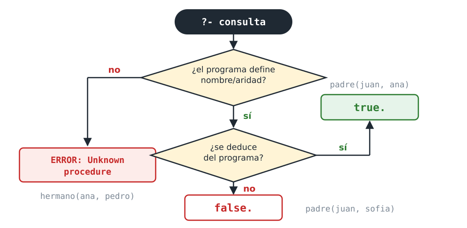

::: notes
La distinción tiene importancia práctica, porque el error corresponde casi
siempre a una equivocación de quien programa. Las causas posibles son seis:

1. el archivo no se cargó, o se lo modificó y no se lo volvió a cargar;
2. el nombre está mal escrito en la consulta (padres/2 en lugar de padre/2);
3. el nombre está mal escrito en el programa, en todas sus cláusulas;
4. la aridad no coincide: se definió padre/2 y se consultó padre/3;
5. el hecho se escribió en la casilla de consultas;
6. el predicado todavía no se escribió.

Por eso el mensaje informa siempre el nombre y la aridad: la aridad es parte de la
identificación del predicado.

Clocksin y Mellish indican que una consulta sobre un predicado desconocido
responde no; ese era el comportamiento de las implementaciones de la época.
SWI-Prolog 9 informa un error. Los textos antiguos anteponen además una
barra vertical a ese indicador.
:::

## Un nombre parecido

```prolog
?- padres(juan, ana).
Correct to: "padre(juan,ana)"?
```

```text
ERROR: Unknown procedure: padres/2
ERROR:   However, there are definitions for:
ERROR:         padre/2
```

::: notes
Si el predicado consultado es similar a uno que existe, SWI-Prolog, en una
instalación local, propone la corrección antes de informar el error. Se
responde y o n; el segundo bloque es lo que se informa al rechazar la
corrección.

Esta asistencia es propia del intérprete local; en SWISH se muestra
directamente el error. En ambos entornos, lo importante es reconocer que el
problema está en el nombre.
:::

## Los gustos de la familia

<!-- ejemplo: capitulo-02/variables.pl predicado: gusta/2 -->
```prolog
% gusta(P, C): a P le gusta C.
gusta(juan, futbol).
gusta(ana, prolog).
gusta(luis, futbol).
gusta(eva, prolog).
gusta(sofia, dibujar).
```

::: notes
El archivo variables.pl repite la familia de hechos.pl y agrega gusta/2, que
relaciona a cada persona con algo que le gusta.

Las consultas anteriores se refieren siempre a objetos concretos. Una
variable es una posición que se deja sin especificar para que Prolog le
asigne un valor. Su nombre comienza con mayúscula o con un guion bajo: Quien,
X, Persona y Cualquier_cosa son variables; quien y persona son átomos.
:::

## Preguntar quién o qué

```prolog
?- gusta(ana, Que).
Que = prolog.

?- gusta(Quien, prolog).
Quien = ana ;
Quien = eva.

?- gusta(Quien, cocinar).
false.
```

::: notes
Prolog busca un valor de Que que haga cierta la consulta, lo encuentra y lo
informa. Cuando una variable recibe un valor, se dice que queda instanciada o
ligada.

La misma relación se consulta en sentido inverso con el mismo predicado. No
existe un predicado para buscar gustos y otro para buscar personas: existe
gusta/2, y la consulta determina qué posición queda sin especificar. Es una de
las propiedades más usadas de Prolog.

Cuando no existe ninguna respuesta, Prolog responde false.: no se puede
probar, con el contenido del programa, que a alguien le guste cocinar.

Plantilla 1 del curso: cuando se conoce una parte de la relación y se
necesita la otra, se consulta relacion(dato_conocido, Incognita). La primera
respuesta se obtiene de manera directa y las siguientes se solicitan con punto y coma.
:::

## Paso a paso (1)

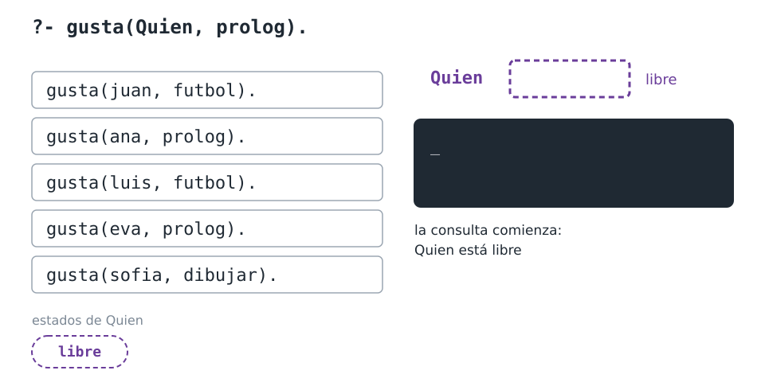

::: notes
Las cuatro diapositivas siguientes recorren la consulta gusta(Quien, prolog).

Al formularse la consulta, la variable Quien está libre: es una posición sin
determinar. La franja inferior registra los estados por los que pasa.
:::

## Paso a paso (2)

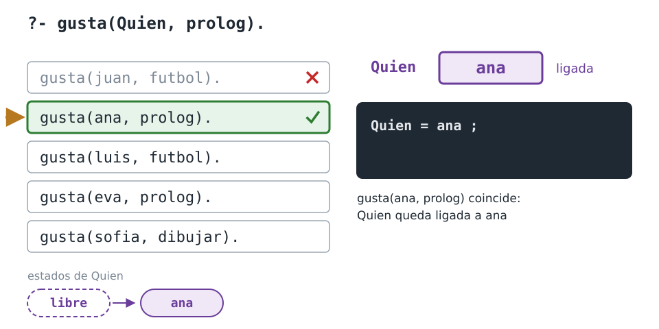

::: notes
Prolog examina los hechos de gusta/2. gusta(juan, futbol) no sirve, porque su
segundo objeto no es prolog. gusta(ana, prolog) sí: Quien queda ligada a ana,
y Prolog muestra la respuesta y queda en espera.

El orden exacto en que Prolog examina los hechos se estudia en el capítulo 5.
:::

## Paso a paso (3)

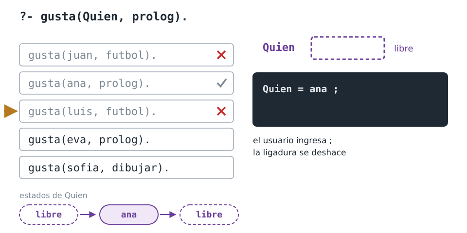

::: notes
El punto y coma lo ingresa el usuario para solicitar la respuesta siguiente.

La ligadura no es permanente: dura lo que dura la demostración de una
respuesta. Al solicitarse la siguiente, Prolog la deshace, y Quien vuelve a
estar libre antes de recibir el valor que corresponda. La búsqueda continúa
por el hecho siguiente.
:::

## Paso a paso (4)

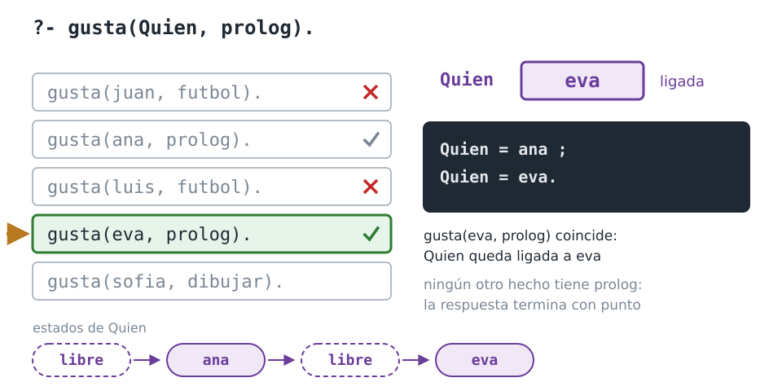

::: notes
gusta(eva, prolog) liga Quien a eva. Ningún otro hecho tiene prolog en la
segunda posición, y Prolog lo determina sin quedar en espera: la respuesta
termina con punto.

Quien atravesó cuatro estados: libre al formularse la consulta, ligada a ana,
libre otra vez y ligada a eva. El capítulo 3 recorre ese ir y venir con reglas.
:::

## Dos incógnitas

```prolog
?- gusta(Quien, Que).
Quien = juan,
Que = futbol ;
Quien = ana,
Que = prolog ;
Quien = luis,
Que = futbol ;
...
```

::: notes
Se pueden dejar las dos posiciones sin especificar. Cuando una respuesta
incluye más de una variable, Prolog las muestra una por línea, separadas por
comas.

Los puntos suspensivos indican que la transcripción se interrumpe: quedan
más respuestas.
:::

## Una variable repetida

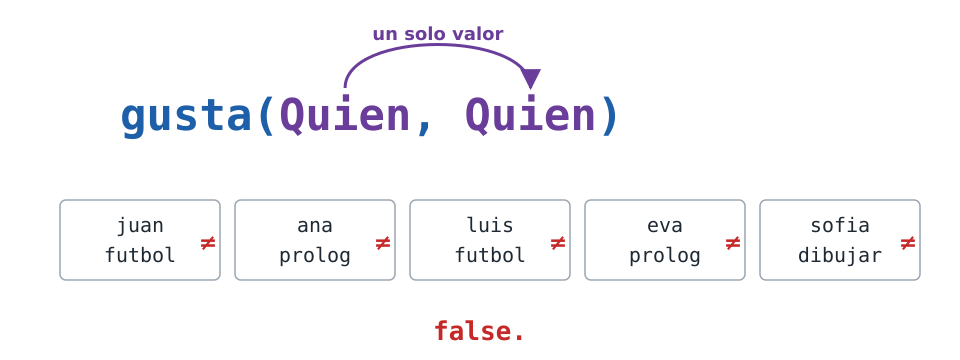

::: notes
Una variable ligada se comporta, desde ese momento, como el valor que recibió.
Por eso una variable repetida no pregunta por dos objetos sino por uno solo:
en cuanto la primera posición liga Quien, la segunda queda obligada al mismo
valor.

La consulta gusta(Quien, Quien) pregunta por alguien cuyo gusto coincida con
su propio nombre. Ningún hecho de gusta/2 tiene el mismo objeto en las dos
posiciones, de modo que la respuesta es false.

En el otro extremo, una consulta sin variables, como gusta(juan, futbol), no
liga nada, y su respuesta es true. sin mencionar ningún valor.
:::

## La variable anónima

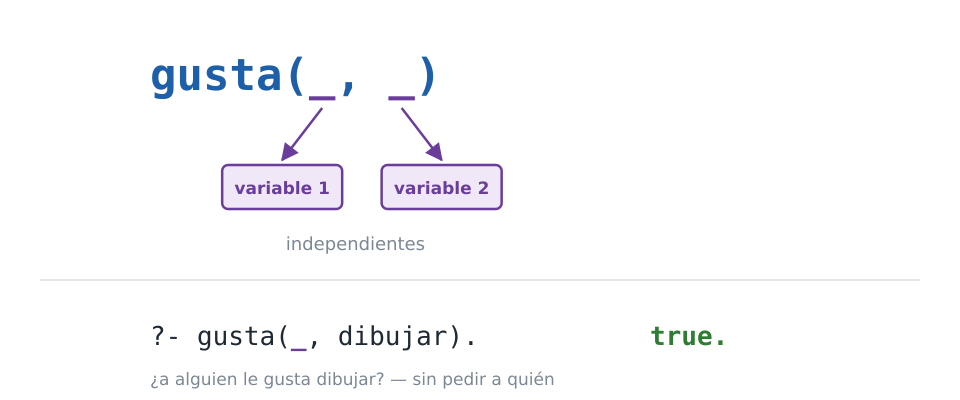

::: notes
Cuando el valor de una posición no interesa, se escribe un guion bajo, que se
denomina variable anónima. Con un guion bajo en el primer argumento y dibujar
en el segundo, la consulta pregunta si a alguien le gusta dibujar,
sin solicitar a quién. La respuesta es true., y no un valor, porque la
consulta no solicita ninguno.

Cada guion bajo es una variable distinta, aunque se escriban igual: con un
guion bajo en cada argumento de gusta, las dos posiciones se instancian de
manera independiente.
:::

## Todas las respuestas

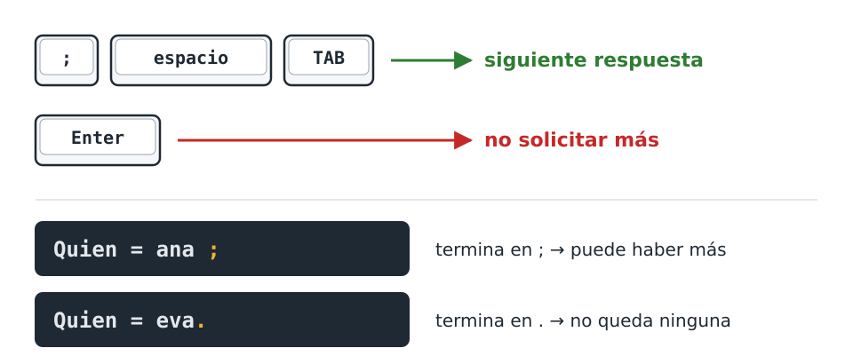

::: notes
Cuando una consulta tiene más de una respuesta, Prolog muestra la primera y
queda en espera. El punto y coma, la barra espaciadora o la tecla TAB
solicitan la respuesta siguiente; Enter indica que no se solicitan más.

La forma en que termina una respuesta aporta información. Si termina en punto y coma
y Prolog continúa en espera, puede haber más respuestas. Si termina en punto,
Prolog determinó que no queda ninguna.
:::

## Cómo llega cada argumento

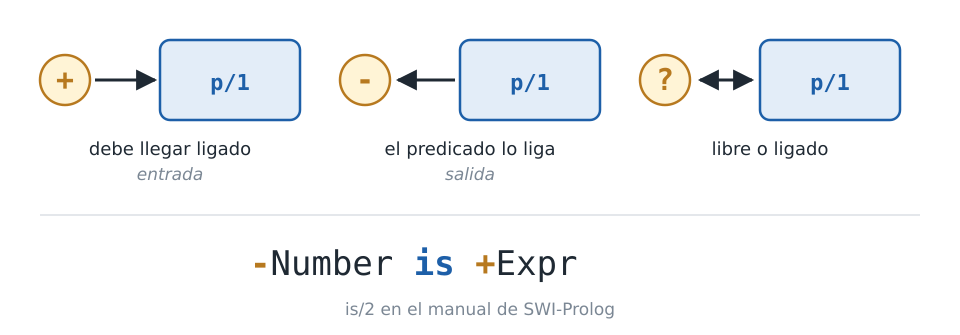

::: notes
gusta/2 se consultó de tres maneras: con el primer argumento conocido, con el
segundo, y con los dos. Un predicado definido solo por hechos admite todas
esas combinaciones, pero no todos los predicados lo hacen.

Por eso se documenta en qué estado debe llegar cada argumento, con un signo
delante de su nombre. El signo más indica que debe estar ligado: es un
argumento de entrada. El signo menos indica que normalmente está libre y el
predicado lo liga: es un argumento de salida. El signo de interrogación indica
que puede estar libre o ligado.

El manual de SWI-Prolog documenta is/2 con Number marcado con el signo menos y Expr con
el signo más: la expresión es
de entrada y el número, de salida.
:::

## is/2 en cada modo

```prolog
?- X is 2 + 3.
X = 5.

?- 5 is 2 + 3.
true.

?- X = 5, X is 2 + 3.
X = 5.

?- X is Y + 1.
ERROR: Arguments are not sufficiently instantiated
```

::: notes
Un argumento de salida puede llegar ligado: el predicado se comporta como si
hubiera llegado libre y después compara el resultado con ese valor. Por eso
las tres primeras consultas funcionan.

En la tercera, X igual a cinco liga X antes de llegar a is; is calcula cinco
y lo compara con el valor de X. Con X igual a seis la respuesta sería false.

La cuarta falla con un error porque el argumento de entrada no está ligado:
Y no tiene valor.
:::

## Cuántas respuestas

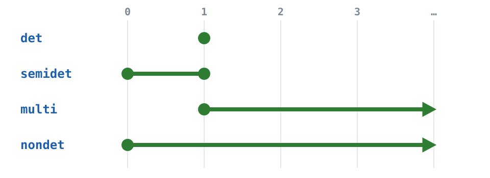

::: notes
La documentación indica, además, cuántas respuestas produce el predicado:
det, exactamente una; semidet, una o ninguna; multi, una o más; nondet,
cualquier cantidad, incluida ninguna.

La cantidad depende de qué argumentos lleguen ligados. gusta(juan, futbol),
con los dos ligados, tiene una respuesta o ninguna; gusta(Quien, prolog)
puede tener varias. Por eso se escribe una línea por cada forma de uso que
interese.

El encabezado describe cuántas respuestas existen, no la forma en que Prolog
termina de mostrarlas: un predicado semidet puede quedar en espera de un punto y coma
y responder después false. El capítulo 5 explica por qué.
:::

## El encabezado de una regla

<!-- ejemplo: capitulo-01/familia.pl predicado: abuelo/2 -->
```prolog
%!  abuelo(?A, ?N) is nondet.
%
%   A es abuelo de N cuando es el padre de su padre.
abuelo(A, N) :-
    padre(A, P),
    padre(P, N).
```

::: notes
Toda regla del curso lleva un encabezado con esa información, escrito en el
formato de SWI-Prolog. Este es el de abuelo/2, la primera regla del
capítulo 1.

La primera línea comienza con un signo de porcentaje y uno de exclamación, y
declara los modos y la cantidad de respuestas; puede haber varias líneas así
seguidas, una por cada forma de uso. Una línea con solo el signo de porcentaje
la separa de la descripción, que dice qué significa la
relación con los mismos nombres de argumentos.

Todo el encabezado es un comentario: Prolog lo ignora. Los hechos conservan el
comentario de una línea, porque un predicado definido solo por hechos se
consulta con cualquier combinación de argumentos: todos llevan el signo de
interrogación. Este formato se denomina PlDoc; el capítulo 14 lo presenta
completo, con los demás signos de modo.
:::
