## Una consulta, dos objetivos

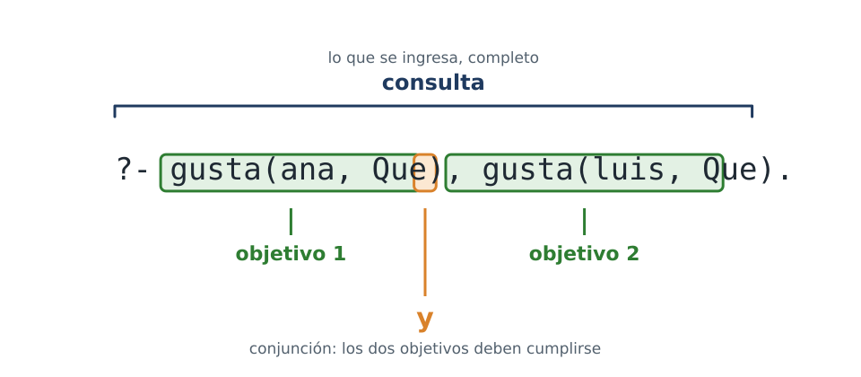

::: notes
Hasta aquí, cada consulta planteaba una sola pregunta. Una consulta puede
constar de varias preguntas, separadas por comas.

Conviene distinguir dos términos. La consulta es el texto completo que se
ingresa. Cada una de las condiciones que Prolog debe probar para responderla es
un objetivo. Esta consulta es una sola y tiene dos objetivos. Cuando un
objetivo se resuelve mediante una regla, los objetivos del cuerpo de esa regla
se denominan subobjetivos; el concepto es el mismo: una condición que se debe
probar.

La coma se lee «y»: es la conjunción de los dos objetivos. La consulta pregunta
si existe algo que le guste a ana y que también le guste a luis.
:::

## Los gustos de la familia

<!-- ejemplo: capitulo-03/conjunciones.pl predicado: gusta/2 consulta: gusta(ana, Que), gusta(luis, Que). -->
```prolog
% gusta(P, C): a P le gusta C.
gusta(juan, futbol).
gusta(ana, prolog).
gusta(ana, futbol).
gusta(luis, futbol).
gusta(eva, prolog).
gusta(sofia, dibujar).
```

```prolog
?- gusta(ana, Que), gusta(luis, Que).
Que = futbol.
```

::: notes
El archivo conjunciones.pl contiene la familia del capítulo anterior y seis
hechos que relacionan a cada persona con algo que le gusta.

A ana le gustan dos cosas, Prolog y el fútbol; a luis, una sola, el fútbol. La
única que tienen en común es el fútbol, y esa es la respuesta de la consulta.
:::

## Una variable compartida

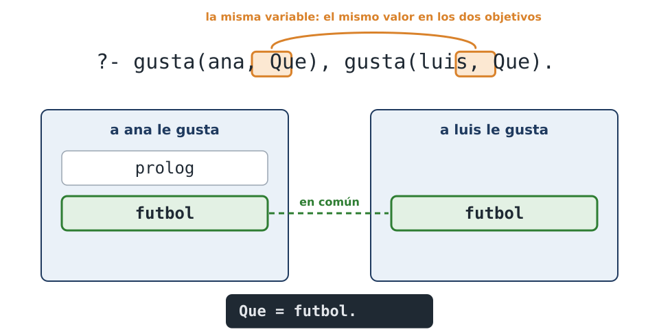

::: notes
El elemento central de la consulta es la variable repetida. Que aparece en los
dos objetivos, y eso exige que tenga el mismo valor en ambos.

No es suficiente que a ana le guste algo y que a luis le guste algo: debe ser
lo mismo. De las dos cosas que le gustan a ana, solo el fútbol le gusta también
a luis.
:::

## Variables distintas

```prolog
?- gusta(ana, Una), gusta(luis, Otra).
Una = prolog,
Otra = futbol ;
Una = futbol,
Otra = futbol.
```

::: notes
Con dos variables distintas, la consulta es otra. Ya no se exige que los
valores coincidan, y Prolog entrega todas las combinaciones: cada cosa que le
gusta a ana, junto con cada cosa que le gusta a luis.

Actividad del capítulo: antes de ejecutarla, determinar qué responde la
consulta que pregunta cuál de los hijos de juan tiene a Prolog entre sus
gustos. Se escribe con dos objetivos: el primero busca un hijo de juan; el
segundo exige que a ese mismo hijo le guste Prolog.
:::

## Una consulta que falla (1)

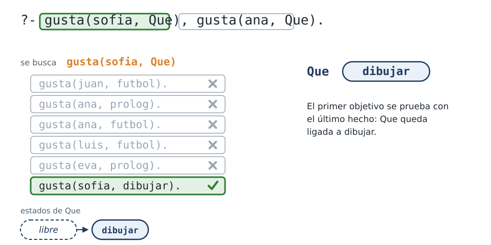

::: notes
Esta parte es la más importante del capítulo. Conviene seguirla con lápiz y
papel.

El primer ejemplo es una consulta que falla: qué le gusta a sofia que también
le guste a ana. Es más simple de seguir, porque no produce ningún valor que
registrar.

Prolog procesa los objetivos de izquierda a derecha, y para cada uno recorre
los hechos de arriba hacia abajo, en el orden en que están escritos. El primer
objetivo pregunta qué le gusta a sofia. Los cinco primeros hechos no
corresponden a sofia; el último sí, y Que queda ligada a dibujar.
:::

## Una consulta que falla (2)

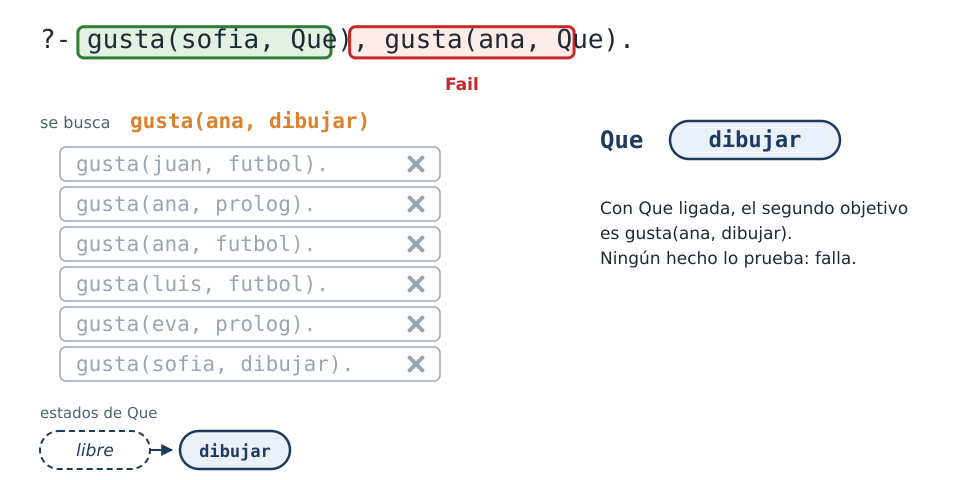

::: notes
Prolog pasa al segundo objetivo. Como Que ya está ligada, el objetivo que debe
probar es: a ana le gusta dibujar. Lo busca de arriba hacia abajo, y ningún
hecho lo prueba. El segundo objetivo falla.

En el vocabulario de la traza del capítulo 1, el segundo objetivo sale por
Fail.
:::

## Una consulta que falla (3)

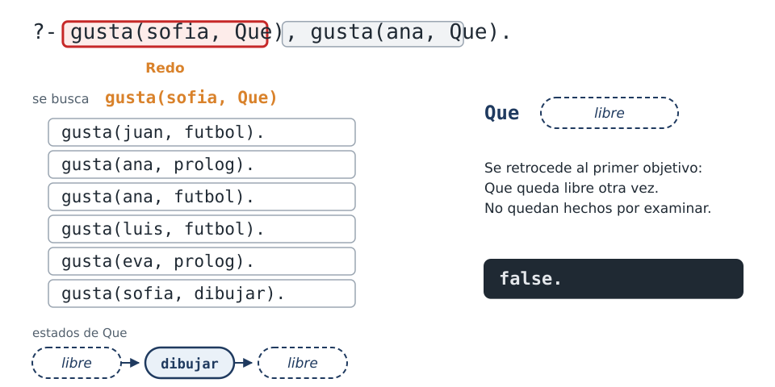

::: notes
Ante el fallo, Prolog retrocede al primer objetivo para buscar otra cosa que le
guste a sofia: el primer objetivo se reingresa por Redo. No quedan hechos
después del último, así que no hay otra alternativa, y la consulta completa
falla.

De esta ejecución se desprenden dos observaciones. Primera: cuando el segundo
objetivo falló, Prolog no continuó hacia la derecha; un objetivo no se intenta
mientras los que están a su izquierda no se hayan probado. Segunda: al
retroceder, Que dejó de estar ligada a dibujar. Esta operación se denomina
desligar la variable, y garantiza que el intento siguiente comience sin valores
previos.
:::

## Una consulta con éxito (1)

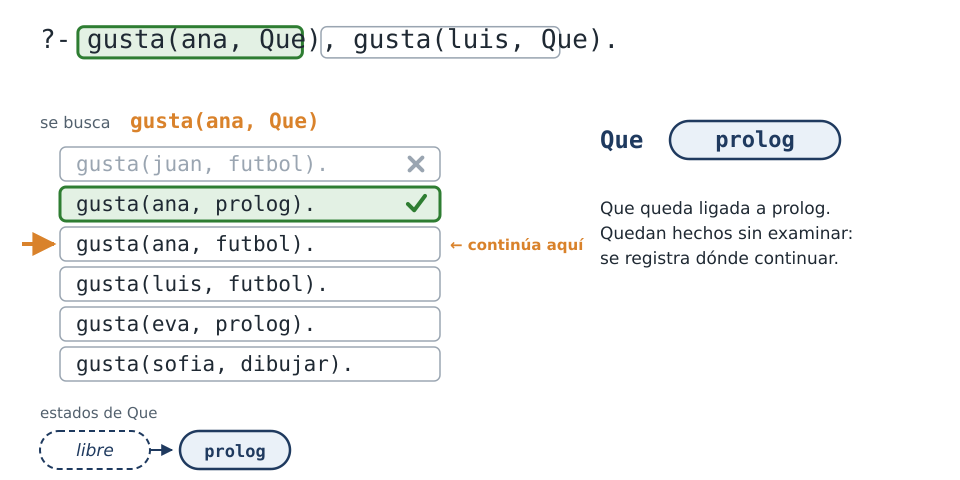

::: notes
Se retoma la consulta de los gustos comunes de ana y de luis.

Prolog toma el primer objetivo y busca desde el primer hecho. El primero no
corresponde a ana; el segundo, que a ana le gusta Prolog, sí. Que queda ligada
a prolog. Prolog registra además que quedan hechos posteriores sin examinar, y
el punto desde el cual continuar si hiciera falta.
:::

## Una consulta con éxito (2)

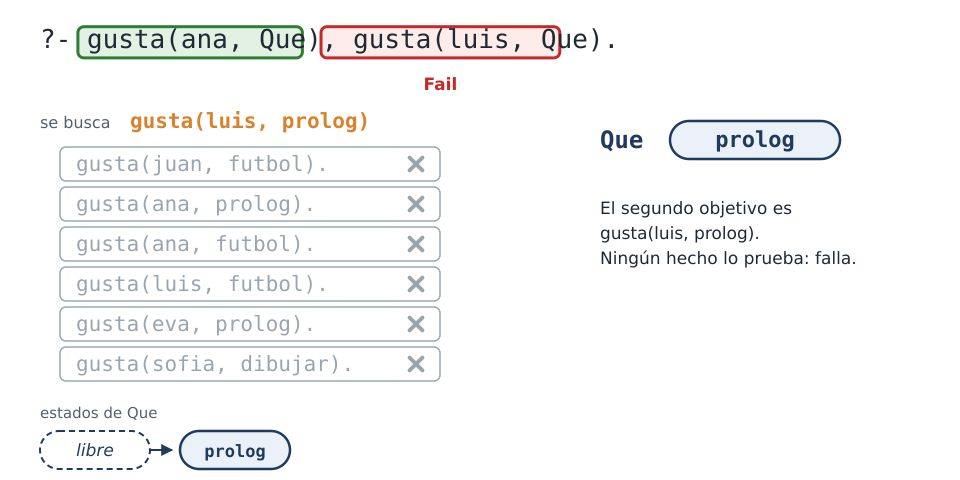

::: notes
Prolog pasa al segundo objetivo. Como Que ya está ligada a prolog, el objetivo
que debe probar es: a luis le gusta Prolog. Lo busca de arriba hacia abajo y no
lo encuentra. El objetivo falla.
:::

## Una consulta con éxito (3)

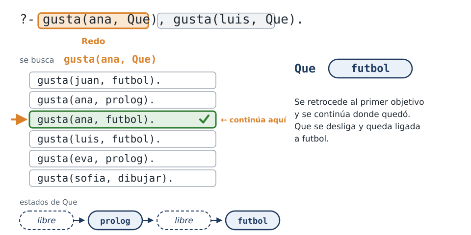

::: notes
Este es el paso fundamental. Cuando un objetivo falla, la ejecución no termina:
Prolog retrocede al objetivo anterior y continúa la búsqueda desde el punto
donde la había dejado. Es el backtracking presentado en el capítulo 1: el
segundo objetivo salió por Fail, y el primero se reingresa por Redo.

El retroceso también deshace la ligadura: Que deja de estar ligada a prolog y
vuelve a estar libre. El hecho siguiente, que a ana le gusta el fútbol, la liga
a futbol.
:::

## Una consulta con éxito (4)

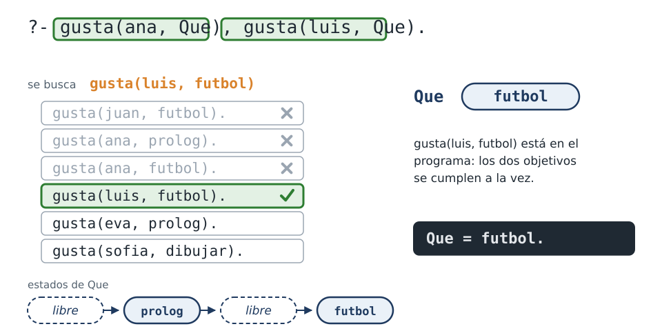

::: notes
Prolog intenta nuevamente el segundo objetivo, que ahora es: a luis le gusta el
fútbol. Ese hecho está en el programa.

Los dos objetivos se cumplen a la vez, con el mismo valor de Que, y Prolog
responde Que igual a futbol. La franja inferior resume el recorrido de la
variable: libre, ligada a prolog, libre otra vez y ligada a futbol.
:::

## El orden de los objetivos

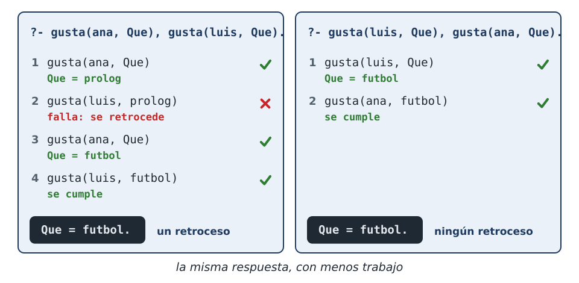

::: notes
Si se invierte el orden de los dos objetivos, la respuesta es la misma: Que
igual a futbol.

Lo que cambia es la cantidad de búsqueda. A luis le gusta una sola cosa, de
modo que comenzar por él deja menos alternativas por explorar: la primera cosa
que se prueba ya es la respuesta, y no hace falta retroceder. Con seis hechos
la diferencia es imperceptible; en programas de mayor tamaño puede determinar
que una consulta termine en un tiempo razonable o que no termine. El capítulo
16 trata este tema.
:::

## Una regla

<!-- ejemplo: capitulo-03/reglas.pl predicado: es_padre/1 consulta: es_padre(Quien). -->
```prolog
%!  es_padre(?P) is nondet.
%
%   P es padre de alguien. Una regla de una sola condición.
es_padre(P) :-
    padre(P, _).
```

::: notes
Una regla indica cómo deducir algo que no está escrito en el programa. El
archivo reglas.pl contiene los hechos de la familia y varias reglas; esta es la
más simple, con una sola condición.

El encabezado sigue la convención del capítulo 2: declara que el argumento
puede llegar libre o ligado, y que el predicado puede tener cualquier cantidad
de respuestas.
:::

## Cabeza y cuerpo

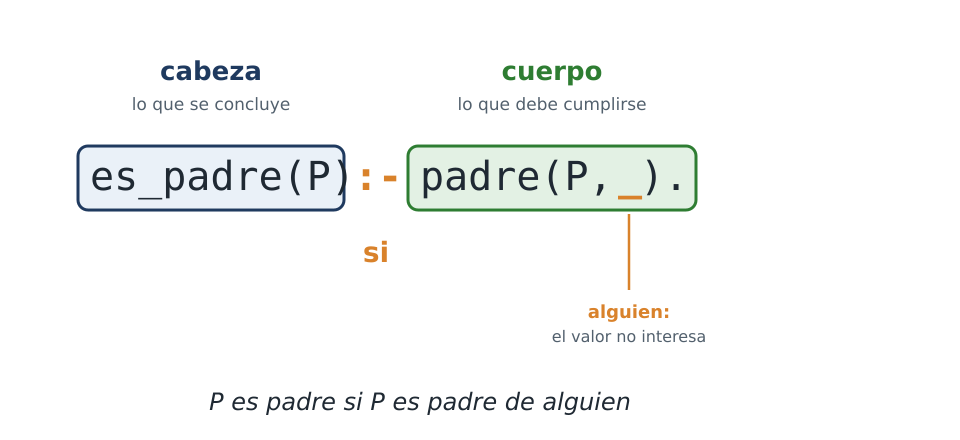

::: notes
El símbolo formado por dos puntos y un guion se lee «si», y divide la regla en
dos partes. A la izquierda está la cabeza: lo que la regla permite concluir. A
la derecha está el cuerpo: lo que debe cumplirse para concluirlo.

La regla se lee: P es padre si P es padre de alguien. El valor de ese alguien no
interesa, y por eso se escribe la variable anónima.

Una regla no afirma nada por sí sola: no dice que P sea padre, sino que lo es si
su cuerpo se puede probar.

Plantilla 2 del curso: derivar una relación de otra, con menos argumentos o con
los argumentos en otro orden.
:::

## Respuestas repetidas

:::::: columns
::: column
```prolog
?- es_padre(Quien).
Quien = juan ;
Quien = juan ;
Quien = pedro ;
Quien = pedro.
```
:::
::: column
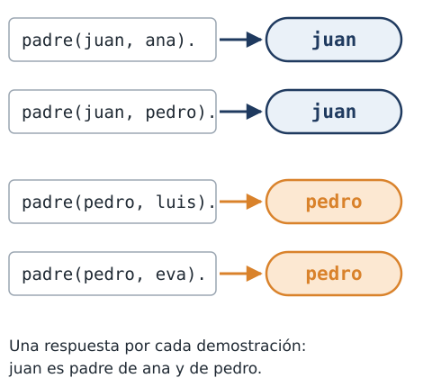
:::
::::::

::: notes
La consulta muestra un comportamiento nuevo: juan aparece dos veces, y no es un
error. Los hechos indican que juan es padre de ana y también de pedro: son dos
demostraciones distintas de la misma conclusión, y Prolog entrega una
respuesta por cada una. Lo mismo ocurre con pedro, padre de luis y de eva.

Prolog no elimina duplicados ni verifica si una respuesta ya fue entregada. La
cantidad de respuestas no es la cantidad de soluciones distintas, sino la
cantidad de demostraciones. Es posible eliminar los duplicados, pero requiere
herramientas que se presentan en el capítulo 17.
:::

## Varias cláusulas: «o»

<!-- ejemplo: capitulo-03/reglas.pl fragmento: progenitor(P, H) :- .. madre(P, H). -->
```prolog
progenitor(P, H) :-
    padre(P, H).
progenitor(P, H) :-
    madre(P, H).
```

```prolog
?- progenitor(Quien, sofia).
Quien = eva.
```

::: notes
Un predicado puede tener más de una cláusula, y el conjunto se lee como «o». P
es progenitor de H si es su padre, o si es su madre. En el curso, progenitor
nombra una sola generación: el padre o la madre, no un ascendiente cualquiera.

Esta es la forma de expresar una disyunción en Prolog, y ya se usó antes: los
cuatro hechos del predicado padre del capítulo 2 son cuatro cláusulas del mismo
predicado.

Plantilla 3 del curso: definir por casos. Cada cláusula es una alternativa
completa; si se cumple más de una, se obtiene más de una respuesta.
:::

## Una cláusula, después la otra

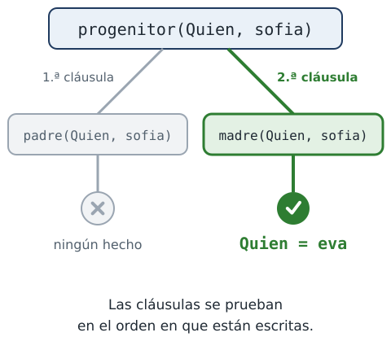

::: notes
Prolog evalúa las cláusulas en el orden en que están escritas.

Para saber quién es progenitor de sofia, la primera cláusula busca al padre de
sofia, y el programa no lo registra. La segunda busca a la madre, y encuentra a
eva. Si la primera cláusula hubiera tenido éxito, la segunda se habría
evaluado al solicitarse otra respuesta con punto y coma.
:::

## La familia

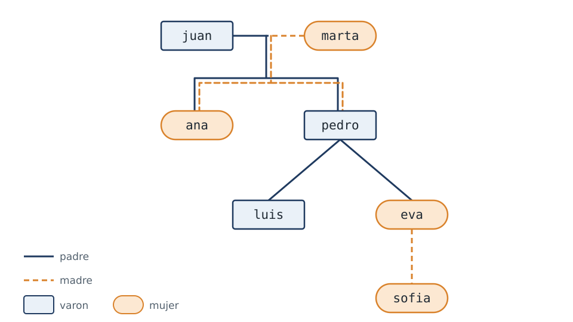

::: notes
Esta es la familia de reglas.pl. Los recuadros rectos corresponden a varones y
los redondeados, a mujeres. La línea continua indica un hecho del predicado
padre, y la discontinua, uno del predicado madre.

juan y marta son padre y madre de ana y de pedro; pedro es padre de luis y de
eva; eva es madre de sofia.
:::

## Encadenar dos relaciones

<!-- ejemplo: capitulo-03/reglas.pl predicado: abuelo/2 abuela/2 consulta: abuelo(juan, Quien). -->
```prolog
%!  abuelo(?A, ?N) is nondet.
%
%   A es el abuelo de N.
abuelo(A, N) :-
    varon(A),
    progenitor(A, P),
    progenitor(P, N).

%!  abuela(?A, ?N) is nondet.
%
%   A es la abuela de N.
abuela(A, N) :-
    mujer(A),
    progenitor(A, P),
    progenitor(P, N).
```

::: notes
Una vez definido progenitor, las dos reglas siguientes se obtienen de manera
directa. A es abuelo de N si A es varón, A es progenitor de alguien, y ese
alguien es progenitor de N. La abuela se define igual, con la condición de ser
mujer.

El programa no contiene ningún hecho que indique que juan es abuelo de luis.
Contiene hechos sobre padres y madres, y una regla que define qué significa ser
abuelo; la deducción la realiza Prolog. Esta es la ventaja de escribir reglas en
lugar de enumerar todos los casos.

La primera condición distingue las dos reglas. Sin ella, marta también
cumpliría la regla del abuelo, porque las dos condiciones sobre progenitores se
cumplen de la misma manera para ella.
:::

## Cuatro plantillas

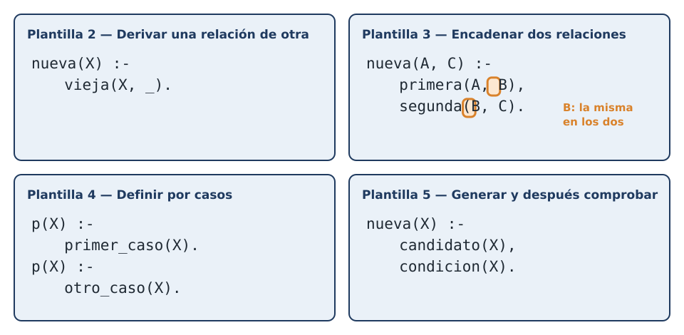

::: notes
Las reglas del capítulo siguen cuatro plantillas del curso.

Derivar una relación de otra, como es_padre. Definir por casos, como
progenitor. Encadenar dos relaciones, como abuelo: el elemento central es la
variable intermedia, que aparece dos veces y por eso debe tener el mismo valor
en los dos objetivos; es la variable compartida de las conjunciones, ahora
dentro de una regla.

Y generar y después comprobar: primero se genera un candidato y después se lo
verifica. El orden es significativo, porque la condición se verifica sobre una
variable que ya tiene valor. La condición de ser varón en la regla del abuelo
cumple ese papel, y también la consulta que busca, entre los hijos de juan, a
los que les gusta Prolog.
:::

## El alcance de una variable

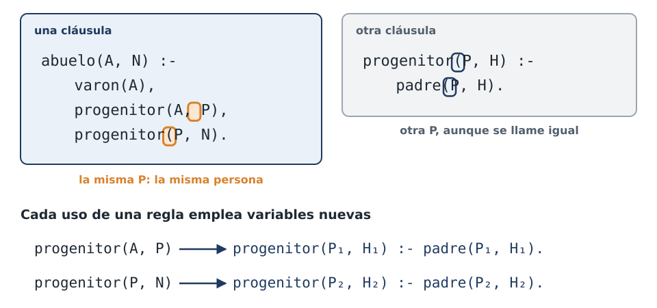

::: notes
En la regla del abuelo hay tres variables: A, P y N.

Dentro de una cláusula, el mismo nombre designa la misma variable. La P del
segundo objetivo y la P del tercero son la misma: la persona intermedia debe
ser la misma en los dos. Si tuvieran nombres distintos, la regla diría que A es
progenitor de alguien y que otro alguien, no necesariamente el mismo, es
progenitor de N, condición que se cumple para casi cualquier par.

Entre cláusulas distintas, el mismo nombre no establece ninguna relación. La P
de la regla del abuelo y la P de la regla de progenitor son dos variables
diferentes cuyo nombre coincide.

Además, cada uso de una regla emplea variables nuevas. Cuando la regla del
abuelo invoca dos veces a progenitor, la segunda invocación no conserva ningún
valor de la primera.
:::

## abuelo(juan, Quien), paso a paso (1)

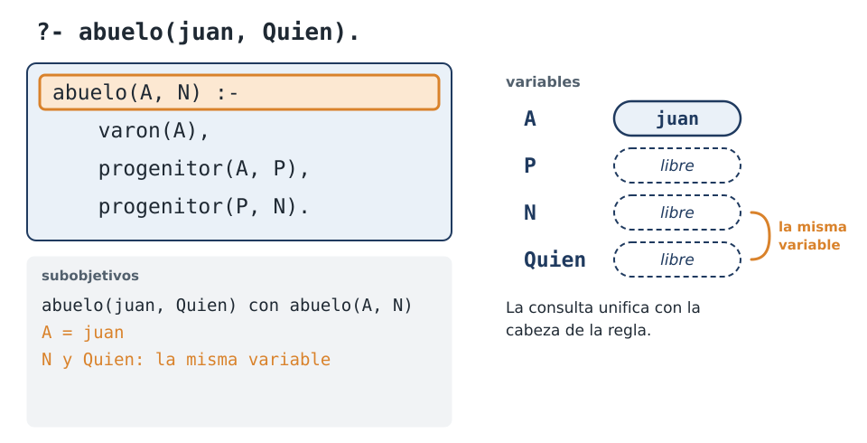

::: notes
Las cuatro diapositivas siguientes recorren la consulta que busca los nietos de
juan.

Primero, la consulta unifica con la cabeza de la regla. A queda ligada a juan.
Quien, de la consulta, y N, de la cabeza, son dos variables distintas, y
ninguna tiene valor. Cuando dos variables sin valor se encuentran, quedan
ligadas entre sí: desde ese momento designan el mismo objeto, todavía
desconocido, y el valor que reciba una lo recibe también la otra.
:::

## abuelo(juan, Quien), paso a paso (2)

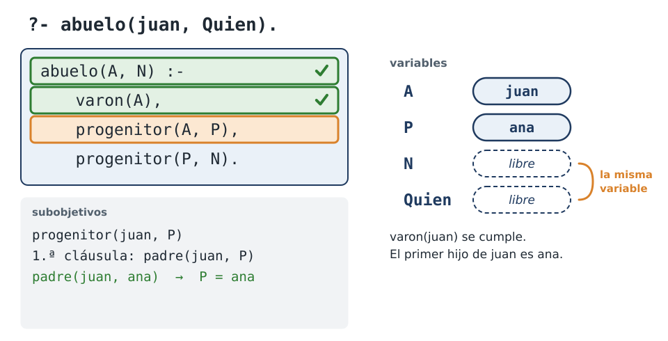

::: notes
El primer objetivo del cuerpo pregunta si juan es varón, y se cumple.

El segundo pregunta de quién es progenitor juan. Se resuelve con una regla, y
aparecen subobjetivos: la primera cláusula de progenitor busca los hijos de
juan en los hechos del predicado padre. El primero es ana, y P queda ligada a
ana.
:::

## abuelo(juan, Quien), paso a paso (3)

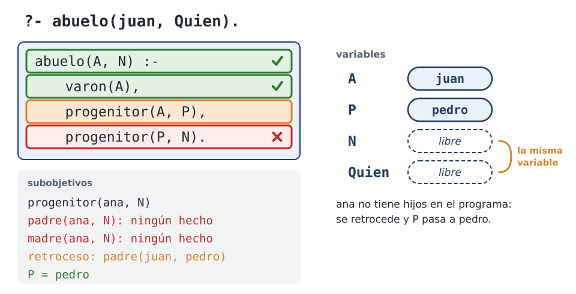

::: notes
El tercer objetivo pregunta de quién es progenitora ana. Ninguna de las dos
cláusulas lo prueba: el programa no registra hijos de ana, ni como padre ni
como madre. El objetivo falla.

Prolog retrocede al objetivo anterior, P se desliga, y la búsqueda continúa
donde había quedado: el hecho siguiente indica que juan es padre de pedro. P
queda ligada a pedro.
:::

## abuelo(juan, Quien), paso a paso (4)

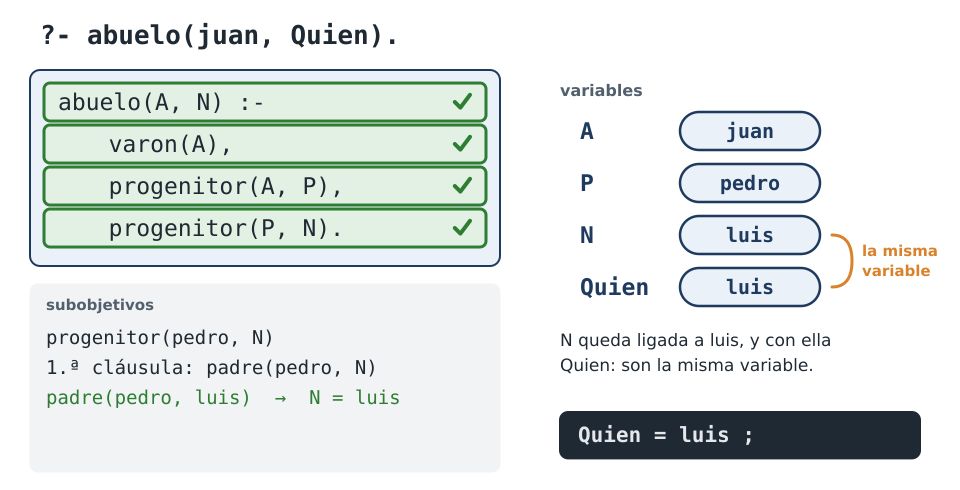

::: notes
Ahora el tercer objetivo pregunta de quién es progenitor pedro. La primera
cláusula encuentra que pedro es padre de luis, y N queda ligada a luis.

Como N y Quien eran la misma variable desde la unificación con la cabeza, la
respuesta se muestra como Quien igual a luis. La regla no devuelve un
resultado: las dos variables eran la misma desde el primer paso.
:::

## Los nietos de juan

```prolog
?- abuelo(juan, Quien).
Quien = luis ;
Quien = eva ;
false.
```

::: notes
Al solicitar otra respuesta, Prolog retrocede al último objetivo con
alternativas pendientes: pedro también es padre de eva, y la segunda respuesta
es eva.

Al solicitar una tercera, quedan alternativas por examinar: que pedro sea madre
de alguien, y que juan lo sea. Ninguna se cumple, y Prolog responde
false. Por eso la transcripción termina así, y no con un punto después de eva.
:::

## Variables que aparecen una sola vez

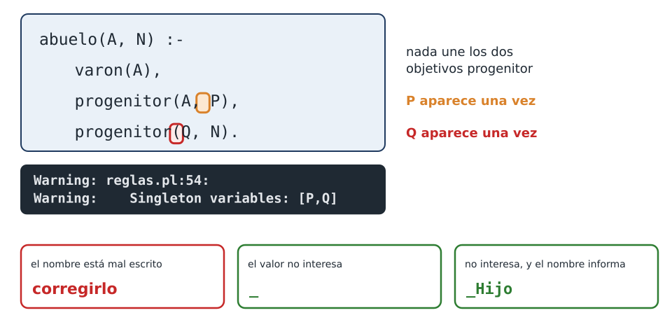

::: notes
Si en una cláusula una variable aparece una sola vez, Prolog lo informa al
cargar el archivo. Aquí, la segunda P de la regla del abuelo se reemplazó por Q:
cada una aparece una sola vez, y nada une ya los dos objetivos sobre
progenitores.

No es un error: el programa se carga igualmente. Es una advertencia, y en la
mayoría de los casos señala un problema real. Las causas habituales son dos. El
nombre está mal escrito en una de sus apariciones: la advertencia existe para
detectarlo antes de que se manifieste como una respuesta incorrecta. O el valor
efectivamente no interesa, y en ese caso corresponde la variable anónima, que
además comunica que esa posición no es relevante. Si el nombre aporta
información, se lo puede comenzar con un guion bajo, como en guion bajo Hijo: Prolog no
emite la advertencia y el nombre conserva su valor descriptivo.

Actividad del capítulo: hacer ese reemplazo, repetir la consulta de los nietos
de juan, contar las respuestas y determinar cuáles son correctas.
:::

## Una regla con una respuesta de más

<!-- ejemplo: capitulo-03/hermana.pl fragmento: hermana(A, B) :- .. padre(P, B). -->
```prolog
hermana(A, B) :-
    mujer(A),
    padre(P, A),
    padre(P, B).
```

```prolog
?- hermana(ana, Quien).
Quien = ana ;
Quien = pedro.
```

::: notes
Se desea definir que A es hermana de B: A es mujer, y ambos tienen el mismo
padre. El archivo hermana.pl contiene los hechos necesarios y esta regla.

La regla parece correcta. Sin embargo, la consulta que pregunta de quién es
hermana ana da dos respuestas. La segunda, pedro, es la esperada. La primera
indica que ana es hermana de sí misma.
:::

## El mismo hecho, dos veces

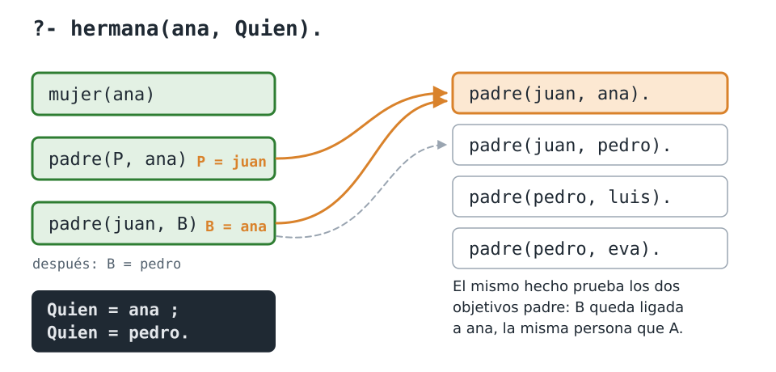

::: notes
La deducción es correcta respecto de la regla. Con A ligada a ana, el primer
objetivo sobre el padre busca al padre de ana, y encuentra a juan. El segundo
busca un hijo de juan, y el primer hecho que encuentra es el mismo: juan es
padre de ana. B queda ligada a ana.

Nada impide que Prolog use el mismo hecho para los dos objetivos. Se había
supuesto que B sería otra persona, pero esa condición no está escrita en la
regla. Prolog responde de acuerdo con lo que el programa expresa, no con la
intención de quien lo escribió; la mayor parte de los errores proviene de esa
diferencia.
:::

## La condición que faltaba

<!-- ejemplo: capitulo-03/hermana.pl predicado: hermana_de_verdad/2 consulta: hermana_de_verdad(ana, Quien). -->
```prolog
%!  hermana_de_verdad(?A, ?B) is nondet.
%
%   A es hermana de B, y no son la misma persona.
hermana_de_verdad(A, B) :-
    mujer(A),
    padre(P, A),
    padre(P, B),
    A \== B.
```

```prolog
?- hermana_de_verdad(ana, Quien).
Quien = pedro.
```

::: notes
La solución es escribir la condición de manera explícita. La última línea
compara A y B, y se cumple cuando no son el mismo término.

Este defecto es un ejercicio del libro de Clocksin y Mellish, y aparece con
otros nombres en la mayoría de los cursos de Prolog. Más que la corrección
puntual, importa el criterio general: cada vez que una regla usa dos veces la
misma relación, se debe verificar si ambos usos pueden resolverse con el mismo
valor.
:::

## La comparación, al final

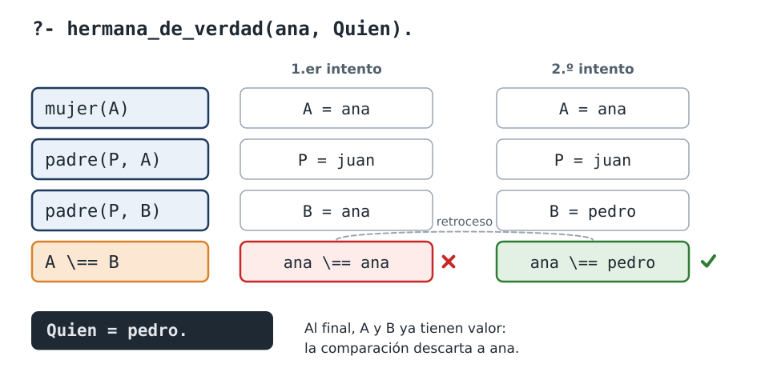

::: notes
La ubicación de la comparación al final es deliberada. En el primer intento, B
queda ligada a ana, y la comparación entre ana y ana falla. Prolog retrocede,
B queda ligada a pedro, y la comparación entre ana y pedro se cumple.

En ese punto las dos variables ya tienen valor, y la comparación solo examina
los términos tal como están en el momento de la llamada: no espera a que se
instancien. El efecto de ubicarla antes, cuando las variables todavía están
libres, se trata en el capítulo 10.

Plantilla 6 del curso: exigir que dos valores sean distintos, con la
comparación al final.
:::

## La primera prueba

<!-- ejemplo: capitulo-03/hermana.plt fragmento: % Respuestas de la regla incompleta .. hermana_de_verdad(ana, Q). -->
```prolog
% Respuestas de la regla incompleta: ana se incluye a sí misma.
test(hermana_se_cuenta_a_si_misma, all(Q == [ana, pedro])) :-
    hermana(ana, Q).

% Respuestas esperadas.
test(hermanas_de_verdad, all(Q == [pedro])) :-
    hermana_de_verdad(ana, Q).
```

<!-- ejemplo: capitulo-03/hermana.plt fragmento: test(nadie_es_hermana .. hermana_de_verdad(pedro, _). -->
```prolog
test(nadie_es_hermana_de_si_misma, [fail]) :-
    hermana_de_verdad(eva, eva).

% pedro es varón: no es hermana de nadie, aunque tenga hermanos.
test(pedro_no_es_hermana, [fail]) :-
    hermana_de_verdad(pedro, _).
```

::: notes
Una regla puede ser incorrecta y parecer correcta, y la relectura no alcanza
para verificarla: quien escribió la regla tiende a leer lo que quiso expresar.
Un método suficiente es especificar por separado las respuestas esperadas. Esa
especificación es una prueba, y en SWI-Prolog se escribe con plunit, en un
archivo con el mismo nombre del programa y extensión punto plt.

Cada prueba tiene un nombre y un objetivo; entre ambos, las opciones indican el
resultado esperado. La opción all reúne todas las respuestas y exige que sean
exactamente las de la lista, en ese orden: es la más útil aquí, porque el
defecto era una respuesta de más. La opción fail especifica que el objetivo
debe fallar; especificar lo que no debe ocurrir es tan importante como
especificar lo que sí. Sin opciones, se espera que el objetivo se cumpla una
vez y sin dejar alternativas pendientes; si deja alguna, se lo declara con la
opción nondet.
:::

## Ejecutar las pruebas

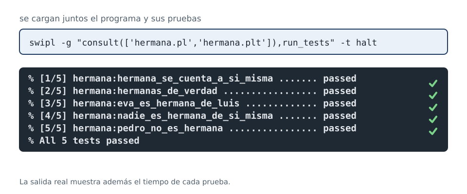

::: notes
Para ejecutar las pruebas se cargan juntos el programa y el archivo de pruebas,
y se llama a run_tests. La salida informa cada prueba y el total.

Todos los ejemplos de este curso tienen su archivo de pruebas, y todas las
pruebas pasan antes de que el ejemplo se incorpore al texto. El capítulo 26
presenta las demás opciones de plunit.

Actividad del capítulo: eliminar la comparación final de la regla corregida y
ejecutar las pruebas. Determinar cuál falla y qué informa el mensaje.
:::

## Resumen

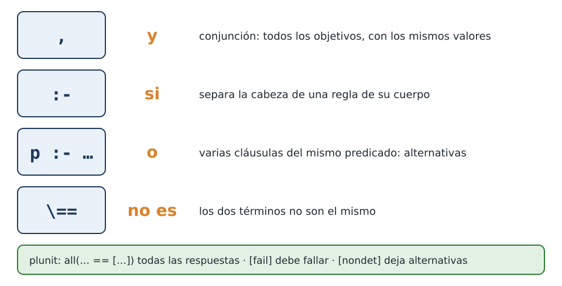

::: notes
La coma es la conjunción: todos los objetivos deben cumplirse, con los mismos
valores de las variables. El símbolo de la regla se lee «si» y separa la cabeza
del cuerpo. Varias cláusulas del mismo predicado son alternativas: se leen
«o». La comparación de la hermana verdadera exige que dos términos no sean el
mismo.

Prolog prueba los objetivos de izquierda a derecha y las cláusulas de arriba
hacia abajo; cuando un objetivo falla, retrocede al anterior, desliga sus
variables e intenta la alternativa siguiente. Y cada regla lleva pruebas que
especifican sus respuestas esperadas.

El capítulo 4 trata la unificación, y el capítulo 5 representa este mismo
recorrido como un árbol de derivación.
:::
