## Todo es un término

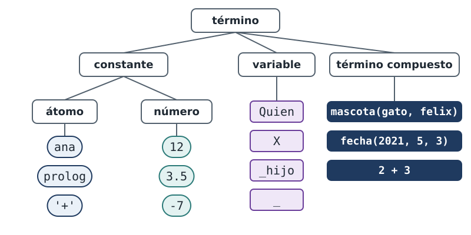

::: notes
En Prolog existe una única clase de dato: el término. Un nombre es un término,
un número es un término, una variable es un término, y mascota de gato y felix
también lo es. Un hecho, el cuerpo de una regla y una consulta están hechos de
términos.

La clasificación tiene tres ramas. Las constantes, que a su vez son átomos o
números; las variables; y los términos compuestos. Existe además una única
operación que relaciona términos entre sí: la unificación, que responde si dos
términos pueden hacerse idénticos. Es el tema de la segunda mitad del capítulo.
:::

## Tres formas de escribir un átomo

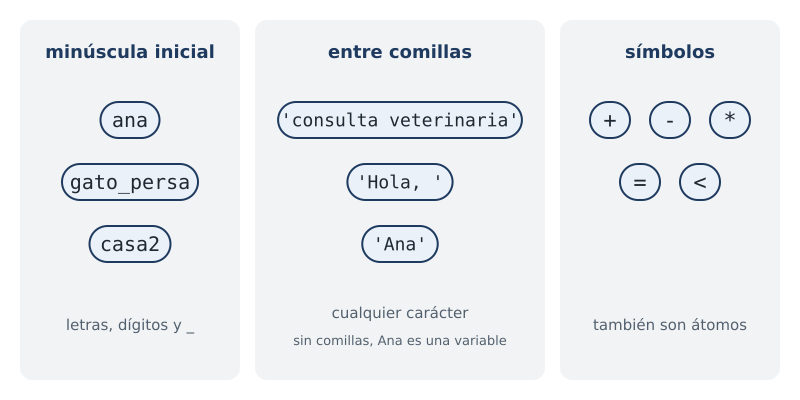

::: notes
Un átomo es un nombre: no tiene componentes ni valor asociado, y solo es
idéntico a sí mismo.

Se escribe de tres maneras. Con minúscula inicial, seguida de letras, dígitos o
guiones bajos, como ana, gato guion bajo persa, o casa2. Entre comillas simples, y entonces
el nombre puede contener cualquier carácter. Las comillas son necesarias cuando
el nombre contiene espacios, cuando comienza con mayúscula, porque de lo
contrario sería una variable, o cuando contiene caracteres especiales. Por eso
en el capítulo 1 el saludo con coma y espacio se escribió entre comillas.

La tercera forma son los símbolos: el signo más, el menos, el asterisco, el
igual y el menor también son átomos. Esa propiedad reaparece en la sección de
los operadores.
:::

## Dos notaciones, un átomo

:::::: columns
::: column
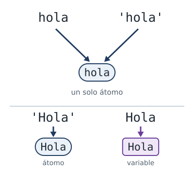
:::
::: column
```prolog
?- X = 'consulta veterinaria'.
X = 'consulta veterinaria'.

?- hola = 'hola'.
true.
```
:::
::::::

::: notes
Las comillas forman parte de la notación, no del átomo. hola escrito sin
comillas y hola escrito entre comillas son el mismo átomo, escrito de dos
maneras, y por eso la segunda consulta responde true.

Con mayúscula inicial la diferencia sí importa: entre comillas es un átomo;
sin comillas es una variable.
:::

## Números

:::::: columns
::: column
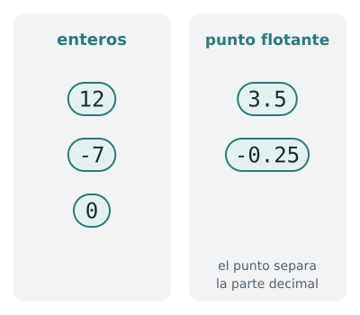
:::
::: column
```prolog
?- X = 3.5.
X = 3.5.

?- X is 7 / 2.
X = 3.5.

?- X is 7 // 2.
X = 3.
```
:::
::::::

::: notes
Existen números enteros y números de punto flotante; en estos últimos, la
parte decimal se separa con un punto.

La división con una barra produce un resultado de punto flotante cuando el
cociente no es exacto, aunque los dos operandos sean enteros. La división
entera se expresa con otro operador, la doble barra, y descarta la parte
decimal.

Los números son constantes, igual que los átomos: doce es idéntico a doce.
:::

## El nombre de una variable

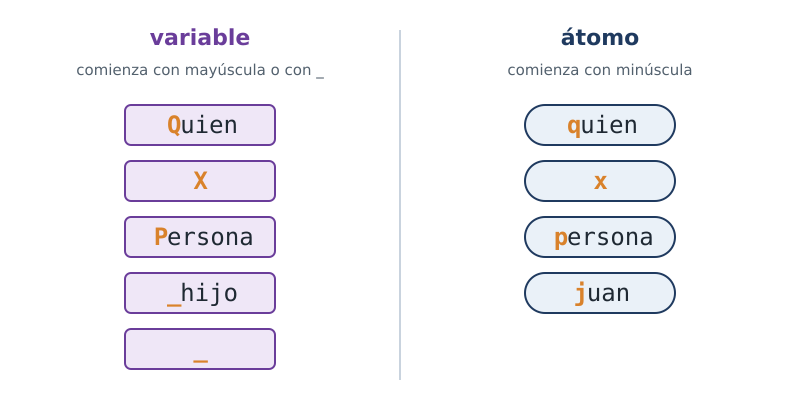

::: notes
El nombre de una variable comienza con mayúscula o con guion bajo: Quien, X,
Persona, guion bajo hijo, y el guion bajo solo, que es la variable anónima.
Ese es el único criterio. Las variables no se declaran ni tienen un tipo
asociado.

Con minúscula inicial, el mismo nombre es un átomo. El primer carácter decide
la clase de término.
:::

## Libre o ligada

:::::: columns
::: column
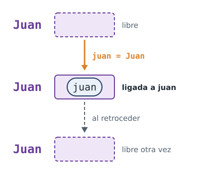
:::
::: column
```prolog
?- juan = Juan.
Juan = juan.
```
:::
::::::

::: notes
Una variable no es una celda de memoria en la que se almacena un valor: es un
objeto sin determinar. Si Prolog encuentra un valor que hace cierta la
consulta, la variable queda instanciada, o ligada, a ese valor, y permanece
así hasta que Prolog retrocede y la desliga.

En la consulta, juan con minúscula es un átomo y Juan con mayúscula es una
variable. La respuesta indica que, para que los dos términos sean idénticos,
la variable debe quedar ligada al átomo. El signo igual no es una asignación:
pide una unificación, y los dos términos pueden estar de cualquier lado.
:::

## Un término compuesto

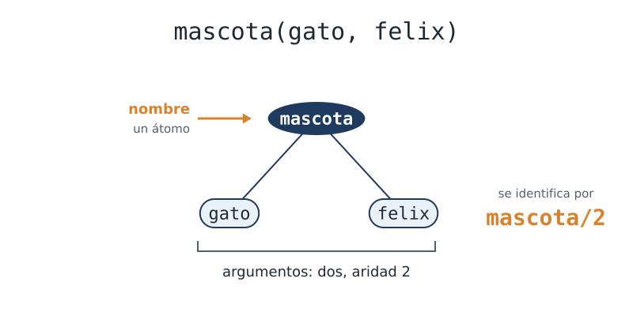

::: notes
Un término compuesto es un nombre seguido de argumentos entre paréntesis.
padre de juan y ana es uno; mascota de gato y felix es otro.

Conviene dibujarlo como un árbol: el nombre en la raíz y los argumentos
colgando de ella. Se identifica por dos elementos, los mismos que identifican a
un predicado: el nombre, que es un átomo, y la aridad, que es la cantidad de
argumentos. Este término se identifica como mascota barra dos.
:::

## Nombre y aridad

```prolog
?- mascota(gato, felix) = mascota(gato).
false.

?- mascota(gato, felix) = fecha(2021, 5, 3).
false.
```

::: notes
Dos términos compuestos con el mismo nombre y distinta aridad son términos
distintos. mascota con dos argumentos y mascota con uno no pueden hacerse
idénticos, y la primera consulta responde false.

La segunda consulta compara dos términos de igual aridad y distinto nombre, y
también responde false. Nombre y aridad deben coincidir.
:::

## Las fichas

<!-- ejemplo: capitulo-04/fichas.pl predicado: registro/1 -->
```prolog
% registro(F): F es la ficha de una mascota.
registro(ficha(mascota(gato, felix), fecha(2021, 5, 3), ana)).
registro(ficha(mascota(perro, rocco), fecha(2019, 11, 20), luis)).
registro(ficha(mascota(gato, gaturro), fecha(2023, 2, 14), eva)).
```

::: notes
Los argumentos de un término compuesto son términos de cualquier clase,
incluidos otros términos compuestos. Así se construyen datos estructurados.

El archivo fichas.pl registra tres mascotas. Cada ficha reúne la mascota, con
su especie y su nombre; la fecha de nacimiento, con año, mes y día; y el
propietario.
:::

## Una ficha es un árbol

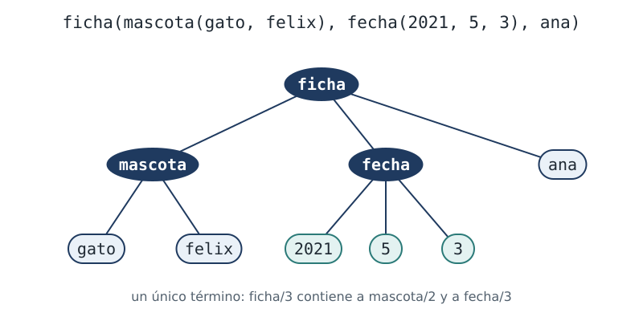

::: notes
Cada ficha es un único término que contiene otros dos: una mascota y una
fecha. Dibujada como árbol, tiene tres niveles: ficha en la raíz; mascota,
fecha y el propietario debajo; y en el último nivel la especie, el nombre y
los tres números de la fecha.

El anidamiento no tiene límite.
:::

## ¿Hecho o dato?

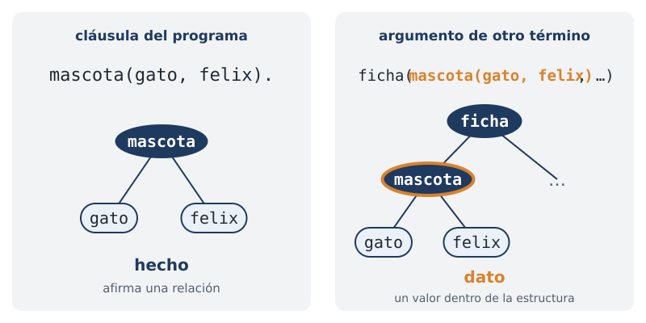

::: notes
mascota de gato y felix, escrito como cláusula del programa y terminado en
punto, es un hecho: afirma una relación.

El mismo término, como argumento de otro término, es un dato: un valor dentro
de la estructura. La diferencia no está en la forma del término, que es la
misma en los dos casos, sino en el lugar que ocupa dentro de la estructura
sintáctica del programa.
:::

## Un operador es un nombre

:::::: columns
::: column
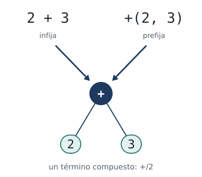
:::
::: column
```prolog
?- 2 + 3 = +(2, 3).
true.

?- X = 2 + 1.
X = 2+1.

?- X is 2 + 1.
X = 3.
```
:::
::::::

::: notes
Dos más tres es un término compuesto de nombre más y dos argumentos. La única
diferencia es la notación: el nombre se escribe entre los argumentos, lo que
se denomina notación infija, en lugar de delante de ellos. Son dos notaciones
del mismo término, igual que hola con y sin comillas.

Esto completa la explicación del capítulo 1. La unificación de X con dos más
uno liga X al término, con sus dos argumentos sin modificar. is es el
predicado que recibe ese término, lo evalúa y produce un número. Sin is no se
realiza ninguna evaluación.
:::

## El árbol de 1 + 2 * 3

:::::: columns
::: column
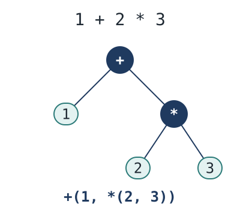
:::
::: column
```prolog
?- 1 + 2 * 3 = +(1, *(2, 3)).
true.
```
:::
::::::

::: notes
Una expresión con varios operadores también es un único término. En uno más
dos por tres, el producto se agrupa primero y queda como subárbol: la raíz es
la suma, su primer argumento es el uno y el segundo es el producto de dos y
tres.

La consulta lo confirma: la expresión unifica con el mismo término escrito en
notación prefija.
:::

## Operar sobre la forma

<!-- ejemplo: capitulo-04/operadores.pl predicado: lados/3 -->
```prolog
% lados(Suma, A, B): A y B son los dos operandos de la suma.
lados(A + B, A, B).
```

```prolog
?- lados(2 + 3, Izquierda, Derecha).
Izquierda = 2,
Derecha = 3.

?- lados(1 + 2 + 3, Izquierda, Derecha).
Izquierda = 1+2,
Derecha = 3.
```

::: notes
lados/3 no realiza ninguna operación aritmética. Recibe un término escrito con
el signo más en notación infija y lo trata como lo que es: un término
compuesto con dos argumentos, que la cabeza de la cláusula separa.

La segunda consulta es la actividad de la sección 4.6. Conviene detener la
presentación y determinar la respuesta antes de ver la siguiente diapositiva:
uno más dos más tres debe ser una suma de dos operandos, de modo que uno de
ellos debe ser, a su vez, una suma.
:::

## Una suma de tres términos

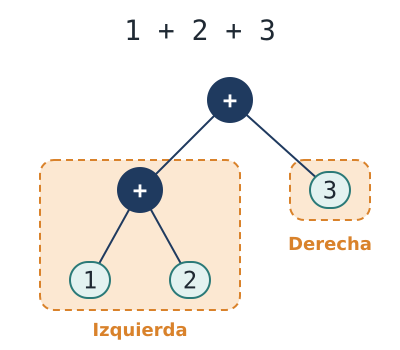

::: notes
Las sumas se agrupan de izquierda a derecha. Uno más dos más tres es la suma
de dos operandos: el primero es la suma de uno y dos, y el segundo es el tres.

Por eso Izquierda queda ligada al término uno más dos, sin evaluar, y Derecha
al número tres.
:::

## Unificar

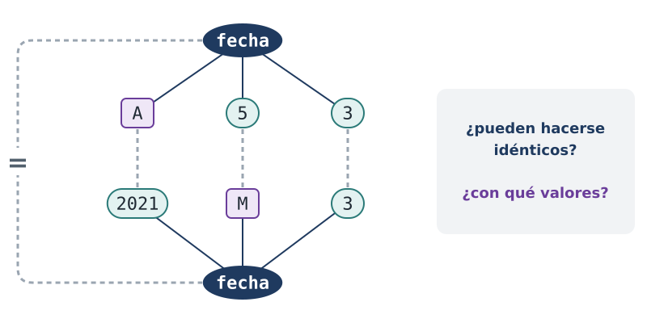

::: notes
Unificar dos términos es determinar si pueden hacerse idénticos, y con qué
valores de sus variables. El signo igual solicita la unificación de manera
explícita, pero Prolog la realiza continuamente de manera implícita: cada vez
que una consulta busca una cláusula, intenta unificar el objetivo con la
cabeza de esa cláusula.

Las reglas son cuatro, y se aplican examinando los dos términos a la vez, par
por par, como en el dibujo.

Actividad del capítulo: determinar, sin ejecutarla, qué responde la
unificación de estos dos términos, fecha de A, cinco y tres con fecha de dos
mil veintiuno, M y tres, y con qué valores. Después, verificarlo.
:::

## Regla 1: constantes

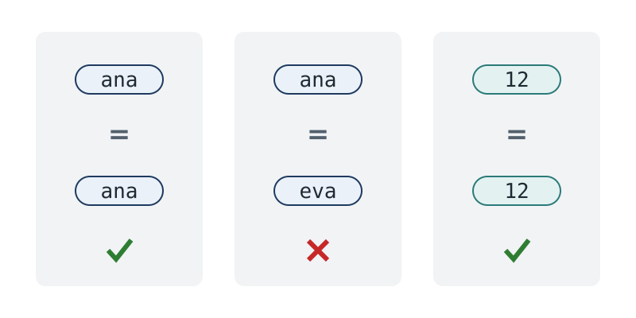

::: notes
Primera regla: dos constantes unifican si son la misma. ana con ana, sí; ana
con eva, no; doce con doce, sí.
:::

## Regla 2: una variable libre

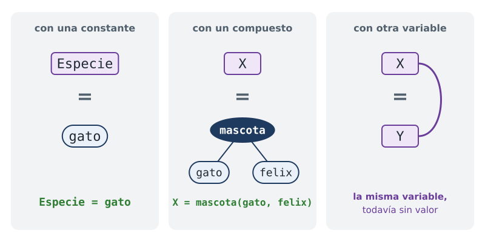

::: notes
Segunda regla: una variable libre unifica con cualquier término, y queda
instanciada con él. El término puede ser una constante o un término compuesto
completo.

Si ambos términos son variables, quedan ligadas entre sí: a partir de ese
momento son la misma variable, aunque todavía no tengan valor.
:::

## Regla 3: términos compuestos

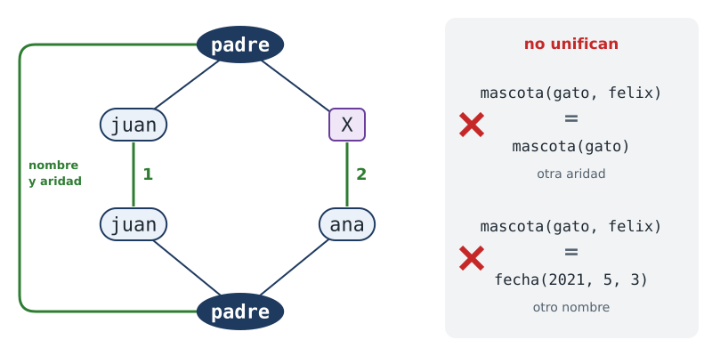

::: notes
Tercera regla: dos términos compuestos unifican si tienen el mismo nombre, la
misma aridad, y cada argumento unifica con el argumento correspondiente. En el
dibujo, las raíces coinciden en nombre y aridad; después se unifica el primer
argumento con el primero y el segundo con el segundo.

La regla se aplica de manera recursiva, hasta la profundidad que tengan los
términos. A la derecha, dos pares que fallan antes de examinar los argumentos:
uno por la aridad y otro por el nombre.
:::

## Regla 4: la ligadura se propaga

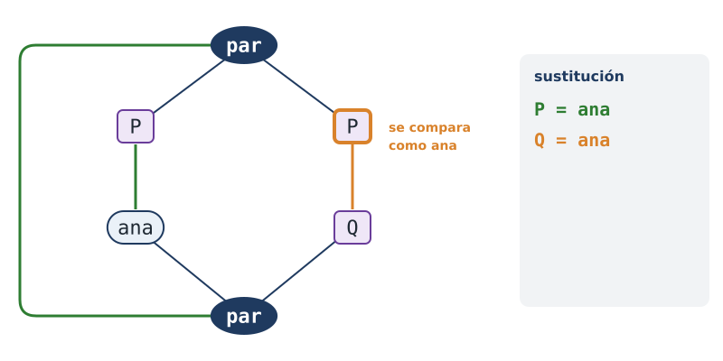

::: notes
Cuarta regla: cuando una variable queda ligada a un término, ese término
ocupa su lugar en todo lo que resta por unificar.

En el dibujo, el primer par liga P a ana. En el segundo par, P ya no está
libre: se compara como si dijera ana, y la variable Q de abajo queda ligada a
ana.
:::

## Una variable dentro de su término

:::::: columns
::: column
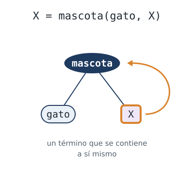
:::
::: column
```prolog
?- X = mascota(gato, X).
X = mascota(gato, X).
```
:::
::::::

::: notes
La segunda regla dice que una variable unifica con cualquier término, y eso
incluye un término que contiene a esa misma variable. El resultado es un
término que se contiene a sí mismo: el segundo argumento es el término
completo.

No es un caso que aparezca en este curso, y conviene reconocerlo por si
surge: casi siempre proviene de haber escrito dos veces el mismo nombre de
variable sin advertirlo.
:::

## Paso a paso (1)

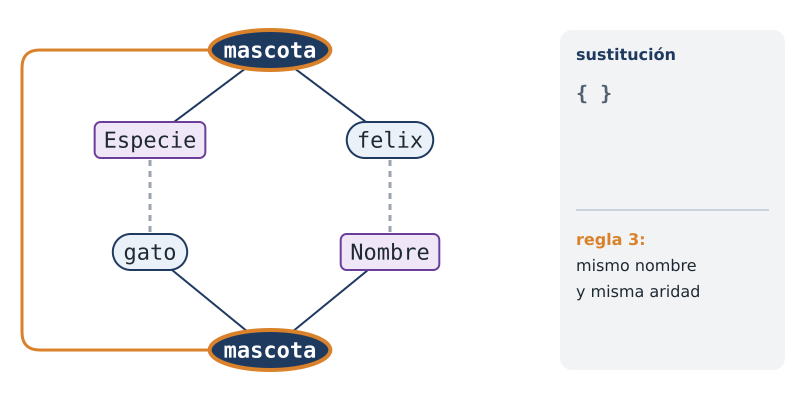

::: notes
Las cuatro diapositivas siguientes resuelven de manera manual la unificación
de mascota de Especie y felix con mascota de gato y Nombre.

Primero, las raíces. Ambos son términos compuestos, de nombre mascota y
aridad dos: se cumplen las dos primeras condiciones de la regla 3. Resta
unificar los argumentos, uno por uno. La sustitución todavía está vacía.
:::

## Paso a paso (2)

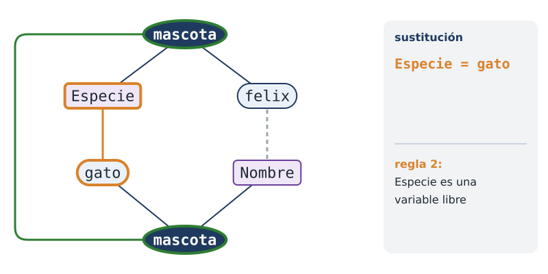

::: notes
Primer argumento: Especie con gato. Uno de los dos es una variable libre, de
modo que unifican por la regla 2, y Especie queda ligada a gato. La
sustitución registra esa ligadura.
:::

## Paso a paso (3)

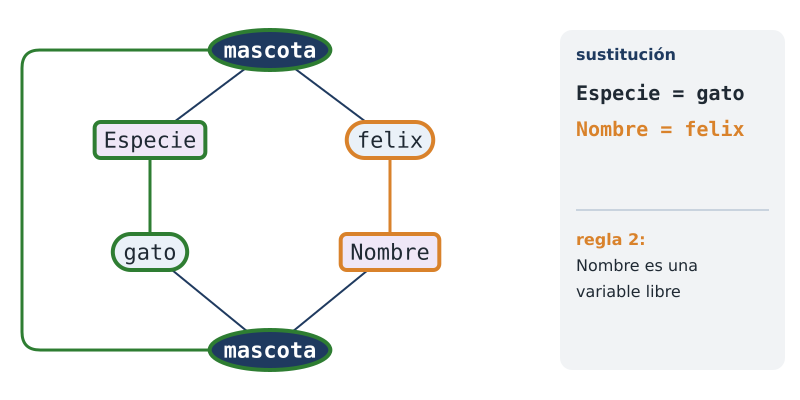

::: notes
Segundo argumento: felix con Nombre. Es el mismo caso, con la variable en el
otro término: Nombre queda ligada a felix.

La ubicación de las variables es indistinta: la unificación es simétrica y
trata a los dos términos por igual.
:::

## Paso a paso (4)

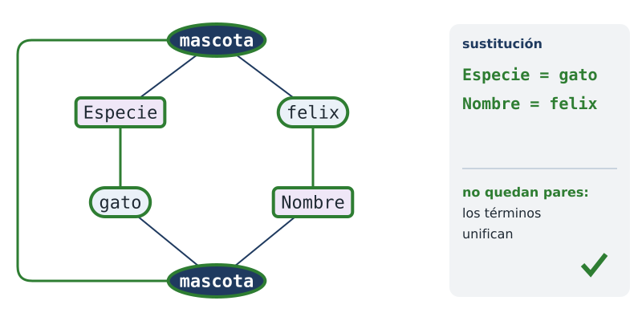

::: notes
No quedan argumentos, y ninguno falló: los términos unifican. La sustitución
final es la respuesta de Prolog: Especie igual a gato y Nombre igual a felix.
:::

## Términos anidados

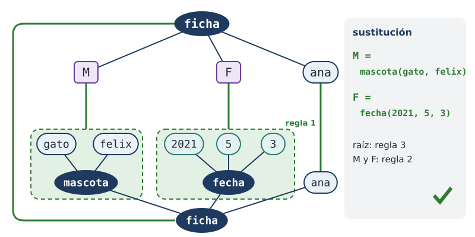

::: notes
Este ejemplo tiene términos anidados: ficha de M, F y ana, unificada con la
primera ficha del registro. Aplica la regla 3 una vez, la 2 dos veces y la 1
una vez.

En la raíz, los dos son fichas de aridad tres: regla 3. El tercer argumento, ana con ana, unifica por la regla 1. Los otros dos son
variables, y por la regla 2 cada una queda ligada al subárbol completo que le
corresponde: M a la mascota y F a la fecha. Los subárboles no se descomponen,
porque del otro lado hay una variable libre.
:::

## Lo mínimo indispensable

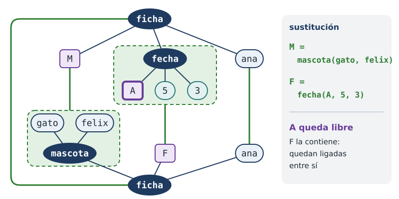

::: notes
En los ejemplos anteriores todas las variables terminaron ligadas a términos
sin variables. No siempre es así: la unificación liga lo mínimo indispensable
para que los dos términos coincidan, y nada más.

Aquí hay variables en los dos términos. M queda ligada a la mascota. F queda
ligada a fecha de A, cinco y tres, y A no recibe ningún valor: no hay ninguna
restricción sobre el año. Las dos variables quedaron ligadas entre sí, que es
la segunda mitad de la regla 2. Si más adelante A recibiera un valor, F lo
reflejaría de inmediato.
:::

## Una variable repetida

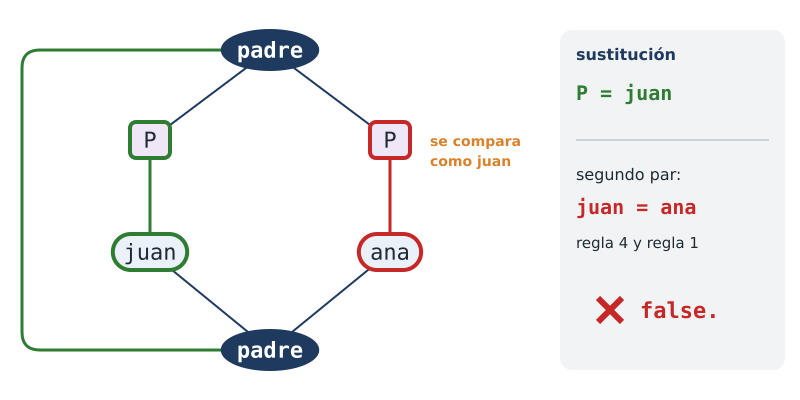

::: notes
Si una variable aparece dos veces en el mismo término, ambas apariciones
deben tener el mismo valor. No es una coincidencia de nombres: es una
restricción.

El primer argumento unifica: P queda ligada a juan. En el segundo interviene
la regla 4: P ya está ligada, de modo que se la compara como si dijera juan, y
la unificación se reduce a determinar si juan y ana son el mismo átomo. No lo
son, y la unificación falla.

No hay ninguna regla especial para las variables repetidas: el comportamiento
se sigue de aplicar las cuatro reglas en orden.
:::

## Dos argumentos iguales

```prolog
?- padre(P, P) = padre(juan, ana).
false.

?- padre(P, P) = padre(juan, juan).
P = juan.
```

::: notes
Con dos argumentos iguales, la unificación tiene éxito.

Es el mismo mecanismo que operaba en la regla abuelo/2 del capítulo 3, donde
la variable P repetida exigía que la persona intermedia fuera la misma en los
dos objetivos. También explica por qué hermana/2 producía respuestas de más:
no había ninguna variable repetida que impidiera usar dos veces el mismo
hecho, y por eso fue necesario agregar una condición que exige que las dos
personas sean distintas.
:::

## Extraer un componente

<!-- ejemplo: capitulo-04/fichas.pl predicado: nacio_en/2 -->
```prolog
% nacio_en(F, A): A es el año en que nació la mascota de la ficha F.
nacio_en(ficha(_, fecha(A, _, _), _), A).
```

```prolog
?- registro(F), nacio_en(F, Anio).
F = ficha(mascota(gato, felix), fecha(2021, 5, 3), ana),
Anio = 2021 ;
F = ficha(mascota(perro, rocco), fecha(2019, 11, 20), luis),
Anio = 2019 ;
F = ficha(mascota(gato, gaturro), fecha(2023, 2, 14), eva),
Anio = 2023.
```

::: notes
Con los elementos anteriores ya es posible descomponer términos, sin ningún
mecanismo adicional. Se escribe un término con variables en las posiciones de
interés y guiones bajos en las demás, y se lo unifica con el término que se
quiere descomponer.

nacio_en/2 es un hecho, sin cuerpo: todo el trabajo lo realiza la
unificación de la cabeza. El archivo define del mismo modo especie/2,
nombre_de/2 y propietario_de/2.
:::

## El patrón sobre la ficha

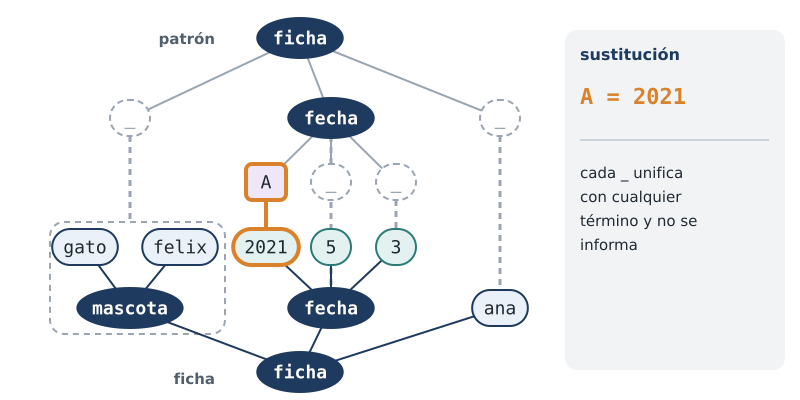

::: notes
El primer argumento de nacio_en/2 es un patrón: no interesan la mascota, el
mes, el día ni el propietario; solo interesa el año. Cuando el patrón unifica
con una ficha concreta, A queda ligada al año y el resto se ignora.

Esta es la plantilla 7 del curso, extraer un componente de un término: un
hecho sin cuerpo, con variables en las posiciones de interés y guiones bajos
en todas las demás. El capítulo 32 retoma la inspección de términos cuya forma
no se conoce de antemano.
:::
