# Capítulo 5 — Cómo responde Prolog

::: notes
En los capítulos anteriores se formularon consultas y se observaron sus respuestas. Este capítulo muestra cómo se obtienen esas respuestas. Presenta el árbol de derivación, que es el diagrama de todo lo que Prolog intenta para responder una consulta, y lo compara con la traza y con el modelo de cajas. El árbol explica por qué las respuestas llegan en un orden determinado y, sobre todo, por qué algunas consultas no terminan nunca.
:::

## Dos órdenes

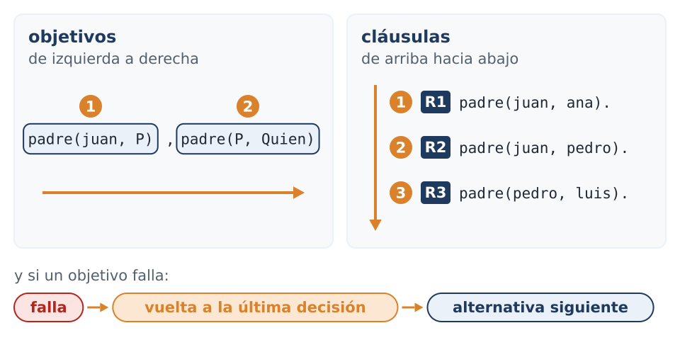

::: notes
Prolog no elige una estrategia de búsqueda óptima. Aplica siempre la misma, definida por dos reglas. Entre los objetivos de una consulta o del cuerpo de una regla, avanza de izquierda a derecha. Entre las cláusulas de un predicado, avanza de arriba hacia abajo, en el orden en que están escritas en el archivo. A esas dos reglas se suma el retroceso: cuando un objetivo falla, la ejecución vuelve a la última decisión tomada y prueba la alternativa siguiente. Todo el comportamiento de Prolog se deriva de estas tres piezas.
:::

## Qué cambia el orden de los objetivos

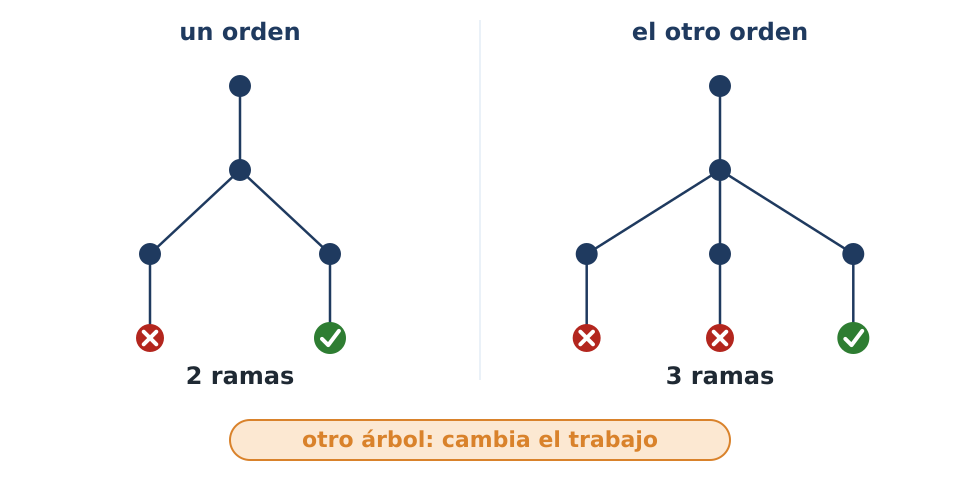

::: notes
Como el orden es fijo, quien escribe el programa decide el orden de la búsqueda. Dos programas con el mismo significado lógico pueden comportarse de manera muy distinta. El orden de los objetivos decide cómo es el árbol: cambiarlo produce un árbol diferente, con otra cantidad de ramas, y por eso cambia el trabajo. A la izquierda, un árbol de dos ramas. A la derecha, el de los mismos objetivos en el otro orden, con tres ramas.
:::

## Qué cambia el orden de las cláusulas

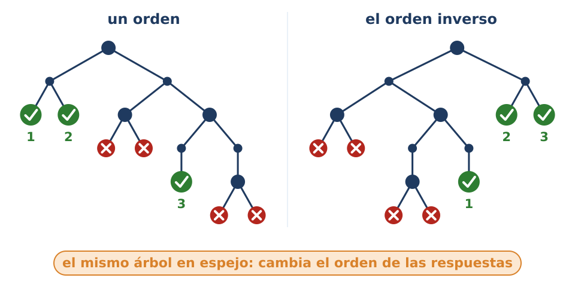

::: notes
El orden de las cláusulas no cambia el árbol: produce el mismo árbol con las ramas en otro orden, y por eso cambia el orden en que llegan las respuestas, no cuáles son. Los números bajo las hojas de éxito indican en qué orden se obtiene cada respuesta, y los dos árboles son uno el espejo del otro. Las dos afirmaciones se comprueban más adelante en el capítulo.
:::

## El programa

<!-- ejemplo: capitulo-05/busqueda.pl predicado: padre/2 abuelo/2 -->
```prolog
% padre(P, H): P es el padre de H.
padre(juan, ana).
padre(juan, pedro).
padre(pedro, luis).

%!  abuelo(?A, ?N) is nondet.
%
%   A es abuelo de N.
abuelo(A, N) :-
    padre(A, P),
    padre(P, N).
```

::: notes
El ejemplo usa un programa deliberadamente reducido: tres hechos de la relación padre y la regla del abuelo, que ya se conoce del capítulo uno. Con un programa tan pequeño, el árbol completo de una consulta cabe en una diapositiva. La consulta que se va a seguir pregunta de quién es abuelo juan.
:::

## Las cláusulas, numeradas

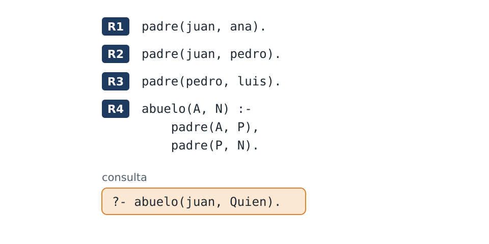

::: notes
Para referirse a cada cláusula por separado, se las numera: R1, R2 y R3 son los tres hechos, y R4 es la regla del abuelo. Esos nombres aparecen en los arcos del árbol, para indicar qué cláusula se usó en cada paso. Abajo está la consulta: abuelo de juan y la variable Quien.
:::

## Las partes de un árbol

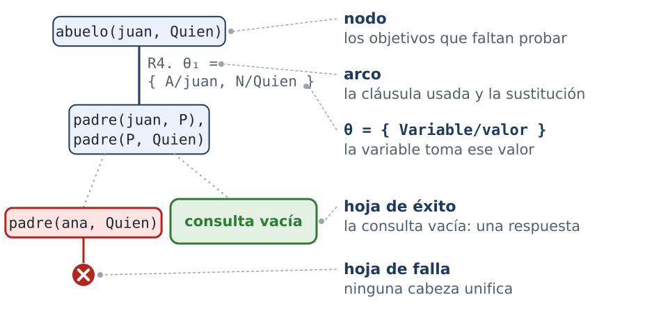

::: notes
Cada nodo del árbol es una consulta: los objetivos que a Prolog le resta probar en ese momento. La raíz es la consulta inicial, y el árbol crece hacia abajo. Cada arco corresponde al uso de una cláusula y lleva dos datos: la cláusula empleada y la sustitución que unifica el objetivo con la cabeza de esa cláusula. Una sustitución se escribe como un conjunto de pares variable, valor, y se lee «la variable toma ese valor». Las sustituciones se numeran en el orden en que Prolog las produce: theta uno, theta dos, y así sucesivamente. Una rama termina en éxito cuando se llega a la consulta vacía, en la que no queda nada por probar. Una rama falla cuando ninguna cabeza unifica con el objetivo seleccionado.
:::

## El árbol · 1

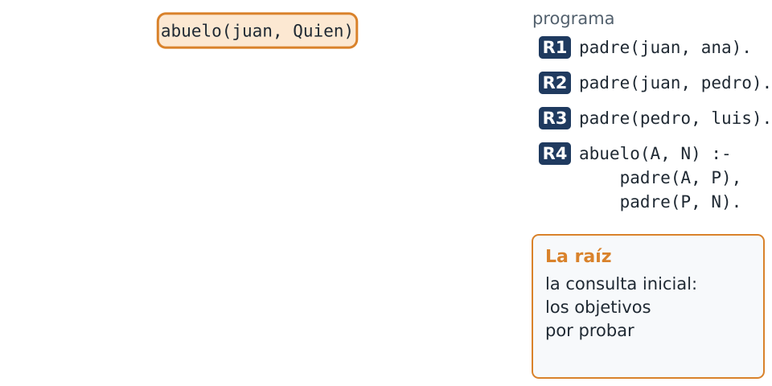

::: notes
El árbol se construye paso a paso, en el mismo orden en que Prolog lo recorre. La raíz es la consulta inicial: abuelo de juan y Quien. El recuadro naranja señala el nodo en el que se encuentra la búsqueda; a la derecha está el programa, con sus cuatro cláusulas.
:::

## El árbol · 2

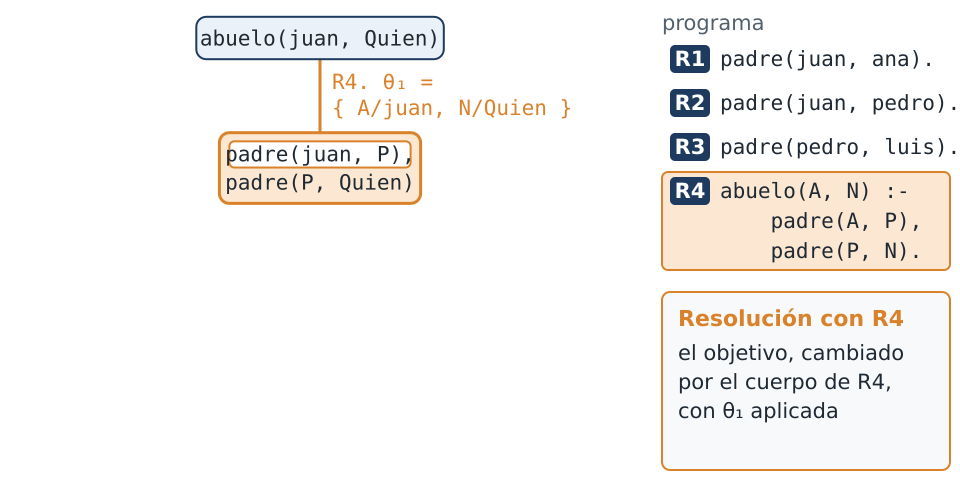

::: notes
La única cláusula cuya cabeza unifica con la raíz es R4, la regla del abuelo, con la sustitución theta uno: A toma el valor juan y N toma el valor Quien. El nodo hijo se obtiene con dos operaciones: se reemplaza el objetivo por el cuerpo de la regla, y se aplica theta uno a todo lo que queda. Por eso el nodo dice padre de juan y P, seguido de padre de P y Quien. El primer objetivo, recuadrado, es el que se prueba a continuación.
:::

## El árbol · 3

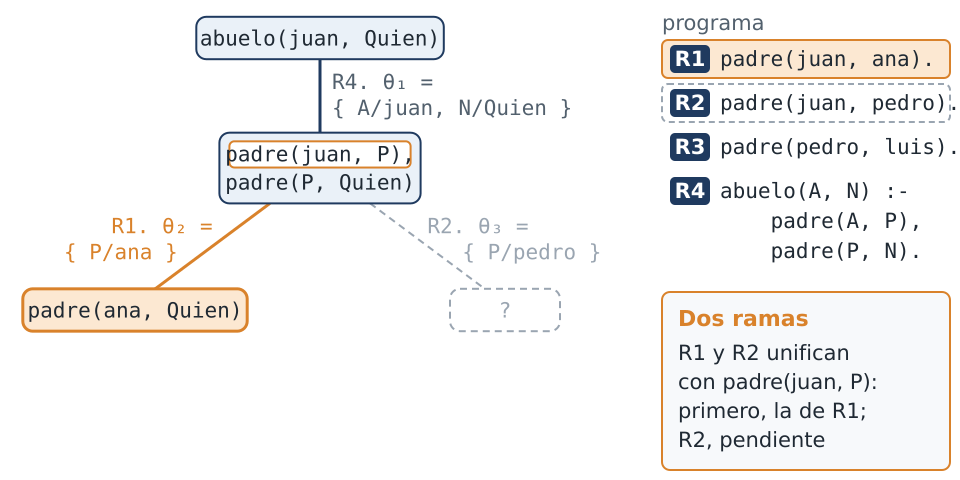

::: notes
El objetivo padre de juan y P unifica con dos hechos, R1 y R2. Dos cláusulas producen dos ramas. Prolog toma primero la de la izquierda, la de R1, porque esa cláusula está escrita antes. Con theta dos, P toma el valor ana, y la consulta que queda es padre de ana y Quien. La rama de R2 queda pendiente, como una alternativa todavía sin explorar.
:::

## El árbol · 4

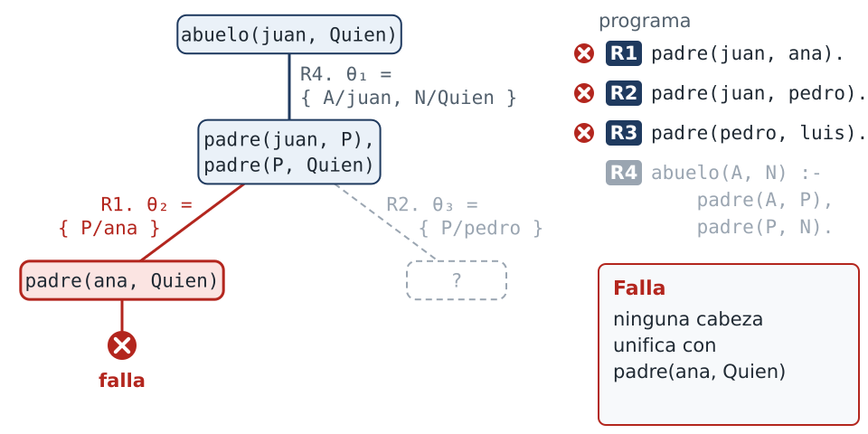

::: notes
Ningún hecho del programa tiene a ana en la primera posición, de modo que ninguna cabeza unifica con padre de ana y Quien. La rama falla. Esta rama no produjo ninguna respuesta, pero recorrerla tuvo un costo: es trabajo que Prolog realizó igual que en una rama exitosa.
:::

## El árbol · 5

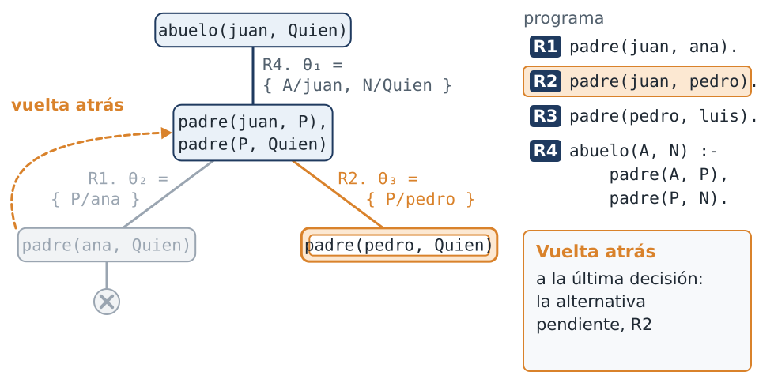

::: notes
Prolog retrocede hasta el último punto donde quedaba una alternativa sin explorar. Eso es el backtracking, la vuelta atrás. La alternativa pendiente es la rama de R2: con theta tres, P toma el valor pedro, y la consulta que queda es padre de pedro y Quien.
:::

## El árbol · 6

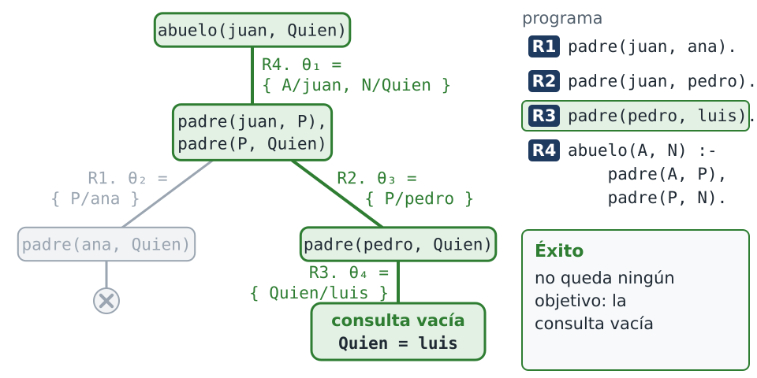

::: notes
El objetivo padre de pedro y Quien unifica con R3, con theta cuatro: Quien toma el valor luis. No queda ningún objetivo por probar: se llegó a la consulta vacía, y la rama termina en éxito. Una hoja de éxito es una respuesta. Si el árbol tuviera tres hojas de éxito, la consulta tendría tres respuestas, que se obtendrían en el orden de las hojas, de izquierda a derecha.
:::

## Resolución

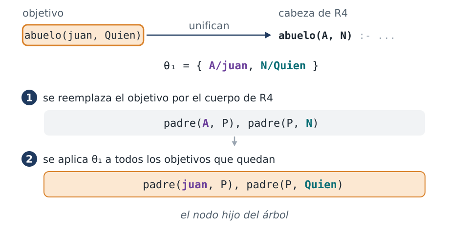

::: notes
El paso del segundo nodo merece una mirada detenida, porque es la única operación de inferencia de Prolog, y se denomina resolución. Primero, la cabeza de R4 se unifica con el objetivo, y esa unificación produce theta uno. Después se hacen dos cosas: el objetivo se reemplaza por el cuerpo de la cláusula, y theta uno se aplica a todos los objetivos que quedan. El resultado es el nodo hijo. Cada vez que Prolog usa una cláusula, toma una copia con variables nuevas; en este árbol la regla se usa una sola vez y la distinción no se nota, pero en el capítulo seis una misma cláusula se usa muchas veces.
:::

## La respuesta

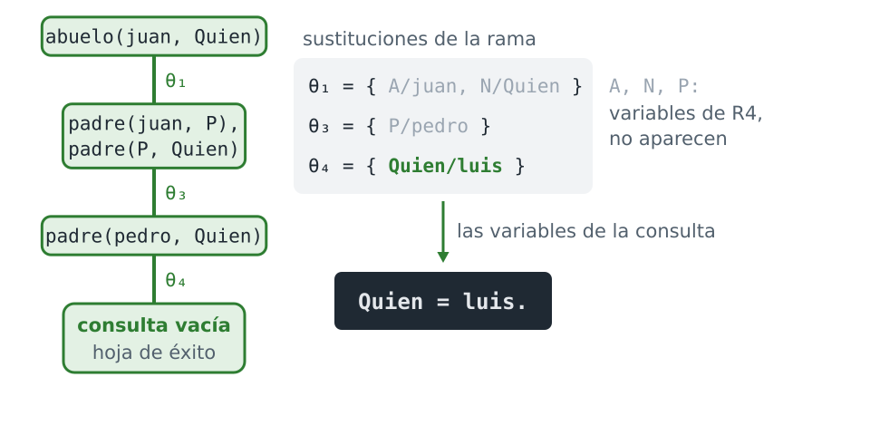

::: notes
La respuesta se expresa en las variables de la consulta. Al llegar a la consulta vacía se juntan todas las sustituciones de la rama exitosa: theta uno, theta tres y theta cuatro. De ese conjunto, la respuesta conserva solamente lo que corresponde a las variables que escribió quien consultó. Quien quedó ligada a luis, y por eso la respuesta es Quien igual a luis. A, N y P eran variables de la regla, no de la consulta, y no aparecen.
:::

## La traza

```text
   Call: (10) abuelo(juan, _8106)
   Call: (11) padre(juan, _8960)
   Exit: (11) padre(juan, ana)
   Call: (11) padre(ana, _8106)
   Fail: (11) padre(ana, _8106)
   Redo: (11) padre(juan, _8960)
   Exit: (11) padre(juan, pedro)
   Call: (11) padre(pedro, _8106)
   Exit: (11) padre(pedro, luis)
   Exit: (10) abuelo(juan, luis)
```

::: notes
El árbol es un diagrama que construye quien analiza el programa. La traza, que se activa con trace, registra el mismo recorrido durante la ejecución real. Los dos cumplen funciones complementarias: el árbol sirve para razonar, y la traza, para verificar. Los identificadores que comienzan con un guion bajo seguido de un número son variables que todavía no tienen valor: las copias nuevas que Prolog crea cada vez que usa una cláusula. El número es interno y cambia de una ejecución a otra. Lo significativo es el momento en que la variable deja de mostrarse así: en la última línea ya aparece luis.
:::

## Traza y árbol · 1

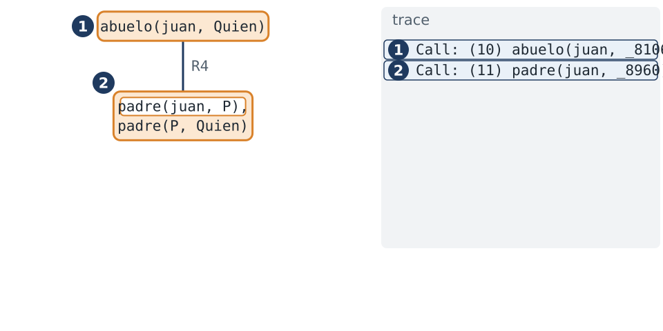

::: notes
Cada línea de la traza tiene un lugar en el árbol; los números de la izquierda son los mismos en los dos lados. La primera línea, Call de abuelo, corresponde a la raíz. La segunda, Call de padre con juan, corresponde al descenso al cuerpo de la regla: es el primer objetivo del nodo siguiente. El número entre paréntesis, diez u once, indica la profundidad.
:::

## Traza y árbol · 2

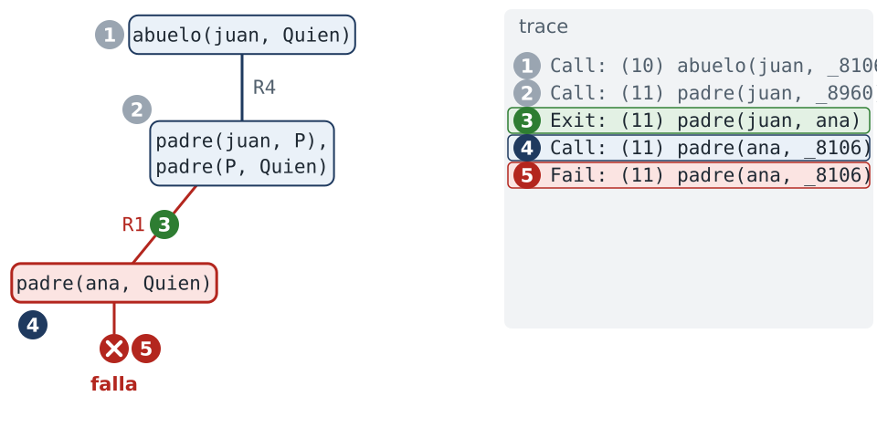

::: notes
Exit de padre de juan y ana es la elección de la rama de la izquierda, la de R1. Call de padre de ana es la llegada al nodo de esa rama, y Fail indica que ese nodo falla.
:::

## Traza y árbol · 3

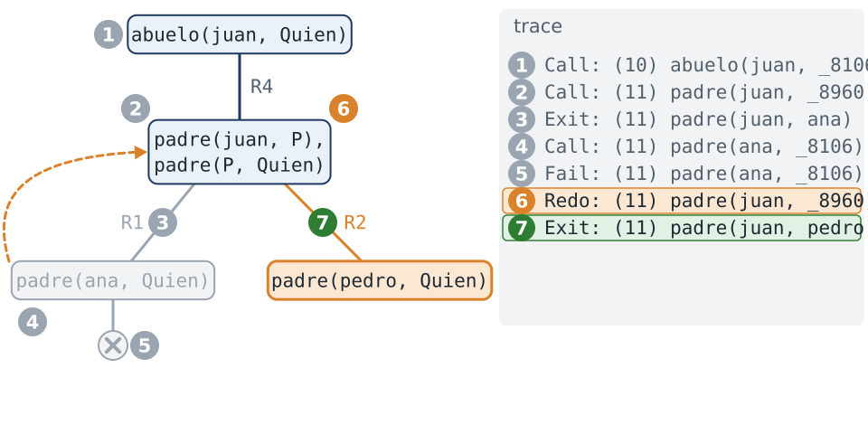

::: notes
Redo de padre de juan es la vuelta atrás: la ejecución vuelve a entrar al objetivo que tenía una alternativa pendiente. Exit de padre de juan y pedro es el descenso por la otra rama, la de R2.
:::

## Traza y árbol · 4

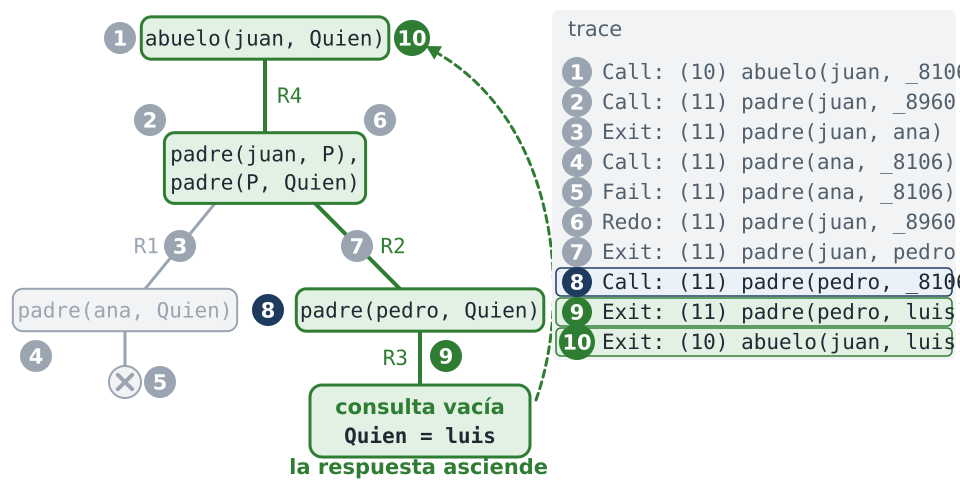

::: notes
Call de padre de pedro es el segundo objetivo de esa rama, y su Exit con luis es la hoja de éxito. La última línea, Exit de abuelo de juan y luis, no tiene una rama propia en el árbol. Las respuestas no descienden: ascienden. Prolog encontró luis en una hoja, y esa ligadura se propaga hasta la raíz, que es la que produce la respuesta.
:::

## Una caja por objetivo

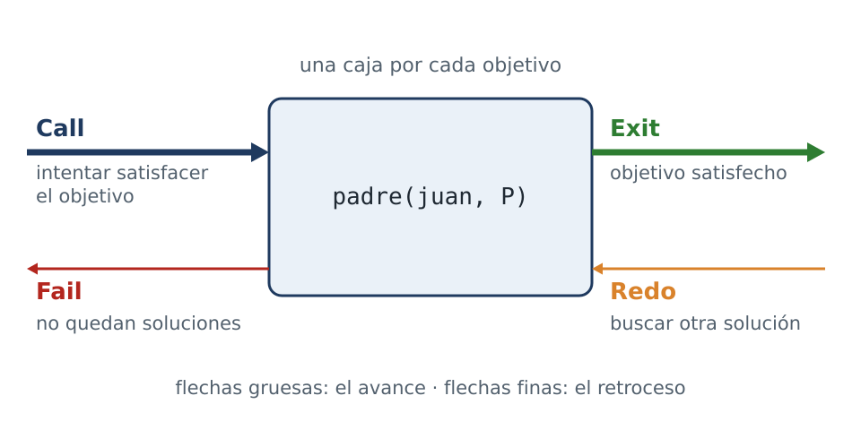

::: notes
Existe un tercer diagrama del mismo recorrido: el modelo de cajas, debido a Lawrence Byrd. Los cuatro eventos de la traza no son independientes: son las cuatro puertas de una misma caja, y cada objetivo es una caja. Se entra por Call cuando la ejecución llega al objetivo por primera vez, y se sale por Exit cuando el objetivo se satisface; son las flechas gruesas, las del avance. Las otras dos corresponden al retroceso. Si un objetivo posterior falla, la ejecución vuelve a entrar por Redo para pedir otra solución. Si la caja encuentra otra, sale de nuevo por Exit; si no le queda ninguna, sale por Fail, y el retroceso continúa en el objetivo anterior.
:::

## Cajas anidadas

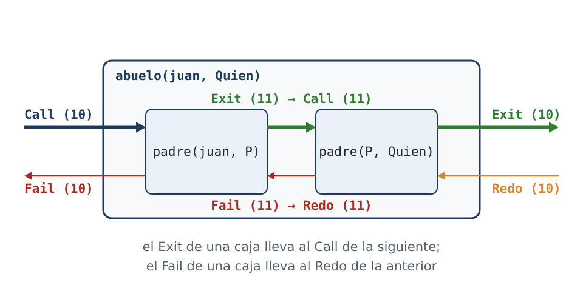

::: notes
La caja de la consulta del abuelo contiene las cajas de sus dos objetivos. Las puertas de la caja exterior se conectan con las de las interiores: entrar a la caja exterior por Call es entrar a la primera caja interior por Call, y salir de la segunda por Exit es salir de la exterior por Exit. Entre las dos cajas interiores, el Exit de la primera lleva al Call de la segunda, y el Fail de la segunda lleva al Redo de la primera. Si la primera caja interior se queda sin soluciones, su Fail es el Fail de toda la caja exterior. Y pedir otra respuesta con punto y coma es entrar por el Redo de la caja exterior, que lleva al Redo de la última caja interior.
:::

## El recorrido por las cajas

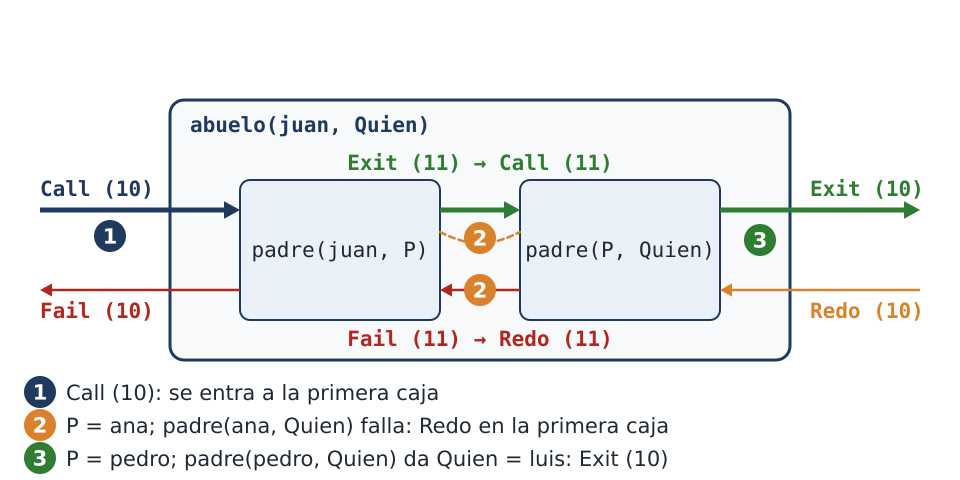

::: notes
Con este modelo, la traza se lee como un recorrido por las puertas. Se entra por Call. La primera caja interior sale por Exit con P igual a ana; la segunda caja no encuentra ningún hecho para ana y sale por Fail, que lleva al Redo de la primera. Es exactamente lo que registra la traza en las líneas cinco y seis. La primera caja encuentra otra solución, P igual a pedro, y esta vez la segunda caja sale por Exit con luis, que es también el Exit de la caja exterior.
:::

## Tres diagramas

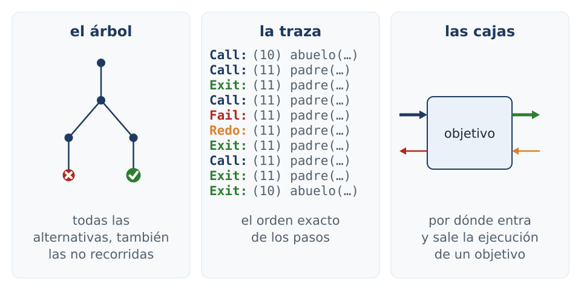

::: notes
Los tres diagramas explican los mismos pasos de diferente manera. El árbol muestra todas las alternativas a la vez, incluidas las que no se recorrieron. La traza muestra el orden exacto en que ocurrieron los pasos. Las cajas muestran por dónde entra y sale la ejecución de un objetivo. El modelo de cajas se retoma en el capítulo nueve, donde el corte inhabilita la puerta Redo de algunas cajas, y en el capítulo veintiséis, junto con las demás herramientas de depuración.
:::

## Caso base primero

<!-- ejemplo: capitulo-05/orden.pl predicado: antepasado/2 -->
```prolog
%!  antepasado(?A, ?D) is nondet.
%
%   A es antepasado de D, con el caso base escrito primero.
antepasado(A, D) :-
    padre(A, D).
antepasado(A, D) :-
    padre(A, Hijo),
    antepasado(Hijo, D).
```

```prolog
?- antepasado(juan, Quien).
Quien = ana ;
Quien = pedro ;
Quien = luis ;
false.
```

::: notes
El archivo orden punto pl define dos veces la relación de antepasado, con las mismas dos cláusulas escritas en los dos órdenes posibles. En esta primera versión, el caso base está escrito primero: un antepasado es, ante todo, el padre. La consulta obtiene primero a los hijos de juan, ana y pedro, y después al nieto, luis.
:::

## Caso recursivo primero

<!-- ejemplo: capitulo-05/orden.pl predicado: primero_lejos/2 -->
```prolog
%!  primero_lejos(?A, ?D) is nondet.
%
%   A es antepasado de D: las mismas dos cláusulas, en orden inverso.
primero_lejos(A, D) :-
    padre(A, Hijo),
    primero_lejos(Hijo, D).
primero_lejos(A, D) :-
    padre(A, D).
```

```prolog
?- primero_lejos(juan, Quien).
Quien = luis ;
Quien = ana ;
Quien = pedro.
```

::: notes
En la segunda versión, el caso recursivo está escrito primero. Las dos versiones tienen exactamente el mismo significado y producen las mismas respuestas, pero en distinto orden: ahora la primera respuesta es luis, el descendiente más lejano.
:::

## Árbol del caso base primero · 1

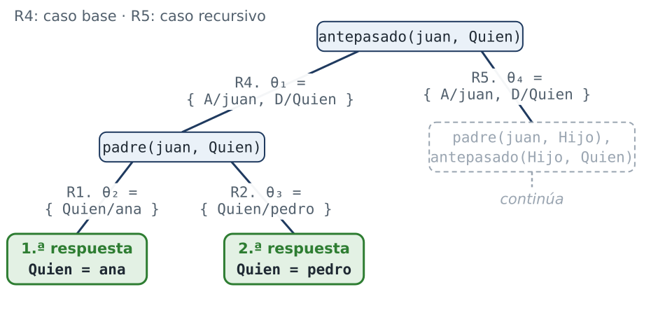

::: notes
Los árboles de derivación lo explican. Los hechos de la relación padre conservan los nombres R1 a R3, y las dos cláusulas de la relación de antepasado se numeran R4, el caso base, y R5, el caso recursivo. Como las cláusulas se prueban de arriba hacia abajo, la primera cláusula corresponde a la rama de la izquierda. Por la rama de R4, el objetivo padre de juan y Quien unifica con R1 y con R2: son las dos primeras respuestas, ana y pedro, con theta dos y theta tres. La rama de R5, que empieza con theta cuatro, continúa en las diapositivas siguientes.
:::

## Árbol del caso base primero · 2

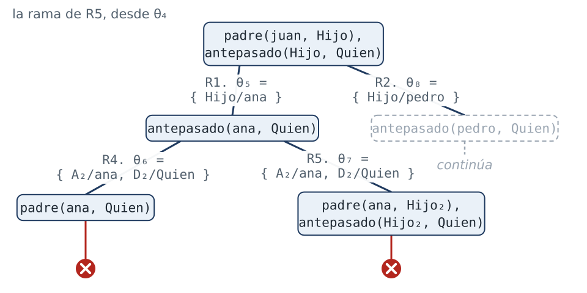

::: notes
La rama de R5 reemplaza la raíz por dos objetivos: padre de juan e Hijo, y antepasado de Hijo y Quien. El primero unifica con R1 y con R2, y abre dos ramas, la de ana y la de pedro. Cada llamada a la relación de antepasado usa una copia nueva de las variables de la cláusula, y por eso aparecen A dos, D dos e Hijo dos. Ana no tiene hijos en el programa: por R4, padre de ana y Quien no unifica con ningún hecho, y por R5 tampoco lo hace padre de ana e Hijo dos. Las dos ramas fallan. La rama de pedro continúa en la diapositiva siguiente.
:::

## Árbol del caso base primero · 3

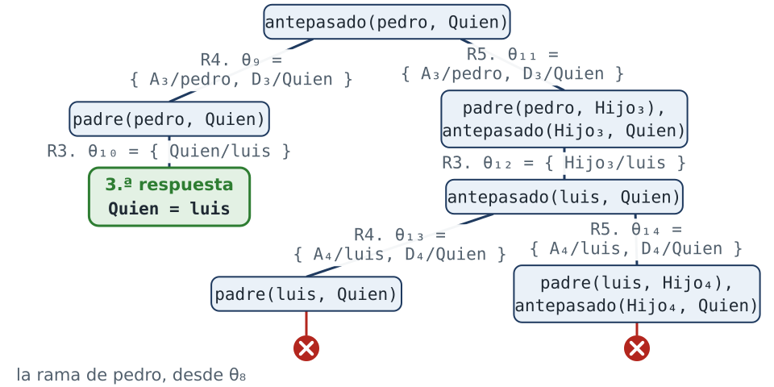

::: notes
En la rama de pedro, R4 lleva a padre de pedro y Quien, que unifica con R3 con theta diez: es la tercera respuesta, luis. R5 lleva a antepasado de luis y Quien, y luis no tiene hijos: las dos ramas que salen de ese nodo fallan, y la consulta termina con false. Con el caso base primero, las hojas de éxito de más a la izquierda son los hijos, y las respuestas llegan en ese orden: ana, pedro y luis.
:::

## Árbol del caso recursivo primero · 1

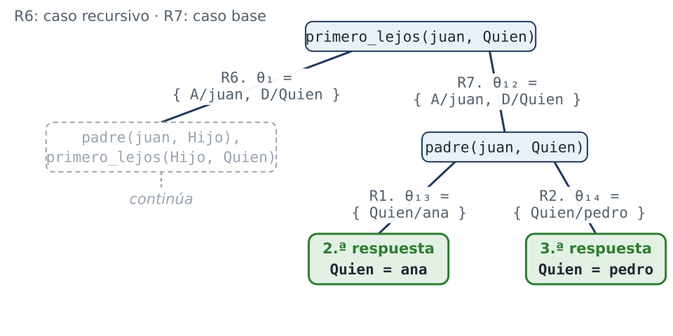

::: notes
La segunda versión tiene el mismo árbol, con las ramas en el orden inverso. Aquí la cláusula recursiva se numera R6 y el caso base, R7. La rama de R6 queda a la izquierda y se recorre primero, con theta uno, y continúa en las diapositivas siguientes. La rama de R7, a la derecha, contiene las respuestas ana y pedro, pero Prolog llega a ella al final, con theta doce: por eso son la segunda y la tercera respuesta.
:::

## Árbol del caso recursivo primero · 2

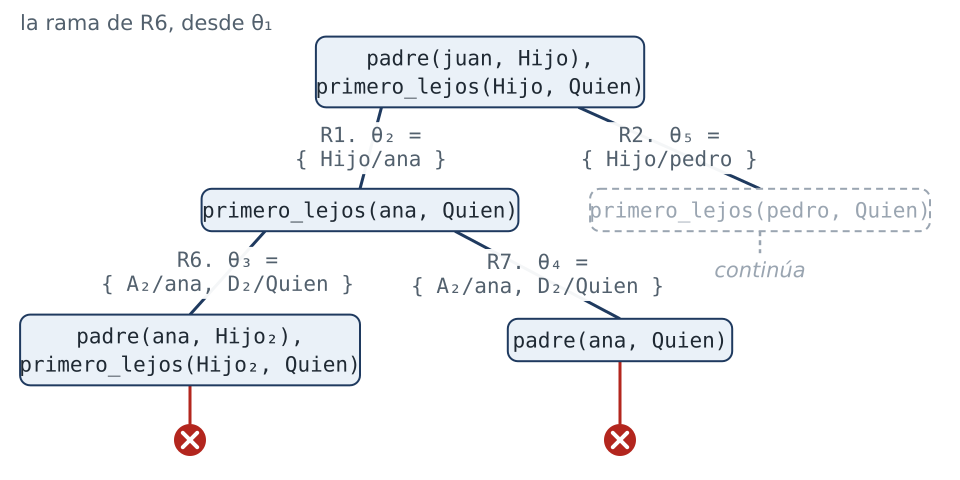

::: notes
La rama de R6 se abre, como antes, en la rama de ana y la de pedro. La de ana falla con R6 y con R7, igual que en el árbol anterior: lo único que cambia es el orden de sus dos ramas y, con él, la numeración de las sustituciones. La rama de pedro continúa en la diapositiva siguiente.
:::

## Árbol del caso recursivo primero · 3

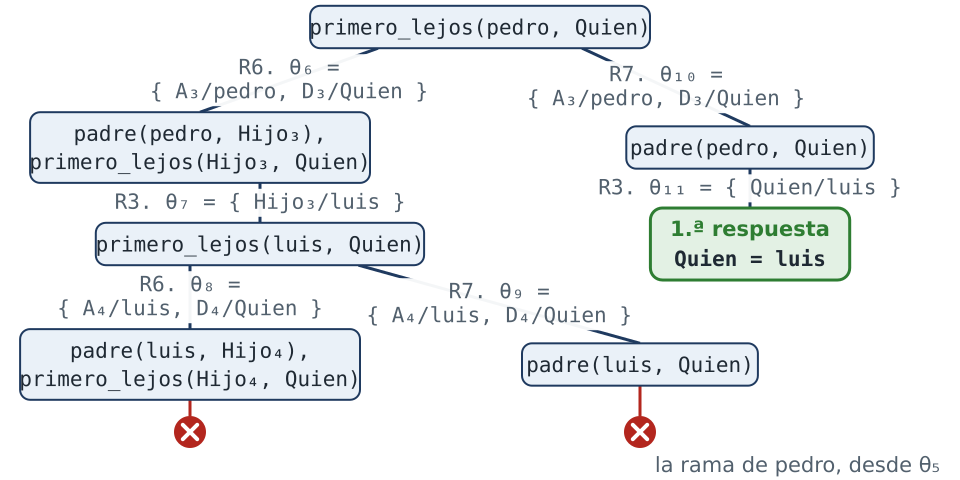

::: notes
En la rama de pedro, R6 se prueba antes que R7: desciende hasta luis, cuyas dos ramas fallan. Recién entonces R7 lleva a padre de pedro y Quien, que unifica con R3 con theta once: la primera respuesta es luis, el descendiente más lejano. Con el caso recursivo primero, Prolog desciende por el árbol antes de explorar las ramas vecinas. No se pierde ninguna respuesta, porque este árbol es finito y todas sus ramas se recorren: después de luis llegan ana y pedro, por la rama de R7 de la raíz.
:::

## Los objetivos al revés

<!-- ejemplo: capitulo-05/busqueda.pl fragmento: abuelo_al_reves(A, N) :- .. padre(A, P). -->
```prolog
abuelo_al_reves(A, N) :-
    padre(P, N),
    padre(A, P).
```

```prolog
?- abuelo_al_reves(juan, Quien).
Quien = luis.
```

::: notes
Dentro de una regla, el efecto del orden es distinto. Esta versión de la regla del abuelo invierte sus dos objetivos: primero busca a un padre del nieto, y después comprueba que juan sea padre de ese padre. Las respuestas son las mismas; lo que cambia es el árbol.
:::

## Distinto trabajo

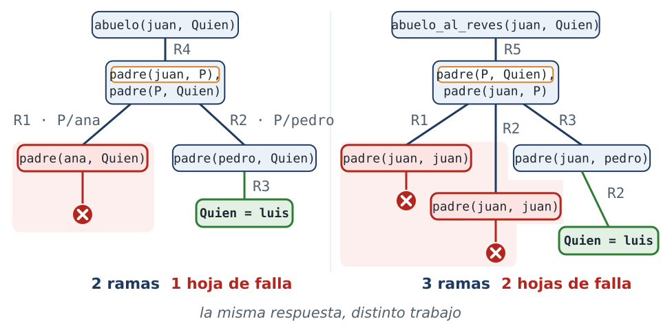

::: notes
A la izquierda está el árbol de la versión original, y a la derecha el de la versión invertida. La versión original comienza por padre de juan y P, que unifica con dos hechos: dos ramas, una de ellas fallida. La versión invertida comienza por padre de P y Quien, con las dos posiciones libres, de modo que unifica con los tres hechos: tres ramas. Dos de ellas ligan P a juan y dejan como segundo objetivo padre de juan y juan, que no unifica con ninguna cabeza. La tercera liga P a pedro, y su segundo objetivo coincide con R2, sin nada que ligar. La respuesta es la misma, Quien igual a luis; el trabajo para encontrarla, no.
:::

## Menos alternativas primero

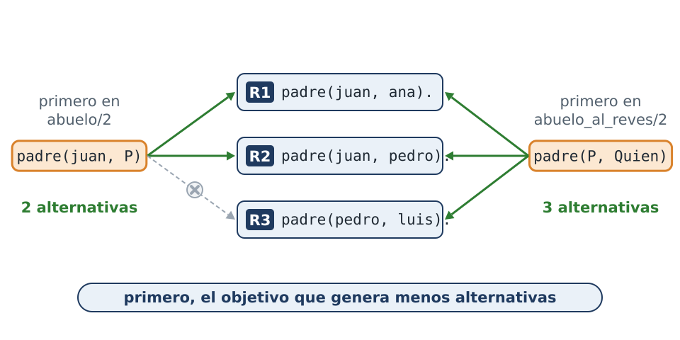

::: notes
De aquí se desprende una regla práctica, válida para todo el curso: se escribe primero el objetivo que genera menos alternativas. Cuanto antes se descartan los candidatos que no cumplen, menor es el árbol a recorrer. Con tres hechos la diferencia es irrelevante; cuando hay miles de hechos, se convierte en un problema de rendimiento. El capítulo dieciséis retoma el tema.
:::

## Una versión que no termina

```prolog
%!  antepasado(?A, ?D) is nondet.
%
%   A es antepasado de D. Correcto como afirmación lógica;
%   como programa, no termina.
antepasado(A, D) :-
    antepasado(A, X),
    padre(X, D).
antepasado(A, D) :-
    padre(A, D).
```

```text
ERROR: Stack limit (1.0Gb) exceeded
ERROR:   Probable infinite recursion (cycle):
```

::: notes
Todo lo anterior supone que el árbol es finito. No siempre lo es, y este es el caso de mayor importancia práctica del capítulo. Esta versión de la relación de antepasado expresa una afirmación cierta: A es antepasado de D si A es antepasado de alguien que es padre de D. Sin embargo, cualquier consulta sobre este predicado no termina, y después de un tiempo se produce el error de la parte inferior: la memoria disponible se agotó.
:::

## Una rama infinita · 1

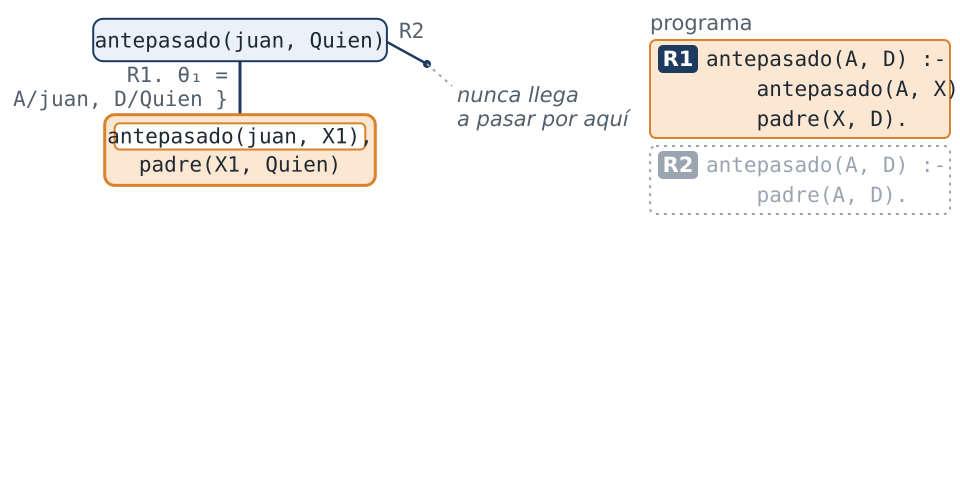

::: notes
El árbol muestra la causa. Aquí la cláusula recursiva se numera R1 y el caso base, R2. La raíz es la consulta sobre los antepasados de juan. La primera cláusula la reemplaza por su cuerpo, cuyo primer objetivo vuelve a ser una consulta sobre los antepasados de juan. La rama de R2, a la derecha de la raíz, existe, pero se dibuja punteada: para llegar a ella, Prolog tendría que terminar antes la rama de su izquierda.
:::

## Una rama infinita · 2

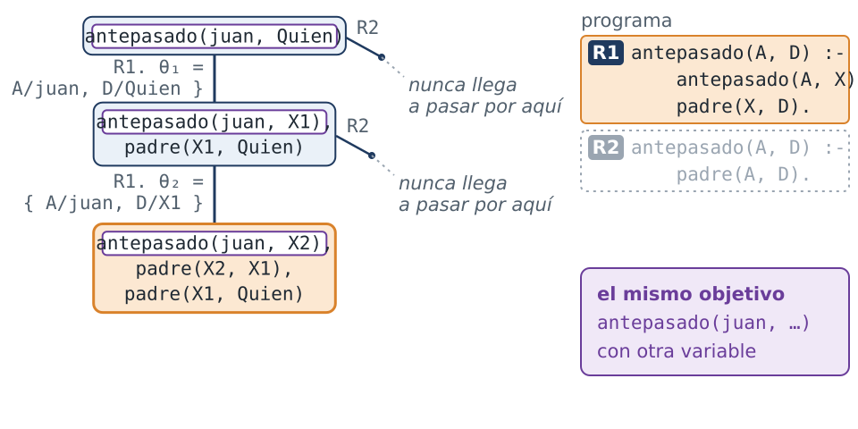

::: notes
El primer objetivo del nodo nuevo es el mismo objetivo inicial, con otro nombre de variable. Al aplicar otra vez R1 reaparece, una vez más, el mismo objetivo con una variable nueva. La rama repite indefinidamente la misma situación, y en cada nivel queda una rama de R2 que nunca se recorre.
:::

## Una rama infinita · 3

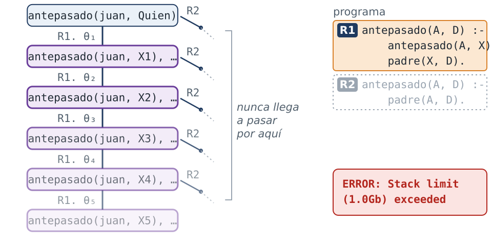

::: notes
El árbol crece hacia abajo sin llegar jamás a una hoja, y las sustituciones siguen numerándose por esa única rama, porque es la única que Prolog recorre. Las ramas de R2 son las que producirían respuestas, pero ninguna ejecución llega a usarlas: la cláusula está escrita en el programa y no se aplica nunca. Mientras tanto, cada nivel ocupa memoria, hasta que se agota y aparece el error.
:::

## Cómo reconocer una rama infinita

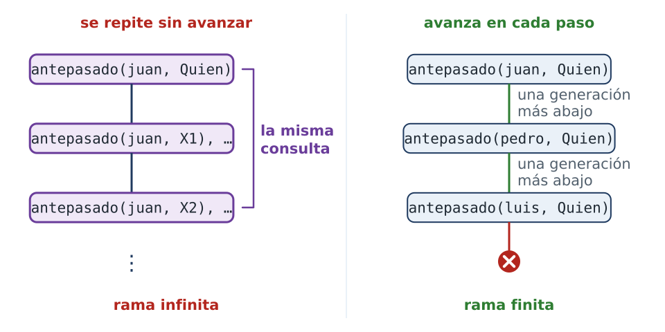

::: notes
Como cada uso de una cláusula emplea variables nuevas, el criterio se enuncia salvo los nombres de las variables. Si un nodo repite una consulta que ya apareció más arriba en la misma rama, y en el camino no se avanzó nada, la rama es infinita. Es un criterio que se aplica a simple vista sobre cualquier árbol dibujado, sin ejecutar el programa. A la derecha, en cambio, cada llamada comienza una generación más abajo que la anterior: la rama avanza, y como la familia es finita, termina.
:::

## Avanzar antes de la recursión

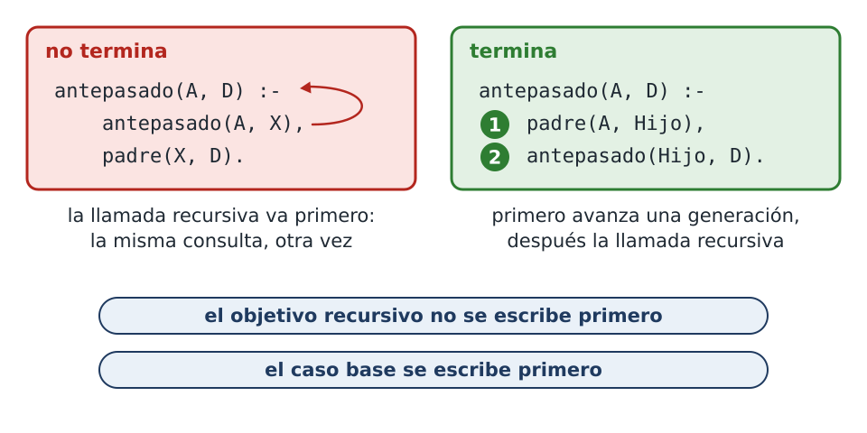

::: notes
La versión de la sección cinco punto cuatro, que sí termina, difiere solo en cuál objetivo se escribe primero. Antes de la llamada recursiva, avanza un paso: el objetivo de la relación padre desciende una generación. De este análisis se derivan dos criterios de escritura. El objetivo recursivo no se escribe en primer lugar: antes debe haber un objetivo que reduzca el problema. Y el caso base se escribe primero: no es obligatorio, pero mejora la legibilidad y obliga a verificar que el caso base existe.
:::

## Correcto no equivale a ejecutable

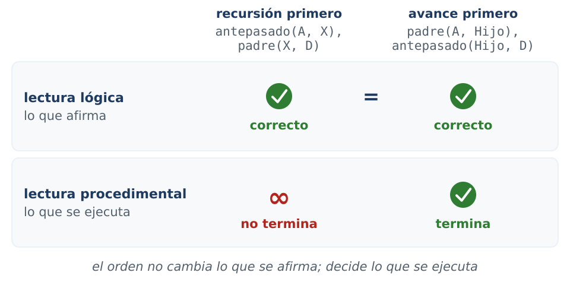

::: notes
Leídas como afirmaciones lógicas, las dos versiones tienen el mismo significado. Ejecutadas, una termina y la otra no. Un programa Prolog es, al mismo tiempo, un conjunto de afirmaciones lógicas y un procedimiento que se ejecuta. El orden no modifica lo primero, pero determina lo segundo. El capítulo doce analiza esta dualidad desde el punto de vista de la lógica.
:::

## Resumen

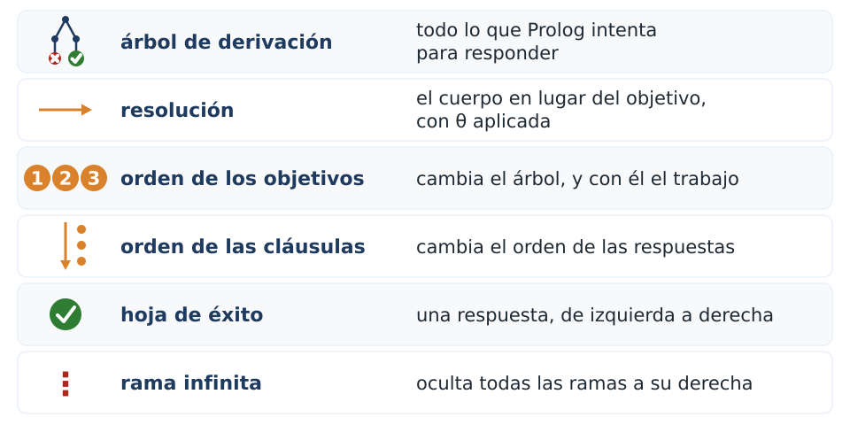

::: notes
El árbol de derivación es el diagrama de todo lo que Prolog intenta para responder una consulta. Cada paso es una resolución: el objetivo se reemplaza por el cuerpo de una cláusula y se aplica la sustitución. El orden de los objetivos cambia el árbol y, con él, el trabajo. El orden de las cláusulas cambia el orden de las respuestas. Cada hoja de éxito es una respuesta, y se obtienen de izquierda a derecha. Una rama infinita impide alcanzar todas las ramas que están a su derecha. El capítulo seis se ocupa de escribir recursiones que terminan.
:::
