# Capítulo 6 — Recursión

::: notes
La recursión es el único mecanismo de repetición de Prolog. No existe otra construcción con ese propósito, y por eso el capítulo la estudia en detalle. Las listas, la aritmética y los árboles de los capítulos siguientes son aplicaciones de la recursión a distintas estructuras. Al terminar, se puede escribir un predicado recursivo separando el caso base del caso recursivo, explicar por qué termina, definir estructuras nuevas con términos y escribir una recursión que produce un resultado.
:::

## Una regla por profundidad

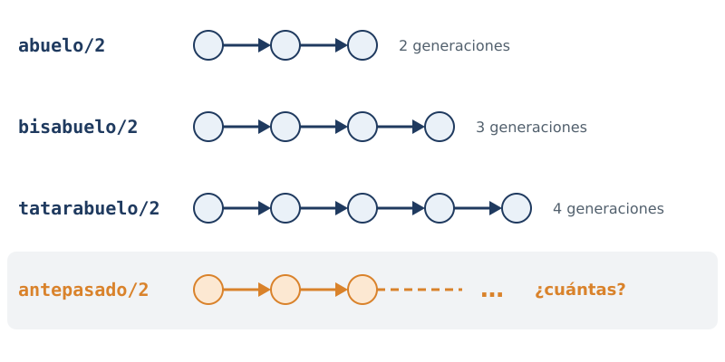

::: notes
Con las reglas del capítulo tres se puede definir abuelo, que recorre dos generaciones, y también bisabuelo, que recorre tres. Cada relación necesita su propia regla. Antepasado no se puede definir de ese modo, porque la cantidad de generaciones no se conoce de antemano: haría falta una regla para cada profundidad posible. La recursión resuelve exactamente ese problema: una regla puede usar en su cuerpo el mismo predicado que está definiendo.
:::

## antepasado/2

:::: columns
::: column
<!-- ejemplo: capitulo-06/antepasados.pl fragmento: antepasado(A, D) :- .. antepasado(Hijo, D). -->
```prolog
antepasado(A, D) :-
    progenitor(A, D).
antepasado(A, D) :-
    progenitor(A, Hijo),
    antepasado(Hijo, D).
```

```prolog
?- antepasado(tare, isaac).
true ;
false.
```
:::
::: column
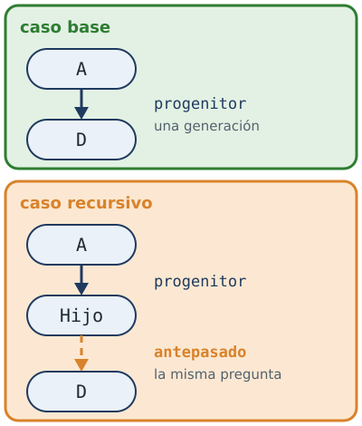
:::
::::

::: notes
El ejemplo es el árbol de Taré del capítulo uno. La primera cláusula resuelve el caso más simple: si A es progenitor de D, ya es su antepasado. La segunda desciende una generación, hasta un hijo de A, y vuelve a plantear la misma pregunta desde ese punto. El dibujo muestra las dos partes: arriba, una sola generación; abajo, una generación y después la misma relación, que cubre el resto del camino.
:::

## Una generación por llamada · 1

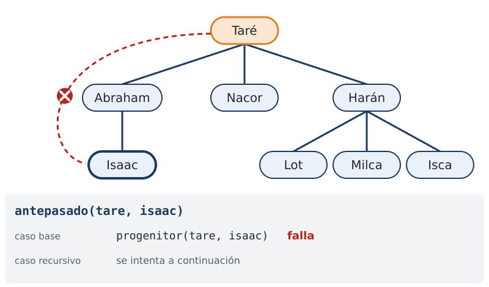

::: notes
La consulta pregunta si Taré es antepasado de Isaac. Prolog prueba primero la cláusula del caso base: ¿es Taré progenitor de Isaac? No lo es; Isaac es su nieto. Esa cláusula falla, y Prolog pasa a la siguiente.
:::

## Una generación por llamada · 2

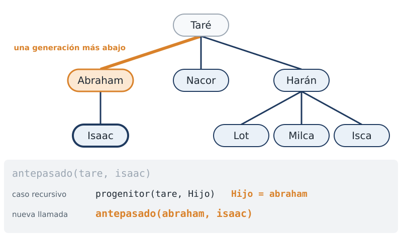

::: notes
La cláusula del caso recursivo busca primero un hijo de Taré. El primero que encuentra es Abraham. Con él, la consulta se reduce a otra de la misma forma, una generación más abajo: ¿es Abraham antepasado de Isaac?
:::

## Una generación por llamada · 3

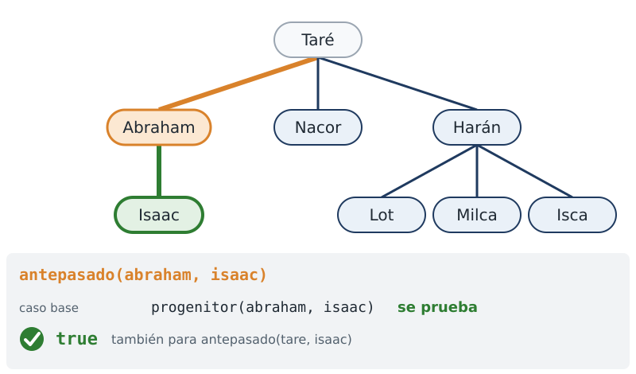

::: notes
En la nueva llamada, el caso base sí alcanza: Abraham es el padre de Isaac. La llamada interna se prueba, y con ella la consulta original: la respuesta es true. Al pedir otra respuesta, Prolog explora las alternativas que quedaron pendientes, los otros hijos de Taré, y no encuentra ninguna más: por eso la respuesta final es false.
:::

## Por qué termina

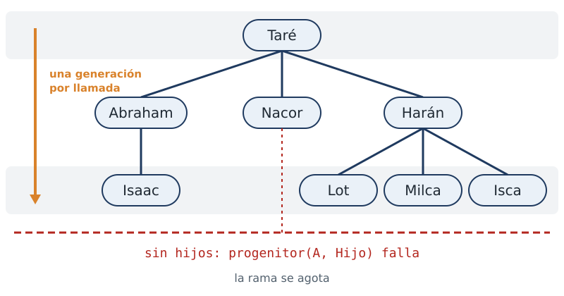

::: notes
Toda recursión plantea las mismas dos preguntas: qué se reduce en cada llamada, y dónde se detiene. Aquí la respuesta se ve en el árbol. Cada llamada recursiva empieza una generación más abajo que la anterior, y la familia tiene una cantidad finita de generaciones. Al llegar a alguien que no tiene hijos, la búsqueda de un hijo falla y esa rama se agota. No hay manera de descender para siempre. Ese es el requisito fundamental: el caso recursivo debe avanzar hacia el caso base.
:::

## La babushka


::: notes
La recursión funciona porque el problema tiene una estructura recurrente. Una babushka es un juego de muñecas rusas huecas, una dentro de otra. Al quitar la muñeca exterior queda otra babushka, de la misma forma que la original y más chica. Desarmarla, entonces, es aplicar el mismo procedimiento una y otra vez, hasta encontrar la muñeca del centro, que ya no es hueca. El procedimiento considera dos casos: la muñeca exterior es hueca, o es maciza.
:::

## Una babushka es un término

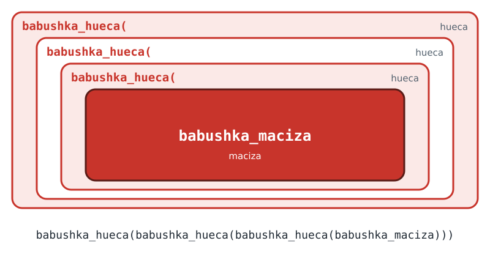

::: notes
Una babushka se escribe con dos clases de términos. Babushka hueca, con un argumento, es una muñeca hueca que tiene otra babushka adentro. Babushka maciza es la muñeca del centro, que ya no se abre. Una babushka de cuatro muñecas, tres huecas y la maciza, es un término con tres niveles de babushka hueca alrededor de la maciza.
:::

## desarma/1

Caso base

<!-- ejemplo: capitulo-06/babushka.pl fragmento: desarma(babushka_maciza). .. desarma(babushka_maciza). -->
```prolog
desarma(babushka_maciza).
```

Caso recursivo

<!-- ejemplo: capitulo-06/babushka.pl fragmento: desarma(babushka_hueca(Interior)) :- .. desarma(Interior). -->
```prolog
desarma(babushka_hueca(Interior)) :-
    desarma(Interior).
```

::: notes
Desarmar una babushka es un predicado de dos cláusulas, una por cada caso. El caso base es la muñeca maciza: la instancia más simple del problema. No hay nada que quitar, y la cláusula es un hecho, sin ninguna invocación. El caso recursivo separa, en su cabeza, la muñeca exterior de su contenido, y en su cuerpo plantea el mismo problema sobre ese contenido, que es otra babushka con una muñeca hueca menos.
:::

## Una muñeca por llamada

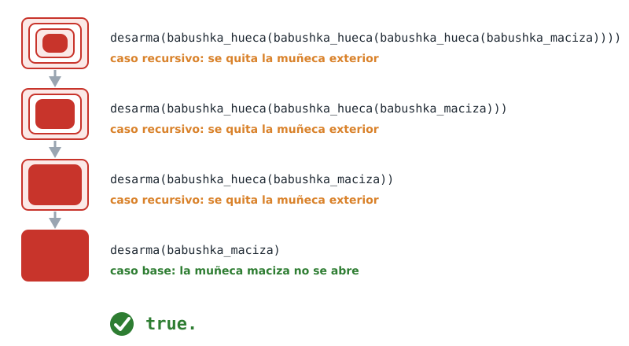

::: notes
Cada llamada quita un nivel del término, hasta que lo que queda es la muñeca maciza. Tres muñecas huecas producen tres usos del caso recursivo, y la maciza, un uso del caso base, que es el que termina la recursión. La respuesta es true. Si faltara el caso base, la recursión no tendría condición de finalización; si el caso recursivo no redujera el término, tampoco. En ambos casos el programa no termina.
:::

## Plantilla 8

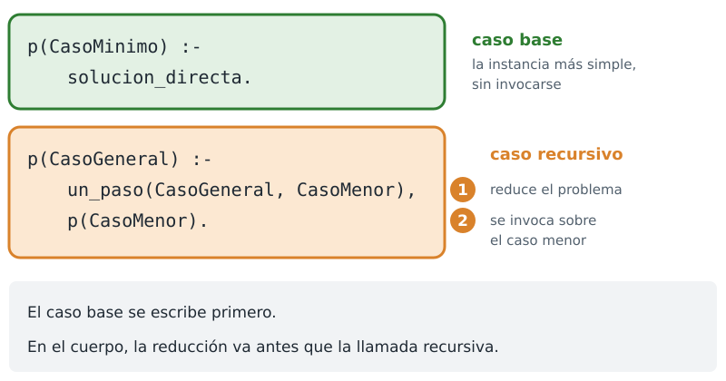

::: notes
La forma extraída de antepasado es la plantilla ocho, caso base y caso recursivo. Se usa cuando una operación se repite una cantidad de veces que no se conoce de antemano. El caso base resuelve el caso mínimo directamente. El caso recursivo da un paso que reduce el problema y después se invoca sobre el caso menor. El caso base se escribe primero: mejora la legibilidad y obliga a verificar que existe. En el cuerpo del caso recursivo, el objetivo que reduce el problema va antes de la llamada recursiva; de lo contrario, el programa no termina.
:::

## Los números naturales

:::: columns
::: column
<!-- ejemplo: capitulo-06/naturales.pl predicado: natural/1 -->
```prolog
%!  natural(+N) is semidet.
%!  natural(-N) is multi.
%
%   N es un número natural.
natural(cero).
natural(s(N)) :-
    natural(N).
```
:::
::: column
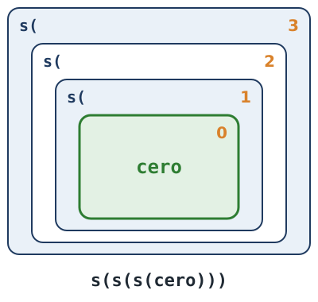
:::
::::

::: notes
En antepasado la estructura que se recorre ya existía: la daban los hechos. Aquí se define una estructura propia, los números naturales, usando solo términos. Bastan dos afirmaciones: cero es un número natural, y si N es natural, su sucesor también lo es. El sucesor se escribe con el término s, de un argumento. El uno es s de cero, el dos es s de s de cero, y el tres tiene tres niveles de s, como las muñecas. Cero es un átomo, elegido a propósito en lugar del número: ninguno de estos términos es un número para Prolog, y no se opera con is.
:::

## Verificar y generar

:::: columns
::: column
Verifica

```prolog
?- natural(s(s(cero))).
true.
```
:::
::: column
Genera

```prolog
?- natural(N).
N = cero ;
N = s(cero) ;
N = s(s(cero)) ;
N = s(s(s(cero))) ;
...
```
:::
::::

::: notes
El predicado opera en dos modos. Con el argumento instanciado, verifica que sea un natural. Con una variable libre, genera los naturales, uno tras otro, de manera indefinida. Esa segunda consulta no termina, y el comportamiento es correcto: el conjunto de los naturales es infinito. Es el primer ejemplo del curso de una rama infinita que no constituye un error. El encabezado registra los dos modos, una línea para cada uno.
:::

## suma/3

<!-- ejemplo: capitulo-06/naturales.pl predicado: suma/3 -->
```prolog
%!  suma(?A, ?B, ?C) is nondet.
%
%   C es A más B.
suma(cero, B, B).
suma(s(A), B, s(C)) :-
    suma(A, B, C).
```

```prolog
?- suma(s(cero), s(s(cero)), Cuanto).
Cuanto = s(s(s(cero))).
```

::: notes
Sobre estos naturales se define la suma, con el mismo método. Caso base: la suma de cero y B es B. Caso recursivo: la suma del sucesor de A y B es el sucesor de la suma de A y B. La consulta suma uno y dos, y la respuesta es tres.
:::

## La suma, llamada por llamada · 1

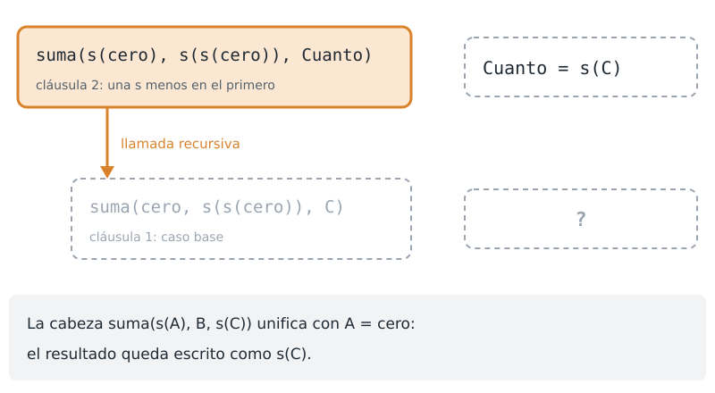

::: notes
La primera llamada tiene uno en el primer argumento, de modo que el caso base no se aplica. La cabeza de la cláusula recursiva unifica con la consulta: A queda ligada a cero, y el resultado queda escrito como el sucesor de un valor C que todavía no se conoce. Falta calcular C, con una llamada recursiva que tiene una s menos en el primer argumento.
:::

## La suma, llamada por llamada · 2

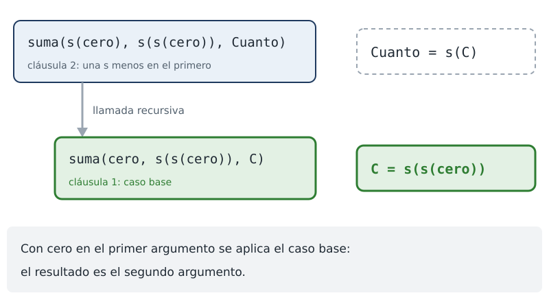

::: notes
La segunda llamada tiene cero en el primer argumento, y la resuelve el caso base: el resultado es el segundo argumento, el dos. C queda ligada a s de s de cero. No hay más llamadas.
:::

## La suma, llamada por llamada · 3

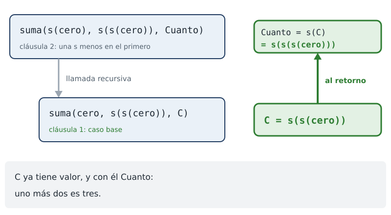

::: notes
Al cerrarse la llamada interna, el resultado de la primera ya está completo: era el sucesor de C, y C vale dos. El resultado es tres. En cada llamada se eliminó un nivel de s del primer argumento y se agregó uno al resultado, hasta que el primer argumento fue cero.
:::

## Sumar y restar

```prolog
?- suma(s(cero), s(s(cero)), Cuanto).
Cuanto = s(s(s(cero))).

?- suma(A, s(s(cero)), s(s(s(cero)))).
A = s(cero) ;
false.
```

::: notes
La segunda consulta muestra la propiedad más importante del capítulo. Pregunta qué número sumado a dos da tres, y la respuesta es uno. La misma definición que suma, consultada en otro sentido, resta.
:::

## Una relación entre tres números

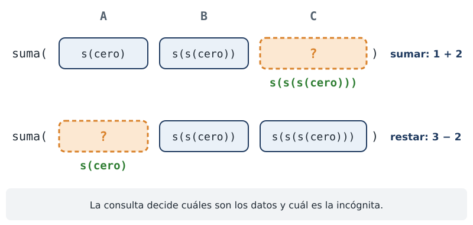

::: notes
No existe una regla para sumar y otra para restar: existe una relación entre tres números, y la consulta determina cuáles son los datos y cuál es la incógnita. La evaluación con is no tiene esta propiedad: evalúa en un único sentido. Por eso conviene observarla antes del capítulo ocho.
:::

## ¿Qué se reduce?

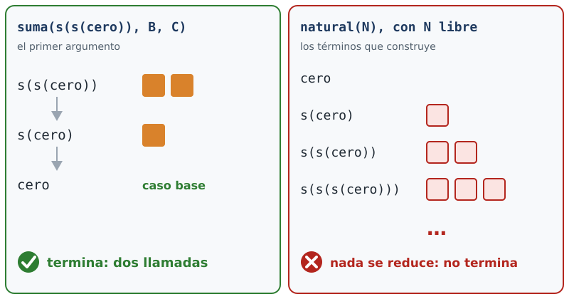

::: notes
La pregunta de siempre, qué se reduce en cada llamada, se responde ahora sobre los dos predicados construidos con términos. En la suma, cada llamada elimina un nivel de s del primer argumento, y el caso base espera cero. Con dos en el primer argumento hay exactamente dos llamadas recursivas, y la recursión termina. En natural con la variable libre, ninguna magnitud se reduce: Prolog construye términos cada vez mayores. De aquí se desprende un principio general: la terminación de un predicado puede depender de cómo se lo invoca, y no solo de cómo está escrito.
:::

## generaciones/3

Caso base

<!-- ejemplo: capitulo-06/generaciones.pl fragmento: generaciones(A, D, 1) :- .. padre(A, D). -->
```prolog
generaciones(A, D, 1) :-
    padre(A, D).
```

Caso recursivo

<!-- ejemplo: capitulo-06/generaciones.pl fragmento: generaciones(A, D, N) :- .. N is Faltan + 1. -->
```prolog
generaciones(A, D, N) :-
    padre(A, Hijo),
    generaciones(Hijo, D, Faltan),
    N is Faltan + 1.
```

::: notes
Una recursión también puede construir un resultado. El caso base establece el resultado de la instancia más simple, y el caso recursivo toma el resultado de la llamada recursiva y le agrega su contribución. El ejemplo usa una familia en cadena: juan es padre de ana, ana de luis y luis de eva, sin hermanos. Entre dos personas hay un único camino, y la cantidad de generaciones que las separa está bien definida.
:::

## Dos consultas

```prolog
?- generaciones(juan, eva, Cuantas).
Cuantas = 3 ;
false.

?- generaciones(juan, Quien, 2).
Quien = luis ;
false.
```

::: notes
Entre juan y eva hay tres generaciones. Como en los casos anteriores, la relación se puede consultar en el otro sentido: la persona que está dos generaciones por debajo de juan es luis.
:::

## Las generaciones, al retorno

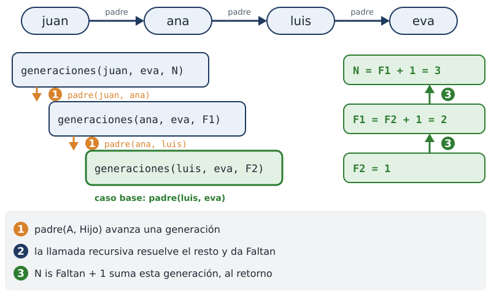

::: notes
El orden de los objetivos del caso recursivo es el de la mayoría de las recursiones que producen un resultado. Primero, buscar un hijo avanza un paso y reduce el problema. Segundo, la llamada recursiva resuelve el problema reducido y produce un número. Tercero, se suma uno por esta generación. La suma se escribe después de la llamada recursiva, porque el número que devuelve esa llamada no tiene valor hasta que la llamada termina. Si se escribiera antes, se produciría el error de argumentos sin instanciar del capítulo uno. En la figura, las llamadas bajan de juan a luis; el caso base da uno, y al retorno cada llamada suma uno: dos, y después tres.
:::

## Cuatro causas de no terminación

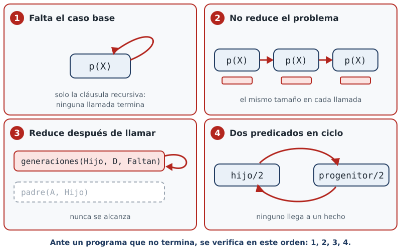

::: notes
La mayoría de las recursiones que no terminan corresponden a una de cuatro causas. Primera: falta el caso base, y solo existe la cláusula recursiva. Segunda: el caso recursivo no reduce el problema, y se invoca con argumentos del mismo tamaño. Tercera: el objetivo que reduce el problema está después de la llamada recursiva. Cuarta: dos predicados se llaman mutuamente. Ante un programa que no termina, se recomienda verificar en ese orden.
:::

## La reducción, después

```prolog
%!  generaciones(?A, ?D, -N) is nondet.
%
%   No termina: la llamada recursiva precede
%   al objetivo que reduce el problema.
generaciones(A, D, N) :-
    generaciones(Hijo, D, Faltan),
    padre(A, Hijo),
    N is Faltan + 1.
```

::: notes
La tercera causa es la más difícil de detectar, porque el programa parece correcto: tiene su caso base y tiene su objetivo de reducción. Sin embargo, Prolog ejecuta los objetivos de izquierda a derecha, y alcanza la llamada recursiva antes de haber reducido el problema. Esa llamada vuelve a empezar por sí misma, una y otra vez, y nunca llega a buscar al padre. Como actividad, se pueden intercambiar los dos primeros objetivos en el archivo de generaciones y ejecutar la consulta: la ejecución se debe interrumpir de manera manual.
:::

## Un ciclo entre dos predicados

```prolog
%!  hijo(?H, ?P) is nondet.
%
%   H es hijo de P.
hijo(H, P) :-
    progenitor(P, H).

%!  progenitor(?P, ?H) is nondet.
%
%   P es el padre o la madre de H.
progenitor(P, H) :-
    hijo(H, P).
```

::: notes
La cuarta causa también es difícil de detectar, porque cada predicado examinado por separado parece correcto. Ninguno de los dos es recursivo por sí solo, y sin embargo el ciclo existe: para probar hijo hay que probar progenitor, y para probar progenitor hay que probar hijo. Cada cláusula es una afirmación verdadera, y aun así el par no sirve como programa, porque ningún objetivo se acerca a un hecho. Basta con que uno de los dos predicados esté definido por hechos para que el problema desaparezca.
:::

## Resumen

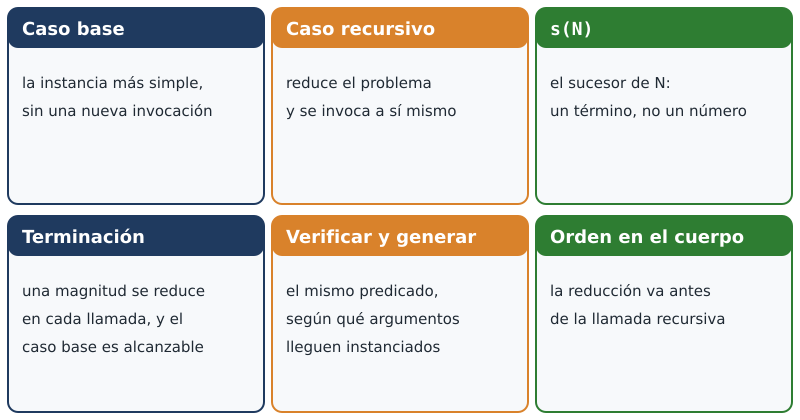

::: notes
El caso base es la instancia más simple, que se resuelve sin una nueva invocación. El caso recursivo reduce el problema y se invoca a sí mismo. El término s de N es el sucesor de N: un término, no un número. Para que la recursión termine, una magnitud debe reducirse en cada llamada y el caso base debe ser alcanzable. El mismo predicado verifica o genera, según qué argumentos estén instanciados. Y en el cuerpo, el objetivo que reduce el problema precede a la llamada recursiva. El capítulo siete aplica el mismo esquema a las listas.
:::

## Créditos

- Ilustraciones: dibujadas para el curso, licencia MIT.
- Ejemplos: ejemplos/capitulo-06 del curso.

::: notes
Todas las ilustraciones de este capítulo, incluida la babushka, se dibujaron para el curso y se distribuyen con él, bajo la licencia MIT.
:::
