# Capítulo 7 — Listas

::: notes
Una lista es una secuencia ordenada de elementos cuya cantidad no se conoce de antemano: los invitados a una fiesta, las materias de un cuatrimestre, las letras de una palabra. El capítulo seis mostró cómo recorrer una estructura que se reduce en cada llamada, y una lista es exactamente una estructura de ese tipo. Este capítulo es, en lo esencial, una aplicación del anterior. Lo nuevo es la notación y un conjunto de predicados predefinidos de uso frecuente. Al terminar, se puede escribir una lista y descomponerla, recorrerla, construir una lista nueva durante el recorrido de otra, usar una misma relación en varios sentidos y usar los predicados de listas de Prolog.
:::

## Una lista es un término

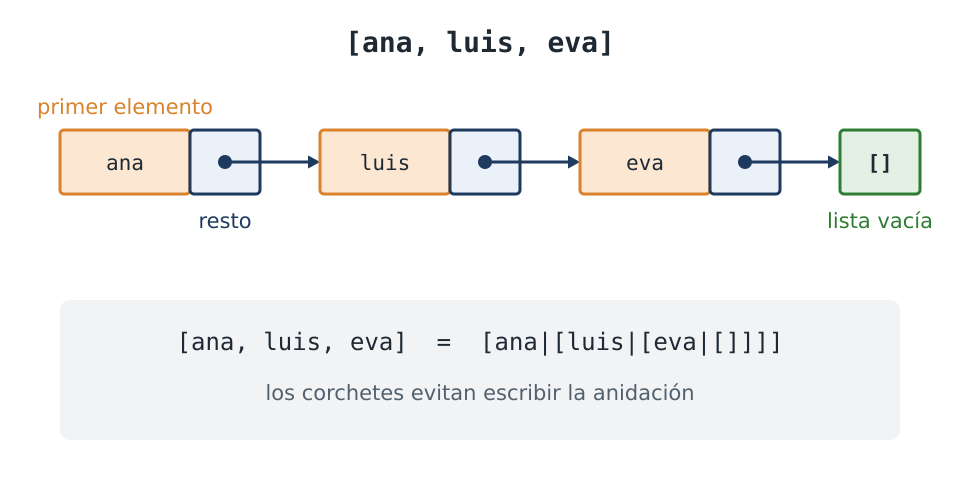

::: notes
Una lista se escribe entre corchetes, con los elementos separados por comas. Sus elementos pueden ser términos de cualquier clase: átomos, números, términos compuestos y otras listas. Internamente una lista no es una clase de dato distinta. Es un término compuesto como los del capítulo cuatro, con dos argumentos: un primer elemento, y una lista con los elementos restantes. La cadena termina en la lista vacía, que es una constante. Los corchetes son una notación que evita escribir esa anidación de términos.
:::

## Primer elemento y resto

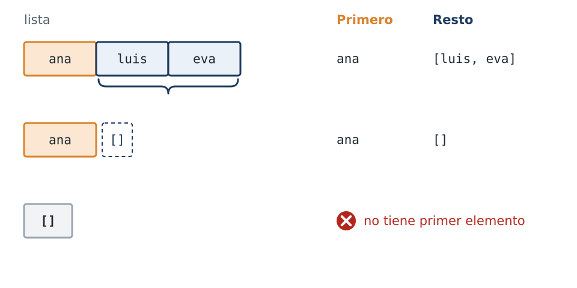

::: notes
La barra vertical descompone una lista en sus dos componentes: el primer elemento y el resto. El resto es siempre una lista, y por eso se le puede aplicar nuevamente la misma descomposición. Cuando la lista tiene un solo elemento, el resto es la lista vacía. La lista vacía, en cambio, no se puede descomponer, porque no tiene primer elemento. Estos dos resultados son la base de todas las recursiones del capítulo: la lista vacía corresponde al final del recorrido, que en la mayoría de los predicados es el caso base, y el primer elemento con su resto, al caso recursivo.
:::

## La descomposición, en Prolog

```prolog
?- [ana, luis, eva] = [Primero|Resto].
Primero = ana,
Resto = [luis, eva].

?- [ana] = [Primero|Resto].
Primero = ana,
Resto = [].

?- [] = [_|_].
false.
```

::: notes
Las tres consultas de la figura anterior, ejecutadas. La descomposición es una unificación común, como las del capítulo cuatro. El patrón con la barra vertical es un patrón de término, y no una operación sobre listas. La última consulta pide un primer elemento cualquiera y un resto cualquiera, con dos variables anónimas, y la respuesta es false: la lista vacía no tiene esa forma.
:::

## Más de un elemento al comienzo

```prolog
?- [Primero, Segundo|Resto] = [ana, luis, eva, sofia].
Primero = ana,
Segundo = luis,
Resto = [eva, sofia].
```

::: notes
Antes de la barra vertical se puede escribir más de un elemento. Aquí se extraen los dos primeros, y el resto queda con los dos restantes. Como actividad, conviene determinar qué responden algunas consultas de este tipo antes de ejecutarlas: una lista de tres elementos contra un patrón de un elemento y resto, contra uno de dos elementos y resto, una lista de un elemento, y la lista vacía. Solo la última responde false.
:::

## Dos maneras de ser una lista

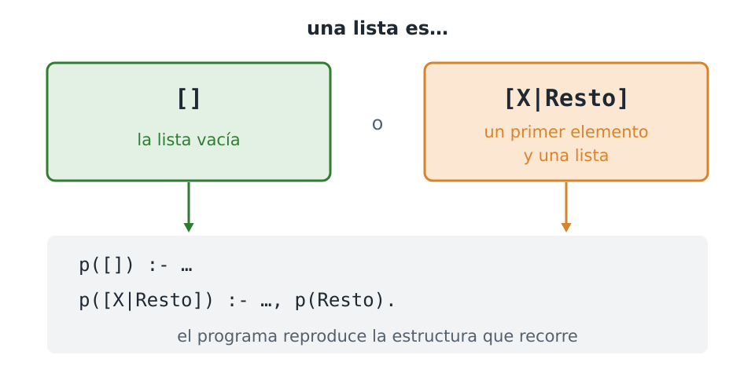

::: notes
Hay dos maneras de ser una lista: la lista vacía, o un primer elemento seguido de una lista. Por eso un predicado que recorre una lista tiene dos cláusulas, una por cada manera. Es también la razón por la que este capítulo y el seis comparten plantilla: en los dos casos la estructura del programa reproduce la estructura de aquello que recorre.
:::

## esta_en/2

<!-- ejemplo: capitulo-07/recorrer.pl fragmento: esta_en(X, [X|_]). .. esta_en(X, Resto). -->
```prolog
esta_en(X, [X|_]).
esta_en(X, [_|Resto]) :-
    esta_en(X, Resto).
```

::: notes
Determinar si un elemento pertenece a una lista tiene dos casos: el elemento es el primero de la lista, o el elemento pertenece al resto. La primera cláusula es un hecho. Se cumple cuando el elemento buscado y el primer elemento de la lista son el mismo, y esa condición la resuelve la unificación, porque la variable X aparece en las dos posiciones. La segunda cláusula no necesita examinar el primer elemento, y por eso lo escribe como variable anónima. Plantea la misma consulta sobre el resto, que es una lista más corta. Como la lista es finita, la recursión termina.
:::

## Buscar a luis

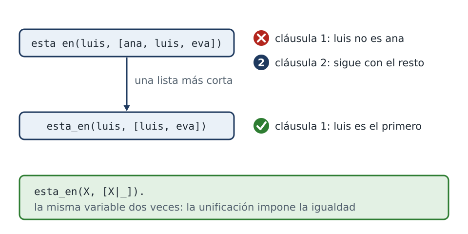

::: notes
La consulta pregunta si luis está en la lista de ana, luis y eva. La primera cláusula no se aplica, porque luis no es ana. La segunda descarta a ana y plantea la misma pregunta sobre el resto. En la nueva llamada, luis es el primer elemento, y la primera cláusula tiene éxito. El caso de la lista vacía no está escrito: ninguna de las dos cláusulas unifica con ella, de modo que buscar en la lista vacía fracasa por falta de cláusulas aplicables. En algunos predicados el caso base es un hecho, y en otros, como en este, es la ausencia de una cláusula aplicable.
:::

## Verificar y enumerar

:::: columns
::: column
```prolog
?- esta_en(X, [ana, luis, eva]).
X = ana ;
X = luis ;
X = eva ;
false.
```
:::
::: column
```prolog
?- esta_en(ana, [ana, ana]).
true ;
true ;
false.
```
:::
::::

::: notes
Como en los capítulos anteriores, el mismo predicado permite verificar y enumerar. Con la variable libre, enumera los elementos de la lista en orden. Además, el predicado responde una vez por cada aparición del elemento. Con ana dos veces en la lista hay dos demostraciones, una por cada aparición, y por eso hay dos respuestas. No es un defecto del predicado: cada respuesta corresponde a una manera diferente de satisfacer la consulta.
:::

## Por qué termina en false

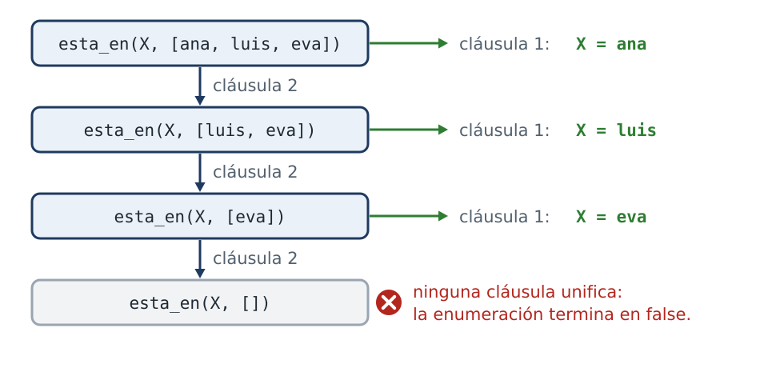

::: notes
La enumeración termina en false y no en punto. En cada nivel, la primera cláusula da una respuesta, y la segunda deja pendiente el recorrido del resto. Después de eva queda pendiente el recorrido de la lista vacía, y ahí ninguna cláusula unifica. El false final no indica que algo haya fallado, sino que se agotaron las alternativas. Como actividad, se puede ejecutar la consulta con trace y contar cuántas veces se usa la segunda cláusula.
:::

## Plantilla 9 — Recorrer una lista

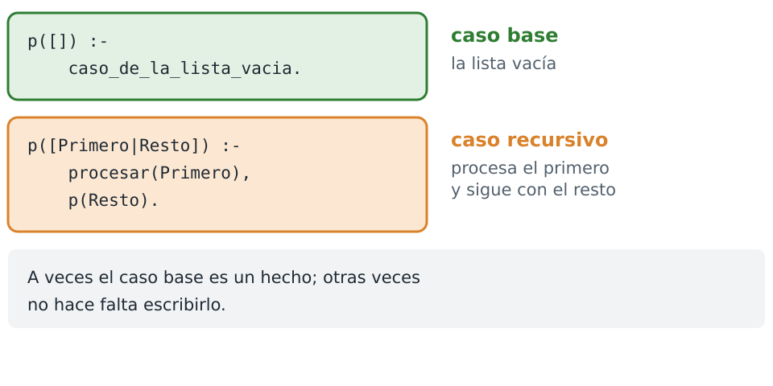

::: notes
La plantilla nueve se usa cuando se deben examinar los elementos de una lista, de a uno por vez. El caso base es la lista vacía. El caso recursivo extrae el primer elemento, lo procesa y continúa con el resto. En algunos predicados el caso base se escribe como hecho, y en otros no es necesario escribirlo. En el capítulo la usa largo. El predicado esta en no responde a esta plantilla, porque difiere en el caso base.
:::

## Plantilla 10 — Buscar uno que cumple

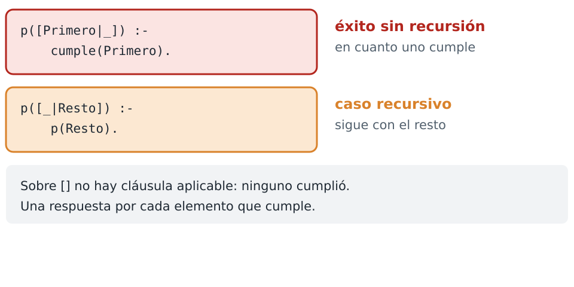

::: notes
La plantilla diez se usa cuando alcanza con que alguno de los elementos cumpla una condición, y no hace falta examinarlos todos. En ella el caso base no es la lista vacía: la primera cláusula tiene éxito sin recursión en cuanto encuentra un elemento que cumple. Sobre la lista vacía no hay cláusula aplicable, y la búsqueda fracasa, porque ninguno cumplió. Es la forma de esta en.
:::

## todos_estan/2

<!-- ejemplo: capitulo-07/recorrer.pl fragmento: todos_estan([], _). .. todos_estan(Resto, L). -->
```prolog
todos_estan([], _).
todos_estan([X|Resto], L) :-
    esta_en(X, L),
    todos_estan(Resto, L).
```

```prolog
?- todos_estan([ana, eva], [ana, luis, eva]).
true ;
false.
```

::: notes
La condición opuesta, que todos los elementos cumplan, tiene su propia silueta, y es la imagen invertida de la anterior. El predicado todos están verifica que cada elemento de la primera lista esté en la segunda. El caso base es la lista vacía y tiene éxito. El caso recursivo prueba el primer elemento y sigue con el resto. La respuesta termina en false porque cada llamada a esta en deja alternativas pendientes.
:::

## Plantilla 11 — Todos cumplen

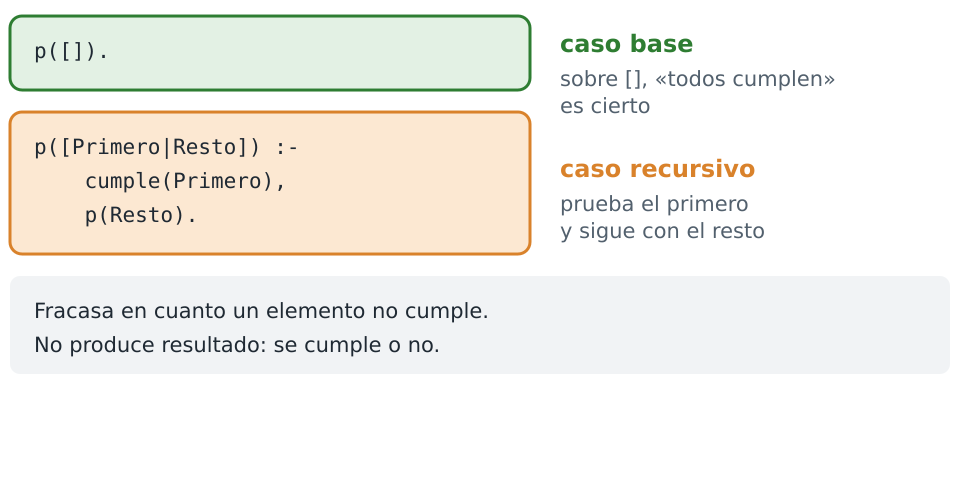

::: notes
La plantilla once se usa cuando la condición se debe verificar sobre todos los elementos. El caso base es la lista vacía, y tiene éxito porque sobre una lista sin elementos, que todos cumplan es cierto. El fracaso se produce en cuanto un elemento no cumple, y el recorrido se detiene ahí. Se distingue de la plantilla nueve en que no procesa cada elemento: lo somete a una prueba, y no produce ningún resultado más allá de cumplirse o no.
:::

## Tres siluetas

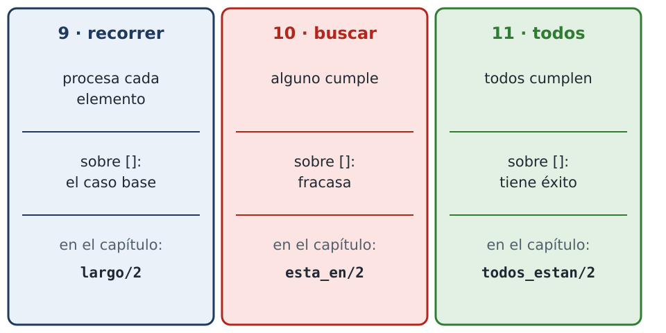

::: notes
Las tres plantillas recorren una lista y se distinguen por lo que ocurre sobre la lista vacía. La nueve procesa cada elemento, y su caso base es la lista vacía. La diez busca uno que cumpla, y sobre la lista vacía fracasa. La once exige que todos cumplan, y sobre la lista vacía tiene éxito. Las dos respuestas sobre la lista vacía son correctas: en una lista sin elementos no hay ninguno que cumpla, y no hay ninguno que deje de cumplir.
:::

## largo/2

<!-- ejemplo: capitulo-07/recorrer.pl fragmento: largo([], 0). .. N is Faltan + 1. -->
```prolog
largo([], 0).
largo([_|Resto], N) :-
    largo(Resto, Faltan),
    N is Faltan + 1.
```

::: notes
Contar los elementos es la misma plantilla, con un resultado numérico. Corresponde a generaciones, del capítulo seis, con una lista en lugar de una familia. La lista vacía tiene cero elementos: es el caso base. Una lista con primer elemento y resto tiene un elemento más que su resto. La evaluación con is se escribe después de la llamada recursiva, por la misma razón que en el capítulo seis: Faltan debe tener valor para que is no dé un error.
:::

## El largo, al retorno

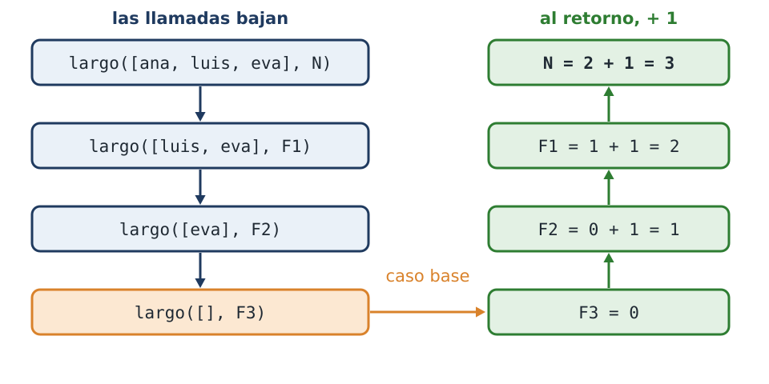

::: notes
Las llamadas bajan por la lista, un elemento por llamada, hasta la lista vacía. Allí el caso base da cero. Al retorno de cada llamada recursiva se suma uno: uno, dos, y finalmente tres, que es el largo de la lista de ana, luis y eva. En la figura, F1, F2 y F3 son la variable Faltan de cada llamada, con un nombre distinto en cada una.
:::

## pegar/3

<!-- ejemplo: capitulo-07/recorrer.pl predicado: pegar/3 -->
```prolog
%!  pegar(+A, ?B, -C) is det.
%!  pegar(?A, ?B, +C) is nondet.
%
%   C es la lista A seguida de la lista B.
pegar([], B, B).
pegar([X|RestoA], B, [X|RestoC]) :-
    pegar(RestoA, B, RestoC).
```

```prolog
?- pegar([ana, luis], [eva], Todos).
Todos = [ana, luis, eva].
```

::: notes
En los predicados anteriores, las listas eran datos de entrada. En pegar, una lista es el resultado: la concatenación de dos listas. El caso base establece que la concatenación de la lista vacía y B es B. El caso recursivo establece que, si el primer elemento de A es X, el primer elemento del resultado también es X, y el resto del resultado es la concatenación del resto de A con B.
:::

## Construcción en la cabeza

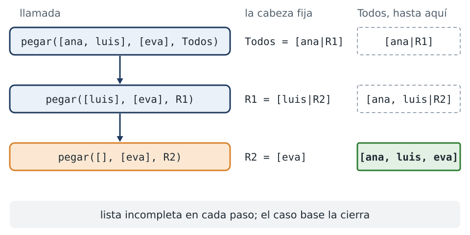

::: notes
Pegar es el primer predicado en el que la lista se construye en la cabeza de la regla. Durante todo el recorrido, el resultado es una lista incompleta: cada llamada fija su primer elemento y deja el resto sin determinar, y recién el caso base cierra la estructura. En la figura, R1 y R2 son la variable RestoC de cada llamada. De esto se sigue una limitación: en cada paso ya hay un resultado parcial, pero la recursión no puede consultarlo. Cuando un predicado necesita saber qué lleva hecho, el resultado se lleva en un argumento que viaja hacia adelante, un acumulador, tema del capítulo ocho.
:::

## Plantilla 12 — Construir una lista

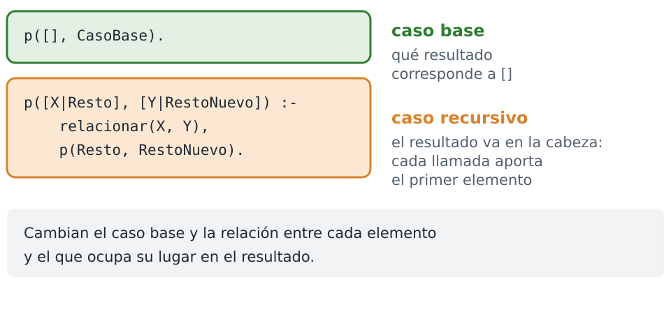

::: notes
La plantilla doce se usa cuando el resultado es una lista que se obtiene al recorrer otra. La lista resultante se escribe en la cabeza, y no se construye en el cuerpo. Cada llamada aporta el primer elemento del resultado, y la recursión completa el resto. Lo que cambia de un predicado a otro es el caso base y la relación entre cada elemento y el que ocupa su lugar en el resultado. Pegar es el caso más simple: cada elemento pasa sin modificarse, y el caso base no entrega la lista vacía sino la segunda lista.
:::

## Una relación, varios sentidos

```prolog
?- pegar(A, B, [ana, luis, eva]).
A = [],
B = [ana, luis, eva] ;
A = [ana],
B = [luis, eva] ;
A = [ana, luis],
B = [eva] ;
A = [ana, luis, eva],
B = [] ;
false.
```

::: notes
Con las dos primeras listas instanciadas, pegar concatena. Con la tercera instanciada y las otras dos libres, el resultado es otro: se obtienen todas las particiones de la lista en dos partes. No se escribió ningún predicado para particionar listas. Es el mismo pegar, consultado en otro sentido. Es la ventaja de haberlo definido como una relación y no como un procedimiento.
:::

## Las cuatro particiones

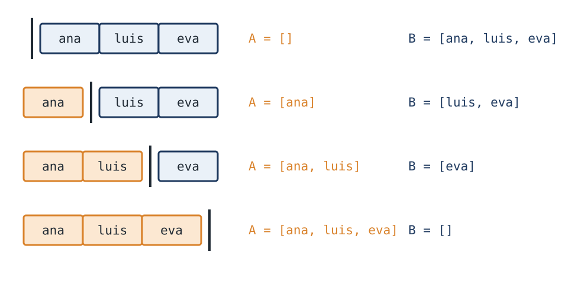

::: notes
Una lista de tres elementos admite cuatro cortes: antes del primero, entre cada par de elementos y después del último. Cada respuesta es uno de esos cortes. De esta propiedad se derivan otras operaciones sin código adicional. Para determinar si una lista comienza con otra, se consulta si existe una lista que, concatenada a continuación de la segunda, produce la primera. Para obtener el último elemento, se consulta por una partición cuya segunda parte tenga un solo elemento. Por esto en Prolog conviene modelar un problema mediante relaciones antes que mediante secuencias de pasos.
:::

## ultimo/2

<!-- ejemplo: capitulo-07/recorrer.pl fragmento: ultimo([X], X). .. ultimo(Resto, X). -->
```prolog
ultimo([X], X).
ultimo([_|Resto], X) :-
    ultimo(Resto, X).
```

```prolog
?- ultimo([ana, luis, eva], U).
U = eva ;
false.
```

::: notes
El último elemento también se obtiene con un recorrido propio. La primera cláusula establece que el último elemento de una lista de un solo elemento es ese elemento. La segunda descarta el primer elemento y busca en el resto. Como en la plantilla diez, el caso base no es la lista vacía: sobre ella no hay cláusula aplicable, y no hay último elemento. La respuesta es una sola, pero la consulta deja una alternativa pendiente: las dos cláusulas aceptan la lista de eva sola, y después de la primera respuesta queda por intentar la segunda. El capítulo dieciséis explica por qué y cómo se evita.
:::

## ultimo/2, en sentido inverso

```prolog
?- ultimo(L, eva).
L = [eva] ;
L = [_, eva] ;
L = [_, _, eva] ;
...
```

::: notes
Último también es una relación. Con la lista libre, enumera listas cada vez más largas que terminan en eva: la de un elemento, la de dos, la de tres, y así sin fin. Los elementos anteriores a eva quedan libres, y Prolog los muestra como variables anónimas.
:::

## El límite de los varios sentidos

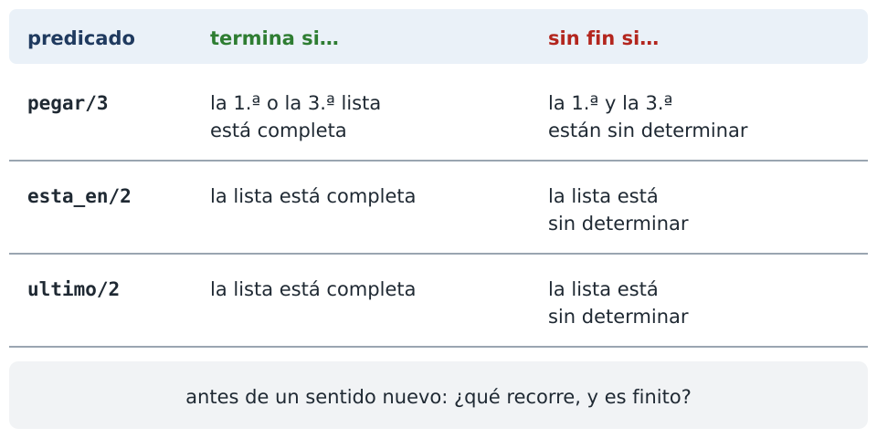

::: notes
Que un predicado admita varios sentidos no significa que todos terminen. La condición, para los predicados de este capítulo, es que haya una lista completa por la cual recorrer. Pegar termina si la primera o la tercera lista está completa, y si las dos están sin determinar, produce particiones sin fin. Esta en y último terminan si la lista está completa, y con la lista sin determinar producen listas cada vez más largas, sin fin. Antes de consultar un predicado en un sentido nuevo, conviene preguntarse qué recorre y si eso que recorre es finito.
:::

## Predicados predefinidos

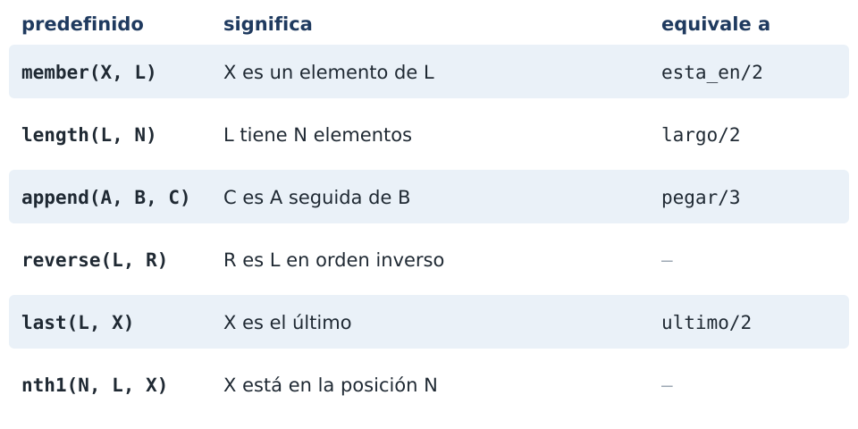

::: notes
Todos los predicados anteriores existen en Prolog con nombres estándar, y en adelante el curso usa los predefinidos. Member equivale a esta en, length a largo, append a pegar y last a último. Reverse invierte el orden de una lista. Nth1 da el elemento que ocupa una posición, contando desde uno.
:::

## Los invitados

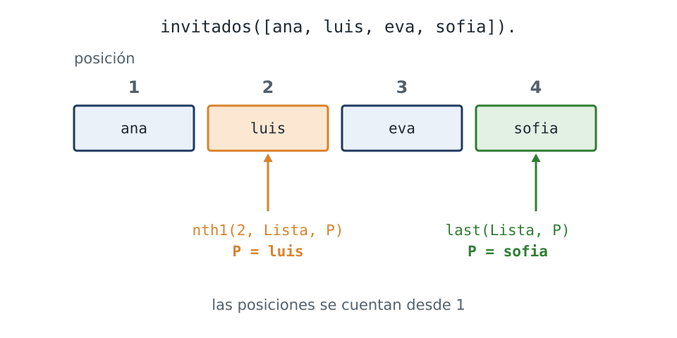

::: notes
Los ejemplos de los predefinidos usan una lista de invitados, guardada en un hecho en orden de llegada: ana, luis, eva y sofía. Cada regla obtiene la lista de ese hecho y le aplica uno de los predicados de la tabla. Las posiciones se cuentan desde uno: luis está en la posición dos, y sofía es la última.
:::

## member, length y nth1

:::: columns
::: column
<!-- ejemplo: capitulo-07/invitados.pl fragmento: esta_invitado(P) :- .. member(P, Lista). -->
```prolog
esta_invitado(P) :-
    invitados(Lista),
    member(P, Lista).
```

<!-- ejemplo: capitulo-07/invitados.pl fragmento: cuantos(N) :- .. length(Lista, N). -->
```prolog
cuantos(N) :-
    invitados(Lista),
    length(Lista, N).
```

<!-- ejemplo: capitulo-07/invitados.pl fragmento: en_el_puesto(N, P) :- .. nth1(N, Lista, P). -->
```prolog
en_el_puesto(N, P) :-
    invitados(Lista),
    nth1(N, Lista, P).
```
:::
::: column
```prolog
?- esta_invitado(Quien).
Quien = ana ;
Quien = luis ;
Quien = eva ;
Quien = sofia.

?- cuantos(N).
N = 4.

?- en_el_puesto(2, Quien).
Quien = luis.
```
:::
::::

::: notes
Las tres primeras reglas usan member, length y nth1. Esta invitado enumera a los invitados. A diferencia de esta en, la última respuesta termina en punto: member no deja una alternativa pendiente después del último elemento. Cuantos da la cantidad de invitados, cuatro. En el puesto da quién llegó en una posición: en la dos, luis.
:::

## nth1/3, en sentido inverso

```prolog
?- en_el_puesto(N, eva).
N = 3 ;
false.
```

::: notes
Nth1 también admite la consulta inversa, igual que append: con la posición libre, determina en qué posición se encuentra un elemento. Eva llegó tercera.
:::

## last y reverse

:::: columns
::: column
<!-- ejemplo: capitulo-07/invitados.pl fragmento: ultimo_en_llegar(P) :- .. last(Lista, P). -->
```prolog
ultimo_en_llegar(P) :-
    invitados(Lista),
    last(Lista, P).
```

<!-- ejemplo: capitulo-07/invitados.pl fragmento: orden_de_salida(L) :- .. reverse(Lista, L). -->
```prolog
orden_de_salida(L) :-
    invitados(Lista),
    reverse(Lista, L).
```
:::
::: column
```prolog
?- ultimo_en_llegar(P).
P = sofia.

?- orden_de_salida(L).
L = [sofia, eva, luis, ana].
```
:::
::::

::: notes
Las otras tres reglas usan last, reverse y append. La última en llegar es sofía, y el orden de salida es la lista invertida.
:::

## append, un invitado más

<!-- ejemplo: capitulo-07/invitados.pl fragmento: con_uno_mas(P, L) :- .. append(Lista, [P], L). -->
```prolog
con_uno_mas(P, L) :-
    invitados(Lista),
    append(Lista, [P], L).
```

```prolog
?- con_uno_mas(pedro, L).
L = [ana, luis, eva, sofia, pedro].
```

::: notes
Con uno más agrega un invitado al final: append concatena la lista con otra de un solo elemento. La existencia de estos predicados no vuelve innecesario el trabajo de las secciones anteriores: la plantilla nueve se usa mucho para recorridos que no corresponden a ninguno de estos seis predicados.
:::

## Resumen

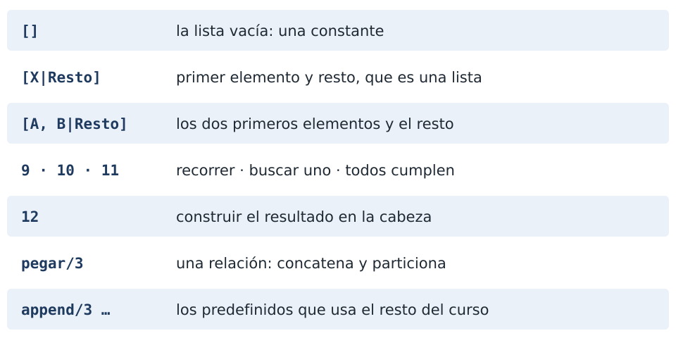

::: notes
La lista vacía es una constante. La barra vertical separa el primer elemento del resto, que es una lista, y se pueden extraer varios elementos a la vez. Las plantillas nueve, diez y once recorren una lista para procesar cada elemento, buscar uno que cumpla o verificar que todos cumplan. La plantilla doce construye el resultado en la cabeza. Pegar es una relación: concatena y particiona. Y los predicados predefinidos, member, length, append, reverse, last y nth1, son los que usa el resto del curso. El capítulo ocho retoma las listas con acumuladores.
:::

## Créditos

- Ilustraciones: dibujadas para el curso, licencia MIT.
- Ejemplos: ejemplos/capitulo-07 del curso.

::: notes
Todas las ilustraciones de este capítulo se dibujaron para el curso y se distribuyen con él, bajo la licencia MIT.
:::
