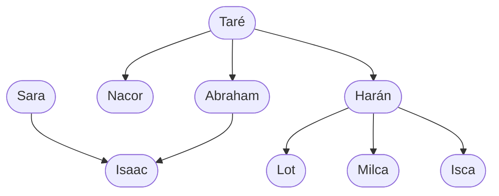

# Capítulo 1 — La primera hora

Este capítulo es un recorrido general por el lenguaje. En aproximadamente una
hora se pasa de no conocer Prolog a disponer de un programa que responde
consultas. Se presenta la mayor parte de los temas que el curso desarrolla
después.

Ningún tema se trata aquí en profundidad. Cada uno se presenta y se usa una vez;
los capítulos siguientes los retoman en detalle. Las dudas que queden abiertas se
pueden anotar y posponer: la tabla del final del capítulo indica en qué capítulo
se retoma cada tema.

No se requiere instalar nada. Cada ejemplo incluye un enlace **▶ Abrir en
SWISH**, que lo abre en el navegador con el programa cargado y la consulta
escrita; solo resta ejecutarla.

## Objetivos del capítulo

Al terminar el capítulo, el lector puede:

- cargar un programa en SWISH y ejecutar una consulta sobre él;
- distinguir un **hecho** de una **regla** y de una **consulta**;
- interpretar una respuesta que contiene una variable, y solicitar la siguiente respuesta;
- escribir una regla que combine dos condiciones;
- reconocer tres de los errores más frecuentes del principiante en Prolog.

!!! info "Tiempo estimado"
    Leer el capítulo, ejecutar sus ejemplos y hacer las actividades: **1:30 h**.
    Resolver los 6 ejercicios marcados con ★: **1:40 h**.
    Resolver los 15 ejercicios del final: **3:50 h**.

## 1.1 Qué es un programa Prolog

Un programa Prolog es una base de conocimiento: un conjunto de afirmaciones que
se consideran ciertas, escritas de modo que el sistema pueda usarlas para
responder consultas.

El siguiente es un programa completo:

<!-- ejemplo: capitulo-01/familia.pl consulta: padre(juan, ana). -->
```prolog
% padre(P, H): P es el padre de H.
padre(juan, ana).
padre(juan, pedro).
padre(pedro, luis).
padre(pedro, eva).

%!  abuelo(?A, ?N) is nondet.
%
%   A es abuelo de N cuando es el padre de su padre.
abuelo(A, N) :-
    padre(A, P),
    padre(P, N).
```

Las líneas que comienzan con `%` son comentarios: Prolog las ignora, y están
destinadas a quien lee el programa. Las que preceden a `abuelo/2` forman su
encabezado. Los signos `?`, `+` y `-` de los encabezados, y palabras como
`nondet`, se explican en la [sección 2.8](../capitulo-02-hechos-consultas-y-variables/index.md#28-como-se-documenta-el-uso-de-un-predicado); por ahora basta con leer la
descripción.

Al abrirlo en SWISH se ven dos paneles: arriba a la izquierda, el programa;
abajo a la derecha, la casilla donde se escriben las consultas. En esa casilla está cargada
la primera consulta:

```prolog
?- padre(juan, ana).
true.
```

`true.` indica que la consulta se deduce del contenido del programa. La
siguiente consulta pregunta por algo que el programa no puede deducir:

```prolog
?- padre(juan, luis).
false.
```

`false.` **no** indica que la afirmación sea falsa en el mundo real. Indica algo
más acotado y más preciso: *la consulta no se puede probar con el contenido del
programa*. Si una relación no está escrita en el programa ni se deduce de él,
Prolog responde `false.`. El
[capítulo 2](../capitulo-02-hechos-consultas-y-variables/index.md) desarrolla esta distinción.

!!! question "Actividad"
    Antes de ejecutarla, determinar qué responde `padre(ana, luis).` y por qué.
    Después, verificarlo.

## 1.2 Hechos

Las cuatro primeras líneas del programa son **hechos**:

<!-- ejemplo: capitulo-01/familia.pl predicado: padre/2 consulta: padre(juan, Quien). -->
```prolog
% padre(P, H): P es el padre de H.
padre(juan, ana).
padre(juan, pedro).
padre(pedro, luis).
padre(pedro, eva).
```

Un hecho se escribe con un nombre, una lista de argumentos entre paréntesis y un
punto final. El punto es obligatorio: marca dónde termina el hecho. Omitirlo es
el error de sintaxis más frecuente al comenzar.

El nombre —en este caso, `padre`— se denomina **predicado**. Los nombres de
predicados y de objetos se escriben en minúscula. El orden de los argumentos lo
define quien escribe el programa: aquí se estableció que `padre(juan, ana)`
significa "juan es el padre de ana", y no lo inverso. Prolog no dispone de
información para determinar cuál de las dos lecturas es la deseada; por eso la
convención se fija una vez y se respeta en todo el programa.

`padre/2` significa **padre** en sentido estricto, y no "padre o madre"; el
[capítulo 2](../capitulo-02-hechos-consultas-y-variables/index.md) agrega `madre/2`.
La relación general —ser padre **o** madre— aparece en la
[sección 1.9](#19-recursion) con el nombre `progenitor/2`.

Un predicado se identifica siempre junto con su **aridad**, que es la cantidad
de argumentos que lleva, separada del nombre por una barra: en este caso,
`padre/2`. Esta notación se usa a lo largo del curso y en los mensajes de
error.

Con solo estos cuatro hechos ya se puede preguntar algo más que "¿es cierto?".
Escribiendo un nombre que comienza con mayúscula en la posición que se
desconoce, la consulta pregunta **quién**:

```prolog
?- padre(juan, Quien).
Quien = ana ;
Quien = pedro.
```

Ese nombre en mayúscula es una **variable**.  Cuando damos `Enter` Prolog nos muestra `Quien = ana` que es la primera solución, debemos escribir el `;` para solicitar la respuesta siguiente.

## 1.3 Reglas

Los hechos enuncian lo que ya sabemos que se cumple. Las **reglas** indican cómo deducir afirmaciones nuevas:

<!-- ejemplo: capitulo-01/familia.pl predicado: abuelo/2 consulta: abuelo(juan, Quien). -->
```prolog
%!  abuelo(?A, ?N) is nondet.
%
%   A es abuelo de N cuando es el padre de su padre.
abuelo(A, N) :-
    padre(A, P),
    padre(P, N).
```

El símbolo `:-` se lee **"si"**, y la coma se lee **"y"**. La regla completa se
lee: *A es abuelo de N si A es padre de P y P es padre de N*.

La parte a la izquierda de `:-` es la **cabeza**: lo que la regla permite
concluir. La parte a la derecha es el **cuerpo**: lo que debe cumplirse para
concluirlo. Una regla no afirma nada por sí sola; afirma su cabeza cada vez que
su cuerpo se puede probar.

`A`, `N` y `P` son variables, como `Quien` en la sección anterior: nombres para objetos aún sin determinar, a los que Prolog asigna valores buscando en el programa. La
novedad de esta sección son únicamente el `:-` y la coma. Veamos entonces:

```prolog
?- abuelo(juan, eva).
true.
```

El programa no contiene ningún hecho que indique que juan es abuelo de eva.
Prolog lo dedujo: encontró que juan es padre de pedro y que pedro es padre de
eva, y aplicó la regla.

!!! question "Actividad"
    ¿Cuántos nietos tiene juan según este programa? Determinarlo a partir de los
    hechos, antes de ejecutar la consulta.

## 1.4 Variables y más de una respuesta

La [sección 1.2](#12-hechos) mostró que se puede preguntar *quién* cumple una relación,
escribiendo una variable en la posición cuyo valor se desconoce. Conviene ahora
detenerse en cómo se obtienen las respuestas:

```prolog
?- padre(juan, Quien).
Quien = ana ;
Quien = pedro.
```

Prolog encuentra `ana`, la muestra y **queda en espera**. El punto y coma no lo
escribe Prolog: lo ingresa el usuario para solicitar otra respuesta. Se puede
escribir `;` o presionar la barra espaciadora o la tecla TAB; con Enter se
indica que no se requieren más respuestas.

La última respuesta termina en punto. Ese punto indica que Prolog determinó que
no quedan alternativas por explorar.

La misma relación se puede consultar en sentido inverso, con el mismo predicado:

```prolog
?- padre(Quien, ana).
Quien = juan.
```

No existen dos predicados, uno para buscar hijos y otro para buscar padres.
Existe `padre/2`, y la consulta determina cuál de las dos posiciones queda sin
especificar. Esta propiedad se usa a lo largo de todo el curso.

Cuando un valor no interesa, se usa `_`, la **variable anónima**:

```prolog
?- padre(juan, _).
true ;
true.
```

Esta consulta pregunta si juan es padre de alguien, sin solicitar de quién. La
respuesta aparece dos veces porque hay dos hechos que la satisfacen, `ana` y
`pedro`: cada uno es una demostración distinta. Como no se solicitó el valor,
las dos demostraciones se ven iguales. El [capítulo 3](../capitulo-03-reglas-y-conjunciones/index.md) retoma este punto.

### Una respuesta que queda en espera

La consulta siguiente produce un resultado diferente:

```prolog
?- abuelo(juan, luis).
true ;
false.
```

`true` responde la consulta. El `;` ingresado a continuación solicita otra
respuesta; Prolog explora entonces las alternativas que tenía pendientes, no
encuentra ninguna solución más y responde `false.`.

Por lo tanto, `true ;` no equivale a `true.`. El punto indica que no hay más
respuestas; el punto y coma se usa cuando la consulta es cierta y todavía
quedan alternativas sin explorar. Esta diferencia adquiere importancia en el [capítulo 9](../capitulo-09-backtracking-y-corte/index.md).

!!! question "Actividad"
    ¿Por qué `abuelo(juan, eva).` responde `true.` y `abuelo(juan, luis).` deja
    una alternativa pendiente? Observar el orden de los hechos `padre/2`.

## 1.5 Definición por casos

Para distinguir casos se escribe **una cláusula por caso**, y cada una establece
en qué condiciones vale.

Una **cláusula** es cada unidad del programa terminada en punto: un hecho es una
cláusula, una regla también lo es. El predicado `etapa/2` del ejemplo siguiente
tiene tres.

<!-- ejemplo: capitulo-01/edades.pl consulta: etapa(sofia, Etapa). -->
```prolog
% edad(P, A): P tiene A años.
edad(juan, 68).
edad(ana, 41).
edad(pedro, 39).
edad(luis, 12).
edad(eva, 8).
edad(sofia, 3).

%!  etapa(?P, ?E) is nondet.
%
%   E es la etapa de la vida en la que está P, según su edad.
etapa(P, bebe) :-
    edad(P, A),
    A < 4.
etapa(P, chico) :-
    edad(P, A),
    A >= 4,
    A < 18.
etapa(P, adulto) :-
    edad(P, A),
    A >= 18.
```

Las tres cláusulas de `etapa/2` son tres alternativas. Prolog las evalúa de
arriba hacia abajo y responde con la primera que se cumple. Las cláusulas
restantes no se descartan: quedan como alternativas pendientes, igual que en la
sección anterior.

```prolog
?- etapa(sofia, Etapa).
Etapa = bebe ;
false.

?- etapa(juan, Etapa).
Etapa = adulto.
```

Las dos respuestas son correctas y terminan de manera distinta. Con `sofia`, la
respuesta proviene de la primera cláusula y quedan dos sin evaluar; al solicitar
otra respuesta con `;`, Prolog las evalúa, ninguna se cumple, y responde
`false.`. Con `juan`, la respuesta proviene de la tercera cláusula, que es la
última: no queda ninguna alternativa pendiente, y por eso la respuesta termina
en punto.

Las tres condiciones son mutuamente excluyentes: `A < 4`, `A >= 4, A < 18` y
`A >= 18`. Esto es deliberado. Si se superpusieran, una misma persona
pertenecería a dos etapas a la vez, y Prolog entregaría las dos respuestas, una
a continuación de la otra.

!!! question "Actividad"
    Eliminar `A < 18` de la segunda cláusula y repetir la consulta sobre `juan`.
    ¿Cuántas respuestas se obtienen, y por qué?

## 1.6 Términos compuestos

Un argumento no tiene que ser necesariamente un nombre simple. Puede tener
componentes:

<!-- ejemplo: capitulo-01/mascotas.pl predicado: tiene/2 consulta: tiene(ana, mascota(Especie, Nombre)). -->
```prolog
% tiene(P, M): P tiene la mascota M.
tiene(ana, mascota(gato, felix)).
tiene(luis, mascota(perro, rocco)).
tiene(eva, mascota(gato, gaturro)).
tiene(pedro, mascota(tortuga, manuelita)).
```

`mascota(gato, felix)` es un **término compuesto**: un nombre --que llamaremos símbolo funcional-- como
`mascota`, seguido de sus argumentos. Su forma es exactamente la de un hecho; lo
que cambia es su posición dentro del programa. Escrito como predicado, un término afirma una relación o propiedad de un objeto; escrito como argumento de otro término, es un dato, igual que
`felix`. Su utilidad reside en que se puede consultar completo o por
componentes:

```prolog
?- tiene(ana, mascota(Especie, Nombre)).
Especie = gato,
Nombre = felix.
```

Una respuesta con dos variables se muestra de esta forma: una variable por
línea, separadas por comas. También se puede consultar por un componente y dejar
el resto sin especificar:

<!-- ejemplo: capitulo-01/mascotas.pl predicado: propietario_de_gato/1 consulta: propietario_de_gato(Quien). -->
```prolog
%!  propietario_de_gato(?P) is nondet.
%
%   P tiene por lo menos un gato.
propietario_de_gato(P) :-
    tiene(P, mascota(gato, _)).
```

```prolog
?- propietario_de_gato(Quien).
Quien = ana ;
Quien = eva.
```

El `_` de la regla ocupa la posición del nombre del gato, cuyo valor no
interesa.

## 1.7 Igualdad y comparación

El operador `=` pregunta si dos términos **pueden hacerse idénticos**:

```prolog
?- ana = ana.
true.

?- ana = pedro.
false.

?- Quien = ana.
Quien = ana.
```

En la última consulta se pregunta si `Quien` puede ser idéntico a `ana`; Prolog
responde que sí, e informa con qué valor. `=` no es una asignación: es en principio una pregunta sobre si dos términos pueden coincidir.

Esa operación —determinar si dos términos pueden coincidir, y con qué valores de
sus variables— se denomina **unificación**. Es central en el lenguaje, y el
[capítulo 4](../capitulo-04-terminos-y-unificacion/index.md) está dedicado por completo a ella.

### El operador `=` no evalúa expresiones

El siguiente comportamiento conviene conocerlo desde el comienzo, porque no
produce un error sino una respuesta distinta de la esperada:

```prolog
?- X = 2 + 1.
X = 2+1.
```

`X` no queda con el valor 3. Queda con el valor `2+1`, que es el término de
nombre `+` con dos argumentos, `2` y `1`. Es un término compuesto, igual que
`mascota(gato, felix)`; lo único distinto es que su nombre se escribe en entre los argumentos (se dice que es un operador infijo) y no adelante. El operador `=` determina si dos términos unifican; no
realiza ninguna operación aritmética.

Por la misma razón:

```prolog
?- 2 + 1 = 3.
false.
```

`2+1` y `3` son términos distintos, aunque su valor aritmético sea el mismo. La
evaluación aritmética se debe solicitar de manera explícita, y es el tema de la
[sección 1.10](#110-aritmetica).

Los números se comparan con `<`, `=<`, `>` y `>=`:

<!-- ejemplo: capitulo-01/comparar.pl predicado: mayor_que/2 consulta: mayor_que(luis, eva). -->
```prolog
%!  mayor_que(?A, ?B) is nondet.
%
%   A tiene más años que B.
mayor_que(A, B) :-
    edad(A, EdadA),
    edad(B, EdadB),
    EdadA > EdadB.
```

El operador `\+`, antepuesto a un objetivo, significa "este objetivo no se puede probar":

<!-- ejemplo: capitulo-01/comparar.pl predicado: distintos/2 consulta: distintos(ana, pedro). -->
```prolog
%!  distintos(+A, +B) is semidet.
%
%   A y B no son la misma persona.
distintos(A, B) :-
    \+ A = B.
```

```prolog
?- distintos(ana, pedro).
true.

?- distintos(ana, ana).
false.
```

`\+` tiene una restricción importante: no significa exactamente "es falso", sino
"no se pudo probar", que es la misma distinción de la [sección 1.1](#11-que-es-un-programa-prolog). El capítulo
10 está dedicado a este tema.

## 1.8 Cómo busca Prolog

Hasta aquí se observaron las respuestas de Prolog sin examinar cómo las obtiene.
El predicado `trace` permite ver la ejecución paso a paso:

<!-- ejemplo: capitulo-01/familia.pl predicado: abuelo/2 consulta: trace, abuelo(juan, eva). -->
```prolog
%!  abuelo(?A, ?N) is nondet.
%
%   A es abuelo de N cuando es el padre de su padre.
abuelo(A, N) :-
    padre(A, P),
    padre(P, N).
```

En SWISH, `trace` abre un panel que indica en qué punto está la ejecución y cuáles son los valores implicados. En `swipl`, en una instalación local, la traza se escribe como
texto:

```prolog
   Call: (10) abuelo(juan, eva)
   Call: (11) padre(juan, _8960)
   Exit: (11) padre(juan, ana)
   Call: (11) padre(ana, eva)
   Fail: (11) padre(ana, eva)
   Redo: (11) padre(juan, _8960)
   Exit: (11) padre(juan, pedro)
   Call: (11) padre(pedro, eva)
   Exit: (11) padre(pedro, eva)
   Exit: (10) abuelo(juan, eva)
```

Leída de arriba hacia abajo, la traza registra la secuencia exacta de la
ejecución:

- **Call**: se intenta probar el objetivo.
- **Exit**: el objetivo se probó; se muestran los valores resultantes.
- **Fail**: el objetivo no se puede probar.
- **Redo**: se regresa a la última decisión tomada y se intenta otra
  alternativa.

En la parte central de la traza, Prolog elige `ana`, intenta probar
`padre(ana, eva)`, falla, **retrocede** y elige `pedro`. El mecanismo de
retroceder y explorar la alternativa siguiente se denomina *backtracking* —en
castellano, vuelta atrás o retroceso—, y es la base del modelo de ejecución de Prolog. El
[capítulo 5](../capitulo-05-como-responde-prolog/index.md) lo representa como un árbol, y el [capítulo 9](../capitulo-09-backtracking-y-corte/index.md) muestra cómo podar
ramas de ese árbol.

Los cuatro eventos no son independientes: son las cuatro **puertas** de una
misma caja, una por cada objetivo del programa. Ese diagrama —el *modelo de
cajas de Byrd*— se presenta en la [sección 5.3](../capitulo-05-como-responde-prolog/index.md#53-el-mismo-recorrido-registrado-por-trace), junto al árbol de derivación. Por ahora
alcanza con leer los cuatro nombres sobre la traza.

El número entre paréntesis de cada línea —el `(10)` y el `(11)`— indica a qué
profundidad se encuentra el objetivo: `abuelo/2` es el externo y los `padre/2`
son internos a él.

Para desactivar la traza se usa `notrace.`

## 1.9 Recursión

Una regla puede invocarse a sí misma.

En esta sección se usa otra familia: el árbol de Taré, del Génesis en la Biblia, con el que
Sterling y Shapiro comienzan *The Art of Prolog*. Es adecuado porque tiene más
generaciones que la familia de los ejemplos anteriores.



Entre Taré e Isaac hay dos generaciones. Una regla como `abuelo/2` recorre
exactamente dos, y cada generación adicional requeriría una regla nueva. La
solución es una regla que **recorra una generación y vuelva a plantear la misma
pregunta** desde ese punto:

<!-- ejemplo: capitulo-01/antepasados.pl predicado: antepasado/2 consulta: antepasado(tare, Quien). -->
```prolog
%!  antepasado(?A, ?D) is nondet.
%
%   A es antepasado de D.
%   Caso base: un progenitor es un antepasado. Caso recursivo: se desciende
%   una generación y se plantea la misma pregunta desde ese punto.
antepasado(A, D) :-
    progenitor(A, D).
antepasado(A, D) :-
    progenitor(A, Hijo),
    antepasado(Hijo, D).
```

La definición tiene dos cláusulas:

- la primera es el **caso base**: un progenitor es un antepasado, no se
  requiere continuar la búsqueda, el resultado de la consulta es directo;
- la segunda es el **caso recursivo**: se desciende una generación y se construye la respuesta desde allí.

```prolog
?- antepasado(tare, Quien).
Quien = abraham ;
Quien = nacor ;
Quien = haran ;
Quien = isaac ;
Quien = lot ;
Quien = milca ;
Quien = isca ;
false.
```

Primero aparecen los hijos y después los nietos. Ese orden es consecuencia de
que la cláusula del caso base está escrita antes que la del caso recursivo.

La enumeración no termina en punto sino en `false.`: después de `isca` todavía
quedaban alternativas por explorar —el caso recursivo aplicado a cada uno de los
hijos de Harán—, y ninguna aporta una respuesta nueva. Es lo habitual en un
predicado recursivo: el `false.` final no indica que
algo haya fallado, sino que se agotaron las alternativas pendientes.  Otra forma de interpretarlo es que mediante `;` preguntamos si hay alguna respuesta adicional: cada vez que hay alguna se la muestra, cuando no hay más la respuesta a si hay más es "no" (`false.`).

La recursión termina porque cada invocación desciende una generación, y el árbol
es finito. Una recursión en la que el problema no se reduce en cada paso no
termina; es el error más frecuente del [capítulo 6](../capitulo-06-recursion/index.md), donde el tema se desarrolla
en detalle.

!!! question "Actividad"
    ¿Qué responde `antepasado(sara, isaac).`? ¿Por qué `sara` no aparece en la
    lista de respuestas anterior?

## 1.10 Aritmética

Las expresiones aritméticas no se evalúan de manera automática. La evaluación se
solicita con `is`:

<!-- ejemplo: capitulo-01/aritmetica.pl predicado: doble/2 edad_en_meses/2 consulta: doble(21, X). -->
```prolog
%!  doble(+N, -D) is det.
%
%   D es el doble de N.
doble(N, D) :-
    D is N * 2.

%!  edad_en_meses(?P, -M) is nondet.
%
%   M es la edad de P expresada en meses.
edad_en_meses(P, M) :-
    edad(P, A),
    M is A * 12.
```

```prolog
?- doble(21, X).
X = 42.
```

A la izquierda de `is` se escribe la variable que recibe el resultado la cual debe estar libre o ligada al resultado; a la
derecha, la expresión. La expresión debe poder evaluarse **en el momento de la
llamada**: todas sus variables deben estar ligadas previamente a un valor numérico.

```prolog
?- doble(X, 42).
ERROR: Arguments are not sufficiently instantiated
```

A continuación del mensaje, Prolog agrega algunas líneas que señalan la
expresión exacta en la que faltó un valor. El mensaje indica que se solicitó
evaluar una expresión que contiene una variable sin valor. `doble/2` permite
obtener el doble a partir del número, pero no el número a partir del doble.

El [capítulo 8](../capitulo-08-aritmetica/index.md) explica la causa, y cómo proceder cuando se necesitan ambos
sentidos.

Además de `+`, `-`, `*` y `/`, se usan `mod` (el resto de la división entera) y
`max`.

Como se indicó en la [sección 1.7](#17-igualdad-y-comparacion), `=` no evalúa expresiones. `X = 2 + 1` liga
`X` al término `2+1`; `X is 2 + 1` liga `X` al número `3`. Para obtener un
resultado numérico se usa `is`.

## 1.11 Salida de texto

Hasta aquí, la única salida observada fue la respuesta de la consulta. Un
programa también puede escribir texto durante su ejecución:

<!-- ejemplo: capitulo-01/escribir.pl predicado: saludar/1 presentar/2 consulta: saludar(ana). -->
```prolog
%!  saludar(+A) is det.
%
%   Escribe un saludo para A y pasa a la línea siguiente.
saludar(A) :-
    write('Hola, '),
    write(A),
    nl.

%!  presentar(+A, +N) is det.
%
%   Escribe cuántos hermanos tiene A.
%   format/2 compone la salida en una sola llamada: ~w inserta el valor
%   siguiente de la lista y ~n produce un salto de línea.
presentar(A, N) :-
    format("~w tiene ~w hermanos~n", [A, N]).
```

```prolog
?- saludar(ana).
Hola, ana
true.
```

La salida tiene dos partes: el texto que escribió el programa y, a continuación,
la respuesta de la consulta. Son elementos distintos, aunque aparezcan juntos.

`write/1` escribe un término y `nl/0` produce un salto de línea. Para texto que
incluye valores es preferible `format/2`.  El primer argumento de `format/2` es un texto de formato, y el segundo es una lista con los elementos a mostrar: en el formato, `~w` inserta el valor siguiente de la lista y `~n` produce un salto de línea.

El ejemplo usa dos tipos de comillas, con significados distintos. `'Hola, '`,
entre comillas simples, es un **átomo** —los nombres que se presentan en el
[capítulo 2](../capitulo-02-hechos-consultas-y-variables/index.md)—, escrito de ese modo porque contiene una coma y un espacio.
`"~w tiene ~w hermanos~n"`, entre comillas dobles, es **texto** (*string*). El [capítulo 18](../capitulo-18-texto/index.md) trata esa diferencia;
por ahora alcanza con la regla práctica: comillas simples para un nombre,
comillas dobles para el texto que recibe `format/2`.

## 1.12 Enumeración de números

`between/3` genera, de a uno por vez, todos los enteros de un intervalo:

```prolog
?- between(1, 5, N).
N = 1 ;
N = 2 ;
N = 3 ;
N = 4 ;
N = 5.
```

Una regla recursiva también puede recorrer un intervalo numérico, del mismo modo
que `antepasado/2` recorría el árbol:

<!-- ejemplo: capitulo-01/contar.pl predicado: cuenta/2 consulta: cuenta(1, 5). -->
```prolog
%!  cuenta(+Desde, +Hasta) is det.
%
%   Escribe los números de Desde a Hasta, uno por línea.
cuenta(Desde, Hasta) :-
    Desde =< Hasta,
    format("~w~n", [Desde]),
    Siguiente is Desde + 1,
    cuenta(Siguiente, Hasta).
cuenta(Desde, Hasta) :-
    Desde > Hasta.
```

```prolog
?- cuenta(1, 5).
1
2
3
4
5
true ;
false.
```

Las dos cláusulas corresponden nuevamente al caso recursivo y al caso base:
mientras `Desde` no supera a `Hasta`, se escribe el número y se continúa; cuando
lo supera, no queda nada por escribir y la ejecución termina.

La respuesta termina en `true ;` porque queda una alternativa sin explorar: la
segunda cláusula, que Prolog todavía no descartó. Al solicitarla con `;`, esa
alternativa falla —`1` no es mayor que `5`— y la respuesta final es `false.`.

Este caso tiene un punto muy interesante: ambas cláusulas son mutuamente excluyentes,  cuando una de ellas es eligible, la otra no.


## 1.13 Listas

Una lista se escribe entre corchetes, con los elementos separados por comas:
`[ana, luis, eva]`. Sus elementos pueden ser términos de cualquier tipo,
incluidas otras listas.

<!-- ejemplo: capitulo-01/listas.pl predicado: invitados/1 esta_invitado/1 cuantos_invitados/1 consulta: esta_invitado(Quien). -->
```prolog
% invitados(L): L es la lista de invitados a la fiesta, en orden de llegada.
invitados([ana, luis, eva, sofia]).

%!  esta_invitado(?P) is nondet.
%
%   P está en la lista de invitados.
esta_invitado(P) :-
    invitados(Lista),
    member(P, Lista).

%!  cuantos_invitados(-N) is det.
%
%   N es la cantidad de invitados.
cuantos_invitados(N) :-
    invitados(Lista),
    length(Lista, N).
```

`member/2` determina si un elemento pertenece a una lista, y `length/2` relaciona
una lista con su cantidad de elementos. Ambos son predicados predefinidos; no es
necesario escribirlos.

```prolog
?- esta_invitado(luis).
true ;
false.

?- esta_invitado(Quien).
Quien = ana ;
Quien = luis ;
Quien = eva ;
Quien = sofia.
```

Se repite lo observado en la [sección 1.4](#14-variables-y-mas-de-una-respuesta): con un argumento concreto, la consulta
verifica la pertenencia; con una variable, enumera todos los elementos.

Una lista también se puede descomponer en su primer elemento y la lista de los
restantes, con la notación `[Primero|Resto]`:

<!-- ejemplo: capitulo-01/listas.pl predicado: primero_en_llegar/1 los_demas/1 consulta: los_demas(Resto). -->
```prolog
%!  primero_en_llegar(-P) is det.
%
%   P es el primer elemento de la lista.
primero_en_llegar(P) :-
    invitados([P|_]).

%!  los_demas(-Resto) is det.
%
%   Resto es la lista sin su primer elemento.
los_demas(Resto) :-
    invitados([_|Resto]).
```

```prolog
?- los_demas(Resto).
Resto = [luis, eva, sofia].
```

Esta notación es la base de casi todo el procesamiento de listas, y el capítulo
7 la usa de manera sistemática.

## Ejercicios

Las soluciones están en [la página de soluciones](soluciones.md). La dificultad
va de 1 (se resuelve consultando el capítulo) a 3 (requiere elaboración propia).
Los marcados con ★ son los que no conviene saltear: cubren lo que el capítulo
tiene de propio, y los capítulos siguientes los dan por hechos.

1. **(1)** Agregar al programa de la [sección 1.1](#11-que-es-un-programa-prolog) el hecho de que `luis` es padre
   de `clara`. ¿Qué responde ahora `abuelo(pedro, clara).`?
2. **(1)** Escribir la consulta que pregunta de quiénes es padre `pedro`, sin
   nombrarlos.
3. ★ **(1)** ¿Qué responden `padre(juan, ana).`, `padre(ana, juan).` y
   `padre(juan, Quien).`? Explicar en una línea por qué las tres respuestas son
   distintas.
4. **(1)** Con `edades.pl`, escribir una consulta que determine la etapa de
   `eva` y otra que determine quién tiene 41 años.
5. ★ **(2)** Escribir `nieto(N, A)`: N es nieto de A. Su encabezado es
   `%! nieto(?N, ?A) is nondet.` Verificarla con el programa de la familia de
   la [sección 1.1](#11-que-es-un-programa-prolog).
6. **(2)** En `mascotas.pl`, escribir `propietario_de_perro(P)`, análogo a
   `propietario_de_gato/1` pero para perros. Después, escribir
   `tiene_mascota(P)`, que se cumple para toda persona que tenga alguna mascota.
   Los dos llevan el mismo encabezado que `propietario_de_gato/1`:
   `%! propietario_de_perro(?P) is nondet.` y `%! tiene_mascota(?P) is nondet.`
7. **(2)** En `comparar.pl`, escribir `menor_que(A, B)`, que se cumple cuando A
   tiene menos años que B, con el encabezado
   `%! menor_que(?A, ?B) is nondet.` ¿Se puede definir a partir de
   `mayor_que/2`?
8. ★ **(2)** Escribir `triple(N, T)` en `aritmetica.pl`. Después, ejecutar
   `triple(X, 33).` y explicar el resultado.
9. **(2)** Escribir `cuenta_al_reves(Desde, Hasta)`, que escribe los números
   desde `Desde` en orden descendente hasta `Hasta`. Su encabezado es
   `%! cuenta_al_reves(+Desde, +Hasta) is det.`
10. **(2)** Con el árbol de Taré, escribir `hermano(A, B)`: A y B tienen el mismo
    padre. Su encabezado es `%! hermano(?A, ?B) is nondet.` Ejecutar
    `hermano(lot, Quien).` y examinar todas las respuestas.
11. ★ **(3)** La respuesta del ejercicio anterior incluye a `lot` como hermano de
    sí mismo. Corregir la regla. (Sugerencia: [sección 1.7](#17-igualdad-y-comparacion).)
12. **(3)** Escribir `cuantos_invitados_mas(P, N)`, que determina cuántos
    invitados habría si se agregara `P`, sin modificar la lista original.
13. ★ **(1)** Predecir, antes de ejecutarlas, cuál de estas dos consultas termina
    en punto y cuál queda en espera con `;`: `abuelo(juan, eva).` y
    `abuelo(juan, luis).` Verificarlo y explicar la diferencia. (Sugerencia:
    [sección 1.4](#14-variables-y-mas-de-una-respuesta); conviene mirar el orden de los hechos de `padre/2`.)
14. ★ **(2)** Sobre `edades.pl`, en tres partes:

    a. Escribir `mayor_de(P, N)`, que se cumple cuando P tiene más de N años.
    b. Usarlo para escribir `en_edad_escolar(P)`: P tiene más de 5 años y menos
       de 18.
    c. Ejecutar `mayor_de(Quien, 40).` Funciona sin que se le haya indicado a
       Prolog cómo buscar a esas personas. Explicar por qué este predicado
       admite esa consulta y `triple(X, 33).` del ejercicio 8 no.
15. **(1)** ¿Qué responden estas tres consultas?
    `mascota(gato, felix) = mascota(Especie, felix).` · `2 + 5 = 7.` ·
    `X = 2 * 8.` Predecirlo antes de ejecutarlas.

## Resumen

Operadores y predicados presentados en este capítulo, con su aridad:

|                        |                                                             |
| ---------------------- | ----------------------------------------------------------- |
| `:-`                   | separa la cabeza de una regla de su cuerpo; se lee "si"     |
| `,`                    | conjunción; se lee "y"                                      |
| `;`                    | lo ingresa el usuario para solicitar la respuesta siguiente |
| `=`                    | ¿pueden hacerse idénticos estos dos términos?               |
| `\+`                   | el objetivo no se puede probar                              |
| `<`, `=<`, `>`, `>=`   | comparación de números                                      |
| `is/2`                 | evalúa una expresión aritmética y liga el resultado         |
| `write/1`, `nl/0`      | escribe un término; produce un salto de línea               |
| `format/2`             | escribe texto con valores insertados (`~w`, `~n`)           |
| `between/3`            | genera los enteros de un intervalo, de a uno por vez        |
| `member/2`             | pertenencia de un elemento a una lista                      |
| `length/2`             | cantidad de elementos de una lista                          |
| `trace/0`, `notrace/0` | activa o desactiva la traza de la ejecución                 |

Términos introducidos: **hecho**, **regla**, **cláusula**, **consulta**,
**predicado**, **aridad**, **variable**, **variable anónima**, **término
compuesto**, **unificación**, **cabeza**, **cuerpo**, **caso base**, **caso
recursivo**, **backtracking**.

## Temas que se retoman

Ninguno de los temas anteriores se trató de manera completa. La tabla indica
dónde se retoma cada uno:

| Tema                                                             | Se retoma en                    |
| ---------------------------------------------------------------- | ------------------------------- |
| Hechos, consultas, el significado de `false.`                    | [capítulo 2](../capitulo-02-hechos-consultas-y-variables/index.md)                      |
| Reglas, conjunciones, el orden de evaluación                     | [capítulo 3](../capitulo-03-reglas-y-conjunciones/index.md)                      |
| Términos compuestos, `=` y unificación                           | [capítulo 4](../capitulo-04-terminos-y-unificacion/index.md)                      |
| `trace`, backtracking, el modelo de cajas, árboles de derivación | [capítulo 5](../capitulo-05-como-responde-prolog/index.md)                      |
| Recursión, caso base, terminación                                | [capítulo 6](../capitulo-06-recursion/index.md)                      |
| Listas, `[Primero|Resto]`, `member/2`, `length/2` | [capítulo 7](../capitulo-07-listas/index.md) |
| `is/2`, el error de argumentos sin instanciar                    | [capítulo 8](../capitulo-08-aritmetica/index.md)                      |
| Respuestas con alternativas pendientes, y cómo eliminarlas       | [capítulo 9](../capitulo-09-backtracking-y-corte/index.md)                      |
| `\+` y el supuesto de mundo cerrado                              | [capítulo 10](../capitulo-10-negacion-como-falla/index.md)                     |
| `write/1`, `format/2` y el manejo de texto                       | [capítulo 18](../capitulo-18-texto/index.md)                     |
