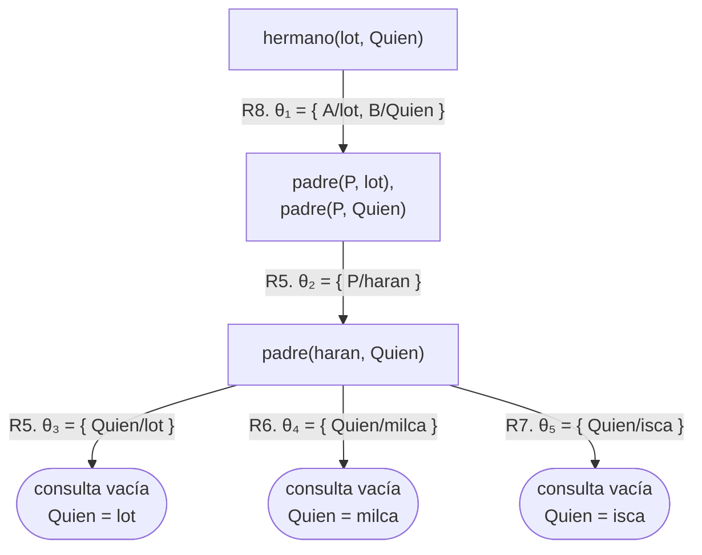
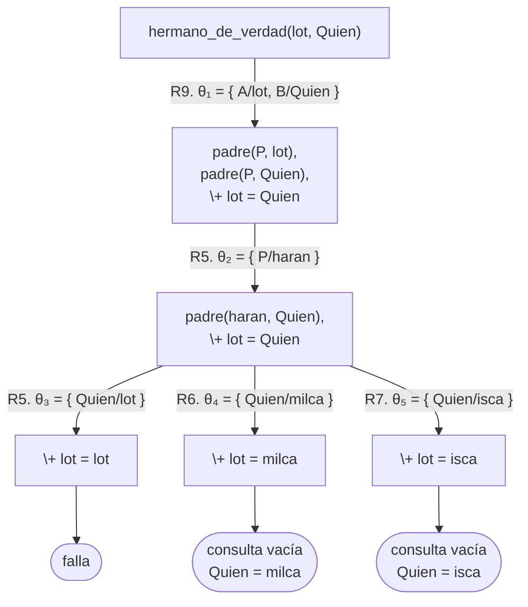
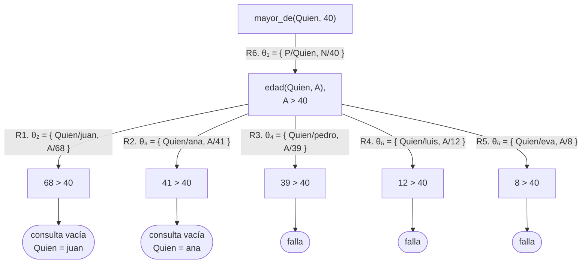

# Soluciones del capítulo 1 — La primera hora

Todos los predicados de esta página están en `ejemplos/capitulo-01/` y pasan sus
pruebas. Una solución distinta de la que figura aquí no es necesariamente
incorrecta: el criterio es que produzca las mismas respuestas.

## 1

`padre(luis, clara).` se agrega a `familia.pl` como un hecho más. Con ese
hecho, `pedro` es abuelo de `clara`, porque `pedro` es padre de `luis` y `luis`
es padre de `clara`:

```prolog
?- abuelo(pedro, clara).
true ;
false.
```

La respuesta termina en `false.` y no en punto, por la razón que estudia el
ejercicio 13: `luis` es el **primero** de los dos hijos de `pedro`, de modo que
al encontrar la respuesta todavía queda `padre(pedro, eva)` por examinar.

Conviene no elegir a `sofia` para este ejercicio: el [capítulo 2](../capitulo-02-hechos-consultas-y-variables/index.md) deja sin padre
a `sofia` de manera deliberada, y usa esa ausencia para explicar qué significa
`false.`

## 2

```prolog
?- padre(pedro, Quien).
Quien = luis ;
Quien = eva.
```

El nombre de la variable es indistinto; el único requisito es que comience con
mayúscula. Como `pedro` tiene dos hijos, la segunda respuesta se solicita con
`;`.

## 3

- `padre(juan, ana).` pregunta por dos objetos concretos y responde `true.`.
- `padre(ana, juan).` plantea la relación inversa y responde `false.`, porque
  ese hecho no está en el programa: el orden de los argumentos tiene
  significado.
- `padre(juan, Quien).` deja una posición sin especificar, de modo que la
  respuesta consiste en valores para la variable, uno por cada solución.

## 4

Con `edades.pl` cargado, la consulta responde:

```prolog
?- etapa(eva, Etapa).
Etapa = chico ;
false.

?- edad(Quien, 41).
Quien = ana.
```

## 5

<!-- ejemplo: capitulo-01/soluciones.pl predicado: nieto/2 consulta: nieto(N, juan). -->
```prolog
%!  nieto(?N, ?A) is nondet.
%
%   N es nieto de A.
nieto(N, A) :-
    padre(A, P),
    padre(P, N).
```

Es `abuelo/2` con los argumentos en orden inverso: los mismos dos objetivos,
consultados desde el otro extremo de la relación.

## 6

<!-- ejemplo: capitulo-01/soluciones.pl predicado: propietario_de_perro/1 tiene_mascota/1 consulta: tiene_mascota(Quien). -->
```prolog
%!  propietario_de_perro(?P) is nondet.
%
%   P tiene por lo menos un perro.
propietario_de_perro(P) :-
    tiene(P, mascota(perro, _)).

%!  tiene_mascota(?P) is nondet.
%
%   P tiene alguna mascota.
tiene_mascota(P) :-
    tiene(P, _).
```

En `tiene_mascota/1`, el `_` ocupa la posición de la mascota completa: no
interesa la especie ni el nombre.

## 7

<!-- ejemplo: capitulo-01/soluciones.pl predicado: menor_que/2 consulta: menor_que(eva, luis). -->
```prolog
%!  menor_que(?A, ?B) is nondet.
%
%   A tiene menos años que B.
%   Se puede definir de manera independiente, o a partir de mayor_que/2 con
%   los argumentos en orden inverso.
menor_que(A, B) :-
    mayor_que(B, A).
```

Sí, se puede definir a partir de `mayor_que/2`: "A es menor que B" equivale a "B
es mayor que A". También se puede definir de manera independiente, repitiendo
los tres objetivos con `<` en lugar de `>`. Las dos definiciones son correctas;
la que se muestra expresa de manera explícita la relación entre ambos
predicados.

## 8

<!-- ejemplo: capitulo-01/soluciones.pl predicado: triple/2 consulta: triple(11, T). -->
```prolog
%!  triple(+N, -T) is det.
%
%   T es el triple de N.
triple(N, T) :-
    T is N * 3.
```

`triple(X, 33).` no responde `X = 11`: produce el error de la [sección 1.10](index.md#110-aritmetica),
porque `is` requiere que la expresión de la derecha se pueda evaluar, y `X` no
tiene valor.

## 9

<!-- ejemplo: capitulo-01/soluciones.pl predicado: cuenta_al_reves/2 consulta: cuenta_al_reves(5, 1). -->
```prolog
%!  cuenta_al_reves(+Desde, +Hasta) is det.
%
%   Escribe los números de Desde a Hasta en orden descendente, uno por línea.
cuenta_al_reves(Desde, Hasta) :-
    Desde >= Hasta,
    format("~w~n", [Desde]),
    Siguiente is Desde - 1,
    cuenta_al_reves(Siguiente, Hasta).
cuenta_al_reves(Desde, Hasta) :-
    Desde < Hasta.
```

Es `cuenta/2` con tres modificaciones: `>=` en lugar de `=<`, una resta en lugar
de una suma, y `<` en el caso base.

## 10

<!-- ejemplo: capitulo-01/hermanos.pl predicado: hermano/2 consulta: hermano(lot, Quien). -->
```prolog
%!  hermano(?A, ?B) is nondet.
%
%   A y B tienen el mismo padre.
%   Ejercicio 10: la regla directa. Su defecto se corrige en el ejercicio 11.
hermano(A, B) :-
    padre(P, A),
    padre(P, B).
```

```prolog
?- hermano(lot, Quien).
Quien = lot ;
Quien = milca ;
Quien = isca.
```

La primera respuesta es `lot`. Según esta regla, toda persona es hermana de sí
misma, y la deducción es correcta: `haran` es padre de `lot`, y `haran` es padre
de `lot`. Los dos objetivos se cumplen con la misma persona en ambas posiciones.

El diagrama siguiente sigue la notación de árbol de derivación de la
[sección 5.2](../capitulo-05-como-responde-prolog/index.md#52-el-arbol-de-derivacion), que conviene leer antes de volver a esta solución. Los
hechos de `padre/2` de `hermanos.pl` se numeran R1 a R7 en el orden del archivo
—`padre(haran, lot).` es R5, `padre(haran, milca).` es R6 y `padre(haran, isca).`
es R7— y la regla es R8:



El mismo hecho, R5, aparece en dos arcos consecutivos: resuelve `padre(P, lot)`
y, con `P = haran`, también `padre(haran, Quien)`. Nada en la regla impide que
un hecho responda a los dos objetivos, y esa rama es la respuesta `Quien = lot`.

## 11

Se agrega la condición de que las dos personas sean distintas:

<!-- ejemplo: capitulo-01/hermanos.pl predicado: hermano_de_verdad/2 consulta: hermano_de_verdad(lot, Quien). -->
```prolog
%!  hermano_de_verdad(?A, ?B) is nondet.
%
%   A y B tienen el mismo padre y no son la misma persona.
%   Ejercicio 11: se agrega la condición de que no sean la misma persona.
hermano_de_verdad(A, B) :-
    padre(P, A),
    padre(P, B),
    \+ A = B.
```

```prolog
?- hermano_de_verdad(lot, Quien).
Quien = milca ;
Quien = isca.
```

Con la misma numeración y la regla corregida como R9, el árbol —en la notación
de la [sección 5.2](../capitulo-05-como-responde-prolog/index.md#52-el-arbol-de-derivacion)— es:



`\+ lot = lot` es un objetivo predefinido: no emplea ninguna cláusula, y su arco
no lleva número ni sustitución. Con `Quien = lot` no se cumple y la rama falla;
con `milca` e `isca` se cumple, desaparece de la consulta y la rama llega a la
consulta vacía. La [sección 10.2](../capitulo-10-negacion-como-falla/index.md#102-no-se-puede-probar) presenta la forma completa de dibujar
`\+`, con el árbol subordinado del objetivo negado.

Este error es conocido: la misma regla, definida para hermanas, aparece en
Clocksin y Mellish con el mismo defecto.

## 12

<!-- ejemplo: capitulo-01/soluciones.pl predicado: cuantos_invitados_mas/2 consulta: cuantos_invitados_mas(pedro, N). -->
```prolog
%!  cuantos_invitados_mas(?P, -N) is det.
%
%   N es la cantidad de invitados que habría si se agregara P, sin modificar
%   la lista original.
cuantos_invitados_mas(P, N) :-
    invitados(Invitados),
    append(Invitados, [P], Con),
    length(Con, N).
```

`append/3` construye una lista nueva que incluye al invitado adicional, y
`length/2` determina la longitud de esa lista. La lista original no cambia: en
Prolog los términos no se modifican; se construyen términos nuevos.

## 13

`abuelo(juan, eva).` responde `true.` y `abuelo(juan, luis).` responde `true ;`
y, al solicitar otra respuesta, `false.`

La regla es `abuelo(A, N) :- padre(A, P), padre(P, N).` Para llegar a `luis`,
Prolog toma `padre(juan, P)` y encuentra primero `ana`; con `P = ana` el
segundo objetivo falla, retrocede y encuentra `pedro`, y con `P = pedro`
prueba `padre(pedro, luis)`. En ese punto todavía **quedaba** un hecho de
`padre/2` por examinar, `padre(pedro, eva)`, de modo que la alternativa sigue
abierta. Para `eva` no queda ninguna, porque es el último hecho.

El punto y coma no indica que haya otra respuesta, sino que Prolog todavía no
descartó la posibilidad de que la haya. El árbol de derivación del
[capítulo 5](../capitulo-05-como-responde-prolog/index.md) no muestra esta diferencia: las dos consultas tienen el
mismo árbol —dos ramas desde `padre(juan, P)`, una que falla y otra que llega a
la consulta vacía—, y que Prolog deje o no una alternativa abierta depende de
cómo indexa las cláusulas, tema de la [sección 16.3](../capitulo-16-rendimiento/index.md#163-indexacion).

## 14

<!-- ejemplo: capitulo-01/soluciones.pl predicado: mayor_de/2 en_edad_escolar/1 consulta: mayor_de(Quien, 40). -->
```prolog
%!  mayor_de(?P, +N) is nondet.
%
%   P tiene más de N años.
mayor_de(P, N) :-
    edad(P, A),
    A > N.

%!  en_edad_escolar(?P) is nondet.
%
%   P tiene más de 5 años y menos de 18.
en_edad_escolar(P) :-
    mayor_de(P, 5),
    edad(P, A),
    A < 18.
```

```prolog
?- mayor_de(Quien, 40).
Quien = juan ;
Quien = ana ;
false.

?- en_edad_escolar(Quien).
Quien = luis ;
Quien = eva.
```

La parte **c** es la importante. `mayor_de/2` admite la consulta con la persona
sin especificar porque su primer objetivo, `edad(P, A)`, **genera** personas de
a una por vez, y la comparación se aplica a cada una. No hay ninguna búsqueda
inversa: hay una enumeración seguida de una comprobación.

El árbol de derivación de `mayor_de(Quien, 40)` —en la notación de la
[sección 5.2](../capitulo-05-como-responde-prolog/index.md#52-el-arbol-de-derivacion)— muestra esa enumeración. Los cinco hechos de `edad/2` de
`soluciones.pl` se numeran R1 a R5 en el orden del archivo (`edades.pl` tiene
además `edad(sofia, 3).`, que agrega una rama más, y también falla) y la regla
es R6:



`edad(Quien, A)` abre una rama por hecho, y la comparación `A > 40` es un
objetivo predefinido, sin número de cláusula: cierra tres ramas y deja pasar
dos. Después de `Quien = ana` quedan las ramas de `pedro`, `luis` y `eva`, que
fallan; por eso la última respuesta va seguida de `false.`

`triple(X, 33)` no puede hacer lo mismo porque `T is N * 3` no enumera nada:
exige que `N` ya tenga valor. La diferencia no está en la aritmética sino en si
existe un objetivo que produzca candidatos antes de la comparación.

Los encabezados de las dos soluciones registran esa diferencia:
`mayor_de(?P, +N)` admite la persona sin especificar, y `triple(+N, -T)` exige
el número. La notación se explica en la [sección 2.8](../capitulo-02-hechos-consultas-y-variables/index.md#28-como-se-documenta-el-uso-de-un-predicado).

## 15

```prolog
?- mascota(gato, felix) = mascota(Especie, felix).
Especie = gato.

?- 2 + 5 = 7.
false.

?- X = 2 * 8.
X = 2*8.
```

La primera unifica dos términos compuestos del mismo nombre y aridad, y liga la
única variable. Las otras dos son el mismo caso visto de dos maneras: `2 + 5`
es un término, no el número 7, de modo que no unifica con `7`; y al unificar
`2 * 8` con una variable, esa variable queda con el término, sin evaluar.
