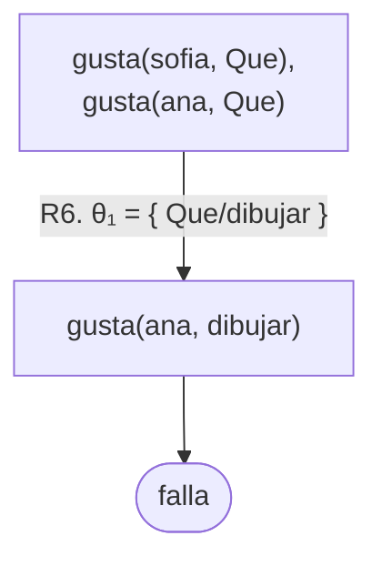
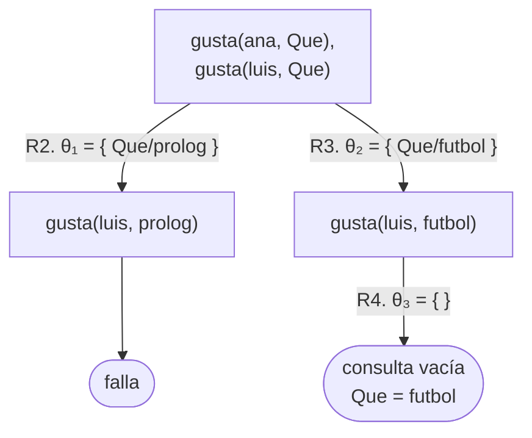
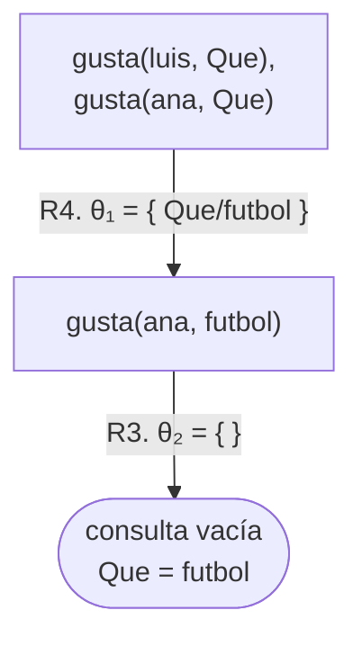
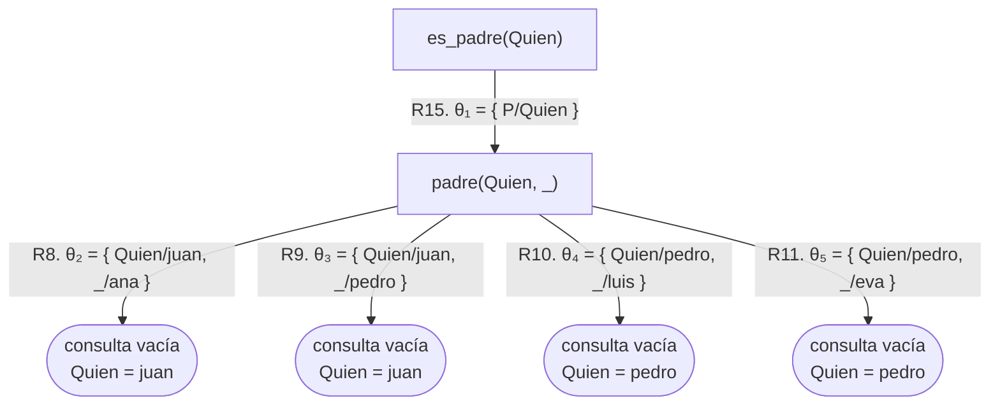
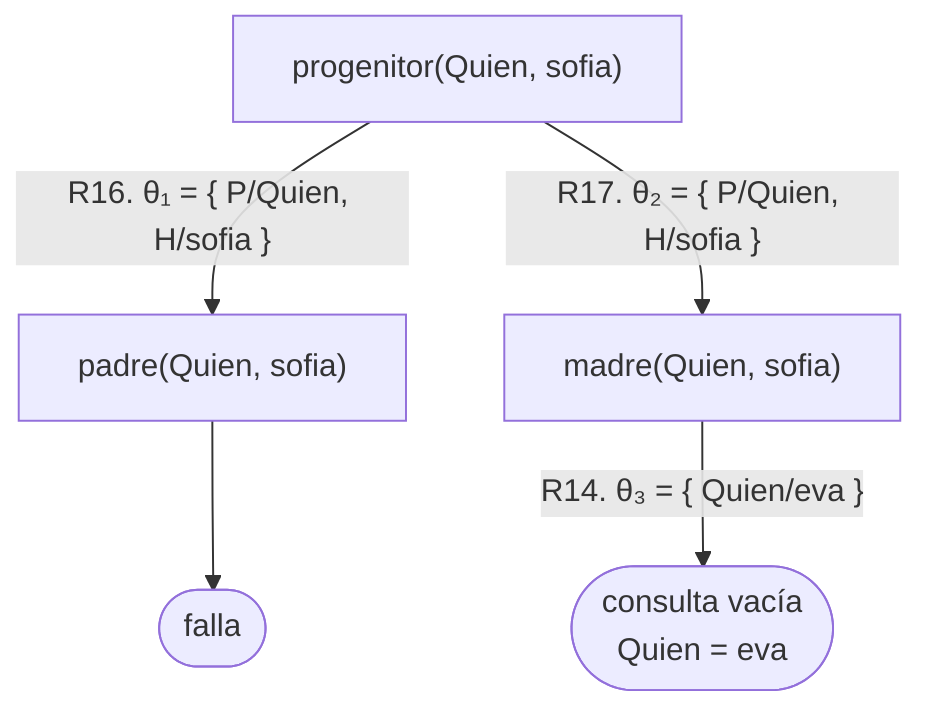
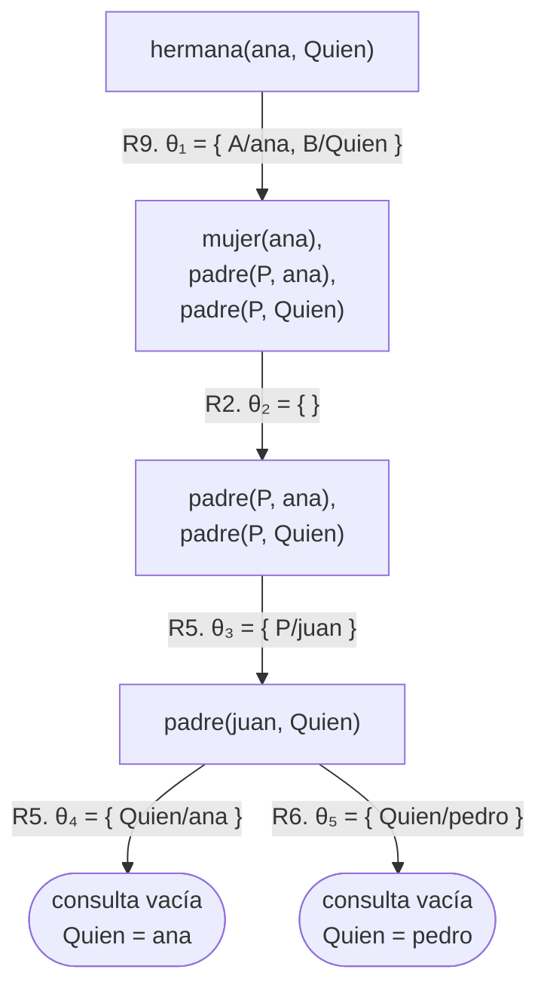
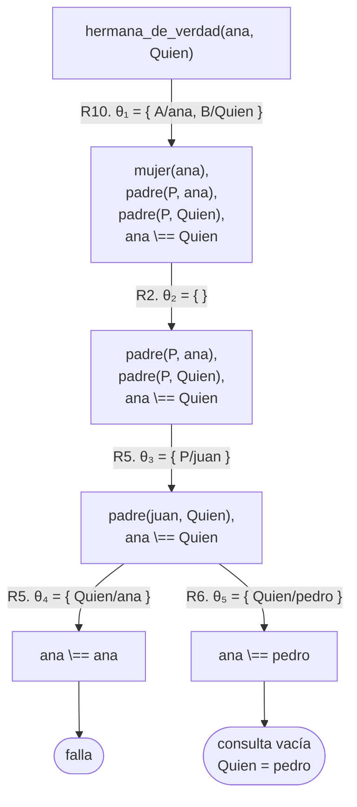

# Capítulo 3 — Reglas y conjunciones

En el [capítulo 2](../capitulo-02-hechos-consultas-y-variables/index.md), todo el conocimiento del programa estaba escrito de manera
explícita: una consulta preguntaba por un hecho, y el hecho estaba en el
programa o no estaba.

Este capítulo presenta dos elementos nuevos: las **conjunciones**, que permiten
plantear varias condiciones en una misma consulta, y las **reglas**, que indican
a Prolog cómo deducir lo que no está escrito. Con dos reglas breves, la base de
conocimiento del capítulo anterior puede responder consultas sobre abuelos y
hermanas.

En este capítulo también se escribe una regla de apariencia correcta que produce
respuestas extras.

## Objetivos del capítulo

Al terminar el capítulo, el lector puede:

- leer la coma como "y", y explicar qué implica que dos objetivos compartan una
  variable;
- seguir paso a paso qué objetivos intenta probar Prolog, y en qué orden;
- escribir una regla con varias condiciones, y varias cláusulas para un mismo
  predicado;
- reconocer una regla que produce respuestas de más, y corregirla;
- escribir una prueba que especifique las respuestas esperadas de un predicado.

!!! info "Tiempo estimado"
    Leer el capítulo, ejecutar sus ejemplos y hacer las actividades: **1:10 h**.
    Resolver los 6 ejercicios marcados con ★: **1:55 h**.
    Resolver los 15 ejercicios del final: **4:45 h**.

## 3.1 Conjunciones

Hasta aquí, cada consulta planteaba una sola pregunta. Una consulta puede
constar de varias preguntas, separadas por comas:

```prolog
?- gusta(ana, Que), gusta(luis, Que).
```

Conviene distinguir dos términos que hasta ahora se usaron como sinónimos. La
**consulta** es el término completo que se ingresa. Cada una de las condiciones
que Prolog debe probar para responderla es un **objetivo**. La consulta anterior
es una sola, y tiene dos objetivos.

Cuando un objetivo se resuelve mediante una regla, los objetivos del cuerpo de
esa regla se denominan **subobjetivos** del primero; el concepto es el mismo:
una condición que se debe probar.

La coma se lee **"y"** (conjunción de objetivos). La consulta pregunta si existe algo que le guste a ana *y* le guste a luis.

El elemento central es la variable repetida. `Que` aparece en los dos objetivos,
lo que exige que tenga **el mismo valor en ambos**. No es suficiente que a ana
le guste algo y a luis le guste algo: debe ser lo mismo.

<!-- ejemplo: capitulo-03/conjunciones.pl predicado: gusta/2 consulta: gusta(ana, Que), gusta(luis, Que). -->
```prolog
% gusta(P, C): a P le gusta C.
gusta(juan, futbol).
gusta(ana, prolog).
gusta(ana, futbol).
gusta(luis, futbol).
gusta(eva, prolog).
gusta(sofia, dibujar).
```

```prolog
?- gusta(ana, Que), gusta(luis, Que).
Que = futbol.
```

A ana le gustan dos cosas y a luis, una. La única que tienen en común es el
fútbol.

Con variables distintas, la consulta es otra:

```prolog
?- gusta(ana, Una), gusta(luis, Otra).
Una = prolog,
Otra = futbol ;
Una = futbol,
Otra = futbol.
```

En este caso no se exige que los valores coincidan, y Prolog entrega todas las
combinaciones.

!!! question "Actividad"
    Antes de ejecutarla, determinar qué responde
    `?- padre(juan, Quien), gusta(Quien, prolog).` La consulta expresa, con dos
    objetivos, la pregunta "¿a cuál de los hijos de juan le gusta Prolog?".

## 3.2 Qué prueba Prolog, y en qué orden

Esta sección es la más importante del capítulo. Se recomienda seguir los
ejemplos con lápiz y papel.

El primer ejemplo es una consulta que **falla**; resulta más simple de seguir,
porque no produce ningún valor que registrar:

```prolog
?- gusta(sofia, Que), gusta(ana, Que).
false.
```

Prolog procesa los objetivos **de izquierda a derecha**, y para cada uno recorre
las cláusulas **de arriba hacia abajo**, en el orden en que están escritas. En
este caso: busca `gusta(sofia, Que)`, encuentra `gusta(sofia, dibujar)`, y `Que`
queda ligada a `dibujar`. Pasa al segundo objetivo, que ahora es
`gusta(ana, dibujar)`, y lo busca de arriba hacia abajo; no está. Retrocede al
primer objetivo para buscar otra solución de `gusta(sofia, Que)`; no hay. Las
alternativas se agotaron, y la consulta completa falla.

De esta ejecución se desprenden dos observaciones. Primera: cuando el segundo
objetivo falló, Prolog **no continuó hacia la derecha**; un objetivo no se
intenta mientras los que están a su izquierda no se hayan probado. Segunda:
cuando retrocedió al primer objetivo, `Que` **dejó de estar ligada** a
`dibujar`. Esta operación se denomina *desligar* la variable, y garantiza que el
intento siguiente comience sin valores previos.

Esa búsqueda se puede dibujar. El diagrama tiene pocas reglas de lectura, y las
mismas sirven para todos los que aparecen en el curso.

!!! note "Cómo leer el diagrama"
    - Cada **nodo** es lo que queda por probar en ese momento: la raíz es la
      consulta completa, y cada objetivo ocupa una línea.
    - Cada **flecha** indica qué cláusula se usó, numerada R1, R2, … en una
      tabla, y la **sustitución** θ, que registra el valor que toma cada
      variable: `θ₁ = { Que/dibujar }` se lee "`Que` toma el valor `dibujar`".
      Las sustituciones se numeran en el orden en que Prolog las produce.
    - Una rama que llega a la **consulta vacía** —no queda nada por probar— es
      una respuesta, y la hoja la muestra.
    - Una rama cuyo primer objetivo no unifica con ninguna cláusula termina en
      **falla**.

    Prolog recorre el diagrama de arriba hacia abajo y de izquierda a derecha;
    retroceder es pasar a la rama vecina. Un objetivo predefinido, como el
    `\==` de la [sección 3.5](#35-una-regla-que-produce-respuestas-de-mas), no
    emplea ninguna cláusula, y su flecha no lleva número. Este diagrama es el
    **árbol de derivación**, que la
    [sección 5.2](../capitulo-05-como-responde-prolog/index.md#52-el-arbol-de-derivacion)
    define con precisión.

Los seis hechos de `gusta/2`, numerados en el orden en que están escritos:

| | |
|---|---|
| R1 | `gusta(juan, futbol).` |
| R2 | `gusta(ana, prolog).` |
| R3 | `gusta(ana, futbol).` |
| R4 | `gusta(luis, futbol).` |
| R5 | `gusta(eva, prolog).` |
| R6 | `gusta(sofia, dibujar).` |

La consulta que falla tiene una sola rama:



El único hecho que unifica con `gusta(sofia, Que)` es R6. Con `Que` ligada a
`dibujar`, lo que queda por probar es `gusta(ana, dibujar)`, que no unifica con
ninguna cabeza: la rama falla. No hay otra rama a la que retroceder, y por eso
la respuesta es `false.`

### Una consulta que tiene éxito

Se retoma la consulta `?- gusta(ana, Que), gusta(luis, Que).`

1. Prolog toma el primer objetivo, `gusta(ana, Que)`, y busca desde la primera
   cláusula. La primera que unifica es `gusta(ana, prolog)`. Registra que `Que`
   queda ligada a `prolog`, y registra también que quedan cláusulas posteriores
   sin examinar.
2. Pasa al segundo objetivo. Como `Que` ya está ligada a `prolog`, el objetivo
   que debe probar es `gusta(luis, prolog)`. Lo busca de arriba hacia abajo y no
   lo encuentra. El objetivo falla.
3. Entonces **retrocede** al primer objetivo y continúa la búsqueda desde el
   punto donde la había dejado. Encuentra `gusta(ana, futbol)`. Ahora `Que`
   queda ligada a `futbol`.
4. Intenta nuevamente el segundo objetivo, que ahora es `gusta(luis, futbol)`.
   Ese hecho está en el programa.
5. Los dos objetivos se cumplen simultáneamente. Prolog responde `Que = futbol`.

Los cinco pasos son el recorrido de este árbol:



Dos hechos unifican con el primer objetivo, R2 y R3, y por eso de la raíz
salen dos ramas. Los pasos 1 y 2 son la rama de la izquierda, que falla; el
paso 3 es el pasaje a la rama de la derecha; los pasos 4 y 5 son esa rama, que
llega a la consulta vacía. La sustitución `θ₃` está vacía porque
`gusta(luis, futbol)` ya no tiene variables cuando unifica con R4.

El paso 3 es el fundamental. Cuando un objetivo falla, la ejecución no termina:
Prolog retrocede al objetivo anterior e intenta la alternativa siguiente. Es el
**backtracking** presentado en el [capítulo 1](../capitulo-01-la-primera-hora/index.md), y se lo puede nombrar con los
cuatro eventos de la traza: el segundo objetivo salió por Fail, y el primero se
reingresó por Redo. La [sección 5.3](../capitulo-05-como-responde-prolog/index.md#53-el-mismo-recorrido-registrado-por-trace) muestra cómo esos cuatro eventos forman un
diagrama.

El retroceso también deshace las ligaduras: al volver al paso 1, `Que` deja de
estar ligada a `prolog`. El valor no se conserva; la variable vuelve a estar
libre hasta que el primer objetivo la ligue nuevamente. En el árbol, la ligadura
`Que/prolog` pertenece a la rama abandonada: la rama de la derecha parte de la
raíz, donde `Que` está libre, y no conserva nada de la otra.

### El orden no cambia la respuesta, pero sí el trabajo realizado

Si se invierte el orden de los dos objetivos, la respuesta es la misma:

```prolog
?- gusta(luis, Que), gusta(ana, Que).
Que = futbol.
```



Lo que cambia es la cantidad de búsqueda necesaria, y el árbol la mide: tres
nodos y una sola rama, frente a los cinco nodos y las dos ramas del árbol
anterior. A luis le gusta una sola cosa, de modo que comenzar por él deja menos
alternativas por explorar. Con seis hechos la diferencia es imperceptible; en
programas de mayor tamaño puede determinar que una consulta termine en un
tiempo razonable o que no termine. El
[capítulo 16](../capitulo-16-rendimiento/index.md) trata este tema.

## 3.3 Reglas

Una **regla** indica cómo deducir algo que no está escrito en el programa. La
regla más simple tiene una sola condición:

<!-- ejemplo: capitulo-03/reglas.pl predicado: es_padre/1 consulta: es_padre(Quien). -->
```prolog
%!  es_padre(?P) is nondet.
%
%   P es padre de alguien. Una regla de una sola condición.
es_padre(P) :-
    padre(P, _).
```

El símbolo `:-` se lee **"si"**, y divide la regla en dos partes:

- a la izquierda, la **cabeza**: lo que la regla permite concluir;
- a la derecha, el **cuerpo**: lo que debe cumplirse para concluirlo.

La regla se lee "P es padre si P es padre de alguien"; el valor de ese *alguien*
no interesa, y por eso se escribe `_`. Una regla no afirma nada por sí sola:
`es_padre(P)` no afirma que P sea padre, sino que lo es *si* su cuerpo se puede
probar.

!!! abstract "Plantilla 2 — Derivar una relación de otra"
    **Cuándo**: se dispone de una relación y se necesita otra que se obtiene de
    ella, con menos argumentos o con los argumentos en otro orden.

    ```prolog
    nueva(X) :-
        vieja(X, _).
    ```

    **En este capítulo se usa en**: `es_padre/1` (3.3), `hijo/2` (ejercicio 1),
    `nieto/2` (ejercicio 7). Las demás plantillas están en
    [esta página](../plantillas.md).

### Respuestas repetidas

La consulta sobre `es_padre/1` muestra un comportamiento nuevo:

```prolog
?- es_padre(Quien).
Quien = juan ;
Quien = juan ;
Quien = pedro ;
Quien = pedro.
```

`juan` aparece dos veces, y no es un error. Los hechos indican que juan es padre
de ana y también de pedro: son **dos demostraciones distintas de la misma
conclusión**, y Prolog entrega una respuesta por cada una. No elimina
duplicados ni verifica si una respuesta ya fue entregada.

El árbol lo muestra con una hoja por demostración. Las cláusulas de `reglas.pl`
se numeran en el orden del archivo: los tres hechos de `varon/1` son R1 a R3
—`varon(pedro)` es R2—, los cuatro de `mujer/1` R4 a R7, los cuatro de
`padre/2` R8 a R11 —`padre(juan, ana)` es R8— y los tres de `madre/2` R12 a R14
—`madre(marta, ana)` es R12—. La regla va a continuación:

| | |
|---|---|
| R15 | `es_padre(P) :- padre(P, _).` |



La regla reemplaza el objetivo por su cuerpo, y `padre(Quien, _)` unifica con
los cuatro hechos: cuatro ramas, cuatro hojas de éxito, cuatro respuestas. Dos
de las hojas dicen `Quien = juan`, y el árbol no las distingue de las demás.

Este comportamiento es general: la cantidad de respuestas no es la cantidad de
soluciones distintas, sino la cantidad de demostraciones. Es posible eliminar
los duplicados, pero requiere herramientas que se presentan en el [capítulo 17](../capitulo-17-todas-las-soluciones/index.md).

### Varias cláusulas expresan una disyunción

Un predicado puede tener más de una cláusula; el conjunto se lee como **"o"**:

<!-- ejemplo: capitulo-03/reglas.pl predicado: progenitor/2 consulta: progenitor(Quien, sofia). -->
```prolog
%!  progenitor(?P, ?H) is nondet.
%
%   P es el padre o la madre de H, y no un ascendiente cualquiera: nombra una
%   sola generación.
%   Dos cláusulas del mismo predicado son dos alternativas: se cumple una o se
%   cumple la otra.
progenitor(P, H) :-
    padre(P, H).
progenitor(P, H) :-
    madre(P, H).
```

P es progenitor de H si es su padre, **o** si es su madre. Prolog evalúa las
cláusulas en el orden en que están escritas: cuando se solicita otra respuesta
con `;`, evalúa la segunda. Si la primera no produce ninguna, pasa a la segunda
por sí solo. Nadie figura como padre de sofia, y la respuesta llega por la
segunda cláusula:

```prolog
?- progenitor(Quien, sofia).
Quien = eva.
```

Con las dos cláusulas numeradas a continuación de las de `reglas.pl`:

| | |
|---|---|
| R16 | `progenitor(P, H) :- padre(P, H).` |
| R17 | `progenitor(P, H) :- madre(P, H).` |



Dos cláusulas son dos ramas desde la raíz. La de R16 falla, porque
`padre(Quien, sofia)` no unifica con ningún hecho; la de R17 llega a la
consulta vacía con `madre(eva, sofia)`. Así se dibuja una disyunción.

Esta es la forma de expresar una disyunción en Prolog, y ya se usó en los
capítulos anteriores: en el [capítulo 1](../capitulo-01-la-primera-hora/index.md), `etapa/2` tenía tres cláusulas, una por
caso; los cuatro hechos `padre/2` del [capítulo 2](../capitulo-02-hechos-consultas-y-variables/index.md) son cuatro cláusulas del mismo
predicado.

!!! abstract "Plantilla 3 — Definir por casos"
    **Cuándo**: la relación se cumple por una condición **o** por otra.

    ```prolog
    p(X) :-
        primer_caso(X).
    p(X) :-
        otro_caso(X).
    ```

    Cada cláusula es una alternativa completa. Si se cumple más de una, se
    obtiene más de una respuesta.

    **En este capítulo se usa en**: `progenitor/2` (3.3), `abuelo_o_abuela/2`
    (ejercicio 5).

### Encadenar dos relaciones

Una vez definido `progenitor/2`, las dos reglas siguientes se obtienen de manera
directa:

<!-- ejemplo: capitulo-03/reglas.pl predicado: abuelo/2 abuela/2 consulta: abuelo(juan, Quien). -->
```prolog
%!  abuelo(?A, ?N) is nondet.
%
%   A es el abuelo de N.
abuelo(A, N) :-
    varon(A),
    progenitor(A, P),
    progenitor(P, N).

%!  abuela(?A, ?N) is nondet.
%
%   A es la abuela de N.
abuela(A, N) :-
    mujer(A),
    progenitor(A, P),
    progenitor(P, N).
```

```prolog
?- abuelo(juan, Quien).
Quien = luis ;
Quien = eva ;
false.
```

El programa no contiene ningún hecho que indique que juan es abuelo de luis.
Contiene hechos sobre padres y madres, y una regla que define qué significa ser
abuelo; la deducción la realiza Prolog. Esta es la ventaja de escribir reglas en
lugar de enumerar todos los casos.

`abuelo/2` exige `varon(A)` y `abuela/2` exige `mujer(A)`. Sin esa condición,
marta también cumpliría `abuelo/2`, porque los dos objetivos `progenitor/2` se
cumplen de la misma manera.

!!! abstract "Plantilla 4 — Encadenar dos relaciones"
    **Cuándo**: se conoce A, se necesita C, y existe una relación entre A y B y
    otra entre B y C.

    ```prolog
    nueva(A, C) :-
        primera(A, B),
        segunda(B, C).
    ```

    **El elemento central es `B`**: aparece dos veces, y por eso debe tener el
    mismo valor en los dos objetivos. Es la variable compartida de la
    [sección 3.1](#31-conjunciones), ahora dentro de una regla.

    **En este capítulo se usa en**: `abuelo/2` y `abuela/2` (3.3), `primo/2`
    (ejercicio 9).

!!! abstract "Plantilla 5 — Filtrar: generar y después comprobar"
    **Cuándo**: se necesitan los elementos que cumplen una condición. Primero se
    genera un candidato; después se lo verifica.

    ```prolog
    nueva(X) :-
        candidato(X),
        condicion(X).
    ```

    El orden es significativo: la condición se verifica sobre una variable que
    ya tiene valor. Si se la escribe primero, todavía no hay ningún valor que
    verificar.

    **En este capítulo se usa en**: el objetivo `varon(A)` de `abuelo/2` (3.3),
    y la consulta `padre(juan, Quien), gusta(Quien, prolog)` (3.1).

## 3.4 El alcance de una variable es la cláusula

En `abuelo/2` hay tres variables: `A`, `P` y `N`. Su alcance está determinado
por las siguientes reglas.

**Dentro de una cláusula, el mismo nombre designa la misma variable.** La `P`
del segundo objetivo y la `P` del tercero son la misma variable: la persona
intermedia debe ser la misma en los
dos objetivos. Si tuvieran nombres distintos, la regla diría "A es progenitor de
alguien, y otro alguien —no necesariamente el mismo— es progenitor de N", condición
que se cumple para casi cualquier par.

**Entre cláusulas distintas, el mismo nombre no establece ninguna relación.** La
`P` de `abuelo/2` y la `P` de `progenitor/2` son dos variables diferentes cuyo
nombre coincide. No existe ninguna conexión entre ellas.

Además, cada **uso** de una regla emplea variables nuevas. Cuando `abuelo/2`
invoca dos veces a `progenitor/2`, la segunda invocación no conserva ningún
valor de la primera.

**Cuando dos variables sin valor se encuentran, quedan ligadas entre sí.** Es lo
que ocurre al consultar `abuelo(juan, Quien)`: la `Quien` de la consulta y la
`N` de la cabeza de la regla son dos variables distintas, y ninguna tiene valor.
Al unificar la consulta con la cabeza, las dos pasan a designar el mismo objeto,
todavía desconocido. Desde ese momento, el valor que reciba una lo recibe
también la otra, y por eso, cuando el último objetivo de la regla le da a `N` el
valor `luis`, la respuesta se muestra como `Quien = luis`. La regla no
"devuelve" un resultado: las dos variables eran la misma desde el momento de la
unificación.

### Variables que aparecen una sola vez

De lo anterior se deriva una advertencia frecuente. Si en una cláusula una
variable aparece **una sola vez**, Prolog lo informa al cargar el archivo:

```text
Warning: reglas.pl:2:
Warning:    Singleton variables: [P,Q]
```

No es un error: el programa se carga igualmente. Es una advertencia, y en la
mayoría de los casos señala un problema real, porque una variable que aparece
una sola vez no vincula ningún objetivo con otro. Las dos causas habituales son:

- **el nombre está mal escrito en una de sus apariciones**, y el resultado son
  dos variables distintas de nombre similar. Este es el motivo por el que existe
  la advertencia: detecta un error que, de otro modo, se manifiesta mucho
  después como una respuesta incorrecta;
- **el valor efectivamente no interesa**, y en ese caso corresponde usar `_`,
  como en `es_padre/1`. El uso de `_` no solo evita la advertencia: comunica a
  quien lee la regla que esa posición no es relevante.

Si el nombre de la variable aporta información pero la variable se usa una sola
vez, se puede comenzar su nombre con `_`, por ejemplo `_Hijo`: Prolog no emite
la advertencia y el nombre conserva su valor descriptivo.

!!! question "Actividad"
    Reemplazar en `abuelo/2` la segunda `P` por `Q`, y repetir la consulta
    `abuelo(juan, Quien).` ¿Cuántas respuestas se obtienen? Examinarlas:
    ¿cuáles son correctas?

## 3.5 Una regla que produce respuestas de más

Se desea definir "A es hermana de B": A es mujer, y ambos tienen el mismo padre.

<!-- ejemplo: capitulo-03/hermana.pl predicado: hermana/2 consulta: hermana(ana, Quien). -->
```prolog
%!  hermana(?A, ?B) is nondet.
%
%   A es hermana de B. La regla es incompleta: ver la sección 3.5.
hermana(A, B) :-
    mujer(A),
    padre(P, A),
    padre(P, B).
```

La regla parece correcta. Sin embargo:

```prolog
?- hermana(ana, Quien).
Quien = ana ;
Quien = pedro.
```

La segunda respuesta es la esperada. La primera indica que **ana es hermana de
sí misma**.

La deducción es correcta respecto de la regla. Con `A` ligada a `ana`, los dos
objetivos `padre/2` se resuelven así:

- `padre(P, ana)` se cumple con `P = juan`;
- `padre(juan, B)` se cumple con `B = ana`.

Nada impide que Prolog use **el mismo hecho** para los dos objetivos. Se había
supuesto que `B` sería otra persona, pero esa condición no está escrita en la
regla. Prolog responde de acuerdo con lo que el programa expresa, no con la
intención de quien lo escribió; la mayor parte de los errores proviene de esa
diferencia.

En el árbol, el mismo hecho aparece en dos flechas consecutivas. En
`hermana.pl`, los hechos de `mujer/1` son R1 a R4 —`mujer(ana)` es R2—, los de
`padre/2` R5 a R8 —`padre(juan, ana)` es R5 y `padre(juan, pedro)` es R6— y la
regla:

| | |
|---|---|
| R9 | `hermana(A, B) :- mujer(A), padre(P, A), padre(P, B).` |



R5 resuelve `padre(P, ana)` y, en la flecha siguiente de la rama izquierda,
también `padre(juan, Quien)`: es la respuesta `Quien = ana`. La rama de R6 es
la respuesta esperada.

La solución es escribir la condición de manera explícita:

<!-- ejemplo: capitulo-03/hermana.pl predicado: hermana_de_verdad/2 consulta: hermana_de_verdad(ana, Quien). -->
```prolog
%!  hermana_de_verdad(?A, ?B) is nondet.
%
%   A es hermana de B, y no son la misma persona.
hermana_de_verdad(A, B) :-
    mujer(A),
    padre(P, A),
    padre(P, B),
    A \== B.
```

```prolog
?- hermana_de_verdad(ana, Quien).
Quien = pedro.
```

`A \== B` se lee "A y B no son el mismo término". Su ubicación al final es
deliberada: en ese punto las dos variables ya tienen valor, y `\==` solo compara
los términos tal como están en el momento de la llamada. El efecto de ubicarlo
antes, cuando las variables todavía están libres, se trata en el [capítulo 10](../capitulo-10-negacion-como-falla/index.md).

Con la regla corregida como R10, el árbol tiene un objetivo más en cada nodo, y
la rama de `Quien = ana` termina en una comparación que no se cumple:

| | |
|---|---|
| R10 | `hermana_de_verdad(A, B) :- mujer(A), padre(P, A), padre(P, B), A \== B.` |



`\==` es un objetivo **predefinido**: no emplea ninguna cláusula del programa,
y por eso su flecha no lleva número ni sustitución. Si la comparación se cumple,
el objetivo desaparece de la consulta; si no, la rama falla. `ana \== ana` no se
cumple, y la primera rama se cierra; `ana \== pedro` sí, y la segunda llega a la
consulta vacía.

!!! abstract "Plantilla 6 — Exigir que dos valores sean distintos"
    **Cuándo**: una regla usa dos veces la misma relación, y ambos usos pueden
    resolverse con el mismo valor.

    ```prolog
    nueva(A, B) :-
        relacion(P, A),
        relacion(P, B),
        A \== B.
    ```

    **Se ubica al final**, cuando `A` y `B` ya tienen valor: `\==` compara los
    términos en su estado actual; no espera a que se instancien.

    **En este capítulo se usa en**: `hermana_de_verdad/2` (3.5), `hermano_de/2`
    (ejercicio 4), y dentro de `primo/2` (ejercicio 9).

!!! note "Un error documentado"
    Esta misma regla, con el mismo defecto, es un ejercicio del libro de Clocksin
    y Mellish, y aparece con otros nombres en la mayoría de los cursos de Prolog.
    Más que la corrección puntual, importa el criterio general: **cada vez que
    una regla usa dos veces la misma relación, se debe verificar si ambos usos
    pueden resolverse con el mismo valor.**

## 3.6 La primera prueba

La sección anterior muestra que una regla puede ser incorrecta y parecer
correcta. La relectura no es un método de verificación suficiente, porque quien
escribió la regla tiende a leer lo que quiso expresar.

Un método suficiente es especificar por separado las respuestas esperadas. Esa
especificación es una **prueba**, y en SWI-Prolog se escribe con **plunit**. Las
pruebas se ubican en un archivo con el mismo nombre del programa y extensión
`.plt`:

```prolog
:- begin_tests(hermana).

% Respuestas de la regla incompleta: ana se incluye a sí misma.
test(hermana_se_cuenta_a_si_misma, all(Q == [ana, pedro])) :-
    hermana(ana, Q).

% Respuestas esperadas.
test(hermanas_de_verdad, all(Q == [pedro])) :-
    hermana_de_verdad(ana, Q).

test(eva_es_hermana_de_luis) :-
    hermana_de_verdad(eva, luis).

test(nadie_es_hermana_de_si_misma, [fail]) :-
    hermana_de_verdad(eva, eva).

% pedro es varón: no es hermana de nadie, aunque tenga hermanos.
test(pedro_no_es_hermana, [fail]) :-
    hermana_de_verdad(pedro, _).

:- end_tests(hermana).
```

Cada `test(...)` tiene un nombre y un objetivo. Las opciones ubicadas entre el
nombre y `:-` especifican el resultado esperado:

- **`all(Q == [ana, pedro])`** reúne *todas* las respuestas y exige que sean
  exactamente esas, en ese orden. Es la opción más útil en este caso, porque el
  defecto de la sección anterior era precisamente una respuesta de más.
- **`[fail]`** especifica que el objetivo debe fallar. Especificar lo que *no*
  debe ocurrir es tan importante como especificar lo que sí.
- sin opciones, se espera que el objetivo se cumpla una vez y sin dejar
  alternativas pendientes. Si el predicado deja alguna —el caso de `true ;` del
  [capítulo 1](../capitulo-01-la-primera-hora/index.md)—, se lo debe declarar con `[nondet]`; de lo contrario, la prueba
  emite una advertencia.

Para ejecutar las pruebas se cargan juntos el programa y el archivo de pruebas:

```text
swipl -g "consult(['hermana.pl','hermana.plt']),run_tests" -t halt
```

La salida tiene la siguiente forma:

```text
% Start unit: hermana
% [1/5] hermana:hermana_se_cuenta_a_si_misma ........ passed (0.043 sec)
% [2/5] hermana:hermanas_de_verdad .................. passed (0.000 sec)
% [3/5] hermana:eva_es_hermana_de_luis .............. passed (0.000 sec)
% [4/5] hermana:nadie_es_hermana_de_si_misma ........ passed (0.000 sec)
% [5/5] hermana:pedro_no_es_hermana ................. passed (0.000 sec)
% End unit hermana: passed (0.031 sec CPU)
% All 5 tests passed in 0.068 seconds (0.031 cpu)
```

Todos los ejemplos de este curso tienen su archivo de pruebas, y todas las
pruebas pasan antes de que el ejemplo se incorpore al texto. El [capítulo 26](../capitulo-26-pruebas-y-depuracion/index.md)
presenta las demás opciones de plunit; por ahora son suficientes `all`, `[fail]`
y `[nondet]`.

!!! question "Actividad"
    Eliminar `A \== B` de `hermana_de_verdad/2` y ejecutar las pruebas. ¿Cuál
    falla, y qué informa el mensaje?

## Ejercicios

Las soluciones están en [la página de soluciones](soluciones.md). La dificultad
va de 1 (se resuelve consultando el capítulo) a 3 (requiere elaboración propia).
Los marcados con ★ son los que no conviene saltear: cubren lo que el capítulo
tiene de propio, y los capítulos siguientes los dan por hechos.

1. ★ **(1)** Escribir `hijo(H, P)`: H es hijo de P. Usar `progenitor/2`. Su
   encabezado es `%! hijo(?H, ?P) is nondet.`
2. **(1)** Con `reglas.pl`, ¿qué responde `abuelo(Quien, luis).`? ¿Y
   `abuela(Quien, luis).`?
3. **(1)** Expresar en castellano la regla
   `tio(T, S) :- varon(T), hermano_de(T, P), progenitor(P, S).`
4. **(2)** Escribir `hermano_de(A, B)`, la versión masculina de
   `hermana_de_verdad/2`. Tener en cuenta el mismo defecto. Escribir también su
   encabezado: qué argumentos deben llegar ligados y cuántas respuestas
   produce.
5. **(2)** Escribir `abuelo_o_abuela(A, N)` de dos maneras: con dos cláusulas, y
   con una sola que use `progenitor/2` dos veces. Las dos llevan el encabezado
   `%! abuelo_o_abuela(?A, ?N) is nondet.` ¿Producen las mismas respuestas?
6. ★ **(2)** `?- gusta(ana, Que), gusta(luis, Que).` produce una respuesta.
   ¿Cuántas produce `?- gusta(ana, Una), gusta(luis, Otra).`? Responder antes de
   ejecutarla.
7. **(2)** Escribir `nieto(N, A)` a partir de `abuelo/2` o `abuela/2`, y su
   encabezado: qué argumentos deben llegar ligados y cuántas respuestas
   produce. ¿Es necesaria una regla nueva, o es suficiente consultar la
   relación en sentido inverso?
8. ★ **(2)** Reemplazar en `hermana/2` el predicado `padre/2` por `progenitor/2` y
   ejecutar `hermana(ana, Quien).` Se obtienen respuestas repetidas. Explicar su
   origen.
9. ★ **(3)** Escribir `primo(A, B)`: un progenitor de A y un progenitor de B son
   hermanos. Su encabezado es `%! primo(?A, ?B) is nondet.` Se puede partir de
   `hermano_de/2` del ejercicio 4, aunque conviene revisar si alcanza tal como
   está; y se debe determinar qué condiciones son necesarias para que nadie sea
   primo de sí mismo.
10. **(3)** Escribir las pruebas de `hijo/2` del ejercicio 1: una con `all`, una
    con `[fail]`, y una que verifique un caso particular.
11. ★ **(2)** Seguir a mano la consulta `?- gusta(eva, Que), gusta(juan, Que).`
    sobre `conjunciones.pl`, completando una tabla con una fila por paso:

    | Objetivo que se intenta | Qué hace Prolog | Resultado |
    |---|---|---|
    | | | |

    Anotar en cada fila qué valor toma `Que` y en qué momento deja de tenerlo.
    Después ejecutar la consulta y comprobar la respuesta.
12. **(2)** Hacer lo mismo con `?- progenitor(marta, H), varon(H).` sobre
    `reglas.pl`. Esta consulta tiene una diferencia con la anterior: su primer
    objetivo se resuelve con una **regla** y no con un hecho, de modo que
    aparecen subobjetivos. Indicar en la tabla cuáles son.
13. ★ **(2)** El predicado siguiente pretende definir "A y B tienen la misma
    madre", pero responde que toda persona con madre registrada cumple la
    relación consigo misma. Explicar la causa y corregirlo:

    ```prolog
    %!  misma_madre(?A, ?B) is nondet.
    %
    %   A y B tienen la misma madre.
    misma_madre(A, B) :-
        madre(M, A),
        madre(M, B).
    ```

14. **(2)** Representar como regla, y no como hechos, cada uno de estos
    enunciados, usando los predicados de `reglas.pl`: "una persona es tía de
    otra si es hermana de alguno de sus progenitores" y "dos personas son
    cuñadas si una es hermana del cónyuge de la otra". El segundo requiere una
    relación que el programa no tiene: indicar cuál, sin escribirla.
15. **(3)** Escribir las pruebas de `abuelo_o_abuela/2` del ejercicio 5, de
    modo que verifiquen que las dos versiones producen exactamente las mismas
    respuestas y en el mismo orden.

## Resumen

| | |
|---|---|
| `,` | conjunción: "y". Ambos objetivos, con los mismos valores de las variables |
| `:-` | "si": separa la cabeza del cuerpo de una regla |
| varias cláusulas | alternativas para el mismo predicado: "o" |
| `\==` | los dos operandos no son el mismo término |
| **cabeza** | lo que la regla permite concluir |
| **cuerpo** | lo que debe cumplirse para concluirlo |
| **consulta** | el texto completo que se ingresa para preguntar |
| **objetivo** | cada una de las condiciones que Prolog debe probar |
| **subobjetivo** | un objetivo que aparece en el cuerpo de una regla |
| **cláusula** | un hecho o una regla; toda unidad terminada en punto |
| **desligar** | deshacer la ligadura de una variable al retroceder |
| **backtracking** | retroceder al objetivo anterior e intentar la alternativa siguiente |
| **árbol de derivación** | el diagrama de la búsqueda: cada nodo es lo que queda por probar, cada flecha la cláusula usada y su sustitución, cada hoja una respuesta o una falla. Lo define el [capítulo 5](../capitulo-05-como-responde-prolog/index.md) |
| `begin_tests/1`, `end_tests/1` | delimitan un conjunto de pruebas |
| `test/2` con `all`, `[fail]`, `[nondet]` | especifican el resultado esperado de cada prueba |
| `run_tests/0` | ejecuta las pruebas cargadas |

## Temas que se retoman

| Tema | Se retoma en |
|---|---|
| Unificación: cómo se determina que dos términos coinciden | [capítulo 4](../capitulo-04-terminos-y-unificacion/index.md) |
| El orden de búsqueda, representado como árbol de derivación | [capítulo 5](../capitulo-05-como-responde-prolog/index.md) |
| Reglas que se invocan a sí mismas | [capítulo 6](../capitulo-06-recursion/index.md) |
| El costo de cada ordenamiento de los objetivos | [capítulo 16](../capitulo-16-rendimiento/index.md) |
| `\==`, y el efecto de comparar antes de que las variables tengan valor | [capítulo 10](../capitulo-10-negacion-como-falla/index.md) |
| plunit en detalle, con sus demás opciones | [capítulo 26](../capitulo-26-pruebas-y-depuracion/index.md) |
