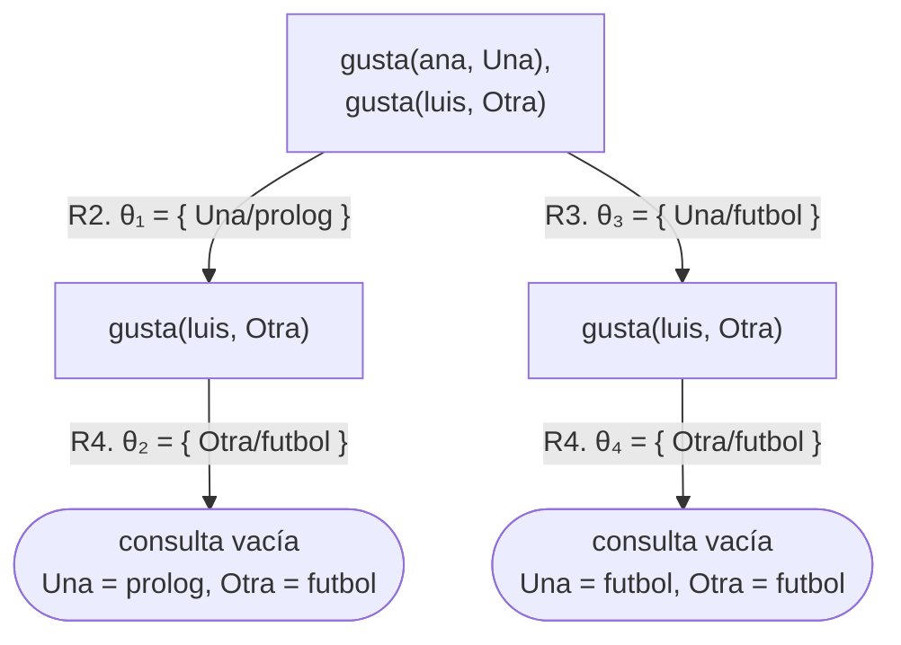
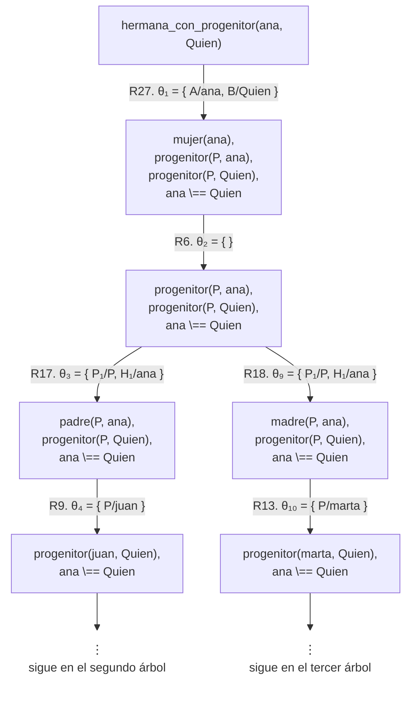
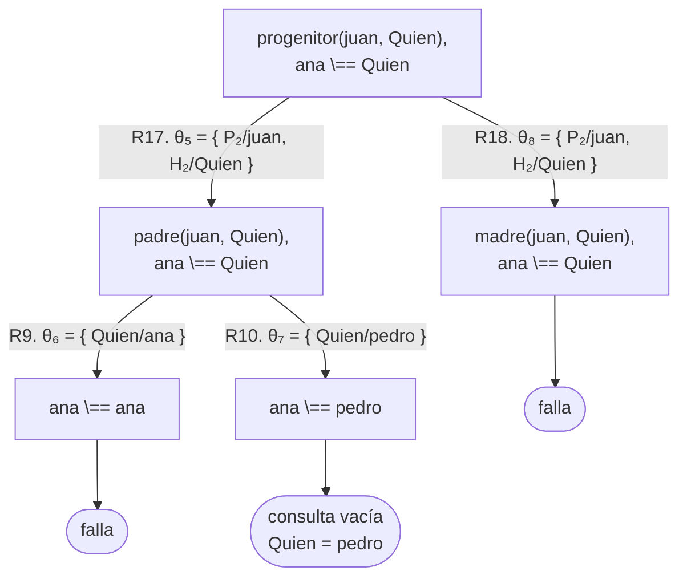
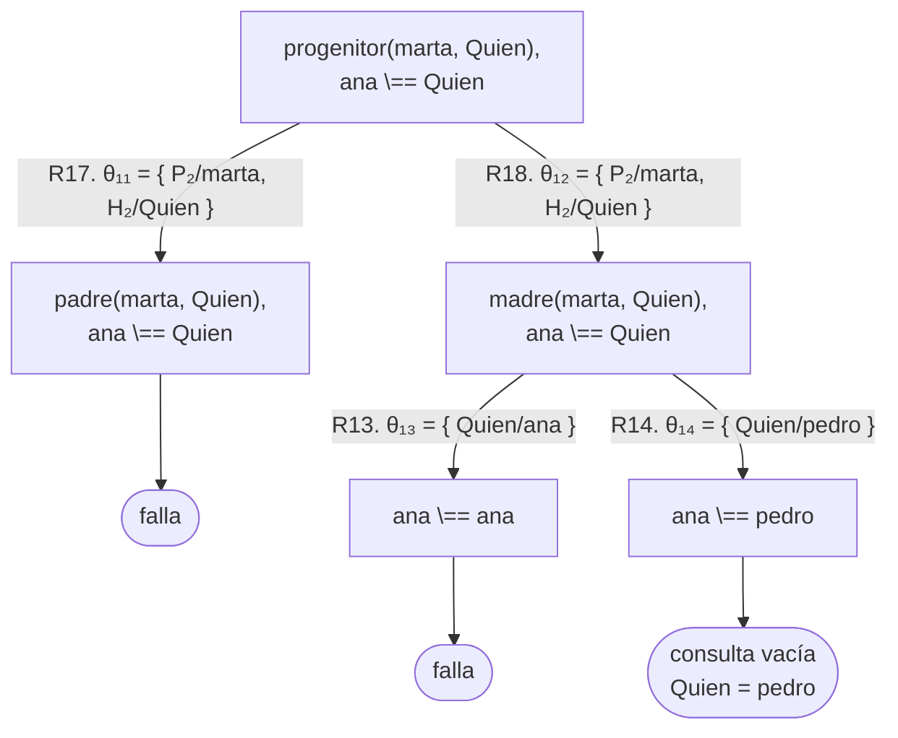
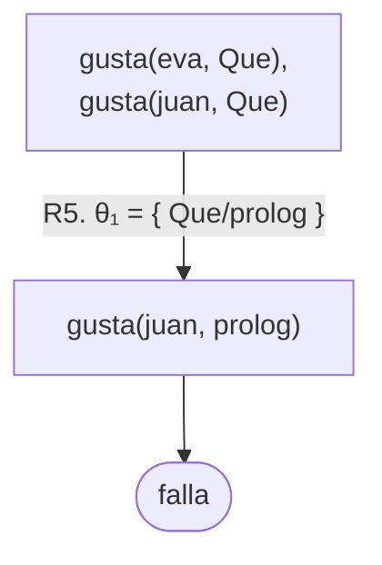
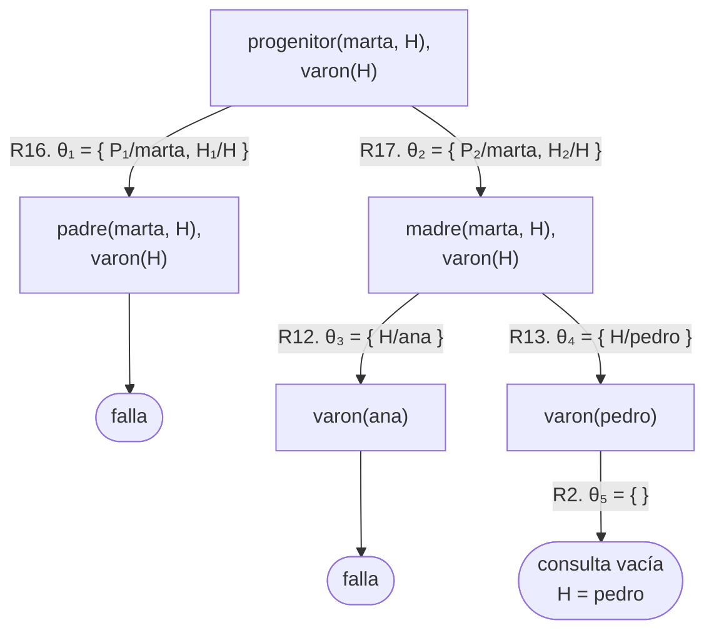

# Soluciones del capítulo 3 — Reglas y conjunciones

El código de esta página está en `ejemplos/capitulo-03/soluciones.pl` y pasa sus
pruebas. Esa base incluye un integrante más que la del capítulo, `tomas`, hijo
de `ana`, para que existan primos en la familia.

## 1

<!-- ejemplo: capitulo-03/soluciones.pl predicado: hijo/2 consulta: hijo(Quien, pedro). -->
```prolog
%!  hijo(?H, ?P) is nondet.
%
%   H es hijo de P. Es progenitor/2 con los argumentos invertidos.
hijo(H, P) :-
    progenitor(P, H).
```

No se requiere ninguna otra condición: `hijo/2` es `progenitor/2` con los
argumentos en orden inverso.

## 2

```prolog
?- abuelo(Quien, luis).
Quien = juan ;
false.

?- abuela(Quien, luis).
Quien = marta ;
false.
```

## 3

"T es tío de S si T es varón, y T es hermano de alguien, y ese alguien es
progenitor de S."

El punto a destacar es que `P` aparece dos veces: el hermano de T y el
progenitor de S deben ser **la misma persona**. Sin esa coincidencia, la regla
afirmaría que cualquier varón que tenga un hermano es tío de cualquier persona
que tenga progenitor.

## 4

<!-- ejemplo: capitulo-03/soluciones.pl predicado: hermano_de/2 consulta: hermano_de(luis, Quien). -->
```prolog
%!  hermano_de(?A, ?B) is nondet.
%
%   A es hermano de B. A \== B es la misma condición de 3.5.
hermano_de(A, B) :-
    varon(A),
    padre(P, A),
    padre(P, B),
    A \== B.
```

`A \== B` es la misma condición de la [sección 3.5](index.md#35-una-regla-que-produce-respuestas-de-mas). Sin ella, luis sería hermano
de sí mismo.

El encabezado es `%! hermano_de(?A, ?B) is nondet.` Los dos argumentos son `?`:
ninguno necesita llegar ligado, porque `varon(A)` y los dos objetivos `padre/2`
les dan valor antes de llegar a `A \== B`. Por eso la comparación va al final,
como en la [sección 3.5](index.md#35-una-regla-que-produce-respuestas-de-mas). Es `nondet` porque la cantidad de respuestas depende de
la consulta: `hermano_de(luis, Quien)` tiene una, `hermano_de(ana, Quien)` no
tiene ninguna, y `hermano_de(A, B)` tiene dos.

## 5

<!-- ejemplo: capitulo-03/soluciones.pl predicado: abuelo_o_abuela/2 abuelo_o_abuela_directo/2 consulta: abuelo_o_abuela(Quien, luis). -->
```prolog
%!  abuelo_o_abuela(?A, ?N) is nondet.
%
%   A es abuelo o abuela de N.
%   Con dos cláusulas: o es abuelo, o es abuela.
abuelo_o_abuela(A, N) :-
    abuelo(A, N).
abuelo_o_abuela(A, N) :-
    abuela(A, N).

%!  abuelo_o_abuela_directo(?A, ?N) is nondet.
%
%   A es abuelo o abuela de N.
%   Con una sola cláusula: dos objetivos progenitor/2, sin considerar el sexo.
abuelo_o_abuela_directo(A, N) :-
    progenitor(A, P),
    progenitor(P, N).
```

Con la base del capítulo, ambas producen las mismas respuestas y en el mismo
orden. Existe, sin embargo, una diferencia: la segunda no consulta `varon/1` ni
`mujer/1`, por lo que también se cumple para una persona cuyo sexo no esté
registrado en la base. La primera, no.

La elección depende de lo que se necesite expresar. Si el programa requiere
distinguir abuelos de abuelas en otra parte, las dos reglas separadas ya lo
resuelven; si esa distinción no se necesita, la regla directa expresa lo mismo
con la mitad de las líneas.

## 6

`?- gusta(ana, Una), gusta(luis, Otra).` produce **dos** respuestas, no una.

A ana le gustan dos cosas y a luis, una: 2 × 1 = 2. Como las variables son
distintas, Prolog no exige que los valores coincidan, y genera todas las
combinaciones. Con `Que` en ambas posiciones, en cambio, se obtiene una sola.

<!-- contexto: capitulo-03/conjunciones.pl -->
```prolog
?- gusta(ana, Una), gusta(luis, Otra).
Una = prolog,
Otra = futbol ;
Una = futbol,
Otra = futbol.
```

El árbol, con los hechos de `gusta/2` numerados como en la
[sección 3.2](index.md#32-que-prueba-prolog-y-en-que-orden), tiene dos ramas y
ninguna falla: sin variable compartida, el segundo objetivo es el mismo en las
dos, `gusta(luis, Otra)`, y se cumple en ambas con R4.



En el árbol de la [sección 3.2](index.md#32-que-prueba-prolog-y-en-que-orden),
en cambio, el segundo objetivo cambia con cada rama, porque hereda el valor de
`Que`, y una de las dos falla.

## 7

<!-- ejemplo: capitulo-03/soluciones.pl predicado: nieto/2 consulta: nieto(Quien, juan). -->
```prolog
%!  nieto(?N, ?A) is nondet.
%
%   N es nieto de A.
nieto(N, A) :-
    abuelo_o_abuela(A, N).
```

La regla no es necesaria: `?- abuelo_o_abuela(juan, Quien).` ya responde quiénes
son los nietos de juan, porque en Prolog una relación se puede consultar en
cualquiera de sus sentidos.

Aun así, definirla se justifica por legibilidad. `nieto(tomas, juan)` expresa la
relación en el sentido en que se la piensa; `abuelo_o_abuela(juan, tomas)`
expresa lo mismo en sentido inverso. Una regla de una línea que mejora la
legibilidad del resto del programa justifica su costo.

El encabezado es `%! nieto(?N, ?A) is nondet.` Los dos argumentos son `?`, como
en `abuelo_o_abuela/2`: la regla solo encadena relaciones que se apoyan en
hechos, sin ningún objetivo que exija un valor, y por eso se puede consultar en
cualquiera de sus sentidos, que es la observación del párrafo anterior. Es
`nondet` porque la cantidad de respuestas varía: juan tiene tres nietos, y
`nieto(Quien, sofia)` no tiene ninguna respuesta.

## 8

<!-- ejemplo: capitulo-03/soluciones.pl predicado: hermana_con_progenitor/2 consulta: hermana_con_progenitor(ana, Quien). -->
```prolog
%!  hermana_con_progenitor(?A, ?B) is nondet.
%
%   A es hermana de B.
%   La regla de 3.5 con progenitor/2: se obtienen respuestas repetidas.
hermana_con_progenitor(A, B) :-
    mujer(A),
    progenitor(P, A),
    progenitor(P, B),
    A \== B.
```

```prolog
?- hermana_con_progenitor(ana, Quien).
Quien = pedro ;
Quien = pedro.
```

La misma respuesta aparece dos veces. No es un error de Prolog: son **dos
demostraciones distintas** de la misma conclusión.

ana y pedro tienen en común el padre *y* la madre. El objetivo
`progenitor(P, ana)` se cumple dos veces —con `P = juan` y con `P = marta`—, y
cada una de esas soluciones conduce a `pedro`. Prolog no elimina respuestas
repetidas: entrega una por cada demostración de la consulta.

Con `padre/2`, como en la [sección 3.5](index.md#35-una-regla-que-produce-respuestas-de-mas), existe una sola demostración, y por eso la
respuesta no se repetía.

El árbol muestra las dos demostraciones. Por su tamaño se dibuja en tres
partes: el tronco, hasta que `P` toma valor, y un subárbol por cada valor. Las
cláusulas de `soluciones.pl` que intervienen, numeradas en el orden del
archivo, son `mujer(ana)` (R6), `padre(juan, ana)` (R9), `padre(juan, pedro)`
(R10), `madre(marta, ana)` (R13), `madre(marta, pedro)` (R14), las dos
cláusulas de `progenitor/2` (R17 y R18) y la regla `hermana_con_progenitor/2`
(R27). Cada llamada a `progenitor/2` emplea una copia nueva de sus variables,
como dice la [sección 3.4](index.md#34-el-alcance-de-una-variable-es-la-clausula):
`P₁` y `H₁` en la primera, `P₂` y `H₂` en la segunda. Las sustituciones se
numeran en el orden del recorrido, y por eso en el tronco `θ₉` y `θ₁₀` vienen
después de las del segundo árbol.



El segundo árbol es la rama de `P = juan`, y empieza en su último nodo:



El tercero es la rama de `P = marta`:



Las dos hojas de éxito dicen lo mismo, `Quien = pedro`, y se alcanzan por
caminos distintos: una por `padre/2`, con `P = juan`, y otra por `madre/2`, con
`P = marta`. En cada subárbol, la rama de `Quien = ana` se cierra en
`ana \== ana`, como en la
[sección 3.5](index.md#35-una-regla-que-produce-respuestas-de-mas).

Es posible eliminar los duplicados, pero requiere herramientas que se presentan
en el [capítulo 17](../capitulo-17-todas-las-soluciones/index.md).

## 9

<!-- ejemplo: capitulo-03/soluciones.pl predicado: hermano_o_hermana/2 primo/2 consulta: primo(tomas, Quien). -->
```prolog
%!  hermano_o_hermana(?A, ?B) is nondet.
%
%   A y B tienen el mismo padre; no se considera el sexo.
hermano_o_hermana(A, B) :-
    padre(P, A),
    padre(P, B),
    A \== B.

%!  primo(?A, ?B) is nondet.
%
%   Un progenitor de A y un progenitor de B son hermanos.
primo(A, B) :-
    progenitor(PA, A),
    progenitor(PB, B),
    hermano_o_hermana(PA, PB).
```

```prolog
?- primo(tomas, Quien).
Quien = luis ;
Quien = eva ;
false.
```

Se requiere `hermano_o_hermana/2`, sin la condición `varon/1`: los progenitores
de dos primos pueden ser dos hermanas, o un hermano y una hermana.

Respecto de que nadie sea primo de sí mismo: **no se requiere ninguna condición
adicional**. Si A y B fueran la misma persona, sus progenitores serían los
mismos, y `hermano_o_hermana/2` ya exige que los dos hermanos sean distintos. La
condición de la [sección 3.5](index.md#35-una-regla-que-produce-respuestas-de-mas), escrita una sola vez, es suficiente para las dos
reglas.

## 10

```prolog
:- begin_tests(hijo).

test(hijos_de_pedro, all(H == [luis, eva])) :-
    hijo(H, pedro).

test(sofia_no_tiene_hijos, [fail]) :-
    hijo(_, sofia).

test(tomas_es_hijo_de_ana) :-
    hijo(tomas, ana).

:- end_tests(hijo).
```

La primera prueba especifica la lista completa de respuestas; la segunda, un
resultado que no debe producirse; la tercera, un caso particular. En conjunto
especifican el comportamiento del predicado con más precisión que cada una por
separado.

## 11

La consulta no produce ninguna respuesta, y la tabla explica por qué:

| Objetivo que se intenta | Qué hace Prolog | Resultado |
|---|---|---|
| `gusta(eva, Que)` | busca de arriba hacia abajo; encuentra `gusta(eva, prolog)` | se cumple, `Que = prolog` |
| `gusta(juan, prolog)` | `Que` ya vale `prolog`; busca ese hecho | falla |
| `gusta(eva, Que)` | retrocede; `Que` **deja de valer** `prolog`; busca otra solución | no hay más |
| — | no quedan alternativas | la consulta falla |

Con `conjunciones.pl` cargado:

<!-- contexto: capitulo-03/conjunciones.pl -->
```prolog
?- gusta(eva, Que), gusta(juan, Que).
false.
```

La tabla es el recorrido de un árbol de tres nodos. Con los hechos de `gusta/2`
numerados como en la [sección 3.2](index.md#32-que-prueba-prolog-y-en-que-orden),
`gusta(eva, prolog)` es R5:



Las dos primeras filas son la única rama; la tercera, el intento de retroceder
a una rama vecina que no existe.

La tercera fila es la que conviene registrar: al retroceder, `Que` vuelve a
estar libre. Si no fuera así, el segundo intento arrastraría el valor del
primero y la búsqueda sería incorrecta.

## 12

| Objetivo que se intenta | Qué hace Prolog | Resultado |
|---|---|---|
| `progenitor(marta, H)` | es una regla: prueba su primera cláusula | subobjetivo `padre(marta, H)` |
| `padre(marta, H)` | busca; marta no figura como padre | falla |
| `progenitor(marta, H)` | prueba la segunda cláusula | subobjetivo `madre(marta, H)` |
| `madre(marta, H)` | encuentra `madre(marta, ana)` | se cumple, `H = ana` |
| `varon(ana)` | busca ese hecho | falla |
| `madre(marta, H)` | retrocede; encuentra `madre(marta, pedro)` | se cumple, `H = pedro` |
| `varon(pedro)` | busca ese hecho | se cumple |

```prolog
?- progenitor(marta, H), varon(H).
H = pedro.
```

La diferencia con el ejercicio anterior está en las dos primeras filas: cuando
el objetivo se resuelve con una regla, Prolog no lo busca entre los hechos sino
que lo reemplaza por el cuerpo de la regla. Esos objetivos nuevos son los
**subobjetivos**, y el retroceso puede llevar tanto a otro hecho como a otra
cláusula de la regla.

En el árbol, esos dos tipos de retroceso son dos tipos de rama vecina. Con las
cláusulas de `reglas.pl` numeradas como en la
[sección 3.3](index.md#33-reglas) —`varon(pedro)` es R2, `madre(marta, ana)`
R12, `madre(marta, pedro)` R13, y las cláusulas de `progenitor/2` R16 y R17—,
de la raíz salen dos ramas, una por cláusula de la regla, y de
`madre(marta, H)` salen otras dos, una por hecho. La `H` de la regla se
renombra `H₁` en el primer uso y `H₂` en el segundo, porque la consulta también
tiene una `H`.



Las siete filas de la tabla son, en orden, la rama de R16, la de R17 hasta
`varon(ana)`, y la de R13 hasta la consulta vacía.

## 13

El defecto es el de la [sección 3.5](index.md#35-una-regla-que-produce-respuestas-de-mas): los dos objetivos pueden satisfacerse con el
**mismo** hecho. Si `A` y `B` son la misma persona, `madre(M, A)` y
`madre(M, B)` se cumplen los dos con la única madre de esa persona, y la regla
concluye que tiene la misma madre que sí misma.

<!-- ejemplo: capitulo-03/soluciones.pl predicado: misma_madre/2 consulta: misma_madre(ana, Quien). -->
```prolog
%!  misma_madre(?A, ?B) is nondet.
%
%   A y B tienen la misma madre y no son la misma persona.
%   Sin el último objetivo, toda persona con madre registrada cumple la
%   relación consigo misma, porque los dos objetivos se satisfacen con el
%   mismo hecho.
misma_madre(A, B) :-
    madre(M, A),
    madre(M, B),
    A \== B.
```

La condición se ubica al final, cuando las dos variables ya tienen valor.

## 14

<!-- ejemplo: capitulo-03/soluciones.pl predicado: tia/2 consulta: tia(Quien, luis). -->
```prolog
%!  tia(?T, ?S) is nondet.
%
%   T es hermana de alguno de los progenitores de S.
tia(T, S) :-
    mujer(T),
    progenitor(P, S),
    hermano_o_hermana(T, P).
```

Se escribe como regla y no como hechos porque la relación **se deduce** de otras
dos que el programa ya tiene: quién es progenitor de quién, y quiénes son
hermanos. Escribirla como hechos obligaría a revisar todos ellos cada vez que
cambia un dato.

La segunda, "cuñadas", no se puede escribir con este programa: requiere la
relación de **cónyuge**, que no está entre sus predicados. El ejercicio consiste
en advertirlo, no en inventarla: una regla solo puede apoyarse en relaciones que
existan.

## 15

Las dos versiones se comparan con dos pruebas `all` que declaran la misma lista
esperada. Si las secuencias difirieran, aunque fuera solo en el orden, una de
las dos pruebas fallaría:

```prolog
test(abuelo_o_abuela_dos_clausulas,
     all(A-N == [juan-tomas, juan-luis, juan-eva, pedro-sofia,
                 marta-tomas, marta-luis, marta-eva])) :-
    abuelo_o_abuela(A, N).

test(abuelo_o_abuela_una_clausula,
     all(A-N == [juan-tomas, juan-luis, juan-eva, pedro-sofia,
                 marta-tomas, marta-luis, marta-eva])) :-
    abuelo_o_abuela_directo(A, N).
```

El par `A-N` es un término compuesto de nombre `-` y dos argumentos, como los
del [capítulo 4](../capitulo-04-terminos-y-unificacion/index.md): sirve para que cada respuesta quede registrada con sus dos
valores juntos, y así comparar las secuencias completas y no solo una columna.
