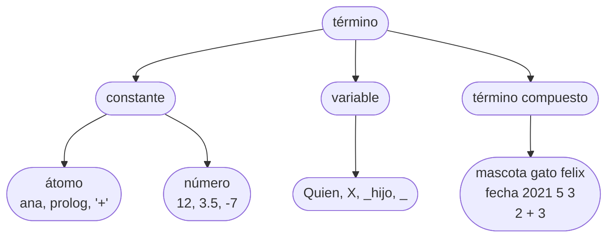

# Capítulo 4 — Términos y unificación

Los tres capítulos anteriores trataron sobre hechos, reglas y consultas. Este
capítulo trata sobre los elementos con los que todos ellos se construyen.

En Prolog existe una única clase de dato: el **término**. Un nombre es un
término, un número es un término, una variable es un término, y
`mascota(gato, felix)` es un término. También lo son un hecho, el cuerpo de una
regla y una consulta.

Existe además una única operación que los relaciona: la **unificación**, que
responde la pregunta "¿pueden estos dos términos hacerse idénticos?". Se la
presentó en el [capítulo 1](../capitulo-01-la-primera-hora/index.md) con el operador `=`, se la usó de manera implícita
cada vez que una consulta encontró un hecho.

## Objetivos del capítulo

Al terminar el capítulo, el lector puede:

- clasificar cualquier elemento escrito en un programa según su clase de
  término;
- escribir átomos que requieren comillas, y determinar cuándo son necesarias;
- interpretar un operador como un término compuesto escrito en otra notación;
- determinar, a partir de dos términos, si unifican y con qué valores, sin
  ejecutar la consulta;
- extraer los componentes de un término con la unificación como única
  herramienta.

!!! info "Tiempo estimado"
    Leer el capítulo, ejecutar sus ejemplos y hacer las actividades: **0:40 h**.
    Resolver los 6 ejercicios marcados con ★: **1:40 h**.
    Resolver los 17 ejercicios del final: **5:25 h**.

## 4.1 Todo es un término

Los términos se clasifican de la siguiente manera:



La clasificación tiene tres ramas. Las secciones siguientes
describen cada una.

## 4.2 Átomos

Un **átomo** es un nombre: no tiene componentes ni valor asociado, y solo es
idéntico a sí mismo. `ana`, `gato` y `prolog` son átomos.

Se escriben de tres maneras:

**Con minúscula inicial.** Los caracteres siguientes pueden ser letras, dígitos
o guiones bajos: `ana`, `gato_persa`, `casa2`.

**Entre comillas simples**, en cuyo caso el nombre puede contener cualquier
carácter:

```prolog
?- X = 'consulta veterinaria'.
X = 'consulta veterinaria'.
```

Las comillas forman parte de la notación, no del átomo. Son necesarias cuando el
nombre contiene espacios, cuando comienza con mayúscula —de lo contrario sería
una variable— o cuando contiene caracteres especiales. Por eso en el [capítulo 1](../capitulo-01-la-primera-hora/index.md)
se escribió `write('Hola, ')`: el espacio y la coma hacen obligatorias las
comillas.

**Como símbolos.** `+`, `-`, `*`, `=` y `<` también son átomos. Esta propiedad es
la base de la [sección 4.6](#46-los-operadores-tambien-son-terminos).

`hola` y `'hola'` son **el mismo átomo**, escrito de dos maneras:

```prolog
?- hola = 'hola'.
true.
```

## 4.3 Números

Existen números enteros —`12`, `-7`, `0`— y números de punto flotante, cuya parte
decimal se separa con punto: `3.5`, `-0.25`.

```prolog
?- X = 3.5.
X = 3.5.
```

La división con `/` produce un resultado de punto flotante cuando el cociente no
es exacto, aunque los dos operandos sean enteros; la división entera se expresa
con otro operador:

```prolog
?- X is 7 / 2.
X = 3.5.

?- X is 7 // 2.
X = 3.
```

Los números son constantes, igual que los átomos: `12` es idéntico a `12`.

## 4.4 Variables

Las variables se usaron en todos los capítulos anteriores. Esta sección enuncia
sus reglas completas.

El nombre de una **variable** comienza con **mayúscula** o con **guion bajo**:
`Quien`, `X`, `Persona`, `_hijo`, `_`. Ese es el único criterio; las variables
no se declaran ni tienen un tipo asociado.

Una variable no es una celda de memoria en la que se almacena un valor: es **un
objeto sin determinar**. Si Prolog encuentra un valor que hace cierta la
consulta, la variable queda **instanciada** —o ligada, el término que se usa en
otros textos— a ese valor, y permanece así hasta que Prolog retrocede y la
desliga.

El nombre elegido para la variable es el que Prolog usa en la respuesta:

```prolog
?- juan = Juan.
Juan = juan.
```

`juan`, con minúscula, es un átomo; `Juan`, con mayúscula, es una variable. La
respuesta indica que, para que los dos términos sean idénticos, `Juan` debe
quedar ligada a `juan`.  Note que el signo `=` no representa la asignación sino unificación. La unificación se puede dar entre dos términos, los cuales pueden estar de cualquier lado del signo igual.

## 4.5 Términos compuestos

Un **término compuesto** es un nombre seguido de argumentos entre paréntesis. Ya
se usaron varios: `padre(juan, ana)` es uno, y `mascota(gato, felix)` es otro.

Se identifica por dos elementos, los mismos que identifican a un predicado:

- el **nombre**, que es un átomo;
- la **aridad**, que es la cantidad de argumentos.

Por eso `mascota(gato, felix)` y `mascota(gato)` son términos distintos, aunque
el nombre coincida:

```prolog
?- mascota(gato, felix) = mascota(gato).
false.
```

Los argumentos son términos de cualquier clase, incluidos otros términos
compuestos. De este modo se construyen datos estructurados:

<!-- ejemplo: capitulo-04/fichas.pl predicado: registro/1 consulta: registro(F). -->
```prolog
% registro(F): F es la ficha de una mascota.
registro(ficha(mascota(gato, felix), fecha(2021, 5, 3), ana)).
registro(ficha(mascota(perro, rocco), fecha(2019, 11, 20), luis)).
registro(ficha(mascota(gato, gaturro), fecha(2023, 2, 14), eva)).
```

Cada ficha es **un único término** que contiene otros dos, `mascota/2` y
`fecha/3`. El anidamiento no tiene límite.

### Un término no es un hecho

`mascota(gato, felix).`, escrito como cláusula del programa y terminado en punto,
es un hecho: afirma una relación o propiedad. El mismo `mascota(gato, felix)`, como argumento de otro término, es un dato.

La diferencia no está en la forma del término, sino en el lugar que ocupa dentro de la estructura sintáctica del lenguaje.

## 4.6 Los operadores también son términos

La siguiente consulta explica varios comportamientos observados en los capítulos
anteriores:

```prolog
?- 2 + 3 = +(2, 3).
true.
```

`2 + 3` **es** un término compuesto de nombre `+` y dos argumentos. La única
diferencia es la notación: el nombre se escribe entre los argumentos (notación
infija) en lugar de delante de ellos, porque resulta más legible. Son dos
notaciones del mismo término, igual que `hola` y `'hola'`.

<!-- ejemplo: capitulo-04/operadores.pl predicado: lados/3 al_reves/2 consulta: lados(2 + 3, Izquierda, Derecha). -->
```prolog
% lados(Suma, A, B): A y B son los dos operandos de la suma.
lados(A + B, A, B).

% al_reves(Suma, Otra): Otra es la misma suma con los operandos intercambiados.
al_reves(A + B, B + A).
```

```prolog
?- lados(2 + 3, Izquierda, Derecha).
Izquierda = 2,
Derecha = 3.
```

Ninguna de las dos cláusulas realiza operaciones aritméticas. Reciben un término
escrito con `+` en notación infija y lo tratan como lo que es: un término
compuesto con dos argumentos.

Con esto se completa la explicación del [capítulo 1](../capitulo-01-la-primera-hora/index.md): `X = 2 + 1` liga `X` al
**término** `2+1`, con sus dos argumentos sin modificar. `is` es el predicado
que recibe ese término, lo evalúa y produce un número. Sin `is` no se realiza
ninguna evaluación.

!!! question "Actividad"
    ¿Qué responde `lados(1 + 2 + 3, Izquierda, Derecha).`? Determinarlo antes de
    ejecutarla: `1 + 2 + 3` debe ser una suma de dos operandos, por lo que uno de
    ellos debe ser, a su vez, una suma.

## 4.7 Unificación: las cuatro reglas

**Unificar** dos términos es determinar si pueden hacerse idénticos, y con qué
valores de sus variables. El operador `=` solicita la unificación de manera
explícita, pero Prolog la realiza continuamente de manera implícita: cada vez
que una consulta busca una cláusula, intenta unificar el objetivo con la cabeza
de esa cláusula.

Las reglas son cuatro, y se aplican examinando los dos términos a la vez:

1. **Dos constantes unifican si son la misma.** `ana` con `ana`, sí; `ana` con
   `eva`, no; `12` con `12`, sí.
2. **Una variable libre unifica con cualquier término**, y queda instanciada con él.
   Si ambos términos son variables, quedan ligadas entre sí: a partir de ese
   momento son la misma variable, aunque todavía no tengan valor.
3. **Dos términos compuestos unifican si** tienen el mismo nombre, la misma
   aridad, y **cada argumento unifica con el argumento correspondiente**. Esta
   regla se aplica de manera recursiva, hasta la profundidad que tengan los
   términos.
4. **Cuando una variable queda ligada a un término, ese término ocupa su lugar
   en todo lo que resta por unificar.** Si `P` quedó ligada a `ana`, cualquier
   aparición posterior de `P` se compara como si dijera `ana`.

La tercera regla permite operar sobre términos con estructura.

!!! warning "Una variable dentro del término con el que se la unifica"
    La regla 2 dice que una variable unifica con cualquier término, y eso
    incluye un término que contiene a esa misma variable:

    ```prolog
    ?- X = mascota(gato, X).
    X = mascota(gato, X).
    ```

    El resultado es un término que se contiene a sí mismo. No es un caso que
    aparezca en este curso, y conviene reconocerlo por si surge: casi siempre
    proviene de haber escrito dos veces el mismo nombre de variable sin
    advertirlo.

## 4.8 La unificación paso a paso

A continuación se resuelve una unificación de manera manual, aplicando las
reglas anteriores:

```prolog
?- mascota(Especie, felix) = mascota(gato, Nombre).
```

1. Ambos son términos compuestos, de nombre `mascota` y aridad 2: se cumplen las
   dos primeras condiciones de la regla 3. Resta unificar los argumentos, uno
   por uno.
2. Primer argumento: `Especie` con `gato`. Uno de los dos es una variable, por
   lo que unifican por la regla 2, y `Especie` queda ligada a `gato`.
3. Segundo argumento: `felix` con `Nombre`. Es el mismo caso, con la variable en
   el otro término: `Nombre` queda ligada a `felix`.
4. No quedan argumentos, y ninguno falló. Los términos unifican.

El resultado coincide con la respuesta de Prolog:

```prolog
?- mascota(Especie, felix) = mascota(gato, Nombre).
Especie = gato,
Nombre = felix.
```

Las variables estaban distribuidas entre los dos términos, una en cada uno. La
ubicación es indistinta: la unificación es simétrica y trata a los dos términos
por igual.

El siguiente ejemplo tiene términos anidados, y aplica la regla 3 dos veces:

```prolog
?- ficha(M, F, ana) = ficha(mascota(gato, felix), fecha(2021, 5, 3), ana).
M = mascota(gato, felix),
F = fecha(2021, 5, 3).
```

El tercer argumento, `ana` con `ana`, unifica por la regla 1. Los otros dos son
variables, y cada una queda ligada al término completo que le corresponde.

En todos los ejemplos anteriores las variables terminaron ligadas a términos sin
variables, y eso puede sugerir que unificar siempre determina todos los valores.
No es así: la unificación liga lo mínimo indispensable para que los dos términos
coincidan, y nada más. En el ejemplo siguiente hay variables en los dos términos,
y una de ellas queda sin valor:

```prolog
?- ficha(M, fecha(A, 5, 3), ana) = ficha(mascota(gato, felix), F, ana).
M = mascota(gato, felix),
F = fecha(A, 5, 3).
```

`M` queda ligada a un término concreto. Pero `A` no recibe ningún valor:
para que los dos términos coincidan alcanza con que `F` sea `fecha(A, 5, 3)`, y
no hay ninguna restricción sobre el año. `A` aparece en la respuesta porque `F` quedó
ligada a un término que la contiene: las dos variables quedaron **ligadas entre
sí**, que es la segunda mitad de la regla 2. Si más adelante `A` recibiera un
valor, `F` lo reflejaría de inmediato.

!!! question "Actividad"
    Sin ejecutarla, determinar qué responde `fecha(A, 5, 3) = fecha(2021, M, 3).`
    y con qué valores. Después, verificarlo.

## 4.9 Una misma variable que aparece dos veces

Este caso requiere especial atención, porque es el origen de una gran parte de
las respuestas inesperadas.

Si una variable aparece **dos veces en el mismo término**, ambas apariciones
deben tener el mismo valor. No es una coincidencia de nombres: es una
restricción.

```prolog
?- padre(P, P) = padre(juan, ana).
false.
```

La unificación falla. El primer argumento
unifica: `P` queda ligada a `juan`. En el segundo argumento interviene la regla
4: `P` ya está ligada, de modo que se la compara como si dijera `juan`, y la
unificación se reduce a determinar si `juan` y `ana` son el mismo átomo. No lo
son.

No hay entonces ninguna regla especial para las variables repetidas: el
comportamiento de esta sección se sigue de aplicar las cuatro reglas de 4.7 en
orden.

Con dos argumentos iguales, la unificación tiene éxito:

```prolog
?- padre(P, P) = padre(juan, juan).
P = juan.
```

Es el mismo mecanismo que operaba en la regla `abuelo/2` del [capítulo 3](../capitulo-03-reglas-y-conjunciones/index.md), donde
la `P` repetida exigía que la persona intermedia fuera la misma en los dos
objetivos. Allí se lo presentó como una condición de la regla; aquí se muestra
su origen.

También explica por qué `hermana/2` producía respuestas de más: los dos
objetivos podían cumplirse con el mismo hecho porque **no** había ninguna
variable repetida que lo impidiera. Por eso fue necesario agregar `\==`.

## 4.10 Extraer los componentes de un término

Con los elementos anteriores ya es posible descomponer términos, sin ningún
mecanismo adicional: se escribe un término con variables en las posiciones de
interés y `_` en las demás, y se lo unifica con el término que se quiere
descomponer.

<!-- ejemplo: capitulo-04/fichas.pl predicado: especie/2 nombre_de/2 nacio_en/2 propietario_de/2 consulta: registro(F), nacio_en(F, Anio). -->
```prolog
% especie(F, E): E es la especie de la mascota de la ficha F.
especie(ficha(mascota(E, _), _, _), E).

% nombre_de(F, N): N es el nombre de la mascota de la ficha F.
nombre_de(ficha(mascota(_, N), _, _), N).

% nacio_en(F, A): A es el año en que nació la mascota de la ficha F.
nacio_en(ficha(_, fecha(A, _, _), _), A).

% propietario_de(F, P): P es el propietario de la mascota de la ficha F.
propietario_de(ficha(_, _, P), P).
```

Ninguna de las cuatro cláusulas tiene cuerpo: son hechos. Todo el trabajo lo
realiza la unificación de la cabeza, cuando Prolog intenta unificar la ficha
recibida con el patrón escrito en la cláusula.

`nacio_en/2` es el ejemplo más claro. Su primer argumento,
`ficha(_, fecha(A, _, _), _)`, es un patrón: no interesan la mascota, el mes, el
día ni el propietario; solo interesa el año. Cuando ese patrón unifica con una
ficha concreta, `A` queda ligada al año y el resto se ignora.

!!! abstract "Plantilla 7 — Extraer un componente de un término"
    **Cuándo**: se dispone de un término con estructura y se necesita uno de sus
    componentes.

    ```prolog
    parte(estructura(_, Componente, _), Componente).
    ```

    Es un hecho, sin cuerpo. En la cabeza se escribe el patrón: variables en las
    posiciones de interés, `_` en todas las demás.

    **En este capítulo se usa en**: `especie/2`, `nacio_en/2` y los demás
    predicados de 4.10, y `lados/3` de 4.6. Las demás plantillas están en
    [esta página](../plantillas.md).

## Ejercicios

Las soluciones están en [la página de soluciones](soluciones.md). La dificultad
va de 1 (se resuelve consultando el capítulo) a 3 (requiere elaboración propia).
Los marcados con ★ son los que no conviene saltear: cubren lo que el capítulo
tiene de propio, y los capítulos siguientes los dan por resueltos.

1. **(1)** ¿Qué clase de término es cada uno? `ana` · `Ana` · `12` · `_` ·
   `mascota(gato, felix)` · `'mi gato'` · `2 + 3`
2. **(1)** ¿Cuáles de los siguientes requieren comillas para ser un átomo, y por
   qué? `gato` · `Gato` · `gato persa` · `gato_persa` · `2gatos`
3. ★ **(1)** Indicar, sin ejecutar, si unifican y con qué valores:
   `mascota(gato, X)` con `mascota(Y, felix)` · `fecha(2021, 5, 3)` con
   `fecha(2021, 5)` · `X` con `fecha(2021, 5, 3)`
4. ★ **(2)** ¿Unifican `padre(juan, X)` y `padre(X, ana)`? Explicar el proceso,
   argumento por argumento.
5. **(2)** Escribir `dia_de(F, D)`, que extrae el día de una ficha, del mismo
   modo que `nacio_en/2` extrae el año.
6. **(2)** Escribir `es_gato(F)`, que se cumple cuando la ficha es de un gato,
   sin usar `especie/2`.
7. **(2)** Con `operadores.pl`: ¿qué responde `al_reves(1 + 2 + 3, X).`?
   Determinarlo a partir de lo visto en 4.6.
8. **(2)** Escribir `producto(T, A, B)`, análogo a `lados/3` pero para `*`.
   Después, escribir `operacion(T, A, B)`, que se cumple para una suma **o** un
   producto.
9. **(3)** Escribir `misma_especie(F1, F2)`, que se cumple cuando dos fichas son
   de la misma especie y no son la misma ficha, y escribir su encabezado: cómo
   puede llegar cada argumento y cuántas respuestas produce.
10. **(3)** ¿Por qué `mascota(gato, felix) = mascota(gato, felix)` responde
    `true.` sin instanciar ninguna variable? Explicarlo con las reglas de 4.7.
11. ★ **(1)** Para cada par, decidir si unifica y, en caso afirmativo, escribir
    qué valor toma cada variable. Indicar además cuál de las cuatro reglas de
    4.7 decide cada caso:

    a. `ana` con `ana`
    b. `ana` con `Persona`
    c. `12` con `12.0`
    d. `mascota(gato, felix)` con `mascota(gato, gaturro)`
    e. `mascota(E, N)` con `mascota(perro, rocco)`
    f. `fecha(A, M, D)` con `fecha(2021, 5, 3)`
    g. `ficha(M, F, ana)` con `ficha(mascota(gato, felix), F2, P)`
12. ★ **(2)** El mismo ejercicio, con pares que requieren la regla 4, porque una
    variable aparece más de una vez:

    a. `par(X, X)` con `par(ana, ana)`
    b. `par(X, X)` con `par(ana, eva)`
    c. `par(X, Y)` con `par(ana, ana)`
    d. `f(X, g(X))` con `f(ana, g(ana))`
    e. `f(X, g(X))` con `f(ana, g(eva))`
    f. `f(X, X)` con `f(Y, ana)`
13. ★ **(2)** Escribir `propietario_y_especie(F, P, E)`, que extrae de una ficha
    el propietario y la especie de la mascota, en una sola cláusula y sin
    cuerpo. Es la plantilla 7 con dos componentes en lugar de uno.
14. **(2)** Escribir `ficha_de/2`, con el encabezado
    `%! ficha_de(?P, ?F) is nondet.`, que se cumple cuando `F` es un registro
    cuyo propietario es `P`. Después ejecutar `ficha_de(ana, F).` y explicar por
    qué la respuesta muestra el término completo.
15. **(2)** ¿Cuál es el nombre y la aridad de cada uno de estos términos?
    `mascota(gato, felix)` · `2 + 3` · `ana` · `fecha(2021, 5, 3)` ·
    `-(5)` · `[ana]`. El último se retoma en el [capítulo 7](../capitulo-07-listas/index.md); conviene anotar la
    respuesta ahora y verificarla entonces.
16. ★ **(3)** Sin ejecutarla, determinar qué responde
    `?- ficha(M, F, ana) = ficha(mascota(E, felix), fecha(2021, Mes, 3), P).`
    Prestar atención a cuáles variables quedan con valor y cuáles quedan ligadas
    a otra variable.
17. **(3)** Escribir `mismo_propietario/2`, con el encabezado
    `%! mismo_propietario(?F1, ?F2) is nondet.`, usando la plantilla 7 y la
    condición de la plantilla 6. Después, explicar por qué no alcanza con
    escribir la misma variable dos veces en la cabeza.

## Resumen

| | |
|---|---|
| **término** | todo elemento que se escribe en un programa; hay tres clases |
| **constante** | un átomo o un número |
| **átomo** | un nombre: `ana`, `'mi gato'`, `+` |
| **número** | entero o de punto flotante: `12`, `3.5` |
| **variable** | comienza con mayúscula o `_` |
| **término compuesto** | un nombre con argumentos: `mascota(gato, felix)` |
| **nombre y aridad** | los dos elementos que identifican a un término compuesto |
| **unificar** | ¿pueden estos dos términos hacerse idénticos, y con qué valores? |
| `=` | solicita una unificación de manera explícita |
| `//` | división entera, a diferencia de `/`, que puede producir punto flotante |

Las cuatro reglas de la unificación: dos constantes unifican si son la misma;
una variable libre unifica con cualquier término y queda instanciada; dos términos
compuestos unifican si tienen el mismo nombre, la misma aridad, y sus argumentos
unifican de a pares; y una variable ya ligada se compara como si dijera el
término al que se ligó.

## Temas que se retoman

| Tema | Se retoma en |
|---|---|
| La unificación dentro de la búsqueda, representada paso a paso | [capítulo 5](../capitulo-05-como-responde-prolog/index.md) |
| Construcción y descomposición de términos mediante recursión | [capítulo 6](../capitulo-06-recursion/index.md) |
| Las listas, que son términos compuestos con notación propia | [capítulo 7](../capitulo-07-listas/index.md) |
| `is` y la diferencia entre el término `2+3` y el número `5` | [capítulo 8](../capitulo-08-aritmetica/index.md) |
| `==` y `\==`, similares a `=` pero con otro significado | [capítulo 10](../capitulo-10-negacion-como-falla/index.md) |
| Inspección de un término cuya forma no se conoce de antemano | [capítulo 24](../capitulo-24-inspeccion-de-terminos/index.md) |
