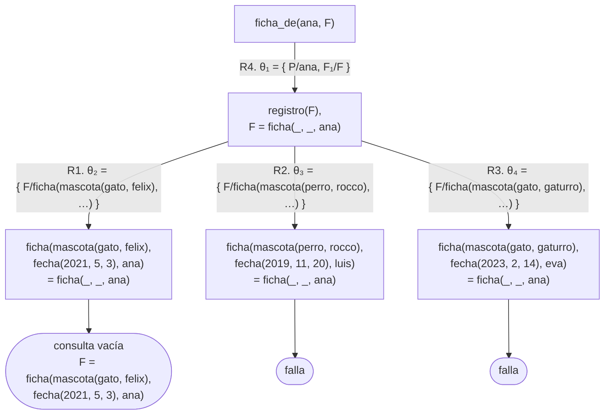

# Soluciones del capítulo 4 — Términos y unificación

El código de esta página está en `ejemplos/capitulo-04/soluciones.pl` y pasa sus
pruebas.

## 1

| | |
|---|---|
| `ana` | átomo (constante) |
| `Ana` | variable |
| `12` | número (constante) |
| `_` | variable anónima |
| `mascota(gato, felix)` | término compuesto |
| `'mi gato'` | átomo, escrito entre comillas porque contiene un espacio |
| `2 + 3` | término compuesto, escrito en notación infija |

## 2

- `gato` — no las requiere: comienza con minúscula y continúa con letras.
- `Gato` — **sí**: con mayúscula inicial sería una variable.
- `gato persa` — **sí**: el espacio separa el nombre en dos.
- `gato_persa` — no: el guion bajo está permitido.
- `2gatos` — **sí**: un átomo sin comillas no puede comenzar con un dígito.

## 3

- `mascota(gato, X)` con `mascota(Y, felix)`: **unifican**, con `Y = gato` y
  `X = felix`. Las variables están distribuidas entre los dos términos, lo que
  no afecta el resultado.
- `fecha(2021, 5, 3)` con `fecha(2021, 5)`: **no unifican**. Tienen el mismo
  nombre pero distinta aridad, y la regla 3 exige ambas coincidencias.
- `X` con `fecha(2021, 5, 3)`: **unifican**, y `X` queda ligada al término
  completo.

## 4

No unifican.

```prolog
?- padre(juan, X) = padre(X, ana).
false.
```

Argumento por argumento: el primero es `juan` con `X`, y `X` queda ligada a
`juan`. El segundo es `X` con `ana`, pero `X` ya no está libre: está ligada a
`juan`. La unificación se reduce entonces a determinar si `juan` y `ana` son el
mismo átomo, y no lo son.

Es el caso de la [sección 4.9](index.md#49-una-misma-variable-que-aparece-dos-veces), con las apariciones de la variable distribuidas
entre los dos términos: la restricción se aplica de la misma manera.

## 5

<!-- ejemplo: capitulo-04/soluciones.pl predicado: dia_de/2 consulta: dia_de(ficha(mascota(gato, felix), fecha(2021, 5, 3), ana), D). -->
```prolog
% dia_de(F, D): D es el día en que nació la mascota de la ficha F.
dia_de(ficha(_, fecha(_, _, D), _), D).
```

El patrón es el de `nacio_en/2`, con la variable en otra posición: el día es el
tercer argumento de `fecha/3`.

## 6

<!-- ejemplo: capitulo-04/soluciones.pl predicado: es_gato/1 consulta: registro(F), es_gato(F). -->
```prolog
% es_gato(F): la ficha F es de un gato. El patrón fija gato como especie.
es_gato(ficha(mascota(gato, _), _, _)).
```

En lugar de extraer la especie y compararla después, se escribe `gato`
directamente en el patrón. Si la ficha es de un gato, unifica; en caso
contrario, no. La comparación la realiza la propia unificación.

## 7

`al_reves/2` es el de `operadores.pl`:

```prolog
?- al_reves(1 + 2 + 3, X).
X = 3+(1+2).
```

`1 + 2 + 3` es una suma de dos operandos: `1 + 2` y `3`. `al_reves/2` los
intercambia completos, sin examinar su estructura interna, de modo que el
operando `1 + 2` pasa íntegro a la otra posición.

## 8

<!-- ejemplo: capitulo-04/soluciones.pl predicado: producto/3 operacion/3 consulta: operacion(2 + 3, A, B). -->
```prolog
% producto(T, A, B): A y B son los dos operandos del producto T.
producto(A * B, A, B).

% operacion(T, A, B): T es una suma o un producto de A y B.
operacion(A + B, A, B).
operacion(A * B, A, B).
```

`operacion/3` tiene dos cláusulas, de acuerdo con la plantilla 4: se cumple para
una suma **o** para un producto.

## 9

<!-- ejemplo: capitulo-04/soluciones.pl predicado: misma_especie/2 consulta: misma_especie(F1, F2). -->
```prolog
%!  misma_especie(?F1, ?F2) is nondet.
%
%   F1 y F2 son dos fichas distintas de la misma especie.
misma_especie(F1, F2) :-
    registro(F1),
    registro(F2),
    especie(F1, E),
    especie(F2, E),
    F1 \== F2.
```

`F1 \== F2` es una aplicación de la plantilla 6. Sin esa condición, cada ficha
sería de la misma especie que ella misma: es el defecto del [capítulo 3](../capitulo-03-reglas-y-conjunciones/index.md) en otro
contexto.

Las respuestas aparecen en los dos órdenes —felix con gaturro, y gaturro con felix—,
porque la regla no establece ninguna condición sobre el orden.

Los dos argumentos son `?`: pueden llegar libres, porque `registro(F1)` y
`registro(F2)` los generan a partir de la base, y si llegan ligados esos mismos
objetivos verifican que sean fichas registradas. La cantidad de respuestas es
`nondet`: puede haber varios pares, o ninguno, como ocurre cuando `F1` es la
ficha de rocco, el único perro.

## 10

Porque no hay ninguna variable que instanciar. Las reglas se aplican así:

1. Ambos son términos compuestos de nombre `mascota` y aridad 2, por lo que
   resta unificar los argumentos.
2. Primer argumento: `gato` con `gato`. Son dos constantes, y son la misma:
   unifican por la regla 1, sin ligar ninguna variable.
3. Segundo argumento: `felix` con `felix`; es el mismo caso.
4. Ningún argumento falló, por lo que los términos unifican.

La regla 2, la de las variables, no se aplica en ningún paso. Unificar no
significa "asignar valores": significa "pueden hacerse idénticos". En algunos
casos la respuesta es afirmativa y no queda ninguna ligadura por informar.

## 11

| Par | ¿Unifica? | Valores | Regla |
|---|---|---|---|
| `ana` — `ana` | sí | ninguno | 1 |
| `ana` — `Persona` | sí | `Persona = ana` | 2 |
| `12` — `12.0` | **no** | — | 1 |
| `mascota(gato, felix)` — `mascota(gato, gaturro)` | no | — | 3, y dentro 1 |
| `mascota(E, N)` — `mascota(perro, rocco)` | sí | `E = perro`, `N = rocco` | 3, y dentro 2 |
| `fecha(A, M, D)` — `fecha(2021, 5, 3)` | sí | `A = 2021`, `M = 5`, `D = 3` | 3, y dentro 2 |
| `ficha(M, F, ana)` — `ficha(mascota(gato, felix), F2, P)` | sí | `M = mascota(gato, felix)`, `F = F2`, `P = ana` | 3, y dentro 1 y 2 |

El tercer caso es el que conviene retener: `12` y `12.0` son términos distintos,
un entero y un número de punto flotante, y la regla 1 exige que sean **el
mismo**. El [capítulo 8](../capitulo-08-aritmetica/index.md) retoma la diferencia entre unificar y comparar valores.

En el último, `F` y `F2` quedan ligadas entre sí sin que ninguna tenga valor: es
la segunda mitad de la regla 2.

## 12

| Par | ¿Unifica? | Valores |
|---|---|---|
| `par(X, X)` — `par(ana, ana)` | sí | `X = ana` |
| `par(X, X)` — `par(ana, eva)` | **no** | — |
| `par(X, Y)` — `par(ana, ana)` | sí | `X = ana`, `Y = ana` |
| `f(X, g(X))` — `f(ana, g(ana))` | sí | `X = ana` |
| `f(X, g(X))` — `f(ana, g(eva))` | **no** | — |
| `f(X, X)` — `f(Y, ana)` | sí | `X = Y`, `Y = ana` |
| `terna(X, Y, Z)` — `terna(M, M, M)` | sí | `X = Y`, `Y = Z`, `Z = M` |

Los dos casos que fallan lo hacen por la regla 4: al llegar al segundo
argumento, `X` ya está ligada a `ana`, de modo que se la compara como si dijera
`ana`, y `ana` no es `eva`.

El tercero muestra la diferencia con el primero: dos variables **distintas**
pueden tomar el mismo valor sin que nada lo exija; lo que la repetición de un
nombre impone es que el valor sea el mismo, no que sean dos nombres distintos.

En el sexto, las dos variables se ligan entre sí al comparar el primer
argumento, y al llegar al segundo, ligar una liga a la otra. SWI lo muestra
escribiendo `X = Y, Y = ana`.

En el séptimo ninguna variable recibe un valor. Al comparar el primer argumento,
`X` queda ligada a `M`; al comparar el segundo, `Y` queda ligada a `M`, que ya
es la misma variable que `X`; al comparar el tercero ocurre lo mismo con `Z`. Las
cuatro variables quedan ligadas entre sí, y SWI lo muestra como una cadena de
igualdades:

```prolog
?- terna(X, Y, Z) = terna(M, M, M).
X = Y, Y = Z, Z = M.
```

Si más adelante cualquiera de las cuatro toma un valor, las otras tres lo
comparten.

## 13

<!-- ejemplo: capitulo-04/soluciones.pl predicado: propietario_y_especie/3 consulta: propietario_y_especie(ficha(mascota(gato, felix), fecha(2021, 5, 3), ana), P, E). -->
```prolog
% propietario_y_especie(F, P, E): P es el propietario de la ficha F y E la
% especie de su mascota. Es la plantilla 7 con dos componentes.
propietario_y_especie(ficha(mascota(E, _), _, P), P, E).
```

Un solo hecho, sin cuerpo. La plantilla 7 no se limita a un componente: se
escriben variables en todas las posiciones de interés, a la profundidad que
haga falta, y `_` en las demás. En este caso `E` está dos niveles adentro.

## 14

<!-- ejemplo: capitulo-04/soluciones.pl predicado: ficha_de/2 consulta: ficha_de(ana, F). -->
```prolog
%!  ficha_de(?P, ?F) is nondet.
%
%   F es un registro cuyo propietario es P.
ficha_de(P, F) :-
    registro(F),
    F = ficha(_, _, P).
```

```prolog
?- ficha_de(ana, F).
F = ficha(mascota(gato, felix), fecha(2021, 5, 3), ana) ;
false.
```

La respuesta muestra el término completo porque eso es lo que `F` vale: una
ficha entera. Una variable no se liga a "una parte" de un término; se liga al
término que le corresponde, y ese término puede tener la estructura que sea.

El árbol de la consulta, con la notación de la
[sección 5.2](../capitulo-05-como-responde-prolog/index.md#52-el-arbol-de-derivacion),
explica también el `false.` final. Los hechos de `registro/1` se numeran R1 a R3, como en la
[sección 4.10](index.md#410-extraer-los-componentes-de-un-termino), y la regla
`ficha_de/2` es R4; la copia de la regla renombra su `F` como `F₁` para no
confundirla con la `F` de la consulta. El `=` es un objetivo predefinido: su
flecha no lleva número de cláusula.



`registro(F)` genera las tres fichas, y `F = ficha(_, _, ana)` cierra dos: las
de `luis` y `eva` no unifican con el patrón, porque `luis` y `eva` no son `ana`.
La respuesta está en la primera rama; las otras dos quedan pendientes, y por eso
la respuesta termina en `;`. Al pedir otra, Prolog las recorre, las dos fallan, y
responde `false.`.

## 15

| Término | Nombre | Aridad |
|---|---|---|
| `mascota(gato, felix)` | `mascota` | 2 |
| `2 + 3` | `+` | 2 |
| `ana` | — | es una constante, no tiene aridad |
| `fecha(2021, 5, 3)` | `fecha` | 3 |
| `-(5)` | `-` | 1 |
| `[ana]` | `'[\|]'` | 2 |

`-(5)` es el mismo signo menos de `5 - 3`, con un solo argumento: nombre y
aridad identifican al término, y `-/1` y `-/2` son dos términos distintos.

`[ana]` es un término compuesto como los demás, y su nombre no es `[]`. El
[capítulo 7](../capitulo-07-listas/index.md) lo desarrolla; por ahora alcanza con haber anotado que una lista no
es una clase de término aparte.

## 16

```prolog
?- ficha(M, F, ana) = ficha(mascota(E, felix), fecha(2021, Mes, 3), P).
M = mascota(E, felix),
F = fecha(2021, Mes, 3),
P = ana.
```

`P` recibe un valor concreto, `ana`. `M` y `F` quedan ligadas a términos que
**contienen variables sin valor**, `E` y `Mes`: para que los dos términos
coincidan no hace falta saber la especie ni el mes. Si más adelante `E`
recibiera un valor, `M` lo reflejaría, porque son el mismo término.

## 17

<!-- ejemplo: capitulo-04/soluciones.pl predicado: mismo_propietario/2 consulta: mismo_propietario(F1, F2). -->
```prolog
%!  mismo_propietario(?F1, ?F2) is nondet.
%
%   F1 y F2 son dos fichas distintas con el mismo propietario.
mismo_propietario(F1, F2) :-
    registro(F1),
    registro(F2),
    F1 = ficha(_, _, P),
    F2 = ficha(_, _, P),
    F1 \== F2.
```

La repetición de `P` es la que exige que el propietario sea el mismo, y `\==`
la que evita que una ficha se empareje consigo misma.

No alcanza con escribir la misma variable dos veces en la cabeza porque el
predicado recibe **dos fichas**, no una: repetir una variable dentro de un mismo
término exige que dos posiciones de ese término coincidan, y en este caso se
debe comparar una posición de un término con una posición de otro. Para eso se
necesita un objetivo en el cuerpo.

Sobre los tres registros del capítulo no hay ningún par que cumpla la relación,
de modo que la consulta responde `false.`: cada ficha tiene un propietario
distinto.
