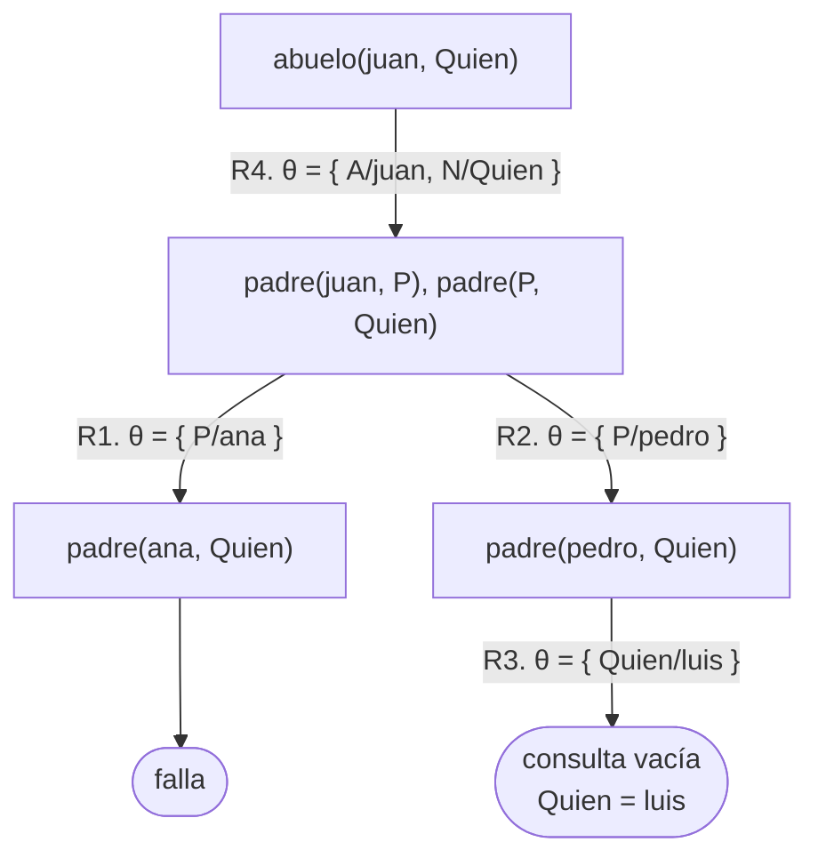
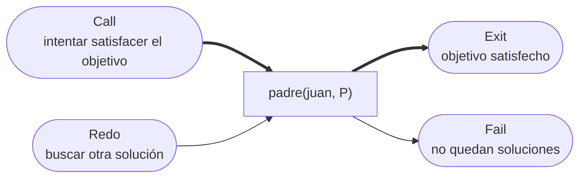

# Capítulo 5 — Cómo responde Prolog

En los capítulos anteriores se formularon consultas y se observaron sus
respuestas. En el capítulo 3 se siguió una consulta paso a paso, y en el
capítulo 1 se vieron esos mismos pasos registrados por `trace`. Este capítulo
integra ambos enfoques y les da una representación: el **árbol de derivación**,
que es el diagrama de todo lo que Prolog intenta para responder una consulta.

El árbol tiene dos aplicaciones prácticas. La primera es explicar por qué las
respuestas se obtienen en un orden determinado. La segunda, más importante, es
explicar por qué en algunos casos **no se obtiene ninguna** y la ejecución no
termina.

## Objetivos del capítulo

Al terminar el capítulo, el lector puede:

- dibujar de manera manual el árbol de derivación de una consulta simple;
- comparar ese diagrama con la salida de `trace` e identificar cada paso, y
  relacionar ambos con el modelo de cajas;
- explicar por qué el orden de dos cláusulas determina el orden de las
  respuestas;
- explicar por qué el orden de dos objetivos no modifica las respuestas pero sí
  la cantidad de trabajo;
- reconocer, a partir de su árbol, un programa que no termina.

!!! info "Tiempo estimado"
    Leer el capítulo, ejecutar sus ejemplos y hacer las actividades: **0:40 h**.
    Resolver los 6 ejercicios marcados con ★: **2:00 h**.
    Resolver los 15 ejercicios del final: **5:00 h**.

## 5.1 Dos órdenes

Prolog no selecciona una estrategia de búsqueda óptima. Aplica siempre la misma
estrategia, definida por dos reglas:

- entre los **objetivos** de un cuerpo o de una consulta, procede de **izquierda
  a derecha**;
- entre las **cláusulas** de un predicado, procede de **arriba hacia abajo**, en
  el orden en que están escritas en el archivo.

Todo el comportamiento de Prolog se deriva de esas dos reglas y del
backtracking: cuando un objetivo falla, la ejecución retrocede a la última
decisión tomada e intenta la alternativa siguiente.

Que el orden sea fijo tiene una consecuencia directa: **el orden de búsqueda
queda determinado por quien escribe el programa**. Dos programas con el mismo
significado lógico pueden comportarse de manera muy distinta según el orden de
sus cláusulas y objetivos. Las secciones 5.4 y 5.5 lo muestran, y el capítulo 14
lo retoma desde el punto de vista del rendimiento.

Los dos órdenes no son simétricos, y conviene distinguirlos desde ahora porque
las secciones que siguen tratan uno y otro:

- **el orden de los objetivos decide cómo es el árbol.** Cambiarlo produce un
  árbol distinto, con otra cantidad de nodos, y por eso cambia el trabajo;
- **el orden de las cláusulas no cambia el árbol.** Produce el mismo árbol con
  las ramas en otro orden, y por eso cambia el orden en que se obtienen las
  respuestas, no cuáles son.

## 5.2 El árbol de derivación

El ejemplo usa un programa deliberadamente reducido:

<!-- ejemplo: capitulo-05/busqueda.pl predicado: padre/2 abuelo/2 consulta: abuelo(juan, Quien). -->
```prolog
% padre(P, H): P es el padre de H.
padre(juan, ana).
padre(juan, pedro).
padre(pedro, luis).

% abuelo(A, N): A es abuelo de N.
abuelo(A, N) :-
    padre(A, P),
    padre(P, N).
```

La consulta es `?- abuelo(juan, Quien).`

Para poder referirse a cada cláusula por separado, conviene numerarlas:

| | |
|---|---|
| R1 | `padre(juan, ana).` |
| R2 | `padre(juan, pedro).` |
| R3 | `padre(pedro, luis).` |
| R4 | `abuelo(A, N) :- padre(A, P), padre(P, N).` |

Un **árbol de derivación** se construye de la siguiente manera:

- cada **nodo es una consulta**: los objetivos que a Prolog le resta probar en
  ese momento. La raíz es la consulta inicial, y el árbol crece hacia abajo;
- cada **arco** corresponde al uso de una cláusula, y lleva dos datos: la
  cláusula empleada y la **sustitución** que unifica el objetivo seleccionado
  con la cabeza de esa cláusula. La sustitución se escribe
  `θ = { Variable/valor }`, y se lee "la variable toma ese valor";
- una rama **termina en éxito** cuando se llega a la **consulta vacía**: no
  queda ningún objetivo por probar;
- una rama **falla** cuando el objetivo seleccionado no unifica con la cabeza de
  ninguna cláusula.



El árbol se lee de arriba hacia abajo y de izquierda a derecha, que es el orden
en que Prolog lo recorre:

1. La raíz es la consulta inicial. La única cláusula cuya cabeza unifica con
   `abuelo(juan, Quien)` es R4, con `θ = { A/juan, N/Quien }`. La consulta
   siguiente se obtiene con **dos** operaciones, no con una: se reemplaza el
   objetivo por el cuerpo de la cláusula, y se **aplica θ a todos los objetivos
   que quedan**. Por eso el nodo hijo dice `padre(juan, P), padre(P, Quien)` y
   no `padre(A, P), padre(P, N)`. Esa operación es la única operación de
   inferencia de Prolog, y se denomina **resolución**.
2. El primer objetivo, `padre(juan, P)`, unifica con la cabeza de R1 y con la de
   R2. Dos cláusulas producen dos ramas. Prolog toma la de la izquierda, la de
   R1, porque esa cláusula está escrita antes.
3. Aplicada `θ = { P/ana }`, la consulta que queda es `padre(ana, Quien)`.
   Ninguna cláusula tiene una cabeza que unifique con ese objetivo: la rama
   **falla**.
4. Prolog retrocede al último punto donde quedaba una alternativa sin explorar
   —esto es el backtracking— y desciende por la otra rama, la de R2.
5. La consulta que queda es `padre(pedro, Quien)`, que unifica con la cabeza de
   R3 con `θ = { Quien/luis }`. No queda ningún objetivo por probar: se llegó a
   la **consulta vacía**, y la rama termina en éxito.

!!! note "Cada uso de una cláusula emplea variables nuevas"
    Las variables `A`, `N` y `P` de R4 no son las mismas en dos usos distintos
    de esa cláusula: cada vez que Prolog emplea una cláusula, toma una copia con
    variables nuevas. Acá R4 se usa una sola vez y la distinción no se nota,
    pero es la que explica que en el capítulo 6, donde una misma cláusula se usa
    muchas veces, cada uso tenga sus propias variables. También explica los
    identificadores como `_8106` de la sección siguiente: son los nombres que
    Prolog le da a esas copias.

Tres observaciones sobre el diagrama:

- **una hoja de éxito es una respuesta.** Si el árbol tuviera tres hojas de
  éxito, la consulta tendría tres respuestas, que se obtendrían en el orden en
  que las hojas aparecen de izquierda a derecha.
- **la respuesta se expresa en las variables de la consulta.** Al llegar a la
  consulta vacía se juntan todas las sustituciones de la rama:
  `{ A/juan, N/Quien }`, `{ P/pedro }` y `{ Quien/luis }`. De ese conjunto, la
  respuesta conserva únicamente lo que les corresponde a las variables que
  escribió quien consultó. `Quien` quedó ligada a `luis`, y por eso la respuesta
  es `Quien = luis`. `A`, `N` y `P` eran variables de R4, no de la consulta, y
  por eso no aparecen.
- **las ramas que fallan tienen costo**: representan trabajo que Prolog realizó.
  La rama de `ana` no produjo ninguna respuesta, pero recorrerla requirió el
  mismo esfuerzo que una rama exitosa.

!!! question "Actividad"
    Dibujar el árbol de `?- abuelo(Quien, luis).` sobre el mismo programa.
    ¿Cuántas ramas salen del primer objetivo, y por qué son más que en el caso
    anterior?

## 5.3 El mismo recorrido, registrado por `trace`

El árbol es un diagrama que construye quien analiza el programa. `trace`
registra el mismo recorrido desde la ejecución real. Conviene compararlos una
vez, porque cumplen funciones complementarias: el árbol sirve para razonar, y la
traza, para verificar.

```prolog
   Call: (10) abuelo(juan, _8106)
   Call: (11) padre(juan, _8960)
   Exit: (11) padre(juan, ana)
   Call: (11) padre(ana, _8106)
   Fail: (11) padre(ana, _8106)
   Redo: (11) padre(juan, _8960)
   Exit: (11) padre(juan, pedro)
   Call: (11) padre(pedro, _8106)
   Exit: (11) padre(pedro, luis)
   Exit: (10) abuelo(juan, luis)
```

Correspondencia entre cada línea de la traza y el árbol:

| Traza | En el árbol |
|---|---|
| `Call: abuelo(juan, _)` | la raíz |
| `Call: padre(juan, _)` | se desciende al cuerpo de la regla, primer objetivo |
| `Exit: padre(juan, ana)` | se toma la rama de la izquierda |
| `Call/Fail: padre(ana, _)` | la rama de `ana` falla |
| `Redo: padre(juan, _)` | backtracking: se retrocede y se intenta la otra rama |
| `Exit: padre(juan, pedro)` | la rama de `pedro` |
| `Exit: padre(pedro, luis)` | la hoja de éxito |
| `Exit: abuelo(juan, luis)` | la respuesta se propaga hasta la raíz |

Los identificadores como `_8106` son variables que todavía no tienen valor: son
las copias con variables nuevas que Prolog crea cada vez que emplea una
cláusula. El número es interno, cambia de una ejecución a otra y no tiene
significado en sí mismo. Lo significativo es el momento en que una variable deja
de mostrarse así: en la última línea ya aparece `luis`.

Esto explica un detalle del diagrama: el árbol no tiene una rama para el último
`Exit`. Las respuestas no descienden: **ascienden**. Prolog encontró `luis` en
una hoja, y esa ligadura se propagó hasta la raíz, que es la que produce la
respuesta. Dicho con las sustituciones de la sección anterior: la respuesta es
lo que les corresponde a las variables de la consulta inicial, una vez juntadas
todas las sustituciones de la rama.

### El modelo de cajas

La traza y el árbol describen el mismo recorrido, y hay un tercer diagrama que
los vincula. Los cuatro eventos de la traza —Call, Exit, Fail y Redo, que el
capítulo 1 presentó al leerla— no son independientes: son las cuatro **puertas**
de una misma caja. El modelo se debe a Lawrence Byrd, y se lo conoce como
*modelo de cajas de Byrd*. Cada objetivo del programa se representa como una
caja:



La caja tiene dos entradas y dos salidas. Se entra por **Call** cuando la
ejecución llega al objetivo por primera vez, y se sale por **Exit** cuando el
objetivo se pudo satisfacer: son las flechas gruesas, las del avance de la
ejecución.

Las otras dos corresponden al retroceso. Si un objetivo posterior falla, la
ejecución retrocede e ingresa nuevamente a la caja, por **Redo**, para solicitar
otra solución. Si la caja encuentra otra, sale nuevamente por Exit; si no le
queda ninguna, sale por **Fail**, y el retroceso continúa en el objetivo
anterior.

Con este modelo, la traza se lee como un recorrido por las puertas de varias
cajas anidadas: la caja de `abuelo(juan, Quien)` contiene las de
`padre(juan, P)` y `padre(P, Quien)`. El número entre paréntesis de cada línea
—el `(10)` y el `(11)`— indica a qué caja pertenece el evento y a qué
profundidad se encuentra.

Los tres diagramas dicen lo mismo con distinto énfasis, y conviene tenerlos
juntos una vez:

| | Qué muestra mejor |
|---|---|
| el **árbol** | todas las alternativas a la vez, incluidas las que no se recorrieron |
| la **traza** | el orden exacto en que ocurrieron los pasos |
| las **cajas** | por dónde entra y sale la ejecución de **un** objetivo |

El modelo de cajas se retoma en el capítulo 9, donde se muestra que el corte
inhabilita la puerta Redo de algunas cajas, y en el capítulo 23, junto con las
demás herramientas para examinar un programa en ejecución.

## 5.4 El orden de las cláusulas determina el orden de las respuestas

El ejemplo siguiente contiene las mismas dos cláusulas, escritas en los dos
órdenes posibles:

<!-- ejemplo: capitulo-05/orden.pl predicado: antepasado/2 primero_lejos/2 consulta: antepasado(juan, Quien). -->
```prolog
% antepasado(A, D): con el caso base escrito primero.
antepasado(A, D) :-
    padre(A, D).
antepasado(A, D) :-
    padre(A, Hijo),
    antepasado(Hijo, D).

% primero_lejos(A, D): las mismas dos cláusulas, en orden inverso.
primero_lejos(A, D) :-
    padre(A, Hijo),
    primero_lejos(Hijo, D).
primero_lejos(A, D) :-
    padre(A, D).
```

Los dos predicados tienen exactamente el mismo significado, y producen las
mismas respuestas, pero en distinto orden:

```prolog
?- antepasado(juan, Quien).
Quien = ana ;
Quien = pedro ;
Quien = luis ;
false.

?- primero_lejos(juan, Quien).
Quien = luis ;
Quien = ana ;
Quien = pedro.
```

El árbol lo explica. Las cláusulas se evalúan de arriba hacia abajo, de modo que
la primera cláusula corresponde a la rama de la izquierda. Con el caso base en
primer lugar, las hojas de éxito ubicadas más a la izquierda son los hijos. Con
el caso recursivo en primer lugar, Prolog desciende por el árbol antes de
explorar las ramas vecinas, y la primera hoja de éxito que alcanza es la del
descendiente más lejano.

En ninguno de los dos casos se pierde una respuesta. Lo que cambia es cuál se
obtiene primero, y esa diferencia es relevante en programas de mayor tamaño,
cuando solo se usa la primera respuesta.

Que no se pierda ninguna respuesta depende de que este árbol sea finito: el
árbol es el mismo en los dos casos y solo cambia el orden de sus ramas, de modo
que todas se recorren. La sección 5.6 muestra qué ocurre cuando el árbol deja de
ser finito.

## 5.5 El orden de los objetivos determina el trabajo

Dentro de una regla, el efecto del orden es distinto. En el ejemplo siguiente se
invierten los dos objetivos de `abuelo/2`:

<!-- ejemplo: capitulo-05/busqueda.pl predicado: abuelo_al_reves/2 consulta: abuelo_al_reves(juan, Quien). -->
```prolog
% abuelo_al_reves(A, N): la misma regla con los dos objetivos en orden inverso.
% Produce las mismas respuestas; cambia la cantidad de búsqueda.
abuelo_al_reves(A, N) :-
    padre(P, N),
    padre(A, P).
```

Las respuestas son las mismas, y una de las pruebas del ejemplo lo verifica. Lo
que cambia es el árbol.

La versión original comienza por `padre(juan, P)`, que unifica con **dos**
hechos: dos ramas. La versión invertida comienza por `padre(P, N)`, con las dos
variables libres, de modo que unifica con **los tres** hechos: tres ramas, de
las cuales dos fallan al llegar al segundo objetivo.

De aquí se desprende una regla práctica, válida para todo el curso: **se escribe
primero el objetivo que genera menos alternativas**. Cuanto antes se descartan
los candidatos que no cumplen, menor es el árbol a recorrer. Con tres hechos la
diferencia es irrelevante; con tres mil, no.

## 5.6 Ramas infinitas

Todo lo anterior supone que el árbol es finito. No siempre lo es, y este caso es
el de mayor importancia práctica del capítulo.

La siguiente versión de `antepasado/2` expresa una afirmación cierta: A es
antepasado de D si A es antepasado de alguien que es padre de D.

```prolog
% Correcto como afirmación lógica; como programa, no termina.
antepasado(A, D) :-
    antepasado(A, X),
    padre(X, D).
antepasado(A, D) :-
    padre(A, D).
```

Cualquier consulta sobre este predicado no termina. Después de un tiempo se
produce el siguiente error:

```text
ERROR: Stack limit (1.0Gb) exceeded
ERROR:   Probable infinite recursion (cycle):
```

El árbol muestra la causa. La raíz es `antepasado(juan, D)`. La primera cláusula
la reemplaza por su cuerpo, cuyo primer objetivo es `antepasado(juan, X)`: **el
mismo objetivo inicial**, con otro nombre de variable. Esa rama repite
indefinidamente la misma situación. Prolog no llega nunca a la segunda cláusula,
que es la que produce las respuestas, porque para llegar a ella debe terminar de
recorrer la primera rama, y esa rama es infinita.

Que el nombre de la variable sea otro es esperable: cada uso de una cláusula
emplea variables nuevas, como se señaló en 5.2. Por eso el criterio para
reconocer una rama infinita se enuncia salvo nombres de variables:

!!! tip "Cómo reconocer una rama infinita en un árbol"
    Si un nodo repite —salvo los nombres de las variables— una consulta que ya
    apareció más arriba **en la misma rama**, y en el camino no se avanzó nada,
    la rama es infinita. Es un criterio que se aplica a simple vista sobre
    cualquier árbol que se dibuje, y no requiere ejecutar el programa.

Conviene observar dónde queda la respuesta en ese árbol: la segunda cláusula
produce una rama perfectamente correcta, ubicada **a la derecha** de la rama
infinita. La respuesta existe y está en el árbol; lo que falla es que el
recorrido nunca llega hasta ella.

La versión de la sección 5.4, que sí termina, es la siguiente:

```prolog
antepasado(A, D) :-
    padre(A, Hijo),
    antepasado(Hijo, D).
```

La diferencia está en cuál objetivo se escribe primero. En esta versión, antes
de la llamada recursiva el predicado **avanza un paso**: `padre(A, Hijo)`
desciende una generación. Cada llamada recursiva comienza una generación más
abajo que la anterior, y como la familia es finita, la recursión también lo es.

De este análisis se derivan dos criterios de escritura:

- **el objetivo recursivo no se escribe en primer lugar.** Antes debe haber un
  objetivo que reduzca el problema.
- **el caso base se escribe primero.** No es obligatorio, pero mejora la
  legibilidad y obliga a verificar que el caso base existe.

!!! warning "Correcto no equivale a ejecutable"
    Las dos versiones tienen el mismo significado si se las lee como
    afirmaciones lógicas. Una termina y la otra no. Un programa Prolog es,
    simultáneamente, un conjunto de afirmaciones y un procedimiento que se
    ejecuta; el orden no modifica lo primero, pero determina lo segundo. El
    capítulo 11 analiza esta dualidad desde el punto de vista de la lógica.

## Ejercicios

Las soluciones están en [la página de soluciones](soluciones.md). La dificultad
va de 1 (se resuelve consultando el capítulo) a 3 (requiere elaboración propia).
Los marcados con ★ son los que no conviene saltear: cubren lo que el capítulo
tiene de propio, y los capítulos siguientes los dan por hechos.

1. ★ **(1)** Dibujar el árbol de `?- abuelo(Quien, luis).` sobre `busqueda.pl`.
   ¿Cuántas hojas tiene, y cuántas son de éxito?
2. **(1)** Con `orden.pl`, ¿cuántas respuestas produce
   `antepasado(pedro, Quien).`? Dibujar el árbol.
3. **(2)** En la traza de la sección 5.3, ¿qué línea corresponde al momento en
   que Prolog abandona la rama de `ana`?
4. **(2)** En `busqueda.pl`, invertir el orden de los dos hechos
   `padre(juan, …)`. ¿Cambia la respuesta de `abuelo(juan, Quien).`? ¿Cambia el
   árbol?
5. **(2)** Escribir `nieto_al_reves/2`, análogo a `abuelo_al_reves/2`, y explicar
   cuál de las dos versiones genera menos ramas.
6. **(2)** Agregar a `orden.pl` el hecho `padre(luis, sofia).` y repetir las dos
   consultas de 5.4. ¿Se obtienen nuevamente las mismas respuestas en distinto
   orden?
7. ★ **(3)** El siguiente predicado no termina. Explicar la causa mediante el
   árbol, y corregirlo:

    ```prolog
    hermano(A, B) :-
        hermano(B, A).
    hermano(A, B) :-
        padre(P, A),
        padre(P, B),
        A \== B.
    ```

8. **(3)** ¿Se puede escribir `antepasado/2` con el caso recursivo en primer
   lugar **y** que termine? Verificarlo y explicar el resultado.
9. ★ **(1)** El árbol siguiente corresponde a una consulta sobre el programa de
   5.2, con las cláusulas numeradas como allí:

    ```mermaid
    flowchart TD
        A["?"] -- "R4. θ = { A/juan, N/luis }" --> B["padre(juan, P), padre(P, luis)"]
        B -- "R1. θ = { P/ana }" --> C["padre(ana, luis)"]
        B -- "R2. θ = { P/pedro }" --> D["padre(pedro, luis)"]
        C --> E(["falla"])
        D -- "R3. θ = { }" --> F(["consulta vacía"])
    ```

    a. ¿Qué consulta produjo este árbol? Es lo que está en la raíz, marcada `?`.
    b. ¿Cuántas respuestas tiene, y cuál es?
    c. ¿Por qué la última sustitución está vacía?
10. ★ **(2)** Dibujar el árbol de `?- antepasado(juan, luis).` sobre `orden.pl`,
    numerando las cláusulas y etiquetando cada arco con la cláusula y la
    sustitución. Contar las hojas de éxito y las de falla, y comprobar el
    resultado ejecutando la consulta.
11. **(2)** Sobre el programa de 5.2, ¿cuántas hojas tiene el árbol de
    `?- padre(juan, Quien).`? ¿Y el de `?- padre(Quien, juan).`? Responder
    antes de ejecutar las consultas, y explicar la diferencia a partir de qué
    cláusulas unifican en cada caso.
12. ★ **(2)** Las dos consultas siguientes producen la misma respuesta con
    distinto trabajo:

    ```prolog
    ?- padre(juan, P), padre(P, luis).
    ?- padre(P, luis), padre(juan, P).
    ```

    Dibujar los dos árboles y contar los nodos de cada uno. ¿Cuál conviene, y
    por qué esa conveniencia no se puede decidir mirando solo la regla?
13. **(2)** Agregar a `orden.pl` el hecho `padre(pedro, eva).` y determinar,
    **sin ejecutar**, cuántas respuestas produce entonces
    `?- antepasado(juan, Quien).` y en qué orden. Verificarlo después.
14. ★ **(3)** El programa siguiente termina, pero su árbol tiene una rama que no
    aporta ninguna respuesta y que se recorre entera cada vez:

    ```prolog
    descendiente(D, A) :-
        padre(A, D).
    descendiente(D, A) :-
        padre(A, X),
        descendiente(D, X).
    ```

    Determinar con el árbol cuál es esa rama al consultar
    `descendiente(luis, juan)`, y reordenar los objetivos o las cláusulas para
    evitarla. Comprobar que las respuestas no cambian.
15. **(3)** ¿Puede un árbol tener infinitas hojas de éxito y, sin embargo,
    responder la primera consulta sin dificultad? Construir un ejemplo con
    `natural/1` del capítulo 6, o explicar por qué no es posible.

## Resumen

| | |
|---|---|
| **árbol de derivación** | el diagrama de todo lo que Prolog intenta para responder una consulta |
| **resolución** | reemplazar el objetivo seleccionado por el cuerpo de una cláusula cuya cabeza unifica con él, y aplicar esa sustitución a todos los objetivos que quedan |
| **sustitución** | `θ = { Variable/valor }`; etiqueta cada arco junto con la cláusula empleada |
| orden de los objetivos | de izquierda a derecha; modifica el árbol, y por lo tanto el trabajo; si el árbol se vuelve infinito, también modifica qué respuestas se alcanzan |
| orden de las cláusulas | de arriba hacia abajo; modifica el orden de las respuestas |
| **hoja de éxito** | la consulta vacía: una respuesta. Se obtienen en el orden de las hojas, de izquierda a derecha |
| **rama infinita** | una rama que no termina, y que impide alcanzar todas las ramas a su derecha |

## Temas que se retoman

| Tema | Se retoma en |
|---|---|
| Recursión que termina, y cómo garantizar la terminación | capítulo 6 |
| Poda deliberada de ramas del árbol, con el corte | capítulo 9 |
| Los programas como afirmaciones lógicas, con independencia de su ejecución | capítulo 11 |
| Elección del orden de los objetivos para mejorar el rendimiento | capítulo 14 |
| `trace` con todos sus comandos, y el resto del depurador | capítulo 23 |
