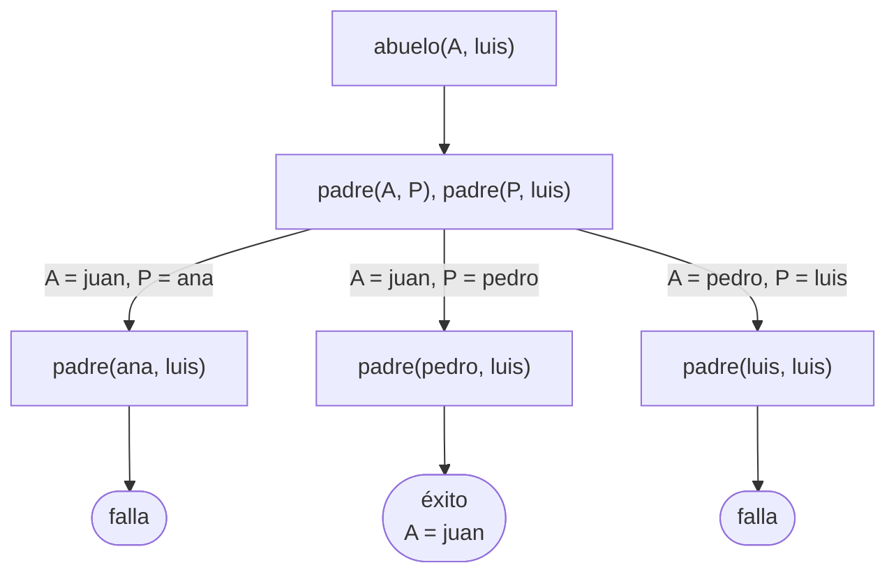
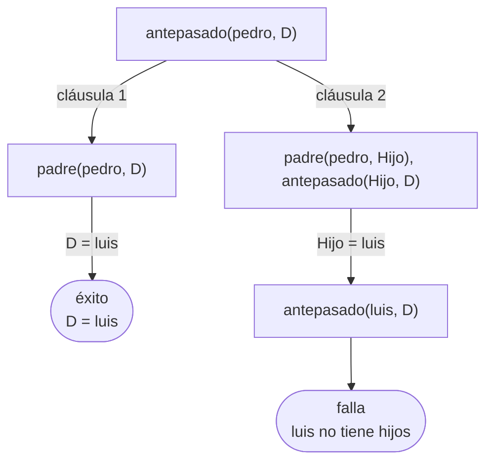
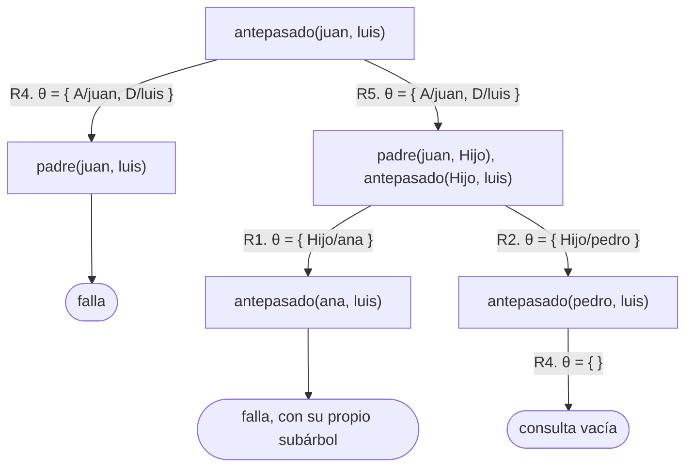

# Soluciones del capítulo 5 — Cómo responde Prolog

El código de esta página está en `ejemplos/capitulo-05/soluciones.pl` y pasa sus
pruebas.

## 1



**Tres hojas, de las cuales una sola es de éxito.**

Hay más ramas que en el árbol del capítulo porque el primer objetivo es ahora
`padre(A, P)`, con **las dos variables libres**: unifica con los tres hechos. En
`abuelo(juan, Quien)` el primer objetivo era `padre(juan, P)`, con `juan` ya
instanciado, y unificaba solo con dos.

## 2

Una sola respuesta, `Quien = luis`.



La segunda cláusula genera una rama que desciende una generación hasta `luis`,
donde la familia termina.

## 3

```text
Fail: (11) padre(ana, _8106)
```

Ese `Fail` es el momento en que se abandona la rama de `ana`. La línea
siguiente, `Redo: (11) padre(juan, _8960)`, corresponde ya al paso posterior:
Prolog retrocede al objetivo anterior para intentar la alternativa pendiente.

Son dos eventos distintos, y por eso ocupan dos líneas: el primero indica que la
rama falla; el segundo, que se retrocede para intentar otra alternativa.

## 4

La respuesta **no cambia**: es `Quien = luis`. El conjunto de respuestas no
depende del orden de los hechos; solo depende de él el orden en que aparecen, y
en este caso hay una sola.

El árbol **sí cambia**. Con `padre(juan, pedro)` escrito primero, la rama de
`pedro` pasa a ser la de la izquierda, de modo que Prolog encuentra la respuesta
en el primer intento, antes de recorrer la rama de `ana`. La primera respuesta
es la misma, y se obtiene con la mitad del trabajo.

## 5

<!-- ejemplo: capitulo-05/soluciones.pl predicado: nieto/2 nieto_al_reves/2 consulta: nieto_al_reves(Quien, juan). -->
```prolog
% nieto(N, A): con el objetivo que menos ramas abre primero.
nieto(N, A) :-
    padre(A, P),
    padre(P, N).

% nieto_al_reves(N, A): la misma regla, con los objetivos en orden inverso.
nieto_al_reves(N, A) :-
    padre(P, N),
    padre(A, P).
```

`nieto/2` genera menos ramas. En la consulta `nieto(Quien, juan)`, su primer
objetivo es `padre(juan, P)`, con `juan` instanciado: dos ramas. El primer
objetivo de `nieto_al_reves/2` es `padre(P, Quien)`, con las dos variables
libres: cuatro ramas, de las cuales tres fallan después.

Es la misma diferencia de la sección 5.5, y la misma regla práctica: se escribe
primero el objetivo que llega con más argumentos instanciados.

## 6

Sí: se obtienen las mismas respuestas en distinto orden.

```prolog
?- antepasado(juan, Quien).
Quien = ana ;
Quien = pedro ;
Quien = luis ;
Quien = sofia ;
false.

?- primero_lejos(juan, Quien).
Quien = sofia ;
Quien = luis ;
Quien = ana ;
Quien = pedro.
```

Con una generación más, el comportamiento de cada predicado se aprecia mejor: el
primero entrega las respuestas a medida que desciende por el árbol; el segundo
desciende hasta la última generación y entrega las respuestas durante el
retroceso, comenzando por la bisnieta.

## 7

El problema está en la primera cláusula:

```prolog
hermano(A, B) :-
    hermano(B, A).
```

En el árbol, `hermano(luis, X)` se reemplaza por `hermano(X, luis)`, que se
reemplaza por `hermano(luis, X)`, y así indefinidamente. Es la rama infinita de
la sección 5.6, y como está escrita **en primer lugar**, impide alcanzar la
segunda cláusula, que es la que produce las respuestas.

La afirmación que esa cláusula pretendía expresar —si A es hermano de B,
entonces B es hermano de A— es cierta, pero no es necesario escribirla: la
segunda cláusula ya es simétrica, porque `padre(P, A), padre(P, B)` no distingue
el orden de A y B.

<!-- ejemplo: capitulo-05/soluciones.pl predicado: hermano/2 consulta: hermano(ana, Quien). -->
```prolog
% hermano(A, B): sin la cláusula recursiva que no reducía el problema.
hermano(A, B) :-
    padre(P, A),
    padre(P, B),
    A \== B.
```

## 8

Sí, y el capítulo ya contiene un ejemplo: `primero_lejos/2`, de la sección 5.4,
tiene el caso recursivo en primer lugar y termina correctamente.

La conclusión es que **la no terminación no se debe al orden de las cláusulas**,
sino al orden de los objetivos dentro de la cláusula recursiva.
`primero_lejos/2` escribe `padre(A, Hijo)` antes de la llamada recursiva, de modo
que cada llamada comienza una generación más abajo. La versión defectuosa de la
sección 5.6 realiza la llamada recursiva **antes** de avanzar ese paso, y por eso
el problema no se reduce nunca.

Escribir el caso base en primer lugar sigue siendo una buena práctica, pero por
otro motivo: mejora la legibilidad y permite detectar si el caso base falta.

## 9

a. La consulta es `?- abuelo(juan, luis).` Se deduce del primer arco: la
   sustitución `{ A/juan, N/luis }` indica con qué se unificaron los dos
   argumentos de la cabeza de R4, y esos valores estaban en la consulta.
b. Una sola respuesta, y es `true`: el árbol tiene una única hoja de éxito, y la
   consulta no tiene variables, de modo que no hay nada que informar. Ejecutada,
   responde `true ;` y después `false.`, porque la rama de la izquierda dejó
   pendiente una alternativa que todavía no se descartó.
c. La última sustitución está vacía porque en ese punto el objetivo es
   `padre(pedro, luis)` y la cláusula es `padre(pedro, luis)`: los dos términos
   ya son idénticos, y no hace falta darle valor a ninguna variable para que
   unifiquen. Una sustitución vacía es un caso normal, y no significa que no
   haya habido unificación.

## 10

Con las cláusulas de `orden.pl` numeradas R1 a R3 para los hechos de `padre/2`,
R4 para el caso base de `antepasado/2` y R5 para el caso recursivo:



Una hoja de éxito y dos de falla en el nivel dibujado. La rama de `ana` falla
después de desplegar su propio subárbol —`ana` no es padre de nadie—, y por eso
conviene anotarla como falla sin desarrollarla.

```prolog
?- antepasado(juan, luis).
true ;
false.
```

El `false.` final corresponde a las alternativas que quedaron abiertas en R5:
después de encontrar la respuesta por `pedro`, todavía resta comprobar que no
haya otra.

## 11

`?- padre(juan, Quien).` tiene **dos** hojas de éxito y ninguna de falla: el
objetivo unifica con R1 y con R2, y cada una produce de inmediato la consulta
vacía.

`?- padre(Quien, juan).` tiene **cero** hojas de éxito. Ninguna de las tres
cláusulas tiene a `juan` en la segunda posición, de modo que el objetivo no
unifica con ninguna cabeza y la única rama posible falla.

La diferencia no está en la cantidad de variables sino en **qué posición** ocupa
el dato conocido: `juan` aparece como primer argumento en dos hechos y como
segundo en ninguno.

## 12

El primer árbol tiene un nodo más que el segundo. `padre(juan, P)` unifica con
dos cláusulas, de modo que abre dos ramas, y una de ellas —la de `ana`— falla
después. `padre(P, luis)` unifica con una sola, de modo que abre una rama, y esa
rama tiene éxito.

Conviene la segunda: hace menos trabajo para llegar a la misma respuesta.

Lo que el ejercicio quiere mostrar es que esa conveniencia **no se puede decidir
mirando la regla**. Depende de cuántos hechos unifican con cada objetivo, es
decir de los datos, y puede invertirse si el programa cambia: con una familia en
la que `luis` tuviera varios padres registrados y `juan` un solo hijo, la mejor
sería la primera. El capítulo 14 retoma el tema.

## 13

Cuatro respuestas, en este orden: `ana`, `pedro`, `luis`, `eva`.

Se determina sin ejecutar nada, leyendo el árbol. La primera cláusula de
`antepasado/2` agota los hijos directos de `juan` antes de que la segunda
descienda una generación, de modo que `ana` y `pedro` aparecen primero, en el
orden en que están escritos los hechos. Después, la cláusula recursiva desciende
por `ana` —que no tiene hijos— y por `pedro`, cuyos hijos `luis` y `eva`
aparecen en el orden de los hechos.

El hecho agregado no altera el orden de los anteriores: se suma al final, porque
`padre(pedro, eva)` se escribe después de `padre(pedro, luis)`.

## 14

La rama inútil es la de la **primera** cláusula, `padre(juan, luis)`, que falla:
`juan` no es padre de `luis` de manera directa. Se recorre cada vez, antes de
llegar a la cláusula recursiva que sí produce la respuesta.

No conviene resolverlo reordenando las cláusulas. Poner primero la recursiva
hace que el predicado no termine cuando se le pide la respuesta siguiente, que
es exactamente el problema de la sección 5.6.

Lo que sí se puede hacer es reordenar los **objetivos** de la cláusula
recursiva, y en este programa no hay nada que reordenar: `padre(A, X)` ya está
antes de la llamada recursiva, que es lo correcto.

La conclusión del ejercicio es esa: no toda rama que falla se puede evitar. La
primera cláusula tiene que intentarse, porque en otros casos es la que responde.
El capítulo 9 presenta el corte, que es la construcción que permite descartar
alternativas de manera explícita.

## 15

Sí, y `natural/1` del capítulo 6 es el ejemplo. Su árbol para `natural(N)` tiene
infinitas hojas de éxito, una por cada natural, y la primera está de inmediato a
la izquierda: `natural(0)` se resuelve con el caso base sin descender nada.

La clave es **dónde** están las hojas. Un árbol infinito no impide responder si
la primera hoja de éxito se alcanza recorriendo de izquierda a derecha una
cantidad finita de nodos. Lo que impide responder es una **rama** infinita
ubicada a la izquierda de la respuesta, que es el caso de la sección 5.6: ahí el
recorrido se pierde antes de llegar.

Infinitas respuestas y no terminar no son lo mismo.
