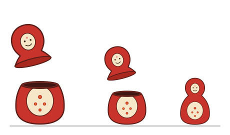

# Capítulo 6 — Recursión

La recursión es el único mecanismo de repetición de Prolog. No existe otra
construcción con ese propósito, por lo que conviene estudiarla en detalle: los
temas posteriores —las listas del [capítulo 7](../capitulo-07-listas/index.md), la aritmética del [capítulo 8](../capitulo-08-aritmetica/index.md), los
árboles del [capítulo 33](../capitulo-33-busqueda-y-juegos/index.md)— son aplicaciones de la recursión a distintas estructuras.

## Objetivos del capítulo

Al terminar el capítulo, el lector puede:

- escribir un predicado recursivo, separando el caso base del caso recursivo;
- determinar, a partir de una regla recursiva, si termina y por qué;
- definir estructuras nuevas, como los números naturales, usando solo términos;
- escribir una recursión que produzca un resultado, además de verificar una
  relación.

!!! info "Tiempo estimado"
    Leer el capítulo, ejecutar sus ejemplos y hacer las actividades: **0:40 h**.
    Resolver los 6 ejercicios marcados con ★: **1:35 h**.
    Resolver los 14 ejercicios del final: **4:40 h**.

## 6.1 Una regla que se invoca a sí misma

Con las reglas del [capítulo 3](../capitulo-03-reglas-y-conjunciones/index.md) se puede definir "abuelo" —dos generaciones— y
también "bisabuelo" —tres—, escribiendo una regla para cada relación. No se
puede definir **antepasado**, porque la cantidad de generaciones no se conoce de
antemano: habría que escribir una regla para cada profundidad posible.

La recursión resuelve exactamente ese problema. Una regla puede usar en su
cuerpo el mismo predicado que está definiendo.

Retomaremos el ejemplo es el del [capítulo 1](../capitulo-01-la-primera-hora/index.md):

<!-- ejemplo: capitulo-06/antepasados.pl predicado: antepasado/2 consulta: antepasado(tare, isaac). -->
```prolog
%!  antepasado(?A, ?D) is nondet.
%
%   A es antepasado de D.
%   Caso base: un progenitor es un antepasado. Caso recursivo: se desciende
%   una generación y se plantea la misma pregunta desde ese punto.
antepasado(A, D) :-
    progenitor(A, D).
antepasado(A, D) :-
    progenitor(A, Hijo),
    antepasado(Hijo, D).
```

¿Cuál es la función de cada cláusula?

- la primera resuelve el caso más simple: si A es
  progenitor de D, ya es su antepasado;
- la segunda desciende una generación —`progenitor(A, Hijo)`— y vuelve a plantear la misma pregunta desde ahí.

El programa completo está en `antepasados.pl`, con el árbol de Taré del capítulo
1. Sobre él:

```prolog
?- antepasado(tare, isaac).
true ;
false.
```

Taré no es progenitor de Isaac, de modo que la primera cláusula no alcanza. La
segunda desciende a Abraham y pregunta si Abraham es antepasado de Isaac; ahora
sí, responde la primer cláusula.

### Por qué termina

Toda recursión plantea las mismas preguntas: **¿qué se reduce en cada llamada?**, y
**¿dónde se detiene?**

Acá la respuesta se ve en el árbol genealógico. Cada llamada recursiva empieza
una generación más abajo que la anterior, y la familia tiene una cantidad finita
de generaciones: al llegar a alguien que no tiene hijos, `progenitor(A, Hijo)`
falla y esa rama se agota. No hay manera de descender para siempre.

Ese es el requisito fundamental para que el programa termine: **el caso recursivo debe avanzar hacia el caso base**. La [sección 5.6](../capitulo-05-como-responde-prolog/index.md#56-ramas-infinitas) mostró qué ocurre cuando esto no es así.

La recursión funciona porque el problema tiene una estructura recurrente.  Tomemos el caso de una babushka, esas muñecas rusas huecas que se anidan una dentro de otra: desarmar una babushka puede pensarse como un procedimiento recurrente que toma un muñeca como argumento; cuando quitamos la muñeca hueca externa, nos queda una babushka todavía.  Como el objeto resultante tiene la misma forma que el argumento, una babushka, podemos a su vez aplicarle el procedimiento desarmar. Así seguiremos aplicando el procedimiento hasta que nos encontremos con una muñeca que ya no es hueca, en ese caso hemos llegado al final de la tarea de desarme.



Vemos que el procedimiento de desarme debe considerar dos casos: la muñeca externa es hueca, la muñeca externa es maciza.

## 6.2 Caso base y caso recursivo

La forma de `antepasado/2` no es particular de las familias. Todo predicado
recursivo tiene esas dos partes, y ambas son obligatorias:

- el **caso base**, que resuelve la instancia más simple del problema sin
  invocarse nuevamente;
- el **caso recursivo**, que resuelve una instancia mayor reduciéndola a una
  menor pero de la "misma forma" e invocándose a sí mismo.

La babushka de la sección anterior muestra las dos partes con claridad. Una
babushka se escribe con dos clases de términos: `babushka_hueca(Interior)` es
una muñeca hueca que tiene otra babushka adentro, y `babushka_maciza` es la
muñeca maciza del centro, que ya no se abre. Una babushka de cuatro muñecas
—tres huecas y la maciza— es este término:

```prolog
babushka_hueca(babushka_hueca(babushka_hueca(babushka_maciza)))
```

Desarmarla es un predicado de dos cláusulas, una por cada caso:

<!-- ejemplo: capitulo-06/babushka.pl predicado: desarma/1 consulta: desarma(babushka_hueca(babushka_hueca(babushka_hueca(babushka_maciza)))). -->
```prolog
%!  desarma(?B) is nondet.
%
%   La babushka B se puede desarmar por completo.
% Caso base: la muñeca maciza no tiene nada adentro.
desarma(babushka_maciza).
% Caso recursivo: se quita la muñeca hueca exterior y se desarma lo que queda.
desarma(babushka_hueca(Interior)) :-
    desarma(Interior).
```

- el **caso base** es `desarma(babushka_maciza)`: la muñeca maciza es la
  instancia más simple del problema. No hay nada que quitar, y la cláusula es
  un hecho, sin ninguna invocación a `desarma/1`;
- el **caso recursivo** es la segunda cláusula. Su cabeza separa la muñeca
  exterior de su contenido, `Interior`, y su cuerpo plantea el mismo problema
  sobre ese contenido. `Interior` es otra babushka, de la "misma forma" que la
  original, y más chica: tiene un `babushka_hueca` menos.

Cada llamada quita un nivel del término, hasta que lo que queda es la muñeca
maciza:

| Llamada | La resuelve |
|---|---|
| `desarma(babushka_hueca(babushka_hueca(babushka_hueca(babushka_maciza))))` | el caso recursivo |
| `desarma(babushka_hueca(babushka_hueca(babushka_maciza)))` | el caso recursivo |
| `desarma(babushka_hueca(babushka_maciza))` | el caso recursivo |
| `desarma(babushka_maciza)` | el caso base |

Tres muñecas huecas producen tres usos del caso recursivo, y la maciza, uno del
caso base, que es el que termina la recursión:

```prolog
?- desarma(babushka_hueca(babushka_hueca(babushka_hueca(babushka_maciza)))).
true.
```

Si falta el caso base, la recursión no tiene condición de finalización. Si el
caso recursivo no reduce el problema, tampoco. En ambos casos la
consecuencia es que el programa no termina.

Extraída de `antepasado/2`, la forma queda así:

!!! abstract "Plantilla 8 — Caso base y caso recursivo"
    **Cuándo**: se debe repetir una operación una cantidad de veces que no se
    conoce de antemano.

    ```prolog
    p(CasoMinimo) :-
        solucion_directa.
    p(CasoGeneral) :-
        un_paso(CasoGeneral, CasoMenor),
        p(CasoMenor).
    ```

    En `antepasado/2`, `solucion_directa` es `progenitor(A, D)` y `un_paso` es
    `progenitor(A, Hijo)`, el objetivo que desciende una generación.

    El caso base se escribe primero. Mejora la legibilidad, obliga a verificar
    que existe, y además evita un problema concreto: con el caso base escrito
    último, el predicado puede responder bien la primera vez y no terminar al
    solicitar las respuestas siguientes, o al usarlo para generar. En el caso
    recursivo, el objetivo que reduce el problema se escribe **antes** de la
    llamada recursiva; de lo contrario, el programa no termina ([capítulo 5](../capitulo-05-como-responde-prolog/index.md),
    [sección 5.6](../capitulo-05-como-responde-prolog/index.md#56-ramas-infinitas)).

    **En este capítulo se usa en**: `antepasado/2` (6.1), `desarma/1` (6.2), `natural/1` y `suma/3`
    (6.3 y 6.4), `generaciones/3` (6.6). Las demás plantillas están en
    [esta página](../plantillas.md).

!!! question "Actividad"
    Sobre `antepasados.pl`, ejecutar `antepasado(tare, Quien).` y solicitar
    todas las respuestas. Aparecen primero los hijos y después los nietos.
    Determinar, antes de ejecutarla, qué orden se obtendría si las dos cláusulas
    estuvieran escritas al revés, y verificarlo.

## 6.3 Los números naturales, definidos con términos

En `antepasado/2` la estructura que se recorre ya existía: el árbol genealógico
lo daban los hechos. Esta sección hace algo distinto y más ambicioso: **define
una estructura propia**, los números naturales, usando solo términos y sin
recurrir a los números predefinidos de Prolog. Sirve además para estudiar la
recursión de manera aislada, sin ningún otro mecanismo alrededor.

Son suficientes dos afirmaciones: cero es un número natural; y si N es un número
natural, su sucesor también lo es.

<!-- ejemplo: capitulo-06/naturales.pl predicado: natural/1 consulta: natural(s(s(cero))). -->
```prolog
%!  natural(+N) is semidet.
%!  natural(-N) is multi.
%
%   N es un número natural.
natural(cero).
natural(s(N)) :-
    natural(N).
```

`s(N)` se lee "el sucesor de N", y es un término compuesto como los del capítulo
4: nombre `s`, un argumento. De este modo, `s(cero)` representa el uno, `s(s(cero))`
el dos y `s(s(s(cero)))` el tres. `cero` es un átomo, elegido a propósito en lugar
del número `0`: así queda a la vista que ninguno de estos términos es un número
para Prolog —no se pueden operar con `is`—, aunque es posible definir relaciones
sobre ellos, que es el propósito de esta sección.

La definición corresponde exactamente a la plantilla: el caso base es `cero`, que
no realiza ninguna llamada; el caso recursivo elimina un nivel de `s` y consulta
por el argumento, que es un término menor.

El predicado opera en dos modos. Con un argumento instanciado, verifica:

```prolog
?- natural(s(s(cero))).
true.
```

Con una variable libre, **genera** los naturales, uno tras otro, de manera
indefinida:

```prolog
?- natural(N).
N = cero ;
N = s(cero) ;
N = s(s(cero)) ;
N = s(s(s(cero))) ;
...
```

Esta consulta no termina, y ese comportamiento es correcto: el conjunto de los
naturales es infinito. Es el primer ejemplo del curso de una rama infinita que
no constituye un error.

El encabezado de `natural/1` registra los dos modos con la notación de la
[sección 2.8](../capitulo-02-hechos-consultas-y-variables/index.md#28-como-se-documenta-el-uso-de-un-predicado), una línea `%!` para cada uno: `natural(+N) is semidet` verifica, y
`natural(-N) is multi` genera.

## 6.4 La suma

Sobre los naturales así definidos se puede definir la suma. El método es el
mismo: se establece el resultado para la instancia más simple, y se indica cómo
reducir las demás instancias a ella.

Caso base: la suma de cero y B es B. Caso recursivo: la suma del sucesor de A y
B es el sucesor de la suma de A y B.

<!-- ejemplo: capitulo-06/naturales.pl predicado: suma/3 consulta: suma(s(cero), s(s(cero)), Cuanto). -->
```prolog
%!  suma(?A, ?B, ?C) is nondet.
%
%   C es A más B.
suma(cero, B, B).
suma(s(A), B, s(C)) :-
    suma(A, B, C).
```

```prolog
?- suma(s(cero), s(s(cero)), Cuanto).
Cuanto = s(s(s(cero))).
```

Uno más dos es tres. En cada llamada se elimina un nivel de `s` del primer
argumento y se agrega uno al resultado, hasta que el primer argumento es `cero`.

La consulta siguiente muestra la propiedad más importante del capítulo:

```prolog
?- suma(A, s(s(cero)), s(s(s(cero)))).
A = s(cero) ;
false.
```

La consulta pregunta **qué número sumado a dos da tres**, y la respuesta es uno.
La misma definición que suma, consultada en otro sentido, resta. No existe una
regla para sumar y otra para restar: existe una relación entre tres números, y
la consulta determina cuáles son los datos y cuál es la incógnita.

`is` no tiene esta propiedad, y por eso conviene observarla antes del capítulo
8: `X is 1 + 2` evalúa en un único sentido, mientras que `suma/3` define una
relación.

## 6.5 Por qué termina

La pregunta de la [sección 6.1](#61-una-regla-que-se-invoca-a-si-misma) —**¿qué se reduce en cada llamada?**, y **¿en qué punto se detiene?**— se responde ahora sobre los dos predicados construidos con términos, donde aparece un matiz que en `antepasado/2` no se notaba.

En `suma/3` la respuesta es directa. Cada llamada elimina un nivel de `s` del
primer argumento, y el caso base espera `cero`. Como el primer argumento tiene una
cantidad finita de niveles, después de eliminarlos todos se alcanza `cero`, y la
recursión termina. Con `s(s(cero))` como primer argumento se realizan exactamente
dos llamadas recursivas.

En `natural/1` el análisis es distinto. En la consulta `natural(s(s(cero)))`, el
argumento se reduce en cada llamada, y la recursión termina. En la consulta
`natural(N)`, con `N` libre, **ninguna magnitud se reduce**: Prolog construye
términos cada vez mayores. Por eso el predicado verifica en un caso y genera de
manera indefinida en el otro. El mismo predicado, con dos comportamientos,
según qué argumentos estén instanciados.

De aquí se desprende un principio general: la terminación de un predicado puede
depender de **cómo se lo invoca**, y no solo de cómo está escrito.

## 6.6 Recursión que produce un resultado

Las recursiones anteriores solo verifican una relación. Una recursión también
puede construir un resultado, siempre con el mismo esquema: el caso base
establece el resultado de la instancia más simple, y el caso recursivo toma el
resultado de la llamada recursiva y le agrega su contribución.

El ejemplo usa otra familia, más simple que las de las secciones anteriores. En
`generaciones.pl` cada persona tiene un solo hijo: `juan` es padre de `ana`,
`ana` de `luis` y `luis` de `eva`. Los hechos forman así una **cadena**, sin
hermanos ni ramas, de modo que entre dos personas cualesquiera hay un único
camino, y la cantidad de generaciones que las separa está bien definida.

<!-- ejemplo: capitulo-06/generaciones.pl predicado: generaciones/3 consulta: generaciones(juan, eva, Cuantas). -->
```prolog
%!  generaciones(?A, ?D, -N) is nondet.
%
%   D está N generaciones por debajo de A.
% Caso base: una generación, cuando A es el padre de D.
generaciones(A, D, 1) :-
    padre(A, D).
% Caso recursivo: una generación, más las que resten desde el hijo.
generaciones(A, D, N) :-
    padre(A, Hijo),
    generaciones(Hijo, D, Faltan),
    N is Faltan + 1.
```

```prolog
?- generaciones(juan, eva, Cuantas).
Cuantas = 3 ;
false.
```

El orden de los objetivos del caso recursivo es el de la mayoría de las
recursiones que producen un resultado:

1. `padre(A, Hijo)` avanza un paso y reduce el problema;
2. `generaciones(Hijo, D, Faltan)` resuelve el problema reducido y produce un
   número;
3. `N is Faltan + 1` agrega la contribución de esta generación.

El tercer objetivo se escribe después de la llamada recursiva: `Faltan` no tiene valor hasta que la llamada termina. Si `is` se
escribiera antes, se produciría el error de argumentos sin instanciar del
[capítulo 1](../capitulo-01-la-primera-hora/index.md).

Como en los casos anteriores, la relación se puede consultar en el otro sentido:

```prolog
?- generaciones(juan, Quien, 2).
Quien = luis ;
false.
```

## 6.7 Las cuatro causas de no terminación

La mayoría de las recursiones que no terminan corresponden a uno de los cuatro
casos siguientes.

**Falta el caso base.** Solo existe la cláusula recursiva, de modo que no hay
condición de finalización.

**El caso recursivo no reduce el problema.** Se invoca a sí mismo con los mismos
argumentos que recibió, o con argumentos del mismo tamaño. Es el error del
[capítulo 5](../capitulo-05-como-responde-prolog/index.md): la regla que comenzaba por `antepasado(A, X)` antes de avanzar por algún paso reductor.

**El objetivo que reduce el problema está después de la llamada recursiva.** Es
el caso más difícil de detectar, porque el programa *parece* correcto: tiene su
caso base y tiene su objetivo de reducción. Sin embargo, Prolog ejecuta los
objetivos de izquierda a derecha, y alcanza la llamada recursiva antes de haber
reducido el problema.

```prolog
%!  generaciones(?A, ?D, -N) is nondet.
%
%   D está N generaciones por debajo de A. No termina: la llamada recursiva
%   precede al objetivo que reduce el problema.
generaciones(A, D, N) :-
    generaciones(Hijo, D, Faltan),
    padre(A, Hijo),
    N is Faltan + 1.
```

**Dos predicados que se llaman mutuamente.** Ninguno de los dos es recursivo por
sí solo, y sin embargo el ciclo existe. También difícil de detectar,
porque cada predicado examinado por separado parece correcto:

```prolog
% No termina: cada uno se define en términos del otro, y ninguno avanza.

%!  hijo(?H, ?P) is nondet.
%
%   H es hijo de P.
hijo(H, P) :-
    progenitor(P, H).

%!  progenitor(?P, ?H) is nondet.
%
%   P es el padre o la madre de H.
progenitor(P, H) :-
    hijo(H, P).
```

Cada cláusula es una afirmación verdadera, y aun así el par no sirve como
programa: para probar `hijo/2` hay que probar `progenitor/2`, y para probar
`progenitor/2` hay que probar `hijo/2`. La situación se repite sin que ningún
objetivo se acerque a un hecho. Basta con que uno de los dos predicados esté
definido por hechos para que el problema desaparezca.

Ante un programa que no termina, se recomienda verificar en ese orden: primero,
si existe el caso base; después, si el caso recursivo reduce el problema;
después, si el objetivo de reducción está antes de la llamada recursiva; por
último, si el predicado forma un ciclo con algún otro.

!!! question "Actividad"
    En `generaciones.pl`, intercambiar los dos primeros objetivos del caso
    recursivo, como en el bloque anterior, y ejecutar
    `generaciones(juan, eva, N).` La ejecución se debe interrumpir de manera
    manual.

## Ejercicios

Las soluciones están en [la página de soluciones](soluciones.md). La dificultad
va de 1 (se resuelve consultando el capítulo) a 3 (requiere elaboración propia).
Los marcados con ★ son los que no conviene saltear: cubren lo que el capítulo
tiene de propio, y los capítulos siguientes los dan por hechos.

1. **(1)** Escribir `dos/1`, `tres/1` y `cuatro/1` como hechos, con la notación
   `s(...)`. ¿Cuántas `s` tiene cada uno?
2. ★ **(1)** ¿Qué responde `natural(s(s(s(cero)))).`? ¿Y `natural(s(perro)).`?
   Explicar la segunda respuesta.
3. ★ **(2)** Escribir `mayor/2` para los naturales de `naturales.pl`, con el
   encabezado `%! mayor(?A, ?B) is nondet.` (A es mayor que B), sin usar
   `menor/2`.
4. **(2)** Escribir `doble_natural/2`, con el encabezado
   `%! doble_natural(?N, ?D) is nondet.`: D es la suma de N consigo mismo. Se
   puede usar `suma/3`.
5. **(2)** Escribir `desde(V, N)`: N es el natural en notación `s` que
   corresponde al entero predefinido V. Es la relación inversa de `valor/2`.
   Escribir también su encabezado: qué argumentos deben llegar ligados y
   cuántas respuestas produce.
6. ★ **(2)** Con `generaciones.pl`, ¿qué responde `generaciones(A, eva, 2).`?
   Seguir el árbol de derivación.
7. **(2)** Escribir `tatarabuelo/2`, con el encabezado
   `%! tatarabuelo(?A, ?D) is nondet.`, a partir de `generaciones/3`.
8. **(3)** Escribir `cuantos_hijos(P, N)`: N es la cantidad de hijos de P. El
   ejercicio presenta una dificultad; explicar cuál es. (Sugerencia: los hijos
   no forman una cadena.)
9. **(3)** Escribir `par/1`, con el encabezado `%! par(?N) is nondet.`, para
   los naturales de `naturales.pl`: se cumple cuando N tiene una cantidad par
   de `s`. Según el planteo, requiere uno o dos casos base.
10. ★ **(2)** Los tres predicados siguientes no terminan, cada uno por una causa
    distinta de la [sección 6.7](#67-las-cuatro-causas-de-no-terminacion). Identificar la causa en cada caso y corregirlo:

    ```prolog
    % a
    %!  cuenta_s(?N, ?C) is nondet.
    %
    %   C tiene tantas s como N.
    cuenta_s(s(N), C) :-
        cuenta_s(N, Menos),
        C = s(Menos).

    % b
    %!  antes_de(?A, ?B) is nondet.
    %
    %   A está antes que B.
    antes_de(A, B) :-
        despues_de(B, A).

    %!  despues_de(?B, ?A) is nondet.
    %
    %   B está después que A.
    despues_de(B, A) :-
        antes_de(A, B).

    % c
    %!  baja(?N, ?Cero) is nondet.
    %
    %   Cero es el cero al que se llega quitando todas las s de N.
    baja(N, Cero) :-
        baja(s(N), Cero).
    baja(cero, cero).
    ```
11. ★ **(2)** Sobre `suma/3` de la [sección 6.4](#64-la-suma), en tres partes:

    a. Ejecutar `suma(s(cero), s(s(cero)), R).` y explicar qué hace cada cláusula.
    b. Ejecutar `suma(s(cero), B, s(s(s(cero)))).` El mismo predicado ahora resta.
       Explicar por qué, con el árbol de derivación.
    c. Ejecutar `suma(A, B, s(s(cero))).` y solicitar todas las respuestas.
       ¿Cuántas hay, y por qué termina?
12. ★ **(2)** `valor/2` traduce un natural en notación `s` a un entero
    predefinido. Determinar, sin ejecutarlas, cuáles de estas consultas
    funcionan y cuáles no, y por qué: `valor(s(s(cero)), V).` ·
    `valor(N, 2).` · `valor(s(N), 3).`
13. **(2)** Escribir `menor_o_igual/2`, con el encabezado
    `%! menor_o_igual(?A, ?B) is nondet.`, sobre los naturales de
    `naturales.pl`, sin usar `menor/2`. Después ejecutar
    `menor_o_igual(A, s(cero)).` y `menor_o_igual(s(cero), B).` La segunda produce una
    sola respuesta, y esa respuesta **contiene una variable**: explicar qué
    afirma, y por qué es correcta.
14. **(3)** A partir de `par/1` del ejercicio 9, escribir `impar/1`, con el
    encabezado `%! impar(?N) is nondet.`, y después `paridad/2`, con el
    encabezado `%! paridad(?N, ?P) is nondet.`, que se cumple con `P = par`
    o con `P = impar` según corresponda. ¿Cuántas cláusulas requiere `paridad/2`? ¿Qué responde
    `paridad(s(cero), par).`, y qué trabajo hace Prolog antes de responderlo?

## Resumen

| | |
|---|---|
| **caso base** | la instancia más simple, que se resuelve sin una nueva invocación |
| **caso recursivo** | reduce el problema y se invoca a sí mismo |
| `s(N)` | "el sucesor de N"; un término, no un número |
| terminación | una magnitud debe reducirse en cada llamada, y el caso base debe ser alcanzable |
| generar y verificar | el mismo predicado realiza ambas operaciones, según qué argumentos estén instanciados |
| orden dentro del cuerpo | el objetivo que reduce el problema precede a la llamada recursiva |

## Temas que se retoman

| Tema | Se retoma en |
|---|---|
| Recursión sobre listas, el mismo esquema con `[Primero|Resto]` | [capítulo 7](../capitulo-07-listas/index.md) |
| `is`, y por qué es menos general que la relación `suma/3` | [capítulo 8](../capitulo-08-aritmetica/index.md) |
| Acumuladores, otra forma de escribir una recursión que produce un resultado | [capítulo 8](../capitulo-08-aritmetica/index.md) |
| Recursión con poda mediante el corte | [capítulo 9](../capitulo-09-backtracking-y-corte/index.md) |
| Recursión sobre estructuras que no son cadenas, como los árboles | [capítulo 33](../capitulo-33-busqueda-y-juegos/index.md) |
