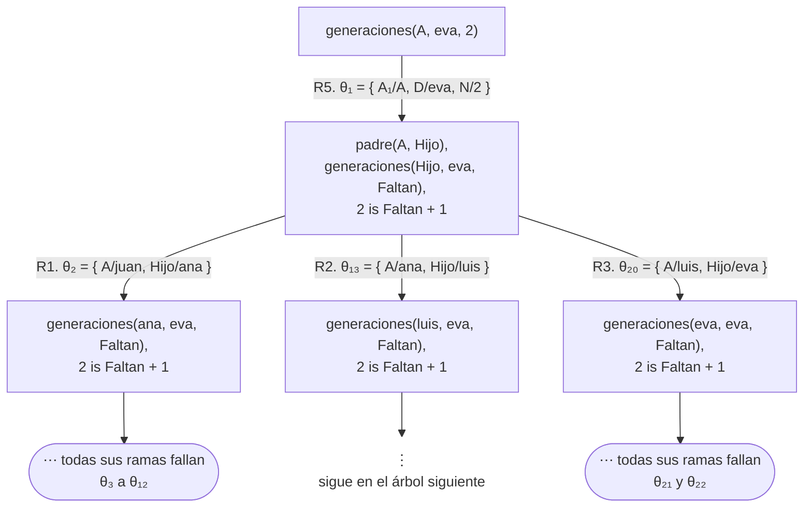
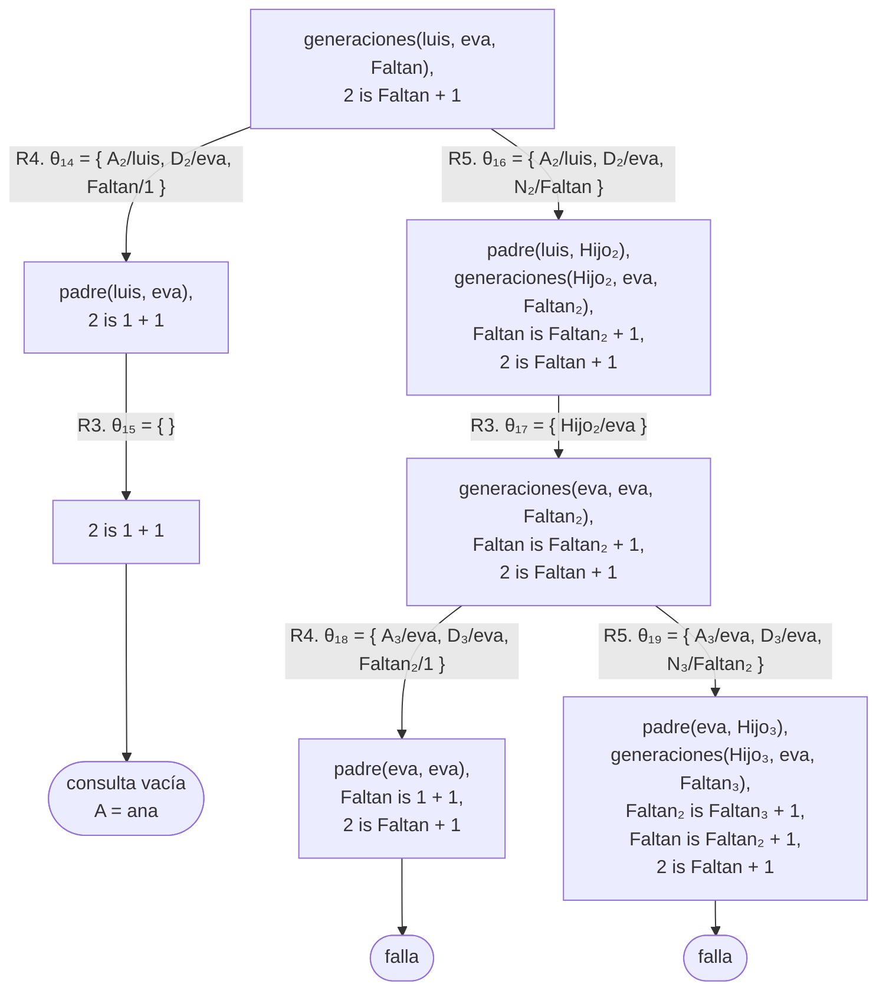
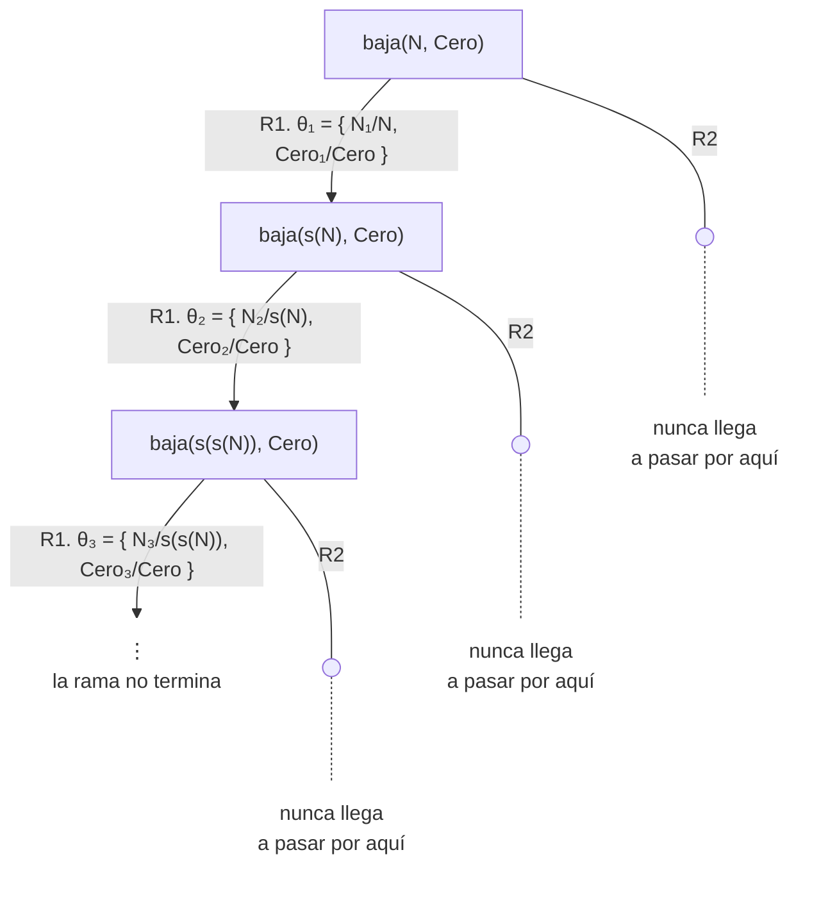
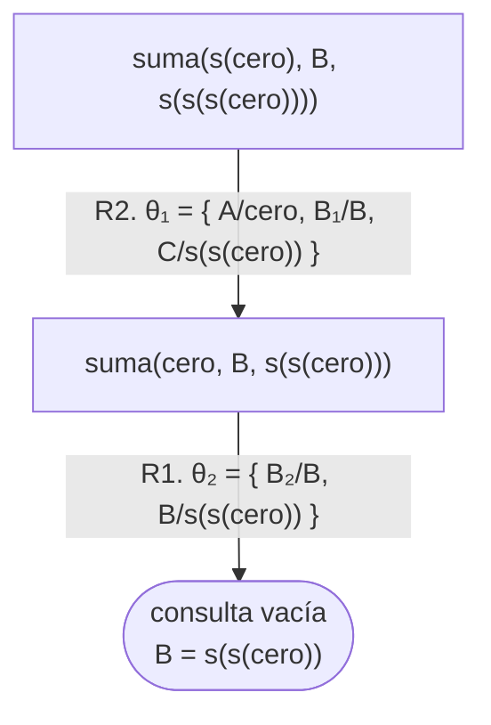
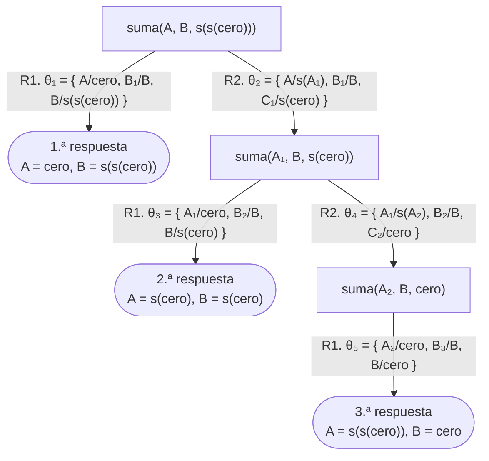
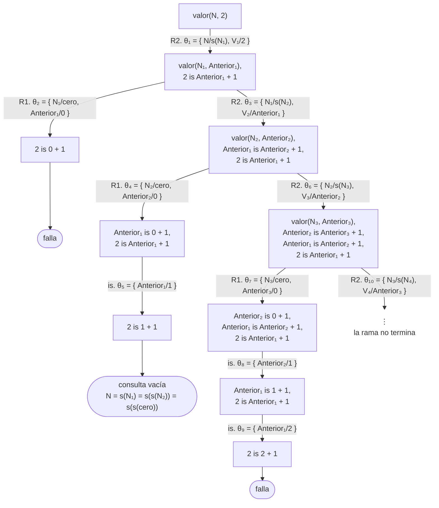
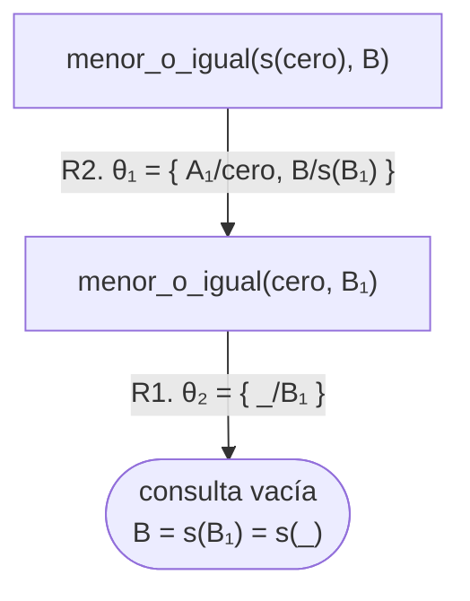

# Soluciones del capítulo 6 — Recursión

El código de esta página está en `ejemplos/capitulo-06/soluciones.pl` y pasa sus
pruebas.

## 1

<!-- ejemplo: capitulo-06/soluciones.pl predicado: dos/1 tres/1 cuatro/1 consulta: cuatro(N). -->
```prolog
% dos(N): N es el natural dos.
dos(s(s(cero))).

% tres(N): N es el natural tres.
tres(s(s(s(cero)))).

% cuatro(N): N es el natural cuatro.
cuatro(s(s(s(s(cero))))).
```

Dos, tres y cuatro `s`, respectivamente. El `cero` interior no se cuenta: es el
punto de partida, no un sucesor.

## 2

```prolog
?- natural(s(s(s(cero)))).
true.

?- natural(s(perro)).
false.
```

La segunda respuesta es la que requiere explicación. Prolog aplica la cláusula
recursiva, que elimina el nivel de `s`, y el objetivo restante es
`natural(perro)`. `perro` no unifica con `cero` ni con `s(N)`, de modo que ninguna
cláusula es aplicable, y la respuesta es `false.`

Por lo tanto, `natural/1` no es solo una definición: también es una
**verificación**. Permite determinar si un término tiene la forma esperada.

## 3

<!-- ejemplo: capitulo-06/soluciones.pl predicado: mayor/2 consulta: mayor(s(s(cero)), s(cero)). -->
```prolog
%!  mayor(?A, ?B) is nondet.
%
%   A es mayor que B. Equivale a menor/2 con los argumentos invertidos,
%   pero está definido de manera independiente.
mayor(s(_), cero).
mayor(s(A), s(B)) :-
    mayor(A, B).
```

El caso base establece que todo natural con al menos una `s` es mayor que cero.
El caso recursivo elimina una `s` de cada argumento y plantea la misma consulta
sobre los términos resultantes.

Que ningún número sea mayor que sí mismo se deduce de la definición, sin ninguna
condición adicional: al eliminar niveles de dos números iguales se llega a `cero` y
`cero` simultáneamente, y en ese punto ninguna de las dos cláusulas es aplicable.

## 4

<!-- ejemplo: capitulo-06/soluciones.pl predicado: doble_natural/2 consulta: doble_natural(s(s(cero)), D). -->
```prolog
%!  doble_natural(?N, ?D) is nondet.
%
%   D es N sumado consigo mismo.
doble_natural(N, D) :-
    suma(N, N, D).
```

No se requiere una recursión propia: `suma/3` ya la contiene. Es suficiente
pasarle el mismo número en los dos primeros argumentos.

## 5

<!-- ejemplo: capitulo-06/soluciones.pl predicado: desde/2 consulta: desde(3, N). -->
```prolog
%!  desde(+V, -N) is det.
%
%   N es el natural en notación s que corresponde al entero V.
desde(0, cero).
desde(V, s(N)) :-
    V > 0,
    Anterior is V - 1,
    desde(Anterior, N).
```

Es la relación inversa de `valor/2`, y la recursión opera sobre el otro
argumento: en este caso, la magnitud que se reduce es el entero predefinido, al
que se le resta uno hasta llegar a cero.

La condición `V > 0` antes de la resta es necesaria. Sin ella, con `V` igual a 0
Prolog también intentaría la segunda cláusula, realizaría la resta, y la
recursión continuaría de manera indefinida sobre los enteros negativos.

El encabezado es `desde(+V, -N) is det`. `V` es de entrada: llega a `V > 0` y a
`is`, que requieren un valor, y con `V` libre la consulta produce un error. `N`
es de salida, y la cantidad de respuestas es `det`: a cada entero `V` mayor o
igual que cero le corresponde exactamente un natural. El de `valor/2` es
`valor(+N, -V) is det`: los papeles se intercambian, y en los dos predicados es
de entrada el argumento sobre el que avanza la recursión.

## 6

```prolog
?- generaciones(A, eva, 2).
A = ana ;
false.
```

Entre `ana` y `eva` hay dos generaciones: `ana` → `luis` → `eva`. La consulta
funciona aunque el primer argumento esté libre, porque `padre(A, Hijo)` permite
buscar tanto padres como hijos.

El árbol, con las cláusulas numeradas como en la [sección 6.6](index.md#66-recursion-que-produce-un-resultado)
—R1 a R3 los hechos de `padre/2`, R4 el caso base y R5 el recursivo—, es el
único del capítulo con tres ramas en un mismo nodo: con `A` libre,
`padre(A, Hijo)` unifica con los tres hechos. El primer diagrama muestra la
raíz, las tres ramas y en qué termina cada una; el segundo, la rama de `ana`
completa. La consulta usa la variable `A`, igual que las cláusulas, y por eso
la copia de la cláusula se escribe `A₁`. R4 no abre arco en la raíz: su cabeza
tiene `1` en el tercer argumento, y la consulta tiene `2`.



La rama de `juan` es la primera que se recorre, y no falla por falta de
cláusulas: desciende por `ana` y `luis` hasta `padre(luis, eva)`, calcula
`Faltan is 1 + 1` y llega a `2 is 2 + 1` con `Faltan` ya ligada a 2. Es la
primera vez en el curso que `is` actúa como **prueba** en lugar de asignar:
la variable de la izquierda ya tiene valor, la igualdad no se cumple, y la
rama falla. Las diez sustituciones de ese subárbol (`θ₃` a `θ₁₂`) son trabajo
sin respuesta. La rama de `eva` falla de inmediato, porque `eva` no tiene
hijos. La de `ana` continúa en el segundo árbol:



Aquí `2 is 1 + 1` también es una prueba, y se cumple: el objetivo desaparece
sin ligar nada, y la hoja de éxito es la respuesta `A = ana`, que viene de
`θ₁₃`. El `;` corresponde a la rama de R5 que queda debajo, y a la de `luis`
en el primer árbol; las dos fallan, y la respuesta siguiente es `false.`.

## 7

<!-- ejemplo: capitulo-06/soluciones.pl predicado: tatarabuelo/2 consulta: tatarabuelo(Quien, eva). -->
```prolog
%!  tatarabuelo(?A, ?D) is nondet.
%
%   D está cuatro generaciones por debajo de A.
tatarabuelo(A, D) :-
    generaciones(A, D, 4).
```

En la familia del ejemplo no existe ningún tatarabuelo: entre `juan` y `eva` hay
tres generaciones, y se requieren cuatro. La regla es correcta; la base de
hechos no contiene una generación más.

## 8

Con los elementos vistos hasta este capítulo no es posible, y ese es el
propósito del ejercicio.

Contar hijos no equivale a recorrer una cadena. Los descendientes de `juan`
forman una secuencia —cada uno a continuación del anterior—, y por eso
`generaciones/3` puede descender de a una generación. Los hijos de una persona
son varios **en el mismo nivel**: no existe un "hijo siguiente" que la recursión
pueda recorrer.

Se requiere reunir todas las respuestas de `padre(P, H)` en una única estructura
y contarlas, lo que no es posible con los elementos disponibles hasta aquí. Es
el tema del [capítulo 17](../capitulo-17-todas-las-soluciones/index.md).

Lo que sí es posible es ejecutar la consulta `padre(juan, H).` y contar de
manera manual las respuestas que se obtienen con `;`. La diferencia entre ese
procedimiento y un programa que las cuente es precisamente lo que resuelve el
[capítulo 17](../capitulo-17-todas-las-soluciones/index.md).

## 9

<!-- ejemplo: capitulo-06/soluciones.pl predicado: par/1 consulta: par(s(s(cero))). -->
```prolog
%!  par(?N) is nondet.
%
%   N tiene una cantidad par de s. Un caso base, y un caso recursivo que
%   avanza de a dos.
par(cero).
par(s(s(N))) :-
    par(N).
```

La solución tiene un solo caso base y un caso recursivo que elimina **dos**
niveles de `s` por llamada. La alternativa usa dos predicados que se invocan
mutuamente —uno para los pares y otro para los impares—, y también es correcta;
la que se muestra es más breve.

`par(s(cero))` responde `false.` de manera directa: `s(cero)` no unifica con `cero` ni
con `s(s(N))`, de modo que ninguna cláusula es aplicable.

## 10

**a. Falta el caso base.** Es el predicado que responde `false.` con el primer
argumento instanciado:

```prolog
?- cuenta_s(s(cero), C).
false.
```

La única cláusula quita una `s` por llamada, hasta que el objetivo es
`cuenta_s(cero, Menos)`, que no unifica con ninguna cabeza: sin caso base,
ninguna consulta se puede probar. Con el primer argumento libre,
`cuenta_s(N, C).`, la consulta no termina: cada uso de la cláusula liga `N` a
`s(N₁)`, después `N₁` a `s(N₂)`, y así de manera indefinida, sin que nada se
reduzca. Además, el resultado se construye en el cuerpo, después de la llamada
recursiva, cuando conviene escribirlo en la cabeza. Con las dos correcciones:

```prolog
%!  cuenta_s(?N, ?C) is nondet.
%
%   C tiene tantas s como N.
cuenta_s(cero, cero).
cuenta_s(s(N), s(C)) :-
    cuenta_s(N, C).
```

El resultado se escribe en la cabeza, no en el cuerpo, que es la forma que el
[capítulo 7](../capitulo-07-listas/index.md) generaliza con la plantilla 12.

**b. Dos predicados que se llaman mutuamente.** Ninguno de los dos avanza: para
probar `antes_de/2` hay que probar `despues_de/2`, y viceversa. Las dos
cláusulas son afirmaciones verdaderas, y aun así el par no sirve como programa.
Se corrige definiendo uno de los dos con hechos, y el otro a partir de él:

```prolog
antes_de(lunes, martes).
antes_de(martes, miercoles).

%!  despues_de(?B, ?A) is nondet.
%
%   B está después que A.
despues_de(B, A) :-
    antes_de(A, B).
```

**c. El caso recursivo no reduce el problema**: `baja/2` se invoca con
`s(N)`, que es **mayor** que `N`. Cada llamada agrega un nivel en lugar de
quitarlo. Además el caso base está escrito último, lo que agrava el problema.
El árbol de `baja(N, Cero)`, con la cláusula recursiva numerada R1 y el caso
base R2, tiene la forma del de la [sección 5.6](../capitulo-05-como-responde-prolog/index.md#56-ramas-infinitas),
pero la consulta **crece** en cada nodo en lugar de reducirse; la consulta usa
las variables `N` y `Cero`, iguales a las de la cláusula, y las copias llevan
subíndice:



Corregido:

```prolog
%!  baja(?N, ?Cero) is nondet.
%
%   Cero es el cero al que se llega quitando todas las s de N.
baja(cero, cero).
baja(s(N), Cero) :-
    baja(N, Cero).
```

## 11

**a.**

```prolog
?- suma(s(cero), s(s(cero)), R).
R = s(s(s(cero))).
```

El caso recursivo quita un `s` del primer argumento y agrega uno al tercero,
hasta que el primero es `cero`; ahí el caso base establece que el resultado es
el segundo argumento. Los `s` que se fueron agregando quedan por encima.

**b.**

```prolog
?- suma(s(cero), B, s(s(s(cero)))).
B = s(s(cero)).
```

El mismo recorrido, con los datos en otras posiciones. La cabeza
`suma(s(A), B, s(C))` exige que el primer y el tercer argumento tengan un
`s`, y los quita de los dos a la vez; cuando el primero llega a `cero`, el caso
base unifica `B` con lo que quedó del tercero. Nada en el programa distingue
"entrada" de "salida": la unificación trabaja en las dos direcciones.

El árbol, con la numeración de la [sección 6.4](index.md#64-la-suma) —R1 el
caso base, R2 el recursivo—, es una sola rama de dos arcos. La consulta usa la
variable `B`, igual que las cláusulas, y las copias se escriben `B₁` y `B₂`.
`B` recibe su valor en la hoja, desde el **tercer** argumento:



R1 no abre arco en la raíz, porque `cero` no unifica con `s(cero)`, y R2 no lo
abre en el segundo nodo, por la razón inversa. Por eso la respuesta termina en
punto: no queda ninguna alternativa pendiente.

**c.**

```prolog
?- suma(A, B, s(s(cero))).
A = cero,
B = s(s(cero)) ;
A = s(cero),
B = s(cero) ;
A = s(s(cero)),
B = cero ;
false.
```

Tres respuestas: todas las maneras de partir el dos en dos sumandos. Termina
porque el tercer argumento **está instanciado** y cada llamada le quita un
`s`: la cantidad de llamadas posibles es finita, y está acotada por esa
cantidad de `s`.

El árbol es una escalera: en cada nivel, R1 cierra una hoja de éxito a la
izquierda y R2 baja un escalón a la derecha quitando una `s` del tercer
argumento. Las copias de las cláusulas llevan subíndice porque la consulta usa
`A` y `B`, los mismos nombres:



En el último nodo, `suma(A₂, B, cero)`, R2 no abre arco: su cabeza tiene
`s(C)` en el tercer argumento, y `cero` no unifica con él. Ese intento es el
`false.` final. El árbol de `pegar(A, B, [ana, luis, eva])` de la
[sección 7.6](../capitulo-07-listas/index.md#76-una-relacion-varios-sentidos) tiene exactamente la misma forma: allí
el escalón quita un elemento de la lista en lugar de una `s`.

## 12

- `valor(s(s(cero)), V).` funciona y responde `V = 2`. La recursión avanza sobre
  el primer argumento, que está instanciado y se reduce en cada llamada.
- `valor(N, 2).` responde `N = s(s(cero))`, pero si se pide otra respuesta con
  `;`, **no termina**. Con `N` libre, la segunda cláusula construye `s(N1)`,
  después `s(s(N2))`, y así de manera indefinida: nada se reduce. El objetivo
  `V is Anterior + 1` no puede detener esa búsqueda, porque se evalúa recién
  **después** de la llamada recursiva: solo descarta, uno por uno, los
  naturales que no corresponden a 2.
- `valor(s(N), 3).` responde `N = s(s(cero))` y **tampoco termina** después, por
  la misma razón: `s(N)` fija el primer nivel, pero `N` sigue libre, y a partir
  de ahí el crecimiento es el mismo.

El árbol de `valor(N, 2)` muestra las dos cosas a la vez. Con `valor(cero, 0).`
numerada R1 y la cláusula recursiva R2 —la consulta usa `N`, como la cláusula,
y las copias llevan subíndice—, la rama de R2 baja sin fin a la derecha, y en
cada nivel la rama de R1 cierra el `valor` con `cero` y deja un `is` que
compara: `2 is 0 + 1` falla, `2 is 1 + 1` es la respuesta, `2 is 2 + 1` falla,
y así siguiendo. R1 no abre arco en la raíz, porque `0` no unifica con `2`.



El `is` que compara está a la derecha de la llamada recursiva en todos los
nodos, y por eso no puede detener la búsqueda: se evalúa recién cuando la rama
de R1 cierra el `valor`, y para entonces la rama de R2 ya quedó pendiente a su
derecha. A diferencia de `natural(N)` en la [sección 6.3](index.md#63-los-numeros-naturales-definidos-con-terminos),
los niveles siguientes no producen más respuestas: solo descartan.

La lección es la de la [sección 6.5](index.md#65-por-que-termina): la terminación depende de qué argumentos
llegan instanciados. `valor/2` solo es utilizable en un sentido, y su
encabezado lo dice: `valor(+N, -V) is det`.

## 13

<!-- ejemplo: capitulo-06/soluciones.pl predicado: menor_o_igual/2 consulta: menor_o_igual(A, s(cero)). -->
```prolog
%!  menor_o_igual(?A, ?B) is nondet.
%
%   A es menor o igual que B, sobre los naturales en s.
menor_o_igual(cero, _).
menor_o_igual(s(A), s(B)) :-
    menor_o_igual(A, B).
```

```prolog
?- menor_o_igual(A, s(cero)).
A = cero ;
A = s(cero) ;
false.

?- menor_o_igual(s(cero), B).
B = s(_).
```

La segunda respuesta es la interesante. `B = s(_)` no es una respuesta
incompleta: afirma que **todo sucesor** de cualquier natural es mayor o igual
que uno, cualquiera sea ese natural. La variable anónima ocupa el lugar de algo
que la relación no necesita determinar, exactamente como en las respuestas con
variables del [capítulo 4](../capitulo-04-terminos-y-unificacion/index.md).

Es el caso base `menor_o_igual(cero, _)` el que produce ese `_`: no exige nada del
segundo argumento. El árbol muestra de dónde sale. Con el caso base numerado R1
y el recursivo R2 —la consulta usa `B`, como la cláusula, y la copia se escribe
`B₁`—, la primera sustitución liga `B` a `s(B₁)`, y `B₁` no vuelve a ligarse:
en la hoja sigue libre, y la respuesta la muestra como `_`. Es el caso de una
**variable nueva** de la [sección 6.2](index.md#62-caso-base-y-caso-recursivo)
que queda sin valor hasta el final.



## 14

<!-- ejemplo: capitulo-06/soluciones.pl predicado: impar/1 paridad/2 consulta: paridad(s(s(cero)), P). -->
```prolog
%!  impar(?N) is nondet.
%
%   N tiene una cantidad impar de s.
impar(s(cero)).
impar(s(s(N))) :-
    impar(N).

%!  paridad(?N, ?P) is nondet.
%
%   P es par o impar, según la cantidad de s de N.
paridad(N, par) :-
    par(N).
paridad(N, impar) :-
    impar(N).
```

`paridad/2` requiere **dos** cláusulas, una por cada resultado posible. Es la
plantilla 4 del [capítulo 3](../capitulo-03-reglas-y-conjunciones/index.md): la relación se cumple por un caso o por el otro.

`paridad(s(cero), par).` responde `false.`, y el trabajo previo es el que conviene
observar: Prolog prueba la primera cláusula, que lo lleva a `par(s(cero))`, y esa
consulta recorre la definición de `par/1` sin encontrar cláusula aplicable
—`s(cero)` no unifica con `cero` ni con `s(s(N))`—. Recién entonces descarta la
primera cláusula de `paridad/2`. La segunda no se intenta, porque su cabeza
exige `impar` en el segundo argumento y ahí dice `par`.

Es decir: la respuesta es inmediata, pero no gratuita. El [capítulo 9](../capitulo-09-backtracking-y-corte/index.md) muestra
cómo evitar ese trabajo cuando los casos son excluyentes.
