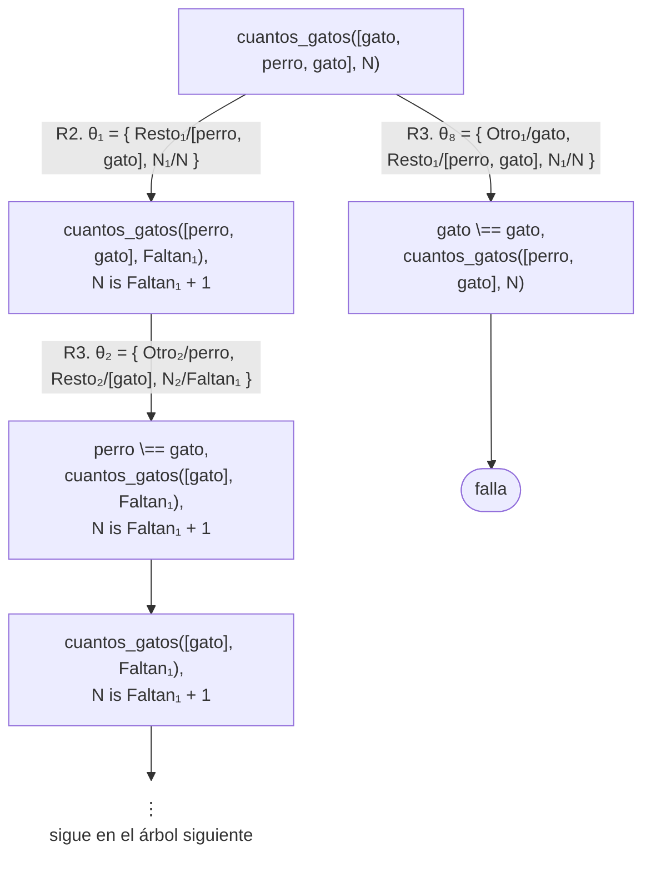
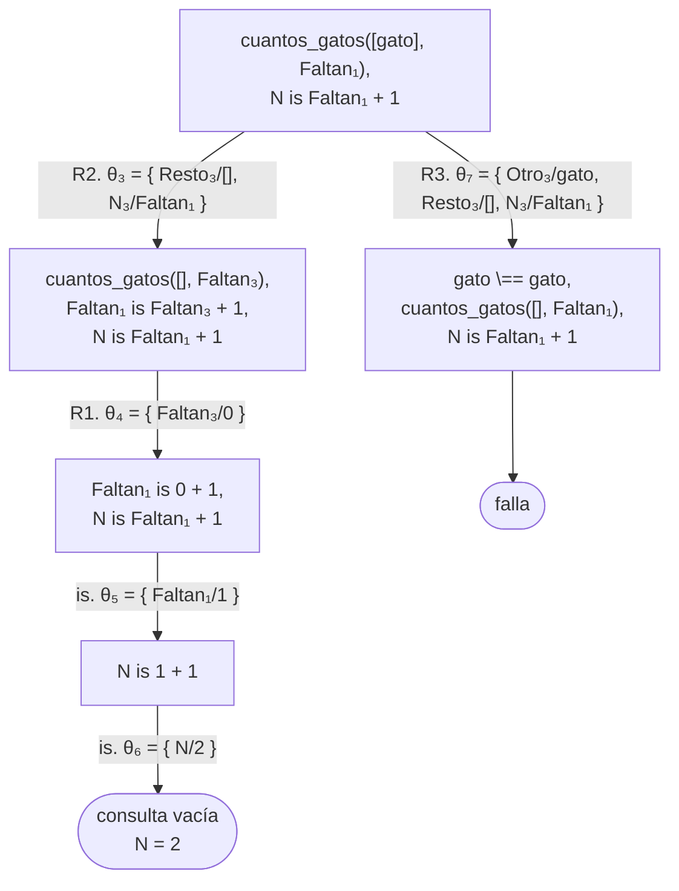
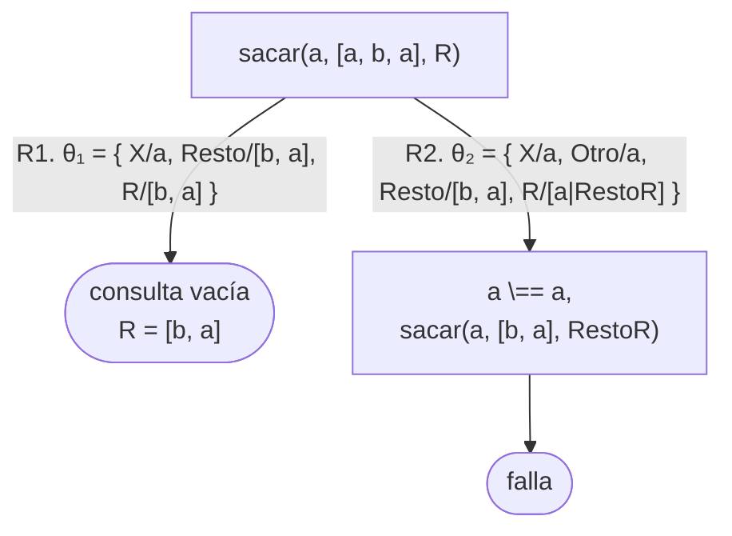
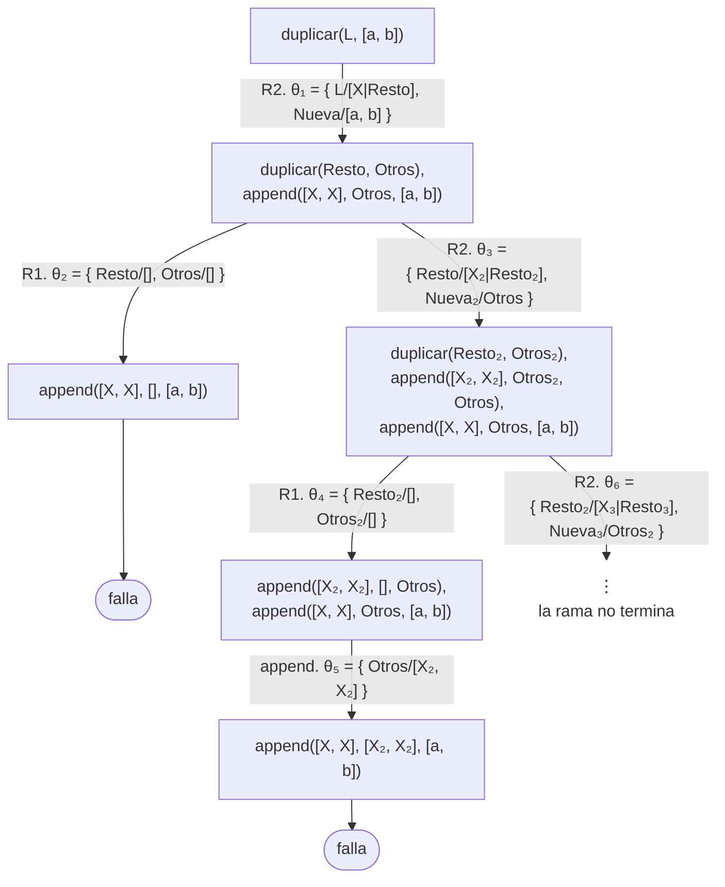
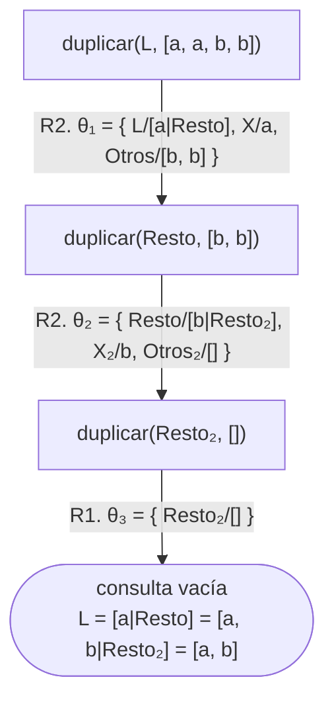
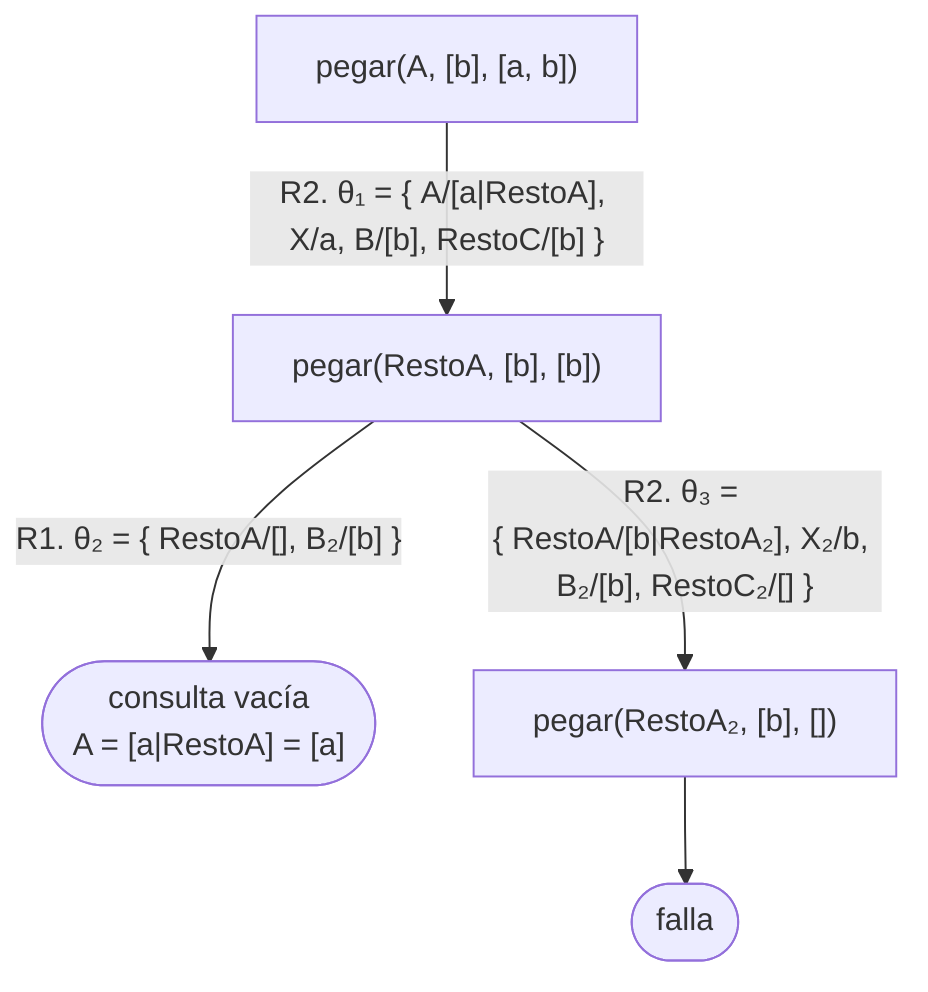

# Soluciones del capítulo 7 — Listas

El código de esta página está en `ejemplos/capitulo-07/soluciones.pl` y pasa sus
pruebas.

## 1

```prolog
?- [a, b, c] = [X|Y].
X = a,
Y = [b, c].

?- [a] = [X, Y].
false.
```

La segunda unificación falla porque `[X, Y]` es una lista de **exactamente dos**
elementos, y `[a]` tiene uno. La coma y la barra no son equivalentes: `[X, Y]`
fija la longitud de la lista; `[X|Y]` no.

## 2

```prolog
?- member(logica, [logica, algebra, analisis]).
true ;
false.
```

## 3

<!-- ejemplo: capitulo-07/soluciones.pl predicado: primero_y_ultimo/3 consulta: primero_y_ultimo([ana, luis, eva], P, U). -->
```prolog
%!  primero_y_ultimo(?L, ?P, ?U) is nondet.
%
%   P es el primero de L y U el último. Con L libre, enumera listas cada vez
%   más largas que empiezan con P y terminan con U, sin fin.
primero_y_ultimo([P|Resto], P, U) :-
    last([P|Resto], U).
```

El primer elemento se obtiene por la unificación de la cabeza; el último, con
`last/2`. La cabeza exige `[P|Resto]` para que el predicado no se cumpla con la
lista vacía, que no tiene primer ni último elemento.

El encabezado es `primero_y_ultimo(?L, ?P, ?U) is nondet`. Con `L` ligada, `P`
y `U` reciben el primero y el último, y la respuesta es una o ninguna: la lista
vacía no tiene ninguno de los dos. Con `L` libre, la relación también tiene
sentido, y el encabezado lo registra con `?`: `last/2` enumera listas cada vez
más largas que empiezan con `P` y terminan con `U`, sin fin, como `esta_en/2` en
la advertencia de la [sección 7.6](index.md#76-una-relacion-varios-sentidos). Por eso el conteo es `nondet`, y la descripción
advierte que en ese modo la enumeración no termina.

## 4

<!-- ejemplo: capitulo-07/soluciones.pl predicado: sin_el_primero/2 consulta: sin_el_primero([ana, luis, eva], R). -->
```prolog
% sin_el_primero(L, R): R es L sin su primer elemento. No requiere recursión:
% la unificación de la cabeza descompone la lista.
sin_el_primero([_|Resto], Resto).
```

No requiere recursión, por la siguiente razón: la lista ya está descompuesta en
la cabeza de la cláusula. Eliminar el primer elemento no implica un recorrido;
es suficiente una unificación.

## 5

<!-- ejemplo: capitulo-07/soluciones.pl predicado: cuantos_gatos/2 consulta: cuantos_gatos([gato, perro, gato], N). -->
```prolog
%!  cuantos_gatos(+L, -N) is det.
%
%   N es la cantidad de apariciones de gato en L.
cuantos_gatos([], 0).
cuantos_gatos([gato|Resto], N) :-
    cuantos_gatos(Resto, Faltan),
    N is Faltan + 1.
cuantos_gatos([Otro|Resto], N) :-
    Otro \== gato,
    cuantos_gatos(Resto, N).
```

Tiene tres cláusulas: la lista vacía, el caso en que el primer elemento es
`gato`, y el caso en que no lo es. La condición `Otro \== gato` de la tercera es
imprescindible: sin ella, cada aparición de `gato` se resolvería por las dos
cláusulas, y se obtendrían respuestas de más.

```prolog
?- cuantos_gatos([gato, perro, gato], N).
N = 2 ;
false.
```

El árbol de derivación muestra el trabajo de esa condición. Con las cláusulas
numeradas en el orden del programa, y las copias de `N` renombradas (`N₁`,
`N₂`, …) porque la consulta tiene su propia `N`:

| | |
|---|---|
| R1 | `cuantos_gatos([], 0).` |
| R2 | `cuantos_gatos([gato\|Resto], N) :- cuantos_gatos(Resto, Faltan), N is Faltan + 1.` |
| R3 | `cuantos_gatos([Otro\|Resto], N) :- Otro \== gato, cuantos_gatos(Resto, N).` |

El árbol está dibujado en dos partes por su altura; la primera llega hasta el
segundo `gato`:



El segundo árbol empieza en el último nodo del primero:



En cada `gato`, las cabezas de R2 y de R3 unifican, y se abren dos ramas. La de
R3 muere de inmediato en `gato \== gato`, una prueba predefinida que no se
cumple: su arco no lleva número de cláusula, y la rama termina en una hoja de
falla. En `perro` solo unifica R3, y la prueba `perro \== gato` se cumple: el
objetivo desaparece de la consulta. Los dos `is` quedan pendientes a la derecha
y se resuelven al cerrar el caso base, como en la
[sección 7.4](index.md#74-contar-durante-el-recorrido). Las dos ramas de R3
sobre un `gato` son las alternativas pendientes que explican el `;` y el
`false.` del transcripto: el predicado tiene una sola respuesta, aunque el
toplevel deba intentar esas ramas para confirmarlo.

Como en la solución 8, `\==` supone que los elementos de la lista ya tienen
valor: compara los términos tal como están escritos, y una variable sin valor se
considera distinta de `gato`.

## 6

<!-- ejemplo: capitulo-07/soluciones.pl predicado: empieza_con/2 consulta: empieza_con([ana, luis, eva], [ana, luis]). -->
```prolog
%!  empieza_con(+L, ?Principio) is nondet.
%
%   L empieza con los elementos de Principio.
empieza_con(L, Principio) :-
    append(Principio, _, L).
```

No usa recursión, y es una aplicación directa de la [sección 7.6](index.md#76-una-relacion-varios-sentidos): "L comienza con
Principio" equivale a "existe una lista que, concatenada a continuación de
Principio, produce L". `append/3` responde esa consulta en sentido inverso.

## 7

<!-- ejemplo: capitulo-07/soluciones.pl predicado: dar_vuelta/2 consulta: dar_vuelta([ana, luis, eva], R). -->
```prolog
%!  dar_vuelta(+L, -R) is det.
%!  dar_vuelta(-L, +R) is semidet.
%
%   R es L en orden inverso, sin usar reverse/2. Con L libre, después de la
%   respuesta no termina.
dar_vuelta([], []).
dar_vuelta([X|Resto], R) :-
    dar_vuelta(Resto, RestoAlReves),
    append(RestoAlReves, [X], R).
```

Invierte el resto y concatena el primer elemento **al final**. Es correcta, y es
la versión que se obtiene de manera más directa.

La segunda línea del encabezado registra el otro modo: con `R` ligada y `L`
libre hay una respuesta, `dar_vuelta(L, [a, b])` da `L = [b, a]`, pero al pedir
otra el predicado no termina, como `duplicar/2` del ejercicio 13.

Tiene una desventaja, que se analiza en el [capítulo 16](../capitulo-16-rendimiento/index.md): por cada elemento,
`append/3` recorre nuevamente toda la lista para agregarlo al final. Con listas
largas, el costo es significativo. La versión eficiente usa un acumulador, y se
presenta en el [capítulo 8](../capitulo-08-aritmetica/index.md).

## 8

<!-- ejemplo: capitulo-07/soluciones.pl predicado: sacar/3 consulta: sacar(luis, [ana, luis, eva], R). -->
```prolog
%!  sacar(+X, +L, -R) is semidet.
%
%   R es L sin la primera aparición de X.
sacar(X, [X|Resto], Resto).
sacar(X, [Otro|Resto], [Otro|RestoR]) :-
    Otro \== X,
    sacar(X, Resto, RestoR).
```

La primera cláusula elimina el elemento cuando es el primero de la lista. La
segunda lo conserva y continúa la búsqueda. La condición `Otro \== X` garantiza
que se elimine **la primera aparición** y no otra: sin ella, Prolog entregaría
también las soluciones que eliminan las apariciones siguientes.

```prolog
?- sacar(a, [a, b, a], R).
R = [b, a] ;
false.
```

El árbol de derivación, con las dos cláusulas numeradas R1 y R2, muestra que la
segunda `a` nunca llega a eliminarse. Las dos cabezas unifican con la consulta,
pero la rama de R2 muere en la prueba `a \== a`, que no se cumple:



La rama de R2 es la alternativa pendiente que explica el `;` del transcripto;
al pedir otra respuesta, la prueba falla y Prolog responde `false.`. Sin la
condición, esa rama continuaría con `sacar(a, [b, a], RestoR)` y produciría
`R = [a, b]`, la lista sin la segunda `a`.

Este predicado está pensado para consultas en las que los elementos de la lista
ya tienen valor. `\==` compara los términos tal como están escritos en ese
momento, de modo que si la lista contiene una variable sin valor, la comparación
se cumple —una variable y `luis` son términos distintos— y la búsqueda continúa
como si fueran diferentes. Sobre `sacar(luis, [X, luis], R)` eso produce una
respuesta de más, con `X` sin determinar. La [sección 10.6](../capitulo-10-negacion-como-falla/index.md#106-con-variables-libres) explica por qué.

## 9

<!-- ejemplo: capitulo-07/soluciones.pl predicado: es_sublista/2 consulta: es_sublista([luis, eva], [ana, luis, eva, sofia]). -->
```prolog
%!  es_sublista(?S, +L) is nondet.
%
%   Los elementos de S aparecen contiguos y en orden en L.
es_sublista(S, L) :-
    append(_, Atras, L),
    append(S, _, Atras).
```

Usa dos `append/3` y ninguna recursión. El primero descarta un prefijo de `L` y
conserva el resto en `Atras`; el segundo exige que `Atras` comience con `S`. En
conjunto expresan: "en alguna posición de L, de manera contigua, están los
elementos de S".

## 10

```prolog
?- length(L, 2).
L = [_, _].
```

La respuesta es una lista de dos elementos **sin determinar**: dos variables sin
instanciar. El resultado es correcto: la consulta pregunta qué listas tienen
longitud 2, y la respuesta es cualquier lista de dos elementos, cualesquiera
sean.

Es la misma idea de la [sección 7.6](index.md#76-una-relacion-varios-sentidos). `length/2` no es un procedimiento que
cuenta: es una relación entre una lista y un número, y se la puede consultar
desde cualquiera de sus dos argumentos.

## 11

- **a** es la plantilla 11, "todos los elementos cumplen": el caso base es la
  lista vacía y tiene éxito, y cada elemento se somete a una prueba de la que no
  se obtiene ningún resultado.
- **b** es la plantilla 10, "buscar un elemento que cumple": no tiene caso base
  para `[]`, y la primera cláusula termina la búsqueda en cuanto encuentra un
  elemento que pasa la prueba.
- **c** es la plantilla 12, "construir una lista durante el recorrido": tiene un
  argumento de salida, y la lista resultante se escribe en la cabeza.

Se distinguen mirando dos cosas: si hay una cláusula para `[]` y si hay un
segundo argumento que se construye.

## 12

<!-- ejemplo: capitulo-07/soluciones.pl predicado: todos_gatos/1 algun_gato/1 consulta: todos_gatos([gato, gato]). -->
```prolog
%!  todos_gatos(?L) is nondet.
%
%   Todos los elementos de L son gato. Plantilla 11. Con L libre, enumera
%   listas de gatos de largo creciente, sin fin.
todos_gatos([]).
todos_gatos([gato|Resto]) :-
    todos_gatos(Resto).

%!  algun_gato(?L) is nondet.
%
%   Alguno de los elementos de L es gato. Plantilla 10. Con L libre, enumera
%   listas con gato en cada posición, sin fin.
algun_gato([gato|_]).
algun_gato([_|Resto]) :-
    algun_gato(Resto).
```

En los dos casos la condición "ser gato" se impone por unificación en la cabeza,
escribiendo `gato` en la posición del elemento, sin ningún objetivo en el cuerpo.

Sobre la lista vacía las respuestas son opuestas, y las dos son correctas:

```prolog
?- todos_gatos([]).
true.

?- algun_gato([]).
false.
```

`todos_gatos([])` se cumple porque no hay ningún elemento que incumpla la
condición: sobre una lista sin elementos, "todos cumplen" no afirma nada que
pueda ser falso. `algun_gato([])` falla porque afirma que **existe** un elemento
con cierta propiedad, y no hay ninguno.

La diferencia está escrita en el programa: `todos_gatos/1` tiene una cláusula
para `[]` y `algun_gato/1` no.

Los dos encabezados llevan `?L` y `nondet`: con la lista libre, los dos
predicados enumeran listas sin fin, `todos_gatos/1` las de gatos de largo
creciente y `algun_gato/1` las que tienen `gato` en cada posición. Con la
lista ligada, `todos_gatos/1` responde una vez o ninguna, y `algun_gato/1`
una vez por cada gato.

## 13

El predicado construye la lista **en el cuerpo**, con `append/3`, y para hacerlo
necesita el resultado de la llamada recursiva antes de armar el suyo. No es
incorrecto en cuanto a las respuestas, pero contradice la plantilla 12 y no
cumple la segunda línea de su encabezado: con la primera lista libre, la llamada
recursiva recibe dos listas sin determinar y genera candidatos sin fin, de modo
que `duplicar(L, [a, b])` no termina.

El árbol de derivación de esa consulta, con las dos cláusulas del enunciado
numeradas R1 y R2, lo muestra. `append/3` es predefinido: su arco no lleva
número de cláusula, y cuando no tiene ninguna respuesta la rama termina en una
hoja de falla:



La llamada recursiva `duplicar(Resto, Otros)` recibe dos variables libres, y
por eso admite las dos cláusulas en cada nivel: R1 cierra con listas vacías y
R2 vuelve a plantear la misma consulta con variables nuevas, sin fin. El
`append/3` que debía armar el resultado queda siempre a la derecha, y recién
cuando una rama cierra puede comprobar que su lista no coincide con `[a, b]`:
en la primera rama, `[X, X]` exige dos elementos iguales y `a` y `b` no lo
son; en la segunda, la lista tendría cuatro elementos. La rama de R2 sigue
produciendo candidatos más largos, y ninguno coincide.

<!-- ejemplo: capitulo-07/soluciones.pl predicado: duplicar/2 consulta: duplicar([a, b], R). -->
```prolog
%!  duplicar(+L, -R) is det.
%!  duplicar(-L, +R) is semidet.
%
%   R tiene cada elemento de L repetido dos veces.
%   El resultado se escribe en la cabeza, no se arma en el cuerpo.
duplicar([], []).
duplicar([X|Resto], [X, X|Otros]) :-
    duplicar(Resto, Otros).
```

```prolog
?- duplicar([a, b], R).
R = [a, a, b, b].
```

La cabeza `[X, X|Otros]` aporta los dos elementos de esta llamada y deja el
resto sin determinar, que es exactamente lo que describe la [sección 7.5](index.md#75-construir-una-lista-durante-el-recorrido-de-otra).

Con esta versión, la consulta inversa termina:

```prolog
?- duplicar(L, [a, a, b, b]).
L = [a, b].
```

El árbol es una sola rama. La misma cabeza `[X, X|Otros]` que en el otro modo
construye el resultado, aquí **desarma** el segundo argumento, de a dos
elementos por nivel, y la primera lista se arma en la cabeza a partir de lo que
desarma. En el último nodo R2 no abre arco, porque `[]` no unifica con
`[X, X|Otros]`, y por eso la respuesta termina en punto:



## 14

| Consulta | Resultado |
|---|---|
| `pegar([a], [b], R).` | una respuesta, `R = [a, b]`, y termina sin alternativas |
| `pegar(A, [b], [a, b]).` | una respuesta, `A = [a]`, pero deja una alternativa abierta |
| `pegar([a], B, [a, b]).` | una respuesta, `B = [b]` |
| `pegar(A, B, [a, b]).` | tres respuestas: las tres particiones |

Las cuatro terminan, porque en todas hay una lista completa por la cual
recorrer: la primera o la tercera. La advertencia de la [sección 7.6](index.md#76-una-relacion-varios-sentidos) se aplica al
caso que no está en esta tabla, `pegar(A, B, C)` con las tres sin determinar,
que produce particiones sin fin.

La segunda consulta requiere una observación: responde `A = [a] ;` y recién al pedir otra
respuesta contesta `false.` Que quede una alternativa abierta no significa que
haya otra respuesta.

<!-- contexto: capitulo-07/recorrer.pl -->
```prolog
?- pegar(A, [b], [a, b]).
A = [a] ;
false.
```

El árbol de derivación, con las dos cláusulas de `pegar/3` numeradas R1 y R2
como en la [sección 7.5](index.md#75-construir-una-lista-durante-el-recorrido-de-otra),
muestra esa alternativa. En la raíz solo unifica R2, porque R1 exigiría que
`[b]` y `[a, b]` fueran la misma lista. En el segundo nodo unifican las dos: R1
da la respuesta, y R2 queda pendiente; al pedir otra respuesta, esa rama llega
a `pegar(RestoA₂, [b], [])`, donde ninguna cabeza unifica:



La alternativa abierta es una rama del árbol que todavía no se recorrió, no una
respuesta: Prolog no puede saber que fallará hasta que la recorre.

## 15

<!-- ejemplo: capitulo-07/soluciones.pl predicado: segundo/2 consulta: segundo([ana, luis, eva], X). -->
```prolog
% segundo(L, X): X es el segundo elemento de L.
segundo([_, X|_], X).
```

Un solo hecho, sin cuerpo y sin recursión: es la plantilla 7 del [capítulo 4](../capitulo-04-terminos-y-unificacion/index.md)
aplicada a una lista. El patrón `[_, X|_]` describe "una lista con por lo menos
dos elementos, del cual interesa el segundo".

```prolog
?- segundo([ana], X).
false.
```

Responde `false.` porque `[ana]` no unifica con `[_, X|_]`: ese patrón exige dos
elementos antes de la barra, y la lista tiene uno. No es un error ni una lista
mal formada: la lista no tiene segundo elemento.

## 16

```prolog
% Una sola respuesta, aunque el elemento aparezca dos veces: la condición
% Otro \== X impide saltear la primera aparición.
test(sacar_la_primera_aparicion, all(R == [[b, a]])) :-
    sacar(a, [a, b, a], R).

test(sacar_lo_que_no_esta, [fail]) :-
    sacar(z, [a, b], _).

test(sacar_de_la_vacia, [fail]) :-
    sacar(a, [], _).
```

La primera prueba es la que requiere más atención, porque se podría
suponer que `sacar(a, [a, b, a], R)` tiene dos respuestas, una por cada `a`. No
las tiene: la condición `Otro \== X` de la segunda cláusula impide que el
recorrido saltee una aparición del elemento buscado, que es justamente lo que
hace que se elimine **la primera**. El árbol de derivación de esa consulta está
en la [solución 8](#8): la rama que eliminaría la segunda `a` muere en
`a \== a`.

La tercera prueba documenta el caso límite: sobre la lista vacía no hay cláusula
aplicable, y el predicado falla.

## 17

<!-- ejemplo: capitulo-07/soluciones.pl predicado: materias/1 materia_en/2 consulta: materia_en(3, M). -->
```prolog
% materias(L): L es la lista de materias, en orden.
materias([logica, algebra, fisica, quimica]).

%!  materia_en(?N, ?M) is nondet.
%
%   M es la materia que ocupa la posición N de la lista, contando desde 1.
materia_en(N, M) :-
    materias(Lista),
    nth1(N, Lista, M).
```

La regla tiene la misma forma que `en_el_puesto/2`: obtiene la lista del hecho
y deja que `nth1/3` relacione la posición con el elemento. Como `nth1/3` admite
los dos sentidos, `materia_en/2` también los admite, sin ninguna cláusula
adicional:

```prolog
?- materia_en(3, M).
M = fisica.

?- materia_en(N, fisica).
N = 3 ;
false.
```

Con la posición dada, la respuesta es una sola y no quedan alternativas. Con la
materia dada, `nth1/3` recorre la lista comparando cada elemento con `fisica`;
después de encontrarlo en la posición 3 queda por examinar el resto de la
lista, y por eso la respuesta termina en `;` y `false.`

```prolog
?- nth1(N, [a, b, a], a).
N = 1 ;
N = 3.
```

`a` aparece dos veces, y la consulta inversa da una respuesta por cada
aparición, en el orden de la lista. Es la misma situación de `esta_en/2` en la
[sección 7.3](index.md#73-recorrer-una-lista): una respuesta por cada
demostración. Por eso el encabezado declara `nondet` y no `semidet`: con la
materia dada, una lista con repeticiones produce más de una posición.

## 18

```prolog
?- [[a, b], c] = [X|Y].
X = [a, b],
Y = [c].

?- [[a, b], c] = [[X|Y]|Z].
X = a,
Y = [b],
Z = [c].

?- [fecha(2021, 5, 3), ana] = [fecha(A, M, D)|R].
A = 2021,
M = 5,
D = 3,
R = [ana].

?- [mascota(gato, felix)] = [mascota(E, N), Otro].
false.

?- [a, b|c] = [X|Y].
X = a,
Y = [b|c].

?- [a, b|c] = [a, b, c].
false.
```

En la primera, el primer elemento es la lista `[a, b]` completa: la barra separa
el primer elemento del resto sin examinar qué clase de término es ese elemento.
La segunda aplica el patrón `[X|Y]` **dentro** del primer elemento, y por eso
`X` y `Y` descomponen `[a, b]`, mientras `Z` recibe el resto de la lista
exterior. La tercera combina las reglas del
[capítulo 4](../capitulo-04-terminos-y-unificacion/index.md): el primer elemento
unifica como cualquier término compuesto, argumento por argumento. La cuarta
falla por la longitud, igual que `[a] = [X, Y]` del ejercicio 1: la lista de la
izquierda tiene un elemento y el patrón de la derecha exige dos.

Las dos últimas muestran que la unificación no verifica que un término sea una
lista. `[a, b|c]` es el término `'[|]'(a, '[|]'(b, c))`: dos términos
compuestos anidados, con el nombre y la aridad de toda lista no vacía, y la
consulta los unifica con `[X|Y]` como a cualquier otro par de términos. Pero la
definición de la [sección 7.1](index.md#71-una-lista-es-un-termino) exige que el
segundo argumento sea **una lista**, y al final de la cadena el segundo
argumento es `c`, un átomo, en lugar de `[]`. Por eso `[a, b|c]` no es una lista
y no unifica con `[a, b, c]`, cuyo final es `[]`: las dos coinciden en `a` y en
`b`, y la unificación falla al comparar `c` con `[c]`. Un predicado que recorre
listas con las plantillas del capítulo falla sobre ese término, porque al llegar
a `c` no lo alcanza ni el caso base `[]` ni el caso recursivo `[X|Resto]`.
