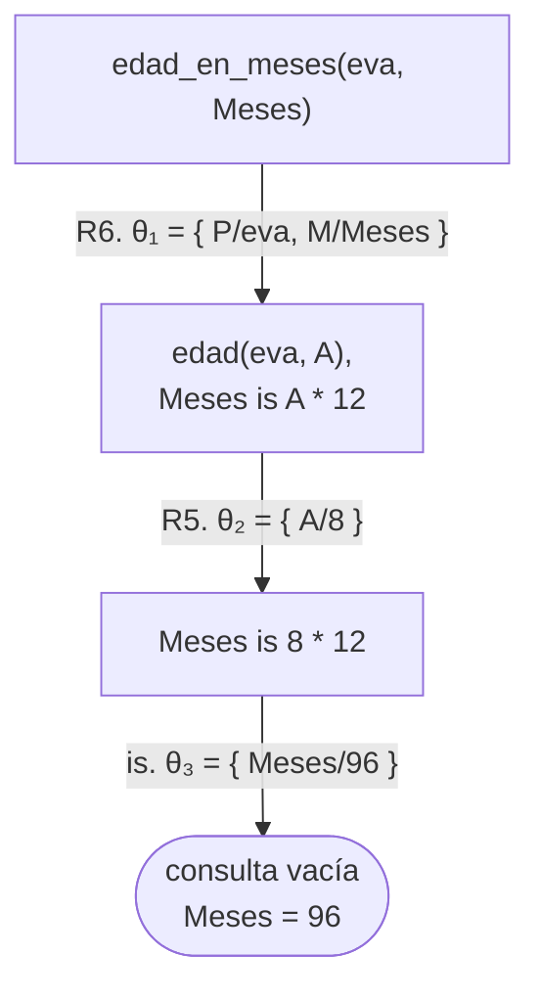
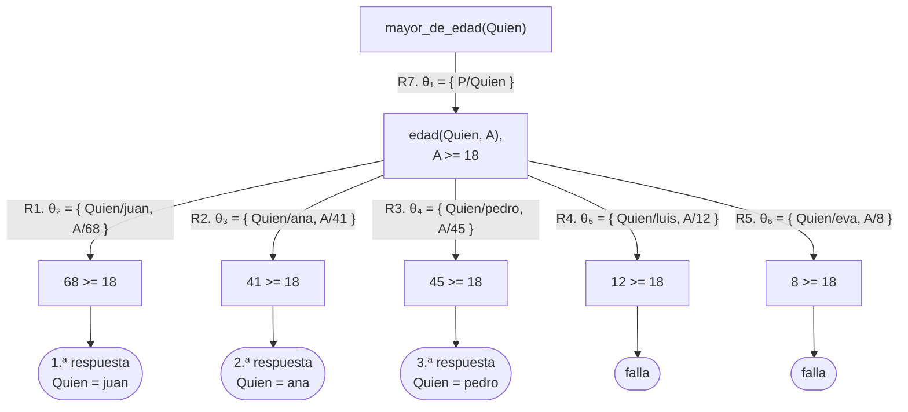
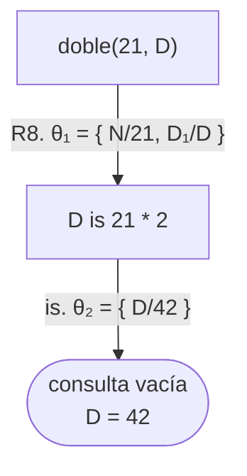
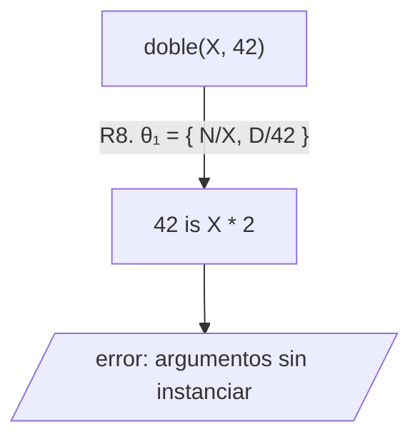
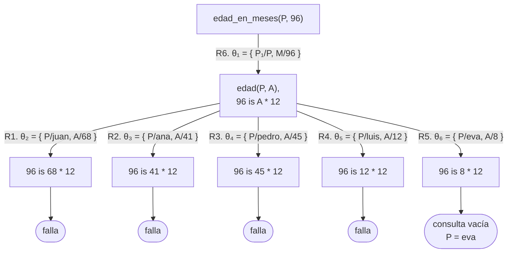
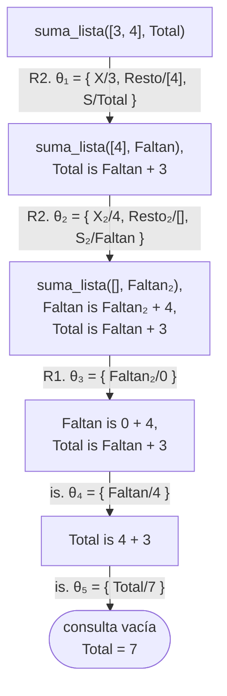
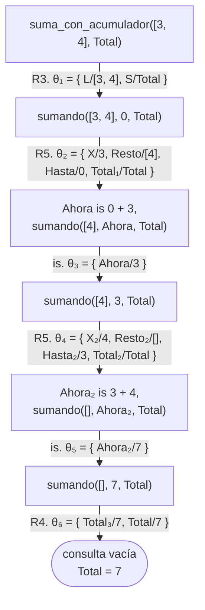
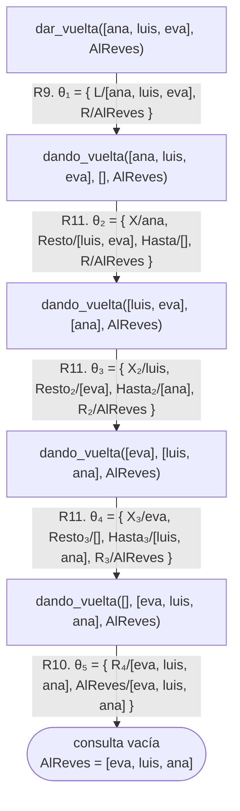

# Capítulo 8 — Aritmética

La aritmética en Prolog tiene una característica que se debe tener presente
desde el comienzo: **las expresiones no se evalúan de manera automática**. La
evaluación se solicita con un predicado específico, cuyas reglas difieren de las
del resto del lenguaje.

Este capítulo explica esas reglas, y presenta además el **acumulador**, que es
la técnica para escribir una recursión que transporta un resultado parcial a
medida que avanza. Se usa en todos los capítulos posteriores.

## Objetivos del capítulo

Al terminar el capítulo, el lector puede:

- evaluar una expresión con `is/2`, y determinar qué condiciones requiere la
  evaluación;
- elegir entre `=` y `=:=` según la pregunta que plantea cada uno;
- interpretar el error de argumentos sin instanciar, y corregirlo;
- explicar por qué en algunos casos una relación aritmética admite la consulta
  inversa y en otros no;
- escribir una recursión con acumulador, y explicar en qué difiere de la
  recursión sin acumulador.

!!! info "Tiempo estimado"
    Leer el capítulo, ejecutar sus ejemplos y hacer las actividades: **1:10 h**.
    Resolver los 6 ejercicios marcados con ★: **1:10 h**.
    Resolver los 16 ejercicios del final: **4:55 h**.

## 8.1 Evaluación de expresiones

Como se mostró en los capítulos [1](../capitulo-01-la-primera-hora/index.md) y [4](../capitulo-04-terminos-y-unificacion/index.md), `2 + 3` es un término compuesto, no un
número. La evaluación se debe solicitar de manera explícita:

```prolog
?- X is 2 + 3.
X = 5.
```

`is` se lee "es el resultado de". A la derecha se escribe la expresión; a la
izquierda, un término, que habitualmente es una variable libre.

Conviene ser preciso sobre lo que hace `is/2`, porque de eso dependen varias
secciones de este capítulo: **evalúa la expresión de la derecha y unifica el
resultado con el término de la izquierda**. No asigna. Si a la izquierda hay una
variable libre, la unificación siempre se cumple y la variable queda con el
valor; pero si a la izquierda hay un número, `is/2` funciona como una
comprobación:

```prolog
?- 8 is 3 + 5.
true.
```

De ahí se sigue el resultado de una consulta que se escribe con frecuencia:

```prolog
?- N is N + 1.
ERROR: Arguments are not sufficiently instantiated
```

`N` no se incrementa. Si `N` no tiene valor, la expresión de la derecha no se
puede evaluar, que es el error mostrado; y si lo tuviera, la consulta pediría
unificar ese valor con el siguiente, y respondería `false.`. Una variable, una
vez ligada, conserva su valor.

Los ejemplos de este capítulo están en `cuentas.pl`. El archivo parte de cinco
hechos `edad/2`, y sobre ellos define dos reglas: una evalúa una expresión con
`is/2` y la otra compara con `>=`, uno de los operadores de comparación que la
sección siguiente presenta:

<!-- ejemplo: capitulo-08/cuentas.pl predicado: edad/2 edad_en_meses/2 mayor_de_edad/1 consulta: edad_en_meses(eva, Meses). -->
```prolog
% edad(P, A): P tiene A años.
edad(juan, 68).
edad(ana, 41).
edad(pedro, 45).
edad(luis, 12).
edad(eva, 8).

%!  edad_en_meses(?P, -M) is nondet.
%
%   M es la edad de P expresada en meses.
edad_en_meses(P, M) :-
    edad(P, A),
    M is A * 12.

%!  mayor_de_edad(?P) is nondet.
%
%   P tiene 18 años o más.
mayor_de_edad(P) :-
    edad(P, A),
    A >= 18.
```

```prolog
?- edad_en_meses(eva, Meses).
Meses = 96.

?- mayor_de_edad(Quien).
Quien = juan ;
Quien = ana ;
Quien = pedro ;
false.
```

En las dos reglas, `edad(P, A)` da valor a `A` antes de que la expresión se
evalúe o se compare. La [sección 8.4](#84-cuando-se-admite-la-consulta-inversa)
muestra qué consultas admite esa forma.

El árbol de derivación del [capítulo 5](../capitulo-05-como-responde-prolog/index.md)
muestra ese orden. Con las cláusulas de `cuentas.pl` numeradas en el orden del
archivo:

| | |
|---|---|
| R1 | `edad(juan, 68).` |
| R2 | `edad(ana, 41).` |
| R3 | `edad(pedro, 45).` |
| R4 | `edad(luis, 12).` |
| R5 | `edad(eva, 8).` |
| R6 | `edad_en_meses(P, M) :- edad(P, A), M is A * 12.` |
| R7 | `mayor_de_edad(P) :- edad(P, A), A >= 18.` |



Como en la [sección 6.6](../capitulo-06-recursion/index.md#66-recursion-que-produce-un-resultado),
el arco de `is` no lleva número de cláusula, porque `is/2` es un objetivo
predefinido y no emplea ninguna; lleva sustitución porque liga una variable.
Esa sustitución, `{ Meses/96 }`, la produce la unificación del resultado de
evaluar `8 * 12` con el término de la izquierda, no una asignación. Cuando
`is` se ejecuta, `A` ya fue reemplazada por `8` en el arco anterior.

El árbol de `mayor_de_edad(Quien)` tiene una rama por cada hecho de `edad/2`:



La comparación `>=` tampoco emplea ninguna cláusula, y como no liga ninguna
variable su arco no lleva sustitución: si se cumple, el objetivo desaparece de
la consulta; si no, la rama falla. Las dos últimas ramas, las de luis y eva,
fallan en la comparación, y son el `false.` con que termina el transcripto:
después de `Quien = pedro` quedaban dos alternativas por recorrer, y ninguna
produce una respuesta.

Los operadores disponibles en la expresión son los habituales: `+`, `-`, `*`,
`/`, y otros dos de uso frecuente:

- `//` es la división entera: `7 // 2` produce `3`;
- `mod` es el resto de la división entera: `7 mod 2` produce `1`.

Los ejemplos y los ejercicios de este capítulo usan `//` y `mod` sobre números
naturales, que es donde su comportamiento es el esperado. Con números negativos
los dos operadores siguen convenciones distintas y dejan de formar un par
consistente, de modo que conviene no darlos por equivalentes fuera de los
naturales.

La división `/` tiene un comportamiento particular: produce un **entero cuando
el cociente es exacto**, y un número de punto flotante cuando no lo es.

```prolog
?- X is 10 / 5.
X = 2.

?- X is 10 / 4.
X = 2.5.
```

Cuando se requiere siempre un resultado entero, corresponde usar `//`. Si el
programa compara el resultado con otro término, se debe tener en cuenta que `2`
y `2.0` no son el mismo término, aunque su valor numérico sea el mismo. La
sección siguiente trata ese tema.

!!! question "Actividad"
    Predecir qué responden `X is 7 // 2`, `X is 7 mod 2`, `X is 7 / 2` y
    `X is 8 / 2`, y ejecutarlas después. Explicar por qué las dos últimas
    producen números de tipos distintos.

## 8.2 Comparación de números

Existen seis operadores de comparación: `<`, `>`, `=<`, `>=`, y otros dos que
requieren atención: `=:=` (igualdad numérica) y `=\=` (desigualdad numérica).

Los seis **evalúan las expresiones de ambos lados antes de comparar**, igual que
`is`:

```prolog
?- 2 + 3 =:= 5.
true.

?- 2 + 3 =\= 6.
true.

?- 3 =< 2 + 1.
true.

?- 7 > 2 * 4.
false.
```

La diferencia siguiente es una fuente frecuente de confusión:

```prolog
?- 2 + 3 = 5.
false.
```

El operador `=`, usado desde el [capítulo 1](../capitulo-01-la-primera-hora/index.md), es la **unificación**: pregunta si
dos términos pueden hacerse idénticos, y `2+3` y `5` son términos distintos. El
operador `=:=` pregunta si dos expresiones **tienen el mismo valor**. Son dos
preguntas diferentes.

El ejemplo siguiente lo muestra con mayor claridad:

```prolog
?- 5 =:= 5.0.
true.

?- 5 = 5.0.
false.
```

`5` y `5.0` tienen el mismo valor numérico, pero no son el mismo término: uno es
un entero y el otro, un número de punto flotante.

La regla práctica es la siguiente: **para comparar dos valores numéricos se usa
`=:=`; para unificar dos términos cualesquiera se usa `=`**. El tercer
operador, `==`, cuya negación `\==` se usó en la
[sección 3.5](../capitulo-03-reglas-y-conjunciones/index.md#35-una-regla-que-produce-respuestas-de-mas),
se presenta en la
[sección 10.5](../capitulo-10-negacion-como-falla/index.md#105-los-seis-operadores-de-igualdad-y-desigualdad),
que reúne los seis operadores de igualdad y desigualdad.

!!! question "Actividad"
    ¿Qué responden `luis = luis` y `luis =:= luis`? La segunda no responde
    `true`: examinar el error que produce y explicar por qué es correcto.

## 8.3 Argumentos sin instanciar

El siguiente es el error más frecuente de este capítulo. `doble/2`, también
en `cuentas.pl`, evalúa una expresión sobre su primer argumento:

<!-- ejemplo: capitulo-08/cuentas.pl predicado: doble/2 consulta: doble(21, D). -->
```prolog
%!  doble(+N, -D) is det.
%
%   D es el doble de N. Muestra el comportamiento de is/2 cuando N no está
%   instanciada.
doble(N, D) :-
    D is N * 2.
```

```prolog
?- doble(21, D).
D = 42.

?- doble(X, 42).
ERROR: Arguments are not sufficiently instantiated
```

En la consulta `doble(X, 42)`, `N` está libre, de modo que la expresión a
evaluar es `X * 2`, con `X` sin valor. Esa expresión no se puede evaluar, y
Prolog informa el error.

Los dos árboles muestran la diferencia. Con `doble/2` numerada R8, a
continuación de las cláusulas de la [sección 8.1](#81-evaluacion-de-expresiones)
—la regla tiene una variable `D`, como la primera consulta, y en el árbol se
escribe `D₁` para distinguirla de ella—:





La **hoja de error** tiene una forma distinta de la hoja «falla», porque un
error no es una falla: la rama no se cierra, se **interrumpe**. Tras una falla
Prolog retrocede a la alternativa pendiente más cercana; tras un error no
retrocede a ninguna, aunque exista, y la consulta termina con el mensaje. La
[sección 12.6](../capitulo-12-prolog-y-la-logica/index.md#126-lo-que-excede-la-logica)
llama a este desenlace el tercero, junto a `true.` y `false.`

Lo relevante es lo que Prolog **no** hace: no despeja la incógnita. No deduce
que, si el doble es 42, el número es 21. `is/2` es un evaluador, no un
mecanismo de resolución de ecuaciones: requiere que todas las variables de la
expresión tengan valor, y opera en un único sentido. Es lo que dice su
documentación, `-Number is +Expr`, con los signos de la [sección 2.8](../capitulo-02-hechos-consultas-y-variables/index.md#28-como-se-documenta-el-uso-de-un-predicado): la
expresión es un argumento de entrada.

Conviene distinguir dos motivos diferentes por los cuales una expresión no se
puede evaluar, porque Prolog los informa con mensajes distintos y se corrigen de
maneras distintas:

```prolog
?- X is 3 + ana.
ERROR: Arithmetic: `ana/0' is not a function

?- X is 3 + Y.
ERROR: Arguments are not sufficiently instantiated
```

En el primer caso la expresión contiene algo que **no es un número y nunca lo
va a ser**: hay un error en el programa o en los datos. Es el mismo error de la
actividad de la [sección 8.2](#82-comparacion-de-numeros), con `luis =:= luis`. En el segundo, la expresión
contiene una variable sin valor, que **podría tenerlo**: en general no se debe
corregir la expresión sino el orden de los objetivos, de modo que la variable
reciba su valor antes.

El contraste con `suma/3` del [capítulo 6](../capitulo-06-recursion/index.md), definida sobre los términos
`s(s(cero))`, es ilustrativo. Aquella admitía consultas en ambos sentidos, porque
estaba definida como una **relación** entre tres números, mediante el recorrido
de términos. `is/2` no define una relación: evalúa.

Es el costo de usar los números predefinidos, que son mucho más eficientes y más
prácticos que la notación `s(s(s(cero)))`. El [capítulo 23](../capitulo-23-programacion-con-restricciones/index.md) presenta una técnica que
recupera los dos sentidos sin renunciar a los números predefinidos.

Ese costo tiene una segunda mitad, que conviene anticipar. Con la notación
`s(s(cero))`, la unificación con la estructura decidía sola qué cláusula
correspondía —`cero` o `s(N)`— y garantizaba que cada llamada recursiva recibiera
un término más chico. Con los números predefinidos esa garantía desaparece: un
número no tiene estructura que distinga el caso base del recursivo, y es necesario
reponer de manera explícita, con una condición como `N > 0`, lo que antes daba
la unificación. Un predicado aritmético recursivo que no termina suele tener
exactamente ese problema.

Por eso, en un predicado que usa aritmética conviene marcar en el encabezado,
con `+`, **qué argumentos deben tener valor** al invocarlo, como en
`doble(+N, -D)`. No es una formalidad: es la diferencia entre un predicado que
se puede consultar en cualquier sentido y uno que solo es correcto sobre cierto
conjunto de consultas.

## 8.4 Cuándo se admite la consulta inversa

Sin embargo, la consulta siguiente funciona:

```prolog
?- edad_en_meses(P, 96).
P = eva.
```

La consulta pregunta **quién** tiene 96 meses de edad, con el primer argumento
libre, y obtiene una respuesta. Pero `edad_en_meses/2` usa `is/2`, que según la
sección anterior no opera en sentido inverso.

La explicación está en el orden de los objetivos del cuerpo:

```prolog
%!  edad_en_meses(?P, -M) is nondet.
%
%   M es la edad de P expresada en meses.
edad_en_meses(P, M) :-
    edad(P, A),
    M is A * 12.
```

Cuando la ejecución llega a `is`, `A` **ya tiene valor**, porque `edad(P, A)` se
lo asignó. Prolog probó cada persona, calculó su edad en meses y comparó el
resultado con 96, hasta encontrar la que coincide. No despejó ninguna
incógnita: **generó candidatos y los verificó**.

El árbol dibuja ese recorrido, con la numeración de la
[sección 8.1](#81-evaluacion-de-expresiones). La regla tiene una variable `P`,
como la consulta, y en el árbol se escribe `P₁` para distinguirla de ella:



En las cinco ramas `is` llega con un número a la izquierda, y es una
comprobación, como en `8 is 3 + 5` de la [sección 8.1](#81-evaluacion-de-expresiones):
en cuatro de ellas el resultado de la expresión no unifica con `96` y la rama
**falla**, como fallaría una comparación; en la quinta unifica, sin ligar nada,
y por eso el arco no lleva sustitución. La hoja de éxito es la última del
árbol: no queda ninguna alternativa pendiente, y la respuesta termina en punto,
`P = eva.`, a diferencia del `false.` final de `mayor_de_edad(Quien)`.

Esta técnica tiene aplicación general en Prolog: cuando no es posible calcular
en sentido inverso, se generan las posibilidades en sentido directo y se
verifica cada una. Es la plantilla 5 del [capítulo 3](../capitulo-03-reglas-y-conjunciones/index.md), y se desarrolla en detalle
en el [capítulo 9](../capitulo-09-backtracking-y-corte/index.md).

La diferencia entre `doble(X, 42)` y `edad_en_meses(P, 96)` no está en `is/2`:
está en que la segunda tiene, antes de `is/2`, un objetivo capaz de generar los
valores numéricos.

## 8.5 Acumuladores

En las recursiones anteriores que producen un número, la operación aritmética se
realiza **al retorno** de la llamada recursiva: primero se ejecuta la llamada, y
con su resultado se calcula la contribución propia. Así están definidos
`largo/2` del [capítulo 7](../capitulo-07-listas/index.md) y `generaciones/3` del [capítulo 6](../capitulo-06-recursion/index.md).

Esa forma tiene una limitación, señalada al final de la [sección 7.5](../capitulo-07-listas/index.md#75-construir-una-lista-durante-el-recorrido-de-otra): mientras la
recursión avanza, el resultado todavía no existe —se arma recién al volver—, de
modo que **ninguna llamada puede consultar lo que se lleva hecho**. Para sumar
no hace falta; pero en cuanto un predicado necesita saber qué recorrió para
decidir el paso siguiente, esta forma no alcanza.

Existe otra forma, que construye el resultado en el sentido contrario:
transportar el resultado parcial **durante el avance**, en un argumento
adicional. Ese argumento se denomina **acumulador**, y como viaja hacia adelante,
cada llamada puede consultarlo.

Las dos versiones de la suma de una lista son las siguientes:

<!-- ejemplo: capitulo-08/acumuladores.pl predicado: suma_lista/2 consulta: suma_lista([3, 1, 4], Total). -->
```prolog
%!  suma_lista(+L, -S) is det.
%
%   S es la suma de los números de L.
%   La operación se realiza al retorno de la llamada recursiva.
suma_lista([], 0).
suma_lista([X|Resto], S) :-
    suma_lista(Resto, Faltan),
    S is Faltan + X.
```

<!-- ejemplo: capitulo-08/acumuladores.pl predicado: suma_con_acumulador/2 sumando/3 consulta: suma_con_acumulador([3, 1, 4], Total). -->
```prolog
%!  suma_con_acumulador(+L, -S) is det.
%
%   La misma relación, con un acumulador.
suma_con_acumulador(L, S) :-
    sumando(L, 0, S).

%!  sumando(+L, +Hasta, -Total) is det.
%
%   Total es Hasta más la suma de los elementos de L.
%   Hasta es el acumulador: comienza en 0 y se incrementa en cada llamada.
sumando([], Total, Total).
sumando([X|Resto], Hasta, Total) :-
    Ahora is Hasta + X,
    sumando(Resto, Ahora, Total).
```

`sumando/3` tiene un argumento más que el predicado que invoca el usuario:
`Hasta`, que contiene la suma de los elementos ya recorridos. Su valor inicial
es `0`, y se incrementa en cada llamada, antes de continuar. Cuando la lista se
agota, el valor acumulado **es** el resultado, y eso es lo que establece el caso
base:

```prolog
sumando([], Total, Total).
```

Este caso base es el elemento central de la plantilla, y el que presenta mayor
dificultad inicial: no realiza ningún cálculo; solo establece que, cuando no
quedan elementos por recorrer, el valor acumulado es el resultado.

Los dos árboles de derivación muestran en qué difieren las dos versiones. Con
las cinco cláusulas de `acumuladores.pl` numeradas en el orden del archivo:

| | |
|---|---|
| R1 | `suma_lista([], 0).` |
| R2 | `suma_lista([X\|Resto], S) :- suma_lista(Resto, Faltan), S is Faltan + X.` |
| R3 | `suma_con_acumulador(L, S) :- sumando(L, 0, S).` |
| R4 | `sumando([], Total, Total).` |
| R5 | `sumando([X\|Resto], Hasta, Total) :- Ahora is Hasta + X, sumando(Resto, Ahora, Total).` |

Los árboles se dibujan para la lista `[3, 4]`, de dos elementos; con
`[3, 1, 4]` son los mismos árboles con un nivel más. Cada uso de R2 toma una
copia con variables nuevas, que se escriben con un subíndice: `Faltan`,
`Faltan₂`.

```prolog
?- suma_lista([3, 4], Total).
Total = 7.

?- suma_con_acumulador([3, 4], Total).
Total = 7.
```



Cada nodo arrastra un `is` más que el anterior: la operación queda
**pendiente** hasta que la recursión llega a la lista vacía, y recién entonces
los `is` se evalúan, de abajo hacia arriba. En la versión con acumulador la
regla R5 tiene una variable `Total`, como la consulta, y en el árbol se escribe
`Total₁` en el primer uso y `Total₂` en el segundo; la de R4 es `Total₃`:



Aquí los nodos tienen siempre el mismo ancho: cada `is` se evalúa en el arco
siguiente al que lo introduce, y el acumulador llega a la lista vacía con el
resultado ya calculado. El último arco, el de R4, no evalúa nada: su
sustitución liga `Total` al `7` que el acumulador trae, y esa sustitución es la
respuesta.

!!! question "Actividad"
    Ejecutar `suma_con_acumulador([3, 1, 4], S).` con `trace` y anotar, en
    cada llamada a `sumando/3`, el valor del acumulador y lo que queda de la
    lista. Verificar que en la última llamada la lista está vacía y el
    acumulador ya contiene el resultado.

El mismo esquema cuenta los elementos de una lista. Es `largo/2` del
[capítulo 7](../capitulo-07-listas/index.md), con un acumulador que empieza en `0` y se incrementa en `1` por
cada elemento:

<!-- ejemplo: capitulo-08/acumuladores.pl predicado: largo/2 contando/3 consulta: largo([ana, luis, eva], N). -->
```prolog
%!  largo(?L, ?N) is nondet.
%
%   N es la cantidad de elementos de L, también con acumulador. Con L libre y
%   N ligado, da la lista de N variables y después no termina.
largo(L, N) :-
    contando(L, 0, N).

%!  contando(?L, +Hasta, ?N) is nondet.
%
%   N es Hasta más la cantidad de elementos de L. Admite los mismos modos que
%   largo/2, con la misma limitación: con L libre y N ligado no termina.
contando([], N, N).
contando([_|Resto], Hasta, N) :-
    Ahora is Hasta + 1,
    contando(Resto, Ahora, N).
```

```prolog
?- largo([ana, luis, eva], N).
N = 3.
```

También es significativa la ubicación de `is`. En la versión sin acumulador está
**después** de la llamada recursiva, porque requiere su resultado. En la versión
con acumulador está **antes**, porque todos los valores que requiere ya están
disponibles. Esta diferencia tiene consecuencias: el [capítulo 16](../capitulo-16-rendimiento/index.md) explica por qué
la segunda versión usa mucha menos memoria.

!!! abstract "Plantilla 13 — Acumulador"
    **Cuándo**: la recursión debe construir un resultado a medida que avanza.

    ```prolog
    %!  p(+Entrada, -Resultado) is det.
    %
    %   Resultado se construye a partir de Entrada, elemento por elemento.
    p(Entrada, Resultado) :-
        paso_a_paso(Entrada, ValorInicial, Resultado).

    %!  paso_a_paso(+L, +Hasta, -Resultado) is det.
    %
    %   Resultado es Hasta combinado con los elementos de L.
    paso_a_paso([], Acumulado, Acumulado).
    paso_a_paso([X|Resto], Hasta, Resultado) :-
        combinar(Hasta, X, Ahora),
        paso_a_paso(Resto, Ahora, Resultado).
    ```

    El predicado que invoca el usuario tiene un argumento menos: su función es
    proveer el valor inicial. El caso base no realiza ningún cálculo; solo
    entrega el valor acumulado.

    **En este capítulo se usa en**: `suma_con_acumulador/2`, `largo/2` y
    `dar_vuelta/2` (8.5 y 8.6). Las demás plantillas están en
    [esta página](../plantillas.md).

## 8.6 Un acumulador que no es un número

El acumulador no es necesariamente un número. Puede ser cualquier término que se
construya de manera incremental; el ejemplo más representativo es la inversión
de una lista:

<!-- ejemplo: capitulo-08/acumuladores.pl predicado: dar_vuelta/2 dando_vuelta/3 consulta: dar_vuelta([ana, luis, eva], AlReves). -->
```prolog
%!  dar_vuelta(+L, -R) is det.
%
%   R es L en orden inverso. En este caso el acumulador no es un número: es la
%   lista que se construye.
dar_vuelta(L, R) :-
    dando_vuelta(L, [], R).

%!  dando_vuelta(+L, +Hasta, -R) is det.
%
%   R es L en orden inverso, seguida de Hasta.
dando_vuelta([], R, R).
dando_vuelta([X|Resto], Hasta, R) :-
    dando_vuelta(Resto, [X|Hasta], R).
```

El acumulador comienza en `[]`, y en cada llamada se le agrega al comienzo el
elemento que se acaba de extraer. Agregar al comienzo del acumulador los
elementos que se extraen del comienzo de la lista equivale, precisamente, a
invertirla.

```prolog
?- dar_vuelta([ana, luis, eva], AlReves).
AlReves = [eva, luis, ana].
```

El árbol es lineal, y el acumulador crece por el frente en cada arco. Con
`dar_vuelta/2` y `dando_vuelta/3` numeradas a continuación de las cláusulas de
la [sección 8.5](#85-acumuladores) —R6 a R8 son las de `largo/2` y
`contando/3`—:

| | |
|---|---|
| R9 | `dar_vuelta(L, R) :- dando_vuelta(L, [], R).` |
| R10 | `dando_vuelta([], R, R).` |
| R11 | `dando_vuelta([X\|Resto], Hasta, R) :- dando_vuelta(Resto, [X\|Hasta], R).` |



No hay ninguna evaluación aritmética: todo el trabajo lo hace la unificación
de la cabeza de R11, que extrae `X` de la lista y lo agrega al acumulador en el
mismo paso. Como en `sumando/3`, el caso base R10 no calcula nada: liga
`AlReves` a la lista acumulada.

La versión del [ejercicio 7 del capítulo 7](../capitulo-07-listas/soluciones.md#7) usaba `append/3` para agregar cada elemento al final.
Aquella recorría toda la lista nuevamente por cada elemento; esta la recorre una
sola vez. Con tres elementos la diferencia es imperceptible; con tres mil, es
significativa.

Es el primer caso del curso en el que dos programas correctos se diferencian por
su costo, y no por sus respuestas. El [capítulo 16](../capitulo-16-rendimiento/index.md) trata ese tema.

## Ejercicios

Las soluciones están en [la página de soluciones](soluciones.md). La dificultad
va de 1 (se resuelve consultando el capítulo) a 3 (requiere elaboración propia).
Los marcados con ★ son los que no conviene saltear: cubren lo que el capítulo
tiene de propio, y los capítulos siguientes los dan por hechos.

1. ★ **(1)** ¿Qué responden `X is 10 / 4`, `X is 10 // 4` y `X is 10 mod 4`?
2. **(1)** Escribir `triple(N, T)` y ejecutar `triple(5, T)` y `triple(N, 15)`.
   Explicar el resultado de la segunda.
3. ★ **(1)** ¿Cuáles de las siguientes son verdaderas? `3 + 4 = 7` ·
   `3 + 4 =:= 7` · `7 = 7` · `7 =:= 7.0` · `7 = 7.0` · `7 =\= 7.0`
4. **(2)** Escribir `es_par(N)` para los enteros predefinidos, con `mod`. Su
   encabezado es `%! es_par(+N) is semidet.`
5. **(2)** Escribir `mayor_de_los_dos(A, B, M)` sin usar `max`, con el
   encabezado `%! mayor_de_los_dos(+A, +B, -M) is det.`
6. **(2)** Escribir `cuantos_mayores(L, N)`: N es la cantidad de números de la
   lista `L` mayores que 18. Usar la plantilla 9. Su encabezado es
   `%! cuantos_mayores(+L, -N) is det.`
7. ★ **(2)** Escribir `promedio(L, P)`: P es el promedio de los números de `L`. Se
   requieren dos recorridos, o uno solo con dos acumuladores.
8. **(3)** Escribir `maximo(L, M)`: M es el mayor número de la lista, con
   acumulador. ¿Qué ocurre con la lista vacía, y qué decisión de diseño
   corresponde tomar?
9. **(3)** Escribir `factorial(N, F)` y estimar, a partir del programa, hasta qué
   valor de `N` funciona correctamente.
10. **(3)** Escribir `cuenta_atras(N, L)`: `L` es la lista de los enteros de `N`
    a 1. Resolverlo con acumulador y sin él, y comparar las dos versiones.
11. ★ **(1)** Predecir qué responde cada consulta antes de ejecutarla: si es un
    valor, cuál; si es `false.`, por qué; y si es un error, de cuál de las dos
    clases de la [sección 8.3](#83-argumentos-sin-instanciar):
    `X is 5 + 3.` · `8 is 5 + 3.` · `9 is 5 + 3.` · `X is 5 + Y.` ·
    `X is 5 + dos.` · `X = 5 + 3.`
12. ★ **(2)** El predicado siguiente pretende verificar, avanzando de uno en
    uno desde `X`, que `X` no supera a `N`. La consulta `hasta(3, 1)` responde
    `true`, pero al pedir otra respuesta con `;` no termina, y `hasta(3, 5)`
    no termina nunca. Identificar la causa y corregirlo:

    ```prolog
    %!  hasta(+N, +X) is semidet.
    %
    %   Se cumple si X es N o un entero menor que N, avanzando de uno en uno
    %   desde X.
    hasta(N, N).
    hasta(N, X) :-
        Siguiente is X + 1,
        hasta(N, Siguiente).
    ```

    Conviene tener presente lo que dice la [sección 8.3](#83-argumentos-sin-instanciar) sobre lo que se pierde al
    pasar de `s(s(cero))` a los números predefinidos.
13. ★ **(2)** Explorar los modos de `promedio/2` del ejercicio 7. Para cada
    consulta, determinar si funciona, falla o produce un error, y por qué:
    `promedio([2, 4], P).` · `promedio([2, 4], 3).` · `promedio([2, 4], 5).` ·
    `promedio(L, 3).` · `promedio([], P).` Con esas respuestas, escribir el
    encabezado de `promedio/2`: qué argumentos deben llegar ligados y cuántas
    respuestas produce.
14. **(2)** Escribir `suma_hasta(N, S)`: `S` es la suma de los enteros de 1 a
    `N`, en dos versiones, una con acumulador y otra sin él. Después responder:
    ¿alguna de las dos responde `suma_hasta(N, 6).`? Explicar por qué no, y
    qué objetivo haría falta agregar para que lo hiciera.
15. **(3)** Escribir las pruebas de `maximo/2` del ejercicio 8: una que verifique
    el resultado sobre una lista de varios elementos, una sobre una lista de uno
    solo, y una que documente la decisión tomada para la lista vacía.
16. **(1)** Predecir qué responde cada consulta, e indicar en cada caso qué
    interviene: la evaluación de una expresión, la unificación de dos términos,
    o la sintaxis con que se lee la consulta. Verificarlas después:
    `X is 5 - 3 - 1.` · `X is 3 + 2 * 4 - 1.` · `X is (3 + 2) * 4 - 1.` ·
    `X is -(5, 3).` · `X is -(5, 3, 1).` · `12 <= 12.` ·
    `(X > 3) = (4 > 3).` · `X = 3, X * X * X is C.`
    Para las cuatro primeras conviene recordar la
    [sección 4.6](../capitulo-04-terminos-y-unificacion/index.md#46-los-operadores-tambien-son-terminos):
    una expresión es un término, y la forma de ese término decide el orden de
    las operaciones.

## Resumen

| | |
|---|---|
| `is/2` | evalúa la expresión de la derecha y unifica el resultado con el término de la izquierda |
| `+`, `-`, `*`, `/` | los operadores habituales; `/` puede producir punto flotante |
| `//`, `mod` | división entera y resto |
| `=:=`, `=\=` | las dos expresiones tienen el mismo valor, o no |
| `<`, `>`, `=<`, `>=` | comparación; evalúan ambos lados antes de comparar |
| `=` y `=:=` | unificación de dos términos, y comparación de dos valores numéricos |
| **acumulador** | un argumento adicional que transporta el resultado parcial durante el avance |
| argumentos sin instanciar | `is/2` requiere que todas las variables de la expresión tengan valor |
| `is not a function` | la expresión contiene un término que no es un número y nunca lo será |
| **hoja de error** | la rama que un error interrumpe: no es una falla y no hay retroceso hacia otra alternativa; en el árbol se dibuja con otra forma y el texto del error |
| generar y probar | un objetivo anterior a `is/2` genera los candidatos y la aritmética los verifica: así se admite la consulta inversa |

## Temas que se retoman

| Tema | Se retoma en |
|---|---|
| Generar y probar, con el corte para evitar trabajo repetido | [capítulo 9](../capitulo-09-backtracking-y-corte/index.md) |
| `==` y `\==`, similares a `=` y a `=:=` pero distintos de ambos | [capítulo 10](../capitulo-10-negacion-como-falla/index.md) |
| Por qué el acumulador usa menos memoria | [capítulo 16](../capitulo-16-rendimiento/index.md) |
| Sumar o contar sin escribir la recursión | capítulos [17](../capitulo-17-todas-las-soluciones/index.md) y [18](../capitulo-18-orden-superior/index.md) |
| Aritmética que admite consultas en ambos sentidos | [capítulo 23](../capitulo-23-programacion-con-restricciones/index.md) |
