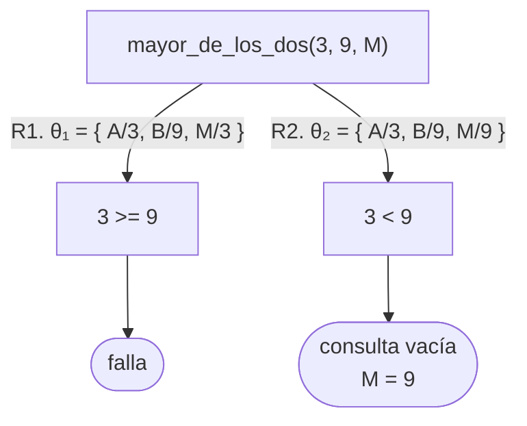
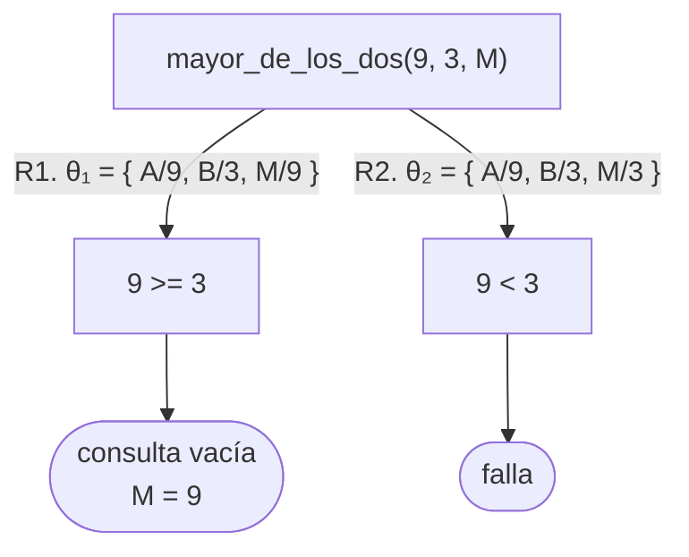
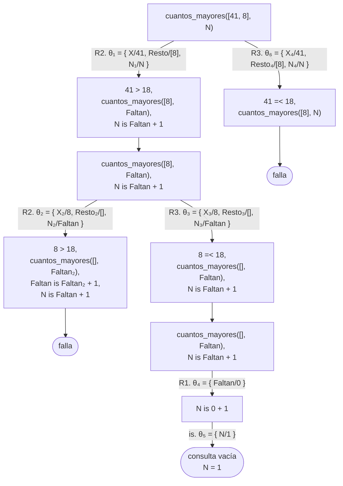
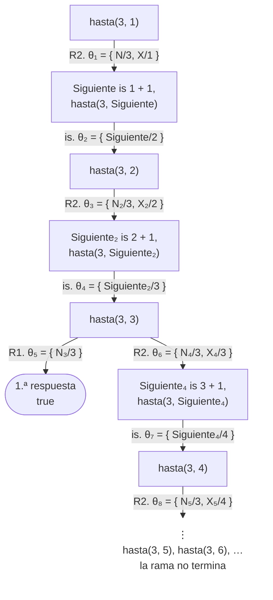
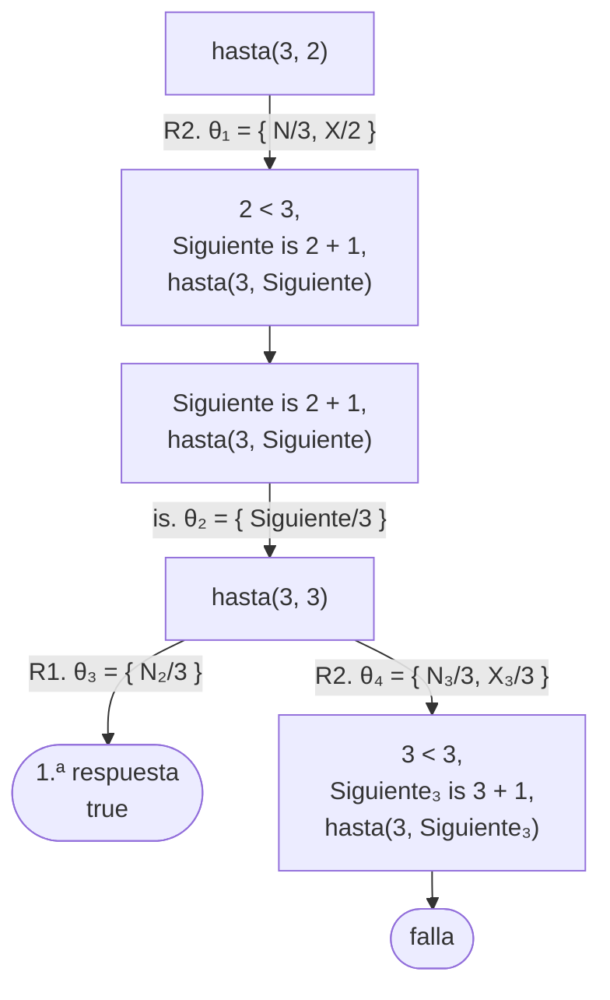

# Soluciones del capítulo 8 — Aritmética

El código de esta página está en `ejemplos/capitulo-08/soluciones.pl` y pasa sus
pruebas.

## 1

```prolog
?- X is 10 / 4.
X = 2.5.

?- X is 10 // 4.
X = 2.

?- X is 10 mod 4.
X = 2.
```

Las dos últimas producen `2` por razones distintas: `//` es el cociente entero
de la división y `mod` es el resto. En este caso los dos valores coinciden.

Respuesta a la actividad de la [sección 8.1](index.md#81-evaluacion-de-expresiones):

```prolog
?- X is 7 // 2.
X = 3.

?- X is 7 mod 2.
X = 1.

?- X is 7 / 2.
X = 3.5.

?- X is 8 / 2.
X = 4.
```

Las dos últimas usan el mismo operador y producen números de tipos distintos:
`7 / 2` no es exacto y el resultado es de punto flotante; `8 / 2` es exacto y el
resultado es un entero. `//` produce siempre un entero, sea exacto o no el
cociente.

## 2

<!-- ejemplo: capitulo-08/soluciones.pl predicado: triple/2 consulta: triple(5, T). -->
```prolog
%!  triple(+N, -T) is det.
%
%   T es el triple de N.
triple(N, T) :-
    T is N * 3.
```

```prolog
?- triple(5, T).
T = 15.

?- triple(N, 15).
ERROR: Arguments are not sufficiently instantiated
```

La segunda consulta corresponde a la [sección 8.3](index.md#83-argumentos-sin-instanciar): `is/2` no despeja incógnitas.
Para evaluar `N * 3` requiere el valor de `N`, y `N` está libre. Que el
resultado esperado sea 15 no aporta ninguna información a la evaluación.

## 3

| | |
|---|---|
| `3 + 4 = 7` | **falsa**: `3+4` y `7` son términos distintos |
| `3 + 4 =:= 7` | verdadera: las dos expresiones tienen el mismo valor |
| `7 = 7` | verdadera: es el mismo término |
| `7 =:= 7.0` | verdadera: tienen el mismo valor numérico |
| `7 = 7.0` | **falsa**: un entero y un número de punto flotante no son el mismo término |
| `7 =\= 7.0` | **falsa**: `=\=` pregunta si los valores numéricos difieren, y son el mismo |

Respuesta a la actividad de la [sección 8.2](index.md#82-comparacion-de-numeros):

```prolog
?- luis = luis.
true.

?- luis =:= luis.
ERROR: Arithmetic: `luis/0' is not a function
```

`=:=` compara **valores numéricos**, por lo que primero intenta evaluar ambos
lados, y `luis` no es una expresión aritmética. El mensaje lo indica de manera
explícita.

## 4

<!-- ejemplo: capitulo-08/soluciones.pl predicado: es_par/1 consulta: es_par(8). -->
```prolog
%!  es_par(+N) is semidet.
%
%   N es par.
es_par(N) :-
    0 =:= N mod 2.
```

Se puede escribir `0 =:= N mod 2` o `N mod 2 =:= 0`: el orden es indistinto,
porque ambos lados se evalúan antes de la comparación.

## 5

<!-- ejemplo: capitulo-08/soluciones.pl predicado: mayor_de_los_dos/3 consulta: mayor_de_los_dos(3, 9, M). -->
```prolog
%!  mayor_de_los_dos(+A, +B, -M) is det.
%
%   M es el mayor de los dos números.
mayor_de_los_dos(A, B, A) :-
    A >= B.
mayor_de_los_dos(A, B, B) :-
    A < B.
```

Tiene dos cláusulas, de acuerdo con la plantilla 4. Las dos condiciones son
mutuamente excluyentes —una es `>=` y la otra, `<`—, de modo que nunca se
obtienen dos respuestas. Si en la primera se hubiera escrito `>`, con dos
números iguales no se cumpliría ninguna de las dos cláusulas.

```prolog
?- mayor_de_los_dos(3, 9, M).
M = 9.

?- mayor_de_los_dos(9, 3, M).
M = 9 ;
false.
```

Los dos árboles muestran por qué la segunda consulta deja una alternativa
pendiente y la primera no. Con las dos cláusulas numeradas R1 y R2, la cabeza
liga `M` **antes** de la comparación: en `mayor_de_los_dos(A, B, A)` el tercer
argumento es la misma variable que el primero, de modo que `M` queda ligada a
`A` al unificar la cabeza, y la comparación decide después si la rama sigue.





En el primer árbol la hoja de éxito es la última, y la respuesta termina en
punto. En el segundo, la rama de R2 queda a la derecha de la hoja de éxito:
cuando Prolog muestra `M = 9` todavía no la recorrió, y al pedir otra respuesta
la recorre, falla en `9 < 3` y responde `false.`. Las condiciones
complementarias garantizan una sola hoja de éxito, no que la respuesta termine
en punto.

## 6

<!-- ejemplo: capitulo-08/soluciones.pl predicado: cuantos_mayores/2 consulta: cuantos_mayores([12, 41, 8, 68], N). -->
```prolog
%!  cuantos_mayores(+L, -N) is det.
%
%   N es la cantidad de números de L mayores que 18.
cuantos_mayores([], 0).
cuantos_mayores([X|Resto], N) :-
    X > 18,
    cuantos_mayores(Resto, Faltan),
    N is Faltan + 1.
cuantos_mayores([X|Resto], N) :-
    X =< 18,
    cuantos_mayores(Resto, N).
```

Tiene tres cláusulas: la lista vacía, el caso en que el número se cuenta, y el
caso en que no. La condición de la tercera, `X =< 18`, es imprescindible: sin
ella, cada número mayor que 18 se resolvería por las dos cláusulas recursivas, y
se obtendrían respuestas de más.

```prolog
?- cuantos_mayores([41, 8], N).
N = 1 ;
false.
```

El árbol de esa consulta muestra las dos cosas: dónde actúa la guarda y de
dónde sale el `false.` final. Con las tres cláusulas numeradas R1 a R3 —la
segunda tiene una variable `N`, como la consulta, y en el árbol se escribe `N₁`
para distinguirla de ella—:



Las dos cláusulas recursivas tienen la misma cabeza, de modo que cada número
abre dos ramas: la de R2 y la de R3. Con `8`, la de R2 falla en `8 > 18` y la
de R3 sigue; con `41`, la de R2 sigue y la de R3 —a la derecha, recorrida
después de la hoja de éxito— falla en `41 =< 18`, y es el `false.` final. Sin
la guarda, esa rama no fallaría: continuaría con `cuantos_mayores([8], N)` y
llegaría a una segunda hoja de éxito, `N = 0`, en la que el 41 no se contó.

## 7

<!-- ejemplo: capitulo-08/soluciones.pl predicado: promedio/2 recorriendo/5 consulta: promedio([10, 20, 30], P). -->
```prolog
%!  promedio(+L, -P) is semidet.
%
%   P es el promedio de los números de L.
%   Un único recorrido con dos acumuladores: la suma y la cantidad.
promedio(L, P) :-
    recorriendo(L, 0, 0, Suma, Cuantos),
    Cuantos > 0,
    P is Suma / Cuantos.

%!  recorriendo(+L, +SumaHasta, +CuantosHasta, -Suma, -Cuantos) is det.
%
%   Suma y Cuantos son SumaHasta y CuantosHasta más la suma y la cantidad de
%   los elementos de L.
recorriendo([], Suma, Cuantos, Suma, Cuantos).
recorriendo([X|Resto], SumaHasta, CuantosHasta, Suma, Cuantos) :-
    SumaAhora is SumaHasta + X,
    CuantosAhora is CuantosHasta + 1,
    recorriendo(Resto, SumaAhora, CuantosAhora, Suma, Cuantos).
```

Es un único recorrido con **dos acumuladores**: la suma y la cantidad. No existe
restricción sobre la cantidad de acumuladores; cada uno agrega argumentos al
predicado auxiliar.

La condición `Cuantos > 0` contempla la lista vacía: sin ella, el promedio de
`[]` produciría una división por cero. Con la condición, `promedio([], P)`
falla, que es el comportamiento adecuado.

Se debe tener en cuenta el tipo del resultado: `promedio([10, 20, 30], P)`
produce `20`, y no `20.0`, porque el cociente es exacto. Es el comportamiento
descripto en la [sección 8.1](index.md#81-evaluacion-de-expresiones).

Respuesta a la actividad de la [sección 8.5](index.md#85-acumuladores). La
traza muestra cuatro llamadas a `sumando/3`; en cada una el acumulador contiene
la suma de los elementos ya extraídos:

| Llamada | Lista que queda | Acumulador |
|---|---|---|
| `sumando([3, 1, 4], 0, S)` | `[3, 1, 4]` | `0` |
| `sumando([1, 4], 3, S)` | `[1, 4]` | `3` |
| `sumando([4], 4, S)` | `[4]` | `4` |
| `sumando([], 8, S)` | `[]` | `8` |

En la última llamada la lista está vacía y el acumulador ya vale `8`: el caso
base `sumando([], Total, Total)` unifica `S` con ese valor, sin calcular nada.

## 8

<!-- ejemplo: capitulo-08/soluciones.pl predicado: maximo/2 buscando_maximo/3 consulta: maximo([3, 9, 4], M). -->
```prolog
%!  maximo(+L, -M) is semidet.
%
%   M es el mayor de L. La lista vacía no tiene máximo, por lo que el predicado
%   falla para ella.
maximo([X|Resto], M) :-
    buscando_maximo(Resto, X, M).

%!  buscando_maximo(+L, +Hasta, -M) is det.
%
%   M es el mayor entre Hasta y los elementos de L.
buscando_maximo([], M, M).
buscando_maximo([X|Resto], Hasta, M) :-
    X > Hasta,
    buscando_maximo(Resto, X, M).
buscando_maximo([X|Resto], Hasta, M) :-
    X =< Hasta,
    buscando_maximo(Resto, Hasta, M).
```

El valor inicial del acumulador es el **primer elemento** de la lista, y no
cero. Con cero como valor inicial, el máximo de una lista de números negativos
sería cero, que no pertenece a la lista.

Respecto de la lista vacía, la decisión de diseño adoptada es que
`maximo([], M)` falle. La cabeza exige `[X|Resto]`, de modo que la lista vacía
no unifica con ninguna cláusula. Es el mismo comportamiento de `last/2`, y es
preferible a devolver un valor arbitrario.

## 9

<!-- ejemplo: capitulo-08/soluciones.pl predicado: factorial/2 consulta: factorial(5, F). -->
```prolog
%!  factorial(+N, -F) is semidet.
%
%   F es el factorial de N.
factorial(0, 1).
factorial(N, F) :-
    N > 0,
    Anterior is N - 1,
    factorial(Anterior, FactorialAnterior),
    F is N * FactorialAnterior.
```

El rango de funcionamiento es mayor que el previsible. Los enteros de Prolog
**no tienen un tamaño máximo**, de modo que el factorial no produce
desbordamiento:

```prolog
?- factorial(25, F).
F = 15511210043330985984000000 ;
false.
```

El límite no está dado por la magnitud del número sino por la profundidad de la
recursión: cada llamada deja una multiplicación pendiente hasta el retorno, y
esa operación pendiente ocupa memoria. El programa permite establecer qué
limita el rango —la profundidad—, pero no el valor exacto, que depende de la
memoria que el intérprete reserva para la pila. Ese valor se determina
consultando `factorial/2` con valores crecientes —1000, 10 000, 100 000— hasta
obtener el error de desbordamiento, `Stack limit (1.0Gb) exceeded`. Con el
límite predeterminado de SWI-Prolog, `factorial(100000, F)` todavía responde.
Con un acumulador, el límite se extiende de manera considerable; la
[sección 16.2](../capitulo-16-rendimiento/index.md#162-la-pila-y-la-recursion)
explica qué ocupa la pila en cada caso.

## 10

<!-- ejemplo: capitulo-08/soluciones.pl predicado: cuenta_atras/2 consulta: cuenta_atras(3, L). -->
```prolog
%!  cuenta_atras(+N, -L) is semidet.
%
%   L es la lista de los enteros de N a 1, en ese orden.
cuenta_atras(0, []).
cuenta_atras(N, [N|Resto]) :-
    N > 0,
    Anterior is N - 1,
    cuenta_atras(Anterior, Resto).
```

Esta versión no requiere acumulador, por la siguiente razón: la lista se
construye **en la cabeza**, con `[N|Resto]`, de acuerdo con la plantilla 12. El
número mayor ocupa la primera posición y la recursión completa el resto, de modo
que la lista se obtiene en el orden pedido sin transportar ningún resultado
parcial.

La versión con acumulador sigue la plantilla 13. Como el acumulador agrega cada
número **al comienzo** de la lista, igual que `dando_vuelta/3` de la
[sección 8.6](index.md#86-un-acumulador-que-no-es-un-numero), los números se
deben recorrer en orden creciente para que `N` quede primero:

<!-- ejemplo: capitulo-08/soluciones.pl predicado: cuenta_atras_con/2 contando_atras/4 consulta: cuenta_atras_con(3, L). -->
```prolog
%!  cuenta_atras_con(+N, -L) is semidet.
%
%   La misma lista, con acumulador: se cuenta de 1 a N y cada número se agrega
%   al comienzo de la lista acumulada, de modo que N queda primero.
cuenta_atras_con(N, L) :-
    contando_atras(1, N, [], L).

%!  contando_atras(+Desde, +N, +Hasta, -L) is semidet.
%
%   L es Hasta con los enteros de Desde a N agregados al comienzo, el mayor
%   primero. Desde avanza de uno en uno; Hasta es el acumulador.
contando_atras(Desde, N, L, L) :-
    Desde > N.
contando_atras(Desde, N, Hasta, L) :-
    Desde =< N,
    Siguiente is Desde + 1,
    contando_atras(Siguiente, N, [Desde|Hasta], L).
```

```prolog
?- cuenta_atras(3, L).
L = [3, 2, 1] ;
false.

?- cuenta_atras_con(3, L).
L = [3, 2, 1] ;
false.
```

Las dos versiones producen la misma lista y recorren los números una sola vez.
La comparación favorece a la primera: construye la lista en la cabeza, sin
auxiliar, porque el orden en que la recursión visita los números —de `N` a 1—
es el orden pedido. La segunda necesita un auxiliar con dos argumentos más, el
contador y la cota `N`, y una guarda en cada cláusula; si en lugar de contar de
1 a `N` recorriera `N` hacia abajo, como `sumando_hasta/3` del ejercicio 14, la
lista quedaría de 1 a `N` y habría que invertirla. El acumulador resulta
adecuado cuando se acumula un valor, o cuando una llamada necesita consultar lo
recorrido; es menos adecuado cuando se construye una lista que la cabeza ya
entrega en el orden requerido.

## 11

```prolog
?- X is 5 + 3.
X = 8.

?- 8 is 5 + 3.
true.

?- 9 is 5 + 3.
false.

?- X is 5 + dos.
ERROR: Arithmetic: `dos/0' is not a function

?- X = 5 + 3.
X = 5+3.
```

`X is 5 + Y.` produce el otro error, el de argumentos sin instanciar.

Las tres primeras muestran que `is/2` **evalúa y después unifica**: con una
variable libre la unificación siempre se cumple; con un número, se cumple o no
según el valor; y el resultado de esa unificación es la respuesta del objetivo.

Los dos errores pertenecen a las dos clases de la [sección 8.3](index.md#83-argumentos-sin-instanciar): `dos` no es un
número y nunca lo será —se debe corregir el programa—; `Y` no tiene valor pero
podría tenerlo —se debe corregir el orden de los objetivos—.

La última no usa `is/2` y por eso no evalúa nada: construye el término.

## 12

La causa es la de la [sección 8.3](index.md#83-argumentos-sin-instanciar): al pasar de `s(s(cero))` a los números
predefinidos se pierde la garantía de terminación que daba la unificación con la
estructura. El predicado tiene caso base y el caso recursivo avanza, pero nada
impide que siga avanzando **más allá** de `N`: después de alcanzar `N` con la
primera cláusula, el backtracking entra en la segunda y cuenta `N+1`, `N+2`, sin
fin.

El árbol de `hasta(3, 1)` sobre el predicado del enunciado lo muestra. Con
`hasta(N, N).` numerada R1 y la cláusula recursiva R2; en la raíz R1 no abre
ninguna rama, porque `hasta(N, N)` no unifica con `hasta(3, 1)`:



La hoja de éxito es `hasta(3, 3)` con R1, y es el `true` de la primera
respuesta. Pero en ese mismo nodo R2 también unifica, y al pedir otra respuesta
con `;` el recorrido entra en esa rama: `hasta(3, 4)`, `hasta(3, 5)`, y así sin
fin. Es una rama infinita de otro tipo que la de la
[sección 5.6](../capitulo-05-como-responde-prolog/index.md#56-ramas-infinitas):
ningún nodo repite uno anterior —el segundo argumento crece en cada nivel—, de
modo que el criterio de aquella sección, el nodo repetido, no la detecta. La
rama avanza, pero en la dirección equivocada: se aleja de `N` en lugar de
acercarse. Con `hasta(3, 5)` la raíz ya está más allá de `N`, y el árbol es esa
rama sola, sin ninguna hoja.

Se corrige reponiendo de manera explícita la condición que antes daba la
estructura:

<!-- ejemplo: capitulo-08/soluciones.pl predicado: hasta/2 consulta: hasta(3, 1). -->
```prolog
%!  hasta(+N, +X) is semidet.
%
%   Se cumple si X es N o un entero menor que N, avanzando de uno en uno desde
%   X. Con los números predefinidos, la unificación ya no garantiza la
%   terminación, y es necesario reponer la guarda X < N, que con la notación
%   s(s(cero)) aportaba la estructura del término.
hasta(N, N).
hasta(N, X) :-
    X < N,
    Siguiente is X + 1,
    hasta(N, Siguiente).
```

```prolog
?- hasta(3, 1).
true ;
false.
```

La guarda `X < N` es exactamente lo que `s(N)` aportaba sin escribirlo: un
límite que la recursión no puede atravesar. El árbol corregido se dibuja desde
`hasta(3, 2)`, un nivel más abajo que la consulta del enunciado: el nivel
superior es el mismo del árbol anterior, con la comparación `1 < 3` delante.
Con la misma numeración, la rama de R2 que sale de `hasta(3, 3)` falla en
`3 < 3` y cierra el árbol: por eso la segunda respuesta es `false.` en lugar de
no terminar.



## 13

| Consulta | Resultado |
|---|---|
| `promedio([2, 4], P).` | `P = 3` |
| `promedio([2, 4], 3).` | `true` |
| `promedio([2, 4], 5).` | `false.` |
| `promedio(L, 3).` | **error** de argumentos sin instanciar |
| `promedio([], P).` | `false.` |

Las tres primeras funcionan porque el recorrido se hace sobre la lista, que está
completa; el segundo argumento solo participa de la unificación final, de modo
que da lo mismo que llegue con valor o sin él.

La cuarta produce el error porque el recorrido no tiene por dónde avanzar: `recorriendo/5`
intenta `SumaAhora is SumaHasta + X` con `X` sin valor.

La quinta responde `false.` y no da error, por la condición `Cuantos > 0`: es la
decisión de diseño que evita dividir por cero, y hace que el promedio de la
lista vacía no exista.

Las cinco respuestas determinan el encabezado:

```prolog
%!  promedio(+L, -P) is semidet.
```

- `L` es `+` por la cuarta consulta: la lista tiene que llegar completa.
- `P` es `-` por las tres primeras: el predicado lo calcula, y si llega con
  valor, compara el resultado con ese valor.
- La cantidad de respuestas es `semidet` por la quinta: una lista tiene un solo
  promedio, y la lista vacía no tiene ninguno.

## 14

<!-- ejemplo: capitulo-08/soluciones.pl predicado: suma_hasta_sin/2 suma_hasta_con/2 sumando_hasta/3 consulta: suma_hasta_con(5, S). -->
```prolog
%!  suma_hasta_sin(+N, -S) is semidet.
%
%   S es la suma de 1 a N, sin acumulador.
suma_hasta_sin(0, 0).
suma_hasta_sin(N, S) :-
    N > 0,
    Anterior is N - 1,
    suma_hasta_sin(Anterior, SumaAnterior),
    S is SumaAnterior + N.

%!  suma_hasta_con(+N, -S) is semidet.
%
%   La misma suma, con acumulador.
suma_hasta_con(N, S) :-
    sumando_hasta(N, 0, S).

%!  sumando_hasta(+N, +Hasta, -S) is semidet.
%
%   S es Hasta más la suma de 1 a N.
sumando_hasta(0, Acumulado, Acumulado).
sumando_hasta(N, Hasta, S) :-
    N > 0,
    Ahora is Hasta + N,
    Anterior is N - 1,
    sumando_hasta(Anterior, Ahora, S).
```

Ninguna de las dos responde `suma_hasta(N, 6).`, y la razón es la misma en los
dos casos: con `N` libre, el caso base no unifica —`6` no es `0`— y el caso
recursivo empieza evaluando `N > 0`, una comparación con un argumento sin
valor. El error aparece antes de llegar a cualquier suma:

```prolog
?- suma_hasta_sin(N, 6).
ERROR: Arguments are not sufficiently instantiated

?- suma_hasta_con(N, 6).
ERROR: Arguments are not sufficiently instantiated
```

Ninguna de las dos versiones **enumera** valores de `N`: las dos lo reciben. Para
que la consulta tuviera respuesta haría falta agregar, antes de la comparación,
un objetivo que genere candidatos para `N`, como `edad(P, A)` lo hace para `A`
en la [sección 8.4](index.md#84-cuando-se-admite-la-consulta-inversa). Es la
plantilla 15 del
[capítulo 9](../capitulo-09-backtracking-y-corte/index.md), que presenta
`between/3` para generar enteros; otra alternativa es la técnica del
[capítulo 23](../capitulo-23-programacion-con-restricciones/index.md).

## 15

```prolog
test(maximo_de_varios, all(M == [9])) :-
    maximo([3, 9, 4], M).

test(maximo_de_uno, all(M == [7])) :-
    maximo([7], M).

test(la_lista_vacia_no_tiene_maximo, [fail]) :-
    maximo([], _).
```

La tercera prueba es la más importante, porque **documenta una
decisión**. `maximo/2` podría haberse definido de otra manera —dando error, o
devolviendo un valor convenido—, y la prueba deja registrado que la decisión
tomada fue que falle. Quien lea el programa más adelante no tiene que deducirla
del código: está escrita y se verifica sola.

## 16

```prolog
?- X is 5 - 3 - 1.
X = 1.

?- X is 3 + 2 * 4 - 1.
X = 10.

?- X is (3 + 2) * 4 - 1.
X = 19.

?- X is -(5, 3).
X = 2.

?- X is -(5, 3, 1).
ERROR: Arithmetic: `(-)/3' is not a function

?- (X > 3) = (4 > 3).
X = 4.

?- X = 3, X * X * X is C.
ERROR: Arguments are not sufficiently instantiated
```

La consulta `12 <= 12.` no llega a ejecutarse. Prolog informa un error al
leerla:

```text
ERROR: Syntax error: Operator expected
```

Las cuatro primeras son **evaluaciones**, y su resultado depende de la forma del
término que se evalúa. Como en la actividad de la
[sección 4.6](../capitulo-04-terminos-y-unificacion/index.md#46-los-operadores-tambien-son-terminos),
`5 - 3 - 1` es el término `(5 - 3) - 1`: el operando izquierdo es a su vez una
resta, y por eso el resultado es 1 y no 3. En `3 + 2 * 4 - 1`, el `*` agrupa sus
operandos antes que `+` y `-`, de modo que el término es `(3 + (2 * 4)) - 1` y
vale 10; los paréntesis de la tercera cambian la forma del término, y con ella el
resultado. `-(5, 3)` es el mismo término que `5 - 3`, escrito con el nombre
delante de los argumentos, y por eso vale 2.

La quinta también es una evaluación, pero falla: el término `-(5, 3, 1)` está
bien escrito, porque cualquier nombre admite tres argumentos, pero no existe una
función aritmética `-` de tres argumentos. Es la primera clase de error de la
[sección 8.3](index.md#83-argumentos-sin-instanciar), la misma de `3 + ana`: la
expresión contiene algo que nunca va a poder evaluarse.

`12 <= 12.` es un error de **sintaxis**: `<=` no es un operador, y Prolog no puede
leer la consulta como un término. No se evalúa ni se unifica nada. El operador
de comparación es `=<`, y `12 =< 12.` responde `true.`

`(X > 3) = (4 > 3)` es una **unificación**: `=` no compara valores, y `>` no se
ejecuta; los dos lados son términos compuestos de nombre `>` y dos argumentos,
que unifican cuando `X` queda ligada a `4`. El resultado sería el mismo con
`(X > 3) = (1 > 3)`, que no es una comparación verdadera: la unificación no
examina si lo es.

La última combina una unificación y una evaluación, con los lados de `is/2`
invertidos. `X = 3` liga `X`, pero `is/2` evalúa el término de su **derecha**, que
es `C`, una variable libre: es la segunda clase de error de la
[sección 8.3](index.md#83-argumentos-sin-instanciar). La expresión va a la
derecha y la variable que recibe el resultado, a la izquierda:

```prolog
?- X = 3, C is X * X * X.
X = 3,
C = 27.
```
