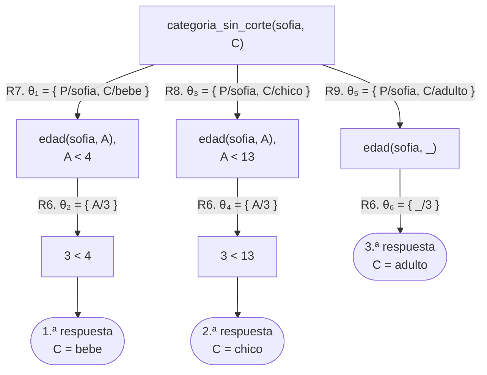
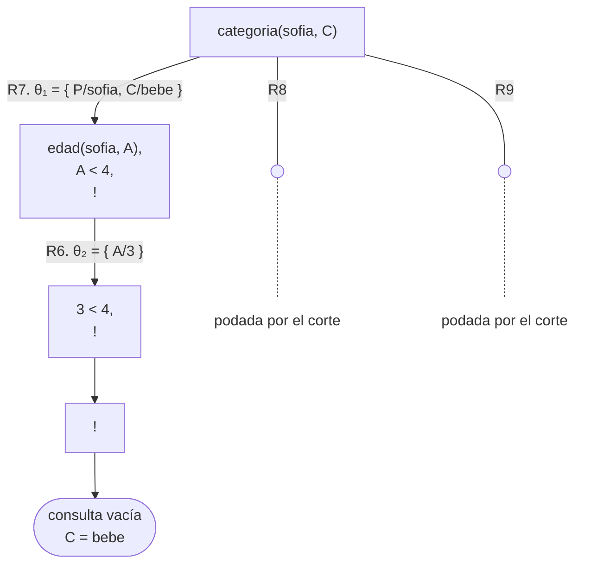
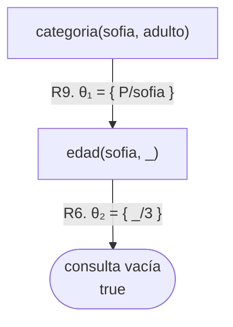
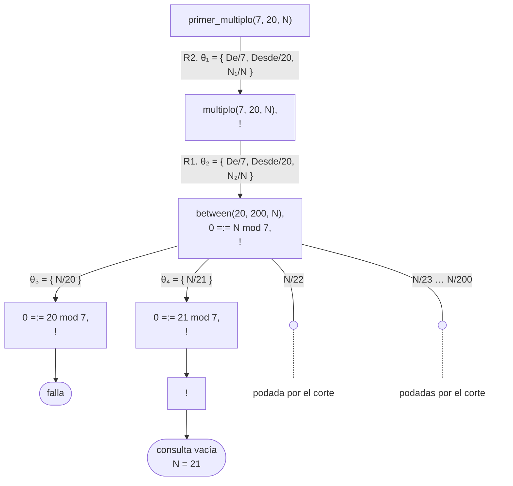

# Capítulo 9 — Backtracking y corte

En los capítulos anteriores, el backtracking fue un mecanismo que Prolog
aplicaba de manera automática, sin intervención de quien escribe el programa.
Este capítulo presenta la única construcción que permite **intervenir** en él:
el corte, que se escribe `!`.

El corte indica a Prolog que descarte determinadas alternativas de búsqueda.
Usado correctamente, reduce el trabajo del programa y expresa su intención con
mayor claridad. Usado incorrectamente, hace que el programa produzca respuestas
falsas, y origina algunos de los errores más difíciles de localizar en Prolog.
El capítulo trata ambos aspectos.

## Objetivos del capítulo

Al terminar el capítulo, el lector puede:

- interpretar el corte como una poda del árbol de derivación;
- determinar con precisión qué ramas se descartan cuando la ejecución pasa por
  un `!`;
- usar el corte para definir casos que no se superponen;
- distinguir un corte que solo reduce el trabajo de uno que modifica lo que el
  programa afirma;
- escribir un predicado de generar y probar que se detenga en la primera
  respuesta.

!!! info "Tiempo estimado"
    Leer el capítulo, ejecutar sus ejemplos y hacer las actividades: **1:00 h**.
    Resolver los 7 ejercicios marcados con ★: **2:00 h**.
    Resolver los 16 ejercicios del final: **5:20 h**.

## 9.1 Un programa que produce respuestas de más

El programa `corte.pl` registra la edad de seis personas. Las cinco primeras
son las del [capítulo 8](../capitulo-08-aritmetica/index.md); `generar.pl`, el
programa de la [sección 9.6](#96-generar-y-probar), repite esas cinco sin sofía.

<!-- ejemplo: capitulo-09/corte.pl predicado: edad/2 consulta: edad(sofia, A). -->
```prolog
% edad(P, A): P tiene A años.
edad(juan, 68).
edad(ana, 41).
edad(pedro, 45).
edad(luis, 12).
edad(eva, 8).
edad(sofia, 3).
```

Las tres reglas siguientes clasifican a una persona según su edad. Están
escritas de modo que las condiciones **se superponen**: un bebé también cumple
la condición de chico, y toda persona cumple la de adulto.

<!-- ejemplo: capitulo-09/corte.pl predicado: categoria_sin_corte/2 consulta: categoria_sin_corte(sofia, C). -->
```prolog
%!  categoria_sin_corte(?P, ?C) is nondet.
%
%   C es una categoría de P. Las tres condiciones se superponen
%   deliberadamente.
categoria_sin_corte(P, bebe) :-
    edad(P, A),
    A < 4.
categoria_sin_corte(P, chico) :-
    edad(P, A),
    A < 13.
categoria_sin_corte(P, adulto) :-
    edad(P, _).
```

Sofía tiene tres años, por lo tanto:

```prolog
?- categoria_sin_corte(sofia, C).
C = bebe ;
C = chico ;
C = adulto.
```

Se obtienen tres respuestas, y las tres se deducen del programa. El programa no
es incorrecto: expresa algo distinto de lo que se pretendía. La intención era
"evaluar las condiciones en orden y conservar la primera que se cumple", pero
esa condición no está escrita en el programa.

El árbol de derivación del [capítulo 5](../capitulo-05-como-responde-prolog/index.md) lo muestra de manera directa: tres ramas
terminan en una hoja de éxito, y por eso hay tres respuestas. Con los seis
hechos de `edad/2` numerados R1 a R6 en el orden del programa —`edad(sofia, 3).`
es R6— y las tres cláusulas de `categoria_sin_corte/2` a continuación:

| | |
|---|---|
| R7 | `categoria_sin_corte(P, bebe) :- edad(P, A), A < 4.` |
| R8 | `categoria_sin_corte(P, chico) :- edad(P, A), A < 13.` |
| R9 | `categoria_sin_corte(P, adulto) :- edad(P, _).` |



Como en los capítulos anteriores —la lectura del diagrama se presentó en la
[sección 3.2](../capitulo-03-reglas-y-conjunciones/index.md#32-que-prueba-prolog-y-en-que-orden)—,
una comparación como `3 < 4` es un objetivo predefinido: no emplea ninguna
cláusula, y por eso su arco no lleva número ni sustitución. Si se cumple, el
objetivo desaparece de la consulta; si no, la rama falla. Aquí las tres se
cumplen, y las tres hojas de éxito aparecen en el orden de las cláusulas.

## 9.2 El corte poda el árbol

El corte es un objetivo que se escribe `!` y que **siempre se cumple**. Su
función no es producir una respuesta, sino el efecto que tiene su ejecución:
indica a Prolog que descarte determinadas ramas del árbol.

<!-- ejemplo: capitulo-09/corte.pl predicado: categoria/2 consulta: categoria(sofia, C). -->
```prolog
%!  categoria(+P, -C) is semidet.
%
%   C es la categoría de P: la misma clasificación, con corte. El corte
%   descarta las cláusulas siguientes.
categoria(P, bebe) :-
    edad(P, A),
    A < 4,
    !.
categoria(P, chico) :-
    edad(P, A),
    A < 13,
    !.
categoria(P, adulto) :-
    edad(P, _).
```

```prolog
?- categoria(sofia, C).
C = bebe.
```

Se obtiene una sola respuesta, sin alternativas pendientes: la respuesta termina
en punto. Las otras dos ramas fueron descartadas. Es la diferencia que registran
los encabezados de la [sección 2.8](../capitulo-02-hechos-consultas-y-variables/index.md#28-como-se-documenta-el-uso-de-un-predicado): `categoria_sin_corte/2` es `nondet`, y
`categoria/2`, gracias al corte, es `semidet`, con una respuesta por persona, o
ninguna si la persona no tiene edad registrada.

En el árbol, el `!` es un objetivo como cualquier otro: ocupa su nodo y, al
cumplirse, desaparece de la consulta. Lo que lo distingue es su efecto sobre el
resto del árbol: las alternativas que descarta —las cláusulas restantes del
predicado y las de los objetivos a su izquierda— se dibujan como ramas que
salen del nodo donde estaba la alternativa, con una línea fina que se vuelve
punteada y termina en «podada por el corte», igual que las ramas que la
búsqueda nunca alcanza en la [sección 5.6](../capitulo-05-como-responde-prolog/index.md#56-ramas-infinitas).
Una **rama podada** está escrita en el programa, pero ninguna ejecución pasa
por ella, y por eso tampoco lleva sustitución. Con las cláusulas numeradas
como en 9.1 —R1 a R6 los hechos de `edad/2`, R7 a R9 las de `categoria/2`—:



Es el árbol de 9.1 con las ramas de R8 y R9 podadas. El `!` se ejecuta en la
rama de R7, después de que `3 < 4` se cumple, y en ese momento descarta las
otras dos cláusulas de `categoria/2`: las hojas `C = chico` y `C = adulto` ya
no existen. `edad(sofia, A)`, a la izquierda del corte, no tenía ninguna otra
alternativa que podar, porque un solo hecho unifica con él.

En términos del modelo de cajas de la [sección 5.3](../capitulo-05-como-responde-prolog/index.md#53-el-mismo-recorrido-registrado-por-trace), el corte **inhabilita la
puerta Redo**: los objetivos que quedaron a su izquierda ya no se pueden
reingresar para pedirles otra solución, y la caja del predicado tampoco puede
ofrecer una cláusula distinta. Por eso el efecto se nota recién cuando algo
falla más adelante y la ejecución intenta retroceder.

El mismo mecanismo sirve en un predicado de una sola cláusula para conservar la
primera respuesta de un objetivo que tiene varias. En `corte.pl`,
`un_mayor_de_edad/1` busca una persona mayor de edad y se detiene en la
primera:

<!-- ejemplo: capitulo-09/corte.pl predicado: un_mayor_de_edad/1 consulta: un_mayor_de_edad(P). -->
```prolog
%!  un_mayor_de_edad(-P) is semidet.
%
%   P es la primera persona mayor de edad que se encuentra, y solo ella.
%   P debe llegar libre: con P ya ligado, el corte no tiene nada que podar.
un_mayor_de_edad(P) :-
    edad(P, A),
    A >= 18,
    !.
```

```prolog
?- un_mayor_de_edad(P).
P = juan.
```

El `!` inhabilita la puerta Redo de `edad(P, A)`: una vez encontrada la primera
persona que cumple la condición, no se solicita otra. La
[sección 9.6](#96-generar-y-probar) desarrolla este uso del corte.

## 9.3 Qué poda exactamente

Esta sección requiere especial atención, porque el corte no poda únicamente lo
que sigue. Cuando la ejecución pasa por un `!` dentro de una cláusula, se
descartan dos conjuntos de alternativas:

1. **las cláusulas siguientes** del mismo predicado, **para esta invocación**.
   Una vez que la ejecución pasó el corte de esta cláusula, la elección es
   definitiva: las cláusulas posteriores no se evalúan.
2. **las alternativas de los objetivos ubicados a la izquierda del corte**,
   dentro de la misma cláusula. Las soluciones ya elegidas para esos objetivos
   quedan fijas.

El corte **no** poda:

- los objetivos ubicados a su **derecha**, que pueden producir varias respuestas
  y participar del backtracking con normalidad;
- las alternativas **externas** al predicado, es decir, las del predicado que lo
  invocó.

En `categoria/2` ese efecto es suficiente. Cuando la consulta sobre sofía ingresa
por la primera cláusula y alcanza el `!`, se descartan las otras dos cláusulas y
también la posibilidad de reingresar a `edad(P, A)` para buscar otra edad. Queda
una sola rama, y por eso hay una sola respuesta.

La precisión "para esta invocación" no importa en `categoria/2`, que no es
recursivo, pero es decisiva en cuanto el predicado se llama a sí mismo. El corte
no desactiva las cláusulas del predicado de una vez y para siempre: descarta las
alternativas **de la llamada que entró en esta cláusula**. Una llamada recursiva
posterior vuelve a considerar todas las cláusulas desde la primera, y la llamada
externa que produjo esta tampoco se ve afectada. Cada invocación tiene sus
propias alternativas, y el corte solo alcanza a las suyas.

!!! question "Actividad"
    Eliminar el `!` de la primera cláusula de `categoria/2` y conservar los otros
    dos. ¿Cuántas respuestas produce `categoria(sofia, C).`? Determinarlo con
    las dos reglas anteriores antes de ejecutar la consulta.

## 9.4 El uso más frecuente: casos que no se superponen

El caso de `categoria/2` es, con amplia diferencia, el uso más frecuente del
corte: una secuencia de casos que se evalúan en orden, de los cuales se conserva
el primero que corresponde.

Se reconoce por su forma. Cada cláusula termina con `!` a continuación de su
condición, y la última no tiene condición, porque cubre todos los casos
restantes.

No es la única forma de escribirlo. Las mismas tres categorías se pueden definir
con las condiciones completas —`A >= 4, A < 13` para chico, como `etapa/2` en la
[sección 1.5](../capitulo-01-la-primera-hora/index.md#15-definicion-por-casos)—, y en ese caso no se requiere ningún corte. Esa versión es más extensa y
repite información; la versión con corte es más breve y depende del orden de las
cláusulas.

La diferencia es relevante: la versión con condiciones completas tiene el mismo
significado cualquiera sea el orden de lectura de sus cláusulas; la versión con
corte solo tiene el significado pretendido si se la lee de arriba hacia abajo.

!!! abstract "Plantilla 14 — Casos que no se superponen"
    **Cuándo**: una secuencia de casos que se evalúan en orden, de los cuales se
    conserva el primero que corresponde.

    ```prolog
    %!  p(+X, -Caso) is det.
    %
    %   Caso es el primero de los casos que corresponde a X. Caso debe llegar
    %   libre.
    p(X, primer_caso) :-
        condicion(X),
        !.
    p(X, otro_caso) :-
        otra_condicion(X),
        !.
    p(_, caso_restante).
    ```

    Los casos deben ser **disjuntos y exhaustivos** leídos de arriba hacia
    abajo. La última cláusula es la que requiere más atención: como no tiene
    condición, afirma su caso para todo lo que llegue hasta ella, y si eso no es
    cierto por sí solo, el predicado responde de manera incorrecta en cuanto se
    lo consulta con el segundo argumento ya instanciado. La [sección 9.5](#95-corte-verde-y-corte-rojo) muestra exactamente ese
    problema.

    **En este capítulo se usa en**: `categoria/2` (9.2).

## 9.5 Corte verde y corte rojo

Esta sección describe el riesgo principal del corte.

Un corte que no modifica el **conjunto** de respuestas del programa se denomina
**corte verde**. Poda ramas que no aportan ninguna respuesta nueva: o bien no
producirían ninguna, o bien producirían una que ya se obtuvo. Eliminarlo deja
las mismas respuestas; lo que cambia es la eficiencia y, en algunos casos, que
una respuesta se repita.

Un corte que hace que el programa produzca respuestas distintas de las que
produciría sin él se denomina **corte rojo**. El de `categoria/2` es rojo, y se
lo comprueba con una consulta de otra forma:

```prolog
?- categoria(sofia, adulto).
true.
```

Sofía tiene tres años, y el programa la clasifica como adulta.

La causa es que el corte no llega a ejecutarse. Prolog evalúa las cláusulas en
orden y, antes de ejecutar el cuerpo, intenta unificar la cabeza:
`categoria(sofia, adulto)` no unifica con `categoria(P, bebe)`, de modo que esa
cláusula se descarta de inmediato, sin alcanzar el `!`. Lo mismo ocurre con la
cláusula de chico. La tercera, `categoria(P, adulto)`, unifica, y solo exige que
sofía tenga una edad registrada.

El árbol lo muestra, con la numeración de 9.2. Una cláusula cuya cabeza no
unifica con el objetivo no abre ninguna rama, de modo que R7 y R8, las dos que
contienen el `!`, no aparecen. Queda únicamente la rama de R9, que en el árbol
de 9.2 era la podada:



Por lo tanto, el corte tiene efecto cuando el segundo argumento está libre, y no
lo tiene cuando está instanciado. El programa responde de manera correcta una
consulta e incorrecta la otra.

Conviene además leer el programa como un conjunto de afirmaciones, sin tener en
cuenta el orden. La tercera cláusula dice que toda persona con una edad
registrada es adulta, y eso es falso: es una afirmación incorrecta, y está
escrita en la cláusula que **no** lleva corte. Las dos primeras cláusulas no la
contradicen; se limitan a llegar antes. Mientras el corte se ejecuta, la
afirmación falsa queda oculta; cuando no se ejecuta, queda expuesta.

**Regla práctica**: todo predicado que contenga un corte se debe verificar con
los argumentos instanciados, y no solo con variables. Si se requiere que el
predicado funcione en ambos sentidos, corresponde escribir las condiciones
completas en lugar de depender del orden de las cláusulas.

!!! question "Actividad"
    Aplicar la regla práctica a `categoria/2`: consultar `categoria(P, adulto).`
    sobre `corte.pl` y contar las respuestas. Antes de ejecutar la consulta,
    determinar con la unificación de las cabezas qué cláusulas participan;
    después, verificar cuántas de las personas obtenidas tienen 13 años o más.

!!! warning "El corte y la lectura lógica"
    Todos los programas hasta el [capítulo 8](../capitulo-08-aritmetica/index.md) se podían leer como afirmaciones
    lógicas, con independencia de cómo Prolog los ejecuta. Con el corte esa
    lectura sigue existiendo: `!` se lee como un objetivo que siempre se cumple,
    de modo que una cláusula con corte afirma exactamente lo mismo que afirmaría
    sin él. Lo que el corte rompe no es la lectura sino el **acuerdo** entre la
    lectura y las respuestas: con un corte rojo, el programa deja de responder
    de acuerdo con lo que sus propias cláusulas afirman.

    De ahí la manera recomendada de trabajar: escribir primero un programa cuyas
    cláusulas sean todas verdaderas, y recién después agregarle cortes para
    evitar trabajo. Con ese orden, la anomalía de `categoria/2` no se produce,
    porque la tercera cláusula nunca se habría escrito de esa forma.

## 9.6 Generar y probar

Existe una técnica de resolución de problemas que se expresa de manera natural
en Prolog, y que se anticipó en el [capítulo 8](../capitulo-08-aritmetica/index.md): cuando la respuesta no se puede
calcular de manera directa, **se generan candidatos y se verifica cada uno**.

Se escribe en dos partes: un objetivo que produce las posibilidades, y otro que
determina si cada posibilidad cumple la condición.

<!-- ejemplo: capitulo-09/generar.pl predicado: multiplo/3 consulta: multiplo(7, 20, N). -->
```prolog
%!  multiplo(+De, +Desde, ?N) is nondet.
%
%   N es un múltiplo de De, mayor o igual que Desde. between/3 genera los
%   candidatos y la condición con mod los verifica.
multiplo(De, Desde, N) :-
    between(Desde, 200, N),
    0 =:= N mod De.
```

`between/3` genera los números de a uno por vez; la condición con `mod` los
verifica. Cuando un candidato no cumple la condición, el backtracking reingresa
a `between/3` y obtiene el siguiente. El programa no requiere ninguna
instrucción adicional para ello: es el modelo de ejecución de Prolog.

```prolog
?- multiplo(7, 20, N).
N = 21 ;
N = 28 ;
N = 35 ;
...
```

Cuando solo se requiere **la primera** respuesta, se agrega un corte:

<!-- ejemplo: capitulo-09/generar.pl predicado: primer_multiplo/3 consulta: primer_multiplo(7, 20, N). -->
```prolog
%!  primer_multiplo(+De, +Desde, -N) is semidet.
%
%   N es el primero de esos múltiplos, y solo él; falla si no hay ninguno
%   entre Desde y 200. N debe llegar libre: con N ya ligado, el corte no
%   tiene nada que podar.
primer_multiplo(De, Desde, N) :-
    multiplo(De, Desde, N),
    !.
```

```prolog
?- primer_multiplo(7, 20, N).
N = 21.
```

En el árbol, `between/3` es un objetivo predefinido que produce varias
respuestas: cada una abre una rama, con la sustitución que liga `N` y sin
número de cláusula, porque no emplea ninguna. Con `multiplo/3` numerada R1 y
`primer_multiplo/3` R2 —las dos reglas tienen una variable `N`, como la
consulta, y en el árbol se escriben `N₁` y `N₂` para distinguirlas de ella—:



La primera rama, con `N = 20`, falla en la condición y no llega al `!`: un
corte que está detrás de un objetivo que falla no poda nada. La segunda cumple
la condición, y el `!` descarta entonces las alternativas de los objetivos a
su izquierda: las 179 respuestas que `between/3` todavía podía producir, de 22
a 200, dibujadas como una rama podada para la de 22 y otra que resume las
demás. Sin el corte, esas ramas se recorrerían una por una al pedir más
respuestas, y las que cumplen la condición serían las hojas `N = 28`, `N = 35`
y las siguientes.

Este uso del corte es adecuado **mientras el tercer argumento llegue sin
valor**. Con `N` libre, `multiplo/3` produce los candidatos en orden, el corte
descarta los siguientes, y la primera respuesta sigue siendo la primera.

Con `N` ya instanciado, en cambio, reaparece exactamente el problema de la
[sección 9.5](#95-corte-verde-y-corte-rojo):

```prolog
?- primer_multiplo(7, 20, 28).
true.
```

El programa afirma que 28 es el **primer** múltiplo de 7 a partir de 20, y no lo
es. La causa es la misma que en `categoria/2`: el corte no interviene para
impedirlo, porque `multiplo(7, 20, 28)` se cumple de manera directa —28 está en
el rango y es múltiplo de 7— y el `!` se ejecuta después, cuando ya no hay nada
que podar.

Es decir que este corte es **rojo**, aunque sea la forma más habitual de usarlo.
Conviene anotarlo en el encabezado del predicado. El `-N` no alcanza, porque un
argumento de salida puede llegar ligado ([sección 2.8](../capitulo-02-hechos-consultas-y-variables/index.md#28-como-se-documenta-el-uso-de-un-predicado)): por eso la descripción
aclara que `N` debe llegar libre. `primer_multiplo/3` responde correctamente en
ese caso, y no se lo debe usar para verificar un valor dado.

!!! question "Actividad"
    Reemplazar 200 por 25 en `multiplo/3` y consultar `primer_multiplo(7, 30, N).`
    Determinar la respuesta antes de ejecutar la consulta: ¿qué parte del
    encabezado de `primer_multiplo/3` la anticipa, y qué debe cambiar en ese
    encabezado junto con el código?

El generador no es necesariamente `between/3`: cualquier objetivo con varias
respuestas cumple esa función. En `generar.pl`, `dos_que_suman/3` genera pares
de personas con los hechos `edad/2` y verifica la suma de sus edades:

<!-- ejemplo: capitulo-09/generar.pl predicado: dos_que_suman/3 consulta: dos_que_suman(49, A, B). -->
```prolog
%!  dos_que_suman(+Total, ?A, ?B) is nondet.
%
%   A y B son dos personas distintas cuyas edades suman Total.
dos_que_suman(Total, A, B) :-
    edad(A, EdadA),
    edad(B, EdadB),
    A \== B,
    Total =:= EdadA + EdadB.
```

```prolog
?- dos_que_suman(49, A, B).
A = ana,
B = eva ;
A = eva,
B = ana ;
false.
```

!!! abstract "Plantilla 15 — Generar y probar"
    **Cuándo**: la respuesta no se puede calcular de manera directa, pero sí se
    puede verificar si un candidato es una respuesta.

    ```prolog
    %!  solucion(?X) is nondet.
    %
    %   X es una solución: una respuesta por cada candidato que cumple.
    solucion(X) :-
        candidato(X),
        cumple(X).
    ```

    Cuando se requiere una sola respuesta, se agrega un corte al final:

    ```prolog
    %!  una_solucion(-X) is semidet.
    %
    %   X es la primera solución. X debe llegar libre.
    una_solucion(X) :-
        solucion(X),
        !.
    ```

    Ese corte es **rojo**, aunque su uso sea habitual: si `X` llega con valor,
    el generador lo verifica de manera directa y el corte se ejecuta cuando ya
    no queda nada que podar, de modo que el predicado acepta un candidato que
    no es el primero. Por eso la descripción del encabezado aclara que el
    argumento de salida debe llegar libre: el `-X` solo no lo dice.

    **En este capítulo se usa en**: `multiplo/3`, `primer_multiplo/3` y
    `dos_que_suman/3` (9.6). Las demás plantillas están en
    [esta página](../plantillas.md).

La técnica se aplica a problemas de mucha mayor escala que la búsqueda de
múltiplos: ubicar reinas en un tablero, resolver un sudoku, asignar horarios.
Cambian el generador y la condición; la estructura es siempre la misma. El
[capítulo 40](../capitulo-40-busqueda-y-planificacion/index.md) la retoma con problemas de mayor complejidad, y el [capítulo 23](../capitulo-23-programacion-con-restricciones/index.md)
presenta una técnica que la hace mucho más eficiente.

## Ejercicios

Las soluciones están en [la página de soluciones](soluciones.md). La dificultad
va de 1 (se resuelve consultando el capítulo) a 3 (requiere elaboración propia).
Los marcados con ★ son los que no conviene saltear: cubren lo que el capítulo
tiene de propio, y los capítulos siguientes los dan por hechos.

1. ★ **(1)** Con `corte.pl`, ¿qué responde `categoria(luis, C).`? ¿Y
   `categoria_sin_corte(luis, C).`?
2. **(1)** Con `corte.pl`, ¿qué efecto tiene el `!` de `un_mayor_de_edad/1`
   ([sección 9.2](#92-el-corte-poda-el-arbol))? Eliminarlo y comparar los
   resultados.
3. **(2)** Escribir `categoria_sin_ningun_corte/2`: las mismas tres categorías,
   con una sola respuesta por persona y sin usar `!`. Con la persona dada, debe
   cumplir `categoria_sin_ningun_corte(+P, -C) is semidet`.
4. ★ **(2)** ¿Cuál de las dos versiones del ejercicio anterior responde de manera
   correcta `categoria(sofia, adulto)`? Verificarlo.
5. ★ **(2)** Escribir `primer_par(L, X)`: X es el primer número par de la lista L.
   Su encabezado es `primer_par(+L, -X) is semidet`.
6. **(2)** Escribir `hay_algun_menor(L)`: se cumple si algún número de `L` es
   menor que 18. ¿Requiere corte?
7. **(2)** Con `generar.pl`, ¿por qué `dos_que_suman(49, A, B)` produce dos
   respuestas en lugar de una ([sección 9.6](#96-generar-y-probar))? ¿Cómo se
   puede lograr que produzca una sola?
8. **(3)** Escribir `primer_cuadrado_mayor(N, C)`: C es el primer número cuyo
   cuadrado es mayor que `N`, con la búsqueda a partir de 1. Escribir también
   su encabezado: qué argumentos deben llegar ligados, cuáles pueden llegar
   libres, y cuántas respuestas produce.
9. ★ **(3)** El siguiente predicado tiene un corte rojo. Identificarlo, indicar qué
   consulta responde de manera incorrecta, y corregirlo:

    ```prolog
    %!  descuento(+Edad, -D) is det.
    %
    %   D es el descuento que corresponde a Edad.
    descuento(Edad, 50) :-
        Edad < 12,
        !.
    descuento(Edad, 30) :-
        Edad >= 65,
        !.
    descuento(_, 0).
    ```

10. **(3)** Escribir `sin_repetidos(L, R)`: `R` es `L` sin elementos repetidos,
    conservando la primera aparición de cada uno.
11. ★ **(1)** Sobre el programa siguiente, predecir cuántas respuestas produce
    cada consulta, antes de ejecutarlas:

    ```prolog
    color(rojo).
    color(verde).
    color(azul).

    %!  primero(-C) is det.
    %
    %   C es el primer color.
    primero(C) :-
        color(C),
        !.
    ```

    `color(C).` · `primero(C).` · `primero(verde).` · `primero(rojo).`

    La tercera es la que requiere más atención.
12. ★ **(2)** Seguir a mano `?- categoria(luis, C).` sobre `corte.pl`,
    completando una tabla con una fila por paso, e indicando en cuál de ellos se
    ejecuta el `!` y qué alternativas descarta:

    | Objetivo que se intenta | Qué hace Prolog | Alternativas que quedan |
    |---|---|---|
    | | | |

13. **(2)** El predicado siguiente usa un corte dentro de una recursión.
    Determinar, con las reglas de la [sección 9.3](#93-que-poda-exactamente), si el corte afecta a las
    llamadas recursivas, y verificarlo ejecutando `primer_par([1, 3, 4, 6], X).`

    ```prolog
    %!  primer_par(+L, -X) is semidet.
    %
    %   X es el primer número par de L.
    primer_par([X|_], X) :-
        0 =:= X mod 2,
        !.
    primer_par([_|Resto], X) :-
        primer_par(Resto, X).
    ```

14. ★ **(2)** Escribir `clasificar(N, C)` con la plantilla 14, que se cumpla con
    `C = negativo`, `C = cero` o `C = positivo` según corresponda, con el
    encabezado `clasificar(+N, -C) is det`. Después ejecutar
    `clasificar(-2, positivo).` y explicar el resultado a la luz de la
    [sección 9.5](#95-corte-verde-y-corte-rojo).
15. **(3)** Escribir dos pruebas de `primer_multiplo/3` de la [sección 9.6](#96-generar-y-probar) que
    distingan un corte verde de uno rojo: una con `all` que verifique la
    respuesta y que **no** hay una segunda, y una que muestre qué ocurre al
    consultar con el tercer argumento ya instanciado.
16. **(2)** El programa siguiente describe las prendas de un catálogo: una
    muestra, las combinaciones de talle, color y tela, y un saldo.

    ```prolog
    % talle(T): T es un talle del catálogo.
    talle(chico).
    talle(grande).

    % color(C): C es un color del catálogo.
    color(rojo).
    color(azul).

    % tela(M): M es una tela del catálogo.
    tela(algodon).
    tela(lana).

    %!  prenda(?T, ?C, ?M) is nondet.
    %
    %   Hay una prenda de talle T, color C y tela M.
    prenda(unico, blanco, lino).
    prenda(T, C, M) :-
        talle(T),
        color(C),
        tela(M).
    prenda(unico, negro, cuero).
    ```

    Determinar cuántas respuestas produce `prenda(T, C, M).` y en qué orden.
    Repetirlo después con un `!` agregado a la segunda cláusula en tres
    posiciones distintas: a continuación de `talle(T)`, a continuación de
    `color(C)` y al final del cuerpo. Explicar cada resultado con las reglas de
    la [sección 9.3](#93-que-poda-exactamente), e indicar en cuáles de los cuatro
    casos se llega a la tercera cláusula.

## Resumen

| | |
|---|---|
| `!` | se cumple siempre, y poda ramas del árbol de derivación |
| qué poda | las cláusulas siguientes del predicado, y las alternativas de los objetivos a su izquierda |
| qué no poda | los objetivos a su derecha, ni las alternativas externas al predicado |
| **rama podada** | una alternativa que el corte descartó: en el árbol se dibuja punteada, como las que la búsqueda nunca alcanza |
| **corte verde** | no modifica el conjunto de respuestas; eliminarlo solo cuesta trabajo, y puede hacer que alguna se repita |
| **corte rojo** | modifica las respuestas del programa; requiere verificación cuidadosa |
| **generar y probar** | un objetivo produce candidatos y otro los verifica |
| encabezado de un predicado con corte | declara el modo en que responde correctamente: el argumento de salida «debe llegar libre» |

## Temas que se retoman

| Tema | Se retoma en |
|---|---|
| `\+`, que se define internamente con un corte | [capítulo 10](../capitulo-10-negacion-como-falla/index.md) |
| `->` y `;`, que expresan lo mismo con otra notación | [capítulo 15](../capitulo-15-control/index.md) |
| Cuándo el corte mejora el rendimiento y cuándo lo perjudica | [capítulo 16](../capitulo-16-rendimiento/index.md) |
| Generar y probar con restricciones, que descarta antes de generar | [capítulo 23](../capitulo-23-programacion-con-restricciones/index.md) |
| Búsquedas de mayor escala: reinas y laberintos | [capítulo 40](../capitulo-40-busqueda-y-planificacion/index.md) |
| Juegos: la búsqueda con un adversario | [capítulo 41](../capitulo-41-juegos/index.md) |
