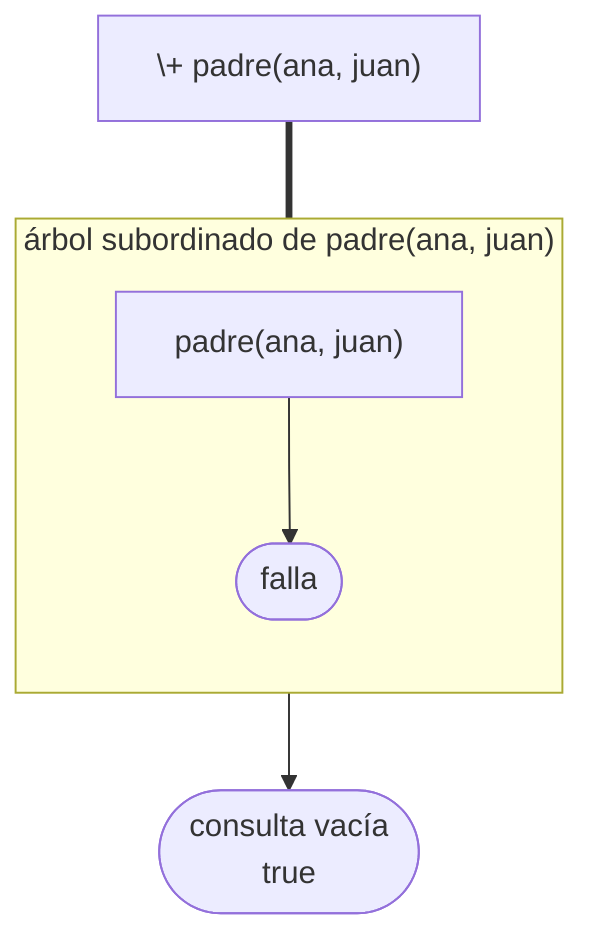
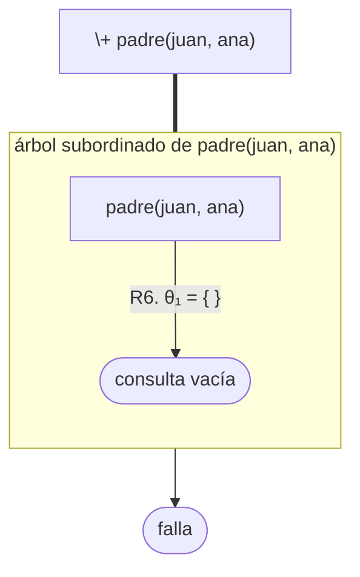
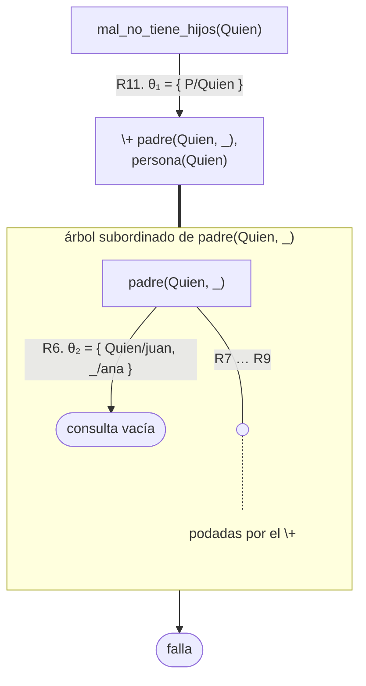
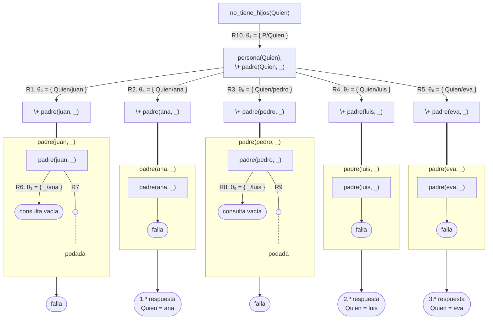
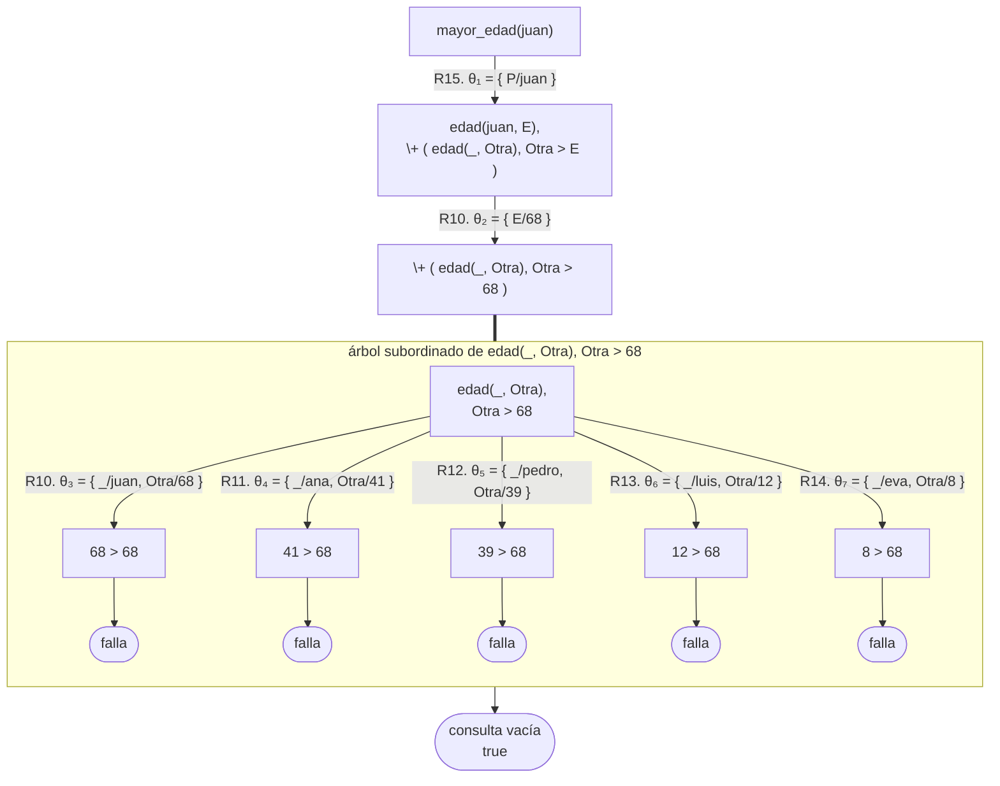
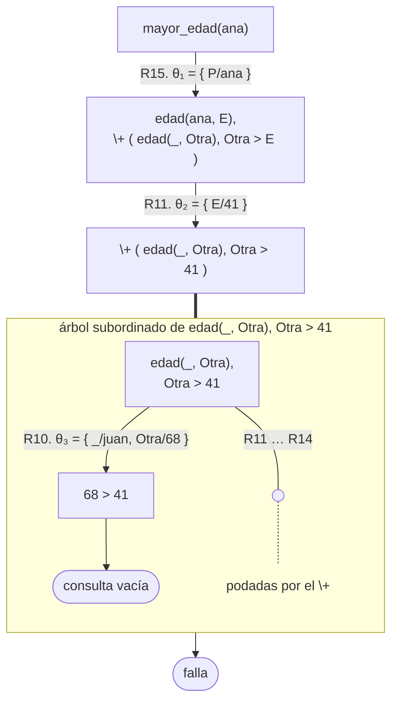
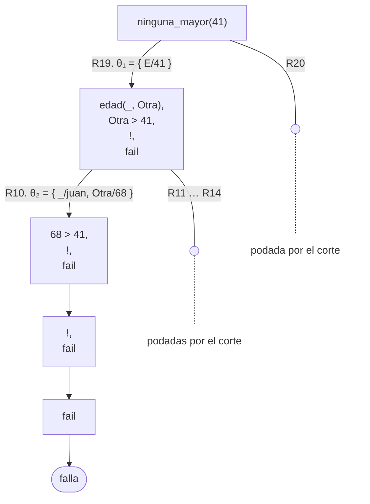
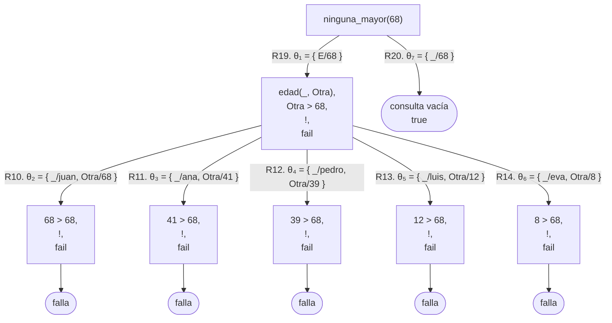

# Capítulo 10 — Negación como falla

El [capítulo 2](../capitulo-02-hechos-consultas-y-variables/index.md) estableció que `false.` no significa "la afirmación es falsa" sino
"la afirmación no se puede probar con el contenido del programa". Este capítulo
desarrolla esa idea, la convierte en un operador —`\+`—, describe los tres
casos en que ese operador no se comporta como la negación de la lógica y
muestra cómo se lo usa para obtener respuestas, como el máximo de un conjunto
de valores.

Es el último capítulo sobre el modelo de ejecución de Prolog. El
[capítulo 11](../capitulo-11-texto/index.md) trata el texto —átomos, cadenas y
las conversiones entre ellos— y el
[capítulo 12](../capitulo-12-prolog-y-la-logica/index.md) analiza todo lo
anterior desde el punto de vista de la lógica.

## Objetivos del capítulo

Al terminar el capítulo, el lector puede:

- usar `\+` para exigir que un objetivo **no** se pueda probar;
- explicar por qué `\+` no equivale exactamente a la negación de la lógica;
- ubicar `\+` en la posición correcta de una regla, y reconocer el efecto de una
  ubicación incorrecta;
- elegir entre `=`, `\=`, `==`, `\==`, `=:=` y `=\=` según la pregunta que plantea
  cada uno;
- obtener una respuesta por negación: el máximo como el valor para el que no
  existe otro mayor;
- escribir una negación sin `\+`, con corte y falla o sin negación, y comparar
  la extensión y el comportamiento de cada versión.

!!! info "Tiempo estimado"
    Leer el capítulo, ejecutar sus ejemplos y hacer las actividades: **1:45 h**.
    Resolver los 9 ejercicios marcados con ★: **2:40 h**.
    Resolver los 17 ejercicios del final: **5:45 h**.

## 10.1 El supuesto de mundo cerrado

Prolog responde `false.` cuando no puede probar una consulta. La respuesta no
indica que la afirmación sea falsa: indica que la información disponible no es
suficiente para probarla.

Este criterio se denomina **hipótesis del mundo cerrado**. Consiste en suponer
que el programa contiene **toda la información relevante** sobre el dominio, y
que toda afirmación que no está escrita ni se deduce no es cierta.

Es un supuesto fuerte, y se lo debe tener presente, porque en él se apoya todo
el contenido de este capítulo. Si el programa no indica quién es el padre de
sofía, Prolog se comporta como si sofía no tuviera padre. Para la base de datos
de una empresa el supuesto suele ser adecuado: si un empleado no figura en la
nómina, no trabaja en la empresa. Para el mundo en general, casi nunca lo es.

## 10.2 `\+`: no se puede probar

`\+` se antepone a un objetivo, y se cumple **cuando ese objetivo falla**:

```prolog
?- \+ padre(ana, juan).
true.

?- \+ padre(juan, ana).
false.
```

En la primera consulta no se puede probar que ana sea el padre de juan, por lo
que `\+` se cumple. En la segunda, juan es el padre de ana, el objetivo se
prueba, y por lo tanto `\+` falla.

El operador se denomina **negación como falla**, y el nombre describe con
exactitud su funcionamiento: no demuestra que una afirmación sea falsa, sino que
**no logra demostrar que sea cierta**, e interpreta ese resultado como una
negación.

Su definición interna es simple: se intenta probar el objetivo; si se cumple,
`\+` falla; si falla, `\+` se cumple. El corte del [capítulo 9](../capitulo-09-backtracking-y-corte/index.md) forma parte de esa
definición.

En el árbol de derivación del [capítulo 5](../capitulo-05-como-responde-prolog/index.md),
`\+ G` es un objetivo predefinido, como las comparaciones y el `!` del
[capítulo 9](../capitulo-09-backtracking-y-corte/index.md): no emplea ninguna
cláusula, y el arco que sale de su nodo no lleva número ni sustitución. Lo que
lo distingue es que, para decidir si se cumple, Prolog construye otro árbol: el
**árbol subordinado** de la consulta `G`. Se dibuja debajo del nodo, dentro de
un recuadro unido a él por una línea gruesa sin flecha, porque entrar en el
recuadro no es un paso de la derivación sino la pregunta que `\+` plantea. El
arco que sale del recuadro es el arco de `\+ G`, sin número ni sustitución. Si
el árbol subordinado no tiene ninguna hoja de éxito, `\+ G` se cumple, y ese
arco lleva a la consulta siguiente, de la que `\+ G` ya desapareció; si tiene
alguna, `\+ G` falla, y el arco lleva a «falla». El recorrido del árbol
subordinado se detiene en su primera hoja de éxito, y las alternativas que
quedaban se dibujan podadas, como en la
[sección 9.2](../capitulo-09-backtracking-y-corte/index.md#92-el-corte-poda-el-arbol):
es el corte que forma parte de la definición. Con los hechos de `negacion.pl`
numerados en el orden del programa —`persona/1` ocupa R1 a R5—:

| | |
|---|---|
| R6 | `padre(juan, ana).` |
| R7 | `padre(juan, pedro).` |
| R8 | `padre(pedro, luis).` |
| R9 | `padre(pedro, eva).` |



Ninguna cabeza de `padre/2` unifica con `padre(ana, juan)`: el árbol subordinado
tiene una sola rama, que falla. Por eso `\+ padre(ana, juan)` se cumple, y como
era el único objetivo de la consulta, lo que sigue es la consulta vacía.



Aquí el árbol subordinado llega a la consulta vacía con R6, y esa hoja de éxito
es lo que hace fallar a `\+ padre(juan, ana)`. La sustitución es vacía porque la
consulta no tenía variables; la [sección 10.4](#104-donde-ubicar) muestra qué
ocurre con las que sí las tienen.

## 10.3 Por qué no es la negación de la lógica

En lógica, "no P" es cierto cuando P es falso. En Prolog, `\+ P` se cumple cuando
P no se puede **probar**, que es una condición distinta.

La diferencia se manifiesta cuando falta información:

```prolog
?- \+ padre(pedro, sofia).
true.
```

En la base del ejemplo, sofía no figura en ningún hecho. Prolog no puede probar
que pedro sea su padre, de modo que `\+` se cumple: el programa afirma que pedro
**no** es el padre de sofía. Sin embargo, lo único que ocurre en realidad es que
el programa no contiene información sobre sofía.

Regla práctica: **`\+` es confiable en la medida en que el programa es
completo**. Sobre la información que el programa contiene, opera correctamente.
Sobre la información que no contiene, responde como si no existiera.

Hay otra diferencia, menos visible. La hipótesis de la [sección 10.1](#101-el-supuesto-de-mundo-cerrado) dice
"lo que el programa no puede deducir"; `\+` es más estricto: exige que la
búsqueda **fracase en una cantidad finita de pasos**. Por eso el nombre completo
del mecanismo es *negación como falla finita*. Si el objetivo negado corresponde
a una búsqueda que no termina —como las ramas infinitas de la [sección 5.6](../capitulo-05-como-responde-prolog/index.md#56-ramas-infinitas)—, `\+`
no responde `true.` ni `false.`: no responde nunca. Es el tercero de los casos
que anuncia la introducción —los otros dos son la información faltante de esta
sección y las variables libres de la [sección 10.4](#104-donde-ubicar)—, y a
diferencia de ellos no produce una respuesta incorrecta sino ninguna respuesta.

## 10.4 Dónde ubicar `\+`

Esta sección describe el error más frecuente del capítulo. Conviene observarlo
en ejecución.

Se requieren las personas que no tienen hijos. La siguiente definición es
correcta:

<!-- ejemplo: capitulo-10/negacion.pl predicado: no_tiene_hijos/1 consulta: no_tiene_hijos(Quien). -->
```prolog
%!  no_tiene_hijos(?P) is nondet.
%
%   P no es padre de nadie. Primero se genera una persona; después se evalúa
%   la negación sobre ella.
no_tiene_hijos(P) :-
    persona(P),
    \+ padre(P, _).
```

```prolog
?- no_tiene_hijos(Quien).
Quien = ana ;
Quien = luis ;
Quien = eva.
```

La siguiente, que aparenta ser equivalente con los objetivos en orden inverso,
no lo es:

<!-- ejemplo: capitulo-10/negacion.pl predicado: mal_no_tiene_hijos/1 consulta: mal_no_tiene_hijos(Quien). -->
```prolog
%!  mal_no_tiene_hijos(+P) is semidet.
%
%   La misma regla con los objetivos en orden inverso. Solo responde con P
%   ligada; con P libre no produce ninguna respuesta. La sección 10.4
%   explica la causa.
mal_no_tiene_hijos(P) :-
    \+ padre(P, _),
    persona(P).
```

```prolog
?- mal_no_tiene_hijos(Quien).
false.
```

**No produce ninguna respuesta**, ni siquiera las correctas.

La causa es la siguiente. Cuando la ejecución llega a `\+ padre(P, _)`, la
variable `P` todavía está libre. La pregunta que se plantea no es "¿P no tiene
hijos?" sino **"¿es imposible probar que alguien tiene hijos?"**. Como juan
tiene hijos, el objetivo negado se prueba, `\+` falla, y con él falla toda la
regla.

La diferencia se resume en una línea: **con una variable libre, `\+` no pregunta
si existe algún valor que falle, sino si fallan todos.**

Conviene ser preciso sobre lo que ocurre: `\+` no ignora las variables
libres. El objetivo interno sí las liga mientras intenta la
demostración —`padre(P, _)` liga `P` a `juan` y se prueba—, pero `\+` descarta
esas ligaduras al terminar: lo único que conserva es si el objetivo se pudo
probar o no. Por eso `\+` nunca deja una variable con valor, y solo puede
responder `true.` o `false.`, nunca `P = ...`.

El árbol lo muestra. Con la numeración de la [sección 10.2](#102-no-se-puede-probar)
—R1 a R5 los hechos de `persona/1`, R6 a R9 los de `padre/2`— y las dos reglas
a continuación:

| | |
|---|---|
| R10 | `no_tiene_hijos(P) :- persona(P), \+ padre(P, _).` |
| R11 | `mal_no_tiene_hijos(P) :- \+ padre(P, _), persona(P).` |



El árbol subordinado liga `Quien` a `juan` en `θ₂` y llega a la consulta vacía
con el primer hecho; los otros tres quedan podados, porque una hoja de éxito es
suficiente. Esa hoja hace fallar al `\+`, y la rama principal termina sin haber
llegado a `persona(Quien)`. La sustitución `θ₂` no sale del recuadro: fuera de
él, `Quien` sigue libre, y la respuesta es `false.` sin nombrar a nadie.

Prolog no verifica esta situación ni emite ninguna advertencia. La consecuencia
no es solo que falten respuestas: el programa afirma cosas que no se siguen de
lo que tiene escrito.

Por eso la versión correcta escribe `persona(P)` en primer lugar: ese objetivo
instancia `P`, y a partir de ese punto `\+` opera sobre un valor concreto. En
el árbol de `no_tiene_hijos(Quien)`, `persona(Quien)` abre cinco ramas, y cada
una tiene su propio árbol subordinado, sobre una persona concreta:



Los recuadros llevan solo la consulta que encabeza cada árbol subordinado. Los
de juan y pedro tienen una hoja de éxito, y las ramas de los dos terminan en
«falla»; los de ana, luis y eva fallan por completo, el `\+` desaparece de la
consulta y quedan las tres hojas de éxito, en el orden de los hechos de
`persona/1`. La pregunta se hizo cinco veces, una por persona, y cada vez sobre
un valor concreto: eso es lo que el orden de los objetivos cambia.

La versión incorrecta **funciona** cuando se le provee el argumento:

```prolog
?- mal_no_tiene_hijos(ana).
true.
```

Con `ana` instanciada desde el comienzo, `\+` tiene un valor que verificar. El
predicado funciona en un sentido y no en el otro, igual que el corte rojo del
[capítulo 9](../capitulo-09-backtracking-y-corte/index.md), y por la misma razón de fondo: su comportamiento depende de qué
argumentos llegan instanciados. En la notación de la [sección 2.8](../capitulo-02-hechos-consultas-y-variables/index.md#28-como-se-documenta-el-uso-de-un-predicado),
`no_tiene_hijos/1` admite `?P`, y la versión incorrecta, solo `+P`: un `\+` que
necesita una variable ligada es lo que el encabezado registra con `+`.

!!! warning "Regla de ubicación de `\+`"
    `\+` se escribe **después** de los objetivos que instancian sus variables.
    Un `\+` cuyo objetivo contiene una variable libre es, en la mayoría de los
    casos, un error.

!!! question "Actividad"
    Los dos predicados de esta sección están en `negacion.pl`. Antes de
    ejecutar nada, determinar cuál de los dos responde `false.` sin nombrar a
    nadie. Ejecutar después `no_tiene_hijos(Quien).` y
    `mal_no_tiene_hijos(Quien).` y explicar la diferencia a partir del orden de
    los objetivos. Conviene además ejecutar `mal_no_tiene_hijos(ana).`, que sí
    responde: el mismo predicado funciona o no según qué argumentos lleguen con
    valor.

## 10.5 Los seis operadores de igualdad y desigualdad

En los capítulos anteriores se presentaron varios operadores de igualdad, de a
uno por vez. Esta sección los reúne.

<!-- ejemplo: capitulo-10/comparar.pl predicado: mismo_termino/2 mismo_valor/2 consulta: mismo_termino(2 + 1, 3). -->
```prolog
%!  mismo_termino(?A, ?B) is semidet.
%
%   A y B son el mismo término, en su estado actual.
mismo_termino(A, B) :-
    A == B.

%!  mismo_valor(+A, +B) is semidet.
%
%   Las expresiones A y B tienen el mismo valor.
mismo_valor(A, B) :-
    A =:= B.
```

| | Pregunta | Ejemplo que responde `true` |
|---|---|---|
| `=` | ¿pueden unificar? | `X = ana` |
| `\=` | ¿no pueden unificar? | `ana \= eva` |
| `==` | ¿son el mismo término, en su estado actual? | `ana == ana` |
| `\==` | ¿no son el mismo término? | `2 + 1 \== 3` |
| `=:=` | ¿las dos expresiones tienen el mismo valor? | `2 + 1 =:= 3` |
| `=\=` | ¿tienen distinto valor? | `2 + 1 =\= 4` |

La diferencia entre las dos filas centrales y las dos últimas se aprecia con un
ejemplo:

```prolog
?- 2 + 1 == 3.
false.

?- 2 + 1 =:= 3.
true.
```

`2+1` y `3` **no son el mismo término** —uno es un término compuesto y el otro,
un número—, pero **tienen el mismo valor**. `==` compara la estructura; `=:=`
compara el valor.

Respecto de `=` y `==`: el primero puede instanciar variables; el segundo no
modifica nada. `X = ana` se cumple y liga `X` a `ana`; `X == ana` falla, porque
una variable libre no **es** el átomo `ana`, aunque pueda quedar ligada a él.

## 10.6 `\=` con variables libres

`\=` presenta el mismo problema que `\+`, por la misma razón:

```prolog
?- ana \= eva.
true.

?- X \= ana.
false.
```

El segundo resultado requiere explicación. `X` está libre, por lo que **puede**
unificar con `ana`; en consecuencia, "no unifican" es falso. La lectura "X es
cualquier otro término" no corresponde a la pregunta que plantea `\=`.

La solución es la misma de la [sección 10.4](#104-donde-ubicar): instanciar la variable antes de la
comparación.

<!-- ejemplo: capitulo-10/negacion.pl predicado: distinto_de/2 consulta: distinto_de(Quien, ana). -->
```prolog
%!  distinto_de(?P, +Otro) is nondet.
%
%   P es una persona que no es Otro.
distinto_de(P, Otro) :-
    persona(P),
    P \= Otro.
```

Primero `persona(P)` instancia la variable, y después `P \= Otro` compara dos
términos concretos.

Cuando ninguno de los dos operandos contiene variables, `\=` y `\==` producen el
mismo resultado, y se puede usar cualquiera de los dos. La condición es que no
haya variables en ninguna parte del término, y no solamente que los dos
operandos tengan valor: `f(A)` y `f(B)` tienen valor, y sin embargo

```prolog
?- X = f(A), Y = f(B), X \= Y.
false.

?- X = f(A), Y = f(B), X \== Y.
X = f(A),
Y = f(B).
```

`X \= Y` responde `false` porque los dos términos **pueden** hacerse idénticos,
ligando `A` con `B`. `X \== Y`, en cambio, se cumple, porque tal como están
escritos son términos distintos; la respuesta no es `true.` sino las ligaduras
de `X` e `Y`, que son las que estableció el primer objetivo de la consulta.

La convención es usar `\==` cuando el propósito es comparar, porque indica de
manera explícita que no se espera ninguna instanciación.

`comparar.pl` da nombre a la pregunta que `\=` niega:

<!-- ejemplo: capitulo-10/comparar.pl predicado: pueden_ser_el_mismo/2 consulta: pueden_ser_el_mismo(X, ana). -->
```prolog
%!  pueden_ser_el_mismo(?A, ?B) is semidet.
%
%   A y B unifican.
pueden_ser_el_mismo(A, B) :-
    A = B.
```

```prolog
?- pueden_ser_el_mismo(X, ana).
X = ana.
```

Donde `=` liga, `\=` falla: la consulta `X \= ana` del comienzo de la sección
responde `false.` por la misma razón por la que esta responde `X = ana`.

!!! question "Actividad"
    Sobre `comparar.pl`, ejecutar `X = eva, pueden_ser_el_mismo(X, ana).` y
    compararlo con la consulta anterior. El mismo objetivo cambia de respuesta
    según si la variable ya tiene valor cuando se lo evalúa. Escribir en una
    línea la conclusión: `\=` y `\+` consultan el estado **actual** de los
    términos, no todos los valores que podrían tomar.

## 10.7 Obtener una respuesta por negación

En las secciones anteriores `\+` descarta: de todas las personas, deja las que
no tienen hijos. También sirve para obtener una respuesta que se define por
comparación con todas las demás. El caso típico es el máximo: una persona tiene
la mayor edad **porque no existe otra edad mayor que la suya**.

<!-- ejemplo: capitulo-10/por_negacion.pl predicado: mayor_edad/1 consulta: mayor_edad(Quien). -->
```prolog
%!  mayor_edad(?P) is nondet.
%
%   P tiene la mayor edad de la base: ninguna otra edad es mayor que la suya.
%   Si dos personas empatan, las dos son respuestas.
mayor_edad(P) :-
    edad(P, E),
    \+ ( edad(_, Otra),
         Otra > E ).
```

```prolog
?- mayor_edad(Quien).
Quien = juan ;
false.
```

La regla tiene dos pasos. `edad(P, E)` propone un candidato junto con su edad, y
`\+ ( ... )` verifica que ninguna edad de la base sea mayor que `E`. Prolog prueba
los candidatos en el orden de los hechos: para juan, de 68 años, no hay otra
edad mayor y el `\+` se cumple; para cada una de las demás personas, la edad de
juan es mayor y el `\+` falla.

El árbol de `mayor_edad(Quien)` tiene cinco ramas, una por cada hecho de
`edad/2`, y en cada una el `\+` abre su árbol subordinado. Dos de esas ramas
muestran los dos desenlaces, y se dibujan como las consultas
`mayor_edad(juan)` y `mayor_edad(ana)`, que son las mismas ramas con el
candidato elegido de antemano:

```prolog
?- mayor_edad(juan).
true.

?- mayor_edad(ana).
false.
```

En `por_negacion.pl`, `persona/1` y `padre/2` ocupan R1 a R9 como en
`negacion.pl`, y siguen los hechos de `edad/2` y la regla:

| | |
|---|---|
| R10 | `edad(juan, 68).` |
| R11 | `edad(ana, 41).` |
| R12 | `edad(pedro, 39).` |
| R13 | `edad(luis, 12).` |
| R14 | `edad(eva, 8).` |
| R15 | `mayor_edad(P) :- edad(P, E), \+ ( edad(_, Otra), Otra > E ).` |



Para juan, el árbol subordinado recorre las cinco edades, y las cinco ramas
fallan en la comparación: no existe ninguna `Otra` mayor que 68. Es la lectura
«para toda edad `Otra`» hecha visible: `\+` solo se cumple después de agotar el
árbol subordinado. Para ana, en cambio, la primera edad ya es mayor que 41:



Una sola hoja de éxito basta: las cuatro edades restantes quedan podadas, el
`\+` falla y con él la rama de ana. En el árbol completo de `mayor_edad(Quien)`,
las ramas de pedro, luis y eva son como la de ana, con la misma edad de juan en
la hoja de éxito de su árbol subordinado.

La forma general es **«X es el que cumple la condición porque no existe otro que
la cumpla mejor»**. No requiere ordenar ni recorrer una lista con un acumulador
que conserve el mayor visto hasta el momento, como en la [sección 8.5](../capitulo-08-aritmetica/index.md#85-acumuladores). Si dos
personas tienen la misma edad máxima, las dos son respuestas: la condición es
que no exista una edad **mayor**, no que no exista otra igual.

**La conjunción negada.** `\+ ( edad(_, Otra), Otra > E )` niega una conjunción
de dos objetivos: «no existe una edad `Otra` tal que `Otra > E`». Los paréntesis
agrupan la conjunción, y el espacio entre `\+` y el paréntesis es necesario. Sin
él, Prolog lee `\+(A, B)` como una llamada a un predicado `\+` de dos
argumentos, que no existe:

```prolog
?- \+(edad(_, Otra), Otra > 50).
ERROR: Unknown procedure: (\+)/2
ERROR:     However, there are definitions for:
ERROR:         (\+)/1
false.
```

**Las variables del interior.** `Otra` aparece solamente dentro del `\+`. Como
se verá en la [sección 12.3](../capitulo-12-prolog-y-la-logica/index.md#123-las-variables-y-los-cuantificadores), una variable en esa posición está cuantificada
universalmente: la regla afirma que, **para toda** edad `Otra` de la base, `Otra`
no es mayor que `E`. Es la lectura de la [sección 10.4](#104-donde-ubicar) usada a favor: allí una
variable libre dentro del `\+` era un error, porque se esperaba que tuviera
valor; aquí es la intención. `E`, en cambio, llega con valor desde el objetivo
anterior.

**El orden de los objetivos.** `\+` no genera valores: el candidato sale del
objetivo que está **antes** del `\+`. Con el orden inverso, `E` llega libre a la
comparación `Otra > E`, que no se puede evaluar:

```prolog
?- \+ (edad(_, Otra), Otra > E), edad(P, E).
ERROR: Arguments are not sufficiently instantiated
```

A diferencia de `mal_no_tiene_hijos/1`, el resultado no es un `false.` sin
explicación sino el error de la [sección 8.3](../capitulo-08-aritmetica/index.md#83-argumentos-sin-instanciar), porque `>` exige que sus dos
lados tengan valor. Si esa regla se escribe en un archivo, SWI-Prolog además
advierte al cargarlo `Singleton variable in \+: E`: detecta una variable que no
tiene ninguna aparición antes del `\+`. En `mal_no_tiene_hijos/1` la advertencia
no aparece, porque `P` figura en la cabeza de la regla.

**Más de una condición.** El candidato puede requerir varios objetivos, y la
conjunción negada también. El hijo menor de una persona es el hijo para el cual
no existe otro hijo de la misma persona con menos edad:

<!-- ejemplo: capitulo-10/por_negacion.pl predicado: hijo_menor/2 consulta: hijo_menor(pedro, Quien). -->
```prolog
%!  hijo_menor(?P, ?H) is nondet.
%
%   H es el hijo de menor edad de P: ningún otro hijo de P es menor que H.
hijo_menor(P, H) :-
    padre(P, H),
    edad(H, E),
    \+ ( padre(P, Otro),
         edad(Otro, E2),
         E2 < E ).
```

```prolog
?- hijo_menor(pedro, Quien).
Quien = eva.
```

`P` llega con valor al `\+` y restringe la búsqueda a los hijos de pedro; `Otro`
y `E2` aparecen solamente dentro del `\+` y recorren todos los hijos de pedro y
sus edades.

**Un nombre para la condición negada.** La conjunción que describe al candidato
mejor también se puede escribir en un predicado propio, y negar ese predicado.
`negacion.pl` define así al hijo único, el hijo para el que no existe otro hijo
del mismo padre:

<!-- ejemplo: capitulo-10/negacion.pl predicado: hijo_unico/1 otro_hijo/2 consulta: otro_hijo(juan, ana). -->
```prolog
%!  hijo_unico(?H) is nondet.
%
%   H tiene un padre, y ese padre no tiene otros hijos.
hijo_unico(H) :-
    padre(P, H),
    \+ otro_hijo(P, H).

%!  otro_hijo(?P, +H) is nondet.
%
%   P tiene algún hijo que no es H.
otro_hijo(P, H) :-
    padre(P, Otro),
    Otro \== H.
```

```prolog
?- otro_hijo(juan, ana).
true.

?- hijo_unico(Quien).
false.
```

En esta familia cada padre tiene dos hijos, de modo que `hijo_unico/1` no tiene
respuestas. El auxiliar `otro_hijo/2` se puede consultar por separado y lleva su
propio encabezado, que registra con `+H` que el `\==` necesita a `H` con valor;
a cambio, la definición ocupa dos predicados. El ejercicio 5 compara las dos
formas.

**Probar sin ligar.** Como `\+` descarta las ligaduras que produce su objetivo,
`\+ \+ Objetivo` se cumple exactamente cuando `Objetivo` se cumple, pero no deja
ninguna variable con valor. Es la forma de preguntar si algo se puede probar sin
conservar la respuesta; el ejercicio 14 lo examina con una consulta concreta.

!!! warning "Regla para obtener una respuesta por negación"
    Primero, los objetivos que generan el candidato y dan valor a sus
    variables. Después, `\+ ( ... )` con la conjunción que describe un
    candidato mejor. Las variables que solo aparecen dentro del paréntesis
    recorren todos los valores posibles.

!!! question "Actividad"
    Sobre `por_negacion.pl`, ejecutar `mayor_edad(Quien).` y
    `hijo_menor(P, H).` Después agregar el hecho `edad(marta, 68).`, sin
    agregar a marta en `persona/1`, y predecir antes de ejecutar cuántas
    respuestas da `mayor_edad(Quien).` Por último, reemplazar `Otra > E` por
    `Otra >= E` y explicar por qué la regla deja de tener respuestas.

## 10.8 Prescindir de `\+`

La [sección 10.2](#102-no-se-puede-probar) indicó que el corte forma parte de la definición de `\+`. Esta
sección escribe sin `\+` tres predicados de las secciones anteriores, de dos
maneras, y compara la extensión y el comportamiento de cada versión. Todas
están en `sin_negacion.pl`; el texto muestra las dos versiones de `mayor_edad/1`
y la versión sin negación de `hijo_unico/1`, mientras que
`hijo_menor_con_corte/2`, `hijo_menor_sin_negacion/2` y `hijo_unico_con_corte/1`
están solo en el archivo, y la tabla del final de la sección las cuenta.

**Con corte y falla.** `fail` es un objetivo predefinido que falla siempre. Con
él y el corte, la negación se escribe a mano:

<!-- ejemplo: capitulo-10/sin_negacion.pl predicado: mayor_edad_con_corte/1 ninguna_mayor/1 consulta: mayor_edad_con_corte(Quien). -->
```prolog
%!  mayor_edad_con_corte(?P) is nondet.
%
%   P tiene la mayor edad de la base, sin \+: la negación está escrita a mano
%   en ninguna_mayor/1.
mayor_edad_con_corte(P) :-
    edad(P, E),
    ninguna_mayor(E).

%!  ninguna_mayor(+E) is semidet.
%
%   Ninguna edad de la base es mayor que E. Si se encuentra una, el corte
%   descarta la segunda cláusula y fail hace fallar al predicado.
ninguna_mayor(E) :-
    edad(_, Otra),
    Otra > E,
    !,
    fail.
ninguna_mayor(_).
```

```prolog
?- mayor_edad_con_corte(Quien).
Quien = juan ;
false.
```

`ninguna_mayor(E)` intenta primero probar lo que se quiere negar: que existe
una edad mayor que `E`. Si lo consigue, el corte descarta la segunda cláusula y
`fail` hace fallar al predicado; si no lo consigue, la segunda cláusula se
cumple. Es lo que hace `\+`, y por eso el comportamiento es el mismo: las mismas
respuestas, los empates, y la misma exigencia de que `E` llegue con valor. El
corte es rojo, en el sentido de la [sección 9.5](../capitulo-09-backtracking-y-corte/index.md#95-corte-verde-y-corte-rojo): sin él, la segunda cláusula
se cumpliría siempre. Lo que cambia es la extensión: cada negación requiere un
predicado auxiliar de dos cláusulas, con nombre propio.

Los árboles de `ninguna_mayor/1` para las dos edades de la
[sección 10.7](#107-obtener-una-respuesta-por-negacion) muestran la
correspondencia. Solo hacen falta las ramas podadas del
[capítulo 9](../capitulo-09-backtracking-y-corte/index.md), sin ningún árbol
subordinado:

```prolog
?- ninguna_mayor(41).
false.

?- ninguna_mayor(68).
true.
```

En `sin_negacion.pl`, los hechos de `edad/2` son R10 a R14, como en
`por_negacion.pl`; `personas/1` y `hijos/2` ocupan R15 a R17,
`mayor_edad_con_corte/1` es R18 y las dos cláusulas de `ninguna_mayor/1`, R19
y R20:



La rama de R19 es, objetivo por objetivo, el árbol subordinado que `\+` abría
para ana: la misma edad de juan, la misma comparación. Lo que `\+` hacía por su
cuenta está escrito: el `!` poda las otras cuatro edades y la cláusula R20, y
`fail` termina la rama en «falla». Como ya no queda ninguna alternativa, el
predicado falla.



Con 68, las cinco ramas de R19 fallan en la comparación y ninguna llega al
corte, de modo que R20 no está podada: es la rama que da la consulta vacía. El
árbol subordinado de juan en la [sección 10.7](#107-obtener-una-respuesta-por-negacion)
tenía esas mismas cinco ramas; la segunda cláusula escribe lo que allí quedaba
implícito, que agotar el árbol sin éxito es cumplirse.

**Sin negación.** La otra manera evita la negación por completo: en lugar de
preguntar si existe una edad mayor, recorre todas las edades y conserva la
mayor, con un acumulador como los de la [sección 8.5](../capitulo-08-aritmetica/index.md#85-acumuladores). Los elementos de la parte I
no permiten recorrer los hechos `edad/2` como una lista, de modo que las
personas se escriben otra vez, en un hecho que contiene la lista:

```prolog
% personas(L): L es la lista de todas las personas. Repite persona/1.
personas([juan, ana, pedro, luis, eva]).
```

<!-- ejemplo: capitulo-10/sin_negacion.pl predicado: mayor_edad_sin_negacion/1 mayor_desde/4 consulta: mayor_edad_sin_negacion(Quien). -->
```prolog
%!  mayor_edad_sin_negacion(?P) is semidet.
%
%   P tiene la mayor edad de la base, sin negación: recorre la lista de las
%   personas y conserva la mayor edad vista. Con empate, responde solo la
%   primera.
mayor_edad_sin_negacion(P) :-
    personas([Primera|Resto]),
    edad(Primera, E),
    mayor_desde(Resto, Primera, E, P).

%!  mayor_desde(+L, +Hasta, +E, -P) is det.
%
%   P es la persona de mayor edad entre Hasta, de edad E, y las de L.
mayor_desde([], P, _, P).
mayor_desde([Q|Resto], _, E, P) :-
    edad(Q, EQ),
    EQ > E,
    mayor_desde(Resto, Q, EQ, P).
mayor_desde([Q|Resto], Hasta, E, P) :-
    edad(Q, EQ),
    EQ =< E,
    mayor_desde(Resto, Hasta, E, P).
```

```prolog
?- mayor_edad_sin_negacion(Quien).
Quien = juan.
```

La respuesta coincide, pero la versión difiere en tres aspectos. Es más
extensa. Con dos personas de la misma edad máxima responde solo la primera de la
lista, porque `mayor_desde/4` conserva el candidato anterior cuando `EQ =< E`.
Y depende de que `personas/1` esté completa: una persona agregada con
`persona/1` y `edad/2`, pero no en la lista, queda fuera del resultado. La
hipótesis del mundo cerrado de la [sección 10.1](#101-el-supuesto-de-mundo-cerrado) sigue presente, ahora escrita en
un hecho que se debe mantener a mano.

**La representación de los datos.** Con otra representación, la versión sin
negación puede ser la más breve. Si los hijos de cada padre están en una lista,
un hijo único es el único elemento de la lista de hijos de su padre:

```prolog
% hijos(P, L): L es la lista de los hijos de P. Repite padre/2.
hijos(juan, [ana, pedro]).
hijos(pedro, [luis, eva]).
```

<!-- ejemplo: capitulo-10/sin_negacion.pl predicado: hijo_unico_sin_negacion/1 consulta: hijo_unico_sin_negacion(Quien). -->
```prolog
%!  hijo_unico_sin_negacion(?H) is nondet.
%
%   H es el único elemento de la lista de hijos de su padre.
hijo_unico_sin_negacion(H) :-
    hijos(_, [H]).
```

La regla ocupa dos líneas y no requiere auxiliares, pero `hijos/2` repite la
información de `padre/2`, y los dos se deben mantener de acuerdo.

La tabla resume la extensión de cada versión. Se cuentan las líneas de código,
sin comentarios ni líneas en blanco, incluidos los predicados auxiliares y los
hechos que repiten datos; no se cuentan `persona/1`, `padre/2` ni `edad/2`, que
son comunes a todas las versiones.

| Predicado | Con `\+` | Con corte y falla | Sin negación |
|---|---|---|---|
| `hijo_unico/1` | 6 líneas, 2 predicados | 9 líneas, 2 predicados | 4 líneas: la regla y `hijos/2` |
| `mayor_edad/1` | 4 líneas, 1 predicado | 9 líneas, 2 predicados | 14 líneas: 2 predicados y `personas/1` |
| `hijo_menor/2` | 6 líneas, 1 predicado | 11 líneas, 2 predicados | 15 líneas: 2 predicados y `hijos/2` |

Cuando la información está en hechos, `\+` es la forma más breve: expresa «no
existe» en un solo objetivo. La versión con corte y falla es su definición
escrita a mano, con el mismo comportamiento y más líneas. La versión sin
negación cambia la pregunta —recorrer en lugar de negar— y necesita los datos
en una lista, que en la parte I se escribe a mano; el [capítulo 17](../capitulo-17-todas-las-soluciones/index.md) presenta
`findall/3`, que construye esa lista a partir de los hechos. Cuando los datos
ya son una lista, como en los ejercicios 8, 13 y 17, la versión sin negación no
repite nada, y suele ser la más directa.

!!! question "Actividad"
    Agregar a `sin_negacion.pl` los hechos `persona(marta).` y
    `edad(marta, 70).` Antes de ejecutar, predecir qué responden
    `mayor_edad_con_corte(Quien).` y `mayor_edad_sin_negacion(Quien).`
    Comprobar la predicción, y corregir la versión que no responde marta.

## Ejercicios

Las soluciones están en [la página de soluciones](soluciones.md). La dificultad
va de 1 (se resuelve consultando el capítulo) a 3 (requiere elaboración propia).
Los marcados con ★ son los que no conviene saltear: cubren lo que el capítulo
tiene de propio, y los capítulos siguientes los dan por hechos.

1. ★ **(1)** ¿Qué responde `\+ padre(pedro, luis).`? ¿Y `\+ padre(luis, pedro).`?
2. **(1)** ¿Cuáles de las siguientes responden `true`? `ana == ana` ·
   `ana = ana` · `ana \== eva` · `X == ana` · `X = ana`
3. **(2)** Escribir `no_es_hijo_de(H, P)`: H es una persona que no es hijo de P.
   Prestar atención al orden de los objetivos. Escribir también su encabezado:
   qué argumentos pueden llegar libres, cuáles deben llegar ligados, y cuántas
   respuestas produce.
4. **(2)** Escribir `sin_hermanos(P)`: P no tiene ningún hermano. La condición
   negada puede ir en un predicado auxiliar, como `otro_hijo/2` en
   `hijo_unico/1` de la [sección 10.7](#107-obtener-una-respuesta-por-negacion),
   o escribirse como conjunción dentro del `\+`. Su encabezado es
   `sin_hermanos(?P) is nondet`.
5. ★ **(2)** `hijo_unico/1` de la [sección 10.7](#107-obtener-una-respuesta-por-negacion)
   niega la condición «P tiene otro hijo» a través del predicado auxiliar
   `otro_hijo/2`. Escribir la misma regla con la conjunción negada dentro del
   `\+`, sin auxiliar, y comparar las dos formas: ¿qué se gana y qué se pierde
   con el predicado auxiliar?
6. **(2)** Escribir `nadie_tiene(Cosa)` sobre una base de hechos `tiene/2`, y
   explicar con qué argumentos funciona correctamente.
7. ★ **(3)** El siguiente predicado produce respuestas incorrectas. Explicar la
   causa y corregirlo:

    ```prolog
    %!  soltero(?P) is nondet.
    %
    %   P no está casado.
    soltero(P) :-
        \+ casado(P, _),
        persona(P).
    ```

8. **(3)** Escribir `solo_en_la_primera(L1, L2, R)`: `R` contiene los elementos
   de `L1` que no pertenecen a `L2`.
9. **(3)** Escribir `no_tiene_hijos/1` sin usar `\+`, de las dos maneras de la
   [sección 10.8](#108-prescindir-de), y comparar su extensión con la de la [sección 10.4](#104-donde-ubicar).
   ¿Qué no se puede hacer con los elementos de la parte I? Indicar qué
   elemento falta.
10. ★ **(1)** Predecir qué responde cada consulta, con los seis operadores de la
    [sección 10.5](#105-los-seis-operadores-de-igualdad-y-desigualdad). Cuando la respuesta no sea `true.` ni `false.`, indicar qué es:
    `ana = ana.` · `ana == ana.` · `X = ana.` · `X == ana.` ·
    `2 + 1 == 3.` · `2 + 1 =:= 3.` · `2 + 1 = 3.`
11. ★ **(1)** El mismo ejercicio con las formas negadas:
    `ana \= eva.` · `ana \== eva.` · `X \= ana.` · `X \== ana.` ·
    `2 + 1 \== 3.` · `2 + 1 =\= 3.`

    Dos de estas seis responden de manera distinta de lo que sugiere su lectura
    en castellano. Identificarlas.
12. ★ **(2)** El predicado siguiente pretende hallar las personas que no tienen
    mascota, y produce respuestas incorrectas. Explicar la causa con la regla de
    ubicación de la [sección 10.4](#104-donde-ubicar) y corregirlo:

    ```prolog
    %!  sin_mascota(?P) is nondet.
    %
    %   P es una persona que no tiene ninguna mascota.
    sin_mascota(P) :-
        \+ tiene(P, _),
        persona(P).
    ```

13. **(2)** Escribir `ninguno_es(X, L)`, que se cumple cuando ningún elemento de
    `L` es `X`, de dos maneras: con `\+` sobre la pertenencia, y sin `\+`,
    recorriendo la lista con la plantilla 11. Comparar qué ocurre con cada una
    al consultar `ninguno_es(X, [ana, luis]).` con `X` libre.
14. ★ **(2)** Determinar qué responde `\+ \+ padre(juan, H).` y compararlo con
    `padre(juan, H).` Explicar la diferencia: ¿qué ocurre con las ligaduras que
    el objetivo interno produjo?
15. **(3)** Escribir `solo_en_la_segunda(L1, L2, R)`, análogo al ejercicio 8
    pero con las listas invertidas, y después explicar qué ocurre con
    `solo_en_la_primera(L2, L1, R)` cuando alguna de las dos listas tiene
    elementos sin instanciar, y qué debe decir el encabezado al respecto.
16. ★ **(2)** Con la base siguiente, escribir `mejor_de(M, A)`: A tiene la nota
    más alta de la materia M. Usar la forma de la [sección 10.7](#107-obtener-una-respuesta-por-negacion), sin ordenar ni
    recorrer listas. ¿Qué responde `mejor_de(logica, A).`, y por qué?

    ```prolog
    % nota(A, M, N): el alumno A obtuvo la nota N en la materia M.
    nota(ana, logica, 9).
    nota(luis, logica, 7).
    nota(eva, logica, 9).
    nota(ana, algebra, 6).
    nota(luis, algebra, 8).
    nota(eva, algebra, 5).
    ```

17. ★ **(3)** Una lista sin elementos repetidos registra a los invitados en el
    orden en que llegaron. Escribir `llego_despues(X, Y, L)`: en la lista `L`,
    `Y` aparece después de `X`. Con ese predicado, escribir `ultimo(X, L)`: `X`
    es el último en llegar porque nadie llegó después que él. No usar
    `append/3`. Escribir también los encabezados de los dos predicados, y
    explicar por qué el enunciado exige que la lista no tenga repetidos.

## Resumen

| | |
|---|---|
| `\+ Objetivo` | se cumple cuando Objetivo **no** se puede probar |
| **árbol subordinado** | el árbol de Objetivo que `\+` abre, en un recuadro: sin hoja de éxito, `\+` se cumple y desaparece; con alguna, falla; sus sustituciones no salen del recuadro |
| **negación como falla** | no demuestra que una afirmación sea falsa: no logra demostrar que sea cierta |
| **mundo cerrado** | lo que el programa no puede deducir se considera no cierto |
| ubicación de `\+` | después de los objetivos que instancian sus variables |
| corte y falla | `p(X) :- q(X), !, fail.` y `p(_).`: la definición de `\+` escrita a mano |
| sin negación | recorrer una lista en lugar de negar; requiere los datos en una lista |
| respuesta por negación | `edad(P, E), \+ ( edad(_, Otra), Otra > E )`: el candidato se genera antes; el `\+` niega que exista uno mejor |
| `\+ \+ Objetivo` | se cumple cuando Objetivo se cumple, sin dejar ninguna ligadura |
| `=` `\=` | pueden unificar, o no pueden unificar |
| `==` `\==` | son el mismo término, o no lo son |
| `=:=` `=\=` | tienen el mismo valor numérico, o distinto |

## Temas que se retoman

| Tema | Se retoma en |
|---|---|
| Todo el capítulo, desde el punto de vista de la lógica | [capítulo 12](../capitulo-12-prolog-y-la-logica/index.md) |
| `->` y `;`, construcciones relacionadas con `\+` | [capítulo 15](../capitulo-15-control/index.md) |
| `forall/2`, que expresa "para todos" sin los problemas de `\+` | [capítulo 17](../capitulo-17-todas-las-soluciones/index.md) |
| Verificación del tipo de un término antes de compararlo | [capítulo 32](../capitulo-32-inspeccion-de-terminos/index.md) |
| Otras formas de obtener el máximo: `aggregate_all(max, …)` y ordenar con `sort/4` | [capítulo 17](../capitulo-17-todas-las-soluciones/index.md) y [capítulo 22](../capitulo-22-estructuras-de-datos-de-la-biblioteca/index.md) |
| `dif/2`, la desigualdad `\=` que se posterga hasta que las variables tengan valor | [capítulo 23](../capitulo-23-programacion-con-restricciones/index.md) |
