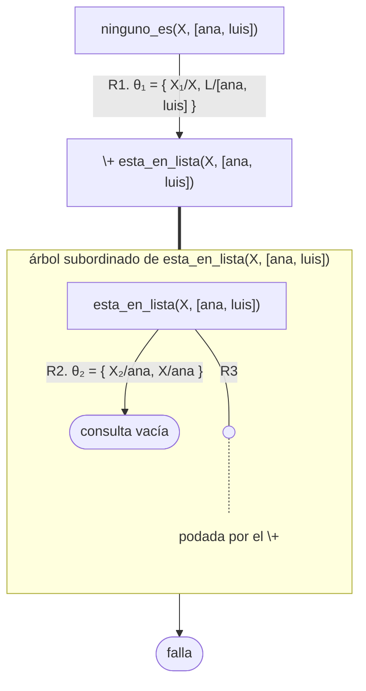
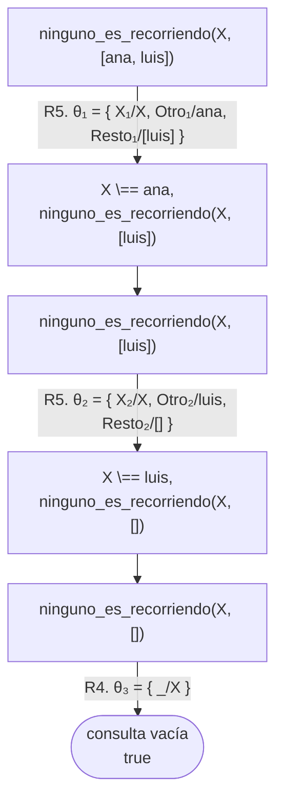
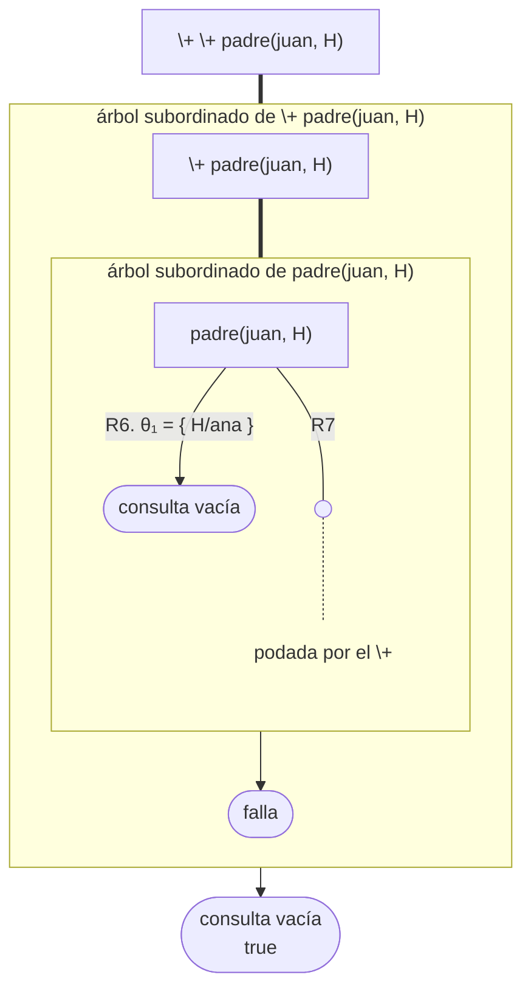
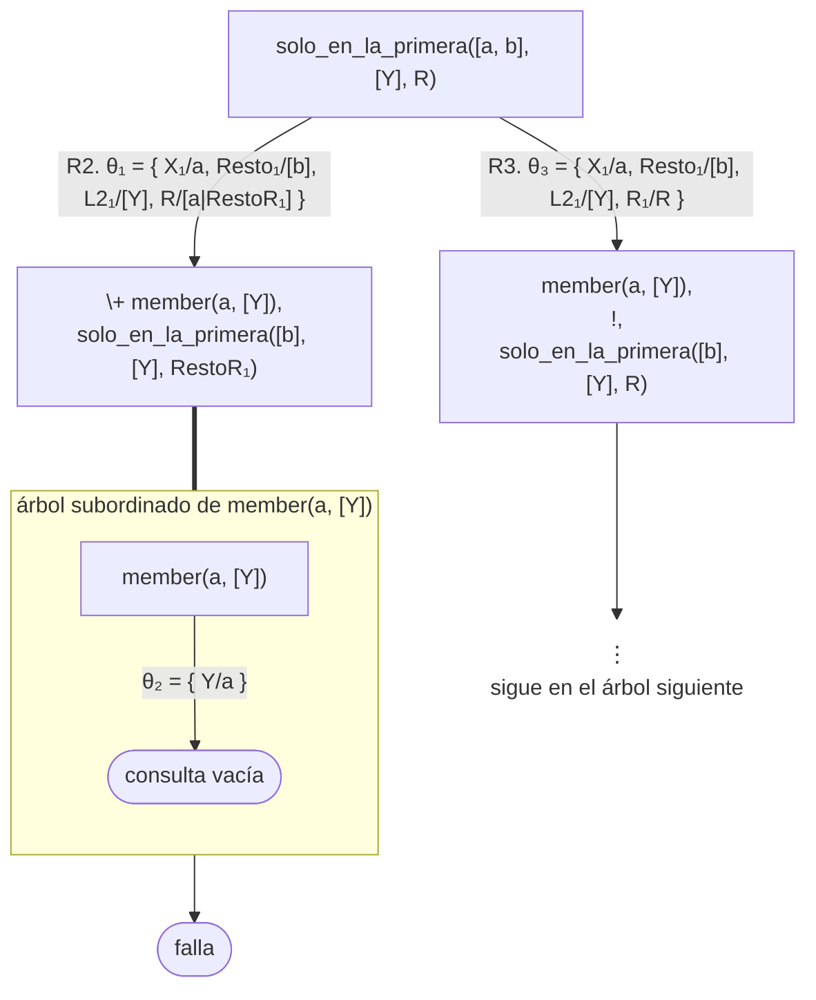
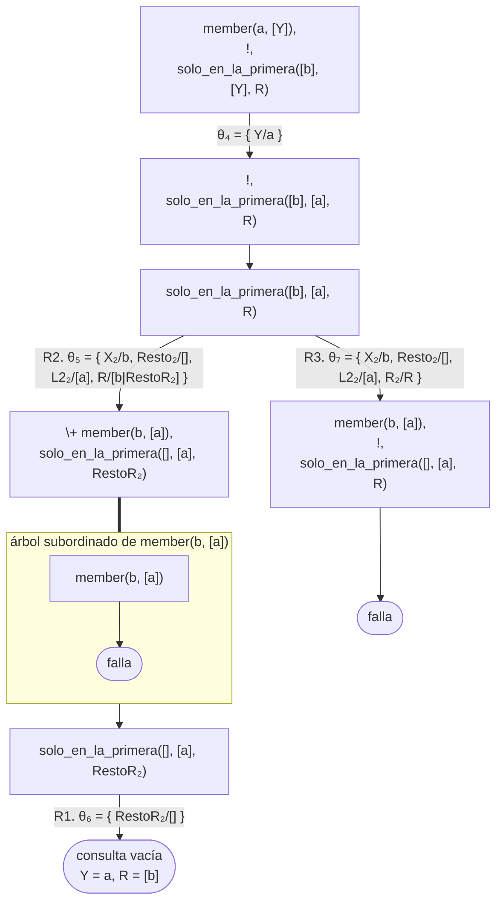

# Soluciones del capítulo 10 — Negación como falla

El código de esta página está en `ejemplos/capitulo-10/soluciones.pl` y pasa sus
pruebas. Además de `persona/1` y `padre/2` del capítulo, el archivo contiene los
hechos sobre los que razonan los ejercicios 6, 7 y 12:

<!-- ejemplo: capitulo-10/soluciones.pl predicado: tiene/2 casado/2 -->
```prolog
% tiene(P, M): P tiene la mascota M.
tiene(ana, gato).
tiene(luis, perro).

% casado(A, B): A está casado con B.
casado(juan, marta).
```

## 1

```prolog
?- \+ padre(pedro, luis).
false.

?- \+ padre(luis, pedro).
true.
```

La primera falla porque el hecho está en el programa: pedro **es** el padre de
luis, de modo que el objetivo negado se prueba y `\+` no se cumple. La segunda se
cumple porque ese hecho no figura en el programa ni se deduce de él.

## 2

| | |
|---|---|
| `ana == ana` | **true**: es el mismo término |
| `ana = ana` | **true**: unifican, sin instanciar ninguna variable |
| `ana \== eva` | **true**: son términos distintos |
| `X == ana` | **false**: una variable libre no *es* el átomo `ana` |
| `X = ana` | **true**, y liga `X` a `ana` |

Las dos últimas filas resumen la diferencia entre `=` y `==`: el primero puede
instanciar variables; el segundo solo compara.

## 3

<!-- ejemplo: capitulo-10/soluciones.pl predicado: no_es_hijo_de/2 consulta: no_es_hijo_de(H, juan). -->
```prolog
%!  no_es_hijo_de(?H, +P) is nondet.
%
%   H es una persona que no es hijo de P. persona(H) se escribe primero para
%   que \+ opere sobre un valor instanciado.
no_es_hijo_de(H, P) :-
    persona(H),
    \+ padre(P, H).
```

El aspecto relevante es el orden. Con `\+` en primer lugar, `H` llegaría libre, y
la pregunta sería "¿es imposible probar que juan tiene hijos?", que es falsa; el
predicado no produciría ninguna respuesta.

juan figura entre las respuestas, y es correcto: no es hijo de sí mismo.

El encabezado es `no_es_hijo_de(?H, +P) is nondet`. `H` es `?` porque
`persona(H)` lo genera cuando llega libre, y lo verifica cuando llega ligado.
`P` es `+` porque llega al `\+` sin que ningún objetivo anterior lo ligue: con
`P` libre, la pregunta sería "¿es imposible probar que H es hijo de alguien?", y
el predicado solo respondería juan, el único que no tiene padre registrado. Es
`nondet` porque, con `H` libre, hay una respuesta por cada persona que cumple.

**Sin `\+`.** Con corte y falla, la negación pasa a un predicado auxiliar,
como en la [sección 10.8](index.md#108-prescindir-de):

<!-- ejemplo: capitulo-10/soluciones.pl predicado: no_es_hijo_de_con_corte/2 no_es_padre_de/2 consulta: no_es_hijo_de_con_corte(H, juan). -->
```prolog
%!  no_es_hijo_de_con_corte(?H, +P) is nondet.
%
%   H es una persona que no es hijo de P, con corte y falla.
no_es_hijo_de_con_corte(H, P) :-
    persona(H),
    no_es_padre_de(P, H).

%!  no_es_padre_de(+P, +H) is semidet.
%
%   P no es el padre de H.
no_es_padre_de(P, H) :-
    padre(P, H),
    !,
    fail.
no_es_padre_de(_, _).
```

Sin negación, se requiere la lista de hijos de cada persona, incluidas las que
no tienen hijos, y la no pertenencia se verifica recorriendo esa lista con
`ninguno_es_recorriendo/2`, del ejercicio 13:

```prolog
% hijos(P, L): L es la lista de los hijos de P. Repite padre/2.
hijos(juan, [ana, pedro]).
hijos(pedro, [luis, eva]).
hijos(ana, []).
hijos(luis, []).
hijos(eva, []).
```

<!-- ejemplo: capitulo-10/soluciones.pl predicado: no_es_hijo_de_sin_negacion/2 consulta: no_es_hijo_de_sin_negacion(H, juan). -->
```prolog
%!  no_es_hijo_de_sin_negacion(?H, +P) is nondet.
%
%   H es una persona que no está en la lista de hijos de P.
no_es_hijo_de_sin_negacion(H, P) :-
    persona(H),
    hijos(P, Hijos),
    ninguno_es_recorriendo(H, Hijos).
```

`hijos/2` repite `padre/2`, y además debe tener una entrada con la lista vacía
para cada persona sin hijos: sin `hijos(ana, [])`, la consulta
`no_es_hijo_de_sin_negacion(H, ana).` no produce ninguna respuesta, aunque
nadie sea hijo de ana.

Líneas de código: con `\+`, 3; con corte y falla, 8; sin negación, 13, incluidos los 5 hechos de `hijos/2` y las 4 líneas de `ninguno_es_recorriendo/2`.

## 4

<!-- ejemplo: capitulo-10/soluciones.pl predicado: tiene_hermano/1 sin_hermanos/1 consulta: sin_hermanos(Quien). -->
```prolog
%!  tiene_hermano(?P) is nondet.
%
%   P tiene algún hermano.
tiene_hermano(P) :-
    padre(Padre, P),
    padre(Padre, Otro),
    Otro \== P.

%!  sin_hermanos(?P) is nondet.
%
%   P no tiene hermanos.
sin_hermanos(P) :-
    persona(P),
    \+ tiene_hermano(P).
```

`tiene_hermano/1` da nombre a la condición negada, como `otro_hijo/2` en la
[sección 10.7](index.md#107-obtener-una-respuesta-por-negacion). La misma regla
se puede escribir con la conjunción dentro del `\+`, sin auxiliar:
`sin_hermanos(P) :- persona(P), \+ ( padre(Padre, P), padre(Padre, Otro), Otro
\== P ).` El ejercicio 5 compara las dos formas.

**Sin `\+`.** Con corte y falla:

<!-- ejemplo: capitulo-10/soluciones.pl predicado: sin_hermanos_con_corte/1 no_tiene_hermano/1 consulta: sin_hermanos_con_corte(Quien). -->
```prolog
%!  sin_hermanos_con_corte(?P) is nondet.
%
%   P no tiene hermanos, con corte y falla.
sin_hermanos_con_corte(P) :-
    persona(P),
    no_tiene_hermano(P).

%!  no_tiene_hermano(+P) is semidet.
%
%   P no tiene ningún hermano.
no_tiene_hermano(P) :-
    tiene_hermano(P),
    !,
    fail.
no_tiene_hermano(_).
```

Sin negación, «no tiene hermanos» se descompone en dos casos que se pueden
afirmar: la persona no tiene padre registrado, o es el único elemento de la
lista de hijos de su padre. El primer caso es información negativa, y se debe
escribir como un hecho positivo:

```prolog
% sin_padre(P): P no tiene padre registrado. Repite en positivo lo que padre/2
% no dice.
sin_padre(juan).
```

<!-- ejemplo: capitulo-10/soluciones.pl predicado: sin_hermanos_sin_negacion/1 consulta: sin_hermanos_sin_negacion(Quien). -->
```prolog
%!  sin_hermanos_sin_negacion(?P) is nondet.
%
%   P no tiene padre registrado, o es el único elemento de la lista de hijos
%   de su padre.
sin_hermanos_sin_negacion(P) :-
    sin_padre(P).
sin_hermanos_sin_negacion(P) :-
    hijos(_, [P]).
```

Usa además `hijos/2`, del ejercicio 3. Líneas de código: con `\+`, 7; con corte y falla, 12; sin negación, 10, incluidos `sin_padre/1` y `hijos/2`.

## 5

El auxiliar no es necesario. La condición «P tiene otro hijo» es una conjunción
de dos objetivos, y la [sección 10.7](index.md#107-obtener-una-respuesta-por-negacion) muestra que una conjunción se niega
directamente, entre paréntesis:

<!-- ejemplo: capitulo-10/soluciones.pl predicado: hijo_unico_sin_auxiliar/1 consulta: hijo_unico_sin_auxiliar(Quien). -->
```prolog
%!  hijo_unico_sin_auxiliar(?H) is nondet.
%
%   H tiene un padre, y ese padre no tiene otros hijos. La condición negada
%   es la conjunción misma, sin el auxiliar otro_hijo/2 de negacion.pl.
hijo_unico_sin_auxiliar(H) :-
    padre(P, H),
    \+ ( padre(P, Otro),
         Otro \== H ).
```

Las dos formas tienen las mismas respuestas —ninguna, con la base del
capítulo—, y en las dos `Otro` aparece solamente dentro del `\+`, con la lectura
«para todo otro hijo» de la [sección 10.7](index.md#107-obtener-una-respuesta-por-negacion); `H` llega con valor desde
`padre(P, H)`, de modo que ninguna de las dos incurre en el error de la
[sección 10.4](index.md#104-donde-ubicar).

Lo que se gana con el auxiliar es un nombre: `otro_hijo(P, H)` se lee como una
afirmación sobre la familia, se puede consultar por separado
(`otro_hijo(juan, ana).` responde `true.`) y lleva su propio encabezado, que
registra con `+H` que el `\==` necesita a `H` con valor. Esa condición queda
implícita en la versión sin auxiliar, donde la garantiza el orden de los
objetivos. Lo que se pierde es extensión: la definición pasa de una regla de 4
líneas a dos predicados y 6 líneas, y la condición negada se lee en otro lugar
del archivo. Para una conjunción de dos objetivos, como esta, la forma directa
es la habitual; el auxiliar conviene cuando la condición es larga, se usa en
más de una regla o requiere una prueba propia.

## 6

<!-- ejemplo: capitulo-10/soluciones.pl predicado: nadie_tiene/1 consulta: nadie_tiene(tortuga). -->
```prolog
%!  nadie_tiene(+Cosa) is semidet.
%
%   Nadie tiene Cosa. Es correcto con Cosa instanciada.
nadie_tiene(Cosa) :-
    \+ tiene(_, Cosa).
```

Funciona correctamente con `Cosa` **instanciada**: `nadie_tiene(tortuga)`
responde `true` y `nadie_tiene(gato)` responde `false`, que son las respuestas
correctas.

Con `Cosa` libre no es útil: `nadie_tiene(X)` pregunta si es imposible probar
que alguien tiene algo, y como ana tiene un gato, responde siempre `false`. No
enumera los objetos que nadie tiene, porque `\+` no genera valores. Por eso el
encabezado es `nadie_tiene(+Cosa) is semidet`.

**Sin `\+`.** Como todo el cuerpo es la negación, la versión con corte y falla
no requiere un predicado auxiliar:

<!-- ejemplo: capitulo-10/soluciones.pl predicado: nadie_tiene_con_corte/1 consulta: nadie_tiene_con_corte(tortuga). -->
```prolog
%!  nadie_tiene_con_corte(+Cosa) is semidet.
%
%   Nadie tiene Cosa, con corte y falla.
nadie_tiene_con_corte(Cosa) :-
    tiene(_, Cosa),
    !,
    fail.
nadie_tiene_con_corte(_).
```

Sin negación, con la lista de las cosas que alguien tiene:

```prolog
% cosas_tenidas(L): L es la lista de las cosas que alguien tiene. Repite
% tiene/2.
cosas_tenidas([gato, perro]).
```

<!-- ejemplo: capitulo-10/soluciones.pl predicado: nadie_tiene_sin_negacion/1 consulta: nadie_tiene_sin_negacion(tortuga). -->
```prolog
%!  nadie_tiene_sin_negacion(+Cosa) is semidet.
%
%   Cosa no está en la lista de las cosas que alguien tiene.
nadie_tiene_sin_negacion(Cosa) :-
    cosas_tenidas(Cosas),
    ninguno_es_recorriendo(Cosa, Cosas).
```

Con `Cosa` instanciada, las tres versiones responden lo mismo. Con `Cosa` libre
difieren en sentido opuesto: la versión con `\+` y la de corte responden
`false.`, y la versión sin negación se cumple, porque una variable sin valor es
distinta, con `\==`, de `gato` y de `perro` (es la situación del ejercicio 13).
Ninguna de las tres enumera las cosas que nadie tiene.

Líneas de código: con `\+`, 2; con corte y falla, 5; sin negación, 8, incluidas las 4 de `ninguno_es_recorriendo/2`.

## 7

El problema es el orden de los objetivos, igual que en la [sección 10.4](index.md#104-donde-ubicar). Con `\+`
en primer lugar, `P` está libre, de modo que la pregunta es "¿es imposible probar
que alguien está casado?". Como juan está casado, la respuesta es negativa, y
`soltero/1` no produce ninguna respuesta.

<!-- ejemplo: capitulo-10/soluciones.pl predicado: soltero/1 consulta: soltero(Quien). -->
```prolog
%!  soltero(?P) is nondet.
%
%   P no está casado. Con los objetivos en el orden correcto.
soltero(P) :-
    persona(P),
    \+ casado(P, _).
```

Con `persona(P)` en primer lugar, la negación se evalúa para cada persona por
separado.

**Sin `\+`.** Con corte y falla:

<!-- ejemplo: capitulo-10/soluciones.pl predicado: soltero_con_corte/1 no_casado/1 consulta: soltero_con_corte(Quien). -->
```prolog
%!  soltero_con_corte(?P) is nondet.
%
%   P no está casado, con corte y falla.
soltero_con_corte(P) :-
    persona(P),
    no_casado(P).

%!  no_casado(+P) is semidet.
%
%   P no está casado con nadie.
no_casado(P) :-
    casado(P, _),
    !,
    fail.
no_casado(_).
```

Sin negación, con la lista de las personas casadas:

```prolog
% casados(L): L es la lista de las personas casadas. Repite casado/2.
casados([juan]).
```

<!-- ejemplo: capitulo-10/soluciones.pl predicado: soltero_sin_negacion/1 consulta: soltero_sin_negacion(Quien). -->
```prolog
%!  soltero_sin_negacion(?P) is nondet.
%
%   P no está en la lista de las personas casadas.
soltero_sin_negacion(P) :-
    persona(P),
    casados(Casados),
    ninguno_es_recorriendo(P, Casados).
```

Líneas de código: con `\+`, 3; con corte y falla, 8; sin negación, 9, incluidas las 4 de `ninguno_es_recorriendo/2`.

## 8

<!-- ejemplo: capitulo-10/soluciones.pl predicado: solo_en_la_primera/3 consulta: solo_en_la_primera([ana, luis, eva], [luis], R). -->
```prolog
%!  solo_en_la_primera(+L1, +L2, -R) is det.
%
%   R contiene los elementos de L1 que no están en L2. El corte descarta las
%   demás soluciones de member/2: es suficiente que X aparezca una vez en L2.
%   Los elementos de las dos listas deben tener valor.
solo_en_la_primera([], _, []).
solo_en_la_primera([X|Resto], L2, [X|RestoR]) :-
    \+ member(X, L2),
    solo_en_la_primera(Resto, L2, RestoR).
solo_en_la_primera([X|Resto], L2, R) :-
    member(X, L2),
    !,
    solo_en_la_primera(Resto, L2, R).
```

Tiene tres cláusulas, como varios ejercicios anteriores: la lista vacía, el caso
en que el elemento se conserva y el caso en que se descarta. Las condiciones de
las dos últimas son complementarias —`\+ member(...)` y `member(...)`—, de modo
que no se superponen.

El corte de la tercera cláusula es verde, como el de `sin_repetidos/2` del
[capítulo 9](../capitulo-09-backtracking-y-corte/index.md). `member(X, L2)` se cumple una vez por cada aparición de `X` en `L2`;
sin el corte, un elemento repetido en `L2` produciría la misma respuesta más de
una vez. Para descartar el elemento es suficiente la primera solución, y el
corte elimina las demás.

En este predicado `\+` está correctamente ubicado: cuando se lo evalúa, `X` ya
está instanciada, porque proviene de la descomposición de la lista en la cabeza
de la cláusula.

**Sin `\+`.** Aquí la versión con corte es más breve que la original. Si la
cláusula que descarta el elemento va antes que la que lo conserva, su corte
garantiza que la tercera cláusula solo se alcanza cuando `X` no está en `L2`, y
la condición `\+ member(X, L2)` se puede omitir:

<!-- ejemplo: capitulo-10/soluciones.pl predicado: solo_en_la_primera_con_corte/3 consulta: solo_en_la_primera_con_corte([ana, luis, eva], [luis], R). -->
```prolog
%!  solo_en_la_primera_con_corte(+L1, +L2, -R) is det.
%
%   R contiene los elementos de L1 que no están en L2. La cláusula que
%   descarta va primero, y su corte hace innecesaria la condición de la
%   tercera: es un corte rojo.
solo_en_la_primera_con_corte([], _, []).
solo_en_la_primera_con_corte([X|Resto], L2, R) :-
    member(X, L2),
    !,
    solo_en_la_primera_con_corte(Resto, L2, R).
solo_en_la_primera_con_corte([X|Resto], L2, [X|RestoR]) :-
    solo_en_la_primera_con_corte(Resto, L2, RestoR).
```

La contrapartida es que el corte pasa a ser rojo, en el sentido de la [sección 9.5](../capitulo-09-backtracking-y-corte/index.md#95-corte-verde-y-corte-rojo):
sin él, la tercera cláusula conservaría también los elementos que están en
`L2`. La versión original, con la condición explícita, tiene un corte verde.

Sin negación, la no pertenencia se verifica recorriendo `L2`, sin repetir
datos, porque la lista ya es el dato completo:

<!-- ejemplo: capitulo-10/soluciones.pl predicado: solo_en_la_primera_sin_negacion/3 consulta: solo_en_la_primera_sin_negacion([ana, luis, eva], [luis], R). -->
```prolog
%!  solo_en_la_primera_sin_negacion(+L1, +L2, -R) is det.
%
%   R contiene los elementos de L1 que no están en L2. La no pertenencia se
%   verifica recorriendo L2.
solo_en_la_primera_sin_negacion([], _, []).
solo_en_la_primera_sin_negacion([X|Resto], L2, [X|RestoR]) :-
    ninguno_es_recorriendo(X, L2),
    solo_en_la_primera_sin_negacion(Resto, L2, RestoR).
solo_en_la_primera_sin_negacion([X|Resto], L2, R) :-
    member(X, L2),
    !,
    solo_en_la_primera_sin_negacion(Resto, L2, R).
```

Líneas de código: con `\+`, 8; con corte y falla, 7; sin negación, 12, incluidas las 4 de `ninguno_es_recorriendo/2`.

## 9

Las dos maneras de la [sección 10.8](index.md#108-prescindir-de) se aplican así, y cada una tiene un costo.

**Con corte y falla**, a partir de la definición de `\+` de la [sección 10.8](index.md#108-prescindir-de):

<!-- ejemplo: capitulo-10/soluciones.pl predicado: no_tiene_hijos_con_corte/1 no_es_padre/1 consulta: no_tiene_hijos_con_corte(Quien). -->
```prolog
%!  no_tiene_hijos_con_corte(?P) is nondet.
%
%   P no es padre de nadie, con corte y falla.
no_tiene_hijos_con_corte(P) :-
    persona(P),
    no_es_padre(P).

%!  no_es_padre(+P) is semidet.
%
%   P no es padre de nadie.
no_es_padre(P) :-
    padre(P, _),
    !,
    fail.
no_es_padre(_).
```

Es `\+` escrito a mano: el mismo comportamiento, incluida la exigencia de que
`P` llegue con valor a `no_es_padre/1`, con un predicado auxiliar más.

**Sin negación**, cambiando la representación. Si cada persona tiene su lista de
hijos —la de `hijos/2`, del ejercicio 3—, «no tiene hijos» es «su lista de
hijos está vacía»:

<!-- ejemplo: capitulo-10/soluciones.pl predicado: no_tiene_hijos_sin_negacion/1 consulta: no_tiene_hijos_sin_negacion(Quien). -->
```prolog
%!  no_tiene_hijos_sin_negacion(?P) is nondet.
%
%   La lista de hijos de P está vacía.
no_tiene_hijos_sin_negacion(P) :-
    hijos(P, []).
```

La regla ocupa dos líneas, pero la información está repetida: `hijos/2` dice lo
mismo que `padre/2` y, además, registra con la lista vacía a quienes no tienen
hijos. Es la hipótesis del mundo cerrado escrita a mano: si se agrega una
persona sin su hecho `hijos/2`, la regla no la encuentra.

Lo que no es posible con los elementos de la parte I es la versión sin negación
**sin repetir los datos**, es decir, construir la lista de hijos a partir de los
hechos `padre/2`. «P no tiene hijos» es una afirmación sobre **todos** los hijos
posibles de P. Los elementos vistos hasta aquí examinan las respuestas de un
objetivo de a una, a medida que se producen, y `\+` es la única construcción de
la parte I que evalúa un objetivo completo y produce un resultado sobre el
conjunto. El elemento que falta es la posibilidad de reunir todas las respuestas
en una lista y operar sobre ella. Es el tema del [capítulo 17](../capitulo-17-todas-las-soluciones/index.md), que presenta
`findall/3` y también `forall/2`, un predicado que expresa «para todos» de
manera directa.

Líneas de código: con `\+`, 3; con corte y falla, 8; sin negación, 7, incluidos los 5 hechos de `hijos/2`.

## 10

```prolog
?- ana = ana.
true.

?- ana == ana.
true.

?- X = ana.
X = ana.

?- X == ana.
false.

?- 2 + 1 == 3.
false.

?- 2 + 1 =:= 3.
true.

?- 2 + 1 = 3.
false.
```

`X = ana.` es la única cuya respuesta no es `true.` ni `false.`: es una
ligadura, porque `=` puede **hacer** que los dos términos coincidan, e informa
con qué valor. `X == ana.` responde `false.` porque pregunta si ya son el mismo
término, y una variable sin valor no lo es.

Las tres últimas separan las tres preguntas distintas que se pueden hacer sobre
`2 + 1` y `3`: si son el mismo término escrito (`==`, no), si valen lo mismo
(`=:=`, sí), y si pueden hacerse idénticos (`=`, no, porque ninguno de los dos
tiene variables que ligar).

## 11

```prolog
?- ana \= eva.
true.

?- ana \== eva.
true.

?- X \= ana.
false.

?- X \== ana.
true.

?- 2 + 1 \== 3.
true.

?- 2 + 1 =\= 3.
false.
```

Las dos que responden de manera distinta de lo que sugiere su lectura en
castellano son **`X \= ana.`** y **`2 + 1 =\= 3.`**

`X \= ana` se lee "X no es ana" y responde `false.`, porque lo que pregunta es
si los dos términos **no pueden** unificar, y sí pueden: basta con ligar `X` a
`ana`. Es el tema de la [sección 10.6](index.md#106-con-variables-libres).

`2 + 1 =\= 3` se lee "dos más uno es distinto de tres" y responde `false.`
porque es correcto: los dos **valen** lo mismo. La confusión viene de compararla
con `2 + 1 \== 3`, que responde `true.` y es igual de correcta: son términos
distintos con el mismo valor.

## 12

La causa es la de la [sección 10.4](index.md#104-donde-ubicar): cuando se evalúa `\+ tiene(P, _)`, la
variable `P` todavía está libre, de modo que la pregunta no es "¿P no tiene
mascota?" sino "¿es imposible que **alguien** tenga mascota?". Como ana tiene
un gato, el objetivo negado se prueba, `\+` falla, y la regla completa falla
para todos.

<!-- ejemplo: capitulo-10/soluciones.pl predicado: sin_mascota_correcto/1 consulta: sin_mascota_correcto(Quien). -->
```prolog
%!  sin_mascota_correcto(?P) is nondet.
%
%   P es una persona que no tiene ninguna mascota. persona(P) se escribe
%   primero, para que \+ opere sobre un valor concreto.
sin_mascota_correcto(P) :-
    persona(P),
    \+ tiene(P, _).
```

```prolog
?- sin_mascota_correcto(Quien).
Quien = juan ;
Quien = pedro ;
Quien = eva.
```

**Sin `\+`.** Con corte y falla:

<!-- ejemplo: capitulo-10/soluciones.pl predicado: sin_mascota_con_corte/1 no_tiene_mascota/1 consulta: sin_mascota_con_corte(Quien). -->
```prolog
%!  sin_mascota_con_corte(?P) is nondet.
%
%   P no tiene ninguna mascota, con corte y falla.
sin_mascota_con_corte(P) :-
    persona(P),
    no_tiene_mascota(P).

%!  no_tiene_mascota(+P) is semidet.
%
%   P no tiene ninguna mascota.
no_tiene_mascota(P) :-
    tiene(P, _),
    !,
    fail.
no_tiene_mascota(_).
```

Sin negación, con la lista de las personas que tienen mascota:

```prolog
% con_mascota(L): L es la lista de las personas con mascota. Repite tiene/2.
con_mascota([ana, luis]).
```

<!-- ejemplo: capitulo-10/soluciones.pl predicado: sin_mascota_sin_negacion/1 consulta: sin_mascota_sin_negacion(Quien). -->
```prolog
%!  sin_mascota_sin_negacion(?P) is nondet.
%
%   P no está en la lista de las personas con mascota.
sin_mascota_sin_negacion(P) :-
    persona(P),
    con_mascota(Con),
    ninguno_es_recorriendo(P, Con).
```

Líneas de código: con `\+`, 3; con corte y falla, 8; sin negación, 9, incluidas las 4 de `ninguno_es_recorriendo/2`.

## 13

<!-- ejemplo: capitulo-10/soluciones.pl predicado: ninguno_es/2 esta_en_lista/2 ninguno_es_recorriendo/2 consulta: ninguno_es(sofia, [ana, luis]). -->
```prolog
%!  ninguno_es(+X, +L) is semidet.
%
%   Ningún elemento de L es X. Con \+ sobre la pertenencia.
ninguno_es(X, L) :-
    \+ esta_en_lista(X, L).

%!  esta_en_lista(?X, ?L) is nondet.
%
%   X es un elemento de L.
esta_en_lista(X, [X|_]).
esta_en_lista(X, [_|Resto]) :-
    esta_en_lista(X, Resto).

%!  ninguno_es_recorriendo(+X, +L) is semidet.
%
%   Ningún elemento de L es X: lo mismo, sin \+, con la plantilla 11.
ninguno_es_recorriendo(_, []).
ninguno_es_recorriendo(X, [Otro|Resto]) :-
    X \== Otro,
    ninguno_es_recorriendo(X, Resto).
```

Con `X` instanciada las dos versiones coinciden. Con `X` libre responden cosas
opuestas, y ninguna de las dos responde lo que la lectura en castellano
sugeriría:

- `ninguno_es(X, [ana, luis]).` **falla**. `\+` pregunta si es imposible que
  `X` pertenezca a la lista, y no lo es: `X` puede ser `ana`. Además, aunque
  tuviera éxito, `\+` no dejaría ninguna ligadura.
- `ninguno_es_recorriendo(X, [ana, luis]).` **se cumple**, dejando `X` sin
  valor. `X \== ana` es cierto, porque una variable sin valor y `ana` son
  términos distintos; y lo mismo con `luis`. El predicado afirma entonces algo
  que no se sostiene: que hay un `X` que no es ninguno de los dos, sin decir
  cuál.

Los dos comportamientos tienen la misma causa: `\+` y `\==` consultan el estado
actual de los términos, no todos los valores posibles.

```prolog
?- ninguno_es(X, [ana, luis]).
false.

?- ninguno_es_recorriendo(X, [ana, luis]).
true.
```

Los dos árboles, con `ninguno_es/2` numerada R1, las cláusulas de
`esta_en_lista/2` R2 y R3 y las de `ninguno_es_recorriendo/2` R4 y R5, lo
muestran. Las variables de las cláusulas llevan el número del uso —`X₁`, `X₂`—,
porque la consulta también tiene una `X`. En el primero, el árbol subordinado
liga `X` a `ana` con R2 y llega a la consulta vacía; esa hoja hace fallar al
`\+`, y la ligadura no sale del recuadro:



En el segundo no hay ningún árbol subordinado: `X \== ana` es un objetivo
predefinido que se cumple con `X` libre y desaparece, igual que `X \== luis`,
y la rama llega a la consulta vacía sin haber ligado `X` en ningún arco:



R4, `ninguno_es_recorriendo(_, [])`, no abre ninguna rama en los dos primeros
nodos, porque `[]` no unifica con una lista que tiene elementos; solo lo hace
al final, cuando la lista se agotó. La respuesta es `true.` con `X` sin valor,
que es lo que el predicado afirma sin sostén.

**Con corte y falla.** La versión sin negación es `ninguno_es_recorriendo/2`. La
tercera, con corte y falla, se comporta como la de `\+`, también con `X` libre:

<!-- ejemplo: capitulo-10/soluciones.pl predicado: ninguno_es_con_corte/2 consulta: ninguno_es_con_corte(sofia, [ana, luis]). -->
```prolog
%!  ninguno_es_con_corte(+X, +L) is semidet.
%
%   Ningún elemento de L es X, con corte y falla.
ninguno_es_con_corte(X, L) :-
    esta_en_lista(X, L),
    !,
    fail.
ninguno_es_con_corte(_, _).
```

Líneas de código: con `\+`, 5; con corte y falla, 8; sin negación, 4; las dos primeras incluyen las 3 líneas de `esta_en_lista/2`.

## 14

```prolog
?- \+ \+ padre(juan, H).
true.

?- padre(juan, H).
H = ana ;
H = pedro.
```

La primera responde `true.` **sin informar ningún valor de `H`**, aunque por
dentro haya encontrado uno.

El objetivo interno `padre(juan, H)` se prueba y liga `H` a `ana`. El primer
`\+` lo ve cumplirse, de modo que falla, y al fallar **descarta la ligadura**.
El segundo `\+` ve fallar al primero, y por lo tanto se cumple. El resultado es
un objetivo que tiene éxito exactamente cuando el original lo tenía, pero que
no deja ninguna ligadura.

En el árbol, el `\+` exterior abre un árbol subordinado cuyo único objetivo es
otro `\+`, que abre el suyo. Con la numeración de la
[sección 10.2](index.md#102-no-se-puede-probar) —`padre(juan, ana).` es R6 y
`padre(juan, pedro).` R7—:



La ligadura `H/ana` está en el recuadro interior, y no sale de él. El recuadro
exterior termina en «falla», de modo que el `\+` exterior se cumple y la rama
principal llega a la consulta vacía con `H` libre: `true.`, sin ningún valor.

Es la manera más directa de comprobar lo que dice la [sección 10.4](index.md#104-donde-ubicar): `\+` es una
prueba, y una prueba no produce valores. La doble negación se usa justamente
para eso, cuando se quiere saber si un objetivo se cumple sin conservar lo que
haya ligado.

## 15

El predicado se escribe invirtiendo las dos listas al invocar el del ejercicio
8, y las dos versiones responden lo correcto mientras los elementos de las dos
listas tengan valor:

<!-- ejemplo: capitulo-10/soluciones.pl predicado: solo_en_la_segunda/3 consulta: solo_en_la_segunda([luis], [ana, luis, eva], R). -->
```prolog
%!  solo_en_la_segunda(+L1, +L2, -R) is det.
%
%   R contiene los elementos de L2 que no están en L1. Los elementos de las
%   dos listas deben tener valor.
solo_en_la_segunda(L1, L2, R) :-
    solo_en_la_primera(L2, L1, R).
```

Lo que el ejercicio pide explicar es el caso en que no lo tienen.
`solo_en_la_primera/3` recorre su primera lista y consulta la pertenencia de
cada elemento en la segunda con `\+ member(X, L2)`. Si `L2` contiene una
variable sin valor, `member/2` se cumple en cuanto llega a ella, porque `X`
unifica con una variable; `\+` falla, y la tercera cláusula **descarta** el
elemento como si perteneciera a `L2`. El `\+` no deja ligaduras, pero el
`member/2` de la tercera cláusula sí: liga la variable al elemento descartado.

```prolog
?- solo_en_la_primera([a, b], [Y], R).
Y = a,
R = [b] ;
false.
```

`a` se descarta y `Y` queda ligada a `a`; después `b` sí se conserva, porque
`[Y]` es ahora `[a]`. Un elemento sin valor en la primera lista se descarta por
la misma razón: `solo_en_la_primera([X], [a], R)` responde `X = a, R = []`. En
ningún caso el resultado contiene una variable: el predicado afirma que el
elemento pertenece a la otra lista cuando solo **podría** pertenecer. Es la
situación de la [sección 10.4](index.md#104-donde-ubicar), aunque el `\+` esté bien ubicado: `X` llega
con valor, y lo que carece de valor está dentro de `L2`.

El árbol de esa consulta, con las tres cláusulas de `solo_en_la_primera/3`
numeradas R1 a R3 y dibujado en dos partes por su altura, muestra las dos
ligaduras de `Y`: la que el árbol subordinado hace y descarta, y la que
`member/2` hace en la rama de R3 y queda. `member/2` es predefinido y liga sin
número de cláusula, como en la
[sección 9.6](../capitulo-09-backtracking-y-corte/index.md#96-generar-y-probar);
las variables de las cláusulas llevan el número del uso, porque la consulta
también tiene una `R`:



La rama de R2 falla por el árbol subordinado, que liga `Y` a `a` en `θ₂` y
llega a la consulta vacía; esa ligadura queda en el recuadro. La rama de R3
continúa en el segundo árbol, que empieza en su primer nodo:



Aquí `member(a, [Y])` se prueba otra vez, ahora como objetivo de la consulta,
y `θ₄` liga `Y` a `a` de manera definitiva: a partir de allí la segunda lista
es `[a]`. En el nodo siguiente, `b` sí se conserva, porque el árbol
subordinado de `member(b, [a])` falla, y la hoja de éxito es `Y = a, R = [b]`.
La rama de R3 de ese nodo queda pendiente, y por eso la respuesta termina en
`;`: al pedir otra, `member(b, [a])` falla y Prolog responde `false.`.

Al invertir los argumentos se invierte cuál de las dos listas queda bajo el
`\+`, pero la condición es la misma para los dos predicados: los elementos de
las dos listas deben tener valor. El `+` del encabezado indica que la lista debe
llegar ligada, no que sus elementos tengan valor; esa condición adicional es la
que la descripción agrega, en el ejercicio 8 y en este.

## 16

<!-- ejemplo: capitulo-10/soluciones.pl predicado: mejor_de/2 consulta: mejor_de(logica, A). -->
```prolog
%!  mejor_de(?M, ?A) is nondet.
%
%   A tiene la nota más alta de la materia M: ninguna nota de M es mayor que
%   la suya. Con empate, todos los empatados son respuestas.
mejor_de(M, A) :-
    nota(A, M, N),
    \+ ( nota(_, M, Otra),
         Otra > N ).
```

```prolog
?- mejor_de(logica, A).
A = ana ;
A = eva.
```

`nota(A, M, N)` genera los candidatos, cada uno con su nota. El `\+` descarta a
los que tienen por encima alguna nota **de la misma materia**: `M` llega con
valor al `\+` y restringe la búsqueda, mientras que `Otra` y el alumno anónimo
solo aparecen adentro y recorren todas las notas de `M`.

La consulta tiene dos respuestas porque ana y eva empatan con 9: para ninguna de
las dos existe una nota **mayor**. luis, con 7, queda descartado por cualquiera
de las otras dos. Si el enunciado pidiera un único mejor, el empate requeriría
un criterio adicional, que la regla no tiene.

La regla también responde con la materia libre: `mejor_de(M, A).` da ana y eva
para lógica y luis para álgebra, porque `M` recibe su valor en `nota/3` antes de
llegar al `\+`.

**Sin `\+`.** Con corte y falla:

<!-- ejemplo: capitulo-10/soluciones.pl predicado: mejor_de_con_corte/2 ninguna_nota_mayor/2 consulta: mejor_de_con_corte(logica, A). -->
```prolog
%!  mejor_de_con_corte(?M, ?A) is nondet.
%
%   A tiene la nota más alta de la materia M, con corte y falla.
mejor_de_con_corte(M, A) :-
    nota(A, M, N),
    ninguna_nota_mayor(M, N).

%!  ninguna_nota_mayor(+M, +N) is semidet.
%
%   Ninguna nota de la materia M es mayor que N.
ninguna_nota_mayor(M, N) :-
    nota(_, M, Otra),
    Otra > N,
    !,
    fail.
ninguna_nota_mayor(_, _).
```

Sin negación, las notas de cada materia se escriben en una lista de pares
`Alumno-Nota`. `ana-9` es un término compuesto con el operador `-`, como los de
la [sección 4.6](../capitulo-04-terminos-y-unificacion/index.md#46-los-operadores-tambien-son-terminos), que agrupa los dos datos sin evaluar nada. La lista se
recorre con un acumulador que conserva el mejor visto:

```prolog
% notas_de(M, L): L es la lista de pares Alumno-Nota de la materia M. Repite
% nota/3.
notas_de(logica, [ana-9, luis-7, eva-9]).
notas_de(algebra, [ana-6, luis-8, eva-5]).
```

<!-- ejemplo: capitulo-10/soluciones.pl predicado: mejor_de_sin_negacion/2 mejor_desde/4 consulta: mejor_de_sin_negacion(logica, A). -->
```prolog
%!  mejor_de_sin_negacion(?M, ?A) is nondet.
%
%   A tiene la nota más alta de la materia M: recorre la lista de notas de M
%   y conserva la mayor vista. Con empate, responde solo el primero.
mejor_de_sin_negacion(M, A) :-
    notas_de(M, [A0-N0|Resto]),
    mejor_desde(Resto, A0, N0, A).

%!  mejor_desde(+L, +Hasta, +N, -A) is det.
%
%   A es el alumno de mayor nota entre Hasta, de nota N, y los pares de L.
mejor_desde([], A, _, A).
mejor_desde([A1-N1|Resto], _, N, A) :-
    N1 > N,
    mejor_desde(Resto, A1, N1, A).
mejor_desde([_-N1|Resto], Hasta, N, A) :-
    N1 =< N,
    mejor_desde(Resto, Hasta, N, A).
```

```prolog
?- mejor_de_sin_negacion(logica, A).
A = ana.
```

Con el empate de lógica, la versión sin negación responde solo ana: el
acumulador conserva el primero cuando la nota nueva no es mayor. Para obtener
los dos habría que cambiar la estructura del recorrido.

Líneas de código: con `\+`, 4; con corte y falla, 9; sin negación, 12, incluidos los 2 hechos de `notas_de/2`.

## 17

<!-- ejemplo: capitulo-10/soluciones.pl predicado: llego_despues/3 ultimo/2 consulta: ultimo(X, [ana, luis, eva]). -->
```prolog
%!  llego_despues(?X, ?Y, +L) is nondet.
%
%   En la lista L, Y aparece después de X.
llego_despues(X, Y, [X|Resto]) :-
    esta_en_lista(Y, Resto).
llego_despues(X, Y, [_|Resto]) :-
    llego_despues(X, Y, Resto).

%!  ultimo(?X, +L) is semidet.
%
%   X es el último de L, una lista sin repetidos: nadie aparece después de X.
ultimo(X, L) :-
    esta_en_lista(X, L),
    \+ llego_despues(X, _, L).
```

```prolog
?- ultimo(X, [ana, luis, eva]).
X = eva ;
false.
```

`llego_despues/3` sigue la plantilla de recorrido del [capítulo 7](../capitulo-07-listas/index.md): la primera
cláusula encuentra `X` en la cabeza y busca `Y` en el resto; la segunda descarta
la cabeza y sigue buscando. `esta_en_lista/2` es el del ejercicio 13.

`ultimo/2` tiene la forma de la [sección 10.7](index.md#107-obtener-una-respuesta-por-negacion): `esta_en_lista(X, L)` propone cada
invitado, y el `\+` descarta a los que tienen a alguien después. La variable
anónima está solamente dentro del `\+`, de modo que se lee «para todo `Y`, `Y` no
llegó después de `X`».

Los encabezados registran que `L` debe llegar ligada: con `L` libre,
`llego_despues/3` generaría listas sin fin. `ultimo/2` es `semidet` porque en
una lista sin repetidos hay a lo sumo un último; la consulta termina con
`false.` porque `esta_en_lista/2` deja pendiente la búsqueda en el resto de la
lista, no porque haya otra respuesta.

El enunciado exige que no haya repetidos porque la regla pregunta por **el
valor** `X`, no por una posición de la lista. En `[ana, luis, ana]`, la última es
ana; pero `llego_despues(ana, luis, L)` se prueba con la primera aparición de
ana, el `\+` falla, y la consulta `ultimo(X, [ana, luis, ana]).` responde
`false.`

**Sin `\+`.** Con corte y falla:

<!-- ejemplo: capitulo-10/soluciones.pl predicado: ultimo_con_corte/2 nadie_despues/2 consulta: ultimo_con_corte(X, [ana, luis, eva]). -->
```prolog
%!  ultimo_con_corte(?X, +L) is semidet.
%
%   X es el último de L, una lista sin repetidos, con corte y falla.
ultimo_con_corte(X, L) :-
    esta_en_lista(X, L),
    nadie_despues(X, L).

%!  nadie_despues(+X, +L) is semidet.
%
%   En la lista L nadie aparece después de X.
nadie_despues(X, L) :-
    llego_despues(X, _, L),
    !,
    fail.
nadie_despues(_, _).
```

Sin negación, el último elemento se obtiene de la estructura de la lista, sin
compararlo con los demás: es el único elemento de una lista de un elemento, o
el último del resto.

<!-- ejemplo: capitulo-10/soluciones.pl predicado: ultimo_sin_negacion/2 consulta: ultimo_sin_negacion(X, [ana, luis, eva]). -->
```prolog
%!  ultimo_sin_negacion(?X, +L) is semidet.
%
%   X es el último elemento de L: el único de una lista de un elemento, o el
%   último del resto. Admite repetidos.
ultimo_sin_negacion(X, [X]).
ultimo_sin_negacion(X, [_|Resto]) :-
    ultimo_sin_negacion(X, Resto).
```

Es la versión más breve y la más general: admite repetidos, porque se refiere a
una posición y no a un valor, y `ultimo_sin_negacion(X, [ana, luis, ana]).`
responde `X = ana`. La lista ya es el dato completo, y la pregunta «nadie llegó
después» se reemplaza por «no queda nada después».

Líneas de código: con `\+`, 10; con corte y falla, 15; sin negación, 3; las dos primeras incluyen `llego_despues/3` y `esta_en_lista/2`.

## Comparación de las tres versiones

Líneas de código, sin comentarios ni líneas en blanco, de cada solución y de los
predicados auxiliares y los hechos repetidos que requiere. No se cuentan los
hechos comunes (`persona/1`, `padre/2`, `tiene/2`, `casado/2`, `nota/3`).

| Ejercicio | Con `\+` | Con corte y falla | Sin negación | Datos repetidos sin negación |
|---|---|---|---|---|
| 3 `no_es_hijo_de/2` | 3 | 8 | 13 | `hijos/2` |
| 4 `sin_hermanos/1` | 7 | 12 | 10 | `hijos/2`, `sin_padre/1` |
| 6 `nadie_tiene/1` | 2 | 5 | 8 | `cosas_tenidas/1` |
| 7 `soltero/1` | 3 | 8 | 9 | `casados/1` |
| 8 `solo_en_la_primera/3` | 8 | 7 | 12 | ninguno |
| 9 `no_tiene_hijos/1` | 3 | 8 | 7 | `hijos/2` |
| 12 `sin_mascota/1` | 3 | 8 | 9 | `con_mascota/1` |
| 13 `ninguno_es/2` | 5 | 8 | 4 | ninguno |
| 16 `mejor_de/2` | 4 | 9 | 12 | `notas_de/2` |
| 17 `ultimo/2` | 10 | 15 | 3 | ninguno |

Cuando los datos están en hechos (3, 4, 6, 7, 9, 12, 16), `\+` da la versión más
breve, la de corte y falla agrega un predicado auxiliar de dos cláusulas por
cada negación, y la versión sin negación requiere repetir los datos en listas
que se deben mantener a mano. Cuando los datos ya son una lista (8, 13, 17), la
versión sin negación no repite nada y es la más breve en dos de los tres casos;
en el ejercicio 17, además, es la única que admite repetidos.
