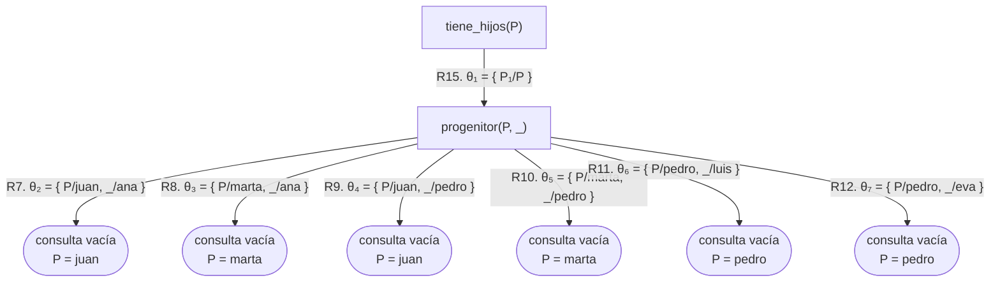
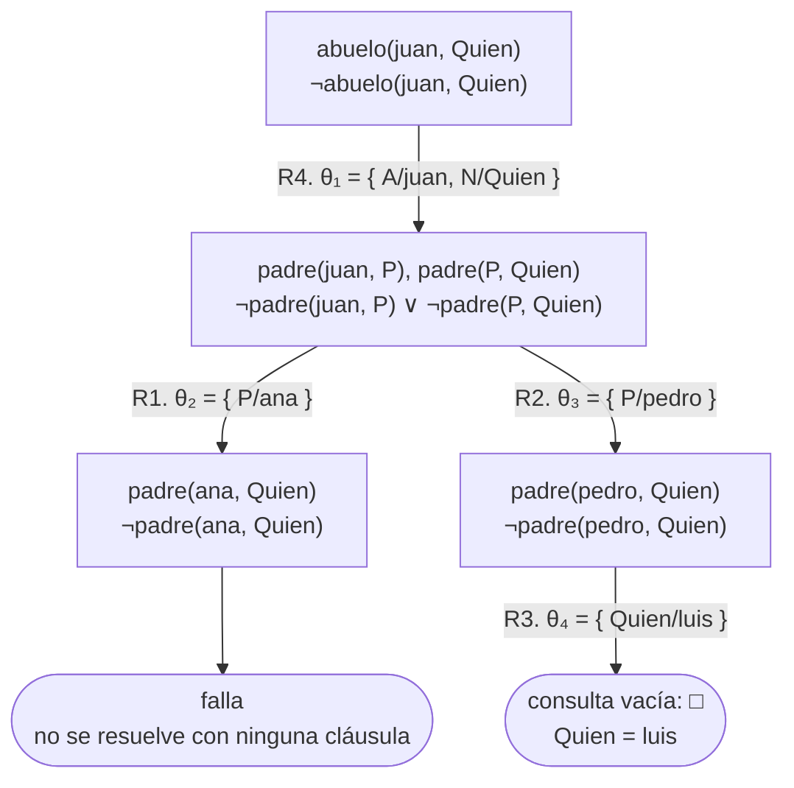

# Capítulo 12 — Prolog y la lógica

Este capítulo cierra la parte I, y vincula todo su contenido con la asignatura
de lógica.

En los capítulos anteriores se describió a Prolog como un mecanismo de búsqueda
de respuestas: prueba objetivos, recorre cláusulas, retrocede. Esa descripción
es correcta, y corresponde a lo que ocurre durante la ejecución del programa.
Existe una segunda lectura, presente desde el [capítulo 1](../capitulo-01-la-primera-hora/index.md) aunque no se la haya
nombrado: **un programa Prolog es un conjunto de afirmaciones lógicas**, y una
consulta es una pregunta sobre lo que se deduce de ellas.

Las dos lecturas coexisten, y en la mayoría de los casos coinciden. Este
capítulo describe la correspondencia entre ambas, y también los casos en los que
difieren.

## Objetivos del capítulo

Al terminar el capítulo, el lector puede:

- leer una regla como una fórmula lógica, y escribir una fórmula como regla;
- determinar qué cuantificador corresponde a cada variable de una cláusula;
- explicar qué es una cláusula de Horn y por qué Prolog se restringe a ellas;
- describir, en términos generales, el método con el que Prolog prueba una
  consulta;
- identificar las construcciones de Prolog que **no** admiten una lectura
  lógica.

!!! info "Tiempo estimado"
    Leer el capítulo, ejecutar sus ejemplos y hacer las actividades: **0:40 h**.
    Resolver los 7 ejercicios marcados con ★: **2:00 h**.
    Resolver los 17 ejercicios del final: **5:40 h**.

## 12.1 Las dos lecturas

La siguiente es una regla del ejemplo de este capítulo:

<!-- ejemplo: capitulo-12/logica.pl predicado: madre/2 consulta: madre(Quien, ana). -->
```prolog
%!  madre(?M, ?H) is nondet.
%
%   Para toda M y todo H, si M es mujer y M es progenitora de H, entonces M es
%   madre de H.
madre(M, H) :-
    mujer(M),
    progenitor(M, H).
```

La **lectura procedimental** es la que se usó hasta aquí: para probar que M es
madre de H, se prueba que M es mujer, y después se prueba que M es progenitora
de H.

La **lectura declarativa** no hace referencia a ningún procedimiento de prueba:

> Para toda M y todo H: si M es mujer y M es progenitora de H, entonces M es
> madre de H.

En notación simbólica, como en la asignatura de lógica:

$$\forall M \, \forall H \; \bigl( \mathit{mujer}(M) \land \mathit{progenitor}(M, H)
  \rightarrow \mathit{madre}(M, H) \bigr)$$

La fórmula no establece el orden en que se deben probar las condiciones, ni hace
referencia al backtracking. Establece qué es verdadero. Sin embargo, es
exactamente la misma regla.

## 12.2 Los conectivos

La traducción entre ambas notaciones es sistemática. Cuatro correspondencias
cubren la mayor parte de los casos:

| En lógica | En Prolog |
|---|---|
| $\land$ (conjunción) | la coma entre objetivos |
| $\lor$ (disyunción) | varias cláusulas del mismo predicado |
| $\rightarrow$ (implicación) | `:-`, **con los operandos en orden inverso** |
| $\lnot$ (negación) | `\+`, con restricciones ([sección 12.6](#126-lo-que-excede-la-logica)) |

Dos observaciones sobre la tabla.

**`:-` invierte el orden de la implicación.** En lógica se escribe primero el
antecedente y después el consecuente: $\text{condición} \rightarrow \text{conclusión}$. En Prolog se
escribe primero la conclusión: `conclusion :- condicion`. Por eso `:-` se suele
representar como una flecha hacia la izquierda. Es la misma implicación, con los
operandos en orden inverso.

**La disyunción no tiene un símbolo propio.** En la parte I no se usa ningún
operador para la disyunción: se escriben dos cláusulas, y ese conjunto de
cláusulas *es* la disyunción.

<!-- ejemplo: capitulo-12/logica.pl predicado: ascendiente/2 consulta: ascendiente(Quien, luis). -->
```prolog
%!  ascendiente(?A, ?D) is nondet.
%
%   A es progenitor de D, o es progenitor de alguien que a su vez es
%   ascendiente de D. La disyunción se expresa con las dos cláusulas.
ascendiente(A, D) :-
    progenitor(A, D).
ascendiente(A, D) :-
    progenitor(A, Medio),
    ascendiente(Medio, D).
```

Su lectura lógica es:

> Para todo A y todo D: A es ascendiente de D si A es progenitor de D, **o** si
> existe alguien de quien A es progenitor y que a su vez es ascendiente de D.

## 12.3 Las variables y los cuantificadores

En una cláusula no se escribe ningún cuantificador; sin embargo, cada variable
tiene uno asociado. La regla es breve:

**Una variable que aparece en la cabeza está cuantificada universalmente**, y el
alcance del $\forall$ es la cláusula completa. Es el caso de `M` y `H` en `madre/2`: la
regla vale para todos sus valores.

**Una variable que aparece solo en el cuerpo está cuantificada
existencialmente**, y el alcance del $\exists$ es el antecedente:

<!-- ejemplo: capitulo-12/logica.pl predicado: tiene_hijos/1 consulta: tiene_hijos(Quien). -->
```prolog
%!  tiene_hijos(?P) is nondet.
%
%   Para todo P, si existe algún H del que P es progenitor, entonces P tiene
%   hijos. H no aparece en la cabeza: es la variable cuantificada
%   existencialmente.
tiene_hijos(P) :-
    progenitor(P, _).
```

$$\forall P \; \bigl( \exists H \; \mathit{progenitor}(P, H)
  \rightarrow \mathit{tiene\_hijos}(P) \bigr)$$

"Para todo P: si existe algún H del que P es progenitor, entonces P tiene
hijos." La variable anónima `_` corresponde a la variable cuantificada
existencialmente, y por eso no es necesario darle nombre.

La regla tiene una excepción, y es la del [capítulo 10](../capitulo-10-negacion-como-falla/index.md): **una variable que
aparece solo dentro de un `\+` está cuantificada universalmente**, no
existencialmente. Negar "existe algún H" equivale a afirmar "para todo H, no":

$$\lnot \, \exists H \; \mathit{tiene}(P, H)
  \quad \equiv \quad
  \forall H \; \lnot \, \mathit{tiene}(P, H)$$

Es la razón de fondo del problema de ubicación de `\+` de la [sección 10.4](../capitulo-10-negacion-como-falla/index.md#104-donde-ubicar): al
escribir `\+ tiene(P, _)` no se pregunta si *algún* valor falla, sino si fallan
*todos*.

!!! question "Actividad"
    En `logica.pl`, `tiene_hijos/1` tiene una variable que aparece solo en el
    cuerpo. Ejecutar `tiene_hijos(P).` y solicitar todas las respuestas.
    Contar cuántas se obtienen para cada persona y explicar por qué hay
    repeticiones. Son la marca del $\exists$: Prolog no informa "existe un hijo", sino
    que informa una respuesta por cada hijo que encuentra.

El programa muestra un comportamiento que la fórmula no refleja:

```prolog
?- tiene_hijos(P).
P = juan ;
P = marta ;
P = juan ;
P = marta ;
P = pedro ;
P = pedro.
```

Se obtienen seis respuestas para tres personas. La fórmula establece que juan
tiene hijos, una sola vez; el programa lo establece una vez **por cada
demostración**, y juan tiene dos hijos registrados. Es la primera diferencia
entre las dos lecturas: la lógica establece qué es verdadero; Prolog produce una
respuesta por cada demostración.

El árbol de derivación del [capítulo 5](../capitulo-05-como-responde-prolog/index.md)
muestra las seis demostraciones. Con las cláusulas de `logica.pl` numeradas en
el orden del archivo —los hechos de `mujer/1` y `varon/1` ocupan R1 a R6, y las
reglas `madre/2` y `padre/2` son R13 y R14—, las que intervienen son:

| | |
|---|---|
| R7 | `progenitor(juan, ana).` |
| R8 | `progenitor(marta, ana).` |
| R9 | `progenitor(juan, pedro).` |
| R10 | `progenitor(marta, pedro).` |
| R11 | `progenitor(pedro, luis).` |
| R12 | `progenitor(pedro, eva).` |
| R15 | `tiene_hijos(P) :- progenitor(P, _).` |

La variable `P` de R15 se escribe `P₁` en el árbol, porque la consulta ya usa
ese nombre y cada uso de una cláusula emplea variables nuevas
([sección 6.2](../capitulo-06-recursion/index.md#62-caso-base-y-caso-recursivo)):



Seis hojas de éxito, seis respuestas: cada hoja es una demostración distinta, y
cada demostración aporta un testigo del $\exists$, el hijo al que queda ligada
la variable anónima. Las dos hojas `P = juan` difieren solo en ese testigo, y
la fórmula no distingue entre ellas.

## 12.4 Cláusulas de Horn

En lógica se pueden escribir fórmulas de cualquier forma: con varias
disyunciones en el consecuente, con negaciones en cualquier posición, con
cuantificadores anidados. Prolog no admite todas esas formas. Admite una forma
particular, y conocerla explica varias de sus características.

Una **cláusula de Horn** es una implicación con **una única conclusión**:

$$\text{condición}_1 \land \text{condición}_2 \land \dots \land \text{condición}_n
  \rightarrow \text{conclusión}$$

El consecuente contiene un solo átomo lógico, nunca dos.

Esa es exactamente la forma de una regla de Prolog, y los casos límite también
corresponden a construcciones del lenguaje:

- si no hay ninguna condición, queda solo la conclusión: es un **hecho**;
- si no hay conclusión, queda solo un conjunto de condiciones a satisfacer: es
  una **consulta**.

Hechos, reglas y consultas —las tres construcciones que se usan desde el
[capítulo 2](../capitulo-02-hechos-consultas-y-variables/index.md)— son los tres casos de una misma forma.

Esto permite releer el árbol de derivación del [capítulo 5](../capitulo-05-como-responde-prolog/index.md). Cada uno de sus nodos
es una **consulta**, es decir el tercer caso: una cláusula sin conclusión. Cada
uno de sus arcos está etiquetado con una cláusula de los otros dos casos, un
hecho o una regla. El árbol completo está construido con las tres
construcciones del lenguaje, y con ninguna otra.

### Por qué se usa esa forma

Porque con una única conclusión la demostración es **directa**: para establecer
la conclusión se deben satisfacer las condiciones, y no se requiere nada más.
Prolog no necesita razonar por casos ni formular hipótesis auxiliares.

Si se admitieran dos conclusiones —"llueve $\lor$ está nublado"—, el programa debería
operar con información indefinida: se sabe que una de las dos afirmaciones es
verdadera, pero no cuál. Ese razonamiento tiene un costo computacional mucho
mayor, y el lenguaje resultante ya no sería Prolog.

El costo de la restricción es que algunas afirmaciones no se pueden expresar.
"Toda persona es mayor o menor de edad" no se puede escribir como una cláusula
de Horn. Se puede escribir el predicado que lo determina —como se hizo en el
[capítulo 9](../capitulo-09-backtracking-y-corte/index.md)—, pero no es equivalente: es un programa que decide, y no una
afirmación que se pueda usar en cualquier sentido.

!!! question "Actividad"
    Intentar escribir "todo número es par o impar" como una sola cláusula, con
    la conclusión `par(N) ; impar(N)` a la izquierda de `:-`, y cargar el
    archivo. SWI-Prolog responde:

    ```
    ERROR: No permission to modify static procedure `(;)/2'
    ```

    La causa es la siguiente: Prolog lee esa cabeza
    como el término `;(par(N), impar(N))`, es decir como una llamada a `;/2`,
    que ya existe. Escribir en dos líneas por qué una cláusula de Horn admite
    la disyunción en el cuerpo y no en la cabeza.

## 12.5 Cómo prueba Prolog

El método de demostración de Prolog tiene una característica que conviene
explicitar: para probar que una afirmación es verdadera, comienza por suponer
que es **falsa**.

Ante la consulta `?- madre(marta, ana).`, Prolog agrega a las cláusulas del
programa la negación de la consulta —"marta no es madre de ana"— e intenta
derivar una contradicción. Si la encuentra, la suposición no puede ser
verdadera, y por lo tanto la consulta original sí lo es. El método se denomina
**demostración por refutación**.

La única regla de inferencia que usa es la del [capítulo 5](../capitulo-05-como-responde-prolog/index.md): tomar un objetivo,
encontrar una cláusula cuya cabeza unifique con él, y reemplazarlo por el cuerpo
de esa cláusula. Esa regla se denomina **resolución**, y la unificación del
[capítulo 4](../capitulo-04-terminos-y-unificacion/index.md) es la que determina cuándo se la puede aplicar.

En síntesis: **Prolog es resolución sobre cláusulas de Horn, con un recorrido
del árbol de izquierda a derecha y de arriba hacia abajo.** Esa definición resume
toda la parte I, y cada uno de sus términos se desarrolló en un capítulo
anterior.

Cuando el árbol alcanza un objetivo vacío —no queda nada por probar—, la
contradicción está derivada y se produce la respuesta. Las hojas de éxito del
[capítulo 5](../capitulo-05-como-responde-prolog/index.md) corresponden exactamente a esa situación.

### La refutación en forma clausal

En la asignatura de lógica la resolución se aplica a cláusulas escritas como
disyunciones. Como $b \land c \rightarrow a$ equivale a $\lnot b \lor \lnot c \lor a$, una
regla se escribe con su cabeza sin negar y cada objetivo del cuerpo negado; un
hecho queda como un único átomo sin negar, y la negación de una consulta, como
una disyunción de átomos negados. Las variables siguen cuantificadas
universalmente: la negación de «existe un `Quien` del que juan es abuelo» es
«para todo `Quien`, juan no es su abuelo». El programa de la
[sección 5.2](../capitulo-05-como-responde-prolog/index.md#52-el-arbol-de-derivacion)
y la consulta `?- abuelo(juan, Quien).` quedan así:

| | |
|---|---|
| R1 | $\mathit{padre}(\mathit{juan}, \mathit{ana})$ |
| R2 | $\mathit{padre}(\mathit{juan}, \mathit{pedro})$ |
| R3 | $\mathit{padre}(\mathit{pedro}, \mathit{luis})$ |
| R4 | $\lnot \mathit{padre}(A, P) \lor \lnot \mathit{padre}(P, N) \lor \mathit{abuelo}(A, N)$ |
| consulta negada | $\lnot \mathit{abuelo}(\mathit{juan}, \mathit{Quien})$ |

Un paso de resolución toma dos cláusulas que contienen un mismo átomo, negado en
una y sin negar en la otra, unifica esas dos apariciones y produce el
**resolvente**: la disyunción de todo lo demás, con la sustitución aplicada. La
rama de éxito del árbol es una cadena de tres pasos:

| Paso | Se resuelve | Sustitución | Resolvente |
|---|---|---|---|
| 1 | la consulta negada con R4 | θ₁ = { A/juan, N/Quien } | $\lnot \mathit{padre}(\mathit{juan}, P) \lor \lnot \mathit{padre}(P, \mathit{Quien})$ |
| 2 | el resolvente 1 con R2 | θ₃ = { P/pedro } | $\lnot \mathit{padre}(\mathit{pedro}, \mathit{Quien})$ |
| 3 | el resolvente 2 con R3 | θ₄ = { Quien/luis } | $\square$, la cláusula vacía |

La cláusula vacía es la contradicción: no contiene ningún átomo, y ninguna
situación la hace verdadera. La suposición «juan no es abuelo de nadie» queda
refutada, y la sustitución acumulada sobre `Quien` es la respuesta. Los
subíndices son los del árbol: θ₂ = { P/ana } corresponde a resolver el
resolvente 1 con R1 en lugar de R2, que produce
$\lnot \mathit{padre}(\mathit{ana}, \mathit{Quien})$, y ese resolvente no se puede
resolver con ninguna cláusula. La tabla es el árbol de la
[sección 5.2](../capitulo-05-como-responde-prolog/index.md#52-el-arbol-de-derivacion)
leído como resoluciones: cada nodo es un resolvente, cada arco un paso, y la
consulta vacía de la hoja de éxito es la cláusula vacía.

El árbol siguiente es el de esa sección con cada nodo escrito en las dos
formas: arriba, la consulta pendiente; abajo, el mismo nodo como resolvente,
con cada objetivo negado y los objetivos unidos por $\lor$. Los arcos y sus
sustituciones son los mismos. La hoja de éxito es la consulta vacía, es decir
$\square$; la hoja de falla es un resolvente que no se resuelve con ninguna
cláusula.



El árbol de derivación **es** el árbol de refutación, nodo por nodo; lo que
cambia es la notación de las etiquetas. Leído de izquierda a derecha, en el
orden del recorrido de Prolog, el paso 1 de la tabla es el primer arco, la rama
de R1 termina en el resolvente de θ₂, que no se resuelve con ninguna cláusula, y
los pasos 2 y 3 son la rama de R2 hasta $\square$.

## 12.6 Lo que excede la lógica

Las dos lecturas coinciden en la mayoría de los casos. Esta sección enumera las
excepciones, que se deben tener presentes cuando un programa produce un
resultado inesperado.

**El orden.** Las fórmulas no tienen orden: $a \land b$ y $b \land a$ son equivalentes.
En Prolog tienen el mismo significado pero distinto comportamiento, y en algunos
casos la diferencia determina si el programa termina o no ([capítulo 5](../capitulo-05-como-responde-prolog/index.md)).

**El recorrido no alcanza todo lo que el método demuestra.** La resolución de la
[sección 12.5](#125-como-prueba-prolog) encuentra toda consecuencia del programa. Pero Prolog no explora el
árbol de cualquier manera: lo recorre de izquierda a derecha y de arriba hacia
abajo, y si en el camino hay una rama infinita, nunca llega a las ramas ubicadas
a su derecha. La respuesta se sigue del programa, está en el árbol, y no se
obtiene ([sección 5.6](../capitulo-05-como-responde-prolog/index.md#56-ramas-infinitas)). Es la razón de fondo por la cual existe el corte.

**El corte.** `!` sí tiene traducción a la lógica, y es la más simple posible:
se lee como un objetivo que siempre se cumple, de modo que una cláusula con
corte afirma lo mismo que afirmaría sin él. Lo que el corte altera no es la
lectura sino el acuerdo entre la lectura y las respuestas: con un corte rojo, el
programa deja de responder de acuerdo con lo que sus propias cláusulas afirman
([capítulo 9](../capitulo-09-backtracking-y-corte/index.md)). De ahí la recomendación de escribir primero cláusulas verdaderas y
agregar los cortes después.

**`\+` no es $\lnot$.** La negación lógica establece que una afirmación es falsa; `\+`
establece que no se la pudo probar ([capítulo 10](../capitulo-10-negacion-como-falla/index.md)). Coinciden solo cuando el
programa contiene toda la información relevante.

**Las respuestas repetidas.** La lógica establece que una afirmación es
verdadera; Prolog produce una respuesta por cada demostración, como se observó
con `tiene_hijos/1`.

**`is/2`.** "X es el resultado de 2+3" se asemeja a una igualdad, pero opera en
un único sentido ([capítulo 8](../capitulo-08-aritmetica/index.md)). Corresponde a la relación aritmética únicamente
cuando su lado derecho no contiene variables sin valor; fuera de ese caso, el
programa abandona la lógica por completo.

**Los errores.** Todo el curso sostiene que una consulta responde `true.` o
`false.`, y hay un tercer desenlace: `is/2` y las comparaciones aritméticas no
responden ninguna de las dos cuando sus argumentos no tienen valor, sino que
emiten un error. Un error no tiene ninguna contraparte en la lógica: no es una
afirmación verdadera ni falsa, es la ejecución que se interrumpe.

**La unificación no es exactamente la de la lógica.** Lógicamente no existe
ningún valor que haga idénticos a `X` y a `padre(X)`: el segundo término siempre
tiene un nivel más de anidamiento. Prolog, sin embargo, acepta la unificación:

```prolog
?- X = padre(X).
X = padre(X).
```

Construye un término que se contiene a sí mismo. La comprobación que evitaría
este caso existe, y tiene un costo que las implementaciones prefieren no pagar
en cada unificación. Es la diferencia menos visible de esta lista, porque no
produce un error ni una respuesta extraña: produce un término que no
corresponde a ninguna afirmación del programa.

Ninguna de estas diferencias es un defecto: son consecuencia de que el lenguaje,
además de expresar afirmaciones, **se ejecuta**. Conviene conocerlas, porque
cuando un programa produce un resultado inesperado, la causa es con frecuencia
una de ellas.

## Cierre de la parte I

Con este capítulo termina la primera parte del curso. Los contenidos cubiertos
son:

- la escritura de hechos, reglas y consultas, y sus dos lecturas;
- el modelo de búsqueda de Prolog, y su representación como árbol de derivación;
- unificación, recursión, listas y aritmética;
- el corte y la negación, con sus restricciones;
- el texto: sus representaciones, sus conversiones y `format/2`;
- quince plantillas que cubren la mayor parte de los programas de este nivel.

La parte II, «Prolog para programadores», va del
[capítulo 13](../capitulo-13-el-entorno-de-trabajo/index.md) al
[31](../capitulo-31-ejecutables-y-distribucion/index.md) y enseña a escribir
con el lenguaje programas que otros usan: el entorno de trabajo y las pruebas,
el estilo y el rendimiento, todas las soluciones de una consulta, el orden
superior, la base de datos dinámica, las gramáticas, las restricciones, los
módulos, las excepciones y los archivos, y la entrega de programas por línea
de comandos, desde Python y por HTTP; con todas las soluciones y el orden
superior, gran parte de lo que en la parte I se debía escribir de manera
explícita se reduce a una línea. La parte III, «Lo avanzado», va del
[capítulo 32](../capitulo-32-inspeccion-de-terminos/index.md) al
[42](../capitulo-42-prolog-y-sql/index.md) y trata los programas como datos,
las interfaces de usuario y la concurrencia, la semántica, la tabulación, la
búsqueda, los juegos y la relación con SQL; la parte IV, «Proyectos», va del
[capítulo 43](../capitulo-43-proyecto-resolver-ecuaciones/index.md) al
[87](../capitulo-87-proyecto-preguntas-en-castellano/index.md) y construye con
todo lo anterior proyectos completos.

## Ejercicios

Las soluciones están en [la página de soluciones](soluciones.md). La dificultad
va de 1 (se resuelve consultando el capítulo) a 3 (requiere elaboración propia).
Los marcados con ★ son los que no conviene saltear: cubren lo que el capítulo
tiene de propio, y los capítulos siguientes los dan por hechos.

1. ★ **(1)** Escribir en notación lógica, con $\forall$ y $\land$, la regla `padre/2` del
   ejemplo.
2. **(1)** Traducir a Prolog: "para todo X, si X es un gato entonces X es un
   animal".
3. ★ **(2)** ¿Qué cuantificador corresponde a cada variable de la siguiente regla?
   Escribir también su encabezado: qué argumento puede llegar libre y cuántas
   respuestas produce.

    ```prolog
    tiene_nieto(A) :-
        progenitor(A, P),
        progenitor(P, _).
    ```

4. **(2)** Escribir como cláusulas de Horn: "una persona puede entrar si es
   socia, o si la invita un socio".
5. ★ **(2)** ¿Por qué "todo número es par o impar" no se puede escribir como una
   única cláusula de Horn? ¿Cómo se lo puede expresar en Prolog de todos modos?
6. **(2)** `ascendiente/2` del ejemplo produce tres respuestas para `luis`.
   Escribir la fórmula lógica que corresponde a las dos cláusulas en conjunto.
7. **(3)** El siguiente programa y la siguiente fórmula no tienen el mismo
   significado. Identificar la diferencia:

    ```prolog
    %!  sin_mascota(?P) is nondet.
    %
    %   P es una persona sin mascota.
    sin_mascota(P) :-
        persona(P),
        \+ tiene(P, _).
    ```

    $$\forall P \; \bigl( \mathit{persona}(P) \land \lnot \, \exists M \; \mathit{tiene}(P, M)
  \rightarrow \mathit{sin\_mascota}(P) \bigr)$$

8. **(3)** Elegir un predicado de cualquier capítulo anterior, escribir su
   lectura declarativa, e indicar si el programa cumple exactamente lo que la
   fórmula afirma.
9. ★ **(1)** Escribir la lectura declarativa de cada una de estas cláusulas,
   indicando el cuantificador de cada variable:

    ```prolog
    % a
    abuelo(A, N) :- padre(A, P), padre(P, N).
    % b
    tiene_mascota(P) :- tiene(P, _).
    % c
    varon(juan).
    ```
10. **(2)** Traducir a cláusulas de Prolog, o explicar por qué no se puede:

    a. "Todo el que tiene un gato tiene una mascota."
    b. "Nadie es padre de sí mismo."
    c. "Toda persona es varón o mujer."
11. ★ **(2)** De las diferencias que enumera la [sección 12.6](#126-lo-que-excede-la-logica), indicar cuál
    explica cada uno de estos comportamientos:

    a. `?- categoria(sofia, adulto).` responde `true.`
    b. `?- tiene_hijos(P).` informa dos veces a `juan`.
    c. `?- X is 3 + Y.` no responde `true.` ni `false.`
    d. Un programa correcto no produce una respuesta que sus cláusulas afirman.
12. **(2)** La [sección 12.4](#124-clausulas-de-horn) afirma que un hecho es una cláusula de Horn sin
    condiciones y una consulta es una cláusula de Horn sin conclusión. Escribir
    la fórmula que corresponde a la consulta `?- padre(juan, Quien).` y explicar
    en qué sentido Prolog la **refuta** en lugar de demostrarla.
13. ★ **(3)** El programa siguiente tiene una lectura declarativa correcta y no
    produce ninguna respuesta. Escribir su lectura, explicar por qué es verdadera, y
    decir qué elemento de la [sección 12.6](#126-lo-que-excede-la-logica) lo explica:

    ```prolog
    %!  ascendiente(?A, ?D) is nondet.
    %
    %   A es ascendiente de D.
    ascendiente(A, D) :-
        ascendiente(A, X),
        progenitor(X, D).
    ascendiente(A, D) :-
        progenitor(A, D).
    ```

14. ★ **(2)** Reescribir en forma clausal el árbol del
    [ejercicio 1 del capítulo 5](../capitulo-05-como-responde-prolog/index.md#ejercicios),
    el de `?- abuelo(Quien, luis).` sobre `busqueda.pl`, como en
    [La refutación en forma clausal](#la-refutacion-en-forma-clausal): la
    consulta negada, cada paso de resolución con su sustitución y su
    resolvente, y los resolventes en los que termina cada una de las tres
    ramas.
15. **(2)** La resolución no exige que una de las dos cláusulas sea una consulta.
    Resolver la regla `madre/2` de `logica.pl` con el hecho `mujer(marta).`,
    escribir el resolvente como una cláusula de Prolog, y explicar por qué es
    una consecuencia del programa aunque ninguna consulta la produzca durante la
    ejecución.
16. **(2)** Explicar por qué ninguna de estas dos cláusulas es una cláusula de
    Horn. Para la segunda, conviene escribir en forma clausal lo que afirma su
    cuerpo.

    ```prolog
    odia(X, Y), odia(Y, X) :- enemigo(X, Y).
    p(X) :- (q(X) :- r(X)).
    ```

    Después, cargar cada una en un archivo, junto con los hechos
    `enemigo(juan, pedro).` y `r(ana).`, consultar `p(ana).`, y explicar qué
    informa SWI-Prolog en cada caso.
17. **(3)** El programa siguiente no tiene variables, de modo que cada átomo es
    una afirmación completa:

    ```prolog
    templado.
    llueve.
    picnic :- templado, \+ llueve.
    remar :- picnic.
    ```

    A esas cláusulas se agrega la afirmación «no se rema cuando llueve», que en
    forma clausal es $\lnot \mathit{remar} \lor \lnot \mathit{llueve}$.

    a. Escribir en forma clausal las dos primeras cláusulas y la cuarta, y
       demostrar en papel, por refutación, que no se rema: agregar la negación
       de esa conclusión y derivar la cláusula vacía, indicando cada
       resolvente.
    b. Explicar por qué $\lnot \mathit{remar} \lor \lnot \mathit{llueve}$ no es un hecho ni una
       regla de Prolog, y a cuál de los tres casos de la
       [sección 12.4](#124-clausulas-de-horn) corresponde su forma.
    c. Sin ejecutarla, explicar por qué `?- \+ remar.` tiene éxito sobre las
       cuatro cláusulas del programa, y por qué la razón de ese éxito es otra
       que la de la demostración del punto a. El
       [capítulo 10](../capitulo-10-negacion-como-falla/index.md) describe
       `\+`, y el [capítulo 38](../capitulo-38-semantica-de-los-programas-logicos/index.md)
       trata la forma clausal de fórmulas cualesquiera.

## Resumen

| | |
|---|---|
| **lectura procedimental** | qué hace Prolog para responder una consulta |
| **lectura declarativa** | qué afirma el programa |
| `,` | $\land$ |
| varias cláusulas | $\lor$ |
| `:-` | $\rightarrow$, con los operandos en orden inverso |
| variable en la cabeza | $\forall$, con alcance sobre toda la cláusula |
| variable solo en el cuerpo | $\exists$, con alcance sobre el antecedente |
| **cláusula de Horn** | una implicación con una única conclusión |
| hecho, regla, consulta | los tres casos de la misma forma |
| **resolución** | reemplazar un objetivo por el cuerpo de una cláusula cuya cabeza unifica con él |
| **refutación** | probar una afirmación suponiendo su negación y derivando una contradicción |
| **resolvente** | la disyunción que queda al resolver dos cláusulas; la cláusula vacía, $\square$, es la contradicción |
| **árbol de refutación** | el árbol de derivación leído como resoluciones: cada nodo es un resolvente, cada arco un paso, y la consulta vacía de la hoja de éxito es la cláusula vacía $\square$ |

## Temas que se retoman

| Tema | Se retoma en |
|---|---|
| Reunir todas las respuestas de una consulta | [capítulo 17](../capitulo-17-todas-las-soluciones/index.md) |
| Predicados que reciben predicados como argumento | [capítulo 18](../capitulo-18-orden-superior/index.md) |
| Programas que se modifican durante la ejecución | [capítulo 20](../capitulo-20-base-de-datos-dinamica/index.md) |
| Gramáticas, que son cláusulas con otra notación | [capítulo 21](../capitulo-21-gramaticas-dcg/index.md) |
| Metaintérpretes: un intérprete de Prolog escrito en Prolog | [capítulo 33](../capitulo-33-introspeccion-y-metainterpretes/index.md) |
| Restricciones, donde la lectura declarativa vuelve a ser exacta | [capítulo 23](../capitulo-23-programacion-con-restricciones/index.md) |
