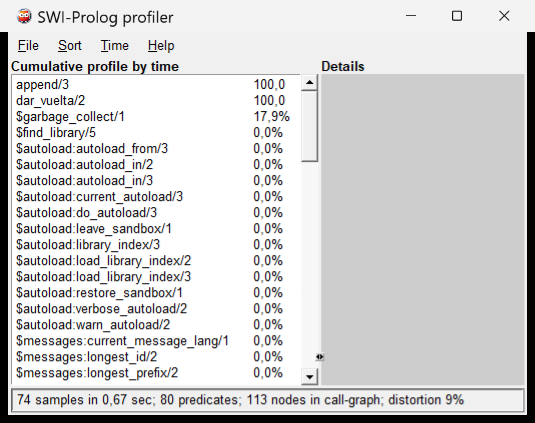

# Capítulo 16 — Rendimiento

Un programa correcto puede ser inutilizable: responde de inmediato con los siete alumnos
del ejemplo y no termina con los cinco mil de una facultad, o agota la memoria
con una lista de un millón de elementos. La parte I dejó varias señales de ese
problema —el acumulador que usa menos memoria, el `append/3` que recorre toda la
lista en cada paso, el orden de los objetivos que cambia el trabajo—, y este
capítulo las convierte en mediciones.

La regla del capítulo es la del trabajo profesional: **primero se mide, después
se cambia**. Presenta cómo se mide un programa en SWI-Prolog, qué hace que un
predicado use memoria o tiempo de más —la pila, la indexación, las alternativas
pendientes, el orden de los objetivos—, y cómo se lee un perfil de ejecución. El
proyecto mide una consulta sobre cinco mil alumnos y corrige su orden.

## Objetivos del capítulo

Al terminar el capítulo, el lector puede:

- medir un objetivo con `time/1` y `statistics/2`, y distinguir las inferencias,
  que no dependen de la máquina, del tiempo, que sí;
- explicar la optimización de la última llamada, y escribir recursiones que no
  hacen crecer la pila;
- ordenar los argumentos de un predicado para que la indexación descarte las
  cláusulas que no corresponden;
- reconocer las alternativas pendientes que cuestan memoria, y el orden de
  objetivos que cuesta tiempo;
- leer un perfil de ejecución.

!!! info "Tiempo estimado"
    Leer el capítulo, ejecutar sus ejemplos y hacer las actividades: **1:05 h**.
    Resolver los 6 ejercicios marcados con ★: **1:36 h**.
    Resolver los 15 ejercicios del final: **5:00 h**.

## 16.1 Medir

`time/1` ejecuta un objetivo y escribe cuánto trabajo hizo. Los datos de la
medición los da `numlist(1, 1000, L)`, que liga `L` con la lista de los enteros
del 1 al 1000: una entrada del tamaño que se quiere medir, en una sola llamada.

```prolog
?- numlist(1, 1000, L), time(dar_vuelta(L, _)).
```

```text
% 501,642 inferences, 0.016 CPU in 0.018 seconds (85% CPU, 32105088 Lips)
```

Una **inferencia** es, aproximadamente, una llamada a un predicado. La cantidad
de inferencias depende del programa y de los datos, no de la máquina: la misma
consulta da el mismo número en cualquier computadora con la misma versión de
SWI-Prolog. El tiempo, en cambio, depende de la máquina y de lo que esté haciendo
en ese momento, y varía de una ejecución a otra. *Lips* (*logical inferences per
second*) es el cociente entre los dos.

`statistics/2` da los valores con los que se construyen esas mediciones:
`statistics(inferences, I)` es el total de inferencias desde que arrancó
SWI-Prolog, `statistics(cputime, T)` el tiempo de procesador, y
`statistics(stack, S)` la memoria que ocupan las pilas. La diferencia entre dos
lecturas mide lo que ocurrió en el medio. Los ejemplos del capítulo la calculan
con un predicado auxiliar, que ejecuta el objetivo hasta agotar sus respuestas con
`forall/2`, presentado en el [capítulo 17](../capitulo-17-todas-las-soluciones/index.md#176-forall2):

<!-- ejemplo: capitulo-16/pila.pl predicado: inferencias/2 consulta: numlist(1, 1000, L), inferencias(dar_vuelta_acc(L, _), I). -->
```prolog
%!  inferencias(:Objetivo, -I:integer) is det.
%
%   I es la cantidad de inferencias que usa Objetivo hasta agotar todas sus
%   respuestas.
inferencias(Objetivo, I) :-
    statistics(inferences, I0),
    forall(Objetivo, true),
    statistics(inferences, I1),
    I is I1 - I0.
```

Las pruebas de este capítulo comparan inferencias y no segundos, porque un
conteo que no depende de la máquina permite escribir una prueba que no falla por
azar. Aun así, el conteo exacto cambia en unas pocas unidades según desde dónde
se llame —plunit agrega algunas—, de modo que las pruebas fijan cotas: «más de
400 000», «menos de 2 000».

## 16.2 La pila y la recursión

`largo/2` del [capítulo 7](../capitulo-07-listas/index.md) suma al **volver** de la llamada recursiva. Mientras la
recursión avanza, cada llamada debe quedar guardada, porque todavía le falta
hacer la suma; con una lista de un millón de elementos, hay un millón de
llamadas esperando. La versión con acumulador del [capítulo 8](../capitulo-08-aritmetica/index.md) hace la suma
**antes** de la llamada recursiva, que es su último objetivo:

<!-- ejemplo: capitulo-16/pila.pl predicado: largo/2 largo_acc/2 contando/3 consulta: numlist(1, 1000, L), largo_acc(L, N). -->
```prolog
%!  largo(+L:list, -N:integer) is det.
%
%   N es la cantidad de elementos de L. La suma se hace al volver de la
%   llamada recursiva: cada llamada queda en la pila hasta que termina la
%   siguiente.
largo([], 0).
largo([_|Resto], N) :-
    largo(Resto, Faltan),
    N is Faltan + 1.

%!  largo_acc(+L:list, -N:integer) is det.
%
%   La misma relación, con un acumulador.
largo_acc(L, N) :-
    contando(L, 0, N).

%!  contando(+L:list, +Hasta:integer, -N:integer) is det.
%
%   N es Hasta más la cantidad de elementos de L. La llamada recursiva es el
%   último objetivo de la cláusula: SWI-Prolog reutiliza el espacio de la
%   llamada actual.
contando([], N, N).
contando([_|Resto], Hasta, N) :-
    Ahora is Hasta + 1,
    contando(Resto, Ahora, N).
```

Cuando la llamada recursiva es el último objetivo de la cláusula y no quedan
alternativas pendientes, la llamada actual ya no tiene nada que hacer después, y
SWI-Prolog reutiliza su espacio para la siguiente. Es la **optimización de la
última llamada** (*last-call optimization*), y con ella una recursión recorre
una lista de cualquier largo en espacio constante.

La diferencia se ve limitando la memoria. `swipl --stack-limit=64m` arranca con
64 MB de pila en lugar de 1 GB; con una lista de un millón de elementos,
`largo_acc/2` responde, y `largo/2` se detiene con un error:

```prolog
?- numlist(1, 1000000, L), largo(L, N).
```

```text
ERROR: Stack limit (64.0Mb) exceeded
ERROR:   Stack sizes: local: 25.4Mb, global: 25.0Mb, trail: 0Kb
ERROR:   Stack depth: 277,922, last-call: 0%, Choice points: 4
ERROR:   Possible non-terminating recursion:
...
```

El mensaje dice la causa: `last-call: 0%`, ninguna llamada pudo reutilizar su
espacio, y `Stack depth: 277,922` llamadas esperando cuando se agotó la
memoria. Medida con `statistics(stack, S)` sobre una lista de 300 000
elementos, `largo/2` ocupa unos 53 MB, y `largo_acc/2` no ocupa nada adicional.
Es la misma causa del límite que tenía `factorial/2` en la
[solución 9 del capítulo 8](../capitulo-08-aritmetica/soluciones.md#9): la multiplicación se hacía al volver.

!!! example "Patrón 8 — Recursión en espacio constante"
    **Problema.** Una recursión que funciona con listas cortas agota la pila
    con listas largas.

    **Versión ingenua.** La operación después de la llamada recursiva:
    `largo([_|R], N) :- largo(R, N0), N is N0 + 1.`

    **Patrón.** Un acumulador que lleva el resultado parcial ([plantilla 13](../plantillas.md#13-acumulador)), la
    operación antes de la llamada, y la llamada recursiva como último objetivo,
    sin alternativas pendientes.

    **Cuándo no usarlo.** Cuando la recursión es naturalmente corta —la
    profundidad de un árbol genealógico, los casos de una definición— y la
    versión directa es más clara. Tampoco cuando el resultado es una lista que
    se construye en la cabeza de la cláusula ([plantilla 12](../plantillas.md#12-construir-una-lista-durante-el-recorrido-de-otra)): esa recursión ya
    corre en espacio constante, y un acumulador daría la lista invertida.

!!! question "Actividad"
    Arrancar `swipl --stack-limit=64m`, cargar `pila.pl` y consultar
    `numlist(1, 1000000, L), largo_acc(L, N).` y después la misma consulta con
    `largo/2`. Comparar los mensajes con los de este texto.

## 16.3 Indexación

Para elegir qué cláusulas probar, SWI-Prolog no las recorre una por una:
examina el **primer argumento** de la llamada y consulta una tabla que, para
cada valor posible, dice qué cláusulas pueden unificar. Con `edad(ana, E)`, la
tabla de `edad/2` apunta directamente a la cláusula de ana; con una lista,
distingue `[]` de `[_|_]`. Una cláusula que la tabla descarta no se prueba, y
tampoco deja una alternativa pendiente. SWI-Prolog construye también, cuando
las consultas lo piden, tablas para otros argumentos: una consulta como
`edad(P, 41)` se resuelve sin recorrer todos los hechos.

La indexación decide si un predicado deja alternativas. `ultimo/2` del
[capítulo 7](../capitulo-07-listas/index.md) no lo logra: sus dos cláusulas empiezan con una lista no vacía, la
tabla no las distingue, y al llegar al último elemento la segunda queda
pendiente:

<!-- ejemplo: capitulo-16/indexacion.pl predicado: ultimo/2 ultimo_indexado/2 ultimo_desde/3 consulta: ultimo_indexado([a, b, c], U). -->
```prolog
%!  ultimo(?L:list, ?X) is nondet.
%
%   X es el último elemento de L. Las dos cláusulas empiezan con una lista no
%   vacía: al llegar al último elemento, la segunda queda pendiente.
ultimo([X], X).
ultimo([_|Resto], X) :-
    ultimo(Resto, X).

%!  ultimo_indexado(+L:list, -X) is semidet.
%
%   X es el último elemento de L, sin dejar alternativas.
ultimo_indexado([Primero|Resto], X) :-
    ultimo_desde(Resto, Primero, X).

%!  ultimo_desde(+L:list, +Anterior, -X) is det.
%
%   X es el último de L, o Anterior si L está vacía. El primer argumento
%   distingue las dos cláusulas: [] y [_|_].
ultimo_desde([], X, X).
ultimo_desde([Siguiente|Resto], _, X) :-
    ultimo_desde(Resto, Siguiente, X).
```

```prolog
?- ultimo([a, b, c], U).
U = c ;
false.

?- ultimo_indexado([a, b, c], U).
U = c.
```

`ultimo_indexado/2` pasa el resto de la lista al primer argumento de un
auxiliar, y el elemento anterior a un argumento más. Ahora el primer argumento
es `[]` al final y `[_|_]` antes, que la tabla distingue: el auxiliar no deja
ninguna alternativa. Es el mismo arreglo que la [solución 11 del capítulo 15](../capitulo-15-control/soluciones.md#11)
aplicó a `no_aprobados/3`.

!!! example "Patrón 9 — El argumento que indexa primero"
    **Problema.** Un predicado recursivo deja alternativas pendientes porque
    sus cláusulas no se distinguen por el primer argumento.

    **Versión ingenua.** Poner primero el argumento que se lee primero —el
    legajo, el acumulador— y la lista que se recorre después.

    **Patrón.** El argumento que distingue las cláusulas —la lista que se
    recorre, el término cuya forma elige el caso— va primero. Si dos cláusulas
    solo se distinguen por el resto de la lista, un auxiliar recibe el resto y
    el elemento anterior por separado.

    **Cuándo no usarlo.** En los predicados cuyo orden de argumentos es una
    convención conocida —`member/2`, `append/3`— o cuyas cláusulas ya se
    distinguen: cambiar el orden solo complica la lectura.

## 16.4 Puntos de elección que cuestan

La alternativa que `ultimo/2` deja al final no ocupa memoria: es una sola. Una
alternativa que queda pendiente **en cada paso** de una recursión sí la ocupa,
porque impide la optimización de la última llamada: mientras quede una
alternativa, la llamada no se puede descartar. `todos_estan/2` del [capítulo 7](../capitulo-07-listas/index.md)
es un caso: `esta_en/2` encuentra el elemento y deja pendiente la búsqueda en el
resto de la lista.

<!-- ejemplo: capitulo-16/indexacion.pl predicado: todos_estan/2 todos_estan_chk/2 copias/3 consulta: todos_estan_chk([a, b], [a, b, c]). -->
```prolog
%!  todos_estan(+Buscados:list, +L:list) is nondet.
%
%   Todos los elementos de Buscados están en L. esta_en/2 deja una
%   alternativa cada vez que encuentra un elemento antes del final de L.
todos_estan([], _).
todos_estan([X|Resto], L) :-
    esta_en(X, L),
    todos_estan(Resto, L).

%!  todos_estan_chk(+Buscados:list, +L:list) is semidet.
%
%   La misma relación con memberchk/2, que se cumple a lo sumo una vez.
todos_estan_chk([], _).
todos_estan_chk([X|Resto], L) :-
    memberchk(X, L),
    todos_estan_chk(Resto, L).

%!  copias(+N:integer, +X, -L:list) is det.
%
%   L es la lista de N copias de X: los datos con que se mide todos_estan/2.
copias(N, X, L) :-
    (   N =:= 0
    ->  L = []
    ;   L = [X|Resto],
        Faltan is N - 1,
        copias(Faltan, X, Resto)
    ).
```

Los datos de la medición los arma `copias/3`: `copias(300000, a, B)` liga `B`
con 300 000 copias de `a`, y cada una se encuentra en el primer lugar de
`[a, b]` y deja pendiente el resto. Con `statistics(stack, S)` antes y después
de `todos_estan(B, [a, b])`, la pila crece unos 134 MB; con
`todos_estan_chk(B, [a, b])` no crece, y con tres millones de copias tampoco.
Con un millón y 64 MB de pila, la primera se detiene:

```prolog
?- copias(1000000, a, B), todos_estan(B, [a, b]).
```

```text
ERROR: Stack limit (64.0Mb) exceeded
ERROR:   Stack sizes: local: 26.3Mb, global: 22.9Mb, trail: 0Kb
ERROR:   Stack depth: 111,274, last-call: 0%, Choice points: 111,264
```

`Choice points: 111,264` es la causa: una alternativa pendiente por cada
elemento procesado. `memberchk/2` se cumple a lo sumo una vez y no deja
ninguna. La corrección es la del criterio C4: un predicado que promete una
respuesta no debe dejar alternativas, y la prueba sin `nondet` lo verifica.

## 16.5 El orden de los objetivos, medido

El [capítulo 3](../capitulo-03-reglas-y-conjunciones/index.md) mostró que el orden de los objetivos no cambia las respuestas de
una conjunción, y el [capítulo 5](../capitulo-05-como-responde-prolog/index.md) que sí cambia el árbol que Prolog recorre. Con
pocos datos la diferencia no se nota; con muchos, es la diferencia entre una
consulta instantánea y una que no termina a tiempo.

`generar_datos.pl` genera 5 000 alumnos, cada uno inscripto en cinco materias,
y escribe la misma consulta —«el alumno llamado Nombre aprobó Materia»— en los
dos órdenes:

<!-- ejemplo: capitulo-16/generar_datos.pl predicado: aprobada_lenta/2 aprobada_rapida/2 consulta: generar(5000), comparar(alumno_2500, bd). -->
```prolog
%!  aprobada_lenta(?Nombre:atom, ?Materia:atom) is nondet.
%
%   El alumno llamado Nombre aprobó Materia. Recorre primero las
%   inscripciones y después busca el alumno de cada una.
aprobada_lenta(Nombre, Materia) :-
    inscripcion(Legajo, Materia, nota(Nota)),
    Nota >= 6,
    alumno(Legajo, Nombre, _, _).

%!  aprobada_rapida(?Nombre:atom, ?Materia:atom) is nondet.
%
%   La misma relación, con el orden de los objetivos invertido: primero el
%   alumno, que el nombre selecciona, y después sus inscripciones.
aprobada_rapida(Nombre, Materia) :-
    alumno(Legajo, Nombre, _, _),
    inscripcion(Legajo, Materia, nota(Nota)),
    Nota >= 6.
```

```prolog
?- generar(5000), comparar(alumno_2500, bd).
```

```text
aprobada_lenta: 7,506 inferencias
aprobada_rapida: 7 inferencias
```

`aprobada_lenta/2` recorre las 5 000 inscripciones de la materia y, para cada
aprobada, busca el alumno y compara el nombre. `aprobada_rapida/2` empieza por
el objetivo que el nombre selecciona: la indexación encuentra al alumno
directamente, y quedan sus cinco inscripciones. Con 500 alumnos la versión lenta
usa unas 750 inferencias; con 5 000, unas 7 500: crece con los datos. La rápida
usa 7 en los dos casos.

La regla es empezar por el objetivo **más selectivo**: el que, con los
argumentos que llegan ligados, tiene menos respuestas. No siempre se puede
decidir leyendo el programa —depende de los datos—, y por eso se mide.

!!! example "Patrón 10 — Medir antes de cambiar"
    **Problema.** Un programa es lento, y la causa que parece evidente no es la
    que pesa.

    **Versión ingenua.** Reescribir la parte que parece costosa, y probar con
    los datos del ejemplo.

    **Patrón.** Generar datos del tamaño en que el programa se va a usar;
    medir con `time/1` o contando inferencias; cambiar una sola cosa; medir de
    nuevo. Si la mejora importa, fijarla con una prueba que acote las
    inferencias.

    **Cuándo no usarlo.** Cuando el programa ya responde a tiempo con los datos
    reales: una optimización sin medición complica el código sin beneficio
    comprobado.

!!! question "Actividad"
    Ejecutar `generar(500), comparar(alumno_250, bd).` y después
    `generar(5000), comparar(alumno_2500, bd).` Comparar con las cifras del
    texto y explicar por qué una versión crece y la otra no.

## 16.6 `append/3` en un bucle

`dar_vuelta/2` del [ejercicio 7 del capítulo 7](../capitulo-07-listas/soluciones.md#7) agrega cada elemento al final de lo ya invertido
con `append/3`, que recorre toda esa lista para llegar al final:

<!-- ejemplo: capitulo-16/pila.pl predicado: dar_vuelta/2 dar_vuelta_acc/2 dando_vuelta/3 consulta: numlist(1, 1000, L), inferencias(dar_vuelta(L, _), I). -->
```prolog
%!  dar_vuelta(+L:list, -R:list) is det.
%
%   R es L en orden inverso. Por cada elemento, append/3 recorre todo lo ya
%   invertido para agregarlo al final.
dar_vuelta([], []).
dar_vuelta([X|Resto], R) :-
    dar_vuelta(Resto, RestoAlReves),
    append(RestoAlReves, [X], R).

%!  dar_vuelta_acc(+L:list, -R:list) is det.
%
%   La misma relación, con un acumulador: cada elemento se agrega al
%   comienzo, en un paso.
dar_vuelta_acc(L, R) :-
    dando_vuelta(L, [], R).

%!  dando_vuelta(+L:list, +Hasta:list, -R:list) is det.
%
%   R es L invertida seguida de Hasta.
dando_vuelta([], R, R).
dando_vuelta([X|Resto], Hasta, R) :-
    dando_vuelta(Resto, [X|Hasta], R).
```

Con mil elementos, `dar_vuelta/2` usa unas 500 000 inferencias y
`dar_vuelta_acc/2` unas 1 000. El primer `append/3` recorre una lista de un
elemento, el segundo de dos, y así hasta mil: en total, la mitad de mil por mil.
Con el doble de elementos, el trabajo se multiplica por cuatro; con el
acumulador, por dos.

Agregar al **comienzo** de una lista es un solo paso; agregar al final, recorrerla
entera. Cuando un recorrido construye una lista en orden, el acumulador la
construye al revés y un `reverse/2` final la da vuelta, en un solo recorrido
adicional. El [capítulo 34](../capitulo-34-estructuras-incompletas-y-listas-diferencia/index.md) presenta las listas diferencia, que agregan al final en un
paso.

## 16.7 El corte y el rendimiento

El [capítulo 9](../capitulo-09-backtracking-y-corte/index.md) presentó el corte por su efecto en las respuestas. Su efecto en el
rendimiento es el de esta sección: descarta alternativas que no van a aportar
nada, y con eso ahorra el trabajo de probarlas y la memoria de guardarlas. Un
corte verde después de un caso que ya se decidió, o un `once/1` en el borde
([Patrón 6](../patrones.md#6-una-respuesta-en-el-borde)), convierten una recursión que deja alternativas en cada paso en una
que corre en espacio constante: `memberchk/2` equivale a `member/2` seguido
de un corte.

El corte no ahorra nada cuando no hay alternativas: `ultimo_indexado/2` no lo
necesita, porque la indexación ya descarta la otra cláusula. Antes de agregar
un corte por rendimiento conviene comprobar, con una prueba sin `nondet`, que
efectivamente había una alternativa pendiente.

## 16.8 El profiler

`time/1` dice cuánto costó un objetivo; el **profiler** dice dónde. `profile/1`
ejecuta un objetivo tomando muestras periódicas de qué predicado se está
ejecutando, y al terminar informa qué parte del tiempo correspondió a cada uno.
En una terminal, el informe es una tabla:

```prolog
?- numlist(1, 2000, L), profile(dar_vuelta(L, _)).
```

```text
=====================================================================
Total time: 0.078 seconds
=====================================================================
Predicate                       Box Entries =    Calls+Redos     Time
=====================================================================
append/3                              2,000 =    2,000+0        75.0%
$garbage_collect/1                      110 =      110+0        25.0%
...
```

`append/3` se llamó 2 000 veces —una por elemento— y consumió el 75 % del
tiempo; el resto fue la recolección de memoria que esas listas intermedias
provocan. Las filas que empiezan con `$` son predicados internos de SWI-Prolog,
como la carga automática de bibliotecas.

!!! question "Actividad"
    Ejecutar `numlist(1, 2000, L), profile(dar_vuelta(L, _)).` y comparar la
    tabla con la del texto: ¿qué filas cambian de una ejecución a otra, y cuál
    no?

En `swipl-win`, la versión con ventanas de Windows, o en Linux con la
interfaz gráfica instalada, `profile/1` abre una ventana con el mismo informe.
La lista de la izquierda está ordenada por tiempo acumulado; al elegir un
predicado, el panel de la derecha muestra quién lo llamó y a quién llamó:



*Captura: SWI-Prolog 9.2.9, `swipl-win` en Windows, 2026-09-24.*

El profiler requiere una instalación local; SWISH no lo ofrece.

## 16.9 `library(apply_macros)`

Los predicados de orden superior del [capítulo 18](../capitulo-18-orden-superior/index.md) —`maplist/3` y los demás— reciben
un predicado como argumento y lo llaman para cada elemento.
`library(apply_macros)` los reescribe en tiempo de carga como recursiones
comunes. Con un predicado con nombre la cantidad de inferencias no cambia:
unas 300 000 con y sin la expansión para `maplist(doble, L, D)` sobre 100 000
elementos. Lo que la expansión ahorra es la copia de una lambda en cada
llamada: de unas 1 300 000 a unas 300 000 inferencias con
`[X, Y]>>(Y is 2 * X)`. La [sección 18.7](../capitulo-18-orden-superior/index.md#187-cuando-no-usar-el-orden-superior) mide los dos casos. La reescritura
ocurre solo cuando la bandera `optimise_apply` vale `true` o cuando `swipl` se
ejecuta con la opción `-O`:

```prolog
:- set_prolog_flag(optimise_apply, true).
:- use_module(library(apply_macros)).
```

Con la bandera en su valor por omisión y sin `-O`, cargar la biblioteca no
cambia nada. Conviene recién cuando una medición muestra que ese costo pesa; el
[capítulo 18](../capitulo-18-orden-superior/index.md) vuelve sobre esta biblioteca, y la [sección 35.5](../capitulo-35-transformacion-de-programas-y-compilacion/index.md#355-macros-de-la-biblioteca) muestra
cómo se expande.

## 16.10 El proyecto: una consulta por nombre

La versión de *Inscripciones* de este capítulo agrega `aprobada_por_nombre/2`,
con el orden de objetivos que la [sección 16.5](#165-el-orden-de-los-objetivos-medido) midió:

<!-- ejemplo: capitulo-16/inscripciones.pl predicado: aprobada_por_nombre/2 consulta: aprobada_por_nombre(ana, Materia). -->
```prolog
%!  aprobada_por_nombre(?Nombre:atom, ?Materia:atom) is nondet.
%
%   El alumno llamado Nombre aprobó Materia. El primer objetivo es el que el
%   nombre selecciona: con el orden inverso, la consulta recorre todas las
%   inscripciones de la materia antes de examinar el nombre (sección 16.5).
aprobada_por_nombre(Nombre, Materia) :-
    alumno(Legajo, Nombre, _, _),
    aprobada(Legajo, Materia, _Nota).
```

```prolog
?- aprobada_por_nombre(ana, Materia).
Materia = am1 ;
Materia = alg ;
Materia = log ;
Materia = am2 ;
false.
```

Con los siete alumnos del proyecto, los dos órdenes responden igual de rápido;
la diferencia aparece con el tamaño de una facultad, y por eso se midió sobre
los datos generados. El comentario del predicado registra por qué el orden es
ese: sin él, una edición posterior podría invertirlo sin saber lo que cuesta.

!!! success "Criterios de calidad"
    | Criterio | En este capítulo |
    |---|---|
    | C4 | medido además de verificado: `todos_estan/2` deja 111 264 alternativas y agota 64 MB; `todos_estan_chk/2` y `ultimo_indexado/2` no dejan ninguna, y sus pruebas no declaran `nondet` |
    | C7 | las pruebas de `pila.plt` y `generar_datos.plt` fijan cotas de inferencias: una regresión de rendimiento hace fallar una prueba |

## Ejercicios

Las soluciones están en [la página de soluciones](soluciones.md). La dificultad
va de 1 (se resuelve consultando el capítulo) a 3 (requiere elaboración propia).
Los marcados con ★ son los que no conviene saltear: cubren lo que el capítulo
tiene de propio, y los capítulos siguientes los dan por hechos.

1. ★ **(1)** En la línea `% 501,642 inferences, 0.016 CPU in 0.018 seconds
   (85% CPU, 32105088 Lips)`, ¿qué valores se repetirían en otra computadora, y
   cuáles no? ¿Por qué las pruebas comparan inferencias?
2. **(1)** ¿Cuáles de estas recursiones corren en espacio constante? `largo/2`
   y `largo_acc/2` de este capítulo · `suma_lista/2` y `suma_con_acumulador/2`
   del [capítulo 8](../capitulo-08-aritmetica/index.md) · `pegar/3` del [capítulo 7](../capitulo-07-listas/index.md). Justificar con la regla de la
   [sección 16.2](#162-la-pila-y-la-recursion).
3. ★ **(2)** Escribir `suma_lista_acc/2` y comparar su comportamiento con
   `suma_lista/2` del [capítulo 8](../capitulo-08-aritmetica/index.md) sobre una lista de un millón de números, con
   `swipl --stack-limit=64m`.
4. **(2)** El siguiente predicado deja una alternativa al terminar. Explicar por
   qué con la indexación, y corregirlo con el [Patrón 9](../patrones.md#9-el-argumento-que-indexa-primero):

    ```prolog
    %!  contar(+Hasta, +L, -N) is det.
    contar(Hasta, [], Hasta).
    contar(Hasta, [_|Resto], N) :-
        Ahora is Hasta + 1,
        contar(Ahora, Resto, N).
    ```

5. ★ **(2)** Corregir `todos_estan/2` con un corte, sin usar `memberchk/2`, y
   comprobar con `statistics(stack, S)` y la lista de `copias(300000, a, B)`
   que ya no ocupa memoria. ¿Es un corte verde o rojo?
6. **(2)** Generar 50 000 alumnos y predecir, antes de medir, cuántas
   inferencias usa cada versión de `comparar/2`. Medir y comparar.
7. ★ **(2)** Escribir `aplanar(Listas, L)`, la concatenación de las listas de
   `Listas`, de dos maneras: acumulando por la izquierda, con
   `append(Acumulado, X, Nuevo)` en cada paso, y pegando cada lista delante del
   resto ya aplanado, con `append(X, RestoAplanado, L)`. Medir las dos con mil
   listas de diez elementos y explicar la diferencia.
8. **(3)** `ultimo/2` deja una alternativa, pero no ocupa memoria; `todos_estan/2`
   deja alternativas y sí la ocupa. Explicar la diferencia con la optimización de
   la última llamada.
9. **(2)** Ejecutar `profile/1` sobre `dar_vuelta/2` con 3 000 elementos y sobre
   `dar_vuelta_acc/2` con un millón. ¿Qué predicado domina cada perfil?
10. ★ **(2)** Predecir cuántas inferencias usa `dar_vuelta/2` con 2 000
    elementos a partir de la medición con 1 000, y verificarlo.
11. **(1)** ¿Por qué `edad(P, 41)` no recorre todos los hechos de `edad/2`,
    aunque el primer argumento esté libre?
12. **(3)** Escribir una prueba que falle si una edición futura invierte el
    orden de los objetivos de `aprobada_por_nombre/2`. La prueba debe usar datos
    generados y una cota de inferencias.
13. ★ **(2)** En `inscripcion_posible/3` del [capítulo 15](../capitulo-15-control/index.md), la condición de las
    vacantes es la más barata y la de los requisitos la más costosa. ¿Conviene
    evaluar las vacantes primero? Considerar el costo y también qué resultado
    informa el predicado.
14. **(3)** Revisar `requisitos_faltantes/3` de la [solución 11 del capítulo 15](../capitulo-15-control/soluciones.md#11)
    con las herramientas de este capítulo: ¿deja alternativas pendientes? ¿Crece
    la pila con la cantidad de requisitos?
15. **(3)** Un árbol binario se representa con la constante `hoja` y con
    términos `nodo(Izq, Der)`. Escribir `hojas(A, N)`, que cuenta las hojas de
    `A` con una llamada recursiva por subárbol y la suma después, y
    `hojas_acc(A, N)`, que pasa un acumulador por los dos subárboles: la cuenta
    que sale del izquierdo entra en el derecho. Con `swipl --stack-limit=64m` y
    un árbol de un millón de nodos inclinado a la derecha
    —`nodo(hoja, nodo(hoja, …))`—, determinar cuál de las dos versiones
    responde. Explicar por qué `hojas_acc/2` agota la pila con el árbol
    inclinado a la izquierda.

## Resumen

| | |
|---|---|
| `time/1` | inferencias, tiempo y *Lips* de un objetivo |
| `numlist/3` | la lista de los enteros entre dos valores: datos del tamaño que se quiere medir |
| `statistics/2` | `inferences`, `cputime`, `stack`: la diferencia entre dos lecturas mide un objetivo |
| inferencia | aproximadamente una llamada; no depende de la máquina |
| optimización de la última llamada | la última llamada reutiliza el espacio de la actual, si no quedan alternativas |
| `--stack-limit` | el límite de memoria de las pilas; `64m` hace visibles los excesos |
| indexación | la tabla del primer argumento (y de otros, a pedido) que descarta cláusulas |
| alternativa por paso | impide la optimización de la última llamada y hace crecer la pila |
| objetivo más selectivo primero | el orden de los objetivos, medido |
| `append/3` en un bucle | trabajo que crece con el cuadrado del largo |
| `profile/1` | en qué predicados se gasta el tiempo |
| **Patrones 8, 9, 10** | recursión en espacio constante; el argumento que indexa primero; medir antes de cambiar |

## Temas que se retoman

| Tema | Se retoma en |
|---|---|
| `forall/2`, usado en `inferencias/2` | [capítulo 17](../capitulo-17-todas-las-soluciones/index.md) |
| `maplist/3` y `library(apply_macros)` | [capítulo 18](../capitulo-18-orden-superior/index.md) |
| `assertz/1`, con el que se generaron los datos | [capítulo 20](../capitulo-20-base-de-datos-dinamica/index.md) |
| Pruebas de rendimiento en la batería del proyecto | [capítulo 26](../capitulo-26-pruebas-y-depuracion/index.md) |
| Listas diferencia: agregar al final en un paso | [capítulo 34](../capitulo-34-estructuras-incompletas-y-listas-diferencia/index.md) |
| Tabulación: recordar resultados en lugar de recalcularlos | [capítulo 39](../capitulo-39-tabulacion/index.md) |
