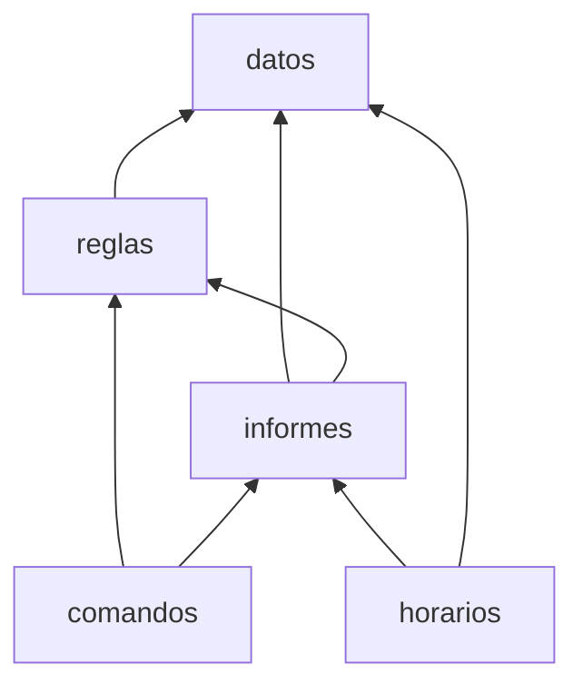

# Capítulo 24 — Módulos y organización

El programa del proyecto creció capítulo a capítulo: datos, reglas, informes,
un lenguaje de comandos, un calendario de exámenes. Todo está en un archivo de
casi quinientas líneas, y todos sus predicados se ven entre sí. Un cambio en
un informe puede romper una regla que usaba el mismo nombre auxiliar; una
prueba no puede cargar solo la parte que prueba; no queda registrado qué
predicados están pensados para usarse desde afuera y cuáles son detalles
internos.

Los **módulos** resuelven esos tres problemas. Un módulo es un archivo con un
nombre y una lista de los predicados que **exporta**, su interfaz; el resto es
privado. Este capítulo presenta la declaración de módulos, la importación, la
calificación de las llamadas, la relación entre módulos y meta-predicados, la
forma de dividir un programa, y la biblioteca de SWI-Prolog, que está
organizada en módulos. El proyecto se divide en cinco.

## Objetivos del capítulo

Al terminar el capítulo, el lector puede:

- escribir un módulo con su interfaz, importarlo entero o en parte, y
  reexportarlo;
- calificar una llamada con el nombre del módulo, y explicar la autocarga;
- declarar los meta-predicados de un módulo, y explicar qué ocurre si no se
  declaran;
- dividir un programa en módulos con dependencias claras, y probar cada uno
  por separado, también desde la línea de comandos;
- elegir entre `use_module/1`, `consult/1` y `ensure_loaded/1`, y examinar los
  módulos cargados;
- usar la biblioteca y los packs.

!!! info "Tiempo estimado"
    Leer el capítulo, ejecutar sus ejemplos y hacer las actividades: **1:10 h**.
    Resolver los 6 ejercicios marcados con ★: **1:53 h**.
    Resolver los 17 ejercicios del final: **4:25 h**.

## 24.1 Por qué módulos

Hasta aquí, cada programa del curso cargó todos sus predicados en un mismo
espacio de nombres, el módulo `user`. Eso tiene tres consecuencias, que el
curso ya encontró:

- dos archivos que definen un predicado con el mismo nombre se superponen: el que
  se carga después reemplaza al otro, o SWI-Prolog advierte que las cláusulas
  no están juntas;
- un predicado auxiliar, como `contar_y_sumar/3` de los informes, queda al
  alcance de cualquier otra parte del programa, que puede empezar a depender
  de él;
- las pruebas de plunit corren en su propio módulo, y por eso el
  [capítulo 20](../capitulo-20-base-de-datos-dinamica/index.md) tuvo que calificar `assertz(user:padre(z, w))`.

Al consultar un segundo archivo que define `p/1`:

```text
Warning: …/a2.pl:1:
Warning:    Redefined static procedure p/1
Warning:    Previously defined at …/a1.pl:1
```

Un módulo separa lo que ofrece de cómo lo hace. Es la misma idea de los
encabezados del [capítulo 14](../capitulo-14-estilo-y-documentacion/index.md), aplicada a un conjunto de predicados: la
interfaz se declara, y lo que no se declara se puede cambiar sin avisar.

## 24.2 `:- module/2` y `:- use_module/1,2`

Un módulo empieza con la directiva `module(Nombre, Exporta)`, antes que
cualquier otra cláusula; en los archivos del curso solo la precede la
directiva `encoding/1`. `Exporta` es la lista de los predicados de su
interfaz, con su aridad; los no terminales de una gramática se escriben con
`//`, y admite también operadores, como muestra la
[sección 24.7](#247-cargar-y-examinar-modulos).

<!-- ejemplo: capitulo-24/inscripciones/datos.pl fragmento: :- module(datos .. ]). consulta: alumno(101, Nombre, Carrera, Ingreso). -->
```prolog
:- module(datos,
          [ alumno/4,
            materia/3,
            correlativa/2,
            inscripcion/3,
            nota_minima/1,
            vacantes/2,
            operaciones/1,
            agregar_inscripcion/3,
            quitar_inscripcion/3,
            cambiar_vacantes/2,
            contar_operacion/0,
            estado/1,
            restaurar/1,
            comprobar_datos/0
          ]).
```

Otro archivo usa el módulo con `:- use_module(datos).`: carga el archivo, si no
estaba cargado, e **importa** todos los predicados exportados, que se llaman
como si estuvieran definidos allí. El nombre es el del archivo, sin la
extensión, relativo al archivo que lo carga. `use_module/2` importa solo una
parte: `:- use_module(library(lists), [append/3, last/2]).` importa esos dos.
También admite `except(Lista)`, para importar todo menos algunos, y
`append/3 as pegar`, para importar con otro nombre:

<!-- contexto: capitulo-24/soluciones/renombrar.pl -->
```text
?- use_module(library(lists), [append/3 as pegar]).
true.

?- pegar([a], [b], L).
L = [a, b].
```

<!-- ejemplo: capitulo-24/inscripciones/reglas.pl fragmento: :- module(reglas .. requisitos_guardados/2. consulta: inscripcion_posible(102, am2, Resultado). -->
```prolog
:- module(reglas,
          [ aprobada/3,
            cursa/2,
            inscripcion_posible/3,
            puede_inscribirse/2,
            aprobada_por_nombre/2,
            inscribir/3,
            dar_de_baja/2,
            requisitos_de/2
          ]).

:- use_module(datos).

:- dynamic requisitos_guardados/2.
```

`reglas` importa `datos` y declara un predicado dinámico propio,
`requisitos_guardados/2`, la tabla de memorización del
[capítulo 20](../capitulo-20-base-de-datos-dinamica/index.md). No lo exporta: es un detalle de cómo `requisitos_de/2`
calcula, y ningún otro módulo lo ve.

!!! example "Patrón 28 — Interfaz del módulo"
    **Problema.** Un conjunto de predicados es usado por otras partes del
    programa, y cambiar cualquiera de ellos puede romperlas.

    **Versión ingenua.** Todo en el módulo `user`, o un módulo que exporta
    todos sus predicados: nada distingue lo que se ofrece de lo que es
    interno.

    **Patrón.** Un módulo por responsabilidad, que exporta solo los predicados
    que otros usan, cada uno con su encabezado; los auxiliares quedan
    privados. Los meta-predicados de la interfaz se declaran con
    `meta_predicate`.

    **Cuándo no usarlo.** En un programa de un solo archivo que nadie más
    carga, como los ejemplos de los capítulos anteriores: la organización en
    módulos cuesta más de lo que ordena.

## 24.3 `Modulo:Objetivo` y la autocarga

Un predicado privado no se puede llamar sin más desde afuera del módulo, pero
sí **calificado** con el nombre del módulo: `reglas:requisitos_guardados(M, R)`.
La calificación dice en qué módulo ejecutar el objetivo. Se usa en las pruebas,
para verificar un detalle interno, y en las pocas ocasiones en que un programa
necesita un predicado de un módulo que no importa.

```prolog
?- requisitos_de(am2, _), reglas:requisitos_guardados(am2, R).
R = [alg, am1].
```

Los predicados de la biblioteca de SWI-Prolog se usaron durante todo el curso
sin ningún `use_module`: la **autocarga** carga el módulo de la biblioteca la
primera vez que se llama un predicado desconocido que alguno de ellos exporta.
Es útil en el toplevel, y conviene no depender de ella en un programa: un
`use_module` explícito documenta qué usa el módulo y avisa al cargar si algo
falta.

!!! question "Actividad"
    Con `inscripciones.pl` cargado, consultar `contar_y_sumar(8, 0-0, T).`, un
    predicado privado de `informes`. ¿Qué propone el toplevel? Después,
    consultar `informes:contar_y_sumar(8, 0-0, T).`

## 24.4 `:- meta_predicate` y los módulos

El [capítulo 18](../capitulo-18-orden-superior/index.md) presentó la directiva `meta_predicate`, y adelantó que su
efecto aparece con los módulos. El módulo `meta` exporta dos versiones de
`cada_uno/2`: una sin la declaración, y otra con ella.

<!-- ejemplo: capitulo-24/meta.pl fragmento: :- module(meta .. cada_uno_meta(1, ?). consulta: cada_uno_meta(integer, [1, 2]). -->
```prolog
:- module(meta, [cada_uno_sin_declarar/2, cada_uno_meta/2]).

:- meta_predicate
    cada_uno_meta(1, ?).
```

<!-- ejemplo: capitulo-24/meta.pl predicado: cada_uno_sin_declarar/2 cada_uno_meta/2 consulta: cada_uno_meta(integer, [1, 2]). -->
```prolog
%!  cada_uno_sin_declarar(+Condicion, +L:list) is semidet.
%
%   Todos los elementos de L cumplen Condicion, que se llama en el módulo
%   meta: solo encuentra predicados de ese módulo y los predefinidos.
cada_uno_sin_declarar(Condicion, L) :-
    maplist(Condicion, L).

%!  cada_uno_meta(:Condicion, +L:list) is semidet.
%
%   Todos los elementos de L cumplen Condicion, que se llama en el módulo
%   desde el que se llamó a cada_uno_meta/2.
cada_uno_meta(Condicion, L) :-
    maplist(Condicion, L).
```

`usa_meta` es otro módulo, con un predicado privado, `mayor_de_edad/1`, que pasa
a las dos versiones:

<!-- ejemplo: capitulo-24/usa_meta.pl predicado: todos_mayores/1 todos_mayores_sin_declarar/1 consulta: todos_mayores([juan, ana]). -->
```prolog
%!  todos_mayores(+Personas:list) is semidet.
%
%   Todas las Personas son mayores de edad.
todos_mayores(Personas) :-
    cada_uno_meta(mayor_de_edad, Personas).

%!  todos_mayores_sin_declarar(+Personas:list) is semidet.
%
%   Lo mismo, con cada_uno_sin_declarar/2: produce un error de existencia,
%   porque mayor_de_edad/1 se busca en el módulo meta.
todos_mayores_sin_declarar(Personas) :-
    cada_uno_sin_declarar(mayor_de_edad, Personas).
```

```prolog
?- todos_mayores([juan, ana]).
true.
```

`todos_mayores_sin_declarar([juan])`, en cambio, termina con un error:

```text
ERROR: Unknown procedure: meta:mayor_de_edad/1
```

Sin la declaración, `cada_uno_sin_declarar/2` llama a `mayor_de_edad` en su
propio módulo, `meta`, donde no existe. Con la declaración, el argumento llega
**calificado** con el módulo que hizo la llamada —`usa_meta:mayor_de_edad`— y
se encuentra.

Una sutileza explica por qué el problema no apareció antes: todo módulo
**hereda** los predicados del módulo `user`. Si `mayor_de_edad/1` estuviera
definido en `user`, la versión sin declarar lo encontraría igual. El error
aparece solo cuando el predicado que se pasa es privado de otro módulo, que es
justamente lo que ocurre en un programa organizado en módulos.

## 24.5 Dividir un programa

Un programa se divide en módulos siguiendo sus responsabilidades, y cada
módulo importa los que necesita. Las dependencias forman un grafo sin ciclos:
un módulo de más abajo no depende de los de más arriba.



Un archivo principal carga todos los módulos, y es lo que carga quien usa el
programa. `:- initialization(Objetivo)` ejecuta un objetivo cuando termina de
cargarse el archivo; el proyecto lo usa para verificar los datos:

<!-- ejemplo: capitulo-24/inscripciones/inscripciones.pl fragmento: :- use_module(datos) .. initialization(comprobar_datos). consulta: ejecutar("inscribir a 104 en sintaxis", Respuesta). -->
```prolog
:- use_module(datos).
:- use_module(reglas).
:- use_module(informes).
:- use_module(comandos).
:- use_module(horarios).

:- initialization(comprobar_datos).
```

Cada módulo tiene su propio archivo de pruebas, que se carga junto con él: las
pruebas de `reglas` no necesitan cargar el lenguaje de comandos. Un archivo de
pruebas ve los predicados exportados por el módulo que prueba; si necesita los
de otro módulo, lo importa, como `reglas.plt`, que importa `datos` para usar
`estado/1` y `restaurar/1`, e `informes` para `inscriptos/2`:

```prolog
% Las pruebas cargan los módulos que usan además del que prueban.
:- use_module(datos).
:- use_module(informes).
```

La importación no es transitiva: `informes` importa `reglas`, y no recibe por
eso lo que `reglas` importa de `datos`; para usar `alumno/4` importa `datos`
también, como muestra la tabla de la
[sección 24.9](#249-el-proyecto-cinco-modulos). Un módulo que ofrece la
interfaz de otro, además de la propia, lo declara con `:- reexport(Archivo).`
o `:- reexport(Archivo, Lista).`: importa y vuelve a exportar; un módulo que
solo reexporta hace de fachada, y los ejercicios 8 y 13 escriben dos.

!!! question "Actividad"
    Quitar `:- use_module(datos).` de `reglas.plt` y ejecutar sus pruebas con
    `consult(['reglas.pl', 'reglas.plt']), run_tests.` ¿Qué pruebas fallan, y
    con qué error? Volver a agregar la línea.

## 24.6 La biblioteca y los packs

La biblioteca de SWI-Prolog es un conjunto de módulos: `library(lists)` es el
archivo `lists.pl` del directorio de la biblioteca, que exporta `append/3` y
los demás. `library(Nombre)` es un **alias**: un nombre que se resuelve en un
directorio, definido con `file_search_path/2`:

```text
?- file_search_path(library, D).
D = app_config(lib) ;
D = swi(library) ;
D = swi(library/clp) ;
…
```

Las respuestas siguientes dependen de la instalación. Un programa puede
definir sus propios alias; el ejercicio 10 define uno para el directorio del
proyecto.

Los **packs** son bibliotecas que no vienen con SWI-Prolog y se instalan
aparte. El [capítulo 15](../capitulo-15-control/index.md) instaló `reif` con `pack_install(reif)`, y el
[capítulo 13](../capitulo-13-el-entorno-de-trabajo/index.md), `lsp_server`. `pack_list/1` busca packs por nombre,
`pack_info/1` describe uno instalado, y `pack_remove/1` lo quita. Un pack se
usa como cualquier módulo de la biblioteca: `:- use_module(library(reif)).`.
Antes de instalar uno, conviene verificar su licencia y su versión, como el
[capítulo 13](../capitulo-13-el-entorno-de-trabajo/index.md) hizo con `lsp_server`.

## 24.7 Cargar y examinar módulos

Los ejemplos de esta sección están en `ejemplos/capitulo-24/carga/`, y usan
los módulos del proyecto.

**`use_module/1`, `consult/1` y `ensure_loaded/1`.** Los tres cargan un
archivo, y difieren en dos cosas: si lo cargan de nuevo cuando ya está
cargado, y si exigen que sea un módulo. `consult/1`, del
[capítulo 13](../capitulo-13-el-entorno-de-trabajo/index.md), lo carga cada
vez que se lo llama, que es lo que se necesita al editar y probar.
`ensure_loaded/1` lo carga solo si no estaba cargado: un archivo que varios
otros necesitan se carga una sola vez. `use_module/1` hace lo mismo que
`ensure_loaded/1`, y además exige que el archivo empiece con la declaración de
un módulo. `aviso.pl` es un archivo sin módulo que escribe una línea cada vez
que termina de cargarse:

<!-- ejemplo: capitulo-24/carga/aviso.pl fragmento: :- initialization .. aviso(hola). consulta: aviso(Texto). -->
```prolog
:- initialization(format("aviso.pl cargado~n")).

% aviso(T): T es el texto del aviso.
aviso(hola).
```

```text
?- consult(aviso).
aviso.pl cargado
true.

?- consult(aviso).
aviso.pl cargado
true.

?- ensure_loaded(aviso).
true.
```

En una sesión nueva, `use_module(aviso)` no lo carga:

```text
?- use_module(aviso).
ERROR: …/carga/aviso.pl:15:
ERROR:    Domain error: `module_header' expected, found `:-initialization format("aviso.pl cargado~n")'
```

Con un módulo, `consult/1` también importa lo que el módulo exporta; la
diferencia con `use_module/1` sigue siendo que lo carga de nuevo. La regla del
curso: `use_module/1` en los programas, para los módulos; `ensure_loaded/1`
para un archivo sin módulo que se carga desde varios lugares; `consult/1` en el
toplevel.

**Rutas relativas.** Un nombre de archivo relativo en una directiva, como
`'../inscripciones/reglas'`, se resuelve desde el directorio del archivo que
contiene la directiva, no desde el directorio de trabajo. Por eso los módulos
de `carga/` y de `soluciones/` cargan el proyecto con `'../inscripciones/…'`,
y se pueden cargar desde cualquier directorio. Un nombre relativo que se usa
durante la ejecución —en una consulta del toplevel, o en el cuerpo de una
regla— se busca, en cambio, desde el directorio de trabajo; por eso
`aviso.plt` guarda la ruta completa de `aviso.pl` mientras se carga, con
`prolog_load_context/2`, como la solución 10.

**Operadores en la interfaz.** La lista de exportación admite también
operadores. `relaciones` exporta `op(700, xfx, aprobo)`, la declaración del
[capítulo 19](../capitulo-19-operadores-y-reglas-como-datos/index.md), junto
con el predicado que se escribe con ella:

<!-- ejemplo: capitulo-24/carga/relaciones.pl fragmento: :- module(relaciones .. aprobada(Legajo, Materia, _). consulta: 101 aprobo Materia. -->
```prolog
:- module(relaciones,
          [ op(700, xfx, aprobo),
            aprobo/2
          ]).

:- use_module('../inscripciones/reglas', [aprobada/3]).

%!  aprobo(?Legajo:integer, ?Materia:atom) is nondet.
%
%   El alumno Legajo aprobó Materia.
Legajo aprobo Materia :-
    aprobada(Legajo, Materia, _).
```

El operador queda declarado al leer la directiva `module/2`, y la cláusula de
`aprobo/2` ya lo usa en su cabeza. Un módulo que importa `relaciones` recibe
el operador junto con los predicados, y puede escribir `Legajo aprobo
Materia` en sus cláusulas:

<!-- ejemplo: capitulo-24/carga/usa_relaciones.pl predicado: aprobadas_de/2 consulta: aprobadas_de(101, Materias). -->
```prolog
%!  aprobadas_de(+Legajo:integer, -Materias:list(atom)) is det.
%
%   Materias son las materias que aprobó el alumno Legajo, en el orden de
%   los datos.
aprobadas_de(Legajo, Materias) :-
    findall(Materia, Legajo aprobo Materia, Materias).
```

```prolog
?- aprobadas_de(101, Materias).
Materias = [am1, alg, log, am2].
```

Los operadores, como los predicados, son propios de cada módulo: un módulo
que no importa `relaciones` lee `101 aprobo am1` como un error de sintaxis.

!!! question "Actividad"
    En una sesión nueva, en el directorio `carga/`, cargar `usa_relaciones.pl`
    con `use_module/1` y consultar `aprobadas_de(101, M).` y
    `101 aprobo M.` Después, cargar `relaciones.pl` con `use_module/1` y
    repetir la segunda consulta. ¿Por qué responde ahora?

**Examinar los módulos.** `module_property(Modulo, Propiedad)` informa lo que
el sistema registra de un módulo cargado: `file(F)`, su archivo;
`exports(L)`, los indicadores que exporta; `exported_operators(L)`, los
operadores; `class(C)`, `user` para un módulo del programa y `library` para
uno de la biblioteca. Con un predicado, `predicate_property/2`, que el
[capítulo 33](../capitulo-33-introspeccion-y-metainterpretes/index.md)
presenta con las demás propiedades, tiene la propiedad `imported_from(M)`
cuando el predicado llega importado del módulo `M`. `examinar.pl` carga
`usa_relaciones` y define dos consultas sobre los módulos:

<!-- ejemplo: capitulo-24/carga/examinar.pl predicado: interfaz/2 importados/3 consulta: interfaz(relaciones, Predicados). -->
```prolog
%!  interfaz(+Modulo:atom, -Predicados:list) is det.
%
%   Predicados son los indicadores Nombre/Aridad que exporta Modulo,
%   ordenados.
interfaz(Modulo, Predicados) :-
    module_property(Modulo, exports(Exporta)),
    msort(Exporta, Predicados).

%!  importados(+Modulo:atom, +Origen:atom, -Predicados:list) is det.
%
%   Predicados son los indicadores Nombre/Aridad que Modulo importa de
%   Origen, ordenados.
importados(Modulo, Origen, Predicados) :-
    findall(Nombre/Aridad,
            ( predicate_property(Modulo:Cabeza, imported_from(Origen)),
              functor(Cabeza, Nombre, Aridad) ),
            Encontrados),
    msort(Encontrados, Predicados).
```

```prolog
?- interfaz(relaciones, Predicados).
Predicados = [aprobo/2].

?- module_property(relaciones, exported_operators(Ops)).
Ops = [op(700, xfx, aprobo)].

?- module_property(relaciones, class(C)).
C = user.

?- predicate_property(usa_relaciones:aprobo(_, _), imported_from(M)).
M = relaciones.

?- importados(relaciones, reglas, Predicados).
Predicados = [aprobada/3].
```

En `importados/3`, `functor(Cabeza, Nombre, Aridad)`, que el
[capítulo 32](../capitulo-32-inspeccion-de-terminos/index.md) presenta, da el
nombre y la aridad de la cabeza que `predicate_property/2` encontró.
`relaciones` importa de `reglas` solo `aprobada/3`, porque la directiva
`use_module/2` lo pide así. El ejercicio 16 reconstruye con estas consultas la
tabla de dependencias de la
[sección 24.9](#249-el-proyecto-cinco-modulos).

**La bandera `double_quotes`.** El
[capítulo 11](../capitulo-11-texto/index.md) presentó la bandera que decide
qué son las comillas dobles. Su valor es propio de cada módulo:
`set_prolog_flag(double_quotes, codes)` en un módulo cambia la lectura de las
cláusulas de ese módulo y de ningún otro.

<!-- ejemplo: capitulo-24/carga/codigos.pl fragmento: :- module(codigos .. texto("ab"). consulta: texto(T). -->
```prolog
:- module(codigos, [vocal/1, texto/1]).

:- set_prolog_flag(double_quotes, codes).

%!  vocal(+Codigo:integer) is semidet.
%
%   Codigo es el código de una vocal minúscula sin acento.
vocal(Codigo) :-
    memberchk(Codigo, "aeiou").

% texto(T): T es lo que este módulo lee de "ab".
texto("ab").
```

```prolog
?- texto(T).
T = [97, 98].

?- vocal(0'e).
true.

?- X = "ab".
X = "ab".
```

En `codigos`, `"ab"` es la lista de sus códigos; en el toplevel, que lee en
el módulo `user`, sigue siendo una cadena. Un programa escrito para otro
sistema Prolog, que espera listas de códigos, puede ponerse en un módulo con
esa directiva sin cambiar la lectura del resto. Un archivo sin módulo se carga
en `user`, y el cambio alcanza entonces a todo lo que se lea en `user`
después: el ejercicio 17 lo muestra.

**Las pruebas desde la línea de comandos.** El
[capítulo 13](../capitulo-13-el-entorno-de-trabajo/index.md#137-el-proyecto-inscripciones)
ejecutó las pruebas con `swipl -g … -t halt`: `-g Objetivo` ejecuta un
objetivo después de cargar, y puede repetirse; `-t halt` termina en lugar de
abrir el toplevel. Para el proyecto en módulos, se cargan el archivo
principal y los seis archivos de pruebas:

```text
$ cd ejemplos/capitulo-24/inscripciones
$ swipl -g "consult([inscripciones, 'datos.plt', 'reglas.plt', 'informes.plt', 'comandos.plt', 'horarios.plt', 'inscripciones.plt'])" -g run_tests -t halt
…
% All 77 tests passed in 0.284 seconds (0.250 cpu)
```

Un módulo se prueba solo con su archivo y el suyo de pruebas:
`swipl -g "consult([reglas, 'reglas.plt'])" -g run_tests -t halt` ejecuta
las 31 pruebas de `reglas`, que carga por su cuenta `datos` e `informes`.
Desde otro directorio basta con escribir la ruta de los dos archivos: las
directivas `use_module/1` de cada módulo se resuelven desde su propio
directorio. Si una prueba falla, `run_tests/0` falla, `swipl` escribe
`ERROR: -g run_tests: false` y termina con código 1: es el código de salida
del [capítulo 28](../capitulo-28-programas-de-linea-de-comandos/index.md#284-codigos-de-salida),
que el gancho `pre-commit` del
[capítulo 13](../capitulo-13-el-entorno-de-trabajo/index.md#137-el-proyecto-inscripciones)
usa para cancelar un commit.

## 24.8 Módulos y SWISH

SWISH carga cada programa en un módulo temporal propio, y no admite programas
formados por varios archivos que se importan entre sí. Los ejemplos de este
capítulo son solo locales. Los capítulos anteriores usaron un solo archivo
por ejemplo en parte por esa razón: cada uno se podía abrir en SWISH con un
enlace.

!!! success "Criterios de calidad"
    | Criterio | En este capítulo |
    |---|---|
    | C6 | `datos` es el único módulo que modifica los hechos dinámicos, a través de los predicados que exporta; los demás consultan. `informes` y `horarios` no modifican nada. La separación es una convención: el ejercicio 9 muestra que el sistema no la impone |

## 24.9 El proyecto: cinco módulos

*Inscripciones* queda dividido en cinco módulos y un archivo principal, en el
directorio `ejemplos/capitulo-24/inscripciones/`:

| Módulo | Responsabilidad | Importa |
|---|---|---|
| `datos` | los hechos, el estado y los predicados que lo modifican | — |
| `reglas` | aprobadas, correlatividades, inscribir y dar de baja | `datos` |
| `informes` | listados, promedios, ranking, índice | `datos`, `reglas` |
| `comandos` | el lenguaje de comandos | `datos`, `reglas`, `informes` |
| `horarios` | el calendario de exámenes | `datos`, `informes` |

El código de cada predicado es el del [capítulo 23](../capitulo-23-programacion-con-restricciones/index.md), con un solo cambio de
fondo: `inscribir/3` y `dar_de_baja/2`, en `reglas`, ya no llaman a
`assertz/1` y `retract/1` sobre `inscripcion/3`, sino a los predicados que
`datos` exporta para eso:

<!-- ejemplo: capitulo-24/inscripciones/datos.pl predicado: agregar_inscripcion/3 quitar_inscripcion/3 consulta: alumno(101, Nombre, Carrera, Ingreso). -->
```prolog
%!  agregar_inscripcion(+Legajo:integer, +Materia:atom, +Estado) is det.
%
%   Registra la inscripción del alumno Legajo en Materia, con Estado.
agregar_inscripcion(Legajo, Materia, Estado) :-
    assertz(inscripcion(Legajo, Materia, Estado)).

%!  quitar_inscripcion(+Legajo:integer, +Materia:atom, +Estado) is semidet.
%
%   Quita la inscripción del alumno Legajo en Materia con Estado. Falla si no
%   existe.
quitar_inscripcion(Legajo, Materia, Estado) :-
    retract(inscripcion(Legajo, Materia, Estado)).
```

Es el [Patrón 19](../patrones.md#19-estado-detras-de-una-interfaz) llevado a los módulos: el estado tiene un dueño, y los demás
lo modifican a través de su interfaz. Las 74 pruebas del [capítulo 23](../capitulo-23-programacion-con-restricciones/index.md) se
repartieron entre los archivos de prueba de los cinco módulos, según lo que
prueba cada una, y pasan sin cambios; `inscripciones.plt` agrega tres pruebas
del programa completo:

```prolog
% Un comando inscribe; el informe y el calendario ven la inscripción nueva.
test(de_punta_a_punta, [ setup(estado(E)), cleanup(restaurar(E)),
                         true(L-D == [104]-1) ]) :-
    ejecutar("inscribir a 104 en sintaxis", aceptada),
    inscriptos(ssl, L),
    once(horario(5, 6, H)),
    memberchk(ssl-D, H).
```

!!! example "Patrón 29 — Núcleo puro, bordes impuros"
    **Problema.** La lógica del programa se mezcla con la entrada y salida,
    con el estado y con los servicios externos, y deja de poder probarse como
    relación.

    **Versión ingenua.** Predicados que calculan y escriben a la vez, o que
    consultan y modifican la base en el mismo paso.

    **Patrón.** La lógica en módulos que solo consultan y calculan —`informes`,
    `horarios`, las reglas de `reglas`—, y la entrada, la salida y el estado en
    módulos delgados en los bordes —`datos`, `comandos`—. Los módulos del
    núcleo se prueban con consultas; los de los bordes, con pocas pruebas que
    restauran lo que modifican.

    **Cuándo no usarlo.** En un programa pequeño, o en un guion de un solo uso:
    la separación cuesta más que lo que ordena.

El proyecto cumple el patrón en parte: `reglas` tiene las
reglas puras y también las dos operaciones que modifican el estado, e
`informes` tiene `mostrar_informe/2`, que escribe. Los ejercicios 7 y 8 los
separan.

## Ejercicios

Las soluciones están en [la página de soluciones](soluciones.md). La dificultad
va de 1 (se resuelve consultando el capítulo) a 3 (requiere elaboración propia).
Los marcados con ★ son los que no conviene saltear: cubren lo que el capítulo
tiene de propio, y los capítulos siguientes los dan por hechos.

1. ★ **(1)** Con `datos.pl` cargado, predecir la respuesta de
   `alumno(101, N, _, _).`, `requisitos_de(am2, R).` y
   `reglas:requisitos_de(am2, R).` Explicar cada una.
2. **(1)** Cargar `informes` con `use_module(informes, [ranking/1])`. ¿Qué
   responde `mejores(2, R)`?
3. ★ **(2)** Escribir un módulo `familia` que exporte `abuelo/2` y deje privado
   `padre/2`, con pruebas que verifiquen que `padre/2` no se ve sin calificar.
4. **(2)** Dos módulos exportan un predicado con el mismo nombre y aridad, y
   un tercero los importa a los dos. ¿Qué informa SWI-Prolog? Resolverlo con
   `use_module/2`.
5. ★ **(2)** Escribir un módulo `utiles` con `contar_cumplen(:Condicion, +L, -N)`,
   declarado como meta-predicado, y usarlo desde otro módulo con una condición
   privada.
6. **(2)** Escribir `comprobar_vacantes/0`, una comprobación más de los datos,
   que escriba en la salida de errores una advertencia por cada materia con
   vacantes negativas, y probarla con `with_output_to/2`, que el
   [capítulo 27](../capitulo-27-archivos-streams-y-formatos/index.md) presenta.
7. ★ **(2)** Mover la salida de los informes a un módulo `salida`, que importa
   `informes` sin su `mostrar_informe/2`.
8. **(2)** Escribir un módulo `operaciones` que ofrezca solo `inscribir/3` y
   `dar_de_baja/2`, con `reexport/2`.
9. ★ **(2)** Escribir un módulo `intruso` que importe `datos` y agregue una
   inscripción con `assertz/1`. ¿A qué módulo llega el hecho? ¿Qué dice eso
   sobre la protección de los datos?
10. **(2)** Definir un alias `proyecto` para el directorio de los módulos del
    proyecto, y cargar `datos` como `proyecto(datos)` desde otro directorio.
11. ★ **(3)** Dividir el Buscaminas de los capítulos [22](../capitulo-22-estructuras-de-datos-de-la-biblioteca/index.md) y [23](../capitulo-23-programacion-con-restricciones/index.md) en dos módulos:
    `tablero`, con el tablero como assoc, y `resolver`, con la deducción.
12. **(2)** Importar `append/3` con el nombre `pegar/3`.
13. **(2)** Escribir un módulo `consultas` que reúna, con `reexport/1`, los
    informes y el calendario.
14. **(1)** Con `set_prolog_flag(autoload, false).` al comienzo de la sesión,
    cargar `informes.pl` con `use_module/1` y consultar `ranking(R).` ¿Qué
    error se produce, y qué directiva lo resuelve?
15. **(1)** Escribir en `inscripciones.pl` una directiva `initialization/1`
    que informe cuántas inscripciones hay al terminar la carga.
16. **(2)** Escribir `dependencias(+Modulo, -Modulos)`: los módulos del
    programa, no los de la biblioteca, de los que `Modulo` importa al menos un
    predicado. Aplicarlo a los cinco módulos del proyecto y comparar el
    resultado con la tabla de la [sección 24.9](#249-el-proyecto-cinco-modulos).
17. **(1)** Un archivo sin módulo empieza con
    `:- set_prolog_flag(double_quotes, codes).` y se carga con `consult/1`.
    Predecir cómo se leen después las comillas dobles en el toplevel, en un
    archivo que se carga a continuación, y dentro de una unidad de pruebas de
    ese archivo.

## Resumen

| | |
|---|---|
| `:- module(Nombre, Exporta)` | un módulo y su interfaz |
| `:- use_module(Archivo)` | carga e importa todo lo exportado |
| `:- use_module(Archivo, Lista)` | importa una parte; `except/1`, `as` |
| `Modulo:Objetivo` | ejecuta el objetivo en ese módulo |
| autocarga | la biblioteca se carga al primer uso |
| `:- meta_predicate` | los argumentos objetivo llegan calificados con el módulo que llama |
| herencia de `user` | todo módulo ve los predicados de `user` |
| `:- initialization(Objetivo)` | un objetivo al terminar de cargar el archivo |
| `reexport/1,2` | un módulo que ofrece la interfaz de otros |
| `ensure_loaded/1` | carga un archivo si no estaba cargado; `use_module/1` exige además un módulo, y `consult/1` carga siempre |
| `op(P, T, Nombre)` en `Exporta` | un operador en la interfaz del módulo, para quien lo importa |
| `module_property/2` | lo que el sistema registra de un módulo: `file(F)`, `exports(L)`, `exported_operators(L)`, `class(C)` |
| `predicate_property(P, imported_from(M))` | `P` llega importado del módulo `M`; el predicado se presenta en el [capítulo 33](../capitulo-33-introspeccion-y-metainterpretes/index.md) |
| `double_quotes` por módulo | la bandera vale para el módulo que la cambia; un archivo sin módulo la cambia en `user` |
| `swipl -g Objetivo -t halt` | ejecutar las pruebas desde la línea de comandos; código 1 si alguna falla |
| `file_search_path/2`, `prolog_load_context/2` | alias de directorios, como `library`; el directorio del archivo que se carga (solución 10) |
| `current_output/1` | el stream de la salida actual, en las pruebas de la solución 6 |
| packs | `pack_install/1`, `pack_list/1`, `pack_info/1`, `pack_remove/1` |
| `stream_property/2`, `set_stream/2` | consultar y cambiar las propiedades de un stream, como su alias; en las pruebas de las soluciones |
| **Patrones 28, 29** | interfaz del módulo; núcleo puro, bordes impuros |

## Temas que se retoman

| Tema | Se retoma en |
|---|---|
| Errores como términos, en la interfaz de un módulo | [capítulo 25](../capitulo-25-errores-y-excepciones/index.md) |
| Las pruebas de un programa en módulos | [capítulo 26](../capitulo-26-pruebas-y-depuracion/index.md) |
| `predicate_property/2` y la introspección del programa | [capítulo 33](../capitulo-33-introspeccion-y-metainterpretes/index.md) |
| `:- initialization(main, main)` en un programa de línea de comandos | [capítulo 28](../capitulo-28-programas-de-linea-de-comandos/index.md) |
| El Buscaminas completo, en módulos | [capítulo 31](../capitulo-31-ejecutables-y-distribucion/index.md) |
