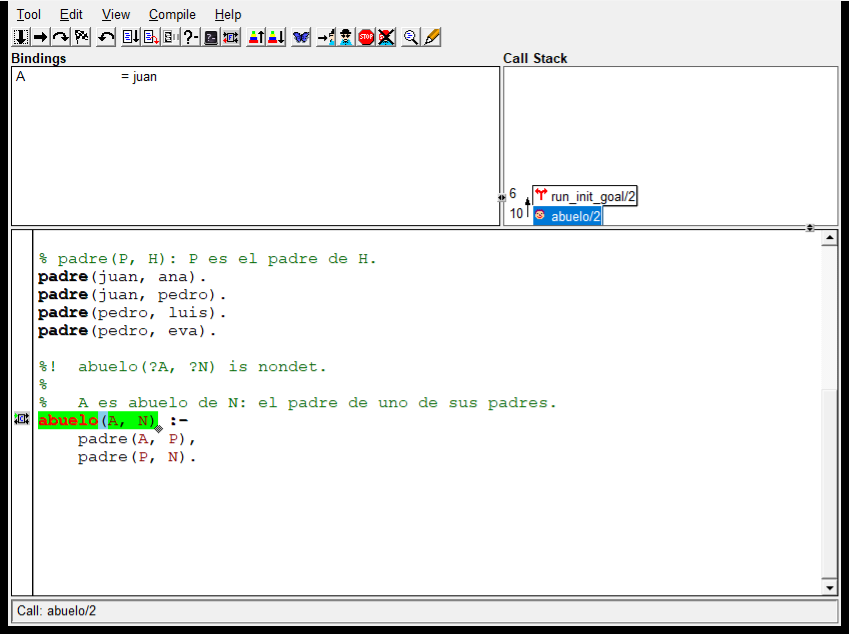

# Capítulo 26 — Pruebas y depuración

Desde el [capítulo 3](../capitulo-03-reglas-y-conjunciones/index.md), cada ejemplo del curso tiene sus pruebas de plunit, y cada
capítulo de la parte II agregó pruebas al proyecto. Este capítulo se ocupa de
las pruebas como herramienta profesional: todas las opciones de plunit, la
forma de ejecutar una sola prueba o la batería completa, la medida de qué
parte del programa ejercitan, y la pregunta de qué probar para que la batería
detecte errores.

También se ocupa de lo que viene después de una prueba que falla: encontrar el
error. El depurador de SWI-Prolog, en la terminal y en su versión gráfica, las
trazas con `debug/3`, las aserciones, y una técnica que no necesita el
depurador: preguntar a las partes del programa, o tachar objetivos hasta que
el error desaparece. El proyecto ejecuta su batería completa y mide su
cobertura, y un error plantado se busca de dos formas.

## Objetivos del capítulo

Al terminar el capítulo, el lector puede:

- usar todas las opciones de plunit, y ejecutar una prueba, una unidad o la
  batería completa;
- medir la cobertura de las pruebas, y escribir una prueba por modo y por caso
  límite;
- seguir una ejecución con `trace/0`, `spy/1` y `gtrace/0`;
- usar `debug/3` y `assertion/1`;
- encontrar un error preguntando a las partes del programa, o tachando
  objetivos.

!!! info "Tiempo estimado"
    Leer el capítulo, ejecutar sus ejemplos y hacer las actividades: **0:50 h**.
    Resolver los 6 ejercicios marcados con ★: **2:10 h**.
    Resolver los 15 ejercicios del final: **4:15 h**.

## 26.1 plunit en detalle

Una prueba es una cláusula `test(Nombre, Opciones) :- Cuerpo`, dentro de una
unidad `begin_tests/end_tests`. Las opciones dicen qué se espera del cuerpo:

| Opción | Se espera que el cuerpo… |
|---|---|
| ninguna | se cumpla, sin dejar alternativas |
| `true(Condicion)` | se cumpla, y después se cumpla `Condicion` |
| `all(X == Lista)` | tenga exactamente esas respuestas para `X` |
| `set(X == Lista)` | tenga esas respuestas, sin importar el orden ni los repetidos |
| `fail` | falle |
| `error(Formal)` | produzca un error con esa parte formal |
| `throws(Termino)` | lance una excepción que unifique con `Termino` |
| `nondet` | se cumpla, y pueda dejar alternativas |
| `setup(G)`, `cleanup(G)` | —: `G` se ejecuta antes y después de la prueba |
| `forall(Generador)` | se cumpla para cada respuesta de `Generador`: una prueba por fila |
| `condition(G)` | se ejecute solo si `G` se cumple |
| `blocked(Motivo)` | no se ejecute: la prueba está desactivada |
| `fixme(Motivo)` | se ejecute y se informe aparte, como error conocido: si falla no cuenta como fallo, y si pasa plunit lo informa para que se quite la marca |
| `timeout(Segundos)` | termine en ese tiempo |

La opción `forall` convierte una tabla en pruebas: una fila por caso, y un solo
cuerpo que los recorre. El ejercicio 4 la usa para los ocho casos de
`inscripcion_posible/3`.

`run_tests/0` ejecuta todas las unidades cargadas, `run_tests(Unidad)` una, y
`run_tests(Unidad:Prueba)` una sola prueba. `run_tests(reglas:legajo_libre)`
escribe:

```text
% Start unit: reglas
% [1/1] reglas:legajo_libre ......................... passed (0.024 sec)
% End unit reglas: passed (0.031 sec CPU)
% test passed in 0.037 seconds (0.031 cpu)
```

## 26.2 La batería completa y su cobertura

El proyecto tiene un archivo de pruebas por módulo. Para ejecutar la batería
completa, se carga el programa y todos los archivos de pruebas, y se ejecutan
todas las unidades:

```prolog
consult([inscripciones, 'datos.plt', 'reglas.plt', 'informes.plt',
         'comandos.plt', 'horarios.plt', 'inscripciones.plt']),
run_tests.
```

La última línea de la salida es:

```text
% All 86 tests passed in 0.249 seconds (0.234 cpu)
```

`coverage(Objetivo)` ejecuta `Objetivo` y registra qué cláusulas del programa
se usaron; `show_coverage([])` muestra el resultado por archivo. Con
`coverage(run_tests), show_coverage([])` después de la carga anterior:

```text
File                                                     Clauses  %Cov %Fail
----------------------------------------------------------------------------
...-prolog/ejemplos/capitulo-26/inscripciones/datos.pl ...... 30  96.7   0.0
...prolog/ejemplos/capitulo-26/inscripciones/reglas.pl ...... 10 100.0   0.0
...olog/ejemplos/capitulo-26/inscripciones/informes.pl ...... 16 100.0   0.0
...olog/ejemplos/capitulo-26/inscripciones/comandos.pl ...... 15 100.0   0.0
...olog/ejemplos/capitulo-26/inscripciones/horarios.pl ....... 6 100.0   0.0
```

`%Cov` es el porcentaje de cláusulas que alguna prueba ejecutó, y `%Fail` el de
las que fallaron alguna vez. La cláusula de `datos` que falta es la que escribe
la advertencia de `comprobar_datos/0`: con los datos del proyecto, nunca se
ejecuta. El ejercicio 5 escribe la prueba que la cubre.

Una cobertura completa no prueba que el programa esté bien: prueba que cada
cláusula se ejecutó al menos una vez. La capacidad de una batería para
detectar errores depende de los casos que elige:

!!! example "Patrón 33 — Una prueba por modo y por caso límite"
    **Problema.** Es necesario decidir qué pruebas escribir para un predicado,
    sin probar al azar ni repetir el mismo caso con otros datos.

    **Versión ingenua.** Una prueba con un ejemplo típico, en el modo en que se
    escribió el predicado.

    **Patrón.** Leer el encabezado: una prueba por cada modo declarado, con
    la determinación que el encabezado promete (`all/1` para los `nondet`,
    ninguna opción para los `det`); una por cada caso límite —la lista vacía,
    el valor mínimo que cumple y el máximo que no, el dato que falta—; y una por
    cada error que el encabezado declara (`error/1`). Las pruebas de
    rendimiento usan una cota de inferencias, que no depende de la máquina.

    **Cuándo no usarlo.** Para propiedades que valen para muchos datos, como
    las del azar: se prueban recorriendo los datos con `forall`.

Los predicados que usan el azar necesitan una forma propia de probarse, que
el ejercicio 11 aplica al tablero del Buscaminas:

!!! example "Patrón 34 — Azar reproducible"
    **Problema.** Un predicado que usa el azar no da siempre el mismo
    resultado, y una prueba no lo puede comparar con uno fijo.

    **Versión ingenua.** No probarlo, o probar solo que termina.

    **Patrón.** El azar en un solo predicado, en el borde. Las pruebas fijan la
    semilla con `set_random(seed(N))` en su `setup` y comparan con un resultado
    conocido; y recorren muchas semillas con `forall` para verificar las
    propiedades que valen para cualquier resultado.

    **Cuándo no usarlo.** Cuando el resultado depende de la versión de la
    biblioteca de números al azar: una prueba con la semilla fija se rompe al
    cambiar de versión, y conviene quedarse solo con las propiedades.

## 26.3 El depurador en la terminal

`trace/0` activa el depurador para la consulta siguiente. El depurador muestra
cada paso con su **puerto**, los de la caja de Byrd de la
[sección 5.3](../capitulo-05-como-responde-prolog/index.md#53-el-mismo-recorrido-registrado-por-trace): `Call` al entrar, `Exit` al salir con una respuesta,
`Redo` al volver a entrar para buscar otra, `Fail` al salir sin ninguna. El
número entre paréntesis es la profundidad de la llamada. La traza de
`trace, abuelo(juan, Q)` es:

<!-- ejemplo: capitulo-26/traza.pl predicado: abuelo/2 consulta: abuelo(juan, Quien). -->
```prolog
%!  abuelo(?A, ?N) is nondet.
%
%   A es abuelo de N: el padre de uno de sus padres.
abuelo(A, N) :-
    padre(A, P),
    padre(P, N).
```

```text
   Call: (10) abuelo(juan, _8612)
   Call: (11) padre(juan, _9456)
   Exit: (11) padre(juan, ana)
   Call: (11) padre(ana, _8612)
   Fail: (11) padre(ana, _8612)
   Redo: (11) padre(juan, _9456)
   Exit: (11) padre(juan, pedro)
   Call: (11) padre(pedro, _8612)
   Exit: (11) padre(pedro, luis)
   Exit: (10) abuelo(juan, luis)
```

En cada puerto, el depurador espera un comando de una letra:

| Tecla | Comando | Hace |
|---|---|---|
| Enter, `c` | creep | avanza al puerto siguiente |
| `s` | skip | ejecuta la llamada actual completa, sin mostrar su interior |
| `l` | leap | sigue sin mostrar nada hasta el próximo punto espía |
| `r` | retry | vuelve a ejecutar la llamada actual desde su `Call` |
| `f` | fail | hace fallar la llamada actual |
| `u` | up | termina la llamada actual y muestra la del nivel de arriba |
| `a` | abort | abandona la consulta y vuelve al toplevel |
| `n` | nodebug | sigue sin depurar |
| `g` | goals | muestra la pila de llamadas |
| `h` | help | lista todos los comandos |

`spy(padre/2)` pone un **punto espía**: en modo de depuración, el programa
corre sin detenerse hasta la primera llamada a `padre/2`; desde allí, Enter
muestra cada puerto, de cualquier predicado, y `l` (leap) avanza hasta el
próximo puerto de `padre/2`. `nospy/1` lo quita, y `nospyall/0` los quita
todos. Con `leash(-all)` el depurador escribe los puertos sin detenerse, que
es como se obtuvieron las trazas de este capítulo. Con el punto espía y `l`
en cada puerto, `abuelo(juan, Q)` muestra siete puertos, todos de `padre/2`:

```text
   Call: (11) padre(juan, _13660) ? leap
   Exit: (11) padre(juan, ana) ? leap
   Call: (11) padre(ana, _13250) ? leap
   Fail: (11) padre(ana, _13250) ? leap
   Exit: (11) padre(juan, pedro) ? leap
   Call: (11) padre(pedro, _13250) ? leap
   Exit: (11) padre(pedro, luis) ? leap
Q = luis.
```

El modo de depuración tiene un efecto más: conserva todas las llamadas en la
pila, y un error muestra la **pila completa**, sin los marcos que la
optimización de la última llamada elimina. Es la pila completa que el
[capítulo 25](../capitulo-25-errores-y-excepciones/index.md) mencionó: se obtiene con `debug.` antes de la consulta.

!!! question "Actividad"
    Cargar `traza.pl`, consultar `trace, abuelo(juan, Q).` y avanzar con
    Enter. En el primer `Call` de `padre/2`, usar `s` (skip) en lugar de
    Enter. ¿Qué puertos dejan de aparecer? Repetir con `r` (retry) en el
    `Fail`.

## 26.4 `gtrace/0`

`gtrace/0` abre la versión gráfica del depurador, en una ventana aparte:



*Captura: SWI-Prolog 9.2.9, `swipl-win` en Windows, 2026-09-25.*

La ventana tiene cuatro partes. La barra de botones repite los comandos de la
terminal: el primero es creep, los siguientes skip, leap, retry, fail. La zona
**Bindings** muestra las variables de la cláusula actual y sus valores: aquí,
`A = juan`. **Call Stack** es la pila de llamadas, con su profundidad, y un clic
en un marco muestra sus variables. Abajo, el **código fuente**, con el objetivo
actual resaltado: al principio, la cabeza de `abuelo/2`; al avanzar, cada
llamada del cuerpo. La línea inferior dice el puerto: `Call: abuelo/2`.

`gtrace/0` necesita la biblioteca gráfica XPCE, que viene con SWI-Prolog en
Windows y en las distribuciones de escritorio de Linux, y no está en SWISH. Es
la herramienta indicada para seguir un programa con muchas cláusulas: el
código y las ligaduras se ven juntos, sin reconstruirlos a partir de la traza.

## 26.5 `debug/3` y `assertion/1`

`debug(Tema, Formato, Argumentos)` escribe un mensaje solo si el tema está
activado con `debug(Tema)`; si no, no hace nada, y el programa puede dejar los
mensajes en el código sin efecto sobre la salida:

<!-- ejemplo: capitulo-26/depurar.pl predicado: promedio_mal/2 contar_y_sumar_mal/3 consulta: promedio_mal([6, 9], P). -->
```prolog
%!  promedio_mal(+Notas:list(number), -Promedio:number) is semidet.
%
%   Debería ser el promedio de Notas; tiene un error plantado en
%   contar_y_sumar_mal/3.
promedio_mal(Notas, Promedio) :-
    foldl(contar_y_sumar_mal, Notas, 0-0, Cantidad-Suma),
    debug(promedio, "cantidad ~w, suma ~w", [Cantidad, Suma]),
    Cantidad > 0,
    Promedio is Suma / Cantidad.

%!  contar_y_sumar_mal(+Nota:number, +Hasta:pair, -Total:pair) is det.
%
%   Debería ser el par Cantidad-Suma de Hasta con Nota agregada. El error: la
%   suma parte de la cantidad anterior, C0, en lugar de la suma anterior, S0.
contar_y_sumar_mal(Nota, C0-_S0, C-S) :-
    C is C0 + 1,
    S is C0 + Nota.
```

```prolog
?- promedio_mal([6, 9], P).
P = 5.

?- debug(promedio), promedio_mal([6, 9], P).
% cantidad 2, suma 10
P = 5.
```

`nodebug(Tema)` lo desactiva. Los mensajes van al canal de errores, no a la
salida del programa.

`assertion(Condicion)` comprueba una condición que **debe** cumplirse si el
programa está bien: un invariante. Si no se cumple, escribe el mensaje y la
pila de llamadas y, en el toplevel, activa el depurador; en un programa sin
consola lanza `error(assertion_error(fail, Objetivo), _)`. No es una
validación de los datos de entrada —eso es `must_be/2`, del
[capítulo 25](../capitulo-25-errores-y-excepciones/index.md)— sino una
comprobación del propio programa. `nota_valida/1` comprueba dos invariantes:

<!-- ejemplo: capitulo-26/depurar.pl predicado: nota_valida/1 consulta: nota_valida(7). -->
```prolog
%!  nota_valida(+N) is det.
%
%   Comprueba con assertion/1 que N es una nota de 1 a 10. Una aserción que
%   no se cumple indica un error del programa, no de los datos.
nota_valida(N) :-
    assertion(integer(N)),
    assertion(between(1, 10, N)).
```

`nota_valida(11)` escribe:

```text
ERROR: Assertion failed: user:between(1,10,11)
  [15] prolog_stack:backtrace(10) at c:/program files/swipl/library/prolog_stack.pl:494
  [14] prolog_debug:assertion_failed(fail,user:between(1,10,11)) at …/debug.pl:391
```

Dentro de una prueba de plunit, una aserción que no se cumple se informa como
una prueba fallida, con su propio mensaje.

## 26.6 Depuración declarativa

El depurador sigue la ejecución paso a paso. La **depuración declarativa**
considera el significado: en lugar de seguir cómo se calcula una respuesta, se
pregunta si cada parte del programa responde lo que debería.

`promedio_mal([6, 9], P)` responde 5 en lugar de 7.5. La respuesta depende de
`contar_y_sumar_mal/3`: se le pregunta con valores concretos, y se juzga cada
respuesta.

```prolog
?- contar_y_sumar_mal(6, 0-0, R).
R = 1-6.

?- contar_y_sumar_mal(9, 1-6, R).
R = 2-10.
```

La primera es correcta; la segunda, no: una nota más sobre `1-6` debería dar
`2-15`. El error está en `contar_y_sumar_mal/3`, en la cláusula que suma, y no
hizo falta el depurador. La traza del mismo cálculo llega a la misma línea,
`Exit: (14) contar_y_sumar_mal(9, 1-6, 2-10)`, después de catorce pasos.

Para una respuesta que **falta**, la técnica es otra. `abuelo_mal(juan, luis)`
falla, y debería cumplirse:

<!-- ejemplo: capitulo-26/depurar.pl predicado: abuelo_mal/2 consulta: abuelo_mal(juan, luis). -->
```prolog
%!  abuelo_mal(?A, ?N) is nondet.
%
%   Debería ser: A es abuelo de N. El error: el segundo objetivo tiene los
%   argumentos invertidos.
abuelo_mal(A, N) :-
    padre(A, P),
    padre(N, P).
```

Se **tachan** objetivos del cuerpo, uno por vez, hasta que la consulta se
cumple: el último tachado es el que falla. Un operador prefijo `*` que se
cumple siempre hace de tachadura, sin borrar el objetivo. El operador se
declara con `op/3`, del [capítulo 19](../capitulo-19-operadores-y-reglas-como-datos/index.md), y
`*(_)` se cumple con cualquier objetivo sin ejecutarlo:

<!-- ejemplo: capitulo-26/depurar.pl fragmento: :- op(920, fy, *). .. * padre(N, P). consulta: abuelo_recortado(juan, luis). -->
```prolog
:- op(920, fy, *).

%!  *(+Objetivo) is det.
%
%   Tacha Objetivo: *G se cumple siempre, sin ejecutar G. Un objetivo tachado
%   se quita de una cláusula sin borrarlo, para ver si el error depende de él.
*(_).

%!  abuelo_recortado(?A, ?N) is nondet.
%
%   abuelo_mal/2 con el segundo objetivo tachado: si abuelo_recortado(juan,
%   luis) se cumple, el error está en el objetivo tachado.
abuelo_recortado(A, N) :-
    padre(A, P),
    * padre(N, P).
```

```prolog
?- abuelo_mal(juan, luis).
false.

?- abuelo_recortado(juan, luis).
true ;
true.
```

Con el segundo objetivo tachado, la consulta se cumple: el error está en
`padre(N, P)`, que tiene los argumentos invertidos. La técnica es la de *The
Power of Prolog*, de Markus Triska: tachar un objetivo **generaliza** la
cláusula, y si una generalización todavía falla, el objetivo tachado no era el
responsable.

!!! question "Actividad"
    `hermanos_mal/2`, en `soluciones.pl`, no encuentra que ana y pedro son
    hermanos. Predecir cuál de sus tres objetivos se debe tachar para que
    `hermanos_mal(ana, pedro)` se cumpla, y comprobarlo con una copia de la
    regla.

!!! example "Patrón 35 — Depurar recortando"
    **Problema.** Una consulta falla y debería cumplirse, o da una respuesta
    incorrecta, y el programa es demasiado grande para seguirlo con el
    depurador.

    **Versión ingenua.** Seguir la ejecución completa con `trace/0`, paso a
    paso, hasta reconocer el error entre cientos de puertos.

    **Patrón.** Para una respuesta incorrecta, preguntar a los predicados que
    la producen, con los valores concretos que reciben, y juzgar cada
    respuesta: el error está en el primero que responde mal a partir de
    respuestas correctas. Para una respuesta que falta, tachar objetivos con
    `*` hasta que la consulta se cumpla.

    **Cuándo no usarlo.** Con predicados que modifican el estado o escriben:
    preguntarles cambia el estado, y tacharlos cambia lo que ocurre después.

## 26.7 `check/0`, `list_undefined/0` y `gxref/0`

Algunos errores se encuentran sin ejecutar nada. `check/0` examina el programa
cargado y avisa de los predicados que se llaman y no están definidos, entre
otras cosas. Con el archivo de soluciones de este capítulo cargado, `check.`
escribe:

```text
Warning: The predicates below are not defined. If these are defined
Warning: at runtime using assert/1, use :- dynamic Name/Arity.
Warning:
Warning: promedo/2, which is referenced by
Warning:     …/soluciones.pl:81:4: 1-st clause of resumen_con_error/1
```

`list_undefined/0` hace solo esa comprobación. `gxref/0` abre una ventana con el
grafo de llamadas del programa: qué predicado llama a cuál, y cuáles no llama
nadie. El [capítulo 13](../capitulo-13-el-entorno-de-trabajo/index.md) incluyó `check.` en el ciclo de trabajo.

!!! success "Criterios de calidad"
    | Criterio | En este capítulo |
    |---|---|
    | C7 | la batería completa del proyecto, 86 pruebas en seis archivos, pasa en una sola ejecución, con 100 % de cobertura en cuatro módulos y 96,7 % en `datos`; el ejercicio 5 cubre lo que falta |
    | C4 | las pruebas sin `nondet` verifican que los predicados `det` no dejan alternativas; plunit advierte cada una que queda |

## 26.8 El proyecto: la batería completa

La versión de *Inscripciones* de este capítulo no cambia el programa: agrega
pruebas. Dos son de **rendimiento**, con una cota de inferencias:

```prolog
% Una prueba de rendimiento con una cota de inferencias, no de tiempo: la
% cantidad de inferencias no depende de la máquina ni de la carga. Con los
% datos del proyecto, ranking/1 usa unas 330.
test(ranking_rapido, true(R \== inference_limit_exceeded)) :-
    call_with_inference_limit(ranking(_), 1000, R).
```

Es la prueba que el [capítulo 16](../capitulo-16-rendimiento/index.md) anticipó: una medición convertida en un
límite. Si una modificación hace que `ranking/1` pase de 330 a más de 1000
inferencias, la prueba falla y avisa. Un límite de tiempo, en cambio,
fallaría en una máquina más lenta o cargada.

El error plantado de la [sección 26.6](#266-depuracion-declarativa) está en `depurar.pl`, una copia del
`promedio/2` del proyecto con un error en la suma. Se buscó dos veces: con la
traza, que llega a la línea incorrecta después de catorce pasos, y
preguntando a `contar_y_sumar_mal/3` con dos valores, sin el depurador.

## Ejercicios

Las soluciones están en [la página de soluciones](soluciones.md). La dificultad
va de 1 (se resuelve consultando el capítulo) a 3 (requiere elaboración propia).
Los marcados con ★ son los que no conviene saltear: cubren lo que el capítulo
tiene de propio, y los capítulos siguientes los dan por hechos.

1. ★ **(1)** Elegir la opción de plunit para cada prueba: una que debe fallar;
   una que debe producir un error de tipo; una con tres respuestas conocidas;
   una que deja alternativas; una que recorre una tabla de casos.
2. **(1)** Ejecutar solo la unidad `reglas`, y después solo la prueba
   `legajo_libre`.
3. ★ **(2)** Escribir una unidad de pruebas para `aprobada/3` con una prueba por
   modo —(+, +, -), (+, -, -), (-, +, -), (-, -, -)— y por caso límite.
4. **(2)** Escribir la tabla de casos de `inscripcion_posible/3` con la opción
   `forall`.
5. ★ **(2)** Escribir la prueba que cubre la advertencia de
   `comprobar_datos/0`, capturando el mensaje con `message_hook/3`
   ([sección 25.7](../capitulo-25-errores-y-excepciones/index.md#257-mensajes-para-el-usuario)).
6. **(1)** En la traza de la [sección 26.3](#263-el-depurador-en-la-terminal), ¿qué habría mostrado el comando skip
   en el primer `Call` de `padre/2`? ¿Y retry en el `Fail`?
7. ★ **(2)** Escribir `inscribir_registrado/3`, que registra el pedido y el
   resultado con `debug/3` y el tema `inscripcion`.
8. **(2)** Escribir `vacantes_no_negativas/0`, que comprueba el invariante con
   `assertion/1`.
9. ★ **(3)** `largo_mal/2` responde 3 para `[a, b]`. Encontrar el error
   preguntando a sus partes, sin el depurador, y corregirlo.
10. **(2)** `hermanos_mal(ana, pedro)` falla. Encontrar el error tachando
    objetivos.
11. ★ **(3)** Probar `tablero_al_azar/4` del [capítulo 22](../capitulo-22-estructuras-de-datos-de-la-biblioteca/index.md): con la semilla fija
    contra un resultado conocido, y con veinte semillas contra dos
    propiedades que valen para cualquier tablero.
12. **(2)** Cargar un archivo que llama a un predicado mal escrito. ¿Qué dice la
    carga, y qué dice `check.`?
13. **(2)** Escribir una prueba que verifique que la segunda llamada a
    `requisitos_de/2` usa menos inferencias que la primera.
14. **(2)** Escribir una prueba para una consulta que no termina, sin que la
    batería quede esperando.
15. **(1)** Poner un punto espía en `padre/2` con `spy(padre/2)`, consultar
    `abuelo(juan, Q).` y avanzar con `l` (leap) hasta la respuesta. ¿Qué
    puertos muestra, y cuáles no, frente a la traza de la
    [sección 26.3](#263-el-depurador-en-la-terminal)? Quitarlo con
    `nospy(padre/2)`.

## Resumen

| | |
|---|---|
| opciones de plunit | `true`, `all`, `set`, `fail`, `error`, `throws`, `nondet`, `setup`, `cleanup`, `forall`, `condition`, `blocked`, `fixme`, `timeout` |
| `run_tests/0,1` | todas las unidades, una, o una prueba |
| `call_with_inference_limit/3` | una prueba de rendimiento con una cota de inferencias, que no depende de la máquina |
| `coverage/1`, `show_coverage/1` | qué cláusulas ejecutaron las pruebas |
| `trace/0` | el depurador en la terminal: puertos Call, Exit, Redo, Fail |
| `spy/1`, `nospy/1` | puntos espía: detenerse solo en un predicado |
| `gtrace/0` | el depurador gráfico: ligaduras, pila y código juntos |
| `debug/3`, `debug/1` | mensajes por tema, activados a pedido |
| `assertion/1` | un invariante del programa |
| depuración declarativa | preguntar a las partes; tachar objetivos con `*`, declarado con `:- op(920, fy, *)` |
| `check/0`, `list_undefined/0`, `gxref/0` | examinar el programa sin ejecutarlo |
| **Patrones 33, 34, 35** | una prueba por modo y caso límite; azar reproducible; depurar recortando |

## Temas que se retoman

| Tema | Se retoma en |
|---|---|
| Pruebas de lectura y escritura de archivos | [capítulo 27](../capitulo-27-archivos-streams-y-formatos/index.md) |
| Pruebas de un programa de línea de comandos | [capítulo 28](../capitulo-28-programas-de-linea-de-comandos/index.md) |
| pytest junto a plunit | [capítulo 29](../capitulo-29-prolog-desde-python/index.md) |
| Pruebas de un servidor en un puerto libre | [capítulo 30](../capitulo-30-servicios-web-rest/index.md) |
| Metaintérpretes: un depurador escrito en Prolog | [capítulo 33](../capitulo-33-introspeccion-y-metainterpretes/index.md) |
