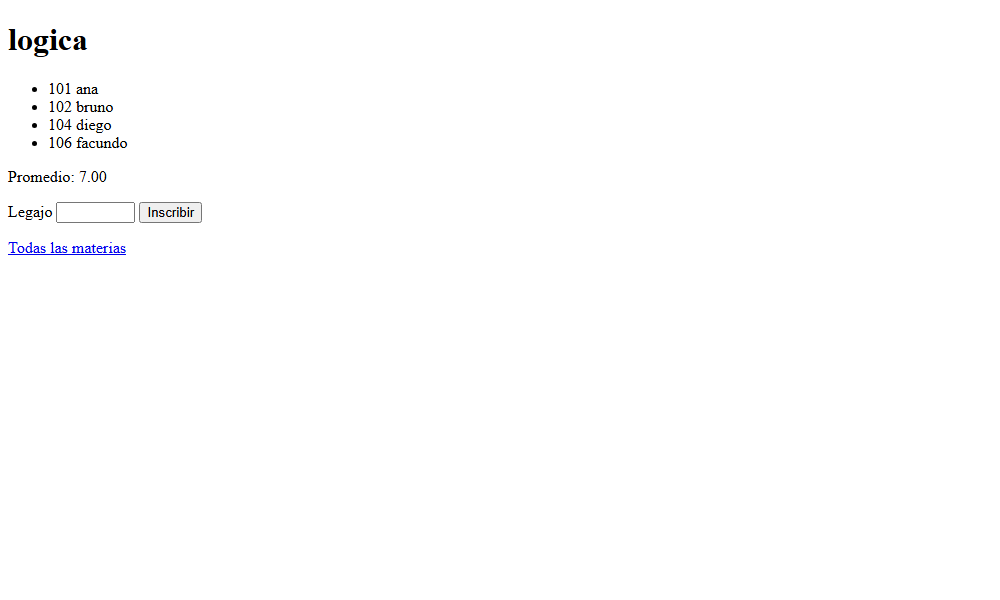

# Páginas web sobre los servicios

Esta página completa la [sección 36.6](index.md#366-paginas-web-sobre-los-servicios): el código de las páginas web
de *Inscripciones* y del Buscaminas, tal como está en
`ejemplos/capitulo-36/web/`, con sus pruebas. Las dos son una interfaz más
sobre los programas del [capítulo 31](../capitulo-31-ejecutables-y-distribucion/index.md), y siguen la misma división que
las interfaces de pantalla completa y con ventanas del capítulo: un predicado
puro arma lo que se muestra, y un predicado delgado lo envía.

| Archivo | Hace | Usa |
|---|---|---|
| `paginas_inscripciones.pl` | la lista de materias, la página de una materia y su formulario, en el servidor de `api.pl` | `datos`, `reglas`, `informes`, `api` |
| `tablero_web.pl` | el tablero del Buscaminas como formulario, cliente del servicio JSON | el servicio de `servicio.pl`, por HTTP |
| `servidor.pl` | el programa: las páginas, las rutas de JSON y el servicio del Buscaminas en un puerto | los tres anteriores |
| `test_paginas.py` | las pruebas en el navegador, con Playwright | `servidor.pl`, como programa |

Ninguno corre en SWISH, que no permite abrir puertos.

## HTML a partir de términos

`library(http/html_write)` representa una página como un término de Prolog.
Cada elemento de HTML es un término con su nombre: `h1('Materias')`,
`ul(Items)`, `li(Texto)`; los atributos van en una lista delante del
contenido: `p([class(nota)], Texto)`, `a(href(Url), Texto)`,
`input([type(submit), value('Inscribir')])`. La regla `html//1` traduce el
término a una lista de fragmentos, `print_html/1` la escribe, y
`reply_html_page/2` responde un pedido con una página completa, con su
título y su cuerpo. El texto se escapa solo: los caracteres que HTML usa para
marcar se reemplazan, y lo que escribe una persona no se convierte en HTML.
Después de `phrase(html(p('a < b & c')), T)`, `print_html(T)` escribe:

```text
<p>
a &lt; b &amp; c</p>
```

Como la página es un término, se prueba como un término: una prueba toma la
tabla de materias y compara una fila con `==`, sin servidor y sin leer HTML.

## Junto al servicio: *Inscripciones*

`paginas_inscripciones.pl` declara tres rutas. Cargar el módulo las
registra, y `iniciar_api/1`, del `api.pl` del
[capítulo 31](../capitulo-31-ejecutables-y-distribucion/index.md), las sirve junto con las rutas de JSON, en el mismo
puerto:

<!-- ejemplo: capitulo-36/web/paginas_inscripciones.pl fragmento: :- http_handler(root(pagina/materias), pagina_materias, [method(get)]). .. [method(post)]). -->
```prolog
:- http_handler(root(pagina/materias), pagina_materias, [method(get)]).
:- http_handler(root(pagina/materias/Codigo), pagina_materia(Codigo),
                [method(get)]).
:- http_handler(root(pagina/inscribir), pagina_inscribir, [method(post)]).
```

El manejador de una materia arma el cuerpo con `cuerpo_materia/2`, puro, y
responde 404 con `http_404/2` si la materia no existe. El formulario envía el
legajo y la materia con el método POST:

<!-- ejemplo: capitulo-36/web/paginas_inscripciones.pl predicado: pagina_materia/2 cuerpo_materia/2 pagina_inscribir/1 -->
```prolog
%!  pagina_materia(+Codigo:atom, +Pedido) is det.
%
%   GET /pagina/materias/Codigo, o 404 si la materia no existe.
pagina_materia(Codigo, Pedido) :-
    (   cuerpo_materia(Codigo, Cuerpo)
    ->  reply_html_page(title(Codigo), Cuerpo)
    ;   http_404([], Pedido)
    ).

%!  cuerpo_materia(+Codigo:atom, -Cuerpo) is semidet.
%
%   Cuerpo es la página de la materia Codigo: sus inscriptos, el promedio
%   y el formulario para inscribir. Falla si la materia no existe.
cuerpo_materia(Codigo, [ h1(Nombre),
                         ul(Items),
                         p(Promedio),
                         form([ action('/pagina/inscribir'), method(post) ],
                              [ input([ type(hidden), name(materia),
                                        value(Codigo) ]),
                                label([ 'Legajo ',
                                        input([ name(legajo), size(6) ]) ]),
                                input([ type(submit), value('Inscribir') ])
                              ]),
                         p(a(href('/pagina/materias'), 'Todas las materias'))
                       ]) :-
    materia(Codigo, Nombre, _),
    inscriptos(Codigo, Legajos),
    findall(li([Legajo, ' ', Alumno]),
            ( member(Legajo, Legajos),
              alumno(Legajo, Alumno, _, _) ),
            Items),
    (   promedio_de_materia(Codigo, P)
    ->  format(atom(Promedio), "Promedio: ~2f", [P])
    ;   Promedio = 'Promedio: sin notas'
    ).

%!  pagina_inscribir(+Pedido) is det.
%
%   POST /pagina/inscribir, con el legajo y la materia del formulario.
pagina_inscribir(Pedido) :-
    http_parameters(Pedido, [ legajo(Legajo, [integer]),
                              materia(Materia, [atom]) ]),
    inscribir(Legajo, Materia, Resultado),
    cuerpo_resultado(Legajo, Materia-Resultado, Cuerpo),
    reply_html_page(title('Inscripción'), Cuerpo).
```

`http_parameters/2`, del [capítulo 30](../capitulo-30-servicios-web-rest/index.md), lee también los campos de un
formulario enviado con POST: con `legajo=abc`, el tipo `integer` no se cumple
y la respuesta es 400, sin llamar a `inscribir/3`. La página de materias,
`cuerpo_materias/1`, es una tabla con un enlace por materia, y la del
resultado, `cuerpo_resultado/3`, informa si la inscripción se aceptó y el
motivo del rechazo.



*Captura: SWI-Prolog 9.2.9 y Chromium sin ventana, con Playwright
(`capturas.py`), 2026-09-27.*

## Como cliente del servicio: el Buscaminas

El servicio del Buscaminas guarda sus partidas dentro de su módulo, y no las
exporta. `tablero_web.pl` no carga el núcleo: pide el tablero al servicio con
`http_open/3` y envía las jugadas con `http_post/4`, como cualquier otro
cliente del [capítulo 30](../capitulo-30-servicios-web-rest/index.md#305-clientes). `usar_servicio/1` fija la dirección del
servicio, y las páginas pueden correr en otro proceso con
`iniciar_paginas/1`:

<!-- ejemplo: capitulo-36/web/tablero_web.pl predicado: pedir/2 enviar/3 -->
```prolog
%!  pedir(+Ruta:atom, -Respuesta:dict) is det.
%
%   Respuesta es el JSON que el servicio responde a GET Ruta.
pedir(Ruta, Respuesta) :-
    servicio(Base),
    atom_concat(Base, Ruta, Url),
    setup_call_cleanup(http_open(Url, S, []),
                       json_read_dict(S, Respuesta),
                       close(S)).

%!  enviar(+Ruta:atom, +Datos:dict, -Respuesta:dict) is det.
%
%   Respuesta es el JSON que el servicio responde a POST Ruta con Datos.
enviar(Ruta, Datos, Respuesta) :-
    servicio(Base),
    atom_concat(Base, Ruta, Url),
    http_post(Url, json(Datos), Respuesta, [json_object(dict)]).
```

La página es un formulario: dos botones de radio eligen la acción, y cada
celda oculta o marcada es un botón cuyo valor es la celda. Al enviarlo, el
navegador manda la acción elegida y la celda del botón pulsado. Cuando la
partida terminó, las celdas son texto:

<!-- ejemplo: capitulo-36/web/tablero_web.pl predicado: cuerpo_tablero/3 fila_html/5 celda_html/6 -->
```prolog
%!  cuerpo_tablero(+Id, +Respuesta:dict, -Cuerpo) is det.
%
%   Cuerpo es la página de la partida Id, a partir de la Respuesta del
%   servicio: el estado, y un formulario con la acción y un botón por celda
%   oculta; las celdas descubiertas son texto.
cuerpo_tablero(Id, Respuesta, [ h1('Buscaminas'),
                                p(Texto),
                                form([action(Accion), method(post)],
                                     [ p([ label([ input([ type(radio),
                                                           name(accion),
                                                           value(descubrir),
                                                           checked ]),
                                                   ' descubrir ' ]),
                                           label([ input([ type(radio),
                                                           name(accion),
                                                           value(marcar) ]),
                                                   ' marcar' ])
                                         ]),
                                       table(Filas)
                                     ])
                              ]) :-
    _{estado: Estado, minas_restantes: Restantes, tablero: Tablero}
        :< Respuesta,
    format(atom(Accion), "/juego/~w", [Id]),
    texto_de_estado(Estado, Restantes, Texto),
    foldl(fila_html(Estado), Tablero, Filas, 1, _).

%!  fila_html(+Estado:string, +Fila:string, -Html, +F0:integer,
%!            -F:integer) is det.
%
%   Html es la fila F0 del tablero; F es F0 + 1.
fila_html(Estado, Fila, tr(Celdas), F0, F) :-
    F is F0 + 1,
    string_chars(Fila, Simbolos),
    foldl(celda_html(Estado, F0), Simbolos, Celdas, 1, _).

%!  celda_html(+Estado:string, +F:integer, +Simbolo:char, -Html,
%!             +C0:integer, -C:integer) is det.
%
%   Html muestra la celda F-C0: un botón si está oculta o marcada y la
%   partida sigue, o el símbolo. C es C0 + 1.
celda_html(Estado, F, Simbolo, td(Contenido), C0, C) :-
    C is C0 + 1,
    (   Estado == "sigue",
        memberchk(Simbolo, ['#', 'M'])
    ->  format(atom(Valor), "~d-~d", [F, C0]),
        Contenido = button([type(submit), name(celda), value(Valor)],
                           Simbolo)
    ;   Contenido = Simbolo
    ).
```

El envío llega a `juego/2` por POST. El manejador pasa la jugada al servicio
y responde con una redirección 303, *See Other*, a la página del tablero, que
el navegador pide con GET. Así, recargar la página después de una jugada
vuelve a pedir el tablero, y no repite la jugada:

<!-- ejemplo: capitulo-36/web/tablero_web.pl predicado: juego/2 -->
```prolog
%!  juego(+Id:atom, +Pedido) is det.
%
%   GET /juego/Id muestra el tablero; POST /juego/Id envía al servicio la
%   jugada del formulario y redirige al tablero.
juego(Id, Pedido) :-
    memberchk(method(Metodo), Pedido),
    format(atom(Ruta), "/partidas/~w", [Id]),
    (   Metodo == post
    ->  http_parameters(Pedido, [ accion(Accion, [oneof([descubrir, marcar])]),
                                  celda(Celda, [atom]) ]),
        atomic_list_concat([F, C], '-', Celda),
        atom_number(F, Fila),
        atom_number(C, Columna),
        format(atom(RutaJugada), "~w/~w", [Ruta, Accion]),
        enviar(RutaJugada, _{fila: Fila, columna: Columna}, _),
        format(atom(Pagina), "/juego/~w", [Id]),
        http_redirect(see_other, Pagina, Pedido)
    ;   pedir(Ruta, Respuesta),
        cuerpo_tablero(Id, Respuesta, Cuerpo),
        reply_html_page(title('Buscaminas'), Cuerpo)
    ).
```

`http_redirect(see_other, Pagina, Pedido)` produce la respuesta 303.


*Captura: SWI-Prolog 9.2.9 y Chromium sin ventana, con Playwright
(`capturas.py`), 2026-09-27.*

Cada jugada vuelve a pedir la página entera, y con ella el formulario: la
acción elegida vuelve a ser «descubrir» después de cada clic.

## Las pruebas

Las dos baterías siguen el [Patrón 41](../patrones.md#41-servidor-bajo-prueba): arrancan un servidor en un
puerto libre de `localhost` en el `setup` de la unidad y lo detienen en el
`cleanup`. Para el tablero, el mismo servidor sirve el servicio JSON del
[capítulo 31](../capitulo-31-ejecutables-y-distribucion/index.md), cargado por la prueba, y las páginas, dirigidas a él con
`usar_servicio/1`: las páginas le piden el tablero por HTTP, aunque esté en
el mismo proceso.

```prolog
arrancar_para_pruebas :-
    iniciar_servicio(Puerto, local),
    format(atom(Base), "http://127.0.0.1:~w", [Puerto]),
    usar_servicio(Base),
    assertz(puerto_de_prueba(Puerto)).
```

`http_open/3` sigue la redirección 303 automáticamente, y la opción
`final_url(Final)` da la dirección de la página a la que llegó. La prueba
empieza una partida, lee de esa dirección la ruta de la partida y marca la
celda 1-1:

```prolog
test(jugar, true(C1-C2 == 200-200)) :-
    enviar_formulario('/juego', [], C1, Final, T1),
    once(sub_string(T1, _, _, _, "Minas sin marcar: 10")),
    uri_components(Final, uri_components(_, _, Ruta, _, _)),
    enviar_formulario(Ruta, [accion=marcar, celda='1-1'], C2, _, T2),
    once(sub_string(T2, _, _, _, "value=\"1-1\">M</button>")),
    once(sub_string(T2, _, _, _, "Minas sin marcar: 9")).
```

Las pruebas de *Inscripciones* que inscriben guardan el estado de los datos
con `estado/1` y lo restauran con `restaurar/1`, del
[capítulo 20](../capitulo-20-base-de-datos-dinamica/index.md), y una de ellas pide `/ranking` para comprobar que las
rutas de JSON siguen en el mismo servidor. Lo que las pruebas de plunit no cubren
es lo que ve una persona en el navegador.

Eso lo cubre `test_paginas.py`, que `make appendix` ejecuta con pytest:
arranca `servidor.pl` como programa, en un puerto libre, y abre las páginas
en Chromium sin ventana, con Playwright. Cada prueba hace lo que haría una
persona —seguir un enlace con un clic, escribir un legajo y pulsar
*Inscribir*, pulsar una celda del tablero— y verifica lo que se ve: títulos,
textos y cantidades de elementos, no píxeles.

```python
def test_enlace(pagina, base):
    pagina.goto(f'{base}/pagina/materias')
    pagina.get_by_role('link', name='logica').click()
    expect(pagina).to_have_url(f'{base}/pagina/materias/log')
    expect(pagina.locator('h1')).to_have_text('logica')
    expect(pagina.locator('li')).to_have_count(4)
    expect(pagina.get_by_text('Promedio: 7.00')).to_be_visible()
```
