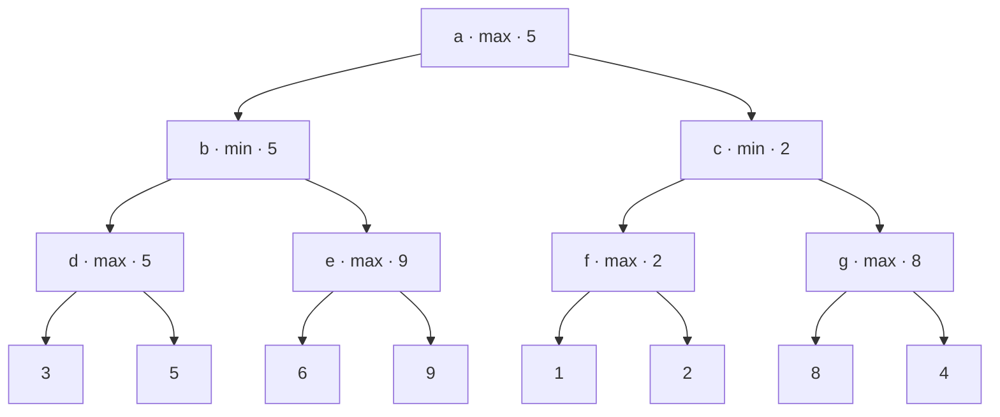
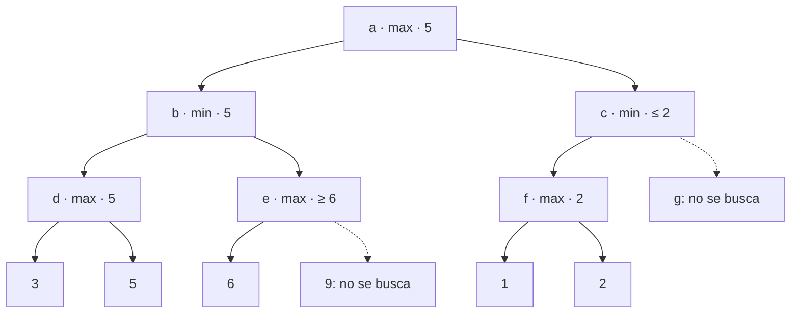

# Capítulo 41 — Juegos

En un juego de dos jugadores, las jugadas de uno alternan con las del otro,
y el segundo elige las suyas contra el primero. Buscar una jugada ya no es
buscar un camino hasta una meta, como en el
[capítulo 40](../capitulo-40-busqueda-y-planificacion/index.md): es buscar
una jugada que resulte buena **cualquiera sea la respuesta** del rival. La
búsqueda recorre el **árbol de la partida**, cuyas posiciones alternan
entre las que decide un jugador y las que decide el otro, y en los juegos
de interés ese árbol es demasiado grande para recorrerlo entero: una
búsqueda útil examina unas pocas jugadas hacia adelante y estima el resto.

El capítulo sigue una escalera sobre el **ta-te-ti**. El juego se describe
con cinco predicados que la búsqueda no conoce por dentro, como el problema
del capítulo anterior; una primera búsqueda recorre el árbol entero para
decidir si una posición está ganada; **minimax** da a cada posición un
valor numérico y corta la búsqueda a una profundidad fija; la **poda
alfa-beta** llega a los mismos valores sin visitar las posiciones que no
pueden cambiar la decisión; una **función de evaluación** estima las
posiciones del límite, y el **orden de las jugadas** decide cuánto poda la
poda. Tres páginas más completan la escalera: la
[profundización progresiva](profundizacion.md#profundizacion-progresiva-con-limite-de-tiempo)
con un límite de tiempo, y las jugadas buscadas en paralelo; las
[tablas de transposición](transposicion.md#tablas-de-transposicion-con-tabulacion)
escritas con la tabulación del
[capítulo 39](../capitulo-39-tabulacion/index.md); y
[el ta-te-ti completo en la terminal](terminal.md#el-ta-te-ti-completo-en-la-terminal),
con la interfaz del [capítulo 36](../capitulo-36-interfaces-de-usuario/index.md).

La fuente principal es el capítulo «Game Playing» de *Prolog Programming
for Artificial Intelligence* de Ivan Bratko (Addison-Wesley, 1986), del que el capítulo toma la
posición ganada definida como un árbol Y/O, el principio minimax, el
algoritmo alfa-beta con su valor «suficientemente bueno» entre dos cotas,
la importancia del orden de las jugadas, la profundización progresiva y el
efecto horizonte. La segunda es *The Art of Prolog* de Leon Sterling y Ehud
Shapiro (MIT Press, 2.ª edición, 1994): sus capítulos «Search Techniques», que escribe minimax y alfa-beta con un
solo caso para los dos jugadores, y «Game-Playing Programs», con programas
para Mastermind, Nim y Kalah. Esos tres juegos son el proyecto del
[capítulo 78](../capitulo-78-proyecto-kalah-mastermind-nim/index.md), y aquí
solo se los menciona. Los programas del capítulo están escritos para el
curso. La lista completa de las fuentes está en las
[Referencias](#referencias), al final del capítulo.

El capítulo cumple los anuncios de los capítulos
[9](../capitulo-09-backtracking-y-corte/index.md) y
[22](../capitulo-22-estructuras-de-datos-de-la-biblioteca/index.md) (la
búsqueda con un adversario, los juegos de dos jugadores), del
[capítulo 36](../capitulo-36-interfaces-de-usuario/index.md) (un tablero
redibujado en cada jugada), del
[capítulo 37](../capitulo-37-concurrencia-y-paralelismo/index.md) (jugadas
buscadas en paralelo y con un límite de tiempo), del
[capítulo 39](../capitulo-39-tabulacion/index.md) (las tablas de
transposición) y del
[capítulo 40](../capitulo-40-busqueda-y-planificacion/index.md) (minimax y
la poda alfa-beta). Salvo las jugadas en paralelo y la terminal, los
ejemplos corren en SWISH: para eso, cada archivo termina con una copia del
código que usa de los otros, y las pruebas de `copias.pl` verifican que
cada copia coincide, cláusula por cláusula, con su original.

## Objetivos del capítulo

Al terminar el capítulo, el lector puede:

- describir un juego de dos jugadores con `inicial/2`, `jugada/4`,
  `turno/3`, `fin/3` y `valor_final/3`, con el juego como un término que la
  búsqueda recibe;
- decidir si una posición está ganada recorriendo el árbol entero, y
  explicar por qué eso solo sirve en juegos pequeños;
- escribir minimax con un límite de profundidad y una evaluación estática,
  y calcular a mano los valores de un árbol pequeño;
- escribir la poda alfa-beta, explicar qué significan las dos cotas y por
  qué el valor y la jugada no cambian, y contar los nodos que ahorra;
- escribir una función de evaluación y ordenar las jugadas con ella, y medir
  cuándo el orden paga lo que cuesta;
- buscar con profundización progresiva dentro de un tiempo fijo, en un hilo
  o repartida entre varios;
- usar la tabulación como tabla de transposición, y reconocer cuándo no
  alcanza sin la poda;
- jugar al ta-te-ti contra la computadora en la terminal, con el núcleo del
  juego separado de la interfaz.

!!! info "Tiempo estimado"
    Leer el capítulo, ejecutar sus ejemplos y hacer las actividades: **1:35 h**.
    Resolver los 6 ejercicios marcados con ★: **1:40 h**.
    Resolver los 14 ejercicios del final: **4:00 h**.

## 41.1 Posiciones, jugadas y fin de partida

El ta-te-ti se juega en un tablero de 3 × 3; dos jugadores, x y o, marcan
por turno una casilla vacía, y gana quien completa una fila, una columna o
una diagonal. `tateti.pl` describe también el tablero de 4 × 4, con cuatro
en línea, que las secciones siguientes usan cuando el de 3 × 3 resulta demasiado pequeño.
El juego es un término, `tateti(3)` o `tateti(4)`, y es el primer argumento
de cada predicado de la descripción. Una posición es `pos(Tablero, Turno)`:
la lista de las casillas por filas, cada una `x`, `o` o `v` (vacía), y el
jugador que mueve. Una jugada es el número de una casilla, de 1 a 9 en el
tablero de 3 × 3.

<!-- ejemplo: capitulo-41/tateti.pl predicado: inicial/2 jugada/4 otro/2 turno/3 lado/2 consulta: findall(J, jugada(tateti(3), pos([x,o,v, v,x,v, v,v,o], x), J, _), Js). -->
```prolog
%!  inicial(+Juego, -Posicion) is det.
%
%   Posicion es la de partida de Juego: el tablero vacío, y mueve x.
inicial(tateti(N), pos(Tablero, x)) :-
    Casillas is N * N,
    length(Tablero, Casillas),
    maplist(=(v), Tablero).

%!  jugada(+Juego, +Posicion, ?Casilla:integer, -Siguiente) is nondet.
%
%   Siguiente es la posición que resulta de que el jugador de turno en
%   Posicion marque Casilla, una casilla vacía. No comprueba si la partida
%   terminó: las búsquedas llaman antes a fin/3.
jugada(tateti(_), pos(Tablero0, Jugador), Casilla, pos(Tablero, Otro)) :-
    nth1(Casilla, Tablero0, v, Resto),
    nth1(Casilla, Tablero, Jugador, Resto),
    otro(Jugador, Otro).

% otro(J, K): K es el rival de J.
otro(x, o).
otro(o, x).

%!  turno(+Juego, +Posicion, -Lado) is det.
%
%   Lado es max si en Posicion mueve x, que busca los valores altos, y min
%   si mueve o.
turno(tateti(_), pos(_, Jugador), Lado) :-
    lado(Jugador, Lado).

% lado(J, L): el jugador J es L, max o min.
lado(x, max).
lado(o, min).
```

`nth1/4` saca y pone un elemento en una posición de una lista: con
`nth1(Casilla, Tablero0, v, Resto)` se elige una casilla vacía y `Resto` es
el tablero sin ella, y `nth1(Casilla, Tablero, Jugador, Resto)`, en sentido
inverso, pone la marca en el mismo lugar. `turno/3` dice qué hace el
jugador de turno con los valores: x es **max**, que busca los valores
altos, y o es **min**, que busca los bajos.

El fin de la partida lo reconoce `fin/3`. Las líneas de cada tablero están
escritas como un hecho, y `fin/3` busca una cuya primera casilla tenga una
marca que se repite en todas las demás:

<!-- ejemplo: capitulo-41/tateti.pl predicado: fin/3 marca/3 lineas/2 valor_final/3 signo/2 -->
```prolog
%!  fin(+Juego, +Posicion, -Resultado) is semidet.
%
%   La partida terminó en Posicion con Resultado: gana(J) si J completó una
%   línea, o empate si el tablero está lleno. Falla si la partida sigue.
fin(Juego, pos(Tablero, _), Resultado) :-
    lineas(Juego, Lineas),
    (   member([C|Cs], Lineas),
        marca(Tablero, J, C),
        J \== v,
        maplist(marca(Tablero, J), Cs)
    ->  Resultado = gana(J)
    ;   \+ memberchk(v, Tablero),
        Resultado = empate
    ).

%!  marca(+Tablero:list, ?Marca, +Casilla:integer) is semidet.
%
%   Marca es lo que hay en Casilla: x, o o v.
marca(Tablero, Marca, Casilla) :-
    nth1(Casilla, Tablero, Marca).

% lineas(Juego, Lineas): Lineas son las filas, las columnas y las dos
% diagonales del tablero de Juego, cada una como la lista de sus casillas.
lineas(tateti(3), [[1, 2, 3], [4, 5, 6], [7, 8, 9],
                   [1, 4, 7], [2, 5, 8], [3, 6, 9],
                   [1, 5, 9], [3, 5, 7]]).
lineas(tateti(4), [[1, 2, 3, 4], [5, 6, 7, 8], [9, 10, 11, 12],
                   [13, 14, 15, 16],
                   [1, 5, 9, 13], [2, 6, 10, 14], [3, 7, 11, 15],
                   [4, 8, 12, 16],
                   [1, 6, 11, 16], [4, 7, 10, 13]]).

%!  valor_final(+Resultado, +Posicion, -Valor:integer) is det.
%
%   Valor es el de una partida terminada, para x: 0 el empate, y 100 más la
%   cantidad de casillas vacías si gana x, con el signo cambiado si gana o.
%   Las casillas vacías premian ganar antes.
valor_final(empate, _, 0).
valor_final(gana(J), pos(Tablero, _), Valor) :-
    include(==(v), Tablero, Vacias),
    length(Vacias, K),
    signo(J, S),
    Valor is S * (100 + K).

% signo(J, S): S es 1 si J es x, que maximiza, y -1 si es o, que minimiza.
signo(x, 1).
signo(o, -1).
```

`valor_final/3` da el valor de una partida terminada desde el punto de
vista de x: 0 el empate, y 100 más las casillas vacías una victoria de x,
con el signo cambiado si gana o. Las casillas vacías hacen que una victoria
rápida valga más que una lenta; el [ejercicio 3](#ejercicios) muestra qué
pasa sin ellas. Las consultas se leen como las reglas del juego:

```prolog
?- findall(J, jugada(tateti(3), pos([x,o,v, v,x,v, v,v,o], x), J, _), Js).
Js = [3, 4, 6, 7, 8].

?- fin(tateti(3), pos([x,o,v, v,x,v, v,v,o], x), R).
false.

?- fin(tateti(3), pos([x,o,v, x,x,o, x,v,o], o), R).
R = gana(x).

?- fin(tateti(3), pos([x,o,x, x,o,o, o,x,x], x), R).
R = empate.
```

Las líneas son hechos, y no se calculan en cada llamada, porque `fin/3` se
llama en cada posición de cada búsqueda. La primera versión las generaba
en cada llamada con `numlist/3` y `maplist/3`, y comparaba todas las
casillas de cada línea: recorrer el árbol entero del ta-te-ti tardaba 20
segundos. Con las líneas como hechos y una comparación que se detiene en la
primera casilla distinta, tarda 7,7. El [ejercicio 6](#ejercicios)
escribe las líneas de un tablero de cualquier tamaño.

### La posición ganada, sin números

Un jugador que mueve **gana** si tiene una jugada tras la cual el rival
**pierde**; y el que mueve pierde si la partida terminó con la victoria del
otro, o si todas sus jugadas llevan a posiciones que el otro gana. Es la
definición del juego como un árbol Y/O que Bratko da al empezar el
capítulo «Game Playing»: las posiciones del que busca ganar son nodos O,
basta una jugada; las del rival son nodos Y, tienen que ser buenas todas.

<!-- ejemplo: capitulo-41/tateti.pl predicado: ganada/2 perdida/2 consulta: ganada(tateti(3), pos([x,o,v, v,x,v, v,v,o], x)). -->
```prolog
%!  ganada(+Juego, +Posicion) is semidet.
%
%   El jugador de turno en Posicion gana, juegue lo que juegue el rival:
%   tiene una jugada tras la cual todas las respuestas llevan a una
%   posición en la que vuelve a ganar. Recorre el árbol entero de la
%   partida.
ganada(Juego, Posicion) :-
    \+ fin(Juego, Posicion, _),
    jugada(Juego, Posicion, _, Siguiente),
    perdida(Juego, Siguiente),
    !.

%!  perdida(+Juego, +Posicion) is semidet.
%
%   El jugador de turno en Posicion pierde: la partida terminó con la
%   victoria del rival, o todas sus jugadas llevan a posiciones ganadas
%   por el rival.
perdida(Juego, Posicion) :-
    (   fin(Juego, Posicion, Resultado)
    ->  Resultado = gana(_)
    ;   forall(jugada(Juego, Posicion, _, Siguiente),
               ganada(Juego, Siguiente))
    ).
```

`tateti.pl` define también `filas/3`, que muestra un tablero como una
lista de cadenas, una por fila, con X, O o el número de cada casilla
vacía; sirve para leer las posiciones de los ejemplos:

```prolog
?- filas(tateti(3), pos([x,o,v, v,x,v, v,v,o], x), L).
L = ["X O 3", "4 X 6", "7 8 O"].

?- ganada(tateti(3), pos([x,o,v, v,x,v, v,v,o], x)).
true.

?- ganada(tateti(3), pos([x,o,v, v,x,v, v,v,o], o)).
false.

?- inicial(tateti(3), P), ganada(tateti(3), P).
false.
```

Con x en 1 y en 5, y o en 2 y en 9, x gana: la jugada 4 amenaza completar
la fila 4-5-6 y la columna 1-4-7, y o puede tapar solo una. Si en la misma
posición mueve o, no gana, y desde el tablero vacío tampoco gana x: con
buen juego de los dos, el ta-te-ti termina empatado. `ganada/2` es la
negación como falla del [capítulo 10](../capitulo-10-negacion-como-falla/index.md)
aplicada dos veces, `\+` y `forall/2`, y es el mismo juego que la
[sección 39.4](../capitulo-39-tabulacion/index.md#394-negacion-tabulada)
resolvió con `tnot/1` sobre un grafo con ciclos; aquí no hay ciclos, porque
cada jugada llena una casilla, y la negación de Prolog termina.

La definición tiene dos límites. Solo distingue ganar de no ganar: el
empate y la derrota del que mueve dan los dos `false`. Y recorre el árbol
hasta el final de la partida. `partidas/3` cuenta las ramas de ese árbol:

```text
?- inicial(tateti(3), P), time(partidas(tateti(3), P, N)).
% 59,723,069 inferences, 7.719 CPU in 7.827 seconds (99% CPU, 7737402 Lips)
N = 255168.
```

El ta-te-ti tiene 255 168 partidas distintas y 549 946 posiciones en su
árbol, contando cada posición tantas veces como caminos llevan a ella. En
el tablero de 4 × 4, las formas de llenar las 16 casillas en orden son
16!, más de 2 · 10<sup>13</sup>; muchas partidas terminan antes, pero el
árbol queda fuera de alcance, y en el ajedrez Bratko estima del orden de
10<sup>120</sup> posiciones. Un programa que juega
no puede recorrerlo: tiene que decidir con una parte de él.

!!! question "Actividad"
    Predecir, sin ejecutarlas, las respuestas de
    `ganada(tateti(3), pos([x,v,v, v,o,v, v,v,x], o))` y de
    `ganada(tateti(3), pos([v,o,v, v,x,v, v,v,v], x))`, y cuántas partidas
    da `partidas(tateti(3), pos([x,o,x, o,x,v, v,v,o], x), N)`. Comprobarlo.

## 41.2 Minimax

Minimax da a cada posición un **valor**, un número, desde el punto de vista
de max. Una posición final vale lo que dice `valor_final/3`. Una posición
en la que mueve max vale el **máximo** de los valores de las posiciones a
las que llevan sus jugadas, y una en la que mueve min, el **mínimo**: cada
jugador elige lo mejor para sí, suponiendo que el otro hace lo mismo. Si la
búsqueda llega a una profundidad fija sin que la partida termine, la
posición recibe una **evaluación estática**, una estimación que no busca
jugadas hacia adelante. La jugada elegida es la que lleva al mejor valor.

<!-- ejemplo: capitulo-41/minimax.pl predicado: minimax/6 valor/7 mejor/10 mejora/3 consulta: minimax(arbol, a, 3, Jugada, Valor, Nodos). -->
```prolog
%!  minimax(+Juego, +Posicion, +Profundidad:integer, -Jugada, -Valor,
%!          -Nodos:integer) is det.
%
%   Valor es el valor minimax de Posicion buscando Profundidad jugadas
%   hacia adelante, y Jugada la primera de las mejores jugadas, o ninguna
%   si la partida terminó o Profundidad es 0. Nodos es la cantidad de
%   posiciones visitadas.
minimax(Juego, Posicion, Profundidad, Jugada, Valor, Nodos) :-
    valor(Juego, Posicion, Profundidad, Jugada, Valor, 0, Nodos).

%!  valor(+Juego, +Posicion, +Profundidad:integer, -Jugada, -Valor,
%!        +N0:integer, -N:integer) is det.
%
%   Como minimax/6; N es N0 más los nodos visitados.
valor(Juego, Posicion, Profundidad, Jugada, Valor, N0, N) :-
    N1 is N0 + 1,
    (   fin(Juego, Posicion, Resultado)
    ->  valor_final(Resultado, Posicion, Valor),
        Jugada = ninguna,
        N = N1
    ;   Profundidad =:= 0
    ->  evaluar(Juego, Posicion, Valor),
        Jugada = ninguna,
        N = N1
    ;   findall(J-P, jugada(Juego, Posicion, J, P), [J1-P1|Hijos]),
        turno(Juego, Posicion, Lado),
        Profundidad1 is Profundidad - 1,
        valor(Juego, P1, Profundidad1, _, V1, N1, N2),
        mejor(Hijos, Juego, Lado, Profundidad1, J1, V1, Jugada, Valor,
              N2, N)
    ).

%!  mejor(+Hijos:list, +Juego, +Lado, +Profundidad:integer, +J0, +V0,
%!        -Jugada, -Valor, +N0:integer, -N:integer) is det.
%
%   Jugada y Valor son los de la mejor jugada para Lado entre J0, de valor
%   V0, y las de Hijos, pares Jugada-Posicion. Ante un empate queda la
%   primera.
mejor([], _, _, _, Jugada, Valor, Jugada, Valor, N, N).
mejor([J-P|Hijos], Juego, Lado, Profundidad, J0, V0, Jugada, Valor,
      N0, N) :-
    valor(Juego, P, Profundidad, _, V, N0, N1),
    (   mejora(Lado, V, V0)
    ->  mejor(Hijos, Juego, Lado, Profundidad, J, V, Jugada, Valor, N1, N)
    ;   mejor(Hijos, Juego, Lado, Profundidad, J0, V0, Jugada, Valor,
              N1, N)
    ).

%!  mejora(+Lado, +V:number, +V0:number) is semidet.
%
%   Para Lado, el valor V es mejor que V0: mayor si Lado es max, menor si
%   es min.
mejora(max, V, V0) :-
    V > V0.
mejora(min, V, V0) :-
    V < V0.
```

`valor/7` lleva, además, un contador de las posiciones visitadas, que
entra en `N0` y sale en `N`; es lo que las secciones siguientes comparan.
`mejor/10` recorre las jugadas con la mejor encontrada hasta el momento, y
ante un empate se queda con la primera. La búsqueda no depende del
juego: solo llama a `fin/3`, `valor_final/3`, `evaluar/3`, `jugada/4` y
`turno/3` con el juego que recibe.

Para verlo con números que se puedan seguir a mano, `minimax.pl` define un
segundo juego, `arbol`: un árbol fijo de profundidad 3, con max en la raíz y
en el tercer nivel, min en el segundo, y un valor en cada hoja. Los dos
juegos definen los mismos predicados en lugares distintos del archivo, y
por eso el archivo declara `:- discontiguous`. Las ramas, las hojas y el
jugador de cada posición son hechos, `rama/2`, `hoja/2` y `mueve/2`, que el
dibujo muestra con los valores; el juego los consulta:

<!-- ejemplo: capitulo-41/minimax.pl fragmento: %!  inicial(+Juego, -Posicion) is det. .. valor_final(hoja(V), _, V). -->
```prolog
%!  inicial(+Juego, -Posicion) is det.
%
%   Posicion es la de partida de Juego: en el árbol, la raíz.
inicial(arbol, a).

%!  jugada(+Juego, +Posicion, ?Jugada, -Siguiente) is nondet.
%
%   Siguiente es la posición a la que lleva Jugada desde Posicion: en el
%   árbol, la jugada es el hijo mismo.
jugada(arbol, P, H, H) :-
    rama(P, H).

%!  turno(+Juego, +Posicion, -Lado) is det.
%
%   Lado es max o min, el que mueve en Posicion.
turno(arbol, P, Lado) :-
    mueve(P, Lado).

%!  fin(+Juego, +Posicion, -Resultado) is semidet.
%
%   La partida terminó en Posicion con Resultado: en el árbol, una hoja,
%   con hoja(V). Falla si la partida sigue.
fin(arbol, P, hoja(V)) :-
    hoja(P, V).

%!  valor_final(+Resultado, +Posicion, -Valor:integer) is det.
%
%   Valor es el de una partida terminada, para max: en el árbol, el de la
%   hoja.
valor_final(hoja(V), _, V).
```



Los valores se calculan de abajo hacia arriba: d vale 5, el máximo de 3 y 5;
e vale 9; b, donde mueve min, vale 5, el mínimo de 5 y 9; c vale 2, y la
raíz vale 5, con la jugada b. La secuencia a-b-d-d2, en la que cada jugador
elige su mejor jugada, es la **variante principal**, y el valor no cambia a
lo largo de ella.

```prolog
?- minimax(arbol, a, 3, Jugada, Valor, Nodos).
Jugada = b,
Valor = 5,
Nodos = 15.

?- minimax(tateti(3), pos([x,o,v, v,x,v, v,v,o], x), 9, J, V, N).
J = 4,
V = 102,
N = 238.

?- minimax(tateti(3), pos([x,o,v, v,x,v, v,v,o], o), 9, J, V, N).
J = 3,
V = 0,
N = 250.
```

En la posición de la sección anterior, minimax encuentra la jugada 4 de x,
que gana con dos casillas vacías: 102. Si mueve o, la jugada 3 evita la
amenaza doble, porque obliga a x a tapar la columna 3-6-9, y la partida
termina empatada. Desde el tablero vacío y sin límite, minimax visita el
árbol entero:

```text
?- inicial(tateti(3), P), time(minimax(tateti(3), P, 9, J, V, N)).
% 71,540,279 inferences, 9.844 CPU in 9.945 seconds (99% CPU, 7267584 Lips)
J = 1,
V = 0,
N = 549946.
```

Con un límite, la búsqueda termina antes y la evaluación estática decide.
`minimax.pl` usa la **evaluación nula**, 0 para toda posición que no
terminó; con ella, a profundidad 2 ninguna jugada inicial se distingue de
otra, y la búsqueda devuelve la primera:

```prolog
?- inicial(tateti(3), P), minimax(tateti(3), P, 2, J, V, N).
P = pos([v, v, v, v, v, v, v, v|...], x),
J = 1,
V = 0,
N = 82.
```

La [sección 41.4](#414-funciones-de-evaluacion-y-orden-de-las-jugadas)
escribe una evaluación que distingue las posiciones. Sterling y Shapiro
escriben minimax con un solo caso, midiendo el valor siempre desde el punto
de vista del que mueve y cambiándole el signo en cada nivel; el
[ejercicio 4](#ejercicios) lo hace con este programa.

## 41.3 La poda alfa-beta

En el árbol de ejemplo, después de buscar d, está establecido que min
obtiene en b 5 o menos. Al buscar e, la primera hoja vale 6: en e, max va a
obtener 6 o más, y min, que ya tiene 5 por d, no va a elegir e. La segunda
hoja de e no puede cambiar la decisión, y no hace falta buscarla. Lo mismo en
c: después de b, max tiene 5 asegurado en la raíz; en c, f vale 2, así que
min va a obtener 2 o menos en c, y max no va a elegir c. El subárbol de
g tampoco hace falta buscarlo.

La **poda alfa-beta** formaliza ese razonamiento con dos cotas. **Alfa** es
el valor que max ya tiene asegurado por otro camino, y **beta**, el que min
ya tiene asegurado. Una posición se busca con las dos, y solo importa su
valor exacto si queda entre ellas; si no, basta una cota que muestre que
queda afuera. Bratko define así un valor «suficientemente bueno»: igual al
valor minimax si este queda entre alfa y beta, menor o igual que alfa si el
valor lo es, mayor o igual que beta si el valor lo es.

<!-- ejemplo: capitulo-41/alfabeta.pl predicado: alfabeta/6 acotado/9 cotas/11 propia/4 poda/4 estrecha/6 consulta: alfabeta(arbol, a, 3, Jugada, Valor, Nodos). -->
```prolog
%!  alfabeta(+Juego, +Posicion, +Profundidad:integer, -Jugada, -Valor,
%!           -Nodos:integer) is det.
%
%   Valor es el valor minimax de Posicion buscando Profundidad jugadas
%   hacia adelante, y Jugada la primera de las mejores jugadas, o ninguna
%   si la partida terminó o Profundidad es 0: los mismos que da minimax/6.
%   Nodos es la cantidad de posiciones visitadas.
alfabeta(Juego, Posicion, Profundidad, Jugada, Valor, Nodos) :-
    acotado(Juego, Posicion, Profundidad, -inf, inf, Jugada, Valor, 0, Nodos).

%!  acotado(+Juego, +Posicion, +Profundidad:integer, +Alfa, +Beta,
%!          -Jugada, -Valor, +N0:integer, -N:integer) is det.
%
%   Valor es el valor minimax V de Posicion si queda entre Alfa y Beta. Si
%   no, es una cota que basta para descartar la posición: un valor menor o
%   igual que Alfa si V =< Alfa, mayor o igual que Beta si V >= Beta. N es
%   N0 más los nodos visitados.
acotado(Juego, Posicion, Profundidad, Alfa, Beta, Jugada, Valor, N0, N) :-
    N1 is N0 + 1,
    (   fin(Juego, Posicion, Resultado)
    ->  valor_final(Resultado, Posicion, Valor),
        Jugada = ninguna,
        N = N1
    ;   Profundidad =:= 0
    ->  evaluar(Juego, Posicion, Valor),
        Jugada = ninguna,
        N = N1
    ;   findall(J-P, jugada(Juego, Posicion, J, P), Hijos),
        turno(Juego, Posicion, Lado),
        Profundidad1 is Profundidad - 1,
        cotas(Hijos, Juego, Lado, Profundidad1, Alfa, Beta, ninguna,
              Jugada, Valor, N1, N)
    ).

%!  cotas(+Hijos:list, +Juego, +Lado, +Profundidad:integer, +Alfa, +Beta,
%!        +J0, -Jugada, -Valor, +N0:integer, -N:integer) is det.
%
%   Busca las jugadas de Hijos, pares Jugada-Posicion, con las cotas Alfa y
%   Beta, que se estrechan a medida que aparecen jugadas mejores para Lado.
%   J0 es la mejor jugada hasta el momento. Si una jugada alcanza la cota
%   del rival, las demás no se buscan: es la poda.
cotas([], _, Lado, _, Alfa, Beta, Jugada, Jugada, Valor, N, N) :-
    propia(Lado, Alfa, Beta, Valor).
cotas([J-P|Hijos], Juego, Lado, Profundidad, Alfa, Beta, J0, Jugada, Valor,
      N0, N) :-
    acotado(Juego, P, Profundidad, Alfa, Beta, _, V, N0, N1),
    (   poda(Lado, V, Alfa, Beta)
    ->  Jugada = J,
        Valor = V,
        N = N1
    ;   estrecha(Lado, V, Alfa, Beta, Alfa1, Beta1)
    ->  cotas(Hijos, Juego, Lado, Profundidad, Alfa1, Beta1, J, Jugada,
              Valor, N1, N)
    ;   cotas(Hijos, Juego, Lado, Profundidad, Alfa, Beta, J0, Jugada,
              Valor, N1, N)
    ).

%!  propia(+Lado, +Alfa, +Beta, -Valor) is det.
%
%   Valor es la cota de Lado: Alfa para max, Beta para min. Al terminar las
%   jugadas, es el valor de la mejor, o la cota que ninguna superó.
propia(max, Alfa, _, Alfa).
propia(min, _, Beta, Beta).

%!  poda(+Lado, +V:number, +Alfa, +Beta) is semidet.
%
%   Una jugada de valor V alcanza la cota del rival: con ella, max obtiene
%   al menos Beta, que min ya evita por otro camino; min obtiene a lo sumo
%   Alfa, que max ya evita.
poda(max, V, _, Beta) :-
    V >= Beta.
poda(min, V, Alfa, _) :-
    V =< Alfa.

%!  estrecha(+Lado, +V:number, +Alfa, +Beta, -Alfa1, -Beta1) is semidet.
%
%   V mejora la cota de Lado, que pasa a ser V. Falla si no la mejora.
estrecha(max, V, Alfa, Beta, V, Beta) :-
    V > Alfa.
estrecha(min, V, Alfa, Beta, Alfa, V) :-
    V < Beta.
```

`acotado/9` es `valor/7` con las cotas. `cotas/11` busca las jugadas de a
una: si una alcanza la cota del rival (`poda/4`), deja las demás sin buscar
y devuelve ese valor; si mejora la propia (`estrecha/6`), la cota sube para
max o baja para min, y las jugadas siguientes se buscan con el intervalo
más estrecho. La raíz empieza con alfa en `-inf` y beta en `inf`, y ahí el
valor es exacto.



```prolog
?- alfabeta(arbol, a, 3, Jugada, Valor, Nodos).
Jugada = b,
Valor = 5,
Nodos = 11.

?- alfabeta(tateti(3), pos([x,o,v, v,x,v, v,v,o], o), 9, J, V, N).
J = 3,
V = 0,
N = 134.
```

El árbol se busca con 11 nodos en lugar de 15, con el mismo valor y la
misma jugada. Los valores de e y de c no son los de minimax, 9 y 2, sino
cotas, 6 y 2; alcanzan para la decisión. Sobre el tablero vacío, medido en
esta máquina:

```text
?- inicial(tateti(3), P), time(alfabeta(tateti(3), P, 9, J, V, N)).
% 3,046,624 inferences, 0.375 CPU in 0.415 seconds (90% CPU, 8124331 Lips)
J = 1,
V = 0,
N = 20866.
```

La poda visita 20 866 posiciones donde minimax visita 549 946: veintiséis
veces menos, y la búsqueda tarda 0,4 segundos en lugar de 9,8. Las pruebas
de `alfabeta.plt` comprueban sobre una muestra de posiciones que la jugada y
el valor son los de minimax, con límite de profundidad y sin él.

!!! question "Actividad"
    En el árbol de ejemplo, cambiar el valor de la hoja e1 de 6 a 4 y
    predecir el valor de la raíz, la jugada, y cuántos nodos visitan
    `minimax/6` y `alfabeta/6`. Comprobarlo en una copia de `alfabeta.pl`.

!!! example "Patrón 55 — Poda alfa-beta"
    **Problema.** Es necesario elegir una jugada con minimax en un juego
    cuyo árbol crece exponencialmente con la profundidad, y la búsqueda
    completa hasta la profundidad deseada es demasiado lenta.

    **Versión ingenua.** Minimax que busca todas las jugadas de cada
    posición hasta el límite y recién entonces compara sus valores: visita
    posiciones cuyo valor no puede cambiar la jugada elegida.

    **Patrón.** Cada posición se busca con dos cotas: alfa, lo que max ya
    tiene asegurado, y beta, lo que min ya tiene asegurado. Las jugadas de
    una posición se recorren de a una; una jugada que alcanza la cota del
    rival corta la búsqueda de las demás, y una que mejora la cota propia la
    estrecha para las siguientes. El valor devuelto es exacto dentro del
    intervalo y una cota fuera de él; en la raíz, con `-inf` e `inf`, es el
    valor minimax, con la misma jugada.

    **Cuándo no usarlo.** Cuando el árbol es pequeño y se busca entero una
    sola vez: minimax es más simple. Cuando se necesita el valor exacto de
    todas las jugadas y no solo de la mejor, para mostrarlas o para
    ordenarlas: la poda da cotas. Y cuando las posiciones se repiten mucho
    y el juego se busca hasta el final: una tabla de transposición
    ([sección 41.6](#416-tablas-de-transposicion-con-tabulacion)) ahorra
    más, y las cotas dificultan reutilizar lo guardado.

## 41.4 Funciones de evaluación y orden de las jugadas

Una búsqueda con límite depende de la evaluación de las posiciones del
límite, y la poda corta más cuanto antes aparece la mejor jugada. La página
[Funciones de evaluación y orden](evaluacion.md#funciones-de-evaluacion-y-orden-de-las-jugadas)
evalúa el ta-te-ti por las líneas que cada jugador todavía puede completar,
presenta el efecto horizonte, y ordena las jugadas con esa evaluación: los
nodos bajan a la cuarta o la quinta parte, pero ordenar cuesta, y en el
tablero de 4 × 4 la búsqueda ordenada solo es más rápida desde la
profundidad 7.

## 41.5 Profundización progresiva con límite de tiempo

Un programa que juega tiene un tiempo para cada jugada, no una profundidad.
La página
[Profundización progresiva](profundizacion.md#profundizacion-progresiva-con-limite-de-tiempo)
repite la poda con profundidad 1, 2, 3… hasta que se acaba el tiempo, con
`call_with_time_limit/2`, y juega la mejor jugada de la última búsqueda que
terminó; cada búsqueda empieza por la mejor jugada de la anterior. En el
tablero de 4 × 4, un segundo alcanza para la profundidad 5, y diez para la
6. La misma página reparte las jugadas entre los núcleos con
`concurrent_maplist/3`, con el límite de tiempo dentro de cada hilo: a
profundidad 7, la búsqueda baja de 18,2 a 7,3 segundos con 16 núcleos.

## 41.6 Tablas de transposición con tabulación

Una misma posición aparece en muchas ramas del árbol: x en 1 y después en
5 lleva al mismo tablero que x en 5 y después en 1. La página
[Tablas de transposición](transposicion.md#tablas-de-transposicion-con-tabulacion)
escribe minimax con `:- table`, y cada posición distinta se busca una sola
vez: el ta-te-ti de 3 × 3 tiene 5 478, y la búsqueda completa tarda 0,2
segundos, menos que la poda. Con un límite de profundidad, en el tablero
de 4 × 4, la tabla sin la poda queda por detrás de la poda sin la tabla.

## 41.7 El ta-te-ti completo, en la terminal

La página [El ta-te-ti en la terminal](terminal.md#el-ta-te-ti-completo-en-la-terminal)
junta la búsqueda con la interfaz de pantalla completa del
[capítulo 36](../capitulo-36-interfaces-de-usuario/index.md#362-pantalla-completa-en-la-terminal):
el tablero en una caja, redibujado después de cada jugada, un cursor que se
mueve con las flechas, y la computadora que responde con la poda o con la
profundización progresiva. El modelo de pantalla y la respuesta a cada tecla
son puros, y las pruebas juegan partidas enteras con las teclas escritas en
una cadena.

!!! success "Criterios de calidad"
    | Criterio | En este capítulo |
    |---|---|
    | C1 | cada predicado declara modos y determinación; `jugada/4` aclara que no comprueba el fin de la partida, y `acotado/9` qué significa su valor fuera del intervalo |
    | C3 | la búsqueda no conoce el juego: recibe el juego como término y solo llama a `inicial/2`, `jugada/4`, `turno/3`, `fin/3`, `valor_final/3` y `evaluar/3`; la misma poda juega el árbol de ejemplo, el ta-te-ti de 3 × 3 y el de 4 × 4 |
    | C4 | las búsquedas son `det` y sus pruebas no declaran `nondet`: `turno/3` pasa por `lado/2`, `clave/4` y `responder/4` llevan primero el argumento que decide la cláusula |
    | C6 | la terminal está separada del núcleo: `pantalla/2` y `paso/3` son puros, salvo el reloj de la profundización, y solo `bucle/3` lee y escribe |
    | C7 | 96 pruebas en nueve archivos, y 31 más sobre las soluciones; la poda se compara con minimax sobre una muestra de posiciones, y lo que depende de la máquina, como la profundidad alcanzada en un tiempo, se prueba con cotas y no con un valor |

## Ejercicios

Las soluciones están en [la página de soluciones](soluciones.md). La dificultad
va de 1 (se resuelve consultando el capítulo) a 3 (requiere elaboración propia).
Los marcados con ★ son los que no conviene saltear: cubren lo que el capítulo
tiene de propio, y los capítulos siguientes los dan por hechos.

1. ★ **(1)** Predecir, con `tateti.pl` cargado, la respuesta de cada
   consulta y comprobarlo:
   `fin(tateti(3), pos([o,x,x, v,o,x, v,v,o], x), R).` ·
   `fin(tateti(4), pos([x,x,x,v, o,o,o,v, v,v,v,v, v,v,v,v], x), R).` ·
   `ganada(tateti(3), pos([x,v,v, v,v,v, v,v,v], o)).` ·
   `ganada(tateti(3), pos([x,o,v, v,v,v, v,v,v], x)).`
2. **(1)** Contar con `partidas/3` las partidas que siguen a
   `pos([x,v,v, v,o,v, v,v,v], x)` y a `pos([o,v,v, v,x,v, v,v,v], x)`.
   ¿Por qué dan cantidades distintas, si las dos tienen siete casillas
   vacías?
3. ★ **(2)** Si `valor_final/3` diera 100 y −100, sin las casillas vacías,
   ¿qué jugada elegiría minimax para x en
   `pos([x,o,x, v,x,o, v,o,v], x)`? Escribir un juego `plano(N)` que
   delegue en `tateti(N)` y valga 100 o −100 al terminar, comprobarlo, y
   explicar qué haría un programa así contra una persona.
4. **(2)** Escribir `negamax/6`, con el mismo significado que `minimax/6`,
   con un solo caso para los dos jugadores: el valor de una posición desde
   el punto de vista del que mueve es el máximo de los valores de sus
   jugadas con el signo cambiado (Sterling y Shapiro, «Search Techniques»).
   Comprobar que da los mismos resultados.
5. ★ **(1)** En el árbol de ejemplo, predecir cuántos nodos visita la poda
   si en la raíz se busca c antes que b, y cuáles hojas quedan sin buscar.
   Comprobarlo con un juego `invertido` que delegue en `arbol`.
6. ★ **(2)** Escribir `linea(+N, -Casillas)`, que genere en orden las filas,
   las columnas y las dos diagonales de un tablero de N × N, con su
   encabezado de modos y determinación. Comprobar que para 3 y 4 da las
   mismas líneas que `lineas/2`, y contar las de 5 × 5.
7. **(2)** Escribir una evaluación `evaluar_amenazas/3` que, además de las
   líneas abiertas, sume 10 por cada línea con dos marcas de x y ninguna de
   o, y reste 10 por cada una al revés. Comparar las dos evaluaciones en
   `pos([x,v,v, v,o,v, v,v,x], o)` y en `pos([x,x,v, v,o,v, v,v,v], o)`.
8. ★ **(2)** Ordenar las jugadas con una clave barata: la cantidad de
   líneas que pasan por la casilla, que no depende de la posición.
   Agregarla como el orden `central` y medir nodos, inferencias y tiempo en
   el tablero de 4 × 4 a profundidad 6, contra `natural` y `mejores`.
9. **(2)** En el juego de restar hay una pila de fichas; cada jugador saca
   una, dos o tres, y gana quien saca la última. Describirlo como el juego
   `restar` con los cinco predicados, y usar `alfabeta/6` para encontrar
   las pilas de 1 a 12 en las que pierde el que mueve.
10. ★ **(3)** Una posición del ta-te-ti y sus giros y reflejos tienen el
    mismo valor. Escribir `valor_simetrico/3`, tabulado sobre una forma
    canónica de la posición —la menor, en el orden estándar, de sus ocho
    simetrías—, y contar cuántas posiciones distintas quedan.
11. **(2)** Tabular la poda: escribir `acotado_tabulado/5`, con las cotas
    como argumentos de la tabla, y contar las tablas que deja la búsqueda
    completa del tablero vacío, contra las 5 478 de `valor/3`. Explicar la
    diferencia.
12. **(1)** En el tablero de 4 × 4, `alfabeta/6` da los valores 3, 0, 3, 0,
    2 y 0 con las profundidades 1 a 6. Explicar la alternancia.
13. **(2)** Escribir `jugar_con_o(N, Rival)`: la partida en la que la
    computadora juega con x y mueve primero, y la persona juega con o.
    ¿Qué predicados de `tateti_terminal.pl` sirven sin cambios, y cuáles
    hay que cambiar?
14. **(3)** Escribir `autojuego(+Juego, +RivalX, +RivalO, -Jugadas,
    -Resultado)`: una partida entera entre dos rivales de la computadora,
    como los de la terminal. Jugar el tablero de 3 × 3 con `profundidad(9)`
    contra `profundidad(9)` y contra `profundidad(1)`, y el de 4 × 4 con
    `profundidad(4)` contra `profundidad(1)`; predecir los resultados antes
    de ejecutarlos, y explicarlos.

## Resumen

| | |
|---|---|
| **árbol de la partida** | las posiciones como nodos y las jugadas como ramas; las hojas son las posiciones finales |
| **posición ganada** | un árbol Y/O: basta una jugada propia, y tienen que ser buenas todas las del rival |
| **minimax** | el valor de una posición es el máximo de los de sus jugadas si mueve max, el mínimo si mueve min |
| **evaluación estática** | la estimación del valor de una posición del límite, sin buscar jugadas hacia adelante |
| **variante principal** | la secuencia de jugadas en la que cada jugador elige su mejor jugada |
| **poda alfa-beta** | minimax con dos cotas: lo que max y lo que min ya tienen asegurado; lo que queda fuera no se busca |
| **orden de las jugadas** | con la mejor primero, la poda corta más; con la peor, no corta |
| **efecto horizonte** | una pérdida postergada hasta más allá del límite no se ve |
| `inicial/2`, `jugada/4`, `turno/3`, `fin/3`, `valor_final/3` | la descripción de un juego, con el juego como primer argumento |
| `ganada/2`, `perdida/2`, `partidas/3` | la posición ganada y el tamaño del árbol |
| `filas/3` | el tablero como una lista de cadenas, una por fila |
| `minimax/6`, `valor/7`, `mejor/10` | minimax con profundidad y contador de nodos |
| `alfabeta/6`, `acotado/9`, `cotas/11`, `poda/4`, `estrecha/6` | la poda alfa-beta |
| `evaluar/3`, `abierta/3` | la evaluación por líneas abiertas |
| `alfabeta/7`, `ordenar/5`, `por_evaluacion/4` | la poda con las jugadas ordenadas |
| `nth1/4` | `nth1(I, L, X, R)`: X en la posición I de L, contando desde 1, y R el resto; en sentido inverso, inserta |
| `call_with_time_limit/2` | `call_with_time_limit(S, G)`: G como `once/1`, interrumpida con la excepción `time_limit_exceeded` si no termina en S segundos ([Profundización progresiva](profundizacion.md#profundizacion-progresiva-con-limite-de-tiempo)) |
| `profundizar/6`, `primero/6` | la profundización progresiva con límite de tiempo ([Profundización progresiva](profundizacion.md#profundizacion-progresiva-con-limite-de-tiempo)) |
| `en_paralelo/5`, `en_paralelo/6` | las jugadas buscadas en paralelo ([Profundización progresiva](profundizacion.md#jugadas-en-paralelo)) |
| `valor/3`, `jugada_optima/4`, `valor_limitado/4` | minimax tabulado ([Tablas de transposición](transposicion.md#tablas-de-transposicion-con-tabulacion)) |
| `min_list/2` | el menor elemento de una lista de números ([Tablas de transposición](transposicion.md#tablas-de-transposicion-con-tabulacion)) |
| `jugar/2`, `paso/3`, `pantalla/2`, `bucle/3` | el ta-te-ti en la terminal ([El ta-te-ti en la terminal](terminal.md#el-ta-te-ti-completo-en-la-terminal)) |
| **[Patrón 55](../patrones.md#55-poda-alfa-beta)** | poda alfa-beta |

## Temas que se retoman

| Tema | Se retoma en |
|---|---|
| Kalah con la poda alfa-beta; Mastermind y Nim | [capítulo 78](../capitulo-78-proyecto-kalah-mastermind-nim/index.md) |
| Un lenguaje de consejos para el ajedrez: metas y restricciones sobre las jugadas en lugar de una evaluación numérica | [capítulo 79](../capitulo-79-proyecto-lenguaje-consejos-ajedrez/index.md) |
| La búsqueda mejor primero en grafos Y/O, de los que la posición ganada es un caso | [capítulo 71](../capitulo-71-proyecto-grafos-o/index.md) |

## Referencias

- Ivan Bratko, *Prolog Programming for Artificial Intelligence*,
  Addison-Wesley, 1986 — capítulo «Game Playing», secciones «Two-person,
  perfect-information games», «The minimax principle», «The alpha-beta
  algorithm: an efficient implementation of minimax» y «Minimax-based
  programs: refinements and limitations». Sin edición en línea de acceso
  libre. El capítulo toma de allí la posición ganada como un árbol Y/O
  ([sección 41.1](#411-posiciones-jugadas-y-fin-de-partida)), el principio
  minimax ([sección 41.2](#412-minimax)), el valor «suficientemente bueno»
  de la poda alfa-beta ([sección 41.3](#413-la-poda-alfa-beta)), la
  importancia del orden de las jugadas, las posiciones tranquilas y el
  efecto horizonte ([sección 41.4](evaluacion.md#funciones-de-evaluacion-y-orden-de-las-jugadas)),
  y la profundización progresiva que empieza por la mejor jugada de la
  búsqueda anterior
  ([sección 41.5](profundizacion.md#profundizacion-progresiva-con-limite-de-tiempo)).
- Leon Sterling y Ehud Shapiro, *The Art of Prolog: Advanced Programming
  Techniques*, 2.ª edición, MIT Press, 1994 — capítulos «Search
  Techniques» (minimax y alfa-beta con un solo caso para los dos
  jugadores, que el [ejercicio 4](#ejercicios) pide escribir) y
  «Game-Playing Programs» (Mastermind, Nim y Kalah, que se mencionan aquí
  y se desarrollan en el
  [capítulo 78](../capitulo-78-proyecto-kalah-mastermind-nim/index.md)).
  [Edición en línea](https://archive.org/details/artofprologadvan00ster).
  Sin edición en línea de acceso libre verificada.
- *SWI-Prolog Reference Manual*, secciones de `library(time)`
  (`call_with_time_limit/2`), de la tabulación y de `library(thread)`
  (`concurrent_maplist/3`):
  [manual en línea](https://www.swi-prolog.org/pldoc/doc_for?object=manual).

Los programas del capítulo son propios del curso: ninguno se copia de las
fuentes, que aportan las ideas y los algoritmos.
