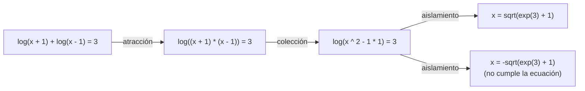

# Capítulo 43 — Proyecto: resolver ecuaciones

Resolver una ecuación `Izq = Der` en una incógnita `x` es transformarla,
con pasos que conservan sus soluciones, hasta llegar a `x = E`, con `E` sin
`x`. La tarea es simbólica: la ecuación es un término, y cada paso es una
reescritura de ese término. Este capítulo construye un programa que la hace
con cuatro métodos que se prueban en orden, como los aplica quien estudia
álgebra: el **aislamiento**, cuando la incógnita aparece una sola vez; la
**colección**, que reduce la cantidad de apariciones; la **atracción**, que
las acerca entre sí; y el método del **polinomio**, que lleva la ecuación a
una forma normal. Cuando ningún método simbólico da una solución, el
programa busca raíces numéricas con el **método de Newton**.


Dos páginas de una copia de 1342 del *Compendio de cálculo por restauración y
oposición* de al-Juarismi (siglo IX), con las soluciones geométricas de dos
ecuaciones cuadráticas. *Al-jabr*, la «restauración», pasa un término al otro
lado de la ecuación, el paso que el aislamiento repite en cada nivel; de esa
palabra viene «álgebra». Imagen: Muhammad ibn Musa al-Juarismi, Bodleian
Libraries (MS. Huntington 214, fol. 4v–5r), dominio público
([PD-Art](https://commons.wikimedia.org/wiki/Template:PD-Art)), vía
[Wikimedia Commons](https://commons.wikimedia.org/wiki/File:Bodleian_MS._Huntington_214_roll332_frame36.jpg).

Una ecuación que necesita tres de esos métodos, uno detrás de otro, recorre
este camino; cada flecha es un método, y la última solución se descarta al
comprobarla en la ecuación original:



El programa crece en cinco versiones, una por sección, y cada una termina con
una ecuación que no puede resolver y que motiva la siguiente. Reutiliza, sin
copiarlos, el simplificador, `apariciones/3`, `evaluar/3` y `derivar/3` del
[capítulo 32](../capitulo-32-inspeccion-de-terminos/index.md); escribe las reglas de colección y de atracción como datos que
`term_expansion/2`, del [capítulo 35](../capitulo-35-transformacion-de-programas-y-compilacion/index.md), convierte en cláusulas al cargarlas; y
usa como forma normal de un polinomio la suma asociada a izquierda que el
ejercicio 16 del [capítulo 34](../capitulo-34-estructuras-incompletas-y-listas-diferencia/index.md) construye. Cumple así los anuncios de esos
tres capítulos. Todos los archivos del capítulo son módulos que cargan otros
módulos, y por eso se ejecutan en una instalación local, no en SWISH.

El proyecto parte de cuatro libros. El capítulo «An Equation Solver», el 23,
de *The Art of Prolog* de Leon Sterling y Ehud Shapiro
([edición de acceso abierto](https://archive.org/details/artofprologadvan00ster)),
presenta una versión simplificada de PRESS, el programa de Alan Bundy y Bob
Welham en Edimburgo: de él vienen la idea de probar los métodos en orden, la
posición de la incógnita como una lista de números de argumento, los axiomas
de aislamiento con una solución por axioma, la forma normal de un polinomio
como lista de coeficientes y grados, y los métodos de factorización y de
homogeneización que los ejercicios agregan. La colección y la atracción son
otros dos métodos de PRESS, descritos en el artículo de Bundy y Welham (1981)
y en la presentación de PRESS de Sterling, Bundy, Byrd, O'Keefe y Silver
(1982), que Sterling y Shapiro citan; la homogeneización del ejercicio 7
sigue a Bundy y Silver (1981). El capítulo «Case Study: Term Rewriting», el
sexto, de *Clause and Effect* de William Clocksin aporta la etapa de forma normal
antes de reescribir: llevar la negación hacia adentro y dejar la
simplificación a un paso separado. El apartado 7.11, «Symbolic
Differentiation», de *Programming in Prolog* de Clocksin y Mellish, es el
origen de la derivada que el [capítulo 32](../capitulo-32-inspeccion-de-terminos/index.md) escribió y que el método de Newton
usa. El apartado 7.13, «Solving equations numerically», de *Prolog
Programming in Depth* de Michael Covington
([PDF del autor](https://www.covingtoninnovations.com/books/PPID.pdf)) resuelve
ecuaciones buscando un cero de `Izq - Der` y enumera las formas en que esa
búsqueda falla. Los programas del capítulo están escritos para el curso.

## Objetivos del capítulo

Al terminar el capítulo, el lector puede:

- representar una ecuación como un término y resolverla con reescrituras que
  conservan sus soluciones;
- aislar una incógnita que aparece una vez, con su posición como una lista de
  números de argumento y un axioma por operación;
- escribir reglas de reescritura como datos, cargarlas como cláusulas con
  `term_expansion/2` y aplicarlas a un subtérmino cualquiera;
- asegurar que una cadena de reescrituras termina con una medida que cada
  paso debe reducir: la cantidad de apariciones o la distancia entre ellas;
- llevar un polinomio a una forma normal con pares, `keysort/2` y
  `group_pairs_by_key/2`, y resolver los de grado 1 y 2;
- usar el método de Newton como respaldo numérico, y comprobar cada
  solución en la ecuación original;
- extender el programa con axiomas, reglas y métodos nuevos sin modificar
  sus archivos;
- agregar métodos de PRESS que trabajan sobre la forma de la ecuación: la
  homogeneización, el intercambio de funciones, el emparejamiento
  conmutativo, los intervalos y las desigualdades.

!!! info "Tiempo estimado"
    Leer el capítulo, ejecutar sus ejemplos y hacer las actividades: **1:30 h**.
    Resolver los 5 ejercicios marcados con ★: **1:35 h**.
    Resolver los 14 ejercicios del final: **4:20 h**.

## 43.1 El programa terminado

La versión final está en `ecuaciones.pl`. `resolver(Ecuacion, X, Solucion)`
da una solución por respuesta, y `valores(Ecuacion, X, Vs)` los valores
numéricos de las que cumplen la ecuación original:

<!-- ejemplo: capitulo-43/ecuaciones.pl predicado: resolver/3 -->
```prolog
%!  resolver(+Ecuacion, +X:atom, -Solucion) is nondet.
%
%   Solucion es X = E, una solución de la Ecuacion cerrada en la
%   incógnita X: E sin X, si la da un método simbólico; si ninguno la da,
%   E es un número, una raíz hallada con el método de Newton.
resolver(Ecuacion, X, Solucion) :-
    (   resolver_simbolico(Ecuacion, X, Solucion)
    *-> true
    ;   resolver_numerico(Ecuacion, X, Solucion)
    ).
```

```prolog
?- resolver(1 - 2 * sin(x) = 0, x, S).
S = (x=asin(1/2)) ;
S = (x=pi-asin(1/2)) ;
false.

?- resolver(log(x + 1) + log(x - 1) = 3, x, S).
S = (x=sqrt(exp(3)+1)) ;
S = (x= -sqrt(exp(3)+1)) ;
false.

?- valores(log(x + 1) + log(x - 1) = 3, x, Vs).
Vs = [4.591899054115592].

?- resolver(x ^ 3 - 2 * x - 5 = 0, x, S).
S = (x=2.0945514815423265).

?- valores(x ^ 4 - 5 * x ^ 2 + 4 = 0, x, Vs).
Vs = [-2.0, -1, 1, 2.0].
```

`log/1` es el logaritmo natural. La primera ecuación se resuelve por
aislamiento, y sus dos respuestas son las dos soluciones del seno entre
$-\pi/2$ y $3\pi/2$. La segunda necesita atraer los dos logaritmos en uno
solo y colectar el producto que queda; da dos soluciones simbólicas, pero la
negativa no cumple la ecuación, porque el logaritmo de un número negativo no
tiene valor real, y `valores/3` la descarta. La tercera es un polinomio de
grado 3, que ningún método simbólico del programa resuelve: la respuesta es
numérica. La cuarta, de grado 4, también.

El programa está repartido en siete módulos, cada uno sobre los anteriores:

| Archivo | Sección | Agrega |
|---|---|---|
| `capitulo32.pl` | 43.2 | los predicados del [capítulo 32](../capitulo-32-inspeccion-de-terminos/index.md), cargados en un módulo |
| `aislar.pl` | 43.2 | versión 1: la posición de la incógnita y el aislamiento |
| `reescribir.pl` | 43.3 | la notación de las reglas y su aplicación a un subtérmino |
| `colectar.pl` | 43.3 | versión 2: la colección |
| `atraer.pl` | 43.4 | versión 3: la atracción |
| `polinomio.pl` | 43.5 | versión 4: la forma normal y el polinomio |
| `ecuaciones.pl` | 43.6 | versión 5: Newton y la comprobación |

## 43.2 Versión 1: el aislamiento

Los archivos del [capítulo 32](../capitulo-32-inspeccion-de-terminos/index.md) no son módulos, y dos de ellos definen
`simplificar/2` de dos formas distintas: `simplificar.pl`, el de la
[sección 32.7](../capitulo-32-inspeccion-de-terminos/index.md#327-un-simplificador-de-expresiones), y `soluciones_simplificar.pl`, que agrega las reglas del
ejercicio 11 y define `derivar/3`. Cargarlos juntos reemplazaría una
definición por la otra. `capitulo32.pl` los carga en módulos separados con
`load_files/2` y el nombre del módulo delante del archivo, `Modulo:Archivo`,
que carga en ese módulo un archivo que no declara el suyo:

<!-- ejemplo: capitulo-43/capitulo32.pl fragmento: :- module(capitulo32, .. derivadas32:derivar(E, X, D). -->
```prolog
:- module(capitulo32,
          [ simplificar/2,
            apariciones/3,
            derivar/3,
            evaluar/3
          ]).

:- load_files(capitulo32:'../capitulo-32/simplificar', []).
:- load_files(capitulo32:'../capitulo-32/soluciones', []).
:- load_files(derivadas32:'../capitulo-32/soluciones_simplificar', []).

%!  derivar(+E, +X:atom, -D) is det.
%
%   D es la derivada simplificada de la expresión cerrada E respecto de X,
%   calculada por derivar/3 del capítulo 32: E usa +, -, * y ^ con
%   exponente numérico, y cualquier otra operación produce un error de
%   dominio.
derivar(E, X, D) :-
    derivadas32:derivar(E, X, D).
```

Una ecuación es un término `Izq = Der` y la incógnita es un átomo. Si la
incógnita aparece una sola vez, su **posición** es la lista de números de
argumento que lleva de la ecuación hasta ella. `posicion/3` la calcula con
`arg/3`, que con el número libre recorre los argumentos:

<!-- ejemplo: capitulo-43/aislar.pl predicado: posicion/3 -->
```prolog
%!  posicion(+S, +T, -Camino:list(integer)) is nondet.
%
%   Camino es la lista de números de argumento que lleva de T a un
%   subtérmino idéntico (==) a S. Hay una respuesta por aparición.
posicion(S, T, []) :-
    T == S.
posicion(S, T, [N|Camino]) :-
    compound(T),
    arg(N, T, A),
    posicion(S, A, Camino).
```

```prolog
?- posicion(x, 1 - 2 * sin(x) = 0, P).
P = [1, 2, 2, 1] ;
false.
```

El primer número dice de qué lado está la incógnita: el lado 1, el
izquierdo. Los siguientes dicen qué argumento seguir en cada nivel: el 2 de
`1 - 2 * sin(x)`, el 2 de `2 * sin(x)` y el 1 de `sin(x)`. Cada número elige
un **axioma de aislamiento**, que pasa al lado derecho la operación de la
raíz del lado izquierdo, con su inversa:

<!-- ejemplo: capitulo-43/aislar.pl predicado: axioma/3 -->
```prolog
%!  axioma(+N:integer, +Ecuacion0, -Ecuacion) is nondet.
%
%   Ecuacion es equivalente a Ecuacion0, con la operación de la raíz del
%   lado izquierdo pasada al lado derecho; la incógnita está en el
%   argumento N de esa operación. Hay una respuesta por cada solución que
%   el axioma separa. Es multifile: otro archivo puede agregar axiomas.
axioma(1, -U = W, U = -W).
axioma(1, U + V = W, U = W - V).
axioma(2, U + V = W, V = W - U).
axioma(1, U - V = W, U = W + V).
axioma(2, U - V = W, V = U - W).
axioma(1, U * V = W, U = W / V) :-
    V \== 0.
axioma(2, U * V = W, V = W / U) :-
    U \== 0.
axioma(1, U ^ 2 = W, U = sqrt(W)).
axioma(1, U ^ 2 = W, U = -sqrt(W)).
axioma(1, U ^ N = W, U = W ^ (1 / N)) :-
    N \== 2.
axioma(2, A ^ U = W, U = log(W) / log(A)).
axioma(1, sqrt(U) = W, U = W ^ 2).
axioma(1, exp(U) = W, U = log(W)).
axioma(1, log(U) = W, U = exp(W)).
axioma(1, sin(U) = W, U = asin(W)).
axioma(1, sin(U) = W, U = pi - asin(W)).
axioma(1, cos(U) = W, U = acos(W)).
axioma(1, cos(U) = W, U = -acos(W)).
axioma(1, tan(U) = W, U = atan(W)).
```

Las operaciones son funciones de `is/2`: `sin/1`, `cos/1` y `tan/1` toman el
ángulo en radianes, y `asin/1`, `acos/1` y `atan/1`, sus inversas, dan un
solo valor; `acos(0)` vale π/2.

Tres detalles de los axiomas. El primer argumento es el número del argumento
que contiene la incógnita, y por eso la resta y el producto tienen un axioma
por argumento. Un axioma que divide exige que el divisor no sea 0, porque
dividir por 0 no es una transformación que conserve las soluciones. Y una
operación cuya inversa tiene más de un valor, como `sin/1`, `cos/1` o el
cuadrado, tiene un axioma por solución: el retroceso da las dos. El
aislamiento orienta la ecuación con la incógnita a la izquierda y aplica un
axioma por cada número de la posición:

<!-- ejemplo: capitulo-43/aislar.pl predicado: aislar/3 orientar/3 aislar_camino/3 -->
```prolog
%!  aislar(+Ecuacion, +X:atom, -Solucion) is nondet.
%
%   Solucion es la Ecuacion con X, que aparece una sola vez, aislada a la
%   izquierda. Falla si X no aparece o aparece más de una vez.
aislar(Ecuacion, X, Solucion) :-
    apariciones(Ecuacion, X, 1),
    posicion(X, Ecuacion, [Lado|Camino]),
    orientar(Lado, Ecuacion, Ecuacion1),
    aislar_camino(Camino, Ecuacion1, Solucion).

%!  orientar(+Lado:integer, +Ecuacion, -Orientada) is det.
%
%   Orientada es la Ecuacion con el lado número Lado a la izquierda.
orientar(1, Izq = Der, Izq = Der).
orientar(2, Izq = Der, Der = Izq).

%!  aislar_camino(+Camino:list(integer), +Ecuacion, -Aislada) is nondet.
%
%   Aislada resulta de aplicar a la Ecuacion un axioma por cada número de
%   Camino, la posición de la incógnita en el lado izquierdo.
aislar_camino([], Ecuacion, Ecuacion).
aislar_camino([N|Camino], Ecuacion0, Ecuacion) :-
    axioma(N, Ecuacion0, Ecuacion1),
    aislar_camino(Camino, Ecuacion1, Ecuacion).
```

`resolver/3` verifica los argumentos, aísla y simplifica el resultado con el
simplificador del [capítulo 32](../capitulo-32-inspeccion-de-terminos/index.md):

<!-- ejemplo: capitulo-43/aislar.pl predicado: resolver/3 -->
```prolog
%!  resolver(+Ecuacion, +X:atom, -Solucion) is nondet.
%
%   Solucion es X = E, con E sin X, una solución de la Ecuacion cerrada
%   Izq = Der en la incógnita X, simplificada. Hay una respuesta por
%   solución; falla si X no aparece exactamente una vez.
resolver(Ecuacion, X, X = E) :-
    must_be(ground, Ecuacion),
    must_be(atom, X),
    aislar(Ecuacion, X, X = E0),
    simplificar(E0, E).
```

```prolog
?- resolver(1 - 2 * sin(x) = 0, x, S).
S = (x=asin(1/2)) ;
S = (x=pi-asin(1/2)) ;
false.

?- resolver(3 * x + 2 = 11, x, S).
S = (x=9/3) ;
false.

?- resolver(2 ^ (x + 1) = 16, x, S).
S = (x=log(16)/log(2)-1) ;
false.
```

La solución de la primera ecuación pasa por `2 * sin(x) = 1 - 0`,
`sin(x) = (1 - 0) / 2` y `x = asin((1 - 0) / 2)`; el simplificador reduce
`1 - 0`, pero no tiene reglas para `/`, y `9 / 3` queda sin evaluar. La
solución es una expresión, no un número: `x = 9/3` es exacta, y su valor se
obtiene con `is/2` cuando hace falta.

!!! question "Actividad"
    Predecir la posición de `x` en `2 ^ (x + 1) = 16` y la secuencia de
    ecuaciones por la que pasa el aislamiento, y cuántas respuestas da
    `resolver(cos(x) = 1, x, S)`. Comprobarlo, y explicar por qué las dos
    respuestas de la segunda tienen el mismo valor.

El aislamiento exige una sola aparición:

```prolog
?- resolver(2 * x + 3 * x = 10, x, S).
false.

?- posicion(x, 2 * x + 3 * x = 10, P).
P = [1, 1, 2] ;
P = [1, 2, 2] ;
false.
```

Con dos apariciones hay dos posiciones, y aislar una deja la otra del lado
derecho. Hace falta un método que reduzca las apariciones antes de aislar.

## 43.3 Versión 2: reglas de reescritura y colección

La **colección** reescribe un subtérmino de la ecuación en otro con menos
apariciones de la incógnita: `U * W + V * W` pasa a ser `(U + V) * W` cuando
`W` contiene la incógnita y `U` y `V` no. Cada regla es un par de patrones y
una condición sobre qué contiene la incógnita. Escritas como cláusulas, las
reglas repiten la incógnita como argumento en cada condición; escritas como
datos, se leen como en un libro de álgebra. `reescribir.pl` define la
notación `Izq ~> Der si Condicion`, donde `con(T)` exige que `T` contenga la
incógnita y `libre(T)` que no, y el predicado que la convierte en una
cláusula de `regla/3`, con la incógnita como primer argumento:

<!-- ejemplo: capitulo-43/reescribir.pl predicado: expandir_regla/2 condicion/3 -->
```prolog
%!  expandir_regla(+Regla, -Clausula) is semidet.
%
%   Clausula es la cláusula de regla/3 que corresponde a la Regla, escrita
%   Izq ~> Der si Condicion o Izq ~> Der. Falla con cualquier otro término.
expandir_regla((Izq ~> Der si Condicion), (regla(X, Izq, Der) :- Cuerpo)) :-
    condicion(Condicion, X, Cuerpo).
expandir_regla((Izq ~> Der), regla(_, Izq, Der)).

%!  condicion(+Condicion, ?X, -Cuerpo) is det.
%
%   Cuerpo es la Condicion con la incógnita X agregada a con/1 y libre/1.
condicion((A, B), X, (CA, CB)) :-
    !,
    condicion(A, X, CA),
    condicion(B, X, CB).
condicion(con(T), X, con(X, T)) :-
    !.
condicion(libre(T), X, libre(X, T)) :-
    !.
condicion(Objetivo, _, Objetivo).
```

Los operadores `~>` y `si` se exportan con el módulo, como en la
[sección 24.2](../capitulo-24-modulos-y-organizacion/index.md#242-module2-y-use_module12): quien carga `reescribir.pl` puede leer las reglas.
`colectar.pl` define `term_expansion/2` con `expandir_regla/2`, y como un
gancho definido en un módulo vale solo para ese módulo
([sección 35.1](../capitulo-35-transformacion-de-programas-y-compilacion/index.md#351-term_expansion2-y-goal_expansion2-en-swi-prolog)), las reglas que siguen se cargan como
cláusulas y el resto del programa no se ve afectado:

<!-- ejemplo: capitulo-43/colectar.pl fragmento: term_expansion(Regla, Clausula) :- .. (W + U) * (W - U) -->
```prolog
term_expansion(Regla, Clausula) :-
    expandir_regla(Regla, Clausula).

% regla(X, Izq, Der): las reglas de abajo, cargadas como cláusulas. Es
% multifile: otro archivo puede agregar reglas.
:- multifile regla/3.

W * W ~> W ^ 2 si con(W).
U * W + V * W ~> (U + V) * W si con(W), libre(U), libre(V).
W * U + W * V ~> W * (U + V) si con(W), libre(U), libre(V).
U * W - V * W ~> (U - V) * W si con(W), libre(U), libre(V).
U * W + W ~> (U + 1) * W si con(W), libre(U).
W + W ~> 2 * W si con(W).
(W + U) * (W - U) ~> W ^ 2 - U * U si con(W), libre(U).
```

```prolog
?- listing(colectar:regla(_, _ * _, _)).
:- multifile regla/3.

regla(A, W*W, W^2) :-
    con(A, W).
regla(A, (W+U)*(W-U), W^2-U*U) :-
    con(A, W),
    libre(A, U).

true.
```

La cabeza de cada cláusula es el patrón de la regla, y la indexación elige
las reglas por su primer argumento distinto. `regla/3` es `multifile` para
que otro archivo agregue reglas sin modificar este. Una regla se aplica a
un subtérmino cualquiera: `reescribir/4` prueba la raíz y después cada
argumento, con el recorrido del [Patrón 43](../patrones.md#43-recorrido-generico-de-un-termino):

<!-- ejemplo: capitulo-43/reescribir.pl predicado: reescribir/4 -->
```prolog
%!  reescribir(:Regla, +X:atom, +E0, -E) is nondet.
%
%   E es E0 con un subtérmino reescrito por call(Regla, X, S0, S): primero
%   la raíz, después cada argumento de izquierda a derecha. Hay una
%   respuesta por cada subtérmino y cada regla que se aplica.
reescribir(Regla, X, E0, E) :-
    call(Regla, X, E0, E).
reescribir(Regla, X, E0, E) :-
    compound(E0),
    compound_name_arguments(E0, Nombre, Args0),
    append(Antes, [A0|Despues], Args0),
    reescribir(Regla, X, A0, A),
    append(Antes, [A|Despues], Args),
    compound_name_arguments(E, Nombre, Args).
```

Una regla puede aplicarse y no reducir nada: `U * W + V * W` con `W` sin la
incógnita, o una regla mal escrita que la aumenta. `colectar/3` acepta la
primera reescritura que reduce la cantidad de apariciones, y es esa
condición la que garantiza que la colección termina: la cantidad es un
número natural que baja en cada paso. El despachador aísla si queda una
aparición, y si no, colecta y vuelve a empezar:

<!-- ejemplo: capitulo-43/colectar.pl predicado: colectar/3 resolver_/3 -->
```prolog
%!  colectar(+Ecuacion0, +X:atom, -Ecuacion) is semidet.
%
%   Ecuacion resulta de reescribir un subtérmino de Ecuacion0 con la
%   primera regla de colección que reduce las apariciones de X.
colectar(Ecuacion0, X, Ecuacion) :-
    apariciones(Ecuacion0, X, N0),
    once(( reescribir(regla, X, Ecuacion0, Ecuacion),
           apariciones(Ecuacion, X, N),
           N < N0 )).

%!  resolver_(+Ecuacion, +X:atom, -Solucion) is nondet.
%
%   Como resolver/3, sin verificar los argumentos ni simplificar: aísla
%   la incógnita si aparece una vez, y si no, colecta y vuelve a empezar.
resolver_(Ecuacion, X, Solucion) :-
    (   apariciones(Ecuacion, X, 1)
    ->  aislar(Ecuacion, X, Solucion)
    ;   colectar(Ecuacion, X, Ecuacion1)
    ->  resolver_(Ecuacion1, X, Solucion)
    ).
```

```prolog
?- colectar(2 * sin(x) + 3 * sin(x) = 1, x, E).
E = ((2+3)*sin(x)=1).

?- resolver(2 * sin(x) + 3 * sin(x) = 1, x, S).
S = (x=asin(1/5)) ;
S = (x=pi-asin(1/5)) ;
false.

?- resolver(2 * x + 3 * x = 10, x, S).
S = (x=10/5) ;
false.
```

!!! example "Patrón 56 — Medida que decrece"
    **Problema.** Un programa aplica reglas de reescritura una tras otra
    hasta que ninguna se aplica, y hay que asegurar que esa cadena termina,
    aunque las reglas sean datos que otro archivo puede ampliar.

    **Versión ingenua.** Aceptar cualquier reescritura que se aplique. Con
    una regla y su inversa, como `W * W ~> W ^ 2` y `W ^ 2 ~> W * W`, el
    término vuelve a su forma anterior y la cadena no termina (el
    ejercicio 3 lo muestra).

    **Patrón.** Una medida que asigna un número natural a cada término, y
    cada paso se acepta solo si la reduce: `colectar/3` compara las
    apariciones de la incógnita antes y después, y descarta la reescritura
    que no las baja. Como no hay una cadena infinita de naturales
    decrecientes, la cadena de reescrituras termina, cualquiera que sea el
    conjunto de reglas. Cuando un método no puede bajar la primera medida
    usa una segunda, sin aumentar la primera: la atracción de la
    [sección 43.4](#434-version-3-la-atraccion) baja la distancia entre las
    apariciones.

    **Cuándo no usarlo.** Cuando el paso necesario aumenta toda medida
    sencilla, como distribuir un producto: entonces conviene un cálculo
    recursivo sobre la estructura del término, como la forma normal de la
    [sección 43.5](#435-version-4-la-forma-normal-de-un-polinomio). Y
    cuando el proceso es numérico, como el método de Newton de la
    [sección 43.6](#436-version-5-el-metodo-de-newton-y-la-comprobacion):
    ahí no hay un natural que baje, y lo que asegura el final es una cota
    de pasos y una tolerancia.

Hay ecuaciones en las que ninguna regla de colección se aplica, aunque la
incógnita aparezca solo dos veces:

```prolog
?- resolver(log(x + 1) + log(x - 1) = 3, x, S).
false.
```

Las dos apariciones están en logaritmos distintos, y ningún patrón
de colección abarca los dos.

## 43.4 Versión 3: la atracción

La **atracción** no reduce las apariciones: las acerca. `log(U) + log(V)`
pasa a ser `log(U * V)`, y las dos apariciones quedan bajo un mismo producto,
donde una regla de colección puede alcanzarlas. La medida que cada paso debe
reducir es la **distancia**: la suma de las profundidades de las apariciones,
medidas desde el menor subtérmino que las contiene a todas. Ese subtérmino
está en el prefijo común de sus posiciones:

<!-- ejemplo: capitulo-43/atraer.pl predicado: distancia/3 prefijo_comun/3 profundidad_bajo/4 -->
```prolog
%!  distancia(+E, +X:atom, -D:integer) is semidet.
%
%   D es la suma de las profundidades de las apariciones de X en E,
%   medidas desde el menor subtérmino que las contiene a todas. Falla si
%   X no aparece en E.
distancia(E, X, D) :-
    findall(P, posicion(X, E, P), [P1|Ps]),
    foldl(prefijo_comun, Ps, P1, Comun),
    length(Comun, L),
    foldl(profundidad_bajo(L), [P1|Ps], 0, D).

%!  prefijo_comun(+P:list, +Q:list, -R:list) is det.
%
%   R es el prefijo más largo común a P y Q.
prefijo_comun([A|P], [B|Q], R) :-
    A == B,
    !,
    R = [A|R1],
    prefijo_comun(P, Q, R1).
prefijo_comun(_, _, []).

%!  profundidad_bajo(+L:integer, +P:list, +D0:integer, -D:integer) is det.
%
%   D es D0 más la longitud de P menos L.
profundidad_bajo(L, P, D0, D) :-
    length(P, N),
    D is D0 + N - L.
```

```prolog
?- distancia(log(x + 1) + log(x - 1) = 3, x, D).
D = 6.

?- distancia(log((x + 1) * (x - 1)) = 3, x, D).
D = 4.
```

Son las cifras de la descripción de PRESS de Sterling, Bundy, Byrd, O'Keefe
y Silver (1982), que mide la distancia en arcos del árbol de la expresión:
seis entre las dos apariciones de `log(x + 1) + log(x - 1)` y cuatro
después de la atracción.

Las reglas de atracción usan la misma notación, cargadas en `atraer.pl`; el
despachador prueba aislar, colectar y atraer, en ese orden:

<!-- ejemplo: capitulo-43/atraer.pl fragmento: log(U) + log(V) .. A ^ U * A ^ V -->
```prolog
log(U) + log(V) ~> log(U * V) si con(U), con(V).
exp(U) * exp(V) ~> exp(U + V) si con(U), con(V).
A ^ U * A ^ V ~> A ^ (U + V) si libre(A), con(U), con(V).
```

<!-- ejemplo: capitulo-43/atraer.pl predicado: atraer/3 resolver_/3 -->
```prolog
%!  atraer(+Ecuacion0, +X:atom, -Ecuacion) is semidet.
%
%   Ecuacion resulta de reescribir un subtérmino de Ecuacion0 con la
%   primera regla de atracción que reduce la distancia entre las
%   apariciones de X.
atraer(Ecuacion0, X, Ecuacion) :-
    distancia(Ecuacion0, X, D0),
    once(( reescribir(regla, X, Ecuacion0, Ecuacion),
           distancia(Ecuacion, X, D),
           D < D0 )).

%!  resolver_(+Ecuacion, +X:atom, -Solucion) is nondet.
%
%   Como resolver/3, sin verificar los argumentos ni simplificar: aísla,
%   colecta o atrae, en ese orden, y después de colectar o de atraer
%   vuelve a empezar.
resolver_(Ecuacion, X, Solucion) :-
    (   apariciones(Ecuacion, X, 1)
    ->  aislar(Ecuacion, X, Solucion)
    ;   colectar(Ecuacion, X, Ecuacion1)
    ->  resolver_(Ecuacion1, X, Solucion)
    ;   atraer(Ecuacion, X, Ecuacion1)
    ->  resolver_(Ecuacion1, X, Solucion)
    ).
```

```prolog
?- atraer(log(x + 1) + log(x - 1) = 3, x, E).
E = (log((x+1)*(x-1))=3).

?- resolver(log(x + 1) + log(x - 1) = 3, x, S).
S = (x=sqrt(exp(3)+1)) ;
S = (x= -sqrt(exp(3)+1)) ;
false.
```

Después de la atracción, la regla `(W + U) * (W - U) ~> W ^ 2 - U * U` de la
colección deja una sola aparición, `log(x ^ 2 - 1 * 1) = 3`, y el
aislamiento termina. La cadena termina por las dos medidas juntas: la
colección baja las apariciones, y la atracción baja la distancia sin
aumentar las apariciones.

!!! question "Actividad"
    Predecir, antes de ejecutarlo, qué hace `resolver/3` de `atraer.pl` con
    `exp(x) * exp(x + 2) = 5`: qué regla se aplica primero, qué ecuación
    queda y si alguna regla de colección puede seguir desde ahí. Comprobarlo
    con `atraer/3` y `colectar/3` paso por paso.

La segunda solución, $-\sqrt{e^3 + 1}$, no cumple la ecuación original: el
logaritmo de $x - 1$ no tiene valor real para un $x$ negativo. Los axiomas
conservan las soluciones reales pero pueden agregar otras, porque
`log(U) + log(V) = log(U * V)` vale solo si U y V son positivos. La
versión 5 comprueba cada solución. Queda además lo que la atracción no
alcanza:

```prolog
?- resolver(2 ^ x * 2 ^ (x + 1) = 32, x, S).
false.

?- resolver(x ^ 2 - 3 * x + 2 = 0, x, S).
false.
```

La primera se atrae en `2 ^ (x + (x + 1)) = 32`, pero `x + (x + 1)` no
coincide con ningún patrón de colección, que no conocen la asociatividad.
La segunda es un polinomio: `x ^ 2` y `3 * x` no tienen una forma común que
una regla pueda colectar.

## 43.5 Versión 4: la forma normal de un polinomio

Un polinomio en `x` con coeficientes numéricos tiene una **forma normal**:
la lista de sus monomios `Grado-Coeficiente`, de mayor a menor grado, uno
por grado, sin coeficientes nulos. La página
[La forma normal de un polinomio](forma-normal.md#la-forma-normal-de-un-polinomio)
la construye en tres pasos: la resta y el signo menos pasan a los
coeficientes, los productos y las potencias se distribuyen, y los monomios
del mismo grado se suman con `keysort/2` y `group_pairs_by_key/2`; después
la escribe como una suma asociada a izquierda. La forma normal da dos
métodos: la fórmula de los polinomios de grado 1 y 2, que resuelve
`x ^ 2 - 3 * x + 2 = 0`, y una colección general, que lleva a forma normal
cada subtérmino polinómico si eso reduce las apariciones y resuelve
`2 ^ x * 2 ^ (x + 1) = 32` a través de `2 ^ (2 * x + 1) = 32`. La versión 4
no resuelve `x ^ 3 - 2 * x - 5 = 0`: el método del polinomio no alcanza el
grado 3.

## 43.6 Versión 5: el método de Newton y la comprobación

Para lo que ningún método simbólico resuelve, el **método de Newton** busca
un cero de $\mathit{Izq} - \mathit{Der}$ desde varios valores iniciales, con
`derivar/3` y `evaluar/3` del [capítulo 32](../capitulo-32-inspeccion-de-terminos/index.md). La página
[El método de Newton y la comprobación](newton.md#el-metodo-de-newton-y-la-comprobacion)
lo escribe, describe las tres formas en que falla, y agrega `valores/3`, que
calcula el valor de cada solución y conserva las que cumplen la ecuación
original: la comprobación que la versión 3 necesitaba. Es la versión que la
[sección 43.1](#431-el-programa-terminado) muestra funcionando. Queda lo que
`derivar/3` no deriva: `cos(x) = x` tiene una raíz cerca de 0.739, pero la
versión 5 no la encuentra; el ejercicio 9 amplía la derivada, y el
[capítulo 46](../capitulo-46-proyecto-metodos-numericos/index.md) desarrolla métodos que no la necesitan.

Las secciones 43.7 a 43.11 agregan cinco partes de PRESS que las versiones
anteriores no tienen. Cada una es un módulo propio que carga la versión 5,
y todas están en la página
[Más métodos de PRESS](press.md#mas-metodos-de-press).

## 43.7 La homogeneización trigonométrica

`trigonometria.pl` escribe una ecuación en senos y cosenos de `x` y de
`2 * x` como un polinomio en `sin(x)` o en `cos(x)`, con las identidades
del ángulo doble y del cuadrado, lo resuelve en una incógnita nueva y aísla
`x` en cada valor: es el tercer ejercicio de Sterling y Shapiro y el caso
trigonométrico de Bundy y Silver. La página la desarrolla en
[su sección](press.md#437-la-homogeneizacion-trigonometrica), que resuelve
`cos(2 * x) - sin(x) = 0`.

## 43.8 El intercambio de funciones

`intercambio.pl` aísla una raíz cuadrada como si fuera una incógnita y
eleva los dos lados al cuadrado, con la cantidad de raíces como medida que
decrece, y comprueba cada valor, porque el cuadrado agrega soluciones
espurias. Resuelve el ejemplo de la descripción de PRESS,
`sqrt(5 * x - 25) - sqrt(x - 1) = 2`, en
[su sección](press.md#438-el-intercambio-de-funciones).

## 43.9 El emparejamiento conmutativo

`emparejamiento.pl` prueba cada regla de colección también sobre las
variantes de un subtérmino con los operandos de sumas y productos
intercambiados, una parte del emparejador de Borning y Bundy (1981), y
resuelve `sin(x) * 2 + 3 * sin(x) = 1`, que la versión 5 no resuelve
([su sección](press.md#439-el-emparejamiento-conmutativo)).

## 43.10 Intervalos

`intervalos.pl` calcula el intervalo de valores de una expresión a partir
del intervalo de la incógnita, como el paquete de Bundy (1984) con que
PRESS comprueba las condiciones de sus reglas, y lo usa para probar que una
ecuación no tiene raíces en un intervalo y para encerrar las que tiene
([su sección](press.md#4310-intervalos)).

## 43.11 Desigualdades

`desigualdades.pl` aísla la incógnita en una desigualdad, con axiomas que
invierten el sentido al multiplicar o dividir por un número negativo y al
pasar un sustraendo al otro lado
([su sección](press.md#4311-desigualdades)).

!!! success "Criterios de calidad"
    | Criterio | En este capítulo |
    |---|---|
    | C1 | cada predicado declara modos y determinación; los axiomas y las reglas, que dan una respuesta por solución, son `nondet`, y los métodos que eligen una reescritura con `once/1` son `semidet` |
    | C3 | `resolver/3` elige el método con `->` en la condición, no después de la solución: con la solución ligada, comprueba (las pruebas `comprueba` de `aislar.plt` y `colectar.plt`) |
    | C5 | una ecuación o una incógnita sin instanciar producen un error de instanciación en cada versión; una operación que `derivar/3` no deriva produce un error de dominio que el respaldo numérico captura con nombre, y un valor no real, un error de evaluación que `valores/3` captura |
    | C6 | todo el programa es puro salvo los ganchos de carga (`term_expansion/2`) y las cláusulas `multifile` que los ejercicios agregan |
    | C7 | 208 pruebas en doce archivos; los resultados numéricos se comparan con una tolerancia, y lo que no termina se prueba con `call_with_inference_limit/3` |

## Ejercicios

Las soluciones están en [la página de soluciones](soluciones.md). La dificultad
va de 1 (se resuelve consultando el capítulo) a 3 (requiere elaboración propia).
Los marcados con ★ son los que no conviene saltear: cubren lo que el capítulo
tiene de propio, y los capítulos siguientes los dan por hechos. Los
ejercicios que extienden el programa lo hacen desde un archivo propio, con
las cláusulas `multifile` de `axioma/3` y `regla/3`, o con un predicado que
prueba su método y usa `resolver/3` si no se aplica.

1. ★ **(1)** Con `aislar.pl` cargado, predecir la posición de `x`, la
   secuencia de axiomas y las respuestas de `resolver/3` para cada ecuación,
   y comprobarlas: `3 - x = 1` · `cos(2 * x) = 0` · `x ^ 3 = 8` ·
   `x * (x + 1) = 2` · `x / 2 = 5`.
2. **(1)** Agregar a `axioma/3` los axiomas del cociente, uno por argumento,
   y resolver `x / 2 = 5` y `12 / x = 4`. ¿Qué condición necesita el axioma
   del divisor, y qué ecuación la hace necesaria?
3. ★ **(2)** Agregar a las reglas de colección `W ^ 2 ~> W * W si con(W)`.
   Predecir qué hace `resolver/3` de `colectar.pl` con `x * x + x = 6`, y
   explicar por qué la regla nueva nunca se acepta. Escribir después
   `colectar_sin_medida/3`, igual a `colectar/3` sin comparar las
   apariciones, y el despachador que la usa, y mostrar con
   `call_with_inference_limit/3` que no termina.
4. **(2)** Agregar a la colección las reglas que suman exponentes de una
   misma base, `W ^ M * W ^ N` y `W ^ N * W` (en los dos órdenes), y la que
   colecta `W + U * W`. Resolver con `colectar.pl` `sin(x) ^ 2 * sin(x) =
   0.125`, `x ^ 2 * x ^ 3 = 32` y `x + 2 * x = 6`.
5. ★ **(2)** Agregar a la atracción `exp(U) / exp(V) ~> exp(U - V)` y la
   regla del cociente de dos potencias de la misma base. Predecir qué dan
   `resolver/3` y `valores/3` de `ecuaciones.pl` para
   `exp(2 * x) / exp(x) = 5` y para `3 ^ (x + 2) / 3 ^ x = 9`, y explicar la
   segunda: ¿qué ecuación queda, y cuáles son sus soluciones?
6. **(2)** Escribir `resolver_factores/3`, el método de factorización de
   Sterling y Shapiro: una ecuación `A * B = 0` se cumple si un factor que
   contiene la incógnita vale 0. Resolver `cos(x) * (1 - 2 * sin(x)) = 0` y
   `x * (x ^ 2 - 4) = 0`, que `resolver/3` no resuelve o resuelve con
   Newton.
7. ★ **(3)** Escribir `resolver_homogeneo/3`, la homogeneización: si todas
   las potencias con la incógnita en el exponente tienen la misma base `B` y
   un exponente `C * x + D` con `C` entero positivo, reemplazar cada una por
   `B ^ D * u ^ C`, resolver el polinomio en `u` y después `B ^ x = u`.
   Resolver `2 ^ (2 * x) - 5 * 2 ^ (x + 1) + 16 = 0`. Usar
   `forma_normal/3` para leer el exponente.
8. **(2)** Escribir `resolver_bicuadrada/3`: un polinomio de grado mayor que
   2 con todos los grados pares se resuelve como un polinomio en `u = x ^ 2`.
   Resolver `x ^ 4 - 5 * x ^ 2 + 4 = 0` y comparar con las respuestas de
   Newton en la [sección 43.1](#431-el-programa-terminado).
9. ★ **(2)** Escribir `derivar_mas/3`, una derivada que agrega el cociente,
   el signo menos, `sin/1`, `cos/1`, `exp/1` y `log/1` a las reglas del
   [capítulo 32](../capitulo-32-inspeccion-de-terminos/index.md), y `resolver_mas/3`, que usa `resolver/3` y, si no da
   soluciones, las raíces de `raices/4` con esa derivada. Resolver
   `cos(x) = x` y `x + 1 = 1 / x`.
10. **(2)** Escribir `pasos_newton(F, X, X0, N, Xs)`: Xs son los primeros
    valores que recorre Newton desde X0, como máximo N pasos. Predecir y
    comprobar los pasos de `x ^ 3 - 2 * x + 2` desde 0 y desde 10, de
    `x ^ 2 + 1` desde 1 y de `x ^ 2 - 2` desde 0, y relacionar cada uno con
    las formas de fallar de la [sección 43.6](newton.md#el-metodo-de-newton-y-la-comprobacion).
11. **(2)** Escribir `sistema(E1, E2, X, Y, S)`, que resuelve dos ecuaciones
    en dos incógnitas por sustitución: despeja X de E1, con Y como una
    constante más, la reemplaza en E2 y resuelve en Y. Resolver
    `x + y = 3, x - y = 1` y `x + y = 5, x * y = 6`. ¿Qué pasa con la
    segunda si se escriben las ecuaciones en el otro orden?
12. **(3)** El aislamiento exige una sola aparición, pero puede aplicarse
    hasta el menor subtérmino que contiene todas. Escribir
    `aislar_parcial/3`, que aísla ese subtérmino como si fuera una
    incógnita, y un despachador que lo use. Agregar la atracción
    `sqrt(U) * sqrt(V) ~> sqrt(U * V)` y resolver
    `sqrt(x) * sqrt(x + 5) = 6`. ¿Cuál de las soluciones cumple la ecuación?
13. **(2)** Agregar a `desigualdades.pl`, desde un archivo propio, el axioma
    de la potencia de exponente natural impar, que es creciente y conserva el
    sentido. Resolver `x ^ 3 + 1 > -7` y `2 * x ^ 5 =< 64`, y explicar por
    qué la raíz de un número negativo necesita un caso aparte en `is/2`.
14. **(2)** Escribir `valores_en(Ecuacion, X, I, Vs)`: Vs son los valores
    de `valores/3` que están en el intervalo I, y si `sin_raices/3` prueba
    que la ecuación no tiene raíces en I, Vs es `[]` sin resolverla.
    Probarlo con `x ^ 2 - 2 = 0` en `i(0, 3)` y con `x ^ 2 + 1 = 0` en
    `i(-10, 10)`.

## Resumen

| | |
|---|---|
| **ecuación** | un término `Izq = Der`; resolverla en X es reescribirla hasta `X = E` con `E` sin X |
| **posición** | la lista de números de argumento que lleva de un término a un subtérmino |
| **aislamiento** | con una sola aparición, un axioma por nivel de la posición pasa la operación al otro lado |
| **colección** | una reescritura que reduce la cantidad de apariciones de la incógnita |
| **atracción** | una reescritura que acerca las apariciones: reduce su distancia |
| **distancia** | la suma de las profundidades de las apariciones bajo el menor subtérmino que las contiene |
| **forma normal de un polinomio** | la lista de monomios `Grado-Coeficiente`, de mayor a menor grado, sin nulos |
| **método de Newton** | $x_{n+1} = x_n - f(x_n)/f'(x_n)$ hasta que dos valores quedan cerca |
| **solución espuria** | una solución de una ecuación transformada que no cumple la original |
| `Izq ~> Der si Condicion` | una regla de reescritura como dato, cargada con `term_expansion/2` como una cláusula de `regla/3` |
| `load_files/2` | `load_files(Modulo:Archivo, [])` carga en `Modulo` un archivo que no declara un módulo propio |
| `sin/1`, `cos/1`, `tan/1`, `asin/1`, `acos/1`, `atan/1` | las funciones trigonométricas de `is/2`, en radianes, y sus inversas |
| `posicion/3`, `axioma/3`, `aislar/3` | la posición de la incógnita y el aislamiento |
| `expandir_regla/2`, `reescribir/4`, `con/2`, `libre/2` | las reglas como datos y su aplicación a un subtérmino |
| `colectar/3`, `atraer/3`, `distancia/3` | la colección y la atracción, con sus medidas |
| `forma_normal/3`, `polinomio_termino/3`, `normalizar/3` | la forma normal de un polinomio y su escritura como suma asociada a izquierda |
| `resolver_polinomio/3`, `colectar_normal/3` | los dos métodos que da la forma normal |
| `newton/4`, `raices/4`, `valores/3` | el respaldo numérico y la comprobación de las soluciones |
| `resolver/3` | el despachador de cada versión |
| **homogeneización** | escribir los términos que impiden que una ecuación sea algebraica como funciones de un término reducido, y cambiar la incógnita |
| **intercambio de funciones** | reemplazar una función por otra que los métodos manejan mejor: una raíz por un cuadrado |
| **aritmética de intervalos** | el intervalo de una expresión calculado con los extremos de los intervalos de sus argumentos |
| `resolver_trigonometrica/3`, `intercambiar/3`, `colectar_ac/3` | la homogeneización trigonométrica, el intercambio de la raíz cuadrada y la colección con conmutatividad |
| `intervalo/3`, `encerrar/5`, `resolver_desigualdad/3` | los intervalos y las desigualdades |
| **[Patrón 56](../patrones.md#56-medida-que-decrece)** | medida que decrece |

## Temas que se retoman

| Tema | Se retoma en |
|---|---|
| Bisección, secante y Newton; convergencia y tolerancia; el respaldo numérico de este capítulo | [capítulo 46](../capitulo-46-proyecto-metodos-numericos/index.md) |
| Coeficientes racionales exactos en lugar de números de punto flotante | [capítulo 47](../capitulo-47-proyecto-aritmetica-racional-matrices/index.md) |
| Reglas de reescritura locales sobre una lista de instrucciones: el optimizador de mirilla | [capítulo 45](../capitulo-45-proyecto-compilador/index.md) |
| Una forma normal obtenida por reescritura: la forma clausal | [capítulo 62](../capitulo-62-proyecto-demostrador-teoremas/index.md) |

## Referencias

- Leon Sterling y Ehud Shapiro, *The Art of Prolog: Advanced Programming
  Techniques*, 2.ª edición, MIT Press, 1994 — «An Equation Solver».
  [Edición en línea](https://archive.org/details/artofprologadvan00ster).
  El capítulo toma de allí la organización del programa: los métodos
  probados en orden, la posición de la incógnita como lista de números de
  argumento, los axiomas de aislamiento, la forma normal de un polinomio y
  los métodos de factorización y de homogeneización de los ejercicios, y la
  ecuación trigonométrica de su tercer ejercicio, que resuelve la
  [sección 43.7](#437-la-homogeneizacion-trigonometrica).
- Alan Bundy y Bob Welham, «Using meta-level inference for selective
  application of multiple rewrite rule sets in algebraic manipulation»,
  *Artificial Intelligence* 16, 1981, pp. 189–212.
  [Página de la editorial](https://doi.org/10.1016/0004-3702%2881%2990010-2).
  Describe PRESS; de allí vienen la colección y la atracción, y la idea de
  que cada reescritura reduzca una medida.
- Leon Sterling, Alan Bundy, Lawrence Byrd, Richard O'Keefe y Bernard
  Silver, «Solving symbolic equations with PRESS», en *Computer Algebra
  (EUROCAM '82)*, Lecture Notes in Computer Science 144, Springer, 1982,
  pp. 109–116. [Copia de acceso abierto](https://era.ed.ac.uk/handle/1842/4475).
  Es la descripción de PRESS que Sterling y Shapiro adaptan: los seis
  métodos probados en orden y reiniciados después de cada transformación,
  la colección, la atracción con la distancia medida en arcos del árbol
  (seis antes y cuatro después en `log(x + 1) + log(x - 1)`), la ecuación
  `log(x + 1) + log(x - 1) = 3` resuelta por atracción, colección y
  aislamiento, y el descarte de las raíces espurias. Las secciones 43.8 a
  43.11 toman de allí el intercambio de funciones con su ejemplo de dos
  raíces cuadradas, el emparejador, el paquete de intervalos y la
  resolución de desigualdades.
- Alan Bundy y Bernard Silver, «Homogenization: Preparing Equations for
  Change of Unknown», *Proceedings of the Seventh International Joint
  Conference on Artificial Intelligence (IJCAI-81)*, 1981, pp. 551–553.
  [Edición en línea](https://www.ijcai.org/Proceedings/81-1/Papers/099.pdf).
  Describe la homogeneización —el conjunto de términos que impiden que la
  ecuación sea algebraica, el término reducido y el cambio de incógnita—
  que el ejercicio 7 escribe para el caso exponencial y la
  [sección 43.7](#437-la-homogeneizacion-trigonometrica), para el
  trigonométrico.
- Alan Borning y Alan Bundy, «Using Matching in Algebraic Equation
  Solving», *Proceedings of the Seventh International Joint Conference on
  Artificial Intelligence (IJCAI-81)*, 1981, pp. 466–471.
  [Edición en línea](https://www.ijcai.org/Proceedings/81-1/Papers/086.pdf).
  Describe el emparejador de PRESS, que conoce la conmutatividad y la
  asociatividad de la suma y el producto; la
  [sección 43.9](#439-el-emparejamiento-conmutativo) toma de allí la
  conmutatividad, con las variantes de un subtérmino.
- Alan Bundy, «A Generalized Interval Package and its Use for Semantic
  Checking», *ACM Transactions on Mathematical Software* 10(4), 1984,
  pp. 397–409. [Copia de acceso abierto](https://era.ed.ac.uk/handle/1842/4547).
  El paquete de intervalos de PRESS, que comprueba las condiciones de las
  reglas; la [sección 43.10](#4310-intervalos) toma de allí el cálculo del
  intervalo de una expresión a partir del de la incógnita.
- William F. Clocksin, *Clause and Effect: Prolog Programming for the
  Working Programmer*, Springer, 1997 — «Case Study: Term Rewriting». El
  capítulo toma la etapa de forma normal previa a la reescritura y la
  separación entre normalizar y simplificar.
- William F. Clocksin y Christopher S. Mellish, *Programming in Prolog*,
  5.ª edición, Springer, 2003 — apartado 7.11, «Symbolic Differentiation».
  Es el origen de la derivada simbólica del
  [capítulo 32](../capitulo-32-inspeccion-de-terminos/index.md), que el
  método de Newton usa.
- Michael A. Covington, Donald Nute y André Vellino, *Prolog Programming in
  Depth*, Prentice Hall, 1997 — apartado 7.13, «Solving equations
  numerically». [Edición en línea](https://www.covingtoninnovations.com/books/PPID.pdf).
  El capítulo toma la búsqueda de un cero de `Izq - Der` como respaldo
  numérico, la enumeración de sus formas de fallar, que el apartado
  describe para el método de la secante, y las ecuaciones `cos(x) = x` y
  `x + 1 = 1 / x` del ejercicio 9.
- William H. Press, Saul A. Teukolsky, William T. Vetterling y Brian P.
  Flannery, *Numerical Recipes: The Art of Scientific Computing*, 3.ª
  edición, Cambridge University Press, 2007 — apartado 9.4,
  «Newton-Raphson Method Using Derivative».
  [Lectura en línea de los autores](https://numerical.recipes/book.html).
  Covington remite a esta obra para métodos mejores que la secante; el
  capítulo toma de allí el método de Newton y sus fallas: la derivada
  nula, los ciclos y la convergencia a otra raíz.

Los programas del capítulo están escritos para el curso: las fuentes aportan
ideas, métodos y ejemplos, no código copiado ni adaptado.
