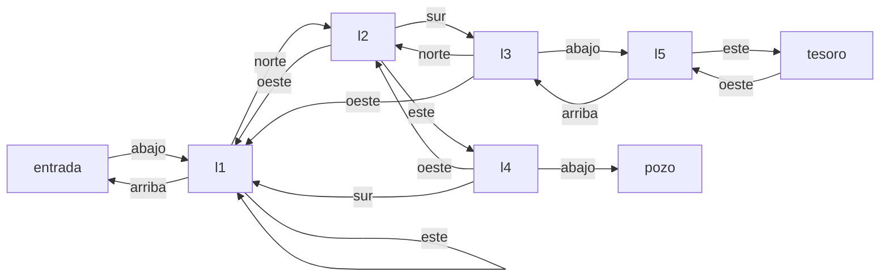

# Más elementos de Colossal Cave

Esta página contiene las secciones
[44.8](index.md#448-el-puntaje-y-los-turnos) a
[44.11](index.md#4411-menus-de-una-tecla) del [capítulo 44](index.md):
cuatro elementos de los juegos fuente que las versiones 1 a 6 no tienen. Los
tres primeros vienen de *Colossal Cave Adventure*, de Crowther y Woods: el
puntaje y los turnos contados, los personajes que recorren la cueva por su
cuenta y el laberinto de salas que se describen todas igual. El cuarto es el
menú de una sola tecla de Covington, Nute y Vellino (apartado 2.13). Cada
uno está en su propio módulo de `ejemplos/capitulo-44/`, con sus pruebas, y
los tres primeros cargan la versión 2, `estado.pl`, sin modificarla; se
ejecutan en una instalación local.

## 44.8 El puntaje y los turnos

*Colossal Cave* cuenta las órdenes que da el jugador y le asigna puntos por
cada logro: entrar a la cueva, encontrar cada tesoro, llevarlo al edificio
del comienzo. Al terminar informa cuántos de los puntos posibles obtuvo, en
cuántos turnos, y le da un rango, un título que depende del puntaje. En el
observatorio, los logros son hechos del estado: llevar la llave, llevar la
linterna, bajar al sótano, llevar la lente, ponerla en el telescopio. Un
logro cuenta la primera vez que el hecho se cumple, y queda registrado
aunque después deje de cumplirse: dejar la llave no resta puntos, y tomarla
otra vez no los suma.

`puntaje.pl` describe los logros con hechos y lleva dos relaciones
dinámicas propias, `turnos/1` y `logrado/1`, que solo cambian
`iniciar_puntaje/0` y `jugada/2`:

<!-- ejemplo: capitulo-44/puntaje.pl fragmento: logro(esta_en(llave, jugador), 5). .. logro(esta_en(lente, telescopio), 20). -->
```prolog
logro(esta_en(llave, jugador), 5).
logro(esta_en(linterna, jugador), 5).
logro(aqui(sotano), 10).
logro(esta_en(lente, jugador), 10).
logro(esta_en(lente, telescopio), 20).
```

`jugada/2` envuelve a `realizar/2` de la versión 2: realiza la orden, suma
un turno, haya cambiado algo o no, y registra los logros nuevos.
`nuevo_logro/1` los busca: un logro que todavía no está registrado y que el
estado actual cumple. El hecho del logro se consulta con `call/1` en el
módulo `estado`, porque `esta_en/2` y `aqui/1` son relaciones de ese
módulo:

<!-- ejemplo: capitulo-44/puntaje.pl predicado: jugada/2 nuevo_logro/1 -->
```prolog
%!  jugada(+Orden, -Respuesta) is det.
%
%   Realiza Orden con realizar/2, suma un turno y registra los logros que
%   se cumplen por primera vez.
jugada(Orden, Respuesta) :-
    realizar(Orden, Respuesta),
    retract(turnos(T0)),
    T is T0 + 1,
    assertz(turnos(T)),
    forall(nuevo_logro(H), assertz(logrado(H))).

%!  nuevo_logro(-H) is nondet.
%
%   H es un logro que se cumple en el estado actual y no estaba registrado.
nuevo_logro(H) :-
    logro(H, _),
    \+ logrado(H),
    call(estado:H).
```

El estado no guarda la historia de la partida, y por eso el registro de los
logros no se puede reconstruir a partir de él: el puntaje necesita su propia
relación. `realizar/2` sigue sin saber nada de puntos; el puntaje es una
capa que se agrega por encima, como la gramática de la versión 4:

```prolog
?- iniciar_puntaje, jugada(ir(biblioteca), _), jugada(tomar(llave), _), puntaje(P), turnos(T).
P = 5,
T = 2.
```

`puntaje/1` y `maximo/1` suman con `aggregate_all/3` los puntos de los logros
registrados y los de todos, y `rango/2` busca el primer umbral que el
puntaje alcanza, en una tabla ordenada de mayor a menor:

<!-- ejemplo: capitulo-44/puntaje.pl predicado: rango/2 umbral/2 -->
```prolog
%!  rango(+P:integer, -Rango:string) is det.
%
%   Rango es el título que corresponde a P puntos: el del primer umbral
%   que P alcanza, de mayor a menor.
rango(P, Rango) :-
    once(( umbral(Minimo, Rango),
           P >= Minimo )).

% umbral(Minimo, Rango): con Minimo puntos o más se obtiene Rango.
umbral(50, "astrónomo").
umbral(30, "astrónomo aficionado").
umbral(10, "explorador").
umbral(0, "principiante").
```

`once/1` deja solo el primer umbral alcanzado, el más alto: sin él, 35
puntos serían también «explorador» y «principiante». `informe/1` arma el
texto del final, dirigido al jugador como las demás respuestas. La prueba
`informe` de `puntaje.plt` juega tres órdenes —ir a la biblioteca, tomar la
llave, dejarla— y espera «Obtuviste 5 de 50 puntos posibles en 3 turnos. Tu
rango: principiante.».

## 44.9 Personajes que se mueven solos

En *Colossal Cave* el mundo cambia también sin órdenes del jugador: los
enanos y el pirata recorren la cueva, aparecen en la sala del jugador y se
van. En el observatorio hay un gato, que recorre una ruta fija de salas, un
paso por turno, y que en la cúpula duerme sobre el telescopio e impide
poner algo en él. `personajes.pl` describe la ruta y el bloqueo con hechos,
y guarda en una relación dinámica propia, `paso_en_ruta/2`, la posición de
cada personaje en su ruta:

<!-- ejemplo: capitulo-44/personajes.pl fragmento: ruta(gato, [biblioteca, cupula, biblioteca, vestibulo]). .. bloquea(gato, cupula, poner(_, telescopio)). -->
```prolog
ruta(gato, [biblioteca, cupula, biblioteca, vestibulo]).

% bloquea(P, S, Orden): el personaje P, en la sala S, impide Orden.
bloquea(gato, cupula, poner(_, telescopio)).
```

`personaje_en/2` deduce la sala de la posición, y `mover_personajes/0`
avanza cada personaje un paso, y vuelve al principio de la ruta después de
la última sala:

<!-- ejemplo: capitulo-44/personajes.pl predicado: personaje_en/2 mover_personajes/0 -->
```prolog
%!  personaje_en(?P, ?S) is nondet.
%
%   El personaje P está en la sala S.
personaje_en(P, S) :-
    paso_en_ruta(P, I),
    ruta(P, Salas),
    nth0(I, Salas, S).

%!  mover_personajes is det.
%
%   Cada personaje avanza un paso en su ruta.
mover_personajes :-
    forall(retract(paso_en_ruta(P, I0)),
           ( ruta(P, Salas),
             length(Salas, N),
             I is (I0 + 1) mod N,
             assertz(paso_en_ruta(P, I)) )).
```

`forall/2` recorre las cláusulas de `paso_en_ruta/2` que `retract/1` va
quitando, y agrega en su lugar la posición siguiente. La cláusula nueva de
cada personaje no se vuelve a quitar en la misma recorrida, por la
[vista lógica de actualización](../capitulo-20-base-de-datos-dinamica/index.md#203-la-vista-logica-de-actualizacion):
`retract/1` trabaja sobre las cláusulas que había cuando empezó.

Un turno tiene ahora dos partes: la orden del jugador y el movimiento de
los personajes. `turno/2` hace las dos. Si un personaje presente en la sala
del jugador bloquea la orden, la respuesta es `no_puede(personaje(P))` y la
orden no se realiza; si no, la realiza `realizar/2`. Después compara quiénes
están en la sala del jugador antes y después del movimiento, y agrega un
aviso por cada personaje que llega o se va:

<!-- ejemplo: capitulo-44/personajes.pl predicado: turno/2 avisos/3 -->
```prolog
%!  turno(+Orden, -Respuestas:list) is det.
%
%   Realiza Orden, salvo que un personaje presente la impida, y después
%   mueve los personajes. Respuestas empieza con la respuesta a Orden y
%   sigue con un aviso llega(P) o se_va(P) por cada personaje que entra
%   en la sala del jugador o sale de ella.
turno(Orden, [R|Avisos]) :-
    (   aqui(S),
        personaje_en(P, S),
        bloquea(P, S, Orden)
    ->  R = no_puede(personaje(P))
    ;   realizar(Orden, R)
    ),
    aqui(Sala),
    findall(P, personaje_en(P, Sala), Antes),
    mover_personajes,
    findall(P, personaje_en(P, Sala), Despues),
    avisos(Antes, Despues, Avisos).

%!  avisos(+Antes:list, +Despues:list, -Avisos:list) is det.
%
%   Avisos dice qué personajes de Despues llegaron, porque no estaban en
%   Antes, y cuáles de Antes se fueron.
avisos(Antes, Despues, Avisos) :-
    findall(llega(P), ( member(P, Despues), \+ memberchk(P, Antes) ), Ls),
    findall(se_va(P), ( member(P, Antes), \+ memberchk(P, Despues) ), Vs),
    append(Ls, Vs, Avisos).
```

```prolog
?- iniciar_personajes, turno(mirar, _), turno(ir(biblioteca), Rs).
Rs = [vista(biblioteca, [catalogo, escritorio], [cupula, vestibulo]), llega(gato)].
```

El bloqueo del gato es un impedimento que depende de algo que la versión 2
no conoce, y por eso no está en `impedimento/2`: se consulta en `turno/2`,
antes de `realizar/2`, con el mismo orden que el
[Patrón 58](../patrones.md#58-impedimento-y-efecto): primero la relación
que bloquea, después el efecto. El bloqueo dura lo que el gato tarda en
irse: en el turno siguiente está en la biblioteca, y la misma orden pone la
lente, como verifican las pruebas `bloquea` y `ya_no_bloquea`.
`texto_turno/2` redacta los avisos y el bloqueo («Entra un gato.», «El gato
se va.»); las demás respuestas siguen a cargo de la gramática de la
versión 4.

`ruta/2` y `bloquea/3` son `multifile`, como los datos del mundo: un
personaje nuevo se agrega con hechos en otro archivo, sin tocar
`personajes.pl` (ejercicio 13).

## 44.10 Un laberinto de pasadizos retorcidos

La frase más conocida de *Colossal Cave* es «You are in a maze of twisty
little passages, all alike»: un laberinto de salas que se describen todas
con la misma frase, cuyos pasadizos no siempre vuelven por la dirección
opuesta. Salir hacia el norte y después hacia el sur no lleva de vuelta al
lugar de partida. La estrategia del jugador es dejar un objeto en cada sala
para reconocerla después, y dibujar el mapa.

En `laberinto.pl` las salas se recorren por direcciones, no por puertas con
nombre: `pasaje(S1, D, S2)` dice que desde `S1` la dirección `D` lleva a
`S2`, y no hay una regla que dé el sentido inverso, porque los pasadizos no
lo tienen. Una de las salas, el pozo, no tiene salida:

<!-- ejemplo: capitulo-44/laberinto.pl fragmento: pasaje(entrada, abajo, l1). .. pasaje(tesoro, oeste, l5). -->
```prolog
pasaje(entrada, abajo, l1).
pasaje(l1, norte, l2).
pasaje(l1, este, l1).
pasaje(l1, arriba, entrada).
pasaje(l2, sur, l3).
pasaje(l2, este, l4).
pasaje(l2, oeste, l1).
pasaje(l3, norte, l2).
pasaje(l3, oeste, l1).
pasaje(l3, abajo, l5).
pasaje(l4, oeste, l2).
pasaje(l4, sur, l1).
pasaje(l4, abajo, pozo).
pasaje(l5, arriba, l3).
pasaje(l5, este, tesoro).
pasaje(tesoro, oeste, l5).
```



`andar/3` sigue una lista de direcciones. Con la lista instanciada da la
sala de llegada; con la lista libre y su longitud fijada, genera los
recorridos de esa longitud:

<!-- ejemplo: capitulo-44/laberinto.pl predicado: andar/3 -->
```prolog
%!  andar(+S0, ?Ds:list, ?S) is nondet.
%
%   Siguiendo las direcciones Ds desde la sala S0 se llega a la sala S.
andar(S, [], S).
andar(S0, [D|Ds], S) :-
    pasaje(S0, D, S1),
    andar(S1, Ds, S).
```

```prolog
?- andar(entrada, [abajo, norte, sur], S).
S = l3 ;
false.
```

Un pasadizo es retorcido cuando la dirección opuesta no devuelve a la sala
de partida. `retorcido/2` lo dice con una negación, sobre argumentos ya
instanciados por `pasaje/3` y `opuesta/2`:

<!-- ejemplo: capitulo-44/laberinto.pl predicado: retorcido/2 -->
```prolog
%!  retorcido(?S, ?D) is nondet.
%
%   El pasadizo que sale de S en la dirección D no vuelve a S por la
%   dirección opuesta.
retorcido(S, D) :-
    pasaje(S, D, S2),
    opuesta(D, O),
    \+ pasaje(S2, O, S).
```

```prolog
?- retorcido(l1, D).
D = norte ;
D = este ;
false.
```

`camino/3` busca la lista de direcciones más corta entre dos salas con la
profundización iterativa de la
[sección 40.4](../capitulo-40-busqueda-y-planificacion/index.md#404-profundidad-limitada-y-profundizacion-iterativa):
`length/2` fija una longitud de 0, 1, 2…, y `andar/3` busca un recorrido de
esa longitud. El primero que encuentra es el más corto. La longitud no pasa
de la cantidad de salas, porque un camino más corto no repite salas; sin
ese límite, una búsqueda sin solución, como la que sale del pozo, no
terminaría:

<!-- ejemplo: capitulo-44/laberinto.pl predicado: salas/1 camino/3 -->
```prolog
%!  salas(-Salas:list) is det.
%
%   Salas es la lista ordenada de las salas del laberinto.
salas(Salas) :-
    setof(S, D^S2^( pasaje(S, D, S2) ; pasaje(S2, D, S) ), Salas).

%!  camino(+Desde, +Hasta, -Ds:list) is semidet.
%
%   Ds es la lista de direcciones más corta que lleva de Desde a Hasta. La
%   búsqueda es una profundización iterativa: prueba con 0, 1, 2…
%   direcciones, sin pasar de la cantidad de salas, porque un camino más
%   corto que eso no repite salas. Falla si Hasta no se alcanza.
camino(Desde, Hasta, Ds) :-
    salas(Salas),
    length(Salas, N),
    between(0, N, L),
    length(Ds0, L),
    andar(Desde, Ds0, Hasta),
    !,
    Ds = Ds0.
```

```prolog
?- camino(entrada, tesoro, Ds).
Ds = [abajo, norte, sur, abajo, este].

?- camino(pozo, entrada, Ds).
false.
```

El camino se construye en `Ds0` y se unifica con `Ds` después del corte.
Si se construyera directamente en `Ds` y `Ds` llegara instanciado con un
recorrido válido pero más largo, `andar/3` lo verificaría con su propia
longitud y el corte lo aceptaría. Comparar después del corte hace que
`camino/3` responda siempre por el más corto.

La estrategia del jugador, que marca cada sala nueva con un objeto, es un
recorrido en profundidad con una lista de salas visitadas. `explorar/2` la
escribe con `foldl/4`: las marcas son la lista que se acumula, y una sala
marcada no se vuelve a recorrer:

<!-- ejemplo: capitulo-44/laberinto.pl predicado: explorar/2 marcar/3 -->
```prolog
%!  explorar(+Desde, -Salas:list) is det.
%
%   Salas son las salas que se alcanzan desde Desde, en el orden en que las
%   marca un jugador que deja un objeto en cada sala nueva, prueba las
%   salidas en el orden de pasaje/3 y no entra en una sala ya marcada.
explorar(Desde, Salas) :-
    marcar(Desde, [], Marcadas),
    reverse(Marcadas, Salas).

%!  marcar(+S, +Marcadas0:list, -Marcadas:list) is det.
%
%   Marcadas agrega a Marcadas0, en orden inverso, las salas alcanzadas
%   desde S que no estaban marcadas.
marcar(S, Marcadas0, Marcadas) :-
    memberchk(S, Marcadas0),
    !,
    Marcadas = Marcadas0.
marcar(S, Marcadas0, Marcadas) :-
    findall(S2, pasaje(S, _, S2), Vecinas),
    foldl(marcar, Vecinas, [S|Marcadas0], Marcadas).
```

```prolog
?- explorar(entrada, Salas).
Salas = [entrada, l1, l2, l3, l5, tesoro, l4, pozo].
```

El orden es el del jugador que prueba las salidas en el orden en que
`pasaje/3` las enumera: desde `l3` baja a `l5` y al tesoro antes de volver
a `l2` y probar el este, que lleva a `l4` y al pozo. El ejercicio 14 usa
`explorar/2` para encontrar las salas trampa, las que se alcanzan desde la
entrada y desde las que la entrada no se alcanza.

## 44.11 Menús de una tecla

`menu/3`, de la versión 5, lee una línea entera: el jugador escribe el
número y pulsa Intro. El menú de Covington, Nute y Vellino lee una sola
tecla, con `get/1`, que salta los caracteres que no se imprimen, y
consume después el Intro; los autores observan que, si el sistema lee el
teclado sin esperar el fin de línea, la respuesta es inmediata. SWI-Prolog
tiene esa lectura: `get_single_char/1` devuelve el código de la tecla en
cuanto se pulsa, sin mostrarla, y solo lee del teclado de la terminal.

`teclas.pl` aísla esa diferencia en un predicado. `leer_caracter/2` usa
`get_single_char/1` cuando el stream es `user_input` conectado a una
terminal, y muestra la tecla leída; con cualquier otro stream, como el de
una cadena en las pruebas, usa `get_char/2`. `leer_tecla/2` salta los
blancos y los fines de línea, como `get/1`:

<!-- ejemplo: capitulo-44/teclas.pl predicado: leer_tecla/2 leer_caracter/2 -->
```prolog
%!  leer_tecla(+In, -C) is det.
%
%   C es el primer carácter de In que no es un blanco, o end_of_file si In
%   se termina antes. Si In es el teclado de una terminal, la tecla se lee
%   sin esperar Intro y se muestra.
leer_tecla(In, C) :-
    leer_caracter(In, C0),
    (   C0 \== end_of_file,
        char_type(C0, space)
    ->  leer_tecla(In, C)
    ;   C = C0
    ).

%!  leer_caracter(+In, -C) is det.
%
%   C es el siguiente carácter de In, o end_of_file.
leer_caracter(In, C) :-
    In == user_input,
    stream_property(user_input, tty(true)),
    !,
    get_single_char(Codigo),
    (   Codigo =:= -1
    ->  C = end_of_file
    ;   char_code(C, Codigo),
        format("~w~n", [C])
    ).
leer_caracter(In, C) :-
    get_char(In, C).
```

`menu_tecla/3` es `menu/3` con una tecla en lugar de una línea; por eso
admite hasta nueve opciones. `char_type(C, digit(N))` relaciona el carácter
de un dígito con su valor, y descarta cualquier otra tecla:

<!-- ejemplo: capitulo-44/teclas.pl predicado: menu_tecla/3 -->
```prolog
%!  menu_tecla(+In, +Opciones:list, -Valor) is det.
%
%   Muestra Opciones, una lista de hasta nueve opcion(Texto, Valor)
%   numeradas desde 1, y lee de In una tecla. Valor es el de la opción
%   cuyo número es esa tecla; con otra tecla, vuelve a preguntar. Si In se
%   termina, Valor es el de la última opción.
menu_tecla(In, Opciones, Valor) :-
    forall(nth1(I, Opciones, opcion(Texto, _)),
           format("~d. ~w~n", [I, Texto])),
    length(Opciones, Cantidad),
    format("Pulsa una tecla, de 1 a ~d: ", [Cantidad]),
    leer_tecla(In, C),
    (   C == end_of_file
    ->  last(Opciones, opcion(_, Valor))
    ;   char_type(C, digit(N)),
        nth1(N, Opciones, opcion(_, V))
    ->  Valor = V
    ;   format("La tecla ~w no es una de las opciones.~n", [C]),
        menu_tecla(In, Opciones, Valor)
    ).
```

`si_o_no/3` es el `get_yes_or_no/1` de Covington: muestra la pregunta y
acepta solo «s» o «n», en mayúscula o minúscula. Covington lo escribe con
dos cláusulas y un corte; aquí la decisión es un condicional, y la
traducción de la tecla es la tabla `respuesta/2`:

<!-- ejemplo: capitulo-44/teclas.pl predicado: si_o_no/3 respuesta/2 -->
```prolog
%!  si_o_no(+In, +Pregunta:string, -Respuesta) is det.
%
%   Muestra Pregunta y lee de In una tecla, hasta que es «s» o «n», en
%   mayúscula o minúscula. Respuesta es si o no; si In se termina, es no.
si_o_no(In, Pregunta, Respuesta) :-
    format("~s (s/n): ", [Pregunta]),
    leer_tecla(In, C),
    (   C == end_of_file
    ->  Respuesta = no
    ;   downcase_atom(C, Minuscula),
        respuesta(Minuscula, R)
    ->  Respuesta = R
    ;   format("Pulsa s o n.~n"),
        si_o_no(In, Pregunta, Respuesta)
    ).

% respuesta(Tecla, R): la tecla Tecla, en minúscula, responde R.
respuesta(s, si).
respuesta(n, no).
```

Las pruebas de `teclas.plt` leen de cadenas sin fines de línea, como las
teclas sueltas: `"x7\n3"` hace preguntar dos veces al menú antes de elegir
la tercera opción, y `"x S"` hace que `si_o_no/3` repita la pregunta y
responda `si`. La rama de `get_single_char/1` no la verifica ninguna
prueba, porque las pruebas no tienen una terminal; se comprueba jugando.
