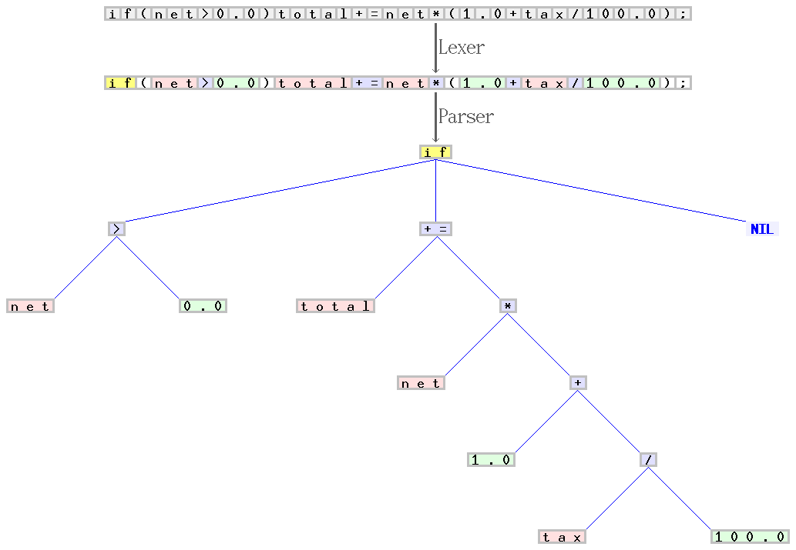
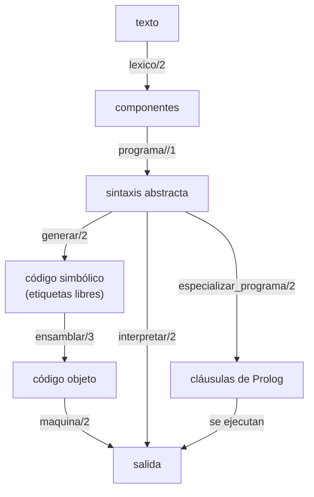

# Capítulo 45 — Proyecto: un compilador

Un compilador traduce un programa escrito en un lenguaje a otro programa,
en un lenguaje de más bajo nivel, que hace lo mismo. Cada etapa de la
traducción es una relación entre dos estructuras: el texto y la lista de
sus componentes léxicos, esa lista y el árbol de la sintaxis abstracta, el
árbol y una lista de instrucciones. Prolog describe cada una de esas
relaciones con cláusulas, y las gramáticas del [capítulo 21](../capitulo-21-gramaticas-dcg/index.md), la
inspección de términos del [capítulo 32](../capitulo-32-inspeccion-de-terminos/index.md), los intérpretes del
[capítulo 33](../capitulo-33-introspeccion-y-metainterpretes/index.md), las estructuras incompletas del [capítulo 34](../capitulo-34-estructuras-incompletas-y-listas-diferencia/index.md) y la
evaluación parcial del [capítulo 35](../capitulo-35-transformacion-de-programas-y-compilacion/index.md) son exactamente las herramientas que
hacen falta.

El proyecto es un compilador de **Mini**, un lenguaje imperativo pequeño con
asignaciones, `si`, `mientras` y `escribir`, a una máquina de pila. El
capítulo empieza con el compilador terminado y lo construye después en seis
versiones, una por sección: el análisis léxico y sintáctico; un intérprete;
la generación de código con un ensamblador; la máquina que ejecuta ese
código; tres optimizaciones; y el intérprete evaluado parcialmente, que
resulta un segundo compilador, de Mini a Prolog. Cada versión carga la
anterior y los módulos de los capítulos previos que necesita, y cada una
deja una limitación que la siguiente resuelve.



Las dos primeras etapas de un compilador sobre una sentencia del lenguaje C:
el analizador léxico (*lexer*) divide el texto en componentes —palabras
reservadas, nombres, números y símbolos, cada clase con su color— y el
analizador sintáctico (*parser*) arma con ellos el árbol de la sintaxis
abstracta. Imagen: Jochen Burghardt,
[CC BY-SA 3.0](https://creativecommons.org/licenses/by-sa/3.0/), vía
[Wikimedia Commons](https://commons.wikimedia.org/wiki/File:Xxx_Scanner_and_parser_example_for_C.gif).

El capítulo recorre el camino completo para Mini. Cada flecha es un
predicado del capítulo, y cada caja, la estructura que relaciona con la
siguiente; los dos caminos de la derecha ejecutan el programa sin compilarlo a
la máquina:



El proyecto parte principalmente de tres fuentes. De *The Art of Prolog* de Leon Sterling y
Ehud Shapiro, el capítulo «A Compiler», toma la idea central: las etiquetas
de los saltos son variables de Prolog, y el ensamblador las liga a sus
direcciones por unificación, en una sola pasada, con un diccionario
incompleto para las variables del programa. De *Clause and Effect* de
William F. Clocksin, el capítulo «Case Study: A Compiler for Three Model
Computers», toma la máquina de pila y las optimizaciones: el orden de los
operandos, el plegado de constantes y el optimizador de mirilla. De *The
Power of Prolog* de Markus Triska, la sección [«Thinking in
States»](https://www.metalevel.at/tist/), toma la forma de describir un
intérprete y una máquina como relaciones entre estados, sin efectos. Los
compiladores de Sterling y Shapiro y de Clocksin parten del artículo de
David H. D. Warren «Logic programming and compiler writing» (1980); el
proyecto 4 del apartado 11.2 de *Programming in Prolog* de Clocksin y
Mellish propone el mismo orden de construcción, primero las expresiones y
después las estructuras de control, hacia una máquina de pila. El
lenguaje, los programas y el código del capítulo son propios. El capítulo
cumple los anuncios de los capítulos [32](../capitulo-32-inspeccion-de-terminos/index.md) (una sintaxis abstracta como
representación limpia), [33](../capitulo-33-introspeccion-y-metainterpretes/index.md) (el intérprete de un lenguaje propio antes
de compilarlo), [34](../capitulo-34-estructuras-incompletas-y-listas-diferencia/index.md) (la tabla de símbolos de su
[página del ensamblador](../capitulo-34-estructuras-incompletas-y-listas-diferencia/ensamblador.md), en un compilador completo) y [35](../capitulo-35-transformacion-de-programas-y-compilacion/index.md) (un intérprete
evaluado parcialmente, comparado con su compilador). Salvo `sintaxis.pl`,
los archivos cargan otros archivos, y corren solo en una instalación local.

## Objetivos del capítulo

Al terminar el capítulo, el lector puede:

- escribir el análisis léxico y sintáctico de un lenguaje con dos
  gramáticas, una sobre caracteres y otra sobre componentes, y
  representar su sintaxis abstracta con un functor por clase de nodo;
- escribir un intérprete del lenguaje como una relación entre entornos, con
  la salida como la lista que describe una gramática;
- generar código para una máquina de pila con etiquetas que son variables,
  y ensamblarlo en una pasada, ligando las etiquetas por unificación;
- escribir la máquina que ejecuta ese código como una relación entre
  estados;
- plegar constantes, reordenar operandos y optimizar el código con una
  tabla de reescrituras locales, y reconocer cuándo una regla une por
  unificación dos etiquetas distintas;
- obtener un compilador de Mini a Prolog evaluando parcialmente el
  intérprete, y comparar en inferencias las formas de ejecutar un programa;
- reducir la fuerza de las operaciones, generar código para máquinas de
  acumulador y de registros con la menor cantidad de registros, y extender
  el lenguaje con lectura de datos y con funciones recursivas que usan
  marcos de pila.

!!! info "Tiempo estimado"
    Leer el capítulo, ejecutar sus ejemplos y hacer las actividades: **1:40 h**.
    Resolver los 5 ejercicios marcados con ★: **1:05 h**.
    Resolver los 15 ejercicios del final: **4:00 h**.

## 45.1 El compilador terminado

`compilador.pl` carga las seis versiones. `mini_ejemplo/1` escribe el texto
de un programa de ejemplo, lo compila con todas las optimizaciones, escribe
el código objeto con la dirección de cada instrucción, y lo ejecuta en la
máquina de pila:

<!-- ejemplo: capitulo-45/compilador.pl predicado: mini/1 mini_ejemplo/1 -->
```prolog
%!  mini(+Texto) is semidet.
%
%   Compila el programa Mini de Texto con compilar_optimizado/2, escribe
%   el código objeto, una instrucción por línea con su dirección, y
%   después lo que escribe el programa al ejecutarse en la máquina. Falla
%   si Texto no es un programa Mini.
mini(Texto) :-
    compilar_optimizado(Texto, Objeto),
    listar_codigo(Objeto, 0),
    maquina(Objeto, Salida),
    format("salida: ~w~n", [Salida]).

%!  mini_ejemplo(+Nombre) is semidet.
%
%   Escribe el texto del programa de ejemplo Nombre, y después hace con él
%   lo que mini/1.
mini_ejemplo(Nombre) :-
    fuente(Nombre, Lineas),
    forall(member(L, Lineas), format("    ~s~n", [L])),
    atomic_list_concat(Lineas, '\n', Texto),
    mini(Texto).
```

La consulta `mini_ejemplo(factorial)` escribe, y después responde `true`:

```text
    n := 5;
    f := 1;
    mientras n > 0 hacer
      f := f * n;
      n := n - 1
    fin;
    escribir f
0   apilar(5)
1   guardar(0)
2   apilar(1)
3   guardar(1)
4   cargar(0)
5   apilar(0)
6   comparar(>)
7   saltar_si_cero(17)
8   cargar(1)
9   cargar(0)
10  multiplicar
11  guardar(1)
12  cargar(0)
13  apilar(1)
14  restar
15  guardar(0)
16  saltar(4)
17  cargar(1)
18  escribir
salida: [120]
```

La variable `n` quedó en la celda 0 de la memoria y `f` en la 1. El bucle
empieza en la dirección 4: evalúa `n > 0`, que deja 1 o 0 en la pila, y
`saltar_si_cero(17)` sale del bucle cuando la condición no se cumple;
`saltar(4)` vuelve a evaluarla. El camino de un programa por el compilador
es este:

| Etapa | Predicado | De | A |
|---|---|---|---|
| análisis léxico | `lexico/2` | texto | lista de componentes |
| análisis sintáctico | `programa//1` | componentes | sintaxis abstracta |
| optimización del árbol | `optimizar/2` | sintaxis abstracta | sintaxis abstracta |
| generación de código | `generar/2` | sintaxis abstracta | código simbólico |
| mirilla | `mirilla/2` | código simbólico | código simbólico |
| ensamblado | `ensamblar/3` | código simbólico | código objeto |
| ejecución | `maquina/2` | código objeto | salida |

Hay otras dos formas de ejecutar el mismo árbol: `interpretar/2`, que lo
recorre, y `correr_especializado/2`, que lo convierte en cláusulas de
Prolog. Las cuatro escriben lo mismo, y la prueba `cuatro_formas` de
`compilador.plt` lo verifica con los cuatro programas de ejemplo.

## 45.2 El lenguaje y su sintaxis abstracta

Un programa Mini es una lista de sentencias separadas por punto y coma. Las
variables son enteras, empiezan en 0 y no se declaran; las expresiones usan
`+`, `-`, `*` y `/`, la división entera, con la precedencia habitual y
agrupadas a la izquierda; las condiciones comparan dos expresiones con `=`,
`<>`, `<`, `>`, `<=` o `>=`. El programa no lee datos: lo que produce es lo
que escribe.

La **sintaxis abstracta** es el árbol que el compilador recorre. Sigue la
representación limpia de la [sección 32.6](../capitulo-32-inspeccion-de-terminos/index.md#326-representaciones-limpias): cada clase de nodo tiene
su functor, y un predicado distingue un número de una variable por la
cabeza de la cláusula, sin `integer/1` ni `atom/1`. Es la definición que
usan todas las versiones, y la que analiza el [capítulo 58](../capitulo-58-proyecto-interpretacion-abstracta/index.md):

| Nodo | Término | Significado |
|---|---|---|
| programa, bloque | lista de sentencias | se ejecutan en orden; puede ser vacía |
| asignación | `asignar(X, E)` | la variable `X`, un átomo, toma el valor de `E` |
| condicional | `si(C, Si, No)` | ejecuta el bloque `Si` si se cumple `C`, el bloque `No` si no; sin `sino`, `No` es `[]` |
| bucle | `mientras(C, Cuerpo)` | ejecuta el bloque `Cuerpo` mientras se cumple `C` |
| salida | `escribir(E)` | agrega el valor de `E` a la salida |
| condición | `rel(Op, A, B)` | compara las expresiones `A` y `B`; `Op` es `=`, `<>`, `<`, `>`, `<=` o `>=` |
| número | `num(N)` | el entero `N` |
| variable | `id(X)` | el valor de la variable `X` |
| operación | `bin(Op, A, B)` | `Op` es `+`, `-`, `*` o `/` |

El análisis tiene dos etapas. La **léxica** convierte el texto en una lista
de **componentes**: `num(N)` para un número, `id(X)` para un identificador,
y el átomo mismo para una palabra reservada o un símbolo. Es una gramática
sobre códigos de caracteres, como las de la [sección 21.3](../capitulo-21-gramaticas-dcg/index.md#213-terminales-y-double_quotes); cada
componente es el más largo posible, y el corte después de reconocerlo lo
fija:

<!-- ejemplo: capitulo-45/sintaxis.pl predicado: componentes//1 componente//1 palabra/2 consulta: lexico("x := x + 1", Ts). -->
```prolog
%!  componentes(-Componentes:list)// is semidet.
%
%   Los componentes léxicos de la lista de códigos, separados por blancos.
componentes(Cs) -->
    blancos,
    componentes_(Cs).

%!  componente(-C)// is semidet.
%
%   Un componente léxico, el más largo que empieza en la posición actual.
componente(num(N)) -->
    digito(D),
    !,
    digitos(Ds),
    { number_codes(N, [D|Ds]) }.
componente(C) -->
    [L],
    { code_type(L, csymf) },
    !,
    alfanumericos(Ls),
    { atom_codes(A, [L|Ls]),
      palabra(A, C) }.
componente(S) -->
    simbolo(S).

%!  palabra(+A:atom, -C) is det.
%
%   C es el componente de la palabra A: A misma si es reservada, id(A) si
%   no lo es.
palabra(A, C) :-
    (   reservada(A)
    ->  C = A
    ;   C = id(A)
    ).
```

```prolog
?- lexico("x := x + 1", Ts).
Ts = [id(x), :=, id(x), +, num(1)].
```

La etapa **sintáctica** es otra gramática, cuyos terminales son los
componentes. Las sentencias siguen la forma del texto:

<!-- ejemplo: capitulo-45/sintaxis.pl predicado: sentencia//1 -->
```prolog
%!  sentencia(?S)// is nondet.
%
%   Una sentencia: asignación, si con o sin sino, mientras o escribir.
sentencia(asignar(X, E)) -->
    [id(X), :=],
    expresion(E).
sentencia(si(C, Si, No)) -->
    [si],
    condicion(C),
    [entonces],
    bloque(Si),
    rama_sino(No),
    [fin].
sentencia(mientras(C, Cuerpo)) -->
    [mientras],
    condicion(C),
    [hacer],
    bloque(Cuerpo),
    [fin].
sentencia(escribir(E)) -->
    [escribir],
    expresion(E).
```

Las expresiones evitan la recursión a la izquierda con un acumulador, como
en la [sección 21.7](../capitulo-21-gramaticas-dcg/index.md#217-recursion-a-izquierda): el primer término es el valor inicial, y cada
operador lo combina con el término siguiente, de modo que `10 - 3 - 2` se
agrupa como `(10 - 3) - 2`. Los factores de `termino//1` hacen lo mismo con
`*` y `/`, un nivel más abajo, y por eso agrupan antes:

<!-- ejemplo: capitulo-45/sintaxis.pl predicado: expresion//1 mas_terminos//2 -->
```prolog
%!  expresion(?E)// is nondet.
%
%   Una suma o resta de términos, agrupada a la izquierda: el primer
%   término es el acumulador, y cada operador lo combina con el siguiente.
expresion(E) -->
    termino(T),
    mas_terminos(T, E).

mas_terminos(Ac, E) -->
    [Op],
    { memberchk(Op, [+, -]) },
    termino(T),
    mas_terminos(bin(Op, Ac, T), E).
mas_terminos(E, E) -->
    [].
```

```prolog
?- analizar("x := 2 * (y + 1); escribir x", P).
P = [asignar(x, bin(*, num(2), bin(+, id(y), num(1)))), escribir(id(x))].

?- analizar("x := 10 - 3 - 2", P).
P = [asignar(x, bin(-, bin(-, num(10), num(3)), num(2)))].

?- analizar("si x > 0 entonces x := 1", P).
false.
```

`analizar/2` falla con un texto que no es un programa Mini, como el último,
al que le falta el `fin`. Un árbol todavía no hace nada: para saber qué
escribe un programa hace falta ejecutarlo.

## 45.3 El intérprete

El intérprete de `interprete.pl` relaciona cada sentencia con dos
**entornos**, el de antes y el de después: listas de pares `Nombre-Valor`
con todas las variables del programa. Es la forma de la sección «Thinking
in States» de Triska, que describe el estado de un programa como un
término y cada sentencia como una relación entre dos de esos términos. Lo
que el programa escribe no es un efecto: es la lista que describe la
gramática, y `escribir` agrega un número a esa lista:

<!-- ejemplo: capitulo-45/interprete.pl predicado: interpretar/2 ejecutar_sentencia//3 -->
```prolog
%!  interpretar(+Programa:list, -Salida:list(integer)) is det.
%
%   Salida es la lista de los números que escribe Programa, ejecutado con
%   todas sus variables en 0. No termina si Programa no termina.
interpretar(Programa, Salida) :-
    entorno_inicial(Programa, Entorno),
    once(phrase(ejecutar_bloque(Programa, Entorno, _), Salida)).

%!  ejecutar_sentencia(+S, +E0:list, -E:list)// is nondet.
%
%   Ejecutar la sentencia S lleva el entorno E0 a E. Para si y mientras hay
%   dos cláusulas, con la condición cierta y falsa: solo una se cumple,
%   pero la otra queda como alternativa pendiente.
ejecutar_sentencia(asignar(X, Exp), E0, E) -->
    { evaluar(Exp, E0, V),
      actualizar(X, V, E0, E) }.
ejecutar_sentencia(escribir(Exp), E, E) -->
    { evaluar(Exp, E, V) },
    [V].
ejecutar_sentencia(si(C, Si, _), E0, E) -->
    { cierta(C, E0) },
    ejecutar_bloque(Si, E0, E).
ejecutar_sentencia(si(C, _, No), E0, E) -->
    { falsa(C, E0) },
    ejecutar_bloque(No, E0, E).
ejecutar_sentencia(mientras(C, Cuerpo), E0, E) -->
    { cierta(C, E0) },
    ejecutar_bloque(Cuerpo, E0, E1),
    ejecutar_sentencia(mientras(C, Cuerpo), E1, E).
ejecutar_sentencia(mientras(C, _), E, E) -->
    { falsa(C, E) }.
```

`si` y `mientras` tienen una cláusula con la condición cierta y otra con la
condición falsa, que se prueba como la comparación contraria: `n > 0` es
falsa cuando se cumple `n <= 0`. La forma es la de un predicado escrito con
dos cláusulas excluyentes, y tiene una razón: el evaluador parcial del
[capítulo 35](../capitulo-35-transformacion-de-programas-y-compilacion/index.md) despliega cláusulas y conjunciones, pero no un
si-entonces-sino de Prolog, y la [sección 45.7](#457-el-interprete-especializado) lo usa sobre este
intérprete. El precio es una alternativa pendiente por cada decisión, que
`interpretar/2` descarta con `once/1`. Las expresiones se evalúan con
`evaluar/3`, que busca las variables en el entorno con `valor/3`:

<!-- ejemplo: capitulo-45/interprete.pl predicado: evaluar/3 falsa/2 contraria/2 -->
```prolog
%!  evaluar(+Exp, +E:list, -V:integer) is det.
%
%   V es el valor de la expresión Exp en el entorno E. Produce un error de
%   evaluación si divide por cero.
evaluar(num(N), _, N).
evaluar(id(X), E, V) :-
    valor(X, E, V).
evaluar(bin(Op, A, B), E, V) :-
    evaluar(A, E, X),
    evaluar(B, E, Y),
    operar(Op, X, Y, V).

%!  falsa(+C, +E:list) is semidet.
%
%   La condición C no se cumple en el entorno E: se cumple la comparación
%   contraria.
falsa(rel(Op, A, B), E) :-
    contraria(Op, No),
    cierta(rel(No, A, B), E).

% contraria(Op, No): la comparación No se cumple cuando Op no se cumple.
contraria(=, <>).
contraria(<>, =).
contraria(<, >=).
contraria(>=, <).
contraria(>, <=).
contraria(<=, >).
```

```prolog
?- ejecutar("x := 6; y := x * 7; escribir y", S).
S = [42].

?- forall(programa_ejemplo(N, P), (interpretar(P, S), writeln(N-S))).
factorial-[120]
mcd-[12]
cuenta-[3,2,1]
suma-[500500]
true.
```

!!! question "Actividad"
    Predecir la salida de `ejecutar("escribir z; z := z + 1; si z = 1
    entonces escribir 7 / 2 sino escribir 0 fin", S)` y el entorno en que
    termina el programa. Comprobar la salida, y explicar por qué `z` puede
    leerse antes de asignarse.

El intérprete es la definición de lo que significa un programa Mini, y
todas las versiones que siguen se comparan con él. Pero cada ejecución
vuelve a recorrer el árbol, a decidir qué clase de nodo es cada uno y a
buscar cada variable por su nombre en el entorno. Un compilador hace ese
trabajo una sola vez.

## 45.4 La generación de código y el ensamblador

La máquina de pila de Clocksin no tiene registros: las operaciones toman
sus operandos del tope de la pila y dejan allí el resultado. Sus
instrucciones son las de la [página del ensamblador](../capitulo-34-estructuras-incompletas-y-listas-diferencia/ensamblador.md) del
[capítulo 34](../capitulo-34-estructuras-incompletas-y-listas-diferencia/index.md), con la multiplicación, la división y las comparaciones
agregadas:

| Instrucción | Efecto |
|---|---|
| `apilar(N)` | apila el entero `N` |
| `cargar(X)` | apila el valor de la variable `X` |
| `guardar(X)` | desapila un valor y lo guarda en `X` |
| `sumar`, `restar`, `multiplicar`, `dividir` | desapila dos valores y apila el resultado; el de más abajo es el operando izquierdo |
| `comparar(Op)` | desapila dos valores y apila 1 si cumplen `Op`, 0 si no |
| `escribir` | desapila un valor y lo agrega a la salida |
| `saltar(L)` | sigue en la etiqueta `L` |
| `saltar_si_cero(L)` | desapila un valor y, si es 0, sigue en `L` |
| `etiqueta(L)` | marca una posición; no es una instrucción |

`generar/2` recorre el árbol y produce el **código simbólico**, que nombra
las variables por su nombre y los destinos de los saltos por su etiqueta.
Como en *Clause and Effect* y en *The Art of Prolog*, una etiqueta es una
variable de Prolog: cada uso de la cláusula de `si` o de `mientras` crea
variables nuevas, y una variable nueva es un nombre que no se repite, sin
contador que llevar. El código se describe con una gramática, así que sale
como una lista plana, sin concatenar las partes:

<!-- ejemplo: capitulo-45/generador.pl predicado: codigo_sentencia//1 codigo_expresion//1 -->
```prolog
%!  codigo_sentencia(+S)// is det.
%
%   El código de la sentencia S. Las etiquetas Sino, Fin e Inicio son
%   variables nuevas en cada uso de la cláusula.
codigo_sentencia(asignar(X, E)) -->
    codigo_expresion(E),
    [guardar(X)].
codigo_sentencia(escribir(E)) -->
    codigo_expresion(E),
    [escribir].
codigo_sentencia(si(C, Si, No)) -->
    codigo_condicion(C),
    [saltar_si_cero(Sino)],
    codigo_bloque(Si),
    [saltar(Fin), etiqueta(Sino)],
    codigo_bloque(No),
    [etiqueta(Fin)].
codigo_sentencia(mientras(C, Cuerpo)) -->
    [etiqueta(Inicio)],
    codigo_condicion(C),
    [saltar_si_cero(Fin)],
    codigo_bloque(Cuerpo),
    [saltar(Inicio), etiqueta(Fin)].

%!  codigo_expresion(+E)// is det.
%
%   El código que deja en la pila el valor de la expresión E: primero el
%   operando izquierdo, después el derecho, después la operación.
codigo_expresion(num(N)) -->
    [apilar(N)].
codigo_expresion(id(X)) -->
    [cargar(X)].
codigo_expresion(bin(Op, A, B)) -->
    codigo_expresion(A),
    codigo_expresion(B),
    { aritmetica(Op, I) },
    [I].
```

```prolog
?- analizar("x := 2 * x + 1", P), generar(P, C).
P = [asignar(x, bin(+, bin(*, num(2), id(x)), num(1)))],
C = [apilar(2), cargar(x), multiplicar, apilar(1), sumar, guardar(x)].

?- analizar("mientras x > 0 hacer x := 0 fin", P), generar(P, C).
P = [mientras(rel(>, id(x), num(0)), [asignar(x, num(0))])],
C = [etiqueta(_A), cargar(x), apilar(0), comparar(>), saltar_si_cero(_B), apilar(0), guardar(x), saltar(_A), etiqueta(...)].
```

El **ensamblador** convierte el código simbólico en **código objeto**, en
el que cada instrucción tiene una dirección y todo es un número. Lo hace en
una sola pasada, con un contador de direcciones. Una marca `etiqueta(L)` no
ocupa lugar: su cláusula unifica `L` con la dirección actual, y con eso
quedan ligados todos los saltos a esa etiqueta, los que ya se copiaron y
los que vienen, como observan Sterling y Shapiro. Las variables de Mini
reciben su celda de memoria con la tabla de símbolos de la
[sección 34.7](../capitulo-34-estructuras-incompletas-y-listas-diferencia/index.md#347-la-tabla-de-simbolos-del-compilador): `buscar/3`, del diccionario incompleto de la
[sección 34.4](../capitulo-34-estructuras-incompletas-y-listas-diferencia/index.md#344-diccionarios-incompletos), da a cada nombre una celda libre, la misma en cada
aparición, y `numerar/2` las numera al final. Las etiquetas no necesitan
esa tabla: cada una ya es la variable de su dirección. `clase/2` es la
lista de las instrucciones de la máquina, y decide qué hace el ensamblador
con cada una:

<!-- ejemplo: capitulo-45/generador.pl predicado: ensamblar/3 objeto//3 ensamblar_instruccion//5 -->
```prolog
%!  ensamblar(+Simbolico:list, -Objeto:list, -Tabla:list) is semidet.
%
%   Objeto es Simbolico sin las marcas de etiqueta, con cada etiqueta ligada
%   a la dirección de la instrucción que sigue a su marca, contando desde
%   0, y cada variable de Mini reemplazada por su celda. Tabla es el
%   diccionario incompleto de las celdas, numeradas desde 0 en el orden de
%   aparición. Liga las etiquetas también en Simbolico. Falla si una
%   etiqueta se marca en dos direcciones distintas.
ensamblar(Simbolico, Objeto, Tabla) :-
    phrase(objeto(Simbolico, 0, Tabla), Objeto),
    numerar(Tabla, 0).

%!  objeto(+Simbolico:list, +Dir:integer, ?Tabla)// is semidet.
%
%   El código objeto de Simbolico, cuya primera instrucción va en Dir.
objeto([], _, _) -->
    [].
objeto([I|Is], Dir, Tabla) -->
    { clase(I, Clase) },
    ensamblar_instruccion(Clase, I, Dir, Dir1, Tabla),
    objeto(Is, Dir1, Tabla).

%!  ensamblar_instruccion(+Clase, +I, +Dir, -Dir1, ?Tabla)// is semidet.
%
%   El código objeto de la instrucción I, de la clase Clase, en la
%   dirección Dir; Dir1 es la dirección de la siguiente. Una marca no ocupa
%   lugar: su etiqueta se liga a Dir.
ensamblar_instruccion(marca, etiqueta(Dir), Dir, Dir, _) -->
    [].
ensamblar_instruccion(memoria, I, Dir, Dir1, Tabla) -->
    { I =.. [Nombre, X],
      buscar(X, Tabla, Celda),
      I1 =.. [Nombre, Celda],
      Dir1 is Dir + 1 },
    [I1].
ensamblar_instruccion(fija, I, Dir, Dir1, _) -->
    [I],
    { Dir1 is Dir + 1 }.
```

```prolog
?- analizar("mientras x > 0 hacer x := 0 fin", P), generar(P, C), ensamblar(C, O, T).
P = [mientras(rel(>, id(x), num(0)), [asignar(x, num(0))])],
C = [etiqueta(0), cargar(x), apilar(0), comparar(>), saltar_si_cero(7), apilar(0), guardar(x), saltar(0), etiqueta(...)],
O = [cargar(0), apilar(0), comparar(>), saltar_si_cero(7), apilar(0), guardar(0), saltar(0)],
T = [x-0|_].
```

El ensamblado ligó las etiquetas también en `C`, porque son las mismas
variables: la primera marca quedó en 0 y la segunda en 7, la dirección que
sigue al código. La tabla `T` sigue abierta, como todo diccionario
incompleto. Una etiqueta marcada en dos direcciones distintas hace fallar
el ensamblado, porque la segunda marca intenta ligar a otro número una
variable ya ligada:

```prolog
?- ensamblar([etiqueta(L), apilar(1), saltar(L), etiqueta(L)], O, T).
false.
```

!!! example "Patrón 59 — Etiquetas como variables lógicas"
    **Problema.** Un generador produce saltos a posiciones que todavía no
    existen: el destino de un salto hacia adelante se conoce recién cuando
    se genera el código que lo sigue.

    **Versión ingenua.** Nombrar las etiquetas con un contador que la
    generación lleva de una cláusula a otra, y ensamblar en dos pasadas:
    la primera anota en una tabla la dirección de cada etiqueta, y la
    segunda reemplaza cada nombre por la dirección que la tabla le da.

    **Patrón.** Cada etiqueta es una variable nueva, creada por la cláusula
    que genera el `si` o el `mientras`, y los saltos la llevan como
    argumento. El ensamblador, en una sola pasada, unifica la variable de
    cada marca con la dirección actual, y así quedan resueltos todos los
    saltos a esa etiqueta, los anteriores y los posteriores; una marca
    repetida en otra dirección hace fallar el ensamblado. Las reglas que
    reescriben el código simbólico antes de ensamblarlo comparan las
    etiquetas con `==`, que no liga nada: una cabeza que repite una
    variable las unificaría y juntaría dos etiquetas distintas, como
    muestra la página
    [Optimización](../capitulo-45-proyecto-compilador/optimizacion.md#optimizacion).

    **Cuándo no usarlo.** Cuando el código simbólico se reparte en partes
    que no forman un solo término, como un archivo con una instrucción por
    cláusula o piezas compiladas por separado: una variable vale solo
    dentro de su término, y ahí hacen falta nombres. Y cuando una
    transformación necesita unificar libremente instrucciones enteras:
    conviene aplicarla después de ensamblar, cuando las etiquetas ya son
    números y unificarlas es compararlas.

El código objeto es una lista de términos, y todavía no hay nada que lo
ejecute.

## 45.5 La máquina de pila

La máquina de `maquina.pl` es, como el intérprete, una relación entre
estados. El estado es `s(PC, Pila, Memoria)`: la dirección de la siguiente
instrucción, la pila con el tope primero, y la memoria, un árbol de
`library(assoc)` que asocia cada celda con su valor; una celda que nunca se
escribió vale 0. Cada instrucción relaciona un estado con el siguiente, y lo
que escribe la máquina es otra vez la lista de una gramática:

<!-- ejemplo: capitulo-45/maquina.pl predicado: paso//3 -->
```prolog
%!  paso(+I, +Estado0, -Estado)// is det.
%
%   Ejecutar la instrucción I lleva la máquina de Estado0 a Estado; la
%   lista es lo que escribe, vacía salvo para escribir.
paso(apilar(N), s(PC, P, M), s(PC1, [N|P], M)) -->
    { PC1 is PC + 1 }.
paso(cargar(C), s(PC, P, M), s(PC1, [V|P], M)) -->
    { PC1 is PC + 1,
      celda(C, M, V) }.
paso(guardar(C), s(PC, [V|P], M0), s(PC1, P, M)) -->
    { PC1 is PC + 1,
      put_assoc(C, M0, V, M) }.
paso(sumar, S0, S) -->
    { operacion(+, S0, S) }.
paso(restar, S0, S) -->
    { operacion(-, S0, S) }.
paso(multiplicar, S0, S) -->
    { operacion(*, S0, S) }.
paso(dividir, S0, S) -->
    { operacion(/, S0, S) }.
paso(comparar(Op), s(PC, [Y, X|P], M), s(PC1, [V|P], M)) -->
    { PC1 is PC + 1,
      (   comparar(Op, X, Y)
      ->  V = 1
      ;   V = 0
      ) }.
paso(escribir, s(PC, [V|P], M), s(PC1, P, M)) -->
    [V],
    { PC1 is PC + 1 }.
paso(saltar(D), s(_, P, M), s(D, P, M)) -->
    [].
paso(saltar_si_cero(D), s(PC, [V|P], M), s(PC1, P, M)) -->
    {   V =:= 0
    ->  PC1 = D
    ;   PC1 is PC + 1
    }.
```

`ciclo//2` lee la instrucción de la dirección `PC` y la ejecuta, hasta que
la dirección queda fuera del código. Para no recorrer una lista en cada
paso, el código se guarda en un término `codigo(I0, I1, …)` con
`compound_name_arguments/3`, y `arg/3` da la instrucción de una dirección
en un solo paso:

<!-- ejemplo: capitulo-45/maquina.pl predicado: maquina/2 ciclo//2 -->
```prolog
%!  maquina(+Objeto:list, -Salida:list(integer)) is det.
%
%   Salida es lo que escribe el código objeto Objeto, ejecutado desde la
%   dirección 0 con la pila vacía y la memoria en 0, hasta que la dirección
%   siguiente queda fuera del código.
maquina(Objeto, Salida) :-
    compound_name_arguments(Codigo, codigo, Objeto),
    empty_assoc(Memoria),
    phrase(ciclo(Codigo, s(0, [], Memoria)), Salida).

%!  ciclo(+Codigo, +Estado)// is det.
%
%   La salida de la máquina desde Estado: si la dirección de Estado tiene
%   una instrucción, la ejecuta y sigue; si no, termina.
ciclo(Codigo, s(PC, Pila, Memoria)) -->
    (   { N is PC + 1,
          arg(N, Codigo, I) }
    ->  paso(I, s(PC, Pila, Memoria), Estado),
        ciclo(Codigo, Estado)
    ;   []
    ).
```

```prolog
?- maquina([apilar(2), apilar(3), sumar, escribir], S).
S = [5].

?- forall(fuente_ejemplo(N, T), (correr(T, S), ejecutar(T, S), writeln(N-S))).
factorial-[120]
mcd-[12]
cuenta-[3,2,1]
suma-[500500]
true.
```

La segunda consulta compila cada programa de ejemplo, lo ejecuta en la
máquina y exige que el intérprete escriba lo mismo. Queda medir si el
código compilado es más rápido. `suma` suma de 1 a 1000:

```text
?- programa_ejemplo(suma, P), time(interpretar(P, _)).
% 36,203 inferences, 0.016 CPU in 0.004 seconds (385% CPU, 2316992 Lips)

?- fuente_ejemplo(suma, T), compilar(T, O), time(maquina(O, _)).
% 76,063 inferences, 0.000 CPU in 0.011 seconds (0% CPU, Infinite Lips)
```

La máquina usa el doble de inferencias que el intérprete. No es un defecto
del compilador: la máquina, escrita en Prolog, es a su vez un intérprete, de
un lenguaje de nivel más bajo, en el que cada nodo del árbol se convirtió
en varias instrucciones y cada instrucción cuesta varias inferencias. El
código objeto está hecho para un procesador; ejecutado en Prolog, paga dos
veces la interpretación. Las dos secciones que siguen atacan el problema
desde los dos lados: menos instrucciones, y un compilador cuyo resultado
Prolog ejecuta sin intermediario.

!!! question "Actividad"
    Predecir el código objeto de `x := 1; escribir x` y compararlo con la
    salida de `listar_objeto("x := 1; escribir x")`. Predecir después cuántos
    pasos da la máquina con el código del factorial: cuántas veces se
    ejecuta cada instrucción del bucle, y cuántas las de fuera. Comprobar la
    cantidad con el [ejercicio 5](#ejercicios), o siguiendo a mano la
    traza de `maquina/2`.

## 45.6 Optimización

El código de la máquina tiene instrucciones que sobran, y el
[capítulo 32](../capitulo-32-inspeccion-de-terminos/index.md) ya tiene un simplificador de expresiones. La página
[Optimización](optimizacion.md#optimizacion) agrega a la versión 4 tres mejoras de
*Clause and Effect*: el plegado de constantes con ese simplificador, sobre
el árbol; el orden de los operandos de `+` y `*` que menos pila necesita,
también sobre el árbol; y un optimizador de mirilla, una tabla de
reescrituras locales sobre el código simbólico. La mirilla muestra el costo
de las etiquetas que son variables: una regla que las compara en la cabeza
de la cláusula las unifica, y une dos etiquetas distintas.

## 45.7 El intérprete especializado

El intérprete de la [sección 45.3](#453-el-interprete) se escribió con una cláusula por
caso para poder evaluarlo parcialmente. La página
[El intérprete especializado](especializacion.md#el-interprete-especializado) le aplica `parcial/3` del
[capítulo 35](../capitulo-35-transformacion-de-programas-y-compilacion/index.md) con un control propio: el resultado es un programa
Prolog sin intérprete, un predicado por cada `si` y cada `mientras`, que usa
la novena parte de las inferencias del intérprete. Es un segundo
compilador, de Mini a Prolog, que no hubo que escribir: salió del
intérprete.

!!! success "Criterios de calidad"
    | Criterio | En este capítulo |
    |---|---|
    | C1 | cada predicado declara modos y determinación; el paso entre la sintaxis abstracta y las expresiones de Prolog son dos predicados, `a_termino/2` y `de_termino/2`, uno por dirección, porque la conversión de vuelta necesita probar tipos y así cada uno es determinista |
    | C2 | la sintaxis abstracta es una representación limpia: el intérprete, el generador, las optimizaciones y el especializador eligen la cláusula por el functor del nodo |
    | C4 | el análisis, la generación, el ensamblado, la máquina y las optimizaciones no dejan alternativas pendientes; donde la forma del intérprete las deja, `interpretar/2` las descarta con `once/1`, y el texto dice por qué |
    | C6 | ninguna etapa escribe ni guarda estado: la salida de un programa es una lista, y el único estado global es el módulo temporal de `correr_especializado/2`, que se borra al terminar |
    | C7 | 227 pruebas en doce archivos; las cuatro formas de ejecutar se comparan con el intérprete en todos los ejemplos, y el error de las etiquetas unificadas está probado: `mirilla_ingenua/2` une las etiquetas y el ensamblado falla; en las secciones 45.8 a 45.12, la reducción de fuerza y las máquinas de acumulador y de registros se comparan con el intérprete, la asignación de registros con la cuenta de Sethi y Ullman, y la lectura y las funciones con los programas de ejemplo |

## 45.8 La reducción de fuerza

`fuerza.pl` reemplaza en el árbol las operaciones por otras más baratas,
como el preprocesamiento de Clocksin: quita las sumas de 0 y los productos
por 1, cambia la suma de 1 por un incremento y el producto por una potencia
de dos por un desplazamiento, y agrega a la máquina las instrucciones que
hacen falta. La página de las otras máquinas y extensiones lo desarrolla en
[su sección](extensiones.md#458-la-reduccion-de-fuerza), que explica
también por qué la división no se reduce.

## 45.9 Una máquina de acumulador

`acumulador.pl` compila las expresiones de Mini para la máquina de un solo
registro de Clocksin y de Sterling y Shapiro, con celdas temporales para
los resultados intermedios, y la ejecuta como una relación entre estados:
[su sección](extensiones.md#459-una-maquina-de-acumulador).

## 45.10 Una máquina de registros y la asignación de registros

`registros.pl` compila las expresiones para la máquina de registros de
Clocksin, con su generador y con el algoritmo de Sethi y Ullman, que
calcula primero el operando que más registros necesita y usa la menor
cantidad posible:
[su sección](extensiones.md#4510-una-maquina-de-registros-y-la-asignacion-de-registros).

## 45.11 La lectura de datos

`leer.pl` agrega a Mini la sentencia `leer x` del lenguaje de Sterling y
Shapiro, con la entrada como parte del estado del intérprete y de la
máquina:
[su sección](extensiones.md#4511-la-lectura-de-datos).

## 45.12 Funciones y marcos de pila

`funciones.pl` agrega a Mini funciones recursivas con variables locales, y
a la máquina una pila de marcos con las instrucciones de llamada y retorno,
como el compilador de Triska:
[su sección](extensiones.md#4512-funciones-y-marcos-de-pila).

## Ejercicios

Las soluciones están en [la página de soluciones](soluciones.md). La dificultad
va de 1 (se resuelve consultando el capítulo) a 3 (requiere elaboración propia).
Los marcados con ★ son los que no conviene saltear: cubren lo que el capítulo
tiene de propio, y los capítulos siguientes los dan por hechos.

1. ★ **(1)** Predecir la sintaxis abstracta de `x := 8 - 2 - 1 * 3; si x >
   3 entonces escribir x sino escribir 0 - x fin` y lo que escribe, y
   comprobarlo con `analizar/2` y `ejecutar/2`.
2. **(1)** Agregar a Mini el menos unario: `-x`, `2 * -3`, `- - x`,
   representado como una resta desde 0, sin cambiar la sintaxis
   abstracta. Declarar `factor//1` como `multifile` antes de cargar el
   compilador, y agregarle una cláusula.
3. ★ **(2)** Agregar la sentencia `repetir Bloque hasta Condicion`, que
   ejecuta el bloque y lo repite mientras la condición no se cumple (el
   primer ejercicio del capítulo «A Compiler» de Sterling y Shapiro). Extender el
   análisis, el intérprete y el generador, y comprobar con `i := 1; repetir
   escribir i; i := i + 1 hasta i = 11` que el intérprete y la máquina
   escriben de 1 a 10.
4. **(2)** Agregar a la máquina la instrucción `saltar_si_no(Op, L)`, que
   compara los dos valores del tope y salta a `L` si no cumplen `Op`, y un
   modismo que reemplace `comparar(Op)` seguida de `saltar_si_cero(L)` por
   ella. ¿Cuántas instrucciones ahorra en el factorial, y cuántos pasos?
5. ★ **(2)** Escribir `maquina_medida(Objeto, Salida, Pasos, Maxima)`, que
   ejecuta el código como `maquina/2` y cuenta los pasos y la mayor altura
   de la pila, reutilizando `paso//3`. Comprobar con ella que
   `x := a + (b + (c + d))` necesita cuatro lugares de pila sin
   optimizar y dos optimizado.
6. **(2)** Extender el reordenamiento a las condiciones: si el lado derecho
   de una comparación necesita más pila, intercambiar los lados y usar la
   relación espejada (`<` pasa a `>`). ¿Por qué `=` y `<>` quedan igual?
7. **(2)** Escribir `plegar_asociando/2`, que pliega `x + 2 + 3` en `x + 5`
   y `x + 2 - 2` en `x`: reasociar las sumas y restas encadenadas con
   constantes antes de simplificar.
8. ★ **(1)** Explicar por qué `modismo([etiqueta(L), etiqueta(L)|R],
   [etiqueta(L)|R])` es correcto y `modismo_ingenuo([saltar(L),
   etiqueta(L)|R], [etiqueta(L)|R])` no lo es, aunque las dos cabezas
   unifican etiquetas. ¿Por qué el error de la regla ingenua aparece al
   ensamblar y no al optimizar? ¿Qué pasaría si el ensamblador no
   comprobara que cada etiqueta se marca en una sola dirección?
9. **(2)** Escribir `mirilla_completa/2`: después de la mirilla, quitar las
   marcas de etiquetas que ningún salto usa, y repetir hasta que el código
   no cambie. Comprobar que el código de `si 2 > 1 entonces escribir 1
   sino escribir 2 fin` queda en `[apilar(1), escribir]`.
10. **(2)** Escribir `a_texto(Programa, Texto)`, la inversa de
    `analizar/2`: un texto que `analizar/2` lee como el mismo árbol, con
    los paréntesis que hacen falta y ninguno más. Escribir también su
    encabezado PlDoc, con modos y determinación, y explicar por qué no
    alcanza con usar `programa//1` en sentido inverso.
11. ★ **(2)** Predecir la versión especializada del ejemplo `cuenta`, que
    tiene un `mientras` dentro de un `si`, y comprobarla con
    `listar_ejemplo(cuenta)`. Después, cambiar en una copia de `suma` el
    1000 por 100 000 y medir con `time/1` las cuatro formas de ejecutarlo.
    ¿Se mantiene la proporción?
12. **(3)** Escribir `compartir(Programa0, Programa)`, que calcula una sola
    vez cada subexpresión compuesta que aparece más de una vez en una
    asignación o un `escribir`: `x := (a + b) * (a + b)` pasa a
    `t_1 := a + b; x := t_1 * t_1`. Usar el diccionario incompleto de la
    [sección 34.4](../capitulo-34-estructuras-incompletas-y-listas-diferencia/index.md#344-diccionarios-incompletos) para dar a cada subexpresión repetida su nombre,
    el mismo en cada aparición.
13. **(2)** El generador de la máquina de acumulador usa una temporal para
    `a + b * c`, aunque la suma es conmutativa y `a` es una hoja. Escribir
    `generar_acumulador_conmutativo/2`, que en ese caso calcula primero el
    operando derecho y opera después con la hoja, sin temporal, como
    propone Sterling y Shapiro para las operaciones conmutativas.
    Comprobar que `a + (b + (c + d))` no usa ninguna temporal.
14. **(1)** Predecir cuántos registros necesitan, según Sethi y Ullman, y
    cuántos usa el generador ingenuo, `a + b`, `(a + b) * (c + d)`,
    `a - (b - (c - d))` y `((a + b) + (c + d)) * ((a - b) - (c - d))`, y
    comprobarlo con `registros_necesarios/2` y `registros_usados/2`.
15. **(2)** Escribir `correr_con_profundidad(+Texto, -Salida, -Max)`, como
    `correr_funciones/2`, donde `Max` es la mayor cantidad de marcos que
    tuvo la pila de marcos durante la ejecución. Predecir el valor para el
    factorial recursivo, el iterativo y la sucesión de Fibonacci de
    `fuente_funciones/2`.

## Resumen

| | |
|---|---|
| **Mini** | el lenguaje del capítulo: asignaciones, `si`, `mientras` y `escribir`, sobre enteros |
| **componente léxico** | la unidad del texto: un número, un identificador, una palabra reservada o un símbolo |
| **sintaxis abstracta** | el árbol del programa, con un functor por clase de nodo: `asignar(X, E)`, `si(C, Si, No)`, `mientras(C, Cuerpo)`, `escribir(E)`, `rel(Op, A, B)`, `num(N)`, `id(X)`, `bin(Op, A, B)` |
| **entorno** | la lista de pares `Nombre-Valor` que el intérprete relaciona antes y después de cada sentencia |
| **máquina de pila** | toma los operandos del tope de la pila y deja allí el resultado |
| **código simbólico** | instrucciones con nombres de variables y etiquetas; una etiqueta es una variable de Prolog |
| **ensamblador** | liga cada etiqueta a su dirección por unificación, en una pasada, y da a cada variable su celda |
| **plegado de constantes** | calcular al compilar las operaciones entre constantes |
| **optimizador de mirilla** | reemplaza secuencias cortas de instrucciones por otras equivalentes, hasta que ninguna se aplica |
| **intérprete especializado** | el residuo de evaluar parcialmente el intérprete respecto de un programa: un compilador de Mini a Prolog |
| `lexico/2`, `analizar/2`, `programa//1` | el análisis léxico y sintáctico |
| `interpretar/2`, `ejecutar/2` | el intérprete |
| `generar/2`, `ensamblar/3`, `compilar/2`, `listar_objeto/1` | la generación de código y el ensamblado |
| `maquina/2`, `paso//3`, `correr/2` | la máquina de pila |
| `optimizar/2`, `plegar_expresion/2`, `reordenar_expresion/2`, `mirilla/2` | las optimizaciones |
| `especializar_programa/2`, `control_mini/3`, `correr_especializado/2` | el intérprete especializado |
| `in_temporary_module/3` | ejecuta una meta en un módulo nuevo, que se borra al terminar |
| **reducción de fuerza** | reemplazar una operación por otra más barata con el mismo resultado; la división entera no se reduce a un desplazamiento |
| **máquina de acumulador** | un solo registro; las operaciones lo combinan con un valor de la memoria, y los resultados intermedios van a temporales |
| **asignación de registros** | el algoritmo de Sethi y Ullman: cada nodo necesita uno más que sus operandos si necesitan lo mismo, o el mayor; se calcula primero el que más necesita |
| **marco de pila** | las variables locales de una llamada y su dirección de retorno; una pila aparte de la de los valores |
| `fuerza.pl`, `acumulador.pl`, `registros.pl`, `leer.pl`, `funciones.pl` | la reducción de fuerza, las otras dos máquinas, la lectura y las funciones |
| **[Patrón 59](../patrones.md#59-etiquetas-como-variables-logicas)** | etiquetas como variables lógicas |

## Temas que se retoman

| Tema | Se retoma en |
|---|---|
| Subexpresiones comunes con un diccionario incompleto: un grafo en lugar de un árbol | [capítulo 50](../capitulo-50-proyecto-fft-simbolica/index.md) |
| Un intérprete de un lenguaje funcional | [capítulo 57](../capitulo-57-proyecto-interprete-funcional/index.md) |
| El análisis estático de los programas Mini, con tablas | [capítulo 58](../capitulo-58-proyecto-interpretacion-abstracta/index.md) |
| La compilación de Prolog a una máquina abstracta | [capítulo 61](../capitulo-61-proyecto-maquina-prolog/index.md) |

## Referencias

- Leon Sterling y Ehud Shapiro, *The Art of Prolog: Advanced Programming
  Techniques*, 2.ª edición, MIT Press, 1994 — «A Compiler».
  1.ª edición (1986) en [préstamo en el Internet Archive](https://archive.org/details/artofprologadvan00ster).
  El capítulo toma la idea central del ensamblador: las etiquetas de los
  saltos son variables que se ligan a sus direcciones por unificación en una
  sola pasada, con un diccionario incompleto para las variables del
  programa; también un ejercicio sobre la extensión del lenguaje, la
  sentencia de lectura de la
  [sección 45.11](#4511-la-lectura-de-datos) y, en la
  [sección 45.9](#459-una-maquina-de-acumulador), su máquina de acumulador.
- William F. Clocksin, *Clause and Effect: Prolog Programming for the
  Working Programmer*, Springer, 1997 — «Case Study: A Compiler for Three
  Model Computers». El capítulo toma la máquina de pila como destino y las
  tres optimizaciones: el orden de los operandos, el plegado de constantes
  y el optimizador de mirilla; y en las secciones
  [45.8](#458-la-reduccion-de-fuerza) a
  [45.10](#4510-una-maquina-de-registros-y-la-asignacion-de-registros), la
  reducción de fuerza y las máquinas de acumulador y de registros.
- Markus Triska, *The Power of Prolog* — «Thinking in States».
  [Edición en línea](https://www.metalevel.at/tist/). El capítulo toma la
  forma de describir el intérprete y la máquina como relaciones entre
  estados, sin efectos, y en la
  [sección 45.12](#4512-funciones-y-marcos-de-pila) las funciones
  recursivas con instrucciones de llamada y retorno.
- David H. D. Warren, «Logic programming and compiler writing», *Software:
  Practice and Experience* 10(2), 1980, pp. 97–125.
  [Página de la editorial](https://doi.org/10.1002/spe.4380100203). Es el
  artículo en que se basan los compiladores de Sterling y Shapiro y de
  Clocksin: un compilador escrito como relaciones entre la sintaxis y el
  código, con las direcciones y las etiquetas como variables que se ligan
  después, por unificación.
- Alfred V. Aho y Jeffrey D. Ullman, *Principles of Compiler Design*,
  Addison-Wesley, 1977. Clocksin lo remite para las técnicas clásicas de
  compilación; de esa tradición vienen las etapas del compilador, el
  plegado de constantes y la optimización de mirilla; y la asignación de
  registros de la [sección 45.10](#4510-una-maquina-de-registros-y-la-asignacion-de-registros).
- Ravi Sethi y Jeffrey D. Ullman, «The generation of optimal code for
  arithmetic expressions», *Journal of the ACM* 17(4), 1970, pp. 715–728.
  [Página de la editorial](https://doi.org/10.1145/321607.321620). El
  capítulo toma el algoritmo de la
  [sección 45.10](#4510-una-maquina-de-registros-y-la-asignacion-de-registros):
  la cantidad de registros que necesita cada nodo y el orden de cálculo de
  sus operandos.
- William F. Clocksin y Christopher S. Mellish, *Programming in Prolog*,
  5.ª edición, Springer, 2003 — apartado 11.2, «Advanced Projects»,
  proyecto 4. Propone el compilador como transformación sucesiva de árboles
  de sintaxis hacia una máquina de pila, primero de expresiones y después de
  las estructuras de control: el orden que siguen las versiones del
  capítulo.
- Michael Spivey, *An Introduction to Logic Programming through Prolog*,
  Prentice Hall, 1996 — capítulo «Evaluating and simplifying expressions».
  [Edición del autor](https://spivey.oriel.ox.ac.uk/wiki/files/logprog/logic.pdf).
  El capítulo toma la evaluación de una expresión con variables bajo una
  asignación de valores, que el intérprete de la
  [sección 45.3](#453-el-interprete) extiende a las instrucciones.
- James L. Hein, *Prolog Experiments in Discrete Mathematics, Logic, and
  Computability*, Jones and Bartlett, 2009 — apartado 7.3, «Programming
  Language Parsing».
  [Edición en línea](https://samples.jbpub.com/9780763772062/PrologLabBook09.pdf).
  El capítulo toma la gramática DCG de un lenguaje imperativo pequeño con
  asignaciones y `while`, y el problema de los espacios entre los
  componentes, que el análisis léxico de la
  [sección 45.2](#452-el-lenguaje-y-su-sintaxis-abstracta) resuelve.

El lenguaje Mini, sus programas y el código del capítulo son propios,
escritos para el curso: las fuentes aportan ideas y técnicas, no código
copiado ni adaptado.
