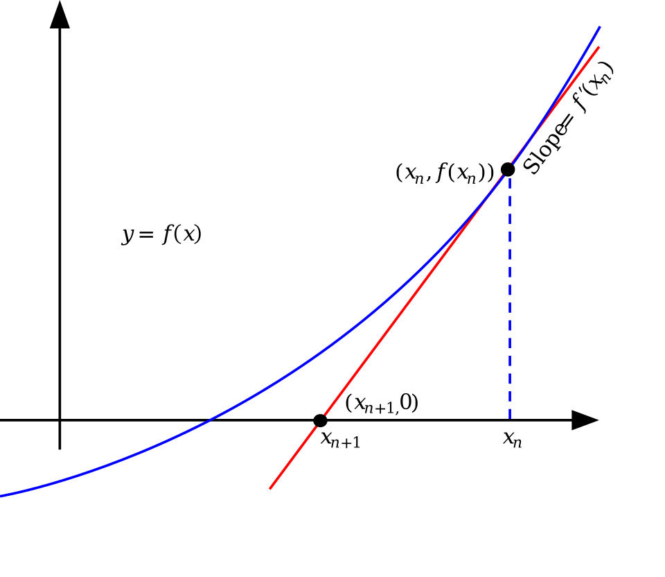

# Capítulo 46 — Proyecto: métodos numéricos

`is/2` evalúa una expresión cuyas variables ya tienen valor
([sección 8.1](../capitulo-08-aritmetica/index.md#81-evaluacion-de-expresiones)), pero no encuentra el valor que hace verdadera una
ecuación: `X + 1 is 1 / X` produce un error de instanciación, porque la
expresión de la derecha tiene una variable libre. El programa del
[capítulo 43](../capitulo-43-proyecto-resolver-ecuaciones/index.md) resuelve ecuaciones de manera simbólica, reescribiéndolas hasta
aislar la incógnita; cuando la incógnita aparece donde ninguna regla la
aísla, como en x = cos(x), ese programa recurre a un método numérico. Este
capítulo construye esos métodos: programas que no manipulan la ecuación,
sino que la evalúan en puntos elegidos y producen una sucesión de
aproximaciones que se acerca a una raíz.

{ style="background-color: white" }

Un paso del método de Newton: la recta tangente a la curva y = f(x) en la
aproximación xₙ corta el eje horizontal en xₙ₊₁, que queda más cerca del
punto donde la curva corta el eje, la raíz buscada. Repetir el paso
produce la sucesión de aproximaciones; la
[sección 46.5](#465-version-3-newton-con-la-derivada-simbolica) lo programa.
Imagen: Olegalexandrov (original) y Pbroks13 (versión vectorial), dominio
público, vía
[Wikimedia Commons](https://commons.wikimedia.org/wiki/File:Newton_iteration.svg).

El programa crece en seis versiones: la bisección, que no puede fallar pero
avanza despacio; la secante, más rápida pero sin garantías; el método de
Newton, con la derivada exacta que calcula `derivar/3` del
[capítulo 32](../capitulo-32-inspeccion-de-terminos/index.md); el método de Gauss–Seidel para sistemas de ecuaciones
lineales; un resolvedor que elige el método y recurre al siguiente cuando
uno falla; y, por último, el programa original de Covington, que recibe la
incógnita como una variable de Prolog. Todas comparten un único ciclo de
iteración con su tolerancia, y una sección entre la tercera y la cuarta mide
cómo converge cada método y qué limita la tolerancia.

El proyecto parte de dos fuentes. De *Prolog Programming in Depth* de
Michael Covington, Donald Nute y André Vellino, apartado 7.13 «Solving
equations numerically» ([edición gratuita de los
autores](https://www.covingtoninnovations.com/books/PPID.pdf)), toma el
método de la secante sobre la diferencia entre los dos miembros de la
ecuación y los tres modos en que ese método falla, que la
[sección 46.4](#464-version-2-la-secante) reproduce. De *Prolog Techniques* de Attila Csenki,
apartado 2.5.4 «Application: The Gauss–Seidel Method» (distribuido de manera
gratuita por Bookboon; [página de la editorial, copia de archivo](https://web.archive.org/web/20220123025207/https://bookboon.com/en/prolog-techniques-applications-of-prolog-ebook?mediaType=ebook)), toma la formulación de Gauss–Seidel como la
actualización de una incógnita por vez con los valores más recientes de las
demás, y el sistema de cuatro ecuaciones que una de las pruebas resuelve. El
código es propio: la secante se escribe como un paso del ciclo común, y el
barrido de Gauss–Seidel recorre las filas sin rotar la matriz, con una
tolerancia en lugar de un número fijo de iteraciones. La bisección, el método
de Newton y la comparación de su convergencia siguen la presentación de los
textos de análisis numérico a los que remiten las dos fuentes: Hamming y
*Numerical Recipes* de Press y otros, citados por Covington, y *Advanced
Engineering Mathematics* de Kreyszig, citado por Csenki (los datos completos
están en las [Referencias](#referencias)).

Todos los ejemplos cargan los programas del [capítulo 32](../capitulo-32-inspeccion-de-terminos/index.md), y por eso
ninguno corre en SWISH: se ejecutan con SWI-Prolog instalado.

## Objetivos del capítulo

Al terminar el capítulo, el lector puede:

- representar una ecuación como un término y evaluarla en un punto con la
  evaluación del [capítulo 32](../capitulo-32-inspeccion-de-terminos/index.md);
- escribir un método iterativo como un paso que se repite dentro de un ciclo
  común, con una tolerancia y un límite de pasos;
- programar la bisección, la secante y el método de Newton, y reconocer las
  condiciones en que cada uno falla;
- usar una derivada simbólica calculada una vez como parte de un método
  numérico;
- medir la convergencia de una sucesión de aproximaciones y elegir una
  tolerancia que los números de punto flotante puedan alcanzar;
- resolver un sistema de ecuaciones lineales por Gauss–Seidel y reconocer
  cuándo converge;
- combinar varios métodos en un resolvedor que recurre al siguiente cuando
  uno falla;
- escribir la incógnita como una variable de Prolog, encontrarla dentro de
  la ecuación y evaluar la ecuación sobre copias, sin modificar el
  programa.

!!! info "Tiempo estimado"
    Leer el capítulo, ejecutar sus ejemplos y hacer las actividades: **1:40 h**.
    Resolver los 6 ejercicios marcados con ★: **1:55 h**.
    Resolver los 14 ejercicios del final: **4:20 h**.

## 46.1 El programa terminado

`metodos.pl` carga las cuatro versiones anteriores y agrega `resolver/5`,
que recibe la ecuación, la incógnita y un punto de partida —un número o un
intervalo `A-B`— y responde con la raíz y el método que la encontró:

```prolog
?- resolver(x ^ 2 = 2, x, 1, R, M).
R = 1.414213562373095,
M = newton.

?- resolver(x ^ 3 - 2 * x + 2 = 0, x, 0, R, M).
R = -1.7692923542386314,
M = secante.

?- resolver(x = cos(x), x, 0-1, R, M).
R = 0.7390851332151607,
M = secante.

?- resolver(sin(x) = 0.01, x, 0-3, R, M).
R = 0.010000166673535205,
M = biseccion.
```

La primera ecuación la resuelve Newton. En la segunda, Newton entra en un
ciclo y el resolvedor recurre a la secante; la tercera no se puede derivar
con `derivar/3`; en la cuarta, la secante encuentra una raíz fuera del
intervalo pedido, y la bisección, que nunca sale de él, da la que está
dentro. Para un sistema de ecuaciones lineales, `gauss_seidel/3` recibe las
filas de coeficientes y los términos independientes:

```prolog
?- gauss_seidel([[4, 1, -1], [1, 5, 2], [2, -1, 6]], [3, 17, 18], Xs).
Xs = [0.9999999999999524, 1.999999999999958, 3.000000000000009].
```

La solución exacta es x = 1, y = 2, z = 3; la respuesta difiere de ella en
menos de 1.0e-12, la tolerancia del método. Ninguna respuesta de este
capítulo es exacta, y las pruebas de `ejemplos/capitulo-46/` comparan cada
resultado con el esperado mediante una tolerancia, nunca con `==`.

El programa se reparte en siete archivos, uno por versión más la base común:

| Archivo | Contenido | Sección |
|---|---|---|
| `iteracion.pl` | la ecuación como término y el ciclo `iterar/4` | [46.2](#462-la-ecuacion-como-termino-y-el-ciclo-de-iteracion) |
| `biseccion.pl` | versión 1, la bisección | [46.3](#463-version-1-la-biseccion) |
| `secante.pl` | versión 2, la secante | [46.4](#464-version-2-la-secante) |
| `newton.pl` | versión 3, Newton con `derivar/3` | [46.5](#465-version-3-newton-con-la-derivada-simbolica) |
| `gauss_seidel.pl` | versión 4, sistemas lineales | [46.7](#467-version-4-sistemas-lineales-por-gaussseidel) |
| `metodos.pl` | versión 5, el resolvedor | [46.8](#468-version-5-un-resolvedor-que-elige-el-metodo) |
| `covington.pl` | versión 6, la incógnita como variable | [46.9](#469-version-6-la-incognita-como-variable-de-prolog) |

## 46.2 La ecuación como término y el ciclo de iteración

Una ecuación se escribe como un término cerrado con la incógnita como un
átomo: `x ^ 2 = 2`, o `x ^ 2 - 2` para decir que la expresión vale cero.
Resolver `Izq = Der` equivale a encontrar un cero de la diferencia
`Izq - Der`, la función que Covington llama *Dif*. `funcion/2` la construye,
y `valor_en/4` la evalúa en un punto con `evaluar/3`, la solución del
[ejercicio 12 del capítulo 32](../capitulo-32-inspeccion-de-terminos/soluciones.md#12), que reemplaza cada incógnita por su valor y evalúa
el resultado con `is/2`:

<!-- ejemplo: capitulo-46/iteracion.pl predicado: funcion/2 valor_en/4 -->
```prolog
%!  funcion(+Ecuacion, -F) is det.
%
%   F es la expresión cuyo cero resuelve Ecuacion: Izq - Der si Ecuacion es
%   Izq = Der, y la misma Ecuacion en otro caso.
funcion(Ecuacion, F) :-
    (   Ecuacion = (Izq = Der)
    ->  F = Izq - Der
    ;   F = Ecuacion
    ).

%!  valor_en(+F, +X:atom, +A:number, -V:float) is det.
%
%   V es el valor de la expresión F con la incógnita X reemplazada por A,
%   como número de punto flotante. Otro átomo en F produce un error de
%   existencia.
valor_en(F, X, A, V) :-
    evaluar(F, [X-A], V0),
    V is float(V0).
```

```prolog
?- funcion(x * x = 2, F).
F = x*x-2.

?- valor_en(x ^ 2 - 2, x, 1.5, V).
V = 0.25.

?- valor_en(x + y, x, 1, V).
ERROR: incognita `y' does not exist
ERROR: In:
ERROR:   [22] throw(error(existence_error(incognita,y),_11732))
```

`valor_en/4` convierte el resultado a punto flotante, de modo que todos los
métodos trabajan con el mismo tipo de número aunque la ecuación y el punto
de partida sean enteros. El error de la tercera consulta viene de
`evaluar/3`: un átomo que no es la incógnita no tiene valor, y el programa
no lo confunde con un cero.

Los tres métodos de una ecuación, y también el de los sistemas, repiten lo
mismo: calcular una aproximación a partir de la anterior, decidir si el
cambio es suficientemente pequeño, y detenerse o seguir. Lo que distingue a
un método es solo cómo calcula la aproximación siguiente. El ciclo se
escribe una vez, en `iterar/4`, y cada método aporta su **paso**: un
predicado que recibe un estado y da el estado siguiente, la aproximación que
le corresponde y el cambio respecto de la anterior.

<!-- ejemplo: capitulo-46/iteracion.pl fragmento: :- meta_predicate .. maximo_de_pasos(100). -->
```prolog
:- meta_predicate
    iterar(4, +, +, -),
    iterar(4, +, +, +, -).

% maximo_de_pasos(N): ningún método da más de N pasos.
maximo_de_pasos(100).
```

<!-- ejemplo: capitulo-46/iteracion.pl predicado: iterar/4 iterar/5 -->
```prolog
%!  iterar(:Paso, +Tol:float, +Estado0, -Aproximaciones:list) is semidet.
%
%   Aproximaciones son las que da Paso, un paso tras otro, desde Estado0,
%   hasta el primero cuyo cambio es menor o igual que Tol. call(Paso, E0,
%   E, X, Cambio) da el estado E que sigue a E0, su aproximación X y el
%   Cambio respecto de la anterior. Falla si un paso falla o si la
%   tolerancia no se alcanza en maximo_de_pasos/1 pasos.
iterar(Paso, Tol, Estado0, Aproximaciones) :-
    maximo_de_pasos(Maximo),
    iterar(Paso, Tol, Maximo, Estado0, Aproximaciones).

%!  iterar(:Paso, +Tol:float, +Restantes:integer, +Estado0,
%!         -Aproximaciones:list) is semidet.
%
%   Como iterar/4, con a lo sumo Restantes pasos.
iterar(Paso, Tol, Restantes, Estado0, [X|Xs]) :-
    Restantes > 0,
    call(Paso, Estado0, Estado, X, Cambio),
    (   Cambio =< Tol
    ->  Xs = []
    ;   Restantes1 is Restantes - 1,
        iterar(Paso, Tol, Restantes1, Estado, Xs)
    ).
```

El estado es lo que cada método necesita recordar entre dos pasos —un
intervalo, dos puntos, un vector—, y la aproximación es lo que se entrega al
usuario. `iterar/4` devuelve la lista de todas las aproximaciones, no solo
la última: la [sección 46.6](#466-convergencia-y-tolerancia) la usa para medir cómo converge
cada método. La tolerancia se compara con el cambio de un paso, y
`maximo_de_pasos/1` limita el ciclo a cien pasos, de modo que un método que
no converge termina con un fallo en lugar de iterar sin fin. La declaración
`meta_predicate` hace que el paso se llame en el módulo de quien llama a
`iterar/4`, como en la [sección 18.6](../capitulo-18-orden-superior/index.md#186-escribir-un-predicado-de-orden-superior): las pruebas de `iteracion.plt`
definen sus propios pasos y los pasan al ciclo.

## 46.3 Versión 1: la bisección

Si una función continua tiene signos opuestos en los extremos de un
intervalo, tiene al menos un cero dentro de él. La **bisección** parte el
intervalo por la mitad, evalúa la función en el punto medio y se queda con
la mitad en cuyos extremos el signo sigue cambiando. El estado es el
intervalo, con el valor de la función en su extremo izquierdo para no
volver a calcularlo, y la aproximación es el punto medio:

<!-- ejemplo: capitulo-46/biseccion.pl predicado: biseccion/5 paso_biseccion/6 -->
```prolog
%!  biseccion(+Ecuacion, +X:atom, +Intervalo, +Tol:float,
%!            -Aproximaciones:list(float)) is semidet.
%
%   Aproximaciones son los puntos medios de los intervalos sucesivos, hasta
%   que el ancho del intervalo es menor o igual que Tol. Intervalo es A-B
%   con A < B, y la función debe tener signos opuestos en A y en B, o se
%   produce un error de dominio.
biseccion(Ecuacion, X, A0-B0, Tol, Xs) :-
    funcion(Ecuacion, F),
    A is float(A0),
    B is float(B0),
    valor_en(F, X, A, FA),
    valor_en(F, X, B, FB),
    (   A < B,
        FA * FB =< 0
    ->  iterar(paso_biseccion(F, X), Tol, intervalo(A, FA, B), Xs)
    ;   domain_error(intervalo_con_cambio_de_signo, A0-B0)
    ).

%!  paso_biseccion(+F, +X:atom, +Intervalo0, -Intervalo, -M:float,
%!                 -Ancho:float) is det.
%
%   Intervalo es la mitad de Intervalo0, intervalo(A, FA, B), en la que F
%   cambia de signo; M es el punto medio y Ancho el ancho de la mitad.
paso_biseccion(F, X, intervalo(A, FA, B), Intervalo, M, Ancho) :-
    M is (A + B) / 2,
    valor_en(F, X, M, FM),
    Ancho is (B - A) / 2,
    (   FA * FM =< 0
    ->  Intervalo = intervalo(A, FA, M)
    ;   Intervalo = intervalo(M, FM, B)
    ).
```

`biseccion/4` usa una tolerancia de 1.0e-12 y da solo la última
aproximación:

```prolog
?- biseccion(x ^ 2 = 2, x, 1-2, R).
R = 1.4142135623724243.

?- biseccion(x ^ 2 = 2, x, 1-2, 1.0e-3, Xs).
Xs = [1.5, 1.25, 1.375, 1.4375, 1.40625, 1.421875, 1.4140625, 1.41796875, 1.416015625|...].
```

Cada paso reduce el ancho del intervalo a la mitad, y el ancho acota el
error de la aproximación. La cantidad de pasos se conoce antes de empezar:
es el menor n para el que el ancho inicial dividido por 2ⁿ no supera la
tolerancia, y no depende de la ecuación.

!!! question "Actividad"
    Predecir, sin ejecutarlas, cuántas aproximaciones da
    `biseccion(x ^ 2 = 2, x, 1-2, 1.0e-3, Xs)` y cuántas con 1.0e-12 en
    lugar de 1.0e-3, y cuántas daría el intervalo `0-8` con 1.0e-3.
    Comprobarlo con `length/2`.

La garantía tiene un precio. El método necesita un intervalo con cambio de
signo, y sin él no tiene dónde empezar:

```prolog
?- biseccion(x ^ 2 = 2, x, 2-3, R).
ERROR: Domain error: `intervalo_con_cambio_de_signo' expected, found `2-3'
ERROR: In:
ERROR:   [15] throw(error(domain_error(intervalo_con_cambio_de_signo,...),_11572))
```

Es un error y no un fallo, como pide la [sección 25.5](../capitulo-25-errores-y-excepciones/index.md#255-fallo-o-error): el
intervalo no cumple la condición del método, lo que no dice nada sobre si
la ecuación tiene raíces. Una raíz doble, como la de x² = 0, no cambia el
signo de la función, y la bisección no la encuentra con ningún intervalo.
Y el avance es lento: un bit de la respuesta por paso, cuarenta pasos para
doce cifras decimales, porque el método usa solo el signo de la función y
descarta su valor. Un punto donde la función vale casi cero y otro donde
vale mucho se tratan igual.

## 46.4 Versión 2: la secante

El método de la **secante** usa el valor de la función. Parte de dos
aproximaciones, X0 y X1, traza la recta que pasa por los puntos
(X0, F(X0)) y (X1, F(X1)), y toma como aproximación siguiente el punto
donde esa recta corta el eje. Es el método de Covington: la pendiente de la
recta mide cuánto cambia la función por unidad de x, y el cociente entre el
valor de la función y esa pendiente dice cuánto mover x para llevar la
función a cero. El estado son los dos últimos puntos con sus valores:

<!-- ejemplo: capitulo-46/secante.pl predicado: secante/5 paso_secante/6 -->
```prolog
%!  secante(+Ecuacion, +X:atom, +Inicio, +Tol:float,
%!          -Aproximaciones:list(float)) is semidet.
%
%   Aproximaciones son las que da el método desde Inicio, X0-X1, hasta que
%   dos seguidas difieren en Tol o menos. Falla si dos aproximaciones
%   seguidas tienen el mismo valor de la función (la secante no corta el
%   eje) o si no converge en maximo_de_pasos/1 pasos.
secante(Ecuacion, X, X0-X1, Tol, Xs) :-
    funcion(Ecuacion, F),
    A is float(X0),
    B is float(X1),
    valor_en(F, X, A, FA),
    valor_en(F, X, B, FB),
    iterar(paso_secante(F, X), Tol, secante(A, FA, B, FB), Xs).

%!  paso_secante(+F, +X:atom, +Estado0, -Estado, -X2:float,
%!               -Cambio:float) is semidet.
%
%   X2 es el punto donde la secante por los dos puntos de Estado0,
%   secante(X0, F0, X1, F1), corta el eje; Estado tiene los dos últimos
%   puntos. Falla si F0 y F1 son iguales.
paso_secante(F, X, secante(X0, F0, X1, F1), secante(X1, F1, X2, F2), X2,
             Cambio) :-
    F1 =\= F0,
    X2 is X1 - F1 * (X1 - X0) / (F1 - F0),
    valor_en(F, X, X2, F2),
    Cambio is abs(X2 - X1).
```

```prolog
?- secante(x ^ 2 = 2, x, 1-2, 1.0e-12, Xs).
Xs = [1.3333333333333335, 1.4000000000000001, 1.4146341463414633, 1.41421143847487, 1.4142135620573204, 1.4142135623730954, 1.4142135623730951].

?- secante(x = cos(x), x, 1-2, R).
R = 0.7390851332151607.
```

Siete pasos en lugar de cuarenta, y las dos aproximaciones iniciales no
necesitan rodear la raíz: la segunda consulta parte de 1 y 2, y la raíz está
en 0.739. Pero el método ya no tiene garantías, y Covington describe tres
maneras en que falla, las tres reproducidas en `secante.plt`:

```prolog
?- secante(x * x = x * 3, x, 1-2, R).
false.

?- secante(sin(x) = 0.001, x, 1-2, R).
false.

?- secante(sin(x) = 0.01, x, 1-2, R).
R = 213.6383006107801.
```

En la primera, la función vale −2 en 1 y en 2: la secante es horizontal y
no corta el eje, y `paso_secante/6` falla en lugar de dividir por cero. En
la segunda, las aproximaciones saltan de una onda del seno a otra sin
acercarse a ninguna raíz, y el ciclo agota sus cien pasos. En la tercera, el
método converge, pero a una raíz a más de doscientas unidades del punto de
partida, cuando hay una cerca de 0.01: la secante casi horizontal cerca del
máximo del seno lanza la aproximación lejos. Covington concluye que estos
fallos se evitan a menudo eligiendo otras aproximaciones iniciales; la
[sección 46.8](#468-version-5-un-resolvedor-que-elige-el-metodo) los evita recurriendo a la bisección cuando hay un
intervalo.

La limitación que motiva la versión siguiente está en la pendiente misma:
la secante la estima con dos puntos, y la estimación es tanto peor cuanto
más lejos están. La pendiente exacta en un punto es la derivada.

## 46.5 Versión 3: Newton con la derivada simbólica

El método de **Newton** reemplaza la secante por la tangente: la aproximación
siguiente es el punto donde la recta tangente a la función en X0 corta el
eje, X1 = X0 − F(X0) / F'(X0). La derivada se calcula de manera simbólica,
con `derivar/3`, la solución del
[ejercicio 13 del capítulo 32](../capitulo-32-inspeccion-de-terminos/soluciones.md#13), que deriva una expresión con `+`, `-`, `*`
y `^` y simplifica el resultado:

```prolog
?- derivar(x ^ 3 - 2 * x + 2, x, D).
D = 3*x^2-2.
```

`newton.pl` carga ese programa, calcula la derivada una sola vez, antes de
iterar, y la evalúa en cada paso con `valor_en/4`, igual que a la función.
El estado es la aproximación misma:

<!-- ejemplo: capitulo-46/newton.pl predicado: newton/5 paso_newton/7 -->
```prolog
%!  newton(+Ecuacion, +X:atom, +X0:number, +Tol:float,
%!         -Aproximaciones:list(float)) is semidet.
%
%   Aproximaciones son las que da el método desde X0, hasta que dos
%   seguidas difieren en Tol o menos. Falla si la derivada se anula en una
%   aproximación o si no converge en maximo_de_pasos/1 pasos. Ecuacion
%   solo puede usar +, -, * y ^ con exponente numérico, o derivar/3
%   produce un error de dominio.
newton(Ecuacion, X, X0, Tol, Xs) :-
    funcion(Ecuacion, F),
    derivar(F, X, DF),
    A is float(X0),
    iterar(paso_newton(F, DF, X), Tol, A, Xs).

%!  paso_newton(+F, +DF, +X:atom, +X0:float, -X1:float, -X1:float,
%!              -Cambio:float) is semidet.
%
%   X1 es el punto donde la tangente a F en X0 corta el eje; DF es la
%   derivada de F. El estado y la aproximación son el mismo número. Falla
%   si la derivada vale 0 en X0.
paso_newton(F, DF, X, X0, X1, X1, Cambio) :-
    valor_en(F, X, X0, F0),
    valor_en(DF, X, X0, D0),
    D0 =\= 0,
    X1 is X0 - F0 / D0,
    Cambio is abs(X1 - X0).
```

```prolog
?- newton(x ^ 2 = 2, x, 1, 1.0e-12, Xs).
Xs = [1.5, 1.4166666666666667, 1.4142156862745099, 1.4142135623746899, 1.4142135623730951, 1.414213562373095].
```

Seis pasos desde un solo punto. La última aproximación difiere de la
secante en la última cifra: 1.4142135623730951 y 1.414213562373095 son dos
números de punto flotante vecinos, y las dos distan de √2 menos de lo que
separa a dos flotantes consecutivos cerca de ese valor. Por eso las pruebas
comparan con una tolerancia.

Newton comparte las debilidades de la secante. La derivada puede anularse,
y entonces la tangente es horizontal:
`newton(x ^ 2 - 2, x, 0, R)` falla en el primer paso. Y las aproximaciones
pueden repetirse en un ciclo:

```prolog
?- newton(x ^ 3 - 2 * x + 2 = 0, x, 0, R).
false.

?- newton(x ^ 3 - 2 * x + 2 = 0, x, -2, R).
R = -1.7692923542386314.
```

Desde 0, la función vale 2 y la derivada −2, y el paso lleva a 1; desde 1,
la función vale 1 y la derivada 1, y el paso vuelve a 0. El cambio es
siempre 1, y el ciclo agota sus pasos. Desde −2, el método converge en
cinco pasos. La tercera limitación es la de `derivar/3`, que solo conoce
cuatro operaciones:

```prolog
?- newton(x = cos(x), x, 1, R).
ERROR: Domain error: `expresion_derivable' expected, found `cos(x)'
ERROR: In:
ERROR:   [18] throw(error(domain_error(expresion_derivable,...),_11458))
```

La ecuación que la secante resolvía en la sección anterior está fuera del
alcance de Newton mientras el derivador no conozca el coseno; el
[ejercicio 6](#ejercicios) lo extiende.

!!! question "Actividad"
    Predecir qué responden `newton(x ^ 2 - 2, x, -1, R)`,
    `newton(x ^ 2 - 2, x, 0, R)` y `newton(x ^ 2 + 1, x, 1, R)`, y en qué
    paso y por qué razón falla cada una de las que fallan. Comprobarlo, y
    calcular a mano las dos primeras aproximaciones de la tercera.

## 46.6 Convergencia y tolerancia

La lista de aproximaciones permite medir cómo se acerca cada método a la
raíz. `errores/3`, de `metodos.pl`, calcula la distancia de cada
aproximación al valor exacto:

<!-- ejemplo: capitulo-46/metodos.pl predicado: errores/3 -->
```prolog
%!  errores(+Xs:list(float), +Exacto:number, -Es:list(float)) is det.
%
%   Es son las distancias de cada aproximación de Xs al valor Exacto.
errores(Xs, Exacto, Es) :-
    maplist(error_de(Exacto), Xs, Es).
```

```prolog
?- newton(x ^ 2 = 2, x, 1, 1.0e-12, Xs), errores(Xs, sqrt(2), Es).
Xs = [1.5, 1.4166666666666667, 1.4142156862745099, 1.4142135623746899, 1.4142135623730951, 1.414213562373095],
Es = [0.08578643762690485, 0.002453104293571595, 2.1239014147411694e-6, 1.5947243525715749e-12, 0.0, 2.220446049250313e-16].

?- secante(x ^ 2 = 2, x, 1-2, 1.0e-12, Xs), errores(Xs, sqrt(2), Es).
Xs = [1.3333333333333335, 1.4000000000000001, 1.4146341463414633, 1.41421143847487, 1.4142135620573204, 1.4142135623730954, 1.4142135623730951],
Es = [0.08088022903976166, 0.014213562373095012, 0.00042058396836819334, 2.1238982250704197e-6, 3.157747396898003e-10, 2.220446049250313e-16, 0.0].
```

Los exponentes de los errores de Newton son −2, −3, −6, −12: la cantidad de
cifras correctas se duplica en cada paso, lo que se llama **convergencia
cuadrática**. Los de la secante crecen más despacio, −2, −2, −4, −6, −10,
−16, con un factor cercano a 1.6 por paso, y los de la bisección, que no se
muestran completos, se reducen en promedio a la mitad por paso: la
**convergencia lineal**, con errores que ni siquiera decrecen siempre,
porque el punto medio puede alejarse de la raíz aunque el intervalo se
achique. La tabla resume los pasos que da cada método para la misma
ecuación y la misma tolerancia:

| Método | Pasos para √2 con 1.0e-12 | Evaluaciones por paso | Converge |
|---|---|---|---|
| bisección | 40 | 1 de la función | siempre, con un intervalo con cambio de signo |
| secante | 7 | 1 de la función | cerca de una raíz simple |
| Newton | 6 | 1 de la función y 1 de la derivada | cerca de una raíz simple |

La convergencia cuadrática de Newton supone una raíz **simple**, donde la
derivada no se anula. En una raíz doble, el método pierde esa velocidad:

```prolog
?- newton(x ^ 2 = 0, x, 1, 1.0e-12, Xs), length(Xs, N).
Xs = [0.5, 0.25, 0.125, 0.0625, 0.03125, 0.015625, 0.0078125, 0.00390625, 0.001953125|...],
N = 40.
```

Cada paso reduce el error a la mitad, como la bisección, que en este caso
ni siquiera se puede aplicar. El [ejercicio 7](#ejercicios) recupera la
velocidad cuando se conoce la multiplicidad de la raíz.

### Lo que la tolerancia puede pedir

El criterio de parada compara el cambio de un paso con la tolerancia. No es
el error, que no se conoce —si se conociera la raíz no habría que buscarla—,
sino una estimación: en un método que converge rápido, el cambio de un paso
es aproximadamente el error del paso anterior. La tolerancia tiene además un
límite inferior que no depende del método: los números de punto flotante
están separados por una distancia que crece con su magnitud, y cerca de
√(2·10¹²) esa distancia es mayor que 1.0e-12:

```prolog
?- D is nexttoward(1414213.562373095, 2.0e6) - 1414213.562373095.
D = 2.3283064365386963e-10.

?- biseccion(x ^ 2 = 2.0e12, x, 0-2.0e6, R).
false.
```

El intervalo de la bisección se reduce hasta que sus extremos son dos
flotantes vecinos; entonces el punto medio coincide con uno de ellos, el
ancho deja de reducirse, y la tolerancia no se alcanza nunca. Sin
`maximo_de_pasos/1`, la consulta no terminaría; con él, falla después de
cien pasos. Lo mismo sucede con una tolerancia de 0.0 en Newton, cuyas
últimas aproximaciones de √2 alternan entre los dos flotantes vecinos de la
[sección 46.5](#465-version-3-newton-con-la-derivada-simbolica):

```prolog
?- newton(x ^ 2 = 2, x, 1, 0.0, Xs).
false.
```

La tolerancia absoluta de 1.0e-12 es adecuada para raíces de magnitud
cercana a 1; para raíces grandes hace falta una tolerancia **relativa**,
proporcional a la magnitud de la aproximación, que el [ejercicio 4](#ejercicios)
agrega al ciclo.

!!! question "Actividad"
    Predecir si `biseccion(x ^ 2 = 2.0e6, x, 0-2.0e3, R)` alcanza la
    tolerancia de 1.0e-12, calculando antes con `nexttoward/2` la distancia
    entre flotantes cerca de la raíz. Comprobarlo, y buscar la menor
    potencia de diez que sirve como tolerancia para esa ecuación.

## 46.7 Versión 4: sistemas lineales por Gauss–Seidel

Un sistema de n ecuaciones lineales con n incógnitas se escribe como la
lista de las filas de coeficientes y la lista de los términos
independientes. El sistema de la [sección 46.1](#461-el-programa-terminado) es:

| Ecuación | Fila | Término |
|---|---|---|
| 4x + y − z = 3 | `[4, 1, -1]` | 3 |
| x + 5y + 2z = 17 | `[1, 5, 2]` | 17 |
| 2x − y + 6z = 18 | `[2, -1, 6]` | 18 |

El método de **Gauss–Seidel** despeja de la ecuación i la incógnita i:
x = (3 − y + z) / 4, y = (17 − x − 2z) / 5, z = (18 − 2x + y) / 6. Un
**barrido** calcula las tres en orden, y cada una usa los valores más
recientes de las demás: la y de un barrido usa la x del mismo barrido, que
ya se calculó, y la z del anterior. Csenki escribe el paso como la
actualización de la primera incógnita, con la diagonal de la matriz igual a
1, y rota las filas, los términos y las incógnitas después de cada
actualización para que la siguiente pase a ser la primera. `barrido/5`
recorre las filas sin rotarlas: lleva los valores nuevos ya calculados y los
viejos que faltan, y en la fila i separa los coeficientes que multiplican a
unos y a otros. Divide por el coeficiente de la diagonal, que puede ser
cualquiera distinto de cero.

<!-- ejemplo: capitulo-46/gauss_seidel.pl predicado: gauss_seidel/5 paso_gauss_seidel/6 barrido/5 -->
```prolog
%!  gauss_seidel(+Filas:list(list(number)), +Bs:list(number),
%!               +X0s:list(number), +Tol:float,
%!               -Aproximaciones:list(list(float))) is semidet.
%
%   Aproximaciones son los vectores que da cada barrido desde X0s, hasta
%   que ninguna componente cambia en más de Tol. Falla si un coeficiente
%   de la diagonal es 0 o si no converge en maximo_de_pasos/1 barridos.
gauss_seidel(Filas, Bs, X0s, Tol, Aproximaciones) :-
    iterar(paso_gauss_seidel(Filas, Bs), Tol, X0s, Aproximaciones).

%!  paso_gauss_seidel(+Filas, +Bs, +X0s, -Xs, -Xs, -Cambio:float)
%!      is semidet.
%
%   Xs es el resultado de un barrido desde X0s; Cambio es el mayor cambio
%   de una componente.
paso_gauss_seidel(Filas, Bs, X0s, Xs, Xs, Cambio) :-
    barrido(Filas, Bs, [], X0s, Xs),
    foldl(mayor_diferencia, X0s, Xs, 0.0, Cambio).

%!  barrido(+Filas, +Bs, +Nuevos:list(float), +Viejos:list(number),
%!          -Xs:list(float)) is semidet.
%
%   Xs es Nuevos, los valores ya calculados en este barrido, seguido de
%   los que se calculan con las Filas que faltan. Viejos son los valores
%   anteriores de esas incógnitas. Falla si un coeficiente de la diagonal
%   es 0.
barrido([], [], Xs, [], Xs).
barrido([Fila|Filas], [B|Bs], Nuevos, [_|Viejos], Xs) :-
    length(Nuevos, K),
    length(Izquierda, K),
    append(Izquierda, [Diagonal|Derecha], Fila),
    Diagonal =\= 0,
    producto_escalar(Izquierda, Nuevos, P1),
    producto_escalar(Derecha, Viejos, P2),
    X is (B - P1 - P2) / Diagonal,
    append(Nuevos, [X], Nuevos1),
    barrido(Filas, Bs, Nuevos1, Viejos, Xs).
```

El paso encaja en `iterar/4` sin cambios en el ciclo: el estado y la
aproximación son el vector, y el cambio es el mayor cambio de una
componente. Con una tolerancia de 1.0e-2, el ciclo se detiene en el quinto
barrido:

```prolog
?- gauss_seidel([[4, 1, -1], [1, 5, 2], [2, -1, 6]], [3, 17, 18], [0, 0, 0], 1.0e-2, Xs).
Xs = [[0.75, 3.25, 3.2916666666666665], [0.7604166666666666, 1.93125, 3.0684027777777776], [1.0342881944444444, 1.9657812499999998, 2.9828674768518515], [1.004271556712963, 2.0059986979166666, 2.9995759307484566], [0.9983943082079475, 2.000490766059028, 3.000617024940522]].
```

Cada barrido gana poco menos de una cifra, y con 1.0e-12 hacen falta
diecinueve: la convergencia es lineal, y su velocidad depende del sistema.
La condición suficiente más usada es que la matriz sea de **diagonal
estrictamente dominante**: en cada fila, el valor absoluto del coeficiente de
la diagonal supera la suma de los valores absolutos de los demás. El sistema
del ejemplo la cumple (4 > 2, 5 > 3, 6 > 3). Las mismas ecuaciones en otro
orden no la cumplen, y el método diverge:

```prolog
?- gauss_seidel([[1, 5, 2], [4, 1, -1], [2, -1, 6]], [17, 3, 18], Xs).
false.
```

El sistema tiene la misma solución; lo que cambia es qué incógnita se despeja
de cada ecuación. Con la primera fila, x = 17 − 5y − 2z amplifica cada error
de y por cinco, y los errores crecen de un barrido a otro hasta que el
ciclo agota sus pasos. El [ejercicio 9](#ejercicios) busca un orden de las
filas que haga dominante la diagonal.

!!! question "Actividad"
    Predecir si Gauss–Seidel converge para el sistema de dos ecuaciones
    x + 2y = 3, 3x + y = 4, y para el mismo con las filas intercambiadas.
    Comprobarlo con `gauss_seidel/3`, y explicar la diferencia con la
    condición de la diagonal.

## 46.8 Versión 5: un resolvedor que elige el método

Cada método de una ecuación tiene una condición en la que falla, y las
condiciones son distintas: Newton necesita una expresión que `derivar/3`
sepa derivar y una derivada que no se anule; la secante, dos puntos cuya
secante corte el eje cerca de la raíz; la bisección, un intervalo con cambio
de signo. `resolver/5` los prueba en orden de velocidad, y acepta un
resultado solo si está dentro del intervalo pedido, cuando lo hay:

<!-- ejemplo: capitulo-46/metodos.pl predicado: resolver/5 derivable/1 -->
```prolog
%!  resolver(+Ecuacion, +X:atom, +Inicio, -Raiz:float, -Metodo:atom)
%!      is semidet.
%
%   Raiz es una raíz de Ecuacion en la incógnita X y Metodo el método que
%   la encontró. Inicio es un número, la primera aproximación, o un
%   intervalo A-B, y entonces Raiz está dentro de él. Falla si ningún
%   método encuentra una raíz; con un intervalo sin cambio de signo, si
%   Newton y la secante no dan una raíz dentro de él, produce el error de
%   dominio de biseccion/5.
resolver(Ecuacion, X, Inicio, Raiz, Metodo) :-
    punto_inicial(Inicio, X0),
    par_inicial(Inicio, Par),
    (   derivable(newton(Ecuacion, X, X0, Raiz0)),
        dentro(Inicio, Raiz0)
    ->  Raiz = Raiz0,
        Metodo = newton
    ;   secante(Ecuacion, X, Par, Raiz0),
        dentro(Inicio, Raiz0)
    ->  Raiz = Raiz0,
        Metodo = secante
    ;   Inicio = _-_
    ->  biseccion(Ecuacion, X, Inicio, Raiz),
        Metodo = biseccion
    ).

%!  derivable(:Meta) is semidet.
%
%   Ejecuta Meta, y falla en lugar del error de dominio que produce
%   derivar/3 con una expresión que no sabe derivar.
derivable(Meta) :-
    catch(Meta, error(domain_error(expresion_derivable, _), _), fail).
```

`derivable/1` convierte en un fallo solo el error de dominio de
`derivar/3`: cualquier otro error, como el de un átomo que no es la
incógnita, sigue siendo un error. Con un número como punto de partida, la
secante empieza en ese número y el siguiente, y no hay intervalo que
garantice la bisección:

```prolog
?- resolver(sin(x) = 0.01, x, 1, R, M).
R = 213.6383006107801,
M = secante.

?- resolver(x ^ 2 + 1 = 0, x, 1, R, M).
false.
```

La primera consulta es el fallo de Covington, que con el intervalo `0-3`
de la [sección 46.1](#461-el-programa-terminado) da la raíz cercana a cero. La segunda no tiene
raíces reales, y ningún método la encuentra. Una respuesta del resolvedor
no dice que la raíz sea la única, ni la más cercana al punto de partida: es
una raíz, con la precisión de la tolerancia. El programa del
[capítulo 43](../capitulo-43-proyecto-resolver-ecuaciones/index.md) usa un respaldo numérico de este tipo cuando el método
simbólico no puede aislar la incógnita, y devuelve en ese caso un valor
aproximado en lugar de una expresión.

## 46.9 Versión 6: la incógnita como variable de Prolog

Las versiones anteriores escriben la incógnita como un átomo y la reciben
como un argumento aparte. El programa original de Covington, en el apartado
7.13 de *Prolog Programming in Depth*, la escribe como una variable de
Prolog: `solve(X + 1 = 1 / X)` liga X con la raíz. La página
[La incógnita como variable de Prolog](covington.md#la-incognita-como-variable-de-prolog)
reescribe ese programa con las herramientas del capítulo: el evaluador
`:=/2` de Covington, con una cláusula por operación; `libre_en/2`, que
encuentra la incógnita dentro de la ecuación; y `resolver_libre/1`, que
evalúa la diferencia entre los dos miembros sobre copias de la ecuación
hechas con `copy_term/2`, en lugar de agregar una cláusula con `assert`, y
aplica la secante desde 1 y 2. La página termina comparando las dos
maneras de escribir la incógnita.

!!! success "Criterios de calidad"
    | Criterio | En este capítulo |
    |---|---|
    | C1 | cada predicado declara modos y determinación; los métodos son `semidet` porque pueden no converger, y lo dicen en el encabezado junto con las condiciones de su fallo |
    | C5 | un intervalo sin cambio de signo y una expresión que no se sabe derivar producen errores de dominio, y un átomo desconocido un error de existencia; la falta de convergencia es un fallo, porque no indica un error en los datos |
    | C6 | todo el programa es puro: el ciclo, los pasos y el resolvedor no tienen estado ni efectos; la tolerancia y el punto de partida son argumentos |
    | C7 | 113 pruebas en siete archivos; los resultados de punto flotante se comparan con una tolerancia, y cada fallo descrito en el texto (los tres de Covington, el ciclo de Newton, la tolerancia inalcanzable, el sistema que diverge) tiene su prueba |

## Ejercicios

Las soluciones están en [la página de soluciones](soluciones.md). La dificultad
va de 1 (se resuelve consultando el capítulo) a 3 (requiere elaboración propia).
Los marcados con ★ son los que no conviene saltear: cubren lo que el capítulo
tiene de propio.

1. ★ **(1)** Predecir, sin ejecutarlas, cuántas aproximaciones dan
   `biseccion(x ^ 3 = 10, x, 2-3, 1.0e-6, Xs)` y
   `newton(x ^ 3 = 10, x, 2, 1.0e-6, Xs)`, y comprobarlo. Explicar por qué
   la primera cantidad se puede calcular sin conocer la ecuación y la
   segunda no.
2. **(1)** Resolver la ecuación de Kepler E − 0.01 sen E = 2.5 del ejercicio
   7.13.1 de Covington con `secante/4` y con `resolver/5`. ¿Qué método elige
   el resolvedor, y por qué no usa Newton?
3. ★ **(2)** Explicar qué haría `biseccion(x ^ 2 = 2, x, 1-2, 1.0e-20, R)` si
   `iterar/5` no tuviera el límite de pasos, y por qué. Comprobar la
   explicación con una copia de `iterar/5` sin el límite, ejecutada con
   `call_with_inference_limit/3`.
4. ★ **(2)** Escribir `iterar_relativa/4`, igual a `iterar/4` salvo que se
   detiene cuando el cambio es menor o igual que Tol · max(1, |X|), donde X
   es la aproximación nueva. Escribir con él `biseccion_relativa/5`, y
   comprobar que resuelve `x ^ 2 = 2.0e12` en el intervalo `0-2.0e6`.
5. **(2)** El método de la **falsa posición** mantiene, como la bisección, un
   intervalo con cambio de signo, pero lo parte en el punto donde la secante
   por sus extremos corta el eje, no en el punto medio. Escribir
   `falsa_posicion/5` como un paso para `iterar/4`, con el cambio medido
   entre dos aproximaciones seguidas, y comparar sus pasos con los de la
   bisección y la secante para x² = 2 en `1-2`.
6. ★ **(3)** Escribir `derivar_ampliado/3`, que deriva además `sin`, `cos`,
   `exp` y `log` aplicados a cualquier expresión, con la regla de la cadena,
   y simplifica el resultado con `simplificar/2` del
   [capítulo 32](../capitulo-32-inspeccion-de-terminos/index.md). Escribir con él `newton_ampliado/5` y resolver
   x = cos(x) desde 1.
7. **(2)** En una raíz de multiplicidad m, el paso X1 = X0 − m · F(X0) /
   F'(X0) recupera la convergencia cuadrática. Escribir
   `newton_multiple/6`, con m como argumento, y comparar sus pasos con los
   de `newton/5` para (x − 1)² · (x + 2) = 0 desde 2.
8. ★ **(2)** El método de **Jacobi** calcula todas las incógnitas de un
   barrido con los valores del barrido anterior. Escribir `jacobi/5` con la
   misma interfaz que `gauss_seidel/5`, y comparar la cantidad de barridos
   de los dos para el sistema de la [sección 46.7](#467-version-4-sistemas-lineales-por-gaussseidel) con 1.0e-12.
9. **(2)** Escribir `diagonal_dominante/1`, que se cumple si la matriz tiene
   la diagonal estrictamente dominante, y `ordenar_filas/4`, que busca un
   orden de las filas (y de los términos) que la cumpla. Aplicarlo al sistema
   de la [sección 46.7](#467-version-4-sistemas-lineales-por-gaussseidel) con las filas desordenadas.
10. **(2)** Escribir `residuo(Filas, Bs, Xs, R)`: R es el mayor valor
    absoluto de las componentes de A·x − b. Calcularlo para la solución de
    `gauss_seidel/3` del ejemplo, y para la del sistema x + 0.95y = 1.95,
    0.95x + y = 1.95 con una tolerancia de 1.0e-3, cuya solución exacta es
    x = y = 1. Explicar por qué ni el cambio del último barrido ni el
    residuo acotan el error.
11. **(3)** Escribir `newton_sistema/4` para dos ecuaciones no lineales en
    x e y: en cada paso, las cuatro derivadas parciales se obtienen con
    `derivar/3` (que trata la otra incógnita como una constante) y el
    sistema lineal de dos por dos se resuelve por la regla de Cramer.
    Resolver x² + y² = 4, x · y = 1 desde (2, 0.5).
12. **(2)** Escribir `raices(Ecuacion, X, A-B, N, Rs)`: Rs son las raíces
    que se encuentran partiendo `A-B` en N intervalos iguales y aplicando la
    bisección en cada uno que tiene cambio de signo. Encontrar las raíces de
    sen(x) = 0 en `1-10`. ¿Qué raíces se pierden si N es demasiado chico?
13. **(2)** Escribir `valor_ampliado/2`, que evalúa como `:=/2` y además la
    potencia `X ^ N` con exponente entero, el opuesto `-X` y `sqrt/1`.
    Evaluar `sqrt(2 ^ 2 * 4) - -1` y `2 ^ -1`, y explicar por qué no basta
    con agregar tres cláusulas a `operacion/2`.
14. ★ **(2)** Escribir `resolver_variable(Ecuacion, Metodo)`, que recibe la
    ecuación con la incógnita como variable, como `resolver_libre/1`, la
    reemplaza en una copia por un átomo que no aparece en la ecuación y
    aplica `resolver/5` desde 1. Comparar sus respuestas con las de
    `resolver_libre/1` para `X * X = X * 3` y `X + 1 = 1 / X`.

## Resumen

| | |
|---|---|
| **método iterativo** | produce una sucesión de aproximaciones, cada una a partir de la anterior, que se acerca a la solución |
| **paso** | el cálculo de un método que da el estado siguiente, su aproximación y el cambio; `iterar/4` lo repite |
| **tolerancia** | el cambio máximo entre dos aproximaciones para detenerse; no puede ser menor que la distancia entre flotantes cerca de la raíz |
| **límite de pasos** | convierte la falta de convergencia en un fallo |
| **bisección** | parte un intervalo con cambio de signo; siempre converge, un bit por paso |
| **secante** | la recta por los dos últimos puntos; no necesita intervalo, puede no converger |
| **Newton** | la recta tangente, con la derivada exacta; convergencia cuadrática en una raíz simple |
| **raíz doble** | la derivada se anula en la raíz; Newton converge solo linealmente |
| **Gauss–Seidel** | cada incógnita se despeja de su ecuación con los valores más recientes; converge con diagonal dominante |
| `funcion/2`, `valor_en/4` | la ecuación como término y su valor en un punto, con la evaluación del [capítulo 32](../capitulo-32-inspeccion-de-terminos/index.md) |
| `iterar/4`, `maximo_de_pasos/1` | el ciclo común de los métodos |
| `biseccion/4,5`, `secante/4,5`, `newton/4,5` | los tres métodos para una ecuación; la versión de cinco argumentos da todas las aproximaciones |
| `gauss_seidel/3,5`, `barrido/5` | el método para sistemas lineales |
| `resolver/5`, `derivable/1` | el resolvedor que elige el método |
| `errores/3` | la distancia de cada aproximación al valor exacto |
| `:=/2`, `valor_c/2` | el evaluador de Covington, con una cláusula por operación |
| `libre_en/2`, `resolver_libre/1` | la incógnita como variable de Prolog, encontrada en la ecuación y ligada con la raíz |
| `nexttoward/2` | la función aritmética que da el flotante vecino en una dirección |

## Temas que se retoman

| Tema | Se retoma en |
|---|---|
| Las matrices como listas de listas, con aritmética exacta | [capítulo 47](../capitulo-47-proyecto-aritmetica-racional-matrices/index.md) |
| Un perceptrón entrenado por iteración, con su curva de aprendizaje | [capítulo 69](../capitulo-69-proyecto-perceptron/index.md) |

## Referencias

- Michael A. Covington, Donald Nute y André Vellino, *Prolog Programming in
  Depth*, Prentice Hall, 1997 — apartado 7.13, «Solving equations
  numerically», figuras 7.9 «An expression evaluator in Prolog», 7.10 y
  7.11 «A numerical equation solver».
  [Edición en línea](https://www.covingtoninnovations.com/books/PPID.pdf).
  El capítulo toma el método de la secante sobre la diferencia entre los
  dos miembros de la ecuación, los tres modos en que ese método falla y el
  ejercicio de la ecuación de Kepler, del ejercicio 7.13.3 la idea de un
  resolvedor que elige entre varios métodos, que es la versión 5, y para la
  versión 6 el evaluador `:=`, la búsqueda de la incógnita con `free_in/2`
  y la incógnita como variable de Prolog.
- Michael A. Covington, «A numerical equation solver in Prolog»,
  *Computer Language* 6 (10), octubre de 1989, págs. 45–51. Es el artículo
  original del programa SOLVER.PL que reproduce el apartado 7.13 de
  *Prolog Programming in Depth*; no tiene edición en línea.
- Richard W. Hamming, *Introduction to Applied Numerical Analysis*,
  McGraw-Hill, 1971, y William H. Press, Brian P. Flannery, Saul A.
  Teukolsky y William T. Vetterling, *Numerical Recipes: The Art of
  Scientific Computing*, Cambridge University Press, 1986 — los capítulos
  sobre raíces de ecuaciones no lineales. Son las dos obras a las que
  Covington remite para métodos mejores que la secante; de ese tema provienen
  la bisección, el método de Newton, la falsa posición y la distinción entre
  convergencia lineal y cuadrática de las
  secciones [46.3](#463-version-1-la-biseccion) a
  [46.6](#466-convergencia-y-tolerancia). Ninguna de las dos tiene una
  edición en línea gratuita.
- Attila Csenki, *Prolog Techniques*, Ventus Publishing (Bookboon), 2009 —
  apartado 2.5.4, «Application: The Gauss–Seidel Method».
  [Página de la editorial, copia de archivo](https://web.archive.org/web/20220123025207/https://bookboon.com/en/prolog-techniques-applications-of-prolog-ebook?mediaType=ebook).
  El capítulo toma la formulación de Gauss–Seidel como la actualización de
  una incógnita por vez con los valores más recientes de las demás, y el
  sistema de cuatro ecuaciones que una de las pruebas resuelve.
- Erwin Kreyszig, *Advanced Engineering Mathematics*, Wiley, 8.ª edición,
  1998 — el capítulo de métodos numéricos del álgebra lineal, apartado
  sobre la solución de sistemas por iteración. Es la fuente que Csenki cita
  para el método y para el sistema de cuatro ecuaciones de su ejemplo 2.1;
  trata también la condición de convergencia que la
  [sección 46.7](#467-version-4-sistemas-lineales-por-gaussseidel) enuncia
  como diagonal estrictamente dominante. No tiene edición en línea
  gratuita.
- Los programas `evaluar/3` y `derivar/3` son las soluciones de los
  ejercicios 12 y 13 del [capítulo 32](../capitulo-32-inspeccion-de-terminos/index.md),
  del propio curso.

El código del capítulo es propio, escrito para el curso: la secante es un
paso del ciclo de iteración común, y el barrido de Gauss–Seidel recorre las
filas sin rotar la matriz y se detiene por tolerancia, a diferencia del
programa de Csenki, que rota las filas y hace un número fijo de iteraciones.
