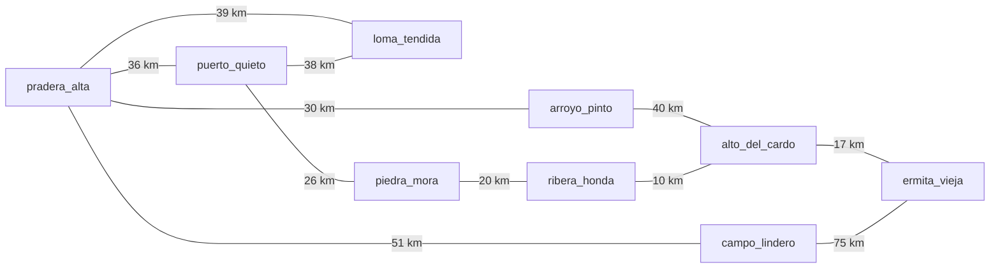

# Capítulo 47 — Proyecto: aritmética racional y matrices

La aritmética del [capítulo 8](../capitulo-08-aritmetica/index.md) trabaja con enteros exactos y con números de
punto flotante, que redondean en cada operación. Este proyecto agrega la
tercera clase de número que un programa de cálculo necesita, los
**racionales**, y los usa en dos programas que los aprovechan: una biblioteca
de matrices que invierte una matriz sin error de redondeo, y un planificador
de rutas que calcula el tiempo de cada tramo como una fracción exacta y
redondea una sola vez, al escribir el horario. El programa crece en siete
versiones. Las dos primeras construyen los racionales, primero como términos
y después con los números racionales de SWI-Prolog; las tres siguientes
construyen las matrices sobre ellos, con números y con símbolos; las dos
últimas planifican rutas.

El proyecto parte de tres enunciados de Clocksin y Mellish, *Programming in
Prolog* (5.ª edición), los proyectos 1 a 3 de «Advanced Projects» (11.2): un
paquete de aritmética racional, con los números representados como fracciones
o como mantisa y exponente; procedimientos para multiplicar e invertir
matrices; y un planificador que da la ruta entre dos ciudades con un horario
estimado, a partir de un mapa con distancias, estado de los caminos, tránsito,
pendientes y disponibilidad de combustible. El libro da solo los enunciados:
el capítulo toma de él el alcance de las tres partes y los atributos del
mapa, y escribe los programas. De W. F. Clocksin, *Clause and Effect*, el
apartado «Matrix Products by Symbolic Algebra» (6.2) del caso de estudio
«Term Rewriting», toma la observación de que el producto de matrices mueve
los datos de la misma manera sea numérico o simbólico, de modo que basta
cambiar el producto interno, y la necesidad de simplificar el resultado
simbólico. El programa reutiliza la evaluación
aritmética del [capítulo 8](../capitulo-08-aritmetica/index.md), las estructuras de la biblioteca del
[capítulo 22](../capitulo-22-estructuras-de-datos-de-la-biblioteca/index.md), el simplificador de expresiones del [capítulo 32](../capitulo-32-inspeccion-de-terminos/index.md#327-un-simplificador-de-expresiones), que
carga sin copiarlo, y la búsqueda de costo uniforme del
[capítulo 40](../capitulo-40-busqueda-y-planificacion/index.md#402-una-sola-busqueda-varias-estrategias).

## El programa terminado

`proyecto.pl` carga las versiones finales de las tres partes:

<!-- ejemplo: capitulo-47/proyecto.pl fragmento: :- ensure_loaded(inversa). .. :- ensure_loaded(rutas_combustible). -->
```prolog
:- ensure_loaded(inversa).
:- ensure_loaded(matriz_simbolica).
:- ensure_loaded(rutas_combustible).
```

La matriz de Hilbert de orden 4 tiene elementos fraccionarios, y su inversa,
calculada con racionales, tiene elementos enteros y exactos. La inversa de
la matriz de orden 12, calculada con números de punto flotante, está tan
lejos de la verdadera que el producto de las dos se aparta de la identidad
en más de 4 unidades:

```prolog
?- hilbert(4, racional, H), inversa(H, I).
H = [[1, 1r2, 1r3, 1r4], [1r2, 1r3, 1r4, 1r5], [1r3, 1r4, 1r5, 1r6], [1r4, 1r5, 1r6, 1r7]],
I = [[16, -120, 240, -140], [-120, 1200, -2700, 1680], [240, -2700, 6480, -4200], [-140, 1680, -4200, 2800]].

?- desvio_hilbert(12, flotante, E).
E = 4.267578125.
```

El planificador da el horario de un viaje por una región serrana, con un
vehículo que recorre 60 km con el tanque lleno, con las dos cargas de
combustible que el recorrido necesita:

```prolog
?- horario_con_carga(pradera_alta, ermita_vieja, 60, 8:00, H).
H = ['8:00'-pradera_alta, '8:33'-puerto_quieto, '8:48'-carga(puerto_quieto), '9:24'-piedra_mora, '9:45'-ribera_honda, '10:00'-carga(ribera_honda), '10:08'-alto_del_cardo, '10:21'-ermita_vieja].
```

## Objetivos del capítulo

Al terminar el capítulo, el lector puede:

- representar los racionales como términos en forma normal y evaluar
  expresiones sobre ellos, y explicar por qué la forma normal hace que la
  igualdad sea la unificación;
- usar los racionales de SWI-Prolog —`rdiv`, la sintaxis `1r3`,
  `rational/1`, `rational/3` y la bandera `prefer_rationals`— y decidir
  cuándo un cálculo necesita números exactos;
- representar matrices como listas de listas y escribir la traspuesta, el
  producto y la inversa con predicados de orden superior;
- separar el recorrido de un cálculo de la operación que hace en cada
  paso, para usar el mismo producto con números y con símbolos;
- planificar rutas con la búsqueda de costo uniforme, sobre un estado que
  crece cuando el problema agrega una restricción.

!!! info "Tiempo estimado"
    Leer el capítulo, ejecutar sus ejemplos y hacer las actividades: **1:40 h**.
    Resolver los 5 ejercicios marcados con ★: **1:35 h**.
    Resolver los 12 ejercicios del final: **3:15 h**.

## 47.1 Versión 1: fracciones como términos

Un racional es el cociente de dos enteros, y el mismo racional tiene
infinitas escrituras: 1/2, 2/4, -3/-6. La primera versión lo representa con
el término `fr(N, D)` y elige, entre todas las escrituras, una **forma
normal**: el denominador es positivo y los dos enteros no tienen divisores
comunes. Es una representación limpia en el sentido de la
[sección 32.6](../capitulo-32-inspeccion-de-terminos/index.md#326-representaciones-limpias): el functor `fr/2` dice qué clase de dato es, sin
confundirse con un entero ni con una expresión `/` que todavía no se evaluó.
`fraccion/3` construye la forma normal dividiendo por el máximo común
divisor, con el signo del denominador:

<!-- ejemplo: capitulo-47/racional.pl predicado: fraccion/3 -->
```prolog
%!  fraccion(+N:integer, +D:integer, -Q) is det.
%
%   Q es el racional N/D en forma normal: fr(N1, D1) con D1 positivo y sin
%   divisores comunes con N1. Produce un error de evaluación si D es 0.
fraccion(N, D, Q) :-
    must_be(integer, N),
    must_be(integer, D),
    (   D =:= 0
    ->  throw(error(evaluation_error(zero_divisor), fraccion/3))
    ;   true
    ),
    G is gcd(N, D) * sign(D),
    N1 is N // G,
    D1 is D // G,
    Q = fr(N1, D1).
```

`q_suma/3`, `q_resta/3`, `q_producto/3` y `q_cociente/3` calculan un
numerador y un denominador con enteros y pasan el resultado por
`fraccion/3`: la suma de `fr(A, B)` y `fr(C, D)` es la forma normal de
`fr(A * D + C * B, B * D)`. Como toda operación devuelve la forma normal,
dos racionales iguales son el mismo término, y la igualdad se decide por unificación, sin
un predicado de comparación propio. `q_comparar/3` hace falta solo para el
orden, y compara los productos cruzados como `compare/3` compara números.

`q_valor/2` hace para los racionales lo que `is/2` hace para los números:
recorre una expresión con `+`, `-`, `*` y `/` y calcula su valor. Un entero
se convierte en `fr(N, 1)`, y cada operador llama a su operación:

<!-- ejemplo: capitulo-47/racional.pl fragmento: %!  q_valor(+Expresion .. q_suma(QA, QB, Q). -->
```prolog
%!  q_valor(+Expresion, -Q) is det.
%
%   Q es el valor, en forma normal, de Expresion: un entero, un término
%   fr/2 de enteros (que se normaliza), o la suma, la resta, el producto,
%   el cociente o el opuesto de expresiones. Produce un error de tipo con
%   cualquier otra cosa, y un error de evaluación si se divide por 0.
q_valor(E, _) :-
    var(E),
    !,
    instantiation_error(E).
q_valor(N, Q) :-
    integer(N),
    !,
    Q = fr(N, 1).
q_valor(fr(N, D), Q) :-
    !,
    fraccion(N, D, Q).
q_valor(A + B, Q) :-
    !,
    q_valor(A, QA),
    q_valor(B, QB),
    q_suma(QA, QB, Q).
```

```prolog
?- q_valor(1/3 + 1/6, Q).
Q = fr(1, 2).

?- q_valor(fr(3, 4) * 2 - 1, Q).
Q = fr(1, 2).

?- fraccion(6, -4, Q).
Q = fr(-3, 2).
```

En `1/3 + 1/6`, cada `/` es un cociente de dos enteros, y `q_valor/2` lo
evalúa como un racional: la expresión se escribe como una fórmula y se
evalúa exactamente. Un número de punto flotante no es una expresión
racional, y `q_valor/2` lo rechaza con un error de tipo en lugar de
convertirlo: el número puede haber perdido ya la exactitud, como 0.1, que
no es exactamente un décimo ([sección 47.2](#472-version-2-los-racionales-de-swi-prolog)):

```text
?- q_valor(1 + 0.5, Q).
ERROR: Type error: `expresion_racional' expected, found `0.5' (a float)
```

`armonica_q/2` suma 1/1 + 1/2 + … + 1/N con un acumulador, como los del
[capítulo 8](../capitulo-08-aritmetica/index.md#85-acumuladores):

```prolog
?- armonica_q(10, Q).
Q = fr(7381, 2520).
```

La limitación de esta versión es que todo pasa por predicados propios: cada
operación es una llamada, cada resultado se normaliza en el programa, y
ningún predicado de la biblioteca acepta un `fr/2`. Una
matriz de racionales necesitaría un producto y una inversa escritos para
`fr/2`, distintos de los que sirven para enteros.

## 47.2 Versión 2: los racionales de SWI-Prolog

SWI-Prolog tiene los racionales como un tipo de número, junto a los enteros
y los de punto flotante, con numeradores y denominadores de cualquier
tamaño. Dentro de `is/2`, `rdiv` divide dos racionales (o enteros) y da un
racional exacto; el sistema los escribe con la sintaxis `NrD`, y la misma
sintaxis los lee:

```prolog
?- X is 1 rdiv 3 + 1 rdiv 6.
X = 1r2.

?- X = 2r4.
X = 1r2.

?- X is 1r3 * 3.
X = 1.
```

Las tres respuestas muestran la forma normal de la versión 1, mantenida por
el sistema: `2r4` se lee ya como `1r2`, y un racional con denominador 1 es
un entero. `rational/1` es verdadero para un racional o un entero, y
`rational/3` da el numerador y el denominador:

```prolog
?- X is 1r3, rational(X, N, D).
X = 1r3,
N = 1,
D = 3.
```

El operador `/` no cambia: entre dos enteros que no se dividen exactamente
da un número de punto flotante, como en la [sección 8.1](../capitulo-08-aritmetica/index.md#81-evaluacion-de-expresiones). La bandera
`prefer_rationals` cambia ese comportamiento: con el valor `true`, `/` entre
enteros da un racional, y también lo da `2 ** -1`.

```text
?- X is 2 / 4.
X = 0.5.

?- set_prolog_flag(prefer_rationals, true).
true.

?- X is 2 / 4.
X = 1r2.
```

La bandera es global y afecta a todo el programa cargado, incluidas las
bibliotecas; los programas del capítulo la dejan en su valor por omisión,
`false`, y usan `rdiv` donde quieren un racional. Mezclar un racional con un
número de punto flotante da un número de punto flotante: `X is 1r3 + 0.5`
da `X = 0.8333333333333333`. `rdiv` exige racionales, y con un número de
punto flotante produce un error de tipo.

La versión 2 reemplaza a `q_valor/2` por `is/2`, y los predicados de la
versión 1 quedan como conversiones entre las dos representaciones:

<!-- ejemplo: capitulo-47/nativos.pl predicado: a_nativo/2 de_nativo/2 -->
```prolog
%!  a_nativo(+Fr, -Q:rational) is det.
%
%   Q es el racional de SWI-Prolog que representa el término fr(N, D).
a_nativo(fr(N, D), Q) :-
    Q is N rdiv D.

%!  de_nativo(+Q:rational, -Fr) is det.
%
%   Fr es el término fr(N, D) en forma normal que representa el racional
%   Q, que también puede ser un entero.
de_nativo(Q, fr(N, D)) :-
    must_be(rational, Q),
    rational(Q, N, D).
```

`armonica/2` es la suma de la versión 1 con `Q1 is Q0 + 1 rdiv K`. Da el
mismo resultado, y la diferencia se mide con `time/1` sobre 2000 términos,
cuya suma tiene un denominador de 866 cifras:

```prolog
?- armonica(10, Q).
Q = 7381r2520.
```

```text
?- time(armonica_q(2000, _)).
% 28,004 inferences, 0.063 CPU in 0.084 seconds (75% CPU, 448064 Lips)
true.

?- time(armonica(2000, _)).
% 4,003 inferences, 0.000 CPU in 0.003 seconds (0% CPU, Infinite Lips)
true.
```

La versión con términos hace siete veces más inferencias y tarda unas veinte
veces más en esta máquina: cada suma es una llamada a `q_suma/3`, que llama
a `fraccion/3`, que verifica sus argumentos. La diferencia de fondo, sin
embargo, no es la velocidad sino la uniformidad: un racional de SWI-Prolog
es un número, y todo lo que se escribe con `is/2` para enteros sirve para
racionales. `suma_repetida/3` suma N veces el mismo número:

```prolog
?- suma_repetida(0.1, 10, S).
S = 0.9999999999999999.

?- suma_repetida(1r10, 10, S).
S = 1.
```

0.1 no tiene una representación binaria exacta, y cada una de las diez
sumas redondea; `1r10` es exactamente un décimo. `X is 1/10 + 2/10` da
`0.30000000000000004`, y `X is 1 rdiv 10 + 2 rdiv 10` da `3r10`.

!!! question "Actividad"
    Predecir, sin ejecutarlas, las respuestas de `X is 7 rdiv 2 * 2`,
    `X is 1r3 + 1r3 + 1r3`, `X is 1r3 * 0.5`, `X = 3r6, Y = 1r2, X == Y`
    y `X is 1 rdiv 0`. Comprobarlas, y explicar cuáles dan un entero, cuáles
    un número de punto flotante y cuál un error.

## 47.3 Versión 3: matrices como listas de listas

Una matriz de F filas y C columnas es una lista de F filas, cada una una
lista de C elementos: `[[1, 2, 3], [4, 5, 6]]` tiene dos filas y tres
columnas. El producto de A por B multiplica cada fila de A por cada columna
de B, y las columnas de B son las filas de su **traspuesta**. `transpuesta/2`
separa de cada fila su primer elemento con `maplist/4`: los primeros
elementos forman una columna, y los restos, la matriz que queda.

{ style="background-color: white" }

El producto de una matriz A de 4 × 2 por una matriz B de 2 × 3: cada
elemento del resultado es el producto interno de una fila de A por una
columna de B. Imagen: Lakeworks,
[CC BY-SA 3.0](https://creativecommons.org/licenses/by-sa/3.0/), vía
[Wikimedia Commons](https://commons.wikimedia.org/wiki/File:Matrix_multiplication_diagram_2.svg).

<!-- ejemplo: capitulo-47/matriz.pl predicado: transpuesta/2 columnas/3 -->
```prolog
%!  transpuesta(+M:list(list), -T:list(list)) is det.
%
%   T es la traspuesta de la matriz M: la fila i de T es la columna i de
%   M. La traspuesta de la matriz sin filas es la matriz sin filas.
transpuesta([], []).
transpuesta([F|Fs], T) :-
    columnas(F, [F|Fs], T).

%!  columnas(+Guia:list, +M:list(list), -T:list(list)) is det.
%
%   T son las columnas de M, una por cada elemento de Guia, que tiene
%   tantos elementos como columnas quedan en M.
columnas([], _, []).
columnas([_|Guia], M, [C|Cs]) :-
    maplist(primero_y_resto, M, C, M1),
    columnas(Guia, M1, Cs).
```

La primera fila sirve de guía: tiene un elemento por columna, y
`columnas/3` la consume de a uno, así que la recursión termina cuando se
acaban las columnas y no cuando se vacía una lista de filas. Separar en un
solo recorrido la primera columna del resto es el ejercicio que propone
Clocksin en la hoja de trabajo 16 de *Clause and Effect*. La
biblioteca `clpfd` del [capítulo 23](../capitulo-23-programacion-con-restricciones/index.md) tiene un `transpose/2` equivalente.

El producto se escribe en dos niveles, y el nivel de afuera no hace
aritmética: `producto_con/4` recibe como primer argumento el predicado que
multiplica una fila por una columna, y lo aplica a cada par con dos
`maplist`. Es la observación de Clocksin: el recorrido es el mismo sea cual
sea la operación.

<!-- ejemplo: capitulo-47/matriz.pl predicado: producto_con/4 producto_interno/3 producto/3 -->
```prolog
%!  producto_con(:Interno, +A:list(list), +B:list(list),
%!               -C:list(list)) is det.
%
%   C es el producto de las matrices A y B, donde call(Interno, Fila,
%   Columna, X) multiplica una fila de A por una columna de B. Produce un
%   error de dominio si A no tiene tantas columnas como filas tiene B.
producto_con(Interno, A, B, C) :-
    dimensiones(A, _, CA),
    dimensiones(B, FB, _),
    (   CA =:= FB
    ->  true
    ;   domain_error(matrices_compatibles, A-B)
    ),
    transpuesta(B, BT),
    maplist(fila_por_columnas(Interno, BT), A, C).

%!  producto_interno(+V:list(number), +W:list(number), -X:number) is det.
%
%   X es la suma de los productos de los elementos de V y W en la misma
%   posición. V y W tienen la misma longitud.
producto_interno(V, W, X) :-
    foldl(sumar_producto, V, W, 0, X).

%!  producto(+A:list(list), +B:list(list), -C:list(list)) is det.
%
%   C es el producto de las matrices numéricas A y B.
producto(A, B, C) :-
    producto_con(producto_interno, A, B, C).
```

`fila_por_columnas/4` multiplica una fila por todas las columnas con
`maplist(call(Interno, Fila), Columnas, Resultado)`. `producto_interno/3`
es un plegado con `foldl/6` sobre las dos listas a la vez ([sección 18.3](../capitulo-18-orden-superior/index.md#183-foldl46)), y `sumar_producto/4` hace `S is S0 + A * B`.
Como `is/2` acepta enteros, racionales y números de punto flotante, el mismo
producto sirve para los tres:

```prolog
?- transpuesta([[1, 2, 3], [4, 5, 6]], T).
T = [[1, 4], [2, 5], [3, 6]].

?- producto([[1, 2], [3, 4]], [[0, 1], [1, 0]], C).
C = [[2, 1], [4, 3]].

?- producto([[1r2, 0], [0, 1r3]], [[2], [3]], C).
C = [[1], [1]].

?- identidad(3, I).
I = [[1, 0, 0], [0, 1, 0], [0, 0, 1]].
```

Dos matrices cuyas dimensiones no permiten el producto no son un caso en
que la relación no se cumple, sino un error del que llama, y
`producto_con/4` lo informa con un error de dominio, como enseña la
[sección 25.4](../capitulo-25-errores-y-excepciones/index.md#254-throw1-must_be2-y-libraryerror). `dimensiones/3` verifica además que todas las filas
tengan la misma longitud.

La limitación es que el producto solo calcula con números. Una matriz de
rotación tiene elementos como `cos(t)`, y su producto simbólico no se puede
evaluar con `is/2`.

## 47.4 Versión 4: el producto con símbolos

Para multiplicar con símbolos basta un producto interno que construya la
expresión en lugar de evaluarla. `matriz_simbolica.pl` carga `matriz.pl` y
el simplificador del [capítulo 32](../capitulo-32-inspeccion-de-terminos/index.md#327-un-simplificador-de-expresiones), y pasa a `producto_con/4` un
producto interno que arma el término `0 + A1 * B1 + … + An * Bn`:

<!-- ejemplo: capitulo-47/matriz_simbolica.pl predicado: producto_interno_simbolico/3 sumar_producto_simbolico/4 -->
```prolog
%!  producto_interno_simbolico(+V:list, +W:list, -E) is det.
%
%   E es la expresión, sin evaluar, de la suma de los productos de los
%   elementos de V y W en la misma posición.
producto_interno_simbolico(V, W, E) :-
    foldl(sumar_producto_simbolico, V, W, 0, E).

%!  sumar_producto_simbolico(+A, +B, +E0, -E) is det.
%
%   E es la expresión E0 + A * B.
sumar_producto_simbolico(A, B, E0, E0 + A * B).
```

`producto_sin_simplificar/3` es `producto_con/4` con ese producto interno,
y `producto_simbolico/3` aplica después `simplificar/2` a cada elemento, con
`maplist(maplist(simplificar), C0, C)`. Sin simplificar, el resultado
conserva el 0 inicial y cada producto por 0 o por 1:

```prolog
?- producto_sin_simplificar([[a, b], [c, d]], [[x], [y]], P).
P = [[0+a*x+b*y], [0+c*x+d*y]].

?- producto_simbolico([[a, b], [c, d]], [[x], [y]], P).
P = [[a*x+b*y], [c*x+d*y]].
```

`rotacion/3` da las matrices de rotación alrededor de cada eje, en
coordenadas homogéneas, con el ángulo como un átomo. El producto de la
rotación alrededor de y por la rotación alrededor de x es la rotación
compuesta, con 16 elementos de los que la mitad se simplifican a 0 o a 1:

```prolog
?- rotacion(y, t, A), rotacion(x, f, B), producto_simbolico(A, B, P).
A = [[cos(t), 0, -sin(t), 0], [0, 1, 0, 0], [sin(t), 0, cos(t), 0], [0, 0, 0, 1]],
B = [[1, 0, 0, 0], [0, cos(f), sin(f), 0], [0, -sin(f), cos(f), 0], [0, 0, 0, 1]],
P = [[cos(t), -sin(t)* -sin(f), -sin(t)*cos(f), 0], [0, cos(f), sin(f), 0], [sin(t), cos(t)* -sin(f), cos(t)*cos(f), 0], [0, 0, 0, 1]].
```

Sin el simplificador, el primer elemento sería
`0+cos(t)*1+0*0+ -sin(t)*0+0*0`. El simplificador del [capítulo 32](../capitulo-32-inspeccion-de-terminos/index.md)
no conoce el menos unario: `-sin(t) * -sin(f)` queda como está, cuando es
`sin(t) * sin(f)`. El [ejercicio 10](#ejercicios) agrega esas reglas sin
modificar el archivo del [capítulo 32](../capitulo-32-inspeccion-de-terminos/index.md). Con números, el producto simbólico
simplificado da lo mismo que el numérico, porque la primera regla del
simplificador evalúa las operaciones entre números; una prueba de
`matriz_simbolica.plt` lo verifica.

## 47.5 Versión 5: la inversa exacta

La inversa de una matriz cuadrada A es la matriz que multiplicada por A da
la identidad. `inversa/2` la calcula con la **eliminación de Gauss–Jordan**
sobre la matriz ampliada, cada fila de A seguida de la misma fila de la
identidad. Para cada columna K, elige como **pivote** una fila pendiente
cuyo elemento K no sea 0, la divide por ese elemento, y le resta a cada
otra fila un múltiplo del pivote para que su elemento K quede en 0. Al
terminar, la mitad izquierda es la identidad y la derecha es la inversa;
si una columna no tiene pivote, la matriz es **singular** y no tiene
inversa.

<!-- ejemplo: capitulo-47/inversa.pl predicado: inversa/2 gauss_jordan/3 -->
```prolog
%!  inversa(+A:list(list), -Inversa:list(list)) is semidet.
%
%   Inversa es la inversa de la matriz cuadrada A. Falla si A es singular.
%   Produce un error de dominio si A no es cuadrada.
inversa(A, Inversa) :-
    dimensiones(A, N, C),
    (   N =:= C
    ->  true
    ;   domain_error(matriz_cuadrada, A)
    ),
    identidad(N, I),
    maplist(append, A, I, Ampliada),
    gauss_jordan(Ampliada, [], Reducida),
    maplist(mitad_derecha(N), Reducida, Inversa).

%!  gauss_jordan(+Pendientes:list(list), +Hechas:list(list),
%!               -Reducida:list(list)) is semidet.
%
%   Reducida son las filas Hechas y Pendientes con cada columna de pivote
%   reducida: la columna K tiene un 1 en la fila K y 0 en las demás. Hechas
%   son las filas que ya tienen su pivote, en orden, y la columna siguiente
%   es la número length(Hechas). Falla si una columna no tiene pivote.
gauss_jordan([], Hechas, Hechas).
gauss_jordan([P|Ps], Hechas0, Reducida) :-
    length(Hechas0, K),
    elegir_pivote(K, [P|Ps], Pivote0, Resto0),
    nth0(K, Pivote0, X),
    maplist(dividir_por(X), Pivote0, Pivote),
    maplist(eliminar(K, Pivote), Hechas0, Hechas1),
    maplist(eliminar(K, Pivote), Resto0, Resto),
    append(Hechas1, [Pivote], Hechas),
    gauss_jordan(Resto, Hechas, Reducida).
```

`elegir_pivote/4` toma con `select/3` la primera fila cuyo elemento K no es
0, y un corte deja la elección hecha. `dividir_por/3` usa `rdiv` cuando los
dos números son racionales, y `/` si no: sin la bandera `prefer_rationals`,
`1 / 3` daría un número de punto flotante y la inversa de una matriz entera
dejaría de ser exacta. Una matriz singular no tiene inversa, y la
consulta falla:

```prolog
?- inversa([[2, 1], [1, 1]], I).
I = [[1, -1], [-1, 2]].

?- inversa([[1, 2], [2, 4]], I).
false.
```

La **matriz de Hilbert** de orden N tiene en la fila I y la columna J el
elemento 1 / (I + J - 1). Es el ejemplo clásico de una matriz **mal
condicionada**: su inversa tiene elementos enteros enormes, y un error
pequeño en los datos o en un paso intermedio produce un error grande en el
resultado. `hilbert/3` la construye con racionales o con números de punto
flotante, y `desvio/3` mide cuánto se aparta el producto de la matriz por
la inversa calculada de la identidad: el mayor valor absoluto de la
diferencia, elemento por elemento.

```prolog
?- hilbert(3, racional, H), inversa(H, I).
H = [[1, 1r2, 1r3], [1r2, 1r3, 1r4], [1r3, 1r4, 1r5]],
I = [[9, -36, 30], [-36, 192, -180], [30, -180, 180]].

?- desvio_hilbert(8, flotante, E).
E = 1.5050172805786133e-6.

?- desvio_hilbert(12, racional, E).
E = 0.
```

Con racionales, el desvío es 0 para cualquier orden: cada paso es exacto.
Con números de punto flotante crece con el orden. Medido en esta máquina:

| Orden | Desvío con punto flotante |
|---|---|
| 4 | 2.3 × 10⁻¹³ |
| 8 | 1.5 × 10⁻⁶ |
| 10 | 3.3 × 10⁻³ |
| 12 | 4.27 |
| 14 | 532.5 |

A partir del orden 12, la «inversa» de punto flotante no sirve: el producto
por la matriz original no se parece a la identidad. El algoritmo es el
mismo en los dos casos; lo que cambia es el tipo de número, y el mismo
`inversa/2` sirve para los dos porque `is/2` los acepta a todos. Con
términos `fr/2`, cada `is/2` de `matriz.pl` e `inversa.pl` tendría que ser
una llamada a `q_valor/2`.

Elegir como pivote el primer elemento distinto de 0 es suficiente con
racionales. Con números de punto flotante, los programas numéricos eligen
el de mayor valor absoluto, lo que reduce el error sin eliminarlo; el
[capítulo 46](../capitulo-46-proyecto-metodos-numericos/index.md) trata los métodos que trabajan con una tolerancia.

!!! question "Actividad"
    Predecir si `desvio_hilbert(N, flotante, E)` da 0 para algún N entre 1
    y 3, y cuál es el primer orden en que el desvío supera 10⁻⁹.
    Comprobarlo con `between/3` y `desvio_hilbert/3`. Después, predecir la
    inversa de `[[1r2, 1r3], [1r4, 1r5]]` y comprobarla.

## 47.6 Versión 6: rutas con horario

El tercer proyecto del libro de Clocksin y Mellish planifica una ruta y da
un horario de viaje a partir de un mapa con distancias, estado de los
caminos, tránsito y pendientes. `rutas.pl` escribe ese mapa como hechos:
cada tramo tiene su longitud, el tipo de calzada, el tránsito y la
pendiente. El mapa es inventado, con sus ciudades y sus datos: ni las
ciudades ni las distancias corresponden a ningún lugar real. El grafo muestra
sus once tramos con la longitud de cada uno; el problema es ir de Pradera
Alta a Ermita Vieja en el menor tiempo, que no es el camino de menos
kilómetros, porque la velocidad depende de la calzada, el tránsito y la
pendiente:



<!-- ejemplo: capitulo-47/rutas.pl predicado: tramo/6 -->
```prolog
% tramo(A, B, Km, Calzada, Transito, Pendiente): un camino de Km
% kilómetros une A y B, en los dos sentidos.
tramo(pradera_alta, puerto_quieto, 36, autopista, alto, llano).
tramo(pradera_alta, arroyo_pinto, 30, pavimento, medio, ondulado).
tramo(pradera_alta, campo_lindero, 51, autopista, medio, llano).
tramo(pradera_alta, loma_tendida, 39, autopista, medio, llano).
tramo(puerto_quieto, piedra_mora, 26, pavimento, alto, ondulado).
tramo(puerto_quieto, loma_tendida, 38, pavimento, medio, ondulado).
tramo(arroyo_pinto, alto_del_cardo, 40, ripio, bajo, montana).
tramo(piedra_mora, ribera_honda, 20, pavimento, medio, ondulado).
tramo(ribera_honda, alto_del_cardo, 10, pavimento, bajo, ondulado).
tramo(alto_del_cardo, ermita_vieja, 17, pavimento, bajo, llano).
tramo(campo_lindero, ermita_vieja, 75, ripio, bajo, llano).
```

`velocidad/2` da la velocidad de cada calzada sin tránsito y en llano
—110 km/h en autopista, 80 en pavimento y 50 en ripio—, y
`factor_transito/2` y `factor_pendiente/2` dan los factores que la
multiplican: 1, `4r5` y `3r5` para el tránsito bajo, medio y alto, y 1,
`9r10` y `7r10` para el llano, el terreno ondulado y la montaña. Los factores son racionales, y el tiempo de un tramo, en minutos, también:

<!-- ejemplo: capitulo-47/rutas.pl predicado: minutos_tramo/3 -->
```prolog
%!  minutos_tramo(?A, ?B, -Minutos:rational) is nondet.
%
%   Ir de A a B por un tramo directo lleva Minutos, un número exacto.
minutos_tramo(A, B, Minutos) :-
    conecta(A, B, Km, Calzada, Transito, Pendiente),
    velocidad(Calzada, V0),
    factor_transito(Transito, FT),
    factor_pendiente(Pendiente, FP),
    Minutos is Km * 60 rdiv (V0 * FT * FP).
```

De Pradera Alta a Puerto Quieto hay 36 km a 110 × 3/5 = 66 km/h, y el tramo lleva
exactamente 360/11 minutos. El `rdiv` es necesario: 110 × 3/5 da el entero
66, y `2160 / 66` daría un número de punto flotante. Los tiempos se suman
sin redondear, y el horario redondea al minuto una sola vez por ciudad.

La ruta más rápida es un camino de costo mínimo en el grafo de ciudades,
con el tiempo de cada tramo como costo. `costo_uniforme/4` es la búsqueda
de costo uniforme de la [sección 40.2](../capitulo-40-busqueda-y-planificacion/index.md#402-una-sola-busqueda-varias-estrategias): la frontera es un montículo de
`library(heaps)` ordenado por el costo acumulado, y cada estado se expande
una sola vez, con los ya expandidos en un conjunto ordenado de
`library(ordsets)` ([sección 22.6](../capitulo-22-estructuras-de-datos-de-la-biblioteca/index.md#226-libraryordsets-y-librarynb_set)). El problema llega como dos
argumentos, la meta y la relación de sucesores, y la versión 7 los cambia
sin tocar la búsqueda.

<!-- ejemplo: capitulo-47/rutas.pl predicado: costo_uniforme/4 costo_uniforme/5 -->
```prolog
%!  costo_uniforme(+Inicio, :Meta, :Sucesor, -Camino:list) is semidet.
%
%   Camino es un camino de menor costo desde Inicio hasta un estado que
%   cumple call(Meta, Estado), donde call(Sucesor, E, E1, Costo) da los
%   sucesores de E con el costo de cada paso, que no es negativo. Camino es
%   una lista de pares Estado-Costo, con el costo acumulado desde Inicio,
%   en el orden del recorrido. Falla si ningún estado alcanzable es meta.
costo_uniforme(Inicio, Meta, Sucesor, Camino) :-
    list_to_heap([0-[Inicio-0]], Frontera),
    costo_uniforme(Frontera, [], Meta, Sucesor, Invertido),
    reverse(Invertido, Camino).

%!  costo_uniforme(+Frontera, +Cerrados:list, :Meta, :Sucesor,
%!                 -Invertido:list) is semidet.
%
%   Invertido es el camino de menor costo hasta una meta, del último
%   estado al primero. Frontera es un montículo de caminos invertidos,
%   ordenado por su costo, y Cerrados es el conjunto ordenado de los
%   estados ya expandidos, que no se vuelven a expandir.
costo_uniforme(Frontera0, Cerrados, Meta, Sucesor, Invertido) :-
    get_from_heap(Frontera0, C, [E-C|Resto], Frontera1),
    (   call(Meta, E)
    ->  Invertido = [E-C|Resto]
    ;   ord_memberchk(E, Cerrados)
    ->  costo_uniforme(Frontera1, Cerrados, Meta, Sucesor, Invertido)
    ;   findall(C1-[E1-C1, E-C|Resto],
                ( call(Sucesor, E, E1, Paso),
                  C1 is C + Paso ),
                Hijos),
        foldl(agregar_a_frontera, Hijos, Frontera1, Frontera),
        ord_add_element(Cerrados, E, Cerrados1),
        costo_uniforme(Frontera, Cerrados1, Meta, Sucesor, Invertido)
    ).
```

`ruta/4` busca con `minutos_tramo/3` como sucesor y
`ruta_mas_corta/4` con los kilómetros, y `horario/4` convierte el costo
acumulado de cada ciudad en una hora del día, a partir de la hora de
salida escrita `H:M`:

```prolog
?- ruta(pradera_alta, ermita_vieja, Minutos, Ciudades).
Minutos = 43859r396,
Ciudades = [pradera_alta, puerto_quieto, piedra_mora, ribera_honda, alto_del_cardo, ermita_vieja].

?- horario(pradera_alta, ermita_vieja, 8:00, H).
H = ['8:00'-pradera_alta, '8:33'-puerto_quieto, '9:09'-piedra_mora, '9:30'-ribera_honda, '9:38'-alto_del_cardo, '9:51'-ermita_vieja].

?- ruta_mas_corta(pradera_alta, ermita_vieja, Km, Ciudades).
Km = 87,
Ciudades = [pradera_alta, arroyo_pinto, alto_del_cardo, ermita_vieja].
```

El viaje más rápido lleva 43859/396 minutos, algo menos de 111, y recorre
109 km; el más corto recorre 87 km, pero pasa por 40 km de ripio en la
montaña, a 35 km/h, y llega casi dos minutos más tarde. La
hora escrita es un átomo, `'9:09'`, formado con `format/3` a partir de los
minutos redondeados.

!!! question "Actividad"
    Predecir el recorrido más rápido y el más corto de `loma_tendida` a
    `ermita_vieja`, y si coinciden. Comprobarlo con `ruta/4` y
    `ruta_mas_corta/4`, y calcular con `format/2` y `~2f` los minutos del
    más rápido con dos decimales.

La limitación de esta versión es el último atributo del mapa del
enunciado: la disponibilidad de combustible. El planificador supone que el
vehículo llega a cualquier distancia.

## 47.7 Versión 7: el combustible

Un vehículo recorre con el tanque lleno una cantidad fija de kilómetros, su
**autonomía**, y solo carga en las ciudades con estación. La ciudad ya no
alcanza como estado de la búsqueda: dos llegadas a Piedra Mora, una con el
tanque casi vacío y otra con el tanque lleno, son situaciones distintas. El
estado pasa a ser `en(Ciudad, Restantes)`, con los kilómetros que el tanque
todavía permite, y hay dos clases de sucesores: recorrer un tramo que no
supere esos kilómetros, o cargar en una estación, lo que lleva 15 minutos y
llena el tanque.

<!-- ejemplo: capitulo-47/rutas_combustible.pl predicado: sucesor_con_carga/4 llegada/2 -->
```prolog
%!  sucesor_con_carga(+Autonomia:integer, +Estado, -Siguiente,
%!                    -Minutos:rational) is nondet.
%
%   Desde Estado, en(Ciudad, Restantes), se pasa a Siguiente en Minutos:
%   por un tramo no más largo que Restantes, o cargando combustible en una
%   estación hasta tener Autonomia kilómetros por recorrer.
sucesor_con_carga(_, en(A, R), en(B, R1), Minutos) :-
    km_tramo(A, B, Km),
    Km =< R,
    R1 is R - Km,
    once(minutos_tramo(A, B, Minutos)).
sucesor_con_carga(Autonomia, en(A, R), en(A, Autonomia), Minutos) :-
    R < Autonomia,
    estacion(A),
    minutos_de_carga(Minutos).

%!  llegada(+Destino:atom, +Estado) is semidet.
%
%   Estado está en Destino, con cualquier cantidad de combustible.
llegada(Destino, en(Destino, _)).
```

`rutas_combustible.pl` carga `rutas.pl` y llama al mismo
`costo_uniforme/4` con el estado inicial `en(Origen, Autonomia)`, la meta
`llegada(Destino)` y el sucesor `sucesor_con_carga(Autonomia)`. La
búsqueda decide dónde cargar: una carga es un paso más, con su costo, y
el camino de menor costo incluye solo las cargas necesarias.

```prolog
?- ruta_con_carga(pradera_alta, ermita_vieja, 60, Minutos, Estados).
Minutos = 55739r396,
Estados = [en(pradera_alta, 60), en(puerto_quieto, 24), en(puerto_quieto, 60), en(piedra_mora, 34), en(ribera_honda, 14), en(ribera_honda, 60), en(alto_del_cardo, 50), en(ermita_vieja, 33)].

?- ruta_con_carga(pradera_alta, ermita_vieja, 40, Minutos, Estados).
false.
```

Con 60 km de autonomía, el recorrido es el de la versión 6 con dos cargas,
30 minutos más; con 40 km no hay recorrido posible, porque desde la última
estación de cada camino la distancia hasta Ermita Vieja supera la
autonomía. `horario_con_carga/5` escribe cada carga como
`carga(Ciudad)`, con la hora a la que termina, y es el horario de la
apertura del capítulo. Con una autonomía de 200 km no hace falta ninguna
carga, y el horario es el de la versión 6; una prueba de
`rutas_combustible.plt` lo verifica.

El precio de la restricción es el tamaño del espacio de estados: cada
ciudad aparece con tantas cantidades de combustible como el recorrido
produzca. El conjunto de estados cerrados lo mantiene finito, porque los
kilómetros restantes son un entero entre 0 y la autonomía.

!!! success "Criterios de calidad"
    | Criterio | En este capítulo |
    |---|---|
    | C1 | cada predicado declara modos y determinación; `inversa/2`, `ruta/4` y `ruta_con_carga/5` son `semidet`, porque una matriz singular y un destino inalcanzable son respuestas negativas legítimas |
    | C4 | los predicados `det` no dejan alternativas pendientes; `minutos_tramo/3` es `nondet`, porque un tramo está escrito en un solo sentido y `conecta/6` prueba los dos, y quien necesita un solo tiempo lo llama con `once/1` |
    | C5 | un denominador 0, matrices incompatibles o no cuadradas, una hora inválida y una autonomía que no es positiva producen errores ISO con `must_be/2`, `domain_error/2` y `type_error/2`, no un `false.`, y están probados |
    | C6 | ningún predicado escribe: el horario es una lista de pares Hora-Ciudad, y la hora es un átomo formado con `format/3` |
    | C7 | 75 pruebas en ocho archivos; las de números de punto flotante comparan con una cota (`E > 1.0`) y no con un valor exacto, y las de cada versión comparan su resultado con el de la anterior donde los dos deben coincidir: el producto simbólico con el numérico, el horario con 200 km de autonomía con el de la versión 6 |

## Ejercicios

Las soluciones están en [la página de soluciones](soluciones.md). La dificultad
va de 1 (se resuelve consultando el capítulo) a 3 (requiere elaboración propia).
Los marcados con ★ son los que no conviene saltear: cubren lo que el capítulo
tiene de propio, y los capítulos siguientes los dan por hechos.

1. ★ **(1)** Predecir la respuesta de cada consulta y comprobarla, con
   `racional.pl` y `nativos.pl` cargados: `q_valor(2/4, Q).` ·
   `q_valor(fr(2, 4), fr(1, 2)).` · `X is 2 rdiv 4 + 1r2.` ·
   `X is 1r3 * 3.0.` · `fraccion(3, 0, Q).` · `de_nativo(0.25, F).`
2. **(1)** Escribir `q_potencia(+Q, +E, -P)` para los términos `fr/2`, con
   un exponente entero que puede ser negativo, y comparar el resultado con
   `P is Q ^ E` sobre los racionales de SWI-Prolog.
3. ★ **(2)** El enunciado de Clocksin y Mellish admite otra
   representación: mantisa y exponente. Escribir los números decimales
   `dec(M, E)`, que valen M × 10^E, con la suma, el producto y la
   conversión a un racional de SWI-Prolog. Explicar por qué el cociente no
   se puede definir en general con esa representación.
4. **(2)** Escribir `fraccion_continua(+Q, -Cocientes)`, que da los
   cocientes de la fracción continua de un racional positivo (415/93 da
   `[4, 2, 6, 7]`), y `valor_fraccion_continua(+Cocientes, -Q)`, que hace
   el camino inverso.
5. **(2)** Escribir `mejor_aproximacion(+X, +MaxD, -Q)`: Q es el racional
   con denominador no mayor que MaxD más cercano al número de punto
   flotante X. Calcular la mejor aproximación de `pi` con denominador hasta
   1000, y compararla con `rationalize(pi)`.
6. ★ **(2)** Escribir `determinante(+A, -D)` con la misma eliminación de
   `inversa.pl`: el determinante es el producto de los pivotes, con el
   signo cambiado cada vez que el pivote no es la primera fila pendiente.
   Comprobar que el determinante de la matriz de Hilbert de orden 4 es
   1/6048000.
7. **(2)** Escribir `resolver(+A, +B, -X)`, que resuelve el sistema
   lineal A · X = B, con B un vector, aplicando la eliminación a la matriz
   ampliada [A | B]. Falla si A es singular.
8. **(1)** Escribir `suma(+A, +B, -C)`, `por_escalar(+K, +A, -B)` y
   `traza(+A, -T)` para las matrices de `matriz.pl`, con predicados de
   orden superior.
9. **(2)** Escribir `potencia(+M, +K, -P)`, la potencia K de una matriz
   cuadrada por cuadrados sucesivos, y usarla con `[[1, 1], [1, 0]]` para
   calcular el número de Fibonacci 300. ¿Cuántos productos hace para K =
   300?
10. ★ **(2)** Escribir `simplificar_signos/2`, una segunda pasada sobre el
    resultado de `simplificar/2` que elimina el menos unario de los
    productos (`-A * -B` es `A * B`, `A * -B` es `-(A * B)`) y de las sumas
    (`A + -B` es `A - B`), sin modificar el archivo del
    [capítulo 32](../capitulo-32-inspeccion-de-terminos/index.md). Aplicarla al producto de dos rotaciones alrededor de z.
11. ★ **(3)** Agregar al planificador tramos con horarios fijos, como una
    balsa que sale a horas determinadas: `salida(A, B, Hora, Minutos)`.
    El costo de tomar la balsa depende de la hora de llegada al muelle,
    porque incluye la espera. Generalizar `costo_uniforme/4` para que el
    sucesor reciba el costo acumulado, y escribir el horario de un viaje
    que usa la balsa.
12. **(2)** Escribir `ruta_evitando(+Origen, +Destino, +Calzadas, -Minutos,
    -Ciudades)`, la ruta más rápida que no usa tramos con ninguna de las
    Calzadas de la lista, sin copiar `costo_uniforme/4`.

## Resumen

| | |
|---|---|
| **forma normal de un racional** | denominador positivo y sin divisores comunes con el numerador; con ella, dos racionales iguales son el mismo término |
| **racional de SWI-Prolog** | un número exacto de numerador y denominador de cualquier tamaño, escrito `1r3` |
| `rdiv` | dentro de `is/2`, el cociente exacto de dos racionales o enteros |
| `rational/1`, `rational/3` | un racional (o un entero); su numerador y denominador |
| bandera `prefer_rationals` | con `true`, `/` entre enteros da un racional |
| **matriz** | una lista de filas, cada una una lista de elementos |
| **traspuesta** | las columnas de la matriz como filas |
| **eliminación de Gauss–Jordan** | reduce cada columna con un pivote hasta obtener la identidad; sobre la matriz ampliada con la identidad, deja la inversa |
| **matriz mal condicionada** | un error pequeño en un paso produce un error grande en el resultado, como en la de Hilbert |
| **búsqueda de costo uniforme** | expande primero el estado de menor costo acumulado; la frontera es un montículo |
| `fraccion/3`, `q_valor/2` | los racionales como términos `fr/2` y su evaluación |
| `a_nativo/2`, `de_nativo/2`, `armonica/2` | la conversión entre las representaciones y la suma armónica exacta |
| `transpuesta/2`, `producto_con/4`, `producto/3`, `identidad/2` | las matrices, con el producto interno como argumento |
| `producto_simbolico/3`, `rotacion/3` | el producto con símbolos, simplificado con el del [capítulo 32](../capitulo-32-inspeccion-de-terminos/index.md) |
| `inversa/2`, `hilbert/3`, `desvio/3` | la inversa exacta, la matriz de Hilbert y el desvío de una inversa |
| `costo_uniforme/4`, `ruta/4`, `horario/4` | la ruta más rápida y su horario |
| `ruta_con_carga/5`, `horario_con_carga/5` | la ruta con autonomía y cargas de combustible |

## Temas que se retoman

| Tema | Se retoma en |
|---|---|
| Expresiones simbólicas con subexpresiones compartidas | [capítulo 50](../capitulo-50-proyecto-fft-simbolica/index.md) |
| Horarios con restricciones sobre *Inscripciones* | [capítulo 73](../capitulo-73-proyecto-horarios-inscripciones/index.md) |
| A\* e IDA\* sobre grillas, con una heurística | [capítulo 76](../capitulo-76-proyecto-robots-laberintos-caballo/index.md) |

## Referencias

- William F. Clocksin y Christopher S. Mellish, *Programming in Prolog*,
  5.ª edición, Springer, 2003 — apartado 11.2, «Advanced Projects»,
  proyectos 1 a 3. El capítulo toma los tres enunciados: el paquete de
  aritmética racional, la multiplicación y la inversión de matrices, y el
  planificador de rutas con horario y los atributos de su mapa.
- William F. Clocksin, *Clause and Effect: Prolog Programming for the
  Working Programmer*, Springer, 1997 — apartado 6.2, «Matrix Products by
  Symbolic Algebra», del caso de estudio «Term Rewriting». El capítulo toma
  la observación de que el producto de matrices recorre los datos igual sea
  numérico o simbólico, de modo que basta cambiar el producto interno, y la
  necesidad de simplificar el resultado simbólico. Del mismo libro, las
  hojas de trabajo 7, «Inner Product», y 16, «Multiple Disjoint Partial
  Maps», presentan el producto interno y la traspuesta de una matriz como
  lista de listas; la segunda propone separar en un solo recorrido la
  primera columna del resto, que es lo que hace `primero_y_resto/3` en la
  [sección 47.3](#473-version-3-matrices-como-listas-de-listas).
- *SWI-Prolog Reference Manual* — apartados
  «[Arithmetic types](https://www.swi-prolog.org/pldoc/man?section=artypes)»,
  «[Rational number examples](https://www.swi-prolog.org/pldoc/man?section=rational)»
  y «[Rational numbers or floats](https://www.swi-prolog.org/pldoc/man?section=rational-or-float)».
  La versión 2 del capítulo usa los racionales del sistema que describen
  esos apartados: la sintaxis `1r3`, `rdiv`, `rational/3` y la bandera
  `prefer_rationals`.

El código del capítulo es propio, escrito para el curso: Clocksin y Mellish
dan solo los enunciados, y de *Clause and Effect* se toma una idea, no
código.
