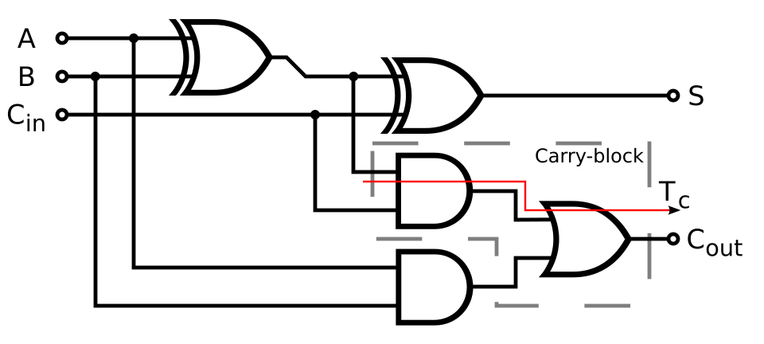

# Capítulo 48 — Proyecto: circuitos lógicos

Un circuito lógico combinacional es una red de compuertas: cada compuerta
calcula un bit a partir de otros, y los cables llevan cada bit de la salida
de una compuerta a las entradas de otras. Una compuerta se describe por
completo con su tabla de verdad, que en Prolog es un conjunto de hechos, y un
circuito es la conjunción de sus compuertas, con una variable por cable. Esa
lectura relacional permite más que calcular las salidas: la misma
descripción encuentra las entradas que producen una salida, da la fórmula
que el circuito calcula, la simplifica, demuestra que dos circuitos son
equivalentes, y con un registro que guarda el estado entre dos pulsos de
reloj, simula circuitos secuenciales y recorre todos los estados a los que
pueden llegar.

{ style="background-color: white" }

Un sumador completo de un bit, el circuito `sumador` de la
[sección 48.2](#482-el-circuito-como-dato): A ⊕ B ⊕ Cin es la suma S, y
el acarreo Cout es 1 cuando A y B son 1 o cuando A ⊕ B y Cin lo son. La
línea roja marca el camino del acarreo. Imagen: Inductiveload, dominio
público, vía
[Wikimedia Commons](https://commons.wikimedia.org/wiki/File:Full-adder_logic_diagram.svg).

El proyecto crece en seis versiones. La primera escribe las compuertas como
tablas y cada circuito como una regla. La segunda describe los circuitos con
hechos que el programa puede examinar, y los simula con un intérprete que
recibe como argumento lo que hace cada compuerta; ese intérprete, sin
cambios, sirve a las dos versiones siguientes, que calculan la fórmula de
cada salida y verifican circuitos con `library(clpb)`. La quinta agrega los
circuitos secuenciales, y la sexta, el grafo de sus estados. Tres secciones
finales completan los temas de las fuentes: otra representación de los
productos, los retardos en cascada y las compuertas hechas con transistores.
El programa terminado es un archivo que carga los cinco módulos de las seis
versiones:

<!-- ejemplo: capitulo-48/proyecto.pl archivo -->
```prolog
:- use_module(circuitos).
:- use_module(formulas).
:- use_module(verificar).
:- use_module(secuenciales).
:- use_module(estados).
```

```prolog
?- simular(sumador3, [1, 1, 0, 1, 0, 1], Ss).
Ss = [0, 0, 0, 1] ;
false.

?- formula(sumador, co, F), suma_de_productos(F, Ps).
F = a*b+(a#b)*ci,
Ps = [[a, b], [a, ci, ~b], [b, ci, ~a]] ;
false.

?- equivalentes(sumador, sumador_mayoria).
true.

?- aggregate_all(count, alcanzable(contador_gray, [0, 0, 0], _), N).
N = 8.
```

La primera consulta suma 3 y 5 con un sumador de tres bits: los bits van
del menos significativo al más significativo, y el resultado es 0 0 0 con
acarreo 1, es decir, 8. La segunda da la fórmula del acarreo de un sumador
completo y su suma de productos; la tercera demuestra que ese sumador y otro
construido de manera distinta calculan lo mismo para toda entrada; la cuarta
cuenta los estados de un contador en código Gray.

El proyecto parte de dos libros. De *Clause and Effect* de William Clocksin,
de los casos de estudio «Manipulation of Combinational Circuits» y
«Manipulation of Clocked Sequential Circuits», toma la representación de las
compuertas como tablas y de los circuitos como conjunciones de metas, la
simulación en los dos sentidos, la conversión a suma de productos con las
leyes de De Morgan y su simplificación, y los circuitos secuenciales como un
recorrido de la lista de pulsos del reloj que lleva el estado de un pulso al
siguiente: el divisor por dos, el verificador de paridad, el registro de
desplazamiento y el contador en código Gray. De *An Introduction to Logic
Programming through Prolog* de Michael Spivey
([edición del autor](https://spivey.oriel.ox.ac.uk/wiki/files/logprog/logic.pdf)), del capítulo «Hardware
simulation», toma la lectura de un circuito como el conjunto de sus estados
estables: un circuito sin estados estables, como un inversor con la salida
conectada a la entrada, y uno con dos, el biestable de dos compuertas NAND,
que es la base de una memoria; y el modelo de transistores del
[ejercicio 10](#ejercicios). El código y el texto son propios; los programas de los
libros se reescribieron con la representación de este capítulo.

El capítulo desarrolla el ejemplo de `library(clpb)` que la
[sección 23.12](../capitulo-23-programacion-con-restricciones/index.md#2312-libraryclpb) presentó con un circuito de cuatro compuertas NAND, y usa
el orden superior del [capítulo 18](../capitulo-18-orden-superior/index.md), los módulos del
[capítulo 24](../capitulo-24-modulos-y-organizacion/index.md), las representaciones limpias del
[capítulo 32](../capitulo-32-inspeccion-de-terminos/index.md) y la tabulación del [capítulo 39](../capitulo-39-tabulacion/index.md). El módulo
`circuitos` de la segunda versión es también la base del
[capítulo 49](../capitulo-49-proyecto-diagnostico-abduccion/index.md), que diagnostica fallas sobre estos circuitos. La primera
versión y la de los transistores corren en SWISH; las demás son módulos, y
se ejecutan localmente.

## Objetivos del capítulo

Al terminar el capítulo, el lector puede:

- escribir compuertas como tablas de verdad y circuitos como conjunciones de
  compuertas, y usarlos para calcular salidas y para encontrar entradas;
- reconocer en las respuestas de Prolog los estados estables de un circuito
  realimentado: ninguno en un inversor conectado a sí mismo, dos en un
  biestable;
- describir un circuito como datos, con componentes identificados y
  jerarquía, y escribir un intérprete que recibe como argumento el
  significado de cada compuerta;
- obtener la fórmula de cada salida de un circuito y llevarla a una suma de
  productos simplificada;
- decidir con `library(clpb)` si dos circuitos son equivalentes y, si no lo
  son, obtener una entrada que los distingue;
- simular un circuito secuencial como un recorrido de los pulsos del reloj
  que lleva el estado, y verificar una propiedad sobre todos sus estados
  alcanzables con una relación tabulada;
- representar un producto como un vector de signos y obtener los
  implicantes primos de una salida combinando vectores adyacentes;
- describir un circuito de tamaño variable con una recursión sobre la lista
  de sus estados;
- construir compuertas con transistores descritos por sus estados estables,
  y reconocer un circuito sin estados estables.

!!! info "Tiempo estimado"
    Leer el capítulo, ejecutar sus ejemplos y hacer las actividades: **1:40 h**.
    Resolver los 6 ejercicios marcados con ★: **1:55 h**.
    Resolver los 14 ejercicios del final: **4:25 h**.

## 48.1 Compuertas como tablas, circuitos como reglas

Una compuerta tiene entradas y una salida, y para cada combinación de valores
de las entradas su salida está determinada. La tabla de verdad es, entonces,
una relación, y se escribe con un hecho por fila. `compuertas.pl` define así
el inversor y las compuertas AND, OR, XOR, NAND y NOR, con las entradas
antes de la salida:

<!-- ejemplo: capitulo-48/compuertas.pl predicado: nand/3 -->
```prolog
% nand(A, B, S): S es la salida de una compuerta NAND con entradas A y B.
nand(0, 0, 1).
nand(0, 1, 1).
nand(1, 0, 1).
nand(1, 1, 0).
```

Un circuito se escribe como una regla con una meta por compuerta. Cada cable
es una variable: la que aparece como salida de una compuerta y como entrada
de otra las conecta, y las que no aparecen en la cabeza son cables internos.
El semisumador suma dos bits con una compuerta XOR, que da el bit de suma, y
una AND, que da el acarreo; el sumador completo suma tres bits con dos
semisumadores y una OR, y un número de varios bits se suma con un sumador por
bit, encadenados por el acarreo:

<!-- ejemplo: capitulo-48/compuertas.pl predicado: semisumador/4 sumador/5 sumar_bits/4 sumar_bits/5 -->
```prolog
%!  semisumador(?A, ?B, ?S, ?C) is nondet.
%
%   S es el bit de suma y C el acarreo de sumar los bits A y B.
semisumador(A, B, S, C) :-
    xor(A, B, S),
    and(A, B, C).

%!  sumador(?A, ?B, ?Ci, ?S, ?Co) is nondet.
%
%   S es el bit de suma y Co el acarreo de salida de sumar los bits A y B
%   con el acarreo de entrada Ci: dos semisumadores y una compuerta OR.
sumador(A, B, Ci, S, Co) :-
    semisumador(A, B, T, C1),
    semisumador(T, Ci, S, C2),
    or(C1, C2, Co).

%!  sumar_bits(?As:list, ?Bs:list, ?Ss:list, ?C) is nondet.
%
%   Ss es la suma de los números binarios As y Bs, de la misma longitud y
%   con el bit menos significativo primero, y C el acarreo final: un
%   sumador por bit, encadenados por el acarreo.
sumar_bits(As, Bs, Ss, C) :-
    sumar_bits(As, Bs, 0, Ss, C).

%!  sumar_bits(?As:list, ?Bs:list, ?Ci, ?Ss:list, ?C) is nondet.
%
%   Como sumar_bits/4, con el acarreo de entrada Ci.
sumar_bits([], [], C, [], C).
sumar_bits([A|As], [B|Bs], Ci, [S|Ss], C) :-
    sumador(A, B, Ci, S, C1),
    sumar_bits(As, Bs, C1, Ss, C).
```

La regla del sumador usa la del semisumador como una compuerta más: un
circuito definido es un componente de otro. `sumar_bits/5` construye el
circuito de n bits por recursión sobre las listas, con el bit menos
significativo primero, que es el que recibe el acarreo inicial.

```prolog
?- sumador(1, 1, 0, S, C).
S = 0,
C = 1 ;
false.

?- sumar_bits([1, 1, 0], [1, 0, 1], Ss, C).
Ss = [0, 0, 0],
C = 1 ;
false.
```

La primera consulta es 1 + 1 = 10 en binario; la segunda, 3 + 5 = 8. La
respuesta queda con una alternativa pendiente, que no produce otra solución:
la indexación de SWI-Prolog elige las cláusulas por el primer argumento, y
para `xor(0, 0, S)` queda, después de la primera, `xor(0, 1, 1)`, que falla
al intentarla. La relación tiene una sola respuesta. Como las compuertas
son relaciones, el circuito también se consulta en sentido inverso:

```prolog
?- sumador(A, B, Ci, 1, 1).
A = B, B = Ci, Ci = 1 ;
false.

?- sumar_bits(As, [1, 0, 1], [0, 1, 0], 1).
As = [1, 0, 1] ;
false.
```

La única forma de obtener suma 1 y acarreo 1 con tres bits es que los tres
sean 1, y el número que sumado a 5 da 10 es 5. Prolog no resta: prueba
valores para las entradas libres y descarta los que contradicen una tabla.

Un circuito puede conectar la salida de una compuerta con su propia entrada.
La relación tiene entonces las soluciones que satisfacen a todas las
compuertas a la vez, que son los **estados estables** del circuito
(Spivey, «Hardware simulation»). Un inversor con la salida conectada a la
entrada no tiene ninguno: `inv(X, X)` pide un bit igual a su negación. El
**biestable** de dos compuertas NAND conectadas en anillo, cada una con la
salida de la otra como entrada, tiene dos:

<!-- ejemplo: capitulo-48/compuertas.pl predicado: biestable/4 -->
```prolog
%!  biestable(?S, ?R, ?Q, ?Qn) is nondet.
%
%   Q y Qn son las salidas estables de dos compuertas NAND conectadas en
%   anillo, con las entradas S y R: cada salida es una entrada de la otra.
biestable(S, R, Q, Qn) :-
    nand(S, Qn, Q),
    nand(R, Q, Qn).
```

```prolog
?- inv(X, X).
false.

?- biestable(1, 1, Q, Qn).
Q = 1,
Qn = 0 ;
Q = 0,
Qn = 1 ;
false.

?- biestable(0, 1, Q, Qn).
Q = 1,
Qn = 0 ;
false.
```

Con las dos entradas en 1, el biestable puede estar en cualquiera de dos
estados, y cuál de ellos depende de lo que ocurrió antes: con S en 0 las
salidas pasan a 1 y 0, y cuando S vuelve a 1 se quedan así. El circuito
**recuerda** un bit. En el hardware, la realimentación que oscila o que deja
una tensión intermedia también existe; el modelo solo describe los estados
estables, y lo que responde `inv(X, X)` es que no hay ninguno. Los circuitos
secuenciales de la [sección 48.5](#485-circuitos-secuenciales) parten de esta memoria.

La representación tiene un límite. Un circuito es una regla, y lo único que
el programa puede hacer con ella es ejecutarla: no puede contar sus
compuertas, ni enumerarlas, ni reemplazar una compuerta por otra que falla,
ni obtener la fórmula que calcula. Todo eso requiere que el circuito sea un
dato.

## 48.2 El circuito como dato

`circuitos.pl` es un módulo que describe cada circuito con dos clases de
hechos. `circuito(Nombre, Entradas, Salidas)` da su interfaz, con los
nombres de los cables de entrada y de salida, y
`componente(Circuito, Id, Tipo, Entradas, Salidas)` da cada componente, con
un identificador propio dentro del circuito, su tipo, que es una compuerta o
el nombre de otro circuito, y los cables a los que se conecta. Los cables son
átomos: nombres, no variables. El sumador completo, con sus dos semisumadores
y la compuerta OR:

<!-- ejemplo: capitulo-48/circuitos.pl fragmento: circuito(semisumador, .. componente(sumador, o1, or, [c1, c2], [co]). -->
```prolog
circuito(semisumador, [a, b], [s, c]).
componente(semisumador, x1, xor, [a, b], [s]).
componente(semisumador, y1, and, [a, b], [c]).

circuito(sumador, [a, b, ci], [s, co]).
componente(sumador, m1, semisumador, [a, b], [t, c1]).
componente(sumador, m2, semisumador, [t, ci], [s, c2]).
componente(sumador, o1, or, [c1, c2], [co]).
```

La representación es limpia en el sentido de la
[sección 32.6](../capitulo-32-inspeccion-de-terminos/index.md#326-representaciones-limpias): cada dato tiene su propio functor, y un
componente es un circuito si hay un hecho `circuito/3` con su tipo. Las
compuertas se toman de la primera versión: el módulo carga `compuertas.pl`
con `ensure_loaded/1`, y `tabla/3` las reúne en un solo predicado, con las
entradas en una lista:

<!-- ejemplo: capitulo-48/circuitos.pl predicado: tabla/3 -->
```prolog
%!  tabla(?Tipo, ?Entradas:list, ?Salida) is nondet.
%
%   Salida es la salida de la compuerta Tipo con las Entradas, según su
%   tabla de verdad: las de la versión 1.
tabla(inv, [A], S) :- inv(A, S).
tabla(and, [A, B], S) :- and(A, B, S).
tabla(or, [A, B], S) :- or(A, B, S).
tabla(xor, [A, B], S) :- xor(A, B, S).
tabla(nand, [A, B], S) :- nand(A, B, S).
tabla(nor, [A, B], S) :- nor(A, B, S).
```

El intérprete convierte la descripción en lo que la primera versión escribía
a mano: una variable por cable y una meta por componente. `simular_en/5`
asocia cada nombre de cable con una variable nueva, liga las entradas y las
salidas del circuito a las de la interfaz, y activa cada componente con las
variables de sus cables. Un componente que es un circuito se simula con su
propia descripción; una compuerta, con la **conducta** que `simular/4` recibe
como primer argumento, un predicado que se llama con la **ruta** de la
compuerta —los identificadores que llevan hasta ella desde el circuito
exterior—, su tipo, sus entradas y su salida:

<!-- ejemplo: capitulo-48/circuitos.pl predicado: simular/3 normal/4 simular/4 simular_en/5 activar/4 -->
```prolog
%!  simular(+Circuito, ?Entradas:list, ?Salidas:list) is nondet.
%
%   Salidas son los valores de las salidas de Circuito con los valores
%   Entradas, cada compuerta según su tabla de verdad.
simular(Circuito, Entradas, Salidas) :-
    simular(normal, Circuito, Entradas, Salidas).

%!  normal(+Ruta:list, ?Tipo, ?Entradas:list, ?Salida) is nondet.
%
%   La conducta de una compuerta que funciona: la de su tabla.
normal(_Ruta, Tipo, Entradas, Salida) :-
    tabla(Tipo, Entradas, Salida).

%!  simular(:Conducta, +Circuito, ?Entradas:list, ?Salidas:list) is nondet.
%
%   Salidas son los valores de las salidas de Circuito con los valores
%   Entradas, cuando cada compuerta cumple call(Conducta, Ruta, Tipo,
%   EntradasCompuerta, Salida), con Ruta la ruta de la compuerta.
simular(Conducta, Circuito, Entradas, Salidas) :-
    simular_en(Conducta, [], Circuito, Entradas, Salidas).

%!  simular_en(:Conducta, +Ruta:list, +Circuito, ?Entradas, ?Salidas)
%!      is nondet.
%
%   Como simular/4, para el circuito que está en Ruta dentro del
%   exterior: un cable es una variable, y cada componente, una meta.
simular_en(Conducta, Ruta, Circuito, Entradas, Salidas) :-
    circuito(Circuito, NEntradas, NSalidas),
    cables(Circuito, Cables),
    valores(Cables, NEntradas, Entradas),
    valores(Cables, NSalidas, Salidas),
    findall(c(Id, Tipo, Es, Ss),
            componente(Circuito, Id, Tipo, Es, Ss),
            Componentes),
    maplist(activar(Conducta, Ruta, Cables), Componentes).

%!  activar(:Conducta, +Ruta:list, +Cables:list(pair), +Componente)
%!      is nondet.
%
%   El componente c(Id, Tipo, Entradas, Salidas) se cumple con los valores
%   de Cables: un circuito se simula con su propia descripción; una
%   compuerta, con Conducta.
activar(Conducta, Ruta, Cables, c(Id, Tipo, NEs, NSs)) :-
    valores(Cables, NEs, Es),
    valores(Cables, NSs, Ss),
    append(Ruta, [Id], RutaId),
    (   circuito(Tipo, _, _)
    ->  simular_en(Conducta, RutaId, Tipo, Es, Ss)
    ;   Ss = [S],
        call(Conducta, RutaId, Tipo, Es, S)
    ).
```

El intérprete es un predicado de orden superior del
[capítulo 18](../capitulo-18-orden-superior/index.md#186-escribir-un-predicado-de-orden-superior), con la declaración `meta_predicate` de la
[sección 24.4](../capitulo-24-modulos-y-organizacion/index.md#244-meta_predicate-y-los-modulos) para que la conducta se llame en el módulo que la
define. Con la conducta `normal/4`, cada compuerta cumple su tabla, y
`simular/3` hace lo mismo que las reglas de la versión 1, en los dos
sentidos:

```prolog
?- simular(sumador, [1, 1, 0], Ss).
Ss = [0, 1] ;
false.

?- simular(sumador, Es, [1, 1]).
Es = [1, 1, 1] ;
false.
```

`cables/2`, `valores/3` y `valor/3` completan el intérprete: el primero reúne
los nombres de los cables del circuito y los empareja con variables libres;
los otros dos buscan el valor de un cable por su nombre con `memberchk/2`. Una
vez que el circuito es un dato, las preguntas sobre su estructura son
consultas comunes. `compuerta_en/3` enumera las compuertas con sus rutas, a
cualquier profundidad, y `tabla_de_verdad/2` recorre las combinaciones de
entradas en orden binario:

<!-- ejemplo: capitulo-48/circuitos.pl predicado: tabla_de_verdad/2 compuerta_en/3 -->
```prolog
%!  tabla_de_verdad(+Circuito, -Filas:list(pair)) is det.
%
%   Filas tiene un par Entradas-Salidas por cada combinación de valores de
%   las entradas de Circuito, en orden binario creciente, y uno por cada
%   estado estable si una combinación tiene varios.
tabla_de_verdad(Circuito, Filas) :-
    circuito(Circuito, Nombres, _),
    same_length(Nombres, Entradas),
    findall(Entradas-Salidas,
            ( maplist(bit, Entradas),
              simular(Circuito, Entradas, Salidas) ),
            Filas).

%!  compuerta_en(+Circuito, -Ruta:list, -Tipo) is nondet.
%
%   Ruta es la ruta de una compuerta de tipo Tipo dentro de Circuito, a
%   cualquier profundidad.
compuerta_en(Circuito, Ruta, Tipo) :-
    componente(Circuito, Id, T, _, _),
    (   circuito(T, _, _)
    ->  compuerta_en(T, Ruta0, Tipo),
        Ruta = [Id|Ruta0]
    ;   Ruta = [Id],
        Tipo = T
    ).
```

```prolog
?- compuerta_en(sumador, Ruta, Tipo).
Ruta = [m1, x1],
Tipo = xor ;
Ruta = [m1, y1],
Tipo = and ;
Ruta = [m2, x1],
Tipo = xor ;
Ruta = [m2, y1],
Tipo = and ;
Ruta = [o1],
Tipo = or.

?- compuertas(sumador3, N).
N = 12.

?- tabla_de_verdad(xor_nand, Filas).
Filas = [[0, 0]-[0], [0, 1]-[1], [1, 0]-[1], [1, 1]-[0]].
```

La ruta `[m2, x1]` distingue la compuerta XOR del segundo semisumador de la
del primero, aunque las dos se llamen `x1` dentro de `semisumador`: es el
nombre que el [capítulo 49](../capitulo-49-proyecto-diagnostico-abduccion/index.md) usa para decir qué compuerta falla, con una
conducta que, para esa ruta, reemplaza la tabla por un modelo de falla. El
`xor_nand` es el circuito de la [sección 23.12](../capitulo-23-programacion-con-restricciones/index.md#2312-libraryclpb), y su tabla es la
de la disyunción exclusiva.

!!! question "Actividad"
    Predecir, sin ejecutarla, cuántas filas tiene
    `tabla_de_verdad(biestable, Filas)` y cuáles son. Comprobarlo, y
    explicar por qué una combinación de entradas aparece dos veces.

`circuito/3` y `componente/5` están declarados `multifile`: otro archivo
puede agregar circuitos con cláusulas `circuitos:circuito(…)` y
`circuitos:componente(…)`, y las versiones siguientes lo hacen. El
intérprete ya no depende de cada circuito, pero la única pregunta que
responde sobre lo que un circuito calcula es la tabla de verdad, que con n
entradas tiene 2ⁿ filas: el sumador de tres bits tiene 64. Una fórmula lo
diría en una línea.

## 48.3 Qué calcula un circuito

Para obtener la fórmula no hace falta otro intérprete. `formulas.pl` simula
la misma descripción con otra conducta: en lugar de un bit, cada cable lleva
una fórmula, y cada entrada, su propio nombre. Una compuerta AND cuyas
entradas llevan las fórmulas A y B da `A * B`:

<!-- ejemplo: capitulo-48/formulas.pl predicado: simbolica/4 formula/3 -->
```prolog
%!  simbolica(+Ruta:list, +Tipo, +Entradas:list, -Formula) is det.
%
%   Formula es la salida de la compuerta Tipo cuando sus entradas son las
%   fórmulas Entradas.
simbolica(_Ruta, inv, [A], ~A).
simbolica(_Ruta, and, [A, B], A * B).
simbolica(_Ruta, or, [A, B], A + B).
simbolica(_Ruta, xor, [A, B], A # B).
simbolica(_Ruta, nand, [A, B], ~(A * B)).
simbolica(_Ruta, nor, [A, B], ~(A + B)).

%!  formula(+Circuito, ?Salida, -Formula) is nondet.
%
%   Formula es la fórmula de la salida Salida de Circuito sobre los
%   nombres de sus entradas. Un circuito con realimentación produce un
%   error de dominio: su fórmula sería un término cíclico.
formula(Circuito, Salida, Formula) :-
    circuito(Circuito, Entradas, Salidas),
    simular(simbolica, Circuito, Entradas, Formulas),
    (   acyclic_term(Formulas)
    ->  true
    ;   domain_error(circuito_sin_realimentacion, Circuito)
    ),
    nth1(I, Salidas, Salida),
    nth1(I, Formulas, Formula).
```

Las fórmulas usan los operadores de `library(clpb)`: `~` para la negación,
`*` para la conjunción, `+` para la disyunción y `#` para la disyunción
exclusiva; el módulo exporta las declaraciones de `~` y `#`, que Prolog no
trae. `formula/3` pasa los nombres de las entradas como sus valores, y
`simular/4` hace el resto: las variables de los cables quedan ligadas a
términos cada vez más grandes, construidos por unificación. Si el circuito
tiene realimentación, el término sería cíclico —en el biestable, la fórmula
de q contiene la de qn, que contiene la de q—, y `formula/3` lo rechaza con
un error de dominio: `acyclic_term/1` se cumple solo si el término no es
cíclico.

```prolog
?- formula(sumador, S, F).
S = s,
F = a#b#ci ;
S = co,
F = a*b+(a#b)*ci ;
false.

?- formula(xor_nand, z, F).
F = ~ (~ (x* ~ (x*y))* ~ (y* ~ (x*y))) ;
false.
```

!!! example "Patrón 60 — Intérprete con conducta como parámetro"
    **Problema.** Una misma estructura —un circuito, un programa, una red—
    tiene que responder varias preguntas: qué valores da, qué fórmula
    calcula, qué pasa si una pieza falla. Cada pregunta da otro significado
    a las piezas, pero la forma de combinarlas es siempre la misma.

    **Versión ingenua.** Escribir la estructura como reglas, como la
    versión 1 de la
    [sección 48.1](#481-compuertas-como-tablas-circuitos-como-reglas), que
    le dan un solo significado; o escribir un recorrido de la descripción
    por cada pregunta, que repite la asociación de cables con variables y
    el descenso por la jerarquía, y que hay que corregir en todas las
    copias.

    **Patrón.** La estructura se describe una vez, como datos
    (`circuito/3` y `componente/5`), y un solo intérprete, `simular/4`, la
    recorre y recibe como argumento la **conducta** de cada pieza. Cada
    significado es una conducta: `normal/4` da los valores, `simbolica/4`
    las fórmulas, la de la
    [sección 48.4](#484-verificar-con-libraryclpb) una restricción
    booleana; el ejercicio 5 agrega una falla y el ejercicio 11, la
    profundidad del circuito. Es la misma idea que el ciclo `iterar/4` del
    [capítulo 46](../capitulo-46-proyecto-metodos-numericos/index.md#462-la-ecuacion-como-termino-y-el-ciclo-de-iteracion),
    que recibe el paso de cada método, y que el
    [Patrón 43](../patrones.md#43-recorrido-generico-de-un-termino), que
    recibe el trabajo por nodo: aquí el recorrido sigue una descripción
    con nombres y jerarquía, no la forma de un término.

    **Cuándo no usarlo.** Cuando la estructura tiene un solo significado:
    las reglas de la versión 1 son más directas. Y cuando la pregunta es
    sobre la estructura misma y no sobre lo que calcula, como contar las
    compuertas o enumerarlas con `compuerta_en/3`: una consulta sobre los
    datos basta, sin intérprete.

La fórmula refleja la estructura del circuito, no la función: el `xor_nand`
calcula la disyunción exclusiva, pero su fórmula tiene cuatro negaciones
anidadas. Para compararla con otras se la lleva a una forma estándar, la
**suma de productos**: una disyunción de conjunciones de literales, donde un
literal es una entrada o su negación. La conversión tiene dos pasos
(Clocksin, «Manipulation of Combinational Circuits»). El primero es la
**forma normal negativa**: las leyes de De Morgan empujan cada negación
hacia las entradas, y la disyunción exclusiva se reemplaza por su
definición.

<!-- ejemplo: capitulo-48/formulas.pl predicado: fnn/2 negar/2 -->
```prolog
%!  fnn(+Formula, -Normal) is det.
%
%   Normal es Formula en forma normal negativa: sin #, y con la negación
%   solo delante de un nombre de entrada (leyes de De Morgan). La
%   cláusula de las constantes y los nombres va primera, para que la
%   indexación no deje alternativas pendientes.
fnn(X, X) :-
    atomic(X).
fnn(~F, N) :-
    negar(F, N).
fnn(A * B, NA * NB) :-
    fnn(A, NA),
    fnn(B, NB).
fnn(A + B, NA + NB) :-
    fnn(A, NA),
    fnn(B, NB).
fnn(A # B, N) :-
    fnn(A * ~B + ~A * B, N).

%!  negar(+Formula, -Normal) is det.
%
%   Normal es la negación de Formula en forma normal negativa.
negar(X, ~X) :-
    atom(X).
negar(0, 1).
negar(1, 0).
negar(~F, N) :-
    fnn(F, N).
negar(A * B, NA + NB) :-
    negar(A, NA),
    negar(B, NB).
negar(A + B, NA * NB) :-
    negar(A, NA),
    negar(B, NB).
negar(A # B, N) :-
    fnn(A * B + ~A * ~B, N).
```

La primera cláusula de cada predicado acepta las constantes y los nombres,
con `atomic/1` o `atom/1`. La prueba de tipo es segura porque la fórmula
llega siempre sin variables (la [sección 32.1](../capitulo-32-inspeccion-de-terminos/index.md#321-que-clase-de-termino-es) explica por qué no lo
sería con variables), y va primera para que la indexación no deje
alternativas pendientes: las demás cláusulas se distinguen por el functor.

El segundo paso distribuye la conjunción sobre la disyunción, y representa
el resultado como una lista de productos, cada uno una lista de literales.
La lista vacía es la suma de ningún producto, 0; un producto vacío es 1.
`simplificar/2` aplica cuatro leyes: `X * X = X`, `X * ~X = 0`, `P + P = P`, y la
**absorción**, `P + P * Q = P`, que elimina un producto que contiene todos los
literales de otro:

<!-- ejemplo: capitulo-48/formulas.pl predicado: productos/2 simplificar/2 absorbido/2 suma_de_productos/2 -->
```prolog
%!  productos(+Normal, -Productos:list(list)) is det.
%
%   Productos es la suma de productos de la fórmula Normal, en forma
%   normal negativa, distribuyendo la conjunción sobre la disyunción: []
%   es 0, y un producto vacío es 1.
productos(X, [[X]]) :-
    atom(X).
productos(0, []).
productos(1, [[]]).
productos(~X, [[~X]]).
productos(A + B, Ps) :-
    productos(A, PAs),
    productos(B, PBs),
    append(PAs, PBs, Ps).
productos(A * B, Ps) :-
    productos(A, PAs),
    productos(B, PBs),
    findall(P,
            ( member(PA, PAs),
              member(PB, PBs),
              append(PA, PB, P) ),
            Ps).

%!  simplificar(+Productos:list(list), -Simples:list(list)) is det.
%
%   Simples es la misma suma que Productos, con cada producto ordenado y
%   sin literales repetidos (X * X = X), sin productos contradictorios
%   (X * ~X = 0), sin productos repetidos (P + P = P) y sin productos que
%   contienen a otro (P + P * Q = P).
simplificar(Productos, Simples) :-
    maplist(sort, Productos, Ordenados),
    exclude(contradictorio, Ordenados, Consistentes),
    sort(Consistentes, Distintos),
    exclude(absorbido(Distintos), Distintos, Simples).

%!  absorbido(+Productos:list(list), +Producto:list) is semidet.
%
%   Otro producto de Productos está contenido en Producto.
absorbido(Productos, Producto) :-
    member(Otro, Productos),
    Otro \== Producto,
    ord_subset(Otro, Producto),
    !.

%!  suma_de_productos(+Formula, -Productos:list(list)) is det.
%
%   Productos es la suma de productos simplificada de Formula.
suma_de_productos(Formula, Productos) :-
    fnn(Formula, Normal),
    productos(Normal, Productos0),
    simplificar(Productos0, Productos).
```

```prolog
?- formula(xor_nand, z, F), suma_de_productos(F, Ps).
F = ~ (~ (x* ~ (x*y))* ~ (y* ~ (x*y))),
Ps = [[x, ~y], [y, ~x]] ;
false.

?- formula(sumador, co, F), suma_de_productos(F, Ps), como_formula(Ps, G).
F = a*b+(a#b)*ci,
Ps = [[a, b], [a, ci, ~b], [b, ci, ~a]],
G = a*b+a*ci* ~b+b*ci* ~a ;
false.
```

La suma de productos del `xor_nand` es la definición de la disyunción
exclusiva, x·¬y + y·¬x: las cuatro compuertas NAND calculan eso.
`como_formula/2` escribe una suma de productos otra vez como fórmula. Pero la
del acarreo muestra el límite de la simplificación. El acarreo de un sumador
es 1 cuando al menos dos de las tres entradas lo son, la función **mayoría**,
cuya suma de productos más corta es a·b + a·ci + b·ci:

```prolog
?- suma_de_productos(a*b + a*ci + b*ci, Ps).
Ps = [[a, b], [a, ci], [b, ci]].
```

Las dos listas son distintas, y las dos fórmulas son la misma función: el
producto `[a, ci, ~b]` se reduce a `[a, ci]` combinándolo con `[a, b]`, una
regla, el **consenso**, que `simplificar/2` no aplica (el
[ejercicio 7](#ejercicios) la agrega). Con más reglas se obtiene la suma
mínima, pero comparar sumas de productos sigue sin ser una forma segura de
decidir si dos circuitos calculan lo mismo: una función tiene en general
varias sumas mínimas. El problema crece con el circuito: el acarreo final del
sumador de tres bits tiene siete productos.

```prolog
?- formula(sumador3, c, F), suma_de_productos(F, Ps), length(Ps, N).
F = a2*b2+(a2#b2)*(a1*b1+(a1#b1)*(a0*b0)),
Ps = [[a0, a1, a2, b0, ~b1, ~b2], [a0, a1, b0, b2, ~a2, ~b1], [a0, a2, b0, b1, ~a1, ~ ...], [a0, b0, b1, b2, ~ ...|...], [a1, a2, b1, ~ ...], [a1, b1, b2|...], [a2, b2]],
N = 7 ;
false.
```

!!! question "Actividad"
    Predecir la suma de productos de la salida s del sumador, `a#b#ci`:
    cuántos productos tiene, cuántos literales tiene cada uno y cuáles
    son. Comprobarlo con `formula/3` y `suma_de_productos/2`, y explicar
    por qué la absorción no elimina ninguno.

## 48.4 Verificar con `library(clpb)`

`library(clpb)` representa cada fórmula con un diagrama de decisión binario,
una forma canónica: dos fórmulas equivalentes tienen el mismo diagrama. La
página [Verificar con library(clpb)](verificacion.md#verificar-con-libraryclpb)
simula la descripción una tercera vez, con una conducta que impone a cada
compuerta la restricción de que su salida equivale a su fórmula, y con ella
escribe `equivalentes/2`, que demuestra con `taut/2` que el sumador y el
sumador con el acarreo como mayoría calculan lo mismo; `diferencia/3`, que da
la entrada con la que un sumador con un cable mal conectado se equivoca; y
`cuantas/4`, que cuenta con `sat_count/2` las entradas con las que una salida
toma un valor.

## 48.5 Circuitos secuenciales

Los circuitos de las secciones anteriores son combinacionales: sus salidas
dependen solo de las entradas del momento. La página
[Circuitos secuenciales](secuenciales.md#circuitos-secuenciales) agrega el
tiempo: un circuito secuencial es una parte combinacional, descrita como un
circuito más del módulo `circuitos`, y un registro que guarda el estado de un
pulso del reloj al siguiente. Ejecutarlo es recorrer las entradas con
`foldl/6`, llevando el estado; los ejemplos son el divisor por dos, el
verificador de paridad, el registro de desplazamiento de cuatro etapas y el
contador en código Gray, construido con dos circuitos combinacionales.

## 48.6 Los estados alcanzables

Una ejecución recorre una sola sucesión de entradas. La misma página, en
[Los estados alcanzables](secuenciales.md#los-estados-alcanzables), con el
módulo de `estados.pl`, define
los estados a los que un circuito secuencial puede llegar con cualquier
sucesión como la clausura de su grafo de estados, que tiene ciclos y termina
porque está tabulada, y verifica sobre ella, con `siempre/3`, que la salida
del contador cambia un solo bit en cada pulso, para todos sus estados.

## 48.7 Los productos como vectores de signos

La suma de productos de la [sección 48.3](#483-que-calcula-un-circuito)
escribe cada producto como una lista de literales. La página
[Los productos como vectores de signos](vectores.md#los-productos-como-vectores-de-signos)
toma de Clocksin, en el apartado 7.5 de *Clause and Effect*, «Alternative
Representation», otra estructura para cuando las variables son pocas y se
conocen de antemano: un signo por variable, en un orden fijo, `+`, `-` o
`0`. Con ella escribe `vector/3` y `producto_de_vector/3`, que traducen
entre las dos representaciones; `cubre/2` y `combinar/3`, que deciden la
absorción y combinan dos productos que difieren en el signo de una sola
variable; y `unos/3` e `implicantes_primos/2`, que repiten esa combinación
desde las filas de la tabla de verdad y dan los implicantes primos de una
salida, el primer paso del método que completa el
[ejercicio 12](#ejercicios).

## 48.8 Retardos en cascada

El registro de desplazamiento de la
[sección 48.5](#485-circuitos-secuenciales) tiene cuatro etapas, escritas
una por una en su descripción. Clocksin, en el apartado 8.5 de *Clause and
Effect*, «Specification of Cascaded Components», conecta N retardos
unitarios en serie con una recursión sobre la lista de sus estados, de modo
que la cantidad de etapas es la longitud de esa lista. La página
[Retardos en cascada](secuenciales.md#retardos-en-cascada) escribe esa
cascada como `retardo/4`, la ejecuta pulso a pulso con `retardar/3`, y
describe para el simulador del capítulo un registro de desplazamiento de N
etapas, `desplazamiento(N)`, con una regla que genera los nombres de sus
cables a partir de N; las pruebas comparan los dos para varios N y con el
registro de cuatro etapas.

## 48.9 Compuertas hechas con transistores

Las compuertas de las secciones anteriores son tablas. Spivey, en el
capítulo «Hardware simulation» de su libro, las construye con
transistores CMOS descritos, como las compuertas, por la relación de sus
estados estables. La página
[Compuertas hechas con transistores](transistores.md#compuertas-hechas-con-transistores)
presenta los transistores p y n, el inversor de dos transistores, el
cortocircuito, que no tiene ningún estado estable, y la compuerta XOR de
seis transistores del ejercicio 12.2 de Spivey, que la consulta con las
entradas libres reduce a su tabla de verdad.

!!! success "Criterios de calidad"
    | Criterio | En este capítulo |
    |---|---|
    | C1 | cada predicado declara modos y determinación; la simulación es `nondet` porque la relación, con entradas libres, tiene varias respuestas, aunque con las entradas ligadas tenga una |
    | C3 | los circuitos son relaciones: `simular/3`, `sumar_bits/4` y `ejecutar/4` se consultan también en sentido inverso, y las pruebas lo verifican |
    | C6 | la descripción de un circuito es solo datos, y el intérprete, `simular/4`, no depende de ninguno: cambia el significado de las compuertas con la conducta, sin tocar la descripción ni el intérprete |
    | C7 | 152 pruebas en diez archivos; cada versión se compara con la anterior (la descripción del sumador con `sumador/5`, la fórmula con la simulación, el sumador de tres bits con la suma aritmética), y la recursión sin tabla se prueba con `call_with_inference_limit/3` |

## Ejercicios

Las soluciones están en [la página de soluciones](soluciones.md). La dificultad
va de 1 (se resuelve consultando el capítulo) a 3 (requiere elaboración propia).
Los marcados con ★ son los que no conviene saltear: cubren lo que el capítulo
tiene de propio, y el [capítulo 49](../capitulo-49-proyecto-diagnostico-abduccion/index.md) los da por hechos.

1. ★ **(1)** Predecir, con `compuertas.pl` cargado, cuántas respuestas da
   cada consulta y si termina en `.` o en `false.`, y comprobarlo:
   `semisumador(A, B, 0, 1).` · `sumador(A, B, 1, S, 0).` ·
   `biestable(0, 0, Q, Qn).` · `biestable(S, R, 0, 0).` ·
   `sumar_bits([1, 1], Bs, Ss, 1).`
2. **(2)** Describir con `circuito/3` y `componente/5` un semirrestador
   (entradas a y b; salidas la diferencia d y el préstamo p, que es 1 cuando
   a = 0 y b = 1), un restador completo con préstamo de entrada, hecho con
   dos semirrestadores y una compuerta OR, y un restador de tres bits.
   Verificar con `simular/3`, para todos los pares de números de 0 a 7, que
   el resultado es la diferencia módulo 8 y el préstamo final indica si el
   primero es menor.
3. ★ **(2)** Describir un multiplexor de dos entradas, `mux`: entradas s, a
   y b; la salida es a cuando s = 0 y b cuando s = 1. Usar un inversor, dos
   AND y una OR. Obtener su tabla de verdad y su suma de productos, describir
   una segunda versión, `mux_nand`, solo con compuertas NAND, y demostrar con
   `equivalentes/2` que las dos calculan lo mismo.
4. **(2)** Las compuertas NAND alcanzan para construir cualquier otra.
   Describir `inv_nand`, `and_nand` y `or_nand` solo con compuertas NAND,
   describir tres circuitos de una sola compuerta, `inv1`, `and1` y `or1`,
   como el `xor1` de `verificar.pl`, y demostrar las tres equivalencias.
5. ★ **(2)** Escribir la conducta `pegada(Ruta, Valor)`: la compuerta cuya
   ruta es Ruta da siempre Valor, sin importar sus entradas, y las demás
   cumplen su tabla. Escribir `detecta(Circuito, Ruta, Valor, Es)`: con las
   entradas Es, el circuito con esa falla da otras salidas que el circuito
   que funciona. ¿Qué entradas detectan que la compuerta `[m2, x1]` del
   sumador está pegada a 0? ¿Y que `[o1]` está pegada a 1?
6. **(1)** Escribir `minterminos(Circuito, Salida, Ps)`: la suma de
   productos que se lee de la tabla de verdad, con un producto por cada fila
   donde Salida vale 1 y un literal por cada entrada. Compararla con la de
   `suma_de_productos/2` para la salida z de `xor_nand` y para la salida co
   del sumador.
7. **(3)** El **consenso** de dos productos que tienen un literal X y ~X,
   respectivamente, y ningún otro par opuesto, es la unión de los dos sin
   ese literal: P · X + Q · ¬X = P · X + Q · ¬X + P · Q. Escribir
   `simplificar_consenso/2`, que agrega los consensos de todos los pares y
   simplifica, hasta que la lista no cambia. Comprobar que la suma de
   productos del acarreo del sumador se reduce a la de la mayoría.
8. ★ **(2)** Describir un contador binario de dos bits con una entrada de
   habilitación e: con e = 1 el contador avanza, con e = 0 conserva el
   estado. La salida es el estado. Declararlo con `secuencial/3` desde otro
   archivo, ejecutarlo con la sucesión de habilitaciones 1, 1, 0, 1, 0, 1 y
   verificar con `alcanzable/3` que alcanza sus cuatro estados.
9. ★ **(2)** Describir un detector de la secuencia 1 0 1: la salida es 1
   en el pulso en que la entrada es 1 y las dos entradas anteriores fueron
   0 y 1, en ese orden. El estado son las dos últimas entradas. Ejecutarlo
   con 1, 0, 1, 0, 1, 1, 0, 1 y verificar con `siempre/3` que la salida
   nunca es 1 si la entrada del pulso es 0.
10. **(2)** Con `ptran/3` y `ntran/3` de la
    [sección 48.9](#489-compuertas-hechas-con-transistores), escribir la
    compuerta NAND de la tecnología CMOS, con dos transistores p en paralelo
    entre el 1 y la salida y dos n en serie entre la salida y el 0, y
    verificar que tiene la tabla de `nand/3`. Explicar por qué el modelo de
    Spivey admite también la consulta inversa, con la salida dada, aunque un
    transistor real no puede llevar su compuerta a un valor.
11. **(3)** El sumador de tres bits espera en cada etapa el acarreo de la
    anterior. Un sumador con **acarreo anticipado** calcula cada acarreo
    directamente de las entradas: con gᵢ = aᵢ·bᵢ y pᵢ = aᵢ ⊕ bᵢ, el
    acarreo c₁ es g₀, c₂ es g₁ + p₁·g₀, y c₃ es g₂ + p₂·g₁ + p₂·p₁·g₀.
    Describirlo como `sumador3_anticipado`, con la misma interfaz que
    `sumador3`, demostrar que son equivalentes y comparar la cantidad de
    compuertas de los dos.
12. ★ **(3)** Escribir `cobertura(Unos, Primos, Elegidos)`: Elegidos es la
    menor cantidad de vectores de Primos que cubre todos los vectores de
    Unos, el segundo paso del método de Quine y McCluskey. Aplicarlo al
    acarreo del sumador, y a la salida que vale 1 en las filas a · ¬b · ¬c,
    a · ¬b · c, a · b · c y ¬a · b · c, cuyos implicantes primos son tres y
    de los que basta con dos.
13. **(1)** Predecir, sin ejecutarlas, las respuestas de
    `retardar([1, 0, 1, 1], [0, 0], Qs)` y de
    `retardar(Es, [0, 0], [0, 0, 1, 0])`, y comprobarlo. ¿Cuántos estados
    alcanza `desplazamiento(N)` desde N ceros, y por qué?
14. **(2)** Spivey señala que los dos transistores del par en paralelo de
    la XOR son necesarios por efectos eléctricos que el modelo no
    representa. Escribir las dos variantes de cinco transistores, sin el
    transistor p y sin el n del par, y verificar que el modelo les da la
    misma tabla que a `xor_cmos/3`. Explicar qué dice ese resultado sobre lo
    que el modelo de estados estables puede verificar.

## Resumen

| | |
|---|---|
| **compuerta como tabla** | un hecho por fila de la tabla de verdad, con las entradas antes de la salida |
| **circuito como conjunción** | una meta por compuerta y una variable por cable; los cables internos no aparecen en la cabeza |
| **estado estable** | una solución de la conjunción: ninguna en un inversor realimentado, dos en un biestable |
| **circuito como dato** | `circuito(Nombre, Entradas, Salidas)` y `componente(Circuito, Id, Tipo, Entradas, Salidas)`, con cables nombrados y jerarquía |
| **conducta** | el significado de cada compuerta, argumento de `simular/4`: su tabla, su fórmula o una restricción booleana |
| **ruta** | la lista de identificadores de componentes que lleva a una compuerta desde el circuito exterior |
| **suma de productos** | una disyunción de conjunciones de literales; se obtiene con la forma normal negativa y la distribución, y se simplifica con la absorción |
| **equivalencia** | con `library(clpb)`, `taut/2` sobre las restricciones de los dos circuitos; `sat/1` y `labeling/1` dan una entrada que los distingue |
| **circuito secuencial** | una parte combinacional y un registro de estado; ejecutarlo es un `foldl/6` sobre los pulsos del reloj |
| **estados alcanzables** | la clausura tabulada del grafo de estados; sobre ella, una propiedad se verifica para toda entrada |
| `simular/3`, `simular/4`, `tabla_de_verdad/2`, `compuerta_en/3` | el intérprete de la descripción y las preguntas sobre la estructura |
| `formula/3`, `fnn/2`, `suma_de_productos/2`, `como_formula/2` | la fórmula de una salida y su suma de productos |
| `equivalentes/2`, `diferencia/3`, `cuantas/4` | la verificación con `library(clpb)` |
| `secuencial/3`, `paso/5`, `ejecutar/4` | los circuitos secuenciales |
| `alcanzable/3`, `grafo/3`, `siempre/3` | el grafo de estados, tabulado, y las propiedades sobre él |
| **vector de signos** | un producto como un signo por variable: `+`, `-` o `0`; la absorción y la combinación se deciden posición por posición |
| **implicante primo** | un producto que implica la función y que no se puede combinar con otro; se obtiene combinando vectores que difieren en un signo |
| `vector/3`, `cubre/2`, `combinar/3`, `unos/3`, `implicantes_primos/2` | los productos como vectores y el primer paso de Quine y McCluskey |
| `retardo/4`, `retardar/3` | N retardos unitarios en cascada, con N la longitud de la lista de estados |
| **transistor** | la relación de sus estados estables: el p conduce con la compuerta en 0, el n con la compuerta en 1 |
| `ptran/3`, `ntran/3`, `inversor_cmos/2`, `xor_cmos/3`, `cortocircuito/1` | las compuertas CMOS y un circuito sin estados estables |
| **[Patrón 60](../patrones.md#60-interprete-con-conducta-como-parametro)** | intérprete con conducta como parámetro |
| `acyclic_term/1` | se cumple si el término no es cíclico: un circuito sin realimentación |

## Temas que se retoman

| Tema | Se retoma en |
|---|---|
| Fallas de compuertas y diagnóstico por abducción sobre el módulo `circuitos` | [capítulo 49](../capitulo-49-proyecto-diagnostico-abduccion/index.md) |
| Autómatas finitos, de los que un circuito secuencial es un caso | [capítulo 51](../capitulo-51-proyecto-automatas-expresiones-regulares/index.md) |

## Referencias

- William F. Clocksin, *Clause and Effect: Prolog Programming for the
  Working Programmer*, Springer, 1997 — casos de estudio «Manipulation of
  Combinational Circuits» y «Manipulation of Clocked Sequential Circuits».
  El capítulo toma la representación de las compuertas como tablas y de los
  circuitos como conjunciones de metas, la simulación en los dos sentidos,
  la suma de productos y su simplificación, y los circuitos secuenciales de
  ejemplo: el divisor por dos, el verificador de paridad, el registro de
  desplazamiento y el contador en código Gray. Del apartado 7.5,
  «Alternative Representation», toma los productos como vectores de signos
  de la [sección 48.7](#487-los-productos-como-vectores-de-signos), y del
  apartado 8.5, «Specification of Cascaded Components», los retardos en
  cascada de la [sección 48.8](#488-retardos-en-cascada).
- William F. Clocksin, «Logic programming and digital circuit analysis»,
  *Journal of Logic Programming* 4 (1), 1987, págs. 59–82. Es el artículo
  del que Clocksin toma los ejemplos de los dos casos de estudio de
  *Clause and Effect*: las compuertas como relaciones, la simulación de
  circuitos combinacionales y secuenciales, y los circuitos de ejemplo. No
  tiene edición en línea gratuita.
- Michael Spivey, *An Introduction to Logic Programming through Prolog*,
  Prentice Hall International, 1996 — «Hardware simulation».
  [Edición en línea](https://spivey.oriel.ox.ac.uk/wiki/files/logprog/logic.pdf).
  El capítulo toma la lectura de un circuito como el conjunto de sus estados
  estables, los ejemplos del inversor realimentado y del biestable de dos
  compuertas NAND, y, para la
  [sección 48.9](#489-compuertas-hechas-con-transistores), el modelo de los
  transistores p y n, el inversor CMOS, el cortocircuito y la compuerta XOR
  de seis transistores de su ejercicio 12.2.
- W. V. Quine, «The problem of simplifying truth functions», *The American
  Mathematical Monthly* 59 (8), 1952, págs. 521–531, y E. J. McCluskey,
  «Minimization of Boolean functions», *The Bell System Technical Journal*
  35 (6), 1956, págs. 1417–1444. Son el origen del método que combina
  productos que difieren en una variable para obtener los implicantes
  primos, cuyo primer paso escribe la
  [sección 48.7](#487-los-productos-como-vectores-de-signos) y cuyo segundo
  paso pide el [ejercicio 12](#ejercicios). No tienen edición en línea
  gratuita.
- *SWI-Prolog Reference Manual* —
  «[library(clpb): CLP(B): Constraint Logic Programming over Boolean
  Variables](https://www.swi-prolog.org/pldoc/man?section=clpb)». La
  verificación de equivalencias usa `sat/1`, `taut/2` y `labeling/1`, y los
  operadores de fórmulas, de esa biblioteca.
- Markus Triska, «The Boolean Constraint Solver of SWI-Prolog: System
  Description», en *Functional and Logic Programming (FLOPS 2016)*, LNCS
  9613, Springer, 2016, págs. 45–61
  ([versión del autor](https://www.metalevel.at/swiclpb.pdf)). Es la
  descripción de `library(clpb)` que cita su manual: las fórmulas se
  representan con diagramas de decisión binarios reducidos y ordenados,
  la forma canónica que la
  [sección 48.4](#484-verificar-con-libraryclpb) usa para decidir si dos
  circuitos son equivalentes.

El código del capítulo es propio, escrito para el curso: los programas de
Clocksin y de Spivey se reescribieron con la representación de este
capítulo, y la verificación con `library(clpb)` no tiene equivalente en esos
libros.
