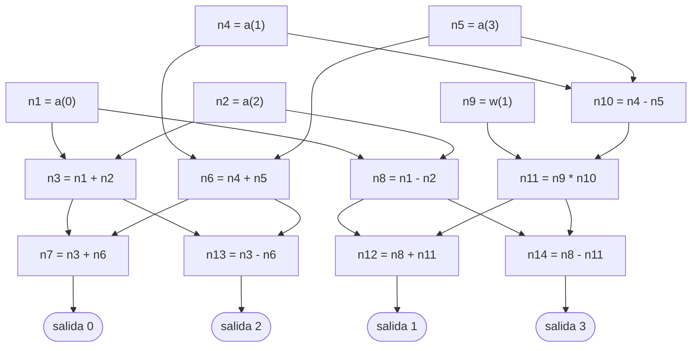

# Capítulo 50 — Proyecto: la FFT simbólica

La transformada discreta de Fourier de orden $n$ recibe $n$ coeficientes
$a_0, \ldots, a_{n-1}$ y devuelve los valores del polinomio
$p(x) = a_0 + a_1 x + \cdots + a_{n-1} x^{n-1}$ en las $n$ potencias de una
raíz $n$-ésima de la unidad. Calculada según la definición, cuesta del
orden de $n^2$ operaciones; la **transformada rápida** (FFT, por *Fast
Fourier Transform*) obtiene los mismos valores con del orden de
$n \log_2 n$, como mostraron Cooley y Tukey en 1965. Este capítulo no
programa la transformada rápida a partir de su descripción habitual, con
arreglos y el reordenamiento de sus elementos: la **deriva**. El programa trabaja con expresiones simbólicas,
sin evaluar ningún número: construye la expresión de cada salida, la
simplifica con las propiedades de las raíces de la unidad, y reúne en un
solo grafo las subexpresiones que las salidas comparten. El grafo que
resulta es el de la transformada rápida, con su forma característica de
mariposa, y la cantidad de operaciones se mide en cada paso.

![Diagrama de flujo de datos: las entradas x[0], x[2], x[4] y x[6] entran a una transformada de N/2 puntos y x[1], x[3], x[5] y x[7] a otra; sus salidas E[0] a E[3] y O[0] a O[3] se cruzan en mariposas, multiplicadas por factores W, y dan las salidas X[0] a X[7]](mariposa-fft.png){ style="background-color: white" }

La transformada rápida de orden 8 en una etapa: los coeficientes de lugar
par y los de lugar impar pasan por dos transformadas de orden 4, y cada
salida combina un resultado de cada una, el segundo multiplicado por una
potencia de la raíz de la unidad. Las líneas que se cruzan forman las
mariposas. Es el grafo que el capítulo obtiene sin dibujarlo de antemano,
solo reuniendo las subexpresiones comunes. Imagen: Yangwenbo99,
[CC BY-SA 4.0](https://creativecommons.org/licenses/by-sa/4.0/), vía
[Wikimedia Commons](https://commons.wikimedia.org/wiki/File:DIT-FFT-butterfly.svg).

El programa crece en cinco versiones, una por sección. Reutiliza, sin
copiarlos, el producto de matrices con símbolos del
[capítulo 47](../capitulo-47-proyecto-aritmetica-racional-matrices/index.md), el simplificador del [capítulo 32](../capitulo-32-inspeccion-de-terminos/index.md), al que agrega las
reglas de las raíces de la unidad, y el diccionario incompleto de la
[sección 34.4](../capitulo-34-estructuras-incompletas-y-listas-diferencia/index.md#344-diccionarios-incompletos), que reúne las subexpresiones comunes. Cumple así dos
anuncios: el del [capítulo 45](../capitulo-45-proyecto-compilador/index.md), cuyo ejercicio 12 comparte las
subexpresiones repetidas de una expresión con ese mismo diccionario y
anticipa que el resultado es un grafo y no un árbol, y el del
[capítulo 47](../capitulo-47-proyecto-aritmetica-racional-matrices/index.md), que anticipa expresiones simbólicas con subexpresiones
compartidas. Todos los archivos del capítulo cargan otros archivos, y por
eso se ejecutan en una instalación local, no en SWISH.

El proyecto parte del capítulo «Case Study: The Fast Fourier Transform in
Prolog» de *Clause and Effect* de William F. Clocksin, que resume un
artículo del propio autor de 1988. De ese capítulo vienen la idea central
—obtener la transformada rápida reuniendo las subexpresiones comunes de la
transformada ingenua, sin programar el reordenamiento—, la notación de un
polinomio por la lista de los índices de sus coeficientes, la
descomposición de cada polinomio en sus índices de lugar par y de lugar
impar, la representación del grafo como una lista de nodos numerados, y las
cifras del ejemplo de orden 8: 112 operaciones en las expresiones sueltas y
48 en el grafo. El capítulo de Clocksin construye el grafo con una lista
diferencia y un contador; este usa el diccionario incompleto del curso. El
libro deja de lado, de manera explícita, la identidad
$\omega^{k+n/2} = -\omega^k$; este capítulo la agrega en la última
versión, que reduce los productos de 24 a 5. La versión matricial, la
simplificación, la evaluación numérica y las mediciones son propias, como
todo el código.

## Objetivos del capítulo

Al terminar el capítulo, el lector puede:

- escribir la transformada discreta como el producto de una matriz de
  raíces de la unidad por el vector de los coeficientes, con expresiones
  sin evaluar, y contar sus operaciones;
- extender un simplificador con reglas propias de un dominio, las de las
  raíces de la unidad, y verificar cada expresión con su valor numérico;
- construir las salidas de la transformada con la descomposición en
  índices pares e impares, y reconocer que esa recursión, sola, no ahorra
  operaciones;
- reunir las subexpresiones comunes de varias expresiones en un grafo
  dirigido acíclico con un diccionario incompleto, y evaluar el grafo
  calculando cada nodo una vez;
- obtener el grafo de la transformada rápida y medir su costo contra el de
  las versiones anteriores.

!!! info "Tiempo estimado"
    Leer el capítulo, ejecutar sus ejemplos y hacer las actividades: **1:30 h**.
    Resolver los 5 ejercicios marcados con ★: **1:25 h**.
    Resolver los 12 ejercicios del final: **3:50 h**.

## 50.1 El programa terminado

`fft.pl` carga las cinco versiones y compara lo que cuesta cada una: cuántas
sumas (o restas) y cuántos productos hay que calcular para obtener las $n$
salidas. La consulta `tabla_de_costos([2, 4, 8, 16, 32, 64])` escribe, y
después responde `true`:

```text
n          ingenua  simplificada       arboles         grafo      mariposa
2              4+4           2+0           2+2           2+2           2+0
4            16+16          12+4         12+12           8+8           8+1
8            64+64         56+32         56+56         24+24          24+5
16         256+256       240+176       240+240         64+64         64+17
32       1024+1024       992+832       992+992       160+160        160+49
64       4096+4096     4032+3648     4032+4032       384+384       384+129
```

Cada celda es `Sumas+Productos`. Las dos primeras columnas crecen con
$n^2$ y las dos últimas con $n \log_2 n$: para $n = 64$, la transformada
según la definición calcula 8 192 operaciones, y el grafo final, 513. La
tercera columna muestra el hecho central del capítulo: la recursión de la
transformada rápida, escrita como expresiones independientes, cuesta lo
mismo que la definición. La rapidez no está en la recursión sino en lo que
las salidas comparten, y aparece recién en la cuarta columna, cuando las
subexpresiones repetidas se calculan una vez.

`fft_ejemplo(4)` escribe el grafo de orden 4 como una lista de nodos, uno
por línea con la forma `n3 = n1 + n2`, cada uno después de los nodos que
usa, y al final el nodo de cada salida. `a(J)` es el coeficiente $a_J$ y
`w(K)` es $\omega^K$, la potencia $K$ de la raíz de la unidad.
`mermaid_grafo(4)` escribe los mismos nodos como un diagrama:



Cada par de nodos del mismo nivel que usa los mismos dos operandos, uno con
una suma y otro con una resta (`n3` y `n8`, `n6` y `n10`, `n7` y `n13`,
`n12` y `n14`), es una «mariposa»: dos entradas cruzadas que producen dos
salidas. Las secciones que siguen construyen este grafo en cinco pasos.

## 50.2 La transformada como producto de matriz por vector

Sea $\omega = e^{2\pi i/n}$, una raíz $n$-ésima de la unidad: $\omega^n = 1$,
y sus potencias $\omega^0, \ldots, \omega^{n-1}$ son distintas. La salida $k$
de la transformada es

$$X_k = p(\omega^k) = \sum_{j=0}^{n-1} a_j\,\omega^{jk}, \qquad k = 0, \ldots, n-1.$$

Escrita para todas las salidas a la vez, la transformada es el producto de
la matriz $W$, de elementos $W_{kj} = \omega^{jk}$, por el vector de los
coeficientes. El programa no evalúa nada: `a(J)` representa el coeficiente
$a_J$ y `w(K)` la potencia $\omega^K$, y las salidas son expresiones. El
producto de matrices con símbolos ya existe: `producto_sin_simplificar/3`
del [capítulo 47](../capitulo-47-proyecto-aritmetica-racional-matrices/index.md) construye cada elemento como la suma
`0 + A1 * B1 + ... + An * Bn`, sin evaluarla. La primera versión, `tdf.pl`,
lo carga y solo construye la matriz y el vector:

<!-- ejemplo: capitulo-50/tdf.pl predicado: matriz_tdf/2 fila_tdf/3 tdf_ingenua/2 -->
```prolog
%!  matriz_tdf(+N:integer, -W:list(list)) is det.
%
%   W es la matriz de la transformada de orden N: el elemento de la fila K
%   y la columna J es w(J * K), con el producto sin reducir módulo N.
matriz_tdf(N, W) :-
    must_be(positive_integer, N),
    N1 is N - 1,
    numlist(0, N1, Ks),
    maplist(fila_tdf(Ks), Ks, W).

%!  fila_tdf(+Js:list(integer), +K:integer, -Fila:list) is det.
%
%   Fila es la fila K de la matriz de la transformada, con una columna por
%   cada índice de Js.
fila_tdf(Js, K, Fila) :-
    maplist([J, w(P)]>>(P is J * K), Js, Fila).

%!  tdf_ingenua(+N:integer, -Es:list) is det.
%
%   Es son las N salidas de la transformada de orden N, calculadas como el
%   producto de la matriz por el vector de los coeficientes, sin
%   simplificar.
tdf_ingenua(N, Es) :-
    matriz_tdf(N, W),
    coeficientes(N, As),
    maplist([A, [A]]>>true, As, Columna),
    producto_sin_simplificar(W, Columna, C),
    maplist([[E], E]>>true, C, Es).
```

```prolog
?- matriz_tdf(4, W).
W = [[w(0), w(0), w(0), w(0)], [w(0), w(1), w(2), w(3)], [w(0), w(2), w(4), w(6)], [w(0), w(3), w(6), w(9)]].

?- tdf_ingenua(4, [_, E|_]).
E = 0+w(0)*a(0)+w(1)*a(1)+w(2)*a(2)+w(3)*a(3).
```

El vector de los coeficientes es una matriz de una columna, y el producto,
otra; `tdf_ingenua/2` la convierte en la lista de sus elementos. Para
medir el costo, `operaciones/3` cuenta los nodos de las expresiones que son
sumas o restas y los que son productos, con `sub_term/2` y
`compound_name_arity/3` del [capítulo 32](../capitulo-32-inspeccion-de-terminos/index.md):

<!-- ejemplo: capitulo-50/tdf.pl predicado: operaciones/3 operador_en/2 clase/2 -->
```prolog
%!  operaciones(+Es:list, -Sumas:integer, -Productos:integer) is det.
%
%   Sumas es la cantidad de sumas y restas de las expresiones Es, y
%   Productos la de productos, contando cada aparición: una subexpresión
%   repetida se cuenta cada vez que aparece.
operaciones(Es, Sumas, Productos) :-
    aggregate_all(count, operador_en(Es, suma), Sumas),
    aggregate_all(count, operador_en(Es, producto), Productos).

%!  operador_en(+Es:list, ?Clase) is nondet.
%
%   Uno de los nodos de las expresiones Es es una operación de la Clase
%   suma (+ o -) o producto (*): una respuesta por cada nodo.
operador_en(Es, Clase) :-
    member(E, Es),
    sub_term(S, E),
    compound(S),
    compound_name_arity(S, Op, 2),
    clase(Op, Clase).

% clase(Op, C): el operador binario Op es de la clase C.
clase(+, suma).
clase(-, suma).
clase(*, producto).
```

Cada versión del capítulo agrega a `costo/4`, declarado `multifile` en
`tdf.pl`, una cláusula que construye sus salidas y las cuenta; `fft.pl`
reúne esas cláusulas en la tabla de la [sección 50.1](#501-el-programa-terminado).
La cláusula de esta versión aplica `operaciones/3` a `tdf_ingenua/2`:

```prolog
?- costo(ingenua, 8, S, P).
S = P, P = 64.
```

Cada salida tiene $n$ productos y $n$ sumas: $2n^2$ operaciones en total.
La versión tiene tres defectos visibles en la salida `E` de más arriba. La
suma con `0` no hace falta; los productos por `w(0)`, que vale 1, tampoco; y
exponentes como `w(6)` o `w(9)` en una transformada de orden 4 son la misma
raíz que `w(2)` y `w(1)`, pero el programa no lo sabe. Los tres son reglas
de simplificación.

## 50.3 Las raíces de la unidad

El simplificador del [capítulo 32](../capitulo-32-inspeccion-de-terminos/index.md) ya elimina la suma con `0` y el
producto por `1`, con su tabla de reglas `regla/2`. Le faltan las reglas del
dominio, que dependen de $n$:

- $\omega^n = 1$: el exponente se reduce módulo $n$, y `w(0)` es `1`;
- $\omega^{n/2} = -1$, porque $\omega^{n/2}$ es una raíz cuadrada de 1
  distinta de 1: en consecuencia $\omega^{k} = -\omega^{k-n/2}$ para
  $k \geq n/2$, y una suma `X + w(K) * Y` con $K$ de $n/2$ en adelante es la
  resta `X - w(K - n/2) * Y`.

La segunda versión, `raices.pl`, escribe esas dos identidades en las tres
cláusulas de `raiz/3` y
recorre la expresión como el simplificador del
[capítulo 32](../capitulo-32-inspeccion-de-terminos/index.md): de abajo hacia arriba, con `mapargs/3`, y aplicando a cada
nodo una regla propia o, si ninguna se aplica, una de `regla/2`:

<!-- ejemplo: capitulo-50/raices.pl predicado: simp_raices/3 regla_raices/3 raiz/3 -->
```prolog
%!  simp_raices(+N:integer, +E0, -E) is det.
%
%   E es E0 simplificada, como en simplificar_raices/3, sin verificar los
%   argumentos.
simp_raices(N, E0, E) :-
    (   compound(E0)
    ->  mapargs(simp_raices(N), E0, E1)
    ;   E1 = E0
    ),
    (   regla_raices(N, E1, E2)
    ->  simp_raices(N, E2, E)
    ;   E = E1
    ).

%!  regla_raices(+N:integer, +E0, -E) is nondet.
%
%   E es el resultado de reescribir la raíz de E0 con una regla de las
%   raíces de la unidad o, si no, con una del simplificador del capítulo
%   32.
regla_raices(N, E0, E) :-
    raiz(N, E0, E).
regla_raices(_, E0, E) :-
    regla(E0, E).

%!  raiz(+N:integer, +E0, -E) is semidet.
%
%   E es E0 reescrita con una identidad de las raíces N-ésimas de la
%   unidad: el exponente se reduce módulo N, w(0) es 1, y una suma
%   X + w(K) * Y con K de N/2 en adelante es la resta X - w(K - N/2) * Y.
raiz(N, w(K), w(K1)) :-
    K1 is K mod N,
    K1 =\= K.
raiz(_, w(0), 1).
raiz(N, X + w(K) * Y, X - w(K1) * Y) :-
    2 * K >= N,
    K1 is K - N // 2.
```

La tercera cláusula de `raiz/3` se aplica a la suma entera y no a `w(K)` sola,
porque el signo tiene que salir del producto: la resta `X - w(1) * Y` usa
el mismo producto `w(1) * Y` que la suma `X + w(1) * Y`, y la
[sección 50.6](#506-la-mariposa) aprovecha exactamente eso. Como el recorrido
es de abajo hacia arriba, cuando la regla examina la suma el exponente ya
está reducido módulo $n$; si queda `w(0)`, la simplificación siguiente lo
convierte en `1` y el producto desaparece:

```prolog
?- simplificar_raices(8, a(0) + w(12) * a(1), E).
E = a(0)-a(1).

?- tdf_ingenua(4, Es0), maplist(simplificar_raices(4), Es0, Es).
Es0 = [0+w(0)*a(0)+w(0)*a(1)+w(0)*a(2)+w(0)*a(3), 0+w(0)*a(0)+w(1)*a(1)+w(2)*a(2)+w(3)*a(3), 0+w(0)*a(0)+w(2)*a(1)+w(4)*a(2)+w(6)*a(3), 0+w(...)*a(...)+w(3)*a(1)+w(6)*a(2)+w(9)*a(3)],
Es = [a(0)+a(1)+a(2)+a(3), a(0)+w(1)*a(1)-a(2)-w(1)*a(3), a(0)-a(1)+a(2)-a(3), a(0)-w(1)*a(1)-a(2)+w(1)*a(3)].
```

Una regla de simplificación mal escrita produce expresiones que parecen
correctas y no lo son. Por eso `raices.pl` también **evalúa**: `valor/4`
calcula el valor complejo de una expresión, representado como `c(Re, Im)`,
dados los valores de los coeficientes, y `definicion/2` calcula la
transformada directamente con la fórmula, sin pasar por las expresiones.
Las pruebas de cada versión comparan las dos con `cercanos/2`, que admite
una diferencia de $10^{-9}$ por los errores de redondeo. `valor/4` tiene
una cláusula por clase de hoja y una para las operaciones, que evalúa los
dos operandos y los combina con `operar/4`, la suma, la resta o el producto
de dos complejos; `w(K)` vale $\cos(2\pi K/n) + i \sin(2\pi K/n)$:

```prolog
?- definicion([1, 2, 3, 4], Vs).
Vs = [c(10.0, 0.0), c(-2.0000000000000004, -1.9999999999999996), c(-2.0, 9.796850830579018e-16), c(-1.9999999999999982, 2.000000000000001)].
```

Los valores exactos son $10$, $-2-2i$, $-2$ y $-2+2i$; lo demás es el
redondeo de `cos/1` y `sin/1`. Con las reglas nuevas, la transformada de
orden 8 baja de 64 + 64 a 56 + 32 operaciones: desaparecen las sumas con 0,
los productos por $\omega^0$ y por $\omega^4 = -1$. Sigue siendo
cuadrática: cada salida es una expresión independiente, y nada de lo que
una calcula lo aprovecha otra.

!!! question "Actividad"
    Predecir, sin ejecutarla, la salida 4 de la transformada de orden 8
    simplificada, la que corresponde a $\omega^4 = -1$. Comprobarla con
    `tdf_ingenua(8, Es0), nth0(4, Es0, E0), simplificar_raices(8, E0, E)`,
    y explicar con las cláusulas de `raiz/3` por qué no queda ningún producto.

## 50.4 La recursión sobre las mitades

La descomposición en la que se basa la transformada rápida, que Clocksin
atribuye a Danielson y Lanczos, y que *Numerical Recipes* presenta como
punto de partida de la FFT, separa los coeficientes de lugar par de los de
lugar impar:

$$p(x) = p_{\mathit{par}}(x^2) + x \, p_{\mathit{impar}}(x^2),$$

donde $p_{\mathit{par}}$ tiene los coeficientes $a_0, a_2, a_4, \ldots$ y
$p_{\mathit{impar}}$ los coeficientes $a_1, a_3, a_5, \ldots$. Si
$x = \omega^k$, entonces $x^2 = \omega^{2k}$, y los dos polinomios, de la
mitad de coeficientes, se evalúan en otra potencia de la misma raíz. La
descomposición se repite hasta que un polinomio tiene un solo coeficiente,
que es su propio valor. Para que las mitades sean siempre iguales, $n$ es
una potencia de 2.

La tercera versión, `mitades.pl`, representa un polinomio por la lista de
los índices de sus coeficientes, como el capítulo de Clocksin, y separa
los lugares pares de los impares con `alternar/3`:

<!-- ejemplo: capitulo-50/mitades.pl predicado: alternar/3 evaluar/4 evaluar/5 -->
```prolog
%!  alternar(?Lista:list, ?Pares:list, ?Impares:list) is semidet.
%
%   Pares son los elementos de Lista en los lugares 0, 2, 4, ..., e
%   Impares los de los lugares 1, 3, 5, ...; Lista tiene una cantidad par
%   de elementos.
alternar([], [], []).
alternar([X, Y|T], [X|Xs], [Y|Ys]) :-
    alternar(T, Xs, Ys).

%!  evaluar(+Indices:list(integer), +K:integer, +N:integer, -E) is det.
%
%   E es la expresión del polinomio de los coeficientes a(I), con I en
%   Indices, evaluado en w(K), la potencia K de una raíz N-ésima de la
%   unidad. La longitud de Indices es una potencia de 2.
evaluar([I|Is], K, N, E) :-
    evaluar(Is, I, K, N, E).

%!  evaluar(+Is:list(integer), +I:integer, +K:integer, +N:integer,
%!          -E) is det.
%
%   Como evaluar/4 con los índices [I|Is]: separa el caso de un solo
%   índice por el primer argumento.
evaluar([], I, _, _, a(I)).
evaluar([I1|Is], I0, K, N, A1 + w(K) * A2) :-
    alternar([I0, I1|Is], Pares, Impares),
    K2 is 2 * K mod N,
    evaluar(Pares, K2, N, A1),
    evaluar(Impares, K2, N, A2).
```

`evaluar/4` delega en `evaluar/5`, que recibe el primer índice aparte: así
el caso de un solo índice, `[]` en el primer argumento, se distingue del
recursivo por la indexación, y ninguna llamada deja alternativas
pendientes. Con los índices del 0 al 7 y $k = 6$ se obtiene la misma
expresión que el capítulo de Clocksin escribe para $p(\omega^6)$:

```prolog
?- evaluar([0, 1, 2, 3, 4, 5, 6, 7], 6, 8, E).
E = a(0)+w(0)*a(4)+w(4)*(a(2)+w(0)*a(6))+w(6)*(a(1)+w(0)*a(5)+w(4)*(a(3)+w(0)*a(7))).
```

`fft_arboles/2` construye las $n$ salidas, una con cada potencia. El costo
de las ocho salidas de orden 8 es de 56 sumas y 56 productos, 112
operaciones: las mismas que cuenta Clocksin, y más que las 88 de la matriz
simplificada. La recursión sola no hace más rápida la transformada. Lo que
cambia es la **forma** de las expresiones, visible en las de orden 4:

```prolog
?- fft_arboles(4, Es).
Es = [a(0)+w(0)*a(2)+w(0)*(a(1)+w(0)*a(3)), a(0)+w(2)*a(2)+w(1)*(a(1)+w(2)*a(3)), a(0)+w(0)*a(2)+w(2)*(a(1)+w(0)*a(3)), a(0)+w(2)*a(2)+w(3)*(a(1)+w(2)*a(3))].
```

La subexpresión `a(0)+w(0)*a(2)` está en las salidas 0 y 2, y
`a(0)+w(2)*a(2)` en las salidas 1 y 3; lo mismo pasa con las de `a(1)` y
`a(3)`. En la versión matricial, en cambio, las sumas se asocian a
izquierda desde el primer término, y dos salidas distintas no comparten
ninguna suma. Las expresiones de la recursión repiten subexpresiones
enteras: calcular cada una una sola vez es la transformada rápida.

## 50.5 Las subexpresiones comunes: un grafo

Las expresiones `a + b * c` y `d + b * c` tienen el producto `b * c` en
común. Calculadas por separado, cuestan cuatro operaciones; si el producto
se calcula una vez y su resultado se usa en las dos sumas, tres. La
estructura que representa eso ya no es un árbol, en el que cada nodo tiene
un solo padre, sino un **grafo dirigido acíclico**: el nodo del producto
tiene dos padres.

La cuarta versión, `grafo.pl`, representa el grafo como una lista de nodos
numerados. Un nodo es `nodo(Id, Hoja)`, con una hoja `a(J)`, `w(K)` o un
número, o `nodo(Id, op(Op, I, J))`, la operación `Op` entre los nodos `I` y
`J`. Para asignar a cada subexpresión distinta un solo número, usa el
diccionario incompleto de la
[sección 34.4](../capitulo-34-estructuras-incompletas-y-listas-diferencia/index.md#344-diccionarios-incompletos) tal como está, cargando `diccionario.pl`:
`buscar/3` encuentra una clave o la agrega al final abierto, y `numerar/2`
liga los valores, al terminar, a 1, 2, 3… en el orden en que se agregaron.
La clave es la subexpresión misma, que es un término cerrado; el valor, su
número, libre hasta el final:

<!-- ejemplo: capitulo-50/grafo.pl predicado: grafo/3 agregar/3 operacion/4 -->
```prolog
%!  grafo(+Es:list, -Nodos:list, -Salidas:list(integer)) is det.
%
%   Nodos es el grafo de las expresiones cerradas Es, con una sola vez
%   cada subexpresión, en orden: cada nodo después de sus hijos. Salidas
%   son los números de los nodos de las expresiones de Es, en el mismo
%   orden. Produce un error de instanciación si Es tiene variables: buscar/3
%   compara las claves por unificación.
grafo(Es, Nodos, Salidas) :-
    must_be(ground, Es),
    maplist(agregar(Dic), Es, Salidas),
    numerar(Dic, 1),
    nodos(Dic, Dic, Nodos).

%!  agregar(?Dic, +E, -Id) is det.
%
%   Agrega al diccionario incompleto Dic las subexpresiones de E, los hijos
%   antes que el padre; Id es el valor de E en Dic, libre hasta que
%   numerar/2 lo liga.
agregar(Dic, E, Id) :-
    (   operacion(E, _, A, B)
    ->  agregar(Dic, A, _),
        agregar(Dic, B, _)
    ;   true
    ),
    buscar(E, Dic, Id).

%!  operacion(+E, -Op, -A, -B) is semidet.
%
%   E es la operación A Op B, con Op entre +, - y *.
operacion(E, Op, A, B) :-
    compound(E),
    compound_name_arguments(E, Op, [A, B]),
    memberchk(Op, [+, -, *]).
```

`agregar/3` visita los hijos antes de buscar al padre. Por eso un nodo
entra al diccionario después de sus hijos, y `numerar/2` le da un número
mayor: la lista de nodos queda en un orden en el que cada operación viene
después de sus operandos, el orden en que se pueden calcular. Es la
construcción del grafo de una expresión que los compiladores usan para
eliminar subexpresiones comunes, y que Clocksin remite a Aho y Ullman. Una vez
numerado el diccionario, `nodos/3` lo recorre y reemplaza en cada operación
las subexpresiones hijas por sus números, que vuelve a pedir a `buscar/3`;
como ya están, `buscar/3` las encuentra sin agregar nada:

<!-- ejemplo: capitulo-50/grafo.pl predicado: nodos/3 contenido/3 -->
```prolog
%!  nodos(?Resto, +Dic, -Nodos:list) is det.
%
%   Nodos son los nodos de las entradas Resto del diccionario Dic, ya
%   numerado, hasta su final abierto.
nodos(Final, _, []) :-
    var(Final),
    !.
nodos([E-Id|Resto], Dic, [nodo(Id, T)|Ns]) :-
    contenido(E, Dic, T),
    nodos(Resto, Dic, Ns).

%!  contenido(+E, +Dic, -T) is det.
%
%   T es el contenido del nodo de E: op(Op, I, J) si E es A Op B, con I y J
%   los números de A y B en Dic, y E misma si E es una hoja.
contenido(E, Dic, T) :-
    (   operacion(E, Op, A, B)
    ->  buscar(A, Dic, I),
        buscar(B, Dic, J),
        T = op(Op, I, J)
    ;   T = E
    ).
```

```prolog
?- grafo([a + b * c, d + b * c], Nodos, Salidas).
Nodos = [nodo(1, a), nodo(2, b), nodo(3, c), nodo(4, op(*, 2, 3)), nodo(5, op(+, 1, 4)), nodo(6, d), nodo(7, op(+, 6, 4))],
Salidas = [5, 7].

?- grafo([(a + b) * (a + b)], Nodos, Salidas).
Nodos = [nodo(1, a), nodo(2, b), nodo(3, op(+, 1, 2)), nodo(4, op(*, 3, 3))],
Salidas = [4].
```

En el primer grafo, los nodos 5 y 7 usan los dos el nodo 4. En el segundo,
el producto usa dos veces el mismo nodo: $(a+b)^2$ se calcula con una suma
y un producto. Es lo mismo que hace `compartir/2` en el ejercicio 12 del
[capítulo 45](../capitulo-45-proyecto-compilador/index.md), con una diferencia de alcance: aquel comparte solo
las subexpresiones que aparecen más de una vez y las nombra con variables
nuevas del programa; `grafo/3` da un nodo a cada subexpresión, y las
expresiones que comparte pueden estar en salidas distintas. Nada de
`grafo/3` depende de la transformada: sirve para cualquier lista de
expresiones cerradas.

Aplicado a las ocho salidas de orden 8 de la versión 3, da exactamente el
grafo de Clocksin: 64 nodos, de los que 16 son hojas y 48 operaciones.

```prolog
?- costo(grafo, 8, S, P).
S = P, P = 24.
```

Las 112 operaciones de los árboles se redujeron a 48: $n \log_2 n$ sumas y
otros tantos productos. Queda por explicar cómo se calcula el grafo con
números, y `valor_grafo/5` lo hace recorriendo la lista una vez: cada nodo
toma los valores de sus hijos de una tabla (`library(assoc)`) y agrega el
suyo:

<!-- ejemplo: capitulo-50/grafo.pl predicado: valor_grafo/5 valor_nodo/5 -->
```prolog
%!  valor_grafo(+N:integer, +Coefs:list, +Nodos:list, +Salidas:list,
%!              -Vs:list) is det.
%
%   Vs son los valores complejos de los nodos Salidas del grafo Nodos,
%   calculados una vez por nodo, en el orden del grafo, con las raíces
%   N-ésimas de la unidad y los coeficientes Coefs como en valor/4.
valor_grafo(N, Coefs, Nodos, Salidas, Vs) :-
    empty_assoc(T0),
    foldl(valor_nodo(N, Coefs), Nodos, T0, T),
    maplist([Id, V]>>get_assoc(Id, T, V), Salidas, Vs).

%!  valor_nodo(+N, +Coefs, +Nodo, +T0, -T) is det.
%
%   T es la tabla T0 de valores por número de nodo con el valor de Nodo
%   agregado; los valores de sus hijos ya están en T0.
valor_nodo(N, Coefs, nodo(Id, T), T0, T1) :-
    (   T = op(Op, I, J)
    ->  get_assoc(I, T0, VI),
        get_assoc(J, T0, VJ),
        operar(Op, VI, VJ, V)
    ;   valor(N, Coefs, T, V)
    ),
    put_assoc(Id, T0, V, T1).
```

El grafo todavía tiene productos que sobran. Entre sus 16 hojas están las
ocho potencias `w(0)` a `w(7)`: la versión 4 construye el grafo con las
expresiones sin simplificar, y multiplica por `w(0)`, que vale 1, y por
`w(4)`, que vale $-1$. Además, las salidas $k$ y $k + 4$ calculan
`w(K) * B` y `w(K+4) * B` como dos productos distintos, aunque uno es el
opuesto del otro.

!!! question "Actividad"
    Predecir el grafo de `grafo([a * b + b * a, a * b], Nodos, Salidas)`:
    cuántos nodos tiene y si los productos `a * b` y `b * a` comparten un
    nodo. Comprobarlo, y explicar qué haría falta para que los compartan.

## 50.6 La mariposa

La quinta versión, `mariposa.pl`, cambia una sola cosa: simplifica las
expresiones de la versión 3 con `simplificar_raices/3` **antes** de
construir el grafo.

<!-- ejemplo: capitulo-50/mariposa.pl predicado: fft_grafo/3 fft_numerica/2 -->
```prolog
%!  fft_grafo(+N:integer, -Nodos:list, -Salidas:list(integer)) is det.
%
%   Nodos es el grafo de la transformada rápida de orden N, con las
%   expresiones de la recursión sobre las mitades simplificadas antes de
%   reunir sus subexpresiones comunes; Salidas son los nodos de las N
%   salidas, en orden. Produce un error de dominio si N no es una potencia
%   de 2.
fft_grafo(N, Nodos, Salidas) :-
    fft_arboles(N, Es0),
    maplist(simplificar_raices(N), Es0, Es),
    grafo(Es, Nodos, Salidas).

%!  fft_numerica(+Coefs:list, -Vs:list) is det.
%
%   Vs es la transformada de Coefs, calculada con el grafo de la
%   transformada rápida: cada nodo se evalúa una vez. La longitud de Coefs
%   es una potencia de 2.
fft_numerica(Coefs, Vs) :-
    length(Coefs, N),
    fft_grafo(N, Nodos, Salidas),
    valor_grafo(N, Coefs, Nodos, Salidas, Vs).
```

El efecto está en la tercera cláusula de `raiz/3`. Las salidas $k$ y
$k + n/2$ provienen del mismo par de polinomios, evaluados en el mismo
$\omega^{2k}$: son `A + w(K) * B` y `A + w(K + n/2) * B`. Después de
simplificar, la segunda es `A - w(K) * B`, y las dos comparten `A` y el
producto `w(K) * B`. Esa pareja, una suma y una resta con los mismos
operandos, es la mariposa del grafo de la [sección 50.1](#501-el-programa-terminado), y se
repite en cada nivel de la recursión. Además, los productos por `w(0)`
desaparecen: en el nivel de los pares de coeficientes, todos.

```prolog
?- costo(mariposa, 8, S, P).
S = 24,
P = 5.

?- fft_numerica([1, 2, 3, 4], Vs).
Vs = [c(10, 0), c(-2.0, -2.0), c(-2, 0), c(-1.9999999999999998, 2.0)].
```

El grafo tiene 11 hojas: los 8 coeficientes y las raíces `w(1)`, `w(2)` y
`w(3)`. En cada uno de los $\log_2 n$ niveles hay $n$ sumas o restas y $n/2$
productos, de los que se eliminan los que son por $\omega^0$: uno en el
último nivel, dos en el anterior, y así hasta $n/2$ en el primero, $n-1$ en
total. El costo es

$$n \log_2 n \text{ sumas y restas}, \qquad \frac{n}{2}\log_2 n - (n - 1) \text{ productos},$$

y la prueba `costo` de `mariposa.plt` lo verifica hasta $n = 32$. En la
última consulta, los valores que no requieren productos por `w(1)` salen
enteros y exactos: `c(10, 0)` y `c(-2, 0)` solo suman y restan
coeficientes.

!!! question "Actividad"
    Con la fórmula, predecir las sumas y los productos de la mariposa de
    orden 128, y cuántas operaciones calcula para el mismo orden la
    transformada según la definición. Comprobar las dos cifras con
    `costo/4` y medir con `time/1` cuánto tarda cada una en
    construirse.

## 50.7 La medición

La tabla de la [sección 50.1](#501-el-programa-terminado) resume las cinco versiones. La
recursión sobre las mitades no ahorra nada por sí sola (columna
`arboles`); reunir las subexpresiones comunes lleva el costo de $2n^2$ a
$2n \log_2 n$ (columna `grafo`); y las identidades de las raíces reducen
los productos a menos de la mitad de las sumas (columna `mariposa`). Para
$n = 8$, de 128 operaciones se pasa a 29; para $n = 64$, de 8 192 a 513.

Contar operaciones mide el grafo, no el programa que lo construye. Con
$n = 64$ y los coeficientes del 1 al 64, `time/1` da estas cantidades de
inferencias:

| Meta medida | Inferencias |
|---|---|
| evaluar las 64 expresiones de la matriz con `valor/4` | 82 050 |
| evaluar el grafo de la mariposa con `valor_grafo/5` | 32 917 |
| construir el grafo con `fft_grafo/3` | 3 023 467 |

Evaluar el grafo de la mariposa usa menos de la mitad de las inferencias
que evaluar las expresiones de la matriz, aunque cada nodo pase por una
tabla `assoc`, que cuesta un logaritmo por consulta. Construir el grafo,
en cambio, cuesta unas noventa veces más que evaluarlo: `agregar/3` recorre cada
expresión entera, también las partes ya agregadas, y `buscar/3` compara
cada subexpresión con las claves de una lista. Es el precio de una
derivación simbólica, que se paga una vez por cada $n$: el grafo es un
programa, y sirve para todos los vectores de coeficientes de ese orden,
como el código que un compilador genera sirve para todas las ejecuciones.
El [ejercicio 8](#ejercicios) reduce ese precio.

!!! success "Criterios de calidad"
    | Criterio | En este capítulo |
    |---|---|
    | C1 | cada predicado declara modos y determinación; `evaluar/4` separa el caso base del recursivo por el primer argumento de `evaluar/5`, y es `det` sin cortes |
    | C2 | `a(J)`, `w(K)` y `op(Op, I, J)` son una representación limpia: la clase de una hoja o de un nodo se conoce por su functor; los números, como el 0 con que empiezan las sumas de la matriz, son la única hoja que `valor/4` distingue con `number/1` |
    | C4 | ningún predicado `det` deja alternativas pendientes; `costo/4` es `nondet` solo con la versión libre, y la indexación por el primer argumento lo hace determinista con la versión dada |
    | C5 | `simplificar_raices/3` y `grafo/3` producen un error de instanciación si reciben una expresión con variables, que en `grafo/3` unificaría con cualquier clave de `buscar/3`; `fft_arboles/2` produce un error de dominio si $n$ no es una potencia de 2 |
    | C6 | todo el núcleo es puro: las expresiones, los grafos y los valores son términos; solo `tabla_de_costos/1`, `fft_ejemplo/1`, `listar_grafo/1` y `mermaid_grafo/1` escriben |
    | C7 | 85 pruebas en seis archivos; cada versión se compara con `definicion/2` con coeficientes reales y complejos, y los costos de orden 8 son los de *Clause and Effect* |

## Ejercicios

Las soluciones están en [la página de soluciones](soluciones.md). La dificultad
va de 1 (se resuelve consultando el capítulo) a 3 (requiere elaboración propia).
Los marcados con ★ son los que no conviene saltear: cubren lo que el capítulo
tiene de propio, y los capítulos siguientes los dan por hechos.

1. ★ **(1)** Predecir la expresión de `evaluar([0, 1, 2, 3], 3, 4, E)` y
   su forma simplificada con `simplificar_raices/3`, y comprobar las dos.
   ¿Qué cláusula de `raiz/3` se aplica en cada suma?
2. ★ **(1)** En una copia de `mitades.pl`, la cláusula recursiva de
   `alternar/3` es `alternar([X, Y|T], [X|Xs], [Y|Ys]) :- alternar(T, Ys, Xs).`
   Predecir qué devuelve `alternar([0, 1, 2, 3], P, I)` y qué pruebas de
   `mitades.plt` fallan. ¿Alguna salida de `fft_arboles(4, Es)` sigue siendo
   correcta?
3. **(1)** Construir el grafo de las expresiones de la matriz simplificada,
   sin la recursión: `tdf_ingenua(8, Es0)`, `simplificar_raices/3` en cada
   una y `grafo/3`. Contar sus sumas y productos, y explicar por qué se
   comparten productos pero ninguna suma.
4. **(2)** Escribir `productos_por(Nodos, K, Cantidad)`, que cuenta los
   productos del grafo en los que uno de los operandos es la hoja `w(K)`.
   En la mariposa de orden 8, ¿cuántos son por `w(2)`, que vale $i$? Un
   producto por $i$ solo intercambia la parte real con la imaginaria y
   cambia un signo: ¿cuántos productos «de verdad» quedan en los órdenes 8,
   16 y 32?
5. ★ **(2)** Escribir `profundidad(Nodos, Id, P)`: `P` es la cantidad de
   operaciones del camino más largo desde una hoja hasta el nodo `Id`, 0
   para una hoja. Escribir también su encabezado PlDoc, con modos y
   determinación. Calcular la profundidad máxima de las salidas de la
   mariposa de órdenes 4, 8 y 16, y compararla con la de las expresiones de
   la matriz simplificada.
6. **(2)** Una hoja numérica: aplicar `grafo/3` al producto de dos
   rotaciones alrededor del mismo eje del
   [capítulo 47](../capitulo-47-proyecto-aritmetica-racional-matrices/index.md), `rotacion(z, a, A), rotacion(z, b, B),
   producto_simbolico(A, B, P)`, con los 16 elementos en una lista. ¿Cuántas
   operaciones tienen los elementos por separado y cuántas el grafo? ¿Qué
   subexpresiones se comparten?
7. ★ **(2)** Medir con `time/1` la construcción de `fft_grafo/3` para los
   órdenes 16, 32, 64 y 128. ¿Cuánto crecen las inferencias cada vez que
   $n$ se duplica? Explicar el crecimiento a partir de lo que hacen
   `agregar/3` y `buscar/3`.
8. **(3)** Escribir `grafo_rapido/3`, con la misma relación que `grafo/3`,
   que no vuelve a recorrer una subexpresión que ya está en el diccionario.
   Escribir para eso `presente(E, Dic, Id)`, que busca la clave `E` en el
   diccionario incompleto sin agregarla. Medir la mejora contra el
   ejercicio 7.
9. **(2)** Para $n = 4$ las raíces son $1, i, -1, -i$, y los valores de la
   transformada de coeficientes enteros son enteros de Gauss. Escribir
   `valor_exacto/4`, como `valor/4` pero con `w(K)` exacto para $n$ igual a
   1, 2 o 4, y verificar con `==` que el grafo de la mariposa de orden 4
   da los valores exactos de `[1, 2, 3, 4]`.
10. ★ **(3)** La transformada inversa recupera los coeficientes:
    $a_j = \frac{1}{n}\sum_k X_k\,\omega^{-jk}$. Escribir
    `fft_inversa_grafo(N, Nodos, Salidas)`, que construye su grafo con
    `evaluar/4` y los exponentes negativos reducidos módulo $n$, y
    `fft_inversa(Xs, As)`, que evalúa el grafo y divide por $n$. Verificar
    que la inversa de la transformada de `[1, 2, 3, 4, 5, 6, 7, 8]`
    devuelve esos coeficientes, con la tolerancia de `cercanos/2`.
11. **(3)** El producto de dos polinomios es la transformada inversa del
    producto, salida por salida, de sus transformadas, con los dos
    polinomios completados con ceros hasta una potencia de 2 mayor que la
    suma de sus grados. Escribir `producto_polinomios(P, Q, R)`, con los
    polinomios como listas de coeficientes enteros, que redondea el
    resultado, y comprobarlo con $(1 + 2x + 3x^2)(4 + 5x)$.
12. **(2)** El capítulo de Clocksin numera los nodos mientras recorre la
    expresión, con un contador, y el diccionario de este capítulo los
    numera al final. Explicar por qué `buscar/3` no podría usar como clave
    `op(+, I, J)`, con `I` y `J` los números todavía libres de los hijos, y
    qué respondería `grafo/3` si lo hiciera, con un ejemplo de dos sumas
    distintas.

## Resumen

| | |
|---|---|
| **transformada discreta** | las $n$ salidas $X_k = \sum_j a_j \omega^{jk}$: el polinomio de los coeficientes evaluado en las potencias de una raíz $n$-ésima de la unidad |
| **raíz de la unidad** | $\omega = e^{2\pi i/n}$; cumple $\omega^n = 1$ y $\omega^{n/2} = -1$, las dos identidades que `raiz/3` escribe en tres cláusulas |
| **recursión sobre las mitades** | $p(x) = p_{\mathit{par}}(x^2) + x\,p_{\mathit{impar}}(x^2)$; sola, no ahorra operaciones |
| **grafo dirigido acíclico** | las expresiones con cada subexpresión distinta una sola vez; un nodo puede tener varios padres |
| **mariposa** | una suma y una resta con los mismos dos operandos; la transformada rápida tiene $n/2$ en cada uno de sus $\log_2 n$ niveles |
| **costo** | $2n^2$ operaciones según la definición; $n \log_2 n$ sumas y $\frac{n}{2}\log_2 n - (n-1)$ productos en la mariposa |
| `matriz_tdf/2`, `tdf_ingenua/2`, `operaciones/3` | la versión 1: la matriz por el vector, con el producto de matrices con símbolos del [capítulo 47](../capitulo-47-proyecto-aritmetica-racional-matrices/index.md) |
| `simplificar_raices/3`, `raiz/3`, `valor/4`, `definicion/2` | la versión 2: las reglas de las raíces sobre las del [capítulo 32](../capitulo-32-inspeccion-de-terminos/index.md), y la comprobación numérica |
| `alternar/3`, `evaluar/4`, `fft_arboles/2` | la versión 3: la recursión sobre los índices pares e impares |
| `grafo/3`, `contar_nodos/4`, `valor_grafo/5` | la versión 4: el grafo, con el diccionario incompleto de la [sección 34.4](../capitulo-34-estructuras-incompletas-y-listas-diferencia/index.md#344-diccionarios-incompletos) |
| `fft_grafo/3`, `fft_numerica/2` | la versión 5: simplificar y después compartir |
| `costo/4`, `tabla_de_costos/1`, `mermaid_grafo/1` | la comparación, con una cláusula de `costo/4` por versión, y el dibujo del grafo |

## Temas que se retoman

| Tema | Se retoma en |
|---|---|
| Ejecutar un programa sobre valores simbólicos en lugar de datos, que Clocksin llama interpretación abstracta de los polinomios | [capítulo 58](../capitulo-58-proyecto-interpretacion-abstracta/index.md) |
| Una red que comparte las pruebas comunes de varias reglas, como el grafo comparte las subexpresiones comunes | [capítulo 64](../capitulo-64-proyecto-algoritmo-rete/index.md) |

## Referencias

- William F. Clocksin, *Clause and Effect: Prolog Programming for the
  Working Programmer*, Springer, 1997 — «Case Study: The Fast Fourier
  Transform in Prolog». El capítulo toma la idea central de obtener la
  transformada rápida reuniendo las subexpresiones comunes de la ingenua,
  la notación de un polinomio por los índices de sus coeficientes, la
  descomposición en índices pares e impares, el grafo como lista de nodos
  numerados y las cifras del ejemplo de orden 8.
- William F. Clocksin, «A technique for translating clausal specifications
  of numerical methods into efficient programs», *The Journal of Logic
  Programming* 5, 1988, pp. 231–242.
  [Página de la editorial](https://doi.org/10.1016/0743-1066%2888%2990011-8).
  Es el artículo que el caso de estudio anterior resume: el origen del
  método de derivar la transformada rápida a partir de la ingenua; el
  capítulo lo conoce a través del libro.

- James W. Cooley y John W. Tukey, «An algorithm for the machine
  calculation of complex Fourier series», *Mathematics of Computation*
  19 (90), 1965, págs. 297–301.
  [Edición de la AMS](https://www.ams.org/journals/mcom/1965-19-090/S0025-5718-1965-0178586-1/).
  Es el artículo que da a conocer la transformada rápida: factoriza la suma
  cuando el orden es compuesto y obtiene, para un orden potencia de 2,
  menos de $2n \log_2 n$ operaciones. El capítulo toma de él la cota
  $n \log_2 n$ con la que compara sus versiones; la descomposición en
  índices pares e impares es su caso de factor 2.
- William H. Press, Saul A. Teukolsky, William T. Vetterling y Brian P.
  Flannery, *Numerical Recipes in C: The Art of Scientific Computing*,
  Cambridge University Press, 2.ª edición, 1992 — el capítulo «Fast
  Fourier Transform», apartado «Fast Fourier Transform (FFT)».
  [Edición en línea de los autores](https://numerical.recipes/). Es la
  obra a la que Clocksin remite para los métodos habituales de la
  transformada, con el lema de Danielson y Lanczos y el reordenamiento de
  los elementos que este capítulo evita.
- Alfred V. Aho y Jeffrey D. Ullman, *Principles of Compiler Design*,
  Addison-Wesley, 1977 — la construcción del grafo dirigido acíclico de una
  expresión para reunir sus subexpresiones comunes. Es la fuente que
  Clocksin cita para esa técnica, que `grafo/3` aplica en la
  [sección 50.5](#505-las-subexpresiones-comunes-un-grafo). No tiene
  edición en línea gratuita.

El código del capítulo es propio, escrito para el curso: el grafo se
construye con el diccionario incompleto del curso en lugar de la lista
diferencia y el contador de Clocksin, y la versión matricial, la
simplificación con la identidad $\omega^{k+n/2} = -\omega^k$, la
evaluación numérica y las mediciones no están en la fuente.
