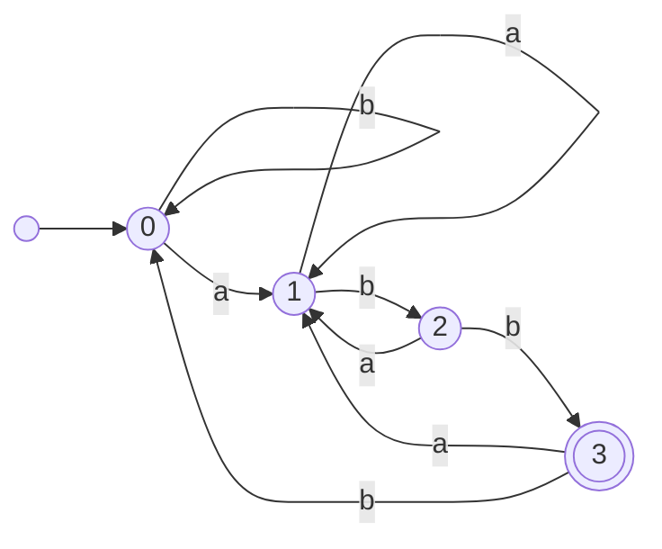

# Expresiones regulares y un analizador léxico

Esta página contiene las secciones [51.5](index.md#515-expresiones-regulares) y
[51.6](index.md#516-un-analizador-lexico) del [capítulo 51](index.md): la traducción
de una expresión regular a un autómata, con una gramática y la construcción de
Thompson, y un analizador léxico hecho con una tabla de expresiones. Los ejemplos
están en `expresiones.pl` y `lexico.pl`, en `ejemplos/capitulo-51/`, con sus
pruebas; son módulos, y se ejecutan localmente.

## Expresiones regulares

Una expresión regular describe un lenguaje con tres operaciones: la
concatenación, la unión (|) y la clausura de Kleene (\*), las de los
eventos regulares que Kleene definió en 1951. `expresiones.pl`
la lee como texto, con una gramática del
[capítulo 21](../capitulo-21-gramaticas-dcg/index.md) sobre la lista de
caracteres, y la convierte en un término limpio: `sim(C)`, `clase(Cs)`,
`vacia`, `cat(E1, E2)`, `alt(E1, E2)` y `estrella(E)`. La gramática tiene
un no terminal por nivel de precedencia —la unión liga menos que la
concatenación, y esta menos que los operadores posfijos—, y traduce
`E+` a `E E*` y `E?` a `E|vacía`:

<!-- ejemplo: capitulo-51/expresiones.pl predicado: alternativa//1 mas_alternativas//2 factor//1 sufijos//2 -->
```prolog
%!  alternativa(-E)// is nondet.
%
%   Una o más concatenaciones separadas por |.
alternativa(E) -->
    concatenacion(E0),
    mas_alternativas(E0, E).

%!  mas_alternativas(+E0, -E)// is nondet.
%
%   E es la unión de E0 con las concatenaciones que siguen, cada una
%   precedida por |.
mas_alternativas(E0, E) -->
    "|",
    concatenacion(E1),
    mas_alternativas(alt(E0, E1), E).
mas_alternativas(E, E) -->
    [].

%!  factor(-E)// is nondet.
%
%   Un átomo seguido de cero o más operadores *, + y ?.
factor(E) -->
    atomo(E0),
    sufijos(E0, E).

%!  sufijos(+E0, -E)// is nondet.
%
%   E es E0 con los operadores que siguen: E+ es E E*, y E? es E | vacía.
%   Otros archivos pueden agregar operadores posfijos con cláusulas
%   expresiones:sufijos(E0, E, S0, S).
sufijos(E0, E) -->
    "*",
    sufijos(estrella(E0), E).
sufijos(E0, E) -->
    "+",
    sufijos(cat(E0, estrella(E0)), E).
sufijos(E0, E) -->
    "?",
    sufijos(alt(E0, vacia), E).
sufijos(E, E) -->
    [].
```

```prolog
?- expresion("(a|b)*abb", E).
E = cat(cat(cat(estrella(alt(sim(a), sim(b))), sim(a)), sim(b)), sim(b)).

?- catch(expresion("(a", T), error(E, _), true).
E = syntax_error(expresion_regular("(a")).
```

La **construcción de Thompson** da un autómata con transiciones ε para
cada subexpresión, con un estado inicial y uno final: un símbolo es una
transición del inicial al final; la concatenación une el final del primer
fragmento con el inicial del segundo; la unión entra por ε a los dos
fragmentos y sale de los dos; la clausura agrega transiciones ε para
saltear el fragmento y para volver a su comienzo. `arco/8` describe esas
transiciones para una subexpresión, en función de los estados de su
fragmento y de los de sus hijos:

<!-- ejemplo: capitulo-51/expresiones.pl predicado: arco/8 -->
```prolog
%!  arco(+Sub, ?I, ?F, ?I1, ?F1, ?I2, ?F2, ?Arco) is nondet.
%
%   Arco es una transición del fragmento de Thompson de la subexpresión
%   Sub, cuyos estados inicial y final son I y F, y los de sus hijos I1,
%   F1 e I2, F2. Arco es t(Q, S, Q1), una transición con el símbolo S, o
%   e(Q, Q1), una transición ε.
arco(sim(C), I, F, _, _, _, _, t(I, C, F)).
arco(clase(Cs), I, F, _, _, _, _, t(I, C, F)) :-
    member(C, Cs).
arco(vacia, I, F, _, _, _, _, e(I, F)).
arco(cat(_, _), I, F, I1, F1, I2, F2, Arco) :-
    member(Arco, [e(I, I1), e(F1, I2), e(F2, F)]).
arco(alt(_, _), I, F, I1, F1, I2, F2, Arco) :-
    member(Arco, [e(I, I1), e(I, I2), e(F1, F), e(F2, F)]).
arco(estrella(_), I, F, I1, F1, _, _, Arco) :-
    member(Arco, [e(I, I1), e(I, F), e(F1, I1), e(F1, F)]).
```

Falta nombrar los estados. Warren los nombra por la subexpresión misma:
`i(E)` y `f(E)` son el inicial y el final del fragmento de E. Es una
elección natural, y tiene un defecto: dos subexpresiones iguales, como las
dos a de aa, tienen el mismo nombre y comparten sus estados.
`ingenua(Texto)` reproduce esa elección:

```prolog
?- acepta(ingenua("aa"), [a]).
true.

?- palabras(ingenua("aa"), 3, Ws).
Ws = [[a, a, a]].

?- epsilon(ingenua("aa"), Q, Q1).
Q = i(cat(sim(a), sim(a))),
Q1 = i(sim(a)) ;
Q = f(sim(a)),
Q1 = i(sim(a)) ;
Q = f(sim(a)),
Q1 = f(cat(sim(a), sim(a))) ;
false.
```

La transición ε de f(sim(a)) a i(sim(a)), que conecta la primera a con la
segunda, conecta cada a consigo misma: el autómata acepta a⁺ en lugar de
aa. En el ejemplo de Warren, a\*b\*c, las tres subexpresiones son
distintas, y el defecto no aparece. `er(Texto)` nombra cada estado por la
**posición** de su subexpresión en el árbol, la lista de números de hijo
desde ella hasta la raíz, que es única:

<!-- ejemplo: capitulo-51/expresiones.pl predicado: subexpresion/3 arco_er/2 -->
```prolog
%!  subexpresion(+E, ?P:list, ?Sub) is nondet.
%
%   Sub es la subexpresión de E en la posición P: la lista de los números
%   de hijo, 1 o 2, desde Sub hasta la raíz. La raíz está en [].
subexpresion(E, P, Sub) :-
    subexpresion(E, [], P, Sub).

%!  arco_er(+Texto, ?Arco) is nondet.
%
%   Arco es una transición del autómata de Thompson de Texto, con los
%   estados nombrados por posiciones.
arco_er(Texto, Arco) :-
    arbol(Texto, E),
    subexpresion(E, P, Sub),
    arco(Sub, i(P), f(P), i([1|P]), f([1|P]), i([2|P]), f([2|P]), Arco).
```

```prolog
?- delta(er("aa"), Q, S, Q1).
Q = i([1]),
S = a,
Q1 = f([1]) ;
Q = i([2]),
S = a,
Q1 = f([2]).

?- acepta(er("aa"), [a]).
false.
```

El análisis de cada texto está tabulado, `arbol/2`, y se hace una vez
aunque las transiciones lo consulten muchas. El resto es lo que ya estaba:
el determinista y el mínimo de una expresión se obtienen componiendo
nombres, y las preguntas sobre lenguajes se hacen sobre expresiones:

```prolog
?- tabla(min(er("(a|b)*abb")), automata(N, F, _)).
N = 4,
F = [3].

?- equivalentes(er("(a|b)*ab"), termina_ab).
true.

?- equivalentes(er("(a*b*)*"), er("(a|b)*")).
true.
```



De 20 estados de Thompson se pasa a 5 en el determinista y a 4 en el mínimo,
el del diagrama: cada estado recuerda el prefijo más largo de abb que
termina de leerse. La segunda consulta compara una expresión con el
autómata escrito a mano en la [sección 51.1](index.md#511-automatas-finitos-como-hechos), y la tercera, dos expresiones
que describen el mismo lenguaje sin parecerse.

## Un analizador léxico

Un analizador léxico divide un texto en componentes: números,
identificadores, palabras reservadas, símbolos. Cada clase de componente es
un lenguaje regular, y `lexico.pl` la define con una expresión regular en
una tabla ordenada:

<!-- ejemplo: capitulo-51/lexico.pl predicado: regla/2 -->
```prolog
% regla(Clase, Expresion): los componentes de la Clase son las palabras
% de la expresión regular. El orden decide entre dos reglas que aceptan
% el mismo prefijo. Otros archivos pueden agregar clases con cláusulas
% lexico:regla/2 y lexico:componente/4, que quedan al final de la tabla.
regla(blanco, "[ \t\n]+").
regla(reservada, "si|entonces|sino|fin|mientras|hacer|escribir").
regla(numero, "[0-9]+").
regla(identificador, "[a-zA-Z_][a-zA-Z0-9_]*").
regla(simbolo, ":=|<=|>=|<>|[-+*/=<>();]").
```

En cada posición del texto, el analizador aplica la regla de la
**coincidencia más larga**: toma el prefijo más largo que alguna expresión
acepta y, si dos expresiones aceptan el mismo prefijo, la primera de la
tabla. Así `sino` es una palabra reservada y no `si` seguido de `no`, y
`siguiente` es un identificador aunque empiece con una palabra reservada.
El prefijo más largo de una expresión se busca recorriendo el texto con los
conjuntos de estados de su autómata, hasta llegar al conjunto vacío, y
recordando el último punto en el que el conjunto contenía un estado final:

<!-- ejemplo: capitulo-51/lexico.pl predicado: prefijo_mas_largo/3 avanzar/6 -->
```prolog
%!  prefijo_mas_largo(+M, +W:list, -N:integer) is det.
%
%   N es la longitud del prefijo más largo de W que acepta el autómata M,
%   o 0 si no acepta ninguno, ni la palabra vacía. Avanza por W con los
%   conjuntos de estados de M hasta llegar al conjunto vacío.
prefijo_mas_largo(M, W, N) :-
    inicial(M, Q0),
    clausura_conjunto(M, [Q0], D0),
    avanzar(M, W, D0, 0, 0, N).

%!  avanzar(+M, +W:list, +D:list, +I:integer, +N0:integer, -N:integer)
%!      is det.
%
%   Con el conjunto de estados D después de leer I símbolos, N es la
%   longitud del prefijo más largo aceptado: I si D tiene un estado final,
%   o el último encontrado, N0.
avanzar(M, W, D, I, N0, N) :-
    (   member(Q, D),
        final(M, Q)
    ->  N1 = I
    ;   N1 = N0
    ),
    (   D \== [],
        W = [S|W1]
    ->  mover(M, S, D, D1),
        I1 is I + 1,
        avanzar(M, W1, D1, I1, N1, N)
    ;   N = N1
    ).
```

```prolog
?- componentes("mientras x <= 10 hacer x := x + 1 fin", Cs).
Cs = [mientras, id(x), <=, num(10), hacer, id(x), :=, id(x), +|...].

?- componentes("sino siguiente", Cs).
Cs = [sino, id(siguiente)].

?- catch(componentes("x # y", Cs), error(E, _), true).
E = syntax_error(componente_desconocido('# y')).
```

Los componentes son los de Mini, el lenguaje del
[capítulo 45](../capitulo-45-proyecto-compilador/index.md#452-el-lenguaje-y-su-sintaxis-abstracta),
y las pruebas de `lexico.plt` cargan el analizador de ese capítulo y
verifican que los dos producen la misma lista para tres programas. Allí el
análisis léxico es una gramática escrita a mano, con un corte después de
cada componente para quedarse con el más largo; aquí es una tabla de
expresiones, y agregar una clase de componente es agregar una fila.

## De un autómata a una expresión regular

La construcción de Thompson va de una expresión a un autómata. El camino
inverso también existe: Kleene probó en 1951 que los lenguajes de los
autómatas finitos son exactamente los de las expresiones regulares, y
McNaughton y Yamada dieron en 1960 la construcción que se programa aquí.
Warren la deja esbozada al final de su capítulo, como una relación
tabulada. Con los estados numerados de 0 a N − 1, R(I, J, K) es la
expresión de las palabras que llevan del estado I al J sin pasar por un
estado intermedio de número K o mayor. Con K = 0 no hay estados
intermedios: son los símbolos de las transiciones de I a J, y la palabra
vacía si I = J. Permitir además el estado K agrega los caminos que pasan
por él, una o más veces:

```text
R(I, J, K+1) = R(I, J, K) | R(I, K, K) R(K, K, K)* R(K, J, K)
```

La expresión del autómata es la unión de R(0, F, N) para cada estado
final F. `kleene.pl` la calcula sobre el autómata mínimo, numerado por
`tabla/2`, con `r/5` tabulada: cada R(I, J, K) se calcula una vez, y la
recursión sobre K termina en K = 0:

<!-- ejemplo: capitulo-51/kleene.pl predicado: expresion_de/2 r/5 -->
```prolog
%!  expresion_de(+M, -E) is det.
%
%   E es una expresión regular, un término de expresiones.pl o nada, del
%   lenguaje del autómata M. Se construye sobre el autómata mínimo de M,
%   con sus estados numerados por tabla/2.
expresion_de(M, E) :-
    tabla(min(M), A),
    A = automata(N, Finales, _),
    foldl(union_final(A, N), Finales, nada, E).

%!  r(+A, +I:integer, +J:integer, +K:integer, -E) is det.
%
%   E es R(I, J, K) en el autómata numerado A: las palabras que llevan de
%   I a J sin pasar por un estado intermedio de número K o mayor.
r(automata(_, _, Delta), I, J, 0, E) :-
    !,
    findall(sim(S), member(I-S-J, Delta), Simbolos),
    foldl(alt_acumulado, Simbolos, nada, E0),
    (   I =:= J
    ->  alt(E0, vacia, E)
    ;   E = E0
    ).
r(A, I, J, K1, E) :-
    K is K1 - 1,
    r(A, I, J, K, Directo),
    r(A, I, K, K, Entrada),
    r(A, K, K, K, Ciclo),
    r(A, K, J, K, Salida),
    estrella(Ciclo, Ciclos),
    cat(Entrada, Ciclos, E1),
    cat(E1, Salida, Pasando),
    alt(Directo, Pasando, E).
```

`alt/3`, `cat/3` y `estrella/3` construyen la expresión y la simplifican
al mismo tiempo: `nada`, el lenguaje vacío, desaparece de una unión y anula
una concatenación; la palabra vacía desaparece de una concatenación; y una
estrella absorbe lo que ya contiene. Sin esas reglas la expresión puede
crecer como 4ᴺ, porque cada R usa cuatro del nivel anterior.
`expresion_texto/2` la escribe con `texto/2`, en la notación de la
[sección anterior](#expresiones-regulares) y con los paréntesis que hacen
falta, y así la expresión obtenida se puede volver a convertir en autómata
y comparar con el original:

```prolog
?- expresion_de(ciclo, E).
E = alt(sim(b), cat(estrella(sim(a)), sim(b))).

?- expresion_texto(er("(ab)*"), T).
T = "()|a(ba)*b".

?- expresion_texto(termina_ab, T), equivalentes(er(T), termina_ab).
T = "(a|b*a)a*b|(a|b*a)a*b((a|bb*a)a*b)*(()|(a|bb*a)a*b)".
```

La primera recupera la expresión de `ciclo`: una b, o algunas a seguidas
de una b. La segunda da a(ba)\*b en lugar de (ab)\*, otra escritura del
mismo lenguaje, porque la palabra vacía queda aparte. La tercera muestra
el límite de la construcción: el lenguaje de `termina_ab` es el de
(a|b)\*ab, y la expresión obtenida es correcta, como verifica
`equivalentes/2`, pero mucho más larga. Las simplificaciones son locales y
no la reducen más; encontrar la expresión más corta de un lenguaje es un
problema mucho más difícil que construir una, y el resultado depende
además del orden de los estados. `texto/2` falla con `nada`, que la
notación no puede escribir: el lenguaje vacío no tiene expresión en ella.
