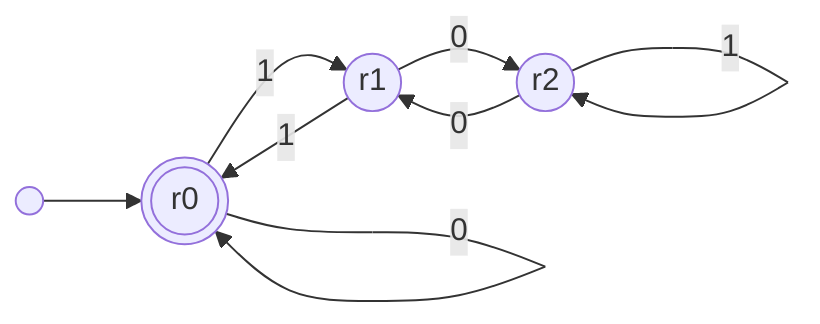
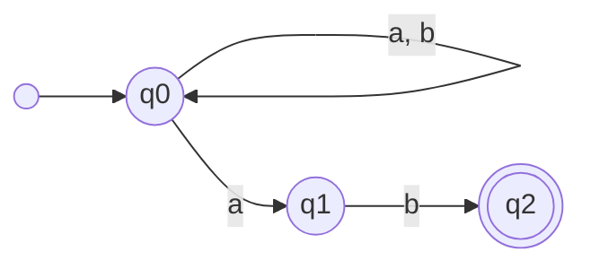
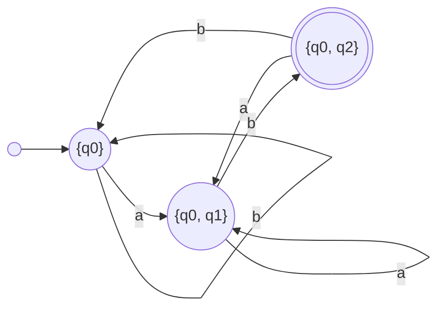

# Capítulo 51 — Proyecto: autómatas y expresiones regulares

Un autómata finito es una quíntupla M = (Q, Σ, δ, q₀, F): un conjunto finito
de estados, un alfabeto, una función (o relación) de transición, un estado
inicial y un conjunto de estados finales. Cada componente es una relación
finita, y en Prolog se escribe con hechos. Sobre esa descripción, un
programa corto decide si una palabra pertenece al lenguaje del autómata, y
otros programas, igual de cortos, construyen autómatas nuevos a partir de
otros: el determinista equivalente, el complemento, la intersección, el
mínimo, el autómata de una expresión regular. Con esas piezas se deciden
preguntas sobre lenguajes infinitos —si dos expresiones describen el mismo
lenguaje, y si no, cuál es la palabra más corta que las distingue— y se
escribe un analizador léxico.

El proyecto crece en ocho versiones. La primera escribe los autómatas como
hechos y los ejecuta con un intérprete de tres cláusulas; la segunda los
convierte en un módulo, con la clausura ε tabulada; la tercera y la cuarta
construyen el determinista, el complemento, la intersección y el mínimo; la
quinta traduce expresiones regulares a autómatas, y autómatas a
expresiones; la sexta es un analizador léxico; la séptima agrega los
transductores, autómatas que escriben mientras leen, con las máquinas de
Mealy y de Moore, y la octava los autómatas de pila, las máquinas de
Turing de una y de varias cintas, y dos modelos que reescriben palabras:
los algoritmos de Markov y los sistemas de Post.
El programa terminado carga los módulos:

<!-- ejemplo: capitulo-51/proyecto.pl archivo -->
```prolog
:- use_module(lexico).
:- use_module(secuencial).
```

```prolog
?- acepta(er("(a|b)*abb"), [a, b, a, b, b]).
true.

?- numero_estados(er("(a|b)*abb"), N1), numero_estados(det(er("(a|b)*abb")), N2), numero_estados(min(er("(a|b)*abb")), N3).
N1 = 20,
N2 = 5,
N3 = 4.

?- contraejemplo(er("(ab)*"), er("a*b*"), W).
W = [a].

?- transducir(plural, W, [l, u, c, e, s]).
W = [l, u, z] ;
W = [l, u, c, e] ;
W = [l, u, c].
```

La primera consulta verifica que abab**b** termina en abb. La segunda
cuenta los estados de tres autómatas del mismo lenguaje: el que la
construcción de Thompson obtiene de la expresión, el determinista que se
obtiene de él y el mínimo. La tercera encuentra la palabra más corta que una
expresión acepta y la otra no: a está en el lenguaje de a\*b\* y no en el de
(ab)\*. La cuarta usa un transductor en sentido inverso: las palabras cuyo
plural se escribe *luces* son *luz* y, para la ortografía sola, *luce* y
*luc*.

{ style="background-color: white" }

El autómata de la expresión (ε|a\*b) por la construcción de Thompson: cada
subexpresión es un fragmento, marcado con una elipse, con un estado de
entrada y uno de salida, y los fragmentos se unen con transiciones ε. Es
la construcción que las consultas anteriores aplican a (a|b)\*abb, y la
que da sus 20 estados. Imagen: Arthur Milchior,
[CC BY-SA 4.0](https://creativecommons.org/licenses/by-sa/4.0/), vía
[Wikimedia Commons](https://commons.wikimedia.org/wiki/File:Small-thompson-example.svg).

El proyecto parte de dos libros. De *Programming in Tabled Prolog* de David
S. Warren ([copia de archivo de la página del autor](https://web.archive.org/web/20240628211257/https://www3.cs.stonybrook.edu/~warren/xsbbook/book.html)),
del capítulo «Automata Theory in XSB», toma la representación de
un autómata con relaciones que llevan su nombre como primer argumento, las
construcciones escritas como reglas sobre nombres compuestos —el
determinista de M se llama `det(M)` y sus transiciones se definen con
reglas—, la aceptación y la clausura ε con tabulación, la construcción de
subconjuntos limitada a los estados alcanzables, el complemento, la
minimización por estados distinguibles y el esbozo de la conversión de un
autómata en una expresión regular, que el capítulo completa; el programa
de Warren está escrito para XSB, y aquí se reescribe con la tabulación de SWI-Prolog del
[capítulo 39](../capitulo-39-tabulacion/index.md). De *Prolog Experiments in
Discrete Mathematics, Logic, and Computability* de James L. Hein ([edición en línea](https://samples.jbpub.com/9780763772062/PrologLabBook09.pdf)), del
capítulo «Computability» y de los apartados «Lambda Closure» y
«Transforming an NFA into a DFA», toma los intérpretes de autómatas finitos,
de máquinas de Mealy y de Moore, de autómatas de pila y de máquinas de
Turing, de algoritmos de Markov y de sistemas de Post, dos experimentos
que propone (la aceptación por pila vacía y las máquinas de varias
cintas), y el cálculo de la clausura λ como paso de la conversión. El código, los
autómatas de ejemplo y el texto son propios. Dos observaciones del capítulo
son sobre esos programas: la clausura de Hein no termina si las
transiciones λ forman un ciclo, y la construcción de Warren que nombra los
estados por la subexpresión confunde dos subexpresiones iguales
([sección 51.5](#515-expresiones-regulares)).

El capítulo usa las gramáticas del
[capítulo 21](../capitulo-21-gramaticas-dcg/index.md) para leer expresiones
regulares, los conjuntos ordenados del
[capítulo 22](../capitulo-22-estructuras-de-datos-de-la-biblioteca/index.md),
la idea de intérprete del
[capítulo 33](../capitulo-33-introspeccion-y-metainterpretes/index.md) y la
tabulación del [capítulo 39](../capitulo-39-tabulacion/index.md), cuyo anuncio
cumple: la clausura ε de un autómata, tabulada. Cumple también el del
[capítulo 48](../capitulo-48-proyecto-circuitos-logicos/index.md): un
circuito secuencial es un autómata finito, y la
[sección 51.7](#517-transductores) carga sus módulos para ejecutarlo como
una máquina de Mealy. El analizador léxico produce los mismos componentes
que el del compilador del
[capítulo 45](../capitulo-45-proyecto-compilador/index.md). La notación es la
de un curso de autómatas y lenguajes formales; el capítulo no demuestra los
teoremas que usa, y los enuncia cuando los necesita. La primera versión y,
de la octava, `maquinas.pl` y `reescritura.pl` corren en SWISH; las demás
son módulos o cargan otros archivos, y se ejecutan localmente.

## Objetivos del capítulo

Al terminar el capítulo, el lector puede:

- escribir un autómata finito, determinista o no, como un conjunto de
  hechos, y ejecutarlo con un intérprete que decide si acepta una palabra y
  que genera las palabras que acepta;
- calcular la clausura ε con una relación tabulada, que termina aunque las
  transiciones ε formen ciclos;
- definir construcciones sobre autómatas como nombres compuestos cuyas
  transiciones se calculan con reglas: el determinista por la construcción
  de subconjuntos, el complemento, la intersección, la unión y el mínimo;
- decidir la inclusión y la equivalencia de dos lenguajes regulares, y
  obtener la palabra más corta que los distingue;
- traducir una expresión regular a un autómata con una gramática y con la
  construcción de Thompson, y usarla en un analizador léxico con la regla
  de la coincidencia más larga;
- describir transductores y máquinas de Mealy con pares de palabras, y
  consultarlos en los dos sentidos, y convertir una máquina de Moore en una
  de Mealy;
- obtener la expresión regular de un autómata con una relación tabulada;
- ejecutar autómatas de pila, con las dos maneras de aceptar, y máquinas de
  Turing de una y de varias cintas, y reconocer qué lenguajes separan a
  cada modelo del anterior;
- ejecutar algoritmos de Markov y sistemas de Post, dos modelos de cómputo
  que reescriben palabras.

!!! info "Tiempo estimado"
    Leer el capítulo, ejecutar sus ejemplos y hacer las actividades: **1:25 h**.
    Resolver los 7 ejercicios marcados con ★: **1:55 h**.
    Resolver los 16 ejercicios del final: **5:15 h**.

## 51.1 Autómatas finitos como hechos

`finitos.pl` describe cada componente de la quíntupla con una relación cuyo
primer argumento es el nombre del autómata: `inicial(M, Q0)`, `final(M, Q)`,
`delta(M, Q, S, Q1)` para las transiciones con un símbolo, y
`epsilon(M, Q, Q1)` para las que no leen nada. El nombre permite describir
varios autómatas en el mismo programa. Una palabra es una lista de símbolos.

El primer autómata es determinista: lee un número binario, el bit más
significativo primero, y acepta los múltiplos de 3. Cada estado es el resto
de dividir por 3 el número leído hasta ese momento; leer el bit B desde el
resto R lleva al resto de 2R + B.



<!-- ejemplo: capitulo-51/finitos.pl fragmento: delta(multiplo3, r0, 0, r0). .. delta(multiplo3, r2, 1, r2). -->
```prolog
delta(multiplo3, r0, 0, r0).
delta(multiplo3, r0, 1, r1).
delta(multiplo3, r1, 0, r2).
delta(multiplo3, r1, 1, r0).
delta(multiplo3, r2, 0, r1).
delta(multiplo3, r2, 1, r2).
```

El intérprete recorre la palabra: con la lista vacía, el estado tiene que
ser final; con un símbolo, sigue una transición y lee el resto; una
transición ε cambia de estado sin consumir nada.

<!-- ejemplo: capitulo-51/finitos.pl predicado: acepta/2 lee/3 -->
```prolog
%!  acepta(+M, ?W:list) is nondet.
%
%   El autómata M acepta la palabra W: hay un camino desde el estado
%   inicial hasta uno final que lee W. Da una respuesta por camino, y no
%   termina si M tiene un ciclo de transiciones ε.
acepta(M, W) :-
    inicial(M, Q0),
    lee(M, Q0, W).

%!  lee(+M, +Q, ?W:list) is nondet.
%
%   Desde el estado Q, el autómata M lee W y termina en un estado final.
lee(M, Q, []) :-
    final(M, Q).
lee(M, Q, [S|W]) :-
    delta(M, Q, S, Q1),
    lee(M, Q1, W).
lee(M, Q, W) :-
    epsilon(M, Q, Q1),
    lee(M, Q1, W).
```

```prolog
?- acepta(multiplo3, [1, 1, 0]).
true ;
false.

?- acepta(multiplo3, [1, 1, 1]).
false.

?- length(W, 3), acepta(multiplo3, W).
W = [0, 0, 0] ;
W = [0, 1, 1] ;
W = [1, 1, 0] ;
false.
```

6 es múltiplo de 3 y 7 no lo es. La tercera consulta usa el mismo
intérprete para generar: las palabras de tres bits que el autómata acepta
son 0, 3 y 6. Con la longitud libre, `acepta(multiplo3, W)` no daría las
palabras en orden de longitud, porque la búsqueda en profundidad seguiría
sin fin la primera rama; fijar la longitud con `length/2` antes, como en la
profundización iterativa del
[capítulo 33](../capitulo-33-introspeccion-y-metainterpretes/index.md#335-limites-de-profundidad-y-profundizacion-iterativa),
da una búsqueda que avanza por longitudes.

El segundo autómata no es determinista: acepta las palabras sobre {a, b} que
terminan en ab. En q0, al leer una a, tiene dos transiciones: quedarse en
q0 o apostar a que esa a es la penúltima letra. Prolog no necesita que el
autómata sea determinista: prueba una alternativa y, si no lleva a un
estado final, retrocede y prueba la otra. La palabra se acepta si **algún**
camino lleva a un estado final.



```prolog
?- acepta(termina_ab, [a, b, a, b]).
true ;
false.
```

El tercer autómata, `ciclo`, acepta a\*b, y tiene dos estados unidos por
transiciones ε en los dos sentidos, s0 → s1 y s1 → s0. Un ciclo así es
inofensivo para el lenguaje, y aparece en los autómatas que se construyen
a partir de expresiones como (a\*)\*; para el intérprete no lo es. Para
rechazar la palabra a, el intérprete prueba todos los caminos, y el ciclo
ε da infinitos:

```prolog
?- call_with_inference_limit(acepta(ciclo, [a]), 100000, R).
R = inference_limit_exceeded.

?- aggregate_all(count, limit(5, acepta(ciclo, [a, b])), N).
N = 5.
```

La primera consulta agota el límite de inferencias sin decidir nada; la
segunda muestra que una palabra aceptada tiene infinitas demostraciones,
una por cada vuelta al ciclo. El intérprete de Hein para autómatas no
deterministas tiene la misma forma y el mismo límite, que el libro
advierte en sus experimentos.

!!! question "Actividad"
    Predecir, sin ejecutarlas, cuántas respuestas dan
    `acepta(termina_ab, [a, a, b])`, `length(W, 2), acepta(termina_ab, W)`
    y `acepta(ciclo, [b])` —esta con `limit(3, …)`—, y cuál de ellas no
    terminaría sin el límite. Comprobarlo.

## 51.2 La clausura ε, tabulada

`automatas.pl` es un módulo con las mismas relaciones y un alfabeto
explícito, `alfabeto(M, Sigma)`, que el complemento necesitará: el lenguaje
complementario depende del alfabeto sobre el que se lo toma. Las cinco
relaciones están declaradas `multifile`, como `circuito/3` en el
[capítulo 48](../capitulo-48-proyecto-circuitos-logicos/index.md#482-el-circuito-como-dato):
otros archivos agregan autómatas con cláusulas `automatas:delta(…)`.

El problema de la versión 1 es la relación «se llega de Q0 a Q con cero o
más transiciones ε», la **clausura ε**: es la clausura reflexiva y
transitiva de un grafo que puede tener ciclos. Es el camino del
[capítulo 39](../capitulo-39-tabulacion/index.md#391-table-recursion-a-la-izquierda-y-ciclos),
y tiene la misma solución:

<!-- ejemplo: capitulo-51/automatas.pl fragmento: :- table clausura/3. .. epsilon(M, Q1, Q). -->
```prolog
:- table clausura/3.

%!  clausura(+M, +Q0, ?Q) is nondet.
%
%   Q está en la clausura ε de Q0 en el autómata M: se llega de Q0 a Q con
%   cero o más transiciones ε. Tabulada: cada estado aparece una vez, y la
%   consulta termina aunque las transiciones ε formen un ciclo.
clausura(_M, Q, Q).
clausura(M, Q0, Q) :-
    clausura(M, Q0, Q1),
    epsilon(M, Q1, Q).
```

```prolog
?- clausura(ciclo, s0, Q).
Q = s1 ;
Q = s0.
```

La tabla termina con los dos estados, cada uno una vez; el orden es el de
la tabla y puede cambiar de un proceso a otro, por eso las pruebas comparan
las respuestas ordenadas. La clausura de Hein, en «Lambda Closure», calcula
lo mismo con una relación de alcance por transiciones λ sin tabla, y no
termina con un ciclo como el de `ciclo`.

Con la clausura, el autómata ya no necesita probar caminos uno por uno. Se
puede llevar, al leer la palabra, el **conjunto** de estados en los que el
autómata puede estar: el inicial con su clausura, y después de cada
símbolo, los estados a los que se llega desde alguno del conjunto, con su
clausura.

<!-- ejemplo: capitulo-51/automatas.pl predicado: clausura_conjunto/3 mover/4 acepta/2 -->
```prolog
%!  clausura_conjunto(+M, +Qs:list, -D:list) is det.
%
%   D es la clausura ε del conjunto de estados Qs, como lista ordenada.
clausura_conjunto(M, Qs, D) :-
    findall(Q, ( member(Q0, Qs), clausura(M, Q0, Q) ), Todos),
    sort(Todos, D).

%!  mover(+M, +S, +D:list, -D1:list) is det.
%
%   D1 es el conjunto de estados al que M llega desde alguno de los
%   estados de D leyendo S, con su clausura ε. Si ninguno tiene una
%   transición con S, D1 es el conjunto vacío. Los argumentos siguen el
%   orden de foldl/4: el símbolo, el conjunto anterior y el siguiente.
mover(M, S, D, D1) :-
    findall(Q1, ( member(Q, D), delta(M, Q, S, Q1) ), Qs),
    clausura_conjunto(M, Qs, D1).

%!  acepta(+M, +W:list) is semidet.
%
%   El autómata M acepta la palabra W. Recorre W una vez, llevando el
%   conjunto de estados en los que M puede estar.
acepta(M, W) :-
    inicial(M, Q0),
    clausura_conjunto(M, [Q0], D0),
    foldl(mover(M), W, D0, D),
    member(Q, D),
    final(M, Q),
    !.
```

```prolog
?- acepta(ciclo, [a, a, b]).
true.

?- acepta(ciclo, [a]).
false.

?- mover(termina_ab, a, [q0], D).
D = [q0, q1].
```

`acepta/2` recorre la palabra una sola vez con `foldl/4`, y responde sin
alternativas pendientes; el ciclo ε ya no afecta. Para generar, el módulo
conserva la lectura relacional, `reconoce/2`, con la clausura tabulada
entre dos símbolos, y `palabras/3`, que reúne las palabras de una longitud
dada:

```prolog
?- reconoce(ciclo, [a, b]).
true ;
false.

?- palabras(termina_ab, 3, Ws).
Ws = [[a, a, b], [b, a, b]].
```

Una sola demostración de ab, donde la versión 1 daba infinitas. El módulo
termina con dos herramientas que las versiones siguientes usan todo el
tiempo. `alcanzable/2`, tabulada, da los estados a los que se llega desde el
inicial, con cualquier transición; `tabla/2` numera esos estados en el
orden de un recorrido en anchura, el inicial primero, y da el autómata como
`automata(N, Finales, Transiciones)`, una forma legible cuando los estados
son términos grandes:

```prolog
?- estados(ciclo, Qs).
Qs = [s0, s1, s2].

?- tabla(multiplo3, T).
T = automata(3, [0], [0-0-0, 0-1-1, 1-0-2, 1-1-0, 2-0-1, 2-1-2]).
```

## 51.3 Construcciones: el determinista, el complemento, la intersección

`mover/4` es, sin nombrarla, la **construcción de subconjuntos** de Rabin
y Scott (1959): el
autómata determinista equivalente a M tiene por estados los conjuntos de
estados de M cerrados por ε, y su transición con S es `mover/4`. Warren la
escribe como otro autómata, con un nombre compuesto: `det(M)`. Sus
relaciones no son hechos, sino reglas que las calculan a partir de las de
M. `construcciones.pl` las agrega a las relaciones multifile del módulo
`automatas`:

<!-- ejemplo: capitulo-51/construcciones.pl fragmento: automatas:alfabeto(det(M), Sigma) :- .. mover(M, S, D, D1). -->
```prolog
automatas:alfabeto(det(M), Sigma) :-
    alfabeto(M, Sigma).
automatas:inicial(det(M), D0) :-
    inicial(M, Q0),
    clausura_conjunto(M, [Q0], D0).
automatas:final(det(M), D) :-
    alcanzable(det(M), D),
    once(( member(Q, D), final(M, Q) )).
automatas:delta(det(M), D, S, D1) :-
    alfabeto(M, Sigma),
    member(S, Sigma),
    mover(M, S, D, D1).
```

Los estados de `det(M)` no se enumeran de antemano: son los que
`alcanzable/2` encuentra desde el inicial, y un estado final es uno que
contiene un final de M. Como `det(M)` es un autómata más, todo lo que se
define para autómatas se aplica a él:

```prolog
?- delta(det(termina_ab), [q0, q1], S, D).
S = a,
D = [q0, q1] ;
S = b,
D = [q0, q2].

?- tabla(det(termina_ab), T).
T = automata(3, [2], [0-a-1, 0-b-0, 1-a-1, 1-b-2, 2-a-1, 2-b-0]).

?- estados(det(ciclo), Ds).
Ds = [[], [s0, s1], [s2]].
```



En el determinista de `termina_ab` cada conjunto recuerda lo último que se
leyó: nada útil, una a, o ab. El de `ciclo` muestra el **conjunto vacío**
como un estado más: es aquel al que se llega cuando ningún estado tiene una
transición con el símbolo leído, y de él no se sale. Es el estado
**sumidero**, y gracias a él `det(M)` es **completo**: tiene una transición
para cada estado y cada símbolo del alfabeto. Warren agrega el sumidero con
una construcción aparte; aquí aparece solo.

Un autómata determinista y completo acepta el **complemento** de su
lenguaje si se intercambian sus estados finales con los no finales: cada
palabra lleva a un único estado, y ese estado decide. Las dos condiciones
son necesarias: en un autómata no determinista una palabra puede llegar a un
estado final y a uno que no lo es, y en uno incompleto puede no llegar a
ninguno. `complemento(M)` se define entonces sobre `det(M)`, y solo cambia
`final/2`:

<!-- ejemplo: capitulo-51/construcciones.pl fragmento: automatas:final(complemento(M), D) :- .. \+ final(det(M), D). -->
```prolog
automatas:final(complemento(M), D) :-
    alcanzable(det(M), D),
    \+ final(det(M), D).
```

La **intersección** y la **unión** son el autómata producto: sus estados
son pares de estados de los deterministas de M1 y M2, cada componente
avanza en su autómata con el mismo símbolo, y un par es final si lo son
los dos componentes, para la intersección, o alguno, para la unión.
`termina_b`, en el mismo archivo, acepta las palabras que terminan en b:

```prolog
?- palabras(complemento(termina_b), 2, Ws).
Ws = [[a, a], [b, a]].

?- palabras(interseccion(termina_ab, termina_b), 2, Ws).
Ws = [[a, b]].
```

Con estas construcciones, preguntas sobre lenguajes infinitos se
convierten en preguntas sobre grafos finitos. Un autómata acepta alguna
palabra si alguno de sus estados alcanzables es final; L₁ ⊆ L₂ si la
intersección de L₁ con el complemento de L₂ es vacía; dos lenguajes son
iguales si cada uno está incluido en el otro. Y si no lo son, la palabra
más corta de la diferencia simétrica es un **contraejemplo**:

<!-- ejemplo: capitulo-51/construcciones.pl predicado: vacio/1 incluido/2 equivalentes/2 contraejemplo/3 -->
```prolog
%!  vacio(+M) is semidet.
%
%   M no acepta ninguna palabra: ningún estado alcanzable es final.
vacio(M) :-
    \+ ( alcanzable(M, Q),
         final(M, Q) ).

%!  incluido(+M1, +M2) is semidet.
%
%   Toda palabra que acepta M1 la acepta M2.
incluido(M1, M2) :-
    vacio(interseccion(M1, complemento(M2))).

%!  equivalentes(+M1, +M2) is semidet.
%
%   M1 y M2 aceptan el mismo lenguaje.
equivalentes(M1, M2) :-
    incluido(M1, M2),
    incluido(M2, M1).

%!  contraejemplo(+M1, +M2, -W:list) is semidet.
%
%   W es una de las palabras más cortas que acepta uno solo de M1 y M2.
%   Falla si son equivalentes.
contraejemplo(M1, M2, W) :-
    palabra_mas_corta(union(interseccion(M1, complemento(M2)),
                            interseccion(M2, complemento(M1))),
                      W).
```

```prolog
?- incluido(termina_ab, termina_b).
true.

?- incluido(termina_b, termina_ab).
false.

?- contraejemplo(termina_ab, termina_b, W).
W = [b].

?- equivalentes(ciclo, det(ciclo)).
true.
```

Las construcciones se componen sin límite de anidamiento:
`contraejemplo/3` busca la palabra más corta que acepta
`union(interseccion(M1, complemento(M2)), interseccion(M2, complemento(M1)))`,
un autómata que nunca se escribe como hechos. `palabra_mas_corta/2`
verifica primero con `vacio/1` que existe alguna, y después prueba las
longitudes 0, 1, 2…; sin esa verificación, la búsqueda de una palabra que
no existe no terminaría.

!!! question "Actividad"
    Predecir cuántos estados alcanzables tiene
    `interseccion(termina_ab, multiplo3)` y si su lenguaje es vacío: los dos
    autómatas tienen alfabetos distintos. Comprobarlo con `estados/2` y
    `vacio/1`, y explicar qué estados del producto contienen el conjunto
    vacío.

## 51.4 El autómata mínimo

Dos estados de un autómata determinista son **distinguibles** si alguna
palabra lleva a uno a un estado final y al otro a uno que no lo es. Los que
no son distinguibles aceptan las mismas palabras, y se pueden fundir en uno:
el resultado es el autómata determinista completo con menos estados que
acepta el mismo lenguaje, único salvo el nombre de los estados. La relación
se define, como en los experimentos de Moore (1956) sobre máquinas
secuenciales, por inducción sobre la palabra —la vacía distingue un final de un
no final, y un símbolo delante distingue dos estados si los lleva a dos
distinguibles—, y es otra relación recursiva sobre un grafo con ciclos.
`minimizar.pl` la tabula:

<!-- ejemplo: capitulo-51/minimizar.pl predicado: distinguible/3 predecesor/4 -->
```prolog
%!  distinguible(+A, ?P, ?Q) is nondet.
%
%   Los estados alcanzables P y Q del autómata determinista y completo A
%   son distinguibles: una palabra lleva a uno a un estado final y al otro
%   no. La primera cláusula es la palabra vacía; la segunda agrega un
%   símbolo delante de una palabra que distingue los estados siguientes.
distinguible(A, P, Q) :-
    alcanzable(A, P),
    alcanzable(A, Q),
    (   final(A, P)
    ->  \+ final(A, Q)
    ;   final(A, Q)
    ).
distinguible(A, P, Q) :-
    distinguible(A, P1, Q1),
    predecesor(A, P1, S, P),
    predecesor(A, Q1, S, Q).

%!  predecesor(+A, +P1, ?S, ?P) is nondet.
%
%   El autómata A pasa de P a P1 leyendo S, y P es alcanzable. Tabulada:
%   para cada P1, las transiciones que llegan a él se buscan una vez.
predecesor(A, P1, S, P) :-
    arcos(A, Arcos),
    member(P-S-P1, Arcos).
```

La segunda cláusula va **hacia atrás**: a partir de un par ya distinguido,
busca los pares que llegan a él con el mismo símbolo. `predecesor/4`,
tabulada, reúne una vez las transiciones que llegan a cada estado. La
primera forma que se escribe es la que va hacia adelante, que por cada par
nuevo recorre todas las transiciones de todos los estados; el archivo la
conserva como `distinguible_directo/3`. Sobre el determinista del registro
de desplazamiento de cuatro etapas del [capítulo 48](../capitulo-48-proyecto-circuitos-logicos/index.md), con 17 estados, las dos
calculan los 272 pares distinguibles, pero la directa necesita unos 60
millones de inferencias y 11 segundos, y la que usa los predecesores,
470 000 inferencias y 0,06 segundos.

`pares_a` acepta las palabras con una cantidad par de a, contando las a
módulo 4: e0 y e2 son equivalentes, y también e1 y e3. `min(M)` tiene por
estados las **clases** de estados indistinguibles del determinista de M:

<!-- ejemplo: capitulo-51/minimizar.pl fragmento: automatas:alfabeto(min(M), Sigma) :- .. clase(det(M), D1, C1). -->
```prolog
automatas:alfabeto(min(M), Sigma) :-
    alfabeto(M, Sigma).
automatas:inicial(min(M), C0) :-
    inicial(det(M), D0),
    clase(det(M), D0, C0).
automatas:final(min(M), C) :-
    alcanzable(min(M), C),
    C = [D|_],
    final(det(M), D).
automatas:delta(min(M), [D|_], S, C1) :-
    delta(det(M), D, S, D1),
    clase(det(M), D1, C1).
```

```prolog
?- distinguible(det(pares_a), [e0], [e2]).
false.

?- distinguibles(det(pares_a), [e1], [e2], W).
W = [].

?- estados(min(pares_a), Cs).
Cs = [[[e0], [e2]], [[e1], [e3]]].

?- tabla(min(pares_a), T).
T = automata(2, [0], [0-a-1, 0-b-0, 1-a-0, 1-b-1]).
```

`distinguibles/4` da, además, la palabra más corta que distingue dos
estados: e1 y e2 los distingue la palabra vacía, porque uno es final y el
otro no. El estado e4, que es final pero no alcanzable, no aparece: la
minimización trabaja sobre los estados alcanzables, y los demás no
cambian el lenguaje.

## 51.5 Expresiones regulares

Una expresión regular describe un lenguaje con la concatenación, la unión y
la clausura de Kleene. La página
[Expresiones regulares y un analizador léxico](expresiones.md#expresiones-regulares)
la lee como texto con una gramática del
[capítulo 21](../capitulo-21-gramaticas-dcg/index.md), la convierte en un
término limpio, y la traduce a un autómata con la construcción de Thompson,
`er(Texto)`, con los estados nombrados por la posición de cada subexpresión
en el árbol. La elección de Warren, nombrarlos por la subexpresión misma,
confunde dos subexpresiones iguales: su autómata para aa acepta a. Con
`er/1`, el determinista, el mínimo y las decisiones de las secciones
anteriores se aplican a expresiones: (a|b)\*abb da 20 estados de Thompson, 5
en el determinista y 4 en el mínimo, y (a\*b\*)\* resulta equivalente a
(a|b)\*. El camino inverso, en
[De un autómata a una expresión regular](expresiones.md#de-un-automata-a-una-expresion-regular),
es la construcción de Kleene en la forma de McNaughton y Yamada, con una
relación tabulada: `expresion_de/2` obtiene una expresión del lenguaje de
cualquier autómata, que `equivalentes/2` compara con el original.

## 51.6 Un analizador léxico

La misma página, en [Un analizador léxico](expresiones.md#un-analizador-lexico),
define cada clase de componente léxico con una expresión regular, en una
tabla ordenada, y divide un texto en componentes con la regla de la
coincidencia más larga: el prefijo más largo que alguna expresión acepta, y
ante un empate, la primera regla. El prefijo más largo se busca con los
conjuntos de estados del autómata de cada expresión. Los componentes son los
de Mini, y las pruebas verifican que coinciden con los del analizador del
[capítulo 45](../capitulo-45-proyecto-compilador/index.md).

## 51.7 Transductores

Un transductor es un autómata que escribe mientras lee: sus símbolos son
pares `Entrada:Salida` de palabras, y todo lo anterior se le aplica sin
cambios. La página [Transductores](transductores.md#transductores) define, en
`transductores.pl`, `transducir/3`, que se consulta en los dos sentidos; una máquina de Mealy que
convierte un número binario en su código Gray y lo decodifica; un
transductor de pares de letras que escribe el plural de un sustantivo y, en
sentido inverso, lo analiza; y las construcciones `inversa/1`,
`compuesta/2` e `identidad/1`, que el
[capítulo 53](../capitulo-53-proyecto-morfologia-castellano/index.md) usa
para la morfología de dos niveles. En
[Un circuito secuencial es una máquina de Mealy](transductores.md#un-circuito-secuencial-es-una-maquina-de-mealy)
carga los módulos del
[capítulo 48](../capitulo-48-proyecto-circuitos-logicos/index.md): cada
circuito secuencial es un transductor, su ejecución da lo mismo que allí, y
minimizarlo es minimizar su autómata; un sumador serie, en sentido inverso,
enumera los pares de números que suman un resultado. En
[Máquinas de Moore](transductores.md#maquinas-de-moore), la salida pasa de
las transiciones a los estados: `moore/3` ejecuta una máquina de Moore, y
`mealy(M)` la convierte en una de Mealy.

## 51.8 Autómatas de pila y máquinas de Turing

Los autómatas finitos no reconocen las sucesiones de paréntesis bien
anidadas: para eso hace falta contar sin límite. La página
[Autómatas de pila y máquinas de Turing](pila-y-turing.md#automatas-de-pila-y-maquinas-de-turing)
agrega una pila al autómata, con la que reconoce los paréntesis y los
palíndromos —estos, eligiendo de manera no determinista dónde está la
mitad—, y después una cinta, con la que una máquina de Turing reconoce
aⁿbⁿcⁿ, un lenguaje que ningún autómata de pila reconoce. La misma página
agrega la [aceptación por pila vacía](pila-y-turing.md#aceptacion-por-pila-vacia),
con la construcción `vacia(M)`, que la obtiene de la aceptación por estado
final; las [máquinas de varias cintas](pila-y-turing.md#maquinas-de-varias-cintas),
con una que reconoce los palíndromos en 3n + 3 pasos; y los
[algoritmos de Markov y los sistemas de Post](pila-y-turing.md#algoritmos-de-markov-y-sistemas-de-post),
que computan reescribiendo la palabra, sin estados ni cinta.

!!! success "Criterios de calidad"
    | Criterio | En este capítulo |
    |---|---|
    | C1 | cada predicado declara modos y determinación; `acepta/2` es `semidet` porque recorre conjuntos de estados, y `reconoce/2` es `nondet`, una respuesta por camino |
    | C2 | las construcciones son nombres de autómata, `det(M)`, `min(M)`, `er(Texto)`, con reglas para las mismas cinco relaciones: se componen sin límite y nada se genera ni se copia; la clausura, los estados alcanzables y la relación de distinguibles son relaciones puras, tabuladas |
    | C3 | `transducir/3` se consulta en los dos sentidos, y las pruebas lo verifican con `gray`, `plural` y el sumador serie |
    | C5 | los estados de Thompson se nombran por posición y no por subexpresión, y la representación de las expresiones es limpia: cada clase de nodo tiene su functor |
    | C7 | 248 pruebas en catorce archivos; las respuestas de las tablas se comparan ordenadas; cada construcción se compara con otra por equivalencia (el determinista con el original, el mínimo con el determinista, la expresión con el autómata escrito a mano, la expresión obtenida de un autómata con el autómata, `vacia(M)` con M), el analizador léxico con el del [capítulo 45](../capitulo-45-proyecto-compilador/index.md), y los circuitos con `ejecutar/4` del [capítulo 48](../capitulo-48-proyecto-circuitos-logicos/index.md) |

## Ejercicios

Las soluciones están en [la página de soluciones](soluciones.md). La dificultad
va de 1 (se resuelve consultando el capítulo) a 3 (requiere elaboración propia).
Los marcados con ★ son los que no conviene saltear: cubren lo que el capítulo
tiene de propio, y el [capítulo 53](../capitulo-53-proyecto-morfologia-castellano/index.md)
los da por hechos.

1. ★ **(1)** Con `automatas.pl` y `construcciones.pl` cargados, predecir
   la respuesta de cada consulta, incluido si termina en `.` o en
   `false.`, y comprobarlo: `acepta(termina_ab, [])` ·
   `reconoce(termina_ab, [X, b])` · `estados(det(multiplo3), Ds)` ·
   `palabras(complemento(multiplo3), 2, Ws)` ·
   `incluido(det(termina_ab), termina_ab)`.
2. **(1)** Describir con hechos, en otro archivo, un autómata determinista
   `par_par` que acepte las palabras sobre {a, b} con una cantidad par de
   a y una cantidad par de b. Verificar con `palabras/3` las palabras de
   longitud 4, y con `equivalentes/2` que es la intersección de dos
   autómatas más chicos, uno para cada letra.
3. ★ **(2)** Warren elimina las transiciones ε con otra construcción:
   `sin_epsilon(M)` tiene los mismos estados, una transición con S de Q a
   Q1 si desde Q se llega a Q1 con ε, S y ε, y son finales los estados
   cuya clausura contiene un final. Definir `sin_epsilon/1` con reglas
   para las cinco relaciones, y verificar que `sin_epsilon(ciclo)` y
   `sin_epsilon(er("(a|b)*abb"))` no tienen transiciones ε y son
   equivalentes a sus originales.
4. ★ **(2)** Definir la construcción `diferencia(M1, M2)`, que acepta las
   palabras de M1 que M2 no acepta, sin usar `interseccion/2` ni
   `complemento/1`: con el producto de los deterministas. Obtener las
   palabras de longitud hasta 4 de `diferencia(er("a*b*"), er("(ab)*"))` y
   verificar que `diferencia(M, M)` es vacío para tres autómatas.
5. **(2)** El autómata no determinista que acepta las palabras sobre
   {a, b} cuya letra n-ésima desde el final es a tiene n + 1 estados.
   Escribir `enesima(N)` como un nombre de autómata definido con reglas, y
   tabular, para n de 1 a 6, la cantidad de estados de `det(enesima(N))`
   y de `min(enesima(N))`. Explicar el crecimiento.
6. ★ **(2)** Agregar a la gramática de las expresiones la repetición
   contada: `E{n}` es E concatenada n veces, con n un número de un
   dígito. Verificar que `er("a{3}")` es equivalente a `er("aaa")` y que
   `er("(ab){2}c")` acepta ababc. Sin modificar `arco/8`: la gramática
   produce los términos que ya existen.
7. **(2)** Agregar al analizador léxico comentarios, desde `#` hasta el
   fin de la línea, que se descartan como los blancos, y cadenas entre
   comillas dobles sin comillas adentro, que dan el componente
   `cadena(Atomo)`. Escribir las dos reglas en la tabla y los casos en
   `componente/4`, y probarlo con un programa de tres líneas.
8. ★ **(2)** El complemento a dos de un número binario escrito con el bit
   menos significativo primero se obtiene copiando los bits hasta el
   primer 1 inclusive, e invirtiendo los que siguen. Escribirlo como una
   máquina de Mealy `complemento2` con dos estados, verificar para todos
   los números de 4 bits que el resultado es 16 − N módulo 16, y explicar
   por qué `transducir(complemento2, B, S)` y
   `transducir(complemento2, S, B)` dan lo mismo.
9. **(3)** Describir con `secuencial/3` del [capítulo 48](../capitulo-48-proyecto-circuitos-logicos/index.md), en un archivo que
   cargue `secuencial.pl`, un contador de dos bits sin entradas cuya
   salida es 1 cuando el contador vale 0 o 2, y 0 en los otros casos.
   Calcular los estados de `circuito(Nombre, [0, 0])` y de su mínimo,
   explicar qué estados se funden, y proponer un circuito con un solo bit
   de estado que tenga la misma salida.
10. **(2)** Escribir para `maquinas.pl` un autómata de pila `iguales` que
    acepte las palabras sobre {a, b} con tantas a como b, en cualquier
    orden, y verificar para todas las palabras de longitud hasta 8 que lo
    que acepta coincide con la cuenta de letras.
11. **(3)** Escribir para `maquinas.pl` una máquina de Turing determinista,
    con estados sin parámetros y δ como hechos, que acepte los palíndromos
    sobre {a, b}, de cualquier longitud: borra el primer símbolo, recorre
    hasta el último, lo compara y lo borra, y vuelve. Verificarla contra
    `reverse/2` para todas las palabras de longitud hasta 6, y comparar la
    cantidad de pasos con la longitud de la palabra.
12. ★ **(2)** Obtener con `expresion_texto/2` la expresión de `multiplo3`,
    con `kleene.pl` cargado, y verificar con `equivalentes/2` que describe
    su lenguaje. Verificar después que (0|1(01\*0)\*1)\* también lo
    describe, explicar por qué siguiendo los restos de la
    [sección 51.1](#511-automatas-finitos-como-hechos), y explicar por qué
    la construcción no llega a una expresión tan corta.
13. **(3)** Escribir la construcción `moore_de(M, S0)`, la máquina de
    Moore de una máquina de Mealy M, con S0 como salida del estado
    inicial: sus estados son pares `Q-S`, un estado de M y la salida que M
    escribió al llegar a él. Verificar para todas las entradas de hasta 5
    bits que `moore(moore_de(gray, 0), E, S)` da S = [0|G] cuando
    `transducir(gray, E, G)` da G, y contar sus estados alcanzables.
14. **(2)** Escribir, en un archivo que cargue `cintas.pl`, la
    construcción inversa de `vacia/1`: `final_de(M)` acepta por estado
    final lo que M acepta por pila vacía. Verificar que `final_de(anbn)` y
    `anbn` aceptan las mismas palabras de longitud hasta 6, y que
    `vacia(final_de(anbn))` acepta otra vez las de `anbn`.
15. **(2)** Con la máquina del ejercicio 11 y `palindromo_2c`, tabular los
    pasos con los que cada una acepta la palabra de n letras a, para n
    igual a 2, 4, 8 y 16. Explicar el crecimiento de cada columna con el
    recorrido que hace cada máquina sobre sus cintas.
16. ★ **(2)** Escribir un algoritmo de Markov `unario`, de tres reglas,
    que convierta un número binario escrito con 0 y 1, el bit más
    significativo primero, en tantas `i` como su valor: [1, 0, 1] en
    [i, i, i, i, i]. Verificarlo con todos los números de hasta 5 bits.
    Una pista: una i que pasa hacia la derecha por un 0 vale el doble.

## Resumen

| | |
|---|---|
| **autómata como hechos** | `alfabeto/2`, `inicial/2`, `final/2`, `delta/4` y `epsilon/3`, con el nombre del autómata como primer argumento |
| **no determinismo** | una palabra se acepta si algún camino llega a un estado final; Prolog prueba los caminos con retroceso |
| **clausura ε** | los estados a los que se llega con cero o más transiciones ε; con ciclos, termina si está tabulada |
| **construcción de subconjuntos** | `det(M)`: los estados son conjuntos cerrados por ε, alcanzables desde el inicial; el conjunto vacío es el sumidero |
| **construcción como nombre** | `det(M)`, `complemento(M)`, `interseccion(M1, M2)`, `min(M)`, `er(Texto)`: reglas para las mismas relaciones, que se componen |
| **decisión** | vacío, inclusión y equivalencia de lenguajes regulares, sobre los estados alcanzables del producto; el contraejemplo más corto |
| **minimización** | fundir los estados indistinguibles; la relación de distinguibles es recursiva, tabulada, y se calcula hacia atrás |
| **construcción de Thompson** | un fragmento con un inicial y un final por subexpresión; los estados se nombran por posición |
| **coincidencia más larga** | el analizador léxico toma el prefijo más largo, y ante un empate, la primera regla |
| **transductor** | un autómata sobre pares `Entrada:Salida`; `transducir/3` en los dos sentidos |
| **máquina de Mealy** | un transductor que lee un símbolo y escribe uno; un circuito secuencial es una |
| **de autómata a expresión** | R(I, J, K), las palabras de I a J sin pasar por estados de número K o mayor, tabulada; la expresión obtenida es correcta, no la más corta |
| **máquina de Moore** | la salida está en los estados; `mealy(M)` es la máquina de Mealy que escribe lo mismo |
| **aceptación por pila vacía** | equivalente a la aceptación por estado final; `vacia(M)` convierte una en la otra |
| **varias cintas** | un cabezal por cinta; reconocen lo mismo que una sola, y una cinta las simula con a lo sumo el cuadrado de los pasos |
| **reescritura de palabras** | algoritmos de Markov, con reglas ordenadas aplicadas a la primera aparición, y sistemas de Post, con producciones que tienen variables |
| `acepta/2`, `reconoce/2`, `palabras/3`, `clausura/3`, `mover/4`, `alcanzable/2`, `estados/2`, `tabla/2` | el módulo `automatas` |
| `vacio/1`, `incluido/2`, `equivalentes/2`, `contraejemplo/3`, `distinguible/3`, `distinguibles/4` | las decisiones y la minimización |
| `expresion/2`, `componentes/2`, `prefijo_mas_largo/3` | las expresiones regulares y el analizador léxico |
| `expresion_de/2`, `expresion_texto/2` | de un autómata a una expresión regular |
| `transducir/3`, `inversa/1`, `compuesta/2`, `identidad/1`, `moore/3` | los transductores y las máquinas de Moore |
| `acepta_pila/2`, `acepta_vacia/2`, `turing/4`, `turing_cintas/4` | los autómatas de pila y las máquinas de Turing |
| `markov/4`, `post/4` | los algoritmos de Markov y los sistemas de Post |
| `number_chars/2` | convierte entre un número y la lista de sus caracteres: el valor de un lexema |

## Temas que se retoman

| Tema | Se retoma en |
|---|---|
| Las máquinas de Turing en la notación de Turing (1936): estados con parámetros y funciones de configuración, ejecutadas por reescritura perezosa de términos | [capítulo 52](../capitulo-52-proyecto-interprete-perezoso-reescritura-terminos/index.md) |
| Transductores de pares de letras y morfología de dos niveles, con el módulo `transductores` | [capítulo 53](../capitulo-53-proyecto-morfologia-castellano/index.md) |

## Referencias

- David S. Warren, *Programming in Tabled Prolog*, borrador distribuido
  con el sistema XSB, 1999 — «Automata Theory in XSB». [Copia de archivo de la página del autor](https://web.archive.org/web/20240628211257/https://www3.cs.stonybrook.edu/~warren/xsbbook/book.html). El capítulo toma
  de allí ideas y la representación: los autómatas como relaciones con el
  nombre del autómata como primer argumento, las construcciones como
  reglas sobre nombres compuestos (el determinista, el complemento, el
  mínimo, el autómata de una expresión), la clausura ε y los estados
  alcanzables con tabulación, la minimización por estados
  distinguibles, y el esbozo, inconcluso, de la conversión de un autómata
  en una expresión regular como relación tabulada, que la página
  [De un autómata a una expresión regular](expresiones.md#de-un-automata-a-una-expresion-regular)
  completa; el código de XSB se reescribió para la tabulación de
  SWI-Prolog, y los estados de Thompson se nombran de otra manera.
- James L. Hein, *Prolog Experiments in Discrete Mathematics, Logic, and
  Computability*, Jones and Bartlett, 2009 ([edición en línea](https://samples.jbpub.com/9780763772062/PrologLabBook09.pdf)) — «Computability» (autómatas
  finitos deterministas y no deterministas, máquinas de Mealy y de Moore,
  autómatas de pila, máquinas de Turing, algoritmos de Markov y de Post) y
  los apartados «Lambda Closure» y «Transforming an NFA into a DFA». El
  capítulo toma de allí la forma de los intérpretes de cada modelo, con la
  cinta de la máquina de Turing como dos listas alrededor del cabezal, el
  algoritmo de Markov que intercambia las a y las b, dos experimentos que
  el libro propone y no resuelve (la aceptación por pila vacía, con el
  autómata de aⁿbⁿ, y el intérprete de varias cintas), y la clausura λ como
  paso de la conversión, con otra representación y otros ejemplos.
- Ken Thompson, «Regular expression search algorithm», *Communications
  of the ACM* 11 (6), 1968, pp. 419–422. El capítulo toma de allí la idea
  de la construcción de un autómata con transiciones ε a partir de una
  expresión regular, un fragmento por subexpresión.

- James L. Hein, *Discrete Structures, Logic, and Computability*, Jones
  and Bartlett, 3.ª edición, 2010 — los capítulos de lenguajes regulares y
  de autómatas. Es el libro de texto al que acompaña el de experimentos de
  Hein: allí están la construcción de Thompson y la conversión de un
  autómata no determinista en uno determinista que los experimentos
  programan. No tiene edición en línea gratuita.
- Stephen C. Kleene, «Representation of events in nerve nets and finite
  automata», RAND, memorándum RM-704, 1951, publicado en C. E. Shannon y
  J. McCarthy (eds.), *Automata Studies*, Princeton University Press, 1956.
  [Edición de RAND](https://www.rand.org/pubs/research_memoranda/RM704.html).
  Define los eventos regulares y prueba que son los que un autómata finito
  reconoce: el origen de las expresiones regulares y de la clausura que
  lleva su nombre, y la equivalencia entre expresiones y autómatas sobre la
  que se apoyan la [sección 51.5](#515-expresiones-regulares),
  `contraejemplo/3` y `expresion_de/2`.
- Robert McNaughton y Hisao Yamada, «Regular expressions and state graphs
  for automata», *IRE Transactions on Electronic Computers* EC-9 (1),
  1960, págs. 39–47. Da la construcción de la expresión de un autómata por
  las expresiones R(I, J, K), con los estados intermedios acotados por K,
  que `kleene.pl` programa como relación tabulada. No tiene edición en
  línea gratuita.
- Michael O. Rabin y Dana Scott, «Finite automata and their decision
  problems», *IBM Journal of Research and Development* 3 (2), 1959,
  págs. 114–125. Introduce los autómatas no deterministas, la construcción
  de subconjuntos y la decisión del vacío y de la equivalencia, que la
  [sección 51.3](#513-construcciones-el-determinista-el-complemento-la-interseccion)
  programa. No tiene edición en línea gratuita.
- George H. Mealy, «A method for synthesizing sequential circuits», *Bell
  System Technical Journal* 34 (5), 1955, págs. 1045–1079, y Edward F.
  Moore, «Gedanken-experiments on sequential machines», en *Automata
  Studies*, Princeton University Press, 1956. De Mealy vienen las máquinas
  con salida en las transiciones de la [sección 51.7](#517-transductores);
  de Moore, las máquinas con salida en los estados de
  [Máquinas de Moore](transductores.md#maquinas-de-moore) y los estados que
  ningún experimento distingue, en los que se basa la minimización de la
  [sección 51.4](#514-el-automata-minimo). No tienen edición en línea
  gratuita.
- Juris Hartmanis y Richard E. Stearns, «On the computational complexity
  of algorithms», *Transactions of the American Mathematical Society* 117,
  1965, págs. 285–306.
  [Edición de la AMS](https://www.ams.org/journals/tran/1965-117-00/S0002-9947-1965-0170805-7/).
  Define la complejidad temporal sobre máquinas de Turing de varias cintas
  y prueba que una de una sola cinta las simula con a lo sumo el cuadrado
  de los pasos: la relación que la página
  [Máquinas de varias cintas](pila-y-turing.md#maquinas-de-varias-cintas)
  enuncia y el ejercicio 15 mide.
- Andréi A. Markov, *Teoría de los algoritmos* (en ruso), *Trudy del
  Instituto Matemático Steklov* 42, 1954; traducción inglesa, *Theory of
  Algorithms*, Israel Program for Scientific Translations, 1961. Define los
  algoritmos normales, los de
  [Algoritmos de Markov y sistemas de Post](pila-y-turing.md#algoritmos-de-markov-y-sistemas-de-post).
- Emil L. Post, «Formal reductions of the general combinatorial decision
  problem», *American Journal of Mathematics* 65 (2), 1943, págs. 197–215.
  Define los sistemas canónicos, de los que vienen las producciones con
  variables de la misma página.

El código del capítulo es propio del curso: los programas de los libros
se reescribieron con la representación de este capítulo, y ninguno se
copió.
