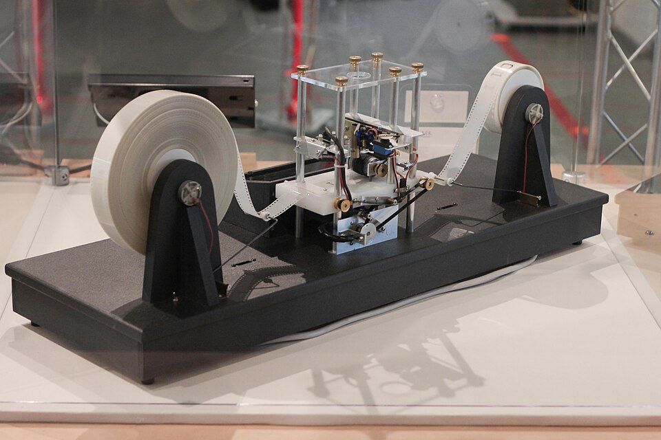
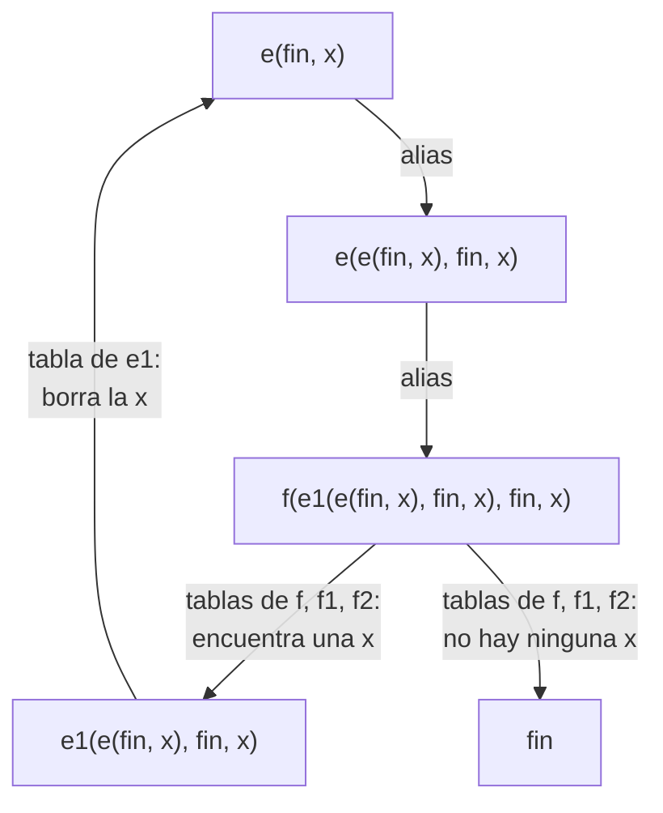

# Capítulo 52 — Proyecto: un intérprete perezoso de reescritura de términos

En 1936 A. M. Turing describió sus máquinas con tablas: cada fila dice qué
hacer en una configuración m —el estado de la máquina— según el símbolo
que lee, qué operaciones ejecutar sobre la cinta y a qué configuración
pasar. En la sección 4 de su artículo, para no reescribir en cada máquina
los mismos procesos —buscar un símbolo, borrarlo, copiarlo al final,
comparar dos—, introduce las **tablas esqueleto**: tablas con parámetros,
en las que una configuración m es una expresión como 𝔣(ℭ, 𝔅, α), con
configuraciones y símbolos como argumentos. A la función que las define la
llama *función de configuración m*. Una máquina se escribe componiendo esas
funciones, y la tabla completa de la máquina, sin parámetros, «se obtiene
por sustitución repetida en las tablas esqueleto».



Un modelo físico de máquina de Turing, construido por Mike Davey: la cinta
pasa de un carrete al otro bajo el cabezal, que lee, escribe y borra una
casilla por vez. Imagen: Rocky Acosta,
[CC BY 3.0](https://creativecommons.org/licenses/by/3.0), vía
[Wikimedia Commons](https://commons.wikimedia.org/wiki/File:Turing_Machine_Model_Davey_2012.jpg).

Ejecutar una máquina así es reescribir términos: la configuración actual es
un término, cada regla lo reescribe en otro, y los parámetros se ligan al
unificar la cabeza de la regla con el término. El diagrama sigue la
configuración `e(fin, x)` de la biblioteca de la
[sección 52.3](#523-la-biblioteca-de-funciones-de-configuracion), que borra
todas las x de la cinta: dos alias la reescriben sin tocar la cinta, la
tablas de `f`, `f1` y `f2` buscan la primera x, la de `e1` la borra, y el
cómputo vuelve al término del comienzo hasta que la búsqueda no encuentra
ninguna.



El intérprete construye esos términos a medida que el cómputo los necesita.
Ligar los parámetros por unificación es exactamente lo que hace la
resolución de Prolog, y el intérprete resulta breve. El
proyecto crece en siete versiones. La primera escribe las tablas de Turing
como hechos y las ejecuta sobre una cinta; la segunda admite
configuraciones que son términos y reglas de dos clases, alias y tablas; la
tercera escribe la biblioteca de funciones de configuración del
artículo; la cuarta traza las configuraciones completas y mide el costo de un
cómputo; la quinta construye la tabla completa por expansión anticipada, y
muestra una máquina para la que no termina; la sexta obtiene la
descripción estándar y el número de descripción de la sección 5; la
séptima es la máquina universal de las secciones 6 y 7, que ejecuta una
máquina a partir de su descripción estándar escrita en la cinta. El
programa terminado carga la última versión, que vuelve a exportar las
anteriores:

<!-- ejemplo: capitulo-52/proyecto.pl archivo -->
```prolog
:- use_module(universal).
```

```prolog
?- sucesion(ii, b, 15, S).
S = '001011011101111'.

?- sucesion(contador, inicio, 15, S).
S = '001011011101111'.

?- cuantas(ii, b, [0, 1, schwa, x], 100, N1), cuantas(contador, inicio, [0, 1, schwa], 1000, N2).
N1 = 5,
N2 = mas_de(1000).

?- numero(i, b, [0, 1], N).
N = 31332531173113353111731113322531111731111335317.
```

Las dos primeras consultas ejecutan dos máquinas que calculan la misma
sucesión, 0 01 011 0111…: la máquina II de Turing, con cinco
configuraciones y marcas en la cinta, y `contador`, escrita con la
biblioteca, cuya configuración lleva la cuenta en un término que crece. La
tercera expande las dos a su tabla completa: la primera tiene cinco
configuraciones, y la segunda más de mil, porque tiene infinitas. El
intérprete **perezoso** ejecuta las dos: solo construye los términos por
los que pasa el cómputo. La cuarta es el número de descripción de la
máquina I, el mismo que Turing calcula en la sección 5.

El proyecto parte de dos fuentes. Del artículo de Turing,
«On Computable Numbers, with an Application to the Entscheidungsproblem»
([DOI 10.1112/plms/s2-42.1.230](https://doi.org/10.1112/plms/s2-42.1.230)),
toma la notación de las secciones 1 a 5: las configuraciones m, las
máquinas I y II de la sección 3, las tablas esqueleto y las funciones de
configuración de la sección 4, y la forma estándar, la descripción estándar
y el número de descripción de la sección 5. Del intérprete del autor del
curso, [`turing-lazy-term-rewriting-interpreter`](https://github.com/CesarBallardini/turing-lazy-term-rewriting-interpreter)
(Python, licencia MIT), toma el diseño: el estado como término, las dos
clases de reglas, la reescritura perezosa durante la ejecución frente a la
expansión anticipada a la tabla completa, la traza, la biblioteca completa
de la sección 4 y la codificación a partir de la tabla expandida; sus
escenarios de prueba (`tests/features/`) fijan el comportamiento esperado
de las funciones de la biblioteca. El código de este capítulo se escribió
en Prolog siguiendo ese diseño.

El capítulo generaliza las máquinas de Turing del
[capítulo 51](../capitulo-51-proyecto-automatas-expresiones-regulares/pila-y-turing.md#maquinas-de-turing),
cuyos estados son átomos y cuya cinta es la misma: dos listas alrededor del
cabezal. Usa la inspección de términos del
[capítulo 32](../capitulo-32-inspeccion-de-terminos/index.md) para medir el
tamaño de una configuración, la idea de intérprete del
[capítulo 33](../capitulo-33-introspeccion-y-metainterpretes/index.md), una
lista abierta del [capítulo 34](../capitulo-34-estructuras-incompletas-y-listas-diferencia/index.md)
como cola del recorrido a lo ancho, una gramática del
[capítulo 21](../capitulo-21-gramaticas-dcg/index.md) para escribir la
descripción estándar, y la tabulación del
[capítulo 39](../capitulo-39-tabulacion/index.md) en un ejercicio. Todas las
versiones son módulos, y se ejecutan localmente.

## Objetivos del capítulo

Al terminar el capítulo, el lector puede:

- escribir una máquina de Turing con la notación de su artículo, con filas
  que leen una condición, ejecutan varias operaciones y pasan a otra
  configuración, y ejecutarla sobre una cinta de dos listas;
- representar configuraciones con parámetros como términos, y reglas de
  dos clases —alias y tablas— cuyos parámetros liga la unificación;
- componer las funciones de configuración de Turing (buscar, borrar,
  imprimir al final, copiar, comparar) para escribir máquinas nuevas;
- distinguir la reescritura perezosa, que construye solo los términos que
  el cómputo visita, de la expansión anticipada a la tabla completa, y
  reconocer cuándo esta no termina;
- trazar un cómputo y medir sus pasos, sus reescrituras y el tamaño de sus
  configuraciones;
- llevar una máquina a la forma estándar y calcular su descripción
  estándar y su número de descripción;
- ejecutar la máquina universal de Turing, escrita con la biblioteca, con
  la descripción estándar de otra máquina en la cinta, y explicar qué
  escribe y cuánto cuesta.

!!! info "Tiempo estimado"
    Leer el capítulo, ejecutar sus ejemplos y hacer las actividades: **1:50 h**.
    Resolver los 6 ejercicios marcados con ★: **1:55 h**.
    Resolver los 13 ejercicios del final: **3:50 h**.

## 52.1 Las tablas de Turing como hechos

Una tabla de Turing tiene cuatro columnas: la configuración m, el símbolo
leído, las operaciones y la configuración m final. `plana.pl` escribe cada
fila como un hecho con el nombre de la máquina como primer argumento, como
los autómatas del
[capítulo 51](../capitulo-51-proyecto-automatas-expresiones-regulares/index.md):

```prolog
fila(M, Q, Condicion, Operaciones, Q1)
```

Las condiciones son las de las tablas de Turing, cada una con su functor:
`blanco` (la casilla está vacía, lo que Turing escribe *None*),
`simbolo(S)` (la casilla tiene el símbolo S), `no(S)` (tiene un símbolo
distinto de S, *not S*) y `siempre` (la columna del símbolo está vacía, y
la fila vale para cualquier casilla). Con S libre, `simbolo(S)` es el *Any*
de Turing, y además liga S al símbolo leído. Las operaciones son también
las suyas: `p(S)` imprime S, `e` borra, `l` y `r` mueven el cabezal una
casilla a la izquierda o a la derecha. El símbolo ə con el que Turing marca
el comienzo de la cinta es el átomo `schwa`, y las figuras 0 y 1 son
números.

La máquina I de la sección 3 calcula 0101…; sus configuraciones son 𝔟, 𝔠,
𝔢 y 𝔨, que aquí se escriben b, c, e y k. La máquina II calcula
001011011101111…: imprime ə ə al comienzo, las figuras en casillas
alternadas, y usa las casillas intermedias para marcar con x los unos que
ya copió:

<!-- ejemplo: capitulo-52/plana.pl fragmento: fila(i, b, blanco, [p(0), r], c). .. fila(ii, f, blanco, [p(0), l, l], o). -->
```prolog
fila(i, b, blanco, [p(0), r], c).
fila(i, c, blanco, [r], e).
fila(i, e, blanco, [p(1), r], k).
fila(i, k, blanco, [r], b).

% La misma sucesión con una sola configuración m, que lee lo que imprimió.
fila(i_bis, b, blanco, [p(0)], b).
fila(i_bis, b, simbolo(0), [r, r, p(1)], b).
fila(i_bis, b, simbolo(1), [r, r, p(0)], b).

% La máquina II de Turing (§3): calcula 001011011101111...
fila(ii, b, siempre, [p(schwa), r, p(schwa), r, p(0), r, r, p(0), l, l], o).
fila(ii, o, simbolo(1), [r, p(x), l, l, l], o).
fila(ii, o, simbolo(0), [], q).
fila(ii, q, simbolo(_), [r, r], q).
fila(ii, q, blanco, [p(1), l], p).
fila(ii, p, simbolo(x), [e, r], q).
fila(ii, p, simbolo(schwa), [r], f).
fila(ii, p, blanco, [l, l], p).
fila(ii, f, simbolo(_), [r, r], f).
fila(ii, f, blanco, [p(0), l, l], o).
```

La segunda tabla, `i_bis`, es la que Turing da a continuación de la
primera: la misma sucesión con una sola configuración m, que decide qué
imprimir mirando lo último que imprimió.

La cinta es la del
[capítulo 51](../capitulo-51-proyecto-automatas-expresiones-regulares/pila-y-turing.md#maquinas-de-turing):
`c(Izquierda, Actual, Derecha)`, con la parte izquierda al revés, de modo
que mover el cabezal pasa un símbolo de una lista a la otra, y las
casillas nuevas se crean en blanco al llegar a ellas. Un paso lee el
símbolo, elige la **primera** fila cuya condición se cumple y ejecuta sus
operaciones, que devuelven además las figuras impresas:

<!-- ejemplo: capitulo-52/plana.pl predicado: cumple/2 paso/6 -->
```prolog
%!  cumple(?Condicion, +S) is semidet.
%
%   El símbolo leído S cumple la Condicion de una fila. Con
%   simbolo(X) y X libre, X queda ligada al símbolo leído.
cumple(blanco, blanco).
cumple(simbolo(X), S) :-
    S \== blanco,
    X = S.
cumple(no(X), S) :-
    S \== blanco,
    S \== X.
cumple(siempre, _).

%!  paso(+M, +Q, +Cinta0, -Q1, -Cinta, -Fs:list) is semidet.
%
%   La máquina M, en la configuración m Q con la Cinta0, da un paso:
%   aplica la primera fila cuya condición cumple el símbolo leído, deja
%   la Cinta y pasa a Q1. Fs son las figuras impresas. Falla si ninguna
%   fila se aplica.
paso(M, Q, Cinta0, Q1, Cinta, Fs) :-
    leer(Cinta0, S),
    once(( fila(M, Q, Condicion, Ops, Q1),
           cumple(Condicion, S)
         )),
    operar(Ops, Cinta0, Cinta, Fs, []).
```

<!-- ejemplo: capitulo-52/plana.pl predicado: operacion/5 -->
```prolog
%!  operacion(+Op, +Cinta0, -Cinta, -Fs:list, ?Fs0:list) is det.
%
%   Cinta es Cinta0 después de la operación Op; Fs tiene la figura
%   impresa, si Op imprime un 0 o un 1, seguida de Fs0.
operacion(p(S), c(I, _, D), c(I, S, D), Fs, Fs0) :-
    (   figura(S)
    ->  Fs = [S|Fs0]
    ;   Fs = Fs0
    ).
operacion(e, c(I, _, D), c(I, blanco, D), Fs, Fs).
operacion(l, c(I, S, D), Cinta, Fs, Fs) :-
    izquierda(I, [S|D], Cinta).
operacion(r, c(I, S, D), Cinta, Fs, Fs) :-
    derecha(D, [S|I], Cinta).
```

`figuras/4` ejecuta la máquina desde una cinta en blanco hasta que imprime
N figuras. Las máquinas de Turing de este artículo no se detienen: una
máquina que calcula una sucesión infinita imprime figuras sin fin, y la
ejecución se corta cuando hay bastantes.

```prolog
?- figuras(i, b, 8, Fs).
Fs = [0, 1, 0, 1, 0, 1, 0, 1].

?- figuras(ii, b, 9, Fs).
Fs = [0, 0, 1, 0, 1, 1, 0, 1, 1].

?- cinta_vacia(C0), paso(ii, b, C0, Q, C, Fs).
C0 = c([], blanco, []),
Q = o,
C = c([schwa, schwa], 0, [blanco, 0]),
Fs = [0, 0].
```

El primer paso de la máquina II imprime ə ə 0 _ 0 y deja el cabezal sobre
el primer 0. Hasta aquí, la versión 1 es la máquina del
[capítulo 51](../capitulo-51-proyecto-automatas-expresiones-regulares/pila-y-turing.md#maquinas-de-turing)
con filas de varias operaciones. Su limitación es la que Turing señala al
comienzo de la sección 4: cada proceso —ir hasta el comienzo de la cinta,
buscar una marca, copiar una figura al final— se escribe de nuevo en cada
máquina y para cada símbolo, porque una configuración es un átomo y no
puede decir «buscar la marca α y después pasar a ℭ».

## 52.2 Estados que son términos: alias y tablas

La versión 2, `perezosa.pl`, admite como configuración cualquier término:
`b`, `salta(c)` o `f(fin, falta, x)`. Las reglas son de dos clases. Una
**tabla** es un conjunto de filas, como en la versión 1, cuya cabeza puede
tener parámetros. Un **alias** reescribe una configuración en otra sin
leer ni tocar la cinta: es una abreviatura, como las que Turing define con
una sola línea sin símbolo ni operaciones.

```prolog
alias(M, Q, Q1)
```

Los parámetros de una regla son variables de Prolog. Al buscar la regla de
la configuración actual, la unificación de la cabeza con el término liga
los parámetros a los argumentos, y cada uso de la regla tiene variables
nuevas: no hace falta un entorno de ligaduras ni una sustitución escrita a
mano. Tampoco hace falta distinguir entre parámetros de configuración y de
símbolo, las mayúsculas góticas y las letras griegas de Turing: el lugar
que ocupa cada argumento en la regla decide qué es. La máquina `alterna`
calcula 0101… con dos funciones de configuración y cuatro alias:

<!-- ejemplo: capitulo-52/perezosa.pl fragmento: plana:fila(alterna, emite(C, B), siempre, [p(B), r], C). .. alias(alterna, d, salta(a)). -->
```prolog
plana:fila(alterna, emite(C, B), siempre, [p(B), r], C).
plana:fila(alterna, salta(C), siempre, [r], C).
alias(alterna, a, emite(b, 0)).
alias(alterna, b, salta(c)).
alias(alterna, c, emite(d, 1)).
alias(alterna, d, salta(a)).
```

`emite(C, B)` imprime el símbolo B, avanza y pasa a C; `salta(C)` avanza y
pasa a C. La configuración a es una abreviatura de `emite(b, 0)`. Un paso
de la máquina **resuelve** primero la configuración, reescribiéndola con
los alias hasta llegar a una que tiene tabla, y después elige la fila:

<!-- ejemplo: capitulo-52/perezosa.pl predicado: resolver/5 seleccionar/7 -->
```prolog
%!  resolver(+M, +Q0, -Q, +N0:integer, -N:integer) is det.
%
%   Como resolver/4, con N0 reescrituras hechas antes.
resolver(M, Q0, Q, N0, N) :-
    (   alias(M, Q0, Q1)
    ->  N1 is N0 + 1,
        resolver(M, Q1, Q, N1, N)
    ;   Q = Q0,
        N = N0
    ).

%!  seleccionar(+M, +Q, +S, -Qr, -N:integer, -Ops:list, -Q1) is semidet.
%
%   Desde la configuración Q, leyendo S, la máquina M llega en N
%   reescrituras a la configuración Qr, que tiene tabla, y su primera
%   fila que se aplica a S tiene las operaciones Ops y la configuración
%   siguiente Q1. Falla si ninguna fila se aplica.
seleccionar(M, Q, S, Qr, N, Ops, Q1) :-
    resolver(M, Q, Qr, N),
    once(( fila(M, Qr, Condicion, Ops, Q1),
           cumple(Condicion, S)
         )).
```

```prolog
?- resolver(alterna, a, Q, N).
Q = emite(b, 0),
N = 1.

?- seleccionar(alterna, d, blanco, Qr, N, Ops, Q1).
Qr = salta(a),
N = 1,
Ops = [r],
Q1 = a.

?- sucesion(alterna, a, 10, S).
S = '0101010101'.
```

La configuración siguiente de una fila, `C` en `emite(C, B)`, es otro
término, que el paso siguiente vuelve a resolver. Nada se expande de
antemano: el intérprete construye solo los términos por los que pasa el
cómputo, en el momento en que los necesita. Eso es lo que el título del
capítulo llama reescritura **perezosa**. Las filas de la versión 1 siguen
siendo las de `plana:fila/5`, y la versión 2 ejecuta sin cambios las
máquinas I y II: una tabla sin parámetros ni alias es un caso particular.

`ejecutar/5` agrega lo que la biblioteca necesita: parte de una cinta
preparada con `cinta_de/3` y se detiene cuando ninguna fila se aplica, con
`detenida(Q, Cinta)`, o al agotar un límite de pasos, con
`limite(Q, Cinta)`.

!!! question "Actividad"
    Predecir el resultado de `sucesion(alterna, b, 4, S)` y de
    `resolver(alterna, c, Q, N)`, y comprobarlo. Explicar después por qué
    `resolver/4` no terminaría con los alias `alias(m, p, q)` y
    `alias(m, q, p)`.

## 52.3 La biblioteca de funciones de configuración

Con parámetros, los procesos de la sección 4 se escriben una sola vez.
`biblioteca.pl` agrega las tablas esqueleto de Turing como filas y alias
con una variable anónima en el lugar del nombre de la máquina: valen para
todas. Las mayúsculas góticas ℭ, 𝔅, 𝔄 y 𝔈 se escriben C, B, A y E, y las
letras griegas α, β, γ, Al, Be y Ga. La primera es 𝔣(ℭ, 𝔅, α), que busca
la primera α de la cinta, la de más a la izquierda: retrocede hasta ə,
recorre la cinta hacia la derecha y pasa a ℭ con el cabezal sobre la α, o
a 𝔅 si encuentra dos casillas en blanco seguidas sin haberla visto.

<!-- ejemplo: capitulo-52/biblioteca.pl fragmento: plana:fila(_, f(C, B, Al), simbolo(schwa), [l], f1(C, B, Al)). .. plana:fila(_, f2(_, B, _), blanco, [r], B). -->
```prolog
plana:fila(_, f(C, B, Al), simbolo(schwa), [l], f1(C, B, Al)).
plana:fila(_, f(C, B, Al), no(schwa), [l], f(C, B, Al)).
% CORRECCIÓN (Post, nota 11; Petzold, p. 116): la tabla de Turing no
% tiene fila para el blanco en f; el blanco se trata igual que «no
% schwa», y sin esa fila la máquina se detiene en la primera casilla
% vacía que encuentra al retroceder.
plana:fila(_, f(C, B, Al), blanco, [l], f(C, B, Al)).
plana:fila(_, f1(C, _, Al), simbolo(Al), [], C).
plana:fila(_, f1(C, B, Al), no(Al), [r], f1(C, B, Al)).
plana:fila(_, f1(C, B, Al), blanco, [r], f2(C, B, Al)).
plana:fila(_, f2(C, _, Al), simbolo(Al), [], C).
plana:fila(_, f2(C, B, Al), no(Al), [r], f1(C, B, Al)).
plana:fila(_, f2(_, B, _), blanco, [r], B).
```

Las demás se definen sobre 𝔣, casi todas con alias. `e(C, B, Al)` borra la
primera Al: busca con 𝔣 y pasa a `e1`, que borra y sigue en C. `e(B, Al)`
borra todas: después de borrar una, vuelve a sí misma, y termina cuando 𝔣
no encuentra ninguna.

<!-- ejemplo: capitulo-52/biblioteca.pl fragmento: perezosa:alias(_, e(C, B, Al), f(e1(C, B, Al), B, Al)). .. plana:fila(_, pe1(C, Be), blanco, [p(Be)], C). -->
```prolog
perezosa:alias(_, e(C, B, Al), f(e1(C, B, Al), B, Al)).
plana:fila(_, e1(C, _, _), siempre, [e], C).
perezosa:alias(_, e(B, Al), e(e(B, Al), B, Al)).

% pe(C, Be): imprime Be en la primera casilla F en blanco y -> C.
perezosa:alias(_, pe(C, Be), f(pe1(C, Be), C, schwa)).
plana:fila(_, pe1(C, Be), simbolo(_), [r, r], pe1(C, Be)).
plana:fila(_, pe1(C, Be), blanco, [p(Be)], C).
```

`pe(C, Be)` imprime Be en la primera casilla F en blanco: busca ə con 𝔣 y
avanza de a dos casillas. Las funciones suponen la disposición de Turing:
la cinta empieza con ə ə, las figuras van en las casillas pares desde la 2
—las casillas F— y las marcas en la casilla de la derecha de cada figura
—las casillas E—; una figura con la marca a a su derecha está «marcada con
a». La copia usa una fila con una variable que no es un parámetro:

<!-- ejemplo: capitulo-52/biblioteca.pl fragmento: perezosa:alias(_, c(C, B, Al), fl(c1(C), B, Al)). .. perezosa:alias(_, ce(B, Al), ce(ce(B, Al), B, Al)). -->
```prolog
perezosa:alias(_, c(C, B, Al), fl(c1(C), B, Al)).
plana:fila(_, c1(C), simbolo(Be), [], pe(C, Be)).

% ce(C, B, Al): copia la primera figura marcada con Al, borra la marca y
% -> C. ce(B, Al): copia en orden todas las marcadas con Al, borra las
% marcas y -> B. ce2 y ce3 copian las marcadas con dos o tres letras.
perezosa:alias(_, ce(C, B, Al), c(e(C, B, Al), B, Al)).
perezosa:alias(_, ce(B, Al), ce(ce(B, Al), B, Al)).
```

`c1(C)` lee cualquier símbolo, y la condición `simbolo(Be)` liga Be a él;
la configuración siguiente, `pe(C, Be)`, lo imprime al final. Turing lo
explica en una nota: la línea representa todas las que se obtienen
reemplazando β por cada símbolo posible. En Prolog es una variable más.
`ce(B, Al)` copia en orden todas las figuras marcadas con Al y borra las
marcas:

```prolog
?- cinta_de([schwa, a, x, b], 3, C0), ejecutar(biblioteca, f(fin, falta, x), C0, 100, R).
C0 = c([x, a, schwa], b, []),
R = detenida(fin, c([a, schwa, blanco], x, [b])).

?- cinta_de([schwa, schwa, 1, a, 0, a], 0, C0), ejecutar(biblioteca, ce(fin, a), C0, 1000, detenida(Q, C)), contenido(C, Ss).
C0 = c([], schwa, [schwa, 1, a, 0, a]),
Q = fin,
C = c([blanco, blanco, 0, blanco, 1, blanco, 0, blanco|...], blanco, []),
Ss = [schwa, schwa, 1, blanco, 0, blanco, 1, blanco, 0].
```

La biblioteca completa está en `biblioteca.pl`: además de las anteriores,
`l` y `r`, `fl` y `fr` (las 𝔣′ y 𝔣″ de Turing), `ce2` y `ce3`, `re`, que
reemplaza un símbolo por otro, `cp` y `cpe`, que comparan la primera
figura marcada con α con la primera marcada con β y, la segunda, dos
sucesiones marcadas enteras, `q`, que busca el final de la cinta o la
última α, `pe2`, y `e(C)`, que borra todas las marcas. Sus pruebas adaptan
los casos de los escenarios del repositorio del autor a la disposición
ə ə de Turing. `cp` sigue al
artículo, con cinco parámetros: pasa a 𝔈 si no hay ninguna de las dos
marcas, a ℭ si hay las dos y las figuras son iguales, y a 𝔄 si no.

Una máquina escrita con la biblioteca es un conjunto de alias. `contador`
calcula la sucesión de la máquina II de otra manera: `m(K)` imprime un 0 y
K unos, con K un natural de Peano, y pasa a `m(s(K))`.

<!-- ejemplo: capitulo-52/biblioteca.pl fragmento: plana:fila(contador, inicio, siempre, [p(schwa), r, p(schwa)], m(cero)). .. perezosa:alias(contador, unos(s(K), C), pe(unos(K, C), 1)). -->
```prolog
plana:fila(contador, inicio, siempre, [p(schwa), r, p(schwa)], m(cero)).
perezosa:alias(contador, m(K), pe(unos(K, m(s(K))), 0)).
perezosa:alias(contador, unos(cero, C), C).
perezosa:alias(contador, unos(s(K), C), pe(unos(K, C), 1)).
```

`unos(K, C)` se reescribe en K llamadas anidadas a `pe`, y la última pasa
a C. La máquina II lleva la cuenta en la cinta, con las marcas x; esta la
lleva en la configuración, que crece sin límite. Las dos calculan lo
mismo, como mostró la segunda consulta del comienzo del capítulo. La
diferencia importa en la [sección 52.5](#525-la-tabla-completa).

!!! question "Actividad"
    Con una cinta [ə, ə, 1, a, 0, a, 1, b, 0, b] y el cabezal en la
    casilla 0, predecir a qué configuración llega
    `cpe(distintas, iguales, a, b)` y qué queda en la cinta, y comprobarlo
    con `ejecutar/5`. Repetirlo con la última figura cambiada por un 1.

## 52.4 La traza de un cómputo

Un cómputo de la biblioteca pasa por decenas de configuraciones que no se
ven. La versión 4, `traza.pl`, las muestra como Turing muestra las
**configuraciones completas** de la máquina II en la sección 3: la cinta,
la casilla leída y la configuración m. `configuraciones/5` es pura: da la
lista de las configuraciones completas, `conf(I, Q, Cinta)`, con Q ya
resuelta por los alias; `linea/2` convierte cada una en una cadena, y
`traza/3` las escribe. En la cadena, ə es `schwa`, un punto es una casilla
en blanco y la casilla leída va entre corchetes.

<!-- ejemplo: capitulo-52/traza.pl predicado: configuraciones/6 -->
```prolog
%!  configuraciones(+M, +Q, +Cinta, +I:integer, +N:integer, -Cs:list) is det.
%
%   Cs son las configuraciones completas desde el paso I hasta el N.
configuraciones(M, Q, Cinta, I, N, Cs) :-
    (   I > N
    ->  Cs = []
    ;   resolver(M, Q, Qr, _),
        Cs = [conf(I, Qr, Cinta)|Cs1],
        (   paso(M, Q, Cinta, Q1, Cinta1, _)
        ->  I1 is I + 1,
            configuraciones(M, Q1, Cinta1, I1, N, Cs1)
        ;   Cs1 = []
        )
    ).
```

```text
?- traza(ii, b, 12).
  1  [.]              b
  2  əə[0].0          o
  3  əə[0].0          q
  4  əə0.[0]          q
  5  əə0.0.[.]        q
  6  əə0.0[.]1        p
  7  əə0[.]0.1        p
  8  ə[ə]0.0.1        p
  9  əə[0].0.1        f
 10  əə0.[0].1        f
 11  əə0.0.[1]        f
 12  əə0.0.1.[.]      f
true.
```

Las configuraciones son las de la tabla de la página 235 del artículo: b,
o, q, q, q, p, p, p, f, f, f, f. La traza de `contador` muestra el término
que crece: cada vez que `pe` termina, la configuración siguiente es otro
`unos` o un `m` con un s más.

```text
?- traza(contador, inicio, 7).
  1  [.]              inicio
  2  ə[ə]             f(pe1(unos(cero,m(s(cero))),0),unos(cero,m(s(cero))),schwa)
  3  [ə]ə             f1(pe1(unos(cero,m(s(cero))),0),unos(cero,m(s(cero))),schwa)
  4  [ə]ə             pe1(unos(cero,m(s(cero))),0)
  5  əə[.]            pe1(unos(cero,m(s(cero))),0)
  6  əə[0]            f(pe1(unos(s(cero),m(s(s(cero)))),0),unos(s(cero),m(s(s(cero)))),schwa)
  7  ə[ə]0            f(pe1(unos(s(cero),m(s(s(cero)))),0),unos(s(cero),m(s(s(cero)))),schwa)
true.
```

`medir/4` ejecuta una máquina hasta que imprime N figuras y cuenta los
pasos que tocan la cinta, las reescrituras con alias y el tamaño mayor de
una configuración, en nodos del término, con `tamano/2`, un recorrido con
`=..` como los del
[capítulo 32](../capitulo-32-inspeccion-de-terminos/index.md):

```prolog
?- medir(ii, b, 120, M1), medir(contador, inicio, 120, M2).
M1 = medida(3281, 0, 1),
M2 = medida(21782, 254, 70).
```

| Figuras | II: pasos | `contador`: pasos | `contador`: reescrituras | `contador`: nodos |
|---:|---:|---:|---:|---:|
| 15 | 116 | 362 | 34 | 30 |
| 30 | 398 | 1 397 | 67 | 42 |
| 60 | 1 121 | 5 492 | 130 | 54 |
| 120 | 3 281 | 21 782 | 254 | 70 |

Las dos máquinas hacen un número de pasos que crece más rápido que las
figuras, porque las dos vuelven al comienzo de la cinta: la máquina II
para buscar la última marca, y `pe` para buscar ə cada vez que imprime.
En `contador` esa vuelta es por cada figura, y al duplicar las figuras los
pasos se multiplican por cuatro. Las reescrituras son pocas —dos por figura
y un poco más—, y el término mayor crece con la raíz cuadrada de la
cantidad de figuras, porque la cuenta K de unos por grupo es su tamaño. La
cantidad de inferencias sigue a los pasos: `figuras/4` necesita 82 629
para 120 figuras de la máquina II y 500 909 para las de `contador`.

!!! question "Actividad"
    Predecir cuántas líneas escribe `traza(biblioteca, f(fin, falta, x), C0, 20)`
    con `cinta_de([schwa, a, x, b], 3, C0)`, en qué configuraciones pasa de
    `f` a `f1` y a `f2`, y comprobarlo.

## 52.5 La tabla completa

Turing no ejecuta las tablas esqueleto: las toma como abreviaturas, y la
máquina es su **tabla completa**, la que queda después de sustituir cada
parámetro, con una fila por cada configuración y cada símbolo, sin
funciones de configuración. La versión 5, `completa.pl`, la construye por
**expansión anticipada**: recorre a lo ancho las configuraciones
alcanzables desde la inicial, prueba cada una con cada símbolo del
alfabeto y con el blanco, y anota una instrucción `i(Q, S, Ops, Q1)` por
cada fila que se aplica. Un paso de la versión 2 escrito como relación, sin
la cinta, es la transición:

<!-- ejemplo: capitulo-52/completa.pl predicado: transicion/5 expandir/5 recorrer/9 -->
```prolog
%!  transicion(+M, +Q, +S, -Ops:list, -Q1) is semidet.
%
%   En la máquina M, desde la configuración Q y leyendo S, se ejecutan
%   las operaciones Ops y se pasa a Q1: un paso de la versión 2 escrito
%   como relación, sin la cinta.
transicion(M, Q, S, Ops, Q1) :-
    seleccionar(M, Q, S, _, _, Ops, Q1).

%!  expandir(:Paso, +Q0, +Simbolos:list, +Limite:integer, -R) is det.
%
%   R es tabla(Estados, Instrucciones) con las configuraciones alcanzables
%   desde Q0 por la relación call(Paso, Q, S, A, Q1) con los Simbolos, en
%   orden de aparición, y una instrucción i(Q, S, A, Q1) por cada
%   configuración y símbolo con transición; o incompleta(Estados) si las
%   configuraciones son más de Limite.
expandir(Paso, Q0, Simbolos, Limite, R) :-
    list_to_assoc([Q0-1], Vistos),
    Estados = [Q0|Fin],
    recorrer(Estados, Fin, 1, Vistos, Paso, Simbolos, Limite, Is, R0),
    (   R0 == completa
    ->  R = tabla(Estados, Is)
    ;   R = incompleta(Estados)
    ).

%!  recorrer(?Cola, ?Fin, +N, +Vistos, :Paso, +Ss, +Limite, -Is, -R) is det.
%
%   Procesa las configuraciones de la lista abierta Cola, cuyo final
%   libre es Fin; N es la cantidad de configuraciones vistas, y Vistos,
%   el conjunto de ellas. Is son las instrucciones. R es completa si la
%   cola se vació, o limite si se pasó del Limite; en los dos casos
%   cierra la lista.
recorrer(Cola, Fin, N, Vistos, Paso, Ss, Limite, Is, R) :-
    (   var(Cola)
    ->  Fin = [],
        Is = [],
        R = completa
    ;   N > Limite
    ->  Fin = [],
        Is = [],
        R = limite
    ;   Cola = [Q|Cola1],
        instrucciones(Ss, Q, Paso, Vistos, Vistos1, Fin, Fin1, N, N1,
                      Is, Is1),
        recorrer(Cola1, Fin1, N1, Vistos1, Paso, Ss, Limite, Is1, R)
    ).
```

La cola del recorrido es una lista abierta, como las del
[capítulo 34](../capitulo-34-estructuras-incompletas-y-listas-diferencia/index.md):
`Estados` es a la vez la lista de todas las configuraciones vistas y, desde
el puntero `Cola`, la de las que faltan procesar; cada configuración nueva
se agrega ligando el final libre, y la cola se vacía cuando el puntero
llega a ese final. El conjunto de las vistas es un `assoc`.
`instrucciones/11` prueba cada símbolo con `transicion/5`, y está en
`completa.pl`.

```prolog
?- completa(i, b, [0, 1], 10, T).
T = tabla([b, c, e, k], [i(b, blanco, [p(0), r], c), i(c, blanco, [r], e), i(e, blanco, [p(1), r], k), i(k, blanco, [r], b)]).

?- completa(ii, b, [0, 1, schwa, x], 100, tabla(Es, _)).
Es = [b, o, q, p, f].
```

La tabla completa de la máquina I es la de Turing. La de la máquina II
tiene sus cinco configuraciones y 20 instrucciones, y `figuras_tabla/3`,
que la ejecuta como una máquina sin alias ni parámetros, calcula la misma
sucesión; las pruebas lo verifican con 30 figuras. Una composición de la
biblioteca también tiene tabla completa finita: la de `e(fin, x)` tiene 6
configuraciones y 35 instrucciones, y la de `ce(fin, a)`, 42 y 286, con el
alfabeto 0, 1, ə, a, b y x.

La de `contador` no la tiene. Cada grupo de unos crea configuraciones con
una cuenta mayor, y el recorrido no termina: `completa/5` se detiene al
pasar del límite y da `incompleta(Estados)`.

| Límite | Configuraciones `unos(cero, m(K))` distintas | Inferencias |
|---:|---:|---:|
| 100 | 5 | 9 147 |
| 1 000 | 19 | 106 254 |
| 10 000 | 62 | 1 202 203 |

Es el ejemplo que da Turing en la sección 4 para explicar por qué hay que
enumerar las configuraciones de una máquina: si se admiten todas las que
resultan de sustituir en 𝔭(ℭ), se obtienen 𝔮, 𝔭(𝔮), 𝔭(𝔭(𝔮)), … sin fin.
Una máquina de Turing tiene finitas configuraciones m, y `contador` no es
una máquina de Turing: es una máquina que guarda en el estado lo que la
máquina II guarda en la cinta. El intérprete perezoso la ejecuta igual,
porque en cada paso construye un solo término; la expansión anticipada,
que necesita todos, no termina. La reescritura perezosa es por eso el
modelo de ejecución del intérprete, y la expansión, una herramienta de
análisis para las máquinas que la admiten.

!!! question "Actividad"
    Predecir el resultado de `cuantas(alterna, a, [0, 1], 10, N)` y de
    `cuantas(i_bis, b, [0, 1], 10, N)`, y comprobarlo. Explicar por qué
    las configuraciones de `alterna` son a, b, c y d, y no `emite/2` ni
    `salta/1`.

## 52.6 Números de descripción

En la sección 5 Turing lleva cada tabla a una forma estándar, en la que
cada instrucción imprime un símbolo y mueve el cabezal a lo sumo una
casilla, y la escribe como un texto con siete letras, la **descripción
estándar**, y como un entero, el **número de descripción**. La página
[Números de descripción](numeros.md#la-forma-estandar) define, en
`numeros.pl`, la forma estándar con configuraciones auxiliares que son
términos, `resto(Ops, Q1)`, la descripción con una gramática del
[capítulo 21](../capitulo-21-gramaticas-dcg/index.md), y el número. Para
la máquina I, los dos coinciden con los que calcula Turing:

```prolog
?- numero(i, b, [0, 1], N).
N = 31332531173113353111731113322531111731111335317.
```

La máquina `contador` no tiene número, porque no tiene tabla completa.

## 52.7 La máquina universal

En la sección 6 del artículo Turing usa el número de descripción para
algo más que enumerar máquinas: describe una sola máquina 𝔘 que, con la
descripción estándar de otra máquina ℳ escrita al comienzo de la cinta,
calcula la misma sucesión que ℳ. 𝔘 escribe en las casillas F, una tras
otra y separadas por dos puntos, las configuraciones completas de ℳ en la
forma de la página 235 —la cinta con la configuración m escrita delante
del símbolo leído—, codificadas con las mismas letras de la descripción
estándar; y entre dos configuraciones escribe la figura que ℳ imprime,
seguida de dos puntos. La sección 7 da la tabla de 𝔘 escrita con las
funciones de configuración de la sección 4, más una nueva, 𝔠𝔬𝔫, que marca
una configuración. La versión 7, `universal.pl`, es esa tabla, con la
biblioteca de la [sección 52.3](#523-la-biblioteca-de-funciones-de-configuracion)
y el intérprete de la versión 2: 𝔘 es una máquina más, escrita con alias
y tablas.

La cinta de 𝔘 empieza con ə ə; siguen, en las casillas F, las
instrucciones de ℳ, y el símbolo `'::'`, una sola casilla, que cierra la
descripción. Las letras son los átomos `'A'`, `'C'`, `'D'`, `'L'`, `'R'`,
`'N'` y `';'`, y las marcas de 𝔘 son u, v, w, x, y y z. Cada paso de ℳ le
cuesta a 𝔘 siete tareas, cada una con su configuración m:
`anf` marca con y la última configuración completa; `kom` busca hacia la
izquierda el punto y coma de una instrucción que todavía no probó, lo
marca con z y marca con x la configuración de esa instrucción; `kmp`
compara lo marcado con x y con y; `sim` marca lo que la instrucción
imprime y hacia dónde se mueve; `mk` parte la configuración completa en
cuatro trozos marcados; `sh` imprime la figura, si la hay; e `inst` copia
los trozos al final, en el orden que pide el movimiento:

<!-- ejemplo: capitulo-52/universal.pl fragmento: plana:fila(universal, kom, simbolo(';'), [r, p(z), l], con(kmp, x)). .. perezosa:alias(universal, kmp, cpe(e(e(anf, x), y), sim, x, y)). -->
```prolog
plana:fila(universal, kom, simbolo(';'), [r, p(z), l], con(kmp, x)).
plana:fila(universal, kom, simbolo(z), [l, l], kom).
plana:fila(universal, kom, no(z), [l], kom).
plana:fila(universal, kom, blanco, [l], kom).

% kmp: compara lo marcado con x y con y; -> sim si son iguales.
% CORRECCIÓN (Davies, p. 116; Petzold, p. 155): si son distintas, la
% comparación ya borró parte de las marcas y; se borran todas las x y las
% y y se vuelve a anf, que marca de nuevo la configuración; Turing vuelve
% a kom. kom sigue después del último punto y coma marcado con z.
perezosa:alias(universal, kmp, cpe(e(e(anf, x), y), sim, x, y)).
```

<!-- ejemplo: capitulo-52/universal.pl fragmento: plana:fila(universal, inst1, simbolo('L'), [r, e], ce5(ov, v, y, x, u, w)). .. plana:fila(universal, inst1, simbolo('N'), [r, e], ce5(ov, v, x, y, u, w)). -->
```prolog
plana:fila(universal, inst1, simbolo('L'), [r, e], ce5(ov, v, y, x, u, w)).
plana:fila(universal, inst1, simbolo('R'), [r, e], ce5(ov, v, x, u, y, w)).
plana:fila(universal, inst1, simbolo('N'), [r, e], ce5(ov, v, x, y, u, w)).
```

Con el movimiento a la izquierda, la configuración nueva es lo marcado
con v, la configuración m final (y), el símbolo que precedía a la
configuración m (x), el símbolo impreso (u) y el resto (w); con el
movimiento a la derecha, el símbolo impreso pasa antes de la
configuración m. `cinta_universal/2` prepara la cinta a partir de la
descripción estándar de la [sección 52.6](#526-numeros-de-descripcion), y
`figuras_universal/3` ejecuta 𝔘 hasta que imprime N figuras:

```prolog
?- descripcion(i, b, [0, 1], SD), figuras_universal(SD, 4, Fs).
SD = "DADDCRDAA;DAADDRDAAA;DAAADDCCRDAAAA;DAAAADDRDA;",
Fs = [0, 1, 0, 1].

?- universal(i_bis, b, [0, 1], 4, Fs), figuras(i_bis, b, 4, Gs).
Fs = Gs, Gs = [0, 1, 0, 1].

?- escrito_universal(i, b, [0, 1], 50000, T).
T = ":DAD:0:DCDAAD:DCDDAAAD:1:DCDDCCDAAAAD".
```

`escrito_universal/5` muestra lo que 𝔘 escribió después de `::` en los
primeros 50 000 pasos. La primera configuración completa es `DAD`: la
configuración m q₁ (`DA`) leyendo un blanco (`D`). La instrucción
`DADDCRDAA` imprime el símbolo 1, la figura 0, y mueve a la derecha, así
que 𝔘 escribe `0:` y la configuración siguiente, `DCDAAD`: la figura 0
(`DC`) y después q₂ leyendo un blanco. Así sigue: `DCDDAAAD` es 0, un
blanco y q₃.

**Las correcciones.** La tabla publicada no se ejecuta tal como está.
La corrección que Turing publicó en 1937 trata de la demostración de la
sección 11 y no toca la tabla de 𝔘. Los errores de la tabla los enumera
Emil Post en la nota 11 del apéndice de su artículo de 1947 (p. 7; p. 97
de la reimpresión en *The Essential Turing*); Donald W. Davies, que los
encontró en 1947 mientras trabajaba en el equipo de Turing, publicó sus
correcciones en 2004, en ese mismo libro; y Petzold las reúne en el
capítulo «The Universal Machine» de *The Annotated Turing*. `universal.pl`
señala cada corrección con un comentario `CORRECCIÓN` que nombra la
fuente; las páginas de Davies son las de *The Essential Turing*:

- 𝔠𝔬𝔫₁ no prevé una configuración que termina en la configuración m, es
  decir, que lee un blanco más allá del final; la fila que falta escribe
  la `D` (Post, nota 11; Petzold, p. 152). Davies corrige el mismo defecto
  de otro modo, en 𝔟₁ y en 𝔦𝔫𝔰𝔱₁(R) (pp. 116–117).
- Si la comparación de `kmp` falla, ya borró parte de las marcas y; se
  borran todas las x y las y y se vuelve a `anf`, que marca de nuevo la
  configuración. Turing vuelve a `kom`, y la comparación siguiente
  encontraría la configuración sin sus marcas y (Davies, p. 116;
  Petzold, p. 155).
- La segunda fila de `sim2` empieza con L y no con R: 𝔠𝔬𝔫 deja el cabezal
  en la casilla F que sigue a la `D` del símbolo impreso, y `sim2` marca
  la casilla F anterior a la que lee (Post, nota 11; Davies, p. 118;
  Petzold, p. 157).
- `mk` sigue en `mk1`, no en `mk` (Post, nota 11; Davies, p. 118;
  Petzold, p. 157), y `sh2`, al leer una `D`, sigue en `sh3`, no en
  `sh2` (Post, nota 11; Petzold, p. 159).
- La descripción estándar empieza con punto y coma y no termina con él,
  porque `kom` reconoce una instrucción por el punto y coma que la precede
  (Post, nota 11; Davies, pp. 113 y 118; Petzold, p. 150).

Además, la tabla escribe 𝔤 donde corresponde 𝔮, la función que busca el
último símbolo, y usa 𝔠𝔢₅ sin definirla (Davies, pp. 118 y 123; Petzold,
pp. 154 y 160); `universal.pl` usa `q` y define `ce4` y `ce5` como `ce3`.

**El costo.** Medidos con `medir/6` de la versión 4, con la cinta de 𝔘:

| Máquina simulada | Letras de la descripción | Figuras | Pasos de 𝔘 | Inferencias |
|---|---:|---:|---:|---:|
| una instrucción, `DADDCRDA;` | 9 | 6 | 30 428 | 8,0 millones |
| I | 47 | 2 | 39 927 | 12,8 millones |
| I | 47 | 4 | 145 286 | 44,7 millones |
| I | 47 | 8 | 774 746 | 229 millones |
| II | 1 825 | 1 | 27 308 856 | 8 291 millones |

Cada paso de ℳ obliga a 𝔘 a recorrer la cinta varias veces: `kom` va de
la última configuración hasta las instrucciones, y cada comparación de
`cpe` vuelve a buscar las marcas desde ə. Como la cinta crece con cada
configuración escrita, el costo por figura crece también. La descripción
de la máquina II tiene 1 825 letras, y 𝔘 necesita más de 27 millones de
pasos, casi veinticinco minutos en esta máquina, para imprimir su primera
figura: cada instrucción que `kom` prueba y descarta cuesta un recorrido
de toda la descripción.

!!! question "Actividad"
    Escribir la cinta inicial de 𝔘 para la máquina de una instrucción
    `DADDCRDA;` y predecir las tres primeras configuraciones completas que
    escribe. Comprobarlo con `cinta_universal/2`, `ejecutar/5` y
    `escrito/2`.

!!! success "Criterios de calidad"
    | Criterio | En este capítulo |
    |---|---|
    | C1 | cada predicado declara modos y determinación; `paso/6`, `seleccionar/7` y `figuras/4` son `semidet` porque una máquina puede detenerse, y `ejecutar/5`, que informa la detención, es `det` |
    | C2 | la unificación liga los parámetros de las reglas: una fila con una variable libre en la condición es la «totalidad de líneas» de Turing, sin código aparte; `configuraciones/5` es pura, y solo `traza/4` escribe |
    | C4 | el intérprete elige la primera fila con `once/1` y sigue la máquina con `->`: no deja alternativas pendientes, y las pruebas lo verifican |
    | C5 | cada condición y cada resultado tiene su functor (`blanco`, `simbolo/1`, `no/1`, `siempre`; `detenida/2`, `limite/2`; `tabla/2`, `incompleta/1`), y las configuraciones auxiliares de la forma estándar son términos, no nombres generados |
    | C7 | 128 pruebas en nueve archivos, con los casos de los escenarios del repositorio del autor, la traza de la página 235, el número de descripción de la sección 5, y la tabla completa comparada con la ejecución perezosa |

## Ejercicios

Las soluciones están en [la página de soluciones](soluciones.md). La dificultad
va de 1 (se resuelve consultando el capítulo) a 3 (requiere elaboración propia).
Los marcados con ★ son los que no conviene saltear: cubren lo que el capítulo
tiene de propio.

1. ★ **(1)** Con `proyecto.pl` cargado, predecir la respuesta de cada
   consulta, incluido si termina en `.` o en `false.`, y comprobarlo:
   `resolver(alterna, emite(b, 0), Q, N)` ·
   `seleccionar(ii, p, x, Qr, N, Ops, Q1)` ·
   `seleccionar(ii, o, blanco, Qr, N, Ops, Q1)` ·
   `transicion(biblioteca, c1(fin), 1, Ops, Q1)` ·
   `cuantas(i, c, [0, 1], 10, N)`.
2. **(1)** Escribir la tabla de una máquina `tres` que calcule
   001001001…, con tres configuraciones sin parámetros, y obtener su
   número de descripción. Explicar por qué su tabla estándar tiene más
   de tres configuraciones.
3. ★ **(2)** Escribir con la biblioteca una máquina `ceros_unos` que
   calcule 01 0011 000111 …, grupos de K ceros seguidos de K unos, con K
   desde 1. Verificar las primeras 12 figuras y que su tabla completa no
   termina.
4. ★ **(2)** Turing define cr(ℭ, 𝔅, α) y cr(𝔅, α), que copian las figuras
   marcadas con α como ce, pero sin borrar las marcas: cambian cada α
   copiada por una letra provisoria a y, al terminar, vuelven a cambiar
   las a por α con re. Escribirlas como alias, a partir de la sección 4
   del artículo, y verificarlas con la cinta ə ə 1 x 0 x.
5. **(2)** Escribir `resolver_seguro/4`, que se comporta como
   `resolver/4` pero lanza `error(ciclo_de_alias(Q), _)` si la
   reescritura vuelve a una configuración Q por la que ya pasó. Probarlo
   con dos alias que se reescriben el uno en el otro.
6. ★ **(2)** Definir con tabulación la relación
   `alcanzable(M, Q0, Alfabeto, Q)`, con una regla recursiva por la
   izquierda sobre `transicion/5`, y verificar que da las mismas
   configuraciones que `completa/5` para la máquina II. Explicar qué
   pasa con `contador`, y qué da `completa/5` que la relación tabulada
   no da.
7. **(1)** Con `re(B, Al, Be)`, escribir la consulta que cambia todos los
   0 de la cinta ə ə 1 \_ 0 \_ 0 por 1, predecir el contenido final de la
   cinta, y explicar por qué el cómputo termina aunque `re/3` se reescribe
   en un término que la contiene.
8. **(2)** Escribir `sd_numero/2`, que convierte una descripción estándar
   en su número y un número en su descripción, y una gramática
   `instrucciones_sd//1` que lee una descripción estándar y da la lista
   de instrucciones `i(I, J, K, Mov, M)` con números. Verificar la ida y
   la vuelta con la máquina II.
9. ★ **(3)** Escribir `figuras_dn(DN, N, Fs)`, que ejecuta la máquina
   cuyo número de descripción es DN y da sus primeras N figuras, sin
   conocer la máquina: el símbolo 0 es el blanco, el 1 es la figura 0 y
   el 2 es la figura 1. Verificarlo con el número de la máquina I y con
   el de la máquina II.
10. **(2)** Predecir qué hace `e(fin)`, que borra las marcas, con la
    cinta ə ə 1 a 0 a 1 y el cabezal en la casilla 0, comprobarlo con la
    tabla de Turing, y corregir la llamada componiéndola con otra función
    de la biblioteca, sin cambiar la tabla.
11. **(3)** Escribir una máquina `rapido` que calcule la sucesión de la
    máquina II sin volver nunca al comienzo de la cinta, con una
    configuración `unos(K, C)` que imprime K unos seguidos. Medir sus
    pasos con `medir/4` para 15, 30, 60 y 120 figuras, compararlos con
    los de la [sección 52.4](#524-la-traza-de-un-computo), y explicar por
    qué no es una máquina de Turing.
12. ★ **(2)** Escribir una máquina `reimprime` que imprima un 0 en una
    casilla en blanco, imprima un 1 sobre ese 0 sin moverse, avance dos
    casillas y vuelva a empezar. Comparar sus primeras cuatro figuras según
    `figuras/4` y según `universal/5`, y explicar la diferencia con las
    filas `sh2` a `sh5` de la [sección 52.7](#527-la-maquina-universal).
13. **(2)** La máquina `corta` imprime un 0, avanza y pasa a una
    configuración sin filas: se detiene. Predecir qué hace 𝔘 con su
    descripción estándar, comprobarlo con `ejecutar/5` y un límite de
    pasos, y explicar por qué 𝔘 no puede informar que la máquina
    simulada se detuvo.

## Resumen

| | |
|---|---|
| **configuración m** | el estado de la máquina; aquí, cualquier término |
| **fila** | `fila(M, Q, Condicion, Operaciones, Q1)`; condiciones `blanco`, `simbolo(S)`, `no(S)`, `siempre`; operaciones `p(S)`, `e`, `l`, `r`; se aplica la primera que se cumple |
| **función de configuración m** | una tabla con parámetros, como `f(C, B, Al)`; la unificación los liga |
| **alias** | `alias(M, Q, Q1)`: reescribe una configuración sin tocar la cinta |
| **reescritura perezosa** | resolver la configuración con los alias al dar cada paso; se construyen solo los términos que el cómputo visita |
| **tabla completa** | la tabla sin parámetros, por sustitución repetida; su expansión termina solo si las configuraciones alcanzables son finitas |
| **forma estándar** | cada instrucción imprime un símbolo y mueve a lo sumo una casilla; las filas largas se parten con configuraciones `resto(Ops, Q1)` |
| **descripción estándar, número de descripción** | la tabla estándar escrita con D, A, C, L, R, N y ;, y ese texto con dígitos |
| **cinta** | `c(Izquierda, Actual, Derecha)`, con la parte izquierda al revés |
| `figuras/4`, `sucesion/4`, `paso/6`, `ejecutar/5`, `cinta_de/3`, `contenido/2` | ejecutar una máquina |
| `resolver/4`, `seleccionar/7` | los alias y la elección de la fila |
| `configuraciones/5`, `traza/3`, `medir/4`, `tamano/2` | la traza y la medida |
| `completa/5`, `cuantas/5`, `expandir/5`, `figuras_tabla/3` | la tabla completa |
| `estandar/5`, `tabla_estandar/4`, `descripcion/4`, `numero/4` | la sección 5 |
| **máquina universal** | 𝔘: con la descripción estándar de ℳ en la cinta, escribe las configuraciones completas de ℳ y calcula su sucesión |
| `cinta_universal/2`, `figuras_universal/3`, `universal/5`, `escrito/2`, `escrito_universal/5` | las secciones 6 y 7 |

## Temas que se retoman

| Tema | Se retoma en |
|---|---|
| Un intérprete de un lenguaje funcional, cuyas expresiones se evalúan reescribiendo términos | [capítulo 57](../capitulo-57-proyecto-interprete-funcional/index.md) |
| Reglas elegidas por un patrón que se unifica con el estado, sobre una base de datos en lugar de una cinta | [capítulo 60](../capitulo-60-proyecto-interprete-dirigido-patrones/index.md) |

## Referencias

- A. M. Turing, «On Computable Numbers, with an Application to the
  Entscheidungsproblem», *Proceedings of the London Mathematical Society*
  (2) 42, 1936–37, pp. 230–265
  ([DOI 10.1112/plms/s2-42.1.230](https://doi.org/10.1112/plms/s2-42.1.230)),
  §1 «Computing machines», §2 «Definitions», §3 «Examples of computing
  machines», §4 «Abbreviated tables» y §5 «Enumeration of computable
  sequences». El capítulo toma de allí la notación de las tablas, las
  máquinas I y II, la tabla de sus configuraciones completas, las tablas
  esqueleto y las funciones de configuración de la biblioteca, el ejemplo
  de 𝔭(ℭ) que no tiene tabla completa, y la forma estándar, la descripción
  estándar y el número de descripción de la máquina I. De §6 «The
  universal computing machine» y §7 «Detailed description of the universal
  machine», la máquina universal: la cinta con la descripción estándar y
  las configuraciones completas separadas por dos puntos, y su tabla, con
  la función 𝔠𝔬𝔫.
- Cesar Ballardini, *turing-lazy-term-rewriting-interpreter*, repositorio
  en GitHub, 2026, licencia MIT
  ([github.com/CesarBallardini/turing-lazy-term-rewriting-interpreter](https://github.com/CesarBallardini/turing-lazy-term-rewriting-interpreter)),
  en particular `docs/lazy-term-rewriting-interpreter.md`, «The lazy
  term-rewriting interpreter». El capítulo toma de allí el diseño: la
  configuración como término, las reglas de dos clases, alias y tablas, el
  paso que resuelve los alias y elige la primera fila, la ejecución
  perezosa frente a la expansión anticipada a la tabla completa, la traza,
  la expansión de las filas largas a instrucciones estándar y la
  codificación a partir de la tabla expandida; y de `tests/features/`, los
  casos de prueba de la biblioteca.
- A. M. Turing, «On Computable Numbers, with an Application to the
  Entscheidungsproblem. A Correction», *Proceedings of the London
  Mathematical Society* (2) 43, 1937, pp. 544–546
  ([DOI 10.1112/plms/s2-43.6.544](https://doi.org/10.1112/plms/s2-43.6.544)),
  reimpreso en *The Essential Turing*, pp. 94–96. Corrige la demostración
  de la sección 11 y la representación de los números computables; no
  trata la tabla de la máquina universal. La
  [sección 52.7](#527-la-maquina-universal) lo menciona para dejar
  constancia de que las correcciones de 𝔘 no son de Turing.
- Charles Petzold, *The Annotated Turing: A Guided Tour through Alan
  Turing's Historic Paper on Computability and the Turing Machine*, Wiley,
  2008, ISBN 978-0-470-22905-7, los capítulos «Machines at Work»
  (pp. 79–95), «Also Known as Subroutines» (pp. 111–125), «Everything Is a
  Number» (pp. 127–142) y «The Universal Machine» (pp. 143–161). Es la
  lectura comentada, línea por línea, del artículo, y la fuente de las
  tablas de la biblioteca del intérprete del autor; el capítulo toma de
  allí, a través de ese intérprete, la lectura de las tablas esqueleto de
  la sección 4, con la fila que falta en 𝔣 (p. 116). Del capítulo «The
  Universal Machine», la lectura de la tabla de 𝔘 y las correcciones que
  la [sección 52.7](#527-la-maquina-universal) aplica, con la página de
  cada una.
- Emil L. Post, «Recursive Unsolvability of a Problem of Thue», *The
  Journal of Symbolic Logic* 12(1), marzo de 1947, pp. 1–11
  ([DOI 10.2307/2267170](https://doi.org/10.2307/2267170)). El apéndice,
  pp. 7–11, es la primera crítica publicada del artículo de Turing, y su
  nota 11, en la p. 7, enumera los errores de la tabla de la máquina
  universal; el apéndice está reimpreso, con la nota incorporada al texto,
  en *The Essential Turing*, pp. 97–101. El capítulo toma de allí las
  correcciones de 𝔠𝔬𝔫₁, `sim2`, `mk` y `sh2`, el punto y coma delante de
  cada instrucción, y la fila que falta en 𝔣.
- Donald W. Davies, «Corrections to Turing's Universal Computing
  Machine», en B. Jack Copeland (ed.), *The Essential Turing*, Oxford
  University Press (Clarendon Press), 2004, ISBN 0-19-825080-0,
  pp. 103–124. Davies encontró los errores en 1947 y probó en una
  computadora una versión corregida de la máquina universal. El capítulo
  toma de allí la corrección de `kmp` (§8, p. 116), la otra forma de
  agregar la `D` del blanco (pp. 116–117) y la lista de errores menores
  (§10, p. 118, y §14, pp. 122–124).
- Harold Abelson y Gerald Jay Sussman, con Julie Sussman, *Structure and
  Interpretation of Computer Programs*, 2.ª ed., MIT Press, 1996, §1.1.5
  «The Substitution Model for Procedure Application», con «Applicative
  order versus normal order»
  ([edición en línea, CC BY-SA 4.0](https://sarabander.github.io/sicp/html/1_002e1.xhtml#g_t1_002e1_002e5)).
  El documento de diseño del intérprete del autor lo cita para el modelo
  de sustitución; el capítulo toma de allí la evaluación como reescritura
  de una expresión y la diferencia entre expandir todo antes de reducir y
  reducir a medida que se necesita, que la
  [sección 52.5](#525-la-tabla-completa) traslada a la tabla completa.
- Franz Baader y Tobias Nipkow, *Term Rewriting and All That*, Cambridge
  University Press, 1998, los capítulos «Motivating Examples» y «Abstract
  Reduction Systems». El documento de diseño del intérprete del autor lo
  cita para el vocabulario de la reescritura de términos; el capítulo
  toma de allí los nombres de término, regla y paso de reescritura, y la
  observación de que una reescritura puede no terminar.

El código del capítulo es propio del curso, escrito en Prolog siguiendo el
diseño del intérprete en Python del autor.
