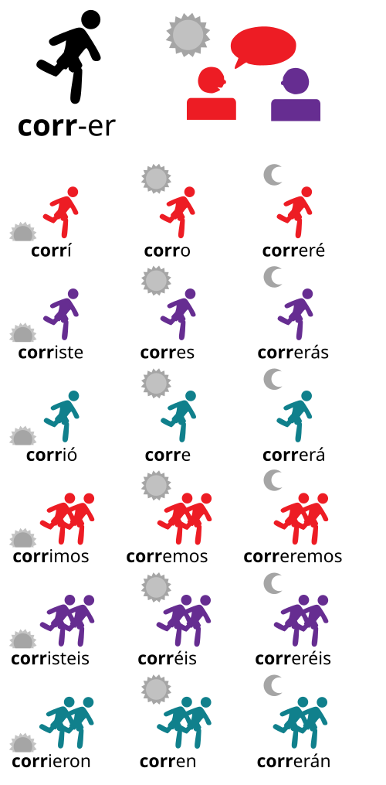
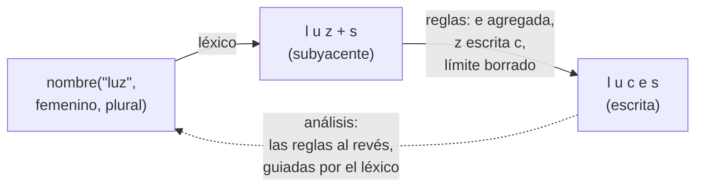

# Capítulo 53 — Proyecto: morfología del castellano

Un programa que entiende o escribe castellano necesita saber que «cuento»,
«contamos» y «contó» son formas de «contar», que el plural de «luz» es
«luces» y el de «camión», «camiones». Listar todas las formas de todas las
palabras es posible —la morfología de una lengua es finita—, pero las
regularidades son tantas que conviene expresarlas como reglas: una raíz, una
terminación, y unas pocas reglas ortográficas que ajustan las letras donde
las dos se juntan. La **morfología** estudia esa estructura de las palabras;
este capítulo se ocupa de la **flexión**, que produce las formas de una
misma palabra: el género y el número de los nombres y los adjetivos, y la
persona, el número y el tiempo de los verbos.



Las dieciocho formas de «correr» en el pretérito, el presente y el futuro:
la raíz «corr» se mantiene y la terminación cambia con la persona, el
número y el tiempo. Imagen: original de Serg!o, versión vectorial de Nyq,
[CC BY-SA 4.0](https://creativecommons.org/licenses/by-sa/4.0), vía
[Wikimedia Commons](https://commons.wikimedia.org/wiki/File:Conjugation_of_verb-es.svg).

El capítulo construye un analizador y generador de formas del castellano que
usa las mismas reglas en los dos sentidos: dada una palabra, dice de qué
lema es forma y con qué rasgos; dado el lema y los rasgos, escribe la forma.
Empieza con el programa terminado y lo construye en cuatro versiones: raíz
más terminación, sin reglas; una forma subyacente con reglas ortográficas
aplicadas en orden, los cambios de vocal de la raíz y las formas
irregulares; la **morfología de dos niveles**, con las reglas como
autómatas del [capítulo 51](../capitulo-51-proyecto-automatas-expresiones-regulares/index.md)
que se aplican a la vez; y la misma idea sin construir de antemano el
autómata de todas las reglas juntas, que es lo que la vuelve practicable.
Dos versiones más amplían la cuarta: las reglas escritas en la notación de
Koskenniemi y compiladas, y la **derivación**, que forma palabras nuevas
con prefijos y sufijos.

El diagrama muestra el camino de las versiones 2 a 4 con el plural de «luz»:
el léxico da la forma subyacente, con el límite `+` entre la raíz y la
terminación, y las reglas ortográficas la relacionan con la escrita. Las
mismas relaciones, leídas en sentido inverso, analizan la palabra.



El proyecto parte de *Natural Language Processing for Prolog Programmers*,
de Michael A. Covington, que el autor publica en
<https://www.covingtoninnovations.com/books/NLPPP.pdf>. Su capítulo
«Morphology and the Lexicon» distingue la flexión de la derivación, analiza
palabras como listas de letras, quita sufijos buscando la raíz en un árbol de
letras, discute cuánto conviene resolver con reglas y cuánto listar en el
léxico, muestra por qué las reglas ortográficas no se pueden aplicar al
revés una por una, y presenta la morfología de dos niveles de Koskenniemi:
cada regla es un transductor finito que recorre a la vez la forma subyacente
y la escrita, y una palabra es correcta si ninguna regla la rechaza. De allí
toma el capítulo esas ideas; Covington las desarrolla para el inglés, y
el léxico, las reglas del castellano y el código son propios.

**Cómo se representan las palabras.** El
[capítulo 54](../capitulo-54-proyecto-traduccion-castellanoingles/index.md)
representa cada palabra como un string para conservar sus tildes, y los
capítulos [44](../capitulo-44-proyecto-aventura-de-texto/index.md) y
[55](../capitulo-55-proyecto-dialogos-plantillas/index.md) las quitan para
comparar lo que escribe el usuario. Aquí la tilde es parte de lo que se
estudia —se pierde en «camiones» y aparece en «jóvenes»—, así que las
palabras y los lemas son strings con sus tildes, y por dentro, listas de
letras, como en Covington: `string_chars/2` convierte «camión» en
`[c, a, m, i, ó, n]`. Ningún átomo del programa lleva tilde salvo, entre
comillas, las letras mismas (`'ó'`).

## Objetivos del capítulo

Al terminar el capítulo, el lector puede:

- separar una palabra en raíz y terminación con una relación que sirve para
  analizar y para generar, y buscar la raíz en el léxico;
- decidir qué se lista en el léxico y qué se expresa con reglas, y hacer que
  una forma listada bloquee la regular;
- describir una palabra en dos niveles, el subyacente y el escrito, y
  escribir reglas ortográficas que relacionan uno con el otro;
- escribir una regla de dos niveles como una lista de patrones prohibidos y
  convertirla en un autómata con las construcciones del
  [capítulo 51](../capitulo-51-proyecto-automatas-expresiones-regulares/index.md);
- explicar por qué el autómata producto de varias reglas crece como el
  producto de sus estados, medirlo, y evitarlo recorriendo solo los estados
  que la palabra alcanza;
- usar el léxico como un autómata que guía el análisis, compuesto con las
  reglas;
- escribir una regla en la notación de dos niveles y compilarla a
  patrones prohibidos;
- distinguir la derivación que se lista de la que se escribe como regla, y
  derivar con prefijos y sufijos usando las mismas reglas ortográficas.

!!! info "Tiempo estimado"
    Leer el capítulo, ejecutar sus ejemplos y hacer las actividades: **1:20 h**.
    Resolver los 6 ejercicios marcados con ★: **1:30 h**.
    Resolver los 15 ejercicios del final: **4:50 h**.

## 53.1 El programa terminado

`paralelo.pl` es la última versión. `forma/2` relaciona una palabra con su
análisis, un término que dice la categoría, el lema y los rasgos:

```prolog
nombre(Lema, Genero, Numero)
adjetivo(Lema, Genero, Numero)
verbo(Lema, Tiempo, Persona, Numero)
```

Con la palabra, la analiza; con el análisis, la genera:

<!-- ejemplo: capitulo-53/paralelo.pl predicado: forma/2 -->
```prolog
%!  forma(?Palabra:string, ?Analisis) is nondet.
%
%   Palabra es la forma escrita que describe Analisis. Con Palabra ligada
%   la analiza con el inverso del léxico compuesto con las reglas; si no,
%   Analisis debe llegar ligado y la genera con las reglas.
forma(Palabra, Analisis) :-
    reglas(Rs),
    (   nonvar(Palabra)
    ->  string_chars(Palabra, Letras),
        transducir(inversa(compuesta(lexico, paralelo(Rs))), Letras,
                   Subyacente),
        forma_lexica(Subyacente, Analisis)
    ;   forma_lexica(Subyacente, Analisis),
        transducir(paralelo(Rs), Subyacente, Letras),
        string_chars(Palabra, Letras)
    ).
```

```prolog
?- findall(A, forma("camiones", A), As).
As = [nombre("camión", masculino, plural)].

?- findall(P, forma(P, verbo("elegir", presente, 1, singular)), Ps).
Ps = ["elijo"].

?- findall(A, forma("fue", A), As).
As = [verbo("ser", preterito, 3, singular), verbo("ir", preterito, 3, singular)].

?- findall(P, forma(P, adjetivo("joven", femenino, plural)), Ps).
Ps = ["jóvenes"].

?- forma("tocé", A).
false.
```

«Camiones» pierde la tilde de «camión»; «elijo» cambia la e de la raíz por i
y la g por j; «fue» es forma de dos verbos; «jóvenes» gana una tilde; y
«tocé» no es una palabra: el pretérito de «tocar» se escribe «toqué». Cada
una de esas cosas la resuelve una versión del programa:

| Versión | Archivo | Qué agrega | Qué no puede hacer |
|---|---|---|---|
| — | `lexico.pl` | los lemas, sus clases y las formas irregulares | — |
| 1 | `concatenar.pl` | raíz más terminación, en los dos sentidos | ninguna letra cambia: «tocé», «lápizes», «conto» |
| 2 | `reglas.pl` | forma subyacente, reglas ortográficas en orden, cambios de la raíz | analiza generando todo el léxico |
| 3 | `dos_niveles.pl` | reglas como autómatas en paralelo, léxico como autómata | el autómata de las reglas juntas es enorme |
| 4 | `paralelo.pl` | las reglas avanzan juntas sin construir ese autómata | — |
| 5 | `kimmo.pl` | las reglas escritas en la notación de Koskenniemi y compiladas | — |
| 6 | `derivacion.pl` | la derivación y los prefijos, listados o como reglas | el significado de lo derivado |

Las versiones 2 a 4 son módulos, y la 3 carga el módulo `transductores` del
[capítulo 51](../capitulo-51-proyecto-automatas-expresiones-regulares/transductores.md#transductores);
todos los ejemplos se ejecutan localmente.

## 53.2 El léxico

`lexico.pl` guarda lo que ninguna regla puede inventar: qué palabras
existen, de qué clase es cada una y qué formas son irregulares. Los nombres
llevan su género; los adjetivos, cómo forman el femenino; los verbos, qué
vocal de la raíz cambia cuando recibe el acento:

<!-- ejemplo: capitulo-53/lexico.pl fragmento: verbo("pensar", e_ie). .. verbo("elegir", e_i). -->
```prolog
verbo("pensar", e_ie).
verbo("entender", e_ie).
verbo("sentir", e_ie).
verbo("contar", o_ue).
verbo("volver", o_ue).
verbo("dormir", o_ue).
verbo("pedir", e_i).
verbo("seguir", e_i).
verbo("elegir", e_i).
```

Covington discute cuánto conviene resolver con reglas y cuánto listar. Una
regla que se aplica a pocas palabras cuesta más que listarlas, y hay formas
que ninguna regla predice. El léxico lista enteras las formas de «ser» y de
«ir» —que comparten el pretérito: «fue» es de las dos—, la primera persona
en -go de «tener», «hacer», «poner» y «salir», y la raíz propia del
pretérito de los tres primeros:

<!-- ejemplo: capitulo-53/lexico.pl fragmento: preterito_fuerte("tener", "tuve"). .. preterito_fuerte("poner", "puse"). -->
```prolog
preterito_fuerte("tener", "tuve").
preterito_fuerte("hacer", "hice").
preterito_fuerte("poner", "puse").
```

También las terminaciones son entradas del léxico. Cada conjugación tiene una
lista por tiempo, en el orden de las seis personas, y el pretérito de raíz
propia tiene la suya, sin tildes: «tuve», «tuvo».

<!-- ejemplo: capitulo-53/lexico.pl fragmento: terminaciones(a, presente, ["o", "as", "a", "amos", "áis", "an"]). .. terminaciones(fuerte, preterito, ["e", "iste", "o", "imos", "isteis", "ieron"]). -->
```prolog
terminaciones(a, presente, ["o", "as", "a", "amos", "áis", "an"]).
terminaciones(e, presente, ["o", "es", "e", "emos", "éis", "en"]).
terminaciones(i, presente, ["o", "es", "e", "imos", "ís", "en"]).
terminaciones(a, preterito, ["é", "aste", "ó", "amos", "asteis", "aron"]).
terminaciones(e, preterito, ["í", "iste", "ió", "imos", "isteis", "ieron"]).
terminaciones(i, preterito, ["í", "iste", "ió", "imos", "isteis", "ieron"]).
terminaciones(fuerte, preterito, ["e", "iste", "o", "imos", "isteis", "ieron"]).
```

El léxico declara `multifile` sus predicados, para que otro archivo pueda
agregar palabras sin modificarlo; los ejercicios lo usan. Con 12 nombres,
7 adjetivos y 23 verbos en dos tiempos, describe 328 formas.

## 53.3 Versión 1: raíz más terminación

La idea más simple es que cada forma es una raíz seguida de una terminación:
«habl» y «ó», «libro» y «s». `partes/3` relaciona un análisis con esas dos
partes, y `forma/2` las une o las separa:

<!-- ejemplo: capitulo-53/concatenar.pl predicado: forma/2 -->
```prolog
%!  forma(?Palabra:string, ?Analisis) is nondet.
%
%   Palabra es la forma que describe Analisis. Con Palabra ligada la
%   analiza; si no, Analisis debe llegar ligado y la genera.
forma(Palabra, Analisis) :-
    (   nonvar(Palabra)
    ->  string_concat(Raiz, Terminacion, Palabra),
        partes(Analisis, Raiz, Terminacion)
    ;   partes(Analisis, Raiz, Terminacion),
        string_concat(Raiz, Terminacion, Palabra)
    ).
```

<!-- ejemplo: capitulo-53/concatenar.pl fragmento: partes(nombre(Lema, Genero, plural), Lema, T) :- .. verbo(Lema, _). -->
```prolog
partes(nombre(Lema, Genero, plural), Lema, T) :-
    nombre(Lema, Genero),
    plural(Lema, T).
partes(adjetivo(Lema, Genero, singular), Lema, "") :-
    adjetivo(Lema, invariable),
    genero(Genero).
partes(adjetivo(Lema, Genero, plural), Lema, T) :-
    adjetivo(Lema, invariable),
    genero(Genero),
    plural(Lema, T).
partes(adjetivo(Lema, Genero, Numero), Raiz, T) :-
    terminacion_genero(Clase, Genero, Numero, T),
    raiz_adjetivo(Clase, Lema, Raiz),
    adjetivo(Lema, Clase).
partes(verbo(Lema, Tiempo, Persona, Numero), Raiz, T) :-
    terminacion(Conj, Tiempo, Persona, Numero, T),
    infinitivo(Conj, Inf),
    string_concat(Raiz, Inf, Lema),
    verbo(Lema, _).
```

Para analizar, `string_concat/3` con la palabra ligada enumera todas las
maneras de cortarla, como el `find_word` de Covington quita un sufijo
conocido y busca la raíz en su árbol de letras. Cada corte se prueba
contra el léxico: la terminación tiene que ser una terminación y la raíz,
la de una palabra de la clase correspondiente. `string_concat/3` no se puede
llamar con los tres argumentos libres, así que para generar el orden se
invierte: primero las partes, después la concatenación. `nonvar/1` elige el
orden según lo que llega instanciado, como el traductor del
[capítulo 54](../capitulo-54-proyecto-traduccion-castellanoingles/index.md).

```prolog
?- forma(P, verbo("hablar", preterito, 3, singular)).
P = "habló" ;
false.

?- forma("comemos", A).
A = verbo("comer", presente, 1, plural) ;
false.

?- forma("verdes", A).
A = adjetivo("verde", masculino, plural) ;
A = adjetivo("verde", femenino, plural) ;
false.
```

«Verdes» tiene dos análisis porque «verde» no distingue el género. El
análisis cuesta poco —1 477 inferencias para «comemos», contadas con
`statistics/2`—, porque cada corte de la palabra se busca directamente en el
léxico por su primer argumento: con un léxico veinte veces mayor cuesta lo
mismo.

!!! question "Actividad"
    Predecir qué escribe la versión 1 para el plural de «pez», el
    femenino de «inglés», la primera persona del presente de «contar» y la
    de «ser». Después consultarlo.

Las respuestas muestran lo que falta. Al unir las partes, ninguna letra
cambia:

```prolog
?- forma(P, verbo("tocar", preterito, 1, singular)).
P = "tocé" ;
false.

?- forma(P, nombre("lápiz", masculino, plural)).
P = "lápizes".

?- forma(P, nombre("camión", masculino, plural)).
P = "camiónes".

?- forma(P, verbo("contar", presente, 1, singular)).
P = "conto" ;
false.

?- forma("toqué", A).
false.
```

Son cuatro fenómenos distintos. La ortografía escribe el mismo sonido de
dos maneras según la vocal que sigue: c y qu en «toco» y «toqué», z y c en
«lápiz» y «lápices». La tilde depende de dónde cae el acento, y al agregar
una sílaba puede sobrar («camiones») o hacer falta («jóvenes»). La raíz
de muchos verbos cambia cuando recibe el acento: «cuento», pero «contamos».
Y algunas formas no siguen ninguna regla: «soy», «fue», «tengo». La
versión 1 no puede analizar «toqué», porque ninguna raíz del léxico
termina en qu.

## 53.4 Versión 2: forma subyacente y reglas

La versión 2 describe cada palabra en dos niveles. La **forma subyacente**
escribe cada sonido con una sola letra y marca con `+` el límite entre la
raíz y la terminación; la **forma escrita** es la que se lee. Las reglas
ortográficas convierten una en la otra. Cuatro sonidos se escriben de dos
maneras, y en el nivel subyacente tienen una letra propia:

| Letra subyacente | Sonido de | Se escribe ante e, i | Se escribe en otro caso |
|---|---|---|---|
| `k` | «casa», «queso» | qu | c |
| `z` | «luz», «luces» | c | z |
| `g` | «gato», «guerra» | gu | g |
| `'J'` | «gente», «jota» | g | j |

`escribir/2` es la ortografía: relaciona una forma subyacente sin límites
con su forma escrita, letra por letra, mirando la letra que sigue. La j
subyacente queda para las palabras que la escriben ante e o i, como
«tejer»:

<!-- ejemplo: capitulo-53/reglas.pl predicado: escribir/2 frontal/1 -->
```prolog
%!  escribir(?Subyacente:list, ?Escrita:list) is nondet.
%
%   Escrita es la ortografía de Subyacente: k, z, g y 'J' se escriben
%   según la vocal que sigue, y j solo aparece ante e, i (tejer). Una de
%   las dos listas debe llegar ligada: cada condición se evalúa después
%   de la llamada recursiva, cuando el resto de la forma subyacente ya
%   está ligado en los dos sentidos.
escribir([], []).
escribir([k|S], [q, u|E]) :-
    escribir(S, E),
    frontal(S).
escribir([k|S], [c|E]) :-
    escribir(S, E),
    \+ frontal(S).
escribir([z|S], [c|E]) :-
    escribir(S, E),
    frontal(S).
escribir([z|S], [z|E]) :-
    escribir(S, E),
    \+ frontal(S).
escribir([g|S], [g, u|E]) :-
    escribir(S, E),
    frontal(S).
escribir([g|S], [g|E]) :-
    escribir(S, E),
    \+ frontal(S),
    \+ ( S = [u|S1], frontal(S1) ).
escribir(['J'|S], [g|E]) :-
    escribir(S, E),
    frontal(S).
escribir(['J'|S], [j|E]) :-
    escribir(S, E),
    \+ frontal(S).
escribir([j|S], [j|E]) :-
    escribir(S, E),
    frontal(S).
escribir([L|S], [L|E]) :-
    escribir(S, E),
    \+ memberchk(L, [k, z, g, 'J', j, c, q]).

%!  frontal(+Letras:list) is semidet.
%
%   Letras empieza con e o con i, con tilde o sin ella.
frontal([V|_]) :-
    sub_atom('eiéí', _, 1, _, V).
```

Cada condición se evalúa **después** de la llamada recursiva. Así
`escribir/2` funciona en los dos sentidos: en sentido inverso, la forma
subyacente todavía no existe al entrar en la cláusula, y `\+ frontal(S)`
sobre una variable libre fallaría siempre; después de la llamada, `S` ya
está ligada. Es la condición después de lo que examina, como en el
[capítulo 54](../capitulo-54-proyecto-traduccion-castellanoingles/index.md).
El sentido inverso tiene un uso inmediato: el léxico lista los lemas como
se escriben, y `subyacente/2` obtiene su forma subyacente aplicando la
ortografía al revés:

```prolog
?- subyacente("tocar", S).
S = [t, o, k, a, r] ;
false.

?- subyacente("proteger", S).
S = [p, r, o, t, e, 'J', e, r] ;
false.

?- escribir(S, [q, u, e, s, o]).
S = [k, e, s, o] ;
false.
```

Para un lema la respuesta es una sola, porque la vocal del infinitivo decide
cada letra: la c de «tocar» está ante a y solo puede venir de `k`; la g de
«proteger» está ante e y solo puede venir de `'J'`. Con esas raíces,
«toc+é» se escribe «toqué» y «proteJ+o», «protejo», sin una regla para
cada verbo.

`lexica/2` arma la forma subyacente de un análisis: la raíz del lema, el
límite y la terminación. `superficie/2` le aplica las reglas en cuatro
pasadas, en orden:

<!-- ejemplo: capitulo-53/reglas.pl predicado: superficie/2 -->
```prolog
%!  superficie(+Subyacente:list, -Escrita:list) is det.
%
%   Escrita es la forma escrita de Subyacente, por las cuatro pasadas.
superficie(S0, Escrita) :-
    epentesis(S0, S1),
    tildes(S1, S2),
    exclude(==(+), S2, S3),
    escribir(S3, Escrita).
```

```prolog
?- lexica(nombre("camión", masculino, plural), S).
S = [k, a, m, i, ó, n, +, s] ;
false.

?- forma(P, nombre("camión", masculino, plural)).
P = "camiones" ;
false.
```

La **epéntesis** agrega la e del plural después de una consonante:
«kamión+s» pasa a «kamión+es». Las **tildes** vienen después, porque
dependen de esa e: una vocal con tilde seguida de una consonante, un límite
y una vocal la pierde, porque la palabra pasa a ser llana terminada en s o
en vocal («camiones», «inglesa»); una vocal sin tilde seguida de
consonantes, otra vocal sin tilde, n y un límite la gana, porque la palabra
pasa a ser esdrújula («exámenes», «jóvenes»). Después se borran los
límites, y al final se escribe cada sonido: «luz+es» da «luces». El orden
importa: con las tildes antes de la epéntesis, «camión+s» no tendría la
vocal que les quita la tilde. Covington muestra el mismo fenómeno con
*quizzes*, donde la duplicación de la z solo se produce después de
insertar la e; cada pasada es un nivel más entre la forma subyacente y la
escrita.

La raíz de los verbos cambia en `lexica/2`, antes de las reglas. Una
forma listada en el léxico **bloquea** la regular: si `irregular/5` da la
forma, no se calcula otra; si el verbo tiene un pretérito de raíz propia,
esa raíz reemplaza a la del infinitivo. En los demás, `raiz_verbal/7`
cambia la última vocal de la raíz cuando la raíz lleva el acento, que es
cuando la terminación tiene una sola vocal y ninguna tilde:

<!-- ejemplo: capitulo-53/reglas.pl predicado: raiz_verbal/7 acento_en_la_raiz/1 -->
```prolog
%!  raiz_verbal(+Clase, +Conj, +Tiempo, +Persona, +T, +R0, -R) is det.
%
%   R es la raíz R0 de un verbo de la Clase ante la terminación T. La
%   última vocal cambia cuando la raíz lleva el acento, es decir, cuando
%   T es una sola sílaba sin tilde (cuent+a, pero cont+amos, cont+é); y
%   en la tercera persona del pretérito de los verbos en -ir que cambian
%   (sint+ió, durm+ieron).
raiz_verbal(Clase, _, _, _, T, R0, R) :-
    acento_en_la_raiz(T),
    diptongo(Clase, V, Nueva),
    !,
    cambiar_ultima(V, Nueva, R0, R).
raiz_verbal(Clase, i, preterito, 3, _, R0, R) :-
    cerrada(Clase, V, Nueva),
    !,
    cambiar_ultima(V, Nueva, R0, R).
raiz_verbal(_, _, _, _, _, R, R).

%!  acento_en_la_raiz(+T:string) is semidet.
%
%   La terminación T tiene una sola vocal y no lleva tilde: el acento cae
%   en la raíz.
acento_en_la_raiz(T) :-
    string_chars(T, Letras),
    include(vocal, Letras, [V]),
    tilde(V, _).
```

```prolog
?- forma(P, verbo("contar", presente, 1, singular)).
P = "cuento" ;
false.

?- forma(P, verbo("contar", presente, 1, plural)).
P = "contamos" ;
false.

?- forma(P, verbo("hacer", preterito, 3, singular)).
P = "hizo" ;
false.
```

«Cont+o» lleva el acento en la raíz y diptonga; «cont+amos», no. El
pretérito de «hacer» usa la raíz de «hice», cuya forma subyacente es
«hiz», y la terminación «o» da «hizo» por la misma regla que «luces». La
segunda cláusula de `raiz_verbal/7` cierra la vocal en la tercera persona
del pretérito de los verbos en -ir: «sintió», «durmieron», «pidió». Las
pruebas generan las 328 formas del léxico y verifican que cada análisis
tiene exactamente una.

**Lo que no puede hacer: analizar sin generar todo.** Las pasadas funcionan
hacia adelante. Aplicarlas al revés requiere adivinar dónde estaba cada
límite borrado y cada e agregada, y los límites pueden estar en cualquier
lugar. `forma/2` analiza entonces por síntesis: recorre todos los análisis
del léxico, genera cada forma y la compara con la palabra:

<!-- ejemplo: capitulo-53/reglas.pl predicado: forma/2 -->
```prolog
%!  forma(?Palabra:string, ?Analisis) is nondet.
%
%   Palabra es la forma escrita que describe Analisis. Para analizar,
%   recorre todos los análisis del léxico.
forma(Palabra, Analisis) :-
    analisis(Analisis),
    generar(Analisis, Palabra).
```

```prolog
?- forma("cuentas", A).
A = verbo("contar", presente, 2, singular) ;
false.
```

Cada análisis cuesta 68 294 inferencias, para «cuentas», para «luces» o
para cualquier otra palabra, contra 1 477 de la versión 1: genera las 328
formas. El costo crece con el tamaño del léxico —con los 500 verbos
inventados de `grande.pl`, que llevan el léxico a 6 328 formas, pasa a
1 072 794—, y un léxico real tiene decenas de miles de palabras.

## 53.5 Versión 3: dos niveles, con los transductores del capítulo 51

La morfología de dos niveles de Koskenniemi, que Covington presenta, elimina
los niveles intermedios: cada regla relaciona directamente la forma
subyacente con la escrita, par de letras por par de letras, y todas se
aplican **a la vez**. La página
[Dos niveles con transductores](dos-niveles.md#dos-niveles-con-transductores)
desarrolla la versión 3, `dos_niveles.pl`, con el módulo `transductores` del
[capítulo 51](../capitulo-51-proyecto-automatas-expresiones-regulares/transductores.md#transductores):
la palabra como sucesión de pares `Subyacente:Escrita`; cada regla como una
lista de **patrones prohibidos**, convertida en autómata con
`complemento/1`; las reglas en paralelo con `interseccion/2`; y el léxico
como un árbol de letras que, compuesto con las reglas mediante
`compuesta/2`, solo propone formas subyacentes que existen. Termina con su
limitación, medida: para decidir qué estados son finales, la intersección
construye el autómata producto entero, que con cinco de las nueve reglas
tiene 4 465 estados y tarda casi nueve minutos en generar «luces».

## 53.6 Versión 4: las reglas en paralelo

El producto de las reglas no hace falta. Para decidir si una sucesión de
pares es correcta basta con leerla con todas las reglas a la vez y
rechazarla en cuanto una encuentra un patrón prohibido; los estados que
importan son los que la palabra alcanza. `paralelo(Rs)` es ese
transductor: su estado es la lista de los estados de cada regla, y el
estado de una regla es el conjunto de estados de `contiene(R)` donde está la
lectura, como en el determinista del [capítulo 51](../capitulo-51-proyecto-automatas-expresiones-regulares/index.md), pero calculado solo al
pasar por él:

<!-- ejemplo: capitulo-53/paralelo.pl fragmento: automatas:alfabeto(paralelo(_), Pares) :- .. memberchk(hallado, D1). -->
```prolog
automatas:alfabeto(paralelo(_), Pares) :-
    findall(P, par(P), Pares0),
    sort(Pares0, Pares).
automatas:inicial(paralelo(Rs), Ds) :-
    maplist(inicial_regla, Rs, Ds).
automatas:final(paralelo(Rs), Ds) :-
    maplist(acepta_regla, Rs, Ds).
automatas:delta(paralelo(Rs), Ds, P, Ds1) :-
    par(P),
    maplist(paso(P), Rs, Ds, Ds1).

%!  inicial_regla(+R, -D:list) is det.
%
%   D es el conjunto de estados de contiene(R) antes de leer un par.
inicial_regla(R, D) :-
    inicial(contiene(R), Q0),
    clausura_conjunto(contiene(R), [Q0], D).

%!  acepta_regla(+R, +D:list) is semidet.
%
%   Ningún estado de D es final en contiene(R): la sucesión leída no
%   tiene un patrón prohibido por R.
acepta_regla(R, D) :-
    \+ ( member(Q, D), final(contiene(R), Q) ).

:- table paso/4.

%!  paso(+P, +R, +D:list, -D1:list) is semidet.
%
%   Leyendo el par P, la regla R pasa del conjunto D al D1, y no encuentra
%   un patrón prohibido en el medio de la palabra. Tabulada: cada paso se
%   calcula una vez.
paso(P, R, D, D1) :-
    mover(contiene(R), P, D, D1),
    \+ memberchk(hallado, D1).
```

Un paso de una regla que llega a `hallado` falla: la regla rechaza, y el
transductor no tiene estados muertos. `paso/4` está tabulado, como las
tablas de transiciones que KIMMO compila de antemano; aquí se llenan a
medida que las palabras las necesitan, y se reutilizan.

`forma/2`, en la [sección 53.1](#531-el-programa-terminado), analiza con
`inversa/1` aplicado al léxico compuesto con las reglas: el analizador es el
transductor inverso del generador. Las tres construcciones de transductores
del [capítulo 51](../capitulo-51-proyecto-automatas-expresiones-regulares/index.md) aparecen en la versión 4; `identidad/1` sirve para la forma
subyacente de un lema, que la versión 2 obtenía con `escribir/2`: compuestas
con la identidad sobre las letras sin límite, las reglas en sentido inverso
no pueden proponer un `+`:

<!-- ejemplo: capitulo-53/paralelo.pl predicado: raiz/2 -->
```prolog
%!  raiz(+Palabra:string, -Subyacente:list) is nondet.
%
%   Subyacente es una forma subyacente sin límites cuya forma escrita es
%   Palabra: la de un lema, como subyacente/2 de la versión 2. La
%   identidad sobre las letras sin el límite + restringe el nivel
%   subyacente antes de las reglas.
raiz(Palabra, Subyacente) :-
    reglas(Rs),
    findall(L, ( par([L]:_), L \== + ), Ls0),
    sort(Ls0, Ls),
    string_chars(Palabra, Letras),
    transducir(inversa(compuesta(identidad(Ls), paralelo(Rs))), Letras,
               Subyacente).
```

```prolog
?- findall(S, raiz("proteger", S), Ss).
Ss = [[p, r, o, t, e, 'J', e, r]].

?- reglas(_Rs), findall(_S, transducir(paralelo(_Rs), _S, [l, u, c, e, s]), _Ss), length(_Ss, N).
N = 26.
```

Las reglas solas admiten 26 formas subyacentes para «luces»: «luz+s»,
«luz+es», «lu+z+s», «lúz+s» y otras, todas bien escritas y ninguna
descartable sin saber qué palabras existen. Es la sobregeneración que
Covington atribuye a las reglas que borran letras; el léxico la elimina, y
por eso analiza con él.

**Lo que se gana.** Las pruebas comparan la versión 4 con la 2 en todo el
léxico: las 328 formas generadas y los análisis de cada una son los mismos.
Las nueve reglas juntas responden en décimas de segundo. Medido en
inferencias, en un proceso nuevo, con el léxico del capítulo y con los 500
verbos de `grande.pl`:

| Inferencias | Versión 2 | Versión 4 |
|---|---|---|
| analizar «luces», la primera consulta | 68 296 | 191 549 |
| analizar «cuentas», después | 68 294 | 46 183 |
| con `grande.pl`: analizar «luces», la primera consulta | 1 072 796 | 761 612 |
| con `grande.pl`: analizar «cuentas», después | 1 072 794 | 14 994 |
| generar «cuento», después | 303 | 516 587 |

La primera consulta de la versión 4 completa las tablas de las formas
subyacentes y del árbol de letras, y ese costo crece con el léxico; es
una vez. Después, analizar una palabra cuesta lo que cuestan los caminos que
la palabra abre en el árbol y en las reglas, y no crece con el léxico: con
veinte veces más formas, «cuentas» cuesta menos, porque la primera consulta
dejó tabulados más pasos de las reglas. La versión 2 recorre el léxico en
cada análisis. Generar, en cambio, es más barato con la versión 2, que
aplica cuatro pasadas a una lista, que con el transductor, que en cada
posición prueba los 46 pares.

## 53.7 Versión 5: reglas en notación de dos niveles

Koskenniemi no escribe las reglas como patrones prohibidos sino como un par
y su contexto, `e:0 => C:C _ +:0 V:V` en el ejemplo de Covington, y KIMMO
las compila en transductores. La página
[Notación de dos niveles y derivación](derivacion.md#la-notacion-de-dos-niveles)
desarrolla la versión 5, `kimmo.pl`: las reglas como términos
`regla_dos_niveles/5` con los operadores `=>`, `<=` y `<=>`; `compilar/5`,
que las traduce a las listas de patrones de la versión 3; la regla z
escrita así, que compila exactamente a la de la
[sección 53.5](#535-version-3-dos-niveles-con-los-transductores-del-capitulo-51);
y una regla nueva, `nasal`, que escribe la N del prefijo in- como m ante p
o b: in+posible es «imposible».

## 53.8 Versión 6: la derivación y los prefijos

La flexión produce las formas de una palabra; la derivación, palabras
nuevas. Covington aconseja listar la derivación que es irregular y escribir
como reglas solo la regular. La versión 6, `derivacion.pl`, en la misma
[página](derivacion.md#la-derivacion-y-los-prefijos), lista los nombres en
-ción y los verbos con des- y re-, que heredan la clase y las formas
irregulares de su base —«deshizo», «recuento»—, y escribe como reglas el
adverbio en -mente, el diminutivo —«lucecita», «saquito», «camioncito»,
con las reglas ortográficas de las versiones anteriores— y el prefijo in-,
con la regla `nasal` de la versión 5.

!!! success "Criterios de calidad"
    | Criterio | En este capítulo |
    |---|---|
    | C1 | cada predicado declara sus modos; `escribir/2` declara `?` en los dos argumentos y dice cuál debe llegar ligado, y `forma/2` de las versiones 1 y 4 dice qué argumento decide el sentido |
    | C2 | las reglas son datos: listas de patrones de clases de pares, con un functor por clase; agregar una regla es agregar una cláusula de `regla/2`, y ningún otro predicado cambia |
    | C3 | `escribir/2` evalúa cada condición después de la llamada recursiva y por eso funciona en los dos sentidos; los si-entonces-sino de `tildes/2` y `lexica/2` actúan sobre argumentos que llegan instanciados |
    | C5 | las formas irregulares se listan y bloquean la regular; lo regular no se lista |
    | C7 | 109 pruebas en ocho archivos, y 36 en los de las soluciones; la versión 4 se compara con la 2 en las 328 formas del léxico y en sus análisis, y los defectos de la versión 1 están probados |

## Ejercicios

Las soluciones están en [la página de soluciones](soluciones.md). La dificultad
va de 1 (se resuelve consultando el capítulo) a 3 (requiere elaboración propia).
Los marcados con ★ son los que no conviene saltear: cubren lo que el capítulo
tiene de propio. Los ejercicios que agregan palabras o reglas lo hacen desde un
archivo propio, con cláusulas como `lexico:verbo("empezar", e_ie).`: el léxico
declara `multifile` sus predicados, la versión 2 su tabla `diptongo/3` y la
versión 3 `regla/2` y `par/1`.

1. ★ **(1)** Predecir qué escribe la versión 2 para el plural de «imagen» y
   el de «feliz», la primera persona del pretérito de «llegar», la tercera
   del plural del presente de «volver» y la tercera del singular del
   pretérito de «dormir», y qué análisis da para «siguen». Nombrar la regla
   o la pasada que explica cada letra que cambia, y comprobarlo.
2. **(1)** Agregar al léxico los nombres «nariz» y «razón», femeninos, y
   «origen», masculino, y el adjetivo invariable «cortés», sin cambiar
   ninguna regla. Predecir sus plurales y comprobar que las versiones 2 y 4
   dan los mismos.
3. ★ **(1)** Agregar los verbos «empezar», de la clase `e_ie`, y
   «colgar», de la clase `o_ue`. Predecir las seis formas del presente y
   las del pretérito de cada uno y comprobarlas. ¿Qué dos reglas actúan
   juntas en «empiezo» y «empecé», y por qué no hace falta ninguna regla
   nueva?
4. **(2)** Agregar el pretérito imperfecto como otro tiempo: sus
   terminaciones (-aba, -abas… para la conjugación en a; -ía, -ías… para
   las otras dos) y las formas de «ser» (era…) y de «ir» (iba…), listadas.
   Explicar por qué «contaba» y «tenía» no cambian la vocal de la raíz sin
   tocar `raiz_verbal/7`. ¿Cuántos análisis tiene «hacía»?
5. ★ **(2)** Escribir `escribir_antes/2`, la parte de `escribir/2` que
   trata la letra k y las letras que se escriben igual, con cada condición
   **antes** de la llamada recursiva. Predecir qué responden
   `escribir_antes([t, o, k, a, r], E)` y `escribir_antes(S, [t, o, c, a, r])`,
   comprobarlo y explicar la diferencia. Escribir su encabezado PlDoc: ¿qué
   modo puede declarar?
6. **(2)** «Jugar» cambia la u de la raíz por ue: «juego», «jugamos».
   Agregar la clase `u_ue` a `diptongo/3` y el verbo al léxico, y
   comprobar el presente y el pretérito. ¿De dónde sale la u de «jugué»?
7. ★ **(2)** Agregar el **voseo**: la persona `vos`, con las terminaciones
   -ás, -és, -ís del presente y las de tú en el pretérito, y «sos» y
   «vas» para «ser» e «ir». Predecir «vos contás» o «vos cuentás», «vos
   pedís» o «vos pidís», y explicar por qué el cambio de la raíz no
   necesita ninguna condición nueva. ¿Cuántos análisis tiene «fuiste»?
8. **(2)** Escribir `candidatos(Palabra, Subyacentes)`, las formas
   subyacentes que las reglas de la versión 4 admiten sin el léxico.
   Contarlas para «luces», «toqué» y «camiones», clasificar las de
   «toqué», y explicar qué pasaría sin la regla `limite`.
9. **(2)** Escribir `conjugacion(Lema, Tiempo, Formas)`, las seis formas de
   un verbo en un tiempo, en el orden de las personas, con la versión 4.
   Escribir su encabezado PlDoc y justificar la determinación que declara.
   ¿Qué debe hacer con un lema que no es un verbo?
10. ★ **(3)** «Leer» y «creer» escriben y la i de la terminación que queda
    entre vocales: «leyó», «creyeron». Agregar a la versión 4 una regla
    `ye` con el par `[i]:[y]`, y los dos verbos. Comprobar que las demás
    formas del léxico no cambian. ¿Qué escribe la versión 4 para la
    primera persona del plural del pretérito, y por qué no alcanza con
    agregar otra regla para ponerle la tilde? ¿Qué escribe la versión 2?
11. **(3)** «Averiguar» escribe ü la u que suena entre g y e: «averigüé».
    Agregar a la versión 4 una regla `dieresis` con el par `[u]:['ü']`.
    ¿Qué regla existente impide ya escribir «averigue», y por qué la
    versión 2 no genera ninguna forma para ese pretérito?
12. **(3)** Escribir `adivinar(Palabra, Analisis)`, que analiza formas de
    verbos regulares que el léxico no tiene: entre las formas subyacentes
    que las reglas admiten sin el léxico, se queda con las que son una
    raíz, un límite y una terminación, y escribe el infinitivo de esa raíz
    con las mismas reglas. Probarlo con «bloguearon», «tuiteé» y
    «chateamos». ¿Qué responde para «cuentas», y por qué?
13. ★ **(1)** Con `derivacion.pl` cargado, predecir qué responden
    `findall(D, derivada("lapicito", D), Ds)`,
    `findall(A, forma("desprotejo", A), As)` y
    `findall(P, derivada(P, adverbio("inglés")), Ps)`, comprobarlo, y
    nombrar la regla o la entrada del léxico que explica cada letra que
    cambia respecto de la base.
14. **(2)** Escribir la regla `jota` de la versión 3 en la notación de dos
    niveles, como dos reglas: una para la `'J'` escrita g y otra para la j
    escrita j. Comprobar con `compilar/5` que sus patrones, juntos, son
    los de `regla(jota, Ps)`. ¿Por qué la segunda solo necesita `=>`?
15. **(3)** El prefijo in- se escribe ir- ante r («irreal») e i- ante l
    («ilegal»). Agregar los adjetivos «real» y «legal», y dos reglas en
    notación de dos niveles, sin cambiar las otras. ¿Qué par hace falta
    para «ilegal», que no tiene ninguna letra en lugar de la N?

## Resumen

| | |
|---|---|
| **morfología, flexión** | la estructura de las palabras; la flexión produce las formas de una misma palabra según sus rasgos |
| **lema** | la forma que representa a todas las de una palabra: el singular, el masculino, el infinitivo |
| **forma subyacente** | la palabra con una letra por sonido y los límites entre raíz y terminación marcados con `+` |
| **regla ortográfica** | la relación entre la forma subyacente y la escrita en un contexto: `k` se escribe qu ante e, i |
| **epéntesis** | una letra que aparece al unir las partes: la e de «luces» |
| **bloqueo** | una forma listada en el léxico impide que se calcule la regular |
| **morfología de dos niveles** | las reglas relacionan directamente la forma subyacente con la escrita, par por par, y se aplican a la vez |
| **patrón prohibido** | una sucesión de clases de pares que ninguna palabra puede contener; una regla es una lista de ellos |
| **sobregeneración** | las formas subyacentes que las reglas admiten sin que el léxico las tenga |
| **árbol de letras** | el léxico como autómata cuyos estados son los prefijos de sus formas |
| **[Patrón 61](../patrones.md#61-compilar-reglas-desde-una-notacion-declarativa)** | compilar reglas desde una notación declarativa |
| `forma/2` | la relación entre una palabra y su análisis, en las cuatro versiones |
| `partes/3` | la raíz y la terminación de un análisis, en la versión 1 |
| `escribir/2`, `subyacente/2` | la ortografía en los dos sentidos, y la forma subyacente de un lema |
| `lexica/2`, `superficie/2` | la forma subyacente de un análisis, y las cuatro pasadas que la escriben |
| `raiz_verbal/7` | el cambio de la vocal de la raíz cuando recibe el acento |
| `regla/2`, `contiene(R)` | las reglas como patrones, y el autómata que los encuentra |
| `ortografia(Rs)`, `paralelo(Rs)` | las reglas en paralelo: como intersección de sus autómatas, y sin construir el producto |
| `compuesta(lexico, …)`, `inversa/1`, `identidad/1` | el léxico compuesto con las reglas, el analizador como inverso, y la forma subyacente de un lema |
| **derivación** | la formación de palabras nuevas: sufijos como -ción, -mente, -ito, y prefijos como des-, re-, in- |
| **restricción de contexto, coerción** | `=>`: el par solo aparece en el contexto; `<=`: en el contexto, la letra subyacente solo se escribe así |
| `regla_dos_niveles/5`, `compilar/5` | una regla en la notación de Koskenniemi, y su traducción a patrones prohibidos |
| `derivada/2` | la relación entre una palabra derivada y su base |
| `:- table P as subsumptive` | tabulación por subsunción: una consulta más particular usa la tabla completa de una más general |

## Temas que se retoman

| Tema | Se retoma en |
|---|---|
| Las formas de los nombres y los verbos de una pregunta, reducidas a su lema con `forma/2` | [capítulo 87](../capitulo-87-proyecto-preguntas-en-castellano/index.md) |

## Referencias

- Michael A. Covington, *Natural Language Processing for Prolog
  Programmers*, Prentice-Hall, 1994; edición digital del autor, 2013,
  <https://www.covingtoninnovations.com/books/NLPPP.pdf>. Capítulo
  «Morphology and the Lexicon»: la distinción entre flexión y derivación;
  las palabras como listas de letras; el análisis que quita un sufijo y busca
  la raíz en un árbol de letras («Implementing English Inflection»); la
  discusión sobre qué listar en el léxico y qué expresar con reglas, y la
  sobregeneración; las formas subyacentes y los niveles intermedios
  («Underlying Forms»); por qué las reglas no se aplican al revés una por
  una («Morphology as Parsing»); la morfología de dos niveles de Koskenniemi,
  con las reglas como transductores finitos que se aplican en paralelo y el
  léxico que guía el análisis («Two-Level Morphology», «Rules and
  Transducers»), y la crítica de su costo («Critique of Two-Level
  Morphology»). De «The Nature of Morphology», que la derivación es en
  gran parte irregular y se lista, y de «Controlling Overgeneration», la
  sobregeneración de una regla productiva, como -mente; de «Rules and
  Transducers», la notación `e:0 => C:C _ +:0 V:V`.
- Kimmo Koskenniemi, *Two-Level Morphology: A General Computational Model
  for Word-Form Recognition and Production*, Publicación 11 del
  Departamento de Lingüística General, Universidad de Helsinki, 1983; y su
  resumen en «A General Computational Model for Word-Form Recognition and
  Production», *COLING 1984* ([ACL Anthology P84-1038](https://aclanthology.org/P84-1038/)).
  Covington toma de allí la morfología de dos niveles; el capítulo, a
  través de él, la palabra como sucesión de pares subyacente:escrita, las
  reglas que relacionan directamente los dos niveles sin niveles
  intermedios, y su aplicación en paralelo, de las versiones 3 y 4; y la
  notación de las reglas, un par, un operador y un contexto, de la
  versión 5.
- Lauri Karttunen, «KIMMO: A General Morphological Processor», *Texas
  Linguistic Forum* 22, 1983, pp. 165–186. Es la implementación de la
  morfología de dos niveles que Covington describe; el capítulo compara
  con ella las tablas de transiciones que la versión 4 llena a medida que
  las palabras las necesitan, y la compilación de las reglas escritas en
  notación de dos niveles, que la versión 5 hace a patrones prohibidos.
- G. Edward Barton, Robert C. Berwick y Eric Sven Ristad, *Computational
  Complexity and Natural Language*, MIT Press, 1987; y G. Edward Barton,
  «Computational Complexity in Two-Level Morphology», *24th Annual
  Meeting of the Association for Computational Linguistics*, 1986
  ([ACL Anthology P86-1009](https://aclanthology.org/P86-1009/)). Covington
  los cita para la crítica de la morfología de dos niveles; el capítulo
  toma de allí que el formalismo alcanza para codificar problemas
  NP-completos, que la página de la versión 3 contrasta con el costo del
  autómata producto.
- Edward Fredkin, «Trie Memory», *Communications of the ACM* 3(9), 1960,
  pp. 490–499; y René de la Briandais, «File Searching Using Variable
  Length Keys», *Proceedings of the Western Joint Computer Conference*,
  1959, pp. 295–298. Covington los cita para el árbol de letras; el
  capítulo toma de allí el léxico como árbol de prefijos, que la versión 3
  convierte en autómata.

El código del capítulo es propio del curso: el léxico, las reglas del
castellano, la escritura de las reglas como patrones prohibidos, su
compilación desde la notación de dos niveles y las seis versiones se
escribieron para él; de la fuente se toman las ideas,
no los programas.
