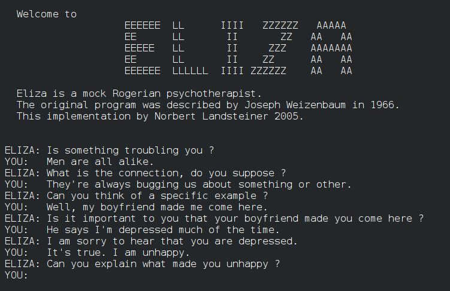
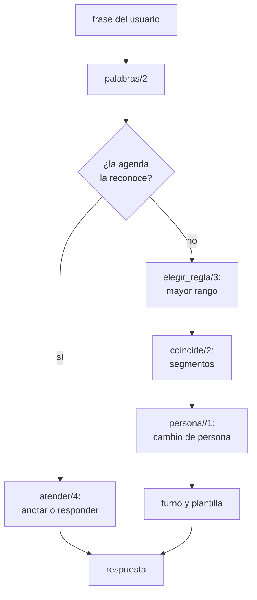

# Capítulo 55 — Proyecto: diálogos por plantillas

Un programa puede sostener una conversación en castellano sin analizar las
frases con una gramática completa: le alcanza con reconocer ciertos patrones
de palabras y responder con una plantilla. «Estoy cansada» sigue el patrón
«… estoy X», y la respuesta «¿Por qué estás X?» repite el segmento X. Así
funcionaba ELIZA, el programa de Joseph Weizenbaum (1966) que conversaba
como un psicoterapeuta y que muchos de sus usuarios tomaron por alguien que
los entendía. Este capítulo construye en cinco versiones un programa de ese
tipo: plantillas con segmentos, el cambio de persona (lo que el usuario dice
de sí mismo vuelve en boca del programa: «mi jefe me odia» pasa a «tu jefe
te odia»), una ELIZA con prioridades, turnos y memoria, y una agenda que
anota citas dictadas en castellano y responde preguntas sobre ellas. Dos
programas más aplican la misma idea —el patrón es un término y la
unificación hace el emparejamiento— a otros datos: ANALOGY, que resuelve
analogías geométricas, y un aplicador de guiones al estilo de McSAM, que
completa los pasos que una historia omite.



Una conversación con una versión de ELIZA escrita por Norbert Landsteiner
en 2005, en inglés: empieza con las frases del artículo de Weizenbaum («Men
are all alike», «Well, my boyfriend made me come here») y cada respuesta
devuelve una parte de la frase anterior con la persona cambiada («your
boyfriend made you come here»). Imagen: autor desconocido, dominio público,
vía [Wikimedia Commons](https://commons.wikimedia.org/wiki/File:ELIZA_conversation.png).

El proyecto parte de tres libros. El apartado 2.1, «Template matching», de
*Natural Language Processing for Prolog Programmers* de Michael Covington,
presenta ELIZA como un sistema de plantillas; el ejercicio de proyecto
«ELIZA in Prolog» del apartado 2.2.4 enumera lo que una versión en Prolog
necesita, y el capítulo lo sigue punto por punto: variables que abarcan
varias palabras, el cambio entre primera y segunda persona sin caer en un
ciclo, la palabra más importante como criterio para elegir entre plantillas
y respuestas que varían. Del apartado 11.2, «Advanced Projects», de
*Programming in Prolog* de William Clocksin y Christopher Mellish, se toman
dos enunciados: el proyecto 14, un psiquiatra simulado que responde según
palabras clave, y el 15, un analizador de frases sobre citas en una oficina
que resume quién, qué, dónde y cuándo, las guarda y responde preguntas; es
la agenda de la versión 4. El apartado 14.3, «Artificial Intelligence
Classics: ANALOGY, ELIZA, and McSAM», de *The Art of Prolog* de Leon Sterling
y Ehud Shapiro
([edición de acceso abierto](https://archive.org/details/artofprologadvan00ster)),
reconstruye los tres programas clásicos: de él vienen los pares de estímulo y
respuesta con ranuras, la analogía como una operación que se encuentra y se
aplica con el mismo predicado, y el guion que se activa por una palabra de la
historia y se empareja con ella como una subsucesión; sus ejercicios proponen
corregir el cambio de persona y reescribir McSAM con estructuras, que es lo
que hace este capítulo. Las reglas, los textos y el código son propios, en
castellano.

El capítulo reutiliza las gramáticas del
[capítulo 21](../capitulo-21-gramaticas-dcg/index.md) —de su archivo
`fechas.pl` carga `fecha_valida/3`— y la separación en palabras del
[capítulo 44](../capitulo-44-proyecto-aventura-de-texto/index.md), cuyo
`palabras/2` importa, con su técnica para redactar respuestas con
gramáticas. Cumple así el anuncio del
[capítulo 44](../capitulo-44-proyecto-aventura-de-texto/index.md#temas-que-se-retoman): diálogos en castellano
con plantillas de respuesta. Las cinco versiones del diálogo son módulos que
cargan archivos de otros capítulos, y se ejecutan en una instalación local;
ANALOGY y los guiones corren también en SWISH. Los bucles de conversación
leen de un stream que reciben como argumento, y las pruebas les pasan
cadenas, nunca el teclado.

## Objetivos del capítulo

Al terminar el capítulo, el lector puede:

- escribir patrones con variables que abarcan segmentos de una frase y
  emparejarlos con `append/3`;
- cambiar la persona de una frase en castellano con una gramática de una
  sola pasada que mira el contexto de cada palabra;
- elegir entre varias reglas por prioridad, turnar respuestas y recordar
  frases, con el estado de la conversación en argumentos;
- escribir una gramática de citas con complementos en cualquier orden, y
  otra que redacta las respuestas;
- combinar dos programas de diálogo en un solo bucle que recibe como
  argumento el predicado que responde;
- representar diagramas e historias como términos y resolver con
  unificación analogías y guiones.
- escribir un guion de palabras clave como el DOCTOR de Weizenbaum, con
  rangos, descomposiciones y reensamblados por turnos.

!!! info "Tiempo estimado"
    Leer el capítulo, ejecutar sus ejemplos y hacer las actividades: **1:55 h**.
    Resolver los 5 ejercicios marcados con ★: **1:35 h**.
    Resolver los 13 ejercicios del final: **3:50 h**.

## 55.1 El programa terminado

El programa terminado se carga con `swipl ejemplos/capitulo-55/dialogo.pl` y
se ejecuta con `dialogo.`. Cada frase pasa primero por la agenda y, si no es
una cita ni una pregunta sobre citas, por ELIZA. Así se ve una conversación,
con las frases del usuario después de `> `, tal como la terminal las muestra
al escribirlas. El programa se dirige al usuario en segunda persona, con
«tú»; el texto del curso que lo rodea sigue siendo impersonal:

```text
Hola. Cuéntame qué te preocupa, o dime qué citas tienes.
> Estoy cansada.
¿Por qué estás cansada?
> Mi jefe me dice que trabajo poco.
¿Qué piensas de que tu jefe te diga que trabajas poco?
> Tengo una reunión con Pérez el martes a las 10 en la oficina.
Anotado: el martes a las 10:00, una reunión con Pérez en la oficina.
> Tengo miedo de esa reunión.
¿Qué te asusta de esa reunión?
> Tengo un almuerzo con Ana el martes a las 1 y media de la tarde.
Anotado: el martes a las 13:30, un almuerzo con Ana.
> ¿Qué tengo el martes?
El martes: a las 10:00, una reunión con Pérez en la oficina; a las 13:30, un almuerzo con Ana.
> Creo que eres una computadora.
¿Te preocupan las máquinas?
> Bueno.
Antes dijiste que tu jefe te dice que trabajas poco. ¿Tiene algo que ver con esto?
> ¿Dónde estoy el martes a las 10?
El martes a las 10:00 estás en la oficina.
> Adiós.
Adiós. Gracias por conversar.
```

Cada respuesta sale de una pieza distinta del programa. «trabajo poco» vuelve
como «trabajas poco» por el cambio de persona; «Creo que eres una
computadora» sigue dos patrones, el de «creo que» y el de las máquinas, y
gana el de las máquinas, que tiene más prioridad; «Bueno.» no sigue ningún
patrón, y el programa vuelve sobre una frase anterior que empezaba con «mi».
La prueba `sesion` de `dialogo.plt` compara esta conversación, línea por
línea, con lo que escribe el programa.

| Versión | Archivo | Agrega | Lo que no puede hacer todavía |
|---|---|---|---|
| 1 | `plantillas.pl` | patrones con segmentos y respuestas que los repiten | devuelve «mi trabajo» en lugar de «tu trabajo» |
| 2 | `persona.pl` | el cambio de persona, las tildes recuperadas | la primera regla escrita gana, y responde siempre igual |
| 3 | `eliza.pl` | prioridades, turnos, memoria y el bucle | no guarda lo que se le dice |
| 4 | `agenda.pl` | citas en castellano, preguntas sobre ellas | es un programa aparte |
| 5 | `dialogo.pl` | la agenda y ELIZA en una conversación | — |

El recorrido de una frase por el programa terminado:



Las secciones [55.7](#557-analogy-analogias-geometricas) y
[55.8](#558-guiones-completar-una-historia) presentan ANALOGY y los guiones,
y la [55.9](#559-el-guion-doctor-de-weizenbaum), el guion DOCTOR tal como lo
describe Weizenbaum.

## 55.2 Versión 1: plantillas con segmentos

Las palabras de una frase salen de `palabras/2`, del
[capítulo 44](../capitulo-44-proyecto-aventura-de-texto/lenguaje.md#ordenes-y-respuestas-en-castellano),
que pasa el texto a minúsculas, quita las tildes y separa las palabras; el
módulo la importa con `use_module('../capitulo-44/lenguaje', [palabras/2])`
y no carga nada más en su espacio de nombres. Un patrón es una lista de esas
palabras y de variables. En la unificación, una variable ocupa el lugar de
un solo elemento; aquí cada variable del patrón representa un **segmento**,
una lista de cero o más palabras. `coincide/2` recorre el patrón y, al
encontrar una variable, la liga a un prefijo de lo que queda de la frase con
`append/3`:

<!-- ejemplo: capitulo-55/plantillas.pl predicado: coincide/2 -->
```prolog
%!  coincide(+Patron:list, +Palabras:list(atom)) is nondet.
%
%   Palabras sigue el Patron: cada palabra del patrón aparece en su lugar,
%   y cada variable del patrón queda ligada a la lista de palabras que
%   ocupa su lugar, que puede ser vacía. Las alternativas dan segmentos
%   cada vez más largos a las primeras variables.
coincide([], []).
coincide([E|Es], Palabras) :-
    (   var(E)
    ->  append(E, Resto, Palabras)
    ;   Palabras = [E|Resto]
    ),
    coincide(Es, Resto).
```

```prolog
?- coincide([X, estoy, Y], [hoy, estoy, muy, cansado]).
X = [hoy],
Y = [muy, cansado] ;
false.

?- coincide([X, y, Y], [a, y, b, y, c]).
X = [a],
Y = [b, y, c] ;
X = [a, y, b],
Y = [c] ;
false.
```

El segundo patrón sigue la frase de dos maneras, y el retroceso las da a las
dos: primero los segmentos más cortos para las primeras variables. Es la
«nondeterministic use of `append`» con que Sterling y Shapiro describen su
ELIZA, que representa las ranuras con números y registra con qué palabras se
llena cada una en un diccionario incompleto; con variables de Prolog, el
diccionario es innecesario: la ligadura de cada variable es la entrada. La
ELIZA de Peter Norvig, que Covington cita, llama a estas variables
*segment variables* y las prueba con prefijos cada vez más largos, el mismo
orden en que `append/3` los genera.

Una regla empareja un patrón con una respuesta. La respuesta es una lista de
textos y de las mismas variables, y `rellenar/2` la convierte en un texto:
cada texto tal como está, cada segmento con sus palabras separadas por un
blanco. Las reglas se prueban en el orden en que están escritas, y la última
tiene el patrón `[_]`, que coincide con cualquier frase:

<!-- ejemplo: capitulo-55/plantillas.pl fragmento: regla([_, estoy, X], ["¿Por qué estás ", X, "?"]). .. regla([_], ["Continúa, por favor."]). -->
```prolog
regla([_, estoy, X], ["¿Por qué estás ", X, "?"]).
regla([_, necesito, X], ["¿Qué harías si consiguieras ", X, "?"]).
regla([_, madre, _], ["Háblame más de tu familia."]).
regla([_, padre, _], ["Háblame más de tu familia."]).
regla([_, porque, _], ["¿Es esa la verdadera razón?"]).
regla([_], ["Continúa, por favor."]).
```

<!-- ejemplo: capitulo-55/plantillas.pl predicado: responder/2 -->
```prolog
%!  responder(+Frase:string, -Respuesta:string) is det.
%
%   Respuesta es la respuesta de la primera regla cuyo patrón sigue Frase.
responder(Frase, Respuesta) :-
    palabras(Frase, Palabras),
    once(( regla(Patron, Plantilla),
           coincide(Patron, Palabras) )),
    rellenar(Plantilla, Respuesta).
```

```prolog
?- responder("Hoy estoy muy cansado.", R).
R = "¿Por qué estás muy cansado?".

?- responder("Estoy triste por mi trabajo", R).
R = "¿Por qué estás triste por mi trabajo?".
```

!!! question "Actividad"
    Predecir qué hace `coincide(P, [hola])` con `P` libre, antes de
    ejecutarlo con `call_with_inference_limit(coincide(P, [hola]), 100000,
    R)`. Explicar con las dos cláusulas de `coincide/2` por qué la regla por
    omisión tiene el patrón `[_]` y no una variable sola.

**Lo que falta.** La respuesta repite las palabras del usuario tal como las
dijo: «mi trabajo», dicho por el usuario, vuelve como «mi trabajo», dicho por
el programa.

## 55.3 Versión 2: el cambio de persona

Al devolver una frase, lo que el usuario dice de sí mismo tiene que pasar a
la segunda persona, y lo que dice del programa, a la primera: «yo» pasa a
«tú», «mi» a «tu», «me» a «te», y al revés. En castellano cambian además los
verbos: «estoy» pasa a «estás», «quiero» a «quieres», «eres» a «soy». La
conjugación de un verbo regular sigue una regla: la primera persona del
singular del presente es la raíz seguida de *o*, y la segunda, la raíz
seguida de *as* o de *es* según la clase del verbo. Los verbos que cambian la
vocal de la raíz («quiero», «puedo», «siento») la cambian igual en las dos
personas, así que para esta regla también son regulares si la raíz se
escribe con el cambio. Los que no la siguen son hechos:

<!-- ejemplo: capitulo-55/persona.pl fragmento: verbo(necesit, ar). .. irregular(he, has). -->
```prolog
verbo(necesit, ar).
verbo(odi, ar).
verbo(trabaj, ar).
verbo(estudi, ar).
verbo(llor, ar).
verbo(piens, ar).
verbo(recuerd, ar).
verbo(quier, er).
verbo(pued, er).
verbo(entiend, er).
verbo(cre, er).
verbo(tem, er).
verbo(sient, ir).
verbo(viv, ir).

% irregular(Primera, Segunda): las dos personas de un verbo que no sigue
% la regla de verbo/2.
irregular(soy, eres).
irregular(estoy, estas).
irregular(voy, vas).
irregular(tengo, tienes).
irregular(digo, dices).
irregular(hago, haces).
irregular(he, has).
```

<!-- ejemplo: capitulo-55/persona.pl predicado: conjugada/2 -->
```prolog
%!  conjugada(?Primera:atom, ?Segunda:atom) is nondet.
%
%   Primera y Segunda son la primera y la segunda persona del singular del
%   presente de un mismo verbo, sin tildes.
conjugada(Primera, Segunda) :-
    irregular(Primera, Segunda).
conjugada(Primera, Segunda) :-
    verbo(Raiz, Clase),
    atom_concat(Raiz, o, Primera),
    segunda(Clase, Terminacion),
    atom_concat(Raiz, Terminacion, Segunda).
```

```prolog
?- conjugada(quiero, S).
S = quieres ;
false.

?- conjugada(P, entiendes).
P = entiendo ;
false.
```

`conjugada/2` funciona en los dos sentidos porque `atom_concat/3` separa un
átomo en sus prefijos cuando el primer argumento está ligado por `verbo/2`.
La conjugación completa, con reglas ortográficas, es tema del
[capítulo 53](../capitulo-53-proyecto-morfologia-castellano/index.md); aquí
alcanza con las dos personas del presente.

**Palabra por palabra no alcanza.** `palabra/2` cambia una palabra aislada:
un pronombre o un posesivo según la tabla `cambio/2`, un verbo según
`conjugada/2`. Aplicada a cada palabra con `maplist/3`, como el `alter/2` del
apartado 3.4, «Mapping», de Clocksin y Mellish, al que remite su proyecto 14,
se equivoca con los sustantivos que tienen la forma de un verbo:

```prolog
?- palabra_a_palabra([tengo, miedo, de, mi, trabajo], Q).
Q = [tienes, miedo, de, "tu", trabajas].
```

«trabajo» es aquí un sustantivo, y lo indica la palabra anterior: después de
un determinante («mi», «el», «una») viene un sustantivo. Del mismo modo,
«tu» es el posesivo delante de un sustantivo y el pronombre «tú» delante de
un verbo. Decidir por la palabra vecina es trabajo de una gramática.
`persona//1` recorre la frase una sola vez, con dos reglas de contexto antes
de la regla general:

<!-- ejemplo: capitulo-55/persona.pl predicado: persona//1 tras_tu/1 -->
```prolog
%!  persona(-Cambiadas:list)// is det.
%
%   Las palabras de la lista de entrada, con la persona cambiada en una
%   sola pasada. Cada palabra se cambia una vez: tú no vuelve a pasar a yo.
persona(["yo", Q|Qs]) -->
    [tu, P],
    { tras_tu(P) },
    !,
    { palabra(P, Q) },
    persona(Qs).
persona([Q, N|Qs]) -->
    [D, N],
    { determinante(D) },
    !,
    { palabra(D, Q) },
    persona(Qs).
persona([Q|Qs]) -->
    [P],
    !,
    { palabra(P, Q) },
    persona(Qs).
persona([]) -->
    [].

%!  tras_tu(+P:atom) is semidet.
%
%   Después de P, tu es el pronombre tú: P es me, te, no o un verbo en
%   segunda persona.
tras_tu(me).
tras_tu(te).
tras_tu(no).
tras_tu(P) :-
    conjugada(_, P),
    !.
```

```prolog
?- reflejar([tengo, miedo, de, mi, trabajo], Q).
Q = [tienes, miedo, de, "tu", trabajo].

?- reflejar([tu, no, me, entiendes], Q).
Q = ["yo", no, "te", entiendo].
```

Las palabras cambiadas son cadenas con su forma escrita, «tú» o «estás», con
tilde. Que la pasada sea una sola evita el ciclo contra el que previene
Covington: si las reglas de cambio se aplicaran a la frase hasta que ninguna
coincidiera, «yo» pasaría a «tú», «tú» otra vez a «yo», y la reescritura no
terminaría. En `persona//1` cada palabra se consume una vez y su reemplazo va
a la salida, donde ninguna regla lo vuelve a mirar.

**Las tildes.** `palabras/2` quita las tildes para que «estás» y «estas»
coincidan con el mismo patrón, pero la respuesta tiene que escribirlas.
`escritura/3` busca cada palabra de la respuesta en la frase original y
toma de ahí su forma escrita:

<!-- ejemplo: capitulo-55/persona.pl predicado: escritura/3 -->
```prolog
%!  escritura(+Frase:string, +Palabras:list, -Escritas:list) is det.
%
%   Escritas son las Palabras con la escritura que tienen en Frase, en
%   minúsculas y con sus tildes. Una palabra que no está en Frase, como las
%   que cambian de persona, queda como está.
escritura(Frase, Palabras, Escritas) :-
    string_lower(Frase, Minusculas),
    split_string(Minusculas, " ", " .,;:¿?¡!\"«»()", Partes),
    maplist(escrita_en(Partes), Palabras, Escritas).
```

`responder/2` es el de la versión 1 con un paso más: antes de rellenar la
plantilla, cada segmento pasa por `reflejar/2` y por `escritura/3`:

```prolog
?- responder("Creo que mi jefe no me entiende.", R).
R = "¿Por qué crees que tu jefe no te entiende?".
```

!!! question "Actividad"
    Predecir qué da `reflejar/2` con `[me, dices, que, tu, eres, mi,
    amigo]` y con `[la, odio]`, y comprobarlo. Explicar el segundo
    resultado con la regla del determinante: ¿qué palabra de la lista
    `determinante/1` tiene dos funciones en castellano?

**Lo que falta.** Cuando una frase sigue dos patrones, gana el primero que
está escrito, y cada regla responde siempre lo mismo: una conversación larga
se vuelve repetitiva enseguida.

## 55.4 Versión 3: ELIZA

La versión 3 agrega los tres recursos que distinguen a ELIZA de una tabla de
respuestas. El primero es la **prioridad**. Covington propone elegir la
plantilla que reconoce la palabra más importante de la frase («computer is
more important than mother, which is more important than why»); Sterling y
Shapiro marcan las palabras importantes con un predicado aparte. Aquí cada
regla lleva un identificador, un rango y una lista de respuestas, y
`elegir_regla/3` prueba los rangos de mayor a menor:

<!-- ejemplo: capitulo-55/eliza.pl predicado: elegir_regla/3 -->
```prolog
%!  elegir_regla(+Palabras:list(atom), -Id, -Plantillas:list) is det.
%
%   Id es la regla de mayor rango cuyo patrón siguen Palabras; entre las
%   de igual rango, la primera escrita. Sus variables quedan ligadas a las
%   palabras de la frase en Plantillas.
elegir_regla(Palabras, Id, Plantillas) :-
    aggregate_all(set(R), regla(_, R, _, _), Rangos),
    reverse(Rangos, Descendentes),
    once(( member(Rango, Descendentes),
           regla(Id, Rango, Patron, Plantillas),
           coincide(Patron, Palabras) )).
```

Una regla con cuerpo genera un patrón por cada palabra de una clase: la regla
de las máquinas tiene el patrón `[_, M, _]`, y su cuerpo liga `M` a cada
palabra de `maquina/1` antes de que `coincide/2` pruebe el patrón. El
retroceso recorre la clase sin que el emparejamiento tenga que saber de
clases:

<!-- ejemplo: capitulo-55/eliza.pl fragmento: regla(maquinas, 5, [_, M, _], .. maquina(M). -->
```prolog
regla(maquinas, 5, [_, M, _],
      [ ["¿Te preocupan las máquinas?"],
        ["¿Por qué mencionas las computadoras?"],
        ["¿Qué tienen que ver las máquinas con lo que te pasa?"]
      ]) :-
    maquina(M).
```

```prolog
?- eliza:elegir_regla([mi, hermano, me, dice, que, estoy, loco], Id, _).
Id = me_dice.
```

La frase sigue tres patrones —el de la familia (rango 2), el de «estoy»
(rango 3) y el de «me dice que» (rango 4)— y gana el último.

El segundo recurso son los **turnos**: cada regla tiene varias respuestas y
las usa en orden, una por vez. El tercero es la **memoria**: una frase que
sigue el patrón de `memoria/2` («… mi X») se guarda como una respuesta para
más adelante, y cuando la única regla que coincide es la de rango 0 el
programa usa el recuerdo más antiguo. Weizenbaum lo describe como el
mecanismo que produce, al final de la conversación de su artículo, la
respuesta que vuelve sobre «my boyfriend made me come here».

Los turnos y los recuerdos son el estado de la conversación. En lugar de la
base de datos dinámica, viajan en un argumento: un término
`eliza(Turnos, Recuerdos)`, con los turnos en un árbol AVL de
`library(assoc)`, de la
[sección 22.5](../capitulo-22-estructuras-de-datos-de-la-biblioteca/index.md#225-libraryassoc-y-libraryrbtrees),
que asocia cada regla con la cantidad de veces que se usó:

<!-- ejemplo: capitulo-55/eliza.pl predicado: responder/4 turno/5 -->
```prolog
%!  responder(+Frase:string, +Estado0, -Estado, -Respuesta:string) is det.
%
%   Respuesta es la respuesta a Frase en el estado Estado0, y Estado el
%   estado que queda: el turno de la regla elegida avanza y, si Frase se
%   recuerda, su recuerdo queda al final. Si solo coincide la regla
%   ninguna y hay recuerdos, la respuesta es el primero, que se descarta.
responder(Frase, eliza(Turnos0, Recuerdos0), eliza(Turnos, Recuerdos),
          Respuesta) :-
    palabras(Frase, Palabras),
    elegir_regla(Palabras, Id, Plantillas),
    (   Id == ninguna,
        Recuerdos0 = [Recuerdo|Recuerdos1]
    ->  Respuesta = Recuerdo,
        Turnos = Turnos0
    ;   turno(Id, Plantillas, Turnos0, Turnos, Plantilla),
        texto(Frase, Plantilla, Respuesta),
        Recuerdos1 = Recuerdos0
    ),
    recordar(Frase, Palabras, Recuerdos1, Recuerdos).

%!  turno(+Id, +Plantillas:list, +Turnos0, -Turnos, -Plantilla) is det.
%
%   Plantilla es la plantilla de Plantillas a la que le toca el turno en la
%   regla Id, y Turnos registra que la regla se usó una vez más.
turno(Id, Plantillas, Turnos0, Turnos, Plantilla) :-
    (   get_assoc(Id, Turnos0, Usos)
    ->  true
    ;   Usos = 0
    ),
    length(Plantillas, Cantidad),
    I is Usos mod Cantidad,
    nth0(I, Plantillas, Plantilla),
    Usos1 is Usos + 1,
    put_assoc(Id, Turnos0, Usos1, Turnos).
```

```prolog
?- estado_inicial(E0), responder("Estoy triste", E0, E1, R1), responder("Estoy triste", E1, _, R2).
E0 = eliza(t, []),
E1 = eliza(t(estoy, 1, -, t, t), []),
R1 = "¿Por qué estás triste?",
R2 = "¿Desde cuándo estás triste?".
```

`t` es el árbol vacío, y `t(estoy, 1, -, t, t)` un árbol con la clave
`estoy` asociada a 1. Como el estado es un valor, una prueba puede repetir
una conversación desde cualquier punto sin preparar ni limpiar nada.

**El bucle.** `conversar/3` lee una línea, la responde y sigue, hasta una
despedida o el fin de la entrada. Recibe el stream y también el predicado que
responde, que llama con `call/5`; su declaración `meta_predicate` hace que el
nombre se resuelva en el módulo de quien llama, y así la versión 5 lo usa con
otro predicado:

<!-- ejemplo: capitulo-55/eliza.pl predicado: conversar/3 -->
```prolog
%!  conversar(+In, :Responder, +Estado0) is det.
%
%   Lee frases de In, una por línea, y escribe la respuesta que da
%   call(Responder, Frase, Estado0, Estado, Respuesta), hasta que la frase
%   es una despedida o In se termina.
conversar(In, Responder, Estado0) :-
    format("> "),
    read_line_to_string(In, Linea),
    (   (   Linea == end_of_file
        ;   despedida(Linea)
        )
    ->  format("Adiós. Gracias por conversar.~n")
    ;   call(Responder, Linea, Estado0, Estado, Respuesta),
        format("~w~n", [Respuesta]),
        conversar(In, Responder, Estado)
    ).
```

!!! question "Actividad"
    Predecir las tres respuestas de ELIZA, desde el estado inicial, a «Mi
    novio me trajo aquí.», «Bueno.» y «Nada.». Comprobarlo con
    `responder/4`, y explicar por qué la tercera no es «Continúa, por
    favor.», que es la primera respuesta de la regla `ninguna`.

**Lo que falta.** ELIZA no guarda nada de lo que se le dice, salvo para
repetirlo. Una agenda tiene que entender la frase lo bastante para
guardar sus datos y responder preguntas sobre ellos.

## 55.5 Versión 4: una agenda en castellano

El proyecto 15 de Clocksin y Mellish pide analizar frases sobre citas en una
oficina, resumirlas en quién, qué, dónde y cuándo, guardar el resumen y
responder preguntas. La versión 4 lo hace en castellano: una gramática sobre
las palabras reconoce una cita, con los complementos en cualquier orden, y
tres preguntas; `atender/4` aplica el acto a una agenda que entra y sale por
argumentos, y redacta la respuesta con otra gramática. Falla si la frase no
es de la agenda, y la versión 5 depende de esa falla:

<!-- ejemplo: capitulo-55/agenda.pl predicado: atender/4 -->
```prolog
%!  atender(+Frase:string, +Agenda0:list, -Agenda:list,
%!          -Respuesta:string) is semidet.
%
%   Frase es una frase de la agenda: Agenda es Agenda0 con la cita anotada
%   al final,
%   o Agenda0 si la frase pregunta o la cita choca con otra, y Respuesta es
%   la respuesta. Falla si Frase no es una frase de la agenda.
atender(Frase, Agenda0, Agenda, Respuesta) :-
    palabras(Frase, Palabras),
    once(phrase(acto(Acto), Palabras)),
    efecto(Acto, Frase, Agenda0, Agenda, Resultado),
    phrase(oracion(Resultado), Codigos),
    string_codes(Respuesta, Codigos).
```

```prolog
?- atender("Tengo una reunión con Pérez el martes a las 10", [], A, R).
A = [cita(dia(martes), hora(10, 0), nombre(una, "reunión"), nombre(ninguno, "Pérez"), ninguno)],
R = "Anotado: el martes a las 10:00, una reunión con Pérez.".
```

La página [Una agenda en castellano](agenda.md#una-agenda-en-castellano)
desarrolla la versión entera: la gramática de las citas, los días y las
horas, las fechas validadas con `fecha_valida/3` del
[capítulo 21](../capitulo-21-gramaticas-dcg/index.md) y la redacción de las
respuestas, con una actividad.

**Lo que falta.** La agenda y ELIZA son dos programas: con la agenda, una
frase que no es una cita queda sin respuesta; con ELIZA, una cita recibe una
respuesta de terapeuta.

## 55.6 Versión 5: la agenda y ELIZA en una conversación

La gramática de la agenda es la plantilla más específica que tiene el
programa: si reconoce la frase, la agenda responde; si no, responde ELIZA. El
estado de la conversación reúne los dos estados, y el bucle es `conversar/3`
de la versión 3, con otro predicado para responder:

<!-- ejemplo: capitulo-55/dialogo.pl predicado: responder/4 -->
```prolog
%!  responder(+Frase:string, +Estado0, -Estado, -Respuesta:string) is det.
%
%   Respuesta es la respuesta de la agenda a Frase, si la agenda la
%   reconoce, o la de ELIZA si no; Estado es el estado que queda.
responder(Frase, dialogo(Eliza0, Agenda0), dialogo(Eliza, Agenda),
          Respuesta) :-
    (   atender(Frase, Agenda0, Agenda1, Respuesta0)
    ->  Eliza = Eliza0,
        Agenda = Agenda1,
        Respuesta = Respuesta0
    ;   Agenda = Agenda0,
        responder_eliza(Frase, Eliza0, Eliza, Respuesta)
    ).
```

`dialogo.pl` importa el `responder/4` de ELIZA con otro nombre,
`use_module(eliza, [responder/4 as responder_eliza, …])`, porque define el
suyo. «Tengo miedo de esa reunión» empieza como una cita, pero la gramática
no la reconoce, y la frase pasa a ELIZA; «Tengo un examen el lunes a las 9»
va a la agenda. La prueba `agenda_o_eliza` verifica los dos casos.

## 55.7 ANALOGY: analogías geométricas

El programa ANALOGY, de Thomas Evans (1963), resolvía los problemas de los
tests de inteligencia que muestran tres diagramas A, B y C, y preguntan cuál
de varias respuestas es a C lo que B es a A. La reconstrucción de Sterling y
Shapiro representa cada diagrama como un término, `inside(square,
triangle)`, y usa el mismo predicado dos veces: con A y B encuentra la
operación que convierte uno en el otro, y con la operación y C construye la
respuesta. Es la plantilla de las versiones anteriores sobre otros datos: el
diagrama es el patrón, y la unificación lo empareja.

`analogia.pl` generaliza esa reconstrucción: seis operaciones en lugar de una
y sucesiones de operaciones en lugar de una sola, buscadas de la más corta a
la más larga:

<!-- ejemplo: capitulo-55/analogia.pl predicado: analogia/3 -->
```prolog
%!  analogia(+Par1, +Par2, +Respuestas:list) is semidet.
%
%   Par1 es A es_a B y Par2 es C es_a X: X es la respuesta de Respuestas a
%   la que la sucesión más corta de operaciones que convierte A en B, de
%   hasta tres, convierte C. Entre las sucesiones de igual largo, la
%   primera que se encuentra.
analogia(A es_a B, C es_a X, Respuestas) :-
    analogia(A es_a B, C es_a X, Respuestas, _).
```

```prolog
?- analogia(dentro(cuadrado, triangulo) es_a encima(triangulo, cuadrado), dentro(circulo, rombo) es_a X, [encima(circulo, rombo), dentro(rombo, circulo), encima(rombo, circulo)], Ops).
X = encima(rombo, circulo),
Ops = [invertir, relacion(encima)].
```

La página [ANALOGY](analogia.md#analogy-analogias-geometricas) desarrolla el
programa, con una actividad.

## 55.8 Guiones: completar una historia

«Juan fue a Leones, comió una hamburguesa y se fue.» Quien lee la historia
entiende que Juan fue a un restaurante, se sentó, pidió, le trajeron la
comida y pagó, aunque nada de eso está escrito: conoce el guion de un
restaurante. SAM, el aplicador de guiones de Roger Schank y su grupo de Yale,
y su versión para la enseñanza, McSAM, hacían esa inferencia: la historia se
empareja con un guion, en orden, y los pasos que la historia omite se
completan con los del guion. `guiones.pl` es la versión de Sterling y
Shapiro con estructuras en lugar de listas, como propone uno de sus
ejercicios, y con una gramática que cuenta la historia entendida:

<!-- ejemplo: capitulo-55/guiones.pl predicado: contar/2 -->
```prolog
%!  contar(+Sucesos:list, -Texto:string) is det.
%
%   Texto cuenta los Sucesos en castellano, una oración por suceso.
contar(Sucesos, Texto) :-
    phrase(oraciones(Sucesos), Codigos),
    string_codes(Texto, Codigos).
```

```prolog
?- historia(leones, H), entender(H, Guion, E), contar(E, T).
H = [ir(juan, casa, leones), comer(juan, hamburguesa), ir(juan, leones, otro_lugar)],
Guion = restaurante,
E = [ir(juan, casa, leones), sentarse(juan, mesa), pedir(juan, hamburguesa, mozo), traer(mozo, hamburguesa, juan), comer(juan, hamburguesa), pagar(juan, cuenta, mozo), ir(juan, leones, otro_lugar)],
T = "Juan fue de su casa a Leones. Juan se sentó a una mesa. Juan le pidió una hamburguesa al mozo. El mozo le trajo una hamburguesa a Juan. Juan comió una hamburguesa. Juan le pagó la cuenta al mozo. Juan fue de Leones a otro lugar." ;
false.
```

La página [Guiones](guiones.md#guiones-completar-una-historia) desarrolla el
programa.

## 55.9 El guion DOCTOR de Weizenbaum

La ELIZA de la versión 3 toma de Weizenbaum el rango, los turnos y la
memoria, pero no su manera de escribir las reglas. En el artículo de 1966,
ELIZA es un intérprete y DOCTOR es el **guion** que interpreta: una tabla
de palabras clave en la que cada clave tiene un rango y una lista de
**reglas de descomposición**, y cada regla de descomposición, una lista de
**reglas de reensamblado**. La descomposición `(0 YOU 0 ME)` reparte la
frase en cuatro partes —cualquier cantidad de palabras, «you», cualquier
cantidad, «me»—, y el reensamblado `(WHAT MAKES YOU THINK I 3 YOU)` arma la
respuesta con la tercera parte. Un número `n` distinto de cero en una
descomposición abarca exactamente `n` palabras. `doctor.pl` reconstruye ese
mecanismo con un guion propio en castellano, más chico que el original.

**El recorrido de la frase.** Weizenbaum recorre la frase una sola vez, de
izquierda a derecha. Cada palabra se sustituye según una tabla —el cambio
de persona: «mi» pasa a «tu», «estoy» a «estás»—, y cada palabra clave
entra en la **pila de claves**: arriba, si su rango supera al de la clave
que está arriba; abajo, si no. Al terminar, la clave de mayor rango está
arriba, y las reglas se escriben sobre el texto ya sustituido:

<!-- ejemplo: capitulo-55/doctor.pl predicado: explorar/3 explorar_palabra/4 -->
```prolog
%!  explorar(+Palabras:list(atom), -Texto:list, -Pila:list(atom)) is det.
%
%   Texto son las Palabras sustituidas y Pila las palabras clave de
%   Palabras, con la de mayor rango arriba.
explorar(Palabras, Texto, Pila) :-
    foldl(explorar_palabra, Palabras, Texto, [], Pila).

%!  explorar_palabra(+P:atom, -Q, +Pila0:list, -Pila:list) is det.
%
%   Q es P sustituida, y Pila es Pila0 con P arriba si P es una clave de
%   rango mayor que la de arriba, abajo si es una clave de rango menor o
%   igual, o sin cambios si P no es una clave.
explorar_palabra(P, Q, Pila0, Pila) :-
    (   sustituye(P, Q0)
    ->  Q = Q0
    ;   Q = P
    ),
    (   clave(P, Rango, _)
    ->  (   Pila0 = [Arriba|_],
            clave(Arriba, RangoArriba, _),
            Rango =< RangoArriba
        ->  append(Pila0, [P], Pila)
        ;   Pila = [P|Pila0]
        )
    ;   Pila = Pila0
    ).
```

```prolog
?- explorar([mi, padre, siempre, dice, que, eres, una, computadora], T, P).
T = ["tu", padre, siempre, dice, que, "soy", una, computadora],
P = [computadora, mi, siempre].
```

«mi» entra primero; «siempre», de rango 1, va abajo de «mi», de rango 2;
«computadora», de rango 50, va arriba. La palabra clave se reconoce por su
forma original y sus reglas miran la sustituida: la clave `mi` tiene reglas
que buscan `"tu"`.

**El guion.** Cada clave es un hecho `clave(Palabra, Rango, Reglas)`. Una
regla es `Descomposicion - Reensamblados`, o `ir_a(Clave)`, que usa las
reglas de otra clave —en DOCTOR, `(ALIKE 10 (=DIT))`: «iguales» y
«pareces» comparten las reglas de `parecido`, y también sus turnos—. En una
descomposición, `0` abarca cualquier cantidad de palabras, un entero `N`
exactamente `N`, `clase(C)` una palabra de la clase `C` —la marca `/FAMILY`
de DOCTOR— y `alguna(Ps)` una de las palabras de `Ps`. En un reensamblado,
cada número repite la parte de ese número:

<!-- ejemplo: capitulo-55/doctor.pl fragmento: clave(mi, 2, .. ["¿Por qué dices tu ", 3, "?"] ] ]). -->
```prolog
clave(mi, 2,
      [ [0, "tu", 0, clase(familia), 0]
        - [ ["Háblame más de tu familia."],
            ["¿Quién más en tu familia ", 5, "?"],
            ["Tu ", 4, "."],
            ["¿Qué más se te ocurre cuando piensas en tu ", 4, "?"] ],
        [0, "tu", 0]
        - [ ["Tu ", 3, "."],
            ["¿Por qué dices tu ", 3, "?"] ] ]).
```

<!-- ejemplo: capitulo-55/doctor.pl predicado: parte/4 -->
```prolog
%!  parte(+Elemento, +Texto:list, -Parte:list, -Resto:list) is nondet.
%
%   Parte es el comienzo de Texto que corresponde a Elemento, y Resto lo
%   que queda.
parte(0, Texto, Parte, Resto) :-
    !,
    append(Parte, Resto, Texto).
parte(N, Texto, Parte, Resto) :-
    integer(N),
    !,
    length(Parte, N),
    append(Parte, Resto, Texto).
parte(clase(C), [P|Resto], [P], Resto) :-
    !,
    etiqueta(P, C).
parte(alguna(Ps), [P|Resto], [P], Resto) :-
    !,
    memberchk(P, Ps).
parte(P, [P|Resto], [P], Resto).
```

```prolog
?- descomponer([0, "tu", 0, clase(familia), 0], ["tu", madre, "te", cuida], Ps).
Ps = [[], ["tu"], [], [madre], ["te", cuida]].
```

`descomponer/3` toma el primer reparto que encuentra, con las partes `0`
lo más cortas posible. `transformar/6` prueba las descomposiciones de la
clave en orden y, con la primera que coincide, toma el reensamblado al que
le toca el turno en esa regla. Dos reensamblados especiales cambian el
camino: `ir_a(Clave)` pasa a las reglas de otra clave, y `nueva_clave`
—`(NEWKEY)` en DOCTOR— abandona la clave y deja la frase a la siguiente de
la pila. La clave `porque` responde «¿Es esa la verdadera razón?» la
primera vez, y la segunda cede la frase:

<!-- ejemplo: capitulo-55/doctor.pl predicado: transformar/6 -->
```prolog
%!  transformar(+Reglas:list, +K, +Texto:list, +T0, -T, -Resultado)
%!      is semidet.
%
%   Resultado es Reensamblado-Partes, con Reensamblado el que le toca a la
%   primera regla de descomposición que coincide con Texto y Partes la
%   descomposición, o nueva_clave. ir_a(Clave) sigue con las reglas de
%   Clave. Falla si ninguna regla coincide.
transformar([Regla|Reglas], K, Texto, T0, T, Resultado) :-
    (   Regla = ir_a(K2)
    ->  clave(K2, _, Reglas2),
        transformar(Reglas2, K2, Texto, T0, T, Resultado)
    ;   Regla = Descomposicion-Reensamblados,
        descomponer(Descomposicion, Texto, Partes)
    ->  turno(K-Descomposicion, Reensamblados, T0, T1, R),
        (   R = ir_a(K2)
        ->  clave(K2, _, Reglas2),
            transformar(Reglas2, K2, Texto, T1, T, Resultado)
        ;   R == nueva_clave
        ->  T = T1,
            Resultado = nueva_clave
        ;   T = T1,
            Resultado = R-Partes
        )
    ;   transformar(Reglas, K, Texto, T0, T, Resultado)
    ).
```

**La memoria.** En DOCTOR, la clave `MY` tiene además cuatro
transformaciones de memoria: cuando es la clave principal de una frase, la
frase se reensambla con una de ellas y se guarda; cuando una frase no tiene
ninguna clave, la respuesta es el recuerdo más antiguo. Weizenbaum elige la
transformación con una función de dispersión sobre la última palabra;
`recordar_frase/5` usa el largo de esa palabra, módulo cuatro. Sin claves
ni recuerdos, responde la clave `ninguna`, el `NONE` de DOCTOR.

La conversación del artículo, en castellano, con `doctor/0`:

```text
¿Cómo estás? Cuéntame tu problema.
> Los hombres son todos iguales.
¿En qué sentido?
> Siempre nos molestan con algo.
¿Puedes pensar en un ejemplo concreto?
> Bueno, mi novio me hizo venir aquí.
Tu novio te hizo venir aquí.
> Dice que estoy deprimida la mayor parte del tiempo.
Lamento oír que estás deprimida.
> Es verdad. Soy infeliz.
¿Crees que venir aquí te ayudará a no ser infeliz?
> Necesito un poco de ayuda.
¿Qué significaría para ti conseguir un poco de ayuda?
> Quizás podría llevarme bien con mi madre.
Háblame más de tu familia.
> Mi madre me cuida.
¿Quién más en tu familia te cuida?
> Mi padre.
Tu padre.
> Te pareces a mi padre en algunas cosas.
¿Qué parecido ves?
> Bueno.
Hablemos más de por qué tu novio te hizo venir aquí.
```

«Mi madre me cuida» y «Mi padre» usan la misma descomposición, `(0 tu 0
(/familia) 0)`, y reciben sus reensamblados segundo y tercero; «Te pareces»
toma el segundo turno de `parecido`, que «iguales» ya usó; «Bueno.» no
tiene claves, y la respuesta sale de la memoria. La prueba `conversacion`
de `doctor.plt` compara las respuestas una por una.

| | Versión 3, `eliza.pl` | `doctor.pl` |
|---|---|---|
| patrón | variables de Prolog | `0`, `N`, `clase/1`, `alguna/1` y números en el reensamblado |
| elección | la regla de mayor rango que coincide | la pila de claves, en una sola pasada |
| cambio de persona | `persona//1`, con contexto | `sustituye/2`, palabra por palabra, en el recorrido |
| redirección | — | `ir_a/1` y `nueva_clave` |

!!! success "Criterios de calidad"
    | Criterio | En este capítulo |
    |---|---|
    | C1 | cada predicado declara modos y determinación; `responder/2`, `responder/4`, `reflejar/2` y las gramáticas de respuesta son `det`, `atender/4` es `semidet` porque falla con una frase que no es de la agenda, y `coincide/2` y `entender/3` son `nondet` |
    | C4 | las reglas de contexto de `persona//1` y la elección de regla cortan después de decidir, y las pruebas, que fallan si queda una alternativa pendiente, lo confirman |
    | C6 | ningún programa usa la base de datos dinámica: el estado de ELIZA y la agenda viajan en argumentos, y la lectura y la escritura están solo en `conversar/3`, que recibe el stream como argumento |
    | C7 | 136 pruebas en ocho archivos, y 46 más en las soluciones: los patrones con todas sus respuestas, el cambio de persona en los dos sentidos, la prioridad, los turnos y la memoria, cada forma de día y de hora, y dos conversaciones enteras leídas de una cadena |

## Ejercicios

Las soluciones están en [la página de soluciones](soluciones.md). La dificultad
va de 1 (se resuelve consultando el capítulo) a 3 (requiere elaboración propia).
Los marcados con ★ son los que no conviene saltear: cubren lo que el capítulo
tiene de propio. Los ejercicios extienden los programas: cada solución es un
archivo que carga los del capítulo, sin modificarlos.

1. ★ **(1)** Predecir la respuesta de `dialogo.pl`, desde el estado inicial,
   a cada frase de esta secuencia, y comprobarlo: «Tú no me entiendes» ·
   «Necesito unas vacaciones» · «Tengo una cena con Luis el viernes a las 9
   de la noche» · «Mi hermana dice que exagero» · «Estoy harta» · «¿Cuándo
   veo a Luis?» · «Sí».
2. **(1)** Escribir el encabezado PlDoc de `coincide/2` con todos sus modos
   útiles y su determinación. ¿Por qué el primer argumento tiene que llegar
   instanciado como una lista completa? Relacionarlo con la primera
   actividad.
3. ★ **(2)** Agregar a ELIZA, en un archivo aparte y con cláusulas
   `eliza:regla(…)`, una regla para «no puedo X» («¿Qué te impide X?») y una
   de rango 4 para la palabra «siempre» («¿Puedes pensar en un ejemplo
   concreto?»). Comprobar que «Siempre estoy cansado» elige la segunda
   aunque la regla de «estoy» esté escrita antes.
4. ★ **(2)** Después de una preposición, «mí» es un pronombre y pasa a
   «ti»: «para mí es difícil» debe volver como «para ti es difícil».
   Escribir `reflejar_prep/2`, una variante de `reflejar/2` que lo hace
   después de «para», «por», «sin» y «a», y explicar por qué la regla no se
   puede aplicar después de «de».
5. **(1)** Escribir `verbo_regular/1` para declarar los verbos regulares por
   su infinitivo (`verbo_regular(caminar)`), y `conjugada_inf/2`, que los
   conjuga como `conjugada/2` a partir del infinitivo.
6. ★ **(2)** Agregar a la agenda la orden «cancela la reunión del martes»,
   que borra las citas de esa actividad ese día y responde «Cancelado: …»,
   o «No tienes nada de eso anotado el martes.». Escribir
   `atender_con_cancelar/4`, que prueba la cancelación y después
   `atender/4`.
7. **(2)** Agregar a la agenda la pregunta «¿cuándo tengo la reunión?», que
   responde con el día y la hora de cada cita de esa actividad.
8. **(2)** Escribir `guardar_agenda(+Archivo, +Agenda)` y
   `cargar_agenda(+Archivo, -Agenda)`, que escriben las citas como hechos y
   las leen con `read_term/3`, rechazando con un error de dominio un término
   que no es una cita.
9. **(3)** Extender ANALOGY a diagramas anidados, como
   `dentro(circulo, encima(cuadrado, triangulo))`: una operación
   `en_exterior(Op)` aplica la operación `Op` a la segunda parte de una
   relación. Resolver con ella un problema en el que A es
   `dentro(circulo, encima(cuadrado, triangulo))` y B es
   `dentro(circulo, encima(triangulo, cuadrado))`.
10. **(2)** Agregar un guion para una consulta médica (llegar, esperar,
    pasar al consultorio, ser revisado, recibir una receta, irse), con sus
    palabras que lo activan y sus oraciones, y una historia que lo use.
11. ★ **(3)** Escribir una gramática que lea una historia en castellano,
    como «Juan fue a Leones, comió una hamburguesa y se fue.», y dé la lista
    de sucesos de `entender/3`, con variables donde el texto no dice nada: el
    sujeto que falta es el de la oración anterior. Encadenar la gramática,
    `entender/3` y `contar/2` en `comprender(+Texto, -Relato)`.
12. **(2)** Escribir un `responder/4` que pase cada frase primero a la
    aventura del [capítulo 44](../capitulo-44-proyecto-aventura-de-texto/index.md)
    —`entender/2` y `responder/2` de `lenguaje.pl`— y, si no es una orden
    del juego, a ELIZA, y probarlo con `conversar/3`.
13. **(2)** Agregar al guion DOCTOR, en un archivo aparte, la clave
    «recuerdo», de rango 5, que se sustituye por «recuerdas», con la regla
    `(0 recuerdas 0)` y dos reensamblados. Explicar por qué «Recuerdo mi
    barrio.» no deja un recuerdo en la memoria.

## Resumen

| | |
|---|---|
| **plantilla** | un patrón con variables de segmento y una respuesta con las mismas variables; `append/3` reparte la frase entre los segmentos |
| **cambio de persona** | pronombres, posesivos y verbos en una sola pasada; el contexto (determinante, pronombre ante verbo) lo decide una gramática, y la pasada única evita el ciclo yo–tú–yo |
| **forma escrita** | las palabras se comparan sin tildes y se devuelven con la escritura que tenían en la frase |
| **prioridad** | cada regla tiene un rango; gana la de mayor rango que coincide, y a igual rango la primera escrita |
| **turnos y memoria** | respuestas que se alternan y frases guardadas para volver sobre ellas, en un estado que viaja en argumentos |
| **bucle con el responder como argumento** | `conversar/3` con `meta_predicate`: el mismo bucle para ELIZA y para el diálogo completo |
| **agenda** | complementos en cualquier orden, días, fechas y horas; una lista de citas; respuestas redactadas con una gramática |
| **analogía** | diagramas como términos; la misma relación encuentra la operación y la aplica; la sucesión más corta primero |
| **guion DOCTOR** | claves con rango en una pila, descomposiciones con `0` y `N`, reensamblados por turnos, `ir_a/1`, `nueva_clave` y la memoria |
| **guion** | una historia emparejada en orden con un guion activado por una palabra; los papeles no nombrados toman su valor por omisión |
| `plantillas.pl`, `persona.pl`, `eliza.pl` | las plantillas, el cambio de persona y ELIZA |
| `agenda.pl`, `dialogo.pl` | la agenda y el programa terminado |
| `doctor.pl` | el guion DOCTOR de Weizenbaum |
| `analogia.pl`, `guiones.pl` | ANALOGY y los guiones; corren en SWISH |

## Temas que se retoman

| Tema | Se retoma en |
|---|---|
| Órdenes en castellano traducidas a operaciones con archivos y procesos | [capítulo 56](../capitulo-56-proyecto-ordenes-castellano/index.md) |
| Reglas de condición y acción sobre una base de datos | [capítulo 60](../capitulo-60-proyecto-interprete-dirigido-patrones/index.md) |
| Preguntas en castellano sobre una base de datos, traducidas a formas lógicas | [capítulo 87](../capitulo-87-proyecto-preguntas-en-castellano/index.md) |

## Referencias

- Michael A. Covington, *Natural Language Processing for Prolog
  Programmers*, Prentice Hall, 1994 — apartado 2.1, «Template matching», y
  el ejercicio de proyecto «ELIZA in Prolog» del apartado 2.2.4.
  [Edición en línea](https://www.covingtoninnovations.com/books/NLPPP.pdf).
  El capítulo toma la presentación de ELIZA como un sistema de plantillas y
  los requisitos que el ejercicio enumera: variables de varias palabras, el
  cambio de persona sin ciclos, la palabra más importante como criterio de
  elección y respuestas que varían.
- William F. Clocksin y Christopher S. Mellish, *Programming in Prolog*,
  5.ª edición, Springer, 2003 — apartado 11.2, «Advanced Projects»,
  proyectos 14 y 15, y apartado 3.4, «Mapping», al que remite el proyecto
  14. El capítulo toma dos enunciados: el psiquiatra simulado que responde
  según palabras clave y el analizador de frases sobre citas de oficina,
  que es la agenda de la versión 4. Del apartado 3.4 toma el cambio de una
  frase palabra por palabra con una tabla de reemplazos, que
  `palabra_a_palabra/2` reproduce para mostrar su límite; el libro no tiene
  edición legal en línea.
- Leon Sterling y Ehud Shapiro, *The Art of Prolog: Advanced Programming
  Techniques*, 2.ª edición, MIT Press, 1994 — apartado 14.3, «Artificial
  Intelligence Classics: ANALOGY, ELIZA, and McSAM».
  [Edición en línea](https://archive.org/details/artofprologadvan00ster).
  El capítulo toma los pares de estímulo y respuesta con ranuras, la
  analogía como una operación que se encuentra y se aplica con el mismo
  predicado, el guion que se activa por una palabra y se empareja como una
  subsucesión, y los ejercicios que proponen corregir el cambio de persona
  y reescribir McSAM con estructuras; los programas de Thomas Evans y del
  grupo de Roger Schank se conocen a través de esta reconstrucción.
- Joseph Weizenbaum, «ELIZA—a computer program for the study of natural
  language communication between man and machine», *Communications of the
  ACM* 9 (1), 1966, pp. 36–45.
  [Edición en línea](https://doi.org/10.1145/365153.365168). Es la fuente
  que citan Covington y Sterling y Shapiro. El capítulo toma de este
  artículo la memoria de ELIZA y el ejemplo de conversación en que la usa,
  y, en la [sección 55.9](#559-el-guion-doctor-de-weizenbaum), el guion
  DOCTOR: la sustitución en el recorrido, la pila de claves por rango, las
  descomposiciones con `0` y `n`, los reensamblados por turnos, `=` y
  `NEWKEY`, y las transformaciones de memoria de la clave `MY`.
- Peter Norvig, *Paradigms of Artificial Intelligence Programming: Case
  Studies in Common Lisp*, Morgan Kaufmann, 1992 — el capítulo «ELIZA:
  Dialog with a Machine».
  [Edición en línea](https://github.com/norvig/paip-lisp/blob/main/docs/chapter5.md).
  Covington lo cita como la descripción de una ELIZA programada; de él
  viene la variable de segmento, que abarca una sucesión de palabras y se
  prueba con prefijos cada vez más largos, la misma estrategia que
  `coincide/2` obtiene de `append/3`.
- Thomas G. Evans, «A Program for the Solution of Geometric-Analogy
  Intelligence Test Questions», en Marvin Minsky (ed.), *Semantic
  Information Processing*, MIT Press, 1968. Es la descripción de ANALOGY
  que cita *The Art of Prolog*; el capítulo conoce el programa a través de
  esa reconstrucción.
- Roger C. Schank y Christopher K. Riesbeck (eds.), *Inside Computer
  Understanding: Five Programs Plus Miniatures*, Lawrence Erlbaum, 1981, y
  Roger C. Schank y Robert P. Abelson, *Scripts, Plans, Goals, and
  Understanding*, Lawrence Erlbaum, 1977. Son las fuentes de SAM, McSAM y
  la dependencia conceptual que cita *The Art of Prolog*; de ellas vienen
  el guion como sucesión de sucesos con papeles y los nombres `ptrans` e
  `ingest` que usa la página [Guiones](guiones.md#guiones-completar-una-historia).

El código del capítulo es propio, escrito para el curso: las reglas, los
textos en castellano y los programas son nuevos, y de las fuentes se toman
ideas, enunciados y representaciones, no código.
