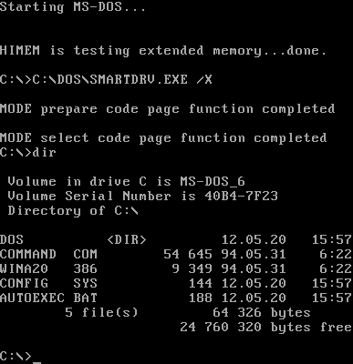
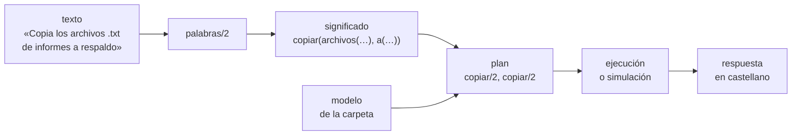

# Capítulo 56 — Proyecto: órdenes en castellano

Un programa que recibe pedidos en castellano —«copia los archivos .txt de
informes a la carpeta respaldo», «¿cuánto ocupa notas.txt?»— y los cumple
sobre los archivos de una carpeta traduce una lengua natural a un lenguaje
formal mucho más pobre: el de las operaciones con archivos. Esa pobreza es
lo que hace el problema abordable. Quien escribe sabe que el programa
administra archivos, y se limita a pedir lo que un administrador de
archivos puede hacer; el programa necesita cubrir una parte muy pequeña del
castellano, pero tiene que cubrirla con precisión, porque una orden mal
entendida puede borrar lo que no correspondía. Este capítulo construye ese
programa en cinco versiones: un reconocedor por plantillas, una gramática
con concordancia, un planificador puro que convierte el significado en una
lista de acciones sobre un modelo de la carpeta, la ejecución de ese plan
con los predicados de archivos de SWI-Prolog, y el programa terminado, que
conversa en la terminal, pide confirmación antes de borrar, tiene un modo
de simulación y nunca sale de la carpeta de trabajo que recibe.

El proyecto parte de dos libros. El apartado 2.2, «DOS Commands in
English», de *Natural Language Processing for Prolog Programmers* de
Michael Covington, construye un sistema de plantillas que traduce órdenes
en inglés a comandos de MS-DOS: reglas de simplificación que descartan
palabras y unifican sinónimos, reglas de traducción que relacionan la frase
entera con un comando, y la observación de que el éxito de un programa así
depende de lo que el lenguaje de destino puede hacer, no solo de cuánto
inglés entiende; sus ejercicios proponen mostrar el comando antes de
ejecutarlo y guardar en un archivo las frases no reconocidas. La versión 1
sigue ese diseño; las versiones siguientes lo reemplazan por una gramática
y un planificador. Del apartado 11.2, «Advanced Projects», de *Programming
in Prolog* de William Clocksin y Christopher Mellish, se toma el enunciado
del proyecto 16: una interfaz en lengua natural al sistema de archivos que
responde preguntas sobre sus propiedades, como las fechas, los dueños y los
archivos compartidos. Las reglas, las gramáticas y el código son propios, en
castellano.



El lenguaje de destino del sistema de Covington: la orden `dir` de MS-DOS
lista los archivos de una unidad, con su tamaño y la fecha de su última
modificación. Cada orden de ese lenguaje hace una sola cosa y no admite
variantes de redacción; el sistema de plantillas traduce a él frases como
«What files are on disk A?». Imagen: Przemub, dominio público, vía
[Wikimedia Commons](https://commons.wikimedia.org/wiki/File:Ms-dosdir.png).

El capítulo reutiliza, cargándolos, la gramática del castellano del
[capítulo 54](../capitulo-54-proyecto-traduccion-castellanoingles/index.md)
—sus artículos con género y número, su regla del plural y las formas
singular y plural de los verbos—, la ejecución de procesos del
[capítulo 28](../capitulo-28-programas-de-linea-de-comandos/index.md#286-procesos-externos)
y, en las soluciones, las fechas del
[capítulo 21](../capitulo-21-gramaticas-dcg/index.md). Cumple así el
anuncio de los capítulos
[44](../capitulo-44-proyecto-aventura-de-texto/index.md#temas-que-se-retoman),
[54](../capitulo-54-proyecto-traduccion-castellanoingles/index.md#temas-que-se-retoman)
y [55](../capitulo-55-proyecto-dialogos-plantillas/index.md#temas-que-se-retoman):
órdenes en castellano traducidas a operaciones con archivos y procesos. La
versión 1 y el planificador corren también en SWISH; el resto lee y escribe
archivos o carga otros archivos, y se ejecuta en una instalación local.

## Objetivos del capítulo

Al terminar el capítulo, el lector puede:

- escribir un reconocedor por plantillas con reglas de simplificación y
  reconocer lo que la simplificación pierde;
- escribir una gramática de órdenes que produce un significado, reutiliza
  la concordancia de otra gramática y genera ejemplos de órdenes;
- separar el significado de una orden, el plan que la cumple y la
  ejecución del plan, con el planificador como un predicado puro sobre un
  modelo;
- restringir un programa a una carpeta de trabajo, con una verificación
  antes de planificar y otra antes de tocar el disco;
- copiar, mover, borrar y examinar archivos, ejecutar programas en otro
  proceso y ofrecer un modo de simulación y confirmaciones;
- probar un programa que modifica archivos con carpetas temporales que las
  pruebas crean y borran.
- agregar preguntas a la gramática, al planificador y a las respuestas sin
  modificarlos, con cláusulas de predicados `multifile`.

!!! info "Tiempo estimado"
    Leer el capítulo, ejecutar sus ejemplos y hacer las actividades: **1:55 h**.
    Resolver los 5 ejercicios marcados con ★: **1:25 h**.
    Resolver los 13 ejercicios del final: **3:25 h**.

## 56.1 El programa terminado

El programa terminado se carga con `swipl ejemplos/capitulo-56/ordenes.pl` y
se ejecuta con `ordenes(Carpeta).`, donde `Carpeta` es la carpeta de
trabajo: la única que el programa puede leer y modificar. Cada línea es una
orden o una pregunta. Así se ve una sesión sobre una carpeta con dos
subcarpetas, `informes` y `respaldo`, y seis archivos, con las líneas del
usuario después de `> `. El programa se dirige al usuario con «tú»; el
texto del curso que lo rodea sigue siendo impersonal:

```text
Escribe una orden en castellano; «salir» termina.
> ¿Qué archivos hay?
En la carpeta de trabajo hay 5 elementos: borrador.tmp, hola.pl, informes/, notas.txt, respaldo/.
> Copia los archivos .txt de informes a la carpeta respaldo
informes/acta.txt se copió en respaldo/acta.txt.
informes/notas.txt se copió en respaldo/notas.txt.
> ¿Cuánto ocupan los archivos de respaldo?
Los 2 archivos ocupan 420 bytes.
> Borra los archivos .tmp
¿Quieres borrar borrador.tmp? (s/n) s
borrador.tmp se borró.
> ¿Dónde está notas.txt?
Hay 3 archivos que coinciden con notas.txt: informes/notas.txt, notas.txt, respaldo/notas.txt.
> Renombra notas.txt como apuntes.txt
notas.txt pasó a ser apuntes.txt.
> ¿Cuándo se modificó apuntes.txt?
apuntes.txt se modificó el 2026-09-20.
> Borra ../secreto.txt
../secreto.txt está fuera de la carpeta de trabajo: la orden no se cumple.
> Ejecuta hola.pl
Salida de hola.pl:
  Hola desde hola.pl
> Haz una copia de todo
La orden no se entiende. Prueba, por ejemplo, con «lista los archivos» o «copia notas.txt a respaldo».
> Salir
Hasta luego.
```

Cada línea recorre las mismas cuatro etapas: las palabras, el significado
(`copiar(archivos("informes", patron("*.txt")), a("respaldo"))`), el plan
(dos acciones `copiar/2`, una por archivo) y su ejecución, cuyo resultado se
redacta como una oración. La prueba `sesion` de `ordenes.plt` crea esta
carpeta en un directorio temporal, envía estas líneas al programa y compara
su salida con la sesión, línea por línea.



| Versión | Archivo | Agrega | Lo que no puede hacer todavía |
|---|---|---|---|
| 1 | `plantillas.pl` | simplificación y plantillas | distinguir un archivo de un conjunto; cada forma de decir algo necesita otra plantilla |
| 2 | `gramatica.pl` | una gramática con concordancia que produce el significado | saber si una carpeta existe, o si una ruta sale de la carpeta de trabajo |
| 3 | `plan.pl` | el plan, sobre un modelo de la carpeta | trabajar sobre una carpeta real |
| 4 | `sistema.pl` | el modelo leído del disco, la ejecución, la simulación | conversar |
| 5 | `ordenes.pl` | el bucle, las respuestas en castellano, el registro | — |

## 56.2 Versión 1: plantillas

Las palabras de una orden salen de `palabras/2`, que pasa el texto a
minúsculas, quita las tildes —así «cuánto» y «cuanto» son la misma
palabra—, descarta los signos de pregunta y el punto final, y conserva el
punto interior de un nombre como `notas.txt`. Las palabras son strings,
como en el [capítulo 54](../capitulo-54-proyecto-traduccion-castellanoingles/index.md),
y así un nombre de archivo nunca se confunde con un átomo del programa.

```prolog
?- palabras("¿Cuánto ocupa notas.txt?", Ps).
Ps = ["cuanto", "ocupa", "notas.txt"].
```

El sistema de plantillas tiene dos clases de reglas. Una **regla de
simplificación** reescribe una secuencia de palabras en cualquier lugar de
la orden: quita las que no aportan y reemplaza los sinónimos por una forma
única. En cada posición se prueban en el orden en que están escritas, y la
primera que se aplica gana; el orden decide entre reglas que empiezan con
la misma palabra:

<!-- ejemplo: capitulo-56/plantillas.pl fragmento: simplifica(["por", "favor"], []). .. simplifica(["en"], ["de"]). -->
```prolog
simplifica(["por", "favor"], []).
simplifica(["muestrame"], ["lista"]).
simplifica(["muestra"], ["lista"]).
simplifica(["elimina"], ["borra"]).
simplifica(["quita"], ["borra"]).
simplifica(["que", "archivos", "hay"], ["lista"]).
simplifica(["todos"], []).
simplifica(["el"], []).
simplifica(["la"], []).
simplifica(["los"], []).
simplifica(["las"], []).
simplifica(["archivos"], []).
simplifica(["archivo"], []).
simplifica(["carpeta"], []).
simplifica(["en"], ["de"]).
```

`simplificar/2` recorre la lista: en cada posición prueba las reglas, y si
una se aplica, vuelve a simplificar el resultado desde ese punto, porque lo
que una regla produce puede ser el comienzo de otra. Un par de reglas que
se deshacen mutuamente («todos» por «todas» y «todas» por «todos») no
terminaría nunca:

<!-- ejemplo: capitulo-56/plantillas.pl predicado: simplificar/2 -->
```prolog
%!  simplificar(+Palabras:list(string), -Simples:list(string)) is det.
%
%   Simples es Palabras después de aplicar las reglas de simplificación en
%   cada posición, de izquierda a derecha. Lo que una regla produce vuelve
%   a simplificarse.
simplificar([], []).
simplificar([P|Ps], Simples) :-
    (   simplifica(Antes, Despues),
        append(Antes, Resto, [P|Ps])
    ->  append(Despues, Resto, Otra),
        simplificar(Otra, Simples)
    ;   Simples = [P|Ss],
        simplificar(Ps, Ss)
    ).
```

Una **plantilla** relaciona la lista simplificada entera con el
significado de la orden. Las variables de la plantilla ocupan el lugar de
una palabra, y la unificación hace todo el emparejamiento:

<!-- ejemplo: capitulo-56/plantillas.pl fragmento: plantilla(["salir"], salir). .. plantilla(["busca", A], buscar(patron(A))). -->
```prolog
plantilla(["salir"], salir).
plantilla(["lista"], listar(".", todos)).
plantilla(["lista", "de", C], listar(C, todos)).
plantilla(["cuantos", "hay", "de", C], contar(C, todos)).
plantilla(["copia", A, "a", D], copiar(archivo(A), a(D))).
plantilla(["mueve", A, "a", D], mover(archivo(A), a(D))).
plantilla(["borra", A], borrar(archivo(A))).
plantilla(["cuanto", "ocupa", A], tamano(archivo(A))).
plantilla(["busca", A], buscar(patron(A))).
```

<!-- ejemplo: capitulo-56/plantillas.pl predicado: traducir/2 -->
```prolog
%!  traducir(+Texto:string, -Orden) is semidet.
%
%   Orden es el significado de Texto según la primera plantilla que
%   coincide con sus palabras simplificadas. Falla si ninguna coincide.
traducir(Texto, Orden) :-
    palabras(Texto, Palabras),
    simplificar(Palabras, Simples),
    once(plantilla(Simples, Orden)).
```

```prolog
?- traducir("Muéstrame los archivos de la carpeta informes, por favor.", O).
O = listar("informes", todos).

?- traducir("Borra los archivos .tmp", O).
O = borrar(archivo(".tmp")).

?- traducir("Copia notas.txt de informes a respaldo", O).
false.
```

La primera orden pierde seis de sus nueve palabras en la simplificación,
cambia otra por su sinónimo y queda `["lista", "de", "informes"]`, que es
una plantilla. La segunda
muestra el costo de simplificar: al quitar «los archivos» se pierde el
plural, y lo que era un conjunto de archivos terminados en `.tmp` pasa a
ser un archivo llamado `.tmp`. La tercera es una forma razonable de pedir
una copia para la que no hay plantilla.

!!! question "Actividad"
    Predecir la lista simplificada y el significado de «Elimina todos los
    archivos de la carpeta informes» y de «Copia el archivo notas.txt en la
    carpeta respaldo», y comprobarlo con `palabras/2`, `simplificar/2` y
    `traducir/2`. ¿Qué regla de simplificación impide que la segunda tenga
    significado?

**Lo que falta.** Cada combinación de verbo, objeto y carpeta pide su
propia plantilla, y las reglas de simplificación borran justamente las
palabras que distinguen un archivo de un conjunto.

## 56.3 Versión 2: una gramática de órdenes

La gramática reemplaza las dos clases de reglas por una sola descripción:
qué secuencias de palabras son órdenes y qué significa cada una. Los
significados son términos, uno por clase de orden:

| Significado | Ejemplo |
|---|---|
| `listar(C, F)`, `contar(C, F)` | «lista los archivos .txt de informes», «¿cuántos archivos hay?» |
| `copiar(O, a(D))`, `mover(O, a(D))` | «copia notas.txt a respaldo», «renombra a.txt como b.txt» |
| `borrar(O)`, `tamano(O)`, `fecha(O)` | «borra los archivos .tmp», «¿cuánto ocupa notas.txt?» |
| `buscar(patron(P))`, `ejecutar(archivo(R))` | «¿dónde está notas.txt?», «ejecuta hola.pl» |

`C` es una carpeta, con `"."` para la carpeta de trabajo; `F` es un filtro,
`todos` o `patron(P)`, donde un `*` de `P` representa cualquier secuencia de
caracteres; `O` es un objeto, `archivo(R)` o `archivos(C, F)`. La gramática
no decide si `D` es una carpeta o el nombre nuevo de un archivo: eso depende
de lo que haya en el disco, y le toca al planificador. Algunas reglas de
`pedido//1`:

<!-- ejemplo: capitulo-56/gramatica.pl fragmento: pedido(listar(C, F)) .. lugar(D). -->
```prolog
pedido(listar(C, F)) -->
    verbo(listar),
    conjunto(C, F).
pedido(listar(C, F)) -->
    ["que"],
    sustantivo(archivo, _, pl),
    filtro(F),
    ["hay"],
    de_carpeta(C).
pedido(contar(C, F)) -->
    ["cuantos"],
    sustantivo(archivo, _, pl),
    filtro(F),
    ["hay"],
    de_carpeta(C).
pedido(copiar(O, a(D))) -->
    verbo(copiar),
    objeto(O, _),
    ["a"],
    lugar(D).
```

Las frases que nombran archivos concuerdan en género y número: «los
archivos», «la carpeta», «todos los archivos». Esa concordancia ya está
escrita en la gramática del castellano del
[capítulo 54](../capitulo-54-proyecto-traduccion-castellanoingles/index.md#543-version-2-dos-gramaticas),
y el archivo la carga con `ensure_loaded('../capitulo-54/castellano')` en
lugar de repetirla. De allí vienen tres piezas: el no terminal
`articulo_es//3`, que da la forma del artículo definido para un género y
un número, o ninguna en plural; `numero_es/3`, que forma el plural de un
nombre; y `singular_adjetivo/4`, que da «todo» o «toda» según el género:

<!-- ejemplo: capitulo-56/gramatica.pl predicado: objeto//2 conjunto//2 cuantificador//1 determinante//2 sustantivo//3 -->
```prolog
%!  objeto(?Objeto, ?N)// is nondet.
%
%   Un archivo nombrado, en singular, o un conjunto de archivos, en plural.
objeto(archivo(R), sg) -->
    determinante(G, sg),
    sustantivo(archivo, G, sg),
    nombre(R).
objeto(archivo(R), sg) -->
    nombre(R).
objeto(archivos(C, F), pl) -->
    conjunto(C, F).
objeto(archivo(R), sg) -->
    nombre(N),
    ["de"],
    lugar(C),
    { atomics_to_string([C, "/", N], R) }.

%!  conjunto(?C, ?F)// is nondet.
%
%   Los archivos de la carpeta C que pasan el filtro F: «todos los
%   archivos .txt de informes».
conjunto(C, F) -->
    cuantificador(G),
    determinante(G, pl),
    sustantivo(archivo, G, pl),
    filtro(F),
    de_carpeta(C).

%!  cuantificador(?G)// is nondet.
%
%   Nada, o «todos» concordado con el género G.
cuantificador(_) -->
    [].
cuantificador(G) -->
    [F],
    { singular_adjetivo(variable, todo, G, S),
      numero_es(pl, S, F) }.

%!  determinante(?G, ?N)// is nondet.
%
%   El artículo definido de género G y número N, o ninguno, en plural.
determinante(G, N) -->
    articulo_es(el, G, N).
determinante(G, N) -->
    articulo_es(sin, G, N).

%!  sustantivo(?L, ?G, ?N)// is nondet.
%
%   La forma del nombre L, de género G, en número N.
sustantivo(L, G, N) -->
    [F],
    { genero(L, G),
      atom_string(L, S),
      numero_es(N, S, F) }.
```

`genero/2` dice que «archivo» es masculino y «carpeta», femenino, y
`numero_es/3` forma «archivos» y «carpetas». La última regla de
`objeto//2` admite «notas.txt de informes» y arma la ruta
`informes/notas.txt`. Un filtro es una extensión, un patrón con asteriscos
o una oración de relativo; un nombre es cualquier palabra hecha de letras,
dígitos, puntos, guiones y barras que no sea una palabra de la gramática:

<!-- ejemplo: capitulo-56/gramatica.pl predicado: nombre//1 -->
```prolog
%!  nombre(?N:string)// is semidet.
%
%   Una palabra que puede nombrar un archivo o una carpeta: letras,
%   dígitos, puntos, guiones y barras, y que no es una palabra de la
%   gramática.
nombre(N) -->
    [N],
    { string(N),
      \+ reservada(N),
      string_chars(N, Cs),
      Cs \== [],
      forall(member(C, Cs), caracter_de_nombre(C)) }.
```

```prolog
?- entender("Copia los archivos .txt de informes a la carpeta respaldo", O).
O = copiar(archivos("informes", patron("*.txt")), a("respaldo")).

?- entender("Borra los archivos .tmp", O).
O = borrar(archivos(".", patron("*.tmp"))).

?- entender("¿Cuánto ocupan los archivos de informes?", O).
O = tamano(archivos("informes", todos)).

?- entender("¿Cuánto ocupa los archivos?", O).
false.

?- entender("Borra la archivo x.txt", O).
false.
```

La orden que la versión 1 entendía mal ahora tiene su significado correcto,
y las dos últimas no se aceptan: «ocupa» no concuerda con un objeto en
plural, y «la» no concuerda con «archivo». Como todas las reglas son
relaciones, sin cortes ni efectos, la misma gramática genera órdenes a
partir de un significado:

```prolog
?- once(phrase(orden(borrar(archivo("viejo.log"))), Ps)).
Ps = ["borra", "el", "archivo", "viejo.log"].
```

La prueba `ida_y_vuelta` de `gramatica.plt` genera una orden para cada
clase de significado y comprueba que su análisis devuelve el mismo
significado.

!!! question "Actividad"
    Predecir cuántas órdenes distintas genera la gramática para
    `borrar(archivo("viejo.log"))`, y comprobarlo con
    `aggregate_all(count, phrase(orden(borrar(archivo("viejo.log"))), _), N)`.
    Explicar el número a partir de las cláusulas de `verbo/2`, de
    `objeto//2` y de `cortesia//0`.

**Lo que falta.** La gramática acepta «copia ../secreto.txt a respaldo»:
`..` es un nombre válido. Tampoco sabe si `respaldo` existe, ni si la copia
pisaría un archivo. Esas preguntas necesitan conocer la carpeta.

## 56.4 Versión 3: del significado al plan

El planificador recibe el significado y un **modelo** de la carpeta de
trabajo: una lista de términos `carpeta(Ruta)` y `archivo(Ruta, Bytes,
Fecha)`, con rutas relativas separadas por `/`. Devuelve un **plan**, la
lista de acciones que cumplen la orden (`copiar/2`, `mover/2`, `borrar/1`,
`ejecutar/1`, `informar/1`, `salir`), o un rechazo con su motivo. No lee
el disco: el modelo llega como argumento, y el planificador es un
predicado puro que se prueba, y corre en SWISH, con un modelo escrito a
mano, `modelo_ejemplo/1`:

<!-- ejemplo: capitulo-56/plan.pl predicado: modelo_ejemplo/1 -->
```prolog
%!  modelo_ejemplo(-Modelo:list) is det.
%
%   Modelo es una carpeta de trabajo con dos subcarpetas y seis archivos.
modelo_ejemplo([ carpeta("informes"),
                 carpeta("respaldo"),
                 archivo("borrador.tmp", 40, "2026-08-30"),
                 archivo("hola.pl", 96, "2026-09-01"),
                 archivo("informes/acta.txt", 300, "2026-09-10"),
                 archivo("informes/notas.txt", 120, "2026-09-12"),
                 archivo("informes/resumen.pdf", 2048, "2026-09-15"),
                 archivo("notas.txt", 80, "2026-09-20")
               ]).
```

La primera tarea de `planificar/3` es la seguridad. Antes de examinar el
modelo, recorre con `sub_term/2` cada string del significado y rechaza la
orden si alguno es una ruta absoluta, nombra una unidad, usa `\` o tiene un
componente `..`. Después llama a `plan/3`, que describe cada clase de
orden, y convierte en un rechazo la excepción `rechazo(Motivo)` con que
cualquier paso señala que la orden no se puede cumplir:

<!-- ejemplo: capitulo-56/plan.pl predicado: planificar/3 ruta_segura/1 -->
```prolog
%!  planificar(+Orden, +Modelo:list, -Plan:list) is det.
%
%   Plan es la lista de acciones que cumplen Orden sobre Modelo, o
%   [rechazo(Motivo)] si la orden no se puede cumplir. Una orden que nombra
%   una ruta fuera de la carpeta de trabajo se rechaza antes de examinar
%   el modelo.
planificar(Orden, Modelo, Plan) :-
    (   sub_term(R, Orden),
        string(R),
        \+ ruta_segura(R)
    ->  Plan = [rechazo(fuera_de_la_carpeta(R))]
    ;   catch(plan(Orden, Modelo, Plan), rechazo(Motivo),
              Plan = [rechazo(Motivo)])
    ).

%!  ruta_segura(+R:string) is semidet.
%
%   R es una ruta relativa que no sale de la carpeta de trabajo: no empieza
%   con /, no nombra una unidad, no usa \ y no tiene el componente «..».
ruta_segura(R) :-
    \+ string_concat("/", _, R),
    \+ sub_string(R, _, _, _, ":"),
    \+ sub_string(R, _, _, _, "\\"),
    split_string(R, "/", "", Partes),
    \+ memberchk("..", Partes).
```

`seleccion/3` convierte un objeto en la lista de rutas que nombra, y
`destino/5` decide adónde va cada archivo en una copia o una mudanza: si el
destino es una carpeta, cada archivo conserva su nombre; si no, es el
nombre nuevo de un único archivo. Ningún archivo existente se sobrescribe:

<!-- ejemplo: capitulo-56/plan.pl predicado: seleccion/3 destino/5 -->
```prolog
%!  seleccion(+Objeto, +Modelo:list, -Rutas:list(string)) is det.
%
%   Rutas son los archivos de Modelo que Objeto nombra.
%
%   @throws rechazo(no_existe(R)) si el archivo o la carpeta R no existe.
%   @throws rechazo(ninguno(C, F)) si ningún archivo de C pasa el filtro F.
seleccion(archivo(R), M, [R]) :-
    (   memberchk(archivo(R, _, _), M)
    ->  true
    ;   throw(rechazo(no_existe(R)))
    ).
seleccion(archivos(C, F), M, Rs) :-
    carpeta_existente(C, M),
    archivos_en(C, F, M, Rs),
    (   Rs == []
    ->  throw(rechazo(ninguno(C, F)))
    ;   true
    ).

%!  destino(+Objeto, +D:string, +Modelo:list, +R:string, -Nuevo:string)
%!      is det.
%
%   Nuevo es la ruta que toma el archivo R al llevarlo a D.
%
%   @throws rechazo(no_es_carpeta(D)) si son varios archivos y D no es
%           una carpeta.
%   @throws rechazo(ya_existe(Nuevo)) si Nuevo ya es un archivo.
destino(O, D, M, R, Nuevo) :-
    (   es_carpeta(D, M)
    ->  base(R, N),
        dentro(D, N, Nuevo)
    ;   O = archivo(_)
    ->  carpeta_de(D, Padre),
        carpeta_existente(Padre, M),
        Nuevo = D
    ;   throw(rechazo(no_es_carpeta(D)))
    ),
    (   memberchk(archivo(Nuevo, _, _), M)
    ->  throw(rechazo(ya_existe(Nuevo)))
    ;   true
    ).
```

El filtro de nombres es un emparejamiento con comodines escrito en el
propio programa. `comodin/2` tiene una respuesta por cada manera de
repartir el nombre entre los asteriscos, y `pasa/2` se queda con la
primera:

<!-- ejemplo: capitulo-56/plan.pl predicado: pasa/2 comodin/2 -->
```prolog
%!  pasa(+F, +N:string) is semidet.
%
%   El nombre N pasa el filtro F: todos, o patron(P) con * en lugar de
%   cualquier secuencia de caracteres.
pasa(todos, _).
pasa(patron(P), N) :-
    string_chars(P, Ps),
    string_chars(N, Ns),
    once(comodin(Ps, Ns)).

%!  comodin(+Patron:list(char), +Nombre:list(char)) is nondet.
%
%   Nombre sigue Patron: cada * cubre cero o más caracteres, y cada otro
%   carácter se cubre a sí mismo.
comodin([], []).
comodin(['*'|Ps], Ns) :-
    append(_, Resto, Ns),
    comodin(Ps, Resto).
comodin([C|Ps], [C|Ns]) :-
    C \== '*',
    comodin(Ps, Ns).
```

```prolog
?- planificar_ejemplo(copiar(archivos("informes", patron("*.txt")), a("respaldo")), Plan).
Plan = [copiar("informes/acta.txt", "respaldo/acta.txt"), copiar("informes/notas.txt", "respaldo/notas.txt")].

?- planificar_ejemplo(copiar(archivo("notas.txt"), a("informes")), Plan).
Plan = [rechazo(ya_existe("informes/notas.txt"))].

?- planificar_ejemplo(borrar(archivo("../secreto.txt")), Plan).
Plan = [rechazo(fuera_de_la_carpeta("../secreto.txt"))].

?- planificar_ejemplo(buscar(patron("notas.txt")), Plan).
Plan = [informar(encontrados("notas.txt", ["informes/notas.txt", "notas.txt"]))].
```

`planificar_ejemplo/2` planifica sobre `modelo_ejemplo/1`. Un rechazo es un
plan como cualquier otro: el programa lo comunica en lugar de fallar, y el
motivo dice qué corregir (C5).

!!! question "Actividad"
    Predecir el plan de `mover(archivo("hola.pl"), a("informes/hola2.pl"))`
    y el de `mover(archivos("informes", patron("*.txt")), a("viejos"))`, y
    comprobarlo con `planificar_ejemplo/2`. ¿Qué cláusula de `destino/5`
    decide cada caso?

**Lo que falta.** El modelo está escrito a mano, y el plan no se realiza.

## 56.5 Versión 4: el plan sobre una carpeta real

`sistema.pl` agrega los bordes con el disco: `leer_modelo/2` recorre la
carpeta de trabajo y construye el modelo que el planificador espera, y
`ejecutar_plan/6` realiza cada acción del plan con los predicados de
archivos de SWI-Prolog —`copy_file/2`, `rename_file/2`, `delete_file/1`—,
pregunta antes de borrar y ejecuta los programas en otro proceso con
`process_create/3`. En modo `simulacion` no modifica nada: devuelve cada
acción descrita.

Cada ruta del plan se convierte en una ruta absoluta con `ruta_real/3`,
que la resuelve con `absolute_file_name/3` relativa a la carpeta de trabajo
y comprueba que el resultado quede dentro de ella. Es una segunda
verificación, independiente de la del planificador: si una ruta insegura
llegara hasta aquí por un error del planificador o de quien lo extienda,
se detiene con un error de permiso antes de tocar el disco:

<!-- ejemplo: capitulo-56/sistema.pl predicado: ruta_real/3 -->
```prolog
%!  ruta_real(+Raiz, +R:string, -Abs:atom) is det.
%
%   Abs es la ruta absoluta de R dentro de la carpeta Raiz.
%
%   @error permission_error(acceder, ruta, R) si Abs queda fuera de Raiz.
ruta_real(Raiz, R, Abs) :-
    absolute_file_name(Raiz, RaizAbs, [file_type(directory)]),
    absolute_file_name(R, Abs, [relative_to(RaizAbs)]),
    atom_concat(RaizAbs, '/', Prefijo),
    (   (   Abs == RaizAbs
        ;   sub_atom(Abs, 0, _, _, Prefijo)
        )
    ->  true
    ;   permission_error(acceder, ruta, R)
    ).
```

La página [El plan sobre una carpeta real](ejecucion.md#el-plan-sobre-una-carpeta-real)
desarrolla la versión entera: la lectura del modelo, la realización de cada
acción, la confirmación, la simulación y las pruebas, que crean una carpeta
temporal con el modelo de ejemplo y la borran al terminar.

**Lo que falta.** Los resultados son términos, y el programa todavía no
conversa.

## 56.6 Versión 5: el programa completo

`ordenes/4` es el bucle: escribe `> `, lee una línea con `leer_linea/4` y la
atiende. `atender/6` pasa la línea por las tres versiones anteriores; si la
gramática no la entiende, responde con un ejemplo y, con la opción
`registro(Archivo)`, agrega la línea a ese archivo: es el ejercicio de
Covington que guarda las frases no reconocidas para ampliar la gramática
después con las que los usuarios escriben de verdad:

<!-- ejemplo: capitulo-56/ordenes.pl predicado: atender/6 -->
```prolog
%!  atender(+Raiz, +Opciones:list, +Entrada, +Salida, +Linea:string,
%!          -Seguir) is det.
%
%   Entiende Linea, la cumple y escribe las respuestas; Seguir es no
%   después de «salir», y si en otro caso.
atender(Raiz, Opciones, In, Out, Linea, Seguir) :-
    (   entender(Linea, Orden)
    ->  leer_modelo(Raiz, Modelo),
        planificar(Orden, Modelo, Plan),
        (   option(simulacion(true), Opciones)
        ->  Modo = simulacion
        ;   Modo = real
        ),
        ejecutar_plan(Modo, Raiz, Plan, leer_linea(Opciones, In, Out), Out,
                      Resultados),
        forall(member(R, Resultados), decir(Out, R)),
        (   memberchk(salir, Resultados)
        ->  Seguir = no
        ;   Seguir = si
        )
    ;   registrar(Opciones, Linea),
        format(Out, "La orden no se entiende. Prueba, por ejemplo, con ~s~n",
               ["«lista los archivos» o «copia notas.txt a respaldo»."]),
        Seguir = si
    ).
```

Cada resultado se redacta con `oracion/2`. Las respuestas concuerdan con
lo que cuentan, y otra vez la concordancia sale del
[capítulo 54](../capitulo-54-proyecto-traduccion-castellanoingles/index.md):
`cantidad/4` escribe «1 archivo», «3 archivos» o «ningún archivo»
—«ninguna carpeta», si el nombre es femenino— con `numero_es/3`, y
`coincide/2` elige «coincide» o «coinciden» con `numero_verbo/4`. Después
de «no hay ningún archivo que…», el verbo va en subjuntivo, «coincida»:

<!-- ejemplo: capitulo-56/ordenes.pl predicado: coincide/2 cantidad/4 -->
```prolog
%!  coincide(+K:integer, -V:string) is det.
%
%   V es la forma de «coincidir» que concuerda con K archivos: en
%   subjuntivo después de «no hay ningún archivo», y en singular o en
%   plural según K en los demás casos.
coincide(K, V) :-
    (   K =:= 0
    ->  V = "coincida"
    ;   K =:= 1
    ->  numero_verbo(sg, "coincide", "coinciden", V)
    ;   numero_verbo(pl, "coincide", "coinciden", V)
    ).

%!  cantidad(+K:integer, +Lema:atom, +G, -Texto:string) is det.
%
%   Texto es K seguido del nombre Lema, de género G, en el número que
%   corresponde: «ningún archivo», «1 archivo», «3 archivos».
cantidad(0, Lema, G, Texto) :-
    !,
    (   G == m
    ->  D = "ningún"
    ;   D = "ninguna"
    ),
    format(string(Texto), "~s ~w", [D, Lema]).
cantidad(1, Lema, _, Texto) :-
    !,
    format(string(Texto), "1 ~w", [Lema]).
cantidad(K, Lema, _, Texto) :-
    atom_string(Lema, Singular),
    numero_es(pl, Singular, Plural),
    format(string(Texto), "~d ~s", [K, Plural]).
```

Con la opción `simulacion(true)`, el programa lee la carpeta, planifica y
responde las preguntas, pero cada acción que modificaría algo se describe
en condicional. La prueba `simulacion` de `ordenes.plt` comprueba que,
después de esta sesión, el modelo leído del disco sigue siendo el de
ejemplo:

```text
Escribe una orden en castellano; «salir» termina.
Modo simulación: ningún archivo se modifica.
> Mueve los archivos de informes a respaldo
informes/acta.txt pasaría a ser respaldo/acta.txt.
informes/notas.txt pasaría a ser respaldo/notas.txt.
informes/resumen.pdf pasaría a ser respaldo/resumen.pdf.
> Borra todos los archivos
Se borraría borrador.tmp, después de confirmarlo.
Se borraría hola.pl, después de confirmarlo.
Se borraría notas.txt, después de confirmarlo.
> Ejecuta hola.pl
Se ejecutaría hola.pl.
```

«Borra todos los archivos» borra solo los de la carpeta de trabajo, no los
de sus subcarpetas: `archivos(".", todos)` nombra lo que está directamente
en ella. El modo simulación es la manera de averiguar qué hará una orden
antes de darla.

## 56.7 Propietarios y archivos compartidos

El proyecto 16 de Clocksin y Mellish pide más que el tamaño y la fecha de
un archivo: pregunta de quién es —«How many files does David own?»— y si
dos personas lo comparten —«Does Chris share PROG.MAC with David?»—. Las
versiones anteriores no pueden responder porque el modelo no registra
dueños, y SWI-Prolog no tiene un predicado portable que lea el dueño de un
archivo: en Windows y en Unix los permisos se representan de maneras
distintas. `propietarios.pl` responde esas preguntas sobre un modelo que
los registra, con dos clases de términos nuevas:

<!-- ejemplo: capitulo-56/propietarios.pl predicado: modelo_con_usuarios/1 -->
```prolog
%!  modelo_con_usuarios(-Modelo:list) is det.
%
%   Modelo es el modelo de ejemplo con los dueños de sus archivos y los
%   permisos que comparten algunos de ellos.
modelo_con_usuarios(Modelo) :-
    modelo_ejemplo(M0),
    append(M0,
           [ propietario("borrador.tmp", "david"),
             propietario("hola.pl", "chris"),
             propietario("informes/acta.txt", "david"),
             propietario("informes/notas.txt", "david"),
             propietario("informes/resumen.pdf", "bill"),
             propietario("notas.txt", "chris"),
             compartido("notas.txt", "david"),
             compartido("informes/acta.txt", "bill")
           ],
           Modelo).
```

El archivo no modifica ningún otro: agrega cláusulas a `pedido//1`,
`plan/3` y `oracion/2`, que la gramática, el planificador y las respuestas
declaran `multifile`. La gramática gana cuatro preguntas; los nombres de
las personas los reconoce `nombre//1`, como los de los archivos:

<!-- ejemplo: capitulo-56/propietarios.pl fragmento: pedido(contar_de(U)) .. nombre(U2). -->
```prolog
pedido(contar_de(U)) -->
    ["cuantos"],
    sustantivo(archivo, _, pl),
    ["tiene"],
    nombre(U).
pedido(listar_de(U)) -->
    ["que"],
    sustantivo(archivo, _, pl),
    ["tiene"],
    nombre(U).
pedido(propietario(archivo(R))) -->
    ["de", "quien", "es"],
    nombre(R).
pedido(comparten(archivo(R), U1, U2)) -->
    ["comparte"],
    nombre(U1),
    nombre(R),
    ["con"],
    nombre(U2).
```

El planificador responde con un hecho para `informar/1`, como en las demás
preguntas. Una persona que no aparece en el modelo es un rechazo, y un
archivo que no existe también, por `seleccion/3`. Dos personas comparten un
archivo cuando las dos tienen **acceso** a él: una es la dueña y el archivo
se comparte con la otra, o se comparte con las dos:

<!-- ejemplo: capitulo-56/propietarios.pl predicado: usuario/2 acceso/3 -->
```prolog
%!  usuario(+U:string, +Modelo:list) is det.
%
%   U es el dueño de un archivo de Modelo, o alguien con quien se comparte
%   uno.
%
%   @throws rechazo(no_es_usuario(U)) si U no aparece en Modelo.
usuario(U, M) :-
    (   (   memberchk(propietario(_, U), M)
        ;   memberchk(compartido(_, U), M)
        )
    ->  true
    ;   throw(rechazo(no_es_usuario(U)))
    ).

%!  acceso(+R:string, +U:string, +Modelo:list) is semidet.
%
%   U puede usar el archivo R: es su dueño, o R se comparte con U.
acceso(R, U, M) :-
    (   memberchk(propietario(R, U), M)
    ->  true
    ;   memberchk(compartido(R, U), M)
    ).
```

`responder_modelo/2` encadena las tres etapas sobre el modelo con usuarios:

```prolog
?- responder_modelo("¿Cuántos archivos tiene David?", R).
R = "David tiene 3 archivos.".

?- responder_modelo("¿Comparte Chris notas.txt con David?", R).
R = "Sí: Chris y David pueden usar notas.txt.".

?- responder_modelo("¿Comparte Bill notas.txt con David?", R).
R = "No: Bill y David no comparten notas.txt.".

?- responder_modelo("¿Cuántos archivos tiene Ana?", R).
R = "Ana no tiene archivos ni permisos en la carpeta.".
```

Cargado junto con el programa terminado, `propietarios.pl` entiende las
mismas preguntas en `ordenes/1`, pero el modelo que `leer_modelo/2` lee del
disco no tiene dueños: «¿De quién es notas.txt?» responde que no tiene
dueño registrado. La separación entre el modelo y el disco de la
[sección 56.4](#564-version-3-del-significado-al-plan) hace que el
planificador no cambie si los dueños se leen de otra fuente, como un
archivo de texto o un comando del sistema operativo; solo cambia el
predicado que arma el modelo.

!!! success "Criterios de calidad"
    | Criterio | En este capítulo |
    |---|---|
    | C1 | cada predicado declara modos y determinación; `planificar/3`, `leer_modelo/2` y `ejecutar_plan/6` son `det`, `entender/2` y `traducir/2` son `semidet`, y las gramáticas y `comodin/2` son `nondet` |
    | C4 | las elecciones del planificador y de la redacción usan `->` o cortan después de decidir, y cada cláusula de `realizar/6` en modo `real` corta después de la cabeza; `pasa/2` envuelve con `once/1` el `comodin/2` no determinista, y las pruebas, que fallan si queda una alternativa pendiente, lo confirman |
    | C5 | una orden imposible produce un rechazo con su motivo, no un fallo; una ruta que sale de la carpeta produce un error de permiso en `ruta_real/3` |
    | C6 | la gramática y el planificador son puros; el disco solo se toca en `sistema.pl`, y la lectura y la escritura están en `ordenes.pl` y en la confirmación de `sistema.pl`, que reciben los streams como argumentos |
    | C7 | 139 pruebas en seis archivos, y 39 más en las soluciones: cada orden con su significado, las concordancias rechazadas, cada plan y cada rechazo, y una carpeta temporal creada y borrada por cada prueba que toca el disco |

## Ejercicios

Las soluciones están en [la página de soluciones](soluciones.md). La dificultad
va de 1 (se resuelve consultando el capítulo) a 3 (requiere elaboración propia).
Los marcados con ★ son los que no conviene saltear: cubren lo que el capítulo
tiene de propio. Los ejercicios extienden los programas: cada solución es un
archivo que carga los del capítulo, sin modificarlos, y agrega cláusulas a
los predicados que el capítulo declara `multifile`.

1. ★ **(1)** Predecir el significado que `entender/2` da a cada orden, o si
   falla, y comprobarlo: «Muestra los archivos .pdf de informes» · «Borra
   el archivos viejo.log» · «¿Cuánto ocupan notas.txt?» · «Copia todos los
   archivos a respaldo» · «Lista los archivos que empiezan con acta de
   informes» · «¿Cuántos archivos hay en respaldo, por favor?».
2. **(1)** Escribir, paso a paso, cómo `simplificar/2` reescribe «¿Qué
   archivos hay en la carpeta informes?», y qué plantilla la reconoce.
   Explicar qué pasaría si la regla `simplifica(["archivos"], [])` estuviera
   escrita antes que la de «que archivos hay».
3. **(1)** Escribir los encabezados PlDoc de `comodin/2` y de `pasa/2`, y
   justificar la determinación de cada uno con la cantidad de respuestas de
   `comodin/2` para el patrón `"*a*"` y el nombre `"banana"`.
4. ★ **(2)** Agregar los sinónimos «enumera» (listar), «duplica» (copiar) y
   «traslada» (mover) sin modificar `gramatica.pl`. ¿Por qué basta con
   cláusulas de `verbo/2`, y qué forma genera la gramática para cada
   significado después de agregarlas?
5. ★ **(2)** Covington observa que la orden «borrar los archivos anteriores
   a una fecha» no tiene comando de DOS que la cumpla. Agregar objetos
   fechados: «los archivos anteriores al 1/9/2026», «los archivos
   posteriores al 11/9/2026 de informes», con la fecha leída por `fecha//1`
   del [capítulo 21](../capitulo-21-gramaticas-dcg/index.md), y la
   selección de esos archivos en el planificador. Comprobar que las órdenes
   de borrar, copiar, mover, tamaño y fecha los aceptan sin más cambios.
6. **(2)** Escribir `ejemplos_de_ordenes/1`, que da una orden de ejemplo
   para cada clase de significado generándola con la gramática, y
   comprobar que cada ejemplo se entiende. ¿Por qué «cuantos archivos .txt
   hay de informes» es una oración generada, aunque suene extraña?
7. ★ **(1)** Predecir en qué etapa se detiene cada orden (la gramática, el
   planificador o `ruta_real/3`) y con qué mensaje: «Copia notas.txt a ..» ·
   «Lista los archivos de informes/../..» · «Borra /etc/passwd» · «Copia
   notas.txt a c:/x» · «Busca ../*.txt» · «Copia notas.txt de .. a
   respaldo». ¿Hay alguna orden que la gramática acepte, el planificador
   deje pasar y `ruta_real/3` detenga?
8. **(2)** Agregar la pregunta «¿Cuántos archivos hay en total?», que
   cuenta los archivos de todas las subcarpetas. ¿Por qué hay que declarar
   «total» como palabra reservada?
9. **(2)** Al estilo del proyecto 16 de Clocksin y Mellish, agregar la
   pregunta «¿Cuál es el archivo más grande de informes?», con su plan y su
   respuesta. ¿Qué responde para una carpeta vacía?
10. ★ **(3)** Admitir varias órdenes unidas por «y»: «Copia notas.txt a
    respaldo y borra respaldo/notas.txt». Planificar cada orden sobre el
    modelo que deja el plan de la anterior, con un predicado puro
    `aplicar/3` que actualiza el modelo; explicar por qué planificar todas
    sobre el modelo inicial rechazaría el ejemplo, y qué supone `aplicar/3`
    sobre los borrados.
11. **(2)** `palabras/2` pasa todo a minúsculas, y un archivo `Informe.PDF`
    no se puede nombrar. Escribir `palabras_con_mayusculas/2`, que conserva
    tal como se escribieron las palabras con un punto interior, una barra o
    un dígito, y `entender_con_mayusculas/2`. ¿Qué nombres siguen sin
    poder escribirse?
12. **(2)** Agregar «Ejecuta eco.pl con uno dos», que pasa argumentos al
    programa, con su plan, su realización y su descripción en modo
    simulación. Probarla con un programa que escribe los argumentos que
    recibe.
13. **(2)** Agregar a `propietarios.pl`, en un archivo aparte, la pregunta
    «¿Qué archivos comparte Chris con David?», que responde con la lista de
    los archivos a los que las dos personas tienen acceso.

## Resumen

| | |
|---|---|
| **sistema de plantillas** | reglas de simplificación sobre partes de la frase y plantillas que reconocen la frase entera |
| **significado** | el término que dice qué pide la orden, independiente de cómo se dijo y de lo que hay en el disco |
| **plan** | la lista de acciones que cumplen la orden sobre un modelo de la carpeta, o un rechazo con su motivo |
| **carpeta de trabajo** | la única carpeta que el programa puede tocar; se verifica al planificar y al resolver cada ruta |
| **modo simulación** | el plan se describe en lugar de realizarse |
| **dueños y permisos** | términos nuevos del modelo, `propietario/2` y `compartido/2`, y preguntas agregadas por los predicados `multifile` |
| `palabras/2`, `simplifica/2`, `plantilla/2`, `traducir/2` | la versión 1: las palabras, las reglas de simplificación, las plantillas |
| `entender/2`, `orden//1`, `objeto//2`, `nombre//1` | la gramática de órdenes |
| `planificar/3`, `seleccion/3`, `destino/5`, `comodin/2` | el planificador |
| `leer_modelo/2`, `ruta_real/3`, `ejecutar_plan/6`, `crear_muestra/2` | el modelo leído del disco y la ejecución |
| `ordenes/1`, `ordenes/4`, `oracion/2`, `cantidad/4` | el bucle y las respuestas |
| `modelo_con_usuarios/1`, `acceso/3`, `responder_modelo/2` | los propietarios y los archivos compartidos |
| `sub_term/2` | cada subtérmino de un término, por retroceso |
| `copy_file/2`, `set_time_file/3` | de `library(filesex)`: copiar un archivo, cambiar su fecha de modificación |
| `size_file/2`, `time_file/2`, `rename_file/2` | el tamaño y la fecha de modificación de un archivo; cambiar su nombre |
| `flush_output/1` | escribe lo que un stream tiene pendiente, antes de esperar una respuesta |

## Temas que se retoman

| Tema | Se retoma en |
|---|---|
| Reglas de condición y acción sobre una base de datos | [capítulo 60](../capitulo-60-proyecto-interprete-dirigido-patrones/index.md) |
| Herramientas de texto al estilo de los programas de la terminal | [capítulo 83](../capitulo-83-proyecto-procesamiento-textos/index.md) |
| Preguntas en castellano sobre una base de datos, traducidas a formas lógicas | [capítulo 87](../capitulo-87-proyecto-preguntas-en-castellano/index.md) |

## Referencias

- Michael A. Covington, *Natural Language Processing for Prolog
  Programmers*, Prentice Hall, 1994; edición digital del autor,
  <https://www.covingtoninnovations.com/books/NLPPP.pdf>. Apartado 2.2,
  «DOS Commands in English»: el sistema de plantillas con reglas de
  simplificación y de traducción, el orden de las reglas de simplificación
  y el riesgo de que se deshagan mutuamente, la advertencia de que
  simplificar puede perder distinciones y de que el lenguaje de destino
  limita lo que se puede pedir, y los ejercicios que muestran el comando
  antes de ejecutarlo y guardan las frases no reconocidas en un archivo. La
  versión 1 sigue ese diseño, el modo simulación y el registro vienen de
  esos ejercicios, y el
  [ejercicio 5](#ejercicios) toma su ejemplo de los archivos anteriores a
  una fecha.
- William F. Clocksin y Christopher S. Mellish, *Programming in Prolog*,
  5.ª edición, Springer, 2003. Apartado 11.2, «Advanced Projects», proyecto
  16: una interfaz en lengua natural al sistema de archivos que responde
  preguntas sobre sus propiedades, como la cantidad de archivos y la fecha
  de un cambio. Las preguntas de tamaño, fecha y cantidad del capítulo y
  el [ejercicio 9](#ejercicios) toman esa idea, y la
  [sección 56.7](#567-propietarios-y-archivos-compartidos), sus preguntas
  sobre el dueño de un archivo y los archivos compartidos; el libro no
  tiene edición legal en línea.
- SWI-Prolog, *Manual de referencia*, las secciones
  [«File System Interaction»](https://www.swi-prolog.org/pldoc/man?section=files)
  y [«library(filesex): Extended operations on files»](https://www.swi-prolog.org/pldoc/man?section=filesex).
  La versión 4 lee el modelo de la carpeta y ejecuta el plan con los
  predicados que documentan: `directory_files/2`, `size_file/2`,
  `time_file/2`, `copy_file/2`, `rename_file/2` y `delete_file/1`.

El código del capítulo es propio del curso: las plantillas, la gramática,
el planificador, la ejecución y las respuestas se escribieron para él; de
las fuentes se toman las ideas, no los programas.
