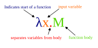
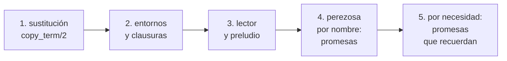

# Capítulo 57 — Proyecto: un intérprete funcional

Un programa funcional se ejecuta evaluando expresiones: aplicar una función
a sus argumentos produce un valor, y ese valor puede ser a su vez una
función, que se pasa como argumento o se devuelve como resultado. El
[capítulo 18](../capitulo-18-orden-superior/index.md) mostró ese estilo dentro de Prolog, con `maplist/3`,
`foldl/4` y las lambdas de `library(yall)`, que son predicados de orden
superior. Este capítulo sigue el camino inverso: define un **lenguaje objeto**
funcional pequeño, llamado aquí **Lam**, y escribe en Prolog el intérprete
que lo evalúa. Lam tiene números, identificadores, funciones anónimas,
aplicación, un condicional, un «sea» para nombrar un valor intermedio y
definiciones con nombre, que pueden ser recursivas. `map`, `filtrar` y los
plegados no son primitivas del intérprete: están escritos en el propio Lam.

{ style="background-color: white" }

Las partes de una abstracción del cálculo λ, `λx.M`: la función de un
argumento `x` cuyo cuerpo es `M`. Lam la escribe `fun x -> M`, y el
intérprete la representa como `lam(x, M)`. Imagen: Epachamo,
[CC BY-SA 4.0](https://creativecommons.org/licenses/by-sa/4.0/), vía
[Wikimedia Commons](https://commons.wikimedia.org/wiki/File:LambdaAbstraction.svg).

El intérprete crece en cinco versiones, una por sección. La primera evalúa
por **sustitución**: las variables de Lam son variables de Prolog y aplicar
una función es copiar su cuerpo y unificar el parámetro con el argumento. La
segunda pasa a **entornos** y **clausuras**, y la tercera agrega una
**sintaxis concreta**, leída con dos gramáticas como las del
[capítulo 21](../capitulo-21-gramaticas-dcg/index.md), y un **preludio** con las funciones de orden superior. La cuarta
y la quinta cambian la estrategia de evaluación: primero **perezosa por
nombre**, con promesas que permiten listas infinitas, después **por
necesidad**, con promesas que recuerdan su valor en una variable lógica.
Cada versión mide con inferencias lo que la anterior no podía hacer o
hacía mal. Las dos últimas secciones tratan los temas que Clocksin deja
abiertos: la composición de funciones, los plegados sin valor inicial y de
dos listas, y un verificador de tipos que infiere el tipo de una expresión
por unificación. El capítulo usa la inspección de términos del
[capítulo 32](../capitulo-32-inspeccion-de-terminos/index.md) y las ideas de los intérpretes del
[capítulo 33](../capitulo-33-introspeccion-y-metainterpretes/index.md), y cumple el anuncio del [capítulo 45](../capitulo-45-proyecto-compilador/index.md), que deja para
este capítulo el intérprete de un lenguaje funcional. Las dos primeras
versiones se ejecutan en SWISH; las demás cargan otros archivos, y corren en
una instalación local.

El proyecto parte del capítulo «Case Study: Higher-Order Functional
Programming» de *Clause and Effect* de William F. Clocksin. De ese capítulo
vienen la notación de la primera versión —un operador infijo para la
aplicación, con los argumentos en una lista—, las funciones predefinidas
escritas como llamadas al Prolog anfitrión, la evaluación sin entornos que
renombra y sustituye con `copy_term/2`, la currificación por lambdas
anidadas y los ejemplos de `map`, de los plegados y del filtrado escritos en
el lenguaje objeto. El libro señala dos límites de su evaluador: ignora las
variables libres de una lambda, y deja los entornos como el camino para
tratarlas. Este capítulo mide esos límites y sigue ese camino. Los entornos,
las clausuras, la sintaxis concreta, la evaluación perezosa y todo el código
son propios.

## Objetivos del capítulo

Al terminar el capítulo, el lector puede:

- representar las funciones de un lenguaje objeto como términos de Prolog y
  evaluarlas por sustitución con `copy_term/2`, reconociendo qué se pierde
  al usar variables de Prolog como variables del lenguaje;
- escribir un evaluador con entornos, en el que una función es una clausura
  que guarda el entorno donde se creó, y medir su costo contra el de la
  sustitución;
- currificar funciones y primitivas para aplicarlas parcialmente, y
  escribir `map` y los plegados en el lenguaje objeto;
- leer la sintaxis concreta del lenguaje con dos gramáticas, una sobre
  caracteres y otra sobre componentes léxicos;
- cambiar la estrategia de evaluación a perezosa con promesas, trabajar con
  listas infinitas, y compartir el valor de una promesa con una variable
  lógica que se liga al forzarla;
- inferir el tipo de una expresión del lenguaje objeto por unificación,
  con verificación de ocurrencia, y copiar el tipo de una definición en
  cada uso para que sea polimórfica.

!!! info "Tiempo estimado"
    Leer el capítulo, ejecutar sus ejemplos y hacer las actividades: **1:50 h**.
    Resolver los 6 ejercicios marcados con ★: **1:55 h**.
    Resolver los 14 ejercicios del final: **4:25 h**.

## 57.1 El intérprete terminado

`funcional.pl` carga las cinco versiones: la primera y, a través de la
quinta, las otras tres.

<!-- ejemplo: capitulo-57/funcional.pl fragmento: :- ensure_loaded(sustitucion). .. :- ensure_loaded(necesidad). -->
```prolog
:- ensure_loaded(sustitucion).
:- ensure_loaded(necesidad).
```

`lam/2` lee una expresión de Lam escrita como texto y la evalúa por
necesidad, con las definiciones del preludio; `lam/3` agrega definiciones
propias en un segundo texto, separadas por punto y coma:

```prolog
?- lam("map (fun x -> x * x) [1, 2, 3]", V).
V = [1, 4, 9].

?- lam("sea inc = (+) 1 en map inc [1, 2, 3]", V).
V = [2, 3, 4].

?- lam("f 10", "f n = suma (filtrar (fun x -> mod x 3 = 0) (hasta 1 n))", V).
V = 18.

?- lam("tomar 8 primos", V).
V = [2, 3, 5, 7, 11, 13, 17, 19].
```

`fun x -> x * x` es una función anónima; `(+) 1` es la suma aplicada a un
solo argumento, una función que espera el otro; `primos` es la lista
infinita de los números primos, de la que `tomar 8` calcula solo los ocho
primeros. `tabla_de_evaluacion/1` mide cuántas inferencias cuesta evaluar
cada expresión, ya leída, con tres estrategias: la estricta de la
versión 3 y las dos perezosas de las versiones 4 y 5. Un guion indica que la
evaluación pasó de 10 000 000 de inferencias. La consulta
`tabla_de_evaluacion(["suma (hasta 1 20)", "suma (hasta 1 100)", "tomar 5 (desde 1)", "nesimo 20 fibs", "tomar 6 primos"])`
escribe, y después responde `true`:

```text
expresion                               estricto      nombre   necesidad
suma (hasta 1 20)                           4489      185942        5546
suma (hasta 1 100)                         21225           -       27146
tomar 5 (desde 1)                              -        2416        1274
nesimo 20 fibs                                 -     4493192        5921
tomar 6 primos                                 -     6312279        7246
```

Con listas finitas, la evaluación estricta es la más barata; con listas
infinitas no termina, y la evaluación por necesidad es cientos de veces más
barata que por nombre. Las secciones que siguen explican cada columna.

Las cinco versiones y lo que cambia en cada una:



## 57.2 Evaluar por sustitución

La primera versión, `sustitucion.pl`, escribe las funciones directamente
como términos de Prolog. `F@[A1, A2]` es la aplicación de `F` a dos
argumentos, con `@` declarado como operador infijo. `lambda(X, Cuerpo)` es
una función anónima de un parámetro, y `X` es una variable de Prolog. Una
función con nombre es un hecho `funcion(Nombre@Parametros, Cuerpo)`; las
funciones predefinidas llaman a una operación primitiva del Prolog
anfitrión:

<!-- ejemplo: capitulo-57/sustitucion.pl fragmento: funcion(suma@[X, Y], primitiva@[suma, X, Y]). .. funcion(sumar_a_todos@[N, L], map@[lambda(X, suma@[X, N]), L]). -->
```prolog
funcion(suma@[X, Y], primitiva@[suma, X, Y]).
funcion(resta@[X, Y], primitiva@[resta, X, Y]).
funcion(producto@[X, Y], primitiva@[producto, X, Y]).
funcion(igual@[X, Y], primitiva@[igual, X, Y]).
funcion(cons@[X, Y], primitiva@[cons, X, Y]).
funcion(cabeza@[[X|_]], X).
funcion(cola@[[_|Xs]], Xs).

% Funciones del programa, escritas en el lenguaje objeto.
funcion(cuadrado@[X], producto@[X, X]).
funcion(inc, suma@[1]).
funcion(factorial@[N],
        si@[igual@[N, 0], 1, producto@[N, factorial@[resta@[N, 1]]]]).
funcion(map@[F, L],
        si@[igual@[L, []], [], [F@[cabeza@[L]] | map@[F, cola@[L]]]]).
funcion(plegar_izq@[F, A, L],
        si@[igual@[L, []], A, plegar_izq@[F, F@[A, cabeza@[L]], cola@[L]]]).
funcion(invertir@[L], plegar_izq@[lambda(A, lambda(X, [X|A])), [], L]).
funcion(sumar_a_todos@[N, L], map@[lambda(X, suma@[X, N]), L]).
```

`map` y `plegar_izq` están escritas en el lenguaje objeto, con `si@[C, A, B]`
como condicional. `inc` no tiene parámetros: es `suma` aplicada a un solo
argumento. La **currificación** hace que eso tenga sentido. Una función de
dos parámetros es una lambda cuyo cuerpo es otra lambda:
`suma@[X, Y]` se representa como `lambda(X, lambda(Y, ...))`, y aplicarla a
un argumento devuelve la lambda interior, que espera el segundo.
`suma@[1, 2]` y `suma@[1]@[2]` son la misma aplicación hecha de una vez o de
a un argumento. El evaluador es `valor/2`:

<!-- ejemplo: capitulo-57/sustitucion.pl predicado: valor/2 valor_aplicacion/4 aplicar_lambdas/3 -->
```prolog
%!  valor(+Expresion, -Valor) is semidet.
%
%   Valor es el resultado de evaluar Expresion. La evaluación es estricta:
%   los argumentos se evalúan antes de aplicar la función. G*F, la
%   composición, es la función que aplica F y después G.
valor(E, V) :-
    var(E),
    !,
    V = E.
valor(primitiva@[Op, X, Y], V) :-
    !,
    valor(X, X1),
    valor(Y, Y1),
    calcular(Op, X1, Y1, V).
valor(si@[C, A, B], V) :-
    !,
    valor(C, C1),
    elegir(C1, A, B, E),
    valor(E, V).
valor(G*F, V) :-
    !,
    valor(lambda(X, G@[F@[X]]), V).
valor(F@Args, V) :-
    !,
    valor(F, Fv),
    valor_aplicacion(Fv, F, Args, V).
valor([X|Xs], [V|Vs]) :-
    !,
    valor(X, V),
    valor(Xs, Vs).
valor(F, V) :-
    atom(F),
    funcion(F, Cuerpo),
    !,
    valor(Cuerpo, V).
valor(F, V) :-
    atom(F),
    funcion(F@Parametros, Cuerpo),
    !,
    anidar_lambdas(Parametros, Cuerpo, V).
valor(E, E).

%!  valor_aplicacion(+Fv, +F, +Args:list, -V) is det.
%
%   V es el valor de F@Args, con Fv el valor de F. Si Fv es una lambda, se
%   aplica a los argumentos de a uno; si no, F es un constructor.
valor_aplicacion(lambda(X, Cuerpo), _, Args, V) :-
    !,
    aplicar_lambdas(Args, lambda(X, Cuerpo), V).
valor_aplicacion(_, F, Args, F@Vs) :-
    valor(Args, Vs).

%!  aplicar_lambdas(+Args:list, +Funcion, -V) is det.
%
%   V es el valor de aplicar Funcion al primer argumento, el resultado al
%   segundo, y así hasta agotar Args.
aplicar_lambdas([], V, V).
aplicar_lambdas([A|As], lambda(X, Cuerpo), V) :-
    valor(A, Av),
    copy_term(lambda(X, Cuerpo), lambda(Av, Cuerpo1)),
    valor(Cuerpo1, F),
    aplicar_lambdas(As, F, V).
```

La cláusula que hace el trabajo es la de `aplicar_lambdas/3`.
`copy_term/2` copia la lambda con variables nuevas, y unificar el parámetro
de la copia con el valor del argumento reemplaza el parámetro por ese valor
en todo el cuerpo: renombrar y sustituir en un solo paso. Después se evalúa
el cuerpo que resulta. Un átomo con un hecho `funcion/2` se evalúa a su
lambda; uno sin definición es un **constructor**, que queda como está, con
sus argumentos evaluados. La cláusula de `G*F`, la composición de funciones, es
de la [sección 57.8](#578-composicion-y-plegados-sin-valor-inicial). Es el mismo principio del intérprete vainilla de
la [sección 33.2](../capitulo-33-introspeccion-y-metainterpretes/index.md#332-el-interprete-vainilla): el evaluador **absorbe** la ligadura de
variables en la unificación de Prolog
([Patrón 45](../patrones.md#45-interprete-que-absorbe)), y no necesita representarla.

```prolog
?- valor(map@[cuadrado, [1, 2, 3]], V).
V = [1, 4, 9].

?- valor(suma@[1]@[2], V).
V = 3.

?- valor(plegar_izq@[producto, 1, [1, 2, 3, 4, 5]], V).
V = 120.

?- valor(map@[par, [1, 2]], V).
V = [par@[1], par@[2]].
```

!!! question "Actividad"
    Predecir qué responden estas dos consultas, y después comprobarlo:
    `valor(lambda(Y, par@[Y, Z])@[1], R), Z = 5.` con `sustitucion.pl`
    cargado, y `call([Y, P]>>(P = par(Y, Z)), 1, R), Z = 5.` con
    `library(yall)`. ¿Por qué el `5` no llega a `R` en ninguna de las dos?
    ¿Qué agregaría la forma `{Z}/[Y, P]>>...` de la
    [sección 18.5](../capitulo-18-orden-superior/index.md#185-lambdas-con-yall), y por qué `valor/2` no tiene nada equivalente?

La respuesta de la primera es `R = par@[1, _]`: la copia de la lambda
renombra también `Z`, que en el cuerpo es una **variable libre**, y la
variable de la consulta queda desconectada de su copia. Es la misma causa
que la del error más frecuente con las lambdas de `yall`, y es el límite
que el propio Clocksin señala. Hay dos límites más, que salen de lo mismo:
los valores se sustituyen dentro de expresiones, y una expresión se vuelve a
evaluar. Un dato que coincide con el nombre de una función se evalúa como
función:

```prolog
?- valor(map@[lambda(X, [X]), [inc]], V).
V = [[lambda(_A, primitiva@[suma, 1, _A])]].
```

El átomo `inc` era un dato, pero en la versión 1 todo argumento es una
expresión: evaluar la lista `[inc]` evalúa cada elemento, y `inc` tiene un
hecho `funcion/2`, así que se convierte en su lambda. La
representación es la «defaulty» de la
[sección 32.6](../capitulo-32-inspeccion-de-terminos/index.md#326-representaciones-limpias): la clase de un término, dato o expresión, depende de
si hay un hecho `funcion/2` con su nombre. El tercer límite es el costo.
Cada aplicación copia el cuerpo con los valores ya sustituidos, y cada
evaluación del cuerpo recorre de nuevo esos valores. Una función que
recorre una lista de $n$ elementos hace $n$ aplicaciones, y cada una copia
y vuelve a recorrer lo que queda de la lista: el costo crece con $n^2$. La
[sección 57.3](#573-entornos-y-clausuras) lo mide.

## 57.3 Entornos y clausuras

La segunda versión, `entornos.pl`, separa las expresiones de los valores.
Una expresión es un término cerrado, sin variables de Prolog, en una
representación limpia: cada clase de expresión tiene su functor, como en
la sintaxis abstracta de la [sección 45.2](../capitulo-45-proyecto-compilador/index.md#452-el-lenguaje-y-su-sintaxis-abstracta).

| Expresión | Significado |
|---|---|
| `num(N)` | el número `N` |
| `id(X)` | el identificador `X`, un átomo |
| `lam(X, E)` | la función de parámetro `X` y cuerpo `E` |
| `ap(F, A)` | la aplicación de `F` a un argumento `A` |
| `si(C, A, B)` | el condicional |
| `sea(X, E1, E2)` | `E2`, con `X` ligado al valor de `E1` |

Solo hay aplicación a un argumento: una función de dos parámetros se
escribe `lam(x, lam(y, E))`, y se aplica con `ap(ap(F, A), B)`. Un valor es
un número, `verdadero` o `falso`, una lista de Prolog de valores, una
**clausura** o una primitiva. El **entorno** es una lista de pares
`Nombre-Valor`, y un programa es una lista de definiciones
`def(Nombre, Expresion)`:

<!-- ejemplo: capitulo-57/entornos.pl predicado: evaluar/4 aplicar/4 -->
```prolog
%!  evaluar(+Expresion, +Entorno:list, +Programa:list, -Valor) is det.
%
%   Valor es el resultado de evaluar Expresion, con los identificadores
%   libres de Expresion ligados en Entorno o definidos en Programa. La
%   evaluación es estricta: el argumento se evalúa antes de aplicar la
%   función.
evaluar(num(N), _, _, N).
evaluar(id(X), Ent, Prog, V) :-
    buscar(X, Ent, Prog, V).
evaluar(lam(X, Cuerpo), Ent, _, clausura(X, Cuerpo, Ent)).
evaluar(ap(F, A), Ent, Prog, V) :-
    evaluar(F, Ent, Prog, Fv),
    evaluar(A, Ent, Prog, Av),
    aplicar(Fv, Av, Prog, V).
evaluar(si(C, A, B), Ent, Prog, V) :-
    evaluar(C, Ent, Prog, Cv),
    rama(Cv, A, B, E),
    evaluar(E, Ent, Prog, V).
evaluar(sea(X, E1, E2), Ent, Prog, V) :-
    evaluar(E1, Ent, Prog, V1),
    evaluar(E2, [X-V1|Ent], Prog, V).

%!  aplicar(+Funcion, +Argumento, +Programa:list, -V) is det.
%
%   V es el resultado de aplicar el valor Funcion al valor Argumento. Una
%   clausura evalúa su cuerpo en su propio entorno, extendido con el
%   parámetro; una primitiva acumula el argumento hasta tenerlos todos.
aplicar(clausura(X, Cuerpo, Ent), A, Prog, V) :-
    !,
    evaluar(Cuerpo, [X-A|Ent], Prog, V).
aplicar(prim(Op, N, Recibidos), A, _, V) :-
    !,
    (   N =:= 1
    ->  reverse([A|Recibidos], Args),
        calcular(Op, Args, V)
    ;   N1 is N - 1,
        V = prim(Op, N1, [A|Recibidos])
    ).
aplicar(F, _, _, _) :-
    type_error(funcion, F).
```

Evaluar una lambda no ejecuta nada: produce `clausura(X, Cuerpo, Ent)`, la
lambda junto con el entorno en el que se evaluó. Aplicar una clausura
evalúa su cuerpo en **ese** entorno, extendido con el parámetro. Así una
función recuerda los valores de las variables libres de su cuerpo, que eran
los que se perdían en la versión 1:

```prolog
?- evaluar(lam(x, ap(ap(id(+), id(x)), id(n))), [n-10], [], V).
V = clausura(x, ap(ap(id(+), id(x)), id(n)), [n-10]).
```

La clausura hace automáticamente lo que las llaves `{N}/` de `yall` piden
declarar: guardar las variables que la función comparte con el lugar donde
se escribió. Las primitivas también están currificadas:
`prim(Op, Faltan, Recibidos)` acumula argumentos hasta tenerlos todos, y
recién entonces `calcular/3` hace la operación.

```prolog
?- evaluar(ap(id(+), num(1)), [], [], V).
V = prim(+, 1, [1]).
```

`buscar/4` busca un identificador primero en el entorno, con
`memberchk/2`, que encuentra el primer par y así respeta el ocultamiento;
después entre las definiciones del programa; y por último entre las
primitivas y las constantes, como `nil`. Una definición se evalúa en el
entorno vacío cada vez que se nombra, lo que alcanza para que una función
se llame a sí misma o a otra definición, en cualquier orden.

`programa_ejemplo/1` escribe las funciones de `sustitucion.pl` en esta
sintaxis, y `ejemplo/3` evalúa una expresión con ese programa. Ahora un dato
del entorno no se vuelve a evaluar: el `inc` de la lista sigue siendo un
átomo.

```prolog
?- ejemplo(ap(ap(id(map), lam(x, ap(ap(id(cons), id(x)), id(nil)))), id(l)), [l-[inc]], V).
V = [[inc]].
```

`tabla_de_sustitucion/1`, de `funcional.pl`, invierte la lista de 1 a $n$
con la versión 1 y con la versión 2, con `plegar_izq` en los dos casos, y
cuenta las inferencias. La consulta
`tabla_de_sustitucion([100, 200, 400, 800])` escribe:

```text
n        sustitucion    entornos
100            78557       13111
200           297057       25869
400          1154057       51669
800          4548057      103269
```

Cada vez que la lista se duplica, la sustitución cuesta cuatro veces más y
el entorno, dos veces más: crecimiento cuadrático contra lineal. Con 800
elementos, la diferencia es de 44 veces. El entorno no copia nada: agregar
un par al principio de una lista cuesta lo mismo para cualquier valor, y un
valor ligado en el entorno nunca vuelve a evaluarse.

## 57.4 Una sintaxis concreta y un preludio

La versión 2 es correcta pero incómoda: `map` escrita en sintaxis abstracta
ocupa siete líneas de `ap` e `id`. La tercera versión, `lector.pl`, lee
programas escritos como texto y los traduce a esa sintaxis, con las dos
etapas del [capítulo 45](../capitulo-45-proyecto-compilador/index.md): `lexico/2` convierte los caracteres en componentes
léxicos (`num(N)`, `id(X)`, las palabras reservadas y los símbolos), y una
segunda gramática convierte los componentes en una expresión. La
aplicación se escribe por yuxtaposición, `f x y`, asocia a la izquierda y
liga más que los operadores; `fun x y -> e` es una función anónima de dos
parámetros, anidada en dos `lam`; y `(+)` es el operador como función. Las
formas que empiezan con una palabra reservada, `fun`, `si` y `sea`, son
cláusulas de `expresion//1`; la aplicación es una secuencia de átomos, que
se anidan de izquierda a derecha con un acumulador:

<!-- ejemplo: capitulo-57/lector.pl predicado: aplicacion//1 resto_aplicacion//2 -->
```prolog
%!  aplicacion(-E)// is semidet.
%
%   Uno o más átomos seguidos: la función y sus argumentos, de a uno.
aplicacion(E) -->
    atomo(F),
    resto_aplicacion(F, E).

%!  resto_aplicacion(+F, -E)// is det.
%
%   E es F aplicada, de a uno, a los átomos que siguen.
resto_aplicacion(F, E) -->
    atomo(A),
    !,
    resto_aplicacion(ap(F, A), E).
resto_aplicacion(E, E) -->
    [].
```

El resto de la gramática sigue la forma de la
[sección 21.7](../capitulo-21-gramaticas-dcg/index.md#217-recursion-a-izquierda): cada nivel de precedencia (las comparaciones, las
sumas, los productos) es un no terminal con un acumulador que asocia a la
izquierda. Una lista `[a, b]` se traduce a una cadena de `cons` que termina
en `nil`, y una definición `f x y = e` a `def(f, lam(x, lam(y, e)))`.

```prolog
?- leer_expresion("f x y + 1", E).
E = ap(ap(id(+), ap(ap(id(f), id(x)), id(y))), num(1)).
```

!!! question "Actividad"
    Predecir la sintaxis abstracta de `fun x -> x + 1 2` y el resultado de
    `ejecutar("(fun x -> x + 1 2) 5", V).`, y después comprobarlos. ¿En qué
    etapa aparece el error, y por qué no la detecta el lector?

Con la sintaxis concreta, las funciones de orden superior se escriben en Lam
en una línea cada una. El **preludio** es la lista de definiciones que
`ejecutar/2` agrega a todo programa; en las cadenas largas, `\c` al final
de una línea las continúa en la siguiente:

<!-- ejemplo: capitulo-57/lector.pl predicado: preludio/1 -->
```prolog
% preludio(Texto): una definición del preludio. Un \c al final de una
% línea continúa la cadena en la siguiente, sin el salto ni los blancos
% del principio.
preludio("map f l = si vacia l entonces [] \c
          sino cons (f (cabeza l)) (map f (cola l))").
preludio("filtrar p l = si vacia l entonces [] \c
          sino si p (cabeza l) \c
          entonces cons (cabeza l) (filtrar p (cola l)) \c
          sino filtrar p (cola l)").
preludio("plegar_izq f a l = si vacia l entonces a \c
          sino plegar_izq f (f a (cabeza l)) (cola l)").
preludio("plegar_der f a l = si vacia l entonces a \c
          sino f (cabeza l) (plegar_der f a (cola l))").
preludio("componer f g x = f (g x)").
preludio("suma = plegar_izq (+) 0").
preludio("longitud = plegar_izq (fun n x -> n + 1) 0").
preludio("invertir = plegar_izq (fun a x -> cons x a) []").
preludio("hasta a b = si a > b entonces [] sino cons a (hasta (a + 1) b)").
preludio("desde n = cons n (desde (n + 1))").
preludio("tomar n l = si n = 0 entonces [] \c
          sino cons (cabeza l) (tomar (n - 1) (cola l))").
preludio("nesimo n l = si n = 0 entonces cabeza l \c
          sino nesimo (n - 1) (cola l)").
preludio("zipcon f a b = cons (f (cabeza a) (cabeza b)) \c
          (zipcon f (cola a) (cola b))").
preludio("fibs = cons 0 (cons 1 (zipcon (+) fibs (cola fibs)))").
preludio("criba l = sea p = cabeza l en \c
          cons p (criba (filtrar (fun x -> mod x p > 0) (cola l)))").
preludio("primos = criba (desde 2)").
```

`suma`, `longitud` e `invertir` no nombran la lista: son `plegar_izq`
aplicada a dos de sus tres argumentos, y el tercero llega cuando se aplican.
Los plegados de Lam reciben primero el acumulador y después el elemento,
`f a x`; `foldl/4` de la [sección 18.3](../capitulo-18-orden-superior/index.md#183-foldl46) llama a su meta con el elemento
primero, `call(G, X, A0, A)`, porque en Prolog el resultado es un argumento
más y no un valor devuelto.

```prolog
?- ejecutar("suma (hasta 1 100)", V).
V = 5050.

?- ejecutar("componer (map ((*) 2)) (filtrar (fun x -> x > 2)) [1, 2, 3, 4]", V).
V = [6, 8].
```

El preludio define también `desde`, la lista infinita de los números desde
`n`, y `fibs` y `primos`. En esta versión no sirven. La evaluación es
**estricta**: el argumento se evalúa antes de aplicar la función, y evaluar
`desde 1` exige evaluar `desde 2` antes de construir la lista, y así sin
fin. `call_with_inference_limit/3` corta la evaluación:

```prolog
?- call_with_inference_limit(ejecutar("tomar 3 (desde 1)", V), 1000000, R).
R = inference_limit_exceeded.
```

## 57.5 Evaluación perezosa por nombre

La cuarta versión, `perezoso.pl`, no evalúa el argumento de una aplicación
antes de la llamada: lo guarda como una **promesa**, la expresión junto con
su entorno, y lo evalúa recién cuando alguien necesita su valor. El entorno
liga cada nombre a una promesa, y buscar un nombre es **forzar** su
promesa. `cons` no fuerza ninguno de sus argumentos: una lista es `[]` o
`[P|Q]`, con `P` y `Q` promesas. La cabeza y la cola se calculan cuando
`cabeza`, `cola` o `vacia` las piden. La distinción entre evaluar el
argumento antes de la llamada (por valor) y pasarlo sin evaluar (por
nombre) es la de los dos evaluadores del capítulo «Writing interpreters for
the λ-calculus» de *ML for the Working Programmer* de Lawrence Paulson, uno
de los libros que Clocksin recomienda; su capítulo «Functions and infinite
data» representa una lista infinita con una cola que es una función por
evaluar, el mismo papel que aquí cumple la promesa:

<!-- ejemplo: capitulo-57/perezoso.pl predicado: valor_perezoso/4 -->
```prolog
%!  valor_perezoso(+E, +Entorno:list, +Ctx, -V) is det.
%
%   V es el valor de la expresión E, con los identificadores ligados a
%   promesas en Entorno o en las globales de Ctx. El argumento de una
%   aplicación y el valor de un «sea» quedan como promesas.
valor_perezoso(num(N), _, _, N).
valor_perezoso(id(X), Ent, Ctx, V) :-
    buscar_perezoso(X, Ent, Ctx, V).
valor_perezoso(lam(X, Cuerpo), Ent, _, clausura(X, Cuerpo, Ent)).
valor_perezoso(ap(F, A), Ent, Ctx, V) :-
    valor_perezoso(F, Ent, Ctx, Fv),
    Ctx = contexto(Modo, _),
    prometer(Modo, A, Ent, P),
    aplicar_perezoso(Fv, P, Ctx, V).
valor_perezoso(si(C, A, B), Ent, Ctx, V) :-
    valor_perezoso(C, Ent, Ctx, Cv),
    rama(Cv, A, B, E),
    valor_perezoso(E, Ent, Ctx, V).
valor_perezoso(sea(X, E1, E2), Ent, Ctx, V) :-
    Ctx = contexto(Modo, _),
    prometer(Modo, E1, Ent, P),
    valor_perezoso(E2, [X-P|Ent], Ctx, V).
```

<!-- ejemplo: capitulo-57/perezoso.pl fragmento: calcular_perezoso(cons, [P, Q], _, V) :- .. forzar(Q, Ctx, V). -->
```prolog
calcular_perezoso(cons, [P, Q], _, V) :-
    !,
    V = [P|Q].
calcular_perezoso(cabeza, [P], Ctx, V) :-
    !,
    forzar(P, Ctx, L),
    no_vacia(L, Q, _),
    forzar(Q, Ctx, V).
```

La clase de promesa es un parámetro, `Modo`, del contexto: la estructura
del evaluador es una sola, y la conducta de las promesas la deciden
`prometer/4` y `forzar/3`, como en el
[Patrón 60](../patrones.md#60-interprete-con-conducta-como-parametro). Los dos se declaran `multifile`, así que otro archivo
puede agregar una clase de promesa sin tocar este. La de esta versión se
evalúa cada vez que se fuerza:

<!-- ejemplo: capitulo-57/perezoso.pl predicado: prometer/4 forzar/3 -->
```prolog
%!  prometer(+Modo, +E, +Entorno:list, -Promesa) is det.
%
%   Promesa guarda la expresión E con su Entorno, sin evaluarla.
prometer(nombre, E, Ent, promesa(E, Ent)).

%!  forzar(+Promesa, +Ctx, -V) is det.
%
%   V es el valor de Promesa. Una promesa por nombre se evalúa cada vez que
%   se fuerza.
forzar(promesa(E, Ent), Ctx, V) :-
    valor_perezoso(E, Ent, Ctx, V).
```

Las definiciones del programa también son promesas, una por nombre,
creadas una sola vez en `contexto/3`. `ejecutar_perezoso/4` fuerza además
todos los elementos del resultado, con `forzar_todo/3`, para escribirlo
como una lista de Prolog. Lo que en la versión 3 no terminaba, ahora
termina, y un argumento que no se usa no se evalúa nunca, aunque su
evaluación produzca un error:

```prolog
?- ejecutar_perezoso(nombre, "tomar 5 (desde 1)", "", V).
V = [1, 2, 3, 4, 5].

?- ejecutar_perezoso(nombre, "tomar 8 fibs", "", V).
V = [0, 1, 1, 2, 3, 5, 8, 13].

?- ejecutar_perezoso(nombre, "cabeza [1, cabeza []]", "", V).
V = 1.
```

`fibs` se define en términos de sí misma: la lista empieza con 0 y 1, y
sigue con la suma, elemento a elemento, de `fibs` y de su cola. La
recursión tampoco necesita definiciones con nombre. Un **punto fijo** escrito
en Lam, `y g = (fun x -> g (x x)) (fun x -> g (x x))`, convierte una función
que recibe «la llamada recursiva» como argumento en la función recursiva:

```prolog
?- ejecutar_perezoso(nombre, "y f 5", "y g = (fun x -> g (x x)) (fun x -> g (x x)); f fact n = si n = 0 entonces 1 sino n * fact (n - 1)", V).
V = 120.
```

Con evaluación estricta, `y f` no termina: `x x` se evalúa antes de
llamar a `g`, y esa evaluación vuelve a necesitar `x x`. El
[ejercicio 7](#ejercicios) escribe un punto fijo que sirve en la versión 3.

El límite de esta versión está en la tabla de la
[sección 57.1](#571-el-interprete-terminado): `nesimo 20 fibs` cuesta más de 4 millones de inferencias.
Una promesa por nombre no recuerda su valor. Cada elemento de `fibs` es la
suma de los dos anteriores, y cada uno de esos es una promesa que, al
forzarse, vuelve a calcular los suyos desde el principio: el costo crece
como los propios números de Fibonacci. La misma repetición afecta a las
listas finitas: en `suma (hasta 1 100)`, el acumulador y cada cola son
promesas que se vuelven a evaluar enteras cada vez que se piden.

## 57.6 Evaluación por necesidad

La quinta versión, `necesidad.pl`, agrega una segunda clase de promesa.
`memo(E, Ent, Valor)` tiene un tercer argumento que es una variable libre
hasta que la promesa se fuerza por primera vez; `forzar/3` la liga entonces
al valor, y las veces siguientes la encuentra instanciada:

<!-- ejemplo: capitulo-57/necesidad.pl predicado: prometer/4 forzar/3 -->
```prolog
% prometer/4, declarada en perezoso.pl: la promesa por necesidad.
prometer(necesidad, E, Ent, memo(E, Ent, _)).

% forzar/3, declarada en perezoso.pl: la primera vez que se fuerza una
% promesa por necesidad se evalúa y se liga su tercer argumento; las demás
% veces se usa ese valor.
forzar(memo(E, Ent, Valor), Ctx, V) :-
    (   nonvar(Valor)
    ->  V = Valor
    ;   valor_perezoso(E, Ent, Ctx, V),
        Valor = V
    ).
```

No hace falta ninguna tabla aparte. La promesa es un término, y todos los
lugares que la guardan —el entorno de cada clausura, la cola de una lista,
la definición global de `fibs`— comparten la misma variable: ligarla en uno
la liga en todos. Es la técnica de las estructuras incompletas del
[capítulo 34](../capitulo-34-estructuras-incompletas-y-listas-diferencia/index.md), un término con un hueco que la unificación completa más
tarde, usada como memoria de un cálculo. Como el evaluador es
determinista, ninguna vuelta atrás deshace esas ligaduras mientras dura la
consulta.

```prolog
?- ejecutar_perezoso(necesidad, "nesimo 50 fibs", "", V).
V = 12586269025.

?- ejecutar_perezoso(necesidad, "tomar 3 unos", "unos = cons 1 unos", V).
V = [1, 1, 1].
```

`unos` es una lista cíclica: su cola es la propia promesa de `unos`, que ya
tiene su valor. Por nombre, en cambio, cada `cola` vuelve a evaluar la
definición.

!!! question "Actividad"
    `fibs` por nombre calcula `nesimo 20 fibs` con 4 493 192 inferencias, y
    por necesidad con 5 921. Predecir cómo cambian las dos cifras con
    `nesimo 10 fibs` y con `nesimo 40 fibs`, y comprobarlo con
    `inferencias/3` de `funcional.pl`. ¿Qué cifra no se puede obtener, y por
    qué?

## 57.7 La medición

La tabla de la [sección 57.1](#571-el-interprete-terminado) resume las tres estrategias. Con una lista
finita, la evaluación estricta es la más barata: `suma (hasta 1 100)` cuesta
21 225 inferencias, y por necesidad 27 146, un 28 % más, que es el precio de
crear cada promesa y de preguntar si ya tiene valor. Por nombre, la misma
suma no termina dentro del límite, y con 20 elementos ya cuesta 34 veces
más que por necesidad. Con listas infinitas la evaluación estricta no
termina, y la diferencia entre las dos perezosas es de 760 veces en
`nesimo 20 fibs` y de 870 en `tomar 6 primos`.

La comparación con Prolog tiene el mismo sentido. La suma de los cuadrados
de los pares de 1 a 100 cuesta 39 423 inferencias en Lam, con evaluación
estricta, y 2 715 con `include/3`, `maplist/3` y `foldl/4`, las dos medidas en
una segunda llamada ([ejercicio 8](#ejercicios)). Un intérprete paga en cada paso el trabajo de decidir qué
clase de expresión tiene delante y de buscar cada nombre en una lista; la
[sección 45.7](../capitulo-45-proyecto-compilador/index.md#457-el-interprete-especializado) redujo ese precio a la novena parte, en un lenguaje
imperativo, especializando el intérprete.

## 57.8 Composición y plegados sin valor inicial

Clocksin cierra su capítulo con temas que su evaluador no trata y ejercicios
que los proponen. El primero es la **composición**: en lugar de escribir
`g@[f@[X]]`, definir `h` como `g*f`, la función que aplica `f` y después
`g`. En la versión 1 alcanza una cláusula de `valor/2`, la de `G*F` en la
[sección 57.2](#572-evaluar-por-sustitucion): la composición se evalúa a
una lambda, `lambda(X, G@[F@[X]])`, y desde ahí es una función como
cualquier otra, que se aplica, se copia y se pasa como argumento:

<!-- ejemplo: capitulo-57/sustitucion.pl fragmento: funcion(cuadrado_del_siguiente, cuadrado*inc). .. funcion(cuadrados_de_siguientes, map@[cuadrado*inc]). -->
```prolog
funcion(cuadrado_del_siguiente, cuadrado*inc).
funcion(cuadrados_de_siguientes, map@[cuadrado*inc]).
```

```prolog
?- valor(cuadrado_del_siguiente@[4], V).
V = 25.

?- valor(cuadrados_de_siguientes@[[1, 2, 3]], V).
V = [4, 9, 16].
```

En Lam la composición no necesita el evaluador: `componer f g x = f (g x)`
es una definición del preludio, y `componer f g`, una aplicación parcial.
La diferencia está en el lenguaje: la notación de la versión 1 no tiene
lambdas con nombre de parámetro ni definiciones con parámetros que puedan
quedar sin aplicar, y por eso el operador `*` tiene que ser parte del
evaluador.

El segundo tema son los plegados. El `fold` de Clocksin pliega una lista no
vacía sin valor inicial; su primer ejercicio pregunta qué elemento inicia
el acumulador, y la respuesta es el último: el plegado avanza desde la
derecha y, cuando queda un solo elemento, lo devuelve. `plegar1_der` es ese
plegado en Lam, y `maximo`, su aplicación con `mayor`. El segundo ejercicio
pide `fold2r`, un plegado de dos listas a la vez, para escribir el producto
interno de dos vectores:

<!-- ejemplo: capitulo-57/plegados.pl predicado: plegados/1 -->
```prolog
% plegados(Texto): las definiciones nuevas, en el lenguaje objeto.
plegados("plegar1_der f l = si vacia (cola l) entonces cabeza l \c
            sino f (cabeza l) (plegar1_der f (cola l)); \c
          mayor a b = si a > b entonces a sino b; \c
          maximo = plegar1_der mayor; \c
          plegar2_der f a xs ys = si vacia xs entonces a \c
            sino f (cabeza xs) (cabeza ys) \c
            (plegar2_der f a (cola xs) (cola ys)); \c
          producto_interno = plegar2_der (fun x y a -> x * y + a) 0").
```

```prolog
?- lam_plegados("maximo [3, 1, 4, 1, 5, 9, 2, 6]", V).
V = 9.

?- lam_plegados("plegar1_der (-) [10, 4, 1]", V).
V = 7.

?- lam_plegados("producto_interno [1, 2, 3] [4, 5, 6]", V).
V = 32.
```

`plegar1_der (-) [10, 4, 1]` calcula `10 - (4 - 1)`. El `plegar1` del
[ejercicio 5](#ejercicios) pliega desde la izquierda, con el primer
elemento como acumulador, y da `(10 - 4) - 1`, que es 5: con una operación
que no es asociativa, la dirección del plegado cambia el resultado. Con una
lista vacía, `plegar1_der` produce el error de `cabeza []`.

## 57.9 Tipos simples

El tercer tema que Clocksin deja abierto son los **tipos**. Lam no los
tiene: `1 + verdadero` se lee sin problemas y produce un error recién al
evaluar la suma. Un **verificador de tipos** decide antes de evaluar si una
expresión puede producir ese error. `tipos.pl` infiere el tipo de cada
expresión de la versión 2 con cuatro clases de tipos: `entero`, `booleano`,
`lista(T)` y `fn(A, B)`, la función de `A` en `B`. Un tipo todavía
desconocido es una variable de Prolog, y la inferencia es unificación:
aplicar una función de tipo `fn(A, B)` a un argumento exige que el tipo del
argumento unifique con `A`, y el tipo del resultado es `B`:

<!-- ejemplo: capitulo-57/tipos.pl predicado: tipo/4 -->
```prolog
%!  tipo(+E, +Locales:list, +Globales:list, ?T) is semidet.
%
%   T es el tipo de la expresión E, con los identificadores ligados en
%   Locales, un tipo por nombre, o en Globales, cuyos tipos se copian en
%   cada uso. Falla si E no tiene tipo.
tipo(num(_), _, _, T) :-
    unificar(T, entero).
tipo(id(X), Loc, Glob, T) :-
    tipo_de_nombre(X, Loc, Glob, T0),
    unificar(T, T0).
tipo(lam(X, Cuerpo), Loc, Glob, T) :-
    tipo(Cuerpo, [X-A|Loc], Glob, B),
    unificar(T, fn(A, B)).
tipo(ap(F, A), Loc, Glob, T) :-
    tipo(F, Loc, Glob, TF),
    tipo(A, Loc, Glob, TA),
    unificar(TF, fn(TA, T)).
tipo(si(C, A, B), Loc, Glob, T) :-
    tipo(C, Loc, Glob, booleano),
    tipo(A, Loc, Glob, T),
    tipo(B, Loc, Glob, T).
tipo(sea(X, E1, E2), Loc, Glob, T) :-
    tipo(E1, Loc, Glob, T1),
    tipo(E2, [X-T1|Loc], Glob, T).
```

`unificar/2` usa `unify_with_occurs_check/2`: la unificación de Prolog no
verifica si una variable aparece dentro del término al que se liga, y sin
esa verificación el tipo de `fun x -> x x`, cuyo parámetro tendría que ser
una función que se recibe a sí misma, sería un término infinito. Las
primitivas y las constantes tienen su tipo en una tabla, `tipo_predefinido/2`:
`cons` es `fn(A, fn(lista(A), lista(A)))`, para cualquier `A`.

**Las definiciones.** Las definiciones del programa se tipan en orden, y
cada una ve el tipo de las anteriores. Dentro de su propio cuerpo, una
definición tiene un solo tipo, el que se está infiriendo; una vez tipada,
cada uso **copia** su tipo con variables nuevas, con `copy_term/2`, como la
versión 1 copia una lambda. Así `map` se aplica en una misma expresión a
listas de números y a listas de listas:

<!-- ejemplo: capitulo-57/tipos.pl predicado: tipo_de_nombre/4 -->
```prolog
%!  tipo_de_nombre(+X:atom, +Locales:list, +Globales:list, -T) is semidet.
%
%   T es el tipo de X: el de Locales tal cual, o una copia del de Globales
%   o del de la primitiva o la constante. Falla si X no tiene tipo.
tipo_de_nombre(X, Loc, Glob, T) :-
    (   memberchk(X-T0, Loc)
    ->  T = T0
    ;   memberchk(X-T0, Glob)
    ->  copy_term(T0, T)
    ;   tipo_predefinido(X, T0)
    ->  copy_term(T0, T)
    ).
```

`mostrar_tipo/2` escribe el tipo con flechas y con letras en lugar de
variables:

```prolog
?- tipo_de("map", T).
T = "(a -> b) -> [a] -> [b]".

?- tipo_de("map (map (fun x -> x + 1)) [[1], [2, 3]]", T).
T = "[[entero]]".

?- tipo_de("fun f g x -> f (g x)", T).
T = "(a -> b) -> (c -> a) -> c -> b".

?- tipo_de("fun x -> x x", T).
false.

?- tipo_de("si 1 entonces 2 sino 3", T).
false.

?- tipo_de("cabeza []", T).
T = "a".
```

Las dieciséis definiciones del preludio tienen tipo. El último ejemplo
muestra el límite de estos tipos: `cabeza []` tiene tipo, porque una lista
vacía es una lista como cualquier otra, y el error de tomar su cabeza sigue
apareciendo al evaluar. Un «sea» tampoco copia su tipo: en `sea id = fun x
-> x en …`, `id` tiene un solo tipo, y no puede aplicarse a un número y a un
booleano en la misma expresión. Copiar también ahí, generalizando solo las
variables que no aparecen en el entorno, es el sistema de tipos de ML,
que el [ejercicio 14](#ejercicios) propone.

!!! success "Criterios de calidad"
    | Criterio | En este capítulo |
    |---|---|
    | C1 | cada predicado declara modos y determinación; `valor/2` es `semidet` porque un parámetro escrito como patrón, el de `cabeza`, falla si el argumento no unifica |
    | C2 | desde la versión 2, la sintaxis abstracta es una representación limpia, con un functor por clase de expresión; la versión 1 es «defaulty» a propósito, y la [sección 57.2](#572-evaluar-por-sustitucion) muestra lo que cuesta |
    | C4 | los evaluadores indexan por el primer argumento, la expresión, y no dejan alternativas pendientes; `aplicar_lambdas/3` recibe los argumentos primero por la misma razón |
    | C5 | un identificador sin definición produce un error de existencia; aplicar algo que no es una función, un condicional que no es booleano y `cabeza` de la lista vacía producen errores de tipo; el lector produce errores de sintaxis |
    | C6 | todos los evaluadores son puros; la única ligadura que sobrevive a un paso es la de la memoria de las promesas por necesidad, que es una unificación y no un efecto; solo las tablas de `funcional.pl` escriben |
    | C7 | 117 pruebas en ocho archivos, y 28 más en las soluciones, con las cifras de la sustitución y de las dos evaluaciones perezosas comparadas por su orden y no por su valor exacto |

## Ejercicios

Las soluciones están en [la página de soluciones](soluciones.md). La dificultad
va de 1 (se resuelve consultando el capítulo) a 3 (requiere elaboración propia).
Los marcados con ★ son los que no conviene saltear: cubren lo que el capítulo
tiene de propio, y los capítulos siguientes los dan por hechos.

1. ★ **(1)** Predecir qué responden, con evaluación estricta (`ejecutar/2`)
   y por necesidad (`lam/2`), las expresiones `(fun x -> 3) (cabeza [])`,
   `longitud [cabeza [], 2]`, `tomar 1 [1, cabeza []]` y
   `tomar 2 [1, cabeza []]`, y comprobarlo. ¿Por qué la última produce un
   error también por necesidad?
2. **(1)** En la versión 1, `valor(map@[lambda(X, [X]), [inc]], V)`
   devuelve una lambda dentro de la lista. Explicar paso a paso qué
   cláusula de `valor/2` convierte el dato `inc` en una función, y qué
   pasaría con un dato `par` y con un dato `cuadrado`.
3. **(1)** Escribir en Lam `iterar f x`, la lista infinita
   `x, f x, f (f x), …`, y calcular con ella las ocho primeras potencias
   de 2. ¿Qué hace la misma consulta con evaluación estricta?
4. ★ **(2)** Escribir en Lam `map2` y `filtrar2`, con el mismo resultado
   que `map` y `filtrar` del preludio, como aplicaciones parciales de
   `plegar_der`, sin nombrar la lista. Comprobarlas con `hasta 1 10` y
   explicar por qué, por necesidad, también funcionan sobre `desde 1`,
   aunque `plegar_der` recorra la lista hasta el final.
5. **(2)** Escribir en Lam, sin nombrar la lista: `plegar1 f l`, que
   pliega desde la izquierda con el primer elemento como acumulador;
   `maximo`, el mayor elemento de una lista no vacía; `pares`, que deja
   los números pares; y `cuantos p`, la cantidad de elementos que cumplen
   `p`. ¿Qué valor devuelve `lam("suma", V)`, y qué guarda su entorno?
6. ★ **(2)** Definir en Lam `cond c a b = si c entonces a sino b` y con
   ella `fact n = cond (n = 0) 1 (n * fact (n - 1))`. Predecir qué pasa al
   evaluar `fact 5` en forma estricta y por necesidad, y comprobarlo. ¿Por
   qué `si` es una forma especial del evaluador y no una primitiva más?
7. ★ **(2)** El punto fijo `y` de la
   [sección 57.5](#575-evaluacion-perezosa-por-nombre) no termina con evaluación estricta. Escribir
   en Lam un punto fijo `z` que funcione con `ejecutar/3`, demorando la
   autoaplicación `x x` dentro de una función, y calcular con él el
   factorial de 10 sin que `f` se llame a sí misma por su nombre.
8. **(2)** Escribir en Prolog `suma_cuadrados_pares(N, S)`, la suma de los
   cuadrados de los números pares de 1 a `N`, con `include/3`, `maplist/3`,
   `foldl/4` y lambdas de `yall`. Comparar sus inferencias con las de la
   expresión de Lam equivalente, medida con `inferencias/3`, y explicar la
   diferencia.
9. **(2)** Predecir el valor de
   `evaluar(ap(lam(n, lam(x, ap(ap(id(+), id(x)), id(n)))), num(10)), [], [], V)`
   en la versión 2, y el de `valor(lambda(N, lambda(X, suma@[X, N]))@[10], V)`
   en la versión 1. ¿Dónde queda el 10 en cada caso? ¿Cuál de las dos
   representaciones se puede escribir, comparar con `==` y volver a leer
   sin perder nada?
10. ★ **(3)** La sintaxis abstracta se amplía con `searec(F, E1, E2)`, un
    «sea» en el que `E1` puede nombrar a `F`. Escribir `desazucar(E, D)`,
    que reemplaza en cualquier lugar de `E` cada `searec(F, E1, E2)` por
    un `sea` que liga `F` al punto fijo `z` del ejercicio 7, recorriendo el
    término con `compound_name_arguments/3` como en la
    [sección 32.4](../capitulo-32-inspeccion-de-terminos/index.md#324-recorrer-cualquier-termino), y `evaluar_con_rec(E, V)`, que lo evalúa con la
    versión 2. Escribir también su encabezado PlDoc, con modos y
    determinación.
11. **(3)** Agregar, en otro archivo y sin modificar `perezoso.pl`, dos
    modos de promesa, `contado_nombre` y `contado_necesidad`, que se
    comportan como `nombre` y `necesidad` pero cuentan con `flag/3` cada
    evaluación de una promesa. ¿Cuántas promesas se evalúan en
    `nesimo 10 fibs` y en `nesimo 15 fibs` con cada modo?
12. **(2)** Medir con `contar/2` de `funcional.pl` las inferencias de
    `map` con `inc` sobre las listas de 1 a 100, 200 y 400, en la versión 1
    (`valor/2`) y en la versión 2 (`ejemplo/3`). Explicar por qué la
    versión 1 es cuadrática aunque `map` no tenga acumulador.
13. ★ **(2)** Predecir el tipo de `plegar1_der`, `plegar2_der`, `maximo` y
    `maximo []`, con las definiciones de `plegados/1`, y comprobarlo con
    `tipo_de/3` de `tipos.pl`. ¿Por qué el tipo de `plegar1_der` tiene una
    sola variable donde el de `plegar_der` tiene dos? ¿Qué ocurre al
    evaluar `maximo []`, y por qué el verificador de tipos no lo anticipa?
14. **(3)** Escribir `tipo_ml/4`, una variante de `tipo/4` en la que el
    nombre de un «sea» tiene un tipo polimórfico: cada uso copia su tipo
    con variables nuevas, salvo las variables que aparecen en los tipos de
    los parámetros de las lambdas que lo rodean, que siguen compartidas.
    Comprobar que `sea id = fun x -> x en si id verdadero entonces id 1
    sino 2` tiene tipo `entero` y que
    `fun f -> sea g = f en si g verdadero entonces g 1 sino 2` sigue sin
    tipo, y explicar por qué la segunda no debe tenerlo.

## Resumen

| | |
|---|---|
| **lenguaje objeto** | el lenguaje que el intérprete evalúa, Lam, representado con términos de Prolog |
| **sustitución** | aplicar una función reemplazando el parámetro por el valor en el cuerpo; con `copy_term/2` y unificación, en un paso |
| **currificación** | una función de varios parámetros como lambdas anidadas de uno; permite la aplicación parcial, `(+) 1` |
| **entorno** | la lista de pares `Nombre-Valor` con que se evalúa una expresión |
| **clausura** | una lambda junto con el entorno donde se evaluó; recuerda sus variables libres |
| **evaluación estricta** | el argumento se evalúa antes de la llamada |
| **promesa** | una expresión con su entorno, sin evaluar; se evalúa al forzarla |
| **por nombre** | la promesa se evalúa cada vez que se fuerza |
| **por necesidad** | la promesa se evalúa una vez; su valor queda en una variable que se liga al forzarla |
| **punto fijo** | una función que convierte una definición no recursiva en la recursiva; `y` necesita evaluación perezosa, `z` sirve también en la estricta |
| `valor/2`, `funcion/2`, `aplicar_lambdas/3` | la versión 1, por sustitución, con `@` |
| `evaluar/4`, `aplicar/4`, `buscar/4`, `calcular/3` | la versión 2, con entornos, clausuras y primitivas currificadas |
| `lexico/2`, `expresion//1`, `preludio/1`, `ejecutar/2,3` | la versión 3: la sintaxis concreta y `map`, `filtrar` y los plegados en Lam |
| `valor_perezoso/4`, `prometer/4`, `forzar/3` | la versión 4: promesas por nombre y listas infinitas |
| `memo/3` en `forzar/3` | la versión 5: promesas por necesidad |
| `lam/2,3`, `inferencias/3`, `tabla_de_evaluacion/1` | el intérprete terminado y sus mediciones |
| **composición** | `g*f`, la función que aplica `f` y después `g`; en la versión 1, una cláusula de `valor/2` que la convierte en una lambda |
| **plegado sin valor inicial** | `plegar1_der`: el último elemento inicia el acumulador; la lista no puede ser vacía |
| `plegados/1`, `lam_plegados/2` | `plegar1_der`, `maximo`, `plegar2_der` y `producto_interno` en Lam |
| **tipo** | `entero`, `booleano`, `lista(T)` o `fn(A, B)`; una variable de Prolog es un tipo todavía desconocido |
| **inferencia de tipos** | unificar los tipos de las partes de una expresión; con `unify_with_occurs_check/2`, sin tipos infinitos |
| `tipo/4`, `tipo_de/2,3`, `tipos_del_programa/2`, `mostrar_tipo/2` | el verificador de tipos, con las definiciones polimórficas por copia |

## Temas que se retoman

| Tema | Se retoma en |
|---|---|
| Ejecutar un programa sobre valores simbólicos en lugar de datos, que Clocksin llama interpretación abstracta; este capítulo evalúa solo valores concretos | [capítulo 58](../capitulo-58-proyecto-interpretacion-abstracta/index.md) |
| Un intérprete guiado por la forma de los datos, con condiciones y acciones en lugar de expresiones | [capítulo 60](../capitulo-60-proyecto-interprete-dirigido-patrones/index.md) |
| Una máquina que ejecuta programas con una pila explícita, un paso más abajo que un evaluador recursivo | [capítulo 61](../capitulo-61-proyecto-maquina-prolog/index.md) |

## Referencias

- William F. Clocksin, *Clause and Effect: Prolog Programming for the
  Working Programmer*, Springer, 1997 — el capítulo «Case Study:
  Higher-Order Functional Programming»; el libro no tiene edición legal en
  línea. El capítulo toma la notación de la versión 1
  (el operador `@` con los argumentos en una lista, las definiciones como
  hechos, las funciones predefinidas que llaman a Prolog), la evaluación
  sin entornos que renombra y sustituye con `copy_term/2`, la
  currificación por lambdas anidadas, los ejemplos de `map`, de los
  plegados y del filtrado en el lenguaje objeto, y la observación de que
  ese evaluador ignora las variables libres, que los entornos resuelven.
  De sus temas finales y sus ejercicios vienen las propuestas de la
  [sección 57.8](#578-composicion-y-plegados-sin-valor-inicial) y de la
  [sección 57.9](#579-tipos-simples): el operador de composición, el plegado
  sin valor inicial, el plegado de dos listas para el producto interno y
  la verificación de tipos.
- Lawrence C. Paulson, *ML for the Working Programmer*, 2.ª edición,
  Cambridge University Press, 1996 — los capítulos «Functions and infinite
  data» y «Writing interpreters for the λ-calculus».
  [Edición en línea del autor](https://www.cl.cam.ac.uk/~lp15/MLbook/pub-details.html).
  Clocksin lo recomienda en sus notas bibliográficas. El capítulo toma de él
  la currificación y los funcionales `map`, `filter`, `foldl` y `foldr`
  (apartados 5.2 y 5.7–5.10), la lista infinita cuya cola se calcula
  cuando se la pide (apartado 5.12) y la comparación entre la evaluación
  por valor y por nombre de un intérprete del cálculo λ (apartado 9.12).
- Robin Milner, «A theory of type polymorphism in programming», *Journal
  of Computer and System Sciences* 17(3), 1978, págs. 348–375,
  [doi:10.1016/0022-0000(78)90014-4](https://doi.org/10.1016/0022-0000%2878%2990014-4)
  (archivo abierto de la revista). El artículo del sistema de tipos de ML:
  la [sección 57.9](#579-tipos-simples) toma de él la inferencia de tipos
  por unificación y el tipo polimórfico de las definiciones, y el
  [ejercicio 14](#ejercicios), la generalización de los nombres de un
  «sea».
- SWI-Prolog, *Manual de referencia*, las secciones
  [«library(yall): Lambda expressions»](https://www.swi-prolog.org/pldoc/man?section=yall) y
  [«library(apply): Apply predicates on a list»](https://www.swi-prolog.org/pldoc/man?section=apply).
  El capítulo compara la copia de las lambdas de `yall` con la sustitución
  de la versión 1, y los plegados de Lam con `foldl/4`.

El código del capítulo es propio, escrito para el curso: la versión 1
reescribe la idea de Clocksin con otro reparto de cláusulas, y los
entornos, las clausuras, las primitivas currificadas, el lector, el
preludio, las dos evaluaciones perezosas, las mediciones y el verificador
de tipos no están en el capítulo de Clocksin; de Paulson y de Milner se
toman ideas, no código.
